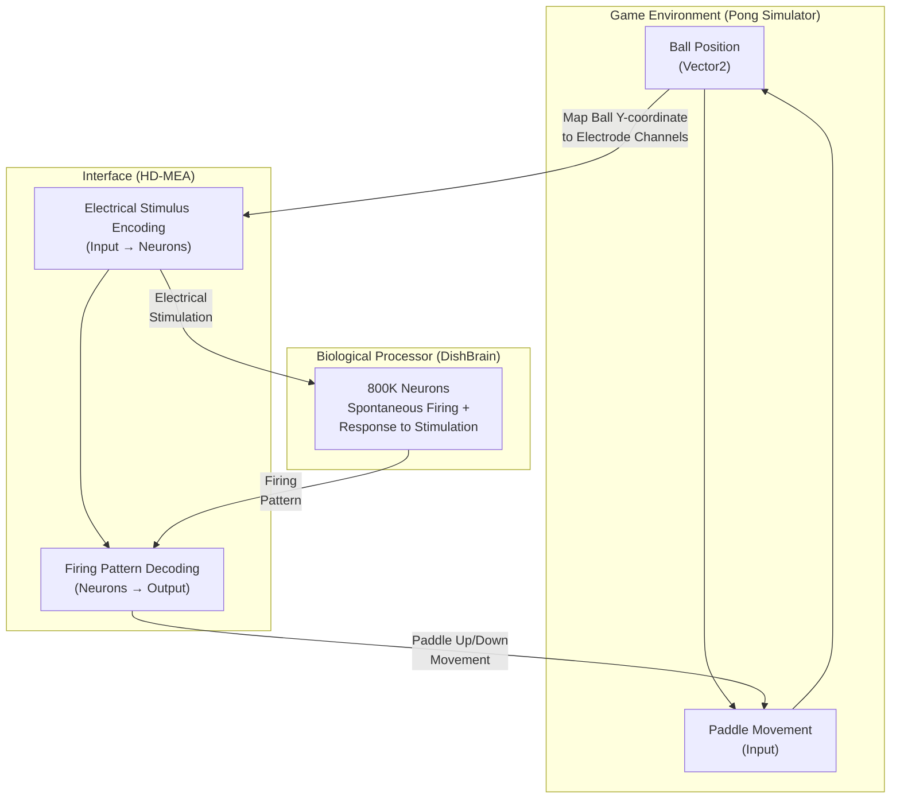
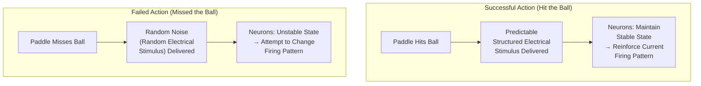
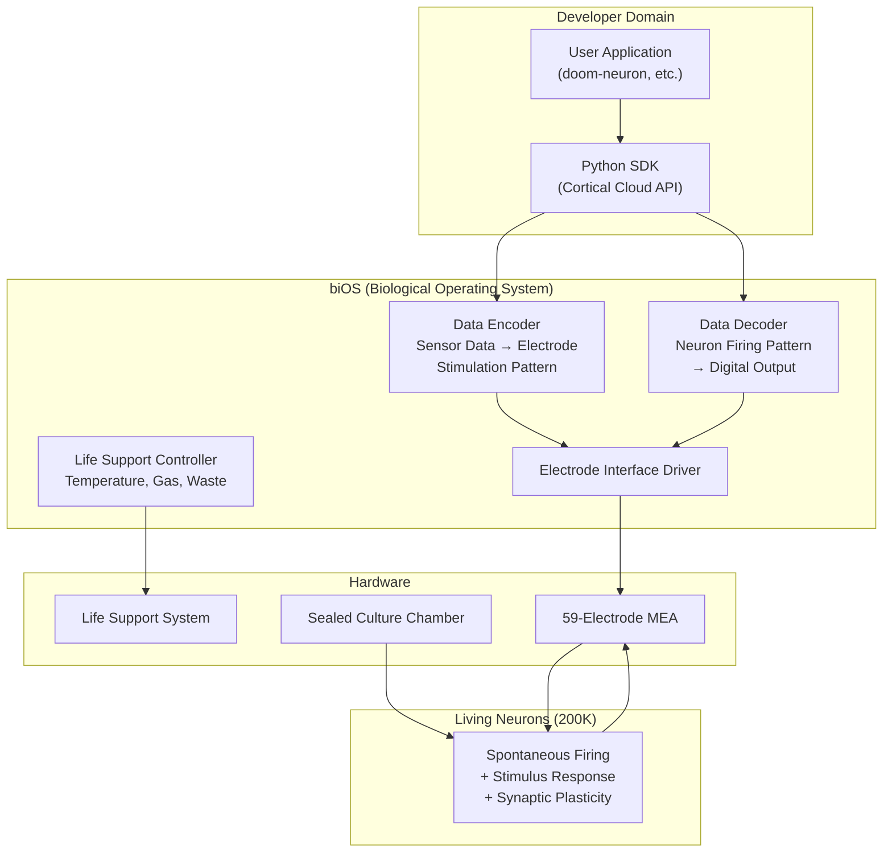
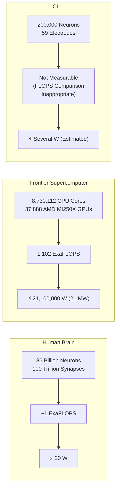
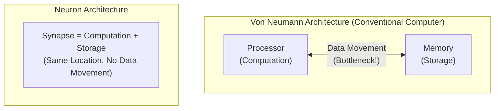
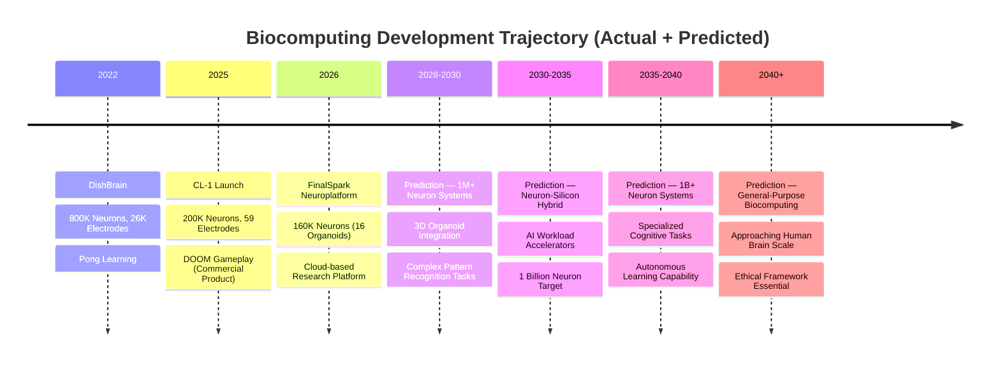
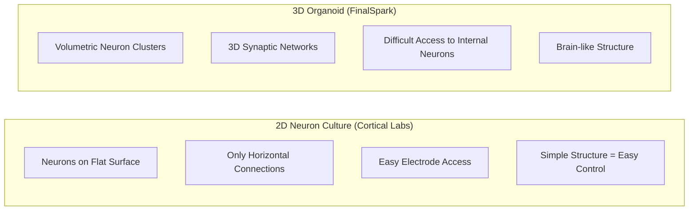
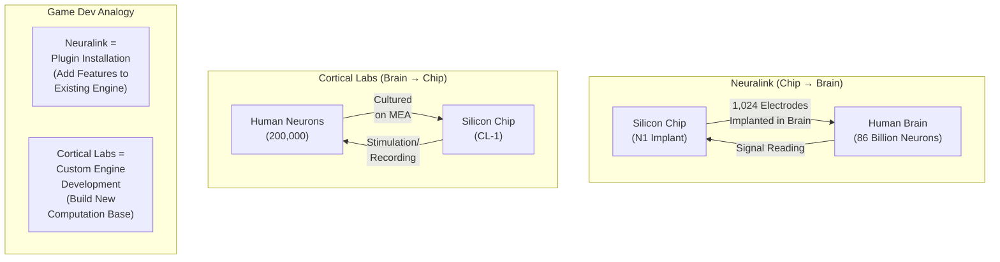
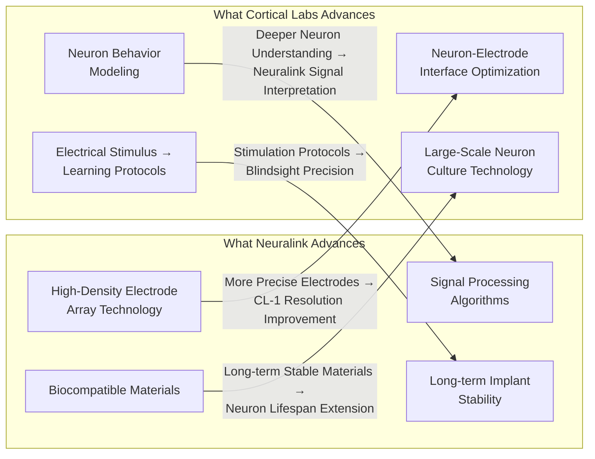
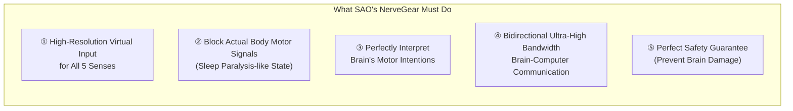

## Introduction

In February 2026, Australian startup Cortical Labs released a shocking demonstration video. **200,000 living human neurons** on a chip were directly playing the legendary 1993 FPS game **DOOM**. This wasn't simply "running" the game — the neurons received visual information, learned on their own, and controlled the character.

For game developers, this news raises questions on multiple levels. How do neurons technically generate game inputs? How does performance compare to current GPU-based computing? What's the relationship with Neuralink's BCI (Brain-Computer Interface) technology? And could SAO (Sword Art Online)-style full dive VR become possible with this technology?

This document starts with precise analysis of the original paper, then systematically analyzes hardware specifications, performance comparisons, competing technologies, Neuralink connections, brain-in-a-vat scenarios, and full dive VR possibilities — all from **a game developer's perspective**.

---

## Part 1: Original Sources and Paper Analysis

Tracing this news to its origins leads to one core paper and a commercial product derived from it. Let's first organize the original sources, then interpret the paper's key mechanisms using concepts familiar to game developers.

### 1. Original Sources

The core of the [AI Times article](https://www.aitimes.com/news/articleView.html?idxno=207422) is Cortical Labs' **CL-1 system**. Related original sources are as follows:

| Source | Type | Content |
|--------|------|---------|
| [Cortical Labs Official Site](https://corticallabs.com/) | Company | Company overview and technical vision |
| [CL-1 Product Page](https://corticallabs.com/cl1) | Product | Technical specifications and pricing |
| [Cortical Cloud](https://corticallabs.com/cloud) | Platform | Remote neuron access API |
| [Cortical Labs Research](https://corticallabs.com/research) | Academic | Paper list and research overview |
| [doom-neuron (GitHub)](https://github.com/SeanCole02/doom-neuron) | Open Source | DOOM gameplay code (GPL-3.0) |
| [Cortical Labs GitHub](https://github.com/cortical-labs) | Open Source | Official repositories |

---

### 2. Core Paper: DishBrain (Neuron, 2022)

This is the academic foundation of everything.

> **"In vitro neurons learn and exhibit sentience when embodied in a simulated game-world"**
> - Authors: Brett J. Kagan, Andy C. Kitchen, Nhi T. Tran, Forough Habibollahi, Moein Khajehnejad, Bradyn J. Parker, Anjali Bhat, Ben Rober, Adeel Razi, **Karl J. Friston** et al.
> - Journal: *Neuron*, Volume 110, Issue 23, pp. 3952-3969 (December 2022)
> - DOI: [10.1016/j.neuron.2022.09.001](https://doi.org/10.1016/j.neuron.2022.09.001)
> - [PubMed](https://pubmed.ncbi.nlm.nih.gov/36228614/) \| [Cell Press Full Text](https://www.cell.com/neuron/fulltext/S0896-6273(22)00806-6) \| [PMC Full Text](https://pmc.ncbi.nlm.nih.gov/articles/PMC9747182/)


_DishBrain Paper Graphical Abstract. Source: Kagan et al., Neuron (2022) — [PMC](https://pmc.ncbi.nlm.nih.gov/articles/PMC9747182/)_

**Karl J. Friston** stands out in the author list. A neuroscience professor at University College London (UCL), he is the creator of the **Free Energy Principle**, the core learning principle of this paper. His participation as co-author itself guarantees the theoretical rigor of the paper.

---

### 2-1. Experimental Design

Let's decompose the paper's experimental design into a structure familiar to game developers.


_Figure 1: Overview of the DishBrain system and experimental protocol. Shows the structure of how the neuron culture connects to the Pong environment through the MEA. Source: Kagan et al., Neuron (2022)_

**Hardware Configuration:**
- Human iPSC (induced pluripotent stem cell)-derived neurons and mouse embryonic cortical neurons used
- Cultured on **High-Density Multi-Electrode Array (HD-MEA)** — 512 to 26,000 electrodes arranged in grid formation
- The cultured neuron assembly was named **DishBrain**
- Approximately 800,000 neurons used

**Software Connection:**
- Built a simulation environment of the classic Atari game **Pong**
- Ball position information from the game screen was converted to electrical stimulation patterns and delivered to neurons through electrodes
- Neuron firing patterns were detected and converted to paddle movement commands in the game

For Unity developers, this structure can be compared as follows:




_Figure 2: High-density interconnected networks formed by cortical cells. Immunofluorescence microscopy images of mouse cortical neurons (top) and human iPSC-derived neurons (bottom). Green indicates neuron markers, red indicates glial cells. Source: Kagan et al., Neuron (2022)_

The key is the **closed-loop** structure. Game state → neuron stimulation → neuron response → game input → game state change → neuron stimulation again. It's the same structure as Unity's `Update()` loop. The difference is that the entity processing the logic isn't a C# script but **living neurons**.

---

### 2-2. Learning Mechanism: Free Energy Principle (FEP)

This is the most innovative part of the paper. To understand the neurons' learning principle, let's first compare it with reinforcement learning in games.

**Traditional Reinforcement Learning (RL):**
```
Action → Result → Reward/Penalty Score → Learn to Maximize Score
```

This paradigm, widely used in game AI, requires an **explicit reward function**. Like calling `AddReward(1.0f)` in Unity ML-Agents. You can't directly define such a reward function for neurons — because neurons aren't code.

**Free Energy Principle (FEP)-Based Learning:**
```
Neurons try to minimize the "unpredictability" of stimuli they receive
→ Predictable stimuli = Stable state (reward)
→ Unpredictable stimuli = Unstable state (penalty)
```


_Figure 4: DishBrain hardware setup, software data flow, electrode layout (sensory/motor region division), and performance improvement trend over 3 pilot test iterations. Source: Kagan et al., Neuron (2022)_

In the DishBrain experiment, this principle was applied as follows:



Explained through game development analogies:

| FEP Concept | Game Analogy |
|-------------|-------------|
| Predictable stimulus (reward) | `Input.GetAxis()` — Consistent input stream |
| Random noise (penalty) | `Random.Range(-1f, 1f)` fed as input every frame |
| Neurons' learning goal | Reduce input noise and reach a predictable state |
| Free energy | System's "confusion level" — Similar concept to entropy |

**Key Point**: Unlike traditional RL that imposes an **external goal** of "increase the score", FEP leverages neurons' **intrinsic property** — the instinct to avoid unpredictable stimuli. No separate reward function design is needed.


_Figure 5: Learning performance shown by neurons in the Pong environment. (A) Mouse cortical neurons and (B) human iPSC neurons showed statistically significant increases in average rally length over time. Learning was observed only under closed-loop feedback conditions compared to controls (no-stimulus/open-loop). Source: Kagan et al., Neuron (2022)_

**Experimental Results:**
- Learning signs observed in real-time gameplay **within 5 minutes**
- Statistically significant performance improvement compared to random control conditions
- Human neurons learned faster than mouse neurons
- No learning observed under open-loop conditions without closed-loop feedback → **Closed-loop structure is essential**

> **💬 Hold on, Let's Get This Straight**
>
> **Q. Did the neurons really "learn"? Wasn't it just a reflex response?**
>
> The paper answers this question with considerable rigor. The key evidence is the **performance improvement curve over time**. The neurons' Pong scores (rally length) increased with statistical significance as sessions progressed. If it were simple reflex, there should be no improvement over time. Additionally, the control experiment result that **learning disappears when closed-loop feedback is removed** is the core evidence.
>
> **Q. Does "sentience" in the paper title mean consciousness?**
>
> **No.** In this context, sentience is used in the narrow sense of **"the ability to respond to and adapt to the environment"**, not "consciousness" or "self-awareness." The paper itself clearly makes this distinction. Nevertheless, this term choice received considerable criticism in academia, and became the cause of media exaggeration reporting "neurons have consciousness." This is a case demonstrating the importance of science communication.
>
> **Q. Why Pong of all games?**
>
> Pong satisfies the conditions of **1-dimensional input (ball's Y-coordinate), 1-dimensional output (paddle up/down), and immediate feedback (success/failure)** as the simplest possible game environment. It's the same principle as starting with the simplest scene when testing a new system in game development. The evolution to DOOM in 2026 signifies a massive expansion of input dimensions and action space.

---


_Figure 6: Importance of closed-loop feedback. Rally length increased only under the condition with structured feedback (stimulus). Learning was not observed under no-stimulus (silent) and open-loop (no-feedback) conditions — this proves that closed-loop structure is an essential condition for learning. Source: Kagan et al., Neuron (2022)_

## Part 2: CL-1 System Technical Analysis

The DishBrain of 2022 was a laboratory prototype. Three years later in 2025, Cortical Labs evolved it into a **commercial product**. CL-1 is the world's first code-deployable biocomputer.

### 3. Hardware Specifications


_CL-1: The world's first commercial biocomputer. A sealed chamber integrates life support systems, neuron culture, and electrode array. Price $35,000. Source: [Cortical Labs](https://corticallabs.com/cl1)_

| Item | Specification | Reference |
|------|--------------|-----------|
| **Neuron Count** | ~200,000 (human iPSC-derived) | DishBrain: ~800,000 |
| **Electrode Count** | 59 (planar metal-glass array) | DishBrain HD-MEA: up to 26,000 |
| **Latency** | Sub-millisecond (sub-ms) | DishBrain: millisecond range |
| **Neuron Lifespan** | Up to 6 months (ideal conditions) | — |
| **Life Support** | Sealed chamber, automated gas composition/temperature/waste management | — |
| **OS** | biOS (biological operating system) | — |
| **External Computer** | Not required (all-in-one) | — |
| **Price** | $35,000 (rack configuration: $20,000/unit) | — |
| **Shipments** | 115 commercial systems since 2025 | — |

One notable point is that the **electrode count actually decreased**. While DishBrain's HD-MEA used up to 26,000 electrodes, CL-1 uses 59. This is the result of prioritizing **cost, stability, and maintainability** in the transition from research equipment to commercial product. In Unity terms, it's like placing thousands of debug objects in the editor but keeping only the essentials in the release build.

**Electrode Density Calculation:**
```
200,000 neurons ÷ 59 electrodes = ~3,390 neurons per electrode
```

This is an extremely coarse interface. Since one electrode measures the collective activity of thousands of neurons, individual neuron-level control is impossible. In game terms, it's similar to downsampling a 1920×1080 resolution screen to 32×32 pixels — you can grasp the rough outline but details are lost.

---

### 3-1. Software Architecture: biOS

CL-1's software stack has a structure familiar to game developers.



Mapping this structure to Unity's architecture:

| CL-1 Component | Unity Equivalent | Role |
|----------------|-----------------|------|
| Python SDK | UnityEditor API | Interface where developers write logic |
| biOS Encoder/Decoder | Input System + Renderer | Input/output conversion |
| Electrode Array | GPU Shader Units | Hardware contact point where actual computation occurs |
| Living Neurons | ??? (No equivalent) | **This is the key difference** |
| Life Support System | Cooling System, Power Supply | Hardware maintenance |

The last row is important. In conventional computing, the "entity that performs computation" is a deterministic silicon transistor. It guarantees the same output for the same input, every time. But neurons are **non-deterministic**. They show slightly different firing patterns even to identical stimuli. This isn't a bug — it's the core characteristic that serves as the **foundation for learning and adaptation**.

---

### 3-2. DOOM Gameplay: Actual Performance Evaluation

Independent developer Sean Cole implemented DOOM gameplay using the Cortical Cloud API **within one week**. The code is published on [GitHub](https://github.com/SeanCole02/doom-neuron) under GPL-3.0 license.

**DOOM vs Pong — Complexity Comparison:**

| Element | Pong (2022) | DOOM (2026) |
|---------|------------|-------------|
| **Input Dimension** | 1D (ball's Y-coordinate) | 2D (visual frame) |
| **Output Actions** | 2 (up/down) | 4+ (forward/back/turn left/turn right/shoot) |
| **Environment** | Static 2D | Dynamic 3D (enemies, items, walls) |
| **Time Pressure** | Low | High (enemy attacks) |
| **Neuron Count** | 800,000 | 200,000 |
| **Electrode Count** | Up to 26,000 | 59 |

The interesting point is that both neuron count and electrode count **decreased** yet it plays a more complex game. This is thanks to **software interface (biOS) advancement** and **encoding/decoding algorithm improvements** rather than hardware advancement.

**Realistic Performance Evaluation:**

| Criterion | Assessment | Details |
|-----------|-----------|---------|
| vs. Random Actions | **Clearly superior** | Learning evidence confirmed |
| vs. Average Human | **Below** | Movement uncertain and choppy |
| Strategic Play | **Not possible** | Remains at basic reaction level |
| Learning Speed | **~1 week** | Basic gameplay learning |

Expecting human-level gameplay from 200,000 neurons is unreasonable. The human brain has **86 billion** neurons.

```
200,000 / 86,000,000,000 = 0.00000232...
```

**The current CL-1's neuron count is only 0.00023% of the human brain.** In Unity terms, it's like the lowest LOD (Level of Detail) level — representing a distant character with 6 triangles.

> **💬 Hold on, Let's Get This Straight**
>
> **Q. If you increase the neuron count, does performance improve proportionally?**
>
> **It doesn't simply scale proportionally.** The value of neurons lies not in the neuron count itself but in the **density and structure of synaptic connections**. The human brain's 86 billion neurons are connected by approximately **100 trillion (10¹⁴) synapses**. That's an average of ~7,000 synapses per neuron. CL-1's 2D culture environment makes it difficult to reproduce such three-dimensional connection structures. It's similar to how simply increasing parameter count in LLMs doesn't proportionally improve performance — architecture, training data, and post-processing all matter.
>
> **Q. What happens when neurons die?**
>
> The lifespan of neuron cultures is currently **up to 6 months**. When neurons die, a new culture must be started. This is one of the most dramatic differences from conventional computing. **Just as you replace an SSD when it fails, you must start a new culture when neurons die.** However, the "learning" results of neurons don't transfer to new cultures — it's like being unable to load previous session weights. This is one of the most important technical challenges going forward.

---

## Part 3: Biological Neurons vs Silicon — Performance Comparison

This section is the most critical. Performance numbers are a daily concern for game developers. Just as we compared GPU VRAM and bandwidth in the LLM guide, here we **quantitatively compare biological neurons and silicon performance**.

### 4. Energy Efficiency: A Million-Fold Difference

This is the most fundamental reason biocomputing attracts attention.

**Spike (Firing) Unit Energy Comparison:**

| Processor Type | Energy/Spike | vs. Human Brain |
|---------------|-------------|-----------------|
| **Biological Neuron** | ~10⁻¹¹ J/spike | Baseline (1x) |
| **Neuromorphic Chip** (Intel Loihi) | ~10⁻⁸ J/spike | ~1,000x less efficient |
| **Digital GPU** (NVIDIA) | ~10⁻³ ~ 10⁻⁷ J/spike | ~10,000 to 100,000,000x less efficient |

To feel the impact of these numbers, let's compare at the **system level**:



| Metric | Human Brain | Frontier (2022) | Ratio |
|--------|------------|-----------------|-------|
| **Computing Power** | ~1 ExaFLOPS (estimated) | 1.102 ExaFLOPS | ~1:1 |
| **Power Consumption** | 20 W | 21,100,000 W (21 MW) | **1 : 1,055,000** |
| **Weight** | ~1.4 kg | ~Thousands of tons | — |
| **Volume** | ~1,200 cm³ | One large building | — |
| **Energy Efficiency** | 50 PetaFLOPS/W | 0.052 PetaFLOPS/W | **~960,000x** |

> The human brain performs ExaFLOPS-level computation with **20 watts** — enough power to barely light a dim bulb. The Frontier supercomputer with equivalent performance consumes **21 megawatts** — the power of a small city.

This is exactly why biocomputing researchers are committed to this field. An approximately **million-fold** gap exists in energy efficiency. In the current situation where power consumption for AI model training and inference is skyrocketing, this gap represents an enormous opportunity.

---

### 4-1. Limitations of FLOPS Comparison: Why Direct Comparison Is Difficult

The "human brain ~1 ExaFLOPS" figure in the table above is an **estimate**, showing large variance from 10-20 PetaFLOPS to 1 ExaFLOPS depending on the researcher. There's a fundamental reason for this uncertainty.

**FLOPS (Floating Point Operations Per Second)** is a performance metric for silicon processors. Neurons don't perform floating-point operations. What neurons do is:

1. **Electrochemical signal propagation**: Potential changes through ion channels
2. **Synaptic plasticity**: Dynamic changes in connection strength
3. **Nonlinear integration**: Complex summation of thousands of inputs

Converting this to FLOPS is like measuring game engine performance solely by "shader instructions per second" — it only shows one aspect. The real strength of neurons is that **computation and memory exist in the same place**.




_Figure 7: Comparison of neurons' electrophysiological activity during gameplay vs. rest. During gameplay, connectivity between sensory-motor regions strengthens, information entropy changes, and functional plasticity is observed. This data is direct evidence that neuronal "learning" occurred. Source: Kagan et al., Neuron (2022)_

The biggest bottleneck in conventional computers — the **Von Neumann bottleneck**, the data movement between CPU and memory — doesn't exist in neurons. Because the synapse itself is both the computational unit and the memory.

Recall from the LLM guide that VRAM bandwidth was explained as the key bottleneck for inference speed:

```
System RAM (DDR5):             ~50-90 GB/s
NVIDIA VRAM (HBM3e):           ~3,350 GB/s
Biological Neuron:              No bottleneck (in-situ computation)
```

This is precisely why neurons' energy efficiency is extremely high. **Because data doesn't need to be moved.**

> **💬 Hold on, Let's Get This Straight**
>
> **Q. What are neuromorphic chips (Intel Loihi, IBM TrueNorth)? Are they different from biological neurons?**
>
> **Completely different.** Neuromorphic chips are hardware that **mimics neuron behavior with silicon transistors**. They don't use biological neurons. They simulate neuron spiking patterns at the hardware level. Intel's Hala Point system claims to be 50x faster and 100x more energy efficient than conventional CPUs/GPUs. But compared to actual biological neurons, it's still over 1,000x less efficient.
>
> **Q. Then aren't biological neurons overwhelmingly better? Why do we still use silicon?**
>
> Because of **determinism and scaling**. Silicon guarantees the same output for the same input, always. Biological neurons don't. Also, silicon chips can integrate billions of transistors with nanometer-scale processes, but culturing biological neurons at the same density is currently impossible. Just as game servers must be deterministic, most computing workloads require determinism. Biocomputing will excel in areas where determinism is less important — like pattern recognition and adaptive learning.

---

### 5. Future Performance Predictions: What If Biocomputing Advances?

Let's compare with LLM's development trajectory. LLMs scaled up approximately **15,000x** in 5 years from GPT-1 (2018, 117M parameters) to GPT-4 (2023, ~1.8T parameters estimated). Could a similar trajectory be possible in biocomputing?



**Realistic Limitations and Technical Challenges:**

| Challenge | Current Status | Difficulty | Game Dev Analogy |
|-----------|---------------|------------|-----------------|
| **Scaling** | 200K → 86B = 430,000x | Extremely High | Prototype → AAA Title |
| **Lifespan** | Up to 6 months | High | Live Service Stability |
| **Precision** | 59 electrodes/200K neurons | High | Resolution 32×32 → 4K |
| **Reproducibility** | Non-deterministic | Medium | Cannot Fix Random Seed |
| **3D Structure** | 2D culture → 3D organoid | High | 2D Game → 3D Game |
| **Learning Transfer** | Impossible (no transfer between cultures) | Very High | Roguelike With No Save Files |

**Performance Predictions in Optimistic Scenario:**

| Timeframe | Neuron Count | Electrode Density | Expected Capability | Energy Efficiency Advantage |
|-----------|-------------|-------------------|--------------------|-----------------------------|
| 2026 (Current) | 200K | 59 | Simple game reactions | Proof of concept stage |
| 2030 | 5M | 1,000+ | Pattern recognition assistance | 100x vs GPU for specific workloads |
| 2035 | 100M | 10,000+ | Specialized AI workload acceleration | Data center energy savings |
| 2040 | 1B+ | 100,000+ | General learning systems | Potential paradigm shift |

---

## Part 4: Competitors — FinalSpark and Organoid Intelligence

Cortical Labs isn't the only player in this field. Just as Unreal and Unity compete and advance in the game industry, different approaches compete in biocomputing.

### 6. FinalSpark (Switzerland) — Cloud-Based Brain Organoids

| Item | FinalSpark | Cortical Labs |
|------|-----------|---------------|
| **Founded** | 2014, Switzerland | 2019, Australia |
| **Approach** | 3D Brain Organoids (Mini Brains) | 2D Neuron Culture |
| **Neuron Count** | ~160,000 (16 organoids) | ~200,000 |
| **Platform** | [Neuroplatform](https://finalspark.com/neuroplatform/) (Cloud only) | CL-1 (Hardware) + Cloud |
| **Current Capability** | ~1-bit storage, simple stimulus-response | DOOM gameplay level |
| **Business** | Monthly subscription-based research access | Hardware sales ($35K) |
| **Energy Efficiency** | Claims 1 million times more efficient than silicon | Similar level |
| **Learning Method** | Dopamine-based (2025 attempt) | Free Energy Principle |
| **Organoid Lifespan** | ~100 days (target: 200+ days) | ~6 months |

FinalSpark's unique approach is using **3D organoids**. The difference between 2D culture (planar) and 3D organoids (volumetric) is similar to the difference between 2D and 3D in game development:



---

### 6-1. Organoid Intelligence (OI)

The **[Organoid Intelligence](https://www.frontiersin.org/journals/science/articles/10.3389/fsci.2023.1017235/full)** concept proposed in 2023 by Professor Thomas Hartung's team at Johns Hopkins University provides the academic framework for this field.

Brain organoids are **mini brains** differentiated from stem cells. Inside a sphere of a few millimeters, hundreds of thousands of neurons spontaneously organize, forming structures similar to the early developmental stages of the real brain.

Recently, the Johns Hopkins research team published [findings showing that **laboratory brain organoids demonstrate the building blocks for learning and memory**](https://publichealth.jhu.edu/2025/johns-hopkins-team-finds-lab-grown-brain-organoids-show-building-blocks-for-learning-and-memory), and **Cortical Labs co-participated** in this research. Competing while also collaborating — similar to how Unreal grows the ecosystem with its open-source strategy in the game industry.

> **💬 Hold on, Let's Get This Straight**
>
> **Q. Can organoids have consciousness?**
>
> At the current level, **no.** Current brain organoids have structures similar to a fetal brain at approximately 12-16 weeks of gestation. There's no sensory input and no body. The elements necessary for the emergence of consciousness (sensory integration, self-reference, time perception, etc.) are absent. However, as organoid complexity continues to increase, **when we should start considering the ethical boundary** is actively being discussed. The **[Workshop on Philosophy and Ethics of Brain Emulation](https://mimircenter.org/news/report-from-the-workshop-on-the-philosophy-and-ethics-of-brain-emulation-27-28-january-2025)** held at The Mimir Center in January 2025 reflects the urgency of this issue.
>
> **Q. What does FinalSpark's "1-bit storage" mean?**
>
> It literally means they can **store and retrieve 1 bit (0 or 1) of information**. Compared to modern computers processing terabytes, this is extremely primitive. But what matters is that it **proved that living neurons can store digital information**. In the early history of transistors, the first transistor (1947) had no practical value, but it led to the Intel 4004 (1971) and A17 Pro (2023).

---

## Part 5: Connection with Neuralink

### 7. Opposite Directions, Same Goal

The best analogy for understanding the relationship between Cortical Labs and Neuralink is **client-server architecture**.



Cortical Labs itself has described this as **"Reverse Neuralink"**.

| Comparison | Neuralink | Cortical Labs |
|-----------|-----------|---------------|
| **Direction** | Silicon → Brain (implant) | Brain → Silicon (culture) |
| **Purpose** | Extend/restore human capabilities | New computing paradigm |
| **Target Users** | Patients → General consumers | Researchers → Developers |
| **Regulation** | FDA medical device (extremely strict) | Research equipment (relatively flexible) |
| **Ethical Focus** | Patient safety, brain privacy | Moral status of neurons |
| **Scale** | 1,024 electrodes/brain | 59 electrodes/200K neurons |

---

### 7-1. Neuralink Status (2025-2026)

Neuralink's pace of progress is remarkable.

| Date | Milestone |
|------|-----------|
| January 2024 | First human implant (Noland Arbaugh) |
| May 2025 | FDA Breakthrough Device — Speech restoration technology |
| September 2025 | Implants completed in **12 people** worldwide |
| 2025 | Clinical trials expanded to UAE, UK |
| 2025 | Series E $650M (valuation ~$9B) |
| 2026 (planned) | **Mass production** begins, automated surgical procedures |
| 2026 (planned) | **Blindsight** first patient trial (vision restoration) |

**Blindsight** deserves particular attention. It's a technology that sends **electrical stimulation directly to the visual cortex** to deliver visual information to patients with eye or optic nerve problems. If this succeeds, it would realize an early stage of **directly injecting images into the brain** — which is one of the key prerequisites for full dive VR.

---

### 7-2. Synergy: Why They're Complementary

These two technologies form **synergy** rather than competition. The technology each advances solves the other's key challenges.



**The electrode technology Neuralink advances** can directly contribute to breaking through CL-1's limitation of 59 electrodes. Neuralink's N1 implant already safely inserts **1,024 electrodes** into the human brain.

Conversely, **the neuron behavior data Cortical Labs accumulates** is used to improve algorithms for Neuralink's brain signal interpretation. Since neurons on a chip can be observed in a controlled environment, they're ideal for studying subtle neuron behavior patterns that are difficult to detect inside the human body.

> **💬 Hold on, Let's Get This Straight**
>
> **Q. Aren't Neuralink users already playing games?**
>
> Yes. Noland Arbaugh, who received the first implant in 2024, is playing **video games, online chess**, and more using thought alone. But this is fundamentally different from Cortical Labs. Neuralink **reads human intent and converts it to conventional computer input**, while Cortical Labs makes **neurons themselves the computational entity**. By analogy, Neuralink is "controlling games with voice recognition," while Cortical Labs is "AI directly playing the game."

---

## Part 6: Brain in a Vat — From Philosophy to Reality

### 8. The Traditional Thought Experiment

"Brain in a Vat" is a philosophical thought experiment proposed by Hilary Putnam in 1981. A modern version of Descartes' "evil demon hypothesis" — if you separate a brain from its body, place it in a vat of nutrient solution, and connect the nerves to a supercomputer to create a perfect virtual reality — could that brain know it's in a vat?

As of 2026, Cortical Labs' CL-1 can be considered the **first system to achieve physical implementation of this thought experiment**:

| Thought Experiment Element | Theory | CL-1 Implementation |
|---------------------------|--------|---------------------|
| Separate brain from body | Surgical extraction | Neuron differentiation from iPSC ✅ |
| Survive in nutrient vat | Life support system | Sealed chamber + automated life support ✅ |
| Electrical stimulation to nerves | Supercomputer connection | 59-electrode MEA + biOS ✅ |
| Provide virtual "environment" | Perfect reality simulation | DOOM game environment ✅ (extremely simple) |
| Brain "acts" in environment | Free-will choices | Neurons learn and play game ✅ |

Of course, the gap between the current level and the thought experiment is astronomical. Showing a low-resolution DOOM screen to 200,000 neurons versus providing an indistinguishable-from-reality simulation to 86 billion neurons are entirely different dimensions of the problem.

---

### 8-1. Reinterpreting The Matrix: From Energy Batteries to Computation Devices

In the movie The Matrix (1999), the machine civilization uses humans as **energy batteries**. But this doesn't make thermodynamic sense.

**Thermodynamic Analysis:**

```
Human metabolic output: ~80-100W (heat + mechanical energy)
Energy needed to maintain a human: ~2,000 kcal/day = ~97W
→ Net energy output: nearly 0 or negative
→ Humans as energy source: a losing business
```

Since humans consume as much energy as they eat, using them as energy batteries **violates the Second Law of Thermodynamics**. There's an anecdote that the original Matrix screenplay used humans as **computation devices** rather than energy sources, but this was simplified to "batteries" for audience comprehension.

Reanalyzing from a biocomputing perspective, the **computation device scenario is far more rational**:

| Comparison | Energy Battery (Movie) | Computation Device (Reinterpretation) |
|-----------|----------------------|--------------------------------------|
| **Thermodynamics** | Impossible (energy deficit) | Possible |
| **Human Value** | ~100W heat output | **1 ExaFLOPS at 20W** |
| **vs. Alternatives** | Solar panels far more efficient | Equivalent supercomputer needs 21MW — human brain is **1 million times more efficient** |
| **Quantity Scaling** | Inefficient × billions = still inefficient | Billions of brains = **billions of ExaFLOPS** |

A distributed computing system networking billions of human brains — each node processing 1 ExaFLOPS at 20W — is the most energy-efficient supercomputer cluster imaginable. Trapping humans in virtual reality (The Matrix) is reinterpreted as a mechanism to keep brains from going "idle" — that is, to maximize utilization of computational resources.

**This is, of course, a dystopian thought experiment.** However, the fact that CL-1 has proven "human neurons can be used as computation devices" shows that this scenario is not pure fantasy but is **already being realized in a rudimentary form**.

---

### 8-2. Ethical Issues: Ongoing

This isn't merely an SF discussion. These are realistic questions being **actively discussed right now** in academia and regulatory bodies.

| Ethical Question | Current Status | Urgency |
|-----------------|---------------|---------|
| **Moral status of neurons** | Are neurons on a chip a "living being"? Do they have pain or preferences? | Medium |
| **Commercialization boundaries** | The limits of selling human neuron-based computers for $35,000 | High |
| **Scale expansion** | Possibility of consciousness emergence when scaling to 1 billion, 10 billion neurons | Future (10-20 years) |
| **Consent issues** | Scope of consent from the original cell donors | High |
| **Data ethics** | Are neuron firing patterns "personal information"? | New territory |

At The Mimir Center's **[Brain Emulation Ethics Workshop](https://mimircenter.org/news/report-from-the-workshop-on-the-philosophy-and-ethics-of-brain-emulation-27-28-january-2025)** in January 2025, the ethical framework for Whole Brain Emulation (WBE) was discussed. The key question raised:

> **"When technology crosses a certain threshold, can the moral status of the experimental subject suddenly change? How do we define that threshold?"**

This is structurally identical to the question "Does this NPC have 'emotions'?" when AI NPC behavior becomes increasingly sophisticated in game development. The difference is that game NPCs are code, but organoid neurons are **actual human cells**.

---

## Part 7: Full Dive VR — Is SAO's NerveGear Possible?

### 9. Breaking Down Full Dive VR Technical Requirements

Let's technically decompose what Sword Art Online (SAO)'s NerveGear does.



Let's map each of these requirements to current technology:

| Requirement | Related Technology | 2026 Current Level | Target Level | Gap |
|-------------|-------------------|-------------------|-------------|-----|
| **① Visual Input** | Neuralink Blindsight | Phosphene generation via visual cortex stimulation possible | Resolution/color/dynamic range matching human vision | ⬛⬛⬛⬛⬜ Very Large |
| **② Auditory Input** | Cochlear Implant Technology | Sound delivery via cochlear stimulation (40+ year history) | Complete 3D soundscape | ⬛⬛⬜⬜⬜ Large |
| **③ Tactile Input** | Early Research Stage | Skin electrical stimulation experiment level | Full-body tactile feedback | ⬛⬛⬛⬛⬛ Extremely Large |
| **④ Motor Intent Interpretation** | Neuralink N1 | Cursor control, game operation level | Perfect full-body motor intent interpretation | ⬛⬛⬛⬛⬜ Very Large |
| **⑤ Motor Blocking** | Sleep Paralysis Research | Anesthesia technology exists (irreversible risk) | Safe reversible body paralysis | ⬛⬛⬛⬜⬜ Large |
| **⑥ Bidirectional Bandwidth** | BCI Electrode Technology | ~Thousands of channels | Millions to hundreds of millions of channels | ⬛⬛⬛⬛⬛ Extremely Large |
| **⑦ Safety** | Clinical Trial Stage | Long-term implant safety under study | Perfect safety guarantee | ⬛⬛⬛⬛⬜ Very Large |

---

### 9-1. How Biocomputing Contributes to Full Dive VR

Cortical Labs' technology doesn't **directly** enable full dive VR. But it **indirectly contributes in 3 key areas**.

**① Neuron-Electrode Interface Technology Advancement**

The key bottleneck for full dive VR is **bandwidth between the brain and external systems**. Currently, Neuralink's 1,024 electrodes enable cursor movement. Full dive VR would need **millions of electrodes**.

If CL-1's electrode technology advances → BCI electrode density including Neuralink improves → the possibility of full dive VR opens up.

**② Deeper Understanding of Neuron Behavior**

Observing neuron responses on a chip in a controlled environment provides **far more precise data** than studying the brain inside the human body. This data deepens understanding of "what electrical stimulation patterns induce what sensations."

**③ Energy-Efficient Simulation**

Real-time rendering of virtual worlds in full dive VR demands enormous computation. Current VR games struggle to maintain 90fps even on the RTX 4090, and full dive-level sensory simulation would require hundreds to thousands of times more computation.

```
Current VR: ~10 TFLOPS (RTX 4090 class)
Full Dive VR Estimate: ~10,000+ TFLOPS (including sensory simulation)
Human Brain: ~1,000,000 TFLOPS (1 ExaFLOPS) processed at 20W
```

If biocomputing's energy efficiency reaches a practical level, the computation needed for full dive VR could be processed with **sustainable power**.

---

### 9-2. Realistic Timeline

| Timeframe | Expected Technology Level | Related Technology |
|-----------|--------------------------|-------------------|
| **2026-2030** | High-resolution visual cortex stimulation succeeds, basic tactile feedback research | Neuralink Blindsight, Tactile BCI |
| **2030-2035** | Multi-sensory BCI (visual+auditory+tactile), basic motor intent interpretation expansion | High-density electrodes (100K+ channels) |
| **2035-2040** | High-bandwidth bidirectional BCI, rudimentary virtual sensory experiences | Neuron-electrode direct integration |
| **2040-2050** | Limited full dive prototype (incomplete senses, short sessions) | Bio+silicon hybrid |
| **2050-2060** | Early full dive VR commercialization (medical/training purposes) | General-purpose BCI + biocomputing |
| **2060+** | Consumer full dive VR (optimistic scenario) | Mature technology + ethical framework |

The most important premise in this timeline is **fundamental advances in brain science**. Currently, we don't even fully understand how 86 billion neurons form consciousness. Full dive VR requires **completely understanding the brain's sensory processing methods and artificially reproducing them**.

In game development terms, we're currently at the stage of **attempting reverse engineering by observing only runtime behavior without the engine's source code**. There's still a long way to go before understanding the source code (the brain's complete operating principles).

> **💬 Hold on, Let's Get This Straight**
>
> **Q. What is the biggest technical barrier to full dive VR?**
>
> **Bidirectional bandwidth.** Current BCIs are getting better at "reading" brain signals, but "writing" information to the brain is much harder. The human visual system delivers approximately **10 Mbit per second** of information through the optic nerve. The total across all 5 senses is even more. The amount of information current BCIs can inject into the brain is extremely limited in comparison. Even Neuralink's Blindsight produces rudimentary phosphene (bright spot) level stimulation, not full HD video injection.
>
> **Q. Is it impossible through non-invasive methods (without surgery)?**
>
> With current technology, **very difficult.** Non-invasive methods like EEG (electroencephalography) suffer greatly from signal attenuation passing through the skull, resulting in extremely low resolution. **Invasive electrodes** will likely be unavoidable for the precise neuron control required for full dive VR. However, new non-invasive technologies like transcranial focused ultrasound stimulation (tFUS) are being researched, so surgery-free methods may be possible in the long term.

---

## Part 8: A Game Developer's Perspective — Why Games Are the Benchmark

### 10. Games: The Killer Demo of Technological Revolution

As a game developer, the most fascinating pattern is that **milestones of technological revolution are always demonstrated with games**.

| Year | Technology | Benchmark Game | Significance |
|------|-----------|---------------|-------------|
| 1997 | Supercomputer (Deep Blue) | **Chess** | Victory of search algorithms |
| 2013 | Deep Reinforcement Learning (DQN) | **Atari Breakout** | Neural nets learn games |
| 2016 | Deep Learning (AlphaGo) | **Go** | AI implements intuitive judgment |
| 2019 | Large-Scale RL (AlphaStar) | **StarCraft 2** | AI implements real-time strategy |
| 2022 | Biocomputing (DishBrain) | **Pong** | Neurons learn games |
| 2024 | General AI (SIMA, Google) | **Multiple 3D Games** | General game agent |
| 2026 | Commercial Biocomputing (CL-1) | **DOOM** | Neurons play complex games |

Why games? Because games are a **comprehensive benchmark** requiring **visual processing, decision-making, real-time response, long-term strategy, and learning**.

When developing games with Unity or Unreal, we unconsciously handle all these elements. Processing input in the `Update()` loop, designing AI agent decision trees, optimizing physics calculations, managing network latency. Each of these elements becomes a test bed for various AI/computing technologies.

CL-1 playing DOOM means that beyond Pong's 1-dimensional reactions, **3D spatial cognition, multi-action selection, and temporal judgment** have become possible. What will the next milestone be? I predict it will be **real-time strategy games** — a genre that requires multi-unit management, resource allocation, and opponent prediction.

---

## Conclusion

Cortical Labs' CL-1 shows that humanity has begun to fundamentally redefine the concept of "computing."

**Technical Reality:**
1. Biocomputing has **left the laboratory and entered commercialization** — purchasable for $35,000.
2. It **overwhelms silicon by approximately 1 million times** in energy efficiency — 20W vs 21MW.
3. However, it's still **extremely primitive** — only 0.00023% of the human brain.
4. It will **develop complementarily with Neuralink** — chip→brain + brain→chip.

**Future Outlook:**
5. Full dive VR is **theoretically possible but will require 30-60 years**.
6. The Matrix's **computation device scenario** is thermodynamically rational and is already being realized at a rudimentary level.

**The Most Important Question:**
7. Ethical discussions must proceed **faster** than technology.

As the number of neurons placed on a chip grows toward 1 billion, 10 billion, and then 86 billion — **is it still a "computer," or is it already a "being"?** It's dangerous for technology to advance without social consensus on this question.

As game developers, we're accustomed to creating "virtual beings." We give NPCs behavior trees, design emotion systems, and make them interact with players. But the moment the foundation of that "being" shifts from code to living neurons — the questions about the nature of what we're creating fundamentally change.

---

## References

### Core Papers
- Kagan, B.J. et al. (2022). "In vitro neurons learn and exhibit sentience when embodied in a simulated game-world." *Neuron*, 110(23), 3952-3969. [DOI](https://doi.org/10.1016/j.neuron.2022.09.001) \| [PubMed](https://pubmed.ncbi.nlm.nih.gov/36228614/) \| [Cell Press](https://www.cell.com/neuron/fulltext/S0896-6273(22)00806-6)
- Smirnova, L. et al. (2023). "Organoid intelligence (OI): the new frontier in biocomputing and intelligence-in-a-dish." *Frontiers in Science*. [Link](https://www.frontiersin.org/journals/science/articles/10.3389/fsci.2023.1017235/full)

### Companies and Platforms
- [Cortical Labs - CL1](https://corticallabs.com/cl1)
- [Cortical Labs - Cloud](https://corticallabs.com/cloud)
- [Cortical Labs - Research](https://corticallabs.com/research)
- [FinalSpark Neuroplatform](https://finalspark.com/neuroplatform/)
- [Neuralink Updates](https://neuralink.com/updates/)

### Open Source
- [doom-neuron (GitHub)](https://github.com/SeanCole02/doom-neuron) — GPL-3.0

### News Articles
- [AI Times Original](https://www.aitimes.com/news/articleView.html?idxno=207422)
- [Tom's Hardware - CL1 DOOM Demo](https://www.tomshardware.com/tech-industry/artificial-intelligence/200-000-living-human-neurons-on-a-microchip-demonstrated-playing-doom-cortical-labs-cl1-video-shows-the-gameplay-and-explains-how-the-neurons-learn-the-game)
- [TechSpot - $35,000 Neuron Computer](https://www.techspot.com/news/111506-35000-computer-made-living-human-neurons-can-run.html)
- [ZDNet Korea - Biocomputer Launch](https://zdnet.co.kr/view/?no=20250306152031)
- [Johns Hopkins - Organoid Learning/Memory Research](https://publichealth.jhu.edu/2025/johns-hopkins-team-finds-lab-grown-brain-organoids-show-building-blocks-for-learning-and-memory)

### Ethics and Philosophy
- [The Mimir Center - Brain Emulation Workshop (2025)](https://mimircenter.org/news/report-from-the-workshop-on-the-philosophy-and-ethics-of-brain-emulation-27-28-january-2025)
- [Harvard - Simulation Hypothesis Exploration](https://dash.harvard.edu/bitstreams/aaa0a0f8-64d6-499c-a0e5-1d3800d49d3f/download)
