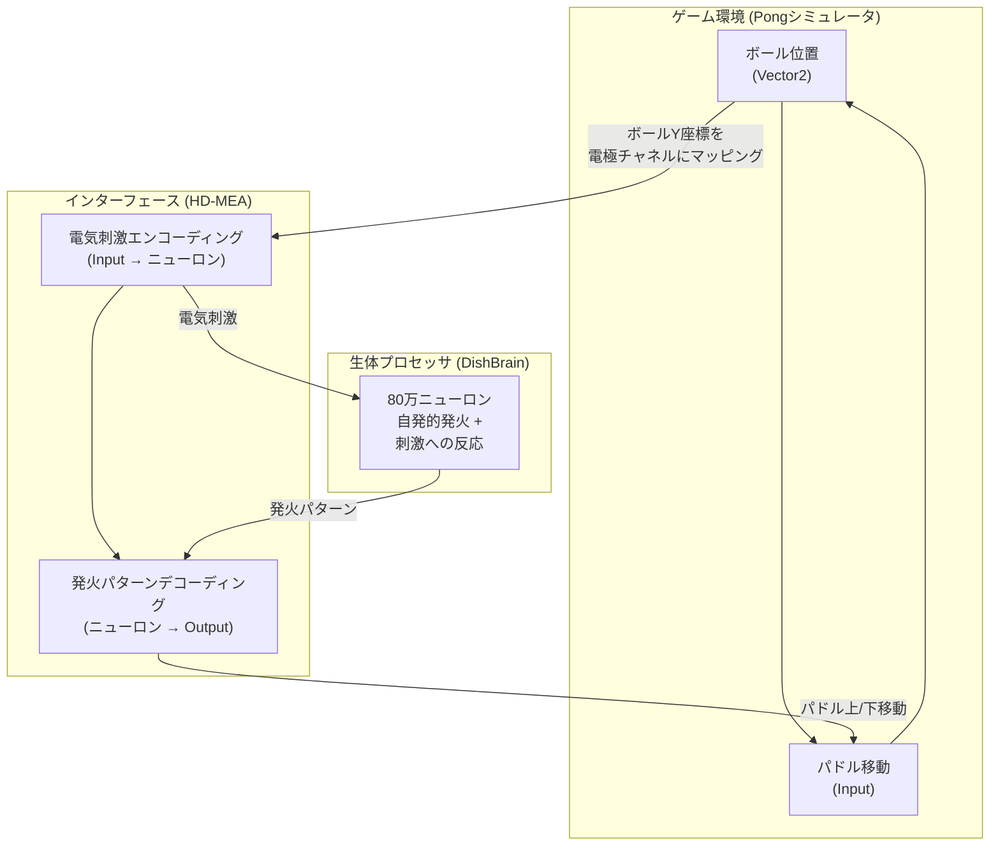
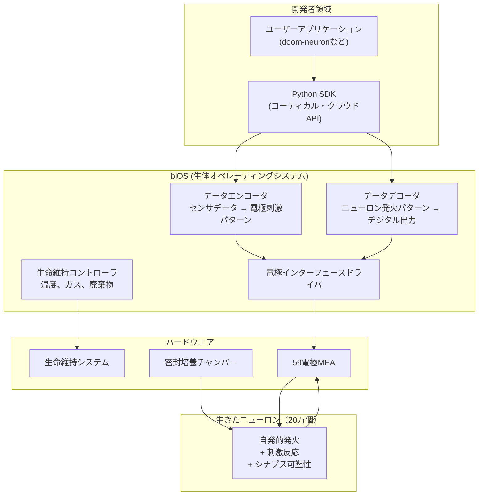
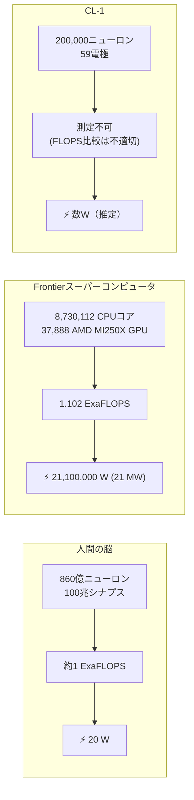
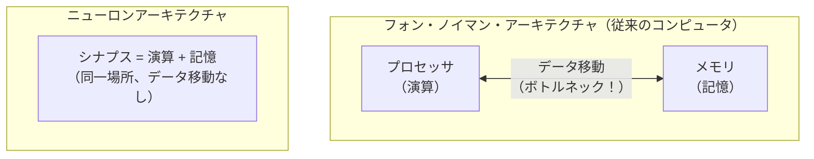
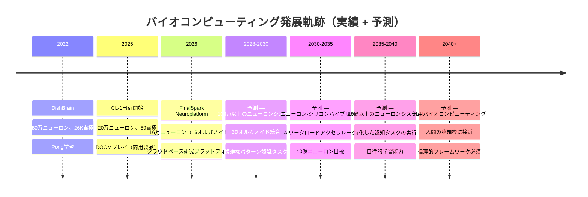
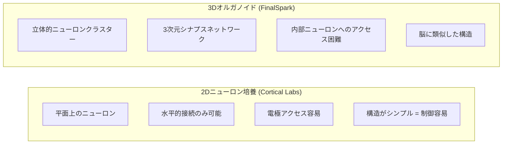
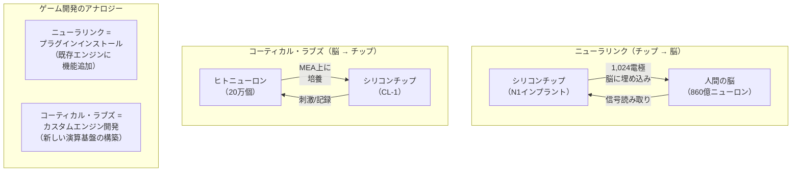
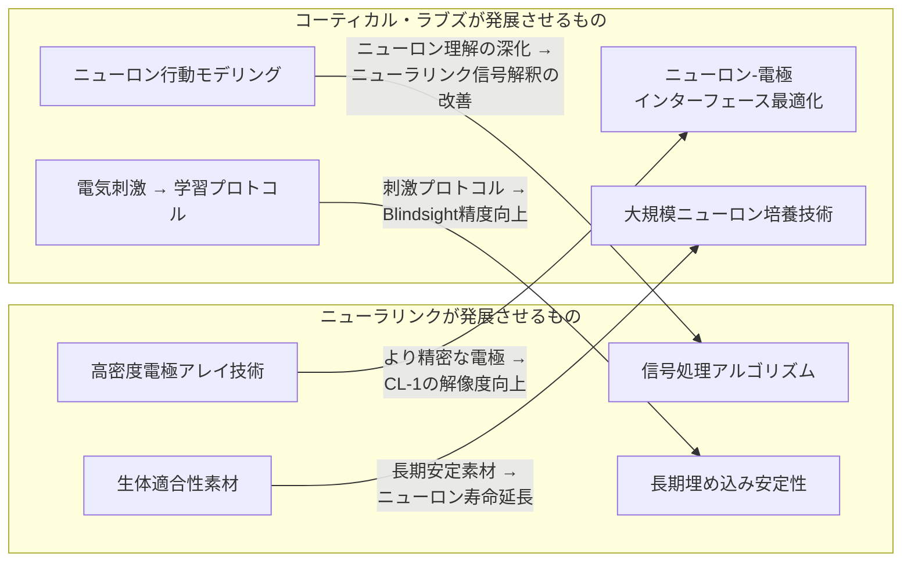

## はじめに

2026年2月、オーストラリアのスタートアップ、コーティカル・ラブズ（Cortical Labs）が衝撃的なデモンストレーション映像を公開しました。**20万個の生きたヒトニューロン**がチップ上で、1993年の伝説的FPSゲーム**DOOM**を直接プレイする様子でした。単にゲームを「実行」したのではなく、ニューロンが視覚情報を受け取り、自ら学習しながらキャラクターを操作したのです。

ゲーム開発者にとって、このニュースは複数の層にわたる疑問を投げかけます。技術的にニューロンがどのようにゲーム入力を生成するのか、現在のGPUベースのコンピューティングと性能はどう比較されるのか、ニューラリンクのBCI（Brain-Computer Interface）技術とはどのような関係にあるのか、そしてSAO（ソードアート・オンライン）のフルダイブVRがこの技術で実現可能になるのかまで。

本文書は、原著論文の精密分析から始まり、ハードウェア仕様、性能比較、競合技術、ニューラリンクとの関連性、水槽の脳シナリオ、フルダイブVRの可能性まで — **ゲーム開発者の視点**から体系的に分析します。

---

## Part 1: 原著論文とソース分析

このニュースの起源をたどると、一つの核心論文とそこから派生した商用製品にたどり着きます。まず原典を整理し、論文の核心メカニズムをゲーム開発者に馴染みのある概念で解釈してみましょう。

### 1. 原典の整理

[AIタイムズの記事](https://www.aitimes.com/news/articleView.html?idxno=207422)が取り上げている核心は、コーティカル・ラブズの**CL-1システム**です。関連する原典は以下の通りです。

| 出典 | 種類 | 内容 |
|------|------|------|
| [コーティカル・ラブズ公式サイト](https://corticallabs.com/) | 企業 | 会社概要と技術ビジョン |
| [CL-1製品ページ](https://corticallabs.com/cl1) | 製品 | 技術仕様と価格 |
| [コーティカル・クラウド](https://corticallabs.com/cloud) | プラットフォーム | リモートニューロンアクセスAPI |
| [コーティカル・ラブズ研究](https://corticallabs.com/research) | 学術 | 論文一覧と研究概要 |
| [doom-neuron (GitHub)](https://github.com/SeanCole02/doom-neuron) | オープンソース | DOOMプレイコード (GPL-3.0) |
| [コーティカル・ラブズ GitHub](https://github.com/cortical-labs) | オープンソース | 公式リポジトリ |

---

### 2. 核心論文: DishBrain (Neuron, 2022)

すべての学術的基盤となる論文です。

> **"In vitro neurons learn and exhibit sentience when embodied in a simulated game-world"**
> - 著者: Brett J. Kagan, Andy C. Kitchen, Nhi T. Tran, Forough Habibollahi, Moein Khajehnejad, Bradyn J. Parker, Anjali Bhat, Ben Rober, Adeel Razi, **Karl J. Friston** 他
> - 学術誌: *Neuron*, Volume 110, Issue 23, pp. 3952-3969 (2022年12月)
> - DOI: [10.1016/j.neuron.2022.09.001](https://doi.org/10.1016/j.neuron.2022.09.001)
> - [PubMed](https://pubmed.ncbi.nlm.nih.gov/36228614/) \| [Cell Press 原文](https://www.cell.com/neuron/fulltext/S0896-6273(22)00806-6) \| [PMC 全文](https://pmc.ncbi.nlm.nih.gov/articles/PMC9747182/)


_DishBrain論文のGraphical Abstract。出典: Kagan et al., Neuron (2022) — [PMC](https://pmc.ncbi.nlm.nih.gov/articles/PMC9747182/)_

著者リストで**カール・フリストン（Karl J. Friston）**が目を引きます。ユニバーシティ・カレッジ・ロンドン（UCL）の神経科学教授で、本論文の核心的学習原理である**自由エネルギー原理（Free Energy Principle）**の創始者です。この人物が共著者として参加していること自体が、論文の理論的堅固さを保証しています。

---

### 2-1. 実験設計

論文の実験設計を、ゲーム開発者に馴染みのある構造に分解してみましょう。


_Figure 1: DishBrainシステムと実験プロトコルの概要図。ニューロン培養体がMEAを通じてPong環境と接続される構造を示している。出典: Kagan et al., Neuron (2022)_

**ハードウェア構成:**
- ヒトiPSC（人工多能性幹細胞）由来ニューロンおよびマウス胎児皮質ニューロンを使用
- **高密度多電極アレイ（HD-MEA）**上に培養 — 512〜26,000個の電極がグリッド状に配置
- 培養されたニューロン集合体を**DishBrain**と命名
- 約80万個のニューロンを使用

**ソフトウェア接続:**
- クラシックなアタリゲーム**Pong**のシミュレーション環境を構築
- ゲーム画面のボール位置情報を電極を通じて電気刺激パターンに変換し、ニューロンに伝達
- ニューロンの発火（firing）パターンを検出し、ゲーム内パドル移動コマンドに変換

Unity開発者に例えると、この構造は以下のようになります：




_Figure 2: 皮質細胞が形成した高密度相互接続ネットワーク。マウス皮質ニューロン（上）とヒトiPSC由来ニューロン（下）の免疫蛍光顕微鏡画像。緑色はニューロンマーカー、赤色はグリア細胞を示す。出典: Kagan et al., Neuron (2022)_

鍵となるのは**閉ループ（closed-loop）**構造です。ゲーム状態 → ニューロン刺激 → ニューロン反応 → ゲーム入力 → ゲーム状態変化 → 再びニューロン刺激。Unityの`Update()`ループと同一の構造です。違いは、ロジックを処理する主体がC#スクリプトではなく、**生きたニューロン**だという点です。

---

### 2-2. 学習メカニズム: 自由エネルギー原理 (Free Energy Principle)

この論文の最も革新的な部分です。ニューロンの学習原理を理解するために、まずゲームでの強化学習と比較してみましょう。

**従来の強化学習 (Reinforcement Learning):**
```
行動 → 結果 → 報酬/ペナルティスコア → スコアを最大化する方向に学習
```

ゲームAIで広く使われるこのパラダイムには**明示的な報酬関数**が必要です。Unity ML-Agentsで`AddReward(1.0f)`を呼び出すようにです。ニューロンにはこのような報酬関数を直接定義することができません。ニューロンはコードではないからです。

**自由エネルギー原理（FEP）ベースの学習:**
```
ニューロンは自分が受ける刺激の「予測不可能性」を最小化しようとする
→ 予測可能な刺激 = 安定状態（報酬）
→ 予測不可能な刺激 = 不安定状態（ペナルティ）
```


_Figure 4: DishBrainハードウェアセットアップ、ソフトウェアデータフロー、電極レイアウト（感覚/運動領域の区分）、パイロットテスト3回反復による性能改善推移。出典: Kagan et al., Neuron (2022)_

DishBrain実験では、この原理を以下のように適用しました：


これをゲーム開発のアナロジーで説明すると：

| FEP概念 | ゲームのアナロジー |
|---------|-----------------|
| 予測可能な刺激（報酬） | `Input.GetAxis()` — 一貫した入力ストリーム |
| ランダムノイズ（ペナルティ） | `Random.Range(-1f, 1f)` が毎フレーム入力として入ってくる |
| ニューロンの学習目標 | 入力ノイズを減らし予測可能な状態にする |
| 自由エネルギー | システムの「混乱度」 — エントロピーに類似した概念 |

**核心**: 従来の強化学習が「スコアを上げろ」という**外部目標**を付与するのに対し、FEPはニューロンの**内在的性質** — 予測不可能な刺激を避けようとする本能 — を利用します。別途の報酬関数設計が不要です。


_Figure 5: ニューロンがPong環境で示した学習成果。(A) マウス皮質ニューロン、(B) ヒトiPSCニューロンの平均ラリー長が時間とともに統計的に有意に増加した。対照群（無刺激/開放型）に比べ、閉ループフィードバック条件でのみ学習が観察された。出典: Kagan et al., Neuron (2022)_

**実験結果:**
- **5分以内に**リアルタイムゲームプレイで学習の兆候を観察
- ランダム操作（control condition）に比べ統計的に有意な性能向上
- ヒトニューロンがマウスニューロンよりも速く学習
- 閉ループフィードバックのない開放型（open-loop）条件では学習が未観察 → **閉ループ構造が必須**

> **💬 ちょっと待って、これは押さえておこう**
>
> **Q. ニューロンは本当に「学習」したのですか？単なる反射反応ではないですか？**
>
> 論文はこの質問にかなり厳密に答えています。核心的根拠は**時間に伴う性能改善曲線**です。ニューロンのPongスコア（ラリー長）がセッションが進むにつれて統計的に有意に増加しました。単純な反射であれば、時間に伴う改善はないはずです。また**閉ループフィードバックを除去すると学習が消失する**という統制実験の結果が核心的証拠です。
>
> **Q. 論文タイトルの「sentience」は意識を意味しますか？**
>
> **違います。**この文脈でのsentienceは「意識」や「自我」ではなく、**「環境に反応し適応する能力」**という狭い意味で使用されています。論文自体もこれを明確に区別しています。それでもこの用語選択は学界でかなりの批判を受け、メディアで「ニューロンが意識を持った」と誇張報道される原因となりました。科学コミュニケーションの重要性を示す事例です。
>
> **Q. なぜよりによってPongなのですか？**
>
> Pongは**1次元入力（ボールのY座標）、1次元出力（パドル上/下）、即時フィードバック（成功/失敗）**の条件を満たす最もシンプルなゲーム環境です。ゲーム開発で新しいシステムをテストする際に最もシンプルなシーンから始めるのと同じ原理です。2026年にDOOMに進化したことは、入力次元と行動空間が大幅に拡張されたことを意味します。

---


_Figure 6: 閉ループフィードバックの重要性。構造化されたフィードバック（stimulus）を提供した条件でのみラリー長が増加した。無刺激（silent）と開放型（no-feedback）条件では学習が観察されなかった — これは閉ループ構造が学習の必須条件であることを証明する。出典: Kagan et al., Neuron (2022)_

## Part 2: CL-1システム技術分析

2022年のDishBrainは研究室のプロトタイプでした。3年後の2025年、コーティカル・ラブズはこれを**商用製品**に発展させました。CL-1は世界初のコードデプロイ可能な（code-deployable）バイオコンピュータです。

### 3. ハードウェア仕様


_CL-1: 世界初の商用バイオコンピュータ。密封チャンバー内に生命維持システムとニューロン培養体、電極アレイが統合されている。価格$35,000。出典: [Cortical Labs](https://corticallabs.com/cl1)_

| 項目 | 仕様 | 比較参考 |
|------|------|----------|
| **ニューロン数** | 約200,000個（ヒトiPSC由来） | DishBrain: 約800,000個 |
| **電極数** | 59個（平面金属-ガラス配列） | DishBrain HD-MEA: 最大26,000個 |
| **レイテンシ** | サブミリ秒（sub-ms） | DishBrain: ミリ秒単位 |
| **ニューロン寿命** | 最大6ヶ月（理想的条件） | — |
| **生命維持** | 密封チャンバー、ガス組成/温度/廃棄物自動管理 | — |
| **OS** | biOS（生体オペレーティングシステム） | — |
| **外部コンピュータ** | 不要（オールインワン） | — |
| **価格** | $35,000（ラック構成: $20,000/ユニット） | — |
| **出荷** | 2025年から115台の商用システム | — |

注目すべき点の一つは、**電極数がむしろ減少した**ということです。DishBrainのHD-MEAが最大26,000個の電極を使用したのに対し、CL-1は59個です。これは研究用機器から商用製品への移行において**コスト、安定性、保守性**を優先した結果です。Unityに例えると、エディタでは数千個のデバッグオブジェクトを配置するが、リリースビルドでは必要最小限のものだけ残すのと同じです。

**電極密度の計算:**
```
200,000ニューロン ÷ 59電極 = 電極1個あたり約3,390個のニューロン
```

これは極めて粗い（coarse）インターフェースです。1つの電極が数千個のニューロンの集合的活動を測定するため、個々のニューロンレベルの制御は不可能です。ゲームに例えると、1920×1080解像度の画面を32×32ピクセルにダウンサンプリングして見るのに似ています — おおまかな輪郭は把握できますが、詳細は分かりません。

---

### 3-1. ソフトウェアアーキテクチャ: biOS

CL-1のソフトウェアスタックは、ゲーム開発者に馴染みのある構造を持っています。



この構造をUnityのアーキテクチャと対応させると：

| CL-1コンポーネント | Unity対応 | 役割 |
|------------------|-----------|------|
| Python SDK | UnityEditor API | 開発者がロジックを書くインターフェース |
| biOSエンコーダ/デコーダ | Input System + Renderer | 入出力変換 |
| 電極アレイ | GPUシェーダユニット | 実際の演算が行われるハードウェア接点 |
| 生きたニューロン | ???（対応不可） | **これが核心的な違い** |
| 生命維持システム | 冷却システム、電源供給 | ハードウェア維持 |

最後の行が重要です。従来のコンピューティングにおいて「演算を実行する主体」は決定論的なシリコントランジスタです。同一の入力に対し常に同一の出力を保証します。しかしニューロンは**非決定論的**です。同一の刺激に対しても毎回わずかに異なる発火パターンを示します。これはバグではなく、**学習と適応の基盤**となる核心的特性です。

---

### 3-2. DOOMプレイ: 実際の性能評価

独立開発者のSean Coleが、コーティカル・クラウドAPIを使用して**1週間以内に**DOOMプレイを実装しました。コードは[GitHub](https://github.com/SeanCole02/doom-neuron)にGPL-3.0ライセンスで公開されています。

**DOOM vs Pong — 複雑度比較:**

| 要素 | Pong (2022) | DOOM (2026) |
|------|------------|-------------|
| **入力次元** | 1D（ボールのY座標） | 2D（視野フレーム） |
| **出力行動** | 2個（上/下） | 4個以上（前進/後退/左/右旋回/射撃） |
| **環境** | 静的2D | 動的3D（敵、アイテム、壁） |
| **時間的圧力** | 低い | 高い（敵の攻撃） |
| **ニューロン数** | 800,000 | 200,000 |
| **電極数** | 最大26,000 | 59 |

興味深い点は、ニューロン数と電極数が**どちらも減少したにもかかわらず**、より複雑なゲームをプレイしているということです。これはハードウェアの発展というよりも、**ソフトウェアインターフェース（biOS）の発展**と**エンコーディング/デコーディングアルゴリズムの改善**によるものです。

**現実的な性能評価:**

| 基準 | 評価 | 詳細 |
|------|------|------|
| ランダム行動との比較 | **明確に優れている** | 学習の証拠が確認された |
| 一般的な人間レベル | **未達** | 動きが不確実でカクつく |
| 戦略的プレイ | **不可能** | 基本的な反応レベルにとどまる |
| 学習速度 | **約1週間** | 基礎的なゲームプレイの学習 |

20万個のニューロンで人間レベルのゲームプレイを期待するのは無理があります。人間の脳は**860億個**のニューロンを有していますから。

```
200,000 / 86,000,000,000 = 0.00000232...
```

**現在のCL-1のニューロン数は人間の脳のわずか0.00023%に過ぎません。** Unityに例えると、LOD（Level of Detail）の最低レベル — 遠くにいるキャラクターを6個の三角形で表現するのと同程度です。

> **💬 ちょっと待って、これは押さえておこう**
>
> **Q. ニューロン数を増やせば性能は比例して向上しますか？**
>
> **単純に比例はしません。** ニューロンの価値はニューロン数そのものよりも、**シナプス接続の密度と構造**にあります。人間の脳の860億個のニューロンは約**100兆（10¹⁴）個のシナプス**で接続されています。ニューロン1個あたり平均約7,000個のシナプスです。CL-1の2D培養環境では、このような3次元的接続構造を再現するのは困難です。LLMでパラメータ数だけ増やしても性能が比例向上しないのと似ています — アーキテクチャ、学習データ、後処理のすべてが重要であるように。
>
> **Q. ニューロンが死んだらどうなりますか？**
>
> ニューロン培養の寿命は現在**最大6ヶ月**です。ニューロンが死滅すると、新しい培養を開始する必要があります。これは従来のコンピューティングとの最も劇的な違いの一つです。**SSDが故障したら交換するように、ニューロン培養が死滅したら新しく培養する必要があります。** ただし、ニューロンの「学習」結果は新しい培養に転移されません — 以前のセッションの重みをロードできないようなものです。これは今後最も重要な技術的課題の一つです。

---

## Part 3: 生体ニューロン vs シリコン — 性能比較

このセクションが最も重要です。ゲーム開発者にとって性能数値は日常的な関心事ですから。LLMガイドでGPU VRAMと帯域幅を比較したように、ここでは**生体ニューロンとシリコンの性能を定量的に比較**します。

### 4. エネルギー効率: 100万倍の差

バイオコンピューティングが注目される最も根本的な理由です。

**スパイク（発火）単位エネルギー比較:**

| プロセッサ種類 | エネルギー/スパイク | 人間の脳との比較 |
|-------------|-----------------|----------------|
| **生体ニューロン** | ~10⁻¹¹ J/spike | 基準（1x） |
| **ニューロモルフィックチップ**（Intel Loihi） | ~10⁻⁸ J/spike | 約1,000倍非効率 |
| **デジタルGPU**（NVIDIA） | ~10⁻³ ~ 10⁻⁷ J/spike | 約10,000〜100,000,000倍非効率 |

これらの数値の意味を実感するために、**システムレベル**で比較してみましょう：



| 指標 | 人間の脳 | Frontier (2022) | 比率 |
|------|---------|-----------------|------|
| **演算能力** | 約1 ExaFLOPS（推定） | 1.102 ExaFLOPS | 約1:1 |
| **消費電力** | 20 W | 21,100,000 W (21 MW) | **1 : 1,055,000** |
| **重量** | 約1.4 kg | 数千トン | — |
| **体積** | 約1,200 cm³ | 大型建物1棟分 | — |
| **エネルギー効率** | 50 PetaFLOPS/W | 0.052 PetaFLOPS/W | **約960,000倍** |

> 人間の脳は**20ワット** — 薄暗い電球1個を灯す程度の電力でエクサフロップス級の演算を実行します。同等の性能のスーパーコンピュータFrontierは**21メガワット** — 小都市1つ分の電力を消費します。

これこそがバイオコンピューティング研究者たちがこの分野に没頭する理由です。エネルギー効率において**約100万倍**の格差が存在します。AIモデルの学習と推論に消費される電力が急増する現状において、この格差は巨大な機会を意味します。

---

### 4-1. FLOPS比較の限界: なぜ直接比較が難しいのか

上記の表の「人間の脳 約1 ExaFLOPS」という数値は**推定値**であり、研究者によって10〜20 PetaFLOPSから1 ExaFLOPSまで大きなばらつきがあります。この不確実性が存在する根本的な理由があります。

**FLOPS（Floating Point Operations Per Second）**はシリコンプロセッサの性能指標です。ニューロンは浮動小数点演算をしません。ニューロンが行うのは：

1. **電気化学的信号伝播**: イオンチャネルを通じた電位変化
2. **シナプス可塑性**: 接続強度の動的変化
3. **非線形統合**: 数千の入力の複雑な合算

これをFLOPSに換算するのは、ゲームエンジンの性能を「毎秒シェーダ命令数」でのみ測定するのに似ています — 一面しか見ていないのです。ニューロンの真の強みは**演算とメモリが同じ場所にある**という点です。




_Figure 7: ゲームプレイと休息時のニューロンの電気生理学的活動の比較。ゲームプレイ中、感覚-運動領域間の接続性が強化され、情報エントロピーが変化し、機能的可塑性が観察される。このデータこそが、ニューロンの「学習」が発生したことを示す直接的証拠である。出典: Kagan et al., Neuron (2022)_

従来のコンピュータの最大のボトルネックである**フォン・ノイマン・ボトルネック** — CPUとメモリ間のデータ移動 — がニューロンには存在しません。シナプス自体が演算器でありメモリだからです。

LLMガイドでVRAM帯域幅が推論速度の核心的ボトルネックだと説明したことを思い出してください：

```
システムRAM (DDR5):             ~50-90 GB/s
NVIDIA VRAM (HBM3e):           ~3,350 GB/s
生体ニューロン:                  ボトルネック自体がない（in-situ演算）
```

ニューロンのエネルギー効率が極端に高い理由がまさにこれです。**データを移動させないから**です。

> **💬 ちょっと待って、これは押さえておこう**
>
> **Q. ニューロモルフィックチップ（Intel Loihi、IBM TrueNorth）とは何ですか？生体ニューロンとは違うのですか？**
>
> **全く異なります。** ニューロモルフィックチップは、ニューロンの動作を**シリコントランジスタで模倣する**ハードウェアです。生体ニューロンは使用しません。ニューロンのスパイキングパターンをハードウェアレベルでシミュレーションするのです。Intelの Hala Pointシステムは、従来のCPU/GPUに比べ50倍速く100倍エネルギー効率が高いと主張しています。しかし実際の生体ニューロンと比較すると、まだ1,000倍以上非効率です。
>
> **Q. それなら生体ニューロンが圧倒的に優れているのではないですか？なぜまだシリコンを使うのですか？**
>
> **決定論性（determinism）とスケーリング**のためです。シリコンは同一の入力に対し常に同一の出力を保証します。生体ニューロンはそうではありません。また、シリコンチップはナノメートル級のプロセスで数十億個のトランジスタを集積できますが、生体ニューロンを同じ密度で培養することは現在不可能です。ゲームサーバーが決定論的であるべきように、ほとんどのコンピューティングワークロードは決定論性を要求します。バイオコンピューティングは決定論性がそれほど重要でない — パターン認識、適応的学習のような — 領域で強みを発揮するでしょう。

---

### 5. 将来の性能予測: バイオコンピューティングが発展したら？

LLMの発展軌跡と比較してみましょう。LLMはGPT-1（2018年、1.17億パラメータ）からGPT-4（2023年、約1.8兆パラメータ推定）まで、5年間で約**15,000倍**にスケールアップしました。バイオコンピューティングでも類似の軌跡は可能でしょうか？



**現実的な限界と技術的課題:**

| 課題 | 現状 | 難易度 | ゲーム開発のアナロジー |
|------|------|--------|---------------------|
| **スケーリング** | 20万 → 860億 = 43万倍 | 極めて高い | プロトタイプ → AAAタイトル |
| **寿命** | 最大6ヶ月 | 高い | ライブサービスの安定性 |
| **精度** | 59電極/20万ニューロン | 高い | 解像度32×32 → 4K |
| **再現性** | 非決定論的 | 中程度 | ランダムシード固定不可 |
| **3D構造** | 2D培養 → 3Dオルガノイド | 高い | 2Dゲーム → 3Dゲーム |
| **学習転移** | 不可（培養間転移なし） | 非常に高い | セーブファイルのないローグライク |

**楽観的シナリオでの性能予測:**

| 時期 | ニューロン数 | 電極密度 | 予想能力 | エネルギー効率の優位性 |
|------|-----------|---------|---------|---------------------|
| 2026（現在） | 20万 | 59個 | 単純なゲーム反応 | 実証段階 |
| 2030 | 500万 | 1,000以上 | パターン認識補助 | 特定ワークロードでGPU比100倍 |
| 2035 | 1億 | 10,000以上 | 特化AIワークロード加速 | データセンターのエネルギー削減 |
| 2040 | 10億以上 | 100,000以上 | 汎用学習システム | パラダイムシフトの可能性 |

---

## Part 4: 競合他社 — FinalSparkとオルガノイド知能

コーティカル・ラブズだけがこの分野の唯一のプレイヤーではありません。ゲーム産業でUnrealとUnityが競争しながら発展するように、バイオコンピューティングでも異なるアプローチが競争しています。

### 6. FinalSpark（スイス） — クラウドベースの脳オルガノイド

| 項目 | FinalSpark | Cortical Labs |
|------|-----------|---------------|
| **設立** | 2014年、スイス | 2019年、オーストラリア |
| **アプローチ** | 3D脳オルガノイド（ミニ脳） | 2Dニューロン培養 |
| **ニューロン数** | 約160,000（16オルガノイド） | 約200,000 |
| **プラットフォーム** | [Neuroplatform](https://finalspark.com/neuroplatform/)（クラウド専用） | CL-1（ハードウェア）+ Cloud |
| **現在の能力** | 約1ビット記憶、単純な刺激-反応 | DOOMプレイレベル |
| **ビジネス** | 月額サブスクリプションベースの研究アクセス | ハードウェア販売（$35K） |
| **エネルギー効率** | シリコン比100万倍効率を主張 | 同程度 |
| **学習方式** | ドーパミンベース（2025年試行） | 自由エネルギー原理 |
| **オルガノイド寿命** | 約100日（目標: 200日以上） | 約6ヶ月 |

FinalSparkの独特なアプローチは**3Dオルガノイド**を使用する点です。2D培養（平面）と3Dオルガノイド（立体）の違いは、ゲーム開発での2Dと3Dの違いに似ています：



---

### 6-1. オルガノイド知能 (Organoid Intelligence)

ジョンズ・ホプキンス大学のThomas Hartung教授チームが2023年に提案した**[オルガノイド知能（Organoid Intelligence）](https://www.frontiersin.org/journals/science/articles/10.3389/fsci.2023.1017235/full)**の概念は、この分野の学術的フレームワークを提供しています。

脳オルガノイドは幹細胞から分化させた**ミニ脳**です。数ミリメートルの球体の中で数十万個のニューロンが自発的に組織化され、実際の脳の初期発達段階に類似した構造を形成します。

最近、ジョンズ・ホプキンスの研究チームは**実験室で培養した脳オルガノイドが学習と記憶の基本構成要素を示す**という[研究結果](https://publichealth.jhu.edu/2025/johns-hopkins-team-finds-lab-grown-brain-organoids-show-building-blocks-for-learning-and-memory)を発表し、この研究に**コーティカル・ラブズが共同参加**しました。競争しながらも協力する — ゲーム産業でUnrealがオープンソース戦略でエコシステムを育てるのに類似した方式です。

> **💬 ちょっと待って、これは押さえておこう**
>
> **Q. オルガノイドは意識を持つことができますか？**
>
> 現在のレベルでは**できません。** 現在の脳オルガノイドは、妊娠約12〜16週の胎児の脳に類似した構造です。感覚入力もなく、身体もありません。意識の出現に必要な要素（感覚統合、自己参照、時間知覚など）がありません。しかしオルガノイドの複雑度が増し続ければ、**どの時点で倫理的境界線を考慮すべきか**は現在活発に議論されています。2025年1月にThe Mimir Centerで**[脳エミュレーションの哲学と倫理ワークショップ](https://mimircenter.org/news/report-from-the-workshop-on-the-philosophy-and-ethics-of-brain-emulation-27-28-january-2025)**が開催されたことは、この問題の緊急性を反映しています。
>
> **Q. FinalSparkの「1ビット記憶」とはどういう意味ですか？**
>
> 文字通り**1ビット（0または1）の情報を記憶し、取り出せる**という意味です。現代のコンピュータがテラバイトを処理することに比べれば極めて初歩的です。しかし重要なのは、**生きたニューロンがデジタル情報を記憶できることを証明した**という点です。トランジスタの初期の歴史においても、最初のトランジスタ（1947年）は何の実用的価値もありませんでしたが、それがIntel 4004（1971年）やA17 Pro（2023年）につながりました。

---

## Part 5: ニューラリンクとの関連性

### 7. 反対方向、同じ目標

コーティカル・ラブズとニューラリンクの関係を理解する最良のアナロジーは**クライアント-サーバーアーキテクチャ**です。



コーティカル・ラブズ自身がこれを**「逆ニューラリンク（Reverse Neuralink）」**と表現したことがあります。

| 比較 | ニューラリンク | コーティカル・ラブズ |
|------|-------------|-------------------|
| **方向** | シリコン → 脳（埋め込み） | 脳 → シリコン（培養） |
| **目的** | 人間の能力拡張/回復 | 新しいコンピューティングパラダイム |
| **対象ユーザー** | 患者 → 一般消費者 | 研究者 → 開発者 |
| **規制** | FDA医療機器（極めて厳格） | 研究機器（比較的柔軟） |
| **倫理的焦点** | 患者安全、脳のプライバシー | ニューロンの道徳的地位 |
| **スケール** | 1,024電極/脳 | 59電極/20万ニューロン |

---

### 7-1. ニューラリンクの現状（2025-2026）

ニューラリンクの進展速度は驚くべきものです。

| 時期 | マイルストーン |
|------|-------------|
| 2024年1月 | 初の人間へのインプラント（Noland Arbaugh） |
| 2025年5月 | FDA Breakthrough Device — 音声回復技術 |
| 2025年9月 | 世界で**12名**にインプラント完了 |
| 2025年 | UAE、英国に臨床試験拡大 |
| 2025年 | シリーズE 6.5億ドル（企業価値約90億ドル） |
| 2026年予定 | **量産**開始、自動化手術手順 |
| 2026年予定 | **Blindsight**初の患者試験（視覚回復） |

**Blindsight**は特に注目に値します。目や視神経に問題のある患者の**視覚皮質に直接電気刺激**を送り、視覚情報を伝達する技術です。これが成功すれば、**脳に直接映像を注入する**初期段階が実現されることになり — これはフルダイブVRの核心的前提条件の一つです。

---

### 7-2. シナジー: なぜ相互補完的なのか

この2つの技術は競争ではなく**シナジー**を形成します。それぞれが発展させる技術が相手方の核心的課題を解決します。



**ニューラリンクが発展させる電極技術**は、CL-1の59個という電極の限界を突破するのに直接貢献できます。ニューラリンクのN1インプラントは、すでに**1,024個の電極**を人間の脳に安全に挿入しています。

逆に、**コーティカル・ラブズが蓄積するニューロン行動データ**は、ニューラリンクが脳信号を解釈するアルゴリズムの改善に活用されます。チップ上のニューロンは統制された環境で観察できるため、人体内部では把握しにくいニューロンの微細な行動パターンを研究するのに理想的です。

> **💬 ちょっと待って、これは押さえておこう**
>
> **Q. ニューラリンクのユーザーがすでにゲームをプレイしているそうですが？**
>
> その通りです。2024年に初のインプラントを受けたNoland Arbaughは、**思考だけでビデオゲーム、オンラインチェス**などをプレイしています。しかしこれはコーティカル・ラブズとは根本的に異なります。ニューラリンクは**人間の意図を読み取り、従来のコンピュータの入力に変換する**ものであり、コーティカル・ラブズは**ニューロン自体が演算主体**になるものです。例えるなら、ニューラリンクは「音声認識でゲーム操作」、コーティカル・ラブズは「AIが直接ゲームプレイ」に近いです。

---

## Part 6: 水槽の脳 — 哲学から現実へ

### 8. 伝統的な思考実験

「水槽の脳（Brain in a Vat）」は、ヒラリー・パトナム（Hilary Putnam）が1981年に提案した哲学的思考実験です。デカルトの「悪霊仮説」の現代版で、脳を身体から分離して栄養液の入った容器に入れ、神経をスーパーコンピュータに接続して完璧な仮想現実を体験させるなら — その脳は自分が容器の中にいることを知ることができるでしょうか？

2026年現在、コーティカル・ラブズのCL-1は、この思考実験の**物理的実現を初めて達成したシステム**と言えます：

| 思考実験の要素 | 理論 | CL-1での実現 |
|-------------|------|------------|
| 脳を身体から分離 | 外科的摘出 | iPSCからニューロン分化 ✅ |
| 栄養液の容器で生存 | 生命維持システム | 密封チャンバー + 自動生命維持 ✅ |
| 神経に電気刺激 | スーパーコンピュータ接続 | 59電極MEA + biOS ✅ |
| 仮想「環境」の提供 | 完璧な現実シミュレーション | DOOMゲーム環境 ✅（極めて単純） |
| 脳が環境で「行動」 | 自由意志的選択 | ニューロンが学習しながらゲームプレイ ✅ |

もちろん、現在のレベルと思考実験の間の格差は天文学的です。20万個のニューロンに低解像度のDOOM画面を見せることと、860億個のニューロンに現実と区別不可能なシミュレーションを提供することは、全く異なる次元の問題です。

---

### 8-1. マトリックスの再解釈: エネルギーバッテリーから演算装置へ

映画マトリックス（1999年）で、機械文明は人間を**エネルギーバッテリー**として使用します。しかしこれは熱力学的に成り立ちません。

**熱力学的分析:**

```
人間の代謝出力: 約80-100W（熱 + 力学的エネルギー）
人間の維持に必要なエネルギー: 約2,000 kcal/日 = 約97W
→ 純エネルギー出力: ほぼ0またはマイナス
→ エネルギー源としての人間: 赤字事業
```

人間は食べた分のエネルギーを消費するため、エネルギーバッテリーとしては**熱力学第2法則**に違反します。マトリックスの元の脚本では、人間をエネルギー源ではなく**演算装置**として使用する設定でしたが、観客の理解のために「バッテリー」に単純化されたという逸話があります。

バイオコンピューティングの観点から再分析すると、**演算装置シナリオの方がはるかに合理的**です：

| 比較 | エネルギーバッテリー（映画） | 演算装置（再解釈） |
|------|----------------------|------------------|
| **熱力学** | 不可能（エネルギー赤字） | 可能 |
| **人間の価値** | 約100W熱出力 | **20Wで1 ExaFLOPS** |
| **代替手段との比較** | 太陽光パネルの方がはるかに効率的 | 同等のスパコンは21MW必要 — 人間の脳は**100万倍効率的** |
| **数量スケーリング** | 非効率 × 数十億 = 依然として非効率 | 数十億の脳 = **数十億ExaFLOPS** |

数十億の人間の脳をネットワークで接続した分散演算システム — 各ノードが20Wで1 ExaFLOPSを処理する — は、想像しうる最もエネルギー効率の高いスーパーコンピュータクラスターです。人間を仮想現実（マトリックス）に閉じ込めるのは、脳を「アイドル状態」にしないための — つまり演算リソースを最大限活用するための — 装置として再解釈されます。

**もちろんこれはディストピア的思考実験です。** しかしCL-1が証明した「ヒトニューロンを演算装置として活用できる」という事実は、このシナリオが純粋な空想ではなく、**技術的に初歩的な形態ですでに実現されている**ことを示しています。

---

### 8-2. 倫理的問題: 現在進行形

これは単なるSFの議論ではありません。**今まさに**学界と規制当局で活発に議論されている現実的な問題です。

| 倫理的問題 | 現在の状況 | 緊急度 |
|-----------|---------|--------|
| **ニューロンの道徳的地位** | チップ上のニューロンは「生きた存在」か？苦痛や選好はあるか？ | 中 |
| **商業化の境界** | $35,000でヒトニューロンベースのコンピュータを販売することの限界 | 高 |
| **規模拡大** | 10億、100億ニューロンへの拡大時の意識出現の可能性 | 未来（10-20年） |
| **同意の問題** | ニューロン原本細胞提供者の同意範囲 | 高 |
| **データ倫理** | ニューロンの発火パターンは「個人情報」か？ | 新領域 |

2025年1月のThe Mimir Centerの**[脳エミュレーション倫理ワークショップ](https://mimircenter.org/news/report-from-the-workshop-on-the-philosophy-and-ethics-of-brain-emulation-27-28-january-2025)**では、全脳エミュレーション（Whole Brain Emulation, WBE）の倫理的フレームワークが議論されました。そこで提起された核心的問題：

> **「技術が特定の臨界点を超えると、実験対象の道徳的地位が突然変わりうるか？その臨界点をどう定義するか？」**

これは、ゲーム開発でAI NPCの行動がますます精巧になる際に「このNPCに『感情』はあるか？」と問いかけるのと構造的に同一です。違いは、ゲームのNPCはコードですが、オルガノイドのニューロンは**実際の人間の細胞**だという点です。

---

## Part 7: フルダイブVR — SAOのナーヴギアは可能か？

### 9. フルダイブVRの技術要件の分解

ソードアート・オンライン（SAO）のナーヴギア（NerveGear）がすることを技術的に分解してみましょう。


これらの各要件を現在の技術とマッピングしてみましょう：

| 要件 | 関連技術 | 2026年現在のレベル | 目標レベル | ギャップ |
|------|---------|-----------------|---------|--------|
| **① 視覚入力** | Neuralink Blindsight | 視覚皮質刺激でフォスフェン（光視症）生成可能 | 人間の視覚と同等の解像度/色彩/ダイナミックレンジ | ⬛⬛⬛⬛⬜ 非常に大きい |
| **② 聴覚入力** | 人工内耳技術 | 蝸牛刺激による音伝達（40年以上の歴史） | 完全な3Dサウンドスケープ | ⬛⬛⬜⬜⬜ 大きい |
| **③ 触覚入力** | 研究初期段階 | 皮膚電気刺激の実験レベル | 全身触覚フィードバック | ⬛⬛⬛⬛⬛ 極めて大きい |
| **④ 運動意図解釈** | Neuralink N1 | カーソル制御、ゲーム操作レベル | 全身運動意図の完全解釈 | ⬛⬛⬛⬛⬜ 非常に大きい |
| **⑤ 運動遮断** | 睡眠麻痺研究 | 麻酔技術あり（不可逆的リスク） | 安全で可逆的な身体麻痺 | ⬛⬛⬛⬜⬜ 大きい |
| **⑥ 双方向帯域幅** | BCI電極技術 | 数千チャネル | 数百万〜数億チャネル | ⬛⬛⬛⬛⬛ 極めて大きい |
| **⑦ 安全性** | 臨床試験段階 | 長期埋め込みの安全性研究中 | 完全な安全保証 | ⬛⬛⬛⬛⬜ 非常に大きい |

---

### 9-1. バイオコンピューティングがフルダイブVRに貢献する点

コーティカル・ラブズの技術が**直接的に**フルダイブVRを可能にするわけではありません。しかし**3つの核心領域で間接的に貢献**します。

**① ニューロン-電極インターフェース技術の発展**

フルダイブVRの核心的ボトルネックは**脳と外部システム間の帯域幅**です。現在のニューラリンクの1,024電極ではカーソルを動かす程度が可能です。フルダイブVRには**数百万個の電極**が必要です。

CL-1の電極技術が発展すれば → ニューラリンクなどBCIの電極密度が向上し → フルダイブVRの可能性が開かれます。

**② ニューロン行動理解の深化**

チップ上でニューロンの反応を統制された環境で観察することは、人体内部の脳を研究するよりも**はるかに精密なデータ**を提供します。このデータは「どのような電気刺激パターンがどのような感覚を誘発するか」に対する理解を深化させます。

**③ エネルギー効率の高いシミュレーション**

フルダイブVRで仮想世界をリアルタイムにレンダリングするには膨大な演算が必要です。現在のVRゲームがRTX 4090でも90fpsを維持するのが難しい中、フルダイブレベルの感覚シミュレーションはその数百〜数千倍の演算を要求するでしょう。

```
現在のVR: 約10 TFLOPS（RTX 4090級）
フルダイブVR推定: 約10,000+ TFLOPS（感覚シミュレーション含む）
人間の脳: 約1,000,000 TFLOPS（1 ExaFLOPS）を20Wで処理
```

バイオコンピューティングのエネルギー効率が実用レベルに達すれば、フルダイブVRに必要な演算を**持続可能な電力**で処理できるようになります。

---

### 9-2. 現実的なタイムライン

| 時期 | 予想技術レベル | 関連技術 |
|------|-------------|---------|
| **2026-2030** | 高解像度視覚皮質刺激の成功、基本的触覚フィードバック研究 | Neuralink Blindsight、触覚BCI |
| **2030-2035** | 多感覚BCI（視覚+聴覚+触覚）、基本的運動意図解釈の拡大 | 高密度電極（10万以上のチャネル） |
| **2035-2040** | 高帯域幅双方向BCI、初歩的仮想感覚体験 | ニューロン-電極直接統合 |
| **2040-2050** | 限定的フルダイブプロトタイプ（不完全な感覚、短いセッション） | 生体+シリコンハイブリッド |
| **2050-2060** | フルダイブVR初期商用化（医療/訓練目的） | 汎用BCI + バイオコンピューティング |
| **2060+** | 消費者向けフルダイブVR（楽観的シナリオ） | 成熟した技術 + 倫理フレームワーク |

このタイムラインで最も重要な前提は**脳科学の根本的発展**です。現在、私たちは860億個のニューロンがどのように意識を形成するかさえ完全に理解していません。フルダイブVRは脳の感覚処理方式を**完全に理解し、それを人為的に再現**できなければなりません。

ゲーム開発に例えると、現在私たちは**エンジンのソースコードなしにランタイムの動作だけを観察しながらリバースエンジニアリングを試みている段階**です。ソースコード（脳の完全な動作原理）を理解するまでにはまだ長い道のりがあります。

> **💬 ちょっと待って、これは押さえておこう**
>
> **Q. フルダイブVRの最大の技術的障壁は何ですか？**
>
> **双方向帯域幅**です。現在のBCIは脳の信号を「読む」ことはだんだん上手くなっていますが、脳に情報を「書く」ことははるかに困難です。人間の視覚システムは視神経を通じて**毎秒約10Mbit**の情報を伝達しています。5感全体を合わせるとそれ以上です。現在のBCIが脳に注入できる情報量はこれに比べれば極めて限定的です。ニューラリンクのBlinddsightも初歩的なフォスフェン（明るい点）レベルの刺激であり、フルHD映像を注入するレベルではありません。
>
> **Q. 非侵襲的な方法（手術なし）では不可能ですか？**
>
> 現在の技術では**非常に困難です。** EEG（脳波測定）のような非侵襲的方法は、頭蓋骨を通過する際に信号が大きく減衰し、解像度が極めて低くなります。フルダイブVRレベルの精密なニューロン制御には**侵襲的電極**が不可避となるでしょう。ただし、超音波ベースの神経刺激（tFUS）のような新しい非侵襲技術が研究されており、長期的には手術不要の方式も可能かもしれません。

---

## Part 8: ゲーム開発者の視点 — なぜゲームがベンチマークなのか

### 10. ゲーム: 技術革命のキラーデモ

ゲーム開発者として最も興味深いパターンは、**技術革命のマイルストーンが常にゲームで実証される**ということです。

| 年 | 技術 | ベンチマークゲーム | 意義 |
|----|------|-----------------|------|
| 1997 | スーパーコンピュータ（Deep Blue） | **チェス** | 探索アルゴリズムの勝利 |
| 2013 | 深層強化学習（DQN） | **アタリ Breakout** | ニューラルネットがゲームを学習 |
| 2016 | 深層学習（AlphaGo） | **囲碁** | 直感的判断のAI実装 |
| 2019 | 大規模強化学習（AlphaStar） | **スタークラフト2** | リアルタイム戦略のAI実装 |
| 2022 | バイオコンピューティング（DishBrain） | **Pong** | ニューロンがゲームを学習 |
| 2024 | 汎用AI（SIMA、Google） | **多数の3Dゲーム** | 汎用ゲームエージェント |
| 2026 | 商用バイオコンピューティング（CL-1） | **DOOM** | ニューロンが複雑なゲームをプレイ |

なぜゲームなのでしょうか？ゲームは**視覚処理、意思決定、リアルタイム反応、長期戦略、学習**のすべてが必要な**総合ベンチマーク**だからです。

UnityやUnrealでゲームを開発する際、私たちは無意識にこれらすべての要素を扱っています。`Update()`ループで入力を処理し、AIエージェントの意思決定ツリーを設計し、物理演算を最適化し、ネットワーク遅延を管理します。これらの各要素が様々なAI/コンピューティング技術のテストベッドとなるのです。

CL-1がDOOMをプレイするということは、Pongでの1次元反応を超え、**3D空間認知、多重行動選択、時間的判断**が可能になったことを意味します。次のマイルストーンは何になるでしょうか？**リアルタイムストラテジーゲーム**になると予測します — 複数ユニット管理、資源配分、相手の予測が必要なジャンルですから。

---

## 結論

コーティカル・ラブズのCL-1は、人類が「コンピューティング」という概念を根本的に再定義し始めたことを示しています。

**技術的現実:**
1. バイオコンピューティングは**実験室を出て商用化段階に突入**しました — $35,000で購入可能です。
2. エネルギー効率でシリコンを**約100万倍圧倒**しています — 20W vs 21MW。
3. しかしまだ**極めて初歩的**です — 人間の脳のわずか0.00023%に過ぎません。
4. ニューラリンクと**相互補完的に発展**するでしょう — チップ→脳 + 脳→チップ。

**将来の展望:**
5. フルダイブVRは**原理的に可能だが30〜60年が必要**です。
6. マトリックスの**演算装置シナリオ**は熱力学的に合理的であり、初歩的レベルですでに実現中です。

**最も重要な問い:**
7. 倫理的議論は技術よりも**速く**進めなければなりません。

チップの上に載せたニューロンの数が10億、100億、そして860億に向かって増えていくとき — **それはまだ「コンピュータ」なのか、それともすでに「存在」なのか？** この問いに対する社会的合意なしに技術だけが先行するのは危険です。

ゲーム開発者として私たちは「仮想存在」を作ることに慣れています。NPCにビヘイビアツリーを与え、感情システムを設計し、プレイヤーとインタラクションさせます。しかしその「存在」の基盤がコードから生きたニューロンに変わる瞬間 — 私たちが作っているものの本質に対する問いが根本的に変わります。

---

## 参考資料

### 核心論文
- Kagan, B.J. et al. (2022). "In vitro neurons learn and exhibit sentience when embodied in a simulated game-world." *Neuron*, 110(23), 3952-3969. [DOI](https://doi.org/10.1016/j.neuron.2022.09.001) \| [PubMed](https://pubmed.ncbi.nlm.nih.gov/36228614/) \| [Cell Press](https://www.cell.com/neuron/fulltext/S0896-6273(22)00806-6)
- Smirnova, L. et al. (2023). "Organoid intelligence (OI): the new frontier in biocomputing and intelligence-in-a-dish." *Frontiers in Science*. [Link](https://www.frontiersin.org/journals/science/articles/10.3389/fsci.2023.1017235/full)

### 企業・プラットフォーム
- [Cortical Labs - CL1](https://corticallabs.com/cl1)
- [Cortical Labs - Cloud](https://corticallabs.com/cloud)
- [Cortical Labs - Research](https://corticallabs.com/research)
- [FinalSpark Neuroplatform](https://finalspark.com/neuroplatform/)
- [Neuralink Updates](https://neuralink.com/updates/)

### オープンソース
- [doom-neuron (GitHub)](https://github.com/SeanCole02/doom-neuron) — GPL-3.0

### ニュース記事
- [AIタイムズ原文](https://www.aitimes.com/news/articleView.html?idxno=207422)
- [Tom's Hardware - CL1 DOOMデモ](https://www.tomshardware.com/tech-industry/artificial-intelligence/200-000-living-human-neurons-on-a-microchip-demonstrated-playing-doom-cortical-labs-cl1-video-shows-the-gameplay-and-explains-how-the-neurons-learn-the-game)
- [TechSpot - $35,000ニューロンコンピュータ](https://www.techspot.com/news/111506-35000-computer-made-living-human-neurons-can-run.html)
- [ZDNet Korea - バイオコンピュータ発売](https://zdnet.co.kr/view/?no=20250306152031)
- [Johns Hopkins - オルガノイド学習/記憶研究](https://publichealth.jhu.edu/2025/johns-hopkins-team-finds-lab-grown-brain-organoids-show-building-blocks-for-learning-and-memory)

### 倫理・哲学
- [The Mimir Center - 脳エミュレーションワークショップ (2025)](https://mimircenter.org/news/report-from-the-workshop-on-the-philosophy-and-ethics-of-brain-emulation-27-28-january-2025)
- [Harvard - シミュレーション仮説の探究](https://dash.harvard.edu/bitstreams/aaa0a0f8-64d6-499c-a0e5-1d3800d49d3f/download)
