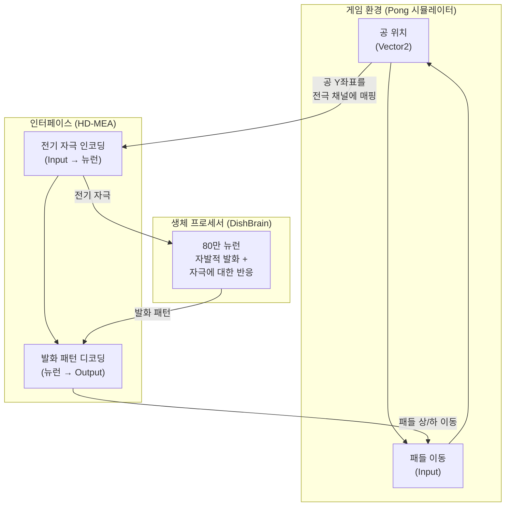
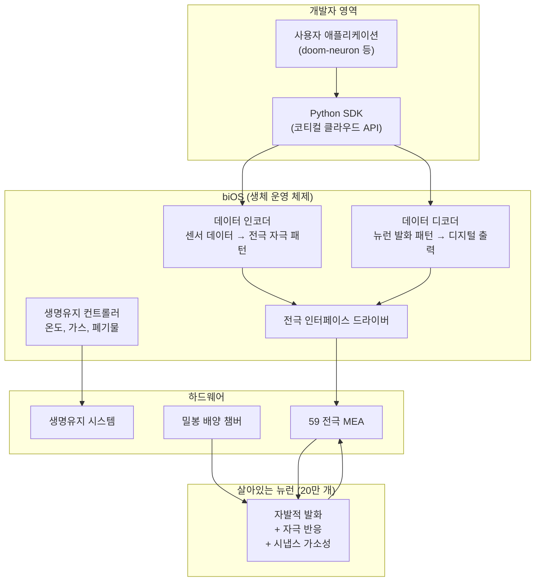
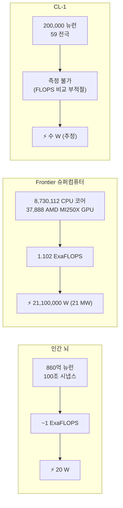
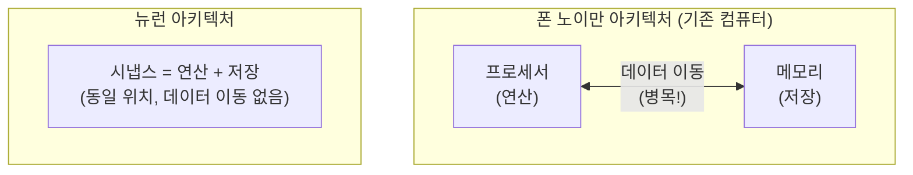
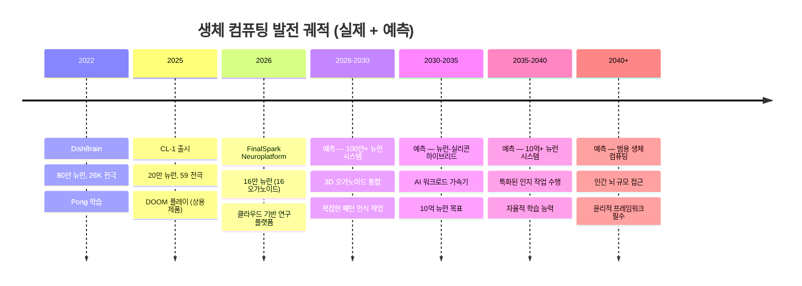
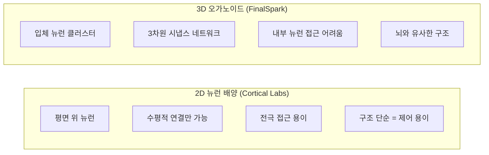
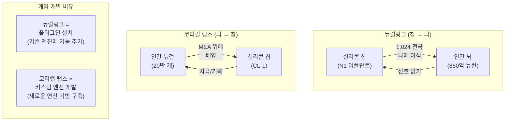
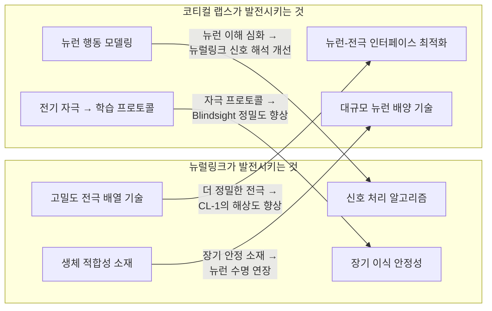

## 서론

2026년 2월, 호주 스타트업 코티컬 랩스(Cortical Labs)가 충격적인 시연 영상을 공개했습니다. **20만 개의 살아있는 인간 뉴런**이 칩 위에서 직접 1993년의 전설적 FPS 게임 **둠(DOOM)**을 플레이하는 모습이었습니다. 단순히 게임을 "실행"한 것이 아니라, 뉴런이 시각 정보를 받아 스스로 학습하며 캐릭터를 조작한 것입니다.

게임 개발자에게 이 뉴스는 여러 층위의 질문을 던집니다. 기술적으로 뉴런이 어떻게 게임 입력을 생성하는지, 현재 GPU 기반 컴퓨팅과 성능은 어떻게 비교되는지, 뉴럴링크의 BCI(Brain-Computer Interface) 기술과는 어떤 관계인지, 그리고 SAO(소드 아트 온라인)의 풀다이브 VR이 이 기술로 가능해지는지까지.

이 문서는 원본 논문의 정밀 분석부터 시작해 하드웨어 사양, 성능 비교, 경쟁 기술, 뉴럴링크 연관성, 통속의 뇌 시나리오, 풀다이브 VR 가능성까지 — **게임 개발자의 시각**에서 체계적으로 분석합니다.

---

## Part 1: 원본 소스와 논문 분석

이 뉴스의 근원을 추적하면, 하나의 핵심 논문과 그로부터 파생된 상용 제품에 도달합니다. 먼저 원본 출처를 정리하고, 논문의 핵심 메커니즘을 게임 개발자에게 익숙한 개념으로 해석해보겠습니다.

### 1. 원본 출처 정리

[AI타임스 기사](https://www.aitimes.com/news/articleView.html?idxno=207422)가 다루는 핵심은 코티컬 랩스의 **CL-1 시스템**입니다. 관련 원본 소스는 다음과 같습니다.

| 출처 | 유형 | 내용 |
|------|------|------|
| [코티컬 랩스 공식 사이트](https://corticallabs.com/) | 기업 | 회사 개요 및 기술 비전 |
| [CL-1 제품 페이지](https://corticallabs.com/cl1) | 제품 | 기술 사양 및 가격 |
| [코티컬 클라우드](https://corticallabs.com/cloud) | 플랫폼 | 원격 뉴런 접속 API |
| [코티컬 랩스 연구](https://corticallabs.com/research) | 학술 | 논문 목록 및 연구 개요 |
| [doom-neuron (GitHub)](https://github.com/SeanCole02/doom-neuron) | 오픈소스 | 둠 플레이 코드 (GPL-3.0) |
| [코티컬 랩스 GitHub](https://github.com/cortical-labs) | 오픈소스 | 공식 리포지토리 |

---

### 2. 핵심 논문: DishBrain (Neuron, 2022)

모든 것의 학술적 토대가 되는 논문입니다.

> **"In vitro neurons learn and exhibit sentience when embodied in a simulated game-world"**
> - 저자: Brett J. Kagan, Andy C. Kitchen, Nhi T. Tran, Forough Habibollahi, Moein Khajehnejad, Bradyn J. Parker, Anjali Bhat, Ben Rober, Adeel Razi, **Karl J. Friston** 외
> - 학술지: *Neuron*, Volume 110, Issue 23, pp. 3952-3969 (2022년 12월)
> - DOI: [10.1016/j.neuron.2022.09.001](https://doi.org/10.1016/j.neuron.2022.09.001)
> - [PubMed](https://pubmed.ncbi.nlm.nih.gov/36228614/) \| [Cell Press 원문](https://www.cell.com/neuron/fulltext/S0896-6273(22)00806-6) \| [PMC 전문](https://pmc.ncbi.nlm.nih.gov/articles/PMC9747182/)


_DishBrain 논문 Graphical Abstract. 출처: Kagan et al., Neuron (2022) — [PMC](https://pmc.ncbi.nlm.nih.gov/articles/PMC9747182/)_

저자 목록에서 **칼 프리스턴(Karl J. Friston)**이 눈에 띕니다. 유니버시티 칼리지 런던(UCL)의 신경과학 교수로, 이 논문의 핵심 학습 원리인 **자유 에너지 원리(Free Energy Principle)**의 창시자입니다. 이 사람이 공저자로 참여했다는 것 자체가 논문의 이론적 견고함을 보증합니다.

---

### 2-1. 실험 설계

논문의 실험 설계를 게임 개발자에게 익숙한 구조로 분해해봅시다.


_Figure 1: DishBrain 시스템 및 실험 프로토콜 개요도. 뉴런 배양체가 MEA를 통해 Pong 환경과 연결되는 구조를 보여준다. 출처: Kagan et al., Neuron (2022)_

**하드웨어 구성:**
- 인간 iPSC(유도만능줄기세포) 유래 뉴런 및 생쥐 배아 피질 뉴런 사용
- **고밀도 다중전극배열(HD-MEA)** 위에 배양 — 512~26,000개의 전극이 격자 형태로 배치
- 배양된 뉴런 집합체를 **DishBrain**이라 명명
- 약 80만 개의 뉴런 사용

**소프트웨어 연결:**
- 고전 아타리 게임 **Pong**의 시뮬레이션 환경 구축
- 게임 화면의 공 위치 정보를 전극을 통해 전기 자극 패턴으로 변환하여 뉴런에 전달
- 뉴런의 발화(firing) 패턴을 감지하여 게임 내 패들 이동 명령으로 변환

Unity 개발자에게 비유하면, 이 구조는 다음과 같습니다:




_Figure 2: 피질 세포가 형성한 고밀도 상호연결 네트워크. 생쥐 피질 뉴런(위)과 인간 iPSC 유래 뉴런(아래)의 면역형광 현미경 이미지. 녹색은 뉴런 마커, 빨간색은 교세포를 나타낸다. 출처: Kagan et al., Neuron (2022)_

핵심은 **폐루프(closed-loop)** 구조입니다. 게임 상태 → 뉴런 자극 → 뉴런 반응 → 게임 입력 → 게임 상태 변화 → 다시 뉴런 자극. Unity의 `Update()` 루프와 동일한 구조입니다. 차이점은 로직을 처리하는 주체가 C# 스크립트가 아니라 **살아있는 뉴런**이라는 점이죠.

---

### 2-2. 학습 메커니즘: 자유 에너지 원리 (Free Energy Principle)

이 논문의 가장 혁신적인 부분입니다. 뉴런의 학습 원리를 이해하기 위해, 먼저 게임에서의 강화학습과 비교해봅시다.

**기존 강화학습 (Reinforcement Learning):**
```
행동 → 결과 → 보상/벌칙 점수 → 점수를 최대화하는 방향으로 학습
```

게임 AI에서 널리 사용되는 이 패러다임은 **명시적인 보상 함수**가 필요합니다. Unity ML-Agents에서 `AddReward(1.0f)` 를 호출하는 것처럼요. 뉴런에게는 이런 보상 함수를 직접 정의할 수 없습니다. 뉴런은 코드가 아니니까요.

**자유 에너지 원리 (FEP) 기반 학습:**
```
뉴런은 자신이 받는 자극의 "예측 불가능성"을 최소화하려 한다
→ 예측 가능한 자극 = 안정 상태 (보상)
→ 예측 불가능한 자극 = 불안정 상태 (벌칙)
```


_Figure 4: DishBrain 하드웨어 셋업, 소프트웨어 데이터 흐름, 전극 레이아웃(감각/운동 영역 구분), 파일럿 테스트 3회 반복에 따른 성능 개선 추이. 출처: Kagan et al., Neuron (2022)_

DishBrain 실험에서는 이 원리를 다음과 같이 적용했습니다:


이것을 게임 개발의 비유로 설명하면:

| FEP 개념 | 게임 비유 |
|----------|---------|
| 예측 가능한 자극 (보상) | `Input.GetAxis()` — 일관된 입력 스트림 |
| 무작위 소음 (벌칙) | `Random.Range(-1f, 1f)` 가 매 프레임 입력으로 들어옴 |
| 뉴런의 학습 목표 | 입력 노이즈를 줄이고 예측 가능한 상태로 만들기 |
| 자유 에너지 | 시스템의 "혼란도" — 엔트로피와 유사한 개념 |

**핵심**: 기존 강화학습이 "점수를 올려라"라는 **외부 목표**를 부여하는 것과 달리, FEP는 뉴런의 **내재적 성질** — 예측 불가능한 자극을 피하려는 본능 — 을 이용합니다. 별도의 보상 함수 설계가 필요 없습니다.


_Figure 5: 뉴런이 Pong 환경에서 보여준 학습 성과. (A) 생쥐 피질 뉴런, (B) 인간 iPSC 뉴런의 평균 랠리 길이가 시간에 따라 통계적으로 유의미하게 증가했다. 대조군(무자극/개방형) 대비 폐루프 피드백 조건에서만 학습이 관찰되었다. 출처: Kagan et al., Neuron (2022)_

**실험 결과:**
- **5분 만에** 실시간 게임플레이에서 학습 징후 관찰
- 무작위 조작(control condition) 대비 통계적으로 유의미한 성능 향상
- 인간 뉴런이 생쥐 뉴런보다 더 빠르게 학습
- 폐루프 피드백이 없는 개방형(open-loop) 조건에서는 학습 미관찰 → **폐루프 구조가 필수**

> **💬 잠깐, 이건 알고 가자**
>
> **Q. 뉴런이 정말 "학습"한 건가요? 단순한 반사 반응은 아닌가요?**
>
> 논문은 이 질문에 상당히 엄밀하게 답합니다. 핵심 근거는 **시간에 따른 성능 향상 곡선**입니다. 뉴런의 Pong 점수(랠리 길이)가 세션이 진행될수록 통계적으로 유의미하게 증가했습니다. 단순 반사라면 시간에 따른 개선이 없어야 합니다. 또한 **폐루프 피드백을 제거하면 학습이 사라진다**는 통제 실험 결과가 핵심 증거입니다.
>
> **Q. 논문 제목의 "sentience"는 의식을 뜻하나요?**
>
> **아닙니다.** 이 맥락에서 sentience는 "의식" 또는 "자아"가 아니라, **"환경에 반응하고 적응하는 능력"**이라는 좁은 의미로 사용되었습니다. 논문 자체에서도 이를 명확히 구분합니다. 그럼에도 이 용어 선택은 학계에서 상당한 비판을 받았고, 미디어에서 "뉴런이 의식을 가졌다"로 과장 보도되는 원인이 되었습니다. 과학 커뮤니케이션의 중요성을 보여주는 사례입니다.
>
> **Q. 왜 하필 Pong인가요?**
>
> Pong은 **1차원 입력(공의 Y좌표), 1차원 출력(패들 상/하), 즉각적 피드백(성공/실패)**의 조건을 만족하는 가장 단순한 게임 환경입니다. 게임 개발에서 새 시스템을 테스트할 때 가장 단순한 씬부터 시작하는 것과 같은 원리입니다. 2026년에 DOOM으로 진화한 것은 입력 차원과 행동 공간이 대폭 확장된 것을 의미합니다.

---


_Figure 6: 폐루프 피드백의 중요성. 구조화된 피드백(stimulus)을 제공한 조건에서만 랠리 길이가 증가했다. 무자극(silent)과 개방형(no-feedback) 조건에서는 학습이 관찰되지 않았다 — 이것은 폐루프 구조가 학습의 필수 조건임을 증명한다. 출처: Kagan et al., Neuron (2022)_

## Part 2: CL-1 시스템 기술 분석

2022년의 DishBrain은 연구실 프로토타입이었습니다. 3년 후인 2025년, 코티컬 랩스는 이를 **상용 제품**으로 발전시켰습니다. CL-1은 세계 최초의 코드 배포 가능한(code-deployable) 생체 컴퓨터입니다.

### 3. 하드웨어 사양


_CL-1: 세계 최초의 상용 생체 컴퓨터. 밀봉 챔버 안에 생명유지 시스템과 뉴런 배양체, 전극 배열이 통합되어 있다. 가격 $35,000. 출처: [Cortical Labs](https://corticallabs.com/cl1)_

| 항목 | 사양 | 비교 참고 |
|------|------|----------|
| **뉴런 수** | ~200,000개 (인간 iPSC 유래) | DishBrain: ~800,000개 |
| **전극 수** | 59개 (평면 금속-유리 배열) | DishBrain HD-MEA: 최대 26,000개 |
| **지연시간** | 서브밀리초 (sub-ms) | DishBrain: 밀리초 단위 |
| **뉴런 수명** | 최대 6개월 (이상적 조건) | — |
| **생명유지** | 밀봉 챔버, 가스 조성/온도/폐기물 자동 관리 | — |
| **OS** | biOS (생체 운영 체제) | — |
| **외부 컴퓨터** | 불필요 (올인원) | — |
| **가격** | $35,000 (랙 구성: $20,000/유닛) | — |
| **출하** | 2025년부터 115대 상업 시스템 | — |

한 가지 주목할 점은 **전극 수가 오히려 줄었다**는 것입니다. DishBrain의 HD-MEA가 최대 26,000개 전극을 사용한 반면, CL-1은 59개입니다. 이것은 연구용 장비에서 상용 제품으로 전환하면서 **비용, 안정성, 유지보수성**을 우선시한 결과입니다. Unity로 비유하면, 에디터에서는 수천 개의 디버그 오브젝트를 배치하지만 릴리스 빌드에서는 필수적인 것만 남기는 것과 같습니다.

**전극 밀도 계산:**
```
200,000 뉴런 ÷ 59 전극 = 전극 1개당 ~3,390개 뉴런
```

이것은 극도로 거친(coarse) 인터페이스입니다. 한 전극이 수천 개 뉴런의 집합적 활동을 측정하는 것이므로, 개별 뉴런 수준의 제어는 불가능합니다. 게임에서 비유하면, 1920×1080 해상도 화면을 32×32 픽셀로 다운샘플링해서 보는 것과 비슷합니다 — 대략적인 윤곽은 파악되지만 세부 사항은 알 수 없습니다.

---

### 3-1. 소프트웨어 아키텍처: biOS

CL-1의 소프트웨어 스택은 게임 개발자에게 익숙한 구조를 가지고 있습니다.



이 구조를 Unity의 아키텍처와 대응시키면:

| CL-1 컴포넌트 | Unity 대응 | 역할 |
|--------------|-----------|------|
| Python SDK | UnityEditor API | 개발자가 로직을 작성하는 인터페이스 |
| biOS 인코더/디코더 | Input System + Renderer | 입출력 변환 |
| 전극 배열 | GPU 셰이더 유닛 | 실제 연산이 일어나는 하드웨어 접점 |
| 살아있는 뉴런 | ??? (대응 불가) | **이것이 핵심 차이** |
| 생명유지 시스템 | 냉각 시스템, 전원 공급 | 하드웨어 유지 |

마지막 행이 중요합니다. 기존 컴퓨팅에서 "연산을 수행하는 주체"는 결정론적 실리콘 트랜지스터입니다. 동일한 입력에 항상 동일한 출력을 보장합니다. 하지만 뉴런은 **비결정론적**입니다. 동일한 자극에도 매번 약간 다른 발화 패턴을 보입니다. 이것은 버그가 아니라 **학습과 적응의 기반**이 되는 핵심 특성입니다.

---

### 3-2. DOOM 플레이: 실제 성능 평가

독립 개발자 Sean Cole이 코티컬 클라우드 API를 사용해 **1주일 이내**에 DOOM 플레이를 구현했습니다. 코드는 [GitHub](https://github.com/SeanCole02/doom-neuron)에 GPL-3.0 라이선스로 공개되어 있습니다.

**DOOM vs Pong — 복잡도 비교:**

| 요소 | Pong (2022) | DOOM (2026) |
|------|------------|-------------|
| **입력 차원** | 1D (공의 Y좌표) | 2D (시야 프레임) |
| **출력 행동** | 2개 (상/하) | 4개+ (전진/후진/좌/우회전/사격) |
| **환경** | 정적 2D | 동적 3D (적, 아이템, 벽) |
| **시간 압박** | 낮음 | 높음 (적의 공격) |
| **뉴런 수** | 800,000 | 200,000 |
| **전극 수** | 최대 26,000 | 59 |

흥미로운 점은 뉴런 수와 전극 수가 **모두 줄었음에도** 더 복잡한 게임을 플레이한다는 것입니다. 이것은 하드웨어의 발전이라기보다 **소프트웨어 인터페이스(biOS)의 발전**과 **인코딩/디코딩 알고리즘의 개선** 덕분입니다.

**현실적 성능 평가:**

| 기준 | 평가 | 상세 |
|------|------|------|
| 무작위 행동 대비 | **명확히 우월** | 학습 증거 확인됨 |
| 일반 인간 수준 | **미달** | 움직임이 불확실하고 끊김 |
| 전략적 플레이 | **불가** | 기본적 반응 수준에 머무름 |
| 학습 속도 | **약 1주일** | 기초적 게임플레이 학습 |

20만 개의 뉴런으로 인간 수준의 게임 플레이를 기대하는 것은 무리입니다. 인간 뇌는 **860억 개**의 뉴런을 보유하고 있으니까요.

```
200,000 / 86,000,000,000 = 0.00000232...
```

**현재 CL-1의 뉴런 수는 인간 뇌의 0.00023%에 불과합니다.** Unity로 비유하면, LOD(Level of Detail)의 최하위 레벨 — 멀리 있는 캐릭터를 6개의 삼각형으로 표현하는 것과 비슷한 수준입니다.

> **💬 잠깐, 이건 알고 가자**
>
> **Q. 뉴런 수를 늘리면 성능이 비례해서 좋아지나요?**
>
> **단순히 비례하지는 않습니다.** 뉴런의 가치는 뉴런 수 자체보다 **시냅스 연결의 밀도와 구조**에 있습니다. 인간 뇌의 860억 뉴런은 약 **100조(10¹⁴) 개의 시냅스**로 연결되어 있습니다. 뉴런 하나당 평균 ~7,000개의 시냅스입니다. CL-1의 2D 배양 환경에서는 이런 3차원적 연결 구조를 재현하기 어렵습니다. LLM에서 파라미터 수만 늘린다고 성능이 비례 향상되지 않는 것과 유사합니다 — 아키텍처, 학습 데이터, 후처리가 모두 중요하듯이요.
>
> **Q. 뉴런이 죽으면 어떻게 되나요?**
>
> 뉴런 배양의 수명은 현재 **최대 6개월**입니다. 뉴런이 사멸하면 새 배양을 시작해야 합니다. 이것은 기존 컴퓨팅과 가장 극적인 차이점 중 하나입니다. **SSD가 고장나면 교체하듯, 뉴런 배양이 사멸하면 새로 배양해야 합니다.** 다만, 뉴런의 "학습" 결과는 새 배양에 전이되지 않습니다 — 이전 세션의 가중치를 로드할 수 없는 셈이죠. 이것은 향후 가장 중요한 기술적 과제 중 하나입니다.

---

## Part 3: 생체 뉴런 vs 실리콘 — 성능 비교

이 섹션이 가장 핵심입니다. 게임 개발자에게 성능 수치는 일상적인 관심사죠. LLM 가이드에서 GPU VRAM과 대역폭을 비교했듯이, 여기서는 **생체 뉴런과 실리콘의 성능을 정량적으로 비교**합니다.

### 4. 에너지 효율: 100만 배의 차이

생체 컴퓨팅이 주목받는 가장 근본적인 이유입니다.

**스파이크(발화) 단위 에너지 비교:**

| 프로세서 유형 | 에너지/스파이크 | 인간 뇌 대비 |
|-------------|---------------|-------------|
| **생체 뉴런** | ~10⁻¹¹ J/spike | 기준 (1x) |
| **뉴로모픽 칩** (Intel Loihi) | ~10⁻⁸ J/spike | ~1,000배 비효율 |
| **디지털 GPU** (NVIDIA) | ~10⁻³ ~ 10⁻⁷ J/spike | ~10,000 ~ 100,000,000배 비효율 |

이 수치의 의미를 체감하기 위해, **시스템 수준**에서 비교해봅시다:



| 지표 | 인간 뇌 | Frontier (2022) | 비율 |
|------|---------|-----------------|------|
| **연산 능력** | ~1 ExaFLOPS (추정) | 1.102 ExaFLOPS | ~1:1 |
| **전력 소비** | 20 W | 21,100,000 W (21 MW) | **1 : 1,055,000** |
| **무게** | ~1.4 kg | ~수천 톤 | — |
| **부피** | ~1,200 cm³ | 대형 건물 1채 | — |
| **에너지 효율** | 50 PetaFLOPS/W | 0.052 PetaFLOPS/W | **~960,000배** |

> 인간의 뇌는 **20와트** — 희미한 전구 하나를 켤 정도의 전력으로 엑사플롭급 연산을 수행합니다. 동일한 성능의 슈퍼컴퓨터 Frontier는 **21메가와트** — 소형 도시 하나의 전력을 소비합니다.

이것이 바로 생체 컴퓨팅 연구자들이 이 분야에 매달리는 이유입니다. 에너지 효율에서 **약 100만 배**의 격차가 존재합니다. AI 모델의 학습과 추론에 소비되는 전력이 폭증하는 현 상황에서, 이 격차는 거대한 기회를 의미합니다.

---

### 4-1. FLOPS 비교의 한계: 왜 직접 비교가 어려운가

위 표에서 "인간 뇌 ~1 ExaFLOPS"라는 수치는 **추정치**이며, 연구자마다 10~20 PetaFLOPS에서 1 ExaFLOPS까지 큰 편차를 보입니다. 이런 불확실성이 존재하는 근본적인 이유가 있습니다.

**FLOPS(Floating Point Operations Per Second)**는 실리콘 프로세서의 성능 지표입니다. 뉴런은 부동소수점 연산을 하지 않습니다. 뉴런이 하는 것은:

1. **전기화학적 신호 전파**: 이온 채널을 통한 전위 변화
2. **시냅스 가소성**: 연결 강도의 동적 변화
3. **비선형 통합**: 수천 개 입력의 복잡한 합산

이것을 FLOPS로 환산하는 것은, 게임 엔진의 성능을 "초당 셰이더 명령어 수"로만 측정하는 것과 비슷합니다 — 한 측면만 보는 것이죠. 뉴런의 진짜 강점은 **연산과 메모리가 같은 장소에 있다**는 점입니다.




_Figure 7: 게임플레이와 휴식 시 뉴런의 전기생리학적 활동 비교. 게임플레이 중 감각-운동 영역 간 연결성이 강화되고, 정보 엔트로피가 변화하며, 기능적 가소성이 관찰된다. 이 데이터가 바로 뉴런의 "학습"이 발생했음을 보여주는 직접적 증거다. 출처: Kagan et al., Neuron (2022)_

기존 컴퓨터의 가장 큰 병목인 **폰 노이만 병목(Von Neumann bottleneck)** — CPU와 메모리 사이의 데이터 이동 — 이 뉴런에는 존재하지 않습니다. 시냅스 자체가 연산기이자 메모리이기 때문입니다.

LLM 가이드에서 VRAM 대역폭이 추론 속도의 핵심 병목이라고 설명했던 것을 떠올려보세요:

```
시스템 RAM (DDR5):             ~50-90 GB/s
NVIDIA VRAM (HBM3e):           ~3,350 GB/s
생체 뉴런:                      병목 자체가 없음 (in-situ 연산)
```

뉴런의 에너지 효율이 극단적으로 높은 이유가 바로 이것입니다. **데이터를 이동시키지 않기 때문**입니다.

> **💬 잠깐, 이건 알고 가자**
>
> **Q. 뉴로모픽 칩(Intel Loihi, IBM TrueNorth)은 뭔가요? 생체 뉴런과 다른 건가요?**
>
> **완전히 다릅니다.** 뉴로모픽 칩은 뉴런의 동작을 **실리콘 트랜지스터로 모방**하는 하드웨어입니다. 생체 뉴런을 사용하지 않습니다. 뉴런의 스파이킹 패턴을 하드웨어 레벨에서 시뮬레이션하는 것이죠. Intel의 Hala Point 시스템은 기존 CPU/GPU 대비 50배 빠르고 100배 에너지 효율적이라고 주장합니다. 하지만 실제 생체 뉴런과 비교하면 아직 1,000배 이상 비효율적입니다.
>
> **Q. 그렇다면 생체 뉴런이 압도적으로 좋은 거 아닌가요? 왜 아직 실리콘을 쓰나요?**
>
> **결정론성(determinism)과 스케일링** 때문입니다. 실리콘은 동일한 입력에 항상 동일한 출력을 보장합니다. 생체 뉴런은 그렇지 않습니다. 또한 실리콘 칩은 나노미터 수준 공정으로 수십억 개의 트랜지스터를 집적할 수 있지만, 생체 뉴런을 같은 밀도로 배양하는 것은 현재 불가능합니다. 게임 서버가 결정론적이어야 하듯, 대부분의 컴퓨팅 워크로드는 결정론성을 요구합니다. 생체 컴퓨팅은 결정론성이 덜 중요한 — 패턴 인식, 적응적 학습 같은 — 영역에서 강점을 발휘할 것입니다.

---

### 5. 미래 성능 예측: 생체 컴퓨팅이 발전한다면?

LLM의 발전 궤적과 비교해봅시다. LLM은 GPT-1(2018, 1.17억 파라미터)에서 GPT-4(2023, ~1.8조 파라미터 추정)까지 5년 만에 약 **15,000배** 스케일업했습니다. 생체 컴퓨팅에서 유사한 궤적이 가능할까요?



**현실적 한계와 기술적 과제:**

| 과제 | 현황 | 난이도 | 게임 개발 비유 |
|------|------|--------|--------------|
| **스케일링** | 20만 → 860억 = 43만 배 | 극도로 높음 | 프로토타입 → AAA 타이틀 |
| **수명** | 최대 6개월 | 높음 | 라이브 서비스 안정성 |
| **정밀도** | 59전극/20만뉴런 | 높음 | 해상도 32×32 → 4K |
| **재현성** | 비결정론적 | 중간 | 랜덤 시드 고정 불가 |
| **3D 구조** | 2D 배양 → 3D 오가노이드 | 높음 | 2D 게임 → 3D 게임 |
| **학습 전이** | 불가 (배양 간 전이 없음) | 매우 높음 | 세이브 파일 없는 로그라이크 |

**낙관적 시나리오에서의 성능 예측:**

| 시점 | 뉴런 수 | 전극 밀도 | 예상 능력 | 에너지 효율 이점 |
|------|--------|----------|----------|----------------|
| 2026 (현재) | 20만 | 59개 | 단순 게임 반응 | 증명 단계 |
| 2030 | 500만 | 1,000+ | 패턴 인식 보조 | 특정 워크로드에서 GPU 대비 100x |
| 2035 | 1억 | 10,000+ | 특화 AI 워크로드 가속 | 데이터센터 에너지 절감 |
| 2040 | 10억+ | 100,000+ | 범용 학습 시스템 | 패러다임 전환 가능성 |

---

## Part 4: 경쟁자들 — FinalSpark과 오가노이드 지능

코티컬 랩스만이 이 분야의 유일한 플레이어가 아닙니다. 게임 산업에서 Unreal과 Unity가 경쟁하며 발전하듯, 생체 컴퓨팅에서도 서로 다른 접근 방식이 경쟁하고 있습니다.

### 6. FinalSpark (스위스) — 클라우드 기반 뇌 오가노이드

| 항목 | FinalSpark | Cortical Labs |
|------|-----------|---------------|
| **설립** | 2014년, 스위스 | 2019년, 호주 |
| **접근** | 3D 뇌 오가노이드 (미니 뇌) | 2D 뉴런 배양 |
| **뉴런 수** | ~160,000 (16 오가노이드) | ~200,000 |
| **플랫폼** | [Neuroplatform](https://finalspark.com/neuroplatform/) (클라우드 전용) | CL-1 (하드웨어) + Cloud |
| **현재 능력** | ~1비트 저장, 단순 자극-반응 | DOOM 플레이 수준 |
| **비즈니스** | 월정액 구독 기반 연구 접근 | 하드웨어 판매 ($35K) |
| **에너지 효율** | 실리콘 대비 100만 배 효율 주장 | 유사 수준 |
| **학습 방식** | 도파민 기반 (2025년 시도) | 자유 에너지 원리 |
| **오가노이드 수명** | ~100일 (목표: 200일+) | ~6개월 |

FinalSpark의 독특한 접근은 **3D 오가노이드**를 사용한다는 점입니다. 2D 배양(평면)과 3D 오가노이드(입체)의 차이는 게임 개발에서의 2D와 3D의 차이와 유사합니다:



---

### 6-1. 오가노이드 지능 (Organoid Intelligence)

존스홉킨스 대학의 Thomas Hartung 교수 팀이 2023년 제안한 **[오가노이드 지능(Organoid Intelligence)](https://www.frontiersin.org/journals/science/articles/10.3389/fsci.2023.1017235/full)** 개념은 이 분야의 학술적 프레임워크를 제공합니다.

뇌 오가노이드는 줄기세포에서 분화시킨 **미니 뇌**입니다. 수 밀리미터 크기의 구체 안에 수십만 개의 뉴런이 자발적으로 조직화되어, 실제 뇌의 초기 발달 단계와 유사한 구조를 형성합니다.

최근 존스홉킨스 연구팀은 **실험실 뇌 오가노이드가 학습과 기억의 기본 구성 요소를 보여준다**는 [연구 결과](https://publichealth.jhu.edu/2025/johns-hopkins-team-finds-lab-grown-brain-organoids-show-building-blocks-for-learning-and-memory)를 발표했으며, 이 연구에 **코티컬 랩스가 공동 참여**했습니다. 경쟁하면서도 협력하는 — 게임 산업에서 Unreal이 오픈소스 전략으로 생태계를 키우는 것과 유사한 방식입니다.

> **💬 잠깐, 이건 알고 가자**
>
> **Q. 오가노이드가 의식을 가질 수 있나요?**
>
> 현재 수준에서는 **아닙니다.** 현재의 뇌 오가노이드는 임신 약 12~16주 수준의 태아 뇌와 유사한 구조입니다. 감각 입력도 없고, 신체도 없습니다. 의식의 출현에 필요한 요소들(감각 통합, 자기 참조, 시간 지각 등)이 없습니다. 하지만 오가노이드의 복잡도가 계속 증가하면, **어느 시점에서 윤리적 경계선을 고민해야 하는지**는 현재 활발히 논의 중입니다. 2025년 1월 The Mimir Center에서 **[뇌 에뮬레이션의 철학과 윤리 워크숍](https://mimircenter.org/news/report-from-the-workshop-on-the-philosophy-and-ethics-of-brain-emulation-27-28-january-2025)**이 개최된 것은 이 문제의 시급성을 반영합니다.
>
> **Q. FinalSpark의 "1비트 저장"이 의미하는 것은?**
>
> 말 그대로 **1비트(0 또는 1)의 정보를 저장하고 인출**할 수 있다는 뜻입니다. 현대 컴퓨터가 테라바이트를 처리하는 것에 비하면 극도로 초보적입니다. 하지만 중요한 것은 **살아있는 뉴런이 디지털 정보를 저장할 수 있음을 증명**했다는 점입니다. 트랜지스터의 초기 역사에서도 최초의 트랜지스터(1947)는 아무 실용적 가치가 없었지만, 그것이 Intel 4004(1971)와 A17 Pro(2023)로 이어졌습니다.

---

## Part 5: 뉴럴링크와의 연관성

### 7. 반대 방향, 같은 목표

코티컬 랩스와 뉴럴링크의 관계를 이해하는 가장 좋은 비유는 **클라이언트-서버 아키텍처**입니다.



코티컬 랩스 스스로 이를 **"역(逆) 뉴럴링크(Reverse Neuralink)"**라고 표현한 바 있습니다.

| 비교 | 뉴럴링크 | 코티컬 랩스 |
|------|---------|------------|
| **방향** | 실리콘 → 뇌 (이식) | 뇌 → 실리콘 (배양) |
| **목적** | 인간 능력 확장/복원 | 새로운 컴퓨팅 패러다임 |
| **대상 사용자** | 환자 → 일반 소비자 | 연구자 → 개발자 |
| **규제** | FDA 의료기기 (극도로 엄격) | 연구 장비 (상대적으로 유연) |
| **윤리적 초점** | 환자 안전, 뇌 프라이버시 | 뉴런의 도덕적 지위 |
| **스케일** | 1,024 전극/뇌 | 59 전극/200K 뉴런 |

---

### 7-1. 뉴럴링크 현황 (2025-2026)

뉴럴링크의 진전 속도는 놀랍습니다.

| 시점 | 이정표 |
|------|--------|
| 2024년 1월 | 첫 인간 임플란트 (Noland Arbaugh) |
| 2025년 5월 | FDA Breakthrough Device — 음성 복원 기술 |
| 2025년 9월 | 전 세계 **12명**에게 임플란트 완료 |
| 2025년 | UAE, 영국으로 임상 시험 확대 |
| 2025년 | 시리즈 E $6.5억 (기업가치 ~$90억) |
| 2026년 예정 | **대량 생산** 시작, 자동화 수술 절차 |
| 2026년 예정 | **Blindsight** 첫 환자 시험 (시각 복원) |

**Blindsight**는 특히 주목할 가치가 있습니다. 눈이나 시신경에 문제가 있는 환자의 **시각 피질에 직접 전기 자극**을 보내 시각 정보를 전달하는 기술입니다. 이것이 성공하면, **뇌에 직접 영상을 주입하는** 초기 단계가 실현되는 것이며 — 이것은 풀다이브 VR의 핵심 전제 조건 중 하나입니다.

---

### 7-2. 시너지: 왜 상호 보완적인가

이 두 기술은 경쟁이 아니라 **시너지**를 형성합니다. 각각이 발전시키는 기술이 상대방의 핵심 과제를 해결합니다.



**뉴럴링크가 발전시키는 전극 기술**은 CL-1의 59개 전극이라는 한계를 돌파하는 데 직접 기여할 수 있습니다. 뉴럴링크의 N1 임플란트는 이미 **1,024개 전극**을 인간 뇌에 안전하게 삽입합니다.

반대로, **코티컬 랩스가 축적하는 뉴런 행동 데이터**는 뉴럴링크가 뇌 신호를 해석하는 알고리즘을 개선하는 데 활용됩니다. 칩 위의 뉴런은 통제된 환경에서 관찰할 수 있으므로, 인체 내부에서는 파악하기 어려운 뉴런의 미세한 행동 패턴을 연구하는 데 이상적입니다.

> **💬 잠깐, 이건 알고 가자**
>
> **Q. 뉴럴링크 사용자가 이미 게임을 하고 있다던데?**
>
> 맞습니다. 2024년 첫 임플란트를 받은 Noland Arbaugh는 **생각만으로 비디오 게임, 온라인 체스** 등을 플레이하고 있습니다. 하지만 이것은 코티컬 랩스와 근본적으로 다릅니다. 뉴럴링크는 **인간의 의도를 읽어서 기존 컴퓨터의 입력으로 변환**하는 것이고, 코티컬 랩스는 **뉴런 자체가 연산 주체**가 되는 것입니다. 비유하면, 뉴럴링크는 "음성 인식으로 게임 조작", 코티컬 랩스는 "AI가 직접 게임 플레이"에 가깝습니다.

---

## Part 6: 통속의 뇌 — 철학에서 현실로

### 8. 전통적 사고 실험

"통속의 뇌(Brain in a Vat)"는 힐러리 퍼트남(Hilary Putnam)이 1981년에 제안한 철학적 사고 실험입니다. 데카르트의 "악마 가설"의 현대판으로, 뇌를 몸에서 분리해 영양액 통에 넣고, 신경을 슈퍼컴퓨터에 연결해 완벽한 가상 현실을 경험하게 만든다면 — 그 뇌는 자신이 통 속에 있다는 것을 알 수 있을까?

2026년 현재, 코티컬 랩스의 CL-1은 이 사고 실험의 **물리적 구현을 처음으로 달성한 시스템**이라고 할 수 있습니다:

| 사고 실험 요소 | 이론 | CL-1 구현 |
|--------------|------|----------|
| 뇌를 몸에서 분리 | 외과적 적출 | iPSC에서 뉴런 분화 ✅ |
| 영양액 통에서 생존 | 생명유지 시스템 | 밀봉 챔버 + 자동 생명유지 ✅ |
| 신경에 전기 자극 | 슈퍼컴퓨터 연결 | 59전극 MEA + biOS ✅ |
| 가상 "환경" 제공 | 완벽한 현실 시뮬레이션 | DOOM 게임 환경 ✅ (극도로 단순) |
| 뇌가 환경에서 "행동" | 자유의지적 선택 | 뉴런이 학습하며 게임 플레이 ✅ |

물론 현재 수준과 사고 실험 사이의 격차는 천문학적입니다. 20만 뉴런에게 저해상도 DOOM 화면을 보여주는 것과, 860억 뉴런에게 현실과 구별 불가능한 시뮬레이션을 제공하는 것은 완전히 다른 차원의 문제입니다.

---

### 8-1. 매트릭스의 재해석: 에너지 배터리에서 연산 장치로

영화 매트릭스(1999)에서 기계 문명은 인간을 **에너지 배터리**로 사용합니다. 하지만 이것은 열역학적으로 말이 되지 않습니다.

**열역학적 분석:**

```
인간의 신진대사 출력: ~80-100W (열 + 역학 에너지)
인간 유지에 필요한 에너지: ~2,000 kcal/일 = ~97W
→ 순 에너지 출력: 거의 0 또는 마이너스
→ 에너지원으로서의 인간: 적자 사업
```

인간은 먹은 만큼의 에너지를 소비하므로, 에너지 배터리로는 **열역학 제2법칙**을 위반합니다. 매트릭스의 원래 각본에서는 인간을 에너지원이 아니라 **연산 장치**로 사용하는 설정이었으나, 관객 이해를 위해 "배터리"로 단순화되었다는 비화가 있습니다.

생체 컴퓨팅의 관점에서 재분석하면, **연산 장치 시나리오가 훨씬 합리적**입니다:

| 비교 | 에너지 배터리 (영화) | 연산 장치 (재해석) |
|------|-------------------|------------------|
| **열역학** | 불가능 (에너지 적자) | 가능 |
| **인간의 가치** | ~100W 열 출력 | **20W로 1 ExaFLOPS** |
| **대안과의 비교** | 태양광 패널이 훨씬 효율적 | 동급 슈퍼컴 21MW 필요 — 인간 뇌가 **100만 배 효율** |
| **수량 스케일링** | 비효율 * 수십억 = 여전히 비효율 | 수십억 뇌 = **수십억 ExaFLOPS** |

수십억 인간의 뇌를 네트워크로 연결한 분산 연산 시스템 — 각 노드가 20W로 1 ExaFLOPS를 처리하는 — 은 상상할 수 있는 가장 에너지 효율적인 슈퍼컴퓨터 클러스터입니다. 인간을 가상 현실(매트릭스)에 가둬두는 것은 뇌를 "유휴 상태"로 만들지 않기 위한 — 즉 연산 자원을 최대한 활용하기 위한 — 장치로 재해석됩니다.

**물론 이것은 디스토피아적 사고 실험입니다.** 하지만 CL-1이 증명한 "인간 뉴런을 연산 장치로 활용할 수 있다"는 사실은, 이 시나리오가 순수한 공상이 아니라 **기술적으로 초보적인 형태에서 이미 실현되고 있다**는 것을 보여줍니다.

---

### 8-2. 윤리적 문제: 현재진행형

이것은 단순한 SF 토론이 아닙니다. **지금 현재** 학계와 규제 기관에서 활발히 논의되는 현실적 질문들입니다.

| 윤리적 질문 | 현재 상황 | 긴급도 |
|-----------|---------|--------|
| **뉴런의 도덕적 지위** | 칩 위의 뉴런은 "살아있는 존재"인가? 고통이나 선호가 있는가? | 중간 |
| **상업화 경계** | $35,000에 인간 뉴런 기반 컴퓨터를 판매하는 것의 한계 | 높음 |
| **규모 확장** | 10억, 100억 뉴런으로 확장 시 의식 출현 가능성 | 미래 (10-20년) |
| **동의 문제** | 뉴런 원본 세포 제공자의 동의 범위 | 높음 |
| **데이터 윤리** | 뉴런의 발화 패턴은 "개인정보"인가? | 새로운 영역 |

2025년 1월 The Mimir Center의 **[뇌 에뮬레이션 윤리 워크숍](https://mimircenter.org/news/report-from-the-workshop-on-the-philosophy-and-ethics-of-brain-emulation-27-28-january-2025)**에서는 전뇌 에뮬레이션(Whole Brain Emulation, WBE)의 윤리적 프레임워크를 논의했습니다. 여기서 제기된 핵심 질문:

> **"기술이 특정 임계점을 넘으면, 실험 대상의 도덕적 지위가 갑자기 변할 수 있는가? 그 임계점을 어떻게 정의할 것인가?"**

이것은 게임 개발에서 AI NPC의 행동이 점점 정교해질 때 "이 NPC에게 '감정'이 있는가?"라는 질문을 던지는 것과 구조적으로 동일합니다. 차이점은 게임의 NPC는 코드이지만, 오가노이드의 뉴런은 **실제 인간 세포**라는 점입니다.

---

## Part 7: 풀다이브 VR — SAO의 너브기어는 가능한가?

### 9. 풀다이브 VR의 기술 요구사항 분해

소드 아트 온라인(SAO)의 너브기어(NerveGear)가 하는 일을 기술적으로 분해해봅시다.


이 각각의 요구사항을 현재 기술과 매핑해봅시다:

| 요구사항 | 관련 기술 | 2026년 현재 수준 | 목표 수준 | 격차 |
|----------|---------|----------------|---------|------|
| **① 시각 입력** | Neuralink Blindsight | 시각 피질 자극으로 인광(phosphene) 생성 가능 | 인간 시각과 동일한 해상도/색감/동적 범위 | ⬛⬛⬛⬛⬜ 매우 큼 |
| **② 청각 입력** | 인공 와우 기술 | 달팽이관 자극으로 소리 전달 (40년+ 역사) | 완전한 3D 사운드스케이프 | ⬛⬛⬜⬜⬜ 큼 |
| **③ 촉각 입력** | 연구 초기 단계 | 피부 전기 자극 실험 수준 | 전신 촉각 피드백 | ⬛⬛⬛⬛⬛ 극도로 큼 |
| **④ 운동 의도 해석** | Neuralink N1 | 커서 제어, 게임 조작 수준 | 전신 운동 의도 완벽 해석 | ⬛⬛⬛⬛⬜ 매우 큼 |
| **⑤ 운동 차단** | 수면 마비 연구 | 마취 기술 존재 (비가역적 위험) | 안전한 가역적 신체 마비 | ⬛⬛⬛⬜⬜ 큼 |
| **⑥ 양방향 대역폭** | BCI 전극 기술 | ~수천 채널 | 수백만~수억 채널 | ⬛⬛⬛⬛⬛ 극도로 큼 |
| **⑦ 안전성** | 임상 시험 단계 | 장기 이식 안전성 연구 중 | 완벽한 안전 보장 | ⬛⬛⬛⬛⬜ 매우 큼 |

---

### 9-1. 생체 컴퓨팅이 풀다이브 VR에 기여하는 점

코티컬 랩스의 기술이 **직접적으로** 풀다이브 VR을 가능하게 하지는 않습니다. 하지만 **3가지 핵심 영역에서 간접적으로 기여**합니다.

**① 뉴런-전극 인터페이스 기술 발전**

풀다이브 VR의 핵심 병목은 **뇌와 외부 시스템 간의 대역폭**입니다. 현재 뉴럴링크의 1,024 전극으로는 커서를 움직이는 정도가 가능합니다. 풀다이브 VR에는 **수백만 개의 전극**이 필요합니다.

CL-1의 전극 기술이 발전하면 → 뉴럴링크 등 BCI의 전극 밀도가 향상되고 → 풀다이브 VR의 가능성이 열립니다.

**② 뉴런 행동 이해의 심화**

칩 위에서 뉴런의 반응을 통제된 환경에서 관찰하는 것은, 인체 내부의 뇌를 연구하는 것보다 **훨씬 정밀한 데이터**를 제공합니다. 이 데이터는 "어떤 전기 자극 패턴이 어떤 감각을 유발하는가"에 대한 이해를 심화시킵니다.

**③ 에너지 효율적 시뮬레이션**

풀다이브 VR에서 가상 세계를 실시간으로 렌더링하는 것은 엄청난 연산을 요구합니다. 현재 VR 게임이 RTX 4090에서도 90fps를 유지하기 어려운데, 풀다이브 수준의 감각 시뮬레이션은 그 수백~수천 배의 연산을 요구할 것입니다.

```
현재 VR: ~10 TFLOPS (RTX 4090 급)
풀다이브 VR 추정: ~10,000+ TFLOPS (감각 시뮬레이션 포함)
인간 뇌: ~1,000,000 TFLOPS (1 ExaFLOPS)를 20W로 처리
```

생체 컴퓨팅의 에너지 효율이 실용 수준에 도달하면, 풀다이브 VR에 필요한 연산을 **지속 가능한 전력**으로 처리할 수 있게 됩니다.

---

### 9-2. 현실적 타임라인

| 시점 | 예상 기술 수준 | 관련 기술 |
|------|-------------|----------|
| **2026-2030** | 고해상도 시각 피질 자극 성공, 기본 촉각 피드백 연구 | Neuralink Blindsight, 촉각 BCI |
| **2030-2035** | 다감각 BCI (시각+청각+촉각), 기본 운동 의도 해석 확장 | 고밀도 전극 (10만+ 채널) |
| **2035-2040** | 고대역폭 양방향 BCI, 초보적 가상 감각 경험 | 뉴런-전극 직접 통합 |
| **2040-2050** | 제한된 풀다이브 프로토타입 (불완전한 감각, 짧은 세션) | 생체+실리콘 하이브리드 |
| **2050-2060** | 풀다이브 VR 초기 상용화 (의료/훈련 목적) | 범용 BCI + 생체 컴퓨팅 |
| **2060+** | 소비자용 풀다이브 VR (낙관적 시나리오) | 성숙한 기술 + 윤리 프레임워크 |

이 타임라인에서 가장 중요한 전제는 **뇌과학의 근본적 발전**입니다. 현재 우리는 860억 뉴런이 어떻게 의식을 형성하는지조차 완전히 이해하지 못합니다. 풀다이브 VR은 뇌의 감각 처리 방식을 **완전히 이해하고, 그것을 인위적으로 재현**할 수 있어야 합니다.

게임 개발에 비유하면, 현재 우리는 **엔진의 소스코드 없이 런타임 동작만 관찰하면서 역공학을 시도하는 단계**입니다. 소스코드(뇌의 완전한 작동 원리)를 이해하기까지는 아직 갈 길이 멉니다.

> **💬 잠깐, 이건 알고 가자**
>
> **Q. 풀다이브 VR의 가장 큰 기술적 장벽은 무엇인가요?**
>
> **양방향 대역폭**입니다. 현재 BCI는 뇌의 신호를 "읽는" 것은 점점 잘하고 있지만, 뇌에 정보를 "쓰는" 것은 훨씬 어렵습니다. 인간의 시각 시스템은 시신경을 통해 **초당 약 10Mbit**의 정보를 전달합니다. 5감 전체를 합하면 그 이상입니다. 현재 BCI가 뇌에 주입할 수 있는 정보량은 이에 비하면 극도로 제한적입니다. 뉴럴링크의 Blindsight도 초보적인 인광(밝은 점) 수준의 자극이지, 풀 HD 영상을 주입하는 수준이 아닙니다.
>
> **Q. 비침습적 방식(수술 없이)으로는 불가능한가요?**
>
> 현재 기술로는 **매우 어렵습니다.** EEG(뇌파 측정) 같은 비침습적 방식은 두개골을 통과하면서 신호가 크게 감쇠되어 해상도가 극히 낮습니다. 풀다이브 VR 수준의 정밀한 뉴런 제어에는 **침습적 전극**이 불가피할 것으로 보입니다. 다만 초음파 기반 신경 자극(tFUS) 같은 새로운 비침습 기술이 연구되고 있어, 장기적으로는 수술 없는 방식도 가능할 수 있습니다.

---

## Part 8: 게임 개발자의 시각 — 왜 게임이 벤치마크인가

### 10. 게임: 기술 혁명의 킬러 데모

게임 개발자로서 가장 흥미로운 패턴은 **기술 혁명의 이정표가 항상 게임으로 시연된다**는 것입니다.

| 연도 | 기술 | 벤치마크 게임 | 의미 |
|------|------|------------|------|
| 1997 | 슈퍼컴퓨터 (Deep Blue) | **체스** | 탐색 알고리즘의 승리 |
| 2013 | 심층 강화학습 (DQN) | **아타리 Breakout** | 뉴럴넷이 게임 학습 |
| 2016 | 딥러닝 (AlphaGo) | **바둑** | 직관적 판단의 AI 구현 |
| 2019 | 대규모 강화학습 (AlphaStar) | **스타크래프트 2** | 실시간 전략의 AI 구현 |
| 2022 | 생체 컴퓨팅 (DishBrain) | **Pong** | 뉴런이 게임을 학습 |
| 2024 | 범용 AI (SIMA, Google) | **다수의 3D 게임** | 범용 게임 에이전트 |
| 2026 | 상용 생체 컴퓨팅 (CL-1) | **DOOM** | 뉴런이 복잡한 게임 플레이 |

왜 게임일까요? 게임은 **시각 처리, 의사결정, 실시간 반응, 장기 전략, 학습**이 모두 필요한 **종합 벤치마크**이기 때문입니다.

Unity나 Unreal로 게임을 개발할 때, 우리는 무의식적으로 이 모든 요소를 다루고 있습니다. `Update()` 루프에서 입력을 처리하고, AI 에이전트의 의사결정 트리를 설계하고, 물리 연산을 최적화하고, 네트워크 지연을 관리합니다. 이 각각의 요소가 다양한 AI/컴퓨팅 기술의 테스트 베드가 되는 것입니다.

CL-1이 DOOM을 플레이한다는 것은, Pong에서의 1차원 반응을 넘어 **3D 공간 인지, 다중 행동 선택, 시간적 판단**이 가능해졌다는 의미입니다. 다음 이정표는 무엇이 될까요? **실시간 전략 게임**이 되지 않을까 예측합니다 — 다중 유닛 관리, 자원 할당, 상대방 예측이 필요한 장르이니까요.

---

## 결론

코티컬 랩스의 CL-1은 인류가 "컴퓨팅"이라는 개념을 근본적으로 재정의하기 시작했음을 보여줍니다.

**기술적 현실:**
1. 생체 컴퓨팅은 **실험실을 벗어나 상용화 단계에 진입**했습니다 — $35,000에 구매 가능합니다.
2. 에너지 효율에서 실리콘을 **약 100만 배 압도**합니다 — 20W vs 21MW.
3. 그러나 아직 **극도로 초보적**입니다 — 인간 뇌의 0.00023%에 불과합니다.
4. 뉴럴링크와 **상호 보완적으로 발전**할 것입니다 — 칩→뇌 + 뇌→칩.

**미래 전망:**
5. 풀다이브 VR은 **원리적으로 가능하지만 30~60년이 필요**합니다.
6. 매트릭스의 **연산 장치 시나리오**는 열역학적으로 합리적이며, 초보적 수준에서 이미 실현 중입니다.

**가장 중요한 질문:**
7. 윤리적 논의는 기술보다 **빠르게** 진행되어야 합니다.

칩 위에 올린 뉴런의 수가 10억, 100억, 그리고 860억을 향해 늘어날 때 — **그것은 아직 "컴퓨터"인가, 아니면 이미 "존재"인가?** 이 질문에 대한 사회적 합의 없이 기술만 앞서가는 것은 위험합니다.

게임 개발자로서 우리는 "가상 존재"를 만드는 일에 익숙합니다. NPC에게 행동 트리를 부여하고, 감정 시스템을 설계하고, 플레이어와 상호작용하게 만듭니다. 하지만 그 "존재"의 기반이 코드에서 살아있는 뉴런으로 바뀌는 순간 — 우리가 만들고 있는 것의 본질에 대한 질문이 근본적으로 달라집니다.

---

## 참고 자료

### 핵심 논문
- Kagan, B.J. et al. (2022). "In vitro neurons learn and exhibit sentience when embodied in a simulated game-world." *Neuron*, 110(23), 3952-3969. [DOI](https://doi.org/10.1016/j.neuron.2022.09.001) \| [PubMed](https://pubmed.ncbi.nlm.nih.gov/36228614/) \| [Cell Press](https://www.cell.com/neuron/fulltext/S0896-6273(22)00806-6)
- Smirnova, L. et al. (2023). "Organoid intelligence (OI): the new frontier in biocomputing and intelligence-in-a-dish." *Frontiers in Science*. [Link](https://www.frontiersin.org/journals/science/articles/10.3389/fsci.2023.1017235/full)

### 기업 및 플랫폼
- [Cortical Labs - CL1](https://corticallabs.com/cl1)
- [Cortical Labs - Cloud](https://corticallabs.com/cloud)
- [Cortical Labs - Research](https://corticallabs.com/research)
- [FinalSpark Neuroplatform](https://finalspark.com/neuroplatform/)
- [Neuralink Updates](https://neuralink.com/updates/)

### 오픈소스
- [doom-neuron (GitHub)](https://github.com/SeanCole02/doom-neuron) — GPL-3.0

### 뉴스 기사
- [AI타임스 원문](https://www.aitimes.com/news/articleView.html?idxno=207422)
- [Tom's Hardware - CL1 DOOM 시연](https://www.tomshardware.com/tech-industry/artificial-intelligence/200-000-living-human-neurons-on-a-microchip-demonstrated-playing-doom-cortical-labs-cl1-video-shows-the-gameplay-and-explains-how-the-neurons-learn-the-game)
- [TechSpot - $35,000 뉴런 컴퓨터](https://www.techspot.com/news/111506-35000-computer-made-living-human-neurons-can-run.html)
- [ZDNet Korea - 바이오 컴퓨터 출시](https://zdnet.co.kr/view/?no=20250306152031)
- [Johns Hopkins - 오가노이드 학습/기억 연구](https://publichealth.jhu.edu/2025/johns-hopkins-team-finds-lab-grown-brain-organoids-show-building-blocks-for-learning-and-memory)

### 윤리 및 철학
- [The Mimir Center - 뇌 에뮬레이션 워크숍 (2025)](https://mimircenter.org/news/report-from-the-workshop-on-the-philosophy-and-ethics-of-brain-emulation-27-28-january-2025)
- [Harvard - 시뮬레이션 가설 탐구](https://dash.harvard.edu/bitstreams/aaa0a0f8-64d6-499c-a0e5-1d3800d49d3f/download)
