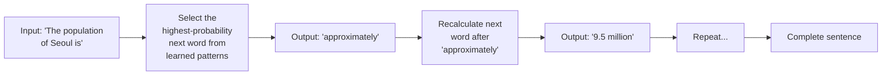
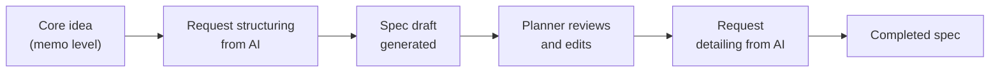
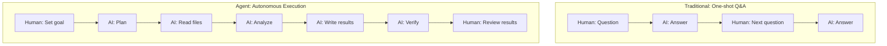
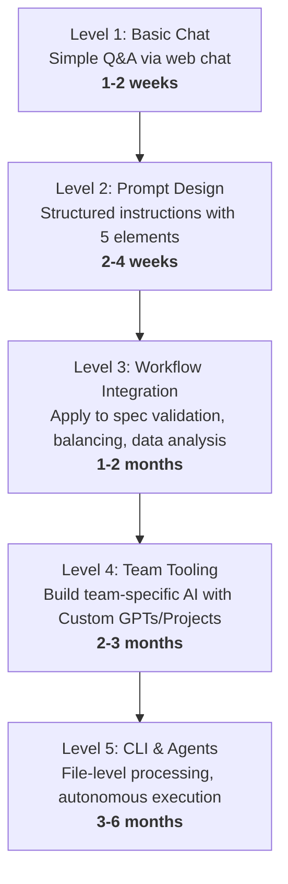

## Target Audience and Purpose

This document is written for **planners, QA engineers, marketers, and PMs** — non-developer roles — to equip them with the knowledge needed to apply LLMs to their work. Technical terms are used only where necessary, with definitions provided each time.

After reading this, you will be able to:
- Accurately explain how LLMs work and their limitations
- Choose between ChatGPT, Claude, and Gemini based on your task
- Immediately apply AI to spec writing, validation, balancing, and data analysis
- Understand the growth path from basic chat all the way to CLI and agents

> For deeper technical content, see [LLM Internals — A Guide for Game Developers](/posts/llm-guide/).

---

## Part 1: LLM — What It Is and How It Works

### 1-1. Definition

**LLM (Large Language Model)** is an artificial intelligence that learns from trillions of text documents on the internet and **probabilistically predicts the next word** in a given sentence. ChatGPT, Claude, and Gemini are all LLMs.

The name "Large" comes from two factors:
1. **Scale of training data** — Trained on a significant portion of humanity's recorded text: Wikipedia, news, papers, web pages, books, etc.
2. **Scale of model parameters** — A massive mathematical function composed of tens of billions to trillions of numbers (parameters)

### 1-2. How It Works

Here's how an LLM generates a response:



The key point: This is why text appears character by character when AI responds. It doesn't produce the entire answer at once — it **selects one word, then selects the next word based on the updated context**, repeating this hundreds to thousands of times.

### 1-3. Three Essential Characteristics to Understand

| Characteristic | Description | Practical Implication |
|---------------|-------------|----------------------|
| **Probabilistic generation** | Selects the "most plausible next word" by probability | Same question can produce different answers |
| **Training cutoff** | Only knows information included in training data | Doesn't know about yesterday's events (requires search integration) |
| **Hallucination** | Generates plausible-sounding content even for unknown topics | Verification is mandatory even when AI sounds confident |

**Hallucination** occurs for structural reasons. LLMs have no mechanism to output "I don't know." When input arrives, they must generate something. Even when evidence is insufficient in the training data, the model outputs the statistically most plausible word combination, producing false information that appears convincing on the surface.

**Countermeasure**: Asking "Can you provide sources?" may yield links, but those links themselves can be hallucinated. Important facts (numbers, dates, proper nouns) must be verified directly from original sources.

### 1-4. Tokens and Context Window

LLMs process text in units called **tokens**. In English, roughly 1 word ≈ 1.3 tokens. In Korean/Japanese, 1 character ≈ 1–2 tokens.

The **context window** is the maximum number of tokens the AI can process in a single conversation. Beyond this limit, it starts forgetting earlier parts of the conversation.

| Model | Context Window | Approximate Volume |
|-------|---------------|-------------------|
| GPT-4.5 | 128K tokens | ~200 pages (A4) |
| Claude Opus 4.6 | 200K tokens | ~300 pages (A4) |
| Gemini 2.5 Pro | 1M tokens | ~1,500 pages (A4) |

A typical spec document is 10–30 pages, so current LLMs can load and analyze multiple design documents simultaneously.

---

## Part 2: ChatGPT, Claude, Gemini Compared

### 2-1. Basic Information

| | ChatGPT | Claude | Gemini |
|--|---------|--------|--------|
| **Developer** | OpenAI | Anthropic | Google |
| **Latest Model** | GPT-4.5 / o3 | Opus 4.6 / Sonnet 4.6 | Gemini 2.5 Pro |
| **URL** | chat.openai.com | claude.ai | gemini.google.com |
| **Free Tier** | Yes (GPT-4o mini) | Yes (Sonnet) | Yes (Gemini Pro) |
| **Paid** | $20/mo Plus | $20/mo Pro | $19.99/mo Advanced |

### 2-2. Core Strengths

**ChatGPT** — The most versatile all-in-one tool. Offers text generation, image generation (DALL-E), code execution (Code Interpreter), and web search in a single interface. Custom GPTs allow pre-configured AI for specific tasks that the entire team can share.

**Claude** — Excels at precise analysis of long documents. The 200K token context window (about 300 A4 pages) is ideal for analyzing entire spec documents, design docs, and contracts at once. The Projects feature allows uploading reference documents in advance for consistent, context-aware responses. Tends to be more forthcoming about uncertainty, frequently responding with "I'm not sure" or "This needs verification."

**Gemini** — Google ecosystem integration is its greatest strength. Directly references data from Gmail, Google Docs, Google Sheets, and Google Drive. Built-in search integration makes it strong for questions about current information. Its 1M token context window is the largest currently available.

### 2-3. Selection Criteria by Task Type

| Task | Top Pick | Reason |
|------|----------|--------|
| Long spec/design doc analysis | **Claude** | 200K context + precise document comprehension |
| Brainstorming/idea generation | **ChatGPT** | Rapidly presents diverse perspectives |
| Current market data research | **Gemini** | Built-in search integration |
| Data analysis + chart generation | **ChatGPT** | Instant execution via Code Interpreter |
| Google Sheets/Docs integration | **Gemini** | Direct Workspace access |
| Image generation (mockups, concepts) | **ChatGPT** | Built-in DALL-E |
| Cross-validation of specs | **Claude + ChatGPT** | Submit same doc to both, compare results |

In practice, rather than choosing just one, it's most effective to switch between tools based on the stage of work.

### 2-4. Reasoning Models

Starting in 2025, **reasoning models** emerged. While standard models begin responding immediately, reasoning models first conduct an internal thinking process (Chain of Thought) before answering.

| Aspect | Standard Model | Reasoning Model |
|--------|---------------|-----------------|
| Examples | GPT-4.5, Claude Sonnet | o3 (OpenAI), Claude + Extended Thinking |
| Response Time | Seconds | Tens of seconds to minutes |
| Best For | Summaries, translation, simple questions | Complex analysis, math, logical reasoning, balance calculations |

For planners doing balance value verification or complex scenario analysis, reasoning models are advantageous. For simple document organization, standard models are faster and more cost-effective.

---

## Part 3: Prompt Engineering — How to Properly Direct AI

Even with the same AI, the quality of results varies dramatically depending on how you instruct it. Prompt engineering is the skill of **giving clear, structured instructions to AI**.

### 3-1. The Five Elements of a Prompt

| Element | Description | Without | With |
|---------|-------------|---------|------|
| **Role** | Assign an expert persona | "Analyze this" | "You are a 10-year mobile game planner. Analyze this" |
| **Context** | Provide background info | "Plan an event" | "For a casual puzzle game with 500K DAU, plan a 1st anniversary event" |
| **Instruction** | Specific request | "Give opinions" | "Present pros and cons in SWOT analysis format" |
| **Format** | Specify output form | (free form) | "In table format, with priority marked as High/Medium/Low" |
| **Constraint** | Limit scope and conditions | (no limits) | "Within 500 words, assuming 2 developers for 2 weeks" |

### 3-2. Four Key Techniques

**1) Few-shot Learning** — Show examples of desired output first, and the AI will follow that format and style.

```
Write a bug report in the same format as the example below:

[Example]
Title: Shop UI Overlap
Severity: Medium
Reproduction: Shop > Item Tab > Fast Scroll
Expected: Normal scrolling
Actual: UI elements overlap

[Write for this:]
Issue: Items not delivered after payment
```

**2) Chain of Thought** — Simply saying "analyze step by step" significantly improves answer quality for complex problems.

```
Analyze the issues in this balance sheet. Follow this order:
Step 1: Identify patterns in current values
Step 2: Identify outliers
Step 3: Formulate causal hypotheses
Step 4: Propose corrections (with rationale)
```

**3) Constraint-based Generation** — Set specific constraints to prevent AI from going off track.

```
Follow these conditions strictly:
- Write in English
- Table format required
- Include numerical evidence for each item
- Compare exactly 3 options
- Must include a risk section
```

**4) Iterative Refinement** — Build on initial results with additional instructions.

```
→ "Summarize the key points of this spec" (Round 1)
→ "Add missing content from a user retention perspective" (Round 2)
→ "Restructure in a format suitable for the dev team" (Round 3)
```

Don't expect perfect results on the first try. Improving quality through 2–3 iterations is realistic.

---

## Part 4: Practical AI Applications for Planners

This is the core of this document. It covers concrete methods for planners, QA, and PMs to apply AI in their daily work.

### 4-1. Spec Writing

In game development, spec writing is one of the most time-consuming tasks. AI can dramatically shorten the process of **draft generation → structuring → detailing**.

**Workflow:**



**Practical Prompt:**

```
You are a mobile game systems planner. Write a spec based on the memo below.

[Memo]
- Daily attendance reward system
- Special reward for 7 consecutive days
- Missed days can be recovered by watching ads
- Additional rewards by VIP tier

[Spec Format]
1. Feature Overview (purpose, target users)
2. System Rules (detailed logic flow)
3. Reward Table (rewards by day, VIP tier differences)
4. Exception Handling (date change line, server maintenance, timezone)
5. UI/UX Requirements (required screens, key interactions)
6. Related Systems (mailbox, currency, VIP tiers)
7. Development Notes (proposed data table structure)
```

**Key point**: AI-generated drafts have roughly 60–70% completeness. The remaining 30–40% must be filled with the planner's domain knowledge and judgment. But the productivity difference between starting from a blank page versus a 70% complete draft is enormous.

### 4-2. Spec Error Detection

Using AI to check completed specs for logical contradictions, missing edge cases, and conflicts with other systems — this is where AI delivers the highest value in the planning phase.

**Validation Prompt:**

```
Validate the spec below from these 7 perspectives.
For each issue found, specify [Severity: Critical/Major/Minor] with specifics.
For items with no issues, explicitly state "No issues found."

[Validation Perspectives]
1. Logical consistency: Are there contradictions between rules?
2. Exception handling completeness: Are edge cases missing?
3. Numerical accuracy: Do reward/cost/probability numbers add up?
4. System integration: Any conflicts with other systems (currency, mail, shop)?
5. User scenario coverage: Are all possible user paths considered?
6. Localization issues: Multilingual/timezone/legal considerations needed?
7. Ambiguous wording: Any descriptions developers could interpret differently?

[Spec Content]
(paste full spec here)
```

**Cross-validation technique**: Submit the same spec to both Claude and ChatGPT independently, then compare results. This catches issues that a single AI might miss.

**Claude Projects**: Pre-upload your team's spec guidelines, previous spec examples, and coding conventions to Claude Projects. The AI will then validate against your team's standards.

### 4-3. Design Spec → Technical Spec Conversion

AI can convert planner-written specs into developer-friendly technical spec format, significantly reducing communication costs between planners and developers.

**Conversion Prompt:**

```
Convert the design spec below into a technical spec.
Maintain the original design intent while adding/converting these items:

[Conversion Rules]
1. Express all conditions as if-else pseudocode
2. Propose data table structures (column names, types, constraints)
3. Propose REST API specs where API endpoints are needed
4. Create state transition diagrams for logic requiring them
5. Define error codes and error messages
6. Tag ambiguous design intent with [CONFIRM NEEDED] and
   write questions that need planner confirmation

[Design Spec]
(paste design spec here)
```

The `[CONFIRM NEEDED]` tag is particularly valuable. The AI self-identifies "this part cannot be determined from the design document alone," automatically listing items requiring confirmation between planners and developers.

### 4-4. Data Analysis and KPI Tracking

Data-driven decision making is essential in game service operations. AI can accelerate the process of extracting meaningful metrics from raw data.

**ChatGPT Code Interpreter**: Upload a CSV or Excel file directly, and the AI executes Python code to analyze data and generate charts. No coding required.

**Analysis Prompt:**

```
The attached CSV contains daily game metrics for the last 30 days.
Perform the following analysis:

1. Key KPI Summary
   - DAU, MAU, ARPU, ARPPU, paying rate trends
   - Week-over-week change rates

2. Anomaly Detection
   - Identify dates and metrics >2 standard deviations from mean
   - Suggest possible causes for those dates

3. Cohort Analysis (if signup date is included)
   - D1, D3, D7, D14, D30 retention rates
   - Retention curve charts by cohort

4. Insight Summary
   - 3 patterns discovered
   - Recommended action items (with priority)

Generate charts with English labels.
```

**KPI Definition Automation**: When team KPI definitions and formulas are scattered, AI can organize them:

```
These are the metrics our game team uses. Organize each metric's
definition, calculation formula, interpretation thresholds
(Good/Normal/Bad), and related metrics in a table.

Metric list:
- DAU, WAU, MAU
- Stickiness (DAU/MAU)
- D1, D7, D30 Retention
- ARPU, ARPPU
- Paying Conversion Rate
- Session Length, Session Count
- LTV (estimated)
```

### 4-5. Data Visualization

Converting data into charts and graphs is the area where AI delivers the most immediate value.

**ChatGPT (Code Interpreter) — Instant Chart Generation**

Upload a CSV/Excel file and request:

```
Create the following charts from this data:

1. Daily DAU trend (line chart with 7-day moving average)
2. Revenue composition (pie chart — IAP/Ads/Subscription)
3. Stage-wise churn rate (funnel chart)
4. Hourly concurrent users (heatmap)

- Chart size: 12 wide, 6 tall
- English labels
- Color palette: brand colors (#3B82F6, #10B981, #F59E0B)
- Downloadable as PNG
```

ChatGPT internally writes and executes Python + matplotlib/seaborn code to generate chart images. The planner just downloads the results without seeing any code.

**Claude (Artifacts) — Interactive Dashboards**

Claude's Artifacts feature can generate interactive charts in HTML+JavaScript:

```
Create an interactive dashboard as an Artifact based on the data below.
Use Chart.js with these features:

- Period filter (toggle between last 7/30/90 days)
- Tooltip showing values on hover
- Key KPI cards (with up/down arrows vs previous day)

Data:
(paste JSON or CSV data)
```

### 4-6. Google Workspace Integration

For teams that routinely use Google Sheets, Docs, and Slides, Gemini integration offers the lowest friction.

**Google Sheets + Gemini**

Opening the Gemini side panel in Google Sheets enables:

| Feature | Use Case |
|---------|----------|
| Data summary | "Summarize this sheet's data" |
| Formula generation | "Add a formula in column C to calculate day-over-day change for column B" |
| Chart creation | "Create a line chart of monthly revenue trends" |
| Classification/tagging | "Classify user feedback in column A as positive/negative/neutral in column D" |
| Anomaly detection | "Find abnormal values in this data" |

**Google Sheets AI Functions**

With Gemini activated in Google Sheets:

```
=AI("Summarize this text in one line", A2)
=AI("Determine if this feedback is positive or negative", B2)
=AI("Translate this game item description to Japanese", C2)
```

Useful for bulk user feedback classification, batch item description translation, and text data cleaning.

**Google Docs + Gemini**

During spec writing:
- "Summarize this section" and "Organize this into a table" directly within the document
- "Translate this spec to English" for instant overseas team sharing
- "Find logical gaps in this document" for self-review

**Google Slides + Gemini**

- Auto-generate presentation slide drafts from design documents
- Suggest key messages and layouts for each slide
- Auto-write speaker notes

### 4-7. Balance Tuning

Game balancing is one of the planner's core tasks — the most repetitive yet where mistakes are most critical. AI can be used for **simulation draft generation**, **numerical verification**, and **pattern analysis**.

**Economy Balance Simulation:**

```
Validate the currency economy balancing for a mobile RPG.

[Current Design]
- Daily gold income: Daily quest(500), PvP(300), Dungeon(200~800), Attendance(100)
- Daily gold spending: Equipment upgrade(200~2000), Skill up(100~500), Gacha(300)
- Target daily average income: 1,200 gold
- Target daily average spending: 1,000 gold (surplus 200)

[Validation Request]
1. 30-day simulation: Daily gold balance trend for F2P users
2. 90-day simulation: Predicted gold inflation onset
3. Spending user scenario (additional 3,000 daily income): Economic gap trend
4. Current design issues and correction proposals

Show results in tables and graphs.
```

**Combat Balancing:**

```
Validate the balance of the character stat table below.

[Stat Table]
| Character | HP | ATK | DEF | SPD | Skill Multiplier |
| Warrior | 5000 | 300 | 250 | 80 | 1.5x |
| Mage | 2800 | 450 | 100 | 90 | 2.2x |
| Healer | 3200 | 150 | 180 | 95 | 0.8x (heal 2.0x) |
| Archer | 3000 | 380 | 130 | 110 | 1.8x |

[Damage Formula]
Damage = ATK × SkillMultiplier × (1 - DEF/(DEF+500))

[Validation Items]
1. 1v1 combat simulation between each character pair (first/second strike separated)
2. Generate win rate matrix
3. Identify any overwhelmingly strong or weak characters
4. Analyze balance curve based on DPS (damage per second)
5. Recommended value adjustments
```

**Probability Balancing (Gacha/Drop Rates):**

```
Analyze the gacha probability table below.

[Probability Table]
| Grade | Rate | Pity |
| SSR | 1.5% | Guaranteed at 90 pulls |
| SR | 8% | None |
| R | 30% | None |
| N | 60.5% | None |

[Analysis Request]
1. Average pulls needed to obtain 1 SSR (100K simulation runs)
2. Pull distribution for top 10%/50%/90% of users
3. Pity system trigger rate
4. Estimated monthly spending (at $0.25 per pull)
5. Comparison against typical gacha rates in Korean/Japanese markets
```

Using ChatGPT Code Interpreter, these simulations run in Python and generate actual distribution charts.

### 4-8. AI for QA

**Automated Test Case Generation:**

```
Generate test cases based on the spec below.

[Rules]
- Separate normal cases and edge cases
- Include ID, category, preconditions, steps, expected result, priority for each TC
- Apply Boundary Value Analysis technique
- Include state transition tests
- Keep total TCs under 50, but don't miss any Critical Paths

[Spec]
(spec content)
```

**Regression Impact Analysis:**

```
Based on the change list below, analyze affected systems and
regression testing priorities.

[Changes]
1. Shop price table change (gold → diamond conversion)
2. VIP tier integration added to attendance reward system
3. PvP matching algorithm modified

[Current System Structure]
- Shop connects to currency system, inventory, mailbox
- Attendance connects to mission system, VIP system
- PvP connects to ranking, rewards, season system

Classify impact as High/Medium/Low and
create a regression checklist for each area.
```

### 4-9. AI for Marketing

**UA (User Acquisition) Copy Generation:**

```
Write UA ad copy for a mobile RPG game.

[Game Info]
- Genre: Turn-based RPG, collection
- Core USP: 300+ characters, strategic party composition
- Target: Ages 25-40, RPG veterans

[Request]
1. Facebook/Instagram (text under 125 chars) × 5 variations
2. Google Ads (headline 30 chars + description 90 chars) × 5 variations
3. App Store description (summary 170 chars + body 4000 chars)
4. Add 1 A/B test variant for each copy
```

**User Review Analysis:**

```
The attached CSV contains 1,000 recent user reviews from App Store/Play Store.
Perform the following analysis:

1. Sentiment analysis: Positive/negative/neutral ratio
2. Topic classification: Top 10 mentioned topics
3. Key complaints by star rating
4. Differentiation points vs competitors (extracted from reviews)
5. Critical issues requiring immediate response
```

---

## Part 5: Agents — Making AI Work Autonomously

### 5-1. What Is an Agent?

All the techniques described so far follow a **"human asks → AI answers"** structure. An agent goes beyond this — when given a goal, **the AI autonomously plans and executes multiple steps**.



The key difference: where humans previously had to intervene at every step, agents **handle intermediate processes autonomously**, with humans only reviewing final results.

### 5-2. Custom GPTs / Claude Projects — Team-Dedicated Agents

The most accessible agent form that requires no coding.

**ChatGPT Custom GPTs:**

Available with ChatGPT Plus or higher. Create task-specific AI that can be shared with team members.

| GPT Name | Configuration | Use |
|----------|--------------|-----|
| Spec Validator | 7 validation perspectives + team guidelines uploaded | Upload spec → auto-validation report |
| TC Generator | TC writing rules + previous TC examples uploaded | Input spec → auto-generate test cases |
| Balance Simulator | Damage formula + current stat table uploaded | Input values → simulation results |
| Localization Checker | Source text + translation guidelines uploaded | Upload translation → auto-detect nuance/mistranslation |
| Weekly Report Generator | Report template + previous examples uploaded | Input key items → auto-generate report |

How to create:
1. Select "Create GPT" in ChatGPT
2. Write role, rules, and output format in detail in "Instructions"
3. Upload reference documents (PDF, text) to "Knowledge"
4. Share the link with team members

**Claude Projects:**

Available with Claude Pro or higher. Similar to Custom GPTs, but with the ability to upload longer reference documents.

1. Create a project in Claude
2. Upload reference documents to "Project knowledge" (spec templates, guidelines, existing specs)
3. Define role and rules in "Custom instructions"
4. All conversations within that project will reference the uploaded documents

### 5-3. CLI Tools — AI That Directly Works with Your File System

The fundamental limitation of web chat: you have to manually copy-paste files in, and copy-paste results out. Processing multiple files simultaneously is difficult.

**CLI (Command Line Interface)** is a method of operating AI by entering commands in a terminal. Since the AI directly accesses your computer's file system, all the above limitations are resolved.

| Aspect | Web Chat | CLI |
|--------|----------|-----|
| File handling | Manual copy-paste | AI reads/writes directly |
| Batch processing | One file at a time | Entire folders at once |
| Saving results | Manual copy-paste | AI creates/modifies files directly |
| Repetitive tasks | Manual each time | One command to execute |

**Major AI CLI Tools:**

| Tool | Developer | Key Feature |
|------|-----------|-------------|
| **Claude Code** | Anthropic | Direct file analysis/modification, autonomous agent execution, tool chaining |
| **Gemini CLI** | Google | Google ecosystem integration, open source |
| **GitHub Copilot CLI** | Microsoft | VS Code integration, code-focused |
| **Cursor** | Cursor | AI-integrated editor (GUI + CLI hybrid) |

### 5-4. CLI Onboarding Path for Non-Developers

Even if terminals are completely new to you, these 3 steps are all you need.

**Step 1: Opening Terminal and Basic Commands (10 min)**

```bash
# Mac: Search "Terminal" in Spotlight and launch
# Windows: Search "PowerShell" in Start menu and launch

# Check current folder
pwd

# List files in current folder
ls

# Move to another folder
cd ~/Documents
```

These 3 commands are all you need to start using CLI tools.

**Step 2: Install Claude Code (20 min)**

```bash
# 1. Install Node.js — download LTS from nodejs.org

# 2. Install Claude Code
npm install -g @anthropic-ai/claude-code

# 3. Navigate to your working folder and run
cd ~/Documents/GameDesign
claude
```

Once launched, an interactive interface opens. From here, you communicate in natural language just like web chat.

**Step 3: Practical Examples for Planners**

```bash
# Read all specs in a folder and detect terminology inconsistencies
claude "Read all documents in the specs folder and list
any cases where the same concept uses different terms"

# Auto-generate test cases from a spec and save as CSV
claude "Read attendance_spec.md and generate test cases,
save as attendance_tc.csv"

# Batch analyze balance data
claude "Analyze Excel files in the balance_data folder and
report cases where DPS variance between characters exceeds 20%"

# Convert design spec to tech spec
claude "Read shop_spec.md and convert to a tech spec,
save as shop_tech_spec.md. Include data table structures
and API specs"

# Batch generate multilingual specs
claude "Read all English specs in the specs folder and
generate Korean and Japanese versions in the same folder"
```

With web chat, you'd have to open each file, copy content, and manually create result files. With CLI, this entire process completes with a single command.

### 5-5. MCP (Model Context Protocol) — The Standard for Connecting AI to External Tools

MCP is an open protocol led by Anthropic that enables **AI to directly access external services and data sources**.

Currently available MCP server examples:

| MCP Server | Function | Planner Use Case |
|-----------|----------|-----------------|
| Google Drive | AI directly reads and searches Drive files | Connect spec folders to AI |
| Google Sheets | AI directly reads and edits sheet data | Auto-analyze balance tables |
| Slack | AI reads Slack channel conversations | Auto-extract meeting decisions |
| Jira/Linear | AI accesses issue trackers | Auto-search/create related issues |
| GitHub | AI accesses code repositories | Compare tech specs with actual implementation |

As MCP becomes widespread, AI will be able to automatically process entire workflows like "read spec → check related issues in Jira → analyze Google Sheets data → send report to Slack."

---

## Part 6: Growth Roadmap — AI Proficiency Levels



### Level 1: Basic Chat (1–2 weeks)

**Core goal**: Get comfortable conversing with AI

To do:
- Create accounts at ChatGPT (chat.openai.com), Claude (claude.ai), Gemini (gemini.google.com)
- Ask AI at least 3 work-related questions per day
- Submit the same question to all 3 services and compare response quality

Milestone: You intuitively know which AI gives better answers for which type of question.

### Level 2: Prompt Design (2–4 weeks)

**Core goal**: Ability to write instructions that consistently produce desired results

To do:
- Apply the 5 elements from Part 3 (role/context/instruction/format/constraint) to every request
- Create prompt templates for your 3 most common tasks
- Share effective prompts with team members

Milestone: Noticeably better results than before, using the same AI.

### Level 3: Workflow Integration (1–2 months)

**Core goal**: Apply AI across all daily work, not just specific situations

To do:
- Apply Part 4 techniques to actual work (spec writing/validation, balancing, data analysis)
- Use file upload features (PDF, Excel, images directly to AI)
- Start using Claude Projects or Gemini + Workspace integration

Milestone: Almost no workday goes by without AI being part of the workflow.

### Level 4: Team Tooling (2–3 months)

**Core goal**: Systematic AI utilization at the team level, not just individual

To do:
- Build team-specific AI tools with Custom GPTs or Claude Projects (see Part 5-2)
- Create task-specific AI: "Spec Validator," "TC Generator," "Balance Simulator"
- Load team guidelines, templates, and existing documents for team context

Milestone: "Just put it in that GPT" becomes everyday team conversation.

### Level 5: CLI & Agents (3–6 months)

**Core goal**: File-level automated processing and autonomous agent execution

To do:
- Learn basic terminal commands (Part 5-4 Step 1)
- Install and start using Claude Code or Gemini CLI
- Automate repetitive tasks with CLI commands
- Expand AI access to external services via MCP integration

Milestone: Processing "analyze 50 files and generate a report" with a single command.

---

## Part 7: Limitations and Cautions You Must Know

### 7-1. Structural Limitations of AI

| Limitation | Cause | Countermeasure |
|-----------|-------|----------------|
| **Hallucination** | Probabilistic generation — no "I don't know" output | Verify facts from original sources |
| **Training cutoff** | No information after training data | Use search integration or provide data directly |
| **Calculation errors** | Pattern matching, not mathematical computation | Verify calculations with Excel/Code Interpreter |
| **Inconsistency** | Probabilistic sampling produces different results each time | Run important queries multiple times and compare |
| **Context forgetting** | Information loss when context window is exceeded | Periodically re-input key information in long conversations |

### 7-2. Security Principles

| Situation | Risk Level | Description |
|-----------|-----------|-------------|
| Free tier | High | Input content may be used for model training |
| Paid individual subscription | Medium | Most services allow disabling training usage |
| Enterprise plan | Low | Data isolation, guaranteed no training use |

**Never input**: Customer personal data, undisclosed financial data, proprietary code, core mechanics of unannounced specs. Decision criterion: "Would it be okay if this were shared with competitors?" — if not, don't put it in AI.

### 7-3. The Right Proportion of AI Usage

AI-generated output is a **draft**. The planner's domain knowledge, judgment, and contextual understanding cannot be replaced by AI. Effective task distribution:

- **AI handles**: Draft generation, structuring, pattern analysis, repetitive tasks, cross-validation
- **Humans handle**: Final judgment, creative direction, context-based decisions, stakeholder coordination, quality assurance

AI is a tool that increases speed, not an entity that replaces judgment.

---

## Study Session Hands-On Guide

Practical exercises for participants during the study session:

### Exercise 1: Compare Same Question Across 3 Services (10 min)

Prep: Open ChatGPT, Claude, and Gemini in separate browser tabs

```
"Design a daily attendance reward system for a mobile RPG
to improve user retention. Include reward table, exception
handling, and expected effects."
```

Comparison points: Level of structure, specificity, depth of exception handling, numerical precision

### Exercise 2: Prompt Improvement Before/After (10 min)

```
[Before]
"Check the game balance for me"

[After]
"Analyze the currency economy of this mobile RPG:
Daily gold income: Daily quest 500, PvP 300, Dungeon 200~800, Attendance 100
Daily gold spending: Upgrade 200~2000, Skills 100~500, Gacha 300
Show a 30-day simulation of F2P user gold balance trends in a table."
```

Comparing the results of both prompts immediately demonstrates the importance of prompt design.

### Exercise 3: Cross-Validate a Spec (15 min)

Select a spec currently in progress, apply the validation prompt from Part 4-2, run it through both Claude and ChatGPT, and compare what each flags. Using a real spec guarantees discoveries like "Oh, we missed this edge case."

### Exercise 4: Data Visualization with Code Interpreter (15 min)

Upload a team game metrics CSV (non-confidential data) to ChatGPT and request "Create a line chart of daily DAU trends and a pie chart of revenue composition." The experience of generating charts instantly without coding makes a strong impact on non-developer roles.

---

## References

- [LLM Internals — A Guide for Game Developers](/posts/llm-guide/) — Technical deep dive covering Transformer architecture, VRAM, and GPU computation
- [VRAM Deep Dive](/posts/vram-deep-dive/) — How GPU memory works for AI models
- [Anthropic Claude Documentation](https://docs.anthropic.com/) — Claude API and usage guide
- [OpenAI Prompt Engineering Guide](https://platform.openai.com/docs/guides/prompt-engineering) — Official prompt writing guide
- [Google AI Studio](https://aistudio.google.com/) — Gemini experimentation and prototyping environment
- [Model Context Protocol (MCP)](https://modelcontextprotocol.io/) — Standard protocol for connecting AI to external services
