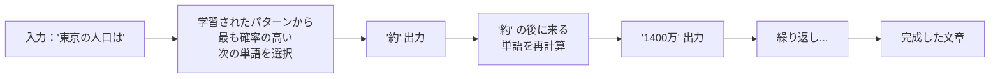
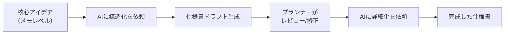
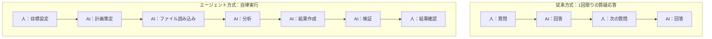
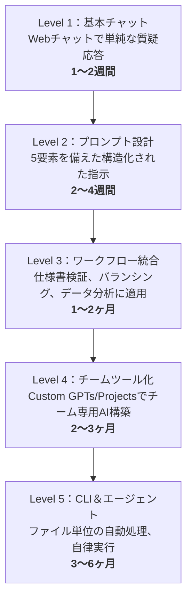

## この記事の対象と目的

この記事は**プランナー、QA、マーケティング、PM**など非開発職の方々が、LLMを業務に適用するために必要な知識をまとめた文書である。コードを知らない状態でも読めるよう、技術用語は必要な箇所でのみ使用し、その都度定義を記述する。

この記事を読み終えると、以下が可能になる：
- LLMの動作原理と限界を正確に説明できる
- ChatGPT、Claude、Geminiを業務目的に応じて選択できる
- 仕様書作成、検証、バランシング、データ分析にAIを即座に適用できる
- CLIとエージェントまで続く成長パスを理解できる

> 技術的により深く掘り下げたい場合は[LLM動作原理 - ゲーム開発者のためのガイド](/posts/llm-guide/)を参照。

---

## Part 1: LLM — 何であり、どう動作するのか

### 1-1. 定義

**LLM（Large Language Model、大規模言語モデル）**は、インターネット上に存在する数兆件のテキストデータを学習し、与えられた文章の後に続く**次の単語を確率的に予測する**人工知能である。ChatGPT、Claude、Geminiはすべてこの LLMに該当する。

「大規模（Large）」と呼ばれる理由は2つある：
1. **学習データの規模** — Wikipedia、ニュース、論文、Webページ、書籍など、人類が記録したテキストのかなりの部分を学習
2. **モデルパラメータの規模** — 数百億〜数兆個の数値（パラメータ）で構成された巨大な数学的関数

### 1-2. 動作プロセス

LLMが回答を生成するプロセスは以下の通りである：



核心：AIが回答する際にテキストが一文字ずつ表示される理由がまさにこれである。全体の答えを一度に出すのではなく、**一つの単語を選択し → その単語を含む文脈で次の単語をまた選択する**プロセスを数百〜数千回繰り返す。

### 1-3. 必ず理解すべき3つの特性

| 特性 | 説明 | 実務的意味 |
|------|------|-----------|
| **確率的生成** | 「最もそれらしい次の単語」を確率で選択 | 同じ質問に異なる回答が出ることがある |
| **学習時点の限界** | 学習データに含まれる情報までしか知らない | 昨日の出来事は知らない（別途検索連携が必要） |
| **ハルシネーション** | 知らないことも確率的にもっともらしく生成する | AIが自信を持って言っても事実の検証は必須 |

**ハルシネーション**が発生するのは構造的な理由による。LLMには「わからない」という出力を行うメカニズムがない。入力が来れば必ず何かを生成する。学習データに根拠が不十分な質問でも、統計的に最もそれらしい単語の組み合わせを出力するため、一見正確に見える虚偽情報が作られる。

**対処法**：「出典を教えて」と要求するとAIがリンクを提示することがあるが、そのリンク自体がハルシネーションの可能性がある。重要な事実関係（数字、日付、固有名詞）は必ず原本ソースで直接確認すべきである。

### 1-4. トークンとコンテキストウィンドウ

LLMはテキストを**トークン（Token）**単位で処理する。英語は概ね1単語 ≈ 1.3トークン、日本語は1文字 ≈ 1〜2トークンである。

**コンテキストウィンドウ（Context Window）**はAIが一回の会話で処理できるトークンの最大量である。この範囲を超えると、会話の前半部分の内容を忘れ始める。

| モデル | コンテキストウィンドウ | おおよその分量 |
|--------|---------------------|--------------|
| GPT-4.5 | 128Kトークン | A4約200枚 |
| Claude Opus 4.6 | 200Kトークン | A4約300枚 |
| Gemini 2.5 Pro | 1Mトークン | A4約1,500枚 |

仕様書一つが通常A4で10〜30枚なので、現在のLLMは企画文書を複数同時にロードして分析することが十分可能なレベルである。

---

## Part 2: ChatGPT、Claude、Gemini比較

### 2-1. 基本情報

| | ChatGPT | Claude | Gemini |
|--|---------|--------|--------|
| **開発元** | OpenAI | Anthropic | Google |
| **最新モデル** | GPT-4.5 / o3 | Opus 4.6 / Sonnet 4.6 | Gemini 2.5 Pro |
| **URL** | chat.openai.com | claude.ai | gemini.google.com |
| **無料** | 可能（GPT-4o mini） | 可能（Sonnet） | 可能（Gemini Pro） |
| **有料** | $20/月 Plus | $20/月 Pro | $19.99/月 Advanced |

### 2-2. 各サービスの核心的強み

**ChatGPT** — 最も幅広い機能範囲を持つ汎用ツールである。テキスト生成、画像生成（DALL-E）、コード実行（Code Interpreter）、Web検索を一つのインターフェースで提供する。Custom GPTsで用途別AIを事前構成しておけば、チーム全体が同じプロンプト品質を維持できる。

**Claude** — 長文書の精密分析で際立つ。200Kトークン（A4約300枚）のコンテキストウィンドウは、仕様書、企画書、契約書などの長文書を丸ごとロードして分析するのに適している。Projects機能で参照文書を事前登録しておけば、その文書に基づいた一貫性のある応答を受けられる。応答の誠実性が高く、「わかりません」や「確認が必要です」という回答を比較的頻繁に行う。

**Gemini** — Googleエコシステムとの統合が最大の強みである。Gmail、Google Docs、Google Sheets、Google Driveのデータを直接参照して応答する。検索連携が標準搭載されており、最新情報に関する質問に強い。1Mトークンのコンテキストウィンドウは現存最大級である。

### 2-3. 業務タイプ別選択基準

| 業務 | 第1候補 | 理由 |
|------|---------|------|
| 長い仕様書/企画書の分析 | **Claude** | 200Kコンテキスト + 精密な文書読解 |
| ブレインストーミング/アイデア発散 | **ChatGPT** | 多様な視点を迅速に提示 |
| 最新市場データ調査 | **Gemini** | 検索連携が標準搭載 |
| データ分析 + チャート生成 | **ChatGPT** | Code Interpreterで即実行 |
| Google Sheets/Docs連携 | **Gemini** | Workspaceに直接アクセス |
| 画像生成（モックアップ、コンセプト） | **ChatGPT** | DALL-E搭載 |
| 仕様書のクロスバリデーション | **Claude + ChatGPT** | 同じ文書を両方に渡し結果を比較 |

実務では一つだけ選ぶのではなく、業務段階ごとに適切なツールに切り替えて使用するのが効果的である。

### 2-4. 推論モデル

2025年から**推論モデル（Reasoning Model）**が登場した。通常モデルがすぐに回答を開始するのに対し、推論モデルは内部的に思考プロセス（Chain of Thought）を先に行ってから回答する。

| 区分 | 通常モデル | 推論モデル |
|------|----------|----------|
| 代表例 | GPT-4.5、Claude Sonnet | o3（OpenAI）、Claude + Extended Thinking |
| 応答速度 | 数秒 | 数十秒〜数分 |
| 適した作業 | 要約、翻訳、簡単な質問 | 複雑な分析、数学、論理的推論、バランス計算 |

プランナーがバランス数値の検証や複雑なケース分析を行う際は推論モデルが有利である。単純な文書整理には通常モデルがより速く経済的である。

---

## Part 3: プロンプトエンジニアリング — AIに正しく仕事を指示する方法

同じAIでも、どのように指示するかによって結果の品質は劇的に変わる。プロンプトエンジニアリングとは、AIに対して**明確で構造化された指示を出す技術**である。

### 3-1. プロンプトの5要素

| 要素 | 説明 | 未適用 | 適用 |
|------|------|--------|------|
| **役割（Role）** | AIに専門家ペルソナを付与 | 「分析して」 | 「あなたは10年目のモバイルゲームプランナーです。分析してください」 |
| **文脈（Context）** | 背景情報を提供 | 「イベントを企画して」 | 「DAU50万のカジュアルパズルゲームで、1周年記念イベントを企画してください」 |
| **指示（Instruction）** | 具体的な要求 | 「意見をください」 | 「SWOT分析形式で長所と短所を整理してください」 |
| **形式（Format）** | 出力形態を指定 | （自由形式） | 「表形式で、各項目に優先度をHigh/Medium/Lowで表示してください」 |
| **制約（Constraint）** | 範囲と条件を限定 | （制限なし） | 「500文字以内で、開発リソースは2名/2週間基準で」 |

### 3-2. 核心テクニック4つ

**1）Few-shot Learning** — 望む出力の例を先に見せれば、AIがその形式とスタイルに従う。

```
以下の例と同じ形式でバグレポートを作成してください：

[例]
タイトル：ショップUI重なり
重要度：Medium
再現手順：ショップ > アイテムタブ > 高速スクロール
期待結果：正常スクロール
実際結果：UI要素の重なり

[作成対象]
現象：決済後にアイテムが付与されない
```

**2）Chain of Thought** — 「段階的に分析して」という一言が、複雑な問題の回答品質を大幅に向上させる。

```
このバランスシートの問題点を分析してください。以下の順序で進めてください：
ステップ1：現在の数値のパターン把握
ステップ2：外れ値（outlier）の特定
ステップ3：原因仮説の立案
ステップ4：修正案の提案（根拠付き）
```

**3）制約ベースの生成** — AIが発散しないよう具体的な制約を設ける。

```
以下の条件を必ず守って回答してください：
- 日本語で作成
- 表形式必須
- 各項目に数値的根拠を含める
- 全3案を比較
- リスク項目を必ず含める
```

**4）反復精製（Iterative Refinement）** — 最初の結果を基に追加指示を繰り返す。

```
→ 「この企画書の核心を要約して」（第1回）
→ 「ユーザーリテンション観点で抜けている内容を追加して」（第2回）
→ 「開発チームに渡す形式に再構成して」（第3回）
```

一度で完璧な結果を期待せず、2〜3回の反復で品質を引き上げるのが現実的である。

---

## Part 4: プランナーのAI実践活用

このパートがこの記事の核心である。プランナー、QA、PMが日常業務でAIを適用できる具体的な方法を扱う。

### 4-1. 仕様書（Spec）作成

ゲーム企画において仕様書作成は最も時間がかかる業務の一つである。AIを活用すれば**ドラフト生成 → 構造化 → 詳細化**のプロセスを大幅に短縮できる。

**活用フロー：**



**実践プロンプト：**

```
あなたはモバイルゲームのシステムプランナーです。
以下のメモを基に仕様書を作成してください。

[メモ]
- デイリー出席報酬システム
- 7日連続出席で特別報酬
- 欠席日は広告視聴で補充可能
- VIPランク別追加報酬

[仕様書フォーマット]
1. 機能概要（目的、ターゲットユーザー）
2. システムルール（詳細ロジックフロー）
3. 報酬テーブル（日次別報酬内容、VIPランク別差異）
4. 例外処理（日付変更線、サーバーメンテナンス、タイムゾーン処理）
5. UI/UX要件（必要な画面、主要インタラクション）
6. 関連システム（メールボックス、通貨、VIPランク）
7. 開発参考事項（データテーブル構造の提案）
```

**ポイント**：AIが作成したドラフトは60〜70%程度の完成度を持つ。残りの30〜40%はプランナーのドメイン知識と判断で埋める必要がある。しかし、白紙から始めるのと70%完成したドラフトから始めるのでは生産性に大きな差がある。

### 4-2. 仕様書のエラー検出

作成された仕様書に論理的矛盾、欠落したエッジケース、他システムとの衝突がないかをAIで検証できる。これが企画段階でAIが最も高い価値を発揮する領域である。

**検証プロンプト：**

```
以下の仕様書を次の7つの観点で検証してください。
問題が発見された場合、[重要度：Critical/Major/Minor]とともに具体的に指摘してください。
問題がない項目も「問題なし」と明記してください。

[検証観点]
1. 論理的一貫性：ルール間に矛盾はないか？
2. 例外処理の完全性：エッジケースが抜けていないか？
3. 数値の整合性：報酬/コスト/確率の数値は計算上正しいか？
4. システム間連携：他システム（通貨、メール、ショップ等）と衝突しないか？
5. ユーザーシナリオの網羅性：実際のユーザーが経験しうるパスがすべて考慮されているか？
6. ローカライズ問題：多言語/タイムゾーン/法律関連の考慮が必要な部分は？
7. 曖昧な表現：開発者が異なる解釈をしうる不明確な記述があるか？

[仕様書内容]
（ここに仕様書全文を貼り付け）
```

**クロスバリデーション技法**：同じ仕様書をClaudeとChatGPTの両方に渡し、それぞれ独立に検証させた後、結果を比較すると単一AIが見逃す部分を捉える確率が高まる。

**Claude Projects活用**：Claude のProjects機能にチームの仕様書ガイドライン、過去の仕様書例、コーディングコンベンションなどを事前登録しておけば、AIがチームの基準に合わせて検証する。

### 4-3. 企画仕様書 → 技術仕様書への変換

プランナーが作成した仕様書を、開発者が読みやすい技術仕様書形態に変換する作業にAIを活用できる。プランナーと開発者間のコミュニケーションコストを削減する上で大きな効果がある。

**変換プロンプト：**

```
以下の企画仕様書を技術仕様書に変換してください。
元の企画意図は維持しつつ、以下の項目を追加/変換してください：

[変換ルール]
1. すべての条件文をif-else疑似コード（pseudocode）で表現
2. データテーブル構造を提案（カラム名、型、制約条件）
3. APIエンドポイントが必要な箇所にREST APIスペックを提案
4. 状態遷移図が必要なロジックは状態遷移図を作成
5. エラーコードとエラーメッセージの定義
6. 企画意図が曖昧な箇所は[CONFIRM NEEDED]タグを付け、
   プランナーに確認すべき質問を併記

[企画仕様書]
（ここに企画仕様書を貼り付け）
```

`[CONFIRM NEEDED]`タグが特に有用である。AIが「この部分は企画文書だけでは判断できない」と自ら表示するため、プランナーと開発者間で確認が必要な事項が自動的にリストアップされる。

### 4-4. データ分析と指標化

ゲームサービス運営においてデータ基盤の意思決定は必須である。AIを活用すれば、生データから意味のある指標を抽出し解釈するプロセスを加速できる。

**ChatGPT Code Interpreter活用**：CSVまたはExcelファイルを直接アップロードすれば、AIがPythonコードを実行してデータを分析しチャートを生成する。コードを自分で書く必要はない。

**分析プロンプト：**

```
添付のCSVファイルは直近30日間の日別ゲーム指標データです。
以下の分析を実行してください：

1. 主要KPI要約
   - DAU、MAU、ARPU、ARPPU、課金率の推移
   - 前週比増減率

2. 異常値検知
   - 平均から2標準偏差以上逸脱した日付と指標の特定
   - 該当日に特異事項があった可能性の提示

3. コホート分析（データに登録日が含まれる場合）
   - D1、D3、D7、D14、D30リテンション率
   - コホート別リテンションカーブチャート

4. インサイト要約
   - 発見されたパターン3つ
   - 推奨アクションアイテム（優先度付き）

チャートは日本語ラベルで生成してください。
```

**指標定義の自動化**：チームで使用しているKPIの定義と計算式が散在している場合、AIに整理を依頼できる。

```
我々のゲームチームで使用している指標です。各指標の定義、計算式、
解釈基準（Good/Normal/Badの閾値）、関連指標を表で整理してください。

指標一覧：
- DAU、WAU、MAU
- Stickiness（DAU/MAU）
- D1、D7、D30 Retention
- ARPU、ARPPU
- 課金転換率
- セッション時間、セッション回数
- LTV（推定）
```

### 4-5. データ可視化（Visualization）

データをチャートやグラフに変換する作業は、AIが最も即座に価値を提供する領域である。

**ChatGPT（Code Interpreter）— 即席チャート生成**

CSV/Excelファイルをアップロードし、以下のように依頼する：

```
このデータで以下のチャートを生成してください：

1. 日別DAU推移（ラインチャート、7日移動平均線付き）
2. 売上構成比率（パイチャート — IAP/広告/サブスクリプション）
3. ステージ別離脱率（ファネルチャート）
4. 時間帯別同時接続者数（ヒートマップ）

- チャートサイズ：横12、縦6
- 日本語ラベル
- カラーパレット：ブランドカラー（#3B82F6、#10B981、#F59E0B）
- PNGでダウンロード可能に
```

ChatGPTはこのリクエストを受けると、内部的にPython + matplotlib/seabornコードを作成・実行してチャート画像を直接生成する。プランナーはコードを見る必要なく、結果画像をダウンロードするだけでよい。

**Claude（Artifacts）— インタラクティブダッシュボード**

ClaudeのArtifacts機能を使えば、HTML+JavaScriptによるインタラクティブチャートを生成できる：

```
以下のデータを基にインタラクティブダッシュボードをArtifactsで作成してください。
Chart.jsを使用し、以下の機能を含めてください：

- 期間フィルター（直近7日/30日/90日の切り替え）
- チャート上にマウスを乗せると数値表示
- 主要KPIカード（前日比増減矢印付き）

データ：
（JSONまたはCSVデータを貼り付け）
```

### 4-6. Google Workspace連携

Google Sheets、Docs、Slidesを日常的に使用するチームであれば、Geminiとの連携が最も摩擦が少ない。

**Google Sheets + Gemini**

Google SheetsでGeminiサイドパネルを開くと以下が可能になる：

| 機能 | 使用例 |
|------|--------|
| データ要約 | 「このシートのデータを要約して」 |
| 数式生成 | 「B列の前日比増減率を計算する数式をC列に入れて」 |
| チャート生成 | 「月別売上推移をラインチャートで作成して」 |
| 分類/タグ付け | 「A列のユーザーフィードバックをポジティブ/ネガティブ/ニュートラルに分類してD列に入れて」 |
| 異常値検知 | 「このデータで異常な値を見つけて」 |

**Google Sheets AI関数の活用**

GeminiがアクティベートされたGoogle Sheetsで使用できるAI関数：

```
=AI("このテキストを一行で要約して", A2)
=AI("このフィードバックがポジティブかネガティブか判断して", B2)
=AI("このゲームアイテムの説明を英語に翻訳して", C2)
```

大量のユーザーフィードバック分類、アイテム説明の一括翻訳、テキストデータの整備などに活用できる。

**Google Docs + Gemini**

企画文書作成時：
- 文書内で直接「このセクションを要約して」「この内容を表で整理して」が可能
- 「この企画書を英語に翻訳して」で海外チーム共有用文書を即座に生成
- 「この文書の論理的な穴を見つけて」でセルフレビュー

**Google Slides + Gemini**

- 企画文書を基にプレゼンテーションスライドのドラフトを自動生成
- 各スライドの核心メッセージとレイアウトを提案
- 発表スクリプト（Speaker Notes）の自動作成

### 4-7. バランシング調整

ゲームバランシングはプランナーの核心業務の中で、最も反復的でありながらミスが致命的な領域である。AIはバランシングにおいて**シミュレーションドラフト生成**、**数値検証**、**パターン分析**に活用できる。

**経済バランシングシミュレーション：**

```
モバイルRPGの通貨経済バランシングを検証してください。

[現在の設計]
- 日次ゴールド収入源：デイリークエスト(500)、PvP(300)、ダンジョン(200~800)、出席(100)
- 日次ゴールド支出先：装備強化(200~2000)、スキルアップ(100~500)、ガチャ(300)
- 日次平均収入目標：1,200ゴールド
- 日次平均支出目標：1,000ゴールド（余剰200）

[検証依頼]
1. 30日シミュレーション：無課金ユーザーの日別ゴールド残高推移
2. 90日シミュレーション：ゴールドインフレーション発生時期の予測
3. 課金ユーザー（日3,000追加収入）含めた経済格差推移
4. 現在の設計の問題点と修正提案

表とグラフで結果を表示してください。
```

**戦闘バランシング：**

```
以下のキャラクタースタットテーブルのバランスを検証してください。

[スタットテーブル]
| キャラクター | HP | ATK | DEF | SPD | スキル倍率 |
| ウォリアー | 5000 | 300 | 250 | 80 | 1.5x |
| メイジ | 2800 | 450 | 100 | 90 | 2.2x |
| ヒーラー | 3200 | 150 | 180 | 95 | 0.8x（ヒール2.0x） |
| アーチャー | 3000 | 380 | 130 | 110 | 1.8x |

[ダメージ公式]
ダメージ = ATK × スキル倍率 × (1 - DEF/(DEF+500))

[検証項目]
1. 各キャラクター間の1対1戦闘シミュレーション（先攻/後攻分離）
2. 勝率マトリクスの生成
3. 圧倒的に強いまたは弱いキャラクターの特定
4. DPS（秒間ダメージ）基準でのバランスカーブ分析
5. 推奨数値調整案
```

**確率バランシング（ガチャ/ドロップ率）：**

```
以下のガチャ確率テーブルを分析してください。

[確率テーブル]
| グレード | 確率 | 天井 |
| SSR | 1.5% | 90回保証 |
| SR | 8% | なし |
| R | 30% | なし |
| N | 60.5% | なし |

[分析依頼]
1. ユーザーがSSRを1体獲得するまでの平均所要回数（シミュレーション10万回）
2. 上位10%/50%/90%ユーザーの所要回数分布
3. 天井到達率
4. 月間予想課金額（1回300円基準）
5. 日本/韓国市場の一般的なガチャ確率との比較分析
```

ChatGPT Code Interpreterを使えば、上記シミュレーションをPythonで実行し、実際の分布チャートまで生成してくれる。

### 4-8. QAのAI活用

**テストケース自動生成：**

```
以下の仕様書を基にテストケースを生成してください。

[ルール]
- 正常ケースとエッジケースを区別して作成
- 各TCにID、分類、事前条件、実行手順、期待結果、優先度を含める
- 境界値分析（Boundary Value Analysis）技法を適用
- 状態遷移テストを含める
- 総TC数は50件以下に抑えつつ、Critical Pathは漏らさないこと

[仕様書]
（仕様書内容）
```

**リグレッション影響分析：**

```
以下の変更事項一覧を見て、影響を受けうるシステムと
リグレッションテストの優先度を分析してください。

[変更事項]
1. ショップ価格テーブル変更（ゴールド → ダイヤ変換）
2. 出席報酬システムにVIPランク連携追加
3. PvPマッチングアルゴリズム修正

[現在のシステム構造]
- ショップは通貨システム、インベントリ、メールボックスと連携
- 出席はミッションシステム、VIPシステムと連携
- PvPはランキング、報酬、シーズンシステムと連携

影響度をHigh/Medium/Lowで分類し、
各領域別リグレッションチェックリストを作成してください。
```

### 4-9. マーケティングのAI活用

**UA（User Acquisition）コピー生成：**

```
モバイルRPGゲームのUA広告コピーを作成してください。

[ゲーム情報]
- ジャンル：ターン制RPG、コレクション型
- 核心USP：300種以上キャラクター、戦略的パーティ編成
- ターゲット：25〜40歳、RPG経験者

[作成依頼]
1. Facebook/Instagram用（テキスト125文字以内）× 5バリエーション
2. Google Ads用（ヘッドライン30文字 + 説明90文字）× 5バリエーション
3. App Store説明文（要約170文字 + 本文4000文字）
4. 各コピーにA/Bテスト用バリエーションを1つずつ追加
```

**ユーザーレビュー分析：**

```
添付のCSVはApp Store/Play Storeの直近ユーザーレビュー1,000件です。
以下の分析を実行してください：

1. 感情分析：ポジティブ/ネガティブ/ニュートラルの比率
2. トピック分類：主要言及トピックTop 10
3. 星評価別の主な不満事項
4. 競合作品との差別化ポイント（レビューから抽出）
5. 即時対応が必要なCriticalイシューリスト
```

---

## Part 5: エージェント — AIに自律的に仕事をさせる方法

### 5-1. エージェントとは何か

ここまで説明した活用法はすべて**「人が質問 → AIが回答」**という構造である。エージェント（Agent）はこの構造を超え、**AIが目標を受けると自ら計画を立て、複数のステップを自律的に実行**する方式である。



核心的な違い：従来方式で人が毎ステップ介入する必要があったのに対し、エージェントは**中間プロセスをAIが自律的に処理**し、人は最終結果を確認するだけである。

### 5-2. Custom GPTs / Claude Projects — チーム専用エージェント

コーディング不要で作成できる、最もアクセスしやすいエージェント形態である。

**ChatGPTのCustom GPTs：**

ChatGPT Plus以上で使用可能。特定業務に特化したAIを作成し、チームメンバーと共有できる。

| GPT名 | 設定内容 | 活用 |
|-------|---------|------|
| 仕様書検証Bot | 検証観点7つ + チームガイドライン文書アップロード | 仕様書をアップすると自動検証レポート生成 |
| TC生成器 | TC作成ルール + 過去のTC例アップロード | 仕様書入力 → テストケース自動生成 |
| バランスシミュレーター | ダメージ公式 + 現在のスタットテーブルアップロード | 数値入力 → シミュレーション結果出力 |
| ローカライズ検収Bot | 原文 + 翻訳ガイドラインアップロード | 翻訳文をアップするとニュアンス/誤訳を自動検出 |
| 週間報告生成器 | レポート書式 + 過去のレポート例アップロード | 核心事項のみ入力 → レポート自動生成 |

作成方法：
1. ChatGPTで「GPTを作る」を選択
2. 「Instructions」に役割、ルール、出力形式を詳細に記述
3. 「Knowledge」に参照文書（PDF、テキスト）をアップロード
4. リンクをチームメンバーと共有

**Claude Projects：**

Claude Pro以上で使用可能。Custom GPTsと同様だが、より長い文書を参照資料としてアップロードできる点が差別化ポイントである。

1. Claudeでプロジェクトを作成
2. 「Project knowledge」に参照文書をアップロード（仕様書テンプレート、ガイドライン、既存仕様書など）
3. 「Custom instructions」に役割とルールを定義
4. 以降、そのプロジェクト内での会話はアップロードされた文書を基に応答

### 5-3. CLIツール — ファイルシステムを直接操作するAI

Webチャットの根本的限界：ファイルを一つずつコピーして貼り付ける必要があり、結果物も再びコピーして移す必要がある。複数ファイルの同時処理が困難。

**CLI（Command Line Interface）**はターミナルでコマンドを入力してAIを操作する方式である。AIがコンピュータのファイルシステムに直接アクセスするため、上記の限界がすべて解消される。

| 項目 | Webチャット | CLI |
|------|----------|-----|
| ファイル処理 | 手動コピペ | AIが直接読み書き |
| 一括処理 | 1ファイルずつ | フォルダ全体を一括 |
| 結果保存 | 手動コピペ | AIが直接ファイル作成/修正 |
| 繰り返し作業 | 毎回手動 | コマンド一つで実行 |

**代表的なAI CLIツール：**

| ツール | 開発元 | 核心的特徴 |
|--------|--------|----------|
| **Claude Code** | Anthropic | ファイル直接分析/修正、エージェント自律実行、ツールチェイニング |
| **Gemini CLI** | Google | Googleエコシステム連携、オープンソース |
| **GitHub Copilot CLI** | Microsoft | VS Code統合、コード中心 |
| **Cursor** | Cursor | AI統合エディタ（GUI + CLIハイブリッド） |

### 5-4. 非開発者のCLI入門経路

ターミナルが初めてでも、以下の3ステップで十分である。

**Step 1：ターミナルを開いて基本コマンド（10分）**

```bash
# Mac：Spotlightで「Terminal」を検索して起動
# Windows：スタートメニューで「PowerShell」を検索して起動

# 現在のフォルダを確認
pwd

# 現在のフォルダのファイル一覧を表示
ls

# 別のフォルダに移動
cd ~/Documents
```

この3つのコマンドがすべてである。これだけ知っていればCLIツールを使用できる。

**Step 2：Claude Codeのインストール（20分）**

```bash
# 1. Node.jsをインストール — nodejs.orgからLTS版をダウンロードしてインストール

# 2. Claude Codeをインストール
npm install -g @anthropic-ai/claude-code

# 3. 作業フォルダに移動して実行
cd ~/Documents/GameDesign
claude
```

実行すると対話型インターフェースが開く。ここからはWebチャットと同様に自然言語で会話する。

**Step 3：プランナーの実践活用例**

```bash
# フォルダ内のすべての仕様書を読み、用語の不一致を検出
claude "specsフォルダのすべての文書を読んで、同じ概念を
異なる用語で呼んでいる箇所を見つけてリストアップして"

# 仕様書からテストケースを自動生成してCSVで保存
claude "attendance_spec.mdを読んでテストケースを生成し、
attendance_tc.csvファイルとして保存して"

# バランスデータの一括分析
claude "balance_dataフォルダのExcelファイルを分析して、
キャラクター間のDPS偏差が20%以上のケースをレポートして"

# 企画仕様書を技術仕様書に変換
claude "shop_spec.mdを読んで開発チーム用の技術仕様書に変換し、
shop_tech_spec.mdとして保存して。データテーブル構造と
APIスペックを含めて"

# 多言語仕様書の一括生成
claude "specsフォルダの日本語仕様書を読んで、
それぞれの英語版と韓国語版を同じフォルダに生成して"
```

Webチャットであれば、ファイルを一つずつ開いてコピーし、結果を再びファイルにする必要があっただろう。CLIではこの全プロセスが1行のコマンドで完了する。

### 5-5. MCP（Model Context Protocol）— AIに外部ツールを接続する標準

MCPはAnthropicが主導するオープンプロトコルで、**AIが外部サービスとデータソースに直接アクセス**できるようにする標準である。

現在利用可能なMCPサーバーの例：

| MCPサーバー | 機能 | プランナーの活用 |
|-----------|------|-----------------|
| Google Drive | AIがDriveファイルを直接読み取り・検索 | 仕様書フォルダをAIに接続 |
| Google Sheets | AIがシートデータを直接読み取り・編集 | バランステーブルの自動分析 |
| Slack | AIがSlackチャンネルの会話を読み取り | 会議決定事項の自動抽出 |
| Jira/Linear | AIがイシュートラッカーにアクセス | 関連イシューの自動検索/作成 |
| GitHub | AIがコードリポジトリにアクセス | 技術仕様書と実装の比較 |

MCPが普及すれば、AIが「仕様書を読む → Jiraで関連イシューを確認 → Google Sheetsのデータを分析 → レポートをSlackに送信」という全ワークフローを自動処理できるようになる。

---

## Part 6: 成長ロードマップ — 段階別AI活用レベル



### Level 1：基本チャット（1〜2週間）

**核心目標**：AIとの会話に慣れる

やること：
- ChatGPT（chat.openai.com）、Claude（claude.ai）、Gemini（gemini.google.com）のアカウント作成
- 毎日業務中に3件以上AIに質問
- 同じ質問を3つのサービスに投げて回答品質を比較

到達基準：「どのタイプの質問にどのAIがより良い回答をするか」が感覚的にわかるようになる。

### Level 2：プロンプト設計（2〜4週間）

**核心目標**：望む結果を一貫して引き出す指示作成能力

やること：
- Part 3の5要素（役割/文脈/指示/形式/制約）をすべてのリクエストに適用
- よく行う業務3つについてプロンプトテンプレートを作成
- チームメンバーと効果的なプロンプトを共有

到達基準：同じAIを使っても以前より結果品質が目に見えて向上する。

### Level 3：ワークフロー統合（1〜2ヶ月）

**核心目標**：特定の状況だけでなく、日常業務全般にAIを適用

やること：
- Part 4の活用法を実際の業務に適用（仕様書作成/検証、バランシング、データ分析）
- ファイルアップロード機能を活用（PDF、Excel、画像をAIに直接送信）
- Claude ProjectsまたはGemini + Workspace連携を開始

到達基準：週の業務でAI活用が含まれない日がほぼなくなる。

### Level 4：チームツール化（2〜3ヶ月）

**核心目標**：個人ではなくチーム単位で体系的にAIを活用

やること：
- Custom GPTsまたはClaude Projectsでチーム専用AIツールを構築（Part 5-2参照）
- 「仕様書検証Bot」「TC生成器」「バランスシミュレーター」など業務別専用AIを作成
- チームのガイドライン、テンプレート、既存文書をAIに読み込ませてチームコンテキストを反映

到達基準：チーム内で「それはあのGPTに入れればいい」という会話が日常化する。

### Level 5：CLI＆エージェント（3〜6ヶ月）

**核心目標**：ファイル単位の自動処理とエージェントの自律実行

やること：
- ターミナルの基本コマンドを覚える（Part 5-4 Step 1）
- Claude CodeまたはGemini CLIをインストールして基本使用
- 繰り返し業務をCLIコマンドで自動化
- MCP連携で外部サービスへのAIアクセス範囲を拡大

到達基準：「50ファイルを分析してレポートを作成して」を1行のコマンドで処理する。

---

## Part 7：必ず知っておくべき限界と注意事項

### 7-1. AIの構造的限界

| 限界 | 原因 | 対策 |
|------|------|------|
| **ハルシネーション** | 確率的生成 —「わからない」出力がない | 事実関係は必ず原本ソースで検証 |
| **学習時点の限界** | 学習データ以降の情報がない | 検索連携機能を活用するか、直接データを提供 |
| **計算エラー** | パターンマッチングであり数学的演算ではない | 計算はExcel/Code Interpreterで検証 |
| **一貫性の欠如** | 確率的サンプリングで毎回異なる結果 | 重要な結果は複数回実行して比較 |
| **コンテキスト忘却** | コンテキストウィンドウ超過時に前半情報を喪失 | 長い会話では核心内容を定期的に再入力 |

### 7-2. セキュリティ原則

| 状況 | リスクレベル | 説明 |
|------|------------|------|
| 無料版 | 高い | 入力内容がモデル学習に活用される可能性あり |
| 有料個人プラン | 中程度 | ほとんどのサービスで学習不使用設定が可能 |
| Enterprise版 | 低い | データ分離、学習不使用保証 |

**絶対に入力してはいけないもの**：顧客個人情報、未公開財務データ、機密コード、未発表仕様書のコアメカニクス。判断基準：「この内容が競合他社に公開されても問題ないか？」— 問題あるならAIにも入れるべきではない。

### 7-3. AI活用の適切な比率

AIが生成した成果物は**ドラフト**である。プランナーのドメイン知識、判断力、コンテキスト理解はAIが代替できない。効果的なタスク配分は以下の通り：

- **AI担当**：ドラフト生成、構造化、パターン分析、繰り返し作業、クロスバリデーション
- **人間担当**：最終判断、クリエイティブな方向設定、コンテキストベースの意思決定、ステークホルダー調整、品質保証

AIは速度を上げるツールであり、判断を代替する存在ではない。

---

## 勉強会用ハンズオン実習ガイド

勉強会で参加者と一緒に取り組める実習リスト：

### 実習1：同一質問3社比較（10分）

準備：ChatGPT、Claude、Geminiをそれぞれブラウザタブで開く

```
「モバイルRPGゲームでユーザーリテンションを高めるための
デイリー出席報酬システムを設計してください。
報酬テーブル、例外処理、期待効果を含めて。」
```

比較ポイント：構造化の程度、具体性、例外処理の深さ、数値提示の有無

### 実習2：プロンプト改善Before/After（10分）

```
[Before]
「ゲームバランスを見て」

[After]
「以下のモバイルRPGの通貨経済を分析してください。
日次ゴールド収入：デイリークエスト500、PvP 300、ダンジョン200~800、出席100
日次ゴールド支出：強化200~2000、スキル100~500、ガチャ300
30日シミュレーションで無課金ユーザーのゴールド残高推移を表で見せてください。」
```

両方のプロンプトの結果を比較すれば、プロンプト設計の重要性が即座に体感できる。

### 実習3：仕様書のクロスバリデーション（15分）

チームで現在作業中の仕様書を一つ選び、Part 4-2の検証プロンプトを適用する。ClaudeとChatGPTの両方で検証を実行し、それぞれが指摘した項目を比較する。実際の仕様書で行えば「あ、このエッジケースが抜けていたんだ」という発見が必ず出る。

### 実習4：Code Interpreterでデータ可視化（15分）

チームのゲーム指標CSVファイル（機密でないデータ）をChatGPTにアップロードし、「日別DAU推移をラインチャートで、売上構成をパイチャートで作成して」と依頼する。コーディングなしでチャートが即座に生成される体験は、非開発職に強いインパクトを与える。

---

## 参考資料

- [LLM動作原理 - ゲーム開発者のためのガイド](/posts/llm-guide/) — Transformerアーキテクチャ、VRAM、GPU演算まで深掘りする技術文書
- [VRAMディープダイブ](/posts/vram-deep-dive/) — AIモデルが使用するGPUメモリの動作原理
- [Anthropic Claude公式ドキュメント](https://docs.anthropic.com/) — Claude APIおよび活用ガイド
- [OpenAIプロンプトエンジニアリングガイド](https://platform.openai.com/docs/guides/prompt-engineering) — OpenAI公式プロンプト作成ガイド
- [Google AI Studio](https://aistudio.google.com/) — Gemini実験およびプロトタイピング環境
- [Model Context Protocol (MCP)](https://modelcontextprotocol.io/) — AI-外部サービス接続標準プロトコル
