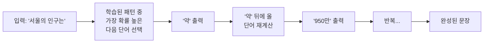
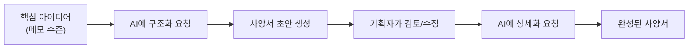
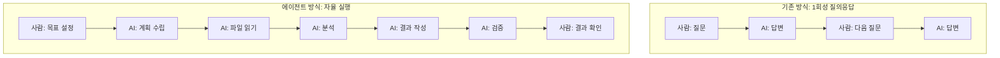
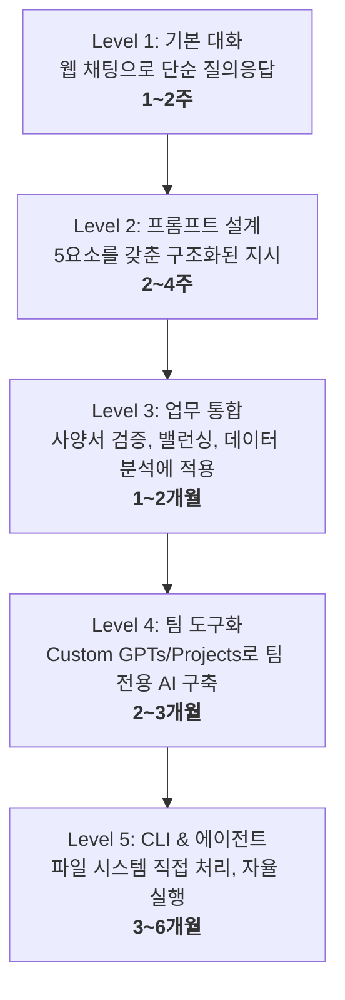

## 이 글의 대상과 목적

이 글은 **기획자, QA, 마케팅, PM** 등 비개발 직군이 LLM을 업무에 적용하기 위해 필요한 지식을 정리한 문서다. 코드를 모르는 상태에서도 읽을 수 있도록 기술 용어는 필요한 곳에서만 사용하고, 그때마다 정의를 함께 서술한다.

이 글을 읽고 나면 다음이 가능하다:
- LLM의 동작 원리와 한계를 정확히 설명할 수 있다
- ChatGPT, Claude, Gemini를 업무 목적에 맞게 선택할 수 있다
- 사양서 작성, 검증, 밸런싱, 데이터 분석에 AI를 즉시 적용할 수 있다
- CLI와 에이전트까지 이어지는 성장 경로를 이해한다

> 기술적으로 더 깊이 들어가고 싶다면 [LLM 동작 원리 - 게임 개발자를 위한 가이드](/posts/llm-guide/)를 참고.

---

## Part 1: LLM — 무엇이고, 어떻게 작동하는가

### 1-1. 정의

**LLM (Large Language Model)**은 인터넷에 존재하는 수조 건의 텍스트 데이터를 학습하여, 주어진 문장 뒤에 올 **다음 단어를 확률적으로 예측**하는 인공지능이다. ChatGPT, Claude, Gemini 모두 이 LLM에 해당한다.

"대규모(Large)"라는 이름이 붙은 이유는 두 가지다:
1. **학습 데이터의 규모** — 위키피디아, 뉴스, 논문, 웹페이지, 책 등 인류가 기록한 텍스트의 상당 부분을 학습
2. **모델 파라미터의 규모** — 수백억~수조 개의 숫자(파라미터)로 구성된 거대한 수학적 함수

### 1-2. 동작 과정

LLM이 답변을 생성하는 과정은 다음과 같다:



핵심: AI가 답변할 때 글자가 하나씩 나타나는 이유가 바로 이것이다. 전체 답을 한 번에 꺼내는 것이 아니라, **단어를 하나 선택하고 → 그 단어를 포함한 문맥에서 다음 단어를 또 선택하는** 과정을 수백~수천 번 반복한다.

### 1-3. 반드시 이해해야 할 3가지 특성

| 특성 | 설명 | 실무적 의미 |
|------|------|------------|
| **확률적 생성** | "가장 그럴듯한 다음 단어"를 확률로 선택 | 같은 질문에 다른 답이 나올 수 있다 |
| **학습 시점 한계** | 학습 데이터에 포함된 정보까지만 알고 있음 | 어제 발생한 사건은 모른다 (별도 검색 연동 필요) |
| **환각(Hallucination)** | 모르는 것도 확률적으로 그럴듯하게 만들어냄 | AI가 자신있게 말해도 사실 여부는 별도 검증 필수 |

**환각**이 발생하는 이유는 구조적이다. LLM에는 "모른다"는 출력을 내는 메커니즘이 없다. 입력이 들어오면 반드시 무언가를 생성한다. 학습 데이터에 근거가 부족한 질문이라도 통계적으로 가장 그럴듯한 단어 조합을 출력하기 때문에, 겉보기에는 정확해 보이는 허위 정보가 만들어진다.

**대응법**: "출처를 알려줘"라고 요청하면 AI가 링크를 제시하기도 하지만, 그 링크 자체가 환각일 수 있다. 중요한 사실 관계(숫자, 날짜, 고유명사)는 반드시 원본 소스에서 직접 확인해야 한다.

### 1-4. 토큰과 맥락 창

LLM은 텍스트를 **토큰(Token)** 단위로 처리한다. 영어는 대략 단어 1개 ≈ 1.3 토큰, 한국어는 1글자 ≈ 1~2 토큰이다.

**맥락 창(Context Window)**은 AI가 한 번의 대화에서 처리할 수 있는 토큰의 최대량이다. 이 범위를 넘어가면 대화 앞부분의 내용을 잊기 시작한다.

| 모델 | 맥락 창 | 대략적 분량 |
|------|--------|------------|
| GPT-4.5 | 128K 토큰 | A4 약 200장 |
| Claude Opus 4.6 | 200K 토큰 | A4 약 300장 |
| Gemini 2.5 Pro | 1M 토큰 | A4 약 1,500장 |

기획서 하나가 보통 A4 10~30장이므로, 현재 LLM은 기획 문서 여러 개를 한 번에 올려놓고 분석하는 것이 가능한 수준이다.

---

## Part 2: ChatGPT, Claude, Gemini 비교

### 2-1. 기본 정보

| | ChatGPT | Claude | Gemini |
|--|---------|--------|--------|
| **개발사** | OpenAI | Anthropic | Google |
| **최신 모델** | GPT-4.5 / o3 | Opus 4.6 / Sonnet 4.6 | Gemini 2.5 Pro |
| **웹 주소** | chat.openai.com | claude.ai | gemini.google.com |
| **무료** | 가능 (GPT-4o mini) | 가능 (Sonnet) | 가능 (Gemini Pro) |
| **유료** | $20/월 Plus | $20/월 Pro | $19.99/월 Advanced |

### 2-2. 각 서비스의 핵심 강점

**ChatGPT** — 가장 넓은 기능 범위를 가진 범용 도구다. 텍스트 생성, 이미지 생성(DALL-E), 코드 실행(Code Interpreter), 웹 검색을 하나의 인터페이스에서 제공한다. Custom GPTs로 용도별 AI를 미리 구성해두면 팀 전체가 같은 프롬프트 품질을 유지할 수 있다.

**Claude** — 긴 문서의 정밀 분석에서 두드러진다. 200K 토큰(A4 300장)의 맥락 창은 기획서, 사양서, 계약서 등 긴 문서를 통째로 올려서 분석하는 데 적합하다. Projects 기능으로 참고 문서를 미리 등록해두면, 해당 문서를 기반으로 한 응답을 일관성 있게 받을 수 있다. 응답의 정직성이 높아서 "모르겠다"거나 "확인이 필요하다"는 답변을 상대적으로 자주 한다.

**Gemini** — Google 생태계와의 통합이 최대 강점이다. Gmail, Google Docs, Google Sheets, Google Drive의 데이터를 직접 참조하여 응답한다. 검색 연동이 기본 내장되어 있어 최신 정보에 대한 질문에 강하다. 1M 토큰의 맥락 창은 현존 최대 수준이다.

### 2-3. 업무 유형별 선택 기준

| 업무 | 1순위 | 이유 |
|------|-------|------|
| 긴 사양서/기획서 분석 | **Claude** | 200K 맥락 + 정밀한 문서 독해 |
| 브레인스토밍/아이디어 발산 | **ChatGPT** | 다양한 관점을 빠르게 제시 |
| 최신 시장 데이터 조사 | **Gemini** | 검색 연동 기본 내장 |
| 데이터 분석 + 차트 생성 | **ChatGPT** | Code Interpreter로 즉시 실행 |
| Google Sheets/Docs 연동 | **Gemini** | Workspace 직접 접근 |
| 이미지 생성 (목업, 컨셉) | **ChatGPT** | DALL-E 내장 |
| 사양서 오류 교차 검증 | **Claude + ChatGPT** | 두 AI에 같은 문서를 넘기고 결과 비교 |

실무에서는 하나만 고르는 것이 아니라, 업무 단계별로 적합한 도구를 전환하며 사용하는 것이 효과적이다.

### 2-4. 추론 모델

2025년부터 **추론 모델(Reasoning Model)**이 등장했다. 일반 모델이 바로 답변을 시작하는 반면, 추론 모델은 내부적으로 사고 과정(Chain of Thought)을 먼저 진행한 뒤 답변한다.

| 구분 | 일반 모델 | 추론 모델 |
|------|----------|----------|
| 대표 | GPT-4.5, Claude Sonnet | o3 (OpenAI), Claude + Extended Thinking |
| 응답 속도 | 수 초 | 수십 초 ~ 수 분 |
| 적합한 작업 | 요약, 번역, 간단한 질문 | 복잡한 분석, 수학, 논리적 추론, 밸런싱 계산 |

기획자가 밸런싱 수치 검증이나 복잡한 경우의 수 분석을 할 때는 추론 모델이 유리하다. 단순 문서 정리에는 일반 모델이 더 빠르고 경제적이다.

---

## Part 3: 프롬프트 엔지니어링 — AI에게 일을 제대로 시키는 법

같은 AI라도 어떻게 지시하느냐에 따라 결과 품질이 완전히 달라진다. 프롬프트 엔지니어링은 AI에게 **명확하고 구조화된 지시를 내리는 기술**이다.

### 3-1. 프롬프트의 5요소

| 요소 | 설명 | 미적용 | 적용 |
|------|------|--------|------|
| **역할(Role)** | AI에게 전문가 페르소나 부여 | "분석해줘" | "너는 10년차 모바일 게임 기획자야. 분석해줘" |
| **맥락(Context)** | 배경 정보 제공 | "이벤트 기획해줘" | "DAU 50만의 캐주얼 퍼즐 게임이고, 1주년 기념 이벤트를 기획해줘" |
| **지시(Instruction)** | 구체적 요청 | "의견 줘" | "SWOT 분석 형식으로 장단점을 정리해줘" |
| **형식(Format)** | 출력 형태 지정 | (자유 형식) | "표 형식으로, 각 항목에 우선순위를 High/Medium/Low로 표시해줘" |
| **제약(Constraint)** | 범위와 조건 한정 | (제한 없음) | "500자 이내로, 개발 리소스는 2명/2주 기준으로" |

### 3-2. 핵심 기법 4가지

**1) 퓨샷 학습 (Few-shot Learning)** — 원하는 출력의 예시를 먼저 보여주면 AI가 그 형식과 스타일을 따른다.

```
아래 예시와 같은 형식으로 버그 리포트를 작성해줘:

[예시]
제목: 상점 UI 겹침
심각도: Medium
재현 경로: 상점 > 아이템 탭 > 빠르게 스크롤
기대 결과: 정상 스크롤
실제 결과: UI 요소 겹침

[작성 대상]
현상: 결제 후 아이템이 지급되지 않음
```

**2) 단계적 사고 요청 (Chain of Thought)** — "단계별로 분석해줘"라는 한마디가 복잡한 문제의 답변 품질을 크게 높인다.

```
이 밸런스 시트의 문제점을 분석해줘. 다음 순서로 진행해:
1단계: 현재 수치의 패턴 파악
2단계: 이상치(outlier) 식별
3단계: 원인 가설 수립
4단계: 수정안 제안 (근거 포함)
```

**3) 제약 기반 생성** — AI가 발산하지 않도록 구체적 제약을 건다.

```
다음 조건을 반드시 지켜서 답변해줘:
- 한국어로 작성
- 표 형식 필수
- 각 항목에 수치적 근거 포함
- 총 3가지 안을 비교
- 리스크 항목을 반드시 포함
```

**4) 반복 정제 (Iterative Refinement)** — 첫 결과를 기반으로 추가 지시를 반복한다.

```
→ "이 기획서의 핵심을 요약해줘" (1차)
→ "유저 리텐션 관점에서 빠진 내용을 추가해줘" (2차)
→ "개발팀에 전달할 형식으로 재구성해줘" (3차)
```

한 번에 완벽한 결과를 기대하지 말고, 2~3회의 반복으로 품질을 끌어올리는 것이 현실적이다.

---

## Part 4: 기획자의 AI 실전 활용

이 파트가 이 글의 핵심이다. 기획자, QA, PM이 일상 업무에서 AI를 적용할 수 있는 구체적인 방법을 다룬다.

### 4-1. 사양서(Spec) 작성

게임 기획에서 사양서 작성은 가장 시간이 많이 드는 업무 중 하나다. AI를 활용하면 **초안 생성 → 구조화 → 상세화**의 과정을 대폭 단축할 수 있다.

**활용 흐름:**



**실전 프롬프트:**

```
너는 모바일 게임 시스템 기획자야. 아래 메모를 기반으로 사양서를 작성해줘.

[메모]
- 일일 출석 보상 시스템
- 7일 연속 출석 시 특별 보상
- 놓친 날은 광고 시청으로 보충 가능
- VIP 등급별 추가 보상

[사양서 형식]
1. 기능 개요 (목적, 타겟 유저)
2. 시스템 규칙 (상세 로직 흐름)
3. 보상 테이블 (일차별 보상 내역, VIP 등급별 차등)
4. 예외 처리 (날짜 변경선, 서버 점검, 시간대 처리)
5. UI/UX 요구사항 (필요한 화면, 주요 인터랙션)
6. 연관 시스템 (우편함, 재화, VIP 등급)
7. 개발 참고사항 (데이터 테이블 구조 제안)
```

이렇게 생성된 초안을 기획자가 직접 검토하고, "4번 예외 처리에서 서머타임 적용 국가의 케이스를 추가해줘" 같은 후속 지시로 상세도를 높여간다.

**포인트**: AI가 만든 초안은 60~70% 수준의 완성도를 가진다. 나머지 30~40%는 기획자의 도메인 지식과 판단으로 채워야 한다. 하지만 백지에서 시작하는 것과 70% 완성된 초안에서 시작하는 것은 생산성에서 큰 차이가 난다.

### 4-2. 사양서 오류 점검

작성된 사양서에 논리적 모순, 빠진 예외 케이스, 다른 시스템과의 충돌이 없는지를 AI로 점검할 수 있다. 이것이 기획 단계에서 AI의 가장 높은 가치를 발휘하는 영역이다.

**검증 프롬프트:**

```
아래 사양서를 다음 7가지 관점에서 검증해줘.
문제가 발견되면 [심각도: Critical/Major/Minor]와 함께 구체적으로 지적해줘.
문제가 없는 항목도 "이상 없음"으로 명시해줘.

[검증 관점]
1. 논리적 일관성: 규칙 간 모순이 없는가?
2. 예외 처리 완전성: 엣지 케이스가 빠져있지 않은가?
3. 수치 정합성: 보상/비용/확률의 수치가 계산상 맞는가?
4. 시스템 간 연동: 다른 시스템(재화, 우편, 상점 등)과 충돌하지 않는가?
5. 유저 시나리오 누락: 실제 유저가 겪을 수 있는 경로가 모두 고려되었는가?
6. 현지화 이슈: 다국어/시간대/법률 관련 고려가 필요한 부분은?
7. 모호한 표현: 개발자가 해석을 달리할 수 있는 애매한 서술이 있는가?

[사양서 내용]
(여기에 사양서 전문 붙여넣기)
```

**교차 검증 기법**: 같은 사양서를 Claude와 ChatGPT 양쪽에 넘겨서, 각각 독립적으로 검증하게 한 뒤 결과를 비교하면 단일 AI가 놓치는 부분을 잡아낼 확률이 높아진다.

**Claude Projects 활용**: Claude의 Projects 기능에 팀의 사양서 가이드라인, 이전 사양서 예시, 코딩 컨벤션 등을 미리 등록해두면, AI가 우리 팀의 기준에 맞춰서 검증한다.

### 4-3. 기획 사양서 → 기술 사양서 변환

기획자가 작성한 사양서를 개발자가 읽기 좋은 기술 사양서 형태로 변환하는 작업에 AI를 활용할 수 있다. 기획자와 개발자 사이의 커뮤니케이션 비용을 줄이는 데 큰 효과가 있다.

**변환 프롬프트:**

```
아래 기획 사양서를 기술 사양서로 변환해줘.
원본의 기획 의도는 유지하되, 다음 항목을 추가/변환해야 해:

[변환 규칙]
1. 모든 조건문을 if-else 의사코드(pseudocode)로 표현
2. 데이터 테이블 구조를 제안 (컬럼명, 타입, 제약조건)
3. API 엔드포인트가 필요한 곳에 REST API 스펙 제안
4. 상태 다이어그램이 필요한 로직은 상태 전이도 작성
5. 에러 코드와 에러 메시지 정의
6. 기획 의도가 모호한 곳은 [CONFIRM NEEDED] 태그를 붙이고
   기획자에게 확인해야 할 질문을 함께 작성

[기획 사양서]
(여기에 기획 사양서 붙여넣기)
```

`[CONFIRM NEEDED]` 태그가 특히 유용하다. AI가 "이 부분은 기획 문서만으로는 판단할 수 없다"고 스스로 표시해주기 때문에, 기획자와 개발자 사이에 확인이 필요한 사항이 자동으로 리스트업된다.

### 4-4. 데이터 분석과 지표화

게임 서비스 운영에서 데이터 기반 의사결정은 필수다. AI를 활용하면 원시 데이터에서 의미 있는 지표를 추출하고 해석하는 과정을 가속할 수 있다.

**ChatGPT Code Interpreter 활용**: CSV 또는 엑셀 파일을 직접 업로드하면 AI가 Python 코드를 실행하여 데이터를 분석하고 차트를 생성한다. 코드를 직접 작성할 필요가 없다.

**분석 프롬프트:**

```
첨부한 CSV 파일은 최근 30일간의 일별 게임 지표 데이터야.
다음 분석을 수행해줘:

1. 핵심 KPI 요약
   - DAU, MAU, ARPU, ARPPU, 결제율 추이
   - 전주 대비 증감률

2. 이상 징후 탐지
   - 평균에서 2 표준편차 이상 벗어난 날짜와 지표 식별
   - 해당 날짜에 특이사항이 있었을 가능성 제시

3. 코호트 분석 (데이터에 가입일 포함 시)
   - D1, D3, D7, D14, D30 리텐션율
   - 코호트별 리텐션 커브 차트

4. 인사이트 요약
   - 발견된 패턴 3가지
   - 권장 액션 아이템 (우선순위 포함)

차트는 한국어 레이블로 생성해줘.
```

**지표 정의 자동화**: 팀에서 사용하는 KPI의 정의와 계산 공식이 흩어져 있을 때, AI에게 정리를 요청할 수 있다.

```
우리 게임팀에서 사용하는 지표들이야. 각 지표의 정의, 계산 공식,
해석 기준(Good/Normal/Bad 임계값), 관련 지표를 표로 정리해줘.

지표 목록:
- DAU, WAU, MAU
- Stickiness (DAU/MAU)
- D1, D7, D30 Retention
- ARPU, ARPPU
- Paying Conversion Rate
- Session Length, Session Count
- LTV (추정)
```

### 4-5. 데이터 가시화 (Visualization)

데이터를 차트와 그래프로 변환하는 작업은 AI가 가장 즉각적인 가치를 제공하는 영역이다.

**ChatGPT (Code Interpreter) 활용 — 즉석 차트 생성**

CSV/엑셀 파일을 업로드하고 다음과 같이 요청한다:

```
이 데이터로 다음 차트들을 생성해줘:

1. 일별 DAU 추이 (라인 차트, 7일 이동평균선 포함)
2. 매출 구성 비율 (파이 차트 — IAP/광고/구독)
3. 스테이지별 이탈률 (퍼널 차트)
4. 시간대별 동접자 수 (히트맵)

- 차트 크기: 가로 12, 세로 6
- 한국어 레이블
- 색상 팔레트: 회사 브랜드 컬러 (#3B82F6, #10B981, #F59E0B)
- PNG로 다운로드 가능하게
```

ChatGPT는 이 요청을 받으면 내부적으로 Python + matplotlib/seaborn 코드를 작성하고 실행하여 차트 이미지를 직접 생성한다. 기획자는 코드를 볼 필요 없이 결과 이미지만 다운로드하면 된다.

**Claude (Artifacts) 활용 — 인터랙티브 대시보드**

Claude의 Artifacts 기능을 사용하면 HTML+JavaScript로 된 인터랙티브 차트를 생성할 수 있다:

```
아래 데이터를 기반으로 인터랙티브 대시보드를 Artifacts로 만들어줘.
Chart.js를 사용하고, 다음 기능을 포함해줘:

- 기간 필터 (최근 7일/30일/90일 전환)
- 차트 위에 마우스를 올리면 수치 표시
- 주요 KPI 카드 (전일 대비 증감 화살표 포함)

데이터:
(JSON 또는 CSV 데이터 붙여넣기)
```

### 4-6. Google Workspace 연동

Google Sheets, Docs, Slides를 일상적으로 사용하는 팀이라면 Gemini와의 연동이 가장 마찰이 적다.

**Google Sheets + Gemini**

Google Sheets에서 Gemini 사이드 패널을 열면 다음이 가능하다:

| 기능 | 사용 예 |
|------|---------|
| 데이터 요약 | "이 시트의 데이터를 요약해줘" |
| 수식 생성 | "B열의 전일 대비 증감률을 계산하는 수식을 C열에 넣어줘" |
| 차트 생성 | "월별 매출 추이를 라인 차트로 만들어줘" |
| 분류/태깅 | "A열의 유저 피드백을 긍정/부정/중립으로 분류해서 D열에 넣어줘" |
| 이상치 탐지 | "이 데이터에서 비정상적인 값을 찾아줘" |

**Google Sheets AI 함수 활용**

Gemini가 활성화된 Google Sheets에서 사용할 수 있는 AI 함수:

```
=AI("이 텍스트를 한 줄로 요약해줘", A2)
=AI("이 피드백이 긍정인지 부정인지 판단해줘", B2)
=AI("이 게임 아이템 설명을 영어로 번역해줘", C2)
```

대량의 유저 피드백 분류, 아이템 설명 일괄 번역, 텍스트 데이터 정제 등에 활용할 수 있다.

**Google Docs + Gemini**

기획 문서 작성 시:
- 문서 내에서 직접 "이 섹션을 요약해줘", "이 내용을 표로 정리해줘" 가능
- "이 기획서를 영어로 번역해줘"로 해외 팀 공유용 문서 즉시 생성
- "이 문서의 논리적 허점을 찾아줘"로 셀프 리뷰

**Google Slides + Gemini**

- 기획 문서를 기반으로 발표 슬라이드 초안 자동 생성
- 각 슬라이드의 핵심 메시지와 레이아웃 제안
- 발표 스크립트(Speaker Notes) 자동 작성

### 4-7. 밸런싱 조절

게임 밸런싱은 기획자의 핵심 업무 중 가장 반복적이면서도 실수가 치명적인 영역이다. AI는 밸런싱에서 **시뮬레이션 초안 생성**, **수치 검증**, **패턴 분석**에 활용할 수 있다.

**경제 밸런싱 시뮬레이션:**

```
모바일 RPG의 재화 경제 밸런싱을 검증해줘.

[현재 설계]
- 일일 골드 수입원: 일퀘(500), PvP(300), 던전(200~800), 출석(100)
- 일일 골드 지출처: 장비 강화(200~2000), 스킬 업(100~500), 가챠(300)
- 일일 평균 수입 목표: 1,200 골드
- 일일 평균 지출 목표: 1,000 골드 (잉여 200)

[검증 요청]
1. 30일 시뮬레이션: 무과금 유저의 일별 골드 잔고 추이
2. 90일 시뮬레이션: 골드 인플레이션 발생 시점 예측
3. 과금 유저(일 3,000 추가 수입) 포함 시 경제 격차 추이
4. 현재 설계의 문제점과 수정 제안

표와 그래프로 결과를 보여줘.
```

**전투 밸런싱:**

```
아래 캐릭터 스탯 테이블의 밸런스를 검증해줘.

[스탯 테이블]
| 캐릭터 | HP | ATK | DEF | SPD | 스킬 배율 |
| 전사 | 5000 | 300 | 250 | 80 | 1.5x |
| 마법사 | 2800 | 450 | 100 | 90 | 2.2x |
| 힐러 | 3200 | 150 | 180 | 95 | 0.8x (힐 2.0x) |
| 궁수 | 3000 | 380 | 130 | 110 | 1.8x |

[데미지 공식]
데미지 = ATK × 스킬배율 × (1 - DEF/(DEF+500))

[검증 항목]
1. 각 캐릭터 간 1:1 전투 시뮬레이션 (선공/후공 분리)
2. 승률 매트릭스 생성
3. 특정 캐릭터가 압도적으로 강하거나 약한 경우 식별
4. DPS(초당 데미지) 기준으로 밸런스 곡선 분석
5. 권장 수치 조정안
```

**확률 밸런싱 (가챠/드롭률):**

```
아래 가챠 확률 테이블을 분석해줘.

[확률 테이블]
| 등급 | 확률 | 천장 |
| SSR | 1.5% | 90회 보장 |
| SR | 8% | 없음 |
| R | 30% | 없음 |
| N | 60.5% | 없음 |

[분석 요청]
1. 유저가 SSR을 1개 획득하기까지 평균 소요 횟수 (시뮬레이션 10만 회)
2. 상위 10%/50%/90% 유저의 소요 횟수 분포
3. 천장 도달 비율
4. 월 예상 과금액 (1회 300원 기준)
5. 한국/일본 시장의 일반적인 가챠 확률 대비 분석
```

ChatGPT Code Interpreter를 사용하면 위 시뮬레이션을 Python으로 실행하여 실제 분포 차트까지 생성해준다.

### 4-8. QA의 AI 활용

**테스트 케이스 자동 생성:**

```
아래 사양서를 기반으로 테스트 케이스를 생성해줘.

[규칙]
- 정상 케이스와 엣지 케이스를 구분하여 작성
- 각 TC에 ID, 분류, 사전조건, 수행절차, 기대결과, 우선순위 포함
- 경계값 분석(Boundary Value Analysis) 기법 적용
- 상태 전이 테스트 포함
- 총 TC 수는 50개 이하로 유지하되, Critical Path는 빠뜨리지 말 것

[사양서]
(사양서 내용)
```

**리그레션 영향 분석:**

```
아래 변경 사항 목록을 보고, 영향받을 수 있는 시스템과
리그레션 테스트 우선순위를 분석해줘.

[변경 사항]
1. 상점 가격 테이블 변경 (골드 → 다이아 전환)
2. 출석 보상 시스템에 VIP 등급 연동 추가
3. PvP 매칭 알고리즘 수정

[현재 시스템 구조]
- 상점은 재화 시스템, 인벤토리, 우편함과 연동
- 출석은 미션 시스템, VIP 시스템과 연동
- PvP는 랭킹, 보상, 시즌 시스템과 연동

영향도를 High/Medium/Low로 분류하고,
각 영역별 리그레션 체크리스트를 작성해줘.
```

### 4-9. 마케팅의 AI 활용

**UA(User Acquisition) 카피 생성:**

```
모바일 RPG 게임의 UA 광고 카피를 작성해줘.

[게임 정보]
- 장르: 턴제 RPG, 수집형
- 핵심 USP: 300종 이상 캐릭터, 전략적 파티 편성
- 타겟: 25~40세, RPG 경험자

[작성 요청]
1. Facebook/Instagram용 (텍스트 125자 이내) × 5개 변형
2. Google Ads용 (헤드라인 30자 + 설명 90자) × 5개 변형
3. 앱스토어 설명문 (요약 170자 + 본문 4000자)
4. 각 카피에 A/B 테스트용 변형 1개씩 추가
```

**유저 리뷰 분석:**

```
첨부한 CSV는 앱스토어/플레이스토어의 최근 유저 리뷰 1,000건이야.
다음 분석을 수행해줘:

1. 감성 분석: 긍정/부정/중립 비율
2. 토픽 분류: 주요 언급 주제 Top 10
3. 별점별 주요 불만사항
4. 경쟁작 대비 차별화 포인트 (리뷰에서 추출)
5. 즉시 대응이 필요한 Critical 이슈 리스트
```

---

## Part 5: 에이전트 — AI가 스스로 일하게 만드는 법

### 5-1. 에이전트란 무엇인가

지금까지 설명한 활용법은 모두 **"사람이 질문 → AI가 답변"** 구조다. 에이전트(Agent)는 이 구조를 넘어서, **AI가 목표를 받으면 스스로 계획을 세우고, 여러 단계를 자율적으로 실행**하는 방식이다.



핵심 차이: 기존 방식에서 사람이 매 단계마다 개입해야 했다면, 에이전트는 **중간 과정을 AI가 자율적으로 처리**하고 사람은 최종 결과를 확인한다.

### 5-2. Custom GPTs / Claude Projects — 팀 전용 에이전트

코딩 없이 만들 수 있는 가장 접근성 높은 에이전트 형태다.

**ChatGPT의 Custom GPTs:**

Custom GPTs는 ChatGPT Plus 이상에서 사용 가능하며, 특정 업무에 특화된 AI를 만들어 팀원과 공유할 수 있다.

| GPT 이름 | 설정 내용 | 활용 |
|---------|----------|------|
| 사양서 검증봇 | 사양서 검증 관점 7가지 + 팀 가이드라인 문서 업로드 | 사양서를 올리면 자동 검증 리포트 생성 |
| TC 생성기 | TC 작성 규칙 + 이전 TC 예시 업로드 | 사양서 입력 → 테스트 케이스 자동 생성 |
| 밸런스 시뮬레이터 | 데미지 공식 + 현재 스탯 테이블 업로드 | 수치 입력 → 시뮬레이션 결과 출력 |
| 현지화 검수봇 | 원문 + 번역 가이드라인 업로드 | 번역문 올리면 뉘앙스/오역 자동 검출 |
| 주간보고 생성기 | 보고서 양식 + 이전 보고서 예시 업로드 | 핵심 사항만 입력 → 보고서 자동 생성 |

만드는 방법:
1. ChatGPT에서 "GPT 만들기" 선택
2. "Instructions"에 역할, 규칙, 출력 형식을 상세히 기술
3. "Knowledge"에 참고 문서(PDF, 텍스트) 업로드
4. 링크를 팀원과 공유

**Claude Projects:**

Claude Pro 이상에서 사용 가능하다. Custom GPTs와 유사하지만, 더 긴 문서를 참고 자료로 업로드할 수 있다는 점이 차별점이다.

1. Claude에서 프로젝트 생성
2. "Project knowledge"에 참고 문서 업로드 (사양서 양식, 가이드라인, 기존 사양서 등)
3. "Custom instructions"에 역할과 규칙 정의
4. 이후 해당 프로젝트에서 대화하면, 업로드된 문서를 기반으로 응답

### 5-3. CLI 도구 — 파일 시스템을 직접 다루는 AI

웹 채팅의 근본적 한계: 파일을 일일이 복사해서 붙여넣어야 하고, 결과물도 다시 복사해서 옮겨야 한다. 여러 파일을 동시에 처리하기 어렵다.

**CLI(Command Line Interface)**는 터미널에서 명령어를 입력하여 AI를 조작하는 방식이다. AI가 내 컴퓨터의 파일 시스템에 직접 접근하므로, 위 한계가 모두 해소된다.

| 항목 | 웹 채팅 | CLI |
|------|--------|-----|
| 파일 처리 | 수동 복붙 | AI가 직접 읽고 쓰기 |
| 동시 처리 | 파일 1개씩 | 폴더 전체 일괄 처리 |
| 결과 저장 | 수동 복붙 | AI가 직접 파일 생성/수정 |
| 반복 작업 | 매번 수동 | 명령어 하나로 실행 |

**대표적인 AI CLI 도구:**

| 도구 | 개발사 | 핵심 특징 |
|------|--------|----------|
| **Claude Code** | Anthropic | 파일 직접 분석/수정, 에이전트 자율 실행, 도구 체이닝 |
| **Gemini CLI** | Google | Google 생태계 연동, 오픈소스 |
| **GitHub Copilot CLI** | Microsoft | VS Code 통합, 코드 중심 |
| **Cursor** | Cursor | AI 통합 에디터 (GUI + CLI 하이브리드) |

### 5-4. 비개발자의 CLI 입문 경로

터미널이 처음이라도 아래 3단계면 충분하다.

**Step 1: 터미널 열기와 기본 명령어 (10분)**

```bash
# Mac: Spotlight에서 "Terminal" 검색하여 실행
# Windows: 시작 메뉴에서 "PowerShell" 검색하여 실행

# 현재 내가 있는 폴더 확인
pwd

# 현재 폴더의 파일 목록 보기
ls

# 다른 폴더로 이동
cd ~/Documents
```

이 3개 명령어가 전부다. 이것만 알면 CLI 도구를 사용할 수 있다.

**Step 2: Claude Code 설치 (20분)**

```bash
# 1. Node.js 설치 — nodejs.org에서 LTS 버전 다운로드 후 설치

# 2. Claude Code 설치
npm install -g @anthropic-ai/claude-code

# 3. 작업할 폴더로 이동 후 실행
cd ~/Documents/GameDesign
claude
```

실행하면 대화형 인터페이스가 열린다. 여기서부터는 웹 채팅과 동일하게 자연어로 대화한다.

**Step 3: 기획자의 실전 활용 예시**

```bash
# 폴더 안의 모든 사양서를 읽고 용어 불일치를 검출
claude "specs 폴더의 모든 문서를 읽고, 같은 개념을
다른 용어로 부르고 있는 곳을 찾아서 리스트업해줘"

# 사양서 기반으로 테스트 케이스 자동 생성 후 CSV로 저장
claude "attendance_spec.md를 읽고 테스트 케이스를 생성해서
attendance_tc.csv 파일로 저장해줘"

# 밸런스 데이터 일괄 분석
claude "balance_data 폴더의 엑셀 파일들을 분석해서
캐릭터 간 DPS 편차가 20% 이상인 케이스를 리포트해줘"

# 기획 사양서를 기술 사양서로 변환
claude "shop_spec.md를 읽고 개발팀용 기술사양서로 변환해서
shop_tech_spec.md로 저장해줘. 데이터 테이블 구조와
API 스펙을 포함해줘"

# 다국어 사양서 일괄 생성
claude "specs 폴더의 한국어 사양서들을 읽고,
각각의 영어 버전과 일본어 버전을 같은 폴더에 생성해줘"
```

웹 채팅이었다면 파일을 하나씩 열어서 복사하고, 결과를 다시 파일로 만들어야 했을 것이다. CLI에서는 이 전체 과정이 한 줄의 명령으로 완료된다.

### 5-5. MCP(Model Context Protocol) — AI에 외부 도구를 연결하는 표준

MCP는 Anthropic이 주도하는 개방형 프로토콜로, **AI가 외부 서비스와 데이터 소스에 직접 접근**할 수 있게 해주는 표준이다.

현재 사용 가능한 MCP 서버 예시:

| MCP 서버 | 기능 | 기획자 활용 |
|---------|------|------------|
| Google Drive | AI가 Drive 파일을 직접 읽고 검색 | 사양서 폴더를 AI에 연결 |
| Google Sheets | AI가 시트 데이터를 직접 읽고 수정 | 밸런스 테이블 자동 분석 |
| Slack | AI가 슬랙 채널의 대화를 읽음 | 회의 결정사항 자동 추출 |
| Jira/Linear | AI가 이슈 트래커에 접근 | 관련 이슈 자동 검색/생성 |
| GitHub | AI가 코드 저장소에 접근 | 기술사양서와 실제 구현 비교 |

MCP가 보편화되면, AI가 "사양서를 읽고 → Jira에서 관련 이슈를 확인하고 → Google Sheets의 데이터를 분석하여 → 리포트를 Slack에 전송"하는 전체 워크플로우를 자동으로 처리할 수 있게 된다.

---

## Part 6: 성장 로드맵 — 단계별 AI 활용 수준



### Level 1: 기본 대화 (1~2주)

**핵심 목표**: AI와 대화하는 데 익숙해지기

할 일:
- ChatGPT(chat.openai.com), Claude(claude.ai), Gemini(gemini.google.com) 계정 생성
- 매일 업무 중 3건 이상 AI에게 질문
- 같은 질문을 3개 서비스에 던져보고 답변 품질 비교

도달 기준: "어떤 유형의 질문에 어떤 AI가 더 좋은 답을 하는지" 체감으로 알게 된다.

### Level 2: 프롬프트 설계 (2~4주)

**핵심 목표**: 원하는 결과를 일관되게 이끌어내는 지시 작성 능력

할 일:
- Part 3의 5요소(역할/맥락/지시/형식/제약)를 모든 요청에 적용
- 자주 하는 업무 3가지에 대해 프롬프트 템플릿 작성
- 팀원과 효과적인 프롬프트 공유

도달 기준: 같은 AI를 써도 이전보다 결과 품질이 눈에 띄게 향상된다.

### Level 3: 업무 통합 (1~2개월)

**핵심 목표**: AI를 특정 상황이 아니라 일상 업무 전반에 적용

할 일:
- Part 4의 활용법을 실제 업무에 적용 (사양서 작성/검증, 밸런싱, 데이터 분석)
- 파일 업로드 기능 활용 (PDF, 엑셀, 이미지를 AI에 직접 전달)
- Claude Projects 또는 Gemini + Workspace 연동 시작

도달 기준: 주간 업무 중 AI 활용이 포함되지 않는 날이 거의 없다.

### Level 4: 팀 도구화 (2~3개월)

**핵심 목표**: 개인이 아닌 팀 단위로 AI를 체계적으로 활용

할 일:
- Custom GPTs 또는 Claude Projects로 팀 전용 AI 도구 구축 (Part 5-2 참고)
- "사양서 검증봇", "TC 생성기", "밸런스 시뮬레이터" 등 업무별 전용 AI 생성
- 팀의 가이드라인, 양식, 기존 문서를 AI에 학습시켜 팀 컨텍스트 반영

도달 기준: 팀 내에서 "이건 그 GPT에 넣으면 돼"라는 대화가 일상화된다.

### Level 5: CLI & 에이전트 (3~6개월)

**핵심 목표**: 파일 단위 자동 처리와 에이전트 자율 실행

할 일:
- 터미널 기본 명령어 익히기 (Part 5-4 Step 1)
- Claude Code 또는 Gemini CLI 설치 및 기본 사용
- 반복 업무를 CLI 명령으로 자동화
- MCP 연동으로 외부 서비스까지 AI 접근 범위 확대

도달 기준: "파일 50개를 분석해서 리포트를 만들어줘"를 한 줄의 명령으로 처리한다.

---

## Part 7: 반드시 알아야 할 한계와 주의사항

### 7-1. AI의 구조적 한계

| 한계 | 원인 | 대응 |
|------|------|------|
| **환각** | 확률적 생성 — "모른다"는 출력이 없음 | 사실 관계는 반드시 원본 소스에서 검증 |
| **학습 시점 한계** | 학습 데이터 이후 정보 없음 | 웹 검색 연동 기능 활용 또는 직접 데이터 제공 |
| **계산 오류** | 수학적 연산이 아닌 패턴 매칭 | 수치 계산은 엑셀/Code Interpreter로 검증 |
| **일관성 부족** | 확률적 샘플링으로 매번 다른 결과 | 중요한 결과는 여러 번 실행하여 비교 |
| **맥락 망각** | 맥락 창 초과 시 앞부분 정보 손실 | 긴 대화에서는 핵심 내용을 주기적으로 재입력 |

### 7-2. 보안 원칙

| 상황 | 위험도 | 설명 |
|------|--------|------|
| 무료 버전 | 높음 | 입력 내용이 모델 학습에 활용될 수 있음 |
| 유료 개인 구독 | 중간 | 대부분 학습 미사용 설정 가능 |
| 기업용(Enterprise) | 낮음 | 데이터 격리, 학습 미활용 보장 |

**절대 입력하지 말 것**: 고객 개인정보, 미공개 재무 데이터, 사내 기밀 코드, 미발표 사양서의 핵심 메커니즘. 판단 기준: "이 내용이 경쟁사에 공개되어도 문제없는가?" — 아니라면 넣지 말 것.

### 7-3. AI 활용의 올바른 비율

AI가 생성한 결과물은 **초안**이다. 기획자의 도메인 지식, 판단력, 맥락 이해는 AI가 대체할 수 없다. 효과적인 업무 분배는 다음과 같다:

- **AI 담당**: 초안 생성, 구조화, 패턴 분석, 반복 작업, 교차 검증
- **사람 담당**: 최종 판단, 창의적 방향 설정, 맥락 기반 의사결정, 이해관계자 조율, 품질 보증

AI는 속도를 올려주는 도구이지, 판단을 대신하는 존재가 아니다.

---

## 공부회용 즉석 실습 가이드

공부회에서 참석자들과 함께 해볼 수 있는 실습 목록:

### 실습 1: 동일 질문 3사 비교 (10분)

준비: ChatGPT, Claude, Gemini를 각각 브라우저 탭으로 열기

```
"모바일 RPG 게임에서 유저 리텐션을 높이기 위한 일일 출석 보상 시스템을
설계해줘. 보상 테이블, 예외 처리, 기대 효과를 포함해서."
```

비교 포인트: 구조화 정도, 구체성, 예외 처리의 깊이, 수치 제시 여부

### 실습 2: 프롬프트 개선 Before/After (10분)

```
[Before]
"게임 밸런스 좀 봐줘"

[After]
"아래 모바일 RPG의 재화 경제를 분석해줘.
일일 골드 수입: 일퀘 500, PvP 300, 던전 200~800, 출석 100
일일 골드 지출: 강화 200~2000, 스킬 100~500, 가챠 300
30일 시뮬레이션으로 무과금 유저의 골드 잔고 추이를 표로 보여줘."
```

두 프롬프트의 결과를 비교하면 프롬프트 설계의 중요성이 즉시 체감된다.

### 실습 3: 사양서 교차 검증 (15분)

팀에서 현재 작업 중인 사양서 하나를 선정하여 Part 4-2의 검증 프롬프트를 적용한다. Claude와 ChatGPT 양쪽에서 검증을 실행하고, 각각이 지적한 항목을 비교한다. 실제 사양서로 하면 "아, 이런 빠진 케이스가 있었네"라는 발견이 반드시 나온다.

### 실습 4: ChatGPT Code Interpreter로 데이터 가시화 (15분)

팀의 게임 지표 CSV 파일(비기밀 데이터)을 ChatGPT에 업로드하고, "일별 DAU 추이를 라인 차트로, 매출 구성을 파이 차트로 만들어줘"라고 요청한다. 코딩 없이 차트가 즉시 생성되는 경험은 비개발 직군에게 강한 임팩트를 준다.

---

## 참고 자료

- [LLM 동작 원리 - 게임 개발자를 위한 가이드](/posts/llm-guide/) — Transformer 아키텍처, VRAM, GPU 연산까지 깊이 들어가는 기술 문서
- [VRAM 딥 다이브](/posts/vram-deep-dive/) — AI 모델이 사용하는 GPU 메모리의 작동 원리
- [Anthropic Claude 공식 문서](https://docs.anthropic.com/) — Claude API 및 활용 가이드
- [OpenAI 프롬프트 엔지니어링 가이드](https://platform.openai.com/docs/guides/prompt-engineering) — OpenAI 공식 프롬프트 작성 가이드
- [Google AI Studio](https://aistudio.google.com/) — Gemini 실험 및 프로토타이핑 환경
- [Model Context Protocol (MCP)](https://modelcontextprotocol.io/) — AI-외부 서비스 연결 표준 프로토콜
