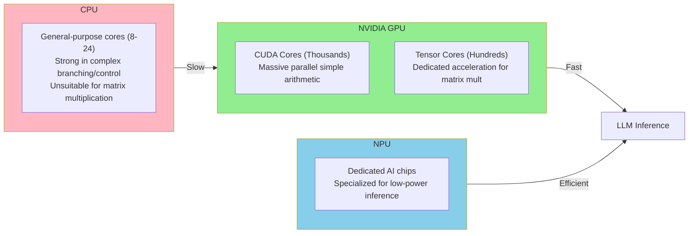
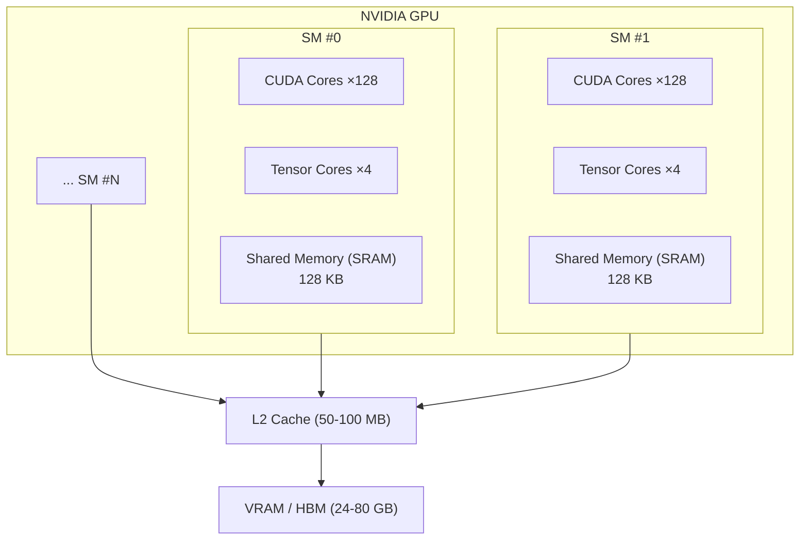
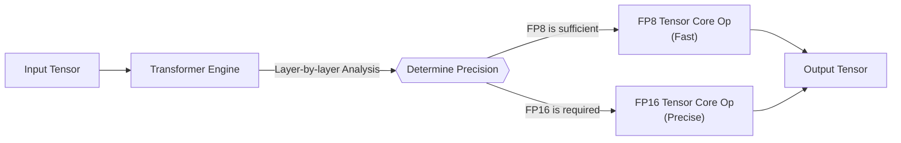
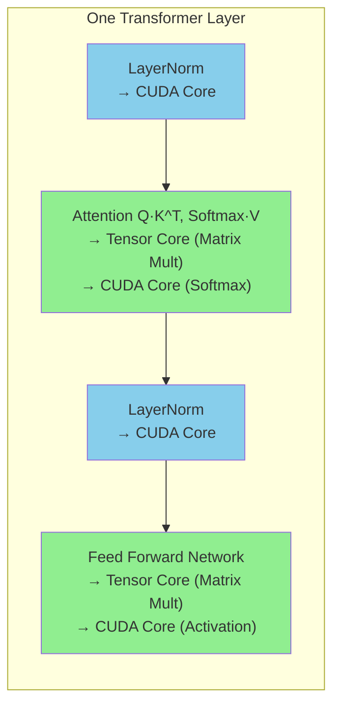
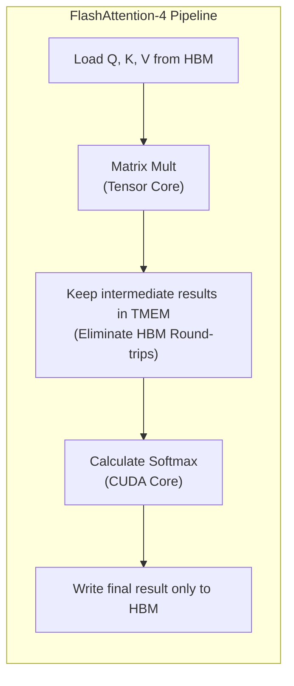
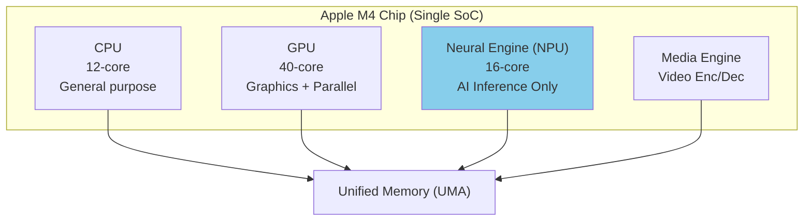
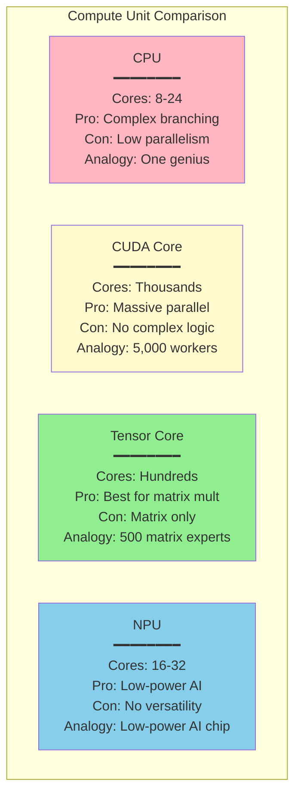
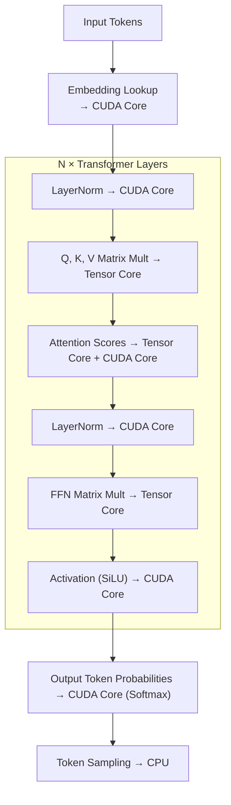

> This document is a supplement to Section 7, "Hardware Configuration," of [How LLMs Work: A Guide for Game Developers](/posts/llm-guide/).
> For an in-depth look at memory, please refer to the [VRAM Deep Dive Guide](/posts/vram-deep-dive/).

---

## Overview: Who Performs the Calculations?

The core of LLM inference is **matrix multiplication**. It involves repeating the task of multiplying and adding billions of numbers. "Who" performs these calculations can result in a speed difference of hundreds to thousands of times.



Analogy for game developers:
- **CPU** = Complex branching in game logic, AI decision-making, or physics simulation.
- **CUDA Core** = Vertex shaders transforming thousands of vertices simultaneously.
- **Tensor Core** = Dedicated units, like RT Cores for Ray Tracing, that perform specific operations extremely fast.
- **NPU** = A low-power image processing DSP in a mobile device.

---

## 1. CUDA Core: The Basic Unit of General Parallel Computing

### What is a CUDA Core?

A CUDA (Compute Unified Device Architecture) Core is the **most basic computing unit** of an NVIDIA GPU. Each CUDA Core can perform one floating-point (float) or integer (int) operation. GPUs are powerful because they have **thousands** of these cores, all performing calculations **simultaneously**.

### Role in Game Rendering

For game developers, CUDA Cores are very familiar. The **shaders** we write execute directly on these cores:

```
Vertex Shader:    Transforms each vertex → Handled by one CUDA Core
Fragment Shader:  Calculates each pixel color → Handled by one CUDA Core
Compute Shader:   Each thread → Handled by one CUDA Core
```

When rendering a frame at 1080p resolution, colors for about 2 million pixels must be calculated. Sequential processing by a CPU would be extremely slow, but with thousands of CUDA Cores working in parallel, it's completed within 16ms (60 FPS).

### Role in LLMs

In LLM inference, CUDA Cores perform the following tasks:

| Operation | Description | Role of CUDA Cores |
|------|------|-----------------|
| Activation Functions | ReLU, GELU, SiLU, etc. | Applying non-linear functions to each element |
| LayerNorm | Normalization operations | Mean/variance calculation, scaling |
| Softmax | Calculating probability distribution | Exponential functions, summation, division |
| Element-wise Ops | Addition, Residual connections | Parallel processing of vector elements |
| Token Sampling | Top-K, Top-P filtering | Probability sorting and sampling |

However, **matrix multiplication**, the heaviest operation in LLMs, is handled by **Tensor Cores** instead of CUDA Cores. While CUDA Cores can perform matrix multiplication, they are 10-20 times slower than Tensor Cores.

### CUDA Core Count by GPU

| GPU | CUDA Core Count | Released | Primary Use |
|-----|-------------|------|--------|
| RTX 3060 | 3,584 | 2021 | Consumer Gaming |
| RTX 4090 | 16,384 | 2022 | Consumer Flagship |
| RTX 5090 | 21,760 | 2025 | Consumer Flagship |
| A100 | 6,912 | 2020 | Data Center AI |
| H100 | 14,592 | 2023 | Data Center AI |
| B200 | 18,432 | 2025 | Data Center AI (Blackwell) |

<div class="chart-wrapper">
  <div class="chart-title">CUDA Core Count Comparison (Consumer vs. Data Center)</div>
  <canvas id="cudaCoreChart" class="chart-canvas" height="220"></canvas>
</div>

<script>
window.chartConfigs = window.chartConfigs || [];
window.chartConfigs.push({
  id: 'cudaCoreChart',
  type: 'bar',
  data: {
    labels: ['RTX 3060', 'RTX 4090', 'RTX 5090', 'A100', 'H100', 'B200'],
    datasets: [
      {
        label: 'Consumer',
        data: [3584, 16384, 21760, null, null, null],
        backgroundColor: 'rgba(52, 152, 219, 0.75)',
        borderColor: 'rgba(52, 152, 219, 1)',
        borderWidth: 1
      },
      {
        label: 'Data Center (AI Specialized)',
        data: [null, null, null, 6912, 14592, 18432],
        backgroundColor: 'rgba(231, 76, 60, 0.75)',
        borderColor: 'rgba(231, 76, 60, 1)',
        borderWidth: 1
      }
    ]
  },
  options: {
    plugins: {
      legend: { position: 'top' },
      tooltip: {
        callbacks: {
          label: function(ctx) {
            if (ctx.parsed.y === null) return null;
            return ctx.dataset.label + ': ' + ctx.parsed.y.toLocaleString();
          }
        }
      }
    },
    scales: {
      y: {
        beginAtZero: true,
        title: { display: true, text: 'CUDA Core Count' },
        ticks: {
          callback: function(v) { return v.toLocaleString(); }
        }
      }
    }
  }
});
</script>

> **Note**: Data center GPUs (A100, H100, B200) may have fewer CUDA Cores than some consumer models, but they are overwhelming in Tensor Core count and memory bandwidth. What matters for LLM inference is the combination of **Tensor Cores + VRAM Bandwidth**, not just the CUDA Core count.

### CUDA Core Execution Structure: SMs and Warps

CUDA Cores do not operate individually but are grouped into units called **SMs (Streaming Multiprocessors)**:



Analogy in game development:
- **SM** = Compute Unit (Shader execution unit)
- **Warp (32 threads)** = SIMD lane (32 threads executing the same instruction simultaneously)
- **Shared Memory** = `groupshared` memory in a Unity Compute Shader

```
CUDA Programming Hierarchy:
Grid (Total Work)
└── Block (Assigned to an SM)
    └── Warp (32 threads, simultaneous execution)
        └── Thread (Individual CUDA Core)

Game Shader Analogy:
Dispatch
└── Thread Group (Assigned to a Compute Unit)
    └── Wavefront/Warp (SIMD execution)
        └── Thread (Individual shader instance)
```

---

## 2. Tensor Core: Dedicated AI Matrix Multiplication Accelerator

### What is a Tensor Core?

A Tensor Core is a **hardware unit dedicated to matrix multiplication** built into NVIDIA GPUs. While CUDA Cores perform scalar (single number) operations, Tensor Cores operate on **matrix units**.

### Key Difference: Scalar vs. Matrix Operations

```
CUDA Core (Scalar):
  a × b + c = d
  → 1 operation results in 1 value

Tensor Core (Matrix):
  A(4×4) × B(4×4) + C(4×4) = D(4×4)
  → 1 operation results in 64 values (FMA: Fused Multiply-Add)
```

One Tensor Core performs a multiply-add on a 4x4 matrix in a single clock cycle. Performing the same operation with CUDA Cores would require 64 multiplications and 48 additions. This is why Tensor Cores are **10-20 times faster** for matrix multiplication.

Analogy in game development:
- **CUDA Core** = General-purpose shader ALU (handles all types of math)
- **Tensor Core** = RT Core (accelerates Ray Tracing only) or Texture Unit (accelerates texture filtering only)

Just as RT Cores accelerate BVH traversal in hardware, Tensor Cores accelerate matrix multiplication in hardware. While it's possible in software, dedicated hardware is overwhelmingly faster.

### Evolution of Tensor Cores

| Generation | GPU | Supported Precision | Key Improvements | Impact on LLMs |
|------|-----|-----------|---------|-------------|
| 1st Gen | V100 (2017) | FP16 | First introduction of Tensor Cores | Beginning of AI training acceleration |
| 2nd Gen | A100 (2020) | FP16, BF16, TF32, INT8 | Support for Structured Sparsity | 2x inference speed, mixed precision |
| 3rd Gen | H100 (2023) | FP16, BF16, FP8, INT8 | FP8 support, Transformer Engine | Training/Inference possible in FP8 |
| 4th Gen | B200 (2025) | FP16, BF16, FP8, FP4, INT8 | FP4 support, TMEM | Ultra-low precision inference, FlashAttention-4 |

### Why Precision Matters

Tensor Cores support various **precision** modes. Lower precision is faster and uses less memory, but can sacrifice accuracy:

```
FP32 (32-bit): ████████████████████████████████  Highest accuracy, default speed
FP16 (16-bit): ████████████████                  Good accuracy, 2x faster
BF16 (16-bit): ████████████████                  Best for training, 2x faster
FP8  (8-bit):  ████████                          Sufficient accuracy, 4x faster
FP4  (4-bit):  ████                              Inference only, 8x faster
INT8 (8-bit):  ████████                          Quantized inference, 4x faster
```

**BF16 vs. FP16:**
- FP16: Wide mantissa, narrow exponent → Precise but limited range for large numbers.
- BF16: Narrow mantissa, wide exponent → Less precise but supports larger range → Ideal for gradients during training.

Game Analogy: Similar to the trade-off between FP16 textures and R11G11B10 textures in HDR rendering. It's a balance between precision and memory/performance.

### Transformer Engine: Automatic Precision Management

Introduced with the H100, the **Transformer Engine** is an intelligent precision management system running on top of Tensor Cores:



By analyzing data distribution for each Transformer layer in real-time, it automatically selects the lowest possible precision without loss of accuracy. This allows for optimal performance without manual quantization tuning.

### CUDA Core vs. Tensor Core: Division of Labor

In LLM inference, the two units work together:



| Operation Phase | Primary Execution Unit | Computation Load (FLOPs) |
|----------|----------|-----------------|
| Matrix Multiplication (QKV, FFN) | **Tensor Core** | ~95% |
| Softmax, LayerNorm, Activations | **CUDA Core** | ~5% |

Since about 95% of total computation consists of matrix multiplication, the performance of Tensor Cores effectively determines LLM inference speed.

---

## 3. Tensor Memory (TMEM): Dedicated On-chip Memory for Blackwell

### What is TMEM?

Tensor Memory (TMEM) is **dedicated on-chip memory for Tensor Cores** newly introduced in the NVIDIA **Blackwell (B200)** architecture. With 256KB of dedicated SRAM per SM, it allows Tensor Cores to maintain results inside the chip instead of sending them out to VRAM (HBM).

### Why is it Necessary?

In previous architectures (Hopper/H100 and earlier), intermediate results from Tensor Cores had to be stored in **Shared Memory (SRAM)** or **VRAM (HBM)**. The issue is that Shared Memory is shared with CUDA Cores, leading to contention, and HBM access is slow.

```
Before (Pre-Hopper):
Tensor Core → Shared Memory (Contention with CUDA Cores) → HBM (Slow)
                    ↑ Bottleneck

Blackwell (With TMEM):
Tensor Core → TMEM (Dedicated, No Contention) → HBM (Only when needed)
                    ↑ Bottleneck Eliminated
```

### Game Development Analogy

In a Unity rendering pipeline:
- **Previous**: The shader writes intermediate results to a RenderTexture (VRAM) every time and reads them back.
- **TMEM**: The shader maintains intermediate results in registers/LDS → Eliminates VRAM round-trips.

It's similar to the optimization in a Compute Shader where you use `groupshared` memory to reduce global memory access.

### Relationship with FlashAttention-4

One of the key factors that allowed FlashAttention-4 to achieve 1,600+ TFLOPS (based on early reports) on Blackwell is TMEM:



Previously, intermediate results of Attention (the Q·K^T matrix) had to be written to HBM, but keeping them in TMEM bypasses the HBM bandwidth bottleneck.

### On-chip Memory Comparison by GPU Generation

| Architecture | GPU | Shared Memory / SM | Tensor Core Dedicated Memory | Notes |
|---------|-----|-------------|----------------------|------|
| Ampere | A100 | 164 KB | None | Shared by CUDA/Tensor Cores |
| Hopper | H100 | 228 KB | None (Improved Shared Memory) | Asynchronous access with TMA |
| Blackwell | B200 | 228 KB | **256 KB TMEM** | Separated for Tensor Cores |

---

## 4. NPU (Neural Processing Unit): Dedicated AI Chips Outside the GPU

### What is an NPU?

An NPU (Neural Processing Unit) is an **independent processor** specialized for AI inference. While a GPU's Tensor Core is an "AI acceleration unit" inside the GPU, an NPU is a **separate chip (or core block)** from the CPU/GPU.



### NPU vs. GPU: Differences in Design Philosophy

| | GPU (NVIDIA) | NPU (Apple Neural Engine, etc.) |
|--|-------------|---------------------------|
| **Design Goal** | Max throughput | Max power efficiency (perf/watt) |
| **Precision** | FP32 to FP4 (Flexible) | Fixed INT8/FP16 (Limited) |
| **Memory** | Dedicated VRAM (up to 80GB) | Shared System RAM |
| **Power Consumption** | 300-700W | 5-15W |
| **Programming** | CUDA (High flexibility) | Core ML, ONNX (Limited) |
| **Best For** | Training + Large Model Inference | Lightweight Inference, On-device AI |

### Major NPU Types

| NPU | Device | Performance (TOPS) | Features |
|-----|---------|-----------|------|
| **Apple Neural Engine** | iPhone, iPad, Mac | 38 TOPS (M4) | High bandwidth access via UMA |
| **Qualcomm Hexagon** | Android Smartphones | 45 TOPS (SD 8 Gen 3) | Optimized for mobile AI |
| **Intel NPU** | Latest Intel Laptops | 10-11 TOPS | Windows AI PC |
| **Google TPU** | Google Data Centers | Hundreds of TOPS | Server-grade AI chip |

> **TOPS**: Tera Operations Per Second. Usually measured based on INT8.

### When NPUs are Suitable (and Not) for LLMs

**Suitable For:**
- Running lightweight models (under 3B) on smartphones (On-device AI).
- Small models like voice recognition or image classification.
- Mobile environments where battery life is critical.
- Always-on background AI features.

**NOT Suitable For:**
- Large model inference (70B+ models require more memory/compute).
- Model training (no training functionality).
- Complex custom operations (lack of programming flexibility).
- Long context processing (KV cache memory limitations).

### Potential NPU Use in Game Development

| Use Case | Description | Feasibility |
|------|------|--------|
| NPC Dialogue | Generate dialogues locally with lightweight LLMs | Possible (3B model level) |
| Voice Recognition | Recognize player voice commands | Practical (e.g., Whisper) |
| Image Recognition | Camera/AR-based game features | Practical |
| Procedural Gen | AI-based content/level generation | Limited (Model size limits) |
| Real-time Trans | Translate multiplayer chat | Possible (Lightweight translation models) |

---

## 5. Overall Comparison: CPU vs. CUDA Core vs. Tensor Core vs. NPU

### At a Glance



### Detailed Comparison Table

| Feature | CPU | CUDA Core | Tensor Core | NPU |
|------|-----|-----------|-------------|-----|
| **Core Count** | 8-24 | Thousands to Tens of thousands | Hundreds | 16-32 |
| **Operation Unit** | Scalar | Scalar | Matrix (4×4) | Diverse |
| **FLOPs per Clock** | Low | Medium | Extremely High | Medium |
| **Power Draw** | 65-150W | 300-700W (Total GPU) | Included in GPU | 5-15W |
| **Programming** | C/C++ | CUDA C++ | CUDA + Libraries | Core ML/ONNX |
| **Flexibility** | Highest | High | Low (Matrix only) | Very Low |
| **Role in LLMs** | Pre/Post-processing | Softmax, LayerNorm | Matrix Mult (~95%) | Lightweight Inference |
| **Game Analogy** | Game Logic | Vertex/Fragment Shaders | RT Cores | Mobile AI Chip |

### Data Flow during LLM Inference



---

## Summary

```
Compute Pipeline for LLM Inference:

CPU:         Token pre/post-processing, sampling, I/O
              ↓
CUDA Core:   LayerNorm, Softmax, Activation functions (~5% FLOPs)
              ↓
Tensor Core: Matrix Multiplication - Attention, FFN (~95% FLOPs) ← The Key to Performance
              ↓
TMEM:        Holding Tensor Core intermediate results (Blackwell)
              ↓
VRAM (HBM):  Storage for weights, KV cache, activation data ← Bandwidth is the bottleneck
```

**Key Points:**
1. **CUDA Cores** are general-purpose parallel units. In LLMs, they handle non-matrix operations (~5%).
2. **Tensor Cores** are dedicated matrix multiplication accelerators. They determine ~95% of LLM inference performance.
3. **TMEM** is Blackwell's dedicated memory for Tensor Cores. It eliminates HBM round-trips, a key factor in FlashAttention-4 performance.
4. **NPUs** are dedicated low-power AI chips. They are unsuitable for large LLMs but ideal for mobile/on-device lightweight AI.
5. When choosing a GPU, the combination of **Tensor Core Generation + VRAM Capacity + Memory Bandwidth** determines LLM performance.

---

*This document is a supplement to Section 7, "Hardware Configuration," of [How LLMs Work: A Guide for Game Developers](/posts/llm-guide/).*
*For an in-depth look at memory, please refer to the [VRAM Deep Dive Guide](/posts/vram-deep-dive/).*
