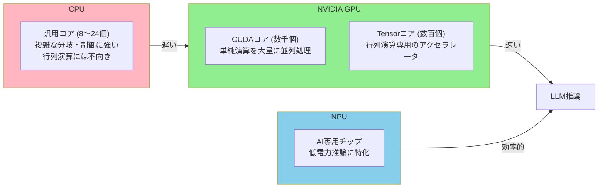
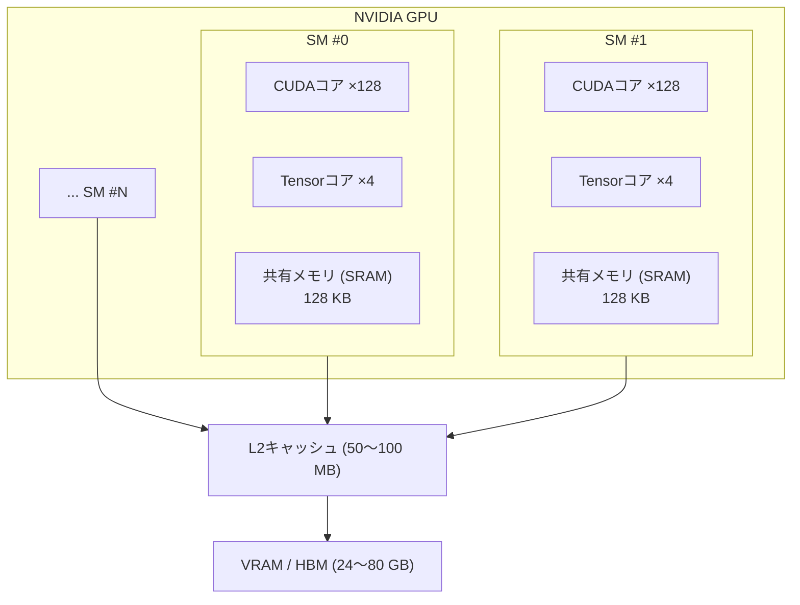
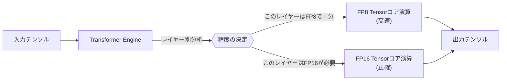
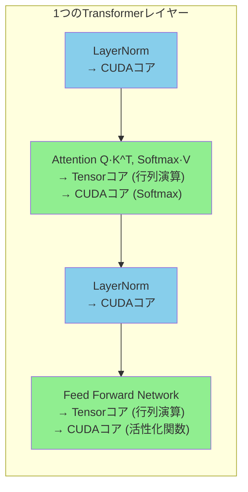
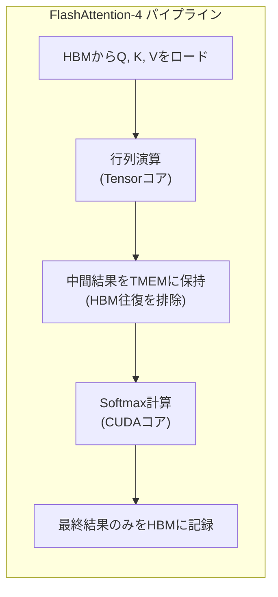
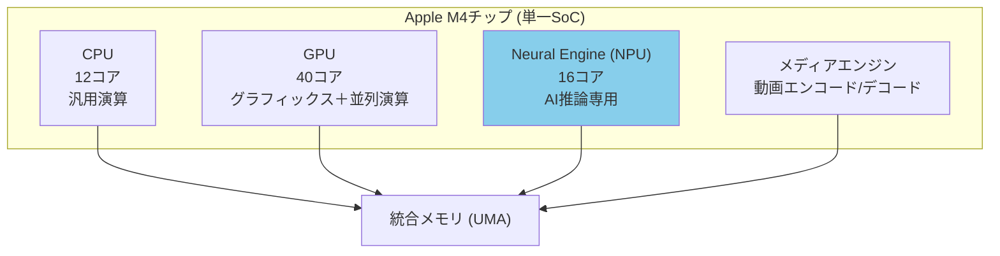
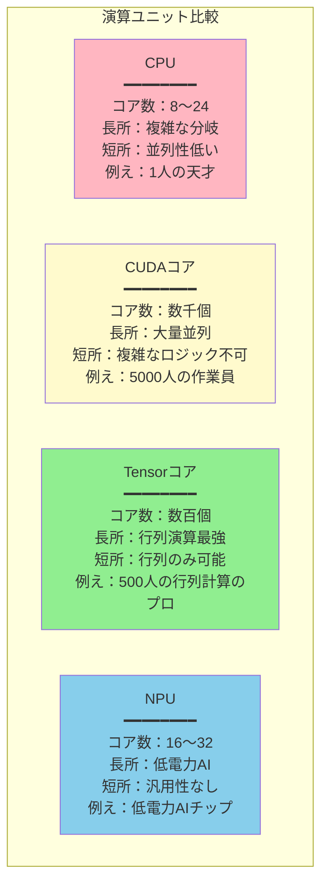
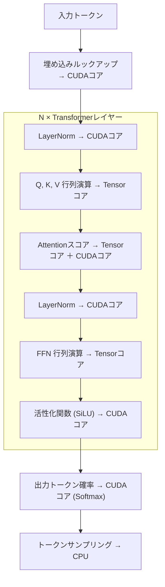

> このドキュメントは、「[LLMの仕組み - ゲーム開発者のためのガイド](/posts/llm-guide/)」のセクション7「ハードウェア構成」を補足する資料です。
> メモリに関する詳細は、「[VRAM深掘りガイド](/posts/vram-deep-dive/)」を参照してください直。

---

## 概要：誰が演算を行うのか？

LLM推論の核心は**行列演算**です。数十億個の数字を掛け合わせ、足し合わせる作業を繰り返します。この演算を「誰」が行うかによって、速度は数百倍から数千倍も変わります。



ゲーム開発者向けの例え：
- **CPU** = ゲームロジック、AIの意思決定、物理シミュレーションの複雑な分岐処理
- **CUDAコア** = 数千個の頂点を同時に変換する頂点シェーダー
- **Tensorコア** = レイトレーシングのRTコアのように、特定の演算だけを極めて高速に行う専用ユニット
- **NPU** = モバイルデバイスの低電力画像処理DSP

---

## 1. CUDAコア：汎用並列演算の基本単位

### CUDAコアとは？

CUDA（Compute Unified Device Architecture）コアは、NVIDIA GPUの**最も基本的な演算ユニット**です。各CUDAコアは、1つの浮動小数点（float）または整数（int）演算を実行できます。GPUが強力なのは、このコアが**数千個**存在し、すべてが**同時**に演算を実行するためです。

### ゲームレンダリングでの役割

ゲーム開発者にとって、CUDAコアは非常に馴染み深いものです。私たちが作成する**シェーダー（Shader）**は、まさにCUDAコアで実行されます。

```
頂点シェーダー：    各頂点を変換 → 1つのCUDAコアが処理
フラグメントシェーダー：各ピクセルの色を計算 → 1つのCUDAコアが処理
コンピュートシェーダー：各スレッド → 1つのCUDAコアが処理
```

1080p解像度のフレームをレンダリングする際、約200万ピクセルの色を計算する必要があります。CPUで順次処理すると極めて遅いですが、数千個のCUDAコアが同時に処理すれば16ms（60 FPS）以内に完了します。

### LLMでの役割

LLM推論において、CUDAコアは以下の作業を実行します。

| 演算 | 説明 | CUDAコアの役割 |
|------|------|-----------------|
| 活性化関数 | ReLU、GELU、SiLUなど | 各要素に非線形関数を適用 |
| LayerNorm | 正規化演算 | 平均・分散の計算、スケーリング |
| Softmax | 確率分布の計算 | 指数関数、合計、除算 |
| 要素別演算 | 加算、残留接続（Residual） | ベクトル要素別の並列処理 |
| トークンサンプリング | Top-K、Top-Pフィルタリング | 確率のソートおよびサンプリング |

しかし、LLMの最も負荷の高い演算である**行列演算**は、CUDAコアではなく**Tensorコア**が担当します。CUDAコアで行列演算ができないわけではありませんが、Tensorコアに比べて10〜20倍遅くなります。

### GPU別CUDAコア数

| GPU | CUDAコア数 | 発売 | 主な用途 |
|-----|-------------|------|--------|
| RTX 3060 | 3,584 | 2021 | コンシューマー向けゲーミング |
| RTX 4090 | 16,384 | 2022 | コンシューマー向けフラグシップ |
| RTX 5090 | 21,760 | 2025 | コンシューマー向けフラグシップ |
| A100 | 6,912 | 2020 | データセンター向けAI |
| H100 | 14,592 | 2023 | データセンター向けAI |
| B200 | 18,432 | 2025 | データセンター向けAI (Blackwell) |

<div class="chart-wrapper">
  <div class="chart-title">GPU別CUDAコア数の比較 (コンシューマー向け vs データセンター)</div>
  <canvas id="cudaCoreChart" class="chart-canvas" height="220"></canvas>
</div>

<script>
window.chartConfigs = window.chartConfigs || [];
window.chartConfigs.push({
  id: 'cudaCoreChart',
  type: 'bar',
  data: {
    labels: ['RTX 3060', 'RTX 4090', 'RTX 5090', 'A100', 'H100', 'B200'],
    datasets: [
      {
        label: 'コンシューマー向け',
        data: [3584, 16384, 21760, null, null, null],
        backgroundColor: 'rgba(52, 152, 219, 0.75)',
        borderColor: 'rgba(52, 152, 219, 1)',
        borderWidth: 1
      },
      {
        label: 'データセンター (AI特化)',
        data: [null, null, null, 6912, 14592, 18432],
        backgroundColor: 'rgba(231, 76, 60, 0.75)',
        borderColor: 'rgba(231, 76, 60, 1)',
        borderWidth: 1
      }
    ]
  },
  options: {
    plugins: {
      legend: { position: 'top' },
      tooltip: {
        callbacks: {
          label: function(ctx) {
            if (ctx.parsed.y === null) return null;
            return ctx.dataset.label + ': ' + ctx.parsed.y.toLocaleString() + '個';
          }
        }
      }
    },
    scales: {
      y: {
        beginAtZero: true,
        title: { display: true, text: 'CUDAコア数' },
        ticks: {
          callback: function(v) { return v.toLocaleString(); }
        }
      }
    }
  }
});
</script>

> **注**：データセンター向けGPU（A100、H100、B200）は、コンシューマー向けよりもCUDAコア数が少ない場合がありますが、Tensorコア数とメモリ帯域幅において圧倒的です。LLM推論で重要なのは、CUDAコア数よりも**Tensorコア + VRAM帯域幅**の組み合わせです。

### CUDAコアの実行構造：SMとワープ

CUDAコアは個別に動作するのではなく、**SM（Streaming Multiprocessor）**という単位でグループ化されます。



ゲーム開発での例え：
- **SM** = Compute Unit（シェーダー実行単位）
- **ワープ（Warp, 32スレッド）** = SIMDレーン（32個のスレッドが同じ命令を同時実行）
- **共有メモリ** = Unityコンピュートシェーダーの `groupshared` メモリ

```
CUDAプログラミング階層：
Grid (全体の作業)
└── Block (SMに割り当て)
    └── Warp (32スレッド、同時実行)
        └── Thread (各CUDAコア1つ)

ゲームシェーダーの例え：
Dispatch
└── Thread Group (Compute Unitに割り当て)
    └── Wavefront/Warp (SIMD実行)
        └── Thread (各シェーダーインスタンス)
```

---

## 2. Tensorコア：AI専用行列演算アクセラレータ

### Tensorコアとは？

Tensorコアは、NVIDIA GPUに内蔵された**行列演算専用のハードウェアユニット**です。CUDAコアがスカラ（1つの数字）演算を行うのに対し、Tensorコアは**行列単位**で演算を行います。

### 決定的な違い：スカラ vs 行列演算

```
CUDAコア (スカラ)：
  a × b + c = d
  → 1回の演算で1つの結果

Tensorコア (行列)：
  A(4×4) × B(4×4) + C(4×4) = D(4×4)
  → 1回の演算で64個の結果 (FMA: Fused Multiply-Add)
```

1つのTensorコアが1クロックで4x4行列の積和演算を実行します。CUDAコアで同じ演算を行うには、64回の乗算と48回の加算が必要です。これが、Tensorコアが行列演算において**10〜20倍高速**な理由です。

ゲーム開発での例え：
- **CUDAコア** = 汎用シェーダーALU（あらゆる種類の演算）
- **Tensorコア** = RTコア（レイトレーシング専用）またはテクスチャユニット（テクスチャフィルタリング専用）

RTコアがBVH探索をハードウェアで加速するように、Tensorコアは行列演算をハードウェアで加速します。ソフトウェアでも可能ですが、専用ハードウェアの方が圧倒的に高速です。

### Tensorコアの進化

| 世代 | GPU | 対応精度 | 主な改善 | LLMへの影響 |
|------|-----|-----------|---------|-------------|
| 第1世代 | V100 (2017) | FP16 | 最初のTensorコア導入 | AI学習加速の始まり |
| 第2世代 | A100 (2020) | FP16, BF16, TF32, INT8 | 疎行列（Sparsity）対応 | 推論速度2倍、混合精度 |
| 第3世代 | H100 (2023) | FP16, BF16, FP8, INT8 | FP8対応、Transformer Engine | FP8での学習・推論が可能 |
| 第4世代 | B200 (2025) | FP16, BF16, FP8, FP4, INT8 | FP4対応、TMEM | 超低精度推論、FlashAttention-4 |

### 精度（Precision）が重要な理由

Tensorコアは、いくつかの**精度**モードをサポートしています。精度が低いほど演算が高速でメモリ消費も抑えられますが、正確さが落ちる可能性があります。

```
FP32 (32bit): ████████████████████████████████  正確さ最高、速度標準
FP16 (16bit): ████████████████                  正確さ良好、2倍速
BF16 (16bit): ████████████████                  学習に最適、2倍速
FP8  (8bit):  ████████                          十分な正確さ、4倍速
FP4  (4bit):  ████                              推論専用、8倍速
INT8 (8bit):  ████████                          量子化推論、4倍速
```

**BF16 vs FP16：**
- FP16：広い仮数部、狭い指数部 → 精密だが大きな数の表現に制限あり
- BF16：狭い仮数部、広い指数部 → 精度は落ちるが大きな数の表現が可能 → 学習の勾配（Gradient）に最適

ゲームの例え：HDRレンダリングにおけるFP16テクスチャとR11G11B10テクスチャのトレードオフに似ています。精度とメモリ・パフォーマンスのバランスです。

### Transformer Engine：自動精度管理

H100から導入された**Transformer Engine**は、Tensorコア上で動作するインテリジェントな精度管理システムです。



各Transformerレイヤーのデータ分布をリアルタイムで分析し、精度を損なうことなく、可能な限り低い精度を自動的に選択します。手動での量子化チューニングなしでも最適なパフォーマンスが得られます。

### CUDAコア vs Tensorコア：役割分担

LLM推論において、これら2つのユニットは協力し合います。



| 演算フェーズ | 主な実行ユニット | 演算比重 (FLOPs) |
|----------|----------|-----------------|
| 行列演算 (QKV, FFN) | **Tensorコア** | 〜95% |
| Softmax, LayerNorm, 活性化 | **CUDAコア** | 〜5% |

全演算の約95%が行列演算であるため、Tensorコアの性能がLLM推論速度を事実上決定します。

---

## 3. Tensor Memory (TMEM)：Blackwell専用オンチップメモリ

### TMEMとは？

Tensor Memory（TMEM）は、NVIDIA **Blackwell（B200）** アーキテクチャで新たに導入された **Tensorコア専用のオンチップメモリ** です。SMあたり256KBの専用SRAMで、Tensorコアが演算結果をVRAM（HBM）に出力せずにチップ内部で保持できるようにします。

### なぜ必要なのか？

従来のアーキテクチャ（Hopper/H100以前）では、Tensorコアの中間結果を **共有メモリ（SRAM）** または **VRAM（HBM）** に保存する必要がありました。問題は、共有メモリはCUDAコアと共有するため競合が発生し、HBMはアクセスが遅いという点です。

```
従来 (Hopper以前)：
Tensorコア → 共有メモリ (CUDAコアと競合) → HBM (遅い)
                    ↑ ボトルネック

Blackwell (TMEM導入)：
Tensorコア → TMEM (専用、競合なし) → 必要な時だけHBM
                    ↑ ボトルネック解消
```

### ゲーム開発での例え

Unityのレンダリングパイプラインに例えると：
- **従来**：シェーダーが中間結果を毎回RenderTexture（VRAM）に書き込み、再度読み込む
- **TMEM**：シェーダー内部のレジスタ/LDSに中間結果を保持 → VRAMの往復を排除

あるいは、Compute Shaderで `groupshared` メモリを活用してグローバルメモリアクセスを減らす最適化と同じ原理です。

### FlashAttention-4との関係

FlashAttention-4がBlackwellで1,600+ TFLOPS（初期報告ベース）を達成できた核心的な要因の一つが、まさにこのTMEMです。



従来はAttentionの中間結果（Q·K^T行列）をHBMに書き込む必要がありましたが、TMEMに保持することでHBM帯域幅のボトルネックを回避します。

### GPU世代別オンチップメモリ比較

| アーキテクチャ | GPU | 共有メモリ / SM | Tensorコア専用メモリ | 備考 |
|---------|-----|-------------|----------------------|------|
| Ampere | A100 | 164 KB | なし | CUDA/Tensorコアが共有 |
| Hopper | H100 | 228 KB | なし (改善された共有メモリ) | TMAによる非同期アクセス |
| Blackwell | B200 | 228 KB | **256 KB TMEM** | Tensorコア専用に分離 |

---

## 4. NPU (Neural Processing Unit)：GPU外のAI専用チップ

### NPUとは？

NPU（Neural Processing Unit）は、AI推論に特化した**独立したプロセッサ**です。GPUのTensorコアがGPU内の「AI加速ユニット」であるのに対し、NPUはCPU/GPUとは**別のチップ（またはコアブロック）**です。



### NPU vs GPU：設計思想の違い

| | GPU (NVIDIA) | NPU (Apple Neural Engineなど) |
|--|-------------|---------------------------|
| **設計目標** | 最大スループット（処理量） | 最大電力効率（perf/watt） |
| **演算精度** | FP32〜FP4 (柔軟) | INT8/FP16固定 (制限あり) |
| **メモリ** | 専用VRAM (最大80GB) | システムRAM共有 |
| **消費電力** | 300〜700W | 5〜15W |
| **プログラミング** | CUDA (自由度が高い) | Core ML, ONNX (制限あり) |
| **適した作業** | 学習 ＋ 大規模モデル推論 | 軽量モデル推論、オンデバイスAI |

### 主なNPUの種類

| NPU | 搭載デバイス | 性能 (TOPS) | 特徴 |
|-----|---------|-----------|------|
| **Apple Neural Engine** | iPhone, iPad, Mac | 38 TOPS (M4) | UMAによる大容量メモリへのアクセス |
| **Qualcomm Hexagon** | Androidスマートフォン | 45 TOPS (SD 8 Gen 3) | モバイルAI最適化 |
| **Intel NPU** | 最新のIntelノートPC | 10〜11 TOPS | Windows AI PC |
| **Google TPU** | Googleデータセンター | 数百 TOPS | サーバー級AI専用チップ |

> **TOPS**：Tera Operations Per Second（毎秒1兆回の演算）。一般的にINT8ベースで測定されます。

### NPUがLLMに適している場合と不向きな場合

**適している場合：**
- スマートフォンで3B以下の軽量モデルを実行（オンデバイスAI）
- 音声認識、画像分類などの小規模モデル
- バッテリー駆動時間が重要なモバイル環境
- 常にオンになっているバックグラウンドAI機能

**不向きな場合：**
- 70B以上の大規模モデル推論（メモリ・演算ともに不足）
- モデルの学習（学習機能なし）
- 複雑なカスタム演算（プログラミングの自由度が低い）
- 長いコンテキストの処理（KVキャッシュのメモリ制限）

### ゲーム開発におけるNPU活用の可能性

| 用途 | 説明 | 現実味 |
|------|------|--------|
| NPC対話 | 軽量LLMでローカルNPC対話を生成 | 可能 (3Bモデル級) |
| 音声認識 | プレイヤーの音声コマンドを認識 | 実用的 (Whisperなど) |
| 画像認識 | カメラ/ARベースのゲーム機能 | 実用的 |
| 手続き型生成 | AIベースのコンテンツ/レベル生成 | 制限あり (モデルサイズ制限) |
| リアルタイム翻訳 | マルチプレイヤーチャット翻訳 | 可能 (軽量翻訳モデル) |

---

## 5. 全体比較：CPU vs CUDAコア vs Tensorコア vs NPU

### 一目で比較



### 詳細比較表

| 特性 | CPU | CUDAコア | Tensorコア | NPU |
|------|-----|-----------|-------------|-----|
| **コア数** | 8〜24 | 数千〜数万個 | 数百個 | 16〜32 |
| **演算単位** | スカラ | スカラ | 行列 (4×4) | 多様 |
| **クロックあたりのFLOPs** | 低い | 中間 | 非常に高い | 中間 |
| **消費電力** | 65〜150W | GPU全体で300〜700W | GPUに含まれる | 5〜15W |
| **プログラミング** | C/C++ | CUDA C++ | CUDA ＋ ライブラリ | Core ML/ONNX |
| **柔軟性** | 最高 | 高い | 低い (行列専用) | 非常に低い |
| **LLMでの役割** | トークンの前後処理 | Softmax, LayerNorm | 行列演算 (〜95%) | 軽量モデル推論 |
| **ゲームの例え** | ゲームロジック | 頂点/フラグメントシェーダー | RTコア | モバイルAIチップ |

### LLM推論時のデータフロー



---

## まとめ

```
LLM推論の演算パイプライン：

CPU:         トークンの前後処理、サンプリング、I/O
              ↓
CUDAコア:    LayerNorm, Softmax, 活性化関数 (〜5% FLOPs)
              ↓
Tensorコア:  行列演算 - Attention, FFN (〜95% FLOPs) ← 性能の核心
              ↓
TMEM:        Tensorコアの中間結果を保持 (Blackwell)
              ↓
VRAM (HBM):  重み、KVキャッシュ、活性化データの保存 ← 帯域幅がボトルネック
```

**核心的なポイント：**
1. **CUDAコア** は汎用的な並列演算ユニット。LLMでは非行列演算（〜5%）を担当。
2. **Tensorコア** は行列演算専用のアクセラレータ。LLM推論性能の約95%を決定する。
3. **TMEM** は Blackwell の Tensorコア専用メモリ。HBMの往復を排除し、FlashAttention-4性能の鍵となる。
4. **NPU** は低電力AI専用チップ。大規模LLMには不向きだが、モバイルやオンデバイスの軽量AIに最適。
5. GPU選びでは、**Tensorコアの世代 ＋ VRAM容量 ＋ メモリ帯域幅** がLLMの性能を決定する。

---

*このドキュメントは、「[LLMの仕組み - ゲーム開発者のためのガイド](/posts/llm-guide/)」のセクション7「ハードウェア構成」を補足する資料です。*
*メモリに関する詳細は、「[VRAM深掘りガイド](/posts/vram-deep-dive/)」を参照してください。*
