## Introduction

The familiar games we develop are based on commercial game engines that support multiple graphics APIs. A game engine consists of complex subsystems like physics engines, rendering pipelines, and audio systems, all working together in a unified environment.

Recently, AI tools have become deeply integrated into our development workflows. Using LLM-based tools like Claude Code, GitHub Copilot, and ChatGPT every day, I naturally became curious about their inner workings.

Just as understanding the internal structure of a game engine allows for better optimization and debugging, understanding how LLMs work will help us use these tools more effectively. This document explores the internal structure of LLMs from a game developer's perspective.

---

## Part 1: Basic Concepts

The first thing to understand about LLMs is "what they are." Before diving into complex formulas or papers, let's grasp the essence of LLMs by comparing them with familiar game development concepts. This part covers memory structure, data flow, and the difference between training and inference.

### 1. Unity vs. LLM Memory Structure

Memory management is a familiar topic for game developers. Loading scenes, managing assets, and preventing memory leaks in Unity are daily tasks. LLMs are also programs that reside in memory, but their approach is quite different from Unity's.

The biggest difference is "what is loaded and when." While Unity loads only what is needed at any given time, LLMs load everything at once at startup and keep it there. Why is that? And what does a "neural network" actually look like in memory?

### Visualization vs. Actual Memory

When describing LLMs, you often see neural network diagrams with nodes connected in a graph. While these visualizations help in understanding the concept, they are stored in a completely different way in actual computer memory. There are no graphs or nodes; it's just numbers. A lot of them.


**Key**: A neural network is conceptually a complex graph, but in reality, it is a **massive array of numbers (float array)**.

### Comparison of Loading Methods: Unity vs. LLM

In Unity, we use `Addressables` or `Resources.Load()` to load only the necessary assets. In a combat scene, only combat-related assets are in memory; in a lobby scene, only lobby assets are loaded. When the scene transitions, previous assets are unloaded. This is why games with gigabytes of assets can run on limited memory.

LLMs, however, use a completely different strategy. When the server starts, the entire model weights—which can be hundreds of gigabytes—are loaded into GPU VRAM. They stay there until the server is shut down because the LLM cannot predict what question will come next. It doesn't know if it will be "solve a math problem," "write a poem," or "review code." To be ready for all possibilities, all weights must be available at all times.

As an analogy, Unity is like a **library**. You find the book you need, take it out, and put it back when you're done. An LLM is like a **person who has memorized every book**. They can answer any question immediately, but they must keep all that knowledge in their head at all times.

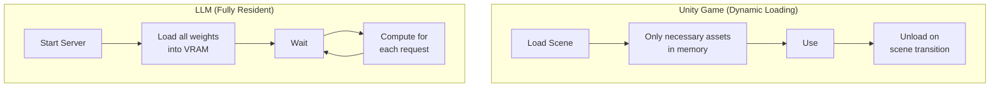

| Feature | Unity | LLM |
| --- | --- | --- |
| Loading Method | Dynamic (On-demand) | Static (Fully resident) |
| Memory Management | Unload per scene | Maintained until server restart |
| Analogy | Library (Take out what's needed) | Someone who memorized all books |

---

### 1-2. Model Scale and Parameters

We've established that an LLM is a "massive float array." So, how large is this array? When LLM models are introduced, we often see numbers like "7B," "70B," or "671B." These numbers represent the **number of parameters**, which is the **number of elements** in that float array. "B" stands for Billion.

**Parameter = Weight = Every single number the model has learned**

```
7B   = 7 billion float numbers
70B  = 70 billion float numbers
175B = 175 billion float numbers (GPT-3)
671B = 671 billion float numbers (DeepSeek-V3)
```

In Unity terms, parameters are similar to the **total number of pixels or vertices in every asset** of a game. Just as each vertex in a 3D model has a position (x, y, z), each parameter in an LLM has a specific float value. Together, these values form the "ability to understand language."

### Where Exactly Are the Parameters?

Inside a Transformer, parameters are primarily stored in **matrices** of the following components:

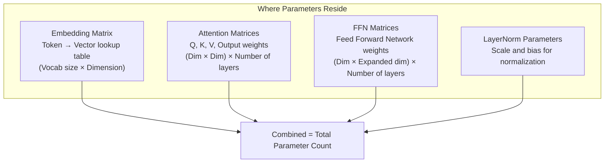

For example, in a model with a dimension of 4096 and 32 layers:
- **Embedding**: Vocab size (~50,000) × 4096 ≈ 200 million
- **Attention (Q,K,V,O)**: 4 × 4096 × 4096 × 32 ≈ 2.1 billion
- **FFN**: 2 × 4096 × 16384 × 32 ≈ 4.3 billion
- **Others (LayerNorm, etc.)**: A few million

Combined, this totals approximately **7B**. This is the reality of a "7B parameter model."

### Relationship between Parameter Count and Memory

One parameter is basically one float number. Memory usage varies depending on the storage format:

| Precision | Size per Parameter | 7B Model | 70B Model | 671B Model |
| --- | --- | --- | --- | --- |
| FP32 (32-bit) | 4 bytes | 28 GB | 280 GB | 2,684 GB |
| FP16 (16-bit) | 2 bytes | 14 GB | 140 GB | 1,342 GB |
| INT8 (8-bit quantized) | 1 byte | 7 GB | 70 GB | 671 GB |
| INT4 (4-bit quantized) | 0.5 byte | 3.5 GB | 35 GB | 336 GB |

This table shows why **Quantization** is so important. Running a 70B model in FP16 requires 140GB of memory, but applying 4-bit quantization reduces it to 35GB, making it possible to run on Mac's unified memory or an NVIDIA RTX 4090 (24GB VRAM with some offloading). While quantization can slightly reduce response quality due to lower precision, modern techniques minimize this difference.

### Parameter Count = Model's "Brain Size"

| Model | Parameter Count | Approximate Level | Analogy |
| --- | --- | --- | --- |
| TinyLlama | 1.1B | Simple conversation | Elementary student |
| Llama 3.2 | 3B | Basic Q&A | Middle school student |
| Llama 3.1 | 8B | General-purpose assistant | High school student |
| Llama 3.1 | 70B | Professional analysis | Graduate student |
| GPT-4 (Est.) | ~1.8T (MoE) | Top-tier general-purpose | Team of PhD experts |
| Claude Opus 4.6 | Undisclosed | Top-tier general-purpose | Undisclosed |

> **Note**: A higher parameter count doesn't always mean better performance. The quality of training data, post-training (RLHF), and architectural efficiency all play roles. An 8B model trained with the latest techniques can outperform a previous generation's 70B model (see Section 8-1).

---

### 2. API Call Flow: Where Does the Prompt Go?

What happens when you enter a prompt in Claude Code? The response returns like magic, but there's a complex journey in between.

The moment you type in the terminal, that text leaves your local computer and travels over the internet to Anthropic's servers. The server breaks your text into units called "tokens" and passes them through a massive neural network to generate a response. This response then travels back across the internet to your terminal.

A key characteristic here is that it is **Stateless**. The API server does not remember who you are or what your previous conversation was. It's like meeting a new person every time. Therefore, Claude Code saves the previous conversation history locally and **sends the entire conversation history to the server along with the new message** by default (though it may summarize the history to reduce data volume as context grows). This is why data transmission and costs increase as the conversation gets longer.

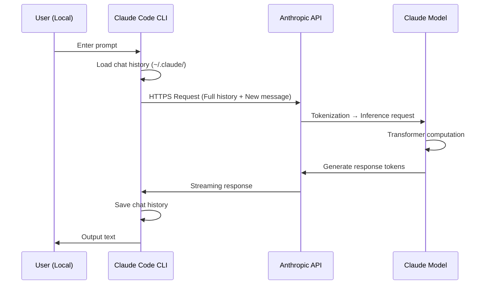

**Key Characteristics**:
- **Stateless**: The API server does not remember previous conversations.
- **Full Transmission**: The history is sent with every turn (clients may apply compression/summarization).
- **Tokenization usually happens on the server**: Text-to-token conversion is performed by the API server.
- **Prompt Caching**: While conceptually stateless, modern providers like Anthropic and OpenAI support **Prompt Caching** to reduce costs and latency. When a client repeatedly sends the same long context (e.g., `CLAUDE.md`, system prompts), the server temporarily preserves previous computation results (KV Cache) to skip redundant calculations. This is a **reuse of computation cache**, not "memory," so it doesn't contradict the stateless principle (detailed in Section 12).

---

### 3. Conversation Context: Where is it Stored?

If you ask Claude, "Do you remember what I asked yesterday?", does it actually "remember"? The answer is complicated.

The LLM server itself remembers nothing. It's completely stateless. However, the **client** you use (Claude Code, the claude.ai web interface, or an app you built) stores the conversation somewhere and sends it along with every API call.

In Claude Code, conversation history is stored per project in the `~/.claude/projects/` folder. Since these are pure local data, you won't see previous conversations if you open the same project on a different computer. In contrast, claude.ai stores data in a server database, so you can see your history whenever you log in.

What if you call the API directly? Nothing is stored. The developer must manage the conversation history manually and send the necessary context with every request.

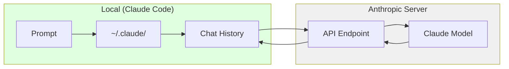

| Usage | Storage Location | Characteristics |
| --- | --- | --- |
| Claude Code (CLI) | Local (`~/.claude/projects/`) | Isolated per project |
| claude.ai (Web) | Anthropic Server DB | Linked to account |
| Direct API Call | Not stored | Completely Stateless |

> **💬 Quick Q&A**
> 
> **Q. What is a context window?**
> It is the **maximum number of tokens** that can be processed at once. Claude 3.5 can handle 200K, and Claude 4.6 can process up to 1M (beta). If a conversation exceeds this limit, older content is truncated. Claude Code's `/compact` command is for managing this.
> 
> **Q. Is a larger context window always better?**
> There's a **cost and speed trade-off**. While a larger context can hold more information, processing time and costs also increase due to the O(n²) nature of Self-Attention. A 1M context is overkill for a simple question.

---

### 4. Detailed LLM Operational Flow

Now, let's answer the core question: **What actually happens when a prompt is converted into a response?**

Just as a GameObject in Unity goes through an `Awake()` → `Start()` → `Update()` cycle, LLMs follow a set pipeline. Text comes in, is converted to numbers, undergoes complex mathematical operations, and is converted back to text.

The most important point is that an LLM generates a response **one token at a time**. A response like "Hello" isn't produced all at once; it's generated in the sequence "H" → "e" → "l" → "l" → "o". Every time a token is generated, the entire Transformer computation is executed. This is why long responses take time and you see them printed character by character when streaming.

Below is the full process of a prompt becoming a response.

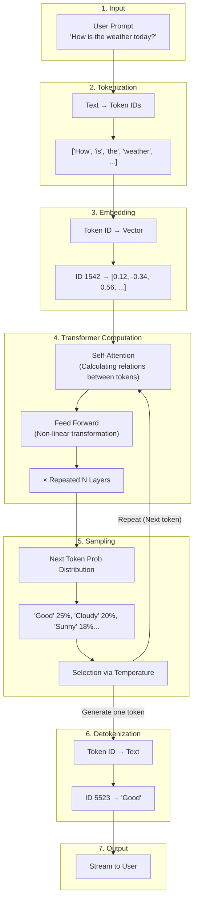

### Explanation of Each Step

| Step | Description | Unity Analogy |
| --- | --- | --- |
| **Tokenization** | Convert text to numeric IDs | Asset Path → Instance ID |
| **Embedding** | Convert IDs to high-dimensional vectors | Prefab → GameObject Instance |
| **Transformer** | Context understanding and pattern matching | Executing Update() logic |
| **Sampling** | Probabilistic selection of the next token | Random.Range() |
| **Detokenization** | Restore numeric IDs to text | Output rendering results to screen |

**Key Point**: LLMs generate **one token at a time**. A response like "I like it" comes out one by one: "I" → "like" → "it".

> **💬 Quick Q&A**
> 
> **Q. Do LLMs actually "think"?**
> No. They simply predict the token with the highest probability of coming next. It's **statistical pattern matching**, not consciousness or understanding. For an input like "The weather is", it just calculates probabilities like "nice 25%, cloudy 20%...".
> 
> **Q. What exactly is a token?**
> It's the **smallest unit of text processing**. In English, it's roughly at the word level; in Korean, it can be at the syllable or morpheme level. "Hello" might be ["Hel", "lo"]. Every model has a different tokenization method.
> 
> **Q. What is Temperature?**
> It's a **parameter that controls the randomness** of responses. A low value (close to 0) selects the most probable tokens for consistent responses, while a high value (over 1) allows for lower-probability tokens for creative but unpredictable output. It's like adjusting the range of `Random.Range()`.
> 
> **Q. Why is the response printed one character at a time?**
> Because LLMs generate one token at a time. Streaming shows this process in real-time. It's a UX optimization to show progress immediately rather than waiting for the entire response to finish.

---

### 5. Training vs. Inference: The Two Modes of LLMs

A common question is, "Does Claude learn when I talk to it?" The answer is **no**.

LLMs have two completely different modes: **Training** and **Inference**. These are entirely different processes, much like game development vs. gameplay.

Training happens offline over several months. Engineers at companies like Anthropic use thousands of GPUs to process vast amounts of text data from the internet. In this process, the model encodes language patterns into numbers called "weights." Once training is complete, these weights are saved as files—this is what we call "the model."

Inference is what happens when you chat with Claude. It uses the pre-trained weights in **read-only** mode. The weights do not change. The model does not "learn" anything new; it simply predicts the next token based on pre-learned patterns.

The difference in cost is also stark. Training costs tens to hundreds of millions of dollars, while inference costs only **a few dollars per million tokens**. The API costs we pay are for this inference process.

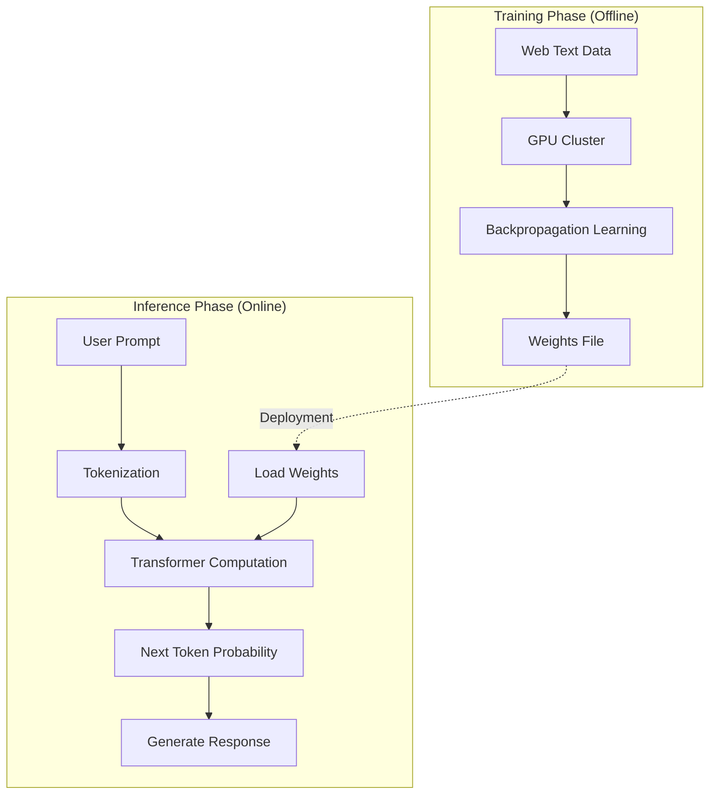

| Category | Training | Inference |
| --- | --- | --- |
| **Timing** | Offline, several months | Online, real-time |
| **Input** | Trillions of text tokens | User prompt |
| **Output** | Weights file (Hundreds of GBs) | Response tokens |
| **Purpose** | Learning language patterns | Predicting the next token |
| **Cost** | Millions of dollars | Charge per million tokens (MTok) |

**Important**: When we chat with Claude, only the **Inference phase** is executed. The model does not "learn" new things.

> **💬 Quick Q&A**
> 
> **Q. Does Claude learn from our conversation?**
> No, it only performs **inference**. Training happens offline over months, and during conversation, it uses completed weights in read-only mode. Your conversation is not reflected in the model.
> 
> **Q. Why does LLM training cost hundreds of millions of dollars?**
> Because of **data and compute volume**. To process trillions of tokens, thousands of expensive GPUs (like H100s) must run at full capacity for months. Electricity bills alone can reach tens of millions. Inference, however, is relatively cheap as it reuses existing weights. This is why figures like Elon Musk aim to build data centers in space—leveraging radiative cooling in a vacuum and solar power could significantly cut costs.

---

## Part 2: Internal Structure (Deep Dive)

Part 1 provided an overview of what LLMs are and how they are used. Now, let's go deeper. What is the "Transformer" architecture, why are GPUs needed, and how are servers operated?

While this information isn't strictly necessary to use an LLM, understanding the internal structure will help you grasp why certain actions are slow, why costs are structured the way they are, and what the limitations are.

### 6. Transformer Architecture: The Core Principle

The "Attention Is All You Need" paper published by Google in 2017 was a turning point in AI history. The **Transformer** architecture introduced in this paper became the foundation for all major LLMs. The 'T' in GPT (**G**enerative **P**re-trained **T**ransformer) stands for this Transformer, and models like Claude and Gemini use the same architecture.

The core idea of the Transformer is **Self-Attention**. Each word (token) in a sentence calculates its relationship with every other word. In the sentence "The cat sat on the mat. It was soft," how do we know what "It" refers to? Self-Attention calculates the degree of relevance between "It" and "cat," and "It" and "mat," to understand that "It" refers to the "mat."

For a Unity developer, this is similar to every GameObject calculating its distance from every other GameObject. If there are $n$ objects, $n 	imes n$ calculations are required. This is why LLMs slow down when processing long text—it's due to O(n²) complexity.

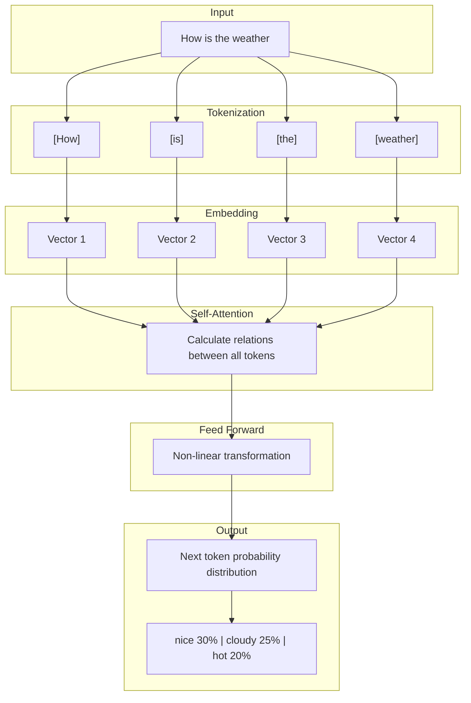

### What is Self-Attention?

Every token calculates its relationship with every other token.

For example, in "The cat sat on the mat. It was soft":
- What does "It" refer to?
- Relationship with "cat"? Relationship with "mat"?
- Self-Attention calculates these relationships.

**Unity Analogy**: Similar to every GameObject calculating its distance to every other GameObject. It has O(n²) complexity.

> **💬 Quick Q&A**
> 
> **Q. Why does it slow down as conversations get longer?**
> Because it must **process the entire context every time**. Since Self-Attention is O(n²), doubling the tokens quadruples the computation. Claude Code's `/compact` command helps by cleaning up the context.
> 
> **Q. Why is a new version smarter if they use the same Transformer?**
> While the "engine" (Transformer) is the same, the technology on top evolves in **five areas simultaneously**: (1) Pre-training data quality, (2) Post-processing (RLHF→DPO→RLVR), (3) Architecture (MoE, FlashAttention), (4) Inference-time scaling (Extended Thinking), and (5) Knowledge Distillation. Details are in [Section 8-1](#).

---

### 6-1. Mamba and State Space Models (SSM): The Transformer Alternative

The O(n²) complexity of Transformers is a fundamental limitation. If context increases from 4K to 128K, computation doesn't just increase by 32x; it explodes by **1,024x**. In game terms, it's like performing brute-force collision checks for every pair of objects whenever the number of objects increases. We clearly need a more efficient way.

Starting around 2024-2025, a new architecture called **Mamba** gained significant attention. Based on **State Space Models (SSM)**, Mamba processes input data sequentially while dynamically updating a **fixed-size Internal State**.

Key differences using a game analogy:
- **Transformer**: Like **re-rendering the entire screen from scratch** every frame.
- **Mamba**: Like using an **Acceleration Structure** to efficiently process only the parts that changed.

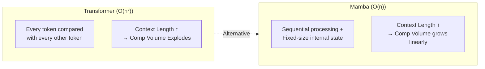

The greatest advantage of Mamba is achieving **linear time complexity O(n)**. As data length increases, computation only increases proportionally. Furthermore, it compresses previous token information into a fixed-size state vector during inference, eliminating the need to re-scan all past data like a Transformer.

| Feature | Transformer | Mamba (SSM) |
| --- | --- | --- |
| Time Complexity | O(n²) | O(n) |
| Long Context Handling | Sharp (quadratic) degradation as tokens increase | Linear increase (gentle); per-token cost is almost constant |
| VRAM Usage | Grows sharply with context (KV Cache) | Maintains a fixed-size internal state |
| Strengths | Complex logic, precise pattern matching | Long document analysis, infinite-dialogue NPCs |
| Notable Model | GPT-4, Claude | Codestral Mamba |

> **Implications for Game Developers**: If an NPC needs to have a conversation with a player over several hours, the O(n²) of Transformers is fatal. Lightweight Mamba-based models are much more suitable for such scenarios.

> **💬 Quick Q&A**
> 
> **Q. Is Mamba replacing the Transformer?**
> **Not yet. They are complementary.** Mamba excels at long context with its O(n) linear complexity, but Transformers' precise Self-Attention still dominates in complex logical reasoning. The current trend is **Hybrid Architectures**, discussed below.

---

### 6-2. Hybrid Architectures: Transformer + Mamba

"If both are good, why not combine them?" Exactly. At the forefront of modern research, **Hybrid Architectures** that combine the Transformer's precise context understanding with Mamba's efficient linear scaling are gaining traction.

**Jamba**: This model alternates Transformer and Mamba layers at a specific ratio, combined with an MoE structure to balance throughput and performance. It's a division of labor where Mamba quickly handles nearby context, and Transformer precisely manages complex relations across distant contexts.

**Routing Mamba (RoM)**: A technique proposed by Microsoft that sparsely selects linear projection experts within Mamba, proving to improve computational efficiency by over 23% while matching the performance of large models.

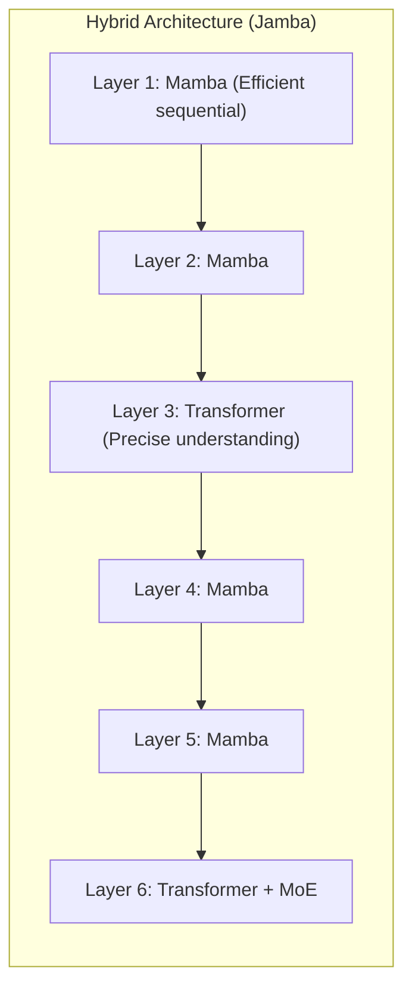

In Unity terms, a hybrid architecture is like an **LOD (Level of Detail)** system. Just as you process nearby objects at high resolution and distant ones at low resolution, these models process local context lightly and complex relationships precisely.

| Architecture | Key Features | Notable Model |
| --- | --- | --- |
| Transformer | Precise context understanding & pattern matching | GPT-4, Claude 3.5 |
| Mamba (SSM) | Linear scaling, optimized for long context | Codestral Mamba |
| MoE | Huge parameter capacity relative to computation | DeepSeek-V3, Mixtral |
| Hybrid (Jamba/RoM) | Optimal balance of performance and efficiency | Jamba, Samba |

---

### 6-3. Ray Tracing and Self-Attention: Surprising Similarities

Interestingly, LLM attention mechanisms and **Ray Tracing**—the core of modern graphics—share very similar technical challenges. Game developers will find this similarity familiar.

Both technologies are centered around **"searching complex networks of data relationships,"** and both require advanced acceleration structures:

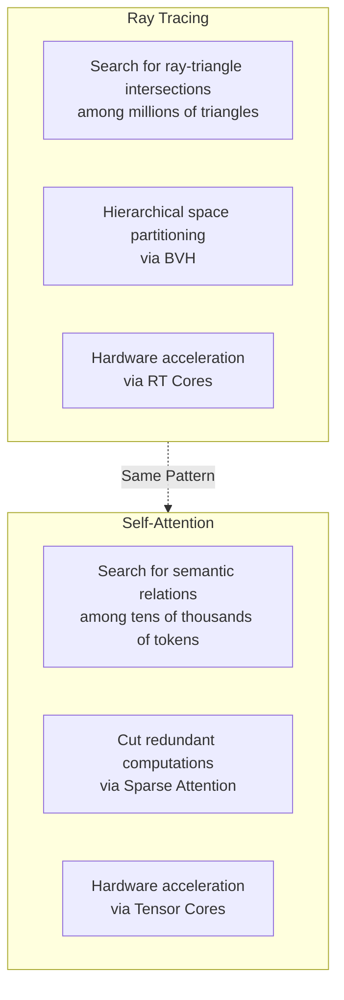

| Concept | Ray Tracing | Self-Attention |
| --- | --- | --- |
| **Search Target** | Ray-Triangle Intersection | Token-Token Relationship |
| **Accel Structure** | BVH (Bounding Volume Hierarchy) | Sparse Transformer, MoE |
| **Sparsity Utilization** | Skip computation for invisible parts | Block interactions between irrelevant tokens |
| **Dedicated HW** | RT Core | Tensor Core, TMEM |
| **Optimization Focus** | Traversal Shader (Programmable) | Dynamic domain weight adjustment |

**Key**: The insights game developers have gained from graphics optimization (space partitioning, sparsity, hardware acceleration) can be directly applied to understanding and designing LLM inference systems. It's essentially solving the same problem in different domains on the same GPU.

---

### 7. Hardware Configuration: GPU vs. NPU vs. CPU

Why do LLMs run on GPUs? Can't CPUs do it? What about the Neural Engine in my MacBook?

The core operation of an LLM is **matrix multiplication** (which is why linear algebra is necessary...).

It involves repeating the task of multiplying and adding hundreds of millions to trillions of numbers. CPUs process complex operations well sequentially but are weak at handling massive amounts of simple operations in parallel. Conversely, GPUs are designed with thousands of small cores to handle simple calculations simultaneously.

NVIDIA's data center GPUs (A100, H100) have up to 80GB of dedicated **VRAM**, allowing large model weights to be loaded efficiently when using quantization or multi-GPU distribution (since 70B FP16 ≈ 140GB, it's hard to fit the whole model on a single GPU without quantization). They also feature Tensor Cores, units dedicated to AI computation that process matrix operations extremely fast.

### VRAM: The LLM Workspace

**VRAM (Video RAM)** is dedicated high-speed memory built directly into the GPU. Just as textures and framebuffers are loaded into VRAM in games, **model weights, KV caches, and intermediate computation results** reside in VRAM for LLMs.

Why is VRAM more important than system RAM? It's about **bandwidth**. To process data, the GPU must read it from memory, and VRAM bandwidth is dozens of times faster than system RAM (though it varies greatly by GPU type).

```
System RAM (DDR5):                ~50-90 GB/s     ← For CPU
Consumer GPU VRAM (GDDR6X):       ~1,000 GB/s    ← RTX 4090 (approx. 11-20x)
Consumer GPU VRAM (GDDR7):        ~1,792 GB/s    ← RTX 5090 (approx. 20-36x)
Data Center GPU VRAM (HBM3e):      ~3,350 GB/s    ← H100/H200 (approx. 37-67x)
```

Just as textures must be in VRAM for real-time rendering, LLM weights must be in VRAM for real-time inference. If weights are only in system RAM, transferring them to the GPU via the PCIe bus becomes a severe bottleneck.

**What goes into VRAM:**

| Component | Nature | Description | For 70B Model (FP16) |
| --- | --- | --- | --- |
| Model Weights | **Static** | All learned parameters (Loaded at startup, unchanged) | ~140 GB |
| KV Cache | **Dynamic** | Key/Value of previous tokens (**Grows at runtime** with dialogue length) | ~Few to tens of GBs |
| Activation Memory | **Dynamic** | Intermediate results of the forward pass | ~Few GBs |

> **Analogy for Game Developers**: Model weights are like **static assets** (textures, meshes determined at build time), while the KV Cache corresponds to **dynamic framebuffers or runtime state storage** (data that accumulates during play). Since the KV Cache grows dynamically as the conversation (context) lengthens, you cannot judge VRAM requirements based on weight size alone. This is the main reason why usable model scale is often smaller than weight-based estimates.

If VRAM is insufficient, **Layer Offloading** occurs, where parts of the model are moved to system RAM, drastically reducing inference speed. This is similar to a game engine paging textures to system memory when video memory is low, causing frame rates to tank. In local LLM tools like `llama.cpp`, you can manually specify the number of layers to load into the GPU to adjust the GPU/CPU split. Reducing weight size through quantization (INT4/INT8) is the primary method to prevent offloading.

> **📖 Learn More**:
> - GPU memory hierarchy (HBM → L2 → SRAM → Registers) and VRAM capacity calculation → [VRAM Deep Dive Guide](/posts/vram-deep-dive/)
> - Detailed operation principles of CUDA Cores, Tensor Cores, TMEM, and NPUs → [GPU Compute Units Deep Dive](/posts/gpu-compute-deep-dive/)

Recently, **NPUs (Neural Processing Units)** have also gained attention. These include Apple Silicon's Neural Engine and AI chips in smartphones. NPUs use less power than GPUs but also have lower performance. While lightweight models (around 7B parameters) can run locally on an NPU, large models like Claude still require data center GPUs.

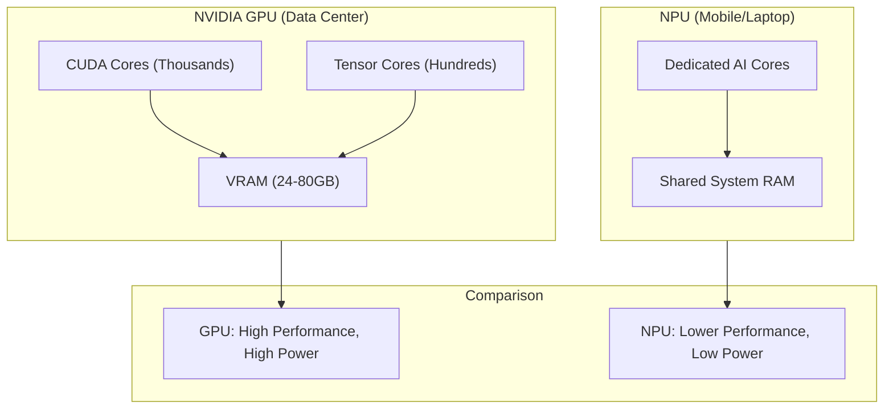

### Memory Structure Comparison

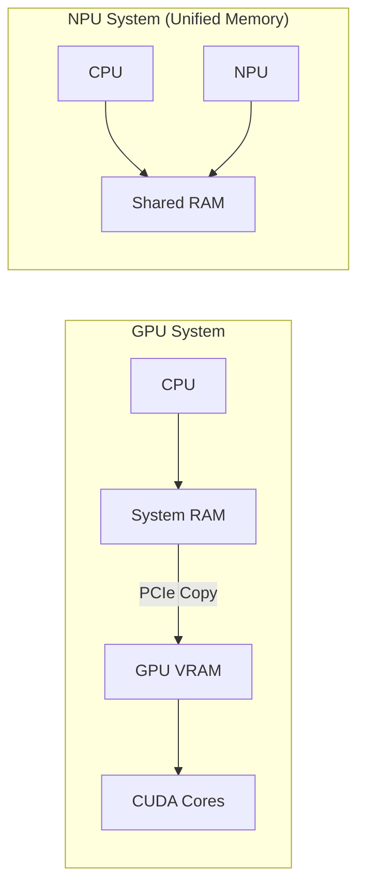

| Feature | GPU (NVIDIA) | NPU (Apple Silicon, etc.) |
| --- | --- | --- |
| Memory | Dedicated VRAM (up to 80GB) | Shared System RAM |
| Bandwidth | Dedicated HBM (~3.3TB/s for H100) | Shared SoC Unified Memory (~546GB/s for M4 Max)* |
| Use Case | Servers, Training, Large Models | Mobile, Lightweight Models |

*Unified memory bandwidth in Apple Silicon varies greatly by chip: M4 Max ~546GB/s, M4 Ultra ~800+GB/s. This bandwidth is shared among the CPU, GPU, and NPU. Since the GPU's 3.3TB/s is dedicated HBM bandwidth, caution is needed when comparing directly.

### Apple Silicon Unified Memory Architecture (UMA) Deep Dive

The hallmark of Apple Silicon (M1-M5) is **Unified Memory Architecture (UMA)**. In this architecture, the CPU, GPU, and Neural Engine share the **exact same physical memory pool**. This means Mac's system RAM serves as the VRAM for the GPU.

This is fundamentally different from NVIDIA's traditional structure:

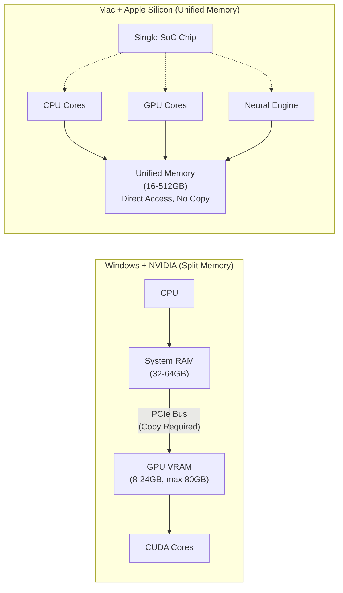

**Key Difference: No Data Copying Required**

To run an LLM on an NVIDIA system, model weights must be **copied** from system RAM to GPU VRAM via the PCIe bus. This process is a bottleneck. Additionally, because VRAM capacity is limited (the consumer RTX 5090 is around 32GB), large models won't fit entirely in VRAM, requiring offloading between CPU RAM and GPU VRAM, which tanks performance.

Conversely, Apple Silicon allows for **Zero-Copy access**. Whether it's the CPU, GPU, or Neural Engine, they can all read data from the same memory address directly. There's no need to "copy to device"; if the array is in unified memory, any processor can use it for computation immediately. Apple's MLX framework leverages this:

> “Arrays live in unified memory and can be executed on CPU or GPU without explicit ‘copy to device’ or ‘copy back’ calls.”

**Advantages in Memory Capacity**

| Configuration | Usable LLM Memory | Approximate Model Scale |
| --- | --- | --- |
| NVIDIA RTX 4090 | 24GB VRAM | ~25-35B (4-bit quant, varies with context)* |
| NVIDIA RTX 5090 | 32GB VRAM | ~35-50B (4-bit quant, varies with context)* |
| M4 MacBook Pro | 24GB Unified Memory | ~25-35B (4-bit quant, varies with context)* |
| M4 Max MacBook Pro | 64-128GB Unified Memory | ~70B (4-bit quant) |
| Mac Studio M2/M4 Ultra | 192-512GB Unified Memory | ~200B+ (4-bit quant) |

*While larger models can be loaded based on weights alone, the KV Cache (dynamic memory that grows with dialogue length) consumes additional VRAM during inference, reducing the usable model scale. For short context, larger models than these estimates are possible.

On a Mac Studio with 512GB, you can load even DeepSeek's 671B parameter model locally with strong quantization (e.g., INT4). However, inference speed is significantly slower than production services (~few tok/s), making it more suitable for experimentation/prototyping than practical use. Serving the same model in real-time with NVIDIA GPUs requires several data-center grade GPUs (e.g., multiple A100/H100 80GB), costing thousands to hundreds of thousands of dollars.

**Performance Comparison: Throughput vs. Efficiency**

| Metric | NVIDIA RTX 4090 | Apple M4 Max |
| --- | --- | --- |
| Memory Bandwidth | ~1,008GB/s (GDDR6X) | ~546GB/s |
| Llama 7B Inference Speed | ~50-60 tokens/s | ~30-40 tokens/s |
| Power Consumption | ~450W | ~40-80W |
| Tokens/Watt (Efficiency) | ~0.13 t/W | ~0.50 t/W |
| Max Memory Capacity | 24GB (Consumer) | 128GB (Laptop) |

**Conclusion**: NVIDIA GPUs lead in **absolute throughput**. For pure computation speed and training, NVIDIA is dominant. However, Apple Silicon shines in **power efficiency**, **memory capacity scalability**, and **Zero-Copy access**. Especially when running large models locally, the lack of capacity constraints due to separate VRAM is the biggest practical advantage (while there is a physical upper limit, it's far more generous than the 24-32GB VRAM of consumer GPUs).

### MLX: Apple Silicon Dedicated ML Framework

Apple provides **MLX**, an open-source ML framework optimized for its own chips. MLX is designed to take full advantage of the unified memory architecture and features a NumPy-like API for ease of use.

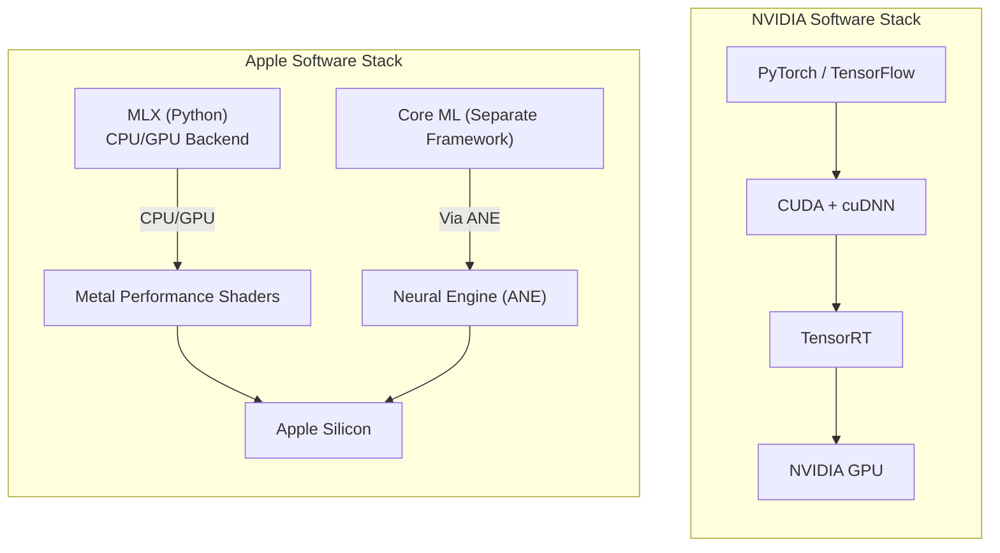

| Feature | NVIDIA CUDA Ecosystem | Apple MLX Ecosystem |
| --- | --- | --- |
| Maturity | Very High (10+ years) | Early (2023~) |
| Libraries | FlashAttention, bitsandbytes, TensorRT, etc. | mlx-lm, mlx-vlm, etc. |
| Model Support | Almost all models | Llama, Qwen, Mistral, and other major models |
| Training Support | Full support | Limited (mainly Fine-tuning) |
| Inference Performance | Top-tier | Improving rapidly |

**Implications for Game Developers**: If you are considering local LLM-powered AI features in a game (NPC dialogue, procedural content generation, etc.), you can prototype on Mac using MLX and lightweight models. For production servers, NVIDIA GPU-based infrastructure remains the standard.

### FlashAttention-4: The Pinnacle of Hardware-Software Co-design

Revealed alongside NVIDIA's latest **Blackwell (B200)** architecture, **FlashAttention-4** is the pinnacle of algorithms designed to break through the physical limits of attention computation. (Note: These performance figures are based on early benchmark reports before the official technical report; replication through formal papers is needed.) Previous attention techniques suffered from **Memory-bound** bottlenecks, where processing units (ALUs) stayed idle due to frequent data movement between high-bandwidth memory (HBM) and on-chip shared memory.

A familiar analogy for game developers is a situation where texture sampling becomes a bottleneck in a shader, leaving the GPU's compute units underutilized.

FlashAttention-4 addresses this with three core innovations:

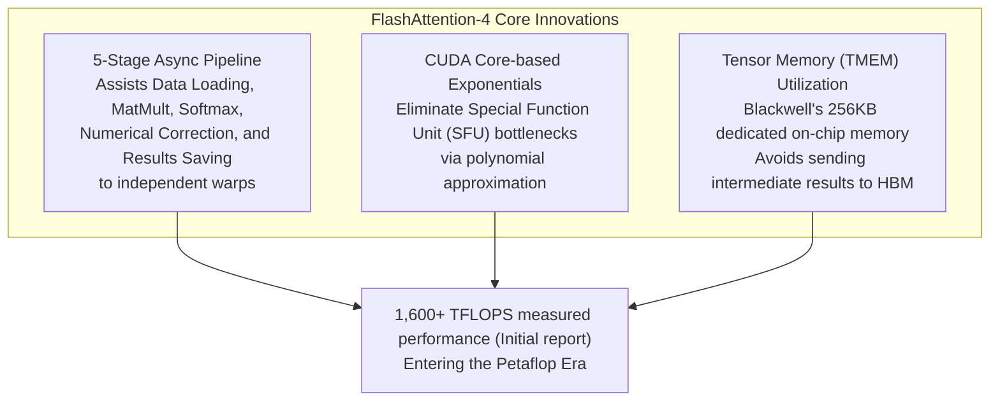

| FlashAttention Version | Key Improvement | Game Analogy |
| --- | --- | --- |
| **v1 (2022)** | Minimize HBM access via tiling | Reducing draw calls with texture atlases |
| **v2 (2023)** | Better parallelism & work distribution | Optimizing GPU occupancy |
| **v3 (2024)** | H100 dedicated optimizations | Hardware-specific shader optimizations |
| **v4 (2025)** | Blackwell co-design, async pipeline | HW-SW co-design (Custom Render Pipeline) |

This is exactly the same evolutionary direction as **rendering pipeline optimization for hardware generations** in game graphics. Just as we use new hardware features to squeeze out more performance with every new GPU generation, LLM inference is evolving through the co-design of hardware and software.

---

### 8. Server Operation: Is it Always On?

When you call Claude, the response is immediate. Does that mean Anthropic's servers are always on and Claude is always ready?

The answer is **yes, but efficiently**.

Reading hundreds of gigabytes of weights from disk for every request would be incredibly slow. Therefore, the entire weights are loaded into GPU VRAM when the server starts and maintained until it's shut down. The weights are **always resident in memory**.

However, **computation happens only on request**. If no one calls Claude, the GPU is idle. The Transformer computation only begins when a request arrives.

Furthermore, requests from multiple users are processed in **batches**. GPUs are much more efficient at processing several requests simultaneously than handling them one by one. This is also why responses might slow down during peak usage times.

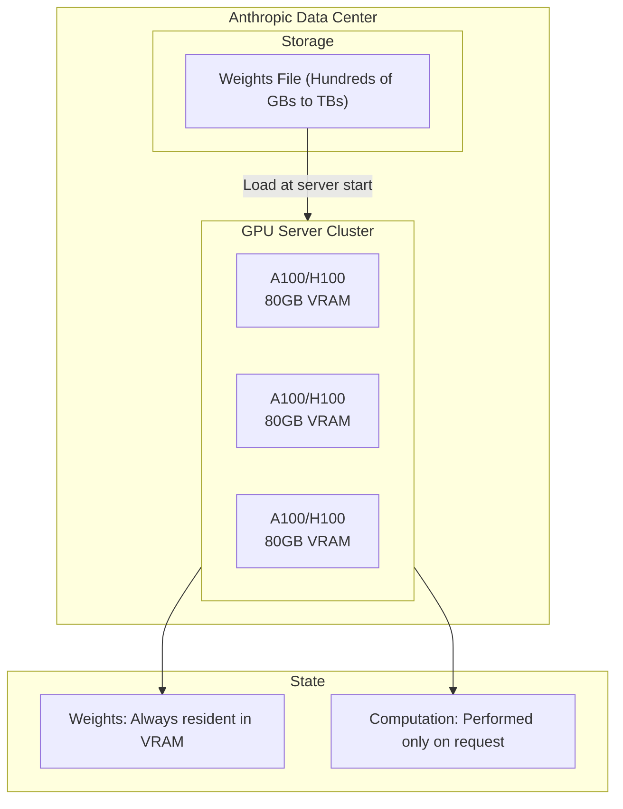

**Operation**:
- Weights are loaded into VRAM at startup and are **always resident**.
- Computation is performed only when a request is received.
- Multiple requests can be processed simultaneously (batch processing).

---

### 8-1. What Changes with New Model Versions?

Claude 3 → 3.5 → 3.7 → 4 → 4.5 → 4.6, GPT-3.5 → 4 → 4o → o1—performance improves noticeably with every version. If they all use the same Transformer architecture, **what exactly changes** to make them so much better?

In game terms, it's like how using the same Unity engine can result in completely different games depending on optimization techniques, asset quality, shader tech, and level design. Similarly for LLMs, the Transformer "engine" is the same, but the technologies built on top evolve significantly with each generation.

Performance improvements occur across **five axes** simultaneously:

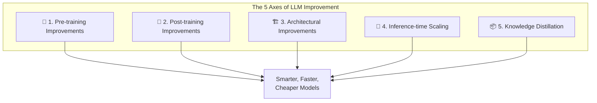

---

### Axis 1: Pre-training Improvements

Pre-training is the stage where the model absorbs "world knowledge." Even with the same Transformer structure, the result depends entirely on **what you feed it**.

**The Revolution in Data Quality**

Early LLMs (GPT-2, GPT-3) were trained on raw text crawled from the internet. The philosophy was "the more, the better." However, around 2024-2025, the limits of this approach became apparent. **Diminishing Returns** set in—doubling the data led to marginal gains—and high-quality text data started to run out.

Now, **quality** matters more than quantity:

| Generation | Data Strategy | Analogy |
| --- | --- | --- |
| Early (GPT-3) | Massive raw web-crawled data | Reading every book at random |
| Mid (Claude 3) | Filtering + adjusting domain ratios | Reading textbooks, balancing subjects |
| Current (Claude 4.5+) | Synthetic data + Curriculum learning + Long-context phase | Expert-crafted materials + Step-by-step difficulty |

**Synthetic Data**: Using existing powerful models to artificially generate high-quality training data. For example, generating massive amounts of math problems with solutions, code with explanations, or logical chains of thought.

**Curriculum Learning**: Much like game difficulty curves, the learning sequence is designed from easy to hard patterns. A dedicated training phase for long-context handling is also added.

**Evolution of Scaling Laws**

Initially, the **Chinchilla Law** dominated—the rule that model size and training data should be scaled in a specific compute-optimal ratio. However, in 2025, an **over-training strategy** became mainstream. Models like Llama are over-trained on trillions of tokens—far beyond the Chinchilla-optimal ratio—even for small models like 8B. While less efficient during training, this makes the models much **cheaper to serve during inference**. As a result, smaller models can outperform much larger models of previous generations while being significantly cheaper to run.

---

### Axis 2: Post-training Improvements

A model that has gained "knowledge" through pre-training is still raw. It might give nonsensical answers to questions, generate harmful content, or fail to follow instructions. **Post-training** is the process of converting this raw model into a "useful and safe assistant."

In game terms, if pre-training is "making the engine and assets," post-training is "QA testing and balance patching."

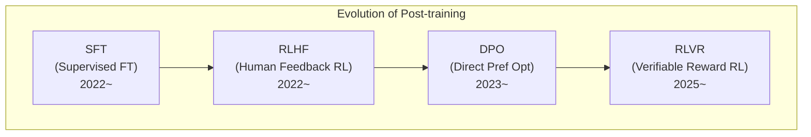

**SFT (Supervised Fine-Tuning)**: Fine-tuning the model with human-written "question-answer" pairs. It's like teaching "if asked this, answer that." It's simple but limited in scalability as humans must write every answer.

**RLHF (Reinforcement Learning from Human Feedback)**: The key tech behind ChatGPT. When the model generates several responses, humans rank them ("A is better than B"). A **Reward Model** is trained on this preference data, which then guides the LLM through reinforcement learning (PPO algorithm).

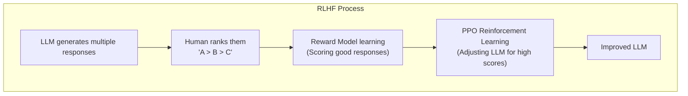

**DPO (Direct Preference Optimization, 2023~)**: A technique that skips the complex reward model stage of RLHF. It optimizes the LLM **directly** using human preference data. The lack of a reward model simplifies the pipeline and makes it more stable. This type of optimization has been actively used since the Claude 3.5 generation.

**RLVR (Reinforcement Learning with Verifiable Rewards, 2025~)**: The most important breakthrough of 2025. In domains where **answers can be automatically verified** (like math or code), massive-scale reinforcement learning is possible without humans. DeepSeek R1 was trained this way and gained huge attention.

| Method | Principle | Pro | Con |
| --- | --- | --- | --- |
| **SFT** | Showing correct answers | Simple, stable | Requires human writing |
| **RLHF** | Preferences → Reward Model → RL | Subtle quality gains | Complex and expensive |
| **DPO** | Preferences → Direct Opt | Simple pipeline | Some performance gap vs RLHF |
| **RLVR** | Auto-verify → Massive RL | Human-free, scales infinitely | Limited to verifiable domains |

**Why it gets better every generation**: Each generation uses more sophisticated post-training techniques, more preference data, and better reward models. Claude 4.x series saw a 65% reduction in "reward hacking" (cheating behavior) compared to previous generations, a result of improved post-training sophistication.

---

### Axis 3: Architectural Improvements

The basic skeleton of the Transformer (Self-Attention + Feed Forward) remains, but the detailed components evolve. Much like how Unity maintains its core rendering structure while improving shaders, LOD, and occlusion culling.

**Evolution of Attention Mechanisms**

| Technique | Description | Effect |
| --- | --- | --- |
| **Multi-Head Attention** | Original Transformer (2017) | Baseline |
| **Grouped-Query Attention (GQA)** | Shared Key-Value head groups | Saves memory, faster inference |
| **Sliding Window Attention** | Attend only to nearby tokens | Efficient for long context |
| **Multi-Head Latent Attention** | Compress KV into latent space | Drastic memory savings (DeepSeek-V2) |
| **FlashAttention** | Optimize GPU memory access | 2-4x speedup, memory savings |

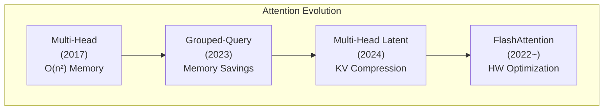

**Mixture of Experts (MoE): The Game Changer**

MoE is one of the biggest drivers of recent LLM gains. The concept is simple:
- **Dense Model**: Every input passes through **all** parameters.
- **MoE Model**: Each input passes through only **some** "experts."

```mermaid
flowchart TB
    subgraph Dense["Dense Model (Traditional)"]
        direction LR
        I1["Input Token"] --> FFN["One Massive FFN<br/>(Uses all parameters)"]
        FFN --> O1["Output"]
    end

    subgraph MoE["MoE Model"]
        direction TB
        I2["Input Token"] --> Router["Router<br/>(Decides which expert to use)"]
        Router -->|"Select"| E1["Expert 1<br/>(Math)"]
        Router -->|"Select"| E2["Expert 2<br/>(Code)"]
        Router -.->|"Inactive"| E3["Expert 3<br/>(Lang)"]
        Router -.->|"Inactive"| E4["Expert 4<br/>(Logic)"]
        E1 --> Mix["Weighted Sum"]
        E2 --> Mix
        Mix --> O2["Output"]
    end
```

Using a game analogy, a Dense model is "a company where every employee works on every task," while MoE is "a company with specialized departments where only the relevant department works on a task." The total number of employees (parameters) is large, but only a few are working at any time.

For developers familiar with rendering optimization, MoE is like **Frustum Culling**. Just as mesh data for the entire scene is in memory but only objects in the camera's view are rendered, all weights of an MoE model reside in VRAM, but **only the experts selected by the router participate in computation for a single token**. It occupies all the memory but uses only a fraction of the compute.

**Example of DeepSeek-V3/R1**: It has 671B parameters, but only 37B are active during a single inference step. It has the "knowledge capacity" of 671B with the "compute cost" of a 37B model.

| Model | Total Parameters | Active Parameters | Number of Experts |
| --- | --- | --- | --- |
| GPT-4 (Est.) | ~1.8T | ~280B | 16 |
| Mixtral 8x7B | 47B | 13B | 8 |
| DeepSeek-V3 | 671B | 37B | 256 |

MoE allows for "knowledge capacity" to grow without a massive increase in inference cost, enabling **smarter models at the same cost**.

---

### Axis 4: Inference-time Scaling

The most innovative discovery of 2024-2025 is that **"thinking longer makes the model smarter."** Previously, to improve performance, you had to increase training data or model size. Inference-time scaling is a way to make an **already trained model** smarter.

Using a game analogy, it's the difference between an AI agent "deciding in 1 second" vs. "deciding after exploring several possibilities for 10 seconds." Even without changing the model, thinking longer yields better results.

```mermaid
flowchart TB
    subgraph Traditional["Old: Training-time Scaling"]
        T1["More Data"] --> T2["Train Longer"]
        T2 --> T3["Better Model"]
        T4["Cost: Millions"]
    end

    subgraph New["New: Inference-time Scaling"]
        N1["Same Model"] --> N2["Let it think longer"]
        N2 --> N3["Better Answer"]
        N4["Cost: Slight per-token increase"]
    end
```

**Extended Thinking**

First introduced in Claude 3.7 Sonnet, this feature lets the model perform **internal Chain-of-Thought (CoT)** before responding. It generates hundreds to tens of thousands of "thinking tokens" (invisible to the user) to analyze the problem.

```mermaid
flowchart LR
    subgraph Without["Without Extended Thinking"]
        Q1["2^10 = ?"] --> A1["1024"]
    end

    subgraph With["With Extended Thinking"]
        Q2["Complex Math Problem"] --> Think["Internal Thought Process<br/>(Invisible)"]
        Think --> Step1["Step 1: Analyze"]
        Step1 --> Step2["Step 2: Choose Approach"]
        Step2 --> Step3["Step 3: Calculate"]
        Step3 --> Step4["Step 4: Verify"]
        Step4 --> A2["Final Answer"]
    end
```

Research from DeepMind shows that the **Scaling Law** applied to training also applies to inference time. Doubling the compute put into inference yields a certain percentage of performance gain. This allows for massive performance jumps in complex areas like math, physics, and coding.

**DeepSeek R1's "Aha Moment"**: As training progressed for DeepSeek R1-Zero (trained purely via RL), thinking token counts naturally grew from hundreds to tens of thousands. More interestingly, the model spontaneously learned to **reflect** on previous thoughts ("Wait, let me rethink that"). Researchers called this the "Aha moment."

| Model | Inference Method | Key Milestone |
| --- | --- | --- |
| GPT-4 (Traditional) | Direct response | Excellent general-purpose |
| OpenAI o1 | Learned Chain-of-Thought | Top-tier AIME, USAMO qualifier level |
| DeepSeek R1 | Pure RL + Spontaneous CoT | Equal to o1, Open Source |
| Claude 3.7+ | Extended Thinking (Hybrid) | Massive boost in code/math/science |

---

### Axis 5: Knowledge Distillation

A technique to transfer "knowledge" from a large model to a smaller one. It's similar to "baking" high-end shader results into textures for lower-end devices.

```mermaid
flowchart LR
    Teacher["Teacher Model<br/>(670B, Slow & Expensive)"] -->|"Transfer CoT and<br/>Answers"| Student["Student Model<br/>(7B, Fast & Cheap)"]
    Student --> Result["Achieves 70-90%<br/>of Teacher Performance"]
```

By distilling DeepSeek R1's (671B) reasoning capabilities into smaller models (1.5B to 70B), the students showed reasoning skills far beyond what they could have learned on their own. Qwen-REDI-1.5B achieved 83.1% on the MATH-500 benchmark through distillation—surpassing much larger models of previous generations.

This tech allows **lightweight models like Haiku** to approach the performance of previous generation flagships. This is why small models improve so drastically with each generation.

---

### Actual Evolution across Claude Generations

Let's see how all these technologies were applied in the evolution of Claude:

```mermaid
flowchart TB
    subgraph Evolution["Claude Model Evolution"]
        direction TB
        C3["Claude 3 (2024.03)<br/>3-tier system (Opus/Sonnet/Haiku)<br/>Vision support, 200K Context"]
        C35["Claude 3.5 Sonnet (2024.06)<br/>Mid-tier model beats flagships<br/>'Bigger isn't always better'"]
        C35v2["Claude 3.5 v2 (2024.10)<br/>Computer Use introduced<br/>First agentic capabilities"]
        C37["Claude 3.7 Sonnet (2025.02)<br/>Extended Thinking introduced<br/>Hybrid inference"]
        C4["Claude 4 (2025.05)<br/>65% reduction in Reward Hacking<br/>Massive code boost"]
        C45["Claude 4.5 Opus (2025.11)<br/>67% price cut + 76% output efficiency<br/>SWE-bench 80.9%"]
        C46["Claude 4.6 Opus (2026.02)<br/>1M Context (Beta)<br/>Multi-agent collaboration"]

        C3 --> C35 --> C35v2 --> C37 --> C4 --> C45 --> C46
    end
```

| Generation | Key Improvement | Technologies Applied |
| --- | --- | --- |
| **3 → 3.5** | Smaller models leapfrog larger ones | Data quality, post-training optimization |
| **3.5 → 3.7** | Jump in complex problem solving | Extended Thinking (Inference-time scaling) |
| **3.7 → 4** | Enhanced stability and reliability | Reward hacking prevention, post-training refinement |
| **4 → 4.5** | Innovation in cost-performance | Architectural efficiency, output optimization |
| **4.5 → 4.6** | Massive task handling | 1M Context, Agentic collaboration |

**Note the cost changes:**

```
Claude 4.1 Opus:  $15 / $75 (Input/Output MTok)
Claude 4.5 Opus:  $5 / $25  (Input/Output MTok) ← 67% reduction
Claude 4.6 Opus:  $5 / $25  (Input/Output MTok) ← Same price, better performance
```

There is a clear trend of providing **higher performance at the same price** or **the same performance at a lower price** with every generation.

> **💬 Quick Q&A**
> 
> **Q. How can Claude 4.5 be cheaper and better than 4.1?**
> Architectural efficiency (like MoE) allows generating the same answer with **76% fewer tokens**, combined with improved training and inference optimization. As technology matures, the same performance can be achieved with less compute.
> 
> **Q. What is MoE (Mixture of Experts)?**
> A technique where several "expert networks" exist within a model, and **only some experts are activated** based on the input. DeepSeek-V3 activates only 37B of its 671B parameters during inference. It's like **Occlusion Culling** in games—keeping the whole map in memory but rendering only what is seen.
> 
> **Q. What is Extended Thinking?**
> A feature where the model performs **internal step-by-step reasoning** before answering. It generates "thinking tokens" (invisible to the user) to analyze the problem. It's like organizing your solution in your head before writing the answer on an exam. Note that thinking tokens are included in the cost.

### Core Summary

LLM performance improvement is driven by the **simultaneous evolution of five axes**:

| Axis | Core Idea | Game Analogy |
| --- | --- | --- |
| **Pre-training** | Better data, more efficient learning | Better assets and resources |
| **Post-training** | Behavior correction via feedback | QA testing and balance patching |
| **Architecture** | Efficient internal structures (MoE, GQA) | Rendering pipeline optimization |
| **Inference Scaling** | Accuracy gain via thinking time | Increasing AI search depth |
| **Knowledge Distillation** | Transferring power to smaller models | Compressed quality delivery (like LOD) |

---

## Part 3: Inference Optimization Tech

Having looked at LLM internal structures in Part 2, let's now explore optimization technologies to run these models **fast and efficiently**. Just as profiling and optimization are essential in game development, various techniques in LLM inference dictate performance and cost.

### 9. Speculative Decoding: Cooperation between Small and Large Models

Remember why LLM responses are printed slowly character by character? It's because every token must pass through the **entire neural network** with hundreds of billions of parameters. To generate 100 tokens, this massive operation must be repeated 100 times.

**Speculative Decoding** is a strategy to solve this sequential bottleneck by making a **small "Draft" model and a large "Target" model cooperate**.

The principle is simple:
1. A **small model** (e.g., 1B) quickly generates (speculates) 5-10 tokens.
2. The **large model** (e.g., 70B) **verifies** these tokens in a single parallel step.
3. If they match the large model's prediction, **multiple tokens are confirmed in a single run**.
4. It restarts from the point of disagreement.

```mermaid
flowchart LR
    subgraph Draft["Draft Model (1B, Fast)"]
        D1["Quickly generate 5 tokens<br/>'The weather is very nice'"]
    end

    subgraph Target["Target Model (70B, Accurate)"]
        T1["Verify 5 tokens in parallel"]
        T2["'The weather is' ✅ Match<br/>'nice' ❌ Mismatch → Correct to 'clear'"]
    end

    Draft --> Target
    Target --> Result["Confirm 4 tokens at once!<br/>4x speedup effect"]
```

In game terms, this is similar to **Occlusion Culling**. Just as you skip rendering invisible objects to gain performance, the small model generates "likely correct" tokens to reduce the large model's compute frequency.

The latest technique, **DFlash**, reports a **further 2.5x speedup** over traditional speculative decoding by parallelizing draft generation itself using Block Diffusion models.

**Key**: Speculative decoding accelerates inference by 2-5x **without any loss in model quality**. The final output is always guaranteed to be of the large model's quality.

---

### 10. Deep Dive into Quantization: Compressing the Model

Part 1 briefly mentioned that quantization reduces memory. Let's go deeper.

Quantization is the technology of compressing model weights from **32-bit or 16-bit floating-point numbers to 8-bit or 4-bit integers**. It reduces memory usage by **4-8x** at the cost of a small sacrifice in precision.

For game developers, this is a very familiar concept. It's the exact same logic as **Texture Compression (BC7, ASTC)**:

```mermaid
flowchart TB
    subgraph Texture["Game: Texture Compression"]
        direction LR
        TX1["Original Texture<br/>(RGBA 32-bit)"] --> TX2["ASTC Compression<br/>(4-8 bits/pixel)"]
        TX2 --> TX3["Minimal visual difference<br/>Save 4-8x VRAM"]
    end

    subgraph Quantize["LLM: Weight Quantization"]
        direction LR
        Q1["Original Weights<br/>(FP16/32)"] --> Q2["INT4/INT8 Quantization"]
        Q2 --> Q3["Minimal performance gap<br/>Save 4-8x VRAM"]
    end

    Texture -.->|"Same Principle"| Quantize
```

**Evolution of Quantization Techniques**

| Technique | Principle | Features |
| --- | --- | --- |
| **Basic INT8** | Convert weights to 8-bit integers | Simple and stable |
| **GPTQ** | Optimal quantization based on data | High quality even at 4-bit |
| **AWQ** | Selective protection of important weights | Better than GPTQ at 4-bit |
| **GGUF** | Supports mixed CPU/GPU execution | Standard format for llama.cpp |
| **SPEQ** | Create draft model via shared bits | Combines with speculative decoding |

Specifically, 4-bit quantization is the decisive technology that compresses a **70B model to 35GB**, allowing it to run on consumer high-end graphics cards or Macs. Modern techniques like AWQ and SPEQ further minimize quality loss through hardware-algorithm co-design.

---

### 11. KV Cache and PagedAttention: The Art of Reuse

When a Transformer generates a token, it calculates the **Key (K)** and **Value (V)** matrix values for each token in the Self-Attention operation. If these values are not stored, **the entire previous context must be re-calculated** for every new token. Generating the 100th token would mean re-calculating K and V for tokens 1 through 99.

The **KV Cache** is an optimization technique that caches previously calculated K and V values in memory for reuse.

```mermaid
flowchart LR
    subgraph NoCache["Without KV Cache"]
        NC1["Re-calculate K,V for<br/>tokens 1-99 every time"] --> NC2["Generate 100th token"]
        NC2 --> NC3["Re-calculate all K,V<br/>for tokens 1-100"]
        NC3 --> NC4["Generate 101st token"]
    end

    subgraph WithCache["With KV Cache"]
        WC1["K,V for tokens 1-99<br/>stored in cache ✅"] --> WC2["Calculate only 100th"]
        WC2 --> WC3["Add to cache ✅"] --> WC4["Calculate only 101st"]
    end
```

In a game engine analogy, not having a KV Cache is like **rebuilding the entire scene graph from scratch every frame**. The KV Cache is similar to **Temporal Re-projection**, which caches and reuses results from the previous frame.

**PagedAttention: Managing KV Cache like Virtual Memory**

There's a problem: the KV Cache grows with dialogue length, and when multiple users make requests simultaneously, VRAM runs out. Also, because cache size is variable, **memory fragmentation** becomes severe.

**PagedAttention** is a solution that borrows the **Virtual Memory** management technique from operating systems. It manages the KV Cache by partitioning it into fixed-size pages, solving VRAM fragmentation and allowing for more concurrent requests.

```mermaid
flowchart TB
    subgraph Traditional["Traditional KV Cache"]
        T1["User A: [████████░░░░]"]
        T2["User B: [██░░░░░░░░░░]"]
        T3["Lots of free space but<br/>unusable due to fragmentation"]
    end

    subgraph Paged["PagedAttention"]
        P1["Page Pool: [A][A][B][A][A][B][Free][Free]"]
        P2["Allocate pages like virtual memory"]
        P3["Efficient VRAM use without fragmentation"]
    end
```

This is technically similar to **Resource Paging systems in open-world games**. Just as memory is managed in pages based on the visible area, PagedAttention dynamically manages the KV Cache.

| Tech | Role | Game Analogy |
| --- | --- | --- |
| **KV Cache** | Reuse previous token computation | Temporal Re-projection |
| **PagedAttention** | Efficient memory management for variable cache | Virtual Memory / Resource Paging |

---

## Part 4: Practical Information

Now that we know the theory, let's look at the practical side. How does Claude Code work? When should you use GPT, Claude, or Gemini? How can you save on costs?

This part contains real-world information for using LLMs more effectively.

### 12. How Claude Code Works

You might have wondered: why is reading files fast, while answering questions takes time? What does the `/compact` command do? When are token costs incurred?

Claude Code cleverly combines **local processing** and **API calls**.

**Executing tools** themselves—reading files (`Read`), searching (`Grep`, `Glob`), Git commands, or terminal execution—is performed locally and finishes quickly. However, tokens are charged during the process where the model **decides to call a tool** (output tokens) and when the **tool results are placed into the model context** (input tokens). In short, running tools is free, but the model interactions before and after are paid.

The only things that truly consume no tokens are **internal CLI commands** like `/help`, `/clear`, or `/cost`. These are handled by the CLI itself without model inference.

Conversely, requests like "explain this code" or "find a bug" require the AI's "judgment." Here, Claude Code calls the Anthropic API with the current conversation history, incurring token costs. File reading or searching also uses tokens because the model must "judge which file to read."

Claude Code also actively utilizes **Prompt Caching**. Content that repeats, like `CLAUDE.md` and system prompts, is cached, reducing costs by up to 90%. This is why the cost of subsequent messages is lower than the first.

```mermaid
flowchart TB
    subgraph User["User Input"]
        U1["Enter command"]
    end

    subgraph CLIOnly["CLI Internal (No Token Cost)"]
        L1["Slash commands<br/>/help, /clear, /cost"]
    end

    subgraph ToolUse["Tool Use (Local execution, tokens used for process)"]
        L2["Read/Write files<br/>Read, Write, Edit"]
        L3["Search<br/>Grep, Glob"]
        L4["Git Commands<br/>git status, git diff"]
        L5["Terminal Execution<br/>Bash"]
    end

    subgraph API["API Call (Token Cost)"]
        A1["Model decides to call tool<br/>(Output Tokens)"]
        A2["Include tool result in context<br/>(Input Tokens)"]
        A3["Generate final response<br/>(Output Tokens)"]
    end

    subgraph Cache["Prompt Caching"]
        C1["System prompt cache<br/>(90% savings)"]
        C2["Previous conversation context cache"]
    end

    U1 -->|"CLI Command"| CLIOnly
    U1 -->|"AI Request"| Cache
    Cache --> API
    A1 -->|"Requires tool"| ToolUse
    ToolUse -->|"Return result"| A2
    A2 --> A3

    style CLIOnly fill:#90EE90
    style ToolUse fill:#FFFACD
    style API fill:#FFB6C1
```

### Token Consumption Categories

| Task | Token Consumption | Description |
| --- | --- | --- |
| `/help`, `/clear`, `/cost` | **None** | Internal commands handled by the CLI |
| File Read/Write (Read, Write, Edit) | **Yes** | Local execution, but charged for the decision to call and the inclusion of results |
| Search (Grep, Glob) | **Yes** | Same as above |
| Git/Terminal (Bash) | **Yes** | Same as above |
| Interactive Q&A / Code Explaining | **Yes** | Full model inference is charged |

### What is Prompt Caching?

```
First request:
[System Prompt 10,000 tokens] + [User message 100 tokens]
→ Full charge

Second request:
[System Prompt Cache Hit] + [User message 100 tokens]
→ System prompt gets a 90% discount
```

Claude Code uses this caching to significantly reduce the cost of repeating system prompts (`CLAUDE.md`, project context, etc.).

> **💬 Quick Q&A**
> 
> **Q. How can I save tokens in Claude Code?**
> **Be specific.** Vague requests like "improve this codebase" make the model explore many files, consuming tokens. Specific requests like "add input validation to the login function in auth.ts" finish with minimal file reading. Also, use `/clear` to reset the context when switching topics to avoid sending unnecessary history.
> 
> **Q. What is Prompt Caching?**
> It's a technology that **reduces the cost of repeating system prompts by 90%**. Content that is sent identically with every request (like `CLAUDE.md`) is heavily discounted upon a cache hit. Claude Code uses this automatically.

### Token Inefficiency of Tool Results and LSP/MCP Alternatives

When a tool is called multiple times, **previous results accumulate and are re-sent with every API call**. If a tool is called 5 times, the first result is charged 5 times. Thus, the **size of tool results** is directly related to the cost.

For example, asking "what is the parent class of HomeHandler?" by running `Read(HomeHandler.cs)` puts the entire 500-line file (~5,000 tokens) into context, when only the line `class HomeHandler : AbstractHandler` is actually needed.

**LSP (Language Server Protocol)** is the fundamental solution to this. As a standard protocol between editors and language servers, it returns compiler-level analysis with **minimal data**. Returning just the type info (~20 tokens) instead of the whole file is **over 100x more efficient**.

| Question: "Symbol type?" | Returned Data | Relative Token Volume |
| --- | --- | --- |
| **Read** (Whole file) | All 500 lines | ██████████ Largest (Proportional to size) |
| **Grep** (Pattern match) | Matched lines | ███░░░░░░░ Medium (Proportional to results) |
| **LSP** (Semantic query) | Type/Signature only | █░░░░░░░░░ Smallest (Only necessary info) |

Claude Code automatically utilizes LSP for TypeScript, Python, etc. However, **C# currently lacks a Claude Code plugin for LSP servers (OmniSharp/Roslyn).** This means Unity/C# projects rely on Read/Grep by default, missing out on LSP benefits.

**The alternative is Rider MCP.** MCP (Model Context Protocol) is designed by Anthropic for "AI Model ↔ Tool Server" interaction. JetBrains Rider has a built-in MCP server, allowing Claude Code to directly access Rider's code analysis engine (PSI), providing semantic analysis equivalent to an LSP language server.

```
TypeScript:  Model ↔ LSP (ts-server) ↔ Compiler Analysis    ✅ Native Support
C# (Default): Model ↔ Read/Grep ↔ File System               ❌ Inefficient
C# (MCP):     Model ↔ Rider MCP ↔ PSI Engine/IDE Index      ✅ LSP-level Efficiency
```

| Rider MCP Tool | Replaces... | Efficiency Gain |
| --- | --- | --- |
| `get_symbol_info()` | Read (Whole file) | Returns only symbol info (~50 vs ~5,000 tokens) |
| `get_file_problems()` | Read + Analysis | Returns only errors, removes analysis round-trips |
| `rename_refactoring()` | Grep + Edits | Modifies all references in **one call** |
| `search_in_files_by_text()` | Grep | Uses IDE index for more accurate results |

---

### 13. Comparison of Major LLMs (GPT vs. Claude vs. Gemini)

> **📅 Historical Reference**: The following comparison is based on **late 2024 flagship models** (GPT-4, Claude 3.5, Gemini 1.5) and is intended as a **historical reference to understand design philosophies and strengths**. As of 2025-2026, newer models like GPT-4o/o3/GPT-5, Claude 4.5/4.6, and Gemini 2.0/2.5 Pro have been released with significant changes in context windows (Claude 4.6 is 1M beta), performance, and pricing. **It is not suitable for current performance comparisons.**

"Is GPT better or Claude?" is a common question among developers. The answer is "it depends on the use case."

All three models are based on the Transformer architecture, fine-tuned with RLHF, and predict at the token level. The core principles are the same, but strengths vary based on each company's philosophy and optimization focus.

**GPT (OpenAI)** has the widest ecosystem. With plugins, GPTs, and DALL-E integration, it has the largest user base and community. It's strong in general-purpose conversation and creative tasks.

**Claude (Anthropic)** excels in code work and long document processing. Its 200K token context window allows for analyzing long codebases or documents at once, and Constitutional AI generates more consistent and safe responses. It is highly rated as a coding assistant.

**Gemini (Google)** is strong in multimodality and massive context. It can process 1M+ tokens, allowing for analysis of an entire book, and is tightly integrated with Google services. It's ideal for tasks involving images, video, and audio together.

```mermaid
flowchart LR
    GPT["🟢 GPT (OpenAI)<br/>Decoder-only | 128K Context<br/>Strength: Ecosystem, Plugins"]
    Claude["🟠 Claude (Anthropic)<br/>Constitutional AI | 200K Context<br/>Strength: Code, Long docs, Safety"]
    Gemini["🔵 Gemini (Google)<br/>Multimodal | 1M+ Context<br/>Strength: Multimodal, Google Integration"]

    GPT ~~~ Claude ~~~ Gemini
```

### What is Constitutional AI? (Claude's Key Feature)

```mermaid
flowchart LR
    subgraph Traditional["Traditional RLHF"]
        T1["Model Response"] --> T2["Human Evaluation"]
        T2 --> T3["Learn from Feedback"]
    end

    subgraph Constitutional["Constitutional AI (Training Phase)"]
        C1["Generate Response"] --> C2["Model critiques itself<br/>against Constitution"]
        C2 --> C3["'Is this harmful?'"]
        C3 --> C4["Generate revised response"]
        C4 --> C5["Perform RLAIF learning<br/>on this data"]
    end
```

Constitutional AI is a technique used in the **Training Phase** where the model is trained to critique itself based on a set of "Constitutional Principles." (1) The model generates a response, (2) critiques it based on set principles, and (3) generates a revised response. RLAIF (RL from AI Feedback) is then performed on this data. During inference, these learned behaviors are already reflected, generating safe responses without a separate evaluation step.

### Context Window Comparison

```
GPT-4:        ████████░░░░░░░░░░░░ 128K tokens
Claude 3.5:   ██████████░░░░░░░░░░ 200K tokens
Gemini 1.5:   ████████████████████ 1M+ tokens
```

### Best Use Case for Each Model

| Model | Best Use Case |
| --- | --- |
| **GPT** | General conversation, plugin use, image generation (DALL-E) |
| **Claude** | Long code analysis, document summarization, safety-critical tasks |
| **Gemini** | Multimodal tasks, Google integration, massive context |

### Common Ground

All major LLMs:
- Use **Transformer-based** architectures.
- Are fine-tuned with **RLHF**.
- Predict at the **token level**.
- Are **Stateless** (servers don't remember conversations).

---

### 14. Summary of the Entire Flow

Let's summarize everything in one diagram.

The lifecycle of an LLM consists of three phases: Training, Deployment, and Inference.

In the **Training phase**, massive amounts of text data from the web are processed through GPU clusters, resulting in "weights files." This takes months and millions of dollars.

In the **Deployment phase**, these weight files are loaded into the GPU VRAM of service servers. The model is now ready for inference requests.

In the **Inference phase**, when a user prompt arrives, it's processed through tokenization → transformer computation → next token prediction → response generation. This repeats for every token until the response is complete.

What we experience with Claude is the tail end of this inference phase. But behind it lie years of research, millions in investment, and tens of thousands of GPUs.

```mermaid
flowchart TB
    subgraph Phase1["1. Training (Offline)"]
        A1["Text Data"] --> A2["GPU Cluster Training"]
        A2 --> A3["Weights File"]
    end

    subgraph Phase2["2. Deployment"]
        B1["Weights → Load to GPU VRAM"]
    end

    subgraph Phase3["3. Inference (Online)"]
        C1["Input Prompt"]
        C2["Tokenization"]
        C3["Transformer Computation"]
        C4["Next Token Prediction"]
        C5["Generate Response"]

        C1 --> C2 --> C3 --> C4
        C4 -->|Repeat| C3
        C4 --> C5
    end

    A3 --> B1
    B1 --> C3
```

---

### 15. Learn More (Brief Intro)

This document explained LLM core concepts from a game developer's view. But the world of LLMs is much deeper. To explore further, I recommend these topics:

**RAG (Retrieval-Augmented Generation)**: Combining external document search to overcome LLM knowledge limits. When an LLM lacks up-to-date or domain-specific info, relevant docs are searched and attached to the prompt. Like a game requesting fresh data from a server.

**Fine-tuning**: Additionally training a pre-trained model for a specific domain. For instance, fine-tuning a general model on game-related text can lead to game-specialized responses.

| Topic | Description |
| --- | --- |
| **Token Economics** | Pricing and cost optimization per input/output token |
| **Context Window** | Maximum tokens processable at once and its limits |
| **Fine-tuning** | Domain-specific additional training of a model |
| **RAG** | Knowledge expansion via external document retrieval |
| **LoRA / QLoRA** | Techniques for low-cost fine-tuning of large models |
| **ONNX** | Standard format for running neural networks in game engines |

---

## Part 5: Game Engine Integration

Now that we've covered LLM principles and optimizations, let's answer the most practical question: **How can I run a neural network inside a game engine?** Both Unity and Unreal Engine provide tools for executing neural networks internally.

> **⚠️ Important Distinction**: Unity Sentis and Unreal NNE discussed here are optimized for **lightweight inference models** (gesture recognition, NPC behavior patterns, image classification, etc., scaled at megabytes to hundreds of megabytes). This is different from directly running **large LLMs (gigabytes to hundreds of gigabytes)** like Claude or GPT-4 in a game runtime. For large LLMs (e.g., NPC dialogue generation), combining **cloud API calls** is the realistic approach.

### 16. Unity Sentis (Inference Engine)

Unity continues to strengthen its **Sentis** (formerly **Inference Engine**) library for running neural network models inside the engine. Sentis allows you to import trained neural networks in **ONNX format** and perform real-time inference on the user's local hardware (CPU, GPU, NPU).

```mermaid
flowchart TB
    subgraph Pipeline["Unity Sentis Pipeline"]
        direction LR
        M1["Trained Model<br/>(PyTorch, TensorFlow)"] --> M2["Convert to ONNX"]
        M2 --> M3["Import into Unity Sentis"]
        M3 --> M4["Runtime Inference<br/>(CPU/GPU/NPU)"]
        M4 --> M5["Reflect in Game Logic"]
    end
```

**Key Optimization Strategies for Game Developers**:

**Frame Slicing**: When complex inference exceeds a single frame's time budget and hangs the main thread, use the `ScheduleIterable` method to execute the operation **over multiple frames**. This allows for AI inference without frame drops.

```csharp
// Conceptual Example - Distributing inference over frames
var enumerator = worker.ScheduleIterable(inputTensor);
while (enumerator.MoveNext()) {
    yield return null; // Continue in the next frame
}
var output = worker.PeekOutput();
```

**Multi-backend Support**: Choose the optimal computation method based on hardware:

| Backend | Use Case | Features |
| --- | --- | --- |
| **GPU Compute** | Most inference | Utilizes Compute Shaders, fastest |
| **NPU Dedicated** | Mobile, Apple Silicon | Low power, always-on |
| **Burst CPU** | GPU unavailable | Burst compiler optimization |

**Layer-level Control**: Precisely manipulate specific layers or process tensor data to reflect directly in visual effects or game logic.

> **Practical Tip**: **Lightweight models (MBs to hundreds of MBs)** for NPC dialogue, image classification, or behavior prediction are sufficient for on-device execution with Sentis. For large LLMs (GBs or more), using cloud APIs is more realistic.

> **💬 Quick Q&A**
> 
> **Q. Can I run large LLMs in Unity?**
> Direct execution is difficult. Sentis is optimized for **lightweight models** in ONNX format. A combination of **Cloud API + Sentis lightweight models** is realistic for models like Claude. Offload complex judgment to the API and keep real-time reactions on-device.
> 
> **Q. Does inference drop game frame rates?**
> **Frame Slicing** solves this. `ScheduleIterable` allows executing inference over several frames, maintaining 60 FPS while running AI inference.

---

### 17. Unreal Engine NNE (Neural Network Engine)

Introduced in Unreal Engine 5.5-5.6, the **NNE (Neural Network Engine)** plugin organically combines the engine's render pipeline with neural network computation. Specifically, through integration with the **Render Dependency Graph (RDG)**, AI models can directly exchange data within the graphics pipeline.

NNE provides three runtime interfaces:

```mermaid
flowchart TB
    subgraph NNE["Unreal NNE Runtime"]
        direction TB
        CPU["INNERuntimeCPU<br/>Game thread / Async tasks<br/>Use when GPU budget is low"]
        GPU["INNERuntimeGPU<br/>CPU Memory → GPU Comp<br/>Render-independent large inference"]
        RDG["INNERuntimeRDG<br/>Render pipeline integration<br/>Direct RDG buffer consumption"]
    end

    CPU --> UseCase1["NPC AI, Pathfinding"]
    GPU --> UseCase2["Large model inference"]
    RDG --> UseCase3["Real-time Post-processing<br/>AI Upscaling"]
```

| Runtime | Data Flow | Best Use Case |
| --- | --- | --- |
| **INNERuntimeCPU** | CPU only | Low GPU budget, simple AI |
| **INNERuntimeGPU** | CPU → GPU transfer + compute | Large inference independent of rendering |
| **INNERuntimeRDG** | Direct RDG buffer access (GPU only) | Post-processing, Upscaling |

**Meaning of RDG Integration**: `INNERuntimeRDG` operates as part of the rendering pipeline, enabling pure GPU computation without CPU readback. Effects like AI-based upscaling or real-time style transfer can be implemented directly within the engine.

> **💬 Quick Q&A**
> 
> **Q. What is the key difference between Unity Sentis and Unreal NNE?**
> Sentis focuses on **general-purpose ONNX inference**, while NNE's strength lies in **direct render pipeline (RDG) integration**. NNE's `INNERuntimeRDG` is better for AI post-processing, whereas Sentis's Frame Slicing is suited for game logic inference.

---

### 18. MetaHuman and AI-powered Digital Humans

Epic Games is accelerating ultra-realistic digital humans by combining **MetaHuman Creator** and **Animator** systems with AI. When coupled with LLMs, this enables "NPCs that feel like they are really talking."

```mermaid
flowchart LR
    subgraph AI_NPC["AI-powered Digital Human NPC"]
        direction TB
        LLM["LLM Inference<br/>(Dialogue Gen)"]
        TTS["TTS<br/>(Text → Voice)"]
        Face["Audio-based<br/>Facial Animation"]
        ML["ML Deformer<br/>(Real-time Muscle/Cloth)"]

        LLM --> TTS --> Face
        ML --> Face
    end

    Player["Player Voice Input"] --> AI_NPC
    AI_NPC --> Output["Ultra-realistic NPC<br/>in Real-time Conversation"]
```

**Key Technologies**:
- **Audio-based Animation**: Analyzes recorded audio or real-time voice input to automatically drive MetaHuman's facial controllers. As the LLM generates text and TTS converts it to voice, this system automatically creates lip shapes and expressions.
- **ML Deformer**: Uses machine learning to bring offline high-fidelity simulations (muscles, cloth) into real-time environments. Similar to "baking" in games, ML allows for higher quality deformations.
- **Persona Device (UEFN)**: A system where creators can easily place AI NPCs with unique personalities and build conversational environments.

---

## Part 6: Agentic Workflows and Autonomous NPCs

Using an LLM merely as a "text generator" uses only a fraction of its potential. A key trend in 2026 game AI is the adoption of agentic workflows where LLMs **set their own goals, use tools, and complete tasks**.

### 19. From FSM to Agents: A Paradigm Shift in Game AI

Currently, most game AI is implemented with **FSMs (Finite State Machines)** or **Behavior Trees**. Our project's `StageManager` uses an FSM. While predictable and stable, this approach cannot handle situations not defined in advance.

**Agentic Workflows** supplement this:

```mermaid
flowchart TB
    subgraph FSM["Traditional: FSM-based NPC"]
        direction TB
        F1["Idle"] -->|"Player Found"| F2["Chase"]
        F2 -->|"Range Reached"| F3["Attack"]
        F3 -->|"Health Low"| F4["Flee"]
        F4 -->|"Safe"| F1
        F5["Only predefined states possible<br/>Unexpected scenario = Stop"]
    end

    subgraph Agent["New: Agentic NPC"]
        direction TB
        A1["Perception<br/>(Analyze world state)"]
        A2["Planning<br/>(Goal-attainment strategy)"]
        A3["Execution<br/>(Tool/API calls)"]
        A4["Evaluation<br/>(Result analysis, refine plan)"]
        A1 --> A2 --> A3 --> A4 --> A1
        A5["Flexible response possible<br/>Unexpected scenario = Adaptation"]
    end
```

**Three Key Elements of an Agent**:

| Element | Description | Example |
| --- | --- | --- |
| **Autonomy** | Generates subtasks from high-level goals | "Maintain order in town" → Decides to patrol, track bandits, and protect citizens |
| **Tool Use** | Calls game world APIs on its own | Crafting items, negotiating with NPCs, accessing physics data |
| **Reflection** | Analyzes failure and modifies the plan | "Tracking failed; let's use an ambush strategy next time" |

> **💬 Quick Q&A**
> 
> **Q. Do agentic workflows replace FSMs/Behavior Trees?**
> **They supplement rather than replace.** FSMs are still optimal for real-time combat due to predictability and low overhead. Agents are suitable for flexible dialogue, dynamic quests, and adaptive behaviors. A hybrid approach—**FSM for core gameplay, Agents for narrative and interaction**—is effective.
> 
> **Q. What is the biggest risk of Agentic NPCs?**
> **Cost and Latency.** Calling cloud LLMs takes hundreds of ms to seconds and incurs token costs. Thus, a **hierarchical design**—lightweight models on-device + cloud calls only for critical decisions—is essential.

---

### 20. Agent Design Patterns

Practical patterns for building effective autonomous NPCs:

**Pattern 1: Single Agent Loop**
The basic structure. Repeats the Perceive → Plan → Execute → Evaluate loop to update its state. Suitable for autonomous behavior of a single NPC.

**Pattern 2: Supervisor-Worker Swarm**
A supervisor agent designs complex quests, while specialized sub-agents handle dialogue writing, reward balancing, and map placement. Ideal for massive content auto-generation.

**Pattern 3: Human-in-the-Loop Hybrid**
In sensitive scenarios (story development, ethical judgments), a game master or developer reviews and approves the agent's decisions.

```mermaid
flowchart TB
    subgraph Patterns["Agent Design Patterns"]
        direction LR
        P1["Single Agent Loop<br/>Perceive→Plan→Execute→Eval"]
        P2["Supervisor-Worker Swarm<br/>Supervisor coordinates workers"]
        P3["Human-in-the-Loop<br/>Human approves sensitive calls"]
    end

    P1 -->|"Best for"| U1["Single NPC Behavior"]
    P2 -->|"Best for"| U2["Large-scale Content Gen"]
    P3 -->|"Best for"| U3["Story/Ethics Sensitive Areas"]
```

---

### 21. Dynamic Difficulty and Procedural Content Generation

Agentic workflows contribute to the **optimization of game systems as a whole**, not just NPC behavior.

Systems are being researched where AI agents track player proficiency, playstyle, and emotional state in real-time to adjust game difficulty and narrative branches. Some industry reports mention achievements like **improved player retention** and **shortened content creation time**, though specific numbers vary by project. (Ref: [DigitalDefynd - Agentic AI in Gaming](https://digitaldefynd.com/IQ/agentic-ai-in-gaming/))

Strategic suggestions for game developers:

| Strategy | Description |
| --- | --- |
| **Split Cloud + On-device** | Cloud large models for world design/code gen; On-device lightweight models for real-time NPC reaction |
| **Optimize Quant + KV Cache** | Integrate into the pipeline from the start to ensure target platform performance |
| **Agent Interface Design** | Focus on the bridge connecting engine physics data and LLM inference |

---

## Quick Reference: Q&A Index

Frequently asked questions are covered in the **💬 Quick Q&A** callouts in each section.

| Question | Section |
| --- | --- |
| Do LLMs actually "think"? | Section 4 (Operational Flow) |
| What is a token? / Temperature? | Section 4 (Operational Flow) |
| What is a context window? | Section 3 (Conversation Context) |
| Does Claude learn from chats? | Section 5 (Training vs. Inference) |
| Why does it slow down over time? | Section 6 (Transformer) |
| Is Mamba replacing Transformer? | Section 6-1 (Mamba) |
| MoE / Extended Thinking / Costs? | Section 8-1 (Model Improvement) |
| How to save tokens? / Prompt Caching? | Section 12 (Claude Code) |
| Running LLMs in Unity/Unreal? | Section 16-17 (Engine Integration) |
| Do Agents replace FSMs? | Section 19 (Agentic Workflows) |

---

## Summary

Core LLM concepts at a glance:

| Concept | Key Point |
| --- | --- |
| **Neural Network** | Conceptual graph, but physically a massive float array |
| **Parameters** | Total number of floats (7B = 7 billion), determines memory need |
| **Memory** | Unity is dynamic; LLMs are fully resident |
| **Stateless** | Servers don't remember history; it must be re-sent (except for caching) |
| **Token** | Generated one by one via probabilistic selection |
| **Training vs. Inference** | Training is offline/expensive; Inference is online/cheap |
| **Self-Attention** | Tokens calculate relations with all others (O(n²)) |
| **Mamba (SSM)** | Efficient long context handling with O(n) linear complexity |
| **Hybrid Architecture** | Combining Transformer + Mamba + MoE (e.g., Jamba) |
| **Apple UMA** | RAM = VRAM; enables local execution of large models via Zero-Copy |
| **FlashAttention** | Memory access optimization; v4 at 1,600+ TFLOPS (Initial report) |
| **5 Axes of Improvement** | Data quality + Post-training (RLHF/DPO/RLVR) + Architecture (MoE) + Inference Scaling + Distillation |
| **Speculative Decoding** | Small model guesses, large model verifies → 2-5x speedup |
| **Quantization** | Compressing FP16 to INT4; saves 4-8x memory |
| **KV Cache** | Caching token operations; managed via PagedAttention |
| **Claude Code** | Local tools + API calls + Prompt Caching |
| **Engine Integration** | Unity Sentis, Unreal NNE for on-device AI inference |
| **Agentic Workflow** | Moving beyond FSMs to autonomous Perceive-Plan-Execute-Evaluate loops |

---

*This document explains LLM principles from a game developer's view, focusing on intuitive understanding rather than strict technical accuracy.*

**Last Updated**: 2026-02-12

---

## References

### Core Papers
- **Attention Is All You Need** (2017) | Transformer architecture | [arXiv](https://arxiv.org/abs/1706.03762)
- **Constitutional AI** (2022) | Claude's training (Anthropic) | [arXiv](https://arxiv.org/abs/2212.08073)
- **Language Models are Few-Shot Learners** (2020) | GPT-3 (OpenAI) | [arXiv](https://arxiv.org/abs/2005.14165)

### Official Documentation
- **Anthropic Documentation** | [docs.anthropic.com](https://docs.anthropic.com/)
- **OpenAI Documentation** | [platform.openai.com/docs](https://platform.openai.com/docs)
- **Google AI Documentation** | [ai.google.dev](https://ai.google.dev/)

### Intro Materials
- **The Illustrated Transformer** | [jalammar.github.io](https://jalammar.github.io/illustrated-transformer/)
- **What Is ChatGPT Doing…** | Stephen Wolfram | [writings.stephenwolfram.com](https://writings.stephenwolfram.com/2023/02/what-is-chatgpt-doing-and-why-does-it-work/)
- **3Blue1Brown - Neural Networks** | [YouTube](https://www.youtube.com/playlist?list=PLZHQObOWTQDNU6R1_67000Dx_ZCJB-3pi)

### Architecture & Optimization
- **Mamba: Linear-Time Sequence Modeling** | [arXiv](https://arxiv.org/abs/2312.00752)
- **Jamba: Hybrid Transformer-Mamba** | [OpenReview](https://openreview.net/forum?id=JFPaD7lpBD)
- **FlashAttention-4** | [Medium](https://medium.com/@changtimwu/flashattention-4-breaking-the-petaflop-barrier-in-gpu-attention-kernels-be9444311af0)
- **DFlash: Block Diffusion Speculative Decoding** | [arXiv](https://arxiv.org/html/2602.06036v1)
- **SPEQ: Speculative Decoding via Quantization** | [arXiv](https://arxiv.org/abs/2502.12759)
- **Routing Mamba (Microsoft)** | [Microsoft Research](https://www.microsoft.com/en-us/research/publication/routing-mamba-scaling-state-space-models-with-mixture-of-experts-projection/)

### Game Engine Integration
- **Unity Sentis (Inference Engine)** | [Unity Docs](https://docs.unity3d.com/Packages/com.unity.ai.inference@latest/)
- **Unreal Engine NNE** | [Epic Games](https://dev.epicgames.com/documentation/en-us/unreal-engine/neural-network-engine-overview-in-unreal-engine)
- **MetaHuman & AI** | [UE 5.5 Release Notes](https://dev.epicgames.com/documentation/en-us/unreal-engine/unreal-engine-55-release-notes)
- **Agentic AI in Gaming** | [DigitalDefynd](https://digitaldefynd.com/IQ/agentic-ai-in-gaming/)
- **Apple MLX vs NVIDIA** | [Markus Schall](https://www.markus-schall.de/en/2025/11/apple-mlx-vs-nvidia-how-local-ki-inference-works-on-the-mac/)

### Advanced Study
- **Quantization** | “LLM.int8()” paper, llama.cpp project
- **KV Cache** | “Efficient Transformers: A Survey”
- **RAG** | LangChain docs, “Retrieval-Augmented Generation” original paper
- **Fine-tuning** | Hugging Face PEFT documentation
- **Agent Workflows** | “The 2026 Guide to AI Agent Workflows” (Vellum AI)
- **State Space Models** | “What Is A Mamba Model?” (IBM)
