## はじめに

私たちが開発しているおなじみのゲームは、マルチグラフィックスAPIをサポートする商用ゲームエンジンに基づいています。ゲームエンジンは物理エンジン、レンダリングパイプライン、オーディオシステムなどの複雑なサブシステムで構成されており、これらはすべて単一の統合環境で動作します。

最近、開発ワークフローにAIツールが深く位置づけられました。 Claude Code、GitHub Copilot、ChatGPTなどのLLMベースのツールを毎日使用しながら、自然にその内部原理が気になりました。

ゲームエンジンの内部構造を理解すればより良い最適化とデバッグが可能になるように、LLMの動作原理を理解すれば、これらのツールをより効果的に活用できます。このドキュメントでは、ゲーム開発者の視点からLLMの内部構造を探ります。

---

## Part 1: 基本概念

LLMを理解するために最初に知る必要があるのは「これが何ですか」です。複雑な式や論文を読む前に、私たちに慣れているゲーム開発の概念と比較しながら、LLMの本質を理解してみましょう。このパートでは、メモリ構造、データフロー、学習と推論の違いについて説明します。

### 1. Unity vs LLM メモリ構造

ゲーム開発者にとって、メモリ管理はおなじみのテーマです。 Unityでシーンをロードし、アセットを管理し、メモリリークを防ぐことは日常的な作業です。 LLMも最終的にメモリに上がるプログラムです。しかし、その方法はUnityとはかなり異なります。

最大の違いは、「いつ何をロードするのか」です。 Unityは必要なものだけをその時にロードしますが、LLMは起動時にすべてを一度に置き続けます。なぜですか？そして「ニューラルネットワーク」と呼ぶのが、実際にメモリではどのような形なのでしょうか？

### 可視化対物理メモリ

LLMを説明すると、しばしばニューラルネットワーク図が表示されます。ノードがリンクされたグラフの形で。この視覚化は概念を理解するのに役立ちますが、実際のコンピュータメモリにはまったく異なる形式で保存されます。グラフやノードなどはありません。ちょうど数字です。非常に多くの数字です。


**核心**：ニューラルネットワークは概念的には複雑なグラフですが、実際には**巨大な数値配列（float配列）**です。

### Unity vs LLM ロード方式の比較

Unity では `Addressables` や `Resources.Load()` を使って必要なアセットだけをロードします。戦闘シーンでは戦闘関連アセットのみ、ロビーシーンではロビー関連アセットのみメモリーに載せます。シーンが切り替わると、前のアセットはアンロードされます。これがゲームが数GBのアセットを持ちながらも限られたメモリで動作できる理由です。

一方、LLMはまったく異なる戦略を使用しています。サーバーの起動時に数百GBに達するモデルの重み全体をGPU VRAMに上げます。そして、サーバーの電源が切れるまでそのままにしておきます。なぜなら、LLMはどんな質問が入るのか予測できないからです。 「数学問題を解いてくれ」が来るか、「詩を書いて」が来るか、「コードをレビューしてくれ」が来るかもしれません。すべての可能性に備えて、すべての重みが常に準備されている必要があります。

例えば、Unityは**ライブラリ**と同じです。必要な本を見つけて取り出し、読み終わったらもう一度差し込みます。 LLMは**すべての本を暗記した人**と同じです。どんな質問でもすぐに答えることができますが、その知識を常に頭の中に入れておく必要があります。

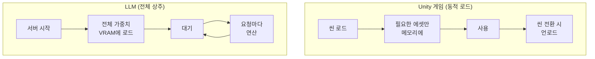

|特性Unity | LLM |
| --- | --- | --- |
|ロード方式|ダイナミック（必要な場合）|静的（完全常駐）|
|メモリ管理シーン別アンロード|サーバーを再起動するまで維持
|たとえ図書館（必要な本だけを取り出す）|すべての本を覚えている人

---

### 1-2.モデル規模とパラメータ

先にLLMが「巨大なfloat配列」であることを確認しました。それでは、この配列がどれほど大きいのでしょうか？ LLMモデルを紹介するときは、「7B」、「70B」、「671B」などの数字をよく見てください。この数字は ** パラメータ数 ** であり、その float 配列の **要素数** を意味します。 BはBillion（10億）の略です。

**パラメータ=重み(weight)=モデルが学習した数字一つ一つ**

```
7B  = 70억 개의 float 숫자
70B = 700억 개의 float 숫자
175B = 1,750억 개의 float 숫자 (GPT-3)
671B = 6,710억 개의 float 숫자 (DeepSeek-V3)
```

Unityに例えれば、パラメータはゲームの**すべてのアセットに含まれるピクセルまたは頂点の総数**に似ています。 3Dモデルの頂点一つ一つが位置（x、y、z）を持つように、LLMのパラメータ一つ一つが特定のfloat値を持ちます。そしてこれらの値が集まり、「言語を理解する能力」を形成します。

### 具体的にはパラメータはどこにありますか？

Transformerの内部を見ると、パラメータは主に次のコンポーネントの**行列**に保存されます。

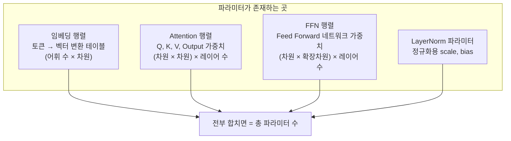

たとえば、ディメンションが4096でレイヤーが32のモデルの場合：
- **埋め込み**: 語彙数(~50,000) × 4096 ≈ 2億個
- **Attention (Q,K,V,O)**: 4 × 4096 × 4096 × 32 ≈ 21億個
- **FFN**: 2×4096×16384×32 ≈ 43億個
- **その他（LayerNormなど）**：数百万

このように合わせると約**7B(70億)**になります。これが「7Bパラメータモデル」の実体です。

### パラメータ数とメモリの関係

パラメータ 1 つはデフォルトで float 数値 1 です。保存形式によってメモリ使用量が異なります。

|精度|パラメータあたりのサイズ| 7Bモデル| 70Bモデル| 671Bモデル|
| --- | --- | --- | --- | --- |
| FP32（32ビット）| 4バイト| 28 GB | 280 GB | 2,684 GB |
| FP16（16ビット）| 2バイト| 14 GB | 140 GB | 1,342 GB |
| INT8（8ビット量子化）| 1 byte | 7 GB | 70 GB | 671 GB |
| INT4（4ビット量子化）| 0.5 byte | 3.5 GB | 35 GB | 336 GB |

この表を見ると、なぜ**量子化**が重要なのかがわかります。 70BモデルをFP16のまま回すと140GBメモリが必要ですが、4ビット量子化を適用すると35GBに減り、Macの統合メモリやNVIDIA RTX 4090（24GB VRAM）でも実行が可能になります。もちろん、量子化を行うと精度が低下し、応答品質が若干低下することがありますが、最新の量子化技術はその差を最小限に抑えます。

### パラメータ数 = モデルの「脳サイズ」

|モデル|パラメータ数おおよそのレベルたとえ
| --- | --- | --- | --- |
| TinyLlama | 1.1B |簡単な会話小学生|
| Llama 3.2 | 3B |基本的な質疑応答中学生|
| Llama 3.1 | 8B |ユニバーサルアシスタント|高校生|
| Llama 3.1 | 70B |専門的な分析大学院生|
| GPT-4（推定）| 〜1.8T（MoE）|トップレベルユニバーサル|博士級専門家チーム|
| Claude Opus 4.6 |プライベート|トップレベルユニバーサル|プライベート|

> **注意**: パラメータの数が大きいとは無条件で良いわけではありません。学習データの質、後処理学習（RLHF）、アーキテクチャ効率などがすべて影響します。 8B モデルでも最新の手法で学習すると、前世代の 70B モデルを上回ることができます（セクション 8-1 を参照）。
>

---

### 2. APIコールフロー：プロンプトはどこに行きますか？

Claude Codeでプロンプトを入力すると何が起こりますか？まるで魔法のように答えが戻ってきますが、その間には複雑な旅があります。

私たちがターミナルに入力した瞬間、そのテキストはローカルコンピュータを離れ、インターネットを介してアントロピックのサーバーに向かいます。サーバーでは、私たちのテキストを「トークン」という単位に分割し、巨大なニューラルネットワークを通過させて応答を生成します。この応答は再びインターネットを介して私たちの端末に戻ります。

ここで重要な点は、**Stateless**という特性です。 APIサーバーは、私たちが誰であるか、以前に何を話したのか覚えていません。まるで毎回新しい人に会うのと同じです。そのため、Claude Codeは以前の会話内容をローカルに保存しておき、新しいメッセージとともに**基本的に全体の会話履歴をサーバーに送信します**（ただし、コンテキストが長くなると自動圧縮（auto-compaction）を通じて前の会話を要約して、伝送量を減らすこともあります）。会話が長くなるほど送信されるデータも増え、コストも増える理由がここにあります。

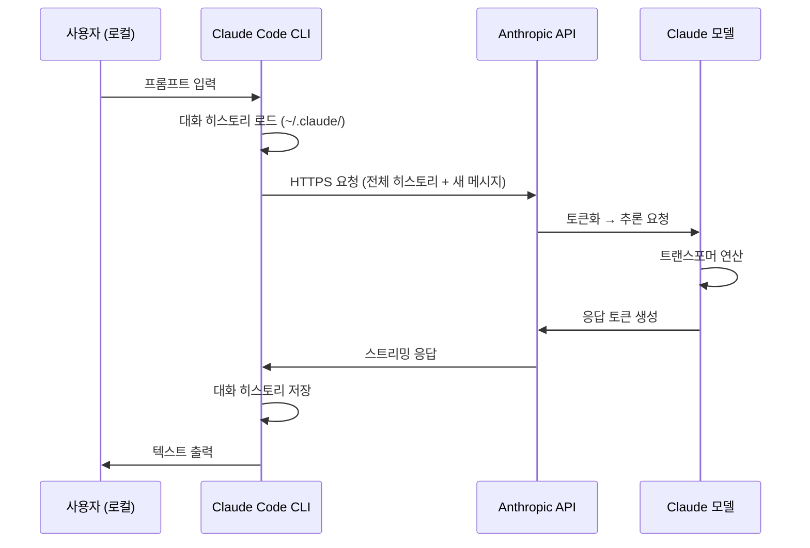

**重要な特性**：
- **Stateless**：APIサーバーは以前の会話を覚えていません
- **基本的にフル転送**：会話するたびに履歴を送信します（クライアントに応じて圧縮/要約が適用可能）
- **トークン化は通常サーバーで**：テキスト→トークン変換はAPIサーバーで行われます（一部のクライアントはローカルトークナイザーでトークン数を事前推定）
- **Prompt Caching**: 原則はステートレスですが、最近 Anthropic(Claude) や OpenAI などはコストと遅延時間を減らすために **プロンプトキャッシュ(Prompt Caching)** 技術をサポートしています。クライアントが同じ長いコンテキスト（たとえば、CLAUDE.md、システムプロンプト）を繰り返し送信すると、サーバーは以前の操作結果（KV Cache）を一時的に保存し、重複操作を省略します。これは「記憶」ではなく、**演算キャッシュのリサイクル**なので、ステートレスの原則と矛盾しません（セクション12で詳細に説明）。

---

### 3.会話のコンテキスト：どこに保存されますか？

「昨日聞いたことを覚えてる？」とClaudeに尋ねたら、Claudeは実際に「記憶」するのでしょうか？答えは複雑です。

LLMサーバー自体は何も覚えていません。完全にステートレスです。しかし、私たちが使用する**クライアント**（Claude Code、claude.ai Web、または自分で作成したアプリ）は、会話の内容をどこかに保存し、毎回API呼び出し時に一緒に送信します。

Claude Codeを使用すると、会話の内容は `~/.claude/projects/`フォルダにプロジェクトごとに保存されます。これらのファイルは純粋なローカルデータなので、別のコンピュータで同じプロジェクトを開くと、以前の会話は表示されません。一方、claude.ai Webはサーバーデータベースに保存されているため、どこからでもログインすると以前の会話を見ることができます。

APIを直接呼び出す場合は？何も保存されません。開発者は直接会話履歴を管理し、要求ごとに必要なコンテキストを一緒に送信する必要があります。

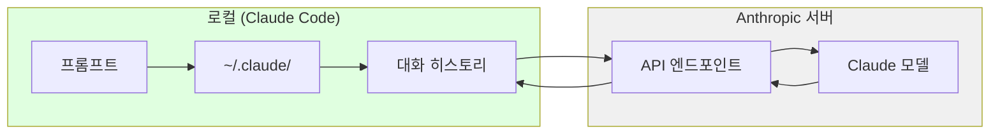

|使い方保管場所特徴|
| --- | --- | --- |
| Claude Code（CLI）|ローカル（`~/.claude/projects/`）|プロジェクト別の分離
| claude.ai（ウェブ）| Anthropic Server DB |アカウントにリンク|
| APIダイレクトコール保存なし完全なステートレス|

> **💬 待って、これを知っていこう**
> 
> 
> **Q。コンテキストウィンドウとは何ですか？** 
> 
> **一度に処理できるトークンの最大数**。 Claude 3.5は200K、Claude 4.6は1M（ベータ）まで処理可能です。会話がこの制限を超えると、古い内容から切り捨てられます。 Claude Codeの `/compact`コマンドはこれを管理するためのものです。
> 
> **Q。コンテキストウィンドウが大きい場合は、無条件に良いですか？** 
> 
> **コストとスピードトレードオフ**があります。コンテキストが大きいとより多くの情報が含まれる可能性がありますが、Self-AttentionのO（n²）特性により処理時間とコストも増加します。簡単な質問では、1Mコンテキストは過剰です。
>

---

### 4. LLM詳細動作フロー

さて、重要な質問に答えましょう：**プロンプトが応答に変換される過程で実際に何が起こりますか？**

UnityでGameObjectが `Awake()` → `Start()` → `Update()` サイクルを経るように、LLMも定められたパイプラインに従います。テキストが入ると数値に変換され、複雑な数学演算を経てテキストに戻ります。

最も重要なのは、LLMが**一度に1トークンずつ**生成することです。 「こんにちは」という回答も一度に出るのではなく、「中」→「こんにちは」→「は」→「3」→「よ」の順に一つずつ生成されます。各トークンを生成するたびに、完全なトランス操作が実行されます。だから長い応答は時間がかかり、ストリーミングで1文字ずつ出力されることがわかります。

以下は、プロンプトが応答になるまでの全体的なプロセスです。

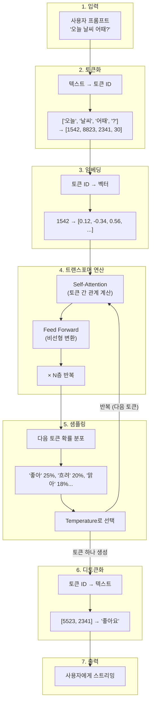

### 各ステップの説明

|ステップ|説明Unityのたとえ話|
| --- | --- | --- |
| **トークン化** |テキストを数値IDに変換|アセットパス→Instance ID |
| **埋め込み** | IDを高次元ベクトルに変換| Prefab→GameObjectインスタンス|
| **トランスフォーマー** |コンテキスト理解とパターンマッチングUpdate（）ロジック実行|
| **サンプリング** |確率的に次のトークンを選択します。 Random.Range() |
| **デトークン化** |番号IDをテキストに復元するレンダリング結果画面出力|

**コアポイント**：LLMは**一度に1トークンずつ**生成します。 「いいね」という回答も「いいね」→「ああ」→「よ」の順に一つずつ出てきます。

> **💬 待って、これを知っていこう**
> 
> 
> **Q。 LLMは本当に「考え」をしますか？**
>いいえ。次に来る可能性の高いトークンを予測するだけです。意識や理解ではなく、**統計パターンマッチング**です。 「今日の天気が」という入力に「良い25％、曇り20％…」確率を計算するだけです。
> 
> **Q。トークンは正確に何ですか？**
>テキストの**最小処理単位**。英語はおおよそ単語単位、韓国語は音節または字母単位で分けられます。 「こんにちは」→[「こんにちは」、「はい」）または[「中」、「こんにちは」、「は」、「3」、「はい」]。モデルごとにトークン化方式が異なります。
> 
> **Q。 Temperatureとは何ですか？**
>応答の**ランダム性を調整するパラメータ**。低い場合（0に近い場合）、最も確率の高いトークンのみを選択して一貫した応答を、高い場合（1以上）低い確率のトークンも選択して、創造的ですが予測不可能な応答を生成します。ゲームの `Random.Range()` 範囲を調整するのと似ています。
> 
> **Q。なぜ答えは1文字ずつ出るのですか**
> LLMは一度に1つのトークンを生成するためです。ストリーミングは、このプロセスをリアルタイムで表示することです。完全な応答が完了するのを待たずにすぐに表示するUX最適化。
>

---

### 5.学習対推論：LLMの2つのモード

「Claudeと会話すると、Claudeが学ぶの？」という質問をよく受けます。答えは**いいえ**です。

LLMには2つのまったく異なるモードがあります。**学習（Training）**と**推論（Inference）**。どちらもゲーム開発とゲームプレイのようにまったく異なるプロセスです。

学習はオフラインから数ヶ月にわたって行われます。 Anthropicのエンジニアが何千ものGPUを動員し、インターネット上の膨大なテキストデータを処理します。このプロセスでは、モデルは言語のパターンを「重み」という数字でエンコードします。学習が完了すると、これらの重みはファイルとして保存され、これが私たちが「モデル」と呼ぶことです。

推論は、私たちがClaudeと話すときに起こるものです。既に学習済みの重みを**読み取り専用**として使用します。重みは変更されません。モデルは新しいことを「学びません」。既存の学習パターンに基づいて次のトークンを予測するだけです。

コストの差も明らかです。学習には数千万から数億ドルがかかりますが、推論は**百万トークンあたり数ドル**レベルにすぎません（例：Claude Sonnet 4.5ベースの入力$ 3 /出力$ 15 per 1M tokens）。日常的な短い会話（数百トークン）は1セント未満ですが、出力が長くなると（数千トークン）数セントまで上がることができます。私たちがAPI費用で支払うのはこの推論費用です。

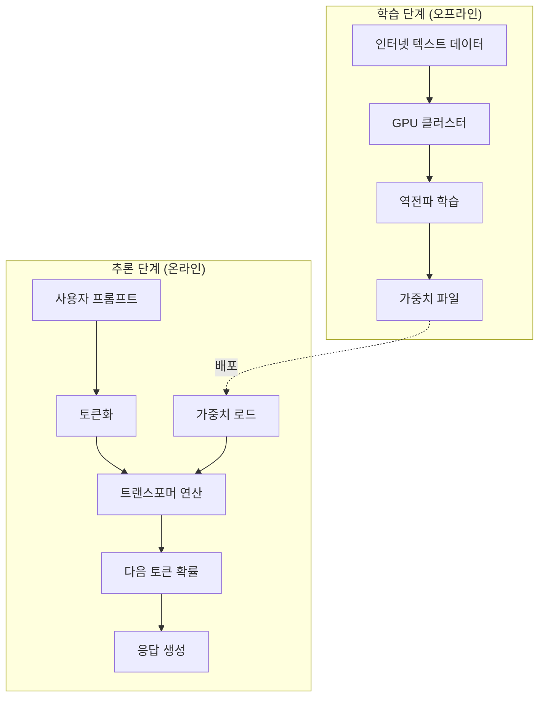

|区分学習（トレーニング）|推論（Inference）|
| --- | --- | --- |
| **視点** |オフライン、数ヶ月オンライン、リアルタイム|
| **入力** |数兆のテキストトークンユーザープロンプト|
| **出力** |重みファイル（数百GB）|応答トークン
| **目的** |言語パターン学習|次のトークン予測
| **費用** |数千万〜数億ドル|百万トークン（MTok）あたりの課金

**重要**：私たちがClaudeと話すときは、**推論ステップ**のみが実行されます。モデルは新しいものを「学習」しません。

> **💬 待って、これを知っていこう**
> 
> 
> **Q。私が会話したら、Claudeは学びますか？**
>いいえ、**推論のみします**。学習はオフラインから数ヶ月にわたって行われ、会話の際にはすでに完成した重みを読み取り専用として使用します。会話の内容はモデルに反映されません。
> 
> **Q。なぜLLM学習に何億ドルかかるのですか？**
> 
> **データと演算量**のためです。数兆のトークンを処理するには、数千台の高価なGPU（H100など）を数ヶ月間フル稼働させる必要があります。電気料だけでも数千万ドル単位です。一方、推論は既存の重みを再利用するので比較的安価です。 →これが、イロンマスクが宇宙にデータセンターを構築する理由です。宇宙真空状態の放射冷却と太陽光発電を活用すると、コストを大幅に削減できます（スタークラウド）。
>

---

## Part 2: 内部構造 (深化)

パート1では、LLMが何であり、どのように使用されるのかを概説しました。もう少し深く入りましょう。 「トランス」というアーキテクチャは何で、なぜGPUが必要で、サーバーがどのように動作するのかを学びます。

このパートの内容はLLMを使用するために必須ではありませんが、内部構造を理解すると、なぜ特定の動作が遅いのか、なぜコストがそんなに策定されるのか、どのような制限があるのか​​をよりよく理解することができます。

### 6. 変圧器アーキテクチャ：コア原理

2017年にGoogleが発表した「Attention Is All You Need」論文はAI歴史の転換点でした。この論文で紹介されている**トランスフォーマー**アーキテクチャは、その後、すべての主要LLMの基盤となりました。 GPT(**G**enerative **P**re-trained **T**ransformer)のTはまさにこのトランスであり、Claude、Geminiも同じアーキテクチャを使用します。

トランスの重要なアイデアは**Self-Attention**です。文の各単語（トークン）が他のすべての単語との関係を計算します。 「The cat sat on the mat. It was soft.」という文章で、「It」が何を指しているのか、どうすればわかりますか？ Self-Attentionは、「It」と「cat」、「It」と「mat」の間の関連度を計算して、「It」が「mat」を指していることを確認します。

Unityの開発者に慣れている例を挙げると、すべてのGameObjectが他のすべてのGameObjectからの距離を計算するのと似ています。 n個のオブジェクトがある場合は、n×n回の計算が必要です。これがLLMが長いテキストを処理するときに遅くなる理由です - O（n²）の複雑さによるものです。

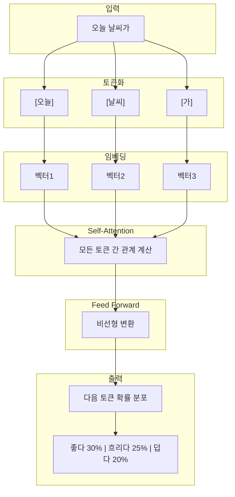

### Self-Attentionとは？

すべてのトークンが他のすべてのトークンとの関係を計算します。

たとえば、「The cat sat on the mat. It was soft.」では、
- 「It」が何を指すか。
- 「cat」との関係？ 「mat」との関係？
- Self-Attentionはこの関係を計算します

**Unityの例え**：すべてのGameObjectが他のすべてのGameObjectからの距離を計算するのと似ています。 O(n²) 複雑度です。

> **💬 待って、これを知っていこう**
> 
> 
> **Q。会話が長くなると、なぜ遅くなりますか？**
> 
> **コンテキスト全体を毎回処理**するからです。 Self-AttentionはO（n²）なのでトークンが2倍→演算4倍です。 Claude Codeの `/compact`コマンドでコンテキストをクリーンアップすると、速度が向上します。
> 
> **Q。同じTransformerですが、なぜ新しいバージョンがよりスマートなのですか？**
> Transformerと呼ばれる「エンジン」は同じですが、その上に積み重ねる技術が**5つの軸**で同時に進化するためです。詳細は[セクション8-1](#）で説明しています。
>

---

### 6-1.マンバ（Mamba）と状態空間モデル（SSM）：トランスの代替

トランスのO（n²）の複雑さは基本的な制限です。コンテキストが4Kから128Kに増えると、計算量は32倍ではなく**1,024倍**に爆増します。ゲームに例えれば、シーンのオブジェクトが増えるたびにすべてのオブジェクトのペアの衝突チェックを brute-force で実行するのと同じです。当然、より効率的な方法が必要です。

2024～2025年を起点に、「マンバ（Mamba）**」という新しいアーキテクチャが急浮上しました。 Mambaは**状態空間モデル（SSM）**に基づいており、入力データを順次処理しながら**固定サイズの内部状態**を動的に更新する方法を採用しています。

コアの違いをゲームに例えると:

- **トランスフォーマー**：フレームごとに**画面全体を最初から再レンダリング**する方法
- **マンバ**: **加速構造(Acceleration Structure)**を活用して変化のある部分のみを効率的に処理する方法

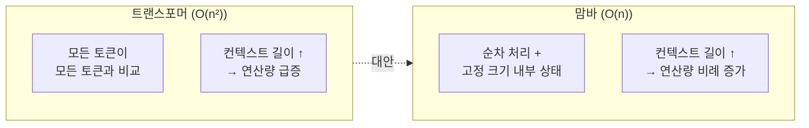

Mambaの最大の利点は、**線形時間複雑度O（n）**を達成したことです。データが長くなっても、演算量は比例的にだけ増加します。また、推論時に以前のトークン情報を固定サイズの状態ベクトルに圧縮保存するため、トランスのように過去のデータをすべて再度取得する必要はありません。

|特性トランスフォーマーマンバ（SSM）|
| --- | --- | --- |
|時間の複雑さO（n²）| O（n）|
|長いコンテキスト処理トークン数が増加すると急激に（二次）低下線形増加で増加幅が緩やかです（トークンあたりの推論コストはほぼ一定）
| VRAM占有|コンテキスト長に応じて急増（KVキャッシュ）固定サイズの内部状態を維持
|強み複雑なロジック、正確なパターンマッチング長い文書分析、無限会話NPC
|代表モデル| GPT-4、Claude | Codestral Mamba |

> **ゲーム開発者のための示唆点**：ゲーム内のNPCがプレイヤーと数時間にわたって会話を交わす必要がある場合、トランスのO（n²）は致命的です。マンバベースの軽量モデルは、このようなシナリオにはるかに適しています。
>

> **💬 待って、これを知っていこう**
> 
> 
> **Q。 Mambaはトランスを置き換えますか？**
> 
> **まだではありません。補完関係です。**マンバはO（n）線形複雑さで長いコンテキストに優れていますが、複雑な論理的推論では、トランスの精密なSelf-Attentionがまだ優勢です。現在のトレンドは以下で扱う**ハイブリッドアーキテクチャ**です。
>

---

### 6-2.ハイブリッドアーキテクチャ：トランスフォーマー+マンバ

「どちらもいいと合えばいいんじゃないですか？」そうですね。最新の研究の最前線では、「トランスの精密なコンテキスト理解能力」と「マンバの効率的な線形スケーリング」を組み合わせた「ハイブリッドアーキテクチャ」が注目されています。

**Jamba**: トランス層とマンバ層を特定の割合で交差配置し、ここにMoE構造を組み合わせてスループットと性能のバランスをとったモデルです。近い文脈は、マンバが迅速に処理し、遠い文脈間の複雑な関係は、変圧器が正確に処理する分業システムです。

**Routing Mamba（RoM）**：マイクロソフトが提案した手法で、マンバ内部の線形投影の専門家を稀に選択することで、演算効率を23％以上向上させながらも大型モデルに匹敵する性能を実証しました。

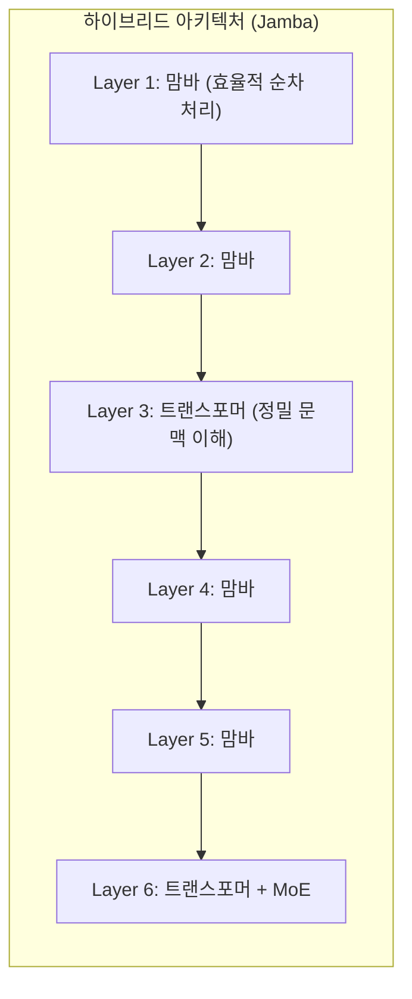

Unityに例えれば、ハイブリッドアーキテクチャはゲーム内の**LOD（Level of Detail）**システムに似ています。近いオブジェクトは高解像度で、遠いオブジェクトは低解像度で処理するように、近いコンテキストは軽く、複雑な関係は精密に処理します。

|アーキテクチャ|主な特長代表モデル|
| --- | --- | --- |
| Transformer |正確なコンテキスト理解とパターンマッチングGPT-4、Claude 3.5 |
|マンバ（SSM）|線形スケーリング、長いコンテキスト最適化Codestral Mamba |
| MoE |演算量に対する巨大なパラメータの受け入れDeepSeek-V3、Mixtral |マウサー
| Hybrid（Jamba / RoM）|高性能と高効率の最適バランスJamba、Samba |

---

### 6-3.レイトレーシングとセルフアテンション：意外な共通点

興味深いことに、LLMのアテンションメカニズムと現代グラフィックスの中心である「レイトレーシング」は、技術的に非常に類似した課題を抱えています。ゲーム開発者なら、この類似性はうれしいでしょう。

どちらの技術も**「データ間の複雑な関係ネットワークの探索」**が重要であり、これには高度な加速構造が必要です。

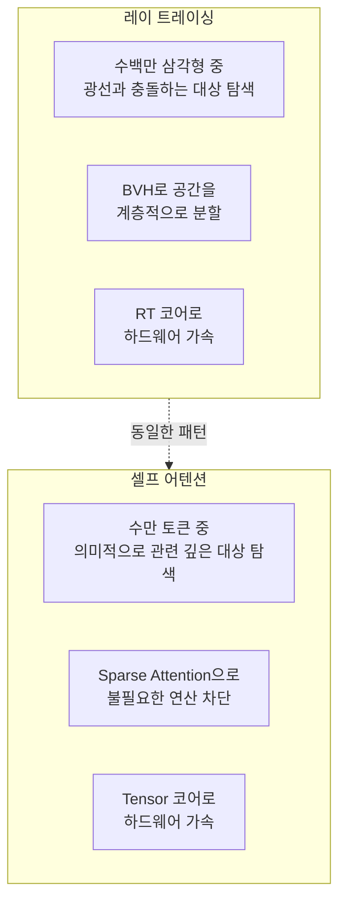

|コンセプト|レイトレーシングセルフアテンション
| --- | --- | --- |
| **探索対象** |光線 - 三角形の衝突トークンとトークンの関係
| **加速構造** | BVH（Bounding Volume Hierarchy）| Sparse Transformer、MoE |マウサー
| **希少性の活用** |見えない部分演算を省略不要なトークン間の操作をブロックする
| **専用ハードウェア** | RTコア| Tensorコア、TMEM |マウサー
| **最適化方向** | Traversal Shader（プログラミング可能）|ドメインによる重みの動的調整

**コア**：ゲーム開発者がグラフィックス最適化から得た洞察（空間分割、希少性の活用、ハードウェアアクセラレーション）は、LLM推論システムの理解と設計に直接適用できます。同じGPU上で同じ問題を別のドメインで解決しているわけです。

---

### 7. ハードウェア構成: GPU vs NPU vs CPU

なぜLLMはGPUから戻るのですか？ CPUではありませんか？私のMacBookのNeural Engineは何ですか？

LLMの主な演算は**行列乗算**です。 （だから線形代数学が必要なのですね…）

数億から数千億の数字を掛けて加算する作業を何度も繰り返します。 CPUは複雑な演算を順番にうまく処理しますが、単純な演算を並列に一括処理するには弱いです。一方、GPUは、何千もの小さなコアが同時に単純な操作を処理できるように設計されています。

NVIDIAのデータセンターGPU(A100、H100)は80GBまでの専用**VRAM**を持っており、量子化やマルチGPU分散を適用すれば大型モデルの重みを効率的に積載できます(70B FP16 ≈ 140GBなので単一GPUには量子化なしで全量常駐。また、Tensor CoreというAI演算専用ユニットがあり、行列演算を極めて迅速に処理します。

### VRAM: LLMのワークスペース

- **VRAM(Video RAM)**はGPUに直接搭載された専用高速メモリです。ゲームではテクスチャとフレームバッファがVRAMに上がるように、LLMでは**モデルの重み、KVキャッシュ、中間演算結果**がVRAMに常駐します。

なぜシステムRAMではなくVRAMが重要なのですか？ **帯域幅**のためです。 GPUがデータを処理するにはメモリから読み取る必要がありますが、VRAMの帯域幅はシステムRAMと比較して数十倍高速です（GPUの種類によって異なります）。

```
시스템 RAM (DDR5):                ~50-90 GB/s     ← CPU용
소비자용 GPU VRAM (GDDR6X):       ~1,000 GB/s    ← RTX 4090 기준 (약 11-20배)
소비자용 GPU VRAM (GDDR7):        ~1,792 GB/s    ← RTX 5090 기준 (약 20-36배)
데이터센터 GPU VRAM (HBM3e):      ~3,350 GB/s    ← H100/H200 기준 (약 37-67배)
```

ゲーム開発でテクスチャをVRAMに上げなければリアルタイムレンダリングが可能なように、LLMの重みもVRAMに上がっていなければリアルタイム推論が可能です。重みがシステムRAMにしかない場合、PCIeバスを介してGPUに転送する過程が極端なボトルネックになります。

**VRAMに登るもの：**

|コンポーネント特性説明70Bモデル（FP16）規格|
| --- | --- | --- | --- |
|モデルの重み| **静的** |学習したパラメータ全体（サーバーの起動時にロード、変化しない）| 〜140 GB |
| KVキャッシュ| **動的** |以前のトークンのKey / Value（会話の長さに比例して**実行時に増加**）| 〜数GB〜数十GB |
|アクティブメモリ**動的** |純電波中間演算結果| 〜数GB |

> **ゲーム開発者のための例え**：モデルの重みは、ゲームの**静的アセット**（テクスチャ、メッシュなどのビルド時に確定）であり、KVキャッシュは**動的フレームバッファまたはランタイムステートストア**（プレイ中に積み重ねられるデータ）に対応します。会話（コンテキスト）が長くなるほどKVキャッシュが動的に増加してVRAMを追加占有するため、実際のサービング時には重みサイズだけでVRAM要求量を判断することはできません。これは、実用化可能なモデルの規模が重み付け基準の推定値よりも小さくなる重要な理由です。

VRAMが不足すると、モデルの一部をシステムRAMに下げる**レイヤーオフロード**が発生し、推論速度が急激に低下します。これは、ゲームエンジンがビデオメモリが不足したときにシステムメモリにテクスチャをページング（Paging）してフレームが急落する現象と似ています。 llama.cppなどのローカルLLMツールでは、GPUにロードするレイヤーの数を直接指定することで、GPU / CPU分担比率を調整できます。量子化（INT4 / INT8）で重みのサイズを減らすことは、オフロードを防ぐための主な方法です。

> **📖詳細はこちら**：
> 
> - GPUメモリ階層（HBM→L2→SRAM→レジスタ）とVRAM容量計算法→[VRAM深化ガイド](/posts/vram-deep-dive/）
> - CUDA Core、Tensor Core、TMEM、NPUの詳細動作原理 → [GPU演算ユニット深化ガイド](/posts/gpu-compute-deep-dive/)

最近では**NPU(Neural Processing Unit)**も注目されています。 Apple SiliconのNeural Engine、スマートフォンのAIチップなどがここに該当します。 NPUはGPUよりも低電力ですが、性能も低いです。軽量モデル（7Bパラメータ程度）はNPUとしてローカルで実行できますが、Claudeのような大型モデルはまだデータセンターGPUを必要とします。

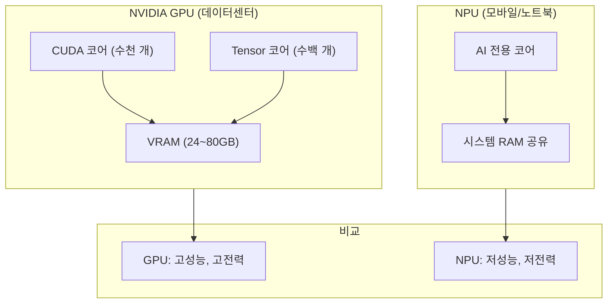

### メモリ構造の比較

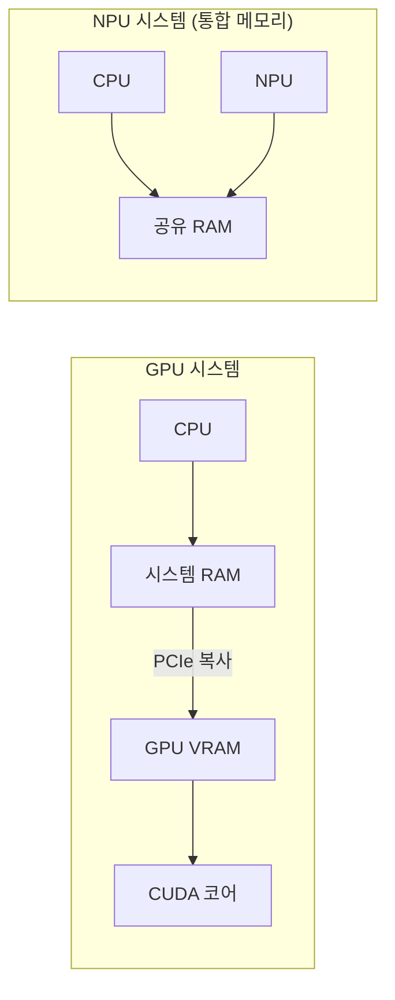

|特性GPU（NVIDIA）| NPU（Apple Siliconなど）|
| --- | --- | --- |
|メモリ|専用VRAM（80GBまで）|システムRAM共有|
|帯域幅| HBMのみ（〜3.3TB / s、H100ベース）| SoC統合メモリ共有（〜546 GB / s、M4 Maxベース）* |
|用途|サーバー、学習、大型モデル|モバイル、軽量モデル|

*Apple Siliconの統合メモリ帯域幅はチップによって大きな違いがあります：M4 Max〜546GB / s、M4 Ultra〜800 + GB / s。この帯域幅をCPU・GPU・NPUが共有します。 GPUの3.3TB/sはHBM専用帯域幅なので、直接比較には注意が必要です。

### Apple Silicon統合メモリアーキテクチャ(UMA)の深化

Apple Silicon（M1〜M5）の最大の特徴は**Unified Memory Architecture（UMA）**です。このアーキテクチャでは、CPU、GPU、およびNeural Engineは**物理的に同じメモリプール**を共有します。つまり、MacのシステムRAMはまもなくGPUが使用するVRAMとして機能します。

これはNVIDIAの伝統的な構造と根本的に異なります。

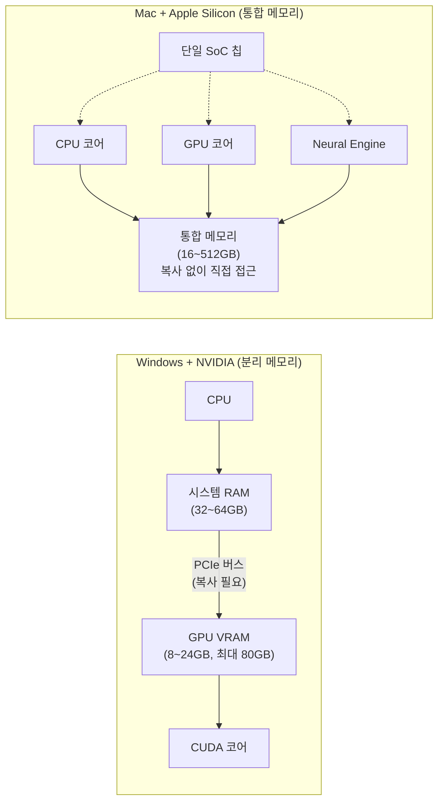

**核心の違い：データのコピーは不要**

NVIDIAシステムでLLMを実行するには、モデルの重みをシステムRAMからGPU VRAMにPCIeバス経由でコピーする必要があります。このプロセスがボトルネックになります。また、VRAM容量が限られているため（消費者向けRTX 5090が約32GB）、大型モデルはVRAMに収まらず、CPU RAMとGPU VRAMの間を上下しなければならず、この時性能が急激に低下します。

一方、Apple Siliconでは**Zero-Copyアクセス**が可能です。 CPU、GPU、Neural Engineなど、同じメモリアドレスのデータを直接読み取ることができます。テンソルデータをGPUに「コピー」する必要がなく、アレイが統合メモリにそのまま存在する場合は、どのプロセッサでも直接演算に使用します。 AppleのMLXフレームワークでは、これを次のように活用しています。

> “Arrays live in unified memory and can be executed on CPU or GPU without explicit ‘copy to device’ or ‘copy back’ calls.”
>

**メモリ容量の利点**

|構成利用可能なLLMメモリ|おおよそのモデルスケール
| --- | --- | --- |
| NVIDIA RTX 4090 | 24GB VRAM | 〜25-35B（4ビット量子化、コンテキスト長によって異なります）* |
| NVIDIA RTX 5090 | 32GB VRAM | 〜35-50B（4ビット量子化、コンテキスト長によって異なります）* |
| M4 MacBook Pro | 24GB統合メモリ| 〜25-35B（4ビット量子化、コンテキスト長によって異なります）* |
| M4 Max MacBook Pro | 64〜128GB統合メモリ| 〜70B（4bit量子化）|
| Mac Studio M2 / M4 Ultra | 192〜512GB統合メモリ| 〜200B+（4bit量子化）|

*モデルの重みだけではより大きなモデルが積載可能ですが、推論時にKV Cache（対話長に比例して増加するダイナミックメモリ）がVRAMを追加占有するため、実使用可能なモデル規模が減少します。短いコンテキストでは、上記の推定値よりも大きいモデルも可能です。

Mac Studio 512GB構成では、強い量子化（INT4など）を適用すると、DeepSeekの671Bパラメータモデルまでローカルでロードできます。ただし、推論速度は実サービスと比較して大きく遅く（～数tok/s）、実用的使用よりは実験／プロトタイピング用途に近いです。同じモデルをNVIDIA GPUでリアルタイムでサービスするには、複数のデータセンター級GPU（A100/H100 80GB×複数枚）が必要で、コストが数千万ウォンから数億ウォンに達します。

**パフォーマンス比較：スループット対効率**

|指標NVIDIA RTX 4090 | Apple M4 Max |
| --- | --- | --- |
|メモリ帯域幅〜1,008GB / s（GDDR6X）| ~546GB/s |
| Llama 7B推論速度| ~50-60 tokens/s | ~30-40 tokens/s |
|消費電力| ~450W | ~40-80W |
| Tokens / Watt（効率）| ~0.13 t/W | ~0.50 t/W |
|最大メモリ容量24GB（消費者）| 128GB（ノートブック）|

**結論**：NVIDIA GPUは**絶対的なスループットで優勢です。純粋な演算速度と学習では、NVIDIAは圧倒的です。しかし、Apple Siliconは、**電力比効率**、**メモリ容量の拡張性**、**データコピーなしのZero-Copyアプローチ**に強みを持っています。特に大型モデルをローカルで回さなければならない場合、専用VRAM分離に伴う容量制約がないという点が最大の実用的利点です（物理的上限はあるが、消費者GPUの24～32GB VRAMに比べてはるかに余裕がある）。

### MLX: Apple Silicon専用MLフレームワーク

Appleは、チップに最適化されたオープンソースMLフレームワーク** MLX**を提供しています。 MLXは、統合メモリアーキテクチャを最大限に活用するように設計されており、NumPyに似たAPIで使いやすいです。

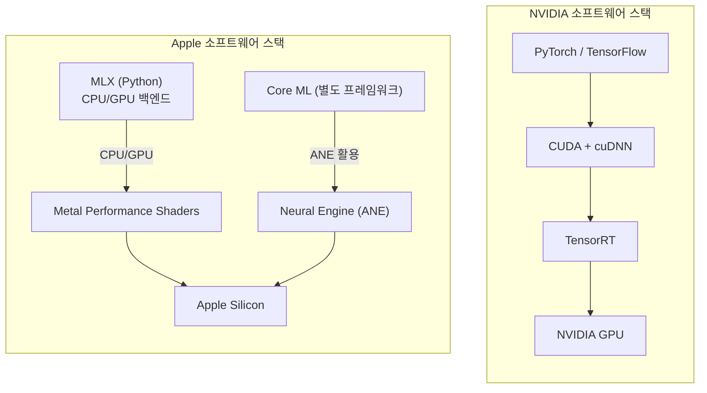

|特性NVIDIA CUDAエコシステム| Apple MLXエコシステム
| --- | --- | --- |
|成熟度非常に高い（10年+）|初期（2023年〜）|
|ライブラリ| FlashAttention、bitsandbytes、TensorRTなど| mlx-lm、mlx-vlmなど|
|モデルサポート|ほぼすべてのモデルLlama、Qwen、Mistralなどの主要モデル|
|学習サポート|完全サポート|限定的（Fine-tuning中心）|
|推論性能|トップレベル|急速に改善しています。

**ゲーム開発者のための示唆点**：もしローカルでLLMを活用したゲーム内AI機能（NPC会話、手続き型コンテンツ生成など）を考慮すれば、MacではMLX+軽量モデルの組み合わせでプロトタイピングが可能です。本番サーバーでは、まだNVIDIA GPUベースのインフラストラクチャが標準です。

### FlashAttention-4: ハードウェア - ソフトウェア共同設計の頂点

NVIDIAの最新の**Blackwell（B200）**アーキテクチャで公開されている**FlashAttention-4**は、アテンション演算の物理的な限界を突破するためのアルゴリズムの頂点です。 （※以下の性能数値は公式テクニカルレポート発表前の初期ベンチマーク報告基準であり、正式論文による再現検証が必要です。）経験しました。

ゲーム開発者に馴染みのあるたとえ話を聞くと、シェーダでテクスチャサンプリングがボトルネックになり、GPUの演算ユニットが遊んでいる状況と同じです。

FlashAttention-4は3つのコアイノベーションでこれを解決します。

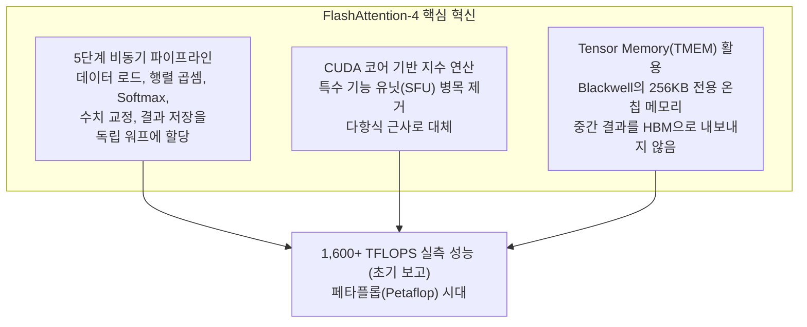

| FlashAttentionバージョン|コア改善ゲームのたとえ
| --- | --- | --- |
| **v1（2022）** |タイリングによるHBMアクセスの最小化テクスチャアトラスでドローコールを減らす
| **v2（2023）** |並列化の改善、より良いワーク配布GPUシェアの最適化
| **v3（2024）** | H100専用最適化|特定のハードウェアシェーダの最適化
| **v4（2025）** | Blackwell共同設計、非同期パイプラインハードウェア - ソフトウェア共同設計（カスタムレンダリングパイプライン）|

これは、ゲームグラフィックの**ハードウェア世代に合わせたレンダリングパイプラインの最適化**とまったく同じ進化の方向です。 GPU世代が変わるたびに新しいハードウェア機能を活用してより高い性能を引き出すように、LLM推論もハードウェアとソフトウェアが共に進化しています。

---

### 8. サーバーの動作方法: 常にオンになっていますか？

Claudeを呼び出すとすぐに応答が来ます。それでは、Antropicのサーバーは常にオンになっており、Claudeモデルは常に準備されているのでしょうか？

答えは**はい、しかし効率的に**です。

数百GBのモデルの重みを要求ごとにディスクから読み取ると、とても遅くなります。そのため、サーバーの起動時にウェイト全体をGPU VRAMにロードし、サーバーの電源が切れるまで保持します。重みは**常にメモリに常駐します。

ただし、**操作は要求時にのみ**実行されます。誰も Claude を呼び出さないと、GPU はスタンバイ状態になります。要求が入ると、それは変圧器操作を開始します。

また、複数のユーザーからのリクエストを**バッチ**にまとめて処理します。 GPUは、一度に1つの要求のみを処理するよりも、複数の要求をまとめて同時に処理するときに効率的です。これが要求が集まる時間帯に応答が少し遅くなる可能性がある理由でもあります。

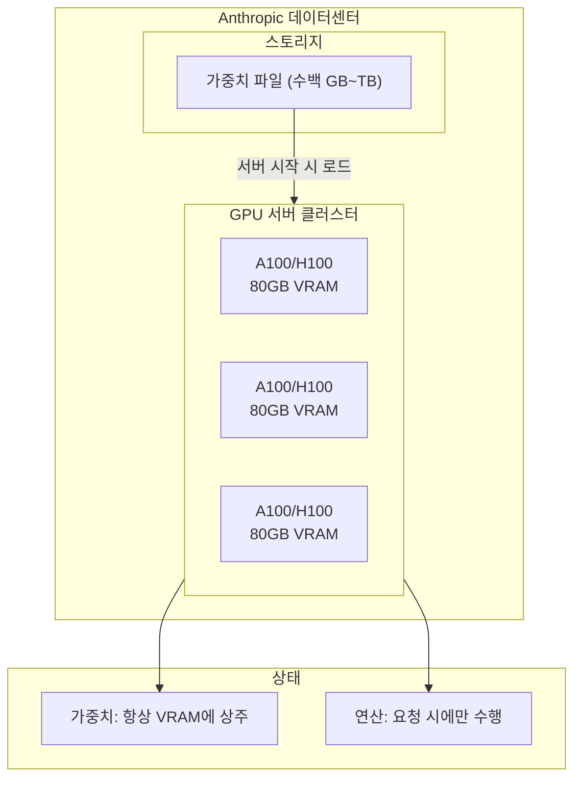

**運用方法**：
- 重みはサーバー起動時にVRAMにロードされ、**常駐**
- 操作は要求が入ったときにのみ実行されます
- 複数の要求を同時に処理できる（バッチ処理）

---

### 8-1.モデルバージョンが上がると何が変わりますか？

Claude 3 → 3.5 → 3.7 → 4 → 4.5 → 4.6, GPT-3.5 → 4 → 4o → o1, モデルバージョンが上がるたびにパフォーマンスが著しく良くなります.ところで、みんな同じTransformerアーキテクチャを使うと言ったのですが、一体**何が変わるから**こんなに良くなるのでしょうか？

ゲームに例えれば、同じUnityエンジンを使用しても、最適化技術、アセット品質、シェーダー技術、レベルデザインが変わると、まったく異なるゲームが出てくるようです。 LLMも同様に、Transformerという「エンジン」は同じですが、その上に積み重ねる技術が世代ごとに大きく進化します。

パフォーマンスの向上は、主に** 5つの軸**で同時に行われます。

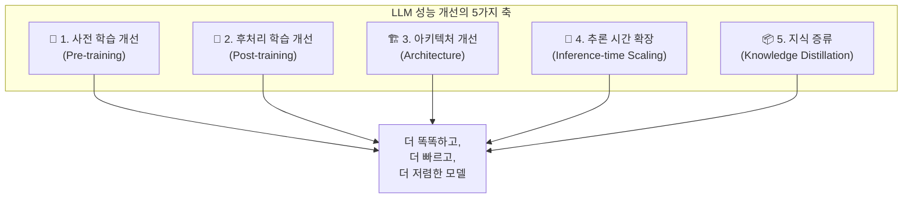

---

### 軸 1: 事前学習の改善 (Pre-training)

事前学習は、モデルが「世界の知識」を吸収する段階です。同じTransformer構造でも**何を与えるか**によって結果が完全に異なります。

**データ品質の革命**

初期LLM（GPT-2、GPT-3）は、インターネット上でクロールされたテキストをほぼそのまま学習しました。 「多ければ多いほど良い」という哲学でした。しかし、2024～2025年にこのアプローチの限界が明らかになりました。データを2倍に増やしてもパフォーマンスの向上が少なくなる**収穫体感(Diminishing Returns)**現象が現れ、高品質のテキストデータが枯渇し始めました。

今では、量よりも**品質**が重要です。

|世代|データ戦略たとえ
| --- | --- | --- |
|初期（GPT-3）|インターネットクロールデータの一括入力|すべての本を読んで読む
|中期（クラウド3）|フィルタリング+ドメインによる比率調整|教科書を中心に読んで、分野別のバランスを取る
|現在（Claude 4.5+）|合成データ+カリキュラム学習+長いコンテキスト学習ステップ|専門家が作った教材+段階的難易度学習

**合成データ(Synthetic Data)**: 既存の強力なモデルを活用して高品質の学習データを人工的に生成します。たとえば、数学の問題と解釈プロセス、コードと説明、論理的推論チェーンなどを大規模に生成し、学習データに含めます。

**カリキュラム学習**: ゲームの難易度設計のように、簡単なパターンから難しいパターン順に学習順序を設計します。また、長いコンテキスト処理のための専用学習ステップを別々に追加します。

**スケーリング法則の進化**

当初、**Chinchillaの法則**が支配的でした。 「与えられた演算予算でモデルサイズと学習データ量の最適比率（compute-optimal ratio）を合わせなければならない」というルールです。しかし、2025年には、この最適比率を意図的に超えた「オーバートレーニング戦略」が主流となりました。 Llamaシリーズが代表的なもので、8Bパラメータの小型モデルでも、Chinchilla最適比よりもはるかに多い数兆個のトークンで過度に学習させます。学習時の演算効率は低下しますが、**推論時に小型モデルを使用するため、サービングコストが大幅に削減**されます。その結果、以前の世代のはるかに大きなモデルよりも優れた性能を示していますが、推論ははるかに安価な効果を得ます。

---

### 軸 2: 後処理学習の改善 (Post-training)

事前学習で「知識」を備えたモデルはまだ生のものです。質問に奇妙な答えをしたり、有害な内容を生成したり、指示に従うことはできません。 **後処理学習**は、この生のモデルを「有用で安全なアシスタント」に変換するプロセスです。

ゲームに例えれば、事前学習が「ゲームエンジンとアセットを作ること」であれば、後処理学習は「QAテストとバランスパッチ」に対応します。

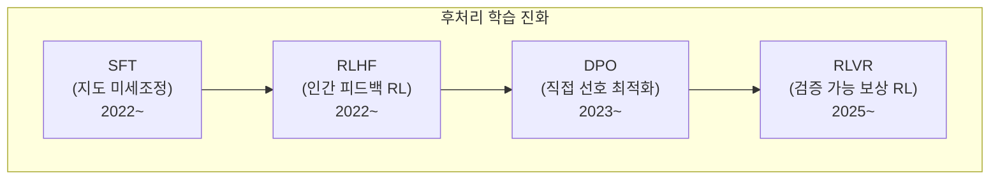

**SFT（Supervised Fine-Tuning）**：人が直接作成した「質問と回答」のペアでモデルを微調整します。 「こう聞いたらこう答えなさい」と教える方法です。単純ですが、人は毎日この答えを書く必要があるので、スケーラビリティに制限があります。

**RLHF(Reinforcement Learning from Human Feedback)**: ChatGPTを可能にしたコア技術です。モデルが複数の応答を生成すると、人は「A応答がBよりも優れている」とランク付けします。この優先データで**補償モデル(Reward Model)**を学習し、この補償モデルをガイドとしてLLMを強化学習(PPOアルゴリズム)に改善します。

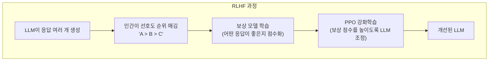

**DPO (Direct Preference Optimization, 2023~)**: RLHF の複雑な補償モデルステップをスキップする手法です。人間の好みのデータを使用してLLMを**直接**最適化します。補償モデルが不要で、学習パイプラインが単純になり安定しています。 Claude 3.5世代から、この種の最適化が積極的に活用され始めました。

**RLVR (Reinforcement Learning with Verifiable Rewards, 2025~)**: 2025年の最も重要な突破口です。数学問題やコードのように**正解を自動的に検証できる**領域で、人間なしで大規模な強化学習が可能になりました。 DeepSeek R1がこのように学習され、大きな注目を集めました。

|方法原則利点|限界
| --- | --- | --- | --- |
| **SFT** |正解を直接見せるシンプル、安定人間作成が必要
| **RLHF** |人間の好み→報酬モデル→強化学習|微妙な品質向上複雑で高価です。
| **DPO** |人間の好み→直接最適化|簡単なパイプラインRLHFと比較していくつかのパフォーマンス劣勢
| **RLVR** |自動検証→大規模強化学習|人間不要、無限拡張|検証可能領域に限定|

**なぜ世代ごとに良くなるのですか？**：各世代は、より洗練された後処理技術、より多くの優先データ、より良い報酬モデルを使用します。 Claude 4.xシリーズは、「報酬を欺く」という行動が前世代と比較して65％減少しました。

---

### 軸 3: アーキテクチャの改善 (Architecture)

Transformerの基本的な骨格（Self-Attention + Feed Forward）は維持されますが、詳細なコンポーネントは世代ごとに進化します。 Unityのレンダリングパイプラインの重要な構造は、維持しながらシェーダ、LOD、オクルージョンカーリングなどが改善されるようです。

**Attentionメカニズムの進化**

|テクニック説明効果
| --- | --- | --- |
| **Multi-Head Attention** |オリジナルトランスフォーマー（2017）|基本|
| **Group-Query Attention（GQA）** | Key-Valueヘッドをグループとして共有|メモリー節約、推論速度の向上
| **Sliding Window Attention** |近くのトークンのみ直接アテンション|長い文脈効率の改善
| **Multi-Head Latent Attention** | KVを低次元の潜在空間に圧縮するメモリを大幅に節約（DeepSeek-V2）|
| **FlashAttention** | GPUメモリアクセスパターンの最適化2〜4倍の速度向上、メモリー節約

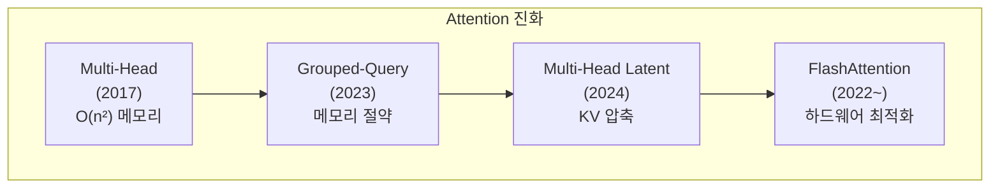

**Mixture of Experts (MoE): ゲームチェンジャー**

MoEは最近、LLMのパフォーマンス向上の最大の要因の1つです。概念は簡単です：

既存のDenseモデル：すべての入力が**すべて**パラメータを通過します。
MoEモデル：各入力は**一部の専門家（Expert）のみ**を通過します。

```mermaid
flowchart TB
    subgraph Dense["Dense 모델 (기존)"]
        direction LR
        I1["입력 토큰"] --> FFN["하나의 거대한 FFN<br/>(모든 파라미터 사용)"]
        FFN --> O1["출력"]
    end

    subgraph MoE["MoE 모델"]
        direction TB
        I2["입력 토큰"] --> Router["라우터<br/>(어떤 전문가에게 보낼지 결정)"]
        Router -->|"선택"| E1["전문가 1<br/>(수학)"]
        Router -->|"선택"| E2["전문가 2<br/>(코드)"]
        Router -.->|"비활성"| E3["전문가 3<br/>(언어)"]
        Router -.->|"비활성"| E4["전문가 4<br/>(논리)"]
        E1 --> Mix["가중 합산"]
        E2 --> Mix
        Mix --> O2["출력"]
    end
```

ゲームで例えれば、Denseモデルは「すべての従業員がすべての業務を処理する会社」であり、MoEは「専門部門が分かれており、その部門のみ業務を処理する会社」です。スタッフ全員（パラメータ）は多いですが、実際に働くスタッフは少数です。

レンダリングの最適化に精通している開発者であれば、MoEを**カスタムカリング（Frustum Culling）**と比較するとより直感的です。ゲーム内のシーン全体のメッシュデータがメモリに上がっていますが、カメラ視界にないオブジェクトのレンダリング演算を省略するように、MoEモデルも全体の重みがVRAMに常駐しますが、**1つのトークンを生成するときは、ルータが選択した一部の専門家（Expert）だけが演算に参加**します。メモリは全体を占めますが、演算量は一部だけを使用するものです。

**DeepSeek-V3/R1 の例**: 合計 671B パラメータがありますが、1 回の推論で実際にアクティブになるパラメータは 37B だけです。つまり、671Bの「知識容量」を持ちながらも、37Bモデルレベルの「演算コスト」だけです。

|モデル|総パラメータ|アクティブパラメータ|専門家の数|
| --- | --- | --- | --- |
| GPT-4（推定）| ~1.8T | 〜280B | 16個|
| Mixtral 8x7B | 47B | 13B | 8個|
| DeepSeek-V3 | 671B | 37B | 256個|

MoEのおかげで、モデルの「知識容量」は大きくなりながらも推論コストは大きく増えず、**同じコストでよりスマートなモデル**を作れるようになりました。

---

### 軸 4: 推論時間拡張 (Inference-time Scaling)

2024～2025年の最も革新的な発見は、**「考える時間を増やすとよりスマートになる」**ということです。以前は、モデルのパフォーマンスを向上させるには、学習データを増やすかモデルを増やす必要がありました。しかし、推論時間の拡張は、**すでに学習されたモデル**をよりスマートに書く方法です。

ゲームにたとえば、同じAIエージェントでも「1秒以内に決定」することと「10秒間、複数の可能性を探索した後決定」することの違いです。モデル自体を変えなくても、もっと長く考えると、より良い結果が出ます。

```mermaid
flowchart TB
    subgraph Traditional["기존 방식: 학습 시간 확장"]
        T1["더 많은 데이터"] --> T2["더 오래 학습"]
        T2 --> T3["더 좋은 모델"]
        T4["비용: 수천만 달러"]
    end

    subgraph New["새로운 방식: 추론 시간 확장"]
        N1["같은 모델"] --> N2["더 오래 생각하게 함"]
        N2 --> N3["더 좋은 답변"]
        N4["비용: 토큰당 약간 증가"]
    end
```

**Extended Thinking (拡張事故)**

Claude 3.7 Sonnetで最初に導入されたこの機能は、モデルが応答する前に**内部的に段階的推論(Chain-of-Thought)**を実行します。ユーザーに見えない「事故トークン」を数百～数万個生成しながら問題を分析します。

```mermaid
flowchart LR
    subgraph Without["Extended Thinking 없이"]
        Q1["2^10 = ?"] --> A1["1024"]
    end

    subgraph With["Extended Thinking 사용"]
        Q2["복잡한 수학 문제"] --> Think["내부 사고 과정<br/>(사용자에게 비공개)"]
        Think --> Step1["1단계: 문제 분석"]
        Step1 --> Step2["2단계: 접근법 선택"]
        Step2 --> Step3["3단계: 계산 수행"]
        Step3 --> Step4["4단계: 검증"]
        Step4 --> A2["최종 답변"]
    end
```

DeepMindの研究によれば、学習に適用された**スケーリング法則**が推論時間にも同様に適用されます。推論に2倍の演算を投入すると、一定割合の性能向上が伴います。これは、数学、物理、コーディングなどの複雑な問題で特に大きなパフォーマンスジャンプを可能にします。

**DeepSeek R1の「Aha Moment」**：DeepSeek R1-Zero（純粋強化学習でのみ学習されたモデル）は、学習が進むにつれて推論トークンの数が数百から数万に自然に増加しました。もっと興味深いのは、モデルが自ら**「ちょっと、もう一度考えてみよう」**と以前の推論を振り返る行動（reflection）を自発的に学習したことです。これを研究者たちは「Aha moment」と呼びました。

|モデル|推論方式主な成果
| --- | --- | --- |
| GPT-4（既存）|直接応答|汎用性能に優れています。
| OpenAI o1 |学習されたチェーンの中AIME上位圏、USAMO予選通過レベル
| DeepSeek R1 |純粋なRL +自発的な推論| o1と同等、オープンソース|
| Claude 3.7+ | Extended Thinking（ハイブリッド）|コード/数学/科学の大幅な改善

---

### 軸 5: 知識蒸留 (Knowledge Distillation)

大きなモデルの「知識」を小さなモデルに伝える技術です。ゲームで高仕様シェーダーの結果を低仕様のテクスチャとして「ベーキング」するのと似ています。

```mermaid
flowchart LR
    Teacher["교사 모델<br/>(670B, 느리고 비쌈)"] -->|"추론 과정과<br/>답변을 전달"| Student["학생 모델<br/>(7B, 빠르고 저렴)"]
    Student --> Result["교사의 70~90%<br/>성능 달성"]
```

DeepSeek R1（671B）の推論能力を1.5B～70Bサイズの小さなモデルに蒸留した結果、学生モデルが自己学習したよりもはるかに優れた推論能力を示しました。 Qwen-REDI-1.5B（15億パラメータ）は蒸留によってMATH-500ベンチマークで83.1％を達成しました。これは前世代のはるかに大きなモデルを上回る数値です。

この技術のおかげで、**Haikuのような軽量モデル**も前世代のフラッグシップモデルに近い性能を出すことができるようになります。世代が上がるほど小さなモデルの性能が急激に良くなる理由です。

---

### Claudeモデル世代別の実際の変化

これらのすべての技術が実際にどのように適用されたか、Claudeの進化を見てみましょう。

```mermaid
flowchart TB
    subgraph Evolution["Claude 모델 진화"]
        direction TB
        C3["Claude 3 (2024.03)<br/>3-tier 도입 (Opus/Sonnet/Haiku)<br/>비전 기능 추가<br/>200K 컨텍스트"]
        C35["Claude 3.5 Sonnet (2024.06)<br/>중간 모델이 플래그십 성능 돌파<br/>'크다고 좋은 게 아니다'"]
        C35v2["Claude 3.5 v2 (2024.10)<br/>Computer Use 도입<br/>최초의 에이전트 기능"]
        C37["Claude 3.7 Sonnet (2025.02)<br/>Extended Thinking 도입<br/>하이브리드 추론"]
        C4["Claude 4 (2025.05)<br/>Reward hacking 65% 감소<br/>코딩 성능 대폭 향상"]
        C45["Claude 4.5 Opus (2025.11)<br/>67% 가격 인하 + 76% 출력 효율<br/>SWE-bench 80.9%"]
        C46["Claude 4.6 Opus (2026.02)<br/>1M 컨텍스트 (베타)<br/>멀티 에이전트 협업"]

        C3 --> C35 --> C35v2 --> C37 --> C4 --> C45 --> C46
    end
```

|世代|コア改善適用技術
| --- | --- | --- |
| **3→3.5** |小型モデルの性能反転データ品質の改善、後処理の最適化
| **3.5→3.7** |複雑なトラブルシューティングジャンプExtended Thinking（推論時間拡張）|
| **3.7→4** |安定性と信頼性の向上Reward hacking防止、後処理の洗練
| **4→4.5** |コストパフォーマンスの革新アーキテクチャの効率化、出力の最適化
| **4.5→4.6** |大規模な作業処理能力1Mコンテキスト、エージェントコラボレーション|

**コストの変更も注目に値します。**

```
Claude 4.1 Opus:  $15 / $75 (입력/출력 MTok)
Claude 4.5 Opus:  $5 / $25  (입력/출력 MTok) ← 67% 인하
Claude 4.6 Opus:  $5 / $25  (입력/출력 MTok) ← 동일 가격, 성능 향상
```

世代が上がるにつれて、**同じ価格でより高いパフォーマンス**、または**同じパフォーマンスをより低い価格**に与える傾向が明らかになります。これは、アーキテクチャ効率化（MoEなど）、学習技術の改善、推論最適化が複合的に作用した結果です。

> **💬 待って、これを知っていこう**
> 
> 
> **Q。 Claude 4.5 が 4.1 よりも安く、どうすれば良いですか?**
> アーキテクチャ効率化(MoEなど)で同じ答えを**76%少ないトークンで生成**、学習技法改善、推論最適化が複合作用した結果です。技術が成熟するほど、同じパフォーマンスをより少ない操作で達成できます。
> 
> **Q。 MoE（Mixture of Experts）とは何ですか？**
>モデル内部に複数の「専門家ネットワーク」を置き、入力に応じて**一部の専門家だけを活性化**する技法です。 DeepSeek-V3は、合計671Bパラメータのうち、推論時に37Bのみを有効にします。ゲーム内のマップ全体をメモリ内に置くように見える部分だけをレンダリングする**オクルージョンカーリング**に似ています。
> 
> **Q。 Extended Thinking（拡張事故）とは何ですか？**
>モデルは答えの前に**内部的に段階的な推論**を実行する機能です。ユーザーに見えない「事故トークン」を数百から数万個生成し、問題を分析します。試験で頭の中に草を整理した後、答えを書くのと同じです。ただし、事故トークンも費用に含まれます。
>

### コアサマリー

LLMのパフォーマンス向上は、単一要因ではなく**5軸の同時進化**で行われます。

|軸|コアアイデアゲーム開発のたとえ
| --- | --- | --- |
| **事前学習** |より良いデータでより効率的に学習より良いアセットとリソース
| **後処理学習** |人間/自動フィードバックによる行動修正QAテストとバランスパッチ|
| **アーキテクチャ** |内部構造効率化（MoE、GQAなど）|レンダリングパイプラインの最適化
| **推論時間拡張** |思考時間を増やして精度を向上AIエージェントの探索深さを増やす
| **知識蒸留** |大きなモデルの能力を小さなモデルに伝えるLODのように品質を圧縮配信|

---

## Part 3: 推論最適化技術

パート2でLLMの内部構造を調べたら、実際にこのモデルを**高速かつ効率的に実行**するための最適化技術を見てみましょう。ゲーム開発ではプロファイリングと最適化が必須であるように、LLMの推論でもさまざまな最適化手法がパフォーマンスとコストに依存します。

### 9. 投機的復号: 小型モデルと大型モデルの連携

LLM応答が1文字ずつ遅く出力される根本的な理由を覚えていますか？各トークンを生成するたびに、数千億のパラメータを持つ**全ニューラルネットワークを一度に通過**する必要があるからです。 100個のトークンを生成するには、この巨大な操作を100回繰り返す必要があります。

**投機的デコーディング(Speculative Decoding)**は、この順次ボトルネックを解決するために**小さな「ドラフト」モデルと大きな「ターゲット」モデルを協力**させる戦略です。

原則は簡単です：
1. **小さなモデル**（例：1B）はすぐに5〜10個のトークンを事前に生成（推測）します
2. **大きなモデル**（例：70B）は、これらのトークンを一度に**並列に検証**します
3. 大型モデルの予測と一致すると、**1回の実行で複数のトークンを確定**します
4. 不一致点から再起動します

```mermaid
flowchart LR
    subgraph Draft["초안 모델 (1B, 빠름)"]
        D1["빠르게 5개 토큰 생성<br/>'오늘 날씨가 참 좋'"]
    end

    subgraph Target["대상 모델 (70B, 정확)"]
        T1["5개 토큰을 한 번에 병렬 검증"]
        T2["'오늘 날씨가 참' ✅ 일치<br/>'좋' ❌ 불일치 → '맑'으로 교정"]
    end

    Draft --> Target
    Target --> Result["4개 토큰을 한 번에 확정!<br/>4배 가속 효과"]
```

ゲームに例えれば、**オクルージョンカリング（Occlusion Culling）**に似ています。目に見えないオブジェクトのレンダリングを事前にスキップしてパフォーマンスを確保するように、小さなモデルが「ほとんどのフィット」トークンを事前に生成して、大きなモデルの操作数を減らします。

最新の技術である**DFlash**は、ブロック拡散モデルを導入し、ドラフト生成自体を並列化することで、既存の投機的デコードよりも**2.5倍以上の追加速度向上**を報告しました（[arXiv：2602.06036](https：//arxiv.org/html/2602.06036）。

**核心**：投機的復号化は、**モデル品質をまったく損なうことなく**推論速度を2〜5倍加速する技術です。最終出力は常に大きなモデルの品質を保証します。

---

### 10. 量子化(Quantization)深化: モデルを圧縮する技術

パート1では、量子化がメモリを減らすことを簡単に述べました。もう少し深く入りましょう。

量子化は、モデルの重みを**32ビットまたは16ビット浮動小数点から8ビット、4ビット整数に圧縮**する技術です。精度を小幅犠牲にする代わりに、メモリ使用量を**4～8倍**削減します。

ゲーム開発者にとって、これは非常になじみのある概念です。 **テクスチャ圧縮（BC7、ASTC）**とまったく同じロジックです。

```mermaid
flowchart TB
    subgraph Texture["게임: 텍스처 압축"]
        direction LR
        TX1["원본 텍스처<br/>(RGBA 32bit)"] --> TX2["ASTC 압축<br/>(4~8bit/pixel)"]
        TX2 --> TX3["시각적 차이 최소화<br/>VRAM 4~8배 절약"]
    end

    subgraph Quantize["LLM: 가중치 양자화"]
        direction LR
        Q1["원본 가중치<br/>(FP16/32)"] --> Q2["INT4/INT8 양자화"]
        Q2 --> Q3["성능 차이 최소화<br/>VRAM 4~8배 절약"]
    end

    Texture -.->|"같은 원리"| Quantize
```

**量子化技術の進化**

|テクニック原則特徴|
| --- | --- | --- |
| **基本INT8** |重みを8ビット整数に変換するシンプルで安定しています。
| **GPTQ** |学習データに基づく最適量子化4ビットでも高品質|
| **AWQ** |重要な重みを選別保護| 4ビットでGPTQより優れています。
| **GGUF** | CPU / GPU混合実行をサポートllama.cppで標準フォーマット|
| **SPEQ** |重み付けビット共有によるドラフトモデルの生成投機的復号化と組み合わせ、追加メモリなし

特に4ビット量子化は、**70Bモデルを35GBに圧縮**して、通常のハイエンドグラフィックスカードやMacで駆動できるようにする決定的な技術です。最新の量子化技術（AWQ、SPEQなど）は、ハードウェア - アルゴリズムの共同設計で品質損失をさらに最小限に抑えます。

---

### 11. KV Cache と PagedAttention: 演算再利用の美学

トランスがトークンを生成すると、セルフアテンション操作は各トークンの**Key(K)**と**Value(V)**行列値を計算します。この値を保存しない場合は、新しいトークンを作成するたびに**前のトークン全体を最初から再計算**する必要があります。 100番目のトークンを生成するとき、1〜99番目のトークンのK、Vをすべて再計算するわけです。

**KV Cache**は、以前に計算したK、V値をメモリにキャッシュして再利用する最適化手法です。

```mermaid
flowchart LR
    subgraph NoCache["KV Cache 없이"]
        NC1["토큰 1~99의 K,V<br/>매번 재계산"] --> NC2["100번째 토큰 생성"]
        NC2 --> NC3["토큰 1~100의 K,V<br/>다시 전부 계산"]
        NC3 --> NC4["101번째 토큰 생성"]
    end

    subgraph WithCache["KV Cache 사용"]
        WC1["토큰 1~99의 K,V<br/>캐시에 저장됨 ✅"] --> WC2["100번째만 새로 계산"]
        WC2 --> WC3["캐시에 추가 ✅"] --> WC4["101번째만 새로 계산"]
    end
```

ゲームエンジンのたとえでは、KV Cacheがないのは**各フレームごとに全体シーングラフを最初からリビルドすることと同じです。 KV Cacheは、前のフレームの結果をキャッシュして再利用する**Temporal Re-projection**に似ています。

**PagedAttention: 仮想メモリのように KV Cache を管理**

問題があります。 KV Cacheは、会話が長くなるにつれて大きくなり、複数のユーザーが同時に要求するとVRAMが不足します。また、キャッシュサイズが可変であり、**メモリ断片化**がひどくなります。

**PagedAttention**は、オペレーティングシステムの**仮想メモリ(Virtual Memory)**管理技術をそのまま借用したソリューションです。 KV Cacheを固定サイズのページ単位で分割管理し、VRAMフラグメンテーションを解決し、より多くのユーザーの同時要求を処理します。

```mermaid
flowchart TB
    subgraph Traditional["기존 KV Cache"]
        T1["사용자 A: [████████░░░░]"]
        T2["사용자 B: [██░░░░░░░░░░]"]
        T3["빈 공간 많지만 단편화로 사용 불가"]
    end

    subgraph Paged["PagedAttention"]
        P1["페이지 풀: [A][A][B][A][A][B][Free][Free]"]
        P2["가상 메모리처럼 페이지 단위 할당"]
        P3["단편화 없이 효율적 VRAM 사용"]
    end
```

これは、ゲーム内の**オープンワールドのリソースページングシステム**と技術的に似ています。可視領域に基づいてメモリをページ単位で管理するように、PagedAttentionは動的にKVキャッシュを管理します。

|技術役割|ゲームのたとえ
| --- | --- | --- |
| **KV Cache** |前のトークン操作結果のキャッシュTemporal Re-projection |
| **PagedAttention** |可変キャッシュの効率的なメモリ管理仮想メモリ/リソースページング|

---

## Part 4: 実用情報

理論を知ったので、今実用的な部分を見てみましょう。私たちが毎日使用するClaude Codeはどのように機能しますか？ GPT、Claude、Geminiのどれをいつ使うべきですか？コストはどのように節約できますか？

このパートには、LLMをより効果的に活用するための実戦情報が含まれています。

### 12. Claude Codeの仕組み

Claude Codeを使用しているときに疑問があるかもしれません。ファイルを読むときはなぜ速く、質問に答えるにはなぜ時間がかかるのですか？ `/compact`コマンドは何をしますか？トークン費用はいつ発生しますか？

Claude Codeは**ローカル処理**と**API呼び出し**を賢く組み合わせます。

ファイルの読み込み（ `Read`）、検索（ `Grep`、 `Glob`）、Gitコマンド、端末の実行などの**ツールの実行自体**はローカルで実行され、すばやく完了します。しかし、重要なのは、モデルがツールを**呼び出すことに決める**プロセス（出力トークン）とツール**結果がモデルコンテキストに入るプロセス**（入力トークン）でトークンが課金されることです。つまり、ツールの実行は無料ですが、その前後のモデル相互作用は有料です。

本当のトークンを消費しないのは、`/help`、`/clear`のような**CLI内部コマンド**だけです。これらのコマンドは、モデル推論なしにCLIによって自己処理されます。

一方、「このコードを説明してくれ」、「バグを見つけて」などのリクエストはAIの「判断」が必要です。この時点で、Claude Codeは現在の会話コンテキストでAnthropic APIを呼び出し、トークンコストが発生します。ファイルの読み込みや検索にもモデルが「どのファイルを読み取るか」判断する過程が含まれるため、トークンを使用します。

また、Claude Code は **Prompt Caching** を活用しています。 CLAUDE.md、システムプロンプトなどの繰り返しの内容はキャッシュされ、コストが90％まで削減されます。これが最初のメッセージより後のメッセージのコストが低い理由です。

```mermaid
flowchart TB
    subgraph User["사용자 입력"]
        U1["명령어 입력"]
    end

    subgraph CLIOnly["CLI 내부 처리 (토큰 소모 없음)"]
        L1["슬래시 명령<br/>/help, /clear, /cost"]
    end

    subgraph ToolUse["도구 사용 (실행은 로컬, 전후 과정에서 토큰 소모)"]
        L2["파일 읽기/쓰기<br/>Read, Write, Edit"]
        L3["검색<br/>Grep, Glob"]
        L4["Git 명령<br/>git status, git diff"]
        L5["터미널 실행<br/>Bash"]
    end

    subgraph API["API 호출 (토큰 소모)"]
        A1["모델이 도구 호출 결정<br/>(출력 토큰)"]
        A2["도구 결과를 컨텍스트에 포함<br/>(입력 토큰)"]
        A3["최종 응답 생성<br/>(출력 토큰)"]
    end

    subgraph Cache["Prompt Caching"]
        C1["시스템 프롬프트 캐시<br/>(90% 비용 절감)"]
        C2["이전 대화 컨텍스트 캐시"]
    end

    U1 -->|"CLI 명령"| CLIOnly
    U1 -->|"AI 요청"| Cache
    Cache --> API
    A1 -->|"도구 필요"| ToolUse
    ToolUse -->|"결과 반환"| A2
    A2 --> A3

    style CLIOnly fill:#90EE90
    style ToolUse fill:#FFFACD
    style API fill:#FFB6C1
```

### トークン消費区切り

|仕事|トークン消費|説明
| --- | --- | --- |
| `/help`、`/clear`、`/cost` | **なし** | CLIが自己処理する内部コマンド|
|ファイルの読み書き（Read、Write、Edit）| **あり** |ツールの実行はローカルですが、モデルの呼び出しの決定（出力トークン）と結果のコンテキストを含む（入力トークン）で課金されます。
|検索（Grep、Glob）| **あり** |上記と同じ
| Git/ターミナルコマンド（Bash）| **あり** |上記と同じ
|インタラクティブな質問/コード説明| **あり** |モデル推論全体が課金|

### Prompt Cachingとは？

```
첫 번째 요청:
[시스템 프롬프트 10,000 토큰] + [사용자 메시지 100 토큰]
→ 전체 과금

두 번째 요청:
[시스템 프롬프트 캐시 히트] + [사용자 메시지 100 토큰]
→ 시스템 프롬프트는 90% 할인
```

Claude Codeはこのキャッシュを利用して、繰り返されるシステムプロンプト（CLAUDE.md、プロジェクトコンテキストなど）のコストを大幅に削減します。

> **💬 待って、これを知っていこう**
> 
> 
> **Q。 Claude Codeでトークンを節約するには？**
> 
>**具体的な要求をしましょう**「このコードベースを改善してください」のようなあいまいな要求は、モデルが多いファイルを探索してトークンを消費します。 「auth.tsのlogin関数に入力検証を追加してください」のように具体的に要求すると、最小限のファイル読み取りで作業が完了します。また、タスクのトピックが変わったら、「/clear」でコンテキストを初期化すると、不要な履歴転送を減らすことができます。
> 
> **Q。 Prompt Cachingとは何ですか？**
> 繰り返されるシステムプロンプトのコストを**90%削減**する技術です。 CLAUDE.md、プロジェクトコンテキストなどはリクエストごとに同じように送信されますが、キャッシュヒット時のコストが大幅に割引されます。 Claude Codeが自動活用します。
>

### ツール結果のトークンの非効率性とLSP / MCPの代替

ツールを複数回呼び出すと、**以前の結果がすべて蓄積され、API呼び出しごとに再送信**されます。ツールを5回呼び出すと、最初の結果が5回課金される構造です。したがって、**ツールの結果のサイズ**はまもなくコストです。

たとえば、「HomeHandlerの親クラスは何ですか？」という質問に `Read(HomeHandler.cs)`を実行すると、ファイル全体の500行（〜5,000トークン）がコンテキストに入りますが、実際に必要なのは `class HomeHandler：AbstractHandler`の1行だけです。

**LSP（Language Server Protocol）**はこの問題の根本的な解決策です。エディタと言語サーバー間の標準プロトコルで、コンパイラレベルの分析結果を**最小のデータ**として返します。ファイル全体の代わりにタイプ情報 1行(~20トークン)だけ返すので**100倍以上効率的**です。

|質問：「このシンボルの種類は？」 |戻りデータ相対トークンスケール
| --- | --- | --- |
| **Read**（ファイル全体を読む）| 500行全体| ██████████最も大きい（ファイルサイズに比例）|
| **Grep**（パターンマッチング）|マッチングライン| ███░░░░░░░中間（マッチング結果の数に比例）|
| **LSP**（意味のあるクエリ）|タイプ/シグネチャのみ█░░░░░░░░░最小（必要な情報のみを返す）|

> **注**：上記の比較は相対的なサイズ比を表します。実際のトークンの数は、ファイルサイズ、検索結果の数、言語によって大きく変動します。重要なのは、LSP/MCPがRead/Grepに対して**数十～数百倍効率的**という方向性です。

Claude CodeはTypeScript、PythonなどでLSPを自動的に活用します。ただし、** C#のLSPサーバー（OmniSharp / Roslyn）は現在Claude Codeプラグインがないため使用できません。

**代替案はRider MCPです。** MCP（Model Context Protocol）は、Anthropicによって設計された「AIモデル↔ツールサーバー」プロトコルです。 JetBrains RiderはMCPサーバーを内蔵しており、Claude CodeがRiderのコード分析エンジン（PSI）に直接アクセスできます。 PSIは、LSPの言語サーバーと同等のレベルのセマンティック分析を提供します。

```
TypeScript:  모델 ←→ LSP (ts-server) ←→ 컴파일러 분석    ✅ 자동 지원
C# (기본):   모델 ←→ Read/Grep ←→ 파일 시스템           ❌ 비효율적
C# (MCP):   모델 ←→ Rider MCP ←→ PSI 엔진/IDE 인덱스   ✅ LSP 수준 효율
```

| Rider MCPツール|置き換える基本ツール|効率改善
| --- | --- | --- |
| `get_symbol_info(file, line, col)` | Read（ファイル全体）|シンボル情報のみを返す（〜50トークンvs〜5,000）|
| `get_file_problems(file)` | Read +モデル分析|エラーリストのみを返す、分析ラウンドトリップを削除する
| 「rename_refactoring（old、new）」| Grep +ファイル別Edit | **ワンコール**でフルリファレンスを修正する
| `search_in_files_by_text()` | Grep | IDEインデックスの活用、より正確な結果

> **⚠️ 注**: C# LSP サポート (`csharp-lsp` または `omnisharp` プラグイン) が Claude Code に追加されると、Rider なしで効率的なコードナビゲーションが可能になります。
>

---

### 13. 主要LLMモデルの比較(GPT vs Claude vs Gemini)

> **📅 歴史的参考用の比較**: 以下の比較は、**2024年下半期のフラッグシップモデル**（GPT-4、Claude 3.5、Gemini 1.5）基準で作成され、**各モデルの設計哲学と強みの領域を理解するための歴史的参考資料**です。 2025～2026年現在はGPT-4o/o3/GPT-5、Claude 4.5/4.6、Gemini 2.0/2.5 Proなど後続モデルが発売され、コンテキストウィンドウ（Claude 4.6は1Mベータ）、性能、価格が大きく変動しています。 **現在のパフォーマンス比較には適していません**、最新情報については各公式ドキュメントをご覧ください。

「GPTが好き、Claudeが好きですか？」 - 開発者の間でよく出てくる質問です。正解は「用途によって異なる」です。

3つのモデルはすべてTransformerアーキテクチャに基づいており、RLHF（人間フィードバック強化学習）で微調整され、トークン単位で予測されます。基本的な原理は同じです。しかし、各企業の哲学と最適化の方向によって強みが異なります。

**GPT(OpenAI)**は最も広い生態系を持っています。プラグイン、GPT、DALL-E連携など、さまざまな機能があり、最も多くのユーザーとコミュニティを持っています。汎用的な会話や創作作業に強いです。

**Claude(Anthropic)**は、コード操作と長い文書処理に強みがあります。 200Kトークンのコンテキストウィンドウで長いコードベースまたはドキュメントを一度に分析でき、Constitutional AIでより安全で一貫した応答を生成します。コーディングアシスタントとしての評価が高い。

**Gemini（Google）**は、マルチモーダルと超大容量のコンテキストが強みです。 1M+トークンを処理することで、書籍全体を分析し、Googleサービスと密接に連携します。画像、ビデオ、オーディオを一緒に処理する作業に適しています。

```mermaid
flowchart LR
    GPT["🟢 GPT (OpenAI)<br/>Decoder-only | 128K 컨텍스트<br/>강점: 생태계, 플러그인"]
    Claude["🟠 Claude (Anthropic)<br/>Constitutional AI | 200K 컨텍스트<br/>강점: 코드, 긴 문서, 안전성"]
    Gemini["🔵 Gemini (Google)<br/>Multimodal | 1M+ 컨텍스트<br/>강점: 멀티모달, Google 통합"]

    GPT ~~~ Claude ~~~ Gemini
```

### Constitutional AIとは？ (Claudeの特徴)

```mermaid
flowchart LR
    subgraph Traditional["기존 RLHF"]
        T1["모델 응답"] --> T2["인간 평가"]
        T2 --> T3["피드백으로 학습"]
    end

    subgraph Constitutional["Constitutional AI (학습 단계)"]
        C1["모델 응답 생성"] --> C2["헌법(원칙) 기준으로<br/>모델이 자체 비평"]
        C2 --> C3["'이 응답이 해로운가?'"]
        C3 --> C4["수정된 응답 생성"]
        C4 --> C5["이 데이터로<br/>RLAIF 학습 수행"]
    end
```

Constitutional AIは、**学習（Training）段階**でモデルが憲法的原則（Constitutional Principles）に従って自己批評するように訓練する技法です。 （1）モデルが応答を生成し、（2）決定された原則に基づいて自己批判し、（3）修正された応答を生成します。このようにして作成されたデータでRLF（RL from AI Feedback）学習を行います。推論時にはすでに学習された結果が反映されているので、別途の自己評価プロセスなしに安全な応答を生成します。

### コンテキストウィンドウの比較

```
GPT-4:        ████████░░░░░░░░░░░░ 128K 토큰
Claude 3.5:   ██████████░░░░░░░░░░ 200K 토큰
Gemini 1.5:   ████████████████████ 1M+ 토큰
```

### 各モデルの適切な用途

|モデル|適切な用途
| --- | --- |
| **GPT** |汎用会話、プラグイン活用、画像生成（DALL-E）|
| **Claude** |長いコード分析、文書の要約、安全性の重要な作業
| **Gemini** |マルチモーダルタスク、Googleサービス連携、超大容量コンテキスト

### 共通点

すべての主なLLMは：
- **Transformerベース**アーキテクチャの使用
- **RLHF**で微調整
- **トークン単位**予測
- **Stateless**（サーバーは会話を覚えていません）

---

### 14. 全体の流れの概要

これまで見た内容を一つの絵でまとめてみましょう。

LLMのライフサイクルは大きく3つの段階に分けられます：学習、配布、推論。

**学習フェーズ**では、インターネット上の膨大なテキストデータがGPUクラスタを介して処理され、その結果が「重みファイル」として保存されます。このプロセスには数ヶ月と数億ドルかかります。

**配布フェーズ**で学習されたウェイトファイルがサービスサーバーのGPU VRAMにロードされます。これでモデルが推論要求を受ける準備ができました。

**推論フェーズ**でユーザーのプロンプトが入力されると、トークン化→トランスフォーマー操作→次のトークン予測→応答生成順に処理されます。このプロセスがトークンごとに1回繰り返され、完全な応答が作成されます。

私たちがClaudeと会話したときに経験するのは、この推論段階の最後の部分です。しかし、その後には数年間の研究、数億ドルの投資、数万台のGPUがあります。

```mermaid
flowchart TB
    subgraph Phase1["1. 학습 (오프라인)"]
        A1["텍스트 데이터"] --> A2["GPU 클러스터 학습"]
        A2 --> A3["가중치 파일"]
    end

    subgraph Phase2["2. 배포"]
        B1["가중치 → GPU VRAM 로드"]
    end

    subgraph Phase3["3. 추론 (온라인)"]
        C1["프롬프트 입력"]
        C2["토큰화"]
        C3["트랜스포머 연산"]
        C4["다음 토큰 예측"]
        C5["응답 생성"]

        C1 --> C2 --> C3 --> C4
        C4 -->|반복| C3
        C4 --> C5
    end

    A3 --> B1
    B1 --> C3
```

---

### 15. もっと学ぶ(簡単な紹介)

このドキュメントでは、LLMのコアコンセプトをゲーム開発者の視点で説明しました。しかし、LLMの世界ははるかに広くて深いです。より深く探求したい場合は、以下のトピックをお勧めします。

**RAG（Retrieval-Augmented Generation）**は、LLMの知識限界を克服するために外部文書検索を組み合わせる方法です。 LLMが知らない最新情報や特定のドメイン知識が必要な場合は、関連文書を検索してプロンプトに添付します。ゲーム内のサーバーに最新のデータを要求するのと同じです。

**Fine-tuning**は、事前学習されたモデルを特定のドメインに合わせて追加学習する技術です。たとえば、汎用モデルをゲーム固有のテキストに微調整すると、ゲームドメインに特化したレスポンスを生成できます。

|トピック|説明
| --- | --- |
| **トークン経済学** |入力/出力トークンによる価格設定方法とコストの最適化
| **コンテキストウィンドウ** |最大処理可能トークン数とその制限
| **Fine-tuning** |事前学習されたモデルを特定のドメインに合わせて追加学習する
| **RAG** |外部文書検索による知識拡張
| **LoRA / QLoRA** |少ないコストで大型モデルを微調整する手法
| **ONNX** |ゲームエンジンでニューラルネットワークを実行するための標準フォーマット|

---

## Part 5: ゲームエンジンとLLMの統合

これまでLLMの原理と最適化を見てきた場合は、最も実践的な質問に答えてみましょう。**ゲームエンジンの中でニューラルネットワークをどのように実行できますか？

> **⚠️重要な区分**: このパートで扱うUnity SentisとUnreal NNEは、**軽量推論モデル**（ジェスチャー認識、NPC行動パターン予測、画像分類など数MB～数百MB規模）に最適化されています。 Claude、GPT-4のような**大型LLM（数GB～数百GB）**をゲームランタイムで直接駆動するのとは異なります。大きなLLMが必要な場合（NPC会話の作成など）は、**クラウドAPI呼び出し**を組み合わせることが現実的です。

### 16. Unity Sentis (Inference Engine)

Unityは、ニューラルネットワークモデルをゲームエンジン内で実行するために、**Sentis**（最新名**Inference Engine**）ライブラリを継続的に強化しています。 Sentisはトレーニングされたニューラルネットワークを**ONNX形式**にインポートし、ユーザーのローカルハードウェア（CPU、GPU、NPU）からリアルタイムで推論することを可能にします。

```mermaid
flowchart TB
    subgraph Pipeline["Unity Sentis 파이프라인"]
        direction LR
        M1["학습된 모델<br/>(PyTorch, TensorFlow)"] --> M2["ONNX 변환"]
        M2 --> M3["Unity Sentis 임포트"]
        M3 --> M4["런타임 추론<br/>(CPU/GPU/NPU)"]
        M4 --> M5["게임 로직에 반영"]
    end
```

**ゲーム開発者のためのコア最適化戦略**：

**フレームスライシング**: 複雑なモデルの推論演算が単一フレームの時間を超えてメインスレッドを占有する場合、 `ScheduleIterable` メソッドを使用して演算を **複数のフレームに分けて実行**します。これにより、フレームをドロップせずにAI推論を実行できます。

```
// 개념적 예시 - 추론을 여러 프레임에 분산
var enumerator = worker.ScheduleIterable(inputTensor);
while (enumerator.MoveNext()) {
    yield return null; // 다음 프레임에 계속
}
var output = worker.PeekOutput();
```

**マルチバックエンドサポート**：ハードウェアの特性に応じて最適な演算方式を選択します。

|バックエンド|用途|特徴|
| --- | --- | --- |
| **GPU Compute** |ほとんどの推論Compute Shaderの活用、最速
| **NPUのみ** |モバイル、アップルシリコン|低電力、常時動作|
| **Burst CPU** | GPUを使用できない場合Burstコンパイラの最適化

**レイヤーごとの制御**：モデル内の特定のレイヤーを正確に操作したり、テンソルデータを加工してビジュアル効果やゲームロジックに直接反映したりできます。

> **実践のヒント**：NPC会話、画像分類、行動予測など**軽量モデル（数MB〜数百MB）**はSentisでオンデバイス実行で十分です。大規模なLLM（数GB以上）ではクラウドAPIを使用するのが現実的です。
>

> **💬 待って、これを知っていこう**
> 
> 
> **Q。 Unityで大型LLMを回すことはできますか？**
>直接実行は難しいです。 Sentisは、ONNXフォーマットの**軽量モデル**に最適化されています。 Claudeのような大型モデルは、**クラウドAPI呼び出し+ Sentis軽量モデルの組み合わせ**が現実的です。複雑な判断はAPI、リアルタイム反応はオンデバイスに分離してください。
> 
> **Q。推論はゲームフレームを落としませんか？**
> 
> **フレームスライシング**で解決します。 「ScheduleIterable」で推論演算を複数のフレームに分けて実行すると、60FPSを維持しながらAI推論を並行できます。
>

---

### 17. Unreal Engine NNE (Neural Network Engine)

Unreal Engine 5.5〜5.6でリリースされた**NNE（Neural Network Engine）**プラグインは、エンジンのレンダリングパイプラインとニューラルネットワーク操作を有機的に組み合わせます。特に**レンダリング依存グラフ（RDG）**との統合により、グラフィックパイプライン内でAIモデルが直接データを送受信できます。

NNEは3つのランタイムインターフェースを提供します。

```mermaid
flowchart TB
    subgraph NNE["Unreal NNE 런타임"]
        direction TB
        CPU["INNERuntimeCPU<br/>게임 스레드 / 비동기 태스크<br/>GPU 예산 부족 시 사용"]
        GPU["INNERuntimeGPU<br/>CPU 메모리 → GPU 연산<br/>렌더링 독립 대규모 추론"]
        RDG["INNERuntimeRDG<br/>렌더 파이프라인 통합<br/>RDG 버퍼 직접 소비/생산"]
    end

    CPU --> UseCase1["NPC AI, 경로 탐색"]
    GPU --> UseCase2["대규모 모델 추론"]
    RDG --> UseCase3["실시간 포스트 프로세싱<br/>AI 업스케일링"]
```

|ランタイム|データフロー適切な用途
| --- | --- | --- |
| **INNERuntimeCPU** | CPUのみ使用| GPU予算不足環境、シンプルなAI
| **INNERuntimeGPU** | CPU→GPU転送後の操作|レンダリングとは独立した大規模推論
| **INNERuntimeRDG** | RDGバッファ直接アクセス（GPUのみ）|ポストプロセッシング、アップスケーリング|

**RDG 統合の意味**: INNERuntimeRDG はレンダリングパイプラインの一部として動作し、CPU readback のない純粋な GPU 演算が可能です。 AIベースのアップスケーリングやリアルタイムスタイルのトランスファーなどの効果をエンジン内部で直接実装できます。

> **💬 待って、これを知っていこう**
> 
> 
> **Q。 Unity SentisとUnreal NNEの主な違いは？**
> Sentisは**ONNXフォーマット汎用推論**に焦点を当て、NNEは**レンダリングパイプライン（RDG）直接統合**が強みです。 AIベースのポストプロセッシングやアップスケーリングはNNEのINNERuntimeRDGが、ゲームロジック用推論はSentisのフレームスライシングがより適しています。
>

---

### 18. MetaHumanとAIベースのデジタルヒューマン

Epic Gamesは、**MetaHuman Creator**と**Animator**システムをAI技術と組み合わせることで、極めてリアルなデジタルヒューマンを加速しています。これがLLMと組み合わせれば、「本物の会話のようなNPC」が可能になります。

```mermaid
flowchart LR
    subgraph AI_NPC["AI 기반 디지털 휴먼 NPC"]
        direction TB
        LLM["LLM 추론<br/>(대화 생성)"]
        TTS["TTS<br/>(텍스트 → 음성)"]
        Face["오디오 기반<br/>페이셜 애니메이션"]
        ML["ML Deformer<br/>(실시간 근육/옷 시뮬레이션)"]

        LLM --> TTS --> Face
        ML --> Face
    end

    Player["플레이어 음성 입력"] --> AI_NPC
    AI_NPC --> Output["실시간 대화하는<br/>극사실적 NPC"]
```

**核心技術**：

- **オーディオベースのアニメーション**：録音されたオーディオやリアルタイムの音声入力を分析し、MetaHumanのフェイシャルコントローラを自動駆動します。 LLMがテキストを生成し、TTSが音声に変換すると、システムは自動的に口の形と表情を作成します。
- **ML Deformer**: 機械学習でオフライン高密度シミュレーション（筋肉、服）をリアルタイム環境にインポートします。ゲームで「ベーキング」するのと似ていますが、MLはより高品質のバリエーションを可能にします。
- **Persona Device (UEFN)**: 創作者が固有の性格を持つAI NPCを簡単に配置し、プレイヤーと対話可能な環境を構築できるシステムです。

---

## Part 6: エージェントのワークフローと自律型 NPC

LLMを単に「テキストジェネレータ」として使用することは、この技術の可能性をごく一部しか活用することです。 2026年のゲームAIのコアトレンドは、LLMが「自分で目標を設定し、ツールを使用し、作業を完了する」エージェントワークフローの導入です。

### 19. FSMからエージェントへ：ゲームAIのパラダイム切り替え

現在、ほとんどのゲームAIは**FSM（Finite State Machine）**または**行動ツリー（Behavior Tree）**で実装されています。私たちのプロジェクトのStageManagerもFSMを使用します。この方法は予測可能で安定していますが、事前定義されていない状況には対応できません。

**エージェントワークフロー**はこれを補完します。

```mermaid
flowchart TB
    subgraph FSM["기존: FSM 기반 NPC"]
        direction TB
        F1["Idle"] -->|"플레이어 발견"| F2["Chase"]
        F2 -->|"사거리 도달"| F3["Attack"]
        F3 -->|"체력 낮음"| F4["Flee"]
        F4 -->|"안전"| F1
        F5["미리 정의된 상태만 가능<br/>예상 못한 상황 = 멈춤"]
    end

    subgraph Agent["새로운: 에이전트 NPC"]
        direction TB
        A1["인지<br/>(월드 상태 파악)"]
        A2["계획<br/>(목표 달성 전략 수립)"]
        A3["실행<br/>(도구/API 호출)"]
        A4["평가<br/>(결과 분석, 계획 수정)"]
        A1 --> A2 --> A3 --> A4 --> A1
        A5["유연한 대응 가능<br/>예상 못한 상황 = 적응"]
    end
```

**エージェントの3つの重要な要素**：

|要素説明例
| --- | --- | --- |
| **自律性**高レベルの目標だけで自分自身でサブタスクを作成する「村の治安を維持せよ」→パトロール、盗賊追跡、住民保護を自ら決定
| **ツールの活用（Tool Use）** |ゲーム世界のAPIを自分で呼び出すアイテム制作、NPCとの交渉、物理データへのアクセス
| **反省と学習（Reflection）** |失敗の原因を分析して計画を修正する「追跡に失敗したので、次は待ち伏せ戦略を使う」

> **💬 待って、これを知っていこう**
> 
> 
> **Q。エージェントワークフローは既存のFSM /行動ツリーを置き換えますか？**
> 
> **代替ではなく補完**です。 FSMは予測可能でパフォーマンスのオーバーヘッドが少なく、リアルタイムの戦闘に最適です。エージェントは柔軟な会話、動的クエスト、プレイヤー適応行動に適しています。 **コアゲームプレイはFSM、ナラティブと相互作用はエージェント**に分離するハイブリッドアクセスが効果的です。
> 
> **Q。エージェントNPCの最大のリスクは？**
> 
> **コストとレイテンシ**です。クラウドLLMを呼び出すと、応答に数百ms〜数秒かかり、トークンコストが発生します。そのため、軽量モデルのオンデバイス実行+重要判断のみをクラウド呼び出す**階層設計**が必須です。
>

---

### 20. エージェント設計パターン

効果的な自律型NPCを構築するための本番設計パターンです。

**パターン1：シングルエージェントループ**

最も基本的な構造です。認知→計画→実行→評価のループを繰り返し、状態を更新します。単一のNPCの自律行動に適しています。

**パターン 2: スーパーバイザー - ワーカー スワーム (Supervisor-Worker Swarm)**

管理者エージェントが複雑なクエストを設計すると、サブプロフェッショナルエージェントは会話の作成、報酬のバランス、マップの配置などを分けて実行します。大規模コンテンツの自動生成に適しています。

**パターン 3: 人間介入型ハイブリッド (Human-in-the-Loop)**

機密性の高いシナリオ（ストーリー展開、倫理的判断）では、エージェントの決定をゲームマスターまたは開発者が確認して承認することができます。

```mermaid
flowchart TB
    subgraph Patterns["에이전트 설계 패턴"]
        direction LR
        P1["단일 에이전트 루프<br/>인지→계획→실행→평가"]
        P2["감독자-작업자 스웜<br/>관리자가 하위 에이전트 조율"]
        P3["인간 개입형 하이브리드<br/>민감한 결정은 인간이 승인"]
    end

    P1 -->|"적합"| U1["단일 NPC 행동"]
    P2 -->|"적합"| U2["대규모 콘텐츠 생성"]
    P3 -->|"적합"| U3["스토리/윤리 민감 영역"]
```

---

### 21. 動的難易度の調整と手続き型コンテンツの生成

エージェントワークフローは、NPCの行動だけでなく、**ゲームシステム全体の最適化**に貢献します。

AIエージェントがプレイヤーの熟練度、プレイスタイル、感情状態をリアルタイムでトラッキングし、ゲームの難易度と物語のブランチをリアルタイムで調整するシステムが研究されています。一部の業界レポートでは、**プレーヤーの維持率の向上**、**コンテンツ制作時間の短縮**などの成果を挙げていますが、具体的な数値はプロジェクトや実装方法によって大きく異なる場合があります。 （注：[DigitalDefynd - Agentic AI in Gaming](https://digitaldefynd.com/IQ/agentic-ai-in-gaming/))

ゲーム開発者のための戦略的提案：

|戦略説明
| --- | --- |
| **クラウド+オンデバイスの分離** |ワールド設計/コード生成はクラウド大型モデル、NPCリアルタイム反応はオンデバイス軽量モデル
| **量子化+ KV Cache最適化** |開発初期からパイプラインに統合してターゲットプラットフォームのパフォーマンスを確保
| **エージェントインターフェースの設計** |ゲームエンジンの物理データとLLM推論を結ぶ架橋設計に集中

---

## クイックリファレンス：Q&Aインデックス

各セクションの**💬ちょっと待って、これを知っていこう**コールアウトでよくある質問を扱っています。以下は質問別の場所案内です。

|質問|該当するセクション|
| --- | --- |
| LLMは本当に「考え」をしていますか？ |第4章（LLM詳細動作フロー）|
|トークンは正確に何ですか？ / Temperature? |第4章（LLM詳細動作フロー）|
|コンテキストウィンドウとは何ですか？ |第3章（会話コンテキスト）|
|会話するとClaudeは学びますか？ |セクション5（学習対推論）|
|会話が長くなると、なぜ遅くなりますか？ |セクション6（トランス）
| Mambaはトランスを置き換えますか？ |セクション6-1（マンバ）|
| MoE / Extended Thinking /モデルコスト？ |セクション8-1（モデルバージョンの改善）|
|トークンを大切にするには？ /Prompt Caching? |セクション12（クラウドコード）|
| Unity/UnrealでLLMを実行する？ |セクション16-17（ゲームエンジン統合）|
|エージェントはFSMを置き換えますか？ |セクション19（エージェントワークフロー）|

> **💡ヒント**：各セクションを読んで質問がある場合は、そのセクションの最後のコールアウトを確認してください。本文の文脈内ですぐに答えを見つけることができます。
>

---

## まとめ

一目で見るLLMのコアコンセプトです。この表の1つで、ドキュメント全体のコアを復習できます。

|コンセプト|コアポイント
| --- | --- |
| **ニューラルネットワーク** |複雑に見えますが、実際には巨大なフロート配列
| **パラメータ** | float数の総数（7B = 70億個）、大きいほどメモリが必要
| **メモリ** | Unityは動的ロード、LLMはフル常駐
| **Stateless** |サーバーは会話を覚えていません、デフォルトでは完全な履歴転送（圧縮/要約例外）
| **トークン** |一度に1つずつ生成、確率的選択
| **学習vs推論** |学習はオフライン/高コスト、推論はオンライン/低コスト
| **Self-Attention** |すべてのトークンが互いに関係を計算する（O（n²））|
| **Mamba（SSM）** | O（n）線形複雑度による長いコンテキスト効率化
| **ハイブリッドアーキテクチャ** | Transformer + Mamba + MoEの結合（Jambaら）|
| **Apple UMA** | MacのRAM = VRAM、Zero-Copyで大型モデルローカル実行可能
| **FlashAttention** |アテンション操作のメモリアクセスパターンの最適化、v4から1,600+ TFLOPS（初期報告に基づいて）
| **モデル改善5軸** |データ品質+後処理(RLHF/DPO/RLVR)+アーキテクチャ(MoE)+推論時間拡張+知識蒸留
| **投機的復号** |小型モデルが推測、大型モデルが検証→品質維持し、2～5倍加速
| **量子化** | FP16→INT4で加重圧縮、メモリ4〜8倍節約
| **KV Cache** |以前のトークン操作キャッシュ、PagedAttentionによるメモリ効率の管理
| **Claude Code** |ローカル処理+必要に応じてAPI呼び出し+プロンプトキャッシュ
| **ゲームエンジンの統合** | Unity Sentis、Unreal NNEによるオンデバイスAIの推論
| **エージェントワークフロー** | FSMを超えた自律的な認知 - 計画 - 実行 - 評価ループ

---

* 本書では、ゲーム開発者の観点からLLMの動作原理について説明します。技術的な正確性ではなく、直感的な理解に焦点を当てました。

**最後の更新**: 2026-02-12

---

## 参考資料(References)

この記事で取り上げた内容の元のソースと、より深く学習できる資料です。論文は技術的に深く、視覚資料は入門者に親切です。興味のある分野に合わせて選択してお読みください。

### コア論文

|論文|説明リンク|
| --- | --- | --- |
| **Attention Is All You Need**（2017）| Transformerアーキテクチャオリジナル論文| [arXiv](https://arxiv.org/abs/1706.03762)|
| **Constitutional AI**（2022）| Claudeの学習方法（アントロピック）| [arXiv](https://arxiv.org/abs/2212.08073)|
| **Language Models are Few-Shot Learners**（2020）| GPT-3論文（OpenAI）| [arXiv](https://arxiv.org/abs/2005.14165)|

### 公式文書

|素材|説明リンク|
| --- | --- | --- |
| **アントロピック文書** | Claude API、Prompt Caching、トークンなど[docs.anthropic.com](https://docs.anthropic.com/)|
| **OpenAI Documentation** | GPT API、トークン化、パラメータ説明| [platform.openai.com/docs](https://platform.openai.com/docs)|
| **Google AI Documentation** | Gemini API、マルチモーダルなど| [ai.google.dev](https://ai.google.dev/)|

### ビジュアル/入門資料

|素材|説明リンク|
| --- | --- | --- |
| **The Illustrated Transformer** | Transformerを視覚的に簡単に説明する[jalammar.github.io](https://jalammar.github.io/illustrated-transformer/)|
| **What Is ChatGPT Doing… ** | Stephen Wolframの非専門家向けLLM説明| [writings.stephenwolfram.com](https://writings.stephenwolfram.com/2023/02/what-is-chatgpt-doing-and-why-does-it-work/)|
| **3Blue1Brown - Neural Networks** |ニューラルネットワークの基礎をイメージとして説明| [YouTube](https://www.youtube.com/playlist?list=PLZHQObOWTQDNU6R1_67000Dx_ZCJB-3pi)|

### アーキテクチャと最適化

|素材|説明リンク|
| --- | --- | --- |
| **Mamba：Linear-Time Sequence Modeling** |マンバ（SSM）オリジナルの論文| [arXiv](https://arxiv.org/abs/2312.00752)|
| **Jamba：Hybrid Transformer-Mamba** |ハイブリッドアーキテクチャ論文[OpenReview](https://openreview.net/forum?id=JFPaD7lpBD)|
| **FlashAttention-4** |ペタフロップアテンション最適化（初期ベンチマーク、正式論文未発表） [Medium](https://medium.com/@changtimwu/flashattention-4-breaking-the-petaflop-barrier-in-gpu-attention-kernels-be9444311af0)
| **DFlash：Block Diffusion Speculative Decoding** |投機的復号加速（プリプリント）| [arXiv](https://arxiv.org/html/2602.06036v1)|
| **SPEQ：Speculative Decoding via Quantization** |量子化ベースの投機的復号化[arXiv](https://arxiv.org/abs/2502.12759)|
| **Routing Mamba（Microsoft）** | MoE + Mambaの組み合わせ| [Microsoft Research](https://www.microsoft.com/en-us/research/publication/routing-mamba-scaling-state-space-models-with-mixture-of-experts-projection/)

### ゲームエンジンの統合

|素材|説明リンク|
| --- | --- | --- |
| **Unity Sentis（Inference Engine）** | UnityオンデバイスML推論| [Unity Docs](https://docs.unity3d.com/Packages/com.unity.ai.inference@latest/)|
| **Unreal Engine NNE** | Unrealニューラルネットワークエンジンの概要| [Epic Games](https://dev.epicgames.com/documentation/en-us/unreal-engine/neural-network-engine-overview-in-unreal-engine)
| **MetaHuman＆AI** |デジタルヒューマン+AI統合| [UE 5.5リリースノート](https://dev.epicgames.com/documentation/en-us/unreal-engine/unreal-engine-55-release-notes)|
| **Agentic AI in Gaming** |ゲーム内のエージェントAIケース| [DigitalDefynd](https://digitaldefynd.com/IQ/agentic-ai-in-gaming/)|
| **Apple MLX vs NVIDIA** | MacでのローカルLLM推論の比較[Markus Schall](https://www.markus-schall.de/en/2025/11/apple-mlx-vs-nvidia-how-local-ki-inference-works-on-the-mac/)

### 深化学習

|トピック|おすすめ素材|
| --- | --- |
| **量子化（Quantization）** | 「LLM.int8（）」論文、llama.cppプロジェクト|
| **KV Cache** | 「Efficient Transformers：A Survey」論文|
| **RAG** | LangChain文書、「Retrieval-Augmented Generation」の原稿
| **Fine-tuning** | Hugging Face PEFTライブラリドキュメント|
| **エージェントワークフロー** | 「The 2026 Guide to AI Agent Workflows」（Vellum AI）|
| **State Space Models** | 「What Is A Mamba Model?」 (IBM) |
