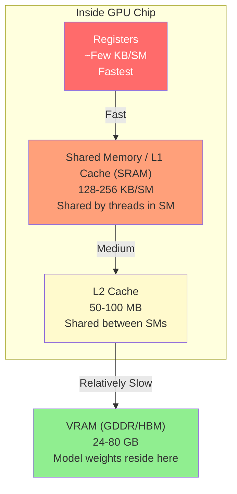
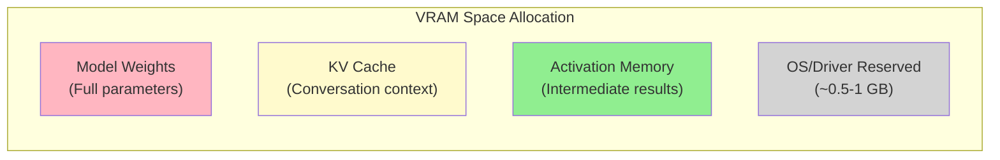
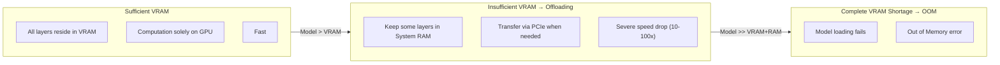

> This document is a supplement to Section 7, "Hardware Configuration," of [How LLMs Work: A Guide for Game Developers](/posts/llm-guide/).

---

## 1. GPU Memory Hierarchy

### Analogy with the Game Rendering Pipeline

For game developers, the GPU memory hierarchy is familiar. Just as a shader accesses VRAM through a texture cache when sampling a texture, LLM inference goes through the same memory hierarchy. The only difference is that the data being accessed are **float values of weight matrices** instead of texture pixels.

### Hierarchy Structure

```
Registers
│  Capacity: ~Few KB/SM  |  Bandwidth: Max  |  Latency: Min (~1 cycle)
│  Role: Holds values currently being computed
▼
Shared Memory / L1 Cache (SRAM)
│  Capacity: 128-256 KB/SM  |  Bandwidth: ~Tens of TB/s  |  Latency: ~Tens of cycles
│  Role: Data sharing between threads within an SM (Streaming Multiprocessor)
│  Game Analogy: groupshared memory in a shader
▼
L2 Cache
│  Capacity: 50-100 MB (Entire chip)  |  Bandwidth: ~Few TB/s  |  Latency: ~Hundreds of cycles
│  Role: Caching shared data between SMs
│  Game Analogy: Texture cache
▼
VRAM (GDDR / HBM)
   Capacity: 24-80 GB  |  Bandwidth: ~1-3 TB/s (GDDR7 - HBM3e)  |  Latency: ~Hundreds of cycles
   Role: Storage for model weights, KV cache, activation data
   Game Analogy: GPU memory where textures/meshes/framebuffers reside
```

### Mermaid Diagram



### Role of Each Layer (LLM Inference Focus)

| Layer | Capacity | Bandwidth | Role in LLMs | Game Rendering Analogy |
|------|------|--------|--------------|----------------|
| **Registers** | ~Few KB/SM | Max | Operands for current matrix multiplication | Shader variables |
| **SRAM (L1/Shared)** | 128-256 KB/SM | ~Tens of TB/s | Intermediate results of Attention tiling (Core of FlashAttention) | groupshared memory |
| **L2 Cache** | 50-100 MB | ~Few TB/s | Caching frequently accessed weights/KV cache | Texture cache |
| **VRAM (GDDR/HBM)** | 24-80 GB | ~1-3 TB/s | Stores full model weights, KV cache, activations | Textures/Framebuffers |

<div class="chart-wrapper">
  <div class="chart-title">GPU Memory Hierarchy — Bandwidth Comparison by Layer (Approximate, Log Scale)</div>
  <canvas id="memHierarchyChart" class="chart-canvas" height="200"></canvas>
</div>

<script>
window.chartConfigs = window.chartConfigs || [];
window.chartConfigs.push({
  id: 'memHierarchyChart',
  type: 'bar',
  data: {
    labels: ['Registers', 'SRAM (L1/Shared)', 'L2 Cache', 'VRAM (GDDR/HBM)'],
    datasets: [
      {
        label: 'Bandwidth (Relative Index)',
        data: [100000, 10000, 1000, 100],
        backgroundColor: [
          'rgba(231, 76, 60, 0.75)',
          'rgba(230, 126, 34, 0.75)',
          'rgba(241, 196, 15, 0.75)',
          'rgba(39, 174, 96, 0.75)'
        ],
        borderColor: [
          'rgba(231, 76, 60, 1)',
          'rgba(230, 126, 34, 1)',
          'rgba(241, 196, 15, 1)',
          'rgba(39, 174, 96, 1)'
        ],
        borderWidth: 1
      }
    ]
  },
  options: {
    plugins: {
      legend: { display: false },
      tooltip: {
        callbacks: {
          label: function(ctx) {
            var desc = ['Fastest (~Tens of PB/s class)', 'Tens of TB/s', 'Few TB/s', '~1-3 TB/s (HBM3e)'];
            return desc[ctx.dataIndex];
          }
        }
      }
    },
    scales: {
      y: {
        type: 'logarithmic',
        title: { display: true, text: 'Relative Bandwidth (Log Scale, Higher is Faster)' }
      }
    }
  }
});
</script>

### Why the Memory Hierarchy Matters: The Memory-bound Problem

The core bottleneck of LLM inference is **not computation speed, but memory bandwidth**. The GPU's computation units (Tensor Cores) can process data extremely quickly once it arrives, but the speed of reading data from VRAM cannot keep up with the computation. This is called a **Memory-bound** state.

In game terms, this is like a situation where the shader code itself is simple, but texture sampling becomes the bottleneck, resulting in low GPU occupancy.

```
Compute Power:  ████████████████████ (1,000+ TFLOPS)
VRAM Bandwidth: ████████░░░░░░░░░░░░ (~3 TB/s)
                             ↑ Bottleneck here!
```

The FlashAttention series (v1-v4) solves this exact problem. It minimizes VRAM access and completes computations within SRAM (shared memory) as much as possible to bypass the VRAM bandwidth bottleneck.

---

## 2. VRAM Capacity and Model Loading in Practice

### What Goes into VRAM

Three main elements occupy VRAM during LLM inference:



### (1) Model Weights

This is the entirety of the parameters after training. They are loaded into VRAM once and remain there until the server is shut down.

**Calculation Formula:**

```
Weight Memory = Parameter Count × Precision Bytes

Example: Llama 3.1 70B (FP16)
= 70,000,000,000 × 2 bytes
= 140,000,000,000 bytes
= 140 GB
```

| Model | Parameters | FP16 | INT8 (Quantized) | INT4 (Quantized) |
|------|---------|------|-------------|-------------|
| Llama 3.2 3B | 3B | 6 GB | 3 GB | 1.5 GB |
| Llama 3.1 8B | 8B | 16 GB | 8 GB | 4 GB |
| Llama 3.1 70B | 70B | 140 GB | 70 GB | 35 GB |
| DeepSeek-V3 | 671B (MoE, 37B Active) | ~1,342 GB* | ~671 GB* | ~336 GB* |

<div class="code-compare">
  <div class="code-compare-pane">
    <div class="code-compare-label label-before">FP16 Full Precision Load</div>
    <div class="highlight">
<pre><code class="language-python"># Llama 3.1 8B = Requires 16 GB VRAM
# Barely possible on RTX 4090 (24GB)
from transformers import AutoModelForCausalLM

model = AutoModelForCausalLM.from_pretrained(
    "meta-llama/Llama-3.1-8B",
    torch_dtype=torch.float16,
    device_map="auto"
)
# VRAM: ~16 GB
# Quality: Best (Original precision)</code></pre>
    </div>
  </div>
  <div class="code-compare-pane">
    <div class="code-compare-label label-after">INT4 Quantized Load (bitsandbytes)</div>
    <div class="highlight">
<pre><code class="language-python"># Llama 3.1 8B = Reduced to 4 GB VRAM!
# Can run even on RTX 3060 (12GB)
from transformers import (
    AutoModelForCausalLM, BitsAndBytesConfig
)

bnb_config = BitsAndBytesConfig(
    load_in_4bit=True,
    bnb_4bit_compute_dtype=torch.bfloat16
)
model = AutoModelForCausalLM.from_pretrained(
    "meta-llama/Llama-3.1-8B",
    quantization_config=bnb_config,
    device_map="auto"
)
# VRAM: ~4 GB (75% savings)
# Quality: Slight loss compared to FP16</code></pre>
    </div>
  </div>
</div>

*Since MoE models require all Expert weights to reside in VRAM, **memory requirements are calculated based on the total parameters (671B)**. However, since only active parameters (37B) are used for actual per-token computation, the **inference speed (compute cost)** is comparable to a Dense model of similar scale (~37B).

### (2) KV Cache (Key-Value Cache)

This is the cache where the Transformer stores information from previous tokens. **It grows as the conversation gets longer.**

**Calculation Formula:**

```
KV Cache Memory = 2 × Layer Count × KV Head Count × Head Dim × Sequence Length × Batch Size × Precision Bytes

* Models using GQA/MQA have fewer KV heads than Query heads, significantly reducing KV cache size.

Example: Llama 3.1 70B (GQA: 8 KV heads, Head Dim 128), 4096 tokens, Batch size 1 (FP16)
= 2 × 80 × 8 × 128 × 4096 × 1 × 2 bytes
≈ 1.25 GB
```

KV cache is **dynamic**. It continues to grow as the conversation with the user lengthens and can reach tens of GBs if the entire context window (e.g., 128K tokens) is used.

| Context Length | KV Cache (70B, GQA, FP16) | Notes |
|-------------|------------------------|------|
| 2,048 tokens | ~0.6 GB | Short conversation |
| 8,192 tokens | ~2.5 GB | General conversation |
| 32,768 tokens | ~10 GB | Long document analysis |
| 128,000 tokens | ~39 GB | Full context window |

This is why techniques like **GQA (Grouped Query Attention)** and **MQA (Multi-Query Attention)** are important. They reduce memory by decreasing the number of Key/Value heads in the KV cache.

### (3) Activation Memory

This consists of the intermediate computation results of each layer during the forward pass. While smaller than training, it increases proportionally with the batch size.

Generally, activation memory during inference is relatively small (on the order of a few GBs) compared to weights or the KV cache, making up a low percentage of the total VRAM budget.

### Example VRAM Requirement Calculation

```
Llama 3.1 70B (INT4 Quantized, 8K Context, Batch 1):

Weights:       35 GB (INT4)
KV Cache:      ~1.3 GB (INT8 KV Quantization + GQA applied)
Activations:   ~2 GB
OS/Driver:     ~1 GB
─────────────────────
Total Needed:  ~39.3 GB

→ NVIDIA A100 80GB: Plenty of room
→ NVIDIA RTX 4090 24GB: Insufficient → requires offloading
→ Mac M4 Max 64GB (UMA): Possible (but speed is slower)
```

### When VRAM is Insufficient: Offloading

What happens if the entire model doesn't fit in VRAM?



**Why performance drops so drastically during offloading:**

```
VRAM (HBM3e) Bandwidth:  ~3,000 GB/s
PCIe 5.0 Bandwidth:       ~64 GB/s   ← Approximately 47x slower
```

In game terms, this is like a situation in texture streaming where VRAM is so insufficient that textures must be uploaded from system RAM every frame. Just as frame drops would be severe, LLM inference speed falls off a cliff.

### Practical GPU Selection Guide

| Model Scale | Recommended Min VRAM | Recommended GPU | Notes |
|----------|--------------|---------|------|
| ~3B (INT4) | 4 GB | Integrated GPU, Mobile NPU | Simple local execution possible |
| ~8B (INT4) | 6 GB | RTX 3060 12GB, M4 16GB | General-purpose assistant level |
| ~13B (INT4) | 10 GB | RTX 4070 12GB, M4 Pro 24GB | Practical local model |
| ~34B (INT4) | 20 GB | RTX 4090 24GB, M4 Max 36GB | Semi-professional level |
| ~70B (INT4) | 40 GB | A100 80GB, M4 Max 64GB | Professional analysis level |
| ~200B+ (INT4) | 128 GB+ | Multi-GPU, Mac Studio Ultra | Large models, research |

---

## Summary

```
VRAM = LLM's Work Desk
├── The wider the desk (more VRAM) → The larger the models you can load
├── Distance from the desk to hands (Bandwidth) → Determines computation speed
├── If the desk is narrow (VRAM shortage) → Putting items on the floor and walking back and forth (offloading) → Slows down
└── Quantization = Swapping books for summarized versions to save desk space
```

**Key Points:**
1. LLM inference is **Memory-bound** — memory bandwidth is the bottleneck rather than compute speed.
2. VRAM stores weights + KV cache + activations — the KV cache grows as the conversation lengthens.
3. If VRAM is insufficient, speed drops 10-100x due to offloading — reducing weight size through quantization is a key strategy.
4. FlashAttention is a technique that bypasses Memory-bound bottlenecks by minimizing VRAM access.

---

*This document is a supplement to Section 7, "Hardware Configuration," of [How LLMs Work: A Guide for Game Developers](/posts/llm-guide/).*
