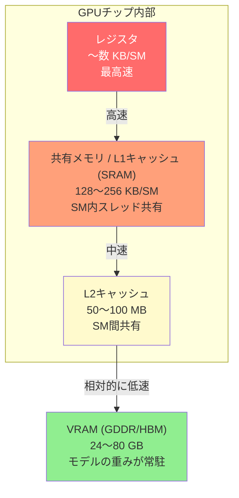
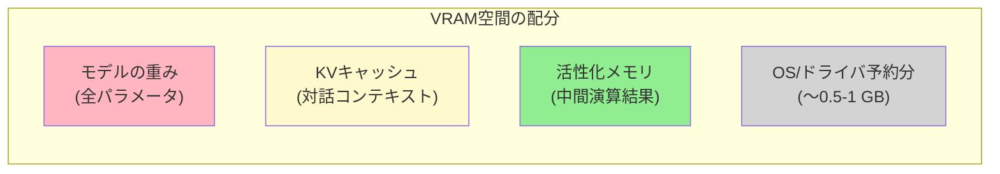
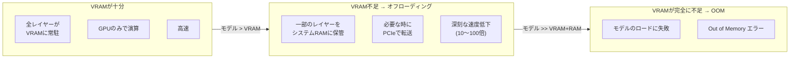

> このドキュメントは、「[LLMの仕組み - ゲーム開発者のためのガイド](/posts/llm-guide/)」のセクション7「ハードウェア構成」を補足する資料です。

---

## 1. GPUメモリ階層構造

### ゲームレンダリングパイプラインとの比較

ゲーム開発者にとって、GPUのメモリ階層は馴染み深いものです。シェーダーがテクスチャをサンプリングする際、テクスチャキャッシュを経由してVRAMにアクセスするように、LLMの推論も同じメモリ階層を辿ります。唯一の違いは、アクセスするデータがテクスチャのピクセルではなく、**重み行列の float 値**であるという点だけです。

### 階層構造

```
レジスタ (Registers)
│  容量：〜数 KB/SM  |  帯域幅：最大  |  遅延：最小 (〜1 cycle)
│  役割：現在演算中の値を保持
▼
共有メモリ / L1キャッシュ (SRAM)
│  容量：128〜256 KB/SM  |  帯域幅：〜数十 TB/s  |  遅延：〜数十 cycle
│  役割：SM (Streaming Multiprocessor) 内のスレッド間データ共有
│  ゲームでの例え：シェーダーの groupshared メモリ
▼
L2キャッシュ
│  容量：50〜100 MB (チップ全体)  |  帯域幅：〜数 TB/s  |  遅延：〜数百 cycle
│  役割：SM 間の共有データのキャッシング
│  ゲームでの例え：テクスチャキャッシュ
▼
VRAM (GDDR / HBM)
   容量：24〜80 GB  |  帯域幅：〜1〜3 TB/s (GDDR7 〜 HBM3e)  |  遅延：〜数百 cycle
   役割：モデルの重み、KVキャッシュ、活性化データの保存
   ゲームでの例え：テクスチャ/メッシュ/フレームバッファが配置されるGPUメモリ
```

### Mermaid ダイアグラム



### 各階層の役割（LLM推論基準）

| 階層 | 容量 | 帯域幅 | LLMでの役割 | ゲームレンダリングでの例え |
|------|------|--------|--------------|----------------|
| **レジスタ** | 〜数 KB/SM | 最大 | 現在の行列積のオペランド | シェーダー変数 |
| **SRAM (L1/共有)** | 128〜256 KB/SM | 〜数十 TB/s | Attention タイリング演算の中間結果 (FlashAttention の核心) | groupshared メモリ |
| **L2キャッシュ** | 50〜100 MB | 〜数 TB/s | 頻繁にアクセスする重み/KVキャッシュのキャッシュ | テクスチャキャッシュ |
| **VRAM (GDDR/HBM)** | 24〜80 GB | 〜1〜3 TB/s | モデル全体の重み、KVキャッシュ、活性化データの保存 | テクスチャ/フレームバッファ |

<div class="chart-wrapper">
  <div class="chart-title">GPUメモリ階層 — 階層別帯域幅の比較（概算、対数スケール適用）</div>
  <canvas id="memHierarchyChart" class="chart-canvas" height="200"></canvas>
</div>

<script>
window.chartConfigs = window.chartConfigs || [];
window.chartConfigs.push({
  id: 'memHierarchyChart',
  type: 'bar',
  data: {
    labels: ['レジスタ', 'SRAM (L1/共有)', 'L2キャッシュ', 'VRAM (GDDR/HBM)'],
    datasets: [
      {
        label: '帯域幅（相対指数）',
        data: [100000, 10000, 1000, 100],
        backgroundColor: [
          'rgba(231, 76, 60, 0.75)',
          'rgba(230, 126, 34, 0.75)',
          'rgba(241, 196, 15, 0.75)',
          'rgba(39, 174, 96, 0.75)'
        ],
        borderColor: [
          'rgba(231, 76, 60, 1)',
          'rgba(230, 126, 34, 1)',
          'rgba(241, 196, 15, 1)',
          'rgba(39, 174, 96, 1)'
        ],
        borderWidth: 1
      }
    ]
  },
  options: {
    plugins: {
      legend: { display: false },
      tooltip: {
        callbacks: {
          label: function(ctx) {
            var desc = ['最高速 (〜数十 PB/s級)', '数十 TB/s', '数 TB/s', '〜1〜3 TB/s (HBM3e)'];
            return desc[ctx.dataIndex];
          }
        }
      }
    },
    scales: {
      y: {
        type: 'logarithmic',
        title: { display: true, text: '相対帯域幅（対数スケール、高いほど高速）' }
      }
    }
  }
});
</script>

### なぜメモリ階層が重要なのか：Memory-bound 問題

LLM推論における最大のボトルネックは、**演算速度ではなくメモリ帯域幅**です。GPUの演算ユニット（Tensorコア）は、データが届きさえすれば極めて高速に処理できますが、VRAMからデータを読み出す速度が演算に追いつきません。これを **Memory-bound** な状態と呼びます。

ゲームに例えると、シェーダーコード自体は単純なのに、テクスチャのサンプリングがボトルネックになってGPUの占有率（occupancy）が上がらない状況と同じです。

```
演算能力：  ████████████████████ (1,000+ TFLOPS)
VRAM帯域幅： ████████░░░░░░░░░░░░ (〜3 TB/s)
                             ↑ ここがボトルネック！
```

FlashAttention シリーズ（v1〜v4）は、まさにこの問題を解決するための手法です。VRAMへのアクセスを最小限に抑え、可能な限り SRAM（共有メモリ）内で演算を完結させることで、VRAM帯域幅のボトルネックを回避します。

---

## 2. VRAM容量とモデルロードの実務

### VRAMに配置されるもの

LLMの推論時にVRAMを占有する要素は、大きく分けて3つあります。



### (1) モデルの重み (Model Weights)

学習済みの全パラメータです。モデルがロードされる際に一度配置され、サーバーが終了するまで常駐します。

**計算式：**

```
重みメモリ = パラメータ数 × 精度（バイト）

例：Llama 3.1 70B (FP16)
= 70,000,000,000 × 2 bytes
= 140,000,000,000 bytes
= 140 GB
```

| モデル | パラメータ | FP16 | INT8 (量子化) | INT4 (量子化) |
|------|---------|------|-------------|-------------|
| Llama 3.2 3B | 3B | 6 GB | 3 GB | 1.5 GB |
| Llama 3.1 8B | 8B | 16 GB | 8 GB | 4 GB |
| Llama 3.1 70B | 70B | 140 GB | 70 GB | 35 GB |
| DeepSeek-V3 | 671B (MoE, 活性 37B) | 〜1,342 GB* | 〜671 GB* | 〜336 GB* |

<div class="code-compare">
  <div class="code-compare-pane">
    <div class="code-compare-label label-before">FP16 フル精度ロード</div>
    <div class="highlight">
<pre><code class="language-python"># Llama 3.1 8B = 16 GB の VRAM が必要
# RTX 4090 (24GB) なら辛うじて可能
from transformers import AutoModelForCausalLM

model = AutoModelForCausalLM.from_pretrained(
    "meta-llama/Llama-3.1-8B",
    torch_dtype=torch.float16,
    device_map="auto"
)
# VRAM: 〜16 GB
# 品質：最高 (オリジナル精度)</code></pre>
    </div>
  </div>
  <div class="code-compare-pane">
    <div class="code-compare-label label-after">INT4 量子化ロード (bitsandbytes)</div>
    <div class="highlight">
<pre><code class="language-python"># Llama 3.1 8B = 4 GB VRAM まで縮小！
# RTX 3060 (12GB) でも実行可能
from transformers import (
    AutoModelForCausalLM, BitsAndBytesConfig
)

bnb_config = BitsAndBytesConfig(
    load_in_4bit=True,
    bnb_4bit_compute_dtype=torch.bfloat16
)
model = AutoModelForCausalLM.from_pretrained(
    "meta-llama/Llama-3.1-8B",
    quantization_config=bnb_config,
    device_map="auto"
)
# VRAM: 〜4 GB (75% 削減)
# 品質：FP16 と比較してわずかに劣化</code></pre>
    </div>
  </div>
</div>

*MoE モデルは、全エキスパート（Expert）の重みがVRAMに常駐する必要があるため、**メモリ要求量は全パラメータ（671B）基準**で計算します。ただし、トークンごとの実際の演算には活性パラメータ（37B）のみが使用されるため、**推論速度（演算コスト）**は同規模の Dense モデル（〜37B）と同等になります。

### (2) KVキャッシュ (Key-Value Cache)

Transformerが以前のトークンの情報を保存するためのキャッシュです。**対話が長くなるほど大きくなります。**

**計算式：**

```
KVキャッシュメモリ = 2 × レイヤー数 × KVヘッド数 × ヘッド次元 × シーケンス長 × バッチサイズ × 精度（バイト）

※ GQA/MQA を使用するモデルは、KVヘッド数が Query ヘッド数よりも少ないため、KVキャッシュが大幅に削減されます。

例：Llama 3.1 70B (GQA: KVヘッド8個、ヘッド次元128), 4096トークン, バッチ1 (FP16)
= 2 × 80 × 8 × 128 × 4096 × 1 × 2 bytes
≈ 1.25 GB
```

KVキャッシュは**動的**です。ユーザーとの会話が長くなるほど成長し続け、コンテキストウィンドウ全体（128Kトークンなど）を使用すると数十GBに達することもあります。

| コンテキスト長 | KVキャッシュ (70B, GQA, FP16) | 備考 |
|-------------|------------------------|------|
| 2,048トークン | 〜0.6 GB | 短い対話 |
| 8,192トークン | 〜2.5 GB | 一般的な対話 |
| 32,768トークン | 〜10 GB | 長いドキュメントの分析 |
| 128,000トークン | 〜39 GB | 全コンテキストウィンドウ |

これが、**GQA (Grouped Query Attention)** や **MQA (Multi-Query Attention)** といった手法が重要な理由です。KVキャッシュの Key/Value ヘッド数を減らすことでメモリを節約します。

### (3) 活性化メモリ (Activation Memory)

順伝播（forward pass）中の各レイヤーの中間演算結果です。推論では学習時よりも少なくなりますが、バッチサイズに比例して増加します。

一般的に、推論時の活性化メモリは重みやKVキャッシュに比べて相対的に小さく（数GB程度）、VRAM予算全体に占める割合は低いです。

### VRAM総要求量の計算例

```
Llama 3.1 70B (INT4量子化, 8Kコンテキスト, バッチ1):

重み：          35 GB (INT4)
KVキャッシュ：   〜1.3 GB (INT8 KV量子化 + GQA適用)
活性化メモリ：   〜2 GB
OS/ドライバ：    〜1 GB
─────────────────────
合計必要量：     〜39.3 GB

→ NVIDIA A100 80GB: 余裕あり
→ NVIDIA RTX 4090 24GB: 不足 → オフローディング（offloading）が必要
→ Mac M4 Max 64GB (UMA): 可能（ただし速度は低下）
```

### VRAMが不足する場合：オフローディング (Offloading)

VRAMにモデルが収まりきらない場合、どうなるでしょうか。



**オフローディング時にパフォーマンスが激減する理由：**

```
VRAM (HBM3e) 帯域幅：  〜3,000 GB/s
PCIe 5.0 帯域幅：       〜64 GB/s   ← 約47倍遅い
```

ゲームに例えると、テクスチャストリーミングにおいてVRAMが不足し、毎フレームシステムRAMからテクスチャを読み込まなければならない状況です。フレームドロップが深刻になるように、LLMの推論速度も急落します。

### 実践的なGPU選択ガイド

| モデル規模 | 推奨最小VRAM | 推奨GPU | 備考 |
|----------|--------------|---------|------|
| 〜3B (INT4) | 4 GB | 内蔵GPU, モバイルNPU | 簡単なローカル実行が可能 |
| 〜8B (INT4) | 6 GB | RTX 3060 12GB, M4 16GB | 汎用アシスタント級 |
| 〜13B (INT4) | 10 GB | RTX 4070 12GB, M4 Pro 24GB | 実用的なローカルモデル |
| 〜34B (INT4) | 20 GB | RTX 4090 24GB, M4 Max 36GB | 準専門家レベル |
| 〜70B (INT4) | 40 GB | A100 80GB, M4 Max 64GB | 専門的な分析レベル |
| 〜200B+ (INT4) | 128 GB+ | マルチGPU, Mac Studio Ultra | 巨大モデル、研究用 |

---

## まとめ

```
VRAM = LLMの作業机
├── 机が広いほど (VRAMが多いほど) → 大きなモデルを置ける
├── 机から手までの距離 (帯域幅) → 演算速度を決定
├── 机が狭いと (VRAM不足) → 床に置いて往復する (offloading) → 遅くなる
└── 量子化 = 本を要約版に替えて机のスペースを節約すること
```

**核心的なポイント：**
1. LLMの推論は **Memory-bound** である。演算速度よりもメモリ帯域幅がボトルネックとなる。
2. VRAMには、重み ＋ KVキャッシュ ＋ 活性化データが配置される。対話が長くなるとKVキャッシュが肥大化する。
3. VRAMが不足するとオフローディングにより10〜100倍遅くなる。量子化で重みのサイズを抑えるのが基本戦略。
4. FlashAttention は、VRAMへのアクセスを最小化することで Memory-bound のボトルネックを回避する技術である。

---

*このドキュメントは、「[LLMの仕組み - ゲーム開発者のためのガイド](/posts/llm-guide/)」のセクション7「ハードウェア構成」を補足する資料です。*
