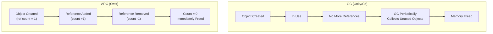
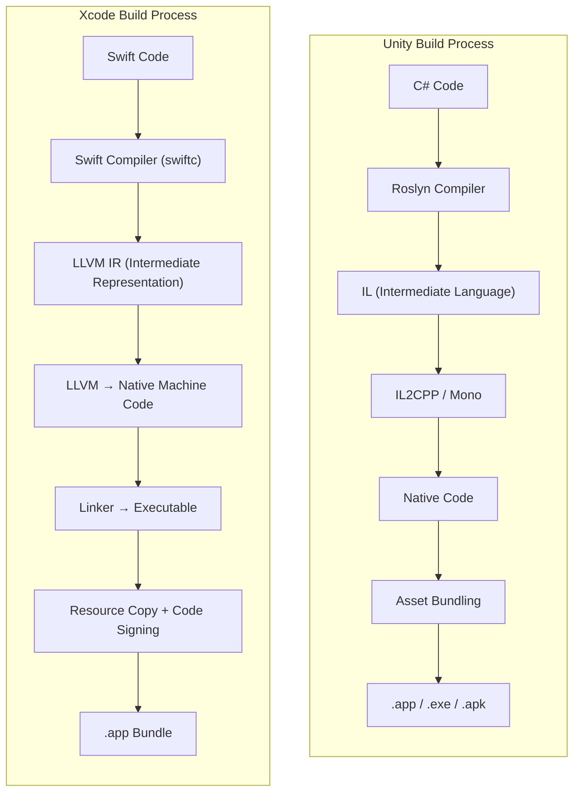
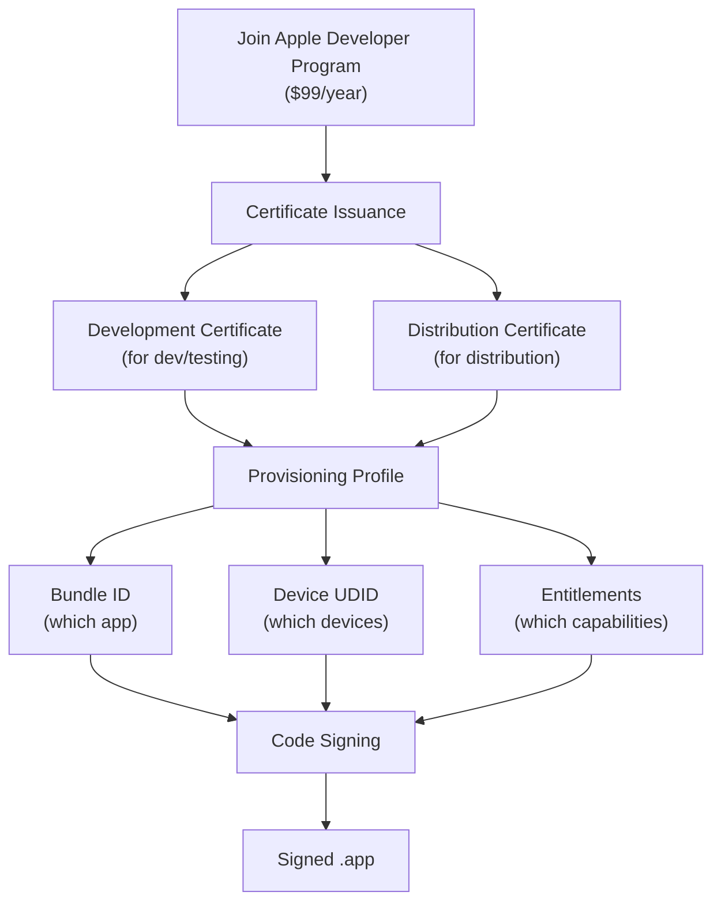
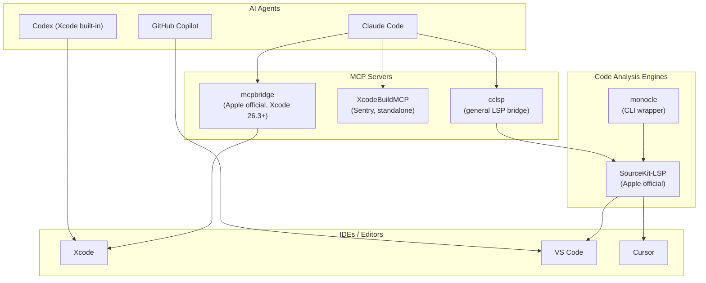

## Introduction

For game developers, "native app development" is somewhat unfamiliar territory. When someone who's been making games with C# or C++ in Unity or Unreal suddenly decides to build macOS/iOS apps with Swift and Xcode — frankly, the barrier to entry is no joke.

But the situation in 2026 is different. **The era where AI coding tools dramatically lower the language barrier** has arrived.

I was developing mobile games with Unity when I started a side project — a macOS native app (CozyDesk, a menu bar white noise app). My Swift experience was zero. But with Claude Code by my side, I could instantly get answers to questions like "How do I write this C# code in Swift?" Paste an error message, and it analyzes the cause. It summarizes Apple's vast framework documentation, and guides you step by step through Apple-specific concepts like code signing.

This article is a compilation of **everything a Unity C# developer needs to know when transitioning to Swift & Xcode**. Rather than a simple syntax comparison, it explains by mapping Swift concepts to "concepts already in a game developer's head." Just as understanding a game engine's internal structure enables better optimization, understanding the Apple platform's structure enables better apps.

---

## Part 1: The Swift Language — Essentials for Developers Coming from C#

### 1-1. Mapping the Two Worlds

Let's start with the big picture. Mapping familiar Unity world concepts to their Apple native world equivalents creates a mental map.

| Concept | Unity World | Apple Native World |
|---------|------------|-------------------|
| Programming Language | C# | **Swift** |
| IDE | Visual Studio / Rider | **Xcode** |
| Engine/Framework | Unity Engine | **SwiftUI**, **UIKit**, **SpriteKit**, **SceneKit**, etc. |
| Project Files | `.unity`, `.csproj` | **`.xcodeproj`** / `.xcworkspace` |
| Package Manager | Unity Package Manager | **Swift Package Manager (SPM)** |
| Build Output | `.exe`, `.app`, `.apk` | **`.app` bundle** |
| Store Distribution | Steam, Google Play, etc. | **App Store** (Apple exclusive) |
| Live Preview | Play Mode | **Xcode Previews** |

> **Note**: CocoaPods and Carthage also exist as package managers, but as of 2026, **Swift Package Manager (SPM)** has become the de facto standard. Apple officially supports it, and it's fully integrated into Xcode. There's almost no reason to choose CocoaPods for new projects.

### 1-2. Swift Core Syntax

Swift is a language created by Apple in 2014, and it's **effectively the only choice for Apple platform app development**. The good news for C# developers — the syntax is quite similar.

```swift
// Type inference — similar to C#'s var
let name = "CozyDesk"          // immutable (closer to C#'s readonly)
var volume: Float = 0.7        // mutable

// Optionals — null safety enforced at the language level
var player: AVAudioPlayerNode? = nil   // ? explicitly marks it can be nil
player?.play()                          // does nothing if nil (safe call)
player!.play()                          // crashes if nil (force unwrap)

// Enums are very powerful — associated values, methods, protocol adoption
enum SoundType: String, CaseIterable {
    case rain = "rain"
    case fireplace = "fireplace"

    var icon: String {
        switch self {
        case .rain: return "cloud.rain.fill"
        case .fireplace: return "flame.fill"
        }
    }
}

// Struct vs Class
struct Position { var x: Float; var y: Float }  // value type (copied)
class GameManager { var score: Int = 0 }        // reference type (shared)

// Protocol — same concept as C#'s interface
protocol Playable {
    func play()
    func stop()
}

// Closure — same as C#'s lambda/Action
let onComplete: () -> Void = { print("Done") }
```

What C# developers find most awkward is the difference in meaning between `let`/`var`. **In C#, `var` means type inference**, but **in Swift, `var` means "mutable"**. Swift's `let` is closer to C#'s `readonly` — once assigned, it cannot be changed. In Swift, the convention is to use `let` by default and only use `var` when mutation is needed.

### 1-3. Key Differences from C#

| Item | C# (Unity) | Swift |
|------|-----------|-------|
| Null Safety | Nullable reference types (optional) | **Optional system (enforced)** |
| Value Types | `struct` used sparingly | **struct is default, class only when needed** |
| Inheritance | class-based inheritance focused | **Protocol-Oriented Programming** preferred |
| Memory Management | GC (Garbage Collector) | **ARC (Automatic Reference Counting)** |
| Access Control | `public`, `private`, `internal`, etc. | `open`, `public`, `internal`, `fileprivate`, `private` |
| async/await | C# 5.0+ (2012) | Swift 5.5+ (2021), nearly identical syntax |
| Concurrency Safety | Developer responsibility | **Swift 6: Compile-time Data Race Safety** |
| Error Handling | try-catch + Exception | `do`-`try`-`catch` + **typed throws (Swift 6)** |

#### Value Type First Philosophy

In Unity C#, `class` is used by default, and `struct` is chosen when performance matters. Swift is **the exact opposite**. `struct` is the default, and `class` is used only when reference semantics are needed.

Swift's standard library `Array`, `Dictionary`, and `String` are all `struct` (value types). Combined with Copy-on-Write optimization, they're both safe and performant. To use an analogy familiar to Unity developers — just as `Vector3` is a struct, in Swift, almost everything is a struct.

#### Optionals — Farewell to Null Crashes

One of the most common runtime errors in Unity development is `NullReferenceException`. Swift's optional system catches this problem **at compile time**.

```swift
// Swift — nil possibility is enforced by the type system
var player: AudioPlayer? = nil

// ❌ Compile error: Cannot use Optional directly
// player.play()

// ✅ Safe access methods
player?.play()                    // ignored if nil (Optional Chaining)
player!.play()                    // crashes if nil (Force Unwrap — not recommended)

if let p = player {               // executes only when not nil (Optional Binding)
    p.play()
}

guard let p = player else {       // early return if nil (Guard)
    return
}
p.play()
```

C#'s Nullable Reference Types (`string?`) serve a similar role, but they're a **warning level that's optionally enabled**. In Swift, this is **built into the core of the language and enforced**. It feels cumbersome at first, but runtime null crashes virtually disappear.

### 1-4. Memory Management: GC vs ARC

The memory management approaches in Unity (C#) and Swift are fundamentally different. Understanding this difference is the most important first step in Swift development.



| Characteristic | GC (Unity/C#) | ARC (Swift) |
|---------------|--------------|-------------|
| Deallocation Timing | GC collects eventually (unpredictable) | Immediately when reference count reaches 0 |
| Performance Impact | GC Spike → Causes **frame drops** | Almost no overhead |
| Developer Burden | Low (GC handles it) | Must watch for retain cycles |
| Unity Analogy | `System.GC.Collect()` | Similar to calling `Destroy()` immediately |

For game developers, GC spikes are a longtime headache. Especially in mobile games, when GC runs, frames stutter. That's why patterns like object pooling are used. Swift's ARC **fundamentally eliminates this problem**. Memory is freed the instant the reference count reaches 0, so unpredictable delays don't occur.

#### Retain Cycles — A Pitfall That Doesn't Exist in Unity

ARC's only weakness is **retain cycles**. When two objects hold strong references to each other, neither's reference count reaches 0, and they're never freed.

Below are diagrams from Apple's official Swift Book showing ARC. When two instances hold strong references to each other, a cycle occurs:


_When two instances hold strong references to each other, a retain cycle occurs (Source: [The Swift Programming Language](https://docs.swift.org/swift-book/documentation/the-swift-programming-language/automaticreferencecounting/), CC BY 4.0)_

Even when variables are set to `nil`, the strong references between instances remain, preventing memory deallocation:


_Even when variables are set to nil, strong references between instances remain, preventing deallocation (Source: The Swift Programming Language, CC BY 4.0)_

The solution is to make one side a **weak** reference:


_Declaring one side as weak breaks the retain cycle (Source: The Swift Programming Language, CC BY 4.0)_

```swift
// ⚠️ Retain cycle
class Scene {
    var manager: SoundManager?   // strong reference
}
class SoundManager {
    var scene: Scene?             // strong reference → cycle!
}

// ✅ Fixed with weak
class SoundManager {
    weak var scene: Scene?        // weak reference → cycle prevented
}
```

In Unity C#, the GC handles retain cycles too, so this isn't a concern. In Swift, you need to appropriately use `weak` (weak references) and `unowned` (unowned references). Be especially careful about retain cycles **when capturing self in closures**.


_When a closure captures self strongly, a retain cycle occurs between the instance and the closure (Source: The Swift Programming Language, CC BY 4.0)_

Using `[unowned self]` or `[weak self]` in the capture list breaks the cycle:


_Specifying unowned/weak in the capture list prevents retain cycles (Source: The Swift Programming Language, CC BY 4.0)_

```swift
// ⚠️ Retain cycle in closures (most common mistake)
class SoundPlayer {
    var onComplete: (() -> Void)?

    func setup() {
        onComplete = {
            self.reset()  // strong capture of self → retain cycle!
        }
    }
}

// ✅ Fixed with capture list
func setup() {
    onComplete = { [weak self] in
        self?.reset()     // weak capture → safe
    }
}
```

### 1-5. Swift 6 Changes — Strict Concurrency

Swift 6 (released September 2024) brought the biggest change in Swift's history. The ability to **prevent data races at compile time** was added.

In Unity development, multithreading has always been a dangerous territory. Unless using the `Job System` or `Burst Compiler`, most work is done on the main thread, and threads are used only when necessary and with great care. Swift 6 makes the **compiler enforce** this "carefulness."

```swift
// Swift 6 — Thread-safe state management with Actor
actor SoundEngine {
    private var players: [String: AudioPlayer] = [:]

    func addPlayer(_ name: String, player: AudioPlayer) {
        players[name] = player  // Automatically serialized inside Actor
    }

    func getPlayer(_ name: String) -> AudioPlayer? {
        return players[name]
    }
}

// await is required when accessing from outside
let engine = SoundEngine()
await engine.addPlayer("rain", player: rainPlayer)
```

`actor` is conceptually similar to the data access restrictions that Unity's `[BurstCompile]` imposes. It binds specific data to a specific execution context, preventing concurrent access entirely. The difference is that Unity's Burst applies only to specific systems, while Swift 6's Sendable/Actor system applies to the **entire codebase**.

> **Practical Advice**: Swift 6's strict concurrency can generate many warnings/errors when applied to existing Swift code. For new projects, start in Swift 6 mode from the beginning; for existing projects, gradual migration is more realistic.

---

## Part 2: Xcode Project Structure

### 2-1. What Project Files Really Are

Just like Unity's `.unity` scene files or `Library/` folder, Xcode also manages project metadata in files.

```
MyApp.xcodeproj/              ← Similar role to Unity's Library/ folder
├── project.pbxproj           ← The core! All file references, build settings, target info
├── project.xcworkspace/      ← Workspace settings
│   └── contents.xcworkspacedata
└── xcuserdata/               ← Per-user IDE settings (excluded from git)
```

**`project.pbxproj`** is a Plist file that can be thousands of lines long. It records which files are included in the project, the build order, and all settings. **Never edit it directly** — use the Xcode GUI or tools like XcodeGen.

To use a Unity analogy, `project.pbxproj` is similar to combining all Unity `.meta` files into one. Just as `.meta` files store import settings and GUIDs for each asset, `pbxproj` stores file references and build settings for the entire project. And just as you don't edit `.meta` files directly, you don't touch `pbxproj` directly either.

### 2-2. XcodeGen — The Solution to Project File Management

In team projects, `project.pbxproj` becomes **merge conflict hell**. If you've experienced merge conflicts with `.unity` scene files in Unity, you know this pain.

**XcodeGen** automatically generates `.xcodeproj` from a simple YAML file (`project.yml`). Exclude `project.pbxproj` from git and manage only `project.yml`.

```yaml
# project.yml — the file humans read and write
name: CozyDesk
options:
  bundleIdPrefix: com.cozydesk
  deploymentTarget:
    macOS: "14.0"

targets:
  CozyDesk:
    type: application
    platform: macOS
    sources:
      - path: CozyDesk
    resources:
      - path: CozyDesk/Resources/Sounds
    settings:
      SWIFT_VERSION: "6.0"
```

```bash
# This single line regenerates the entire .xcodeproj
xcodegen generate
```

Unity analogy: `project.yml` is similar to Unity's `Packages/manifest.json`. Define the project declaratively and the tool handles the rest.

> **Alternative**: **Tuist** defines projects in Swift code and has strengths in modularization. For large projects, Tuist is worth considering. Using **Swift Package Manager** alone is also sufficient for simple projects.

### 2-3. Target, Scheme, Configuration

Mapping to Unity's build system terminology makes this easy to understand.

```
Target
├── Same as Unity's "Build Target"
├── A single build output (app, framework, test, etc.)
└── Example: CozyDesk (app), CozyDeskTests (tests)

Scheme
├── Similar to Unity's "Build Configuration" dropdown
├── Defines "which Target, with which Configuration, for which action (Run/Test/Profile)"
└── Example: CozyDesk → Debug → Run

Configuration
├── Similar to Unity's "Development Build" checkbox
├── Debug: no optimization, debug symbols included, asserts enabled
└── Release: optimized, debug symbols stripped, asserts disabled
```

### 2-4. Info.plist — The App's ID Card

This corresponds to Unity's **Player Settings**. It defines metadata like app name, version, and minimum OS version.

```xml
<!-- App name and version -->
<key>CFBundleName</key>
<string>CozyDesk</string>

<key>CFBundleShortVersionString</key>
<string>1.0</string>

<!-- Menu bar only app: no Dock icon -->
<key>LSUIElement</key>
<true/>
```

### 2-5. Entitlements — App Permissions

Just as you declare permissions in Android's `AndroidManifest.xml` in Unity, Apple uses **Entitlements** to declare what capabilities an app can use. The difference is that while Android allows runtime permission requests, Apple's Entitlements are **embedded in the app binary at build time**.

```xml
<!-- CozyDesk.entitlements -->
<key>com.apple.security.app-sandbox</key>
<true/>
```

Key Entitlements:

| Entitlement | Description | Unity Analogy |
|-------------|------------|--------------|
| `app-sandbox` | Security sandbox (App Store **required**) | — |
| `network.client` | Network access | `INTERNET` permission |
| `files.user-selected.read-write` | User-selected file access | File browser |
| `device.audio-input` | Microphone access | `RECORD_AUDIO` |

---

## Part 3: UI Frameworks — SwiftUI vs UIKit

### 3-1. The Relationship Between the Two Frameworks

Apple's UI frameworks are divided into two generations. Unity developers can think of it like the relationship between UGUI and UI Toolkit.

```
UIKit/AppKit (2008~)               SwiftUI (2019~)
──────────────────                  ─────────────────
Imperative                          Declarative
"Create this button,                "There's a button here,
 place it here,                      and when pressed,
 call this function on click"        this happens"

Similar to Unity UGUI               Similar to Unity UI Toolkit
Storyboard / XIB (visual editor)    UI written in code only (Preview supported)
```

As of 2026, **SwiftUI is the default for new projects**. UIKit/AppKit is used only for legacy project maintenance or the very few advanced customizations SwiftUI doesn't yet support.

### 3-2. SwiftUI Code — A Taste of Declarative

```swift
// SwiftUI — Declarative
struct ContentView: View {
    @State private var count = 0

    var body: some View {
        VStack {
            Text("Count: \(count)")
                .font(.title)
            Button("Tap") {
                count += 1
            }
        }
        .padding()
    }
}
```

In this code, when `count` changes, SwiftUI **automatically** updates the screen. Think of it as built-in data binding in Unity terms.

Let's compare:

```csharp
// Unity C# — Imperative
public class CounterUI : MonoBehaviour
{
    [SerializeField] private TMP_Text countText;
    [SerializeField] private Button tapButton;
    private int count = 0;

    void Start() {
        tapButton.onClick.AddListener(() => {
            count++;
            countText.text = $"Count: {count}";  // manually update UI
        });
    }
}
```

**The biggest difference**: Unity requires "manually updating UI when state changes," while SwiftUI "automatically updates UI when state changes."

### 3-3. Lifecycle Comparison

```
Unity MonoBehaviour          SwiftUI View
─────────────────            ─────────────
Awake()                      init()
Start()                      .onAppear { }
Update()                     — (body recalculated only when state changes)
OnDestroy()                  .onDisappear { }
OnEnable() / OnDisable()     .onChange(of:) { }

💡 Key difference:
Unity calls Update() every frame (imperative)
SwiftUI redraws views only when state changes (declarative/reactive)
```

Games need rendering every frame, making `Update()` natural, but app UI only needs to change when there's user input. This is why SwiftUI's declarative model is better suited for app development.

### 3-4. State Management System

SwiftUI's state management can be confusing at first due to the multiple Property Wrappers. Mapping to Unity concepts makes it easier to understand.

| SwiftUI | Unity Analogy | Purpose |
|---------|-------------|--------|
| `@State` | `[SerializeField] private` field | Local state within a view |
| `@Binding` | `ref` parameter | Child modifies parent's state |
| `@Observable` | `ScriptableObject` + events | Observable external data model |
| `@Environment` | `Singleton` / `ServiceLocator` | Global dependency injection |

#### @Observable — The New Standard (Swift 5.9+)

The `@Observable` macro introduced in Swift 5.9 replaces the previous `ObservableObject` + `@Published` pattern. It's much more concise and performs better.

```swift
// ✅ New approach (Swift 5.9+ / iOS 17+)
@Observable
class SoundManager {
    var volume: Float = 0.7        // automatically observable
    var isPlaying: Bool = false    // no @Published needed!
}

// ❌ Old approach (legacy — you may see this in existing code)
class SoundManager: ObservableObject {
    @Published var volume: Float = 0.7
    @Published var isPlaying: Bool = false
}
```

`@Observable` leverages Swift's macro feature. It auto-generates property change tracking code at compile time, eliminating the need to add `@Published` to each property. Additionally, SwiftUI tracks **only the properties actually used**, reducing unnecessary view re-rendering.

### 3-5. Xcode Previews — Live Preview

The feature corresponding to Unity's Play Mode is **Xcode Previews**. Save your code and the UI is instantly rendered as a preview. You can verify UI changes without building and running the app.

```swift
// Define previews with #Preview macro (Swift 5.9+)
#Preview {
    ContentView()
}

#Preview("Dark Mode") {
    ContentView()
        .preferredColorScheme(.dark)
}
```

Just as you open a scene in Unity and test by changing values in the Inspector, SwiftUI Previews lets you view multiple UI states simultaneously. You can test dark mode, multiple languages, and various device sizes in Preview, enabling rapid UI development without physical devices.

> **Tip**: Previews may break frequently at first. When Preview shows an error, `Clean Build Folder` (Cmd+Shift+K → Cmd+B) often fixes it. Same concept as "Delete Library folder" in Unity.

### 3-6. App Entry Point — @main

Just as opening a scene starts a game in Unity, a SwiftUI app starts from the struct marked with `@main`.

```swift
@main
struct CozyDeskApp: App {
    var body: some Scene {
        MenuBarExtra("CozyDesk", systemImage: "cloud.rain") {
            ContentView()
        }
        .menuBarExtraStyle(.window)
    }
}
```

In Unity terms, this code serves the role of "loading the first scene and starting the game." The `App` protocol defines the app's structure, and `Scene` defines top-level UI containers like windows or menu bar items.

---

## Part 4: Apple Framework Ecosystem

### 4-1. Framework Mapping

Just as you use various packages from Unity's Package Manager, the Apple platform has an extensive framework ecosystem. Mapping to game development concepts:

| Apple Framework | Role | Unity Equivalent |
|----------------|------|-----------------|
| **SwiftUI** | Declarative UI | UI Toolkit |
| **UIKit / AppKit** | Imperative UI (legacy) | UGUI |
| **SpriteKit** | 2D games/graphics | Unity 2D |
| **SceneKit** | 3D rendering | Unity 3D (lightweight) |
| **RealityKit** | AR/VR 3D | AR Foundation + XR |
| **Metal** | Low-level GPU | Unity shaders + SRP |
| **AVFoundation** | Audio/Video | AudioSource + VideoPlayer |
| **GameplayKit** | AI, state machines, pathfinding | NavMesh, Animator StateMachine |
| **Core Data / SwiftData** | Local DB / ORM | SQLite / PlayerPrefs |
| **Combine** | Reactive programming | UniRx |
| **Swift Concurrency** | async/await, Actor | UniTask |
| **CloudKit** | Cloud sync | Unity Cloud Save |

> **Note**: SceneKit is suitable for lightweight 3D apps, but for serious 3D games, Unity/Unreal is overwhelmingly advantageous. Unless it's a casual/utility app exclusive to Apple platforms, using a game engine instead of SpriteKit/SceneKit is more practical.

### 4-2. SpriteKit ↔ Unity 2D Comparison

SpriteKit is Apple's 2D game/graphics framework. It maps very well 1:1 with Unity 2D.

Below is the SpriteKit node hierarchy diagram from Apple's official documentation. It's the same concept as managing GameObjects with parent-child relationships in Unity's Hierarchy view:


_SpriteKit node tree — rendering order is controlled by zPosition. Same role as Unity's Sorting Layer + Order in Layer (Source: [Apple SpriteKit Programming Guide](https://developer.apple.com/library/archive/documentation/GraphicsAnimation/Conceptual/SpriteKit_PG/Nodes/Nodes.html))_

| SpriteKit | Unity 2D | Description |
|-----------|----------|------------|
| `SKScene` | `Scene` | Scene container |
| `SKSpriteNode` | `GameObject + SpriteRenderer` | Display sprites |
| `SKEmitterNode` | `ParticleSystem` | Particle effects |
| `SKAction` | DOTween / Coroutine | Animation/sequences |
| `SKCropNode` | `SpriteMask` | Masking |
| `SKShapeNode` | `LineRenderer` / primitives | Shape rendering |
| `zPosition` | `Sorting Layer + Order in Layer` | Render order |
| `didMove(to:)` | `Start()` | Scene initialization |
| `update(_:)` | `Update()` | Called every frame |

Integration between SwiftUI and SpriteKit is simple with `SpriteView`:

```swift
import SpriteKit
import SwiftUI

struct GameView: View {
    var body: some View {
        SpriteView(scene: RainScene())   // Embed SpriteKit scene in SwiftUI
            .frame(width: 300, height: 200)
    }
}
```

Just as you place a Particle System on a Canvas in Unity, you can naturally place a SpriteKit scene inside a SwiftUI view.

### 4-3. AVFoundation ↔ Unity Audio Comparison

```
Unity:                              AVFoundation:
──────                              ──────────────
AudioMixer                          AVAudioEngine
  └── AudioMixerGroup                 └── mainMixerNode
       ├── AudioSource (BGM)               ├── AVAudioPlayerNode (rain)
       ├── AudioSource (SFX)               ├── AVAudioPlayerNode (fireplace)
       └── AudioSource (Ambient)           └── AVAudioPlayerNode (cafe)

AudioClip                           AVAudioPCMBuffer / AVAudioFile
AudioSource.loop = true             .scheduleBuffer(buffer, options: .loops)
AudioSource.volume                  playerNode.volume
AudioMixer.outputVolume             mainMixerNode.outputVolume
```

Like Unity's AudioMixer, it constructs an audio graph with a node-based approach. The difference is that Unity uses a GUI (AudioMixer editor) for routing, while AVAudioEngine connects nodes **in code**.

Below is the Audio Processing Graph diagram from Apple's official documentation. Multiple audio sources pass through a Mixer to Output — the same concept as Unity AudioMixer routing:


_Audio Processing Graph — multiple input sources routed through EQ and Mixer to Output. Same concept as the node graph seen in Unity's AudioMixer editor (Source: [Apple Audio Unit Hosting Guide](https://developer.apple.com/library/archive/documentation/MusicAudio/Conceptual/AudioUnitHostingGuide_iOS/AudioUnitHostingFundamentals/AudioUnitHostingFundamentals.html))_

```swift
// AVAudioEngine node connection (building Unity AudioMixer graph in code)
let engine = AVAudioEngine()
let playerNode = AVAudioPlayerNode()

engine.attach(playerNode)
engine.connect(playerNode,
               to: engine.mainMixerNode,
               format: audioFile.processingFormat)

try engine.start()
playerNode.scheduleBuffer(buffer, options: .loops)
playerNode.play()
```

### 4-4. Languages of the Apple Platform

| Language | Purpose | Ratio (New Projects) |
|----------|---------|---------------------|
| **Swift** | App logic, UI, almost everything | **95%+** |
| **Objective-C** | Legacy code, some system API wrappers | Declining |
| **C / C++** | Performance-critical (audio, graphics, crypto) | Inside engines/libraries |
| **Metal Shading Language** | GPU shaders | Equivalent to Unity's HLSL |

#### Objective-C — The World Before Swift

```objc
// Objective-C — legacy since 1984
[[UIButton alloc] initWithFrame:CGRectMake(0, 0, 100, 50)];
[button setTitle:@"Tap" forState:UIControlStateNormal];
[button addTarget:self action:@selector(onTap)
 forControlEvents:UIControlEventTouchUpInside];
```

```swift
// Swift — same code, one line
Button("Tap") { onTap() }
```

As of 2026, there's no reason to use Objective-C for new projects. However, **you'll still frequently encounter ObjC code in Apple's official documentation and on StackOverflow**, so being able to read basic syntax is helpful. Swift and Objective-C can coexist in the same project via a Bridging Header.

#### Metal — Apple's Graphics API

```
Unity:  HLSL / ShaderLab → Unity converts per-platform → Metal / Vulkan / DX12
Native: Metal Shading Language (MSL) → Direct GPU control
```

Unity developers rarely need to work with Metal directly since Unity converts to the Metal backend automatically. But if you need **custom rendering in a native macOS/iOS app**, you'll need to use Metal directly. SpriteKit, SceneKit, and RealityKit all run on top of Metal internally.

---

## Part 5: Build, Signing, Distribution

### 5-1. Build Pipeline Comparison



### Build Stages in Detail

```
1. Compile Sources
   └─ .swift files → .o object files

2. Link Binary
   └─ .o files + frameworks → executable

3. Copy Bundle Resources
   └─ Assets.xcassets, Sounds/*.mp3, etc. → copied into .app

4. Code Sign ← A step that doesn't exist in Unity!
   └─ Sign with Apple developer certificate (prevents app tampering)

5. Result: CozyDesk.app (bundle)
   CozyDesk.app/
   ├── Contents/
   │   ├── MacOS/CozyDesk     ← executable
   │   ├── Resources/         ← resource files
   │   ├── Info.plist         ← app metadata
   │   └── _CodeSignature/    ← signing data
   └── ...
```

**Key point**: Unity goes through **two** transformations via IL2CPP: C# → C++ → native code, while Swift compiles to native code **in one step** through LLVM. This difference is why Swift apps generally have faster startup times and smaller binary sizes.

### Command Line Build

```bash
# Build without Xcode GUI (used in CI/CD)
xcodebuild -scheme CozyDesk -configuration Debug build

# Clean build (Unity's "Clean Build" button)
xcodebuild -scheme CozyDesk clean build

# Full flow with XcodeGen
xcodegen generate && xcodebuild -scheme CozyDesk build
```

### 5-2. Code Signing — The Biggest Barrier in the Apple Ecosystem

This is an Apple-specific system that doesn't exist in Unity development. It's also **the point where game developers get most frustrated with native app development**.



**Simple analogy**: Code signing is a digital seal proving that the app was "made by an Apple-certified developer and hasn't been tampered with." If the seal is missing or broken, macOS/iOS refuses to run the app.

> **Practical tip**: Enabling Xcode's **Automatic Signing** lets Xcode automatically manage certificates and provisioning profiles during development. Start with just this, and learn manual management when it's time for App Store distribution.

### 5-3. Distribution Methods

| Method | Description | Unity Analogy |
|--------|------------|--------------|
| **App Store** | Public distribution after Apple review | Steam release |
| **TestFlight** | Beta testing (up to 10,000 testers) | Steam Playtest |
| **Developer ID** | Distribution outside App Store (macOS only) | itch.io distribution |
| **Ad Hoc** | Install only on registered devices (up to 100) | Internal test builds |
| **Enterprise** | Internal corporate distribution | — |

```
Distribution Process:

Unity Distribution (Steam):           Xcode Distribution (App Store):
────────────────────                   ──────────────────────
Build                                  Build
  ↓                                      ↓
Generate Executable                    Archive (.xcarchive)
  ↓                                      ↓
Upload to Steamworks                   Code Signing
  ↓                                      ↓
Release                                Upload to App Store Connect
                                         ↓
                                       Apple Review (usually 1-3 days) ← Doesn't exist in Unity!
                                         ↓
                                       Approved → Release
```

### 5-4. CI/CD

```yaml
# .github/workflows/build.yml
name: Build CozyDesk
on:
  push:
    branches: [main]

jobs:
  build:
    runs-on: macos-14           # macOS runner required! (Windows not possible)
    steps:
      - uses: actions/checkout@v4

      - name: Install XcodeGen
        run: brew install xcodegen

      - name: Generate Xcode Project
        run: xcodegen generate

      - name: Build
        run: xcodebuild -scheme CozyDesk -configuration Release build
```

**Key differences from Unity CI/CD**:
- Unity can build from Windows/Linux/macOS, but **Xcode builds are only possible on macOS**
- GitHub Actions macOS runners are **about 10x more expensive** than Linux runners ($0.08/min vs $0.008/min)
- **Xcode Cloud** (Apple's official CI/CD) eliminates macOS runner cost concerns (25 compute hours/month free)
- Xcode Cloud is built into Xcode with minimal configuration. Same positioning as Unity Cloud Build

---

## Part 6: Native App Development in the AI Era

### 6-1. How AI Changed the Learning Curve

Three years ago, it would have taken a significant time investment for a Unity C# developer to learn Swift and build an app. New language syntax, new IDE, new framework, new build system, new distribution process — everything is new.

The situation in 2026 is different. AI coding tools serve as a **real-time interpreter**.

| Past Learning Process | AI Era Learning Process |
|----------------------|------------------------|
| Read Swift official docs thoroughly (several days) | "How do I write C#'s delegate in Swift?" → instant answer |
| Error message → Search StackOverflow → Find answer (tens of minutes) | Paste error message → cause + solution instantly (seconds) |
| Browse Apple API docs (vast) | "How do I loop playback with AVAudioEngine?" → code example instantly |
| Code signing error → hours of struggling | Send error log → step-by-step resolution guide |

The key is that AI doesn't "write code for you," it **accelerates concept transfer between languages**. You can instantly get answers to "I do this in Unity, how do I do it in Swift?" The speed of mapping existing knowledge to a new platform increases dramatically.

### 6-2. Transfer of Game Development Skills

Surprisingly, game development skills transfer quite well to native app development.

| Game Development Skill | Application in Native Apps |
|----------------------|--------------------------|
| Scene management, object lifecycle | View lifecycle, memory management |
| Particle systems | SpriteKit `SKEmitterNode` |
| Audio mixing, sound design | AVAudioEngine node graph |
| Shader programming | Metal Shading Language |
| UI layout (UGUI / UI Toolkit) | SwiftUI / UIKit layout |
| Asset bundles, resource management | App Bundle, Asset Catalog |
| State machine patterns | SwiftUI state management, GameplayKit |
| Optimization (profiling, memory) | Instruments (Xcode profiler) |

Game developers already have the **habit of caring about performance at the frame level**. This intuition is useful in app development too. While typical app developers ponder "Why is my scroll stuttering?", game developers naturally open the profiler to find bottlenecks.

### 6-3. Practical Tips — Swift Learning Strategy with AI

**Step 1: Start with Concept Mapping**

Don't memorize new syntax — start by translating existing C# concepts to Swift.
- "What's C#'s `List<T>` in Swift?" → `Array<T>` or `[T]`
- "What about Unity's `Coroutine` in Swift?" → `async/await` + `Task`
- "What about C#'s `event Action`?" → Swift `closure` or `Combine` Publisher

**Step 2: Start with a Small Project**

Skip "Hello World" and go straight to building a small app you're interested in. Game developers can start with a simple 2D scene in SpriteKit or a sound player with AVFoundation, leveraging existing skills for an easier entry.

**Step 3: Don't Fear Errors**

The Swift compiler is **much stricter** than C#. Errors may flood in from optionals, Sendable, access control, etc. But most of these errors are "bugs that would have crashed at runtime caught at compile time." Pass error messages to AI tools for quick causes and solutions.

---

## Part 7: AI Development Tool Ecosystem — LSP, MCP, Agentic Coding

### 7-1. SourceKit-LSP — Swift's Language Server

**Language Server Protocol (LSP)** is a standard communication protocol between IDEs and language analysis engines. For Unity developers — just as Rider or Visual Studio provides auto-completion, go-to-definition, and find-references for C# code, LSP is a protocol to provide the same code intelligence **in any editor**.

Swift's LSP implementation is **[SourceKit-LSP](https://github.com/swiftlang/sourcekit-lsp)**. Officially developed by Apple, and open source.

```
Xcode Internal Structure:
┌─────────────┐
│   Xcode     │ ← Calls SourceKit directly (doesn't go through LSP)
│   (IDE)     │
└──────┬──────┘
       │ XPC (Apple inter-process communication)
┌──────▼──────┐
│  SourceKit  │ ← Core engine for Swift code analysis
│  (daemon)   │   Auto-completion, syntax highlighting, type inference, refactoring, etc.
└─────────────┘

External Editor Structure:
┌──────────────────┐
│ VS Code / Neovim │ ← LSP client
│ Cursor / Zed     │
└──────┬───────────┘
       │ LSP (JSON-RPC over stdio)
┌──────▼───────────┐
│  SourceKit-LSP   │ ← Wrapper that exposes SourceKit via LSP protocol
│  (server)        │
└──────┬───────────┘
       │
┌──────▼──────┐
│  SourceKit  │ ← Same core engine
└─────────────┘
```

**Key Points**:
- SourceKit-LSP is **included by default in the Xcode toolchain**. Available automatically when Swift is installed
- Xcode itself doesn't use LSP — it calls SourceKit directly for faster and deeper integration
- SourceKit-LSP operates when developing Swift in external editors like VS Code, Neovim, Cursor
- Works via "Indexing While Building" — the compiler automatically generates index data during builds, which LSP uses

Comparison with Unity C# development:

| Feature | C# (Unity) | Swift |
|---------|-----------|-------|
| Code Analysis Engine | Roslyn / OmniSharp | **SourceKit** |
| LSP Implementation | OmniSharp-LSP / csharp-ls | **SourceKit-LSP** |
| Primary IDE | Rider / Visual Studio | **Xcode** |
| External Editor | VS Code + C# Extension | VS Code + **Swift Extension** |
| Auto-completion | ✅ | ✅ |
| Go to Definition | ✅ | ✅ |
| Find References | ✅ | ✅ |
| Refactoring | ✅ (Rider is most powerful) | ✅ (Xcode built-in) |

### 7-2. MCP and Xcode — The Era Where AI Agents Control IDEs

**MCP (Model Context Protocol)** is an open standard announced by Anthropic in November 2024. It serves as a "USB port" for AI models to communicate with external tools. Just as Claude Code controls Rider via JetBrains MCP in Unity development, AI can also control Xcode via MCP in Swift development.

#### Xcode 26.3 — Apple's Native MCP Support

In February 2026, Apple began **natively supporting MCP** in Xcode 26.3. This brought a significant change to the Apple development ecosystem.

```
Xcode 26.3 MCP Architecture:

┌───────────────────┐     ┌──────────────┐
│  Claude Code      │     │  Codex       │
│  (terminal)       │     │  (IDE built-in) │
└────────┬──────────┘     └──────┬───────┘
         │ MCP                   │ MCP
         │                       │
┌────────▼───────────────────────▼───────┐
│            mcpbridge                    │
│    (xcrun mcpbridge)                    │
│    Included in Xcode command line tools │
└────────────────┬───────────────────────┘
                 │ XPC
┌────────────────▼───────────────────────┐
│              Xcode                      │
│  ┌─────────┐  ┌──────────┐  ┌────────┐│
│  │ Build   │  │ Previews │  │ Simu-  ││
│  │ System  │  │ Rendering│  │ lator  ││
│  └─────────┘  └──────────┘  └────────┘│
└────────────────────────────────────────┘
```

**`mcpbridge`** is a binary Apple included in the Xcode command line tools that translates between the MCP protocol and Xcode's internal XPC communication. You can connect it from Claude Code with a single line:

```bash
# Connect Xcode MCP to Claude Code
claude mcp add --transport stdio xcode -- xcrun mcpbridge
```

Once connected, Claude Code can:
- **Capture Xcode Previews**: Check visual results of SwiftUI views, identify visible issues, and iterate on fixes
- **Run builds and check errors**: Direct access to Xcode's build system without `xcodebuild`
- **Control simulators**: Deploy and run apps on simulators
- **Check diagnostics**: Receive compile errors and warnings in structured form

> **Unity analogy**: Same concept as Claude Code analyzing code, building, and running tests in Rider via JetBrains MCP. The difference is that Apple **officially supports this as 1st-party**.

#### XcodeBuildMCP — For Pre-Xcode 26.3 or Standalone Use

Before Xcode 26.3's `mcpbridge` appeared, the community had been using **[XcodeBuildMCP](https://github.com/getsentry/XcodeBuildMCP)** (developed by Sentry).

```bash
# Installation (Homebrew)
brew tap getsentry/xcodebuildmcp && brew install xcodebuildmcp

# Connect to Claude Code
claude mcp add xcodebuild -- xcodebuildmcp
```

Tools provided by XcodeBuildMCP:

| Tool | Description |
|------|------------|
| Build Execution | xcodebuild integration, macro validation skip option |
| Simulator Management | Build → run on simulator → check logs |
| Physical Device Deploy | Build for real devices including code signing |
| Log Capture | Workspace-level state management daemon |
| Project Analysis | Settings, targets, scheme inspection |

With Xcode 26.3+, `mcpbridge` reduces the need for XcodeBuildMCP, but it's still useful in CI/CD environments or without the Xcode GUI.

### 7-3. SourceKit-LSP + MCP — Giving AI Swift Code Comprehension

If LSP is "an engine that understands code structure" and MCP is "a bridge connecting AI and tools," combining the two enables **AI to accurately understand the meaning of Swift code**.

#### monocle — SourceKit-LSP CLI Wrapper

**[monocle](https://forums.swift.org/t/monocle-a-cli-for-coding-agents-to-inspect-swift-symbols-via-sourcekit-lsp/83615)** is a CLI tool that lets AI coding agents query Swift symbols. It wraps SourceKit-LSP to provide stable, structured information about symbols at specific locations in files.

```bash
# Query symbol info at a specific location
monocle inspect --file Sources/SoundManager.swift --line 42 --column 10

# Output: symbol signature, definition location, code snippet, doc comments
# --json flag for AI-parseable output
```

monocle's strength is that it can query not just local files but also **external dependencies in DerivedData and Swift/SwiftUI SDK headers**. It enables AI to accurately answer "What does this API do?"

#### cclsp — General-Purpose LSP-MCP Bridge

**[cclsp](https://github.com/ktnyt/cclsp)** is a general-purpose bridge connecting Claude Code and LSP servers via MCP. It works with any language that supports LSP — not just Swift, but TypeScript, Python, Go, Rust, and more.

```bash
# Interactive setup wizard (auto-detects project language)
npx cclsp@latest setup
```

Capabilities cclsp provides to AI:
- **Go to Definition**: Precisely find where a symbol is declared
- **Find References**: Explore all usage sites of a function or variable
- **Safe Renaming**: Rename symbols across the entire project

One of the biggest problems when AI modifies code is **not accurately identifying line numbers and column positions**. cclsp solves this by "intelligently trying multiple position combinations."

### 7-4. Complete AI Tool Ecosystem Map

As of 2026, the AI tool stack available for Swift development:



| Tool | Role | Installation | Recommended For |
|------|------|-------------|----------------|
| **mcpbridge** | Official Xcode ↔ AI connection | Included in Xcode 26.3 | #1 choice when using Xcode |
| **XcodeBuildMCP** | Xcode build/simulator control | `brew install xcodebuildmcp` | CI/CD, Xcode-less environments |
| **cclsp** | General LSP → MCP bridge | `npx cclsp@latest setup` | VS Code/Cursor + Claude Code |
| **monocle** | Swift symbol query CLI | Distributed via Swift Forums | Giving agents symbol comprehension |
| **SourceKit-LSP** | Swift code analysis | Included in Xcode (automatic) | All external editors |

### 7-5. Practical Configuration Examples

#### Xcode 26.3 + Claude Code (Recommended)

```bash
# 1. Connect Xcode MCP (one time only)
claude mcp add --transport stdio xcode -- xcrun mcpbridge

# 2. Then use naturally from Claude Code
# "Build the CozyDesk project" → calls Xcode build system
# "Show me this SwiftUI view preview" → captures Xcode Previews
# "Run it on the simulator" → automatic simulator management
```

#### VS Code + Claude Code (Swift Development Without Xcode)

```bash
# 1. Install Swift Extension in VS Code (SourceKit-LSP auto-activates)
# 2. Connect LSP to Claude Code via cclsp
npx cclsp@latest setup    # auto-detects Swift, connects SourceKit-LSP

# 3. Add build capabilities with XcodeBuildMCP
claude mcp add xcodebuild -- xcodebuildmcp
```

> **Contrast with Unity development**: In Unity C# development, a similar workflow is configured by connecting to Rider via JetBrains MCP. The Swift ecosystem benefits from simpler setup thanks to Apple's 1st-party support (`mcpbridge`).

---

## Appendix: Frequently Asked Questions

### Q: Can I make games with Swift?

Yes. There's SpriteKit (2D), SceneKit (3D), and you can build custom renderers with Metal.
However, compared to Unity/Unreal, the ecosystem (asset store, community, cross-platform) is overwhelmingly lacking. It's **only suitable for casual games or utility apps exclusive to Apple platforms**.

### Q: Can I build an app with SwiftUI alone?

As of 2026, **mostly yes**. SwiftUI evolves significantly each year, and targeting iOS 17+ / macOS 14+, most UI can be implemented with SwiftUI alone. UIKit/AppKit is only needed partially for the very few cases requiring advanced customization.

### Q: Why use Swift instead of React Native or Flutter?

- **Performance**: Compiled directly to native code, best performance compared to cross-platform
- **100% Apple API access**: Platform-specific features like `MenuBarExtra` are only possible natively
- **App size**: Flutter/RN include runtimes resulting in larger binaries. Swift uses the system-built-in runtime
- **Apple ecosystem integration**: Deep integration with iCloud, HealthKit, WidgetKit, visionOS is advantageous natively
- **Apple's direction**: Apple is pushing SwiftUI as the future standard. Long-term, native development is the most stable

On the other hand, if cross-platform (iOS + Android) is absolutely necessary, Flutter or React Native is a reasonable choice. Both have clear pros and cons.

### Q: Is visionOS (Apple Vision Pro) development also in Swift?

Yes. visionOS apps are also developed with Swift + SwiftUI. 3D content uses the **RealityKit** framework, and while Unity also supports visionOS builds, fully accessing Apple's native APIs (Shared Space, eye tracking, etc.) requires Swift native development. If you're interested in the XR field, learning Swift is advantageous long-term.

### Q: XcodeGen vs Tuist — which should I use?

| Tool | Features | Recommended For |
|------|----------|----------------|
| **XcodeGen** | Define projects in YAML, simple and fast | Small to medium projects, quick start |
| **Tuist** | Define projects in Swift DSL, strong modularization | Large/team projects |
| **SPM only** | Apple official, no additional tools needed | Libraries, simple CLI tools |
| **Bazel** | Google's build system, ultra-large scale | Very large monorepos |

For personal projects or small teams, XcodeGen is sufficient. SPM is better suited for library/package development than app projects.

---

## Conclusion

For game developers, native app development is not "a completely new world." Scene management, audio systems, particles, state machines, memory optimization — concepts you already know exist under different names. The biggest differences are the **paradigm shift to declarative UI (SwiftUI)** and **Apple's unique code signing/distribution system**.

In 2026, where AI tools have become commonplace, the barrier to entry for new languages and platforms has dramatically lowered. The era where you "can't build native apps because you don't know Swift" is over. What matters is **what you want to build**. If you need native experiences that game engines don't provide — menu bar apps, widgets, system integration, visionOS spatial experiences — a game developer's existing capabilities are a far more powerful weapon than you might think.

AI doesn't write code for you — it's an **interpreter that helps you quickly apply the knowledge you already have to a new platform**.
