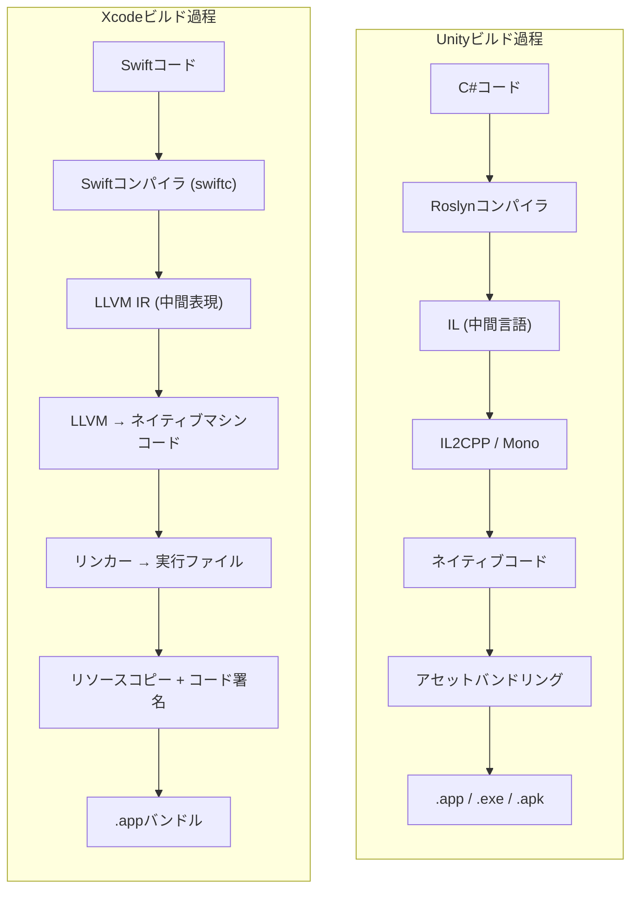
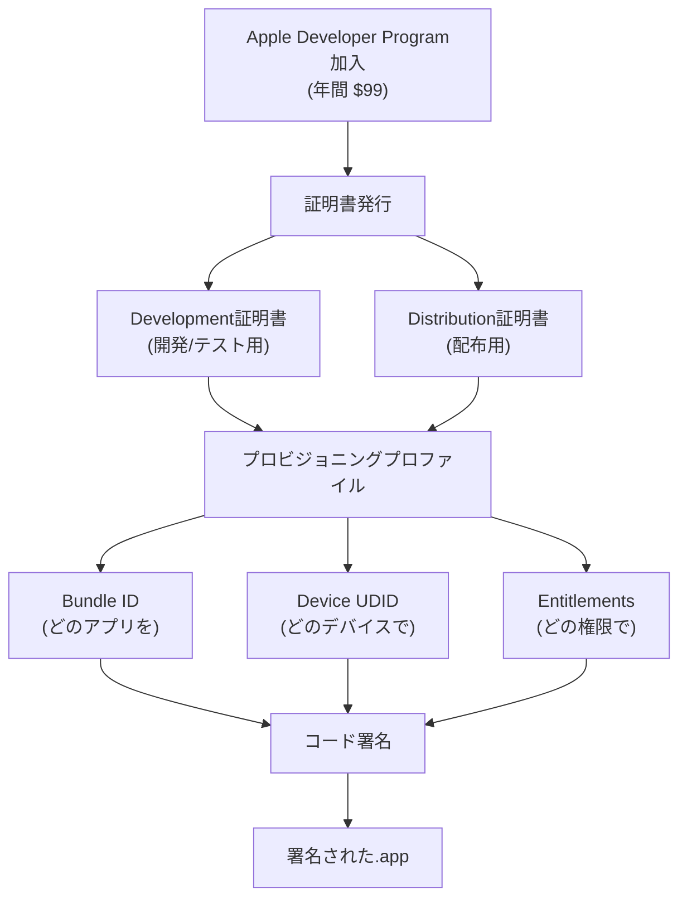
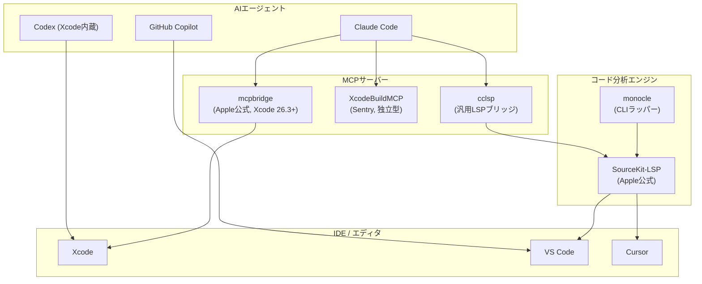

## はじめに

ゲーム開発者にとって「ネイティブアプリ開発」は少し馴染みのない領域だ。UnityやUnrealでC#やC++を使ってゲームを作っていた人が、突然SwiftとXcodeでmacOS/iOSアプリを作ろうとすると——正直、参入障壁は甘くない。

しかし2026年の状況は違う。**AIコーディングツールが言語の壁を劇的に下げてくれる時代**が来たからだ。

筆者はUnityでモバイルゲームを開発していたが、サイドプロジェクトとしてmacOSネイティブアプリ（CozyDesk——メニューバー常駐ホワイトノイズアプリ）を作ることになった。Swift経験はゼロだった。しかしClaude Codeを傍に置いて開発すると、「このC#コードをSwiftでどう書くの？」という質問に即座に答えが得られた。エラーメッセージを貼り付ければ原因を分析してくれ、Appleの膨大なフレームワークドキュメントを要約してくれ、コード署名のようなApple固有の概念もステップバイステップで案内してくれる。

この記事はその過程で整理した**Unity C#開発者がSwift & Xcodeに移行する際に知っておくべきすべて**だ。単なる文法比較ではなく、「ゲーム開発者の頭の中にすでにある概念」にSwiftの概念をマッピングする方式で説明する。ゲームエンジンの内部構造を理解すればより良い最適化が可能なように、Appleプラットフォームの構造を理解すればより良いアプリを作ることができる。

---

## Part 1: Swift言語 — C#から来た開発者のための核心

### 1-1. 二つの世界の対応関係

まず全体像を把握しよう。Unity世界の馴染みのある概念がAppleネイティブ世界で何に該当するかマッピングすれば、頭の中に地図ができる。

| 概念 | Unity世界 | Appleネイティブ世界 |
|------|-----------|-------------------|
| プログラミング言語 | C# | **Swift** |
| IDE | Visual Studio / Rider | **Xcode** |
| エンジン/フレームワーク | Unity Engine | **SwiftUI**, **UIKit**, **SpriteKit**, **SceneKit** など |
| プロジェクトファイル | `.unity`, `.csproj` | **`.xcodeproj`** / `.xcworkspace` |
| パッケージマネージャー | Unity Package Manager | **Swift Package Manager (SPM)** |
| ビルド成果物 | `.exe`, `.app`, `.apk` | **`.app` バンドル** |
| ストア配布 | Steam, Google Play など | **App Store** (Apple独占) |
| リアルタイムプレビュー | Play Mode | **Xcode Previews** |

> **参考**: パッケージマネージャーとしてCocoaPodsとCarthageもあるが、2026年基準で**Swift Package Manager(SPM)**が事実上の標準となった。Appleが公式サポートし、Xcodeに完全統合されている。新規プロジェクトでCocoaPodsを選ぶ理由はほぼない。

### 1-2. Swift核心文法

Swiftは2014年にAppleが作った言語で、**Appleプラットフォームアプリ開発の事実上唯一の選択肢**だ。C#開発者への朗報は——文法がかなり似ているということだ。

```swift
// 型推論 — C#のvarと似ている
let name = "CozyDesk"          // 不変 (C#のreadonlyに近い)
var volume: Float = 0.7        // 可変

// オプショナル — null安全性が言語レベルで強制される
var player: AVAudioPlayerNode? = nil   // nilの可能性を?で明示
player?.play()                          // nilなら何もしない (safe call)
player!.play()                          // nilならクラッシュ (force unwrap)

// enumが非常に強力 — 関連値、メソッド、プロトコル採用が可能
enum SoundType: String, CaseIterable {
    case rain = "rain"
    case fireplace = "fireplace"

    var icon: String {
        switch self {
        case .rain: return "cloud.rain.fill"
        case .fireplace: return "flame.fill"
        }
    }
}

// 構造体 vs クラス
struct Position { var x: Float; var y: Float }  // 値型 (コピーされる)
class GameManager { var score: Int = 0 }        // 参照型 (共有される)

// プロトコル — C#のinterfaceと同じ概念
protocol Playable {
    func play()
    func stop()
}

// クロージャ — C#のラムダ/Actionと同じ
let onComplete: () -> Void = { print("Done") }
```

C#開発者が最も違和感を覚えるのは`let`/`var`の意味の違いだ。**C#では`var`は型推論**だが、**Swiftでは`var`は「可変」**を意味する。Swiftの`let`はC#の`readonly`に近く、一度代入すると変更できない。Swiftでは基本的に`let`を使い、変更が必要な場合にのみ`var`を使うのが慣例だ。

### 1-3. C#との核心的な違い

| 項目 | C# (Unity) | Swift |
|------|-----------|-------|
| null安全性 | Nullable reference types (任意) | **オプショナルシステム (強制)** |
| 値型 | `struct`は限定的に使用 | **structが基本、classは必要な時だけ** |
| 継承 | classベースの継承中心 | **Protocol-Oriented Programming** 推奨 |
| メモリ管理 | GC (ガベージコレクター) | **ARC (Automatic Reference Counting)** |
| アクセス制御 | `public`, `private`, `internal` など | `open`, `public`, `internal`, `fileprivate`, `private` |
| async/await | C# 5.0+ (2012) | Swift 5.5+ (2021), ほぼ同じ文法 |
| 並行性安全 | 開発者の責任 | **Swift 6: コンパイル時Data Race Safety** |
| エラー処理 | try-catch + Exception | `do`-`try`-`catch` + **typed throws (Swift 6)** |

#### 値型優先の哲学

Unity C#では`class`を基本に使い、パフォーマンスが重要な場合に`struct`を選択する。Swiftは**正反対**だ。`struct`が基本で、参照セマンティクス(reference semantics)が必要な場合にのみ`class`を使う。

Swift標準ライブラリの`Array`、`Dictionary`、`String`はすべて`struct`(値型)だ。Copy-on-Write最適化と組み合わさり、安全でありながらパフォーマンスも良い。Unity開発者に馴染みのある例えを使うと——`Vector3`がstructであるように、Swiftではほぼすべてがstructなのだ。

#### オプショナル — nullクラッシュとの別れ

Unity開発で最も一般的なランタイムエラーの一つが`NullReferenceException`だ。Swiftのオプショナルシステムはこの問題を**コンパイル時に**キャッチしてくれる。

```swift
// Swift — nil可能性が型システムで強制される
var player: AudioPlayer? = nil

// ❌ コンパイルエラー: Optionalを直接使用できない
// player.play()

// ✅ 安全なアクセス方法
player?.play()                    // nilなら無視 (Optional Chaining)
player!.play()                    // nilならクラッシュ (Force Unwrap — 非推奨)

if let p = player {               // nilでない場合のみ実行 (Optional Binding)
    p.play()
}

guard let p = player else {       // nilなら早期リターン (Guard)
    return
}
p.play()
```

C#のNullable Reference Types(`string?`)も似た役割を果たすが、**任意で有効化する警告レベル**だ。Swiftではこれが**言語の核心に組み込まれて強制**される。最初は面倒に感じるが、ランタイムのnullクラッシュは事実上なくなる。

### 1-4. メモリ管理: GC vs ARC

Unity(C#)とSwiftのメモリ管理方式は根本的に異なる。この違いを理解することがSwift開発の最も重要な第一歩だ。


| 特性 | GC (Unity/C#) | ARC (Swift) |
|------|--------------|-------------|
| 解放タイミング | GCがいつか回収 (予測不可) | 参照カウントが0になった瞬間 |
| パフォーマンス影響 | GC Spike → **フレームドロップ**の原因 | オーバーヘッドほぼなし |
| 開発者の負担 | 低い (GCが処理) | 循環参照に注意が必要 |
| Unity例え | `System.GC.Collect()` | `Destroy()`即時呼び出しに似ている |

ゲーム開発者にとってGC Spikeは長年の頭痛の種だ。特にモバイルゲームではGCが動作するとフレームがカクつく。だからオブジェクトプーリングのようなパターンを使うのだ。SwiftのARCではこの問題が**根本的にない**。参照カウントが0になった瞬間に即座にメモリを解放するため、予測不可能な遅延が発生しない。

#### 循環参照 — Unityにはない落とし穴

ARCの唯一の弱点は**循環参照(Retain Cycle)**だ。二つのオブジェクトが互いをstrong（強い）参照すると、両方とも参照カウントが0にならず永遠に解放されない。

以下はApple公式Swift BookのARCダイアグラムだ。二つのインスタンスが互いをstrongで参照すると循環が発生する:


_二つのインスタンスが互いをstrongで参照すると循環参照が発生する (出典: [The Swift Programming Language](https://docs.swift.org/swift-book/documentation/the-swift-programming-language/automaticreferencecounting/), CC BY 4.0)_

変数を`nil`に設定しても、インスタンス間のstrong参照が残りメモリが解放されない:


_変数をnilに設定してもインスタンス間のstrong参照が残り解放不可 (出典: The Swift Programming Language, CC BY 4.0)_

解決策は片方を**weak**参照に変えることだ:


_片方をweakで宣言すると循環参照が解消される (出典: The Swift Programming Language, CC BY 4.0)_

```swift
// ⚠️ 循環参照の発生
class Scene {
    var manager: SoundManager?   // strong参照
}
class SoundManager {
    var scene: Scene?             // strong参照 → 循環!
}

// ✅ weakで解決
class SoundManager {
    weak var scene: Scene?        // weak参照 → 循環防止
}
```

Unity C#ではGCが循環参照も処理してくれるため、この心配がない。Swiftでは`weak`(弱い参照)と`unowned`(非所有参照)を適切に使用する必要がある。特に**クロージャでselfをキャプチャする際**に循環参照が頻繁に発生するので注意が必要だ。


_クロージャがselfをstrongでキャプチャするとインスタンス ↔ クロージャ間で循環参照が発生 (出典: The Swift Programming Language, CC BY 4.0)_

`[unowned self]`または`[weak self]`でキャプチャリストを明示すると循環が解消される:


_キャプチャリストでunowned/weakを明示すると循環参照を防止 (出典: The Swift Programming Language, CC BY 4.0)_

```swift
// ⚠️ クロージャでの循環参照 (最も一般的なミス)
class SoundPlayer {
    var onComplete: (() -> Void)?

    func setup() {
        onComplete = {
            self.reset()  // selfをstrongキャプチャ → 循環参照!
        }
    }
}

// ✅ キャプチャリストで解決
func setup() {
    onComplete = { [weak self] in
        self?.reset()     // weakキャプチャ → 安全
    }
}
```

### 1-5. Swift 6の変化 — Strict Concurrency

Swift 6（2024年9月リリース）はSwift史上最大の変化をもたらした。**コンパイル時にData Raceを防止**する機能が追加されたのだ。

Unity開発においてマルチスレッドは常に危険な領域だった。`Job System`や`Burst Compiler`を使わない限り、メインスレッドでほとんどの作業を処理し、必要な場合にのみ慎重にスレッドを使用する。Swift 6はこの「慎重さ」を**コンパイラが強制**する。

```swift
// Swift 6 — Actorでスレッドセーフな状態管理
actor SoundEngine {
    private var players: [String: AudioPlayer] = [:]

    func addPlayer(_ name: String, player: AudioPlayer) {
        players[name] = player  // Actor内部は自動的にシリアライズされる
    }

    func getPlayer(_ name: String) -> AudioPlayer? {
        return players[name]
    }
}

// 外部からアクセスする際は必ずawaitが必要
let engine = SoundEngine()
await engine.addPlayer("rain", player: rainPlayer)
```

`actor`はUnityの`[BurstCompile]`が付与するデータアクセス制限と概念的に似ている。特定のデータを特定の実行コンテキストに紐付けて、同時アクセスを根本的にブロックする。違いはUnityのBurstが特定のシステムにのみ適用されるのに対し、Swift 6のSendable/Actorシステムは**コードベース全体に適用**されるということだ。

> **実用的なアドバイス**: Swift 6のstrict concurrencyは既存のSwiftコードに適用すると警告/エラーが多く発生する可能性がある。新規プロジェクトなら最初からSwift 6モードで始め、既存プロジェクトは段階的にマイグレーションするのが現実的だ。

---

## Part 2: Xcodeプロジェクト構造

### 2-1. プロジェクトファイルの正体

Unityの`.unity`シーンファイルや`Library/`フォルダのように、Xcodeもプロジェクトメタデータをファイルで管理する。

```
MyApp.xcodeproj/              ← UnityのLibrary/フォルダと似た役割
├── project.pbxproj           ← 核心！すべてのファイル参照、ビルド設定、ターゲット情報
├── project.xcworkspace/      ← ワークスペース設定
│   └── contents.xcworkspacedata
└── xcuserdata/               ← ユーザーごとのIDE設定 (gitで除外)
```

**`project.pbxproj`**は数千行のPlistファイルだ。プロジェクトにどのファイルが含まれ、どの順序でビルドされ、どの設定を使うかすべて記録する。**絶対に直接編集してはいけない** — Xcode GUIやXcodeGenなどのツールを使う。

Unity開発者への例えとして、`project.pbxproj`はUnityの`.meta`ファイルをすべて一つにまとめたものと似ている。`.meta`ファイルが各アセットのインポート設定とGUIDを保存するように、`pbxproj`はプロジェクト全体のファイル参照とビルド設定を保存する。そして`.meta`ファイルを直接編集しないように、`pbxproj`も直接触らない。

### 2-2. XcodeGen — プロジェクトファイル管理の解法

チームプロジェクトで`project.pbxproj`は**マージコンフリクトの地獄**になる。Unityで`.unity`シーンファイルのマージコンフリクトを経験した人ならこの苦痛を知っているだろう。

**XcodeGen**はシンプルなYAML(`project.yml`)から`.xcodeproj`を自動生成する。`project.pbxproj`をgitから除外し、`project.yml`だけを管理すればよい。

```yaml
# project.yml — 人間が読み書きするファイル
name: CozyDesk
options:
  bundleIdPrefix: com.cozydesk
  deploymentTarget:
    macOS: "14.0"

targets:
  CozyDesk:
    type: application
    platform: macOS
    sources:
      - path: CozyDesk
    resources:
      - path: CozyDesk/Resources/Sounds
    settings:
      SWIFT_VERSION: "6.0"
```

```bash
# この一行で.xcodeproj全体が再生成される
xcodegen generate
```

Unity例え: `project.yml`はUnityの`Packages/manifest.json`と似ている。宣言的にプロジェクトを定義すればツールが残りを処理する。

> **代替案**: **Tuist**はSwiftコードでプロジェクトを定義し、モジュール化に強みがある。大規模プロジェクトならTuistも検討に値する。**Swift Package Manager**だけでプロジェクトを構成することも、シンプルなプロジェクトでは十分だ。

### 2-3. Target、Scheme、Configuration

Unityのビルドシステム用語と1:1対応させると理解しやすい。

```
Target（ターゲット）
├── Unityの「Build Target」と同じ
├── 一つのビルド成果物（アプリ、フレームワーク、テストなど）
└── 例: CozyDesk（アプリ）、CozyDeskTests（テスト）

Scheme（スキーム）
├── Unityの「Build Configuration」ドロップダウンと似ている
├── 「どのTargetを、どのConfigurationで、どの動作(Run/Test/Profile)をするか」を定義
└── 例: CozyDesk → Debug → Run

Configuration（設定）
├── Unityの「Development Build」チェックボックスと似ている
├── Debug: 最適化なし、デバッグシンボル含む、assert有効
└── Release: 最適化あり、デバッグシンボル除去、assert無効
```

### 2-4. Info.plist — アプリの身分証明書

Unityの**Player Settings**に相当する。アプリ名、バージョン、最小OS要件などメタデータを定義する。

```xml
<!-- アプリ名とバージョン -->
<key>CFBundleName</key>
<string>CozyDesk</string>

<key>CFBundleShortVersionString</key>
<string>1.0</string>

<!-- メニューバー専用アプリ: Dockにアイコンが表示されない -->
<key>LSUIElement</key>
<true/>
```

### 2-5. Entitlements — アプリの権限

UnityでAndroidの`AndroidManifest.xml`に権限を宣言するように、Appleでは**Entitlements**でアプリが使用できる機能を宣言する。違いはAndroidがランタイムでの権限要求を許可するのに対し、AppleのEntitlementsは**ビルド時にアプリバイナリに含まれる**ということだ。

```xml
<!-- CozyDesk.entitlements -->
<key>com.apple.security.app-sandbox</key>
<true/>
```

主要なEntitlement:

| Entitlement | 説明 | Unity例え |
|-------------|------|-----------|
| `app-sandbox` | セキュリティサンドボックス (App Store **必須**) | — |
| `network.client` | ネットワークアクセス | `INTERNET`権限 |
| `files.user-selected.read-write` | ユーザー選択ファイルアクセス | ファイルブラウザ |
| `device.audio-input` | マイクアクセス | `RECORD_AUDIO` |

---

## Part 3: UIフレームワーク — SwiftUI vs UIKit

### 3-1. 二つのフレームワークの関係

AppleのUIフレームワークは二世代に分かれる。Unity開発者ならUGUIとUI Toolkitの関係を思い出せば正確だ。

```
UIKit/AppKit (2008~)               SwiftUI (2019~)
──────────────────                  ─────────────────
命令型 (Imperative)                  宣言型 (Declarative)
「このボタンを作って、                  「ボタンがここにあり、
 ここに置いて、                       押されたらこうなる」
 クリックしたらこの関数を呼ぶ」

Unity UGUIと似ている                 Unity UI Toolkitと似ている
Storyboard / XIB（ビジュアルエディタ）  コードのみでUI作成（Preview対応）
```

2026年基準で**新規プロジェクトはSwiftUIが基本**だ。UIKit/AppKitはレガシープロジェクトのメンテナンスや、SwiftUIがまだサポートしていないごく一部の高度なカスタムにのみ使用する。

### 3-2. SwiftUIコード — 宣言型の味

```swift
// SwiftUI — 宣言型
struct ContentView: View {
    @State private var count = 0

    var body: some View {
        VStack {
            Text("Count: \(count)")
                .font(.title)
            Button("Tap") {
                count += 1
            }
        }
        .padding()
    }
}
```

このコードで`count`が変わるとSwiftUIが**自動的に**画面を更新する。Unityで言えばデータバインディングが内蔵されているのだ。

比較してみよう:

```csharp
// Unity C# — 命令型
public class CounterUI : MonoBehaviour
{
    [SerializeField] private TMP_Text countText;
    [SerializeField] private Button tapButton;
    private int count = 0;

    void Start() {
        tapButton.onClick.AddListener(() => {
            count++;
            countText.text = $"Count: {count}";  // 手動でUI更新
        });
    }
}
```

**最大の違い**: Unityは「状態が変わったらUIを手動で更新」し、SwiftUIは「状態が変わったらフレームワークが自動でUIを更新」する。

### 3-3. ライフサイクル比較

```
Unity MonoBehaviour          SwiftUI View
─────────────────            ─────────────
Awake()                      init()
Start()                      .onAppear { }
Update()                     — (状態が変わった時だけbody再計算)
OnDestroy()                  .onDisappear { }
OnEnable() / OnDisable()     .onChange(of:) { }

💡 核心的な違い:
Unityは毎フレームUpdate()を呼ぶ（命令型）
SwiftUIは状態が変わった時だけビューを再描画する（宣言型/リアクティブ）
```

ゲームは毎フレームのレンダリングが必要なので`Update()`が自然だが、アプリUIはユーザー入力がある時だけ変更すれば十分だ。SwiftUIの宣言型モデルがアプリ開発により適している理由だ。

### 3-4. 状態管理システム

SwiftUIの状態管理は最初は少し混乱する。複数のProperty Wrapperがあるためだ。Unity概念にマッピングすると理解しやすい。

| SwiftUI | Unity例え | 用途 |
|---------|-----------|------|
| `@State` | `[SerializeField] private`フィールド | ビュー内部のローカル状態 |
| `@Binding` | `ref`パラメータ | 親の状態を子が修正 |
| `@Observable` | `ScriptableObject` + イベント | 観察可能な外部データモデル |
| `@Environment` | `Singleton` / `ServiceLocator` | グローバル依存性注入 |

#### @Observable — 新しい標準 (Swift 5.9+)

Swift 5.9で導入された`@Observable`マクロは以前の`ObservableObject` + `@Published`パターンを置き換える。はるかに簡潔で、パフォーマンスも良い。

```swift
// ✅ 新しい方式 (Swift 5.9+ / iOS 17+)
@Observable
class SoundManager {
    var volume: Float = 0.7        // 自動的に観察可能
    var isPlaying: Bool = false    // @Published不要！
}

// ❌ 以前の方式 (レガシー — 既存コードで見かける)
class SoundManager: ObservableObject {
    @Published var volume: Float = 0.7
    @Published var isPlaying: Bool = false
}
```

`@Observable`はSwiftのマクロ機能を活用する。コンパイル時にプロパティ変更追跡コードを自動生成するため、`@Published`を一つ一つ付ける必要がない。また、SwiftUIが**実際に使用されたプロパティのみ**追跡するため、不要なビュー再レンダリングが減少する。

### 3-5. Xcode Previews — リアルタイムプレビュー

UnityのPlay Modeに対応する機能が**Xcode Previews**だ。コードを保存するとUIが即座にプレビューでレンダリングされる。アプリをビルドして実行せずにUI変更を確認できる。

```swift
// #Previewマクロでプレビュー定義 (Swift 5.9+)
#Preview {
    ContentView()
}

#Preview("Dark Mode") {
    ContentView()
        .preferredColorScheme(.dark)
}
```

UnityでシーンをInspectorで値を変えながらテストするように、SwiftUI Previewsでは様々な状態のUIを同時に確認できる。ダークモード、多言語、様々なデバイスサイズをPreviewで一度にテストでき、実機なしでも素早くUI開発ができる。

> **ヒント**: Previewは最初は頻繁に壊れることがある。Previewでエラーが出たら`Clean Build Folder`（Cmd+Shift+K → Cmd+B）で解決する場合が多い。Unityで「Delete Library folder」するのと同じ文脈だ。

### 3-6. アプリのエントリーポイント — @main

Unityでシーンを開くとゲームが始まるように、SwiftUIアプリは`@main`でマークされた構造体から始まる。

```swift
@main
struct CozyDeskApp: App {
    var body: some Scene {
        MenuBarExtra("CozyDesk", systemImage: "cloud.rain") {
            ContentView()
        }
        .menuBarExtraStyle(.window)
    }
}
```

Unityで言えばこのコードが「最初のシーンをロードしてゲームを開始する」役割だ。`App`プロトコルがアプリの構造を定義し、`Scene`がウィンドウやメニューバーアイテムのような最上位UIコンテナを定義する。

---

## Part 4: Appleフレームワーク生態系

### 4-1. フレームワークマッピング

UnityのPackage Managerで様々なパッケージを使うように、Appleプラットフォームにも広範なフレームワーク生態系がある。ゲーム開発者に馴染みのある概念にマッピングすると:

| Appleフレームワーク | 役割 | Unity対応 |
|-----------------|------|-----------|
| **SwiftUI** | 宣言型UI | UI Toolkit |
| **UIKit / AppKit** | 命令型UI (レガシー) | UGUI |
| **SpriteKit** | 2Dゲーム/グラフィックス | Unity 2D |
| **SceneKit** | 3Dレンダリング | Unity 3D (軽量) |
| **RealityKit** | AR/VR 3D | AR Foundation + XR |
| **Metal** | 低レベルGPU | Unity シェーダー + SRP |
| **AVFoundation** | オーディオ/ビデオ | AudioSource + VideoPlayer |
| **GameplayKit** | AI、ステートマシン、パスファインディング | NavMesh, Animator StateMachine |
| **Core Data / SwiftData** | ローカルDB / ORM | SQLite / PlayerPrefs |
| **Combine** | リアクティブプログラミング | UniRx |
| **Swift Concurrency** | async/await, Actor | UniTask |
| **CloudKit** | クラウド同期 | Unity Cloud Save |

> **参考**: SceneKitは軽量な3Dアプリに適しているが、本格的な3DゲームにはUnity/Unrealが圧倒的に有利だ。Appleプラットフォーム専用のカジュアル/ユーティリティアプリでなければ、SpriteKit/SceneKitの代わりにゲームエンジンを使うのが現実的だ。

### 4-2. SpriteKit ↔ Unity 2D比較

SpriteKitはAppleの2Dゲーム/グラフィックスフレームワークだ。Unity 2Dとの1:1対応が非常にうまくいく。

以下はApple公式ドキュメントのSpriteKitノード階層構造ダイアグラムだ。UnityのHierarchyビューで親子関係でGameObjectを管理するのと同じ概念だ:


_SpriteKitノードツリー — zPositionでレンダリング順序を制御する。UnityのSorting Layer + Order in Layerと同じ役割 (出典: [Apple SpriteKit Programming Guide](https://developer.apple.com/library/archive/documentation/GraphicsAnimation/Conceptual/SpriteKit_PG/Nodes/Nodes.html))_

| SpriteKit | Unity 2D | 説明 |
|-----------|----------|------|
| `SKScene` | `Scene` | シーンコンテナ |
| `SKSpriteNode` | `GameObject + SpriteRenderer` | スプライト表示 |
| `SKEmitterNode` | `ParticleSystem` | パーティクル効果 |
| `SKAction` | DOTween / Coroutine | アニメーション/シーケンス |
| `SKCropNode` | `SpriteMask` | マスキング |
| `SKShapeNode` | `LineRenderer` / プリミティブ | 図形レンダリング |
| `zPosition` | `Sorting Layer + Order in Layer` | レンダー順序 |
| `didMove(to:)` | `Start()` | シーン初期化 |
| `update(_:)` | `Update()` | 毎フレーム呼び出し |

SwiftUIとSpriteKitの連携は`SpriteView`で簡単にできる:

```swift
import SpriteKit
import SwiftUI

struct GameView: View {
    var body: some View {
        SpriteView(scene: RainScene())   // SpriteKitシーンをSwiftUIに埋め込み
            .frame(width: 300, height: 200)
    }
}
```

UnityでキャンバスにParticle Systemを載せるように、SwiftUIビューの中にSpriteKitシーンを自然に配置できる。

### 4-3. AVFoundation ↔ Unity Audio比較

```
Unity:                              AVFoundation:
──────                              ──────────────
AudioMixer                          AVAudioEngine
  └── AudioMixerGroup                 └── mainMixerNode
       ├── AudioSource (BGM)               ├── AVAudioPlayerNode (rain)
       ├── AudioSource (SFX)               ├── AVAudioPlayerNode (fireplace)
       └── AudioSource (Ambient)           └── AVAudioPlayerNode (cafe)

AudioClip                           AVAudioPCMBuffer / AVAudioFile
AudioSource.loop = true             .scheduleBuffer(buffer, options: .loops)
AudioSource.volume                  playerNode.volume
AudioMixer.outputVolume             mainMixerNode.outputVolume
```

UnityのAudioMixerのようにノードベースでオーディオグラフを構成する。違いはUnityがGUI（AudioMixerエディタ）でルーティングを設定するのに対し、AVAudioEngineは**コードで**ノードを接続するということだ。

以下はApple公式ドキュメントのAudio Processing Graphダイアグラムだ。複数のオーディオソースがMixerを経由してOutputに出力される構造——Unity AudioMixerのルーティングと同じ概念だ:


_Audio Processing Graph — 複数の入力ソースがEQ、Mixerを経由してOutputにルーティングされる。Unity AudioMixerエディタで見るノードグラフと同じ概念 (出典: [Apple Audio Unit Hosting Guide](https://developer.apple.com/library/archive/documentation/MusicAudio/Conceptual/AudioUnitHostingGuide_iOS/AudioUnitHostingFundamentals/AudioUnitHostingFundamentals.html))_

```swift
// AVAudioEngineノード接続 (Unity AudioMixerグラフをコードで構成)
let engine = AVAudioEngine()
let playerNode = AVAudioPlayerNode()

engine.attach(playerNode)
engine.connect(playerNode,
               to: engine.mainMixerNode,
               format: audioFile.processingFormat)

try engine.start()
playerNode.scheduleBuffer(buffer, options: .loops)
playerNode.play()
```

### 4-4. Appleプラットフォームの言語

| 言語 | 用途 | 比率 (新規プロジェクト) |
|------|------|---------------------|
| **Swift** | アプリロジック、UI、ほぼすべて | **95%+** |
| **Objective-C** | レガシーコード、一部システムAPIラッパー | 減少中 |
| **C / C++** | パフォーマンスクリティカル (オーディオ、グラフィックス、暗号化) | エンジン/ライブラリ内部 |
| **Metal Shading Language** | GPUシェーダー | UnityのHLSLに相当 |

#### Objective-C — Swift以前の世界

```objc
// Objective-C — 1984年からのレガシー
[[UIButton alloc] initWithFrame:CGRectMake(0, 0, 100, 50)];
[button setTitle:@"Tap" forState:UIControlStateNormal];
[button addTarget:self action:@selector(onTap)
 forControlEvents:UIControlEventTouchUpInside];
```

```swift
// Swift — 同じコード、一行
Button("Tap") { onTap() }
```

2026年基準で新規プロジェクトでObjective-Cを使う理由はない。ただし**Apple公式ドキュメントやStackOverflowでObjCコードに出会うことはまだ多い**ので、基本的な文法は読めると良い。SwiftとObjective-Cは同じプロジェクトでBridging Headerを通して混在できる。

#### Metal — AppleのグラフィックスAPI

```
Unity:  HLSL / ShaderLab → Unityがプラットフォーム別に変換 → Metal / Vulkan / DX12
Native: Metal Shading Language (MSL) → 直接GPU制御
```

Unity開発者はMetalを直接扱うことはほとんどない。UnityがMetal バックエンドに自動変換してくれるためだ。しかし**ネイティブmacOS/iOSアプリでカスタムレンダリングが必要なら**Metalを直接使う必要がある。SpriteKit、SceneKit、RealityKitは内部的にすべてMetal上で動作する。

---

## Part 5: ビルド、署名、配布

### 5-1. ビルドパイプライン比較



### ビルド段階の詳細

```
1. Compile Sources (ソースコンパイル)
   └─ .swiftファイル → .oオブジェクトファイル

2. Link Binary (リンキング)
   └─ .oファイル + フレームワーク → 実行ファイル

3. Copy Bundle Resources (リソースコピー)
   └─ Assets.xcassets, Sounds/*.mp3 など → .app内部にコピー

4. Code Sign (コード署名) ← Unityにはない過程！
   └─ Apple開発者証明書で署名 (アプリ改ざん防止)

5. 結果: CozyDesk.app (バンドル)
   CozyDesk.app/
   ├── Contents/
   │   ├── MacOS/CozyDesk     ← 実行ファイル
   │   ├── Resources/         ← リソースファイル
   │   ├── Info.plist         ← アプリメタデータ
   │   └── _CodeSignature/    ← 署名データ
   └── ...
```

**注目点**: UnityはIL2CPPを通してC# → C++ → ネイティブコードと**二回**変換されるのに対し、SwiftはLLVMを通して**一回で**ネイティブコードにコンパイルされる。この違いにより、Swiftアプリの起動時間とバイナリサイズは一般的に小さくなる。

### コマンドラインビルド

```bash
# Xcode GUIなしでビルド (CI/CDで使用)
xcodebuild -scheme CozyDesk -configuration Debug build

# クリーンビルド (Unityの「Clean Build」ボタン)
xcodebuild -scheme CozyDesk clean build

# XcodeGen使用時の全フロー
xcodegen generate && xcodebuild -scheme CozyDesk build
```

### 5-2. コード署名 — Apple生態系最大の参入障壁

Unity開発にはない、Apple固有のシステムだ。**ゲーム開発者がネイティブアプリ開発で最も挫折するポイント**でもある。



**簡単な例え**: コード署名は「Apple認証の開発者が作った、改ざんされていないアプリ」であることを証明するデジタル封印だ。封印がないか壊れていれば、macOS/iOSはアプリの実行を拒否する。

> **実用的なヒント**: Xcodeの**Automatic Signing**を有効にすれば、開発段階では証明書とプロビジョニングプロファイルをXcodeが自動管理してくれる。最初はこれだけ使い、App Store配布時に手動管理を学んでも遅くない。

### 5-3. 配布方式

| 方式 | 説明 | Unity例え |
|------|------|-----------|
| **App Store** | Apple審査後に公開配布 | Steamリリース |
| **TestFlight** | ベータテスト (最大10,000人) | Steam Playtest |
| **Developer ID** | App Store外での配布 (macOS専用) | itch.io配布 |
| **Ad Hoc** | 登録デバイスにのみインストール (最大100台) | 社内テストビルド |
| **Enterprise** | 企業内部配布 | — |

```
配布プロセス:

Unity配布 (Steam):                     Xcode配布 (App Store):
────────────────────                     ──────────────────────
ビルド                                    ビルド
  ↓                                        ↓
実行ファイル生成                             Archive (.xcarchive)
  ↓                                        ↓
Steamworksにアップロード                    コード署名 (Signing)
  ↓                                        ↓
リリース                                   App Store Connectにアップロード
                                             ↓
                                           Apple審査 (通常1~3日) ← Unityにはない過程！
                                             ↓
                                           承認 → リリース
```

### 5-4. CI/CD

```yaml
# .github/workflows/build.yml
name: Build CozyDesk
on:
  push:
    branches: [main]

jobs:
  build:
    runs-on: macos-14           # macOSランナー必須！(Windowsは不可)
    steps:
      - uses: actions/checkout@v4

      - name: Install XcodeGen
        run: brew install xcodegen

      - name: Generate Xcode Project
        run: xcodegen generate

      - name: Build
        run: xcodebuild -scheme CozyDesk -configuration Release build
```

**Unity CI/CDとの核心的な違い**:
- UnityはWindows/Linux/macOSどこでもビルド可能だが、**XcodeビルドはmacOSでのみ**可能
- GitHub ActionsのmacOSランナーはLinuxランナーより**約10倍高い** (分あたり$0.08 vs $0.008)
- **Xcode Cloud** (Apple公式CI/CD)を使えばmacOSランナーのコスト心配がない (月25 compute hours無料)
- Xcode CloudはXcodeに内蔵されており、設定が最小化される。Unity Cloud Buildと同じポジション

---

## Part 6: AI時代のネイティブアプリ開発

### 6-1. AIが変えた学習曲線

3年前なら、Unity C#開発者がSwiftを学んでアプリを作るにはかなりの時間投資が必要だったろう。新しい言語文法、新しいIDE、新しいフレームワーク、新しいビルドシステム、新しい配布プロセス——すべてが新しい。

2026年の状況は違う。AIコーディングツールが**リアルタイム通訳**の役割を果たしてくれるからだ。

| 過去の学習過程 | AI時代の学習過程 |
|-----------------|-------------------|
| Swift公式ドキュメント精読 (数日) | 「C#のdelegateをSwiftでどう書く？」→ 即座に回答 |
| エラーメッセージ → StackOverflow検索 → 回答探し (数十分) | エラーメッセージ貼り付け → 原因 + 解決策即座に (数秒) |
| Apple APIドキュメント探索 (膨大) | 「AVAudioEngineでループ再生するには？」→ コード例即座に |
| コード署名エラー → 数時間の試行錯誤 | エラーログ送信 → ステップバイステップ解決ガイド |

核心はAIがコードを「代わりに書いてくれる」のではなく、**言語間の概念移行を加速する**ということだ。「Unityではこうするけど、Swiftではどうする？」という質問に即座に答えが得られる。既存知識を新しいプラットフォームにマッピングする速度が飛躍的に速くなる。

### 6-2. ゲーム開発スキルの移行

意外にもゲーム開発スキルはネイティブアプリ開発にかなりよく移行する。

| ゲーム開発スキル | ネイティブアプリでの活用 |
|---------------|---------------------|
| シーン管理、オブジェクトライフサイクル | ビューライフサイクル、メモリ管理 |
| パーティクルシステム | SpriteKit `SKEmitterNode` |
| オーディオミキシング、サウンドデザイン | AVAudioEngineノードグラフ |
| シェーダープログラミング | Metal Shading Language |
| UIレイアウト (UGUI / UI Toolkit) | SwiftUI / UIKitレイアウト |
| アセットバンドル、リソース管理 | App Bundle, Asset Catalog |
| ステートマシンパターン | SwiftUI状態管理、GameplayKit |
| 最適化 (プロファイリング、メモリ) | Instruments (Xcodeプロファイラー) |

ゲーム開発者はすでに**フレーム単位でパフォーマンスを気にする習慣**がある。この感覚はアプリ開発でも有用だ。一般的なアプリ開発者が「なぜスクロールがカクつくの？」レベルで悩む時、ゲーム開発者はプロファイラーを開いてボトルネックを見つけるのが自然だ。

### 6-3. 実践的ヒント — AIと共にSwift学習戦略

**ステップ1: 概念マッピングから**

新しい文法を暗記するのではなく、既存のC#概念をSwiftに翻訳することから始める。
- 「C#の`List<T>`はSwiftでは？」→ `Array<T>`または`[T]`
- 「Unityの`Coroutine`はSwiftでは？」→ `async/await` + `Task`
- 「C#の`event Action`は？」→ Swiftの`closure`または`Combine` Publisher

**ステップ2: 小さなプロジェクトから始める**

「Hello World」を飛ばして、すぐに興味のある小さなアプリを作る。ゲーム開発者ならSpriteKitで簡単な2Dシーンを作るか、AVFoundationでサウンドプレーヤーを作ると、既存スキルを活用できて参入が楽だ。

**ステップ3: エラーを恐れない**

Swiftコンパイラは C#より**はるかに厳格**だ。オプショナル、Sendable、アクセス制御などでエラーが大量に出ることがある。しかしこれらのエラーは大部分が「ランタイムでクラッシュする可能性のあるバグをコンパイル時にキャッチしてくれたもの」だ。AIツールにエラーメッセージを渡せば原因と解決策を素早く得られる。

---

## Part 7: AI開発ツール生態系 — LSP、MCP、Agentic Coding

### 7-1. SourceKit-LSP — SwiftのLanguage Server

**Language Server Protocol(LSP)**はIDEと言語分析エンジン間の標準通信規約だ。Unity開発者への例えとして——RiderやVisual StudioがC#コードの自動補完、定義へのジャンプ、参照検索を提供するように、LSPは**どのエディタでも**同じコードインテリジェンスを提供するためのプロトコルだ。

SwiftのLSP実装は**[SourceKit-LSP](https://github.com/swiftlang/sourcekit-lsp)**だ。Appleが公式開発し、オープンソースだ。

```
Xcode内部構造:
┌─────────────┐
│   Xcode     │ ← SourceKitを直接呼び出し (LSPを経由しない)
│   (IDE)     │
└──────┬──────┘
       │ XPC (Appleプロセス間通信)
┌──────▼──────┐
│  SourceKit  │ ← Swiftコード分析の核心エンジン
│  (デーモン)  │    自動補完、構文ハイライト、型推論、リファクタリングなど
└─────────────┘

Xcode外部エディタ構造:
┌──────────────────┐
│ VS Code / Neovim │ ← LSPクライアント
│ Cursor / Zed     │
└──────┬───────────┘
       │ LSP (JSON-RPC over stdio)
┌──────▼───────────┐
│  SourceKit-LSP   │ ← SourceKitをLSPプロトコルでラップしたラッパー
│  (サーバー)       │
└──────┬───────────┘
       │
┌──────▼──────┐
│  SourceKit  │ ← 同じ核心エンジン
└─────────────┘
```

**重要ポイント**:
- SourceKit-LSPは**Xcodeツールチェインにデフォルト搭載**。Swiftをインストールすれば自動的に利用可能
- Xcode自体はLSPを使わず、SourceKitを直接呼び出す。より速く深い統合が可能なため
- VS Code、Neovim、Cursorなど外部エディタでSwift開発する際にSourceKit-LSPが動作する
- 「ビルドしながらインデキシング(Indexing While Building)」方式で動作——ビルド時にコンパイラがインデックスデータを自動生成し、LSPがそれを活用

Unity C#開発との比較:

| 機能 | C# (Unity) | Swift |
|------|-----------|-------|
| コード分析エンジン | Roslyn / OmniSharp | **SourceKit** |
| LSP実装 | OmniSharp-LSP / csharp-ls | **SourceKit-LSP** |
| 主力IDE | Rider / Visual Studio | **Xcode** |
| 外部エディタ | VS Code + C# Extension | VS Code + **Swift Extension** |
| 自動補完 | ✅ | ✅ |
| 定義へジャンプ | ✅ | ✅ |
| 参照検索 | ✅ | ✅ |
| リファクタリング | ✅ (Riderが最も強力) | ✅ (Xcode内蔵) |

### 7-2. MCPとXcode — AIエージェントがIDEを制御する時代

**MCP(Model Context Protocol)**はAnthropicが2024年11月に発表したオープン標準だ。AIモデルが外部ツールと通信する「USBポート」のような役割を果たす。Unity開発でJetBrains MCPを通してClaude CodeがRiderを制御するように、Swift開発でもMCPを通してAIがXcodeを制御できる。

#### Xcode 26.3 — AppleのMCPネイティブサポート

2026年2月、AppleはXcode 26.3で**MCPをネイティブでサポート**し始めた。これはApple開発生態系に大きな変化をもたらした。

```
Xcode 26.3 MCPアーキテクチャ:

┌───────────────────┐     ┌──────────────┐
│  Claude Code      │     │  Codex       │
│  (ターミナル)      │     │  (IDE内蔵)    │
└────────┬──────────┘     └──────┬───────┘
         │ MCP                   │ MCP
         │                       │
┌────────▼───────────────────────▼───────┐
│            mcpbridge                    │
│    (xcrun mcpbridge)                    │
│    Xcodeコマンドラインツールに搭載        │
└────────────────┬───────────────────────┘
                 │ XPC
┌────────────────▼───────────────────────┐
│              Xcode                      │
│  ┌─────────┐  ┌──────────┐  ┌────────┐│
│  │ ビルド  │  │ Previews │  │ シミュ ││
│  │ システム │  │ レンダリング│ │ レーター││
│  └─────────┘  └──────────┘  └────────┘│
└────────────────────────────────────────┘
```

**`mcpbridge`**はAppleがXcodeコマンドラインツールに搭載したバイナリで、MCPプロトコルとXcode内部のXPC通信間を翻訳する。Claude Codeから以下の一行で接続できる:

```bash
# Claude CodeにXcode MCP接続
claude mcp add --transport stdio xcode -- xcrun mcpbridge
```

こう接続するとClaude Codeができること:
- **Xcode Previewsキャプチャ**: SwiftUIビューのビジュアル結果を確認し、見える問題を把握して反復修正
- **ビルド実行とエラー確認**: `xcodebuild`なしでXcodeビルドシステムに直接アクセス
- **シミュレーター制御**: アプリをシミュレーターにデプロイして実行
- **診断情報確認**: コンパイルエラー、警告を構造化された形式で受信

> **Unity例え**: JetBrains MCPでClaude CodeがRiderでコードを分析し、ビルドし、テストを実行するのと同じ概念だ。違いはAppleがこれを**1st-partyで公式サポート**しているということだ。

#### XcodeBuildMCP — Xcode 26.3以前または独立実行用

Xcode 26.3の`mcpbridge`が登場する前から、コミュニティでは**[XcodeBuildMCP](https://github.com/getsentry/XcodeBuildMCP)** (Sentry開発)が使われていた。

```bash
# インストール (Homebrew)
brew tap getsentry/xcodebuildmcp && brew install xcodebuildmcp

# Claude Codeに接続
claude mcp add xcodebuild -- xcodebuildmcp
```

XcodeBuildMCPが提供するツール:

| ツール | 説明 |
|------|------|
| ビルド実行 | xcodebuild統合、マクロ検証スキップオプション |
| シミュレーター管理 | ビルド → シミュレーター実行 → ログ確認 |
| 物理デバイスデプロイ | コード署名含む実機ビルド |
| ログキャプチャ | ワークスペース別状態管理デーモン |
| プロジェクト分析 | 設定、ターゲット、スキーム検査 |

Xcode 26.3+では`mcpbridge`があるためXcodeBuildMCPの必要性は減るが、CI/CD環境やXcode GUIのない環境では依然として有用だ。

### 7-3. SourceKit-LSP + MCP — AIにSwiftコード理解力を与える

LSPが「コードの構造を理解するエンジン」で、MCPが「AIとツールを繋ぐ橋」なら、この二つを組み合わせれば**AIがSwiftコードの意味を正確に理解**できるようになる。

#### monocle — SourceKit-LSP CLIラッパー

**[monocle](https://forums.swift.org/t/monocle-a-cli-for-coding-agents-to-inspect-swift-symbols-via-sourcekit-lsp/83615)**はAIコーディングエージェントがSwiftシンボルを照会できるCLIツールだ。SourceKit-LSPをラップし、ファイルの特定位置にあるシンボルの情報を安定的で構造化された形式で提供する。

```bash
# 特定位置のシンボル情報照会
monocle inspect --file Sources/SoundManager.swift --line 42 --column 10

# 出力: シンボルシグネチャ、定義位置、コードスニペット、ドキュメントコメント
# --jsonフラグでAIがパースしやすい形式で出力可能
```

monocleの強みはローカルファイルだけでなく**DerivedDataの外部依存関係、Swift/SwiftUI SDKヘッダーまで**照会できることだ。AIが「このAPIは何の役割？」という質問に正確に答えられるようになる。

#### cclsp — 汎用LSP-MCPブリッジ

**[cclsp](https://github.com/ktnyt/cclsp)**はClaude CodeとLSPサーバーをMCPで接続する汎用ブリッジだ。Swiftだけでなく、TypeScript、Python、Go、RustなどLSPをサポートするすべての言語で使用できる。

```bash
# インタラクティブセットアップウィザード (プロジェクトの言語を自動検出)
npx cclsp@latest setup
```

cclspがAIに提供する機能:
- **定義へジャンプ**: シンボルが宣言された位置を正確に発見
- **参照検索**: 関数や変数のすべての使用箇所を探索
- **安全なリネーム**: プロジェクト全体でシンボル名を変更

AIがコードを修正する際の最大の問題の一つは**行番号とカラム位置を正確に把握できないこと**だ。cclspは「複数の位置の組み合わせをインテリジェントに試行する」方式でこの問題を解決する。

### 7-4. AI全体ツール生態系マップ

2026年基準、Swift開発で活用できるAIツールスタックをまとめると:



| ツール | 役割 | インストール | 推奨状況 |
|------|------|------|----------|
| **mcpbridge** | Xcode ↔ AI公式接続 | Xcode 26.3にデフォルト搭載 | Xcode使用時の第一選択 |
| **XcodeBuildMCP** | Xcodeビルド/シミュレーター制御 | `brew install xcodebuildmcp` | CI/CD、Xcodeなしの環境 |
| **cclsp** | 汎用LSP → MCPブリッジ | `npx cclsp@latest setup` | VS Code/Cursor + Claude Code |
| **monocle** | Swiftシンボル照会CLI | Swift Forums配布 | エージェントにシンボル理解力を付与 |
| **SourceKit-LSP** | Swiftコード分析 | Xcode搭載 (自動) | すべての外部エディタ |

### 7-5. 実践的な構成例

#### Xcode 26.3 + Claude Code（推奨）

```bash
# 1. Xcode MCP接続 (一度だけ)
claude mcp add --transport stdio xcode -- xcrun mcpbridge

# 2. 以後Claude Codeで自然に使用
# 「CozyDeskプロジェクトをビルドして」→ Xcodeビルドシステム呼び出し
# 「このSwiftUIビューのプレビューを見せて」→ Xcode Previewsキャプチャ
# 「シミュレーターで実行して」→ シミュレーター自動管理
```

#### VS Code + Claude Code（Xcodeなしの Swift開発）

```bash
# 1. VS CodeにSwift Extensionインストール (SourceKit-LSP自動有効化)
# 2. cclspでLSPをClaude Codeに接続
npx cclsp@latest setup    # Swift自動検出、SourceKit-LSP接続

# 3. XcodeBuildMCPでビルド機能追加
claude mcp add xcodebuild -- xcodebuildmcp
```

> **Unity開発との対比**: Unity C#開発ではJetBrains MCPでRiderと接続して同様のワークフローを構成する。Swift生態系はAppleの1st-partyサポート(`mcpbridge`)のおかげで設定がより簡単だ。

---

## 付録: よくある質問

### Q: Swiftでゲームを作れるか？

作れる。SpriteKit(2D)、SceneKit(3D)があり、Metalでカスタムレンダラーも作れる。
しかしUnity/Unrealと比べて生態系（アセットストア、コミュニティ、クロスプラットフォーム）が圧倒的に不足している。**Appleプラットフォーム専用カジュアルゲームやユーティリティアプリにのみ適している**。

### Q: SwiftUIだけでアプリを作れるか？

2026年基準で**ほとんど可能**だ。SwiftUIは毎年大きく進化しており、iOS 17+ / macOS 14+ターゲットなら大部分のUIをSwiftUIだけで実装できる。高度なカスタムが必要なごく一部の場合にのみUIKit/AppKitを部分的に使えばよい。

### Q: React NativeやFlutterの代わりになぜSwiftを使うのか？

- **パフォーマンス**: ネイティブコードに直接コンパイルされ、クロスプラットフォーム対比最高のパフォーマンス
- **Apple API 100%アクセス**: `MenuBarExtra`のようなプラットフォーム専用機能はネイティブのみ可能
- **アプリサイズ**: Flutter/RNはランタイムを含むためバイナリが大きい。Swiftはシステム内蔵のランタイムを使用
- **Apple生態系統合**: iCloud、HealthKit、WidgetKit、visionOSなどの深い連携はネイティブが有利
- **Appleの方向性**: AppleはSwiftUIを将来の標準として推進している。長期的にネイティブ開発が最も安定的

一方、クロスプラットフォーム(iOS + Android)が必須ならFlutterやReact Nativeが合理的な選択だ。どちらも長所と短所が明確だ。

### Q: visionOS (Apple Vision Pro) 開発もSwiftか？

その通り。visionOSアプリもSwift + SwiftUIで開発する。3DコンテンツはRealityKitフレームワークを使用し、UnityもvisionOSビルドをサポートしているが、Appleのネイティブ API (Shared Space、視線追跡など)に完全にアクセスするにはSwiftネイティブ開発が必要だ。XR分野に興味があるならSwiftを習得しておくことが長期的に有利だ。

### Q: XcodeGen vs Tuist、どちらを使うべきか？

| ツール | 特徴 | 推奨状況 |
|------|------|----------|
| **XcodeGen** | YAMLでプロジェクト定義、シンプルで速い | 中小規模プロジェクト、素早いスタート |
| **Tuist** | Swift DSLでプロジェクト定義、モジュール化に強み | 大規模/チームプロジェクト |
| **SPMのみ** | Apple公式、追加ツール不要 | ライブラリ、シンプルなCLIツール |
| **Bazel** | Googleのビルドシステム、超大規模 | 非常に大きなモノレポ |

個人プロジェクトや小さなチームならXcodeGenで十分だ。SPMはアプリプロジェクトよりライブラリ/パッケージ開発に適している。

---

## 結論

ゲーム開発者にとってネイティブアプリ開発は「完全に新しい世界」ではない。シーン管理、オーディオシステム、パーティクル、ステートマシン、メモリ最適化——すでに知っている概念が名前を変えて存在する。最大の違いは**宣言型UI(SwiftUI)のパラダイム転換**と**Apple固有のコード署名/配布システム**だ。

AIツールが普及した2026年、新しい言語やプラットフォームへの参入障壁は劇的に低くなった。「Swiftを知らないから」ネイティブアプリを作れない時代は終わった。重要なのは**何を作りたいか**だ。ゲームエンジンが提供しないネイティブ体験——メニューバーアプリ、ウィジェット、システム統合、visionOS空間体験——が必要なら、ゲーム開発者の既存能力は思った以上に強力な武器になる。

AIはコードを代わりに書いてくれるのではなく、**あなたがすでに持っている知識を新しいプラットフォームに素早く適用できるようにしてくれる通訳者**だ。
