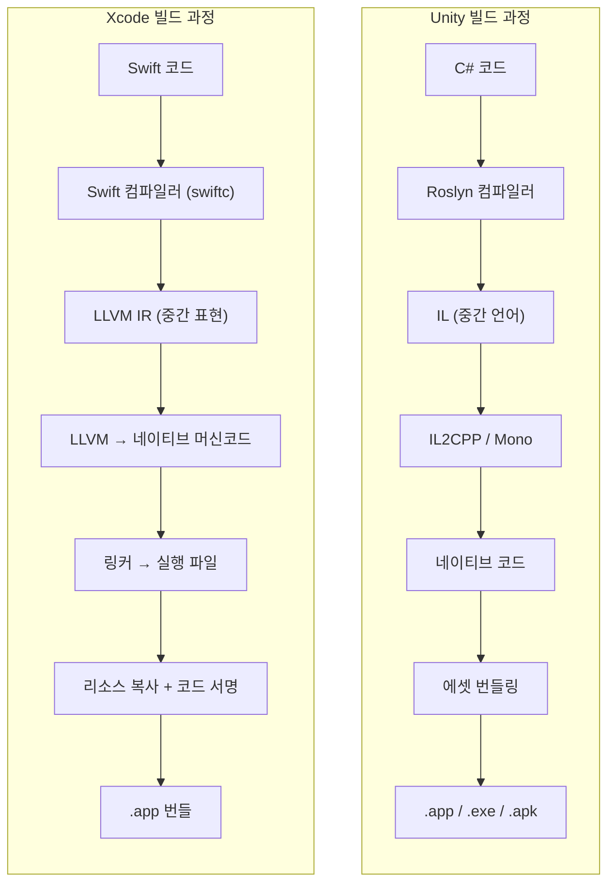
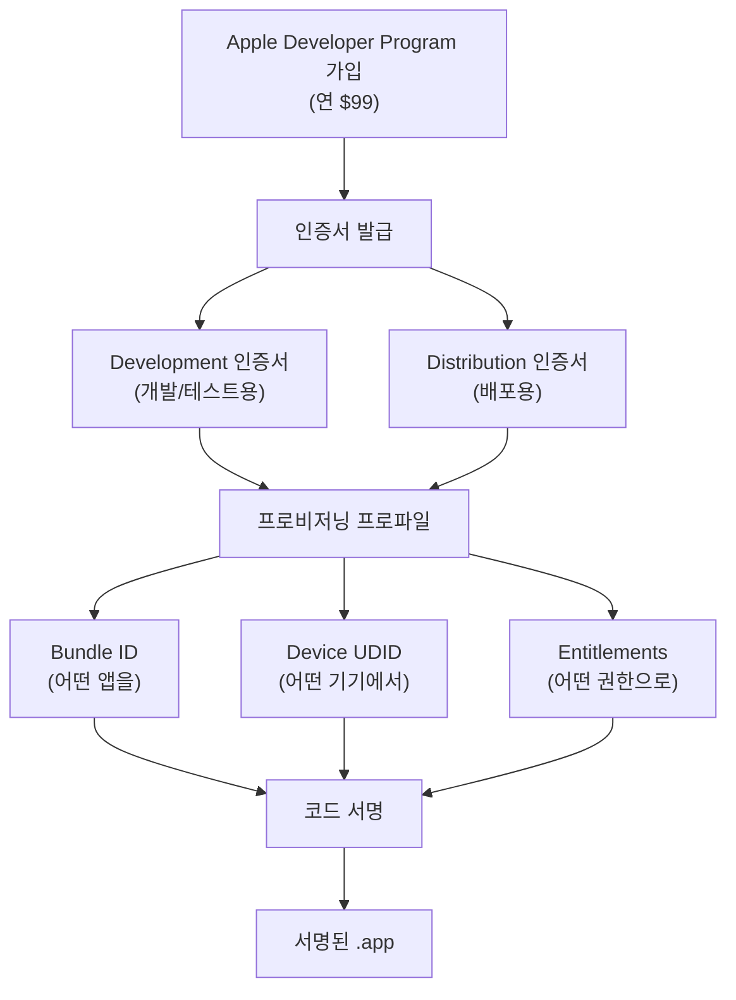
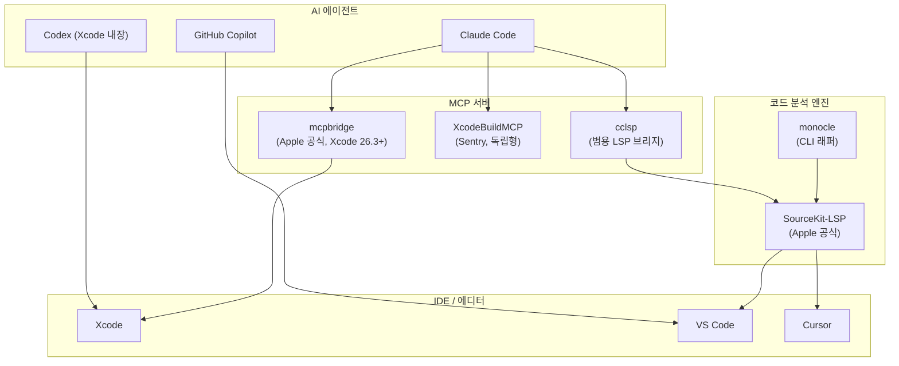

## 서론

게임 개발자에게 "네이티브 앱 개발"은 조금 낯선 영역이다. Unity나 Unreal에서 C#이나 C++로 게임을 만들던 사람이, 갑자기 Swift와 Xcode로 macOS/iOS 앱을 만들겠다고 하면 — 솔직히 진입장벽이 만만치 않다.

하지만 2026년의 상황은 다르다. **AI 코딩 도구가 언어 장벽을 극적으로 낮춰주는 시대**가 왔기 때문이다.

필자는 Unity로 모바일 게임을 개발하다가, 사이드 프로젝트로 macOS 네이티브 앱(CozyDesk — 메뉴바 상주 백색소음 앱)을 만들게 되었다. Swift 경험은 제로였다. 하지만 Claude Code를 옆에 두고 개발하니, "이 C# 코드를 Swift로 어떻게 작성하지?"라는 질문에 즉시 답을 얻을 수 있었다. 에러 메시지를 붙여넣으면 원인을 분석해주고, Apple의 방대한 프레임워크 문서를 요약해주며, 코드 서명 같은 Apple 고유의 개념도 단계별로 안내해준다.

이 글은 그 과정에서 정리한 **Unity C# 개발자가 Swift & Xcode로 넘어올 때 알아야 할 모든 것**이다. 단순한 문법 비교가 아니라, "게임 개발자의 머릿속에 이미 있는 개념"에 Swift의 개념을 매핑하는 방식으로 설명한다. 게임 엔진의 내부 구조를 이해하면 더 나은 최적화가 가능하듯이, Apple 플랫폼의 구조를 이해하면 더 나은 앱을 만들 수 있다.

---

## Part 1: Swift 언어 — C#에서 온 개발자를 위한 핵심

### 1-1. 두 세계의 대응 관계

가장 먼저 큰 그림을 잡자. Unity 세계의 익숙한 개념들이 Apple 네이티브 세계에서 무엇에 해당하는지 매핑하면, 머릿속에 지도가 생긴다.

| 개념 | Unity 세계 | Apple 네이티브 세계 |
|------|-----------|-------------------|
| 프로그래밍 언어 | C# | **Swift** |
| IDE | Visual Studio / Rider | **Xcode** |
| 엔진/프레임워크 | Unity Engine | **SwiftUI**, **UIKit**, **SpriteKit**, **SceneKit** 등 |
| 프로젝트 파일 | `.unity`, `.csproj` | **`.xcodeproj`** / `.xcworkspace` |
| 패키지 매니저 | Unity Package Manager | **Swift Package Manager (SPM)** |
| 빌드 결과물 | `.exe`, `.app`, `.apk` | **`.app` 번들** |
| 스토어 배포 | Steam, Google Play 등 | **App Store** (Apple 독점) |
| 실시간 미리보기 | Play Mode | **Xcode Previews** |

> **참고**: 패키지 매니저로 CocoaPods와 Carthage도 있지만, 2026년 기준 **Swift Package Manager(SPM)**가 사실상 표준이 되었다. Apple이 공식 지원하며, Xcode에 완전히 통합되어 있다. 신규 프로젝트에서 CocoaPods를 선택할 이유는 거의 없다.

### 1-2. Swift 핵심 문법

Swift는 2014년 Apple이 만든 언어로, **Apple 플랫폼 앱 개발의 사실상 유일한 선택지**다. C# 개발자에게 반가운 소식은 — 문법이 꽤 비슷하다는 것이다.

```swift
// 타입 추론 — C#의 var와 비슷
let name = "CozyDesk"          // 불변 (C#의 readonly에 가까움)
var volume: Float = 0.7        // 가변

// 옵셔널 — null safety가 언어 레벨에서 강제됨
var player: AVAudioPlayerNode? = nil   // nil일 수 있음을 ?로 명시
player?.play()                          // nil이면 아무것도 안 함 (safe call)
player!.play()                          // nil이면 크래시 (force unwrap)

// enum이 매우 강력함 — 연관값, 메서드, 프로토콜 채택 가능
enum SoundType: String, CaseIterable {
    case rain = "rain"
    case fireplace = "fireplace"

    var icon: String {
        switch self {
        case .rain: return "cloud.rain.fill"
        case .fireplace: return "flame.fill"
        }
    }
}

// 구조체 vs 클래스
struct Position { var x: Float; var y: Float }  // 값 타입 (복사됨)
class GameManager { var score: Int = 0 }        // 참조 타입 (공유됨)

// 프로토콜 — C#의 interface와 동일 개념
protocol Playable {
    func play()
    func stop()
}

// 클로저 — C#의 람다/Action과 동일
let onComplete: () -> Void = { print("Done") }
```

C# 개발자가 가장 어색해하는 것은 `let`/`var`의 의미 차이다. **C#에서 `var`는 타입 추론**이지만, **Swift에서 `var`는 "가변"**이다. Swift의 `let`은 C#의 `readonly`에 가까우며, 한 번 할당하면 변경할 수 없다. Swift에서는 기본적으로 `let`을 쓰고, 변경이 필요할 때만 `var`를 쓰는 것이 관례다.

### 1-3. C#과의 핵심 차이점

| 항목 | C# (Unity) | Swift |
|------|-----------|-------|
| null 안전성 | Nullable reference types (선택적) | **옵셔널 시스템 (강제)** |
| 값 타입 | `struct`는 제한적으로 사용 | **struct가 기본, class는 필요할 때만** |
| 상속 | class 기반 상속 중심 | **Protocol-Oriented Programming** 선호 |
| 메모리 관리 | GC (가비지 컬렉터) | **ARC (Automatic Reference Counting)** |
| 접근 제어 | `public`, `private`, `internal` 등 | `open`, `public`, `internal`, `fileprivate`, `private` |
| async/await | C# 5.0+ (2012) | Swift 5.5+ (2021), 거의 동일한 문법 |
| 동시성 안전 | 개발자 책임 | **Swift 6: 컴파일 타임 Data Race Safety** |
| 에러 처리 | try-catch + Exception | `do`-`try`-`catch` + **typed throws (Swift 6)** |

#### 값 타입 우선 철학

Unity C#에서는 `class`를 기본으로 쓰고, 성능이 중요할 때 `struct`를 선택한다. Swift는 **정반대**다. `struct`가 기본이고, 참조 의미론(reference semantics)이 필요할 때만 `class`를 쓴다.

Swift 표준 라이브러리의 `Array`, `Dictionary`, `String`은 모두 `struct`(값 타입)다. 이는 Copy-on-Write 최적화와 결합되어 안전하면서도 성능이 좋다. Unity 개발자에게 익숙한 비유를 들면 — `Vector3`가 struct인 것처럼, Swift에서는 거의 모든 것이 struct인 셈이다.

#### 옵셔널 — null 크래시와의 이별

Unity 개발에서 가장 흔한 런타임 에러 중 하나가 `NullReferenceException`이다. Swift의 옵셔널 시스템은 이 문제를 **컴파일 타임에** 잡아준다.

```swift
// Swift — nil 가능성을 타입 시스템이 강제함
var player: AudioPlayer? = nil

// ❌ 컴파일 에러: Optional을 직접 사용할 수 없음
// player.play()

// ✅ 안전한 접근 방법들
player?.play()                    // nil이면 무시 (Optional Chaining)
player!.play()                    // nil이면 크래시 (Force Unwrap — 비추천)

if let p = player {               // nil이 아닐 때만 실행 (Optional Binding)
    p.play()
}

guard let p = player else {       // nil이면 조기 반환 (Guard)
    return
}
p.play()
```

C#의 Nullable Reference Types(`string?`)도 비슷한 역할을 하지만, **선택적으로 활성화하는 경고 수준**이다. Swift는 이것이 **언어의 핵심에 내장되어 강제**된다. 처음에는 번거롭게 느껴지지만, 런타임 null 크래시가 사실상 사라진다.

### 1-4. 메모리 관리: GC vs ARC

Unity(C#)와 Swift의 메모리 관리 방식은 근본적으로 다르다. 이 차이를 이해하는 것이 Swift 개발의 가장 중요한 첫 걸음이다.


| 특성 | GC (Unity/C#) | ARC (Swift) |
|------|--------------|-------------|
| 해제 타이밍 | GC가 언젠가 수거 (예측 불가) | 참조 카운트 0이 되는 즉시 |
| 성능 영향 | GC Spike → **프레임 드랍** 원인 | 오버헤드 거의 없음 |
| 개발자 부담 | 낮음 (GC가 알아서 처리) | 순환 참조 주의 필요 |
| Unity 비유 | `System.GC.Collect()` | `Destroy()` 즉시 호출과 비슷 |

게임 개발자에게 GC Spike는 오랜 골칫거리다. 특히 모바일 게임에서 GC가 동작하면 프레임이 뚝뚝 끊긴다. 그래서 오브젝트 풀링 같은 패턴을 쓰는 것이다. Swift의 ARC는 이런 문제가 **원천적으로 없다**. 참조 카운트가 0이 되는 순간 즉시 메모리를 해제하므로, 예측 불가능한 지연이 발생하지 않는다.

#### 순환 참조 — Unity에는 없는 함정

ARC의 유일한 약점은 **순환 참조(Retain Cycle)**다. 두 객체가 서로를 강하게(strong) 참조하면, 둘 다 참조 카운트가 0이 되지 않아 영원히 해제되지 않는다.

아래는 Apple 공식 Swift Book의 ARC 다이어그램이다. 두 인스턴스가 서로를 strong으로 참조하면 순환이 발생한다:


_두 인스턴스가 서로를 strong으로 참조하면 순환 참조가 발생한다 (출처: [The Swift Programming Language](https://docs.swift.org/swift-book/documentation/the-swift-programming-language/automaticreferencecounting/), CC BY 4.0)_

변수를 `nil`로 설정해도, 인스턴스 간의 strong 참조가 남아있어 메모리가 해제되지 않는다:


_변수를 nil로 설정해도 인스턴스 간 strong 참조가 남아 해제 불가 (출처: The Swift Programming Language, CC BY 4.0)_

해결책은 한쪽을 **weak** 참조로 바꾸는 것이다:


_한쪽을 weak으로 선언하면 순환 참조가 깨진다 (출처: The Swift Programming Language, CC BY 4.0)_

```swift
// ⚠️ 순환 참조 발생
class Scene {
    var manager: SoundManager?   // strong 참조
}
class SoundManager {
    var scene: Scene?             // strong 참조 → 순환!
}

// ✅ weak로 해결
class SoundManager {
    weak var scene: Scene?        // weak 참조 → 순환 방지
}
```

Unity C#에서는 GC가 순환 참조도 처리해주기 때문에 이런 걱정이 없다. Swift에서는 `weak`(약한 참조)와 `unowned`(비소유 참조)를 적절히 사용해야 한다. 특히 **클로저에서 self를 캡처할 때** 순환 참조가 빈번하게 발생하므로 주의가 필요하다.


_클로저가 self를 strong으로 캡처하면 인스턴스 ↔ 클로저 간 순환 참조 발생 (출처: The Swift Programming Language, CC BY 4.0)_

`[unowned self]` 또는 `[weak self]`로 캡처 리스트를 명시하면 순환이 깨진다:


_캡처 리스트로 unowned/weak을 명시하면 순환 참조 방지 (출처: The Swift Programming Language, CC BY 4.0)_

```swift
// ⚠️ 클로저에서의 순환 참조 (가장 흔한 실수)
class SoundPlayer {
    var onComplete: (() -> Void)?

    func setup() {
        onComplete = {
            self.reset()  // self를 strong 캡처 → 순환 참조!
        }
    }
}

// ✅ capture list로 해결
func setup() {
    onComplete = { [weak self] in
        self?.reset()     // weak 캡처 → 안전
    }
}
```

### 1-5. Swift 6의 변화 — Strict Concurrency

Swift 6(2024년 9월 출시)는 Swift 역사상 가장 큰 변화를 가져왔다. **컴파일 타임에 Data Race를 방지**하는 기능이 추가된 것이다.

Unity 개발에서 멀티스레딩은 항상 위험한 영역이었다. `Job System`이나 `Burst Compiler`를 사용하지 않는 한, 메인 스레드에서 대부분의 작업을 처리하고, 필요할 때만 조심스럽게 스레드를 사용한다. Swift 6는 이 "조심스러움"을 **컴파일러가 강제**한다.

```swift
// Swift 6 — Actor로 스레드 안전한 상태 관리
actor SoundEngine {
    private var players: [String: AudioPlayer] = [:]

    func addPlayer(_ name: String, player: AudioPlayer) {
        players[name] = player  // Actor 내부는 자동으로 직렬화됨
    }

    func getPlayer(_ name: String) -> AudioPlayer? {
        return players[name]
    }
}

// 외부에서 접근할 때는 반드시 await 필요
let engine = SoundEngine()
await engine.addPlayer("rain", player: rainPlayer)
```

`actor`는 Unity의 `[BurstCompile]`이 부여하는 데이터 접근 제한과 개념적으로 비슷하다. 특정 데이터를 특정 실행 컨텍스트에 묶어서, 동시 접근을 원천 차단한다. 차이점은 Unity의 Burst는 특정 시스템에만 적용되지만, Swift 6의 Sendable/Actor 시스템은 **전체 코드베이스에 적용**된다는 것이다.

> **실용적 조언**: Swift 6의 strict concurrency는 기존 Swift 코드에 적용하면 경고/에러가 많이 발생할 수 있다. 신규 프로젝트라면 처음부터 Swift 6 모드로 시작하고, 기존 프로젝트는 점진적으로 마이그레이션하는 것이 현실적이다.

---

## Part 2: Xcode 프로젝트 구조

### 2-1. 프로젝트 파일의 정체

Unity의 `.unity` 씬 파일이나 `Library/` 폴더처럼, Xcode도 프로젝트 메타데이터를 파일로 관리한다.

```
MyApp.xcodeproj/              ← Unity의 Library/ 폴더와 비슷한 역할
├── project.pbxproj           ← 핵심! 모든 파일 참조, 빌드 설정, 타겟 정보
├── project.xcworkspace/      ← 워크스페이스 설정
│   └── contents.xcworkspacedata
└── xcuserdata/               ← 유저별 IDE 설정 (git에서 제외)
```

**`project.pbxproj`**는 수천 줄의 Plist 파일이다. 프로젝트에 어떤 파일이 포함되고, 어떤 순서로 빌드되며, 어떤 설정을 쓸지 전부 기록한다. **절대 직접 편집하면 안 된다** — Xcode GUI나 XcodeGen 같은 도구를 사용한다.

Unity 개발자에게 비유하자면, `project.pbxproj`는 Unity의 `.meta` 파일들을 전부 하나로 합쳐놓은 것과 비슷하다. `.meta` 파일이 각 에셋의 import 설정과 GUID를 저장하듯, `pbxproj`는 프로젝트 전체의 파일 참조와 빌드 설정을 저장한다. 그리고 `.meta` 파일을 직접 편집하지 않듯, `pbxproj`도 직접 건드리지 않는다.

### 2-2. XcodeGen — 프로젝트 파일 관리의 해법

팀 프로젝트에서 `project.pbxproj`는 **merge conflict의 지옥**이 된다. Unity에서 `.unity` 씬 파일의 merge conflict를 경험해본 사람이라면 이 고통을 알 것이다.

**XcodeGen**은 간단한 YAML(`project.yml`)로부터 `.xcodeproj`를 자동 생성한다. `project.pbxproj`를 git에서 제외하고, `project.yml`만 관리하면 된다.

```yaml
# project.yml — 사람이 읽고 쓰는 파일
name: CozyDesk
options:
  bundleIdPrefix: com.cozydesk
  deploymentTarget:
    macOS: "14.0"

targets:
  CozyDesk:
    type: application
    platform: macOS
    sources:
      - path: CozyDesk
    resources:
      - path: CozyDesk/Resources/Sounds
    settings:
      SWIFT_VERSION: "6.0"
```

```bash
# 이 한 줄로 .xcodeproj 전체가 재생성됨
xcodegen generate
```

Unity 비유: `project.yml`은 Unity의 `Packages/manifest.json`과 비슷하다. 선언적으로 프로젝트를 정의하면 도구가 나머지를 처리한다.

> **대안**: **Tuist**는 Swift 코드로 프로젝트를 정의하며, 모듈화에 강점이 있다. 대규모 프로젝트라면 Tuist도 고려할 만하다. **Swift Package Manager**만으로 프로젝트를 구성하는 것도 간단한 프로젝트에서는 충분하다.

### 2-3. Target, Scheme, Configuration

Unity의 빌드 시스템 용어와 1:1 대응시키면 이해가 쉽다.

```
Target (타겟)
├── Unity의 "Build Target"과 동일
├── 하나의 빌드 결과물 (앱, 프레임워크, 테스트 등)
└── 예: CozyDesk (앱), CozyDeskTests (테스트)

Scheme (스킴)
├── Unity의 "Build Configuration" 드롭다운과 비슷
├── "어떤 Target을, 어떤 Configuration으로, 어떤 동작(Run/Test/Profile)을 할지" 정의
└── 예: CozyDesk → Debug → Run

Configuration (설정)
├── Unity의 "Development Build" 체크박스와 비슷
├── Debug: 최적화 없음, 디버그 심볼 포함, assert 활성
└── Release: 최적화 O, 디버그 심볼 제거, assert 비활성
```

### 2-4. Info.plist — 앱의 신분증

Unity의 **Player Settings**에 해당한다. 앱 이름, 버전, 최소 OS 버전 등 메타데이터를 정의한다.

```xml
<!-- 앱 이름과 버전 -->
<key>CFBundleName</key>
<string>CozyDesk</string>

<key>CFBundleShortVersionString</key>
<string>1.0</string>

<!-- 메뉴바 전용 앱: Dock에 아이콘이 안 뜸 -->
<key>LSUIElement</key>
<true/>
```

### 2-5. Entitlements — 앱 권한

Unity에서 Android `AndroidManifest.xml`에 권한을 선언하듯, Apple에서는 **Entitlements**로 앱이 사용할 수 있는 기능을 선언한다. 차이점은 Android가 런타임 권한 요청을 허용하는 반면, Apple의 Entitlements는 **빌드 시점에 앱 바이너리에 포함**된다는 것이다.

```xml
<!-- CozyDesk.entitlements -->
<key>com.apple.security.app-sandbox</key>
<true/>
```

주요 Entitlement:

| Entitlement | 설명 | Unity 비유 |
|-------------|------|-----------|
| `app-sandbox` | 보안 샌드박스 (App Store **필수**) | — |
| `network.client` | 네트워크 접근 | `INTERNET` 권한 |
| `files.user-selected.read-write` | 사용자 선택 파일 접근 | 파일 탐색기 |
| `device.audio-input` | 마이크 접근 | `RECORD_AUDIO` |

---

## Part 3: UI 프레임워크 — SwiftUI vs UIKit

### 3-1. 두 프레임워크의 관계

Apple의 UI 프레임워크는 두 세대로 나뉜다. Unity 개발자라면 UGUI와 UI Toolkit의 관계를 떠올리면 정확하다.

```
UIKit/AppKit (2008~)               SwiftUI (2019~)
──────────────────                  ─────────────────
명령형 (Imperative)                  선언형 (Declarative)
"이 버튼을 만들고,                    "버튼이 여기 있고,
 여기에 놓고,                         눌리면 이렇게 됨"
 클릭하면 이 함수 호출"

Unity UGUI와 비슷                    Unity UI Toolkit과 비슷
Storyboard / XIB (비주얼 에디터)      코드로만 UI 작성 (Preview 지원)
```

2026년 기준 **신규 프로젝트는 SwiftUI가 기본**이다. UIKit/AppKit은 레거시 프로젝트 유지보수나, SwiftUI가 아직 지원하지 않는 극히 일부 고급 커스텀에만 사용한다.

### 3-2. SwiftUI 코드 — 선언형의 맛

```swift
// SwiftUI — 선언형
struct ContentView: View {
    @State private var count = 0

    var body: some View {
        VStack {
            Text("Count: \(count)")
                .font(.title)
            Button("Tap") {
                count += 1
            }
        }
        .padding()
    }
}
```

이 코드에서 `count`가 바뀌면 SwiftUI가 **알아서** 화면을 업데이트한다. Unity로 치면 데이터 바인딩이 내장된 것이다.

비교해보자:

```csharp
// Unity C# — 명령형
public class CounterUI : MonoBehaviour
{
    [SerializeField] private TMP_Text countText;
    [SerializeField] private Button tapButton;
    private int count = 0;

    void Start() {
        tapButton.onClick.AddListener(() => {
            count++;
            countText.text = $"Count: {count}";  // 수동으로 UI 갱신
        });
    }
}
```

**가장 큰 차이**: Unity는 "상태가 바뀌면 UI를 수동으로 갱신"하고, SwiftUI는 "상태가 바뀌면 프레임워크가 자동으로 UI를 갱신"한다.

### 3-3. 라이프사이클 비교

```
Unity MonoBehaviour          SwiftUI View
─────────────────            ─────────────
Awake()                      init()
Start()                      .onAppear { }
Update()                     — (상태가 바뀔 때만 body 재계산)
OnDestroy()                  .onDisappear { }
OnEnable() / OnDisable()     .onChange(of:) { }

💡 핵심 차이:
Unity는 매 프레임 Update()를 호출한다 (명령형)
SwiftUI는 상태가 바뀔 때만 뷰를 다시 그린다 (선언형/리액티브)
```

게임은 매 프레임 렌더링이 필요하므로 `Update()`가 자연스럽지만, 앱 UI는 사용자 입력이 있을 때만 변경되면 충분하다. SwiftUI의 선언형 모델이 앱 개발에 더 적합한 이유다.

### 3-4. 상태 관리 시스템

SwiftUI의 상태 관리는 처음에 다소 혼란스럽다. 여러 Property Wrapper가 있기 때문이다. Unity 개념에 매핑하면 이해가 쉽다.

| SwiftUI | Unity 비유 | 용도 |
|---------|-----------|------|
| `@State` | `[SerializeField] private` 필드 | 뷰 내부의 로컬 상태 |
| `@Binding` | `ref` 매개변수 | 부모의 상태를 자식이 수정 |
| `@Observable` | `ScriptableObject` + 이벤트 | 관찰 가능한 외부 데이터 모델 |
| `@Environment` | `Singleton` / `ServiceLocator` | 전역 의존성 주입 |

#### @Observable — 새로운 표준 (Swift 5.9+)

Swift 5.9에서 도입된 `@Observable` 매크로는 이전의 `ObservableObject` + `@Published` 패턴을 대체한다. 훨씬 간결하고, 성능도 더 좋다.

```swift
// ✅ 새로운 방식 (Swift 5.9+ / iOS 17+)
@Observable
class SoundManager {
    var volume: Float = 0.7        // 자동으로 관찰 가능
    var isPlaying: Bool = false    // @Published 불필요!
}

// ❌ 이전 방식 (레거시 — 기존 코드에서 볼 수 있음)
class SoundManager: ObservableObject {
    @Published var volume: Float = 0.7
    @Published var isPlaying: Bool = false
}
```

`@Observable`은 Swift 매크로 기능을 활용한다. 컴파일 타임에 프로퍼티 변경 추적 코드를 자동 생성하므로, `@Published`를 일일이 붙일 필요가 없다. 또한 SwiftUI가 **실제로 사용된 프로퍼티만** 추적하므로, 불필요한 뷰 재렌더링이 줄어든다.

### 3-5. Xcode Previews — 실시간 미리보기

Unity의 Play Mode에 대응하는 기능이 **Xcode Previews**다. 코드를 저장하면 UI가 즉시 미리보기로 렌더링된다. 앱을 빌드하고 실행할 필요 없이 UI 변경사항을 확인할 수 있다.

```swift
// #Preview 매크로로 미리보기 정의 (Swift 5.9+)
#Preview {
    ContentView()
}

#Preview("Dark Mode") {
    ContentView()
        .preferredColorScheme(.dark)
}
```

Unity에서 씬을 열어 Inspector에서 값을 바꾸며 테스트하는 것처럼, SwiftUI Previews에서는 다양한 상태의 UI를 동시에 확인할 수 있다. 다크 모드, 다국어, 다양한 디바이스 크기를 Preview에서 한 번에 테스트할 수 있어, 실제 기기 없이도 빠르게 UI를 개발할 수 있다.

> **팁**: Preview가 처음에는 자주 깨질 수 있다. Preview에서 에러가 나면 `Clean Build Folder` (Cmd+Shift+K → Cmd+B)로 해결되는 경우가 많다. Unity에서 "Delete Library folder" 하는 것과 같은 맥락이다.

### 3-6. 앱 진입점 — @main

Unity에서 씬을 열면 게임이 시작되듯, SwiftUI 앱은 `@main`으로 표시된 구조체에서 시작된다.

```swift
@main
struct CozyDeskApp: App {
    var body: some Scene {
        MenuBarExtra("CozyDesk", systemImage: "cloud.rain") {
            ContentView()
        }
        .menuBarExtraStyle(.window)
    }
}
```

Unity로 치면 이 코드가 "첫 번째 씬을 로드하고 게임을 시작하는" 역할을 한다. `App` 프로토콜이 앱의 구조를 정의하고, `Scene`이 창(window)이나 메뉴바 아이템 같은 최상위 UI 컨테이너를 정의한다.

---

## Part 4: Apple 프레임워크 생태계

### 4-1. 프레임워크 맵핑

Unity 패키지 매니저에서 다양한 패키지를 사용하듯, Apple 플랫폼에도 광범위한 프레임워크 생태계가 있다. 게임 개발자에게 익숙한 개념에 매핑하면:

| Apple 프레임워크 | 역할 | Unity 대응 |
|-----------------|------|-----------|
| **SwiftUI** | 선언형 UI | UI Toolkit |
| **UIKit / AppKit** | 명령형 UI (레거시) | UGUI |
| **SpriteKit** | 2D 게임/그래픽 | Unity 2D |
| **SceneKit** | 3D 렌더링 | Unity 3D (경량) |
| **RealityKit** | AR/VR 3D | AR Foundation + XR |
| **Metal** | 저수준 GPU | Unity 셰이더 + SRP |
| **AVFoundation** | 오디오/비디오 | AudioSource + VideoPlayer |
| **GameplayKit** | AI, 상태머신, 경로찾기 | NavMesh, Animator StateMachine |
| **Core Data / SwiftData** | 로컬 DB / ORM | SQLite / PlayerPrefs |
| **Combine** | 리액티브 프로그래밍 | UniRx |
| **Swift Concurrency** | async/await, Actor | UniTask |
| **CloudKit** | 클라우드 동기화 | Unity Cloud Save |

> **참고**: SceneKit은 가벼운 3D 앱에 적합하지만, 본격적인 3D 게임에는 Unity/Unreal이 압도적으로 유리하다. Apple 플랫폼 전용 캐주얼/유틸리티 앱이 아니라면, SpriteKit/SceneKit 대신 게임 엔진을 사용하는 것이 현실적이다.

### 4-2. SpriteKit ↔ Unity 2D 비교

SpriteKit은 Apple의 2D 게임/그래픽 프레임워크다. Unity 2D와 1:1 대응이 매우 잘 된다.

아래는 Apple 공식 문서의 SpriteKit 노드 계층 구조 다이어그램이다. Unity의 Hierarchy 뷰에서 부모-자식 관계로 GameObject를 관리하는 것과 동일한 개념이다:


_SpriteKit 노드 트리 — zPosition으로 렌더링 순서를 제어한다. Unity의 Sorting Layer + Order in Layer와 같은 역할 (출처: [Apple SpriteKit Programming Guide](https://developer.apple.com/library/archive/documentation/GraphicsAnimation/Conceptual/SpriteKit_PG/Nodes/Nodes.html))_

| SpriteKit | Unity 2D | 설명 |
|-----------|----------|------|
| `SKScene` | `Scene` | 씬 컨테이너 |
| `SKSpriteNode` | `GameObject + SpriteRenderer` | 스프라이트 표시 |
| `SKEmitterNode` | `ParticleSystem` | 파티클 효과 |
| `SKAction` | DOTween / Coroutine | 애니메이션/시퀀스 |
| `SKCropNode` | `SpriteMask` | 마스킹 |
| `SKShapeNode` | `LineRenderer` / 프리미티브 | 도형 렌더링 |
| `zPosition` | `Sorting Layer + Order in Layer` | 렌더 순서 |
| `didMove(to:)` | `Start()` | 씬 초기화 |
| `update(_:)` | `Update()` | 매 프레임 호출 |

SwiftUI와 SpriteKit의 연동은 `SpriteView`로 간단히 된다:

```swift
import SpriteKit
import SwiftUI

struct GameView: View {
    var body: some View {
        SpriteView(scene: RainScene())   // SpriteKit 씬을 SwiftUI에 임베딩
            .frame(width: 300, height: 200)
    }
}
```

Unity에서 캔버스 위에 Particle System을 올리는 것처럼, SwiftUI 뷰 안에 SpriteKit 씬을 자연스럽게 배치할 수 있다.

### 4-3. AVFoundation ↔ Unity Audio 비교

```
Unity:                              AVFoundation:
──────                              ──────────────
AudioMixer                          AVAudioEngine
  └── AudioMixerGroup                 └── mainMixerNode
       ├── AudioSource (BGM)               ├── AVAudioPlayerNode (rain)
       ├── AudioSource (SFX)               ├── AVAudioPlayerNode (fireplace)
       └── AudioSource (Ambient)           └── AVAudioPlayerNode (cafe)

AudioClip                           AVAudioPCMBuffer / AVAudioFile
AudioSource.loop = true             .scheduleBuffer(buffer, options: .loops)
AudioSource.volume                  playerNode.volume
AudioMixer.outputVolume             mainMixerNode.outputVolume
```

Unity의 AudioMixer처럼 노드 기반으로 오디오 그래프를 구성한다. 차이점은 Unity가 GUI(AudioMixer 에디터)로 라우팅을 설정하는 반면, AVAudioEngine은 **코드로** 노드를 연결한다.

아래는 Apple 공식 문서의 Audio Processing Graph 다이어그램이다. 여러 오디오 소스가 Mixer를 거쳐 Output으로 나가는 구조 — Unity AudioMixer의 라우팅과 동일한 개념이다:


_Audio Processing Graph — 복수의 입력 소스가 EQ, Mixer를 거쳐 Output으로 라우팅된다. Unity AudioMixer 에디터에서 보는 노드 그래프와 동일한 개념 (출처: [Apple Audio Unit Hosting Guide](https://developer.apple.com/library/archive/documentation/MusicAudio/Conceptual/AudioUnitHostingGuide_iOS/AudioUnitHostingFundamentals/AudioUnitHostingFundamentals.html))_

```swift
// AVAudioEngine 노드 연결 (Unity AudioMixer 그래프를 코드로 구성)
let engine = AVAudioEngine()
let playerNode = AVAudioPlayerNode()

engine.attach(playerNode)
engine.connect(playerNode,
               to: engine.mainMixerNode,
               format: audioFile.processingFormat)

try engine.start()
playerNode.scheduleBuffer(buffer, options: .loops)
playerNode.play()
```

### 4-4. Apple 플랫폼의 언어들

| 언어 | 용도 | 비율 (신규 프로젝트) |
|------|------|---------------------|
| **Swift** | 앱 로직, UI, 거의 모든 것 | **95%+** |
| **Objective-C** | 레거시 코드, 일부 시스템 API 래퍼 | 줄어드는 중 |
| **C / C++** | 성능 크리티컬 (오디오, 그래픽, 암호화) | 엔진/라이브러리 내부 |
| **Metal Shading Language** | GPU 셰이더 | Unity의 HLSL에 해당 |

#### Objective-C — Swift 이전의 세계

```objc
// Objective-C — 1984년부터의 레거시
[[UIButton alloc] initWithFrame:CGRectMake(0, 0, 100, 50)];
[button setTitle:@"Tap" forState:UIControlStateNormal];
[button addTarget:self action:@selector(onTap)
 forControlEvents:UIControlEventTouchUpInside];
```

```swift
// Swift — 같은 코드, 한 줄
Button("Tap") { onTap() }
```

2026년 기준 신규 프로젝트에서 Objective-C를 쓸 이유는 없다. 다만 **Apple의 공식 문서나 StackOverflow에서 ObjC 코드를 만날 일은 여전히 많으므로**, 기본적인 문법은 읽을 수 있으면 좋다. Swift와 Objective-C는 같은 프로젝트에서 Bridging Header를 통해 혼용할 수 있다.

#### Metal — Apple의 그래픽 API

```
Unity:  HLSL / ShaderLab → Unity가 플랫폼별로 변환 → Metal / Vulkan / DX12
Native: Metal Shading Language (MSL) → 직접 GPU 제어
```

Unity 개발자는 Metal을 직접 다룰 일이 거의 없다. Unity가 알아서 Metal 백엔드로 변환해주기 때문이다. 하지만 **네이티브 macOS/iOS 앱에서 커스텀 렌더링이 필요하면** Metal을 직접 사용해야 한다. SpriteKit, SceneKit, RealityKit은 내부적으로 모두 Metal 위에서 동작한다.

---

## Part 5: 빌드, 서명, 배포

### 5-1. 빌드 파이프라인 비교



### 빌드 단계 상세

```
1. Compile Sources (소스 컴파일)
   └─ .swift 파일들 → .o 오브젝트 파일

2. Link Binary (링킹)
   └─ .o 파일들 + 프레임워크 → 실행 파일

3. Copy Bundle Resources (리소스 복사)
   └─ Assets.xcassets, Sounds/*.mp3 등 → .app 내부로 복사

4. Code Sign (코드 서명) ← Unity에 없는 과정!
   └─ Apple 개발자 인증서로 서명 (앱 변조 방지)

5. 결과: CozyDesk.app (번들)
   CozyDesk.app/
   ├── Contents/
   │   ├── MacOS/CozyDesk     ← 실행 파일
   │   ├── Resources/         ← 리소스 파일들
   │   ├── Info.plist         ← 앱 메타데이터
   │   └── _CodeSignature/    ← 서명 데이터
   └── ...
```

**주목할 점**: Unity는 IL2CPP를 통해 C# → C++ → 네이티브 코드로 **두 번** 변환되는 반면, Swift는 LLVM을 통해 **한 번에** 네이티브 코드로 컴파일된다. 이 차이 때문에 Swift 앱의 시작 시간과 바이너리 크기가 일반적으로 더 작다.

### 커맨드라인 빌드

```bash
# Xcode GUI 없이 빌드 (CI/CD에서 사용)
xcodebuild -scheme CozyDesk -configuration Debug build

# 클린 빌드 (Unity의 "Clean Build" 버튼)
xcodebuild -scheme CozyDesk clean build

# XcodeGen 사용 시 전체 플로우
xcodegen generate && xcodebuild -scheme CozyDesk build
```

### 5-2. 코드 서명 — Apple 생태계의 가장 큰 진입장벽

Unity 개발에는 없는, Apple 고유의 시스템이다. **게임 개발자가 네이티브 앱 개발에서 가장 좌절하는 지점**이기도 하다.



**간단 비유**: 코드 서명은 "Apple이 인증한 개발자가 만든, 변조되지 않은 앱"임을 증명하는 디지털 봉인이다. 봉인이 없거나 깨지면 macOS/iOS가 앱 실행을 거부한다.

> **실용적 팁**: Xcode의 **Automatic Signing**을 활성화하면, 개발 단계에서는 인증서와 프로비저닝 프로파일을 Xcode가 자동으로 관리해준다. 처음에는 이것만 사용하고, App Store 배포 시에 수동 관리를 배워도 늦지 않다.

### 5-3. 배포 방식

| 방식 | 설명 | Unity 비유 |
|------|------|-----------|
| **App Store** | Apple 심사 후 공개 배포 | Steam 출시 |
| **TestFlight** | 베타 테스트 (최대 10,000명) | Steam Playtest |
| **Developer ID** | App Store 외부 배포 (macOS 전용) | itch.io 배포 |
| **Ad Hoc** | 등록 기기에만 설치 (최대 100대) | 사내 테스트 빌드 |
| **Enterprise** | 기업 내부 배포 | — |

```
배포 프로세스:

Unity 배포 (Steam):                     Xcode 배포 (App Store):
────────────────────                     ──────────────────────
빌드                                      빌드
  ↓                                        ↓
실행 파일 생성                              Archive (.xcarchive)
  ↓                                        ↓
Steamworks에 업로드                         코드 서명 (Signing)
  ↓                                        ↓
출시                                       App Store Connect에 업로드
                                             ↓
                                           Apple 심사 (보통 1~3일) ← Unity에 없는 과정!
                                             ↓
                                           승인 → 출시
```

### 5-4. CI/CD

```yaml
# .github/workflows/build.yml
name: Build CozyDesk
on:
  push:
    branches: [main]

jobs:
  build:
    runs-on: macos-14           # macOS runner 필수! (Windows 불가)
    steps:
      - uses: actions/checkout@v4

      - name: Install XcodeGen
        run: brew install xcodegen

      - name: Generate Xcode Project
        run: xcodegen generate

      - name: Build
        run: xcodebuild -scheme CozyDesk -configuration Release build
```

**Unity CI/CD와의 핵심 차이점**:
- Unity는 Windows/Linux/macOS 어디서든 빌드 가능하지만, **Xcode 빌드는 반드시 macOS에서만** 가능
- GitHub Actions의 macOS runner는 Linux runner보다 **약 10배 비싸다** (분당 $0.08 vs $0.008)
- **Xcode Cloud** (Apple 공식 CI/CD)를 사용하면 macOS runner 비용 걱정이 없다 (월 25 compute hours 무료)
- Xcode Cloud는 Xcode에 내장되어 있어 별도 설정이 최소화된다. Unity Cloud Build와 동일한 포지션

---

## Part 6: AI 시대의 네이티브 앱 개발

### 6-1. AI가 바꾼 학습 곡선

3년 전이었다면, Unity C# 개발자가 Swift를 배워서 앱을 만드는 것은 상당한 시간 투자가 필요했을 것이다. 새로운 언어 문법, 새로운 IDE, 새로운 프레임워크, 새로운 빌드 시스템, 새로운 배포 프로세스 — 모든 것이 새롭다.

2026년의 상황은 다르다. AI 코딩 도구가 **실시간 통역사** 역할을 해주기 때문이다.

| 과거의 학습 과정 | AI 시대의 학습 과정 |
|-----------------|-------------------|
| Swift 공식 문서 정독 (수일) | "C#의 delegate를 Swift로 어떻게 쓰지?" → 즉시 답변 |
| 에러 메시지 → StackOverflow 검색 → 답변 찾기 (수십 분) | 에러 메시지 붙여넣기 → 원인 + 해결책 즉시 (수 초) |
| Apple API 문서 탐색 (방대함) | "AVAudioEngine으로 루프 재생하려면?" → 코드 예제 즉시 |
| 코드 서명 에러 → 수시간 삽질 | 에러 로그 전달 → 단계별 해결 가이드 |

핵심은 AI가 코드를 "대신 짜주는" 것이 아니라, **언어 간 개념 전이를 가속화**한다는 것이다. "Unity에서는 이렇게 하는데, Swift에서는 어떻게 하지?"라는 질문에 즉시 답을 얻을 수 있다. 기존 지식을 새로운 플랫폼으로 매핑하는 속도가 비약적으로 빨라진다.

### 6-2. 게임 개발 스킬의 전이

의외로 게임 개발 스킬은 네이티브 앱 개발에 상당히 잘 전이된다.

| 게임 개발 스킬 | 네이티브 앱에서의 활용 |
|---------------|---------------------|
| 씬 관리, 오브젝트 라이프사이클 | 뷰 라이프사이클, 메모리 관리 |
| 파티클 시스템 | SpriteKit `SKEmitterNode` |
| 오디오 믹싱, 사운드 디자인 | AVAudioEngine 노드 그래프 |
| 셰이더 프로그래밍 | Metal Shading Language |
| UI 레이아웃 (UGUI / UI Toolkit) | SwiftUI / UIKit 레이아웃 |
| 에셋 번들, 리소스 관리 | App Bundle, Asset Catalog |
| 상태 머신 패턴 | SwiftUI 상태 관리, GameplayKit |
| 최적화 (프로파일링, 메모리) | Instruments (Xcode 프로파일러) |

게임 개발자는 이미 **프레임 단위로 성능을 신경 쓰는 습관**이 있다. 이 감각은 앱 개발에서도 유용하다. 일반 앱 개발자가 "왜 스크롤이 버벅이지?" 수준에서 고민할 때, 게임 개발자는 프로파일러를 열고 병목을 찾는 것이 자연스럽다.

### 6-3. 실전 팁 — AI와 함께하는 Swift 학습 전략

**1단계: 개념 매핑부터**

새로운 문법을 외우지 말고, 기존 C# 개념을 Swift로 번역하는 것부터 시작한다.
- "C#의 `List<T>`는 Swift에서 뭐지?" → `Array<T>` 또는 `[T]`
- "Unity의 `Coroutine`은 Swift에서?" → `async/await` + `Task`
- "C#의 `event Action`은?" → Swift `closure` 또는 `Combine` Publisher

**2단계: 작은 프로젝트로 시작**

"Hello World"를 건너뛰고, 바로 관심 있는 작은 앱을 만든다. 게임 개발자라면 SpriteKit으로 간단한 2D 씬을 만들거나, AVFoundation으로 사운드 플레이어를 만드는 것이 기존 스킬을 활용할 수 있어 진입이 쉽다.

**3단계: 에러를 두려워하지 않기**

Swift 컴파일러는 C#보다 **훨씬 엄격하다**. 옵셔널, Sendable, 접근 제어 등에서 에러가 쏟아질 수 있다. 하지만 이 에러들은 대부분 "런타임에 터질 수 있는 버그를 컴파일 타임에 잡아준 것"이다. AI 도구에 에러 메시지를 전달하면 원인과 해결책을 빠르게 얻을 수 있다.

---

## Part 7: AI 개발 도구 생태계 — LSP, MCP, Agentic Coding

### 7-1. SourceKit-LSP — Swift의 Language Server

**Language Server Protocol(LSP)**은 IDE와 언어 분석 엔진 사이의 표준 통신 규약이다. Unity 개발자에게 비유하면 — Rider나 Visual Studio가 C# 코드의 자동완성, 정의로 이동, 참조 찾기를 제공하는 것처럼, LSP는 **어떤 에디터에서든** 동일한 코드 인텔리전스를 제공하기 위한 프로토콜이다.

Swift의 LSP 구현체는 **[SourceKit-LSP](https://github.com/swiftlang/sourcekit-lsp)**다. Apple이 공식 개발하며, 오픈소스다.

```
Xcode 내부 구조:
┌─────────────┐
│   Xcode     │ ← SourceKit을 직접 호출 (LSP를 거치지 않음)
│   (IDE)     │
└──────┬──────┘
       │ XPC (Apple 프로세스 간 통신)
┌──────▼──────┐
│  SourceKit  │ ← Swift 코드 분석의 핵심 엔진
│  (데몬)     │    자동완성, 구문 강조, 타입 추론, 리팩토링 등
└─────────────┘

Xcode 외부 에디터 구조:
┌──────────────────┐
│ VS Code / Neovim │ ← LSP 클라이언트
│ Cursor / Zed     │
└──────┬───────────┘
       │ LSP (JSON-RPC over stdio)
┌──────▼───────────┐
│  SourceKit-LSP   │ ← SourceKit을 LSP 프로토콜로 감싼 래퍼
│  (서버)          │
└──────┬───────────┘
       │
┌──────▼──────┐
│  SourceKit  │ ← 동일한 핵심 엔진
└─────────────┘
```

**핵심 포인트**:
- SourceKit-LSP는 **Xcode 툴체인에 기본 포함**되어 있다. Swift를 설치하면 자동으로 사용 가능
- Xcode 자체는 LSP를 사용하지 않고, SourceKit을 직접 호출한다. 더 빠르고 깊은 통합이 가능하기 때문
- VS Code, Neovim, Cursor 등 외부 에디터에서 Swift 개발을 할 때 SourceKit-LSP가 동작한다
- "빌드하면서 인덱싱(Indexing While Building)" 방식으로 동작 — 빌드 시 컴파일러가 인덱스 데이터를 자동 생성하고, LSP가 이를 활용

Unity C# 개발과 비교하면:

| 기능 | C# (Unity) | Swift |
|------|-----------|-------|
| 코드 분석 엔진 | Roslyn / OmniSharp | **SourceKit** |
| LSP 구현체 | OmniSharp-LSP / csharp-ls | **SourceKit-LSP** |
| 주력 IDE | Rider / Visual Studio | **Xcode** |
| IDE 외부 편집기 | VS Code + C# Extension | VS Code + **Swift Extension** |
| 자동완성 | ✅ | ✅ |
| 정의로 이동 | ✅ | ✅ |
| 참조 찾기 | ✅ | ✅ |
| 리팩토링 | ✅ (Rider가 가장 강력) | ✅ (Xcode 내장) |

### 7-2. MCP와 Xcode — AI 에이전트가 IDE를 제어하는 시대

**MCP(Model Context Protocol)**는 Anthropic이 2024년 11월에 발표한 개방형 표준이다. AI 모델이 외부 도구와 통신하는 "USB 포트" 같은 역할을 한다. Unity 개발에서 JetBrains MCP를 통해 Claude Code가 Rider를 제어하는 것처럼, Swift 개발에서도 MCP를 통해 AI가 Xcode를 제어할 수 있다.

#### Xcode 26.3 — Apple의 MCP 네이티브 지원

2026년 2월, Apple은 Xcode 26.3에서 **MCP를 네이티브로 지원**하기 시작했다. 이는 Apple 개발 생태계에 큰 변화를 가져왔다.

```
Xcode 26.3 MCP 아키텍처:

┌───────────────────┐     ┌──────────────┐
│  Claude Code      │     │  Codex       │
│  (터미널)         │     │  (IDE 내장)   │
└────────┬──────────┘     └──────┬───────┘
         │ MCP                   │ MCP
         │                       │
┌────────▼───────────────────────▼───────┐
│            mcpbridge                    │
│    (xcrun mcpbridge)                    │
│    Xcode 커맨드라인 도구에 포함           │
└────────────────┬───────────────────────┘
                 │ XPC
┌────────────────▼───────────────────────┐
│              Xcode                      │
│  ┌─────────┐  ┌──────────┐  ┌────────┐│
│  │ 빌드    │  │ Previews │  │ 시뮬   ││
│  │ 시스템  │  │ 렌더링   │  │ 레이터 ││
│  └─────────┘  └──────────┘  └────────┘│
└────────────────────────────────────────┘
```

**`mcpbridge`**는 Apple이 Xcode 커맨드라인 도구에 포함시킨 바이너리로, MCP 프로토콜과 Xcode 내부의 XPC 통신 사이를 번역한다. Claude Code에서 다음 한 줄로 연결할 수 있다:

```bash
# Claude Code에 Xcode MCP 연결
claude mcp add --transport stdio xcode -- xcrun mcpbridge
```

이렇게 연결하면 Claude Code가 할 수 있는 일:
- **Xcode Previews 캡처**: SwiftUI 뷰의 시각적 결과를 확인하고, 보이는 문제를 파악해 반복 수정
- **빌드 실행 및 에러 확인**: `xcodebuild` 없이 Xcode 빌드 시스템에 직접 접근
- **시뮬레이터 제어**: 앱을 시뮬레이터에 배포하고 실행
- **진단 정보 확인**: 컴파일 에러, 경고를 구조화된 형태로 수신

> **Unity 비유**: JetBrains MCP로 Claude Code가 Rider에서 코드를 분석하고, 빌드하고, 테스트를 실행하는 것과 동일한 개념이다. 차이점은 Apple이 이것을 **1st-party로 공식 지원**한다는 것이다.

#### XcodeBuildMCP — Xcode 26.3 이전 또는 독립 실행용

Xcode 26.3의 `mcpbridge`가 등장하기 전부터, 커뮤니티에서는 **[XcodeBuildMCP](https://github.com/getsentry/XcodeBuildMCP)** (Sentry 개발)를 사용해왔다.

```bash
# 설치 (Homebrew)
brew tap getsentry/xcodebuildmcp && brew install xcodebuildmcp

# Claude Code에 연결
claude mcp add xcodebuild -- xcodebuildmcp
```

XcodeBuildMCP가 제공하는 도구:

| 도구 | 설명 |
|------|------|
| 빌드 실행 | xcodebuild 통합, 매크로 검증 스킵 옵션 |
| 시뮬레이터 관리 | 빌드 → 시뮬레이터 실행 → 로그 확인 |
| 물리 디바이스 배포 | 코드 서명 포함 실기기 빌드 |
| 로그 캡처 | 워크스페이스별 상태 관리 데몬 |
| 프로젝트 분석 | 설정, 타겟, 스킴 검사 |

Xcode 26.3+에서는 `mcpbridge`가 있으므로 XcodeBuildMCP의 필요성이 줄어들지만, CI/CD 환경이나 Xcode GUI 없는 환경에서는 여전히 유용하다.

### 7-3. SourceKit-LSP + MCP — AI에게 Swift 코드 이해력을 부여하기

LSP가 "코드의 구조를 이해하는 엔진"이고, MCP가 "AI와 도구를 연결하는 다리"라면, 이 둘을 결합하면 **AI가 Swift 코드의 의미를 정확히 이해**할 수 있게 된다.

#### monocle — SourceKit-LSP CLI 래퍼

**[monocle](https://forums.swift.org/t/monocle-a-cli-for-coding-agents-to-inspect-swift-symbols-via-sourcekit-lsp/83615)**은 AI 코딩 에이전트가 Swift 심볼을 조회할 수 있는 CLI 도구다. SourceKit-LSP를 감싸서, 파일의 특정 위치에 있는 심볼의 정보를 안정적이고 구조화된 형태로 제공한다.

```bash
# 특정 위치의 심볼 정보 조회
monocle inspect --file Sources/SoundManager.swift --line 42 --column 10

# 출력: 심볼 시그니처, 정의 위치, 코드 스니펫, 문서 주석
# --json 플래그로 AI가 파싱하기 쉬운 형태로 출력 가능
```

monocle의 강점은 로컬 파일뿐만 아니라 **DerivedData의 외부 의존성, Swift/SwiftUI SDK 헤더까지** 조회할 수 있다는 것이다. AI가 "이 API는 무슨 역할이지?"라는 질문에 정확히 답할 수 있게 된다.

#### cclsp — 범용 LSP-MCP 브리지

**[cclsp](https://github.com/ktnyt/cclsp)**는 Claude Code와 LSP 서버를 MCP로 연결하는 범용 브리지다. Swift뿐 아니라 TypeScript, Python, Go, Rust 등 LSP를 지원하는 모든 언어에서 사용할 수 있다.

```bash
# 대화형 설정 마법사 (프로젝트의 언어를 자동 감지)
npx cclsp@latest setup
```

cclsp가 AI에게 제공하는 기능:
- **정의로 이동**: 심볼이 선언된 위치를 정확히 찾기
- **참조 찾기**: 함수나 변수의 모든 사용처 탐색
- **안전한 리네이밍**: 프로젝트 전체에서 심볼 이름 변경

AI가 코드를 수정할 때 가장 큰 문제 중 하나는 **라인 번호와 컬럼 위치를 정확히 파악하지 못하는 것**이다. cclsp는 "여러 위치 조합을 지능적으로 시도하는" 방식으로 이 문제를 해결한다.

### 7-4. 전체 AI 도구 생태계 맵

2026년 기준, Swift 개발에서 활용할 수 있는 AI 도구 스택을 정리하면:



| 도구 | 역할 | 설치 | 추천 상황 |
|------|------|------|----------|
| **mcpbridge** | Xcode ↔ AI 공식 연결 | Xcode 26.3 기본 포함 | Xcode 사용 시 1순위 |
| **XcodeBuildMCP** | Xcode 빌드/시뮬레이터 제어 | `brew install xcodebuildmcp` | CI/CD, Xcode 없는 환경 |
| **cclsp** | 범용 LSP → MCP 브리지 | `npx cclsp@latest setup` | VS Code/Cursor + Claude Code |
| **monocle** | Swift 심볼 조회 CLI | Swift Forums 배포 | 에이전트에 심볼 이해력 부여 |
| **SourceKit-LSP** | Swift 코드 분석 | Xcode 포함 (자동) | 모든 외부 에디터 |

### 7-5. 실전 구성 예시

#### Xcode 26.3 + Claude Code (권장)

```bash
# 1. Xcode MCP 연결 (한 번만)
claude mcp add --transport stdio xcode -- xcrun mcpbridge

# 2. 이후 Claude Code에서 자연스럽게 사용
# "CozyDesk 프로젝트 빌드해줘" → Xcode 빌드 시스템 호출
# "이 SwiftUI 뷰 프리뷰 보여줘" → Xcode Previews 캡처
# "시뮬레이터에서 실행해줘" → 시뮬레이터 자동 관리
```

#### VS Code + Claude Code (Xcode 없이 Swift 개발)

```bash
# 1. VS Code에 Swift Extension 설치 (SourceKit-LSP 자동 활성화)
# 2. cclsp로 LSP를 Claude Code에 연결
npx cclsp@latest setup    # Swift 자동 감지, SourceKit-LSP 연결

# 3. XcodeBuildMCP로 빌드 기능 추가
claude mcp add xcodebuild -- xcodebuildmcp
```

> **Unity 개발과의 대비**: Unity C# 개발에서는 JetBrains MCP로 Rider와 연결하여 유사한 워크플로우를 구성한다. Swift 생태계는 Apple의 1st-party 지원(`mcpbridge`) 덕분에 설정이 더 간단하다.

---

## 부록: 자주 묻는 질문

### Q: Swift로 게임을 만들 수 있나?

가능하다. SpriteKit(2D), SceneKit(3D)이 있고, Metal로 커스텀 렌더러도 만들 수 있다.
하지만 Unity/Unreal 대비 생태계(에셋 스토어, 커뮤니티, 크로스플랫폼)가 압도적으로 부족하다. **Apple 플랫폼 전용 캐주얼 게임이나 유틸리티 앱에만 적합**하다.

### Q: SwiftUI만으로 앱을 만들 수 있나?

2026년 기준 **대부분 가능**하다. SwiftUI는 매년 크게 발전하고 있으며, iOS 17+ / macOS 14+ 타겟이라면 대부분의 UI를 SwiftUI만으로 구현할 수 있다. 고급 커스텀이 필요한 극히 일부 경우에만 UIKit/AppKit을 부분적으로 사용하면 된다.

### Q: React Native나 Flutter 대신 왜 Swift를 쓰나?

- **성능**: 네이티브 코드로 직접 컴파일되어, 크로스플랫폼 대비 최상의 성능
- **Apple API 100% 접근**: `MenuBarExtra` 같은 플랫폼 전용 기능은 네이티브만 가능
- **앱 크기**: Flutter/RN은 런타임을 포함하므로 바이너리가 크다. Swift는 시스템에 내장된 런타임을 사용
- **Apple 생태계 통합**: iCloud, HealthKit, WidgetKit, visionOS 등 심층 연동은 네이티브가 유리
- **Apple의 방향성**: Apple은 SwiftUI를 미래 표준으로 밀고 있다. 장기적으로 네이티브 개발이 가장 안정적

반면, 크로스플랫폼(iOS + Android)이 반드시 필요하다면 Flutter나 React Native가 합리적인 선택이다. 양쪽 모두 장단점이 명확하다.

### Q: visionOS (Apple Vision Pro) 개발도 Swift인가?

맞다. visionOS 앱도 Swift + SwiftUI로 개발한다. 3D 콘텐츠는 **RealityKit** 프레임워크를 사용하며, Unity도 visionOS 빌드를 지원하지만, Apple의 네이티브 API(Shared Space, 시선 추적 등)에 완전히 접근하려면 Swift 네이티브 개발이 필요하다. XR 분야에 관심이 있다면 Swift를 익혀두는 것이 장기적으로 유리하다.

### Q: XcodeGen vs Tuist, 어떤 걸 써야 하나?

| 도구 | 특징 | 추천 상황 |
|------|------|----------|
| **XcodeGen** | YAML로 프로젝트 정의, 간단하고 빠름 | 중소규모 프로젝트, 빠른 시작 |
| **Tuist** | Swift DSL로 프로젝트 정의, 모듈화에 강점 | 대규모/팀 프로젝트 |
| **SPM만 사용** | Apple 공식, 별도 도구 불필요 | 라이브러리, 간단한 CLI 도구 |
| **Bazel** | Google의 빌드 시스템, 극대규모 | 매우 큰 모노레포 |

개인 프로젝트나 작은 팀이라면 XcodeGen이 충분하다. SPM은 앱 프로젝트보다 라이브러리/패키지 개발에 더 적합하다.

---

## 결론

게임 개발자에게 네이티브 앱 개발은 "완전히 새로운 세계"가 아니다. 씬 관리, 오디오 시스템, 파티클, 상태 머신, 메모리 최적화 — 이미 알고 있는 개념들이 이름만 바꿔서 존재한다. 가장 큰 차이는 **선언형 UI(SwiftUI)의 패러다임 전환**과 **Apple 고유의 코드 서명/배포 시스템**이다.

AI 도구가 보편화된 2026년, 새로운 언어와 플랫폼으로의 진입장벽은 극적으로 낮아졌다. "Swift를 몰라서" 네이티브 앱을 못 만드는 시대는 지났다. 중요한 것은 **무엇을 만들고 싶은가**이다. 게임 엔진이 제공하지 않는 네이티브 경험 — 메뉴바 앱, 위젯, 시스템 통합, visionOS 공간 경험 — 이 필요하다면, 게임 개발자의 기존 역량은 생각보다 훨씬 강력한 무기가 된다.

AI는 코드를 대신 짜주는 것이 아니라, **당신이 이미 가진 지식을 새로운 플랫폼에 빠르게 적용할 수 있게 도와주는 통역사**다.
