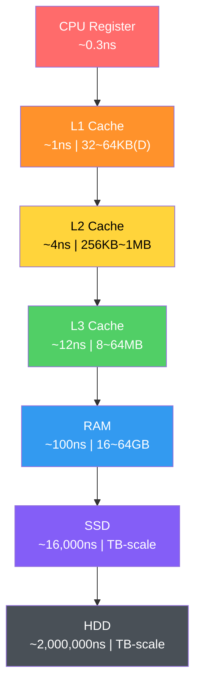
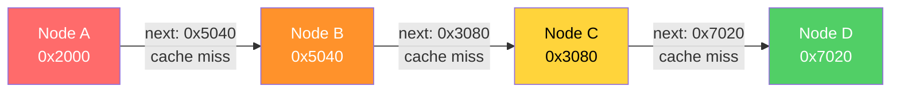
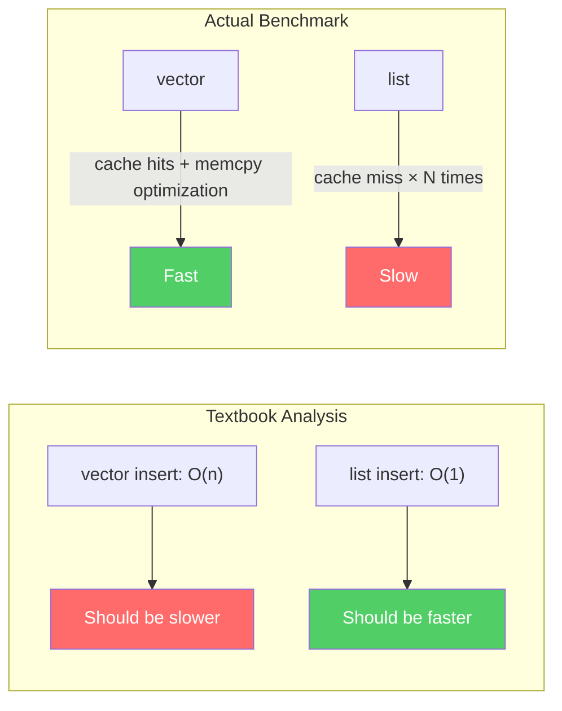
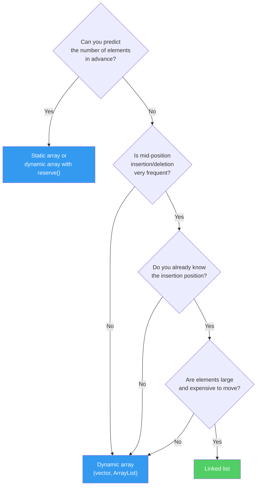

## Introduction

> This is the first installment of the **CS Roadmap** series.

When you start programming, everyone learns arrays. Write `int arr[10]` and you get space for 10 integers. Next comes the linked list. Connect nodes with pointers and you can dynamically resize. Textbooks teach it like this:

- Array: access O(1), insertion/deletion O(n)
- Linked list: access O(n), insertion/deletion O(1)

"Choose appropriately depending on the situation." And that's where most education ends.

But there is something critically missing from this explanation. **Memory.** Data structures are not abstract concepts — they are physical structures that run on real hardware. Where an array's elements are placed in memory, where a linked list's nodes are scattered across the heap, what path the CPU takes to fetch data — if you don't know this, you only half-understand data structures.

This post revisits arrays and linked lists **from the perspective of memory**.

Upcoming series plan:

| Part | Topic | Core Question |
| --- | --- | --- |
| **Part 1 (this post)** | Arrays and Linked Lists | Why is there a 100x difference for the same O(n) traversal? |
| **Part 2** | Stacks, Queues, Deques | Where are LIFO and FIFO used? |
| **Part 3** | Hash Tables | How do you design hash functions and resolve collisions? |
| **Part 4** | Trees | Why do we need BST, Red-Black Trees, and B-Trees? |
| **Part 5** | Graphs | What are the principles behind search, shortest path, and topological sort? |
| **Part 6** | Memory Management | What are the trade-offs between stack/heap, GC, and manual memory management? |

---

## Part 1: Memory Hierarchy — Where It All Begins

Before understanding data structures, you must first understand the **stage** on which they operate. That stage is the memory hierarchy.

### Why Is Memory Hierarchical?

An ideal memory would be infinitely large, infinitely fast, and infinitely cheap. In reality, these three cannot hold simultaneously:

- **Fast memory is expensive and small** (SRAM → cache)
- **Large memory is slow and cheap** (DRAM → RAM)
- **Massive storage is even slower** (SSD, HDD)

Because of these physical constraints, modern computers organize memory **hierarchically**. Frequently used data stays close; rarely used data stays far away.

### Latency — The Reality in Numbers

Jeff Dean's (Google) "Latency Numbers Every Programmer Should Know" is fundamental knowledge for systems programming.


_A visual diagram of Jeff Dean's latency numbers. The small black square (1ns) represents L1 cache, while the large blue block (100ns) represents RAM access. The size difference is the performance difference. (Source: gist.github.com/2841832)_

The figures below are **rough estimates** for modern hardware. They can vary by 2–3x depending on the specific CPU and device, so read them not as exact constants but as a guide for **"what order of magnitude are we talking about"**:

| Layer | Latency | Analogy (scaling 1ns = 1 second) |
| --- | --- | --- |
| **L1 cache reference** | ~1 ns | **1 second** |
| **Branch mispredict** | ~3 ns | 3 seconds |
| **L2 cache reference** | ~4 ns | 4 seconds |
| **L3 cache reference** | ~12 ns | 12 seconds |
| **Mutex lock/unlock** | ~17 ns | 17 seconds |
| **RAM reference** | ~100 ns | **1 minute 40 seconds** |
| **Compress 1KB** | ~3,000 ns | 50 minutes |
| **SSD random read** | ~16,000 ns | **4 hours 26 minutes** |
| **SSD sequential read 1MB** | ~49,000 ns | 13 hours |
| **HDD seek** | ~2,000,000 ns | **23 days** |
| **HDD sequential read 1MB** | ~825,000 ns | 9.5 days |



> **A Quick Note on Terminology**
>
> **What is ns (nanosecond)?** One nanosecond is one billionth of a second. 1ns = 0.000000001 seconds. A single blink of your eye takes about 300 million ns. In the world where CPUs operate, even 1ns is a meaningful amount of time.
>
> **What are L1, L2, L3 caches?** These are ultra-fast memories physically built into the CPU chip itself. The lower the number, the closer to the CPU core — faster, but smaller:
> - **L1 cache** — Right next to the CPU core. The fastest (~1ns). L1 is actually split into two parts: one for "code (L1I)" and one for "data (L1D)." What data structures like arrays and linked lists use is the data cache (L1D), which is typically 32–64KB per core.
> - **L2 cache** — Behind L1. 256KB–1MB per core. Slightly slower (~4ns).
> - **L3 cache** — Shared among multiple cores. 8–64MB. Slower (~12ns), but still much faster than RAM (~100ns).
>
> These three layers act as a **speed buffer** between the CPU and RAM. If data is in L1, it takes ~1ns; if it must go all the way to RAM, ~100ns — it can be tens to 100x slower. CPUs do use tricks like "pre-fetching data it thinks you'll need next" and "executing instructions out of order" to partially hide this delay, but when you repeatedly access data that isn't in cache, the performance gap is still very real.

Let's revisit the key point. **L1 cache access is ~1ns, RAM access is ~100ns**. Roughly a 100x difference. CPUs have various optimizations that partially reduce this gap, but when cache misses pile up, the performance difference is still dramatic. This is the real reason why data structure selection matters.

### How Does the Cache Work?

Suppose the CPU requests data at memory address `0x1000`. The CPU first checks the L1 cache. If the data is there — **cache hit** — it retrieves the data in 1ns. If not — **cache miss** — it must go down to L2, L3, or in the worst case, all the way to RAM.

The important thing here is that the CPU doesn't fetch just one byte at `0x1000`. The CPU fetches data in units of **cache lines**. The cache line size on modern CPUs is almost always **64 bytes**.

```
Memory address:  0x1000  0x1004  0x1008  ...  0x103C
                ├──────────── 64-byte cache line ────────────┤
                │  int[0]  int[1]  int[2]  ...  int[15]     │
                └───────────────────────────────────────────┘
```

When you read `arr[0]` from an `int` (4-byte) array, `arr[1]` through `arr[15]` are loaded into the cache **for free**. This is **spatial locality**. Since neighboring memory is likely to be used soon, it is fetched in advance.

Furthermore, if you read `arr[0]` and then immediately read `arr[0]` again, it is already in the cache. This is **temporal locality**. Recently accessed data is likely to be used again soon.

Modern CPUs go one step further. A **hardware prefetcher** detects memory access patterns and loads the next likely needed data into the cache ahead of time. When traversing an array sequentially, the prefetcher prepares data in advance. Sequential memory access is optimized at the hardware level.

> **Wait, let's address this**
>
> **Q. How can you verify that the cache line is 64 bytes?**
>
> On Linux, you can check with `getconf LEVEL1_DCACHE_LINESIZE`. On macOS, use `sysctl hw.cachelinesize`. It is 64 bytes on most x86 and ARM processors. Some embedded systems use 32 bytes.
>
> **Q. What happens when the cache is full?**
>
> When new data comes in, an existing cache line must be **evicted**. The cache doesn't search the entire cache for the oldest line — instead, each memory address belongs to a **small group (set)**, and the replacement candidate is chosen only within that group. The replacement policy is theoretically LRU (Least Recently Used) — "evict the line that hasn't been used the longest" — but real CPUs often use simplified approximations of LRU.

---

## Part 2: Arrays — The Power of Contiguous Memory

### Definition of an Array

An array is a **data structure where elements of the same type are stored sequentially in contiguous memory**. That is all an array is, and that is the entire reason arrays are powerful.

When you declare `int arr[8]`, it is laid out in memory like this:

```
Address:  0x100  0x104  0x108  0x10C  0x110  0x114  0x118  0x11C
          ┌──────┬──────┬──────┬──────┬──────┬──────┬──────┬──────┐
          │ a[0] │ a[1] │ a[2] │ a[3] │ a[4] │ a[5] │ a[6] │ a[7] │
          └──────┴──────┴──────┴──────┴──────┴──────┴──────┴──────┘
           4byte  4byte  4byte  4byte  4byte  4byte  4byte  4byte
```

32 bytes. Exactly half a cache line. This entire array fits into one (or two) cache lines.

### O(1) Random Access — Why Is It Possible?

To access `arr[5]`, you simply add `5 × sizeof(int)` = 20 bytes to the base address:

$$\text{address}(arr[i]) = \text{base address} + i \times \text{element size}$$

A single addition and multiplication. This is O(1) — even with 1 million elements, you can access any element in one step as long as you know the index. This is the most fundamental strength of arrays.

### Cache-Friendly Traversal

The true power of arrays reveals itself in **traversal**.

```c
// Array traversal: sequential memory access
int sum = 0;
for (int i = 0; i < N; i++) {
    sum += arr[i];  // Accessing consecutive addresses in order
}
```

Here is what happens at the hardware level when this loop executes:

1. Access `arr[0]` → cache miss → load 64 bytes (arr[0]~arr[15]) from RAM
2. Access `arr[1]` ~ `arr[15]` → **all cache hits** (already loaded)
3. Access `arr[16]` → cache miss → load next 64 bytes
4. Repeat...

**15 out of 16 accesses are cache hits**. A cache hit rate of 93.75%. Add to that the hardware prefetcher detecting the pattern and pre-loading the next cache line, and virtually all accesses are served from the L1 cache.

### The Cost of Insertion and Deletion

The downside of arrays is **mid-position insertion/deletion**. To insert a new element at `arr[3]`:

```
Before: [1] [2] [3] [5] [6] [7] [8] [ ]
                     ↓
After:  [1] [2] [3] [4] [5] [6] [7] [8]
                  ↑insert  →→→→→→→→→→→→
                          4 elements shifted right
```

Inserting at position i among n elements requires shifting n - i elements by one position. Worst case (inserting at the front): O(n). However, this "shifting" operation itself is implemented with `memcpy`/`memmove`, and **contiguous memory copying is extremely cache-friendly for the CPU**. We will revisit this when comparing with linked lists.

---

## Part 3: Linked Lists — The World of Pointers

### Definition of a Linked List

A linked list is a data structure where each element (node) stores **both its data and the address (pointer) of the next node**.

```c
struct Node {
    int data;       // 4 bytes
    Node* next;     // 8 bytes (64-bit system)
};
```

A single node requires at least 12 bytes (16 bytes with padding). To store 4 bytes of data, you use a minimum of 3-4x the memory. This is the first cost.

### Memory Layout — Scattered Nodes

Unlike arrays, linked list nodes are **individually allocated** on the heap. Depending on allocation order, heap state, and memory fragmentation, the physical location of each node varies widely:

```
Memory space:

0x2000: [Node A | data=1 | next=0x5040 ]
0x2010: (in use by another object)
  ...
0x5040: [Node B | data=2 | next=0x3080 ]
0x5050: (in use by another object)
  ...
0x3080: [Node C | data=3 | next=0x7020 ]
  ...
0x7020: [Node D | data=4 | next=NULL   ]
```

To go from Node A to Node B, you must jump from 0x2000 to 0x5040. They are more than 12KB apart. Since a cache line is 64 bytes, **nearly every node access triggers a cache miss**.



### O(1) Insertion/Deletion — The Theoretical Advantage

The textbook advantage of linked lists is insertion/deletion. If you already know the target node, you only need to swap pointers:

```
Before: A → B → D
After:  A → B → C → D

B->next = C     // 1. Make the new node point to D
C->next = D     // 2. Make B point to the new node
```

No shifting or copying of elements. O(1). But there is an important prerequisite: **you must already know the node at the insertion point**. If you don't, you have to traverse from the beginning — O(n).

### Doubly Linked Lists

In practice, **doubly linked lists** are used more often than singly linked lists:

```c
struct DNode {
    int data;       // 4 bytes
    DNode* prev;    // 8 bytes
    DNode* next;    // 8 bytes
};
// At least 24 bytes with padding — 6x the data size
```

They enable bidirectional traversal and O(1) deletion (since you can access the predecessor from the node itself), but the memory overhead is even greater.

---

## Part 4: The Truth About Performance — The Gap Between Theory and Reality

### Bjarne Stroustrup's Experiment

Bjarne Stroustrup, the creator of C++, has repeatedly demonstrated `std::vector` vs `std::list` benchmarks across numerous talks. The experiment goes like this:

**Test**: Repeatedly perform random insertions/deletions while maintaining N integers in sorted order

- `std::vector`: Find the insertion point via binary search, shift elements to insert
- `std::list`: Traverse from the beginning to find the insertion point, swap pointers to insert

**Textbook prediction**: The list should win. Insertion is O(1), after all.

**Actual result**: From the moment N exceeds a few hundred, **vector dominates list**. The gap widens as N grows.




_Benchmark reproduced from Bjarne Stroustrup's Going Native 2012 presentation. As the number of elements increases, the gap between vector (blue line) and list (red line) grows dramatically. Even a pre-allocated list (green line) fails to beat vector._

The reason lies in the memory hierarchy explained in Part 1:

1. **vector traversal**: contiguous memory → cache hits → prefetcher active → near L1 speed
2. **list traversal**: scattered nodes → cache misses → RAM access → 100x slower
3. **vector element shifting**: `memmove` → contiguous memory block copy → CPU handles this very efficiently
4. **list memory allocation**: `new Node()` → heap allocation → expensive

Stroustrup's conclusion:

> "Don't store data in a linked list unless you need to. Use a compact data structure. Vector beats list for almost everything."

### Putting Numbers to It

Let's calculate a scenario of traversing 1 million `int`s:

**Array**:
- 16 ints per cache line (64B / 4B)
- Cache line loads needed: 1,000,000 / 16 = 62,500
- With prefetcher active, most are L1 hits → ~1ns × 1,000,000 ≈ **~1ms**

**Linked list**:
- High probability of a cache miss per node
- Worst case: RAM access ~100ns × 1,000,000 = **~100ms**

The same "O(n) traversal" yields a **100x difference**. Even when Big-O is identical, the constant differs by 100x.

A 2023 paper "RIP Linked List" (arXiv:2306.06942) empirically demonstrated this phenomenon at scale. After benchmarking various list implementations, **the top 3 performance rankings were all held by array-based implementations**. Benchmarks from Johnny's Software Lab produced even more dramatic results:

- Linked list with contiguously allocated memory: **~0.12 seconds**
- Randomly allocated linked list: **68x slower** for medium datasets, **125x slower** for large datasets
- L3 cache miss rate for large linked lists: **99%** — the cache is essentially useless

### Ulrich Drepper's Evidence

Ulrich Drepper systematically experimented with this phenomenon in his 2007 paper **"What Every Programmer Should Know About Memory"**. His key findings:

- **Sequential access (arrays)**: Even when data size exceeds the L1 cache, latency barely increases thanks to the hardware prefetcher
- **Random access (similar to linked lists)**: Latency **jumps in staircase fashion** each time the data size exceeds a cache level
- ~4x increase at the L1 → L2 boundary, ~3x at L2 → L3, ~8x or more at L3 → RAM


_Figure 3.15 from Drepper's 2007 paper. The X-axis is working set size (2^10 ~ 2^29 bytes), the Y-axis is cycles per element access. Sequential access (red diamonds) stays near zero regardless of data size, while random access (blue triangles) spikes sharply the moment it exceeds cache capacity. (Source: lwn.net)_

The sequential access line is nearly flat. The prefetcher handles everything. Random access, on the other hand, slows down drastically the moment data no longer fits in the cache. This paper numerically proved that **the memory layout of a data structure determines performance just as much as algorithmic complexity**.

> **Wait, let's address this**
>
> **Q. So are linked lists completely useless?**
>
> No. There are cases where linked lists remain valid:
> - **Very large elements**: When element size is several KB or more, the cost of moving elements exceeds the cost of swapping pointers
> - **Frequent mid-position insertion/deletion + position already known**: O(1) insertion when holding an iterator
> - **Stable references required**: Arrays invalidate all pointers on reallocation, but a list node's address never changes
> - **Inside OS kernels**: The Linux kernel extensively uses the `list_head` structure in scheduler queues, memory management, and more
>
> The key takeaway is not "never use lists" but rather **"default to arrays, and only use lists when you can articulate why a list is necessary."**

---

## Part 5: Dynamic Arrays — The Secret of Resizable Arrays

The size of a static array is determined at compile time. But in reality, you almost never know in advance how much data will arrive. That is why **dynamic arrays** are needed.

C++'s `std::vector`, Java's `ArrayList`, C#'s `List<T>`, Python's `list` — all are dynamic arrays.

### Basic Principle

A dynamic array contains a **fixed-size array** internally. When elements are added and the array becomes full:

1. Allocate a larger array
2. Copy all existing elements
3. Free the old array

```
State 1: capacity=4, size=4 (full)
[1] [2] [3] [4]

push_back(5) called → insufficient capacity!

State 2: capacity=8, size=5 (new array allocated + copied)
[1] [2] [3] [4] [5] [ ] [ ] [ ]
```

The question is **how much larger** to make the new array.

### Growth Factor — 2x vs 1.5x

The most common strategy is **geometric growth**. When capacity is insufficient, multiply the current capacity by a fixed factor.

**2x growth (`std::vector` in GCC/Clang)**:

```
4 → 8 → 16 → 32 → 64 → 128 → 256 → ...
```

**1.5x growth (`std::vector` in MSVC, `folly::fbvector`)**:

```
4 → 6 → 9 → 13 → 19 → 28 → 42 → ...
```

Why do some implementations choose 1.5x? Facebook's `folly::fbvector` documentation explains the reasoning:

The problem with 2x growth: the new memory size needed is **always larger than the sum of all previously freed blocks**.

$$2^n > 2^0 + 2^1 + 2^2 + \cdots + 2^{n-1} = 2^n - 1$$

Therefore, previously freed memory blocks can **never be reused**. The memory allocator must always find a new region.

With 1.5x growth, however, after a certain number of reallocations, the sum of previous blocks can satisfy the new block size:

$$1.5^n < 1.5^0 + 1.5^1 + \cdots + 1.5^{n-1} \quad (\text{for sufficiently large } n)$$

Theoretically, when the growth factor is at or below the **golden ratio φ ≈ 1.618**, reuse of previous blocks becomes possible.

| Growth Factor | Used By | Previous Memory Reuse | Reallocation Frequency |
| --- | --- | --- | --- |
| **2x** | GCC/Clang `vector` | Impossible | Low |
| **1.5x** | MSVC `vector`, `folly::fbvector` | Possible (after 4th reallocation) | Medium |
| **φ ≈ 1.618** | Theoretical optimal boundary | Possible | Medium |

A comparison of actual language implementations:

| Language/Implementation | Growth Factor | Notes |
| --- | --- | --- |
| GCC/Clang `std::vector` | 2.0 | |
| MSVC `std::vector` | 1.5 | |
| Java `ArrayList` | 1.5 | |
| C# `List<T>` | 2.0 | |
| Rust `Vec` | 2.0 | |
| Python `list` | ~1.125 | 0, 4, 8, 16, 24, 32, 40, 52... |
| Go `slice` | 2.0 (≤1024), 1.25 (>1024) | Varies by size |
| Facebook `folly::fbvector` | 1.5 | 2x up to 4KB, then 1.5x |

### Amortized Analysis — The Secret Behind O(1)

If you `push_back` n times into a dynamic array, some insertions incur O(n) copying. So why do we say "push_back is O(1)"?

The core idea of **amortized analysis** is to **spread the cost of expensive operations across cheap ones**.

With 2x growth, let's calculate the total number of copies over n insertions:

- capacity 1 → 2: 1 copy
- capacity 2 → 4: 2 copies
- capacity 4 → 8: 4 copies
- ...
- capacity n/2 → n: n/2 copies

Total copies:

$$1 + 2 + 4 + 8 + \cdots + \frac{n}{2} = n - 1$$

Over n insertions, the total is n - 1 copies. Average copies per insertion:

$$\frac{n - 1}{n} < 1$$

Therefore, **amortized O(1)**. Occasionally O(n) spikes occur, but averaged over all operations, it is O(1).

This analysis method was formalized by Robert Tarjan in his 1985 paper "Amortized Computational Complexity." There are three techniques:

1. **Aggregate Method**: Divide total cost by the number of operations (the method used above)
2. **Accounting Method**: Assign "credits" to cheap operations to prepay for expensive ones
3. **Potential Method**: Define a "potential energy" for the data structure to analyze costs

All three methods reach the same conclusion: geometric growth of dynamic arrays **guarantees amortized O(1) insertion**.

> **Wait, let's address this**
>
> **Q. If it's amortized O(1), is it safe even in the worst case?**
>
> No. An **individual insertion** can still be O(n). In a real-time system where you must complete a frame within 16.67ms (60fps), a reallocation hitting during that frame is a problem. In such cases:
> - Use `reserve()` to pre-allocate capacity
> - Use an object pool
> - Consider reallocation-free data structures (e.g., chunked lists)
>
> **Q. When should you use reserve()?**
>
> When you know an upper bound on the number of elements. Calling `vector.reserve(1000)` allows up to 1000 insertions without reallocation. This alone eliminates unnecessary reallocations and makes performance predictable.

---

## Part 6: How to Read Time Complexity Correctly

### Big-O Is an Upper Bound

The precise definition of Big-O notation:

$$f(n) = O(g(n)) \iff \exists\, c > 0,\, n_0 > 0 \text{ such that } f(n) \leq c \cdot g(n) \text{ for all } n \geq n_0$$

Saying f(n) is O(g(n)) means that **for sufficiently large n, f(n) does not exceed c·g(n)**. It is an upper bound.

Therefore:
- Array access being O(1) means it completes in constant time **regardless** of input size
- Linear search being O(n) means it takes time proportional to n in the worst case

### What Big-O Hides

Big-O **ignores constant factors**. We say O(n) is "faster" than O(n log n), but if the constants differ, the reality can be reversed:

- Algorithm A: $100n$ → O(n)
- Algorithm B: $2n \log n$ → O(n log n)

At n = 1,000:
- A: 100,000
- B: 2 × 1,000 × 10 = 20,000

A, which is O(n), is **5x slower** than B, which is O(n log n). A only wins when n becomes very large.

And the **cache miss cost** we examined earlier is precisely this "constant." Both arrays and linked lists have O(n) traversal, but the linked list's "constant" includes 100ns per cache miss, while the array's "constant" includes only 1ns per cache hit.

### The Three Notations

| Notation | Meaning | Analogy |
| --- | --- | --- |
| **O(f(n))** | Upper bound (no worse than this in the worst case) | Ceiling |
| **Ω(f(n))** | Lower bound (no better than this in the best case) | Floor |
| **Θ(f(n))** | Exact order (upper and lower bounds are the same) | Exact height |

Examples:
- Binary search on a sorted array: **O(log n)**, **Ω(1)** (might find it on the first try), **Θ(log n)** on average
- Linear search on an unsorted array: **O(n)**, **Ω(1)**, average **Θ(n/2) = Θ(n)**

### Why Complexity Alone Is Not Enough

Synthesizing the discussion so far:

1. **Big-O ignores constants** — cache miss costs are hidden in those "constants"
2. **Big-O assumes sufficiently large input** — in reality, when n is small, the constant dominates
3. **Memory access patterns determine performance** — even with the same O(n), sequential vs random access differs by 100x

This is the core message Mike Acton (former engine programmer at Insomniac Games) emphasized in his GDC 2014 talk "Data-Oriented Design and C++":

> "Where there is one, there are many. If you have a problem and you're applying the solution to one thing, it almost certainly should be applied to more than one."

Data rarely exists in isolation. When there are many data items, **how they are laid out in memory** can matter more than algorithmic complexity. Chandler Carruth (LLVM lead developer) put it more directly at CppCon 2014:

> "Discontiguous data structures are the root of all (performance) evil."

This is the starting point of **Data-Oriented Design**, which will be revisited in advanced topics later in the series.

---

## Part 7: Summary — Array vs Linked List Comparison

### Comprehensive Comparison

| Property | Array | Linked List |
| --- | --- | --- |
| **Memory layout** | Contiguous | Scattered |
| **Index access** | O(1) | O(n) |
| **Sequential traversal** | O(n), cache-friendly | O(n), cache-unfriendly |
| **Append (end)** | Amortized O(1) | O(1) (with tail pointer) |
| **Mid insertion** | O(n) — element shifting | O(1) — pointer swap (if position is known) |
| **Mid deletion** | O(n) — element shifting | O(1) — pointer swap (if position is known) |
| **Memory overhead** | None (+ unused capacity) | 1-2 pointers per node |
| **Reference stability** | Invalidated on reallocation | Always valid |
| **Cache performance** | Excellent | Poor |
| **Allocation cost** | Once (+ reallocations) | Once per node |

### When to Use What



Most paths lead to arrays. To reach linked lists, **three conditions must be met simultaneously**: frequent mid-position insertion, position already known, and high element-moving cost. Cases where all three hold true are rarer than you might think.

---

## Conclusion: Data Structures Are Physical, Not Abstract

Key takeaways from this post:

1. **The memory hierarchy** is the starting point for all performance. The 100x gap between L1 cache (1ns) and RAM (100ns) becomes the practical criterion for data structure selection.

2. **Arrays are simple but powerful.** Thanks to contiguous memory layout, they enjoy the benefits of cache locality, hardware prefetching, and efficient memory copying.

3. **The theoretical advantages of linked lists are offset on modern hardware.** The cost of cache misses often outweighs the benefit of O(1) insertion. Stroustrup's and Drepper's experiments prove this.

4. **Geometric growth of dynamic arrays** guarantees amortized O(1) insertion through amortized analysis. The choice of growth factor (2x vs 1.5x) is a trade-off between memory reuse and reallocation frequency.

5. **Big-O is a starting point, not a conclusion.** You must consider constant factors, cache performance, and memory access patterns to make the right data structure choice.

The first chapter of a data structures textbook typically starts with abstract interfaces (ADTs). "A list is an abstract data type that supports insertion, deletion, and access." This abstraction is useful when learning concepts, but **when writing actual code, you cannot ignore the physical characteristics of the implementation.**

As Dijkstra said, the purpose of abstraction is not to be vague, but to create a new semantic level in which one can be absolutely precise. Knowing the abstract difference between arrays and linked lists (access O(1) vs O(n)) is not enough — only when you understand **why those differences exist and how they are amplified on real hardware** do you truly understand data structures.

In the next installment, we will cover **stacks, queues, and deques** — the powerful abstractions created by restricted access.

---

## References

**Key Papers and Technical Documents**
- Drepper, U., "What Every Programmer Should Know About Memory" (2007) — [lwn.net](https://lwn.net/Articles/250967/)
- Tarjan, R., "Amortized Computational Complexity", SIAM Journal on Algebraic and Discrete Methods (1985)
- Frigo, M. et al., "Cache-Oblivious Algorithms", Proceedings of the 40th FOCS (1999) — Algorithm design that achieves near-optimal cache performance without knowledge of the cache
- Dean, J. & Barroso, L.A., "The Tail at Scale", Communications of the ACM (2013) — The original source of the latency numbers

**Talks and Presentations**
- Stroustrup, B., "Why you should avoid Linked Lists" — Repeated across numerous C++ conference keynotes
- Acton, M., "Data-Oriented Design and C++", GDC 2014 — The core message that data layout determines performance
- Carruth, C., "Efficiency with Algorithms, Performance with Data Structures", CppCon 2014 — The relationship between the physical properties of data structures and performance

**Textbooks**
- Cormen, T.H. et al., *Introduction to Algorithms (CLRS)*, MIT Press — The standard algorithms textbook, amortized analysis in Chapter 17
- Bryant, R. & O'Hallaron, D., *Computer Systems: A Programmer's Perspective (CS:APP)*, Pearson — Memory hierarchy in Chapter 6
- Hennessy, J. & Patterson, D., *Computer Architecture: A Quantitative Approach*, Morgan Kaufmann — Cache design and performance analysis
- Knuth, D., *The Art of Computer Programming Vol. 1: Fundamental Algorithms*, Addison-Wesley — Classical analysis of arrays and linked lists
- Sedgewick, R. & Wayne, K., *Algorithms*, 4th Edition, Addison-Wesley

**Additional Papers and Benchmarks**
- "RIP Linked List", arXiv:2306.06942 (2023) — Comprehensive empirical comparison of various list implementations
- Johnny's Software Lab, "The Quest for the Fastest Linked List" — Measured extreme performance differences based on linked list memory layout
- Lemire, D., "How fast should your dynamic arrays grow?" (2013) — Mathematical analysis of growth factors

**Implementation References**
- Facebook `folly::fbvector` — Documents the rationale for choosing the 1.5x growth factor
- Linux kernel `list.h` — Kernel-level use case of doubly linked lists
