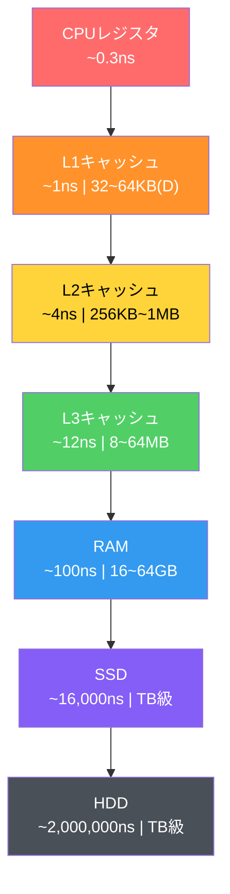
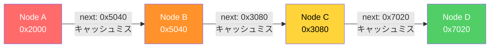
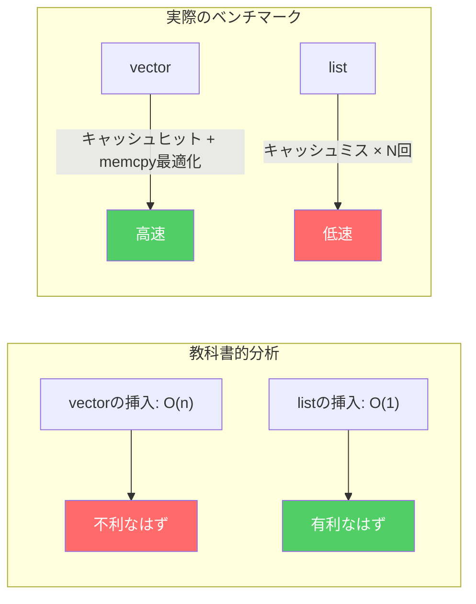
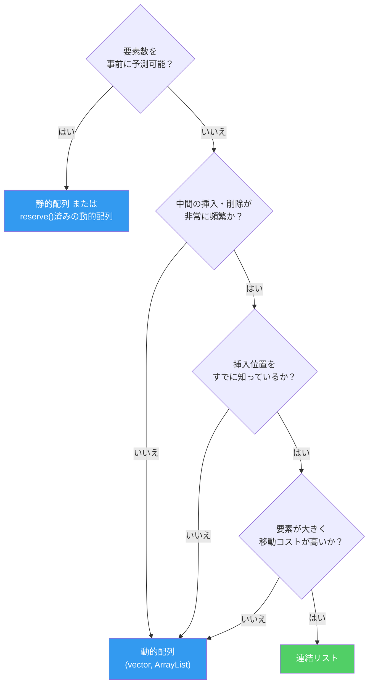

## はじめに

> この文書は **CSロードマップ** シリーズの第1回です。

プログラミングを始めると、誰もがまず配列を学びます。`int arr[10]`と書けば、整数10個分の領域が確保されます。次に連結リストを学びます。ノードをポインタで繋げば、サイズを動的に調整できます。教科書はこう教えます：

- 配列：アクセス O(1)、挿入・削除 O(n)
- 連結リスト：アクセス O(n)、挿入・削除 O(1)

「状況に応じて適切に選択しましょう。」ここで大半の教育は終わります。

しかし、この説明には決定的に欠けているものがあります。**メモリ**です。データ構造は抽象的な概念ではなく、実際のハードウェア上で動作する物理的な構造です。配列の要素がメモリのどこに配置されるのか、連結リストのノードがヒープのどこに散在するのか、CPUがデータを取得する際にどのような経路をたどるのか — これを知らなければ、データ構造を半分しか理解していないことになります。

この記事では、配列と連結リストを**メモリの観点から**改めて見ていきます。

以降のシリーズ構成：

| 回 | テーマ | 核心的な問い |
| --- | --- | --- |
| **第1回（今回）** | 配列と連結リスト | 同じO(n)走査なのに、なぜ100倍の差が生じるのか？ |
| **第2回** | スタック、キュー、デック | LIFOとFIFOはどこで使われるのか？ |
| **第3回** | ハッシュテーブル | ハッシュ関数はどう設計し、衝突はどう解決するのか？ |
| **第4回** | ツリー | BST、Red-Black Tree、B-Treeはなぜ必要なのか？ |
| **第5回** | グラフ | 探索、最短経路、トポロジカルソートの原理は？ |
| **第6回** | メモリ管理 | スタック/ヒープ、GC、手動メモリ管理のトレードオフは？ |

---

## Part 1: メモリ階層構造 — すべての出発点

データ構造を理解する前に、そのデータ構造が載る**舞台**をまず理解しなければなりません。その舞台がメモリ階層構造(Memory Hierarchy)です。

### なぜメモリは階層的なのか

理想的なメモリは、無限に大きく、無限に速く、無限に安いものであるべきです。現実では、この3つが同時に成り立つことはありません：

- **速いメモリは高価で小さい** (SRAM → キャッシュ)
- **大きいメモリは遅くて安い** (DRAM → RAM)
- **巨大なストレージはさらに遅い** (SSD, HDD)

この物理的制約のため、現代のコンピュータはメモリを**階層的に**構成しています。頻繁に使うデータは近くに、たまにしか使わないデータは遠くに配置します。

### レイテンシ — 数値で見る現実

Jeff Dean(Google)がまとめた"Latency Numbers Every Programmer Should Know"は、システムプログラミングの基本常識です。


_Jeff Deanのレイテンシ数値を可視化したダイアグラム。小さな黒い四角形(1ns)がL1キャッシュ、大きな青いブロック(100ns)がRAMアクセスを表す。サイズの差がそのまま性能差となる。 (出典: gist.github.com/2841832)_

以下は現代のハードウェア基準での**おおよその数値**です。CPU の種類やデバイスによって2〜3倍程度異なることがあるため、正確な定数ではなく**「どのくらいの規模か」を掴むための参考値**として読んでください：

| 階層 | レイテンシ | 比喩 (1ns = 1秒に換算) |
| --- | --- | --- |
| **L1キャッシュ参照** | ~1 ns | **1秒** |
| **分岐予測ミス** | ~3 ns | 3秒 |
| **L2キャッシュ参照** | ~4 ns | 4秒 |
| **L3キャッシュ参照** | ~12 ns | 12秒 |
| **Mutexロック/アンロック** | ~17 ns | 17秒 |
| **RAM参照** | ~100 ns | **1分40秒** |
| **1KBデータ圧縮** | ~3,000 ns | 50分 |
| **SSDランダム読み取り** | ~16,000 ns | **4時間26分** |
| **SSD 1MBシーケンシャル読み取り** | ~49,000 ns | 13時間 |
| **HDDシーク** | ~2,000,000 ns | **23日** |
| **HDD 1MBシーケンシャル読み取り** | ~825,000 ns | 9.5日 |



> **用語の整理**
>
> **ns（ナノ秒）とは？** 1ナノ秒（nanosecond）は10億分の1秒です。1ns = 0.000000001秒。瞬きを一回するのに約3億nsかかります。CPUが動作する世界では、1nsでも十分に長い時間です。
>
> **L1、L2、L3キャッシュとは？** CPUチップの内部に物理的に内蔵された超高速メモリです。数字が小さいほどCPUコアに近く、より速く、より小さくなります：
> - **L1キャッシュ** — CPUコアのすぐ隣。最も高速（~1ns）。実はL1は「コード用のキャッシュ(L1I)」と「データ用のキャッシュ(L1D)」の2つに分かれています。配列や連結リストなどのデータ構造が使うのはデータキャッシュ(L1D)側で、コアあたり通常32〜64KBの大きさです。
> - **L2キャッシュ** — L1の後ろに位置。コアあたり256KB〜1MB。やや遅い（~4ns）。
> - **L3キャッシュ** — 複数のコアが共有。8〜64MB。さらに遅い（~12ns）が、RAM（~100ns）よりはるかに速い。
>
> この3つの階層が、RAMとCPUの間で**速度差を緩衝する役割**を果たします。データがL1にあれば~1ns、なくてRAMまで行かなければならなければ~100ns — 数十〜100倍遅くなり得ます。もちろんCPUは「次に必要なデータを先読みする」「命令を順番に関係なく実行する」といった工夫でこの遅延を一部隠してくれますが、キャッシュにないデータを繰り返しアクセスすると、性能差は依然として大きいです。

核心を改めて確認しましょう。**L1キャッシュアクセスは~1ns、RAMアクセスは~100ns**。約100倍の差です。CPUの様々な最適化がこの差を一部縮めてくれますが、キャッシュミスが蓄積すると性能差は依然として劇的です。これこそが、データ構造の選択が重要である本当の理由です。

### キャッシュはどのように動作するのか

CPUがメモリアドレス`0x1000`のデータを要求するとします。CPUはまずL1キャッシュを確認します。あれば**キャッシュヒット(cache hit)** — 1nsでデータを取得できます。なければ**キャッシュミス(cache miss)** — L2、L3、最悪の場合RAMまで辿らなければなりません。

ここで重要なのは、CPUが`0x1000`の1バイトだけを取得するわけではないという点です。CPUは**キャッシュライン(cache line)**単位でデータを取得します。現代のCPUのキャッシュラインサイズはほとんどの場合**64バイト**です。

```
メモリアドレス:  0x1000  0x1004  0x1008  ...  0x103C
             ├──────────── 64バイト キャッシュライン ────────────┤
             │  int[0]  int[1]  int[2]  ...  int[15]     │
             └───────────────────────────────────────────┘
```

`int`(4バイト)の配列で`arr[0]`を読むと、`arr[1]`から`arr[15]`まで**無料で**キャッシュに載ります。これが**空間的局所性(spatial locality)**です。隣接するメモリをすぐに使う可能性が高いので、先に取得しておくのです。

もう一つ、`arr[0]`を読んだ直後にまた`arr[0]`を読めば、すでにキャッシュにあります。これが**時間的局所性(temporal locality)**です。最近アクセスしたデータをすぐにまた使う可能性が高いということです。

現代のCPUはここからさらに一歩進みます。**ハードウェアプリフェッチャ(hardware prefetcher)**がメモリアクセスパターンを検知して、次に必要なデータを事前にキャッシュに載せておきます。配列を順次走査すると、プリフェッチャが先回りしてデータを準備します。連続したメモリアクセスは、ハードウェアレベルで最適化されるのです。

> **ちょっと待って、ここは押さえておこう**
>
> **Q. キャッシュラインが64バイトであることはどうやって確認できるのか？**
>
> Linuxでは`getconf LEVEL1_DCACHE_LINESIZE`コマンドで確認できます。macOSでは`sysctl hw.cachelinesize`です。ほとんどのx86、ARMプロセッサで64バイトです。一部の組み込みシステムでは32バイトの場合もあります。
>
> **Q. キャッシュが満杯になるとどうなるのか？**
>
> 新しいデータが入ると、既存のキャッシュラインの一つを**追い出し(evict)**なければなりません。このとき、キャッシュ全体から最も古いラインを探すのではなく、メモリアドレスに応じた**小さなグループ(セット)の中だけ**で交換対象を選びます。交換ポリシーは理論上「最も長く使われていないものを追い出す」LRU(Least Recently Used)が有名ですが、実際のCPUはこれを簡略化した近似アルゴリズムを使うことが多いです。

---

## Part 2: 配列 — 連続メモリの力

### 配列の定義

配列(Array)は**同じ型の要素が連続したメモリ空間に順番に格納されるデータ構造**です。これが配列のすべてであり、配列が強力である理由のすべてです。

`int arr[8]`を宣言すると、メモリには次のように配置されます：

```
アドレス:  0x100  0x104  0x108  0x10C  0x110  0x114  0x118  0x11C
       ┌──────┬──────┬──────┬──────┬──────┬──────┬──────┬──────┐
       │ a[0] │ a[1] │ a[2] │ a[3] │ a[4] │ a[5] │ a[6] │ a[7] │
       └──────┴──────┴──────┴──────┴──────┴──────┴──────┴──────┘
        4byte  4byte  4byte  4byte  4byte  4byte  4byte  4byte
```

32バイト。ちょうどキャッシュラインの半分です。この配列全体がキャッシュライン1つ（または2つ）に収まります。

### O(1)ランダムアクセス — なぜ可能なのか

`arr[5]`にアクセスするには、開始アドレスから`5 × sizeof(int)` = 20バイトを加えるだけです：

$$\text{address}(arr[i]) = \text{base address} + i \times \text{element size}$$

単純な足し算と掛け算が1回ずつ。これがO(1) — 要素が100万個あっても、インデックスさえ分かれば一度でアクセスできます。配列の最も根本的な強みです。

### キャッシュフレンドリーな走査

配列の真の威力は**走査(traversal)**で発揮されます。

```c
// 配列走査: メモリを順次アクセス
int sum = 0;
for (int i = 0; i < N; i++) {
    sum += arr[i];  // 連続したアドレスを順にアクセス
}
```

このループ実行時にハードウェアで起きること：

1. `arr[0]`アクセス → キャッシュミス → RAMから64バイト(arr[0]~arr[15])をロード
2. `arr[1]` ~ `arr[15]`アクセス → **すべてキャッシュヒット**（すでにロード済み）
3. `arr[16]`アクセス → キャッシュミス → 次の64バイトをロード
4. 繰り返し...

**16回のアクセス中15回がキャッシュヒット**。キャッシュヒット率93.75%。さらにハードウェアプリフェッチャがパターンを検知して次のキャッシュラインを先に取得すれば、事実上ほぼすべてのアクセスがL1キャッシュで完結します。

### 挿入と削除のコスト

配列の弱点は**中間の挿入・削除**です。`arr[3]`に新しい要素を入れるには：

```
挿入前: [1] [2] [3] [5] [6] [7] [8] [ ]
                     ↓
挿入後: [1] [2] [3] [4] [5] [6] [7] [8]
                  ↑insert  →→→→→→→→→→→→
                          4つの要素を右にシフト
```

n個の要素の位置iに挿入すると、n - i個の要素を1つずつずらす必要があります。最悪の場合（先頭への挿入）O(n)。しかし、この「ずらす」操作自体は`memcpy`/`memmove`で実装されており、**連続したメモリのコピーはCPUとキャッシュに非常にフレンドリー**です。後ほど連結リストと比較する際に、この点を改めて確認します。

---

## Part 3: 連結リスト — ポインタの世界

### 連結リストの定義

連結リスト(Linked List)は、各要素（ノード）が**データと次のノードのアドレス（ポインタ）**を一緒に格納するデータ構造です。

```c
struct Node {
    int data;       // 4バイト
    Node* next;     // 8バイト (64ビットシステム)
};
```

1つのノードに最低12バイト（パディング込みで16バイト）が必要です。4バイトのデータを格納するために、最低3～4倍のメモリを使用します。これが最初のコストです。

### メモリ配置 — 散在するノードたち

配列とは異なり、連結リストのノードはヒープ(heap)に**個別に確保**されます。確保の順序、ヒープの状態、メモリの断片化(fragmentation)によって、ノードの物理的な位置はばらばらです：

```
メモリ空間:

0x2000: [Node A | data=1 | next=0x5040 ]
0x2010: (他のオブジェクトが使用中)
  ...
0x5040: [Node B | data=2 | next=0x3080 ]
0x5050: (他のオブジェクトが使用中)
  ...
0x3080: [Node C | data=3 | next=0x7020 ]
  ...
0x7020: [Node D | data=4 | next=NULL   ]
```

Node AからNode Bへ移動するには、0x2000から0x5040へジャンプしなければなりません。12KB以上離れています。キャッシュラインが64バイトなので、**ほぼすべてのノードアクセスがキャッシュミス**を引き起こします。



### O(1)挿入・削除 — 理論上の利点

連結リストの教科書的な利点は挿入・削除です。特定のノードが分かっていれば、ポインタを付け替えるだけで済みます：

```
挿入前: A → B → D
挿入後: A → B → C → D

B->next = C     // 1. 新しいノードがDを指すように
C->next = D     // 2. Bが新しいノードを指すように
```

要素をずらしたりコピーしたりする必要がありません。O(1)。ただし、ここには重要な前提があります：**挿入位置のノードをすでに知っていなければならない**のです。位置が分からなければ、先頭から走査する必要があるのでO(n)です。

### 双方向連結リスト

実務では単方向連結リストよりも**双方向連結リスト(doubly linked list)**の方がよく使われます：

```c
struct DNode {
    int data;       // 4バイト
    DNode* prev;    // 8バイト
    DNode* next;    // 8バイト
};
// パディング込みで最低24バイト — データの6倍
```

双方向の走査とO(1)削除（ノード自身さえ分かれば前任者にアクセス可能）が可能ですが、メモリオーバーヘッドはさらに大きくなります。

---

## Part 4: 性能の真実 — 理論と現実の乖離

### Bjarne Stroustrupの実験

C++の生みの親であるBjarne Stroustrupは、複数の講演で`std::vector` vs `std::list`のベンチマークを繰り返し披露しました。実験内容は次の通りです：

**テスト**: N個の整数をソート済みの状態を維持しながらランダムな挿入・削除を繰り返す

- `std::vector`: 挿入位置を二分探索で見つけ、要素をずらして挿入
- `std::list`: 挿入位置を先頭から走査して見つけ、ポインタを付け替えて挿入

**教科書的な予測**: リストが有利なはず。挿入がO(1)なのだから。

**実際の結果**: Nが数百を超えた時点から**vectorがlistを圧倒**しました。Nが大きくなるほど差は広がりました。




_Bjarne StroustrupのGoing Native 2012発表で再現されたベンチマーク。要素数が増えるほどvector（青線）とlist（赤線）の差が劇的に広がる。事前に確保したlist（緑線）ですらvectorに勝てない。_

理由はPart 1で説明したメモリ階層構造にあります：

1. **vectorの走査**: 連続メモリ → キャッシュヒット → プリフェッチャ作動 → ほぼL1速度
2. **listの走査**: 散在するノード → キャッシュミス → RAMアクセス → 100倍遅い
3. **vectorの要素移動**: `memmove` → 連続メモリブロックのコピー → CPUが非常に効率的に処理
4. **listのメモリ確保**: `new Node()` → ヒープ確保 → コストが大きい

Stroustrupの結論：

> "Don't store data in a linked list unless you need to. Use a compact data structure. Vector beats list for almost everything."

### 数値で換算

100万個の`int`を走査するシナリオを計算してみましょう：

**配列**：
- キャッシュラインあたり16個のint(64B / 4B)
- 必要なキャッシュラインロード回数: 1,000,000 / 16 = 62,500回
- プリフェッチャが作動すればほとんどL1ヒット → ~1ns × 1,000,000 ≈ **~1ms**

**連結リスト**：
- ノードごとにキャッシュミスの可能性が高い
- 最悪: RAMアクセス ~100ns × 1,000,000 = **~100ms**

同じ「O(n)走査」なのに**100倍の差**。Big-Oが同一でも、定数が100倍異なるのです。

2023年に発表された論文"RIP Linked List"(arXiv:2306.06942)は、この現象を大規模に実証しました。様々なリスト実装をベンチマークした結果、**上位3つの性能順位をすべて配列ベースの実装が独占**しました。Johnny's Software Labのベンチマークではさらに劇的な結果が出ています：

- メモリが連続的に配置された連結リスト: **~0.12秒**
- ランダムに配置された連結リスト: 中規模データセットで**68倍遅く**、大規模データセットで**125倍遅い**
- 大規模連結リストのL3キャッシュミス率: **99%** — キャッシュが事実上無用の長物

### Ulrich Drepperの証拠

Ulrich Drepperは2007年の論文**"What Every Programmer Should Know About Memory"**で、この現象を体系的に実験しました。彼が示した核心的な結果：

- **シーケンシャルアクセス（配列）**: データサイズがL1キャッシュを超えても、ハードウェアプリフェッチャのおかげでレイテンシはほとんど増加しない
- **ランダムアクセス（連結リストと類似）**: データサイズが各キャッシュレベルを超えるたびにレイテンシが**階段状に急増**
- L1 → L2境界で~4倍、L2 → L3境界で~3倍、L3 → RAM境界で~8倍以上の増加


_Drepper 2007論文のFigure 3.15。X軸は作業データサイズ(2^10 ~ 2^29バイト)、Y軸は要素あたりのアクセスサイクル。シーケンシャルアクセス(Sequential、赤いダイヤモンド)はデータサイズに関係なくほぼ0に近いが、ランダムアクセス(Random、青い三角形)はキャッシュを超えた瞬間に急激に跳ね上がる。 (出典: lwn.net)_

シーケンシャルアクセスの線はほぼ平坦です。プリフェッチャがすべてを解決します。一方、ランダムアクセスはデータがキャッシュに収まらなくなった瞬間、急激に遅くなります。**データ構造のメモリ配置がアルゴリズムの複雑度と同程度に性能を決定する**ことを、数値で証明した論文です。

> **ちょっと待って、ここは押さえておこう**
>
> **Q. では連結リストは使う場面がないのか？**
>
> いいえ。連結リストが依然として有効なケースはあります：
> - **非常に大きな要素**: 要素サイズが数KB以上の場合、要素の移動コストがポインタの付け替えよりも大きい
> - **頻繁な中間挿入・削除 + 位置をすでに知っている場合**: イテレータを保持した状態でのO(1)挿入
> - **安定した参照が必要な場合**: 配列は再確保時にすべてのポインタが無効化されるが、リストのノードアドレスは変わらない
> - **OSカーネル内部**: Linuxカーネルのスケジューラキュー、メモリ管理などで`list_head`構造体が広範囲に使用されている
>
> 核心は「リストを使うな」ではなく、**「デフォルトは配列とし、リストが必要な理由を説明できるときだけリストを使え」**ということです。

---

## Part 5: 動的配列 — サイズが変わる配列の秘密

静的配列のサイズはコンパイル時に決定されます。しかし、現実ではデータがどれだけ入ってくるかを事前に知ることができないケースがほとんどです。そこで**動的配列(dynamic array)**が必要になります。

C++の`std::vector`、Javaの`ArrayList`、C#の`List<T>`、Pythonの`list` — すべて動的配列です。

### 基本原理

動的配列は内部に**固定サイズの配列**を持っています。要素が追加されて配列が満杯になると：

1. より大きな配列を新たに確保する
2. 既存の要素をすべてコピーする
3. 既存の配列を解放する

```
状態1: capacity=4, size=4 (満杯)
[1] [2] [3] [4]

push_back(5) 呼び出し → 容量不足！

状態2: capacity=8, size=5 (新しい配列を確保 + コピー)
[1] [2] [3] [4] [5] [ ] [ ] [ ]
```

問題は「より大きな配列」を**どれだけ大きく**するかです。

### 成長因子 — 2倍 vs 1.5倍

最も一般的な戦略は**幾何級数的成長(geometric growth)**です。容量が不足すると、現在の容量の一定倍数に拡張します。

**2倍成長 (`std::vector` in GCC/Clang)**：

```
4 → 8 → 16 → 32 → 64 → 128 → 256 → ...
```

**1.5倍成長 (`std::vector` in MSVC, `folly::fbvector`)**：

```
4 → 6 → 9 → 13 → 19 → 28 → 42 → ...
```

なぜ1.5倍を選択する実装があるのでしょうか？ Facebookの`folly::fbvector`実装ドキュメントにその理由が説明されています：

2倍成長の問題点：新たに必要なメモリサイズが**以前に解放したすべてのブロックの合計よりも常に大きい**。

$$2^n > 2^0 + 2^1 + 2^2 + \cdots + 2^{n-1} = 2^n - 1$$

したがって、以前に解放されたメモリブロックを**絶対に再利用できません**。メモリアロケータは常に新しい領域を探さなければなりません。

一方、1.5倍成長では、一定回数後に以前のブロックを合わせれば新しいブロックサイズを満たすことができます：

$$1.5^n < 1.5^0 + 1.5^1 + \cdots + 1.5^{n-1} \quad (\text{nが十分に大きいとき})$$

理論上、成長因子が**黄金比 φ ≈ 1.618**以下であれば、以前のブロックの再利用が可能になります。

| 成長因子 | 使用例 | 以前のメモリ再利用 | 再確保頻度 |
| --- | --- | --- | --- |
| **2倍** | GCC/Clang `vector` | 不可能 | 低い |
| **1.5倍** | MSVC `vector`, `folly::fbvector` | 可能（4回目の再確保以降） | 中程度 |
| **φ ≈ 1.618** | 理論的最適境界 | 可能 | 中程度 |

実際の言語別実装を比較すると：

| 言語/実装 | 成長因子 | 備考 |
| --- | --- | --- |
| GCC/Clang `std::vector` | 2.0 | |
| MSVC `std::vector` | 1.5 | |
| Java `ArrayList` | 1.5 | |
| C# `List<T>` | 2.0 | |
| Rust `Vec` | 2.0 | |
| Python `list` | ~1.125 | 0, 4, 8, 16, 24, 32, 40, 52... |
| Go `slice` | 2.0 (≤1024), 1.25 (>1024) | サイズに応じて変動 |
| Facebook `folly::fbvector` | 1.5 | 4KBまでは2倍、以降1.5倍 |

### 償却分析 — O(1)の秘密

動的配列にn回`push_back`すると、一部の挿入でO(n)のコピーが発生します。それなのに、なぜ「push_backはO(1)」と言えるのでしょうか？

**償却分析(amortized analysis)**の核心的なアイデアは、**高コストな操作のコストを低コストな操作に分散**させることです。

2倍成長を基準に、n回の挿入で発生する総コピー回数を計算しましょう：

- capacity 1 → 2: 1個コピー
- capacity 2 → 4: 2個コピー
- capacity 4 → 8: 4個コピー
- ...
- capacity n/2 → n: n/2個コピー

総コピー回数：

$$1 + 2 + 4 + 8 + \cdots + \frac{n}{2} = n - 1$$

n回の挿入で合計n - 1回のコピー。挿入あたりの平均コピー回数：

$$\frac{n - 1}{n} < 1$$

したがって**償却O(1)**。たまにO(n)が発生しますが、全体を平均するとO(1)という意味です。

この分析手法は、Robert Tarjanが1985年の論文"Amortized Computational Complexity"で形式化しました。3つの技法があります：

1. **集計法(Aggregate Method)**: 総コストを操作回数で割る（上で使用した方法）
2. **会計法(Accounting Method)**: 低コストの操作に「クレジット」を付与して、高コストの操作を前払いする
3. **ポテンシャル法(Potential Method)**: データ構造の「ポテンシャルエネルギー」を定義してコストを分析する

3つの方法すべてが同じ結論に到達します：動的配列の幾何級数的成長は**償却O(1)の挿入を保証**します。

> **ちょっと待って、ここは押さえておこう**
>
> **Q. 償却O(1)なら最悪のケースでも問題ないのか？**
>
> いいえ。**個々の挿入**は依然としてO(n)になり得ます。リアルタイムシステムで16.67ms(60fps)以内にフレームを完了しなければならないのに、そのフレームで再確保が発生すると問題になります。そのような場合には：
> - `reserve()`で事前に容量を確保するか
> - オブジェクトプールを使用するか
> - 再確保のないデータ構造（例：チャンクリスト）を検討します
>
> **Q. reserve()はいつ使うのが良いか？**
>
> 要素数の上限が分かっているとき。`vector.reserve(1000)`を呼び出せば、1000個までは再確保なしに挿入できます。これだけで不要な再確保を排除し、性能を予測可能にすることができます。

---

## Part 6: 時間計算量を正しく読む方法

### Big-Oは上界である

Big-O表記法の正確な定義：

$$f(n) = O(g(n)) \iff \exists\, c > 0,\, n_0 > 0 \text{ such that } f(n) \leq c \cdot g(n) \text{ for all } n \geq n_0$$

f(n)がO(g(n))であるとは、**nが十分に大きければf(n)がc・g(n)を超えない**という意味です。上界(upper bound)です。

したがって：
- 配列アクセスがO(1)であるとは、入力サイズに**関係なく**定数時間で完了するという意味です
- 線形探索がO(n)であるとは、最悪の場合nに比例する時間がかかるという意味です

### Big-Oが隠すもの

Big-Oは**定数因子を無視**します。O(n)がO(n log n)より「速い」と言いますが、定数が異なれば実際には逆転し得ます：

- アルゴリズムA: $100n$ → O(n)
- アルゴリズムB: $2n \log n$ → O(n log n)

n = 1,000のとき：
- A: 100,000
- B: 2 × 1,000 × 10 = 20,000

O(n)のAがO(n log n)のBよりも**5倍遅い**。nが非常に大きくなって初めてAが逆転します。

そして先ほど見た**キャッシュミスのコスト**こそが、この「定数」に相当します。配列と連結リストはどちらもO(n)走査ですが、連結リストの「定数」にはキャッシュミス100nsが含まれ、配列の「定数」にはキャッシュヒット1nsしか含まれていないのです。

### 3つの表記法

| 表記法 | 意味 | 比喩 |
| --- | --- | --- |
| **O(f(n))** | 上界（最悪の場合、これより悪くはならない） | 天井 |
| **Ω(f(n))** | 下界（最善の場合、これより良くはならない） | 床 |
| **Θ(f(n))** | 正確な次数（上界と下界が一致） | 正確な高さ |

例：
- ソート済み配列での二分探索: **O(log n)**、**Ω(1)**（最初に見つかる場合もあるため）、平均 **Θ(log n)**
- ソートされていない配列での線形探索: **O(n)**、**Ω(1)**、平均 **Θ(n/2) = Θ(n)**

### 計算量だけで判断してはいけない理由

ここまでの議論を総合すると：

1. **Big-Oは定数を無視する** — キャッシュミスのコストがその「定数」に隠れている
2. **Big-Oは入力サイズが十分に大きいときを想定する** — 現実でnが小さければ定数が支配的になる
3. **メモリアクセスパターンが性能を決定する** — 同じO(n)でも、シーケンシャルアクセスとランダムアクセスは100倍の差がある

これがMike Acton（元Insomniac Gamesエンジンプログラマー）がGDC 2014の講演"Data-Oriented Design and C++"で強調した核心です：

> "Where there is one, there are many. If you have a problem and you're applying the solution to one thing, it almost certainly should be applied to more than one."

データが1つだけ存在するケースはほとんどありません。データが複数あるとき、**そのデータがメモリにどう配置されるか**がアルゴリズムの複雑度よりも重要になり得ます。Chandler Carruth（LLVMリード開発者）は同年のCppCon 2014でより直接的に表現しました：

> "Discontiguous data structures are the root of all (performance) evil."
>
> （非連続なデータ構造は、すべての（性能上の）悪の根源である。）

これが**データ指向設計(Data-Oriented Design)**の出発点であり、以降のシリーズの上級テーマで改めて取り上げます。

---

## Part 7: まとめ — 配列と連結リストの比較表

### 総合比較

| 特性 | 配列(Array) | 連結リスト(Linked List) |
| --- | --- | --- |
| **メモリ配置** | 連続 | 分散 |
| **インデックスアクセス** | O(1) | O(n) |
| **シーケンシャル走査** | O(n)、キャッシュフレンドリー | O(n)、キャッシュ非フレンドリー |
| **末尾挿入** | 償却O(1) | O(1)（tailポインタがある場合） |
| **中間挿入** | O(n) — 要素のシフト | O(1) — ポインタの付け替え（位置を知っている場合） |
| **中間削除** | O(n) — 要素のシフト | O(1) — ポインタの付け替え（位置を知っている場合） |
| **メモリオーバーヘッド** | なし（+ 未使用capacity） | ノードごとにポインタ1～2個 |
| **参照安定性** | 再確保時に無効化 | 常に有効 |
| **キャッシュ性能** | 非常に良い | 悪い |
| **確保コスト** | 1回（+ 再確保） | ノードごとに1回 |

### いつ何を使うか



ほとんどの経路が配列に向かいます。連結リストに至るには**3つの条件を同時に満たす**必要があります：頻繁な中間挿入、位置をすでに知っていること、要素の移動コストが高いこと。これらの条件が同時に成り立つケースは、思ったより稀です。

---

## おわりに：データ構造は抽象ではなく物理である

この記事で見てきた核心：

1. **メモリ階層構造**がすべての性能の出発点です。L1キャッシュ(1ns)とRAM(100ns)の100倍の格差が、データ構造選択の実質的な基準となります。

2. **配列はシンプルだが強力です。** 連続したメモリ配置のおかげで、キャッシュ局所性、ハードウェアプリフェッチング、効率的なメモリコピーの恩恵をすべて受けます。

3. **連結リストの理論上の利点は、現代のハードウェアで相殺されます。** O(1)挿入の利点よりキャッシュミスのコストの方が大きいケースが多いです。StroustrupとDrepperの実験がこれを証明しています。

4. **動的配列の幾何級数的成長**は、償却分析によりO(1)挿入を保証します。成長因子（2倍 vs 1.5倍）は、メモリ再利用と再確保頻度のトレードオフです。

5. **Big-Oは出発点であって結論ではありません。** 定数因子、キャッシュ性能、メモリアクセスパターンまで考慮して初めて、データ構造を正しく選択できます。

データ構造の教科書の第1章は、通常、抽象的なインターフェース(ADT)から始まります。「リストは挿入、削除、アクセスをサポートする抽象データ型である。」この抽象化は概念を学ぶ際には有用ですが、**実際のコードを書く際には、実装の物理的特性を無視することはできません。**

Dijkstraが言ったように、抽象化の目的は曖昧になることではなく、精密になることです。配列と連結リストの抽象的な違い（アクセスO(1) vs O(n)）を知ることで終わらず、**なぜそのような違いが生じるのか、そしてその違いが実際のハードウェアでどのように増幅されるのか**まで理解したとき、初めてデータ構造を真に理解したと言えるのです。

次回は**スタック、キュー、デック** — 制限されたアクセスが生み出す強力な抽象化を取り上げます。

---

## 参考資料

**核心論文および技術文書**
- Drepper, U., "What Every Programmer Should Know About Memory" (2007) — [lwn.net](https://lwn.net/Articles/250967/)
- Tarjan, R., "Amortized Computational Complexity", SIAM Journal on Algebraic and Discrete Methods (1985)
- Frigo, M. et al., "Cache-Oblivious Algorithms", Proceedings of the 40th FOCS (1999) — キャッシュを知らない状態でも最適に近いキャッシュ性能を達成するアルゴリズム設計
- Dean, J. & Barroso, L.A., "The Tail at Scale", Communications of the ACM (2013) — レイテンシ数値の原典

**講演および発表**
- Stroustrup, B., "Why you should avoid Linked Lists" — 多数のC++カンファレンスのキーノートで繰り返し発表
- Acton, M., "Data-Oriented Design and C++", GDC 2014 — データ配置が性能を決定するという核心メッセージ
- Carruth, C., "Efficiency with Algorithms, Performance with Data Structures", CppCon 2014 — データ構造の物理的特性と性能の関係

**教科書**
- Cormen, T.H. et al., *Introduction to Algorithms (CLRS)*, MIT Press — アルゴリズム分析の標準教科書、償却分析 Chapter 17
- Bryant, R. & O'Hallaron, D., *Computer Systems: A Programmer's Perspective (CS:APP)*, Pearson — メモリ階層構造 Chapter 6
- Hennessy, J. & Patterson, D., *Computer Architecture: A Quantitative Approach*, Morgan Kaufmann — キャッシュ設計と性能分析
- Knuth, D., *The Art of Computer Programming Vol. 1: Fundamental Algorithms*, Addison-Wesley — 配列と連結リストの古典的分析
- Sedgewick, R. & Wayne, K., *Algorithms*, 4th Edition, Addison-Wesley

**追加論文およびベンチマーク**
- "RIP Linked List", arXiv:2306.06942 (2023) — 様々なリスト実装の包括的な実証比較
- Johnny's Software Lab, "The Quest for the Fastest Linked List" — 連結リストのメモリ配置による極端な性能差の実測
- Lemire, D., "How fast should your dynamic arrays grow?" (2013) — 成長因子に対する数学的分析

**実装参考**
- Facebook `folly::fbvector` — 1.5倍成長因子選択の根拠が文書化されている
- Linux カーネル `list.h` — 双方向連結リストのカーネルレベルでの活用事例
