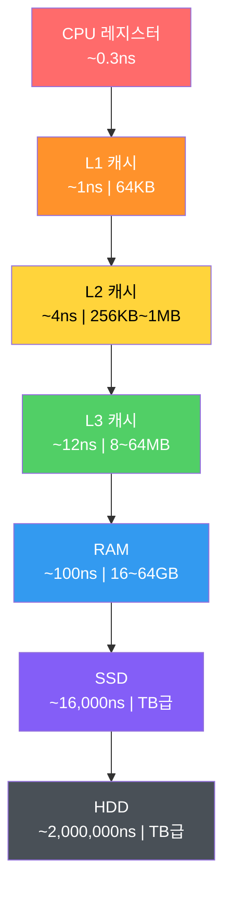
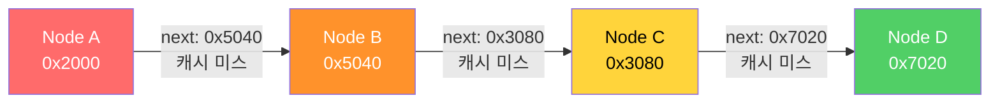
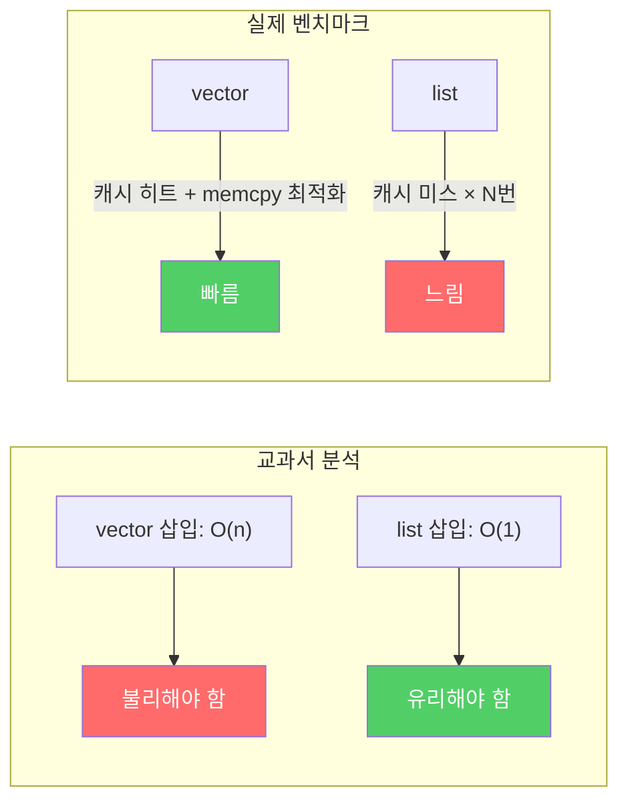
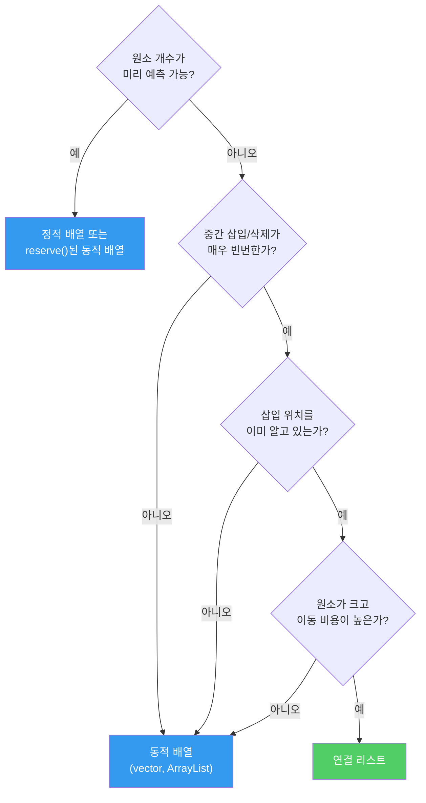

## 서론

> 이 문서는 **CS 로드맵** 시리즈의 1번째 편입니다.

프로그래밍을 시작하면 누구나 배열을 배운다. `int arr[10]`이라고 쓰면 정수 10개를 담을 공간이 생긴다. 그 다음에 연결 리스트를 배운다. 노드를 포인터로 연결하면 크기를 동적으로 조절할 수 있다. 교과서는 이렇게 가르친다:

- 배열: 접근 O(1), 삽입/삭제 O(n)
- 연결 리스트: 접근 O(n), 삽입/삭제 O(1)

"상황에 따라 적절히 선택하세요." 여기서 대부분의 교육이 끝난다.

하지만 이 설명에는 결정적으로 빠진 것이 있다. **메모리**다. 자료구조는 추상적 개념이 아니라, 실제 하드웨어 위에서 동작하는 물리적 구조다. 배열의 원소가 메모리 어디에 놓이는지, 연결 리스트의 노드가 힙 어디에 흩어지는지, CPU가 데이터를 가져올 때 어떤 경로를 거치는지 — 이것을 모르면 자료구조를 절반만 이해한 것이다.

이 글은 배열과 연결 리스트를 **메모리의 관점에서** 다시 본다.

이후 시리즈 구성:

| 편 | 주제 | 핵심 질문 |
| --- | --- | --- |
| **1편 (이번 글)** | 배열과 연결 리스트 | 같은 O(n) 순회인데 왜 100배 차이가 나는가? |
| **2편** | 스택, 큐, 덱 | LIFO와 FIFO는 어디에서 쓰이는가? |
| **3편** | 해시 테이블 | 해시 함수는 어떻게 설계하고, 충돌은 어떻게 해결하는가? |
| **4편** | 트리 | BST, Red-Black Tree, B-Tree는 왜 필요한가? |
| **5편** | 그래프 | 탐색, 최단 경로, 위상 정렬의 원리는? |
| **6편** | 메모리 관리 | 스택/힙, GC, 수동 메모리 관리의 트레이드오프는? |

---

## Part 1: 메모리 계층 구조 — 모든 것의 출발점

자료구조를 이해하기 전에, 그 자료구조가 올라가는 **무대**를 먼저 이해해야 한다. 그 무대가 메모리 계층 구조(Memory Hierarchy)다.

### 왜 메모리가 계층적인가

이상적인 메모리는 무한히 크고, 무한히 빠르고, 무한히 싸야 한다. 현실에서는 이 세 가지가 동시에 성립하지 않는다:

- **빠른 메모리는 비싸고 작다** (SRAM → 캐시)
- **큰 메모리는 느리고 싸다** (DRAM → RAM)
- **거대한 저장장치는 더 느리다** (SSD, HDD)

이 물리적 제약 때문에, 현대 컴퓨터는 메모리를 **계층적으로** 구성한다. 자주 쓰는 데이터는 가까이, 가끔 쓰는 데이터는 멀리 둔다.

### 지연 시간 — 숫자로 보는 현실

Jeff Dean(Google)이 정리한 "Latency Numbers Every Programmer Should Know"는 시스템 프로그래밍의 기본 상식이다.


_Jeff Dean의 지연 시간 수치를 시각화한 다이어그램. 작은 검은 사각형(1ns)이 L1 캐시, 큰 파란 블록(100ns)이 RAM 접근을 나타낸다. 크기 차이가 곧 성능 차이다. (출처: gist.github.com/2841832)_

현대 하드웨어 기준으로 갱신한 수치:

| 계층 | 지연 시간 | 비유 (1ns = 1초로 환산) |
| --- | --- | --- |
| **L1 캐시 참조** | ~1 ns | **1초** |
| **분기 예측 미스** | ~3 ns | 3초 |
| **L2 캐시 참조** | ~4 ns | 4초 |
| **L3 캐시 참조** | ~12 ns | 12초 |
| **Mutex lock/unlock** | ~17 ns | 17초 |
| **RAM 참조** | ~100 ns | **1분 40초** |
| **1KB 데이터 압축** | ~3,000 ns | 50분 |
| **SSD 랜덤 읽기** | ~16,000 ns | **4시간 26분** |
| **SSD 1MB 순차 읽기** | ~49,000 ns | 13시간 |
| **HDD 탐색** | ~2,000,000 ns | **23일** |
| **HDD 1MB 순차 읽기** | ~825,000 ns | 9.5일 |



> **잠깐, 용어 정리**
>
> **ns(나노초)란?** 1나노초(nanosecond)는 10억 분의 1초다. 1ns = 0.000000001초. 눈을 한 번 깜빡이는 데 약 3억 ns가 걸린다. CPU가 동작하는 세계에서는 1ns도 충분히 긴 시간이다.
>
> **L1, L2, L3 캐시란?** CPU 칩 내부에 물리적으로 내장된 초고속 메모리다. 숫자가 작을수록 CPU 코어에 더 가깝고, 더 빠르고, 더 작다:
> - **L1 캐시** — CPU 코어 바로 옆. 코어당 약 64KB. 가장 빠르다(~1ns). 레지스터 다음으로 가까운 메모리.
> - **L2 캐시** — L1 뒤에 위치. 코어당 256KB~1MB. 약간 느리다(~4ns).
> - **L3 캐시** — 여러 코어가 공유. 8~64MB. 더 느리지만(~12ns) RAM(~100ns)보다는 훨씬 빠르다.
>
> 이 세 계층이 RAM과 CPU 사이에서 **속도 차이를 완충하는 역할**을 한다. 데이터가 L1에 있으면 1ns, 없어서 RAM까지 가야 하면 100ns — 같은 연산이 100배 느려진다.

핵심을 다시 보자. **L1 캐시 접근은 1ns, RAM 접근은 100ns**. 100배 차이. 데이터가 캐시에 있느냐 없느냐에 따라, 같은 연산이 100배 빨라지거나 느려진다. 이것이 자료구조 선택이 중요한 진짜 이유다.

### 캐시는 어떻게 동작하는가

CPU가 메모리 주소 `0x1000`의 데이터를 요청한다고 하자. CPU는 먼저 L1 캐시를 확인한다. 있으면 **캐시 히트(cache hit)** — 1ns만에 데이터를 가져온다. 없으면 **캐시 미스(cache miss)** — L2, L3, 최악의 경우 RAM까지 내려가야 한다.

여기서 중요한 것은, CPU가 `0x1000` 한 바이트만 가져오지 않는다는 점이다. CPU는 **캐시 라인(cache line)** 단위로 데이터를 가져온다. 현대 CPU의 캐시 라인 크기는 대부분 **64바이트**다.

```
메모리 주소:  0x1000  0x1004  0x1008  ...  0x103C
             ├──────────── 64바이트 캐시 라인 ────────────┤
             │  int[0]  int[1]  int[2]  ...  int[15]     │
             └───────────────────────────────────────────┘
```

`int`(4바이트) 배열에서 `arr[0]`을 읽으면, `arr[1]`부터 `arr[15]`까지 **공짜로** 캐시에 올라온다. 이것이 **공간 지역성(spatial locality)**이다. 이웃한 메모리를 곧 사용할 가능성이 높으므로, 미리 가져오는 것이다.

또 하나, `arr[0]`을 읽은 직후 또 `arr[0]`을 읽으면 캐시에 이미 있다. 이것이 **시간 지역성(temporal locality)**이다. 최근에 접근한 데이터를 곧 다시 사용할 가능성이 높다.

현대 CPU는 여기서 한 발 더 나간다. **하드웨어 프리페처(hardware prefetcher)**가 메모리 접근 패턴을 감지하여, 다음에 필요할 데이터를 미리 캐시에 올려놓는다. 순차적으로 배열을 순회하면, 프리페처가 앞서서 데이터를 준비한다. 연속된 메모리 접근은 하드웨어 수준에서 최적화된다.

> **잠깐, 이건 짚고 넘어가자**
>
> **Q. 캐시 라인이 64바이트라는 건 어떻게 확인하나?**
>
> Linux에서는 `getconf LEVEL1_DCACHE_LINESIZE` 명령으로 확인할 수 있다. macOS에서는 `sysctl hw.cachelinesize`. 대부분의 x86, ARM 프로세서에서 64바이트다. 일부 임베디드 시스템에서는 32바이트인 경우도 있다.
>
> **Q. 캐시가 꽉 차면 어떻게 되나?**
>
> 새 데이터가 들어오면, 기존 캐시 라인 중 하나를 **퇴거(evict)**시켜야 한다. 어떤 라인을 퇴거할지 결정하는 정책이 **교체 알고리즘**이다. 대부분의 CPU는 LRU(Least Recently Used)의 근사를 사용한다. 가장 오래 사용하지 않은 라인을 내보내는 것이다.

---

## Part 2: 배열 — 연속 메모리의 힘

### 배열의 정의

배열(array)은 **같은 타입의 원소가 연속된 메모리 공간에 순서대로 저장되는 자료구조**다. 이것이 배열의 전부이자, 배열이 강력한 이유의 전부다.

`int arr[8]`을 선언하면 메모리에 이렇게 배치된다:

```
주소:  0x100  0x104  0x108  0x10C  0x110  0x114  0x118  0x11C
       ┌──────┬──────┬──────┬──────┬──────┬──────┬──────┬──────┐
       │ a[0] │ a[1] │ a[2] │ a[3] │ a[4] │ a[5] │ a[6] │ a[7] │
       └──────┴──────┴──────┴──────┴──────┴──────┴──────┴──────┘
        4byte  4byte  4byte  4byte  4byte  4byte  4byte  4byte
```

32바이트. 정확히 캐시 라인 절반이다. 이 배열 전체가 캐시 라인 하나(또는 둘)에 들어간다.

### O(1) 랜덤 접근 — 왜 가능한가

`arr[5]`에 접근하려면, 시작 주소에서 `5 × sizeof(int)` = 20바이트만 더하면 된다:

$$\text{address}(arr[i]) = \text{base\_address} + i \times \text{element\_size}$$

단순한 덧셈과 곱셈 한 번. 이것이 O(1) — 원소가 100만 개여도 인덱스만 알면 한 번에 접근한다. 배열의 가장 근본적인 강점이다.

### 캐시 친화적 순회

배열의 진짜 위력은 **순회(traversal)**에서 드러난다.

```c
// 배열 순회: 메모리를 순차적으로 접근
int sum = 0;
for (int i = 0; i < N; i++) {
    sum += arr[i];  // 연속된 주소를 순서대로 접근
}
```

이 루프가 실행될 때 하드웨어에서 일어나는 일:

1. `arr[0]` 접근 → 캐시 미스 → RAM에서 64바이트(arr[0]~arr[15]) 로드
2. `arr[1]` ~ `arr[15]` 접근 → **전부 캐시 히트** (이미 로드됨)
3. `arr[16]` 접근 → 캐시 미스 → 다음 64바이트 로드
4. 반복...

**16번 접근 중 15번이 캐시 히트**. 캐시 히트율 93.75%. 여기에 하드웨어 프리페처가 패턴을 감지하여 다음 캐시 라인을 미리 가져오면, 사실상 거의 모든 접근이 L1 캐시에서 해결된다.

### 삽입과 삭제의 비용

배열의 단점은 **중간 삽입/삭제**다. `arr[3]`에 새 원소를 넣으려면:

```
삽입 전: [1] [2] [3] [5] [6] [7] [8] [ ]
                     ↓
삽입 후: [1] [2] [3] [4] [5] [6] [7] [8]
                  ↑insert  →→→→→→→→→→→→
                          4개 원소를 오른쪽으로 이동
```

n개 원소 중 위치 i에 삽입하면, n - i개 원소를 한 칸씩 밀어야 한다. 최악의 경우(맨 앞 삽입) O(n). 하지만 이 "밀기" 연산 자체는 `memcpy`/`memmove`로 구현되며, **연속된 메모리 복사는 CPU와 캐시에 매우 친화적**이다. 나중에 연결 리스트와 비교할 때 이 부분을 다시 보게 된다.

---

## Part 3: 연결 리스트 — 포인터의 세계

### 연결 리스트의 정의

연결 리스트(linked list)는 각 원소(노드)가 **데이터와 다음 노드의 주소(포인터)**를 함께 저장하는 자료구조다.

```c
struct Node {
    int data;       // 4바이트
    Node* next;     // 8바이트 (64비트 시스템)
};
```

하나의 노드에 최소 12바이트(패딩 포함 시 16바이트)가 필요하다. 4바이트 데이터를 저장하기 위해 최소 3~4배의 메모리를 사용한다. 이것이 첫 번째 비용이다.

### 메모리 배치 — 흩어진 노드들

배열과 달리, 연결 리스트의 노드는 힙(heap)에 **개별적으로 할당**된다. 할당 순서, 힙 상태, 메모리 단편화에 따라 노드의 물리적 위치는 제각각이다:

```
메모리 공간:

0x2000: [Node A | data=1 | next=0x5040 ]
0x2010: (다른 객체가 사용 중)
  ...
0x5040: [Node B | data=2 | next=0x3080 ]
0x5050: (다른 객체가 사용 중)
  ...
0x3080: [Node C | data=3 | next=0x7020 ]
  ...
0x7020: [Node D | data=4 | next=NULL   ]
```

Node A에서 Node B로 가려면 0x2000에서 0x5040으로 점프해야 한다. 12KB 이상 떨어져 있다. 캐시 라인이 64바이트이므로, **거의 모든 노드 접근이 캐시 미스**를 유발한다.



### O(1) 삽입/삭제 — 이론적 장점

연결 리스트의 교과서적 장점은 삽입/삭제다. 특정 노드를 알고 있다면, 포인터만 바꾸면 된다:

```
삽입 전: A → B → D
삽입 후: A → B → C → D

B->next = C     // 1. 새 노드가 D를 가리키게
C->next = D     // 2. B가 새 노드를 가리키게
```

원소를 밀거나 복사할 필요가 없다. O(1). 하지만 여기에 중요한 전제가 있다: **삽입 위치의 노드를 이미 알고 있어야** 한다. 위치를 모르면 처음부터 순회해야 하므로 O(n)이다.

### 이중 연결 리스트

실무에서는 단일 연결 리스트보다 **이중 연결 리스트(doubly linked list)**를 더 자주 사용한다:

```c
struct DNode {
    int data;       // 4바이트
    DNode* prev;    // 8바이트
    DNode* next;    // 8바이트
};
// 패딩 포함 최소 24바이트 — 데이터 대비 6배
```

양방향 순회와 O(1) 삭제(노드 자신만 알면 전임자에 접근 가능)가 가능하지만, 메모리 오버헤드는 더 커진다.

---

## Part 4: 성능의 진실 — 이론과 현실의 괴리

### Bjarne Stroustrup의 실험

C++의 창시자 Bjarne Stroustrup은 여러 강연에서 `std::vector` vs `std::list` 벤치마크를 반복적으로 보여주었다. 실험 내용은 이렇다:

**테스트**: N개의 정수를 정렬된 상태로 유지하면서 랜덤 삽입/삭제를 반복

- `std::vector`: 삽입 위치를 이진 탐색으로 찾고, 원소를 밀어서 삽입
- `std::list`: 삽입 위치를 처음부터 순회해서 찾고, 포인터를 교체하여 삽입

**교과서적 예측**: 리스트가 유리해야 한다. 삽입이 O(1)이니까.

**실제 결과**: N이 수백 개를 넘어가는 순간부터 **vector가 list를 압도**했다. N이 커질수록 격차는 벌어졌다.




_Bjarne Stroustrup의 Going Native 2012 발표에서 재현된 벤치마크. 원소 수가 늘어날수록 vector(파란선)와 list(빨간선)의 격차가 극적으로 벌어진다. 심지어 미리 할당된 list(초록선)조차 vector를 이기지 못한다._

이유는 Part 1에서 설명한 메모리 계층 구조에 있다:

1. **vector의 순회**: 연속 메모리 → 캐시 히트 → 프리페처 작동 → 거의 L1 속도
2. **list의 순회**: 흩어진 노드 → 캐시 미스 → RAM 접근 → 100배 느림
3. **vector의 원소 이동**: `memmove` → 연속 메모리 블록 복사 → CPU가 매우 효율적으로 처리
4. **list의 메모리 할당**: `new Node()` → 힙 할당 → 비용이 큼

Stroustrup의 결론:

> "Don't store data in a linked list unless you need to. Use a compact data structure. Vector beats list for almost everything."

### 숫자로 환산

100만 개의 `int`를 순회하는 시나리오를 계산해보자:

**배열**:
- 캐시 라인당 16개 int(64B / 4B)
- 필요한 캐시 라인 로드: 1,000,000 / 16 = 62,500회
- 프리페처가 작동하면 대부분 L1 히트 → ~1ns × 1,000,000 ≈ **~1ms**

**연결 리스트**:
- 노드당 캐시 미스 가능성 높음
- 최악: RAM 접근 ~100ns × 1,000,000 = **~100ms**

같은 "O(n) 순회"인데 **100배 차이**. Big-O가 동일해도, 상수가 100배 다르다.

2023년 발표된 논문 "RIP Linked List"(arXiv:2306.06942)는 이 현상을 대규모로 실증했다. 다양한 리스트 구현을 벤치마크한 결과, **상위 3개 성능 순위를 모두 배열 기반 구현이 차지**했다. Johnny's Software Lab의 벤치마크에서는 더 극적인 결과가 나왔다:

- 메모리가 연속적으로 배치된 연결 리스트: **~0.12초**
- 랜덤하게 배치된 연결 리스트: 중간 데이터셋에서 **68배 느림**, 큰 데이터셋에서 **125배 느림**
- 큰 연결 리스트의 L3 캐시 미스율: **99%** — 캐시가 사실상 무용지물

### Ulrich Drepper의 증거

Ulrich Drepper는 2007년 논문 **"What Every Programmer Should Know About Memory"**에서 이 현상을 체계적으로 실험했다. 그가 보여준 핵심 결과:

- **순차 접근(배열)**: 데이터 크기가 L1 캐시를 초과해도, 하드웨어 프리페처 덕분에 지연 시간이 거의 증가하지 않음
- **랜덤 접근(연결 리스트와 유사)**: 데이터 크기가 각 캐시 레벨을 초과할 때마다 지연 시간이 **계단식으로 급증**
- L1 → L2 경계에서 ~4배, L2 → L3 경계에서 ~3배, L3 → RAM 경계에서 ~8배 이상 증가


_Drepper 2007 논문의 Figure 3.15. X축은 작업 데이터 크기(2^10 ~ 2^29 바이트), Y축은 원소당 접근 사이클. 순차 접근(Sequential, 빨간 다이아몬드)은 데이터 크기와 무관하게 거의 0에 가깝지만, 랜덤 접근(Random, 파란 삼각형)은 캐시를 초과하는 순간 급격히 치솟는다. (출처: lwn.net)_

순차 접근의 선은 거의 평평하다. 프리페처가 모든 것을 해결한다. 반면 랜덤 접근은 데이터가 캐시에 담기지 않는 순간 급격히 느려진다. **자료구조의 메모리 배치가 알고리즘 복잡도만큼이나 성능을 결정한다**는 것을 수치로 증명한 논문이다.

> **잠깐, 이건 짚고 넘어가자**
>
> **Q. 그럼 연결 리스트는 쓸 일이 없는 건가?**
>
> 아니다. 연결 리스트가 여전히 유효한 경우가 있다:
> - **매우 큰 원소**: 원소 크기가 수 KB 이상이면, 원소 이동 비용이 포인터 교체보다 크다
> - **빈번한 중간 삽입/삭제 + 위치를 이미 아는 경우**: 이터레이터를 보유한 상태에서의 O(1) 삽입
> - **안정적 참조가 필요한 경우**: 배열은 재할당 시 모든 포인터가 무효화되지만, 리스트의 노드 주소는 변하지 않는다
> - **OS 커널 내부**: 리눅스 커널의 스케줄러 큐, 메모리 관리 등에서 `list_head` 구조체를 광범위하게 사용한다
>
> 핵심은 "리스트를 쓰지 말라"가 아니라 **"기본값은 배열이되, 리스트가 필요한 이유를 설명할 수 있을 때만 리스트를 쓰라"**는 것이다.

---

## Part 5: 동적 배열 — 크기가 변하는 배열의 비밀

정적 배열의 크기는 컴파일 타임에 결정된다. 하지만 현실에서는 데이터가 얼마나 들어올지 미리 알 수 없는 경우가 대부분이다. 그래서 **동적 배열(dynamic array)**이 필요하다.

C++의 `std::vector`, Java의 `ArrayList`, C#의 `List<T>`, Python의 `list` — 모두 동적 배열이다.

### 기본 원리

동적 배열은 내부에 **고정 크기 배열**을 가지고 있다. 원소가 추가되어 배열이 꽉 차면:

1. 더 큰 배열을 새로 할당한다
2. 기존 원소를 전부 복사한다
3. 기존 배열을 해제한다

```
상태 1: capacity=4, size=4 (꽉 참)
[1] [2] [3] [4]

push_back(5) 호출 → 용량 부족!

상태 2: capacity=8, size=5 (새 배열 할당 + 복사)
[1] [2] [3] [4] [5] [ ] [ ] [ ]
```

문제는 "더 큰 배열"을 **얼마나 크게** 만드느냐다.

### 성장 인자 — 2배 vs 1.5배

가장 흔한 전략은 **기하급수적 성장(geometric growth)**이다. 용량이 부족하면 현재 용량의 일정 배수로 늘린다.

**2배 성장 (`std::vector` in GCC/Clang)**:

```
4 → 8 → 16 → 32 → 64 → 128 → 256 → ...
```

**1.5배 성장 (`std::vector` in MSVC, `folly::fbvector`)**:

```
4 → 6 → 9 → 13 → 19 → 28 → 42 → ...
```

왜 1.5배를 선택하는 구현이 있을까? Facebook의 `folly::fbvector` 구현 문서에 그 이유가 설명되어 있다:

2배 성장의 문제: 새로 필요한 메모리 크기가 **이전에 해제한 모든 블록의 합보다 항상 크다**.

$$2^n > 2^0 + 2^1 + 2^2 + \cdots + 2^{n-1} = 2^n - 1$$

따라서 이전에 해제된 메모리 블록을 **절대 재사용할 수 없다**. 메모리 할당자는 항상 새로운 영역을 찾아야 한다.

반면 1.5배 성장에서는 일정 횟수 이후 이전 블록들을 합치면 새 블록 크기를 만족할 수 있다:

$$1.5^n < 1.5^0 + 1.5^1 + \cdots + 1.5^{n-1} \quad (\text{n이 충분히 클 때})$$

이론적으로 성장 인자가 **황금비 φ ≈ 1.618** 이하면 이전 블록 재사용이 가능해진다.

| 성장 인자 | 사용 예 | 이전 메모리 재사용 | 재할당 빈도 |
| --- | --- | --- | --- |
| **2배** | GCC/Clang `vector` | 불가능 | 낮음 |
| **1.5배** | MSVC `vector`, `folly::fbvector` | 가능 (4번째 재할당 후) | 중간 |
| **φ ≈ 1.618** | 이론적 최적 경계 | 가능 | 중간 |

실제 언어별 구현을 비교하면:

| 언어/구현 | 성장 인자 | 비고 |
| --- | --- | --- |
| GCC/Clang `std::vector` | 2.0 | |
| MSVC `std::vector` | 1.5 | |
| Java `ArrayList` | 1.5 | |
| C# `List<T>` | 2.0 | |
| Rust `Vec` | 2.0 | |
| Python `list` | ~1.125 | 0, 4, 8, 16, 24, 32, 40, 52... |
| Go `slice` | 2.0 (≤1024), 1.25 (>1024) | 크기에 따라 변동 |
| Facebook `folly::fbvector` | 1.5 | 4KB까지는 2배, 이후 1.5배 |

### 상각 분석 — O(1)의 비밀

동적 배열에 n번 `push_back`하면, 일부 삽입에서 O(n) 복사가 발생한다. 그런데 왜 "push_back은 O(1)"이라고 하는가?

**상각 분석(amortized analysis)**의 핵심 아이디어는, **비싼 연산의 비용을 싼 연산에 분산**시키는 것이다.

2배 성장 기준으로, n번 삽입 시 발생하는 총 복사 횟수를 계산하자:

- capacity 1 → 2: 1개 복사
- capacity 2 → 4: 2개 복사
- capacity 4 → 8: 4개 복사
- ...
- capacity n/2 → n: n/2개 복사

총 복사 횟수:

$$1 + 2 + 4 + 8 + \cdots + \frac{n}{2} = n - 1$$

n번 삽입에서 총 n - 1번 복사. 삽입당 평균 복사 횟수:

$$\frac{n - 1}{n} < 1$$

따라서 **상각 O(1)**. 가끔 O(n)이 터지지만, 전체를 평균하면 O(1)이라는 뜻이다.

이 분석 방법은 Robert Tarjan이 1985년 논문 "Amortized Computational Complexity"에서 형식화했다. 세 가지 기법이 있다:

1. **집계법(Aggregate Method)**: 총 비용을 연산 수로 나눈다 (위에서 사용한 방법)
2. **회계법(Accounting Method)**: 싼 연산에 "크레딧"을 부여하여 비싼 연산을 미리 지불
3. **포텐셜법(Potential Method)**: 자료구조의 "포텐셜 에너지"를 정의하여 비용을 분석

세 가지 방법 모두 같은 결론에 도달한다: 동적 배열의 기하급수적 성장은 **상각 O(1) 삽입을 보장**한다.

> **잠깐, 이건 짚고 넘어가자**
>
> **Q. 상각 O(1)이면 최악의 경우에도 괜찮은 건가?**
>
> 아니다. **개별 삽입**은 여전히 O(n)이 될 수 있다. 실시간 시스템에서 16.67ms(60fps) 안에 프레임을 완료해야 하는데, 그 프레임에서 재할당이 터지면 문제가 된다. 이런 경우에는:
> - `reserve()`로 미리 용량을 확보하거나
> - 오브젝트 풀을 사용하거나
> - 재할당 없는 자료구조(예: 청크 리스트)를 고려한다
>
> **Q. reserve()는 언제 쓰는 게 좋은가?**
>
> 원소 개수의 상한을 알 때. `vector.reserve(1000)`을 호출하면 1000개까지는 재할당 없이 삽입된다. 이것만으로도 불필요한 재할당을 제거하고, 성능을 예측 가능하게 만들 수 있다.

---

## Part 6: 시간 복잡도를 올바르게 읽는 법

### Big-O는 상한이다

Big-O 표기법의 정확한 정의:

$$f(n) = O(g(n)) \iff \exists\, c > 0,\, n_0 > 0 \text{ such that } f(n) \leq c \cdot g(n) \text{ for all } n \geq n_0$$

f(n)이 O(g(n))이라는 것은, **n이 충분히 크면 f(n)이 c·g(n)을 넘지 않는다**는 뜻이다. 상한(upper bound)이다.

따라서:
- 배열 접근이 O(1)이라는 것은, 입력 크기에 **관계없이** 상수 시간에 완료된다는 뜻이다
- 선형 탐색이 O(n)이라는 것은, 최악의 경우 n에 비례하는 시간이 걸린다는 뜻이다

### Big-O가 숨기는 것

Big-O는 **상수 인자를 무시**한다. O(n)이 O(n log n)보다 "빠르다"고 말하지만, 상수가 다르면 실제로는 역전될 수 있다:

- 알고리즘 A: $100n$ → O(n)
- 알고리즘 B: $2n \log n$ → O(n log n)

n = 1,000일 때:
- A: 100,000
- B: 2 × 1,000 × 10 = 20,000

O(n)인 A가 O(n log n)인 B보다 **5배 느리다**. n이 매우 커야 A가 역전한다.

그리고 앞서 살펴본 **캐시 미스 비용**이 바로 이 "상수"에 해당한다. 배열과 연결 리스트가 둘 다 O(n) 순회이지만, 연결 리스트의 "상수"에는 캐시 미스 100ns가 포함되어 있고, 배열의 "상수"에는 캐시 히트 1ns만 포함되어 있다.

### 세 가지 표기법

| 표기법 | 의미 | 비유 |
| --- | --- | --- |
| **O(f(n))** | 상한 (최악의 경우 이보다 나쁘진 않다) | 천장 |
| **Ω(f(n))** | 하한 (최선의 경우 이보다 좋진 않다) | 바닥 |
| **Θ(f(n))** | 정확한 차수 (상한과 하한이 같다) | 정확한 높이 |

예시:
- 정렬된 배열에서 이진 탐색: **O(log n)**, **Ω(1)** (첫 번째에 찾을 수도 있으니), **Θ(log n)** 평균
- 정렬되지 않은 배열에서 선형 탐색: **O(n)**, **Ω(1)**, 평균 **Θ(n/2) = Θ(n)**

### 복잡도만으로 판단하면 안 되는 이유

지금까지의 논의를 종합하면:

1. **Big-O는 상수를 무시한다** — 캐시 미스 비용이 그 "상수"에 숨어 있다
2. **Big-O는 입력 크기가 충분히 클 때를 가정한다** — 현실에서 n이 작으면 상수가 지배한다
3. **메모리 접근 패턴이 성능을 결정한다** — 같은 O(n)이라도 순차 접근과 랜덤 접근은 100배 차이

이것이 Mike Acton(전 Insomniac Games 엔진 프로그래머)이 GDC 2014 강연 "Data-Oriented Design and C++"에서 강조한 핵심이다:

> "Where there is one, there are many. If you have a problem and you're applying the solution to one thing, it almost certainly should be applied to more than one."

데이터가 하나만 있는 경우는 거의 없다. 데이터가 여러 개일 때, **그 데이터가 메모리에 어떻게 배치되는지**가 알고리즘 복잡도보다 중요할 수 있다. Chandler Carruth(LLVM 리드 개발자)는 같은 해 CppCon 2014에서 더 직접적으로 표현했다:

> "Discontiguous data structures are the root of all (performance) evil."
>
> (비연속적 자료구조는 모든 (성능) 악의 근원이다.)

이것이 **데이터 지향 설계(Data-Oriented Design)**의 출발점이며, 이후 시리즈 고급 주제에서 다시 다룬다.

---

## Part 7: 정리 — 배열과 연결 리스트 비교표

### 종합 비교

| 특성 | 배열 (Array) | 연결 리스트 (Linked List) |
| --- | --- | --- |
| **메모리 배치** | 연속 | 분산 |
| **인덱스 접근** | O(1) | O(n) |
| **순차 순회** | O(n), 캐시 친화적 | O(n), 캐시 비친화적 |
| **맨 끝 삽입** | 상각 O(1) | O(1) (tail 포인터 있을 때) |
| **중간 삽입** | O(n) — 원소 이동 | O(1) — 포인터 교체 (위치를 아는 경우) |
| **중간 삭제** | O(n) — 원소 이동 | O(1) — 포인터 교체 (위치를 아는 경우) |
| **메모리 오버헤드** | 없음 (+ 미사용 capacity) | 노드당 포인터 1~2개 |
| **참조 안정성** | 재할당 시 무효화 | 항상 유효 |
| **캐시 성능** | 매우 좋음 | 나쁨 |
| **할당 비용** | 한 번 (+ 재할당) | 노드당 한 번 |

### 언제 무엇을 쓰는가



대부분의 경로가 배열로 향한다. 연결 리스트로 가려면 **세 가지 조건을 동시에 만족**해야 한다: 빈번한 중간 삽입, 위치를 이미 알고 있음, 원소 이동 비용이 높음. 이 조건이 동시에 성립하는 경우는 생각보다 드물다.

---

## 마무리: 자료구조는 추상이 아니라 물리다

이 글에서 살펴본 핵심:

1. **메모리 계층 구조**가 모든 성능의 출발점이다. L1 캐시(1ns)와 RAM(100ns)의 100배 격차가 자료구조 선택의 실질적 기준이 된다.

2. **배열은 단순하지만 강력하다.** 연속된 메모리 배치 덕분에 캐시 지역성, 하드웨어 프리페칭, 효율적 메모리 복사의 혜택을 모두 받는다.

3. **연결 리스트의 이론적 장점은 현대 하드웨어에서 상쇄된다.** O(1) 삽입의 장점보다 캐시 미스의 비용이 클 때가 많다. Stroustrup과 Drepper의 실험이 이를 증명한다.

4. **동적 배열의 기하급수적 성장**은 상각 분석을 통해 O(1) 삽입을 보장한다. 성장 인자(2배 vs 1.5배)는 메모리 재사용과 재할당 빈도의 트레이드오프다.

5. **Big-O는 출발점이지 결론이 아니다.** 상수 인자, 캐시 성능, 메모리 접근 패턴까지 고려해야 자료구조를 올바르게 선택할 수 있다.

자료구조 교과서의 첫 장은 보통 추상적 인터페이스(ADT)에서 시작한다. "리스트는 삽입, 삭제, 접근을 지원하는 추상 자료형이다." 이 추상화는 개념을 배울 때는 유용하지만, **실제 코드를 작성할 때는 구현의 물리적 특성을 무시할 수 없다.**

Dijkstra가 말한 것처럼, 추상화의 목적은 모호해지기 위한 것이 아니라, 정밀해지기 위한 것이다. 배열과 연결 리스트의 추상적 차이(접근 O(1) vs O(n))를 아는 것에서 그치지 않고, **왜 그런 차이가 발생하는지, 그리고 그 차이가 실제 하드웨어에서 어떻게 증폭되는지**까지 이해할 때, 비로소 자료구조를 진정으로 이해한 것이다.

다음 편에서는 **스택, 큐, 덱** — 제한된 접근이 만드는 강력한 추상화를 다룬다.

---

## 참고 자료

**핵심 논문 및 기술 문서**
- Drepper, U., "What Every Programmer Should Know About Memory" (2007) — [lwn.net](https://lwn.net/Articles/250967/)
- Tarjan, R., "Amortized Computational Complexity", SIAM Journal on Algebraic and Discrete Methods (1985)
- Frigo, M. et al., "Cache-Oblivious Algorithms", Proceedings of the 40th FOCS (1999) — 캐시를 모르는 상태에서도 최적에 가까운 캐시 성능을 달성하는 알고리즘 설계
- Dean, J. & Barroso, L.A., "The Tail at Scale", Communications of the ACM (2013) — 지연 시간 수치의 원전

**강연 및 발표**
- Stroustrup, B., "Why you should avoid Linked Lists" — 다수의 C++ 컨퍼런스 키노트에서 반복 발표
- Acton, M., "Data-Oriented Design and C++", GDC 2014 — 데이터 배치가 성능을 결정한다는 핵심 메시지
- Carruth, C., "Efficiency with Algorithms, Performance with Data Structures", CppCon 2014 — 데이터 구조의 물리적 특성과 성능의 관계

**교재**
- Cormen, T.H. et al., *Introduction to Algorithms (CLRS)*, MIT Press — 알고리즘 분석의 표준 교재, 상각 분석 Chapter 17
- Bryant, R. & O'Hallaron, D., *Computer Systems: A Programmer's Perspective (CS:APP)*, Pearson — 메모리 계층 구조 Chapter 6
- Hennessy, J. & Patterson, D., *Computer Architecture: A Quantitative Approach*, Morgan Kaufmann — 캐시 설계와 성능 분석
- Knuth, D., *The Art of Computer Programming Vol. 1: Fundamental Algorithms*, Addison-Wesley — 배열과 연결 리스트의 고전적 분석
- Sedgewick, R. & Wayne, K., *Algorithms*, 4th Edition, Addison-Wesley

**추가 논문 및 벤치마크**
- "RIP Linked List", arXiv:2306.06942 (2023) — 다양한 리스트 구현의 포괄적 실증 비교
- Johnny's Software Lab, "The Quest for the Fastest Linked List" — 연결 리스트 메모리 배치에 따른 극단적 성능 차이 실측
- Lemire, D., "How fast should your dynamic arrays grow?" (2013) — 성장 인자에 대한 수학적 분석

**구현 참고**
- Facebook `folly::fbvector` — 1.5배 성장 인자 선택의 근거가 문서화되어 있음
- Linux 커널 `list.h` — 이중 연결 리스트의 커널 수준 활용 사례
