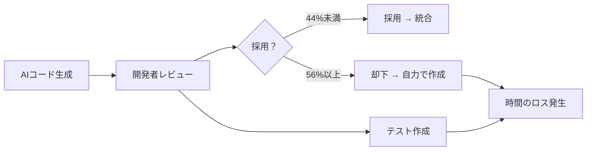
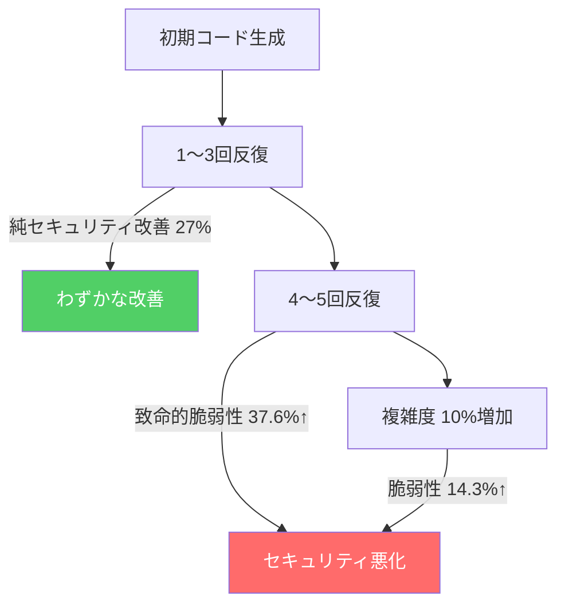
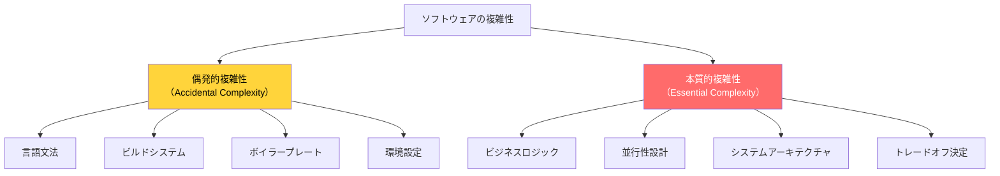
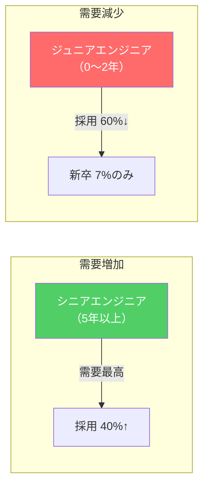
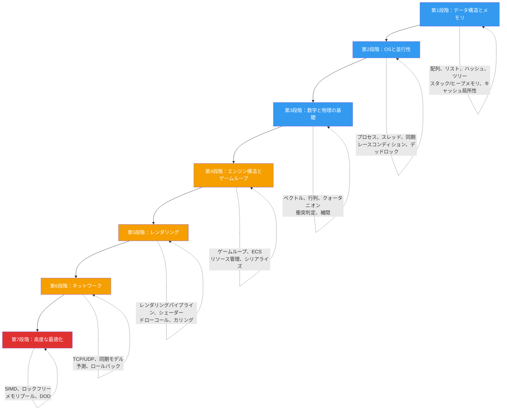

## はじめに

> この記事は **CS ロードマップ** シリーズの第0回です。

2025年2月、OpenAI共同創業者で元Tesla AI統括のAndrej Karpathyがツイートを投稿した。

> "There's a new kind of coding I call **'vibe coding'**, where you fully give in to the vibes, embrace exponentials, and forget that the code even exists."

_Andrej Karpathyのオリジナルツイート。450万回閲覧を記録した。_

450万回閲覧されたこのツイートは、ソフトウェア業界に衝撃を与えた。AIがコードを書いてくれる時代に、本当にCS知識は不要になるのか？「雰囲気に身を任せ、コードの存在すら忘れて」しまっていいのか？

この記事はその問いへの答えだ。論文、実験データ、業界レポート、そしてコンピュータサイエンスの巨匠たちが残した洞察を通じて考察する。

このシリーズではCSの核心領域を体系的に扱う：

| 回 | テーマ | 核心的な問い |
| --- | --- | --- |
| **第0回（今回）** | AI時代のCS知識 | なぜ今、CS基礎がより重要になったのか？ |
| **第1回〜** | データ構造とメモリ | 配列、リスト、ハッシュ、ツリー — メモリレイアウトから |
| **以降** | OS、数学、レンダリング、ネットワーク | 段階的な深掘り |

---

## Part 1: バイブコーディング — 革命か、幻想か

### バイブコーディングの誕生

2025年2月、KarpathyはCursorを使い、音声で指示し、コードを直接読まず、「だいたい動けば次に進む」方式でプログラミングする体験を共有した。彼がこの方式に付けた名前が **バイブコーディング（Vibe Coding）** だ。

その特徴は以下の通り：

- LLMに自然言語で指示する
- 生成されたコードを読まない
- エラーが出たらエラーメッセージをそのまま貼り付けて「直して」と言う
- コードの存在を忘れる

このアイデアは急速に広まった。プロトタイプが数分で完成し、プログラミング経験のない人でもウェブサイトを作れるというデモ動画が溢れた。「コーディングの民主化」という歓声が上がった。

### 1年後、創始者の修正

しかし、Karpathy本人は1年後（2026年2月）にこう修正した：

> "I think a better term might be **'agentic engineering'**. 'Agentic' because the new default is that you are orchestrating agents who do and acting as oversight — **'engineering' to emphasize that there is art & science and expertise to it.**"

**エージェンティック・エンジニアリング**。エージェントを調整しつつ、監督する役割。そしてそこには技術（art & science）と専門性（expertise）が必要だという強調。バイブコーディングという言葉が与える「誰でもできる」というニュアンスとは正反対だ。

なぜ修正したのか？この1年間に何が起きたのか？

### 現実が明らかになる

Google Chromeエンジニアリングマネージャーの Addy Osmani はこの現象を正面から批判した：

> "Vibe coding is not the same as AI-Assisted Engineering."

彼が指摘した核心はこうだ。FAANGチームがAIを使う方式はバイブコーディングではない。技術設計ドキュメントがあり、厳格なコードレビューがあり、テスト駆動開発がある。AIはその**フレームワークの中で**生産性を高めるツールとして使われている。

> 「AIは本質的に**経験のないアシスタント**であり、1年目のジュニア開発者にシステムアーキテクチャ全体を任せないのと同じく、監督なしに信頼してはならない。」

Stack Overflowのデータがこれを裏付ける。ChatGPTリリース後6ヶ月で週間アクティブユーザーが**60,000件から30,000件に半減**した。人々がAIに直接質問し始めたのだ。しかし同時に、中規模オープンソースプロジェクトへの貢献度は2025年1月から2026年1月まで**35%減少**した。コードを読み、理解し、貢献する人口が減っているというシグナルだ。

---

## Part 2: データが語る現実

感覚的な議論はここまでにしよう。ここからは統制された実験結果を見ていく。

### METR研究 (2025) — 「熟練者を遅くするAI」

METR（Model Evaluation & Threat Research）は2025年7月、最も厳格な実験を実施した：

- **対象**: 16名の熟練オープンソース開発者
  - 平均GitHubスター22,000個以上
  - 100万行以上のコードベース保守経験
- **方法**: ランダム化比較試験（RCT）
- **ツール**: Cursor Pro（Claude 3.5 Sonnet / GPT-4o含む）

結果：

_METR 2025研究の核心チャート。経済学者、ML専門家、開発者全員がAIが速度を上げると予測したが、実際には19%遅くなった（赤い点）。（出典：metr.org, CC-BY）_

| 指標 | 数値 |
| --- | --- |
| AI使用時の作業完了時間変化 | **19%増加**（遅くなった） |
| 開発者の事前予測 | 「24%速くなるだろう」 |
| 実験後の開発者の体感 | 「20%速くなった」 |
| AI生成コード採用率 | **44%未満** |

_左は開発者の予測（AI使用時はより速い）、右は実際の観測（AI使用時はむしろ時間がかかった）。（出典：metr.org, CC-BY）_

開発者たちはAI生成コードを検討し、テストし、修正した後、結局却下するケースが頻繁だった。最も衝撃的なのは**実験後も自分が速くなったと信じていた**ことだ。体感と現実の乖離。

論文の結論は明確だ。**自身のコードベースを深く理解している開発者にとって、AIはむしろ認知負荷を増加させる。** AI生成コードは「もっともらしいがコンテキストを見落としている」ケースが多く、検証コストが作成コストを上回る。

### Anthropic研究 (2026) — 「AIが学習を阻害する」

今度はAIを作っている会社が直接実験した。Anthropic（Claude開発元）は2026年1月、52名のジュニアエンジニアを対象にRCTを実施した：

| 指標 | AI支援グループ | 非AIグループ |
| --- | --- | --- |
| 理解度テストスコア | **50%** | **67%** |
| デバッグ問題の格差 | より大きく拡大 | — |

特に興味深いのは**AIの使い方による違い**だ：

- AIを**概念的な質問**に使った開発者：65%以上のスコア
- AIに**コード生成を委任**した開発者：40%未満のスコア

同じツールなのに使い方で結果が分かれた。核心は、AIに「これを作って」と委任した瞬間、学習が停止するということだ。一方、「この概念はどう動くのか説明して」と質問すれば、AIは効果的なチューターになる。

> **ここで一つ確認しておこう**
>
> **Q. ではAIを全く使わない方がいいのか？**
>
> いいえ。この2つの研究の共通メッセージは**「AIをうまく使うには基礎が必要だ」**ということだ。METR研究でも、単純で独立したタスクではAIは効果的だった。問題は複雑なシステム作業で発生する。Anthropic研究でも、AIを質問ツールとして活用したグループは良い成果を出した。AIをハンマーのように振り回すか、メスのように使うかの違いだ。

### GitHub Copilot生産性研究

GitHubの自社研究と外部学術研究を総合すると：

| 対象 | 生産性向上 | 備考 |
| --- | --- | --- |
| 新規開発者 | **35〜39%** | コード作成速度基準 |
| シニア開発者 | **8〜16%** | コード作成速度基準 |
| 全体平均（PR基準） | **10.6%増加** | Pull Requestマージ数 |
| 全体作業完了（実験） | **55.8%高速** | 単純タスク基準 |

数字だけ見れば印象的だ。しかし欠けているデータがある。**バグ率**だ。Copilotユーザーのバグ率が有意に高いという研究結果が併せて報告されている（arXiv 2302.06590）。速く書くが、より頻繁に間違える。

これはソフトウェア工学の古い教訓と完全に一致する：

> **コードを書く時間は全体開発時間のほんの一部に過ぎない。**

残りは設計、デバッグ、テスト、コードレビュー、リファクタリング、保守に費やされる。AIが「作成」段階を加速しても、残りの段階で知識なしに処理できるものは何もない。

---

## Part 3: AI生成コードの品質 — 数字で見る現実

### セキュリティ脆弱性

AI生成コードのセキュリティ品質に関する研究は十分に蓄積されている：

| 研究 | 結果 |
| --- | --- |
| 複数の学術研究総合 | 生成コードの**40〜65%**がCWE分類のセキュリティ脆弱性を含む |
| IEEE-ISTAS 2025（400サンプル） | 5回反復改善後、致命的脆弱性が**37.6%増加** |
| CrowdStrike（DeepSeek-R1） | デフォルト状態の脆弱コード割合**約19%** |
| Escape.tech（5,600アプリ分析） | **2,000+**脆弱性、**400+**露出したシークレット、**175件**PII露出 |

IEEE-ISTAS 2025論文の結果は特に注目に値する。400のコードサンプルに対して40ラウンドの「AIに改善を依頼」を繰り返した実験だ：

**反復改善のパラドックス**：AIに「もっと安全にして」と依頼するほど、コードは複雑になり、複雑度が上がるほど脆弱性が増加する。セキュリティ重視プロンプトが純セキュリティ改善を達成した割合は**27%に過ぎず**、それも初期1〜3回の反復でのみ有効だった。

### Lovable事件 — バイブコーディングの現実コスト

2025年、バイブコーディングプラットフォームLovableで深刻なセキュリティ事故が発生した（CVE-2025-48757）：

- テストされた1,645個のアプリのうち**170個のアプリ**で認証なしにデータベースの読み書きが可能
- 露出データ：サブスクリプション情報、氏名、電話番号、APIキー、決済情報、Google Mapsトークン

バイブコーディングで作られたアプリが本番環境にデプロイされ、実際のユーザーデータが露出した。「素早く作ってリリースする」という利点が、「誰もコードを理解しないままデプロイする」というリスクに転化した事例だ。

### GitClearコード品質レポート (2024)

GitClearは2020年から2024年まで**2億1,100万行**のコード変更を分析した：

_AIコーディングツールの普及後（2022年〜）、複製コードブロックを含むコミットの比率が急増した。（出典：GitClear 2025 Research）_

| 指標 | 2020〜2022 | 2023〜2024 | 変化 |
| --- | --- | --- | --- |
| コード重複率 | 8.3% | 12.3% | **4倍増加** |
| リファクタリング比率 | 25% | 10%未満 | **60%減少** |
| コードチャーン（2週間以内に修正） | 3.1% | 5.7% | **84%増加** |

**コードチャーン（code churn）** とは、新しく書かれたコードが2週間以内に修正または削除される割合だ。この数字がほぼ倍増したということは、「とりあえず書いて後で直す」コードが急増したという意味だ。

リファクタリング比率の急減はさらに深刻だ。ソフトウェアは生きた有機体だ。継続的なリファクタリングなしには技術的負債が蓄積し、システムは徐々に保守不能になる。AIは「新しく書く」ことは得意だが、「既存コードを読んで構造を改善する」ことはまだ人間の領域だ。

---

## Part 4: 抽象化の本質 — 巨匠たちの洞察

ここで一歩引いて、より根本的な問いを立ててみよう。**「CS知識とは一体何であり、なぜAIで代替できないのか？」**

### Dijkstra — 抽象化は曖昧になるためのものではない

{: width="300" }
_Edsger W. Dijkstra（1930〜2002）。写真：Hamilton Richards, CC BY-SA 3.0_

Edsger W. Dijkstra（1930〜2002）。1972年チューリング賞受賞者。最短経路アルゴリズム、構造化プログラミング、セマフォなどを発明した人物だ。

彼が残した言葉の中で最も誤解されているのがこれだ：

> "Computer science is no more about computers than astronomy is about telescopes."
>
> （コンピュータサイエンスはコンピュータについての学問ではない。天文学が望遠鏡についての学問ではないのと同じだ。）

この言葉の意味は、CSの本質が特定のツール（コンピュータ、プログラミング言語、あるいはAI）にあるのではないということだ。CSは**計算（computation）**、**抽象化（abstraction）**、**複雑性管理（complexity management）**についての学問だ。ツールが変わってもこの本質は変わらない。

もう一つの核心的な洞察：

> "The purpose of abstracting is not to be vague, but to create a new semantic level in which one can be **absolutely precise**."
>
> （抽象化の目的は曖昧になることではなく、絶対的に正確であり得る新しい意味レベルを作ることだ。）

これがバイブコーディングと真のエンジニアリングの違いだ。バイブコーディングは抽象化を「曖昧さ」として使う — コードが何をしているかわからないが、とりあえず動くから大丈夫。真の抽象化はその正反対だ。**下位レイヤーの複雑性を隠しつつ、その上で精密な推論が可能でなければならない。**

1972年チューリング賞講演「The Humble Programmer」でDijkstraはこう言った：

> "The competent programmer is fully aware of the strictly limited size of his own skull; therefore he approaches the programming task in full humility."
>
> （有能なプログラマーは、自分の頭蓋骨が厳密に限られた大きさであることを十分に認識している。だから彼は謙虚さを持ってプログラミング作業に取り組む。）

人間の認知能力は限られている。だから抽象化が必要で、だから構造化が必要で、だからCSが必要だ。AIがコードを生成してくれる時代でも — いや、**特に**そのような時代に — 生成されたコードの抽象化レベルが適切か、構造が正しいかを判断する能力は人間にかかっている。

### Knuth — 自信に満ちたでたらめ

Donald Knuth。**The Art of Computer Programming**の著者。コンピュータサイエンスの生きた伝説だ。

2023年、KnuthはChatGPTに20の質問を投げかけ、その結果を分析した：

> "It's amazing how the confident tone lends credibility to all of that made-up nonsense."
>
> （自信に満ちたトーンが、あの作り上げたでたらめすべてに信頼性を与えるのは驚くべきことだ。）

これがAI生成コードの核心的リスクだ。AIは**常に自信を持って**答える。正しい答えでも、完全に間違った答えでも。違いを見分けるには、その分野の知識が必要だ。

興味深い後日談がある。2026年、Claude OpusがKnuthが数週間研究したグラフ分解予想を解いた。Knuthの反応：

> "It seems I'll have to revise my opinions about generative AI one of these days."

しかし、これは「CS知識が不要だ」という証拠だろうか？むしろ逆だ。**Knuthが数週間研究した問題を精密に定義できたからこそ**、AIが解けたのだ。問題を定義する能力 — これがCS知識の核心だ。

### Brooks — 銀の弾丸はない

{: width="300" }
_Frederick Brooks（1931〜2022）。1999年チューリング賞受賞者。_

Frederick Brooks。**The Mythical Man-Month**の著者。1986年の論文「No Silver Bullet」でこう主張した：

> "There is no single development, in either technology or management technique, which by itself promises even one order of magnitude improvement within a decade in productivity."
>
> （技術であれ管理手法であれ、それ自体で10年以内に生産性を10倍向上させることを約束する単一の開発は存在しない。）

Brooksはソフトウェアの複雑性を2種類に分けた：

AIは**偶発的複雑性**を減らすのに優れている。ボイラープレートを生成し、文法エラーを検出し、環境設定を支援する。しかし**本質的複雑性** — ビジネスロジック設計、並行性処理、システム間トレードオフ — はAIが解決してくれるものではない。40年経った今でも、Brooksの分析は依然として有効だ。

### 「抽象化の漏れ」の法則

Joel Spolskyが2002年にまとめた**抽象化の漏れの法則（Law of Leaky Abstractions）**：

> "All non-trivial abstractions, to some degree, are leaky."
>
> （些細でないすべての抽象化は、ある程度、漏れがある。）

TCPは信頼性のある転送を抽象化するが、ネットワークが不安定になるとその抽象化は「漏れ」る。ガベージコレクタはメモリ管理を抽象化するが、GCポーズが発生するとその抽象化は漏れる。AIはコーディングを抽象化するが、AIが間違ったとき、その抽象化は漏れる。

抽象化が漏れたとき、**抽象化の下で何が起きているかを理解している人だけが問題を解決できる。** これがCS知識が存在する理由だ。

---

## Part 5: 採用市場の二極化

理論と実験を離れ、市場はどう反応しているか？

### シニア vs ジュニア — 広がる格差

2025年テック採用市場データ：

| 指標 | 数値 | 出典 |
| --- | --- | --- |
| テック分野新規ポジション | **371,000件** | CompTIA 2025 |
| ソフトウェアエンジニアリングポジション | **156,000件** | CompTIA 2025 |
| ビッグテック採用量（前年比） | **40%増加** | Pragmatic Engineer |
| エントリーレベル求人（2022〜2024） | **60%減少** | Stack Overflow |
| 22〜25歳開発者雇用（2022年比） | **約20%減少** | Stanford デジタル経済研究 |
| 全採用中の新卒比率 | **7%** | 業界調査 2025 |

構造は明確だ。**AIがジュニアが担っていた単純作業を代替する中、その作業を監督し方向を設定するシニアの価値は上がっている。** GoogleとMetaは2021年比で**50%少ない新卒**を採用している。

### 企業が求めるもの

採用マネージャーが探す能力：

1. バグを**推論する**能力（エラーメッセージをAIにコピペするのではなく）
2. クエリが遅い**理由を説明する**能力
3. OSの動作原理を理解する能力
4. スケールで崩れないシステムを**設計する**能力

これらはすべてCS基礎知識だ。データ構造、オペレーティングシステム、データベース、ネットワーク、システム設計。AIがコードを書いてくれる時代に、これらの知識は**不要になったのではなく、フィルターになったのだ。**

### 面接の変化

2025年テック面接のトレンド：

- 面接の**70%以上**がアルゴリズム/データ構造の質問を含む
- 一部の企業は面接でAIツールを許可しつつ、**より高度な問題を出題**
- 企業の**45%が学士号要件の撤廃**を計画 — 代わりに実質的な能力証明を重視
- AIエンジニア職は2024年5月以降**143%増加**

学位は重要度が下がった。しかし**知識はより重要になった。** この違いを理解すべきだ。「学位不要」は「CS知識不要」と同義ではない。

---

## Part 6: では何を勉強すべきか

ここまでの議論を整理すると：

1. AIはコードの**作成**を加速するが、**理解と判断**は代替できない
2. AIを効果的に使うには基礎が必要だ — 研究がこれを証明している
3. AI生成コードの品質問題は深刻であり、検証能力なしでは危険だ
4. 採用市場は基礎が堅固な開発者に有利に再編されている

ではCSのどの領域を勉強すべきか？このシリーズで扱うロードマップを紹介する。

### CS ロードマップ

各段階の核心的な問い：

| 段階 | 核心的な問い | 参考教材/論文 |
| --- | --- | --- |
| **1. データ構造とメモリ** | 同じデータを配列に入れるか連結リストに入れるかで、なぜ100倍の性能差が生まれるのか？ | Cormen et al. *CLRS*, Knuth *TAOCP*, Bryant & O'Hallaron *CS:APP* |
| **2. OSと並行性** | 2つのスレッドが同じ変数に書き込むと、なぜプログラムが時々だけクラッシュするのか？ | Silberschatz *Operating System Concepts*, Herlihy & Shavit *The Art of Multiprocessor Programming* |
| **3. 数学と物理** | クォータニオンがオイラー角より優れている理由は何か？ | Strang *Linear Algebra*, Ericson *Real-Time Collision Detection* |
| **4. エンジン構造** | フレームが16.67ms以内に完了しなければならない制約で、どうシステムを設計するか？ | Gregory *Game Engine Architecture*, Nystrom *Game Programming Patterns* |
| **5. レンダリング** | GPUは暇なのにフレームが遅い理由は何か？ | Akenine-Moller *Real-Time Rendering*, RTR4 |
| **6. ネットワーク** | レイテンシ100msで60fpsアクションゲームの同期はどう実現するか？ | Fiedler *Gaffer on Games*, Bernier *Latency Compensating Methods* (Valve) |
| **7. 高度な最適化** | キャッシュミス1回が演算200回より高コストな理由は何か？ | Hennessy & Patterson *Computer Architecture*, Drepper *What Every Programmer Should Know About Memory* |

### このシリーズの原則

1. **理論と直感を同時に**：数式が必要な箇所では数式を使う。ただし「なぜこの数式が必要か」を先に説明する
2. **論文と教科書を参照**：ブログポストに留まらず、原典への道を案内する
3. **実装で確認**：核心概念はコードで直接確認する
4. **深さ優先**：広く浅くではなく、狭く深く掘り下げる

---

## まとめ：道具と職人

1980年代、スプレッドシートが登場したとき、人々は「会計士がいなくなる」と言った。会計士はいなくならなかった。スプレッドシートを**うまく使う**会計士がそうでない会計士を置き換えただけだ。

2020年代、AIがコードを書き始めた。「プログラマーがいなくなる」と言われている。プログラマーはいなくならない。AIを**うまく監督する**プログラマーがそうでないプログラマーを置き換えるだろう。

そしてAIをうまく監督するには、AIが何をしているか理解しなければならない。データ構造を知ってこそ、AIが提案したデータ構造が適切かどうか判断できる。メモリモデルを知ってこそ、AIが書いた並行処理コードにレースコンディションがないか確認できる。レンダリングパイプラインを知ってこそ、AIが最適化したシェーダーが実際に速いか検証できる。

Dijkstraの言葉に戻ろう：

> "The only mental tool by means of which a very finite piece of reasoning can cover a myriad of cases is called **abstraction**."
>
> （限られた推論で無数のケースを扱える唯一の精神的道具は、抽象化と呼ばれる。）

AIは無数のコードを生成できる。しかしそのコードを**抽象化して理解し、判断し、正しい方向へ導くこと**は、依然として、そしておそらく長い間、人間の役割だ。

次回は、この旅の最初のテーマである**データ構造とメモリ** — 配列と連結リストから始めて、コンピュータが実際にデータをどう保存しアクセスするかを見ていく。

---

## 参考資料

**研究論文およびレポート**
- METR, "Measuring the Impact of Early 2025 AI on Experienced Open-Source Developer Productivity" (2025.07) — [arXiv 2507.09089](https://arxiv.org/abs/2507.09089)
- Anthropic, "The Impact of AI Assistance on Coding Skill Formation" (2026.01) — [anthropic.com/research](https://www.anthropic.com/research/AI-assistance-coding-skills)
- GitHub, "Research: Quantifying GitHub Copilot's Impact on Developer Productivity and Happiness" — [github.blog](https://github.blog/news-insights/research/research-quantifying-github-copilots-impact-on-developer-productivity-and-happiness/)
- IEEE-ISTAS 2025, "The Paradox of Iterative Refinement in AI-Generated Code Security" — [arXiv 2506.11022](https://arxiv.org/abs/2506.11022)
- GitClear, "AI Assistant Code Quality 2025 Research" — [gitclear.com](https://www.gitclear.com/ai_assistant_code_quality_2025_research)
- Georgetown CSET, "Cybersecurity Risks of AI-Generated Code" (2024.11) — [cset.georgetown.edu](https://cset.georgetown.edu/publication/cybersecurity-risks-of-ai-generated-code/)
- ACM, "CS2023: ACM/IEEE-CS/AAAI Computer Science Curricula" — [doi.org/10.1145/3664191](https://dl.acm.org/doi/10.1145/3664191)
- CrowdStrike, "Hidden Vulnerabilities in AI-Coded Software" — [crowdstrike.com](https://www.crowdstrike.com/en-us/blog/crowdstrike-researchers-identify-hidden-vulnerabilities-ai-coded-software/)

**専門家の著作および発言**
- Dijkstra, E.W., "The Humble Programmer" (1972 チューリング賞講演) — [cs.utexas.edu](https://www.cs.utexas.edu/~EWD/transcriptions/EWD03xx/EWD340.html)
- Knuth, D., "ChatGPTへの20の質問" (2023) — [cs.stanford.edu/~knuth](https://cs.stanford.edu/~knuth/chatGPT20.txt)
- Brooks, F., "No Silver Bullet — Essence and Accident in Software Engineering" (1986) — [Wikipedia](https://en.wikipedia.org/wiki/No_Silver_Bullet)
- Spolsky, J., "The Law of Leaky Abstractions" (2002)
- Osmani, A., "Vibe Coding Is Not the Same as AI-Assisted Engineering" — [addyo.substack.com](https://addyo.substack.com/p/vibe-coding-is-not-an-excuse-for)
- Karpathy, A., バイブコーディング原文 (2025.02) — [x.com/karpathy](https://x.com/karpathy/status/1886192184808149383)

**採用市場および業界動向**
- Pragmatic Engineer, "State of the Tech Market in 2025" — [newsletter.pragmaticengineer.com](https://newsletter.pragmaticengineer.com/p/state-of-the-tech-market-in-2025)
- Stack Overflow Blog, "AI vs Gen Z: A New Worst Coder Has Entered the Chat" (2026.01) — [stackoverflow.blog](https://stackoverflow.blog/2026/01/02/a-new-worst-coder-has-entered-the-chat-vibe-coding-without-code-knowledge/)
- Stanford Digital Economy, Software Developer Employment Trends — [stackoverflow.blog](https://stackoverflow.blog/2025/12/26/ai-vs-gen-z/)
- MIT Technology Review, "From Vibe Coding to Context Engineering" (2025.11) — [technologyreview.com](https://www.technologyreview.com/2025/11/05/1127477/from-vibe-coding-to-context-engineering-2025-in-software-development/)
- Semafor, "Lovable Security Incident" (2025) — [semafor.com](https://www.semafor.com/article/05/29/2025/the-hottest-new-vibe-coding-startup-lovable-is-a-sitting-duck-for-hackers)

**教科書**
- Cormen, T.H. et al., *Introduction to Algorithms (CLRS)*, MIT Press
- Knuth, D., *The Art of Computer Programming (TAOCP)*, Addison-Wesley
- Bryant, R. & O'Hallaron, D., *Computer Systems: A Programmer's Perspective (CS:APP)*, Pearson
- Hennessy, J. & Patterson, D., *Computer Architecture: A Quantitative Approach*, Morgan Kaufmann
- Drepper, U., *What Every Programmer Should Know About Memory* (2007)
