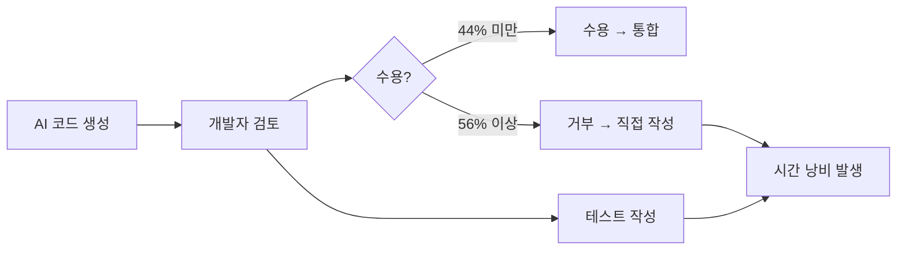
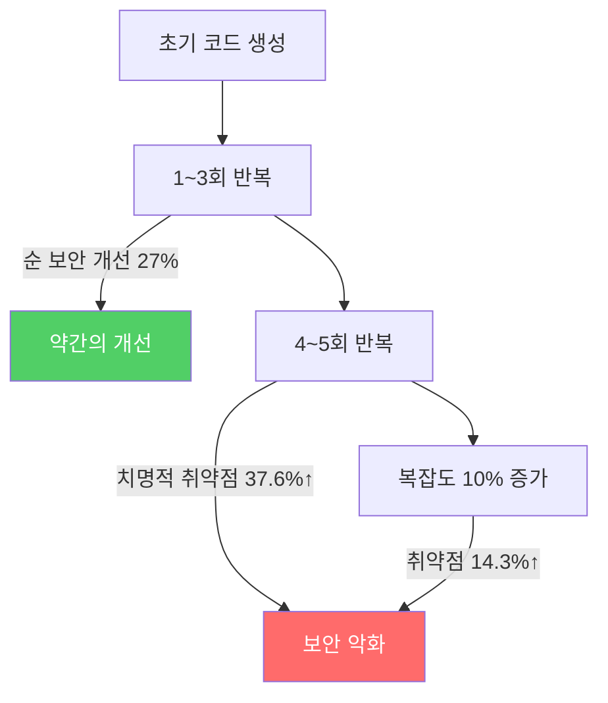
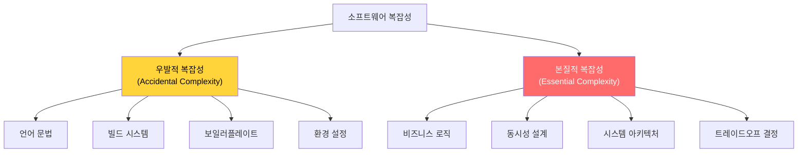
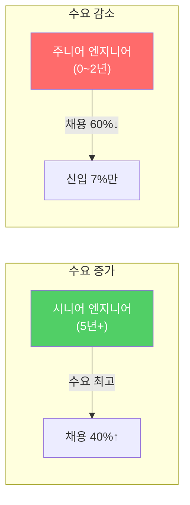
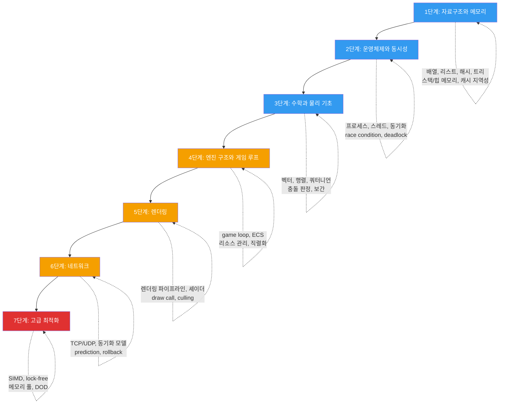

## 서론

> 이 문서는 **CS 로드맵** 시리즈의 0번째 편입니다.

2025년 2월, OpenAI 공동창업자이자 전 Tesla AI 총괄이었던 Andrej Karpathy가 트위터에 글 하나를 올렸다.

> "There's a new kind of coding I call **'vibe coding'**, where you fully give in to the vibes, embrace exponentials, and forget that the code even exists."

_Andrej Karpathy의 원본 트윗. 450만 조회수를 기록했다._

450만 조회수를 기록한 이 트윗은 소프트웨어 업계에 충격파를 보냈다. AI가 코드를 작성해주는 시대에, 정말로 CS 지식은 필요 없어지는 걸까? "분위기에 몸을 맡기고, 코드가 존재한다는 사실조차 잊어버려도" 되는 걸까?

이 글은 그 질문에 대한 답이다. 논문, 실험 데이터, 업계 보고서, 그리고 컴퓨터 과학의 거장들이 남긴 통찰을 통해 살펴본다.

이 시리즈는 CS의 핵심 영역을 체계적으로 다룬다:

| 편 | 주제 | 핵심 질문 |
| --- | --- | --- |
| **0편 (이번 글)** | AI 시대의 CS 지식 | 왜 지금, CS 기초가 더 중요해졌는가? |
| **1편~** | 자료구조와 메모리 | 배열, 리스트, 해시, 트리 — 메모리 레이아웃부터 |
| **이후** | OS, 수학, 렌더링, 네트워크 | 단계별 심화 |

---

## Part 1: 바이브 코딩 — 혁명인가, 환상인가

### 바이브 코딩의 탄생

2025년 2월, Karpathy는 Cursor를 사용하며 음성으로 지시하고, 코드를 직접 읽지 않고, "대충 동작하면 넘기는" 방식으로 프로그래밍하는 경험을 공유했다. 그가 이 방식에 붙인 이름이 **바이브 코딩(Vibe Coding)**이다.

핵심 특징은 이렇다:

- LLM에게 자연어로 지시한다
- 생성된 코드를 읽지 않는다
- 에러가 나면 에러 메시지를 그대로 붙여넣고 "고쳐줘"라고 말한다
- 코드의 존재를 잊는다

이 아이디어는 빠르게 확산되었다. 프로토타입이 몇 분 만에 나오고, 프로그래밍 경험이 없는 사람도 웹사이트를 만들 수 있다는 시연 영상이 쏟아졌다. "코딩의 민주화"라는 환호가 일었다.

### 1년 뒤, 창시자의 수정

그런데 정작 Karpathy 본인은 1년 뒤(2026년 2월) 이렇게 입장을 수정했다:

> "I think a better term might be **'agentic engineering'**. 'Agentic' because the new default is that you are orchestrating agents who do and acting as oversight — **'engineering' to emphasize that there is art & science and expertise to it.**"

**에이전틱 엔지니어링**. 에이전트를 조율하되, 감독하는 역할. 그리고 거기에는 기술(art & science)과 전문성(expertise)이 필요하다는 강조. 바이브 코딩이라는 단어가 주는 "아무나 할 수 있다"는 느낌과는 정반대의 뉘앙스다.

왜 수정했을까? 1년 사이에 무슨 일이 벌어진 걸까?

### 현실이 드러나다

Google Chrome 엔지니어링 매니저 Addy Osmani는 이 현상을 정면으로 비판했다:

> "Vibe coding is not the same as AI-Assisted Engineering."

그가 지적한 핵심은 이것이다. FAANG 팀에서 AI를 사용하는 방식은 바이브 코딩이 아니다. 기술 설계 문서가 있고, 엄격한 코드 리뷰가 있고, 테스트 주도 개발이 있다. AI는 그 **프레임워크 안에서** 생산성을 높이는 도구로 사용된다.

> "AI는 본질적으로 **경험 없는 어시스턴트**이며, 1년차 주니어 개발자에게 전체 시스템 아키텍처를 맡기지 않는 것처럼 감독 없이 신뢰해서는 안 된다."

Stack Overflow의 데이터가 이를 뒷받침한다. ChatGPT 출시 후 6개월 내 주간 활성 사용자가 **60,000건에서 30,000건으로 절반** 감소했다. 사람들이 AI에게 직접 물어보기 시작한 것이다. 그런데 동시에, 중규모 오픈소스 프로젝트의 기여도는 2025년 1월부터 2026년 1월까지 **35% 감소**했다. 코드를 읽고, 이해하고, 기여하는 인구가 줄어들고 있다는 신호다.

---

## Part 2: 데이터가 말하는 현실

감각적 논쟁은 여기까지로 하자. 이제 통제된 실험 결과를 살펴본다.

### METR 연구 (2025) — "숙련자를 느리게 만드는 AI"

METR(Model Evaluation & Threat Research)은 2025년 7월, 가장 엄격한 형태의 실험을 수행했다:

- **대상**: 16명의 숙련된 오픈소스 개발자
  - 평균 GitHub 스타 22,000개 이상
  - 100만 줄 이상의 코드베이스 유지 경험
- **방법**: 무작위 대조 시험(RCT, Randomized Controlled Trial)
- **도구**: Cursor Pro (Claude 3.5 Sonnet / GPT-4o 포함)

결과:

_METR 2025 연구 핵심 차트. 경제학자, ML 전문가, 개발자 모두 AI가 속도를 높일 것으로 예측했지만, 실제로는 19% 느려졌다(빨간 점). (출처: metr.org, CC-BY)_

| 지표 | 수치 |
| --- | --- |
| AI 사용 시 작업 완료 시간 변화 | **19% 증가** (느려짐) |
| 개발자의 사전 예측 | "24% 빨라질 것" |
| 실험 후 개발자의 체감 | "20% 빨라졌다" |
| AI 생성 코드 수용률 | **44% 미만** |

_왼쪽은 개발자의 예측(AI 사용 시 더 빠를 것), 오른쪽은 실제 관측(AI 사용 시 오히려 더 오래 걸림). (출처: metr.org, CC-BY)_

개발자들은 AI가 생성한 코드를 검토하고, 테스트하고, 수정하는 데 시간을 쏟은 뒤, 결국 거부하는 경우가 빈번했다. 가장 충격적인 부분은 **실험 후에도 본인이 빨라졌다고 믿었다**는 것이다. 체감과 실제의 괴리.

논문의 결론은 명확하다. **자신의 코드베이스를 깊이 이해하는 개발자에게, AI는 오히려 인지 부하를 증가**시킨다. AI가 생성한 코드는 "그럴듯하지만 맥락을 놓치고 있는" 경우가 많아서, 검증 비용이 작성 비용을 초과한다.

### Anthropic 연구 (2026) — "AI가 학습을 저해한다"

이번에는 AI를 만드는 회사가 직접 실험했다. Anthropic(Claude 개발사)은 2026년 1월 52명의 주니어 엔지니어를 대상으로 RCT를 수행했다:

| 지표 | AI 보조 그룹 | 비AI 그룹 |
| --- | --- | --- |
| 이해도 테스트 점수 | **50%** | **67%** |
| 디버깅 문항 격차 | 더 크게 벌어짐 | — |

특히 흥미로운 것은 **AI 사용 방식에 따른 차이**다:

- AI를 **개념적 질문**에 사용한 개발자: 65% 이상 점수
- AI에 **코드 생성을 위임**한 개발자: 40% 미만 점수

같은 도구인데 사용 방식에 따라 결과가 갈렸다. 핵심은 AI에게 "이걸 만들어줘"라고 위임하는 순간, 학습이 중단된다는 것이다. 반면 "이 개념이 어떻게 동작하는지 설명해줘"라고 질문하면, AI는 효과적인 튜터가 된다.

> **잠깐, 이건 짚고 넘어가자**
>
> **Q. 그럼 AI를 아예 안 쓰는 게 낫다는 건가?**
>
> 아니다. 이 두 연구의 공통된 메시지는 **"AI를 잘 쓰려면 기초가 있어야 한다"**는 것이다. METR 연구에서도 간단하고 독립적인 작업에서는 AI가 효과적이었다. 문제는 복잡한 시스템 작업에서 발생한다. Anthropic 연구에서도 AI를 질문 도구로 활용한 그룹은 좋은 성과를 보였다. AI를 망치처럼 휘두르느냐, 메스처럼 쓰느냐의 차이다.

### GitHub Copilot 생산성 연구

GitHub이 자체 진행한 연구와 외부 학술 연구를 종합하면:

| 대상 | 생산성 향상 | 비고 |
| --- | --- | --- |
| 신규 개발자 | **35~39%** | 코드 작성 속도 기준 |
| 시니어 개발자 | **8~16%** | 코드 작성 속도 기준 |
| 전체 평균 (PR 기준) | **10.6% 증가** | Pull Request 병합 수 |
| 전체 작업 완료 (실험) | **55.8% 빠름** | 단순 작업 기준 |

수치만 보면 인상적이다. 하지만 빠진 데이터가 있다. **버그율**이다. Copilot 사용자의 버그율이 유의미하게 높다는 연구 결과가 함께 보고되었다(arXiv 2302.06590). 빨리 쓰지만 더 자주 틀린다.

이것은 소프트웨어 공학의 오래된 교훈과 정확히 일치한다:

> **코드를 작성하는 시간은 전체 개발 시간의 일부에 불과하다.**

나머지는 설계, 디버깅, 테스트, 코드 리뷰, 리팩토링, 유지보수에 쓰인다. AI가 "작성" 단계를 가속해도, 나머지 단계에서 지식 없이 처리할 수 있는 건 아무것도 없다.

---

## Part 3: AI 생성 코드의 품질 — 숫자로 보는 현실

### 보안 취약점

AI가 생성한 코드의 보안 품질에 대한 연구는 이미 충분히 축적되어 있다:

| 연구 | 결과 |
| --- | --- |
| 다수의 학술 연구 종합 | 생성 코드의 **40~65%**가 CWE 분류 보안 취약점 포함 |
| IEEE-ISTAS 2025 (400개 샘플) | 5회 반복 개선 후 치명적 취약점 **37.6% 증가** |
| CrowdStrike (DeepSeek-R1) | 기본 상태 취약 코드 비율 **약 19%** |
| Escape.tech (5,600개 앱 분석) | **2,000+** 취약점, **400+** 노출된 시크릿, **175건** PII 노출 |

IEEE-ISTAS 2025 논문의 결과는 특히 주목할 만하다. 400개 코드 샘플에 대해 40라운드의 "AI에게 개선 요청"을 반복한 실험이다:

**반복 개선의 역설**: AI에게 "더 안전하게 만들어줘"라고 요청할수록, 코드는 복잡해지고, 복잡도가 높아질수록 취약점이 증가한다. 보안 중심 프롬프트가 순 보안 개선을 달성한 비율은 **27%에 불과**했고, 그마저도 초기 1~3회 반복에서만 유효했다.

### Lovable 사건 — 바이브 코딩의 현실 비용

2025년, 바이브 코딩 플랫폼 Lovable에서 심각한 보안 사고가 발생했다(CVE-2025-48757):

- 테스트된 1,645개 앱 중 **170개 앱**에서 인증 없이 데이터베이스 읽기/쓰기 가능
- 노출된 데이터: 구독 정보, 이름, 전화번호, API 키, 결제 정보, Google Maps 토큰

바이브 코딩으로 만든 앱이 프로덕션에 배포되었고, 실제 사용자 데이터가 노출된 것이다. "빠르게 만들어서 출시한다"는 장점이, "아무도 코드를 이해하지 못한 채 배포한다"는 위험으로 전환된 사례다.

### GitClear 코드 품질 보고서 (2024)

GitClear는 2020년부터 2024년까지 **2억 1,100만 줄**의 코드 변경을 분석했다:

_AI 코딩 도구 확산 이후(2022년~) 복제 코드 블록을 포함한 커밋 비율이 급증했다. (출처: GitClear 2025 Research)_

| 지표 | 2020~2022 | 2023~2024 | 변화 |
| --- | --- | --- | --- |
| 코드 중복률 | 8.3% | 12.3% | **4배 증가** |
| 리팩토링 비율 | 25% | 10% 미만 | **60% 감소** |
| 코드 이탈율 (2주 내 수정) | 3.1% | 5.7% | **84% 증가** |

**코드 이탈율(code churn)**은 새로 작성된 코드가 2주 이내에 수정되거나 삭제되는 비율이다. 이 숫자가 거의 두 배로 늘었다는 것은, "일단 쓰고 보는" 코드가 급증했다는 의미다.

리팩토링 비율의 급감은 더 심각하다. 소프트웨어는 살아있는 유기체다. 지속적인 리팩토링 없이는 기술 부채가 누적되고, 시스템은 점점 유지보수가 불가능해진다. AI가 "새로 쓰는" 것은 잘하지만, "기존 코드를 읽고 구조를 개선하는" 것은 아직 인간의 영역이다.

---

## Part 4: 추상화의 본질 — 거장들의 통찰

여기서 한 걸음 물러서, 더 근본적인 질문을 해보자. **"CS 지식이란 대체 무엇이며, 왜 AI로 대체할 수 없는가?"**

### Dijkstra — 추상화는 모호해지기 위한 것이 아니다

{: width="300" }
_Edsger W. Dijkstra (1930~2002). 사진: Hamilton Richards, CC BY-SA 3.0_

Edsger W. Dijkstra. 1972년 튜링상 수상자. 최단 경로 알고리즘, 구조적 프로그래밍, 세마포어 등을 발명한 인물이다.

그가 남긴 말 중 가장 오해받는 것이 이것이다:

> "Computer science is no more about computers than astronomy is about telescopes."
>
> (컴퓨터 과학은 컴퓨터에 대한 학문이 아니다. 천문학이 망원경에 대한 학문이 아닌 것처럼.)

이 말의 의미는, CS의 본질이 특정 도구(컴퓨터, 프로그래밍 언어, 혹은 AI)에 있지 않다는 것이다. CS는 **계산(computation)**, **추상화(abstraction)**, **복잡성 관리(complexity management)**에 대한 학문이다. 도구가 바뀌어도 이 본질은 변하지 않는다.

그의 또 다른 핵심 통찰:

> "The purpose of abstracting is not to be vague, but to create a new semantic level in which one can be **absolutely precise**."
>
> (추상화의 목적은 모호해지는 것이 아니라, 절대적으로 정밀할 수 있는 새로운 의미 수준을 만드는 것이다.)

이것이 바이브 코딩과 진정한 엔지니어링의 차이다. 바이브 코딩은 추상화를 "모호함"으로 사용한다 — 코드가 무엇을 하는지 모르지만, 일단 돌아가니까 괜찮다. 진정한 추상화는 정반대다. **하위 계층의 복잡성을 숨기되, 그 위에서 정밀한 추론이 가능해야** 한다.

1972년 튜링상 강연 "The Humble Programmer"에서 Dijkstra는 이렇게 말했다:

> "The competent programmer is fully aware of the strictly limited size of his own skull; therefore he approaches the programming task in full humility."
>
> (유능한 프로그래머는 자신의 두개골이 엄격히 제한된 크기라는 것을 충분히 인식한다. 그래서 그는 겸손함을 가지고 프로그래밍 작업에 접근한다.)

인간의 인지 능력은 제한되어 있다. 그래서 추상화가 필요하고, 그래서 구조화가 필요하고, 그래서 CS가 필요하다. AI가 코드를 생성해주는 시대에도 — 아니, **특히** 그런 시대에 — 생성된 코드의 추상화 수준이 적절한지, 구조가 올바른지 판단할 수 있는 능력은 인간에게 달려 있다.

### Knuth — 자신감 넘치는 허튼소리

Donald Knuth. **The Art of Computer Programming**의 저자. 컴퓨터 과학의 살아있는 전설이다.

2023년, Knuth는 ChatGPT에 20개의 질문을 던지고 그 결과를 분석했다:

> "It's amazing how the confident tone lends credibility to all of that made-up nonsense."
>
> (자신감 넘치는 톤이 그 모든 지어낸 허튼소리에 신뢰성을 부여하는 것이 놀랍다.)

이것이 AI 생성 코드의 핵심 위험이다. AI는 **항상 자신감 있게** 답한다. 맞는 답이든, 완전히 틀린 답이든. 차이를 구별하려면, 해당 분야의 지식이 있어야 한다.

흥미로운 후속 에피소드가 있다. 2026년, Claude Opus가 Knuth가 수주간 연구한 그래프 분해 추측을 풀어냈다. Knuth의 반응:

> "It seems I'll have to revise my opinions about generative AI one of these days."

하지만 이것이 "CS 지식이 필요 없다"는 증거일까? 오히려 반대다. **Knuth가 수주간 연구한 문제를 정밀하게 정의할 수 있었기 때문에** AI가 풀 수 있었다. 문제를 정의하는 능력 — 이것이 CS 지식의 핵심이다.

### Brooks — No Silver Bullet

{: width="300" }
_Frederick Brooks (1931~2022). 1999년 튜링상 수상자._

Frederick Brooks. **The Mythical Man-Month**의 저자. 1986년 논문 "No Silver Bullet"에서 이렇게 주장했다:

> "There is no single development, in either technology or management technique, which by itself promises even one order of magnitude improvement within a decade in productivity."
>
> (기술이든 관리 기법이든, 그 자체로 10년 내에 생산성을 10배 향상시킬 수 있는 단일 개발은 없다.)

Brooks는 소프트웨어의 복잡성을 두 가지로 나눴다:

AI는 **우발적 복잡성**을 줄이는 데 탁월하다. 보일러플레이트를 생성하고, 문법 오류를 잡고, 환경 설정을 도와준다. 하지만 **본질적 복잡성** — 비즈니스 로직 설계, 동시성 처리, 시스템 간 트레이드오프 — 은 AI가 해결해주지 않는다. 40년이 지난 지금, Brooks의 분석은 여전히 유효하다.

### "추상화 누수"의 법칙

Joel Spolsky가 2002년에 정리한 **추상화 누수의 법칙(Law of Leaky Abstractions)**:

> "All non-trivial abstractions, to some degree, are leaky."
>
> (사소하지 않은 모든 추상화는, 어느 정도는, 누수가 있다.)

TCP는 신뢰할 수 있는 전송을 추상화하지만, 네트워크가 불안정하면 그 추상화는 "누수"된다. 가비지 컬렉터는 메모리 관리를 추상화하지만, GC 멈춤이 발생하면 그 추상화는 누수된다. AI는 코딩을 추상화하지만, AI가 틀렸을 때 그 추상화는 누수된다.

추상화가 누수될 때, **추상화 아래에서 무슨 일이 일어나는지 이해하는 사람만이 문제를 해결할 수 있다.** 이것이 CS 지식이 존재하는 이유다.

---

## Part 5: 채용 시장의 양극화

이론과 실험을 떠나, 시장은 어떻게 반응하고 있는가?

### 시니어 vs 주니어 — 벌어지는 격차

2025년 기술 채용 시장 데이터:

| 지표 | 수치 | 출처 |
| --- | --- | --- |
| 기술 분야 신규 포지션 | **371,000개** | CompTIA 2025 |
| 소프트웨어 엔지니어링 포지션 | **156,000개** | CompTIA 2025 |
| 빅테크 채용량 (전년 대비) | **40% 증가** | Pragmatic Engineer |
| 엔트리레벨 채용 공고 (2022~2024) | **60% 감소** | Stack Overflow |
| 22~25세 개발자 고용 (2022 대비) | **약 20% 감소** | Stanford 디지털 경제 연구 |
| 전체 채용 중 신입 비율 | **7%** | 업계 조사 2025 |

구조가 명확하다. **AI가 주니어가 하던 단순 작업을 대체하면서, 그 작업을 감독하고 방향을 설정할 시니어의 가치는 올라가고 있다.** Google과 Meta는 2021년 대비 **50% 적은 신입**을 채용하고 있다.

### 기업이 원하는 것

채용 관리자들이 찾는 역량:

1. 버그를 **추론**하는 능력 (에러 메시지를 AI에 복붙하는 것이 아니라)
2. 쿼리가 느린 **이유**를 설명하는 능력
3. OS의 동작 원리를 이해하는 능력
4. 스케일에서 무너지지 않는 시스템을 **설계**하는 능력

이것들은 전부 CS 기초 지식이다. 자료구조, 운영체제, 데이터베이스, 네트워크, 시스템 설계. AI가 코드를 작성해주는 시대에, 이 지식들은 **쓸모없어진 것이 아니라 필터가 된 것**이다.

### 면접의 변화

2025년 기술 면접 동향:

- 면접의 **70% 이상**이 알고리즘/자료구조 질문 포함
- 일부 기업은 면접에서 AI 도구를 허용하되, **더 높은 수준의 문제를 출제**
- 기업의 **45%가 학사 학위 요건을 제거** 계획 — 대신 실질적 역량 증명을 중시
- AI 엔지니어 역할은 2024년 5월 이후 **143% 증가**

학위는 덜 중요해졌다. 하지만 **지식은 더 중요해졌다.** 차이를 이해해야 한다. "학위가 필요 없다"는 것은 "CS 지식이 필요 없다"와 동의어가 아니다.

---

## Part 6: 그래서 무엇을 공부해야 하는가

지금까지의 논의를 정리하면:

1. AI는 코드 **작성**을 가속하지만, **이해와 판단**은 대체하지 못한다
2. AI를 효과적으로 사용하려면 기초가 필요하다 — 연구가 이를 증명한다
3. AI 생성 코드의 품질 문제는 심각하며, 검증 능력 없이는 위험하다
4. 채용 시장은 기초가 탄탄한 개발자에게 유리하게 재편되고 있다

그렇다면 CS의 어떤 영역을 공부해야 하는가? 이 시리즈에서 다룰 로드맵을 소개한다.

### CS 로드맵

각 단계의 핵심 질문:

| 단계 | 핵심 질문 | 참고 교재/논문 |
| --- | --- | --- |
| **1. 자료구조와 메모리** | 같은 데이터를 배열에 넣느냐, 연결 리스트에 넣느냐가 왜 100배 성능 차이를 만드는가? | Cormen et al. *CLRS*, Knuth *TAOCP*, Bryant & O'Hallaron *CS:APP* |
| **2. OS와 동시성** | 스레드 두 개가 같은 변수를 쓰면 왜 프로그램이 때때로만 죽는가? | Silberschatz *Operating System Concepts*, Herlihy & Shavit *The Art of Multiprocessor Programming* |
| **3. 수학과 물리** | 쿼터니언이 오일러 각보다 나은 이유는 무엇인가? | Strang *Linear Algebra*, Ericson *Real-Time Collision Detection* |
| **4. 엔진 구조** | 프레임이 16.67ms 안에 끝나야 하는 제약에서 어떻게 시스템을 설계하는가? | Gregory *Game Engine Architecture*, Nystrom *Game Programming Patterns* |
| **5. 렌더링** | GPU는 한가한데 프레임이 느린 이유는 무엇인가? | Akenine-Möller *Real-Time Rendering*, RTR4 |
| **6. 네트워크** | 지연시간 100ms에서 60fps 액션 게임의 동기화는 어떻게 가능한가? | Fiedler *Gaffer on Games*, Bernier *Latency Compensating Methods* (Valve) |
| **7. 고급 최적화** | 캐시 미스 한 번이 연산 200번보다 비싼 이유는 무엇인가? | Hennessy & Patterson *Computer Architecture*, Drepper *What Every Programmer Should Know About Memory* |

### 이 시리즈의 원칙

1. **이론과 직관을 함께**: 수식이 필요한 곳에는 수식을 쓴다. 하지만 "왜 이 수식이 필요한지"를 먼저 설명한다
2. **논문과 교재를 참조**: 블로그 포스트에서 그치지 않고, 원전으로 가는 길을 안내한다
3. **구현으로 확인**: 핵심 개념은 코드로 직접 확인한다
4. **깊이 우선**: 넓고 얕게가 아니라, 좁고 깊게 파고든다

---

## 마무리: 도구와 장인

1980년대, 스프레드시트가 등장했을 때 사람들은 "회계사가 사라진다"고 했다. 회계사는 사라지지 않았다. 스프레드시트를 **잘 쓰는** 회계사가 그렇지 못한 회계사를 대체했을 뿐이다.

2020년대, AI가 코드를 작성하기 시작했다. "프로그래머가 사라진다"고 한다. 프로그래머는 사라지지 않을 것이다. AI를 **잘 감독하는** 프로그래머가 그렇지 못한 프로그래머를 대체할 것이다.

그리고 AI를 잘 감독하려면, AI가 무엇을 하고 있는지 이해해야 한다. 자료구조를 알아야 AI가 제안한 자료구조가 적절한지 판단할 수 있다. 메모리 모델을 알아야 AI가 작성한 동시성 코드에 race condition이 없는지 확인할 수 있다. 렌더링 파이프라인을 알아야 AI가 최적화한 셰이더가 실제로 더 빠른지 검증할 수 있다.

Dijkstra의 말로 돌아가자:

> "The only mental tool by means of which a very finite piece of reasoning can cover a myriad of cases is called **abstraction**."
>
> (한정된 추론으로 무수한 경우를 다룰 수 있는 유일한 정신적 도구는 추상화이다.)

AI는 무수한 코드를 생성할 수 있다. 하지만 그 코드를 **추상화하여 이해하고, 판단하고, 올바른 방향으로 이끄는 것**은 여전히, 그리고 아마 앞으로도 오랫동안, 인간의 몫이다.

다음 편에서는 이 여정의 첫 번째 주제인 **자료구조와 메모리** — 배열과 연결 리스트부터 시작하여, 컴퓨터가 데이터를 실제로 어떻게 저장하고 접근하는지를 살펴본다.

---

## 참고 자료

**연구 논문 및 보고서**
- METR, "Measuring the Impact of Early 2025 AI on Experienced Open-Source Developer Productivity" (2025.07) — [arXiv 2507.09089](https://arxiv.org/abs/2507.09089)
- Anthropic, "The Impact of AI Assistance on Coding Skill Formation" (2026.01) — [anthropic.com/research](https://www.anthropic.com/research/AI-assistance-coding-skills)
- GitHub, "Research: Quantifying GitHub Copilot's Impact on Developer Productivity and Happiness" — [github.blog](https://github.blog/news-insights/research/research-quantifying-github-copilots-impact-on-developer-productivity-and-happiness/)
- IEEE-ISTAS 2025, "The Paradox of Iterative Refinement in AI-Generated Code Security" — [arXiv 2506.11022](https://arxiv.org/abs/2506.11022)
- GitClear, "AI Assistant Code Quality 2025 Research" — [gitclear.com](https://www.gitclear.com/ai_assistant_code_quality_2025_research)
- Georgetown CSET, "Cybersecurity Risks of AI-Generated Code" (2024.11) — [cset.georgetown.edu](https://cset.georgetown.edu/publication/cybersecurity-risks-of-ai-generated-code/)
- ACM, "CS2023: ACM/IEEE-CS/AAAI Computer Science Curricula" — [doi.org/10.1145/3664191](https://dl.acm.org/doi/10.1145/3664191)
- CrowdStrike, "Hidden Vulnerabilities in AI-Coded Software" — [crowdstrike.com](https://www.crowdstrike.com/en-us/blog/crowdstrike-researchers-identify-hidden-vulnerabilities-ai-coded-software/)

**전문가 저술 및 발언**
- Dijkstra, E.W., "The Humble Programmer" (1972 튜링상 강연) — [cs.utexas.edu](https://www.cs.utexas.edu/~EWD/transcriptions/EWD03xx/EWD340.html)
- Knuth, D., "ChatGPT에 대한 20가지 질문" (2023) — [cs.stanford.edu/~knuth](https://cs.stanford.edu/~knuth/chatGPT20.txt)
- Brooks, F., "No Silver Bullet — Essence and Accident in Software Engineering" (1986) — [Wikipedia](https://en.wikipedia.org/wiki/No_Silver_Bullet)
- Spolsky, J., "The Law of Leaky Abstractions" (2002)
- Osmani, A., "Vibe Coding Is Not the Same as AI-Assisted Engineering" — [addyo.substack.com](https://addyo.substack.com/p/vibe-coding-is-not-an-excuse-for)
- Karpathy, A., 바이브 코딩 원문 (2025.02) — [x.com/karpathy](https://x.com/karpathy/status/1886192184808149383)

**채용 시장 및 업계 동향**
- Pragmatic Engineer, "State of the Tech Market in 2025" — [newsletter.pragmaticengineer.com](https://newsletter.pragmaticengineer.com/p/state-of-the-tech-market-in-2025)
- Stack Overflow Blog, "AI vs Gen Z: A New Worst Coder Has Entered the Chat" (2026.01) — [stackoverflow.blog](https://stackoverflow.blog/2026/01/02/a-new-worst-coder-has-entered-the-chat-vibe-coding-without-code-knowledge/)
- Stanford Digital Economy, Software Developer Employment Trends — [stackoverflow.blog](https://stackoverflow.blog/2025/12/26/ai-vs-gen-z/)
- MIT Technology Review, "From Vibe Coding to Context Engineering" (2025.11) — [technologyreview.com](https://www.technologyreview.com/2025/11/05/1127477/from-vibe-coding-to-context-engineering-2025-in-software-development/)
- Semafor, "Lovable Security Incident" (2025) — [semafor.com](https://www.semafor.com/article/05/29/2025/the-hottest-new-vibe-coding-startup-lovable-is-a-sitting-duck-for-hackers)

**교재**
- Cormen, T.H. et al., *Introduction to Algorithms (CLRS)*, MIT Press
- Knuth, D., *The Art of Computer Programming (TAOCP)*, Addison-Wesley
- Bryant, R. & O'Hallaron, D., *Computer Systems: A Programmer's Perspective (CS:APP)*, Pearson
- Hennessy, J. & Patterson, D., *Computer Architecture: A Quantitative Approach*, Morgan Kaufmann
- Drepper, U., *What Every Programmer Should Know About Memory* (2007)
