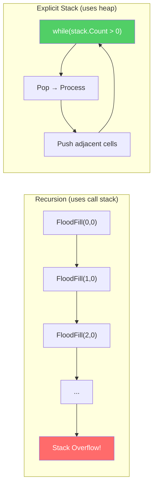
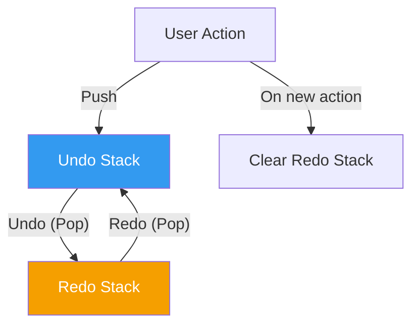
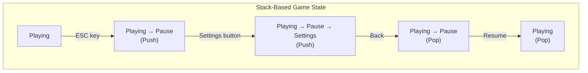
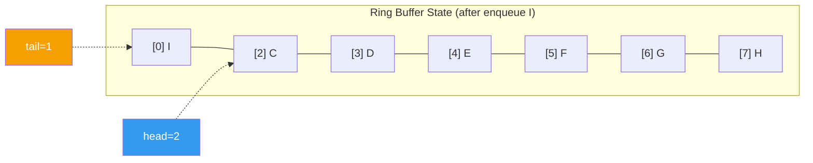
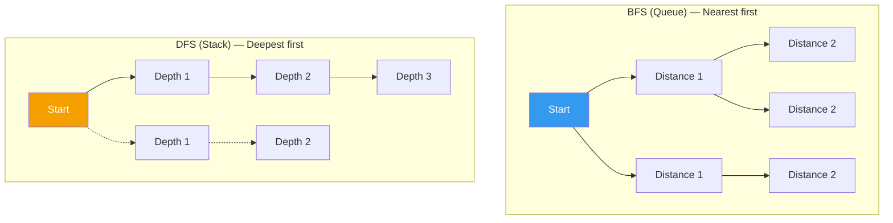
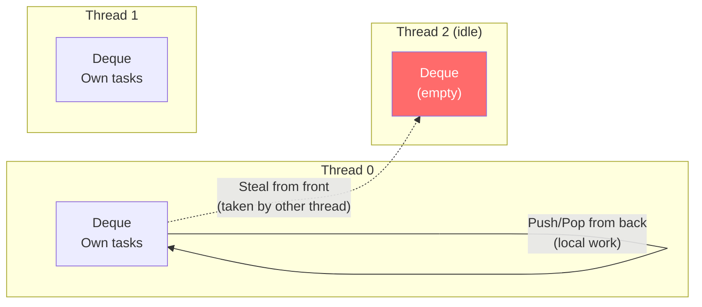
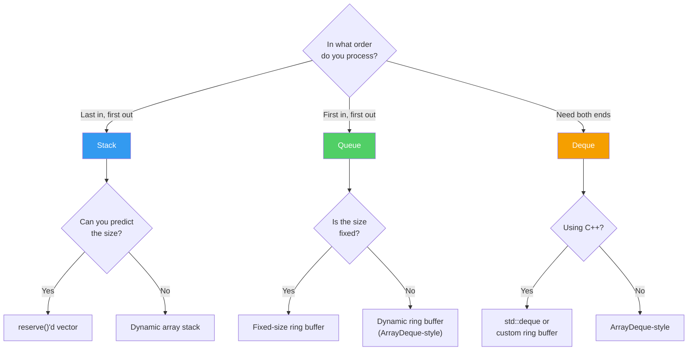

## Introduction

> This article is the 2nd installment of the **CS Roadmap** series.

In [Part 1](/posts/ArrayAndLinkedList/), we examined arrays and linked lists from a memory perspective. Arrays dominate the cache through the power of contiguous memory, while linked lists shine in special situations through the flexibility of pointers.

The stack, queue, and deque covered in this installment are different in nature from arrays and linked lists. They are not about **how data is stored**, but rather **Abstract Data Types (ADTs)** that define **how data is accessed**.

Arrays allow free access to any index. Linked lists require sequential traversal. Stacks and queues, however, **intentionally restrict access**. A stack only allows operations at the top, and a queue only at both ends. Why give up freedom? Because giving up freedom yields **stronger guarantees**.

Upcoming series structure:

| Part | Topic | Key Question |
| --- | --- | --- |
| **Part 2 (this post)** | Stack, Queue, Deque | Why does restricting access make things more powerful? |
| **Part 3** | Hash Table | How do you design hash functions and resolve collisions? |
| **Part 4** | Tree | Why do we need BST, Red-Black Tree, and B-Tree? |
| **Part 5** | Graph | What are the principles behind traversal, shortest path, and topological sort? |
| **Part 6** | Memory Management | What are the trade-offs of stack/heap, GC, and manual memory management? |

---

## Part 1: Stack — Last In, First Out

### Definition of a Stack

A stack is a **LIFO (Last In, First Out)** data structure — the last element inserted is the first to be removed. It supports only three operations:

| Operation | Description | Time Complexity |
| --- | --- | --- |
| `push(x)` | Add an element to the top | O(1) |
| `pop()` | Remove and return the top element | O(1) |
| `peek()` / `top()` | View the top element (without removing) | O(1) |

All three operations are O(1). You cannot see the middle, you cannot see the bottom. **Only the top** can be manipulated.

```
push(1)  push(2)  push(3)  pop()    pop()

  ┌───┐   ┌───┐   ┌───┐   ┌───┐   ┌───┐
  │ 1 │   │ 2 │   │ 3 │   │ 2 │   │ 1 │
  └───┘   │ 1 │   │ 2 │   │ 1 │   └───┘
          └───┘   │ 1 │   └───┘
                  └───┘
```

Simple. **This simplicity is both everything and the power of a stack.**

### Array-Based Implementation

Applying the lessons from Part 1, the most efficient stack implementation is a **dynamic array**.

```c
struct Stack {
    int* data;      // Dynamic array
    int top;        // Next insertion position (= current element count)
    int capacity;   // Array capacity
};

void push(Stack* s, int value) {
    if (s->top == s->capacity) {
        // Insufficient capacity: double the size (amortized O(1))
        s->capacity *= 2;
        s->data = realloc(s->data, s->capacity * sizeof(int));
    }
    s->data[s->top++] = value;
}

int pop(Stack* s) {
    return s->data[--s->top];
}
```

`push` appends to the end of the array and increments `top`. `pop` decrements `top` and returns. **No element movement.** This perfectly leverages the array's random access and O(1) end insertion/deletion properties.

From a memory perspective, this is also ideal. As we saw in Part 1, arrays are stored in contiguous memory and benefit from cache locality. Since stack `push`/`pop` operations always occur at the same end of the array, **temporal locality** is also maximized.

> **A Note on Terminology**
>
> **What is an ADT (Abstract Data Type)?** It is the **interface** of a data structure — it defines what operations are supported and what those operations mean — **without specifying the implementation**. A stack is an ADT, while an "array-based stack" or "linked-list-based stack" are concrete implementations of that ADT. Implementing the same ADT in different ways yields the same interface but different performance characteristics.

### Stack Implementations Across Languages

| Language/Library | Stack Implementation | Internal Data Structure |
| --- | --- | --- |
| C++ `std::stack` | Adapter | Default: `std::deque`, configurable |
| Java `Stack` | Legacy | `Vector` (synchronized, slow) |
| Java `ArrayDeque` | **Recommended** | Circular array |
| C# `Stack<T>` | Standard | Dynamic array |
| Python `list` | Conventional use | Dynamic array |
| Rust `Vec` | Conventional use | Dynamic array |

There's a reason you shouldn't use the `Stack` class in Java. It inherits from `Vector`, which has synchronization overhead, and the JDK documentation itself recommends `ArrayDeque`. This is a case of a historical mistake remaining in the API.

---

## Part 2: The Call Stack — The Heart of a Program

The most fundamental use of a stack is in **function calls**. When a program executes, the CPU uses a stack to manage function calls and returns. This is called the **call stack**.

### The Mechanics of Function Calls

Consider the following code:

```c
int multiply(int a, int b) {
    return a * b;
}

int calculate(int x) {
    int result = multiply(x, x + 1);
    return result + 10;
}

int main() {
    int answer = calculate(5);
    return 0;
}
```

What happens on the call stack when this code executes:

```
main() called
┌─────────────────────────┐
│ main's stack frame       │
│  answer = ?              │
│  return address: OS      │ ← SP (Stack Pointer)
└─────────────────────────┘

calculate(5) called
┌─────────────────────────┐
│ calculate's stack frame  │
│  x = 5                  │
│  result = ?              │
│  return address: main+0x1A │ ← SP
├─────────────────────────┤
│ main's stack frame       │
│  answer = ?              │
│  return address: OS      │
└─────────────────────────┘

multiply(5, 6) called
┌─────────────────────────┐
│ multiply's stack frame   │
│  a = 5, b = 6           │
│  return address: calc+0x0F │ ← SP
├─────────────────────────┤
│ calculate's stack frame  │
│  x = 5, result = ?      │
│  return address: main+0x1A │
├─────────────────────────┤
│ main's stack frame       │
│  answer = ?              │
│  return address: OS      │
└─────────────────────────┘
```

Each time a function is called, a **stack frame** is pushed, and when the function returns, it is popped. This happens at the hardware level — the CPU has a dedicated stack pointer (SP) register, and `call`/`ret` instructions automatically manipulate the stack.

A stack frame stores the following:

1. **Return address**: Where to go back to after the function finishes
2. **Local variables**: Variables declared inside the function
3. **Parameters**: Arguments passed to the function
4. **Saved registers**: Register state before the call

> **Let's Pause and Think About This**
>
> **Q. Why is a stack used for function calls?**
>
> Because function calls are inherently a **nesting** structure. `main` calls `calculate`, and `calculate` calls `multiply`. Returns happen in reverse order — `multiply` finishes first, then `calculate`, then `main`. **The last one called returns first.** This is exactly LIFO.
>
> The recursive procedure implementation method that Dijkstra published in 1960 is the prototype of the modern call stack. Before that, it was mechanically impossible for a function to call itself (recursion).
>
> **Q. How is the size of a stack frame determined?**
>
> The compiler analyzes the function's local variables and parameters to determine it at compile time. Therefore, stack allocation is completed by a single subtraction of SP — O(1), and much faster than heap allocation (`malloc`/`new`).

### Stack Overflow — Physical Limits

The call stack has a **finite** size:

| Environment | Default Stack Size |
| --- | --- |
| Linux (default) | 8 MB |
| Windows | 1 MB |
| macOS | 8 MB |
| Unity main thread | 1–4 MB |
| Java (default) | 512 KB – 1 MB |

A classic example of this becoming a problem in game development:

```csharp
// A common mistake in Unity: recursive exploration
void FloodFill(int x, int y) {
    if (x < 0 || x >= width || y < 0 || y >= height) return;
    if (visited[x, y]) return;

    visited[x, y] = true;
    FloodFill(x + 1, y);
    FloodFill(x - 1, y);
    FloodFill(x, y + 1);
    FloodFill(x, y - 1);
}
```

A 100x100 map means up to 10,000 recursive calls. If each stack frame is a few dozen bytes, that consumes hundreds of KB. What about 1000x1000? **Stack overflow crash.**

The solution is to convert to an **explicit stack**:

```csharp
// Converting recursion to an explicit stack
void FloodFill(int startX, int startY) {
    var stack = new Stack<(int x, int y)>();
    stack.Push((startX, startY));

    while (stack.Count > 0) {
        var (x, y) = stack.Pop();

        if (x < 0 || x >= width || y < 0 || y >= height) continue;
        if (visited[x, y]) continue;

        visited[x, y] = true;
        stack.Push((x + 1, y));
        stack.Push((x - 1, y));
        stack.Push((x, y + 1));
        stack.Push((x, y - 1));
    }
}
```

The logic is identical. But now the stack resides in **heap memory** rather than the call stack. The heap is measured in GB, so there is virtually no size limit. **Converting recursion to an explicit stack** is an essential skill in game development.



### Debugging and the Call Stack

Understanding the call stack gives you the ability to read **stack traces**.

```
NullReferenceException: Object reference not set to an instance of an object
  at Enemy.TakeDamage(Int32 amount)            ← Where the problem occurred
  at Bullet.OnTriggerEnter(Collider other)     ← The caller
  at UnityEngine.Physics.ProcessTriggers()     ← Engine internals
  at UnityEngine.PlayerLoop.FixedUpdate()      ← Game loop
```

This is the call stack read **from top to bottom**. The top is the current (most recent call), and further down is the past. `FixedUpdate` called `ProcessTriggers`, which called `OnTriggerEnter`, and finally a null reference occurred in `TakeDamage`.

Remember the Anthropic research findings cited in Part 0 — using AI as "fix it for me" halts learning, while "explain why this error occurred" leads to effective learning. The ability to **read and reason about stack traces yourself** remains a core competency even in the age of AI.

---

## Part 3: Applications of Stacks — They're Everywhere

### 1. Undo/Redo — Two Stacks

Level editors, text editors, paint programs — all "undo" features are implemented with stacks.

```
[Undo Stack]             [Redo Stack]
    ┌───┐
    │ C │ ← Most recent action
    │ B │
    │ A │
    └───┘                    (empty)

User presses Undo → Pop C from Undo stack, push to Redo stack

[Undo Stack]             [Redo Stack]
    ┌───┐                    ┌───┐
    │ B │                    │ C │
    │ A │                    └───┘
    └───┘

User presses Redo → Pop C from Redo stack, push to Undo stack

User performs new action D → Push D to Undo stack, clear Redo stack
```



The **Command Pattern** introduced in Robert Nystrom's *Game Programming Patterns* is exactly this structure. By encapsulating each action as an object with `Execute()` and `Undo()`, undo functionality is completed simply by pushing and popping from the stack.

### 2. Expression Parsing — Dijkstra's Shunting-Yard Algorithm

The **Shunting-Yard Algorithm**, invented by Dijkstra in 1961, uses a stack to convert infix notation to postfix notation.

**Infix notation**: `3 + 4 * 2` (how humans read it)
**Postfix notation**: `3 4 2 * +` (easier for computers to process)

Postfix notation can be evaluated with a single stack:

```
Input: 3 4 2 * +

1. 3 → push      Stack: [3]
2. 4 → push      Stack: [3, 4]
3. 2 → push      Stack: [3, 4, 2]
4. * → pop 2, compute 4*2=8, push 8   Stack: [3, 8]
5. + → pop 2, compute 3+8=11, push 11  Stack: [11]

Result: 11
```

This matters because **compilers and interpreters evaluate expressions in exactly this way**. The virtual machine (VM) covered in Robert Nystrom's *Crafting Interpreters* is also stack-based. Java's JVM, .NET's CLR, Python's CPython VM — all use a **stack machine** architecture.

### 3. Bracket Matching and Syntax Validation

JSON parsers, XML parsers, shader compilers — anywhere nested structures need to be validated, stacks are there.

```
Input: { [ ( ) ] }

{ → push      Stack: [{]
[ → push      Stack: [{, []
( → push      Stack: [{, [, (]
) → pop, matches ( ?  ✓     Stack: [{, []
] → pop, matches [ ?  ✓     Stack: [{]
} → pop, matches { ?  ✓     Stack: []

Stack is empty, so the structure is valid.
```

### 4. Game State Management — FSM and Stacks

Stacks are also used in game state transitions. The **Pushdown Automaton** pattern:



From Pause, you enter Settings; pressing back returns to Pause; resuming returns to Playing. Each state "remembers" the state below it — this is the difference between a simple FSM (Finite State Machine) and a pushdown automaton.

---

## Part 4: Queue — First In, First Out

### Definition of a Queue

A queue is a **FIFO (First In, First Out)** data structure — the first element inserted is the first to be removed.

| Operation | Description | Time Complexity |
| --- | --- | --- |
| `enqueue(x)` | Add an element to the back (tail) | O(1) |
| `dequeue()` | Remove and return the element from the front (head) | O(1) |
| `peek()` / `front()` | View the front element | O(1) |

```
enqueue(A)  enqueue(B)  enqueue(C)  dequeue()   dequeue()

 ┌───┐      ┌───┬───┐   ┌───┬───┬───┐  ┌───┬───┐   ┌───┐
 │ A │      │ A │ B │   │ A │ B │ C │  │ B │ C │   │ C │
 └───┘      └───┴───┘   └───┴───┴───┘  └───┴───┘   └───┘
head=tail   head  tail  head      tail  head  tail  head=tail
```

### The Problem with Array-Based Queues — Wasted Space

Implementing a queue with a naive array creates a serious problem:

```
Initial:  [A] [B] [C] [D] [ ] [ ] [ ] [ ]
           ↑head          ↑tail

After 3 dequeues: [ ] [ ] [ ] [D] [ ] [ ] [ ] [ ]
                              ↑head    ↑tail

Problem: The first 3 slots are wasted!
```

Shifting all elements forward on each `dequeue` would be O(n), defeating the purpose of a queue. But leaving them wastes space continuously. The solution to this problem is the **Ring Buffer**.

### Ring Buffer — An Array That Wraps Around

A ring buffer (circular buffer) is a structure that logically connects the end of an array to its beginning. Physically it's a regular array, but the `head` and `tail` indices are cycled using **modular arithmetic**.

```
Physical array: [ ] [ ] [ ] [ ] [ ] [ ] [ ] [ ]
                 0   1   2   3   4   5   6   7

Logical structure:
            7   0
          ┌───┬───┐
        6 │   │   │ 1
          ├───┼───┤
        5 │   │   │ 2
          ├───┼───┤
        4 │   │   │ 3
          └───┴───┘
```

Core operations:

```c
struct RingBuffer {
    int* data;
    int head;       // Dequeue position
    int tail;       // Next enqueue position
    int size;       // Current element count
    int capacity;   // Array size
};

void enqueue(RingBuffer* q, int value) {
    q->data[q->tail] = value;
    q->tail = (q->tail + 1) % q->capacity;  // Modular wrap-around
    q->size++;
}

int dequeue(RingBuffer* q) {
    int value = q->data[q->head];
    q->head = (q->head + 1) % q->capacity;  // Modular wrap-around
    q->size--;
    return value;
}
```

Let's trace the operation:

```
capacity=8, head=0, tail=0, size=0

enqueue(A): data[0]=A, tail=1    [A][ ][ ][ ][ ][ ][ ][ ]
enqueue(B): data[1]=B, tail=2    [A][B][ ][ ][ ][ ][ ][ ]
enqueue(C): data[2]=C, tail=3    [A][B][C][ ][ ][ ][ ][ ]
dequeue():  return A, head=1     [ ][B][C][ ][ ][ ][ ][ ]
dequeue():  return B, head=2     [ ][ ][C][ ][ ][ ][ ][ ]
enqueue(D): data[3]=D, tail=4    [ ][ ][C][D][ ][ ][ ][ ]
...
enqueue(H): data[7]=H, tail=0    [ ][ ][C][D][E][F][G][H]
                                        ↑head             ↑tail (=0, wrapped!)
enqueue(I): data[0]=I, tail=1    [I][ ][C][D][E][F][G][H]
                                   ↑tail ↑head
```

**When `tail` passes the end of the array, it wraps back to 0.** The same goes for `head`. Physically it's a linear array, but logically it operates as a circle. No wasted space, and all operations are O(1).



> **Let's Pause and Think About This**
>
> **Q. Isn't the modulo operation (%) expensive?**
>
> Integer remainder operations complete within a few CPU cycles. But there's a faster way. If you keep the array size as a **power of two**, you can replace the modulo operation with a **bitwise AND**:
>
> ```c
> // When capacity = 2^k
> q->tail = (q->tail + 1) & (q->capacity - 1);
> // Example: capacity=8, & 0b111 = % 8
> ```
>
> Bitwise AND takes 1 cycle. This technique is actually used in high-performance ring buffer implementations like Java's `ArrayDeque` and the Linux kernel's `kfifo`.
>
> **Q. What happens when the ring buffer is full?**
>
> There are two choices:
> 1. **Keep fixed size**: Fail on `enqueue` or overwrite the oldest element. Suitable for audio buffers, log buffers, etc.
> 2. **Dynamic expansion**: Double the size and copy, just like the dynamic array from Part 1. Java's `ArrayDeque` uses this approach.

### Cache Performance — Ring Buffer vs. Linked List Queue

Applying the lessons from Part 1 to queues:

| Implementation | Memory Layout | Cache Performance | Notes |
| --- | --- | --- | --- |
| Ring Buffer | Contiguous | Good | Array-based, prefetcher-friendly |
| Linked List | Scattered | Poor | Per-node heap allocation, cache misses |

In most cases, a ring buffer is the answer. The only time a linked-list-based queue has the advantage is when implementing a **lock-free queue** — the Michael-Scott queue (1996) is the classic lock-free linked-list queue, which we'll cover in Part 7 (advanced optimization) of the series.

---

## Part 5: Applications of Queues — The Hidden Foundation of Game Development

### 1. Event/Message Queue

A game engine's event system is implemented with queues:

```
[Event Queue]
┌──────────┬──────────┬──────────┬──────────┐
│ Collision│ HP Reduce │ UI Update│  Sound   │ ← enqueue
└──────────┴──────────┴──────────┴──────────┘
 dequeue →

Every frame:
while (eventQueue.Count > 0) {
    var event = eventQueue.Dequeue();
    DispatchEvent(event);
}
```

The reasons for **queuing events instead of processing them immediately** are numerous:

1. **Order guarantee**: Events are processed in the order they occurred
2. **Decoupling**: Event producers and consumers don't need to know about each other
3. **Frame distribution**: If events pile up in one frame, some can be deferred to the next
4. **Thread safety**: Multiple threads can enqueue events, while only the main thread processes them

### 2. Input Buffering

In fighting games, "command inputs" are implemented with queues. When a player rapidly inputs ↓↘→ + P, each input enters the queue with a timestamp:

```
[Input Queue]
(↓, t=0.00) → (↘, t=0.05) → (→, t=0.10) → (P, t=0.12)

Command recognizer:
- Check inputs within the last N ms from the queue
- If a pattern matches, trigger a special move
- Dequeue expired inputs
```

This is where the ring buffer's "fixed size + overwrite" approach is ideal. Old inputs automatically disappear, and new inputs keep coming in.

### 3. BFS — Breadth-First Search

The most classic algorithmic application of queues is **BFS (Breadth-First Search)**. It's used to find shortest paths in graphs or grids.

```csharp
// Finding shortest path with BFS (grid map)
Queue<(int x, int y)> queue = new();
queue.Enqueue((startX, startY));
distance[startX, startY] = 0;

while (queue.Count > 0) {
    var (x, y) = queue.Dequeue();

    foreach (var (nx, ny) in GetNeighbors(x, y)) {
        if (distance[nx, ny] == -1) {  // Unvisited
            distance[nx, ny] = distance[x, y] + 1;
            queue.Enqueue((nx, ny));
        }
    }
}
```

The reason BFS uses a queue: **to explore nearest nodes first**. It processes all nodes at distance 1 from the start, then distance 2, then distance 3. FIFO naturally guarantees this order.

On the other hand, what if the FloodFill from Part 2 is implemented with a stack? It becomes DFS (Depth-First Search). It digs as deep as possible in one direction before backtracking. Solving the same problem with a stack yields DFS, with a queue yields BFS — the choice of data structure determines the nature of the algorithm.



### 4. Asynchronous Task Queue — Resource Loading

When loading textures, sounds, and meshes in a game, a **task queue** is used:

```
[Loading Queue]
Texture_A → Sound_B → Mesh_C → Texture_D → ...

Main thread:
- Each frame, dequeue 1–2 tasks and process them
- Or worker threads pull tasks from the queue for parallel processing
- Throttle throughput within the frame budget (16.67ms)
```

This is a classic **Producer-Consumer Pattern**. The game logic enqueues "load this" (production), and the loading system dequeues and processes it (consumption). We'll explore this pattern in depth in Stage 2 (OS and Concurrency).

---

## Part 6: Deque — Freedom at Both Ends

### Definition of a Deque

A deque (Deque, Double-Ended Queue) is a data structure that allows **insertion and deletion at both the front and back**. It is a generalized form of stacks and queues.

| Operation | Description | Time Complexity |
| --- | --- | --- |
| `push_front(x)` | Add to the front | O(1) |
| `push_back(x)` | Add to the back | O(1) |
| `pop_front()` | Remove from the front | O(1) |
| `pop_back()` | Remove from the back | O(1) |

```
Supports both push_front and push_back:

         pop_front ←  ┌───┬───┬───┬───┬───┐  ← pop_back
        push_front →  │ A │ B │ C │ D │ E │  → push_back
                      └───┴───┴───┴───┴───┘
```

- Push and pop only at the back → **Stack**
- Push at the back, pop from the front → **Queue**
- Both ends → **Deque**

### Array-Based Deque Implementation

A deque is an extension of the ring buffer. `head` and `tail` move in both directions:

```c
void push_front(Deque* d, int value) {
    d->head = (d->head - 1 + d->capacity) % d->capacity;
    d->data[d->head] = value;
    d->size++;
}

void push_back(Deque* d, int value) {
    d->data[d->tail] = value;
    d->tail = (d->tail + 1) % d->capacity;
    d->size++;
}
```

In `push_front`, if `head` is 0, `(0 - 1 + 8) % 8 = 7` — it wraps around. The array grows backward from the end.

### C++ std::deque — A Unique Implementation

C++'s `std::deque` is not a simple ring buffer but is implemented as **an array of fixed-size blocks**. This distinguishes it from deque implementations in other languages.

```
map (pointer array):
┌─────┬─────┬─────┬─────┬─────┐
│ ptr │ ptr │ ptr │ ptr │ ptr │
└──┬──┴──┬──┴──┬──┴──┬──┴──┬──┘
   ↓     ↓     ↓     ↓     ↓
 ┌───┐ ┌───┐ ┌───┐ ┌───┐ ┌───┐
 │512│ │512│ │512│ │512│ │512│   ← Fixed-size blocks
 │ B │ │ B │ │ B │ │ B │ │ B │
 └───┘ └───┘ └───┘ └───┘ └───┘
```

Each block is contiguous memory, so it's cache-friendly within a block. `push_front` inserts at the beginning of the first block, `push_back` at the end of the last block. When a block is full, a new block is allocated and its pointer is added to the map.

Pros and cons of this structure:

| Property | `std::deque` | `std::vector` |
| --- | --- | --- |
| Front insertion | O(1) | O(n) |
| Back insertion | Amortized O(1) | Amortized O(1) |
| Random access | O(1) (higher constant) | O(1) |
| Cache performance | Good (within blocks) | Excellent (fully contiguous) |
| Element movement on reallocation | None (only pointers copied) | Full copy |
| Iterator invalidation | Only on middle insertion | All on reallocation |

This is why the default container for C++ `std::stack` is `deque` rather than `vector`. It has fewer unnecessary reallocations and copies when starting from a small size. However, in terms of pure performance, `std::stack<int, std::vector<int>>` is often faster — because the cache benefits of contiguous memory are significant.

### Applications of Deques

**1. Work Stealing**

Deques play a key role in multithreaded task systems. The algorithm presented by Robert Blumofe and Charles Leiserson in their 1999 paper "Scheduling Multithreaded Computations by Work Stealing":



- Each thread pushes and pops tasks from the **back** of its own deque (like a stack)
- An idle thread steals tasks from the **front** of another thread's deque

Since both ends are manipulated independently, it can operate **without locks** in most cases. Modern parallel frameworks like Intel TBB, Java ForkJoinPool, and .NET ThreadPool use this pattern.

**2. Sliding Window Maximum/Minimum**

When you need to maintain the "maximum among the last N values" in real-time for frame time analysis, network latency monitoring, etc., a **Monotone Deque** is used:

```
Track the maximum among the last 5 frame times in real-time

Input: [16, 14, 18, 12, 15, 20, 13]

The deque maintains only "indices that are still candidates for the maximum within the current window"
→ Always maintained in decreasing order (front is the maximum)

At each step, deque.front() = current window maximum
```

This technique is famous from LeetCode's "Sliding Window Maximum" (Problem 239), but in practice it's used in game profilers, network monitors, streaming data analysis, and more. Time complexity is amortized O(1) per element.

---

## Part 7: Summary — Comparing the Three Data Structures

### Comprehensive Comparison

| Property | Stack | Queue | Deque |
| --- | --- | --- | --- |
| **Access Rule** | LIFO | FIFO | Both ends |
| **Insertion** | One end (top) | One end (tail) | Both ends |
| **Deletion** | Same end (top) | Opposite end (head) | Both ends |
| **Optimal Implementation** | Dynamic array | Ring buffer | Ring buffer or block array |
| **Key Applications** | Call stack, Undo, Parsing | BFS, Events, Loading queue | Work stealing, Sliding window |

### Data Structure Selection Guide



### What About Priority Queues?

A **priority queue** — "the highest priority element comes out first" — has "queue" in its name, but its internal structure is entirely different. It's based on the heap data structure, with O(log n) insertion/deletion. This will be covered in Part 4 (Trees).

---

## Conclusion: When Restriction Becomes Power

Key takeaways from this article:

1. **Stack, queue, and deque are ADTs (Abstract Data Types).** If arrays and linked lists answer "how to store," these answer "how to access." By restricting access, they gain the clear semantics of LIFO and FIFO.

2. **The call stack is the heart of a program.** Function calls, recursion, stack traces — all of these run on the simple structure of a stack. Understanding stack overflow and the ability to convert recursion to an explicit stack are essential skills for game developers.

3. **The ring buffer is the definitive queue implementation.** The simple idea of wrapping around a fixed array with modular arithmetic achieves O(1) insertion/deletion and cache-friendly memory access simultaneously. Power-of-two sizing and the bitwise AND trick are optimizations you must know in practice.

4. **Deque is the generalization of stack and queue**, and the foundation for advanced patterns like work stealing and sliding windows.

5. **The choice of data structure determines the nature of the algorithm.** Solving the same graph traversal problem with a stack yields DFS, with a queue yields BFS. A data structure is not just a container for data — it is **a lens through which to view problems**.

Dijkstra presented this principle in his 1974 paper "On the Role of Scientific Thought":

> "It is what I sometimes have called 'the separation of concerns', which ... is yet the only available technique for effective ordering of one's thoughts."

Stack, queue, and deque do exactly this. By focusing on the single concern of "in what order should this data be accessed," they separate out the remaining complexity. This simple restriction makes possible the patterns that form the foundation of software — from the call stack to BFS, from undo systems to parallel schedulers.

In the next installment, we'll dig into the **hash table** — the principles behind a structure that answers the most frequent query, "find the value for this key," in O(1).

---

## References

**Key Papers and Technical Documents**
- Dijkstra, E.W., "Recursive Programming", Numerische Mathematik 2 (1960) — The prototype of recursive calls and stack frames
- Dijkstra, E.W., "On the Role of Scientific Thought" (1974) — The origin of Separation of Concerns
- Dijkstra, E.W., Shunting-Yard Algorithm (1961) — Stack-based algorithm for operator precedence parsing
- Blumofe, R. & Leiserson, C., "Scheduling Multithreaded Computations by Work Stealing", Journal of the ACM (1999) — Theoretical foundation of the work-stealing algorithm
- Michael, M. & Scott, M., "Simple, Fast, and Practical Non-Blocking and Blocking Concurrent Queue Algorithms", PODC (1996) — A classic on lock-free queues
- Tarjan, R., "Amortized Computational Complexity", SIAM J. Algebraic Discrete Methods (1985) — Formalization of amortized analysis

**Talks and Presentations**
- Acton, M., "Data-Oriented Design and C++", GDC 2014 — Data structure layout and cache optimization in game engines
- Nystrom, R., *Game Programming Patterns* — Game development patterns including Command Pattern, Game Loop, Event Queue

**Textbooks**
- Cormen, T.H. et al., *Introduction to Algorithms (CLRS)*, MIT Press — Stack, Queue Chapter 10, Amortized Analysis Chapter 17
- Bryant, R. & O'Hallaron, D., *Computer Systems: A Programmer's Perspective (CS:APP)*, Pearson — Call stack and procedure calls Chapter 3
- Knuth, D., *The Art of Computer Programming Vol. 1: Fundamental Algorithms*, Addison-Wesley — Classical analysis of stacks, queues, and deques (Section 2.2)
- Sedgewick, R. & Wayne, K., *Algorithms*, 4th Edition, Addison-Wesley — Stack/queue-based algorithms (BFS, DFS, expression evaluation)
- Nystrom, R., *Crafting Interpreters* — Stack-based virtual machine (VM) implementation

**Implementation References**
- Java `ArrayDeque` — [OpenJDK source](https://github.com/openjdk/jdk/blob/master/src/java.base/share/classes/java/util/ArrayDeque.java): Power-of-two ring buffer + bitwise AND wrapping
- Linux `kfifo` — Kernel ring buffer implementation, lock-free for single producer/consumer
- C++ `std::deque` — Block array (map of fixed-size blocks) implementation
- .NET `Stack<T>` / `Queue<T>` — [dotnet/runtime source](https://github.com/dotnet/runtime): Array-based implementation
