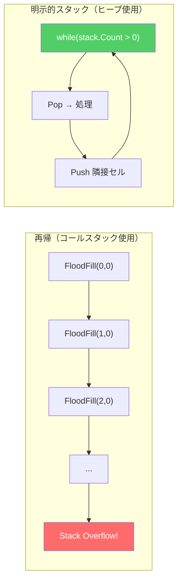
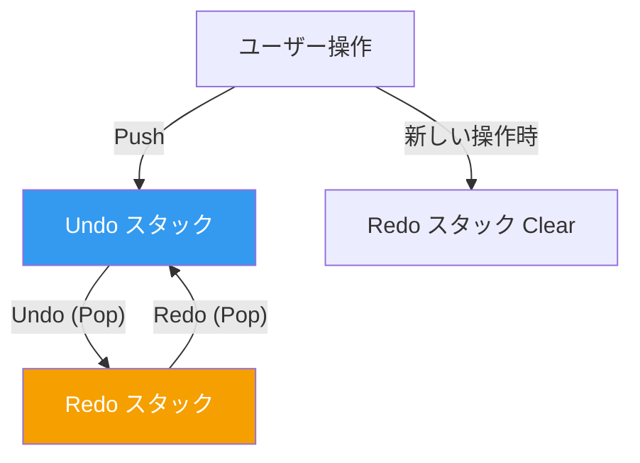
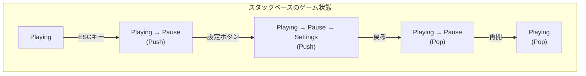
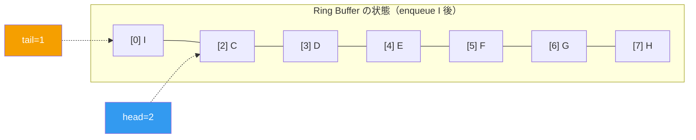
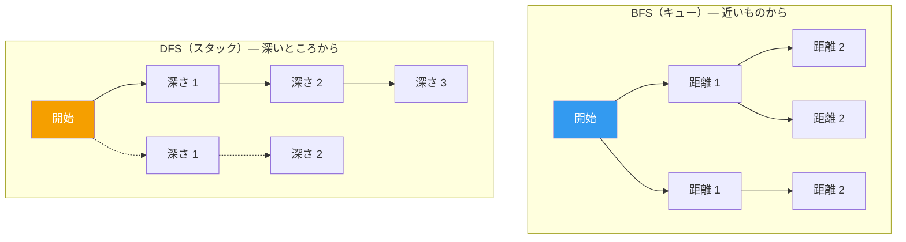
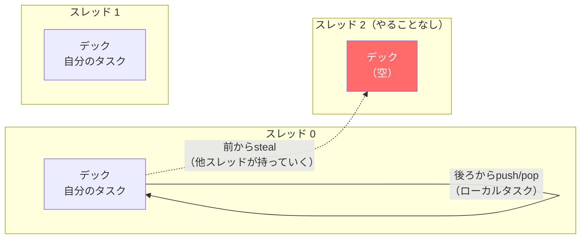
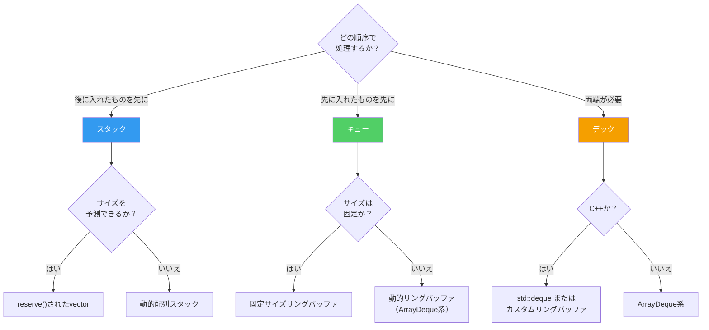

## はじめに

> この記事は**CSロードマップ**シリーズの第2回です。

[第1回](/posts/ArrayAndLinkedList/)では、配列と連結リストをメモリの観点から考察した。配列は連続メモリの力でキャッシュを支配し、連結リストはポインタの柔軟性で特殊な場面で力を発揮する。

今回扱うスタック、キュー、デックは、配列や連結リストとは性質が異なる。これらは**データをどう格納するか**ではなく、**データにどうアクセスするか**を規定する抽象データ型(Abstract Data Type, ADT)である。

配列はどのインデックスにも自由にアクセスできる。連結リストは順番にたどる必要がある。一方、スタックとキューは**意図的にアクセスを制限**する。スタックは頂上からのみ、キューは両端からのみ操作できる。なぜ自由を放棄するのか？ 自由を放棄することで**より強力な保証**を得られるからだ。

今後のシリーズ構成：

| 回 | テーマ | 核心的な問い |
| --- | --- | --- |
| **第2回（今回）** | スタック、キュー、デック | アクセスを制限するとなぜ強力になるのか？ |
| **第3回** | ハッシュテーブル | ハッシュ関数はどう設計し、衝突はどう解決するのか？ |
| **第4回** | ツリー | BST、Red-Black Tree、B-Treeはなぜ必要なのか？ |
| **第5回** | グラフ | 探索、最短経路、トポロジカルソートの原理とは？ |
| **第6回** | メモリ管理 | スタック/ヒープ、GC、手動メモリ管理のトレードオフとは？ |

---

## Part 1: スタック — 最後に入れたものが最初に出る

### スタックの定義

スタック(Stack)は**LIFO(Last In, First Out)** — 最後に入れた要素が最初に出てくるデータ構造だ。サポートする演算は3つだけである：

| 演算 | 説明 | 時間計算量 |
| --- | --- | --- |
| `push(x)` | 頂上に要素を追加 | O(1) |
| `pop()` | 頂上の要素を削除して返す | O(1) |
| `peek()` / `top()` | 頂上の要素を確認（削除しない） | O(1) |

3つの演算すべてO(1)。途中を見ることも、底を見ることもできない。**頂上のみ**操作できる。

```
push(1)  push(2)  push(3)  pop()    pop()

  ┌───┐   ┌───┐   ┌───┐   ┌───┐   ┌───┐
  │ 1 │   │ 2 │   │ 3 │   │ 2 │   │ 1 │
  └───┘   │ 1 │   │ 2 │   │ 1 │   └───┘
          └───┘   │ 1 │   └───┘
                  └───┘
```

シンプルだ。**このシンプルさこそがスタックのすべてであり、力である。**

### 配列ベースの実装

第1回で学んだ教訓を適用すると、スタックの最も効率的な実装は**動的配列**である。

```c
struct Stack {
    int* data;      // 動的配列
    int top;        // 次の挿入位置 (= 現在の要素数)
    int capacity;   // 配列の容量
};

void push(Stack* s, int value) {
    if (s->top == s->capacity) {
        // 容量不足: 2倍に拡張 (償却 O(1))
        s->capacity *= 2;
        s->data = realloc(s->data, s->capacity * sizeof(int));
    }
    s->data[s->top++] = value;
}

int pop(Stack* s) {
    return s->data[--s->top];
}
```

`push`は配列の末尾に追加して`top`をインクリメントする。`pop`は`top`をデクリメントして返す。**要素の移動は発生しない。** 配列のランダムアクセスと末尾への挿入/削除がともにO(1)であるという特性を完璧に活用している。

メモリの観点でも理想的だ。第1回で見たように、配列は連続メモリに格納されるためキャッシュ局所性の恩恵を受ける。スタックの`push`/`pop`は常に配列の同じ末尾で行われるため、**時間局所性(temporal locality)**も最大化される。

> **ちょっと用語整理**
>
> **ADT(Abstract Data Type, 抽象データ型)** とは？ データ構造の**インターフェース** — どの演算をサポートし、その演算の意味が何か — だけを定義し、**実装方法は規定しない**概念である。スタックはADTであり、「配列ベースのスタック」や「連結リストベースのスタック」はそのADTの具体的な実装である。同じADTを異なる方法で実装すれば、インターフェースは同じだが性能特性が変わる。

### 言語別スタック実装

| 言語/ライブラリ | スタック実装 | 内部データ構造 |
| --- | --- | --- |
| C++ `std::stack` | アダプタ | デフォルト: `std::deque`、変更可能 |
| Java `Stack` | レガシー | `Vector`（同期化済み、遅い） |
| Java `ArrayDeque` | **推奨** | 円形配列 |
| C# `Stack<T>` | 標準 | 動的配列 |
| Python `list` | 慣例的に使用 | 動的配列 |
| Rust `Vec` | 慣例的に使用 | 動的配列 |

Javaで`Stack`クラスを使うべきでない理由がある。`Vector`を継承しているため同期化のオーバーヘッドがあり、JDKドキュメント自体が`ArrayDeque`を推奨している。歴史的な設計ミスがAPIに残っている事例だ。

---

## Part 2: コールスタック — プログラムの心臓

スタックが最も根本的に使われる場所は**関数呼び出し**である。プログラムが実行されるとき、CPUはスタックを使って関数の呼び出しと復帰を管理する。これを**コールスタック(Call Stack)**と呼ぶ。

### 関数呼び出しのメカニズム

次のコードを見てみよう：

```c
int multiply(int a, int b) {
    return a * b;
}

int calculate(int x) {
    int result = multiply(x, x + 1);
    return result + 10;
}

int main() {
    int answer = calculate(5);
    return 0;
}
```

このコードが実行されるとき、コールスタックで起きること：

```
main() 呼び出し
┌─────────────────────────┐
│ mainのスタックフレーム     │
│  answer = ?              │
│  復帰アドレス: OS         │ ← SP (Stack Pointer)
└─────────────────────────┘

calculate(5) 呼び出し
┌─────────────────────────┐
│ calculateのスタックフレーム│
│  x = 5                  │
│  result = ?              │
│  復帰アドレス: main+0x1A │ ← SP
├─────────────────────────┤
│ mainのスタックフレーム     │
│  answer = ?              │
│  復帰アドレス: OS         │
└─────────────────────────┘

multiply(5, 6) 呼び出し
┌─────────────────────────┐
│ multiplyのスタックフレーム │
│  a = 5, b = 6           │
│  復帰アドレス: calc+0x0F │ ← SP
├─────────────────────────┤
│ calculateのスタックフレーム│
│  x = 5, result = ?      │
│  復帰アドレス: main+0x1A │
├─────────────────────────┤
│ mainのスタックフレーム     │
│  answer = ?              │
│  復帰アドレス: OS         │
└─────────────────────────┘
```

各関数が呼び出されるとき**スタックフレーム(stack frame)**がpushされ、関数が返るときpopされる。このプロセスはハードウェアレベルで行われる — CPUにはスタックポインタ(SP)レジスタが別途あり、`call`/`ret`命令が自動的にスタックを操作する。

スタックフレームには以下が格納される：

1. **復帰アドレス(return address)**：関数が終了した後どこに戻るか
2. **ローカル変数(local variables)**：関数内部で宣言した変数
3. **引数(parameters)**：関数に渡された引数
4. **保存されたレジスタ(saved registers)**：呼び出し前のレジスタ状態

> **ここは押さえておこう**
>
> **Q. なぜ関数呼び出しにスタックを使うのか？**
>
> 関数呼び出しは本質的に**入れ子(nesting)**構造だからだ。`main`が`calculate`を呼び出し、`calculate`が`multiply`を呼び出す。返却は逆順だ — `multiply`が先に終わり、`calculate`が終わり、`main`が終わる。**最後に呼ばれたものが最初に返る。** これがまさにLIFOだ。
>
> Dijkstraが1960年に発表した再帰プロシージャの実装方式が、現代のコールスタックの原型である。それ以前は、関数が自分自身を呼び出す（再帰する）ことすら機械的に不可能だった。
>
> **Q. スタックフレームのサイズはどう決まるのか？**
>
> コンパイラが関数のローカル変数と引数を分析してコンパイル時に決定する。そのためスタック割り当てはSPを1回減算するだけで完了する — O(1)であり、ヒープ割り当て(`malloc`/`new`)よりはるかに高速だ。

### スタックオーバーフロー — 物理的な限界

コールスタックのサイズは**有限**である：

| 環境 | デフォルトスタックサイズ |
| --- | --- |
| Linux（デフォルト） | 8 MB |
| Windows | 1 MB |
| macOS | 8 MB |
| Unityメインスレッド | 1〜4 MB |
| Java（デフォルト） | 512 KB 〜 1 MB |

ゲーム開発でこれが問題になる典型的な事例：

```csharp
// Unityでよく見るミス：再帰的な探索
void FloodFill(int x, int y) {
    if (x < 0 || x >= width || y < 0 || y >= height) return;
    if (visited[x, y]) return;

    visited[x, y] = true;
    FloodFill(x + 1, y);
    FloodFill(x - 1, y);
    FloodFill(x, y + 1);
    FloodFill(x, y - 1);
}
```

100×100のマップなら最大10,000回の再帰。各スタックフレームが数十バイトなら、数百KBを消費する。1000×1000なら？ **スタックオーバーフローでクラッシュ**する。

解決策は**明示的なスタック**に変換することだ：

```csharp
// 再帰を明示的なスタックに変換
void FloodFill(int startX, int startY) {
    var stack = new Stack<(int x, int y)>();
    stack.Push((startX, startY));

    while (stack.Count > 0) {
        var (x, y) = stack.Pop();

        if (x < 0 || x >= width || y < 0 || y >= height) continue;
        if (visited[x, y]) continue;

        visited[x, y] = true;
        stack.Push((x + 1, y));
        stack.Push((x - 1, y));
        stack.Push((x, y + 1));
        stack.Push((x, y - 1));
    }
}
```

ロジックは同じだ。しかしスタックはコールスタックではなく**ヒープメモリ**上にある。ヒープはGB単位なので、事実上サイズ制限がない。ゲーム開発において**再帰を明示的なスタックに変換する技術**は必須スキルである。



### デバッグとコールスタック

コールスタックを理解すると**スタックトレース(stack trace)**を読む能力が身につく。

```
NullReferenceException: Object reference not set to an instance of an object
  at Enemy.TakeDamage(Int32 amount)            ← 問題発生箇所
  at Bullet.OnTriggerEnter(Collider other)     ← 呼び出し元
  at UnityEngine.Physics.ProcessTriggers()     ← エンジン内部
  at UnityEngine.PlayerLoop.FixedUpdate()      ← ゲームループ
```

これはコールスタックを**上から下に読んだもの**だ。一番上が現在（最も直近の呼び出し）で、下に行くほど過去になる。`FixedUpdate`が`ProcessTriggers`を呼び出し、それが`OnTriggerEnter`を呼び出し、最終的に`TakeDamage`でnull参照が発生した。

第0回で引用したAnthropicの研究結果を思い出そう — AIを「直して」と使うと学習が止まり、「このエラーがなぜ発生したか説明して」と使うと効果的な学習になる。スタックトレースを**自分で読んで推論する能力**はAI時代においても依然として核心的なスキルである。

---

## Part 3: スタックの応用 — 意外とあらゆるところにある

### 1. Undo/Redo — 2つのスタック

レベルエディタ、テキストエディタ、ペイントツール — すべての「元に戻す」機能はスタックで実装されている。

```
[Undo スタック]             [Redo スタック]
    ┌───┐
    │ C │ ← 最も直近の操作
    │ B │
    │ A │
    └───┘                    (空)

ユーザーがUndoを押す → CをUndoスタックからpop、Redoスタックにpush

[Undo スタック]             [Redo スタック]
    ┌───┐                    ┌───┐
    │ B │                    │ C │
    │ A │                    └───┘
    └───┘

ユーザーがRedoを押す → CをRedoスタックからpop、Undoスタックにpush

ユーザーが新しい操作Dを実行 → DをUndoスタックにpush、Redoスタックをクリア
```



Robert Nystromの*Game Programming Patterns*で紹介されている**コマンドパターン(Command Pattern)**がまさにこの構造だ。各操作を`Execute()`と`Undo()`を持つオブジェクトとしてカプセル化すれば、スタックに入れたり出したりするだけで「元に戻す」が完成する。

### 2. 数式パーシング — DijkstraのShunting-Yardアルゴリズム

Dijkstraが1961年に発明した**Shunting-Yard（操車場）アルゴリズム**は、スタックを使って中置記法を後置記法に変換する。

**中置記法**：`3 + 4 * 2`（人間が読む方式）
**後置記法**：`3 4 2 * +`（コンピュータが処理しやすい方式）

後置記法はスタック1つで計算できる：

```
入力: 3 4 2 * +

1. 3 → push      スタック: [3]
2. 4 → push      スタック: [3, 4]
3. 2 → push      スタック: [3, 4, 2]
4. * → 2つpop、計算 4*2=8、push 8   スタック: [3, 8]
5. + → 2つpop、計算 3+8=11、push 11  スタック: [11]

結果: 11
```

これが重要な理由は、**プログラミング言語のコンパイラやインタープリタが数式を評価するとき、まさにこの方式を使っているから**だ。Robert Nystromの*Crafting Interpreters*で扱うバーチャルマシン(VM)もスタックベースである。JavaのJVM、.NETのCLR、PythonのCPython VM — すべて**スタックマシン(stack machine)**構造だ。

### 3. 括弧マッチングと構文検証

JSONパーサー、XMLパーサー、シェーダーコンパイラ — 入れ子構造を検証する場所にはどこでもスタックがある。

```
入力: { [ ( ) ] }

{ → push      スタック: [{]
[ → push      スタック: [{, []
( → push      スタック: [{, [, (]
) → pop、( とマッチ？  ✓     スタック: [{, []
] → pop、[ とマッチ？  ✓     スタック: [{]
} → pop、{ とマッチ？  ✓     スタック: []

スタックが空なので有効な構造。
```

### 4. ゲーム状態管理 — FSMとスタック

ゲームの状態遷移でもスタックが使われる。**プッシュダウンオートマトン(Pushdown Automaton)**パターン：



Pause状態からSettingsに入り、戻ればPauseに戻り、再開すればPlayingに戻る。各状態がその下の状態を「記憶」している — これが単純なFSM(Finite State Machine)とプッシュダウンオートマトンの違いだ。

---

## Part 4: キュー — 最初に入れたものが最初に出る

### キューの定義

キュー(Queue)は**FIFO(First In, First Out)** — 最初に入れた要素が最初に出てくるデータ構造だ。

| 演算 | 説明 | 時間計算量 |
| --- | --- | --- |
| `enqueue(x)` | 末尾(tail)に要素を追加 | O(1) |
| `dequeue()` | 先頭(head)から要素を削除して返す | O(1) |
| `peek()` / `front()` | 先頭の要素を確認 | O(1) |

```
enqueue(A)  enqueue(B)  enqueue(C)  dequeue()   dequeue()

 ┌───┐      ┌───┬───┐   ┌───┬───┬───┐  ┌───┬───┐   ┌───┐
 │ A │      │ A │ B │   │ A │ B │ C │  │ B │ C │   │ C │
 └───┘      └───┴───┘   └───┴───┴───┘  └───┴───┘   └───┘
head=tail   head  tail  head      tail  head  tail  head=tail
```

### 配列ベースキューの問題 — 空間の無駄

単純な配列でキューを実装すると深刻な問題が生じる：

```
初期:     [A] [B] [C] [D] [ ] [ ] [ ] [ ]
           ↑head          ↑tail

dequeue 3回: [ ] [ ] [ ] [D] [ ] [ ] [ ] [ ]
                          ↑head    ↑tail

問題: 前方の3スロットが無駄に！
```

`dequeue`のたびにすべての要素を前にシフトするとO(n)になり、キューの意味がなくなる。放置すれば空間が無駄になり続ける。この問題を解決するのが**リングバッファ(Ring Buffer)**だ。

### リングバッファ — 円形に循環する配列

リングバッファ(Circular Buffer, Ring Buffer)は、配列の末尾を配列の先頭と論理的に接続した構造だ。物理的には通常の配列だが、`head`と`tail`のインデックスを**モジュラー演算**で循環させる。

```
物理的な配列: [ ] [ ] [ ] [ ] [ ] [ ] [ ] [ ]
              0   1   2   3   4   5   6   7

論理的な構造:
            7   0
          ┌───┬───┐
        6 │   │   │ 1
          ├───┼───┤
        5 │   │   │ 2
          ├───┼───┤
        4 │   │   │ 3
          └───┴───┘
```

核心となる演算：

```c
struct RingBuffer {
    int* data;
    int head;       // dequeue位置
    int tail;       // 次のenqueue位置
    int size;       // 現在の要素数
    int capacity;   // 配列のサイズ
};

void enqueue(RingBuffer* q, int value) {
    q->data[q->tail] = value;
    q->tail = (q->tail + 1) % q->capacity;  // モジュラー循環
    q->size++;
}

int dequeue(RingBuffer* q) {
    int value = q->data[q->head];
    q->head = (q->head + 1) % q->capacity;  // モジュラー循環
    q->size--;
    return value;
}
```

動作過程を追跡してみよう：

```
capacity=8, head=0, tail=0, size=0

enqueue(A): data[0]=A, tail=1    [A][ ][ ][ ][ ][ ][ ][ ]
enqueue(B): data[1]=B, tail=2    [A][B][ ][ ][ ][ ][ ][ ]
enqueue(C): data[2]=C, tail=3    [A][B][C][ ][ ][ ][ ][ ]
dequeue():  return A, head=1     [ ][B][C][ ][ ][ ][ ][ ]
dequeue():  return B, head=2     [ ][ ][C][ ][ ][ ][ ][ ]
enqueue(D): data[3]=D, tail=4    [ ][ ][C][D][ ][ ][ ][ ]
...
enqueue(H): data[7]=H, tail=0    [ ][ ][C][D][E][F][G][H]
                                        ↑head             ↑tail (=0, 循環！)
enqueue(I): data[0]=I, tail=1    [I][ ][C][D][E][F][G][H]
                                   ↑tail ↑head
```

**`tail`が配列の末尾を超えると0に戻る。** `head`も同様だ。物理的には線形配列だが、論理的には円形に動作する。空間の無駄がなく、すべての演算がO(1)である。



> **ここは押さえておこう**
>
> **Q. モジュラー演算(%)はコストが高くないか？**
>
> 整数の剰余演算はCPUで数サイクル以内に完了する。しかしもっと高速な方法がある。配列サイズを**2のべき乗**に保てば、モジュラー演算を**ビットAND**に置き換えられる：
>
> ```c
> // capacity = 2^k の場合
> q->tail = (q->tail + 1) & (q->capacity - 1);
> // 例: capacity=8なら、& 0b111 = % 8
> ```
>
> ビットANDは1サイクルだ。これは実際にJavaの`ArrayDeque`、Linuxカーネルの`kfifo`など、高性能リングバッファ実装で使われている技法である。
>
> **Q. リングバッファが満杯になったらどうするか？**
>
> 2つの選択肢がある：
> 1. **固定サイズを維持**：満杯なら`enqueue`失敗、または最も古い要素を上書き。オーディオバッファ、ログバッファなどに適している。
> 2. **動的拡張**：第1回で学んだ動的配列のように2倍に拡張してコピー。Javaの`ArrayDeque`がこの方式。

### キャッシュ性能 — リングバッファ vs 連結リストキュー

第1回の教訓をキューに適用すると：

| 実装方式 | メモリ配置 | キャッシュ性能 | 備考 |
| --- | --- | --- | --- |
| リングバッファ | 連続 | 良好 | 配列ベース、プリフェッチャフレンドリー |
| 連結リスト | 分散 | 不良 | ノードごとのヒープ割り当て、キャッシュミス |

ほとんどの場合、リングバッファが正解だ。連結リストベースのキューが有利なケースは**ロックフリーキュー**の実装時くらいだ — Michael-Scottキュー(1996)が代表的なロックフリー連結リストキューであり、これはシリーズ第7回（高度な最適化）で扱う。

---

## Part 5: キューの応用 — ゲーム開発の隠れた基盤

### 1. イベント/メッセージキュー

ゲームエンジンのイベントシステムはキューで実装される：

```
[イベントキュー]
┌──────────┬──────────┬──────────┬──────────┐
│ 衝突発生  │ HP減少   │ UI更新   │ サウンド  │ ← enqueue
└──────────┴──────────┴──────────┴──────────┘
 dequeue →

フレームごとに:
while (eventQueue.Count > 0) {
    var event = eventQueue.Dequeue();
    DispatchEvent(event);
}
```

イベントを**即座に処理せずキューに入れておく理由**はいくつかある：

1. **順序保証**：イベントが発生した順序で処理
2. **デカップリング**：イベントの発行者と処理者が互いを知らなくてよい
3. **フレーム分散**：1フレームにイベントが集中したら、一部を次フレームに先送りできる
4. **スレッド安全性**：複数のスレッドからイベントを入れ、メインスレッドでのみ処理

### 2. 入力バッファリング

格闘ゲームで「コマンド入力」はキューで実装される。プレイヤーが↓↘→ + Pを素早く入力するとき、各入力はタイムスタンプとともにキューに入る：

```
[入力キュー]
(↓, t=0.00) → (↘, t=0.05) → (→, t=0.10) → (P, t=0.12)

コマンド認識器:
- キューから直近N ms以内の入力を確認
- パターンがマッチしたら特殊技発動
- 古い入力はdequeue
```

このときリングバッファの「固定サイズ + 上書き」方式が適している。古い入力は自動的に消え、新しい入力が次々と入ってくる。

### 3. BFS — 幅優先探索

キューの最も古典的なアルゴリズム応用は**BFS(Breadth-First Search)**だ。グラフやグリッドで最短経路を見つけるときに使う。

```csharp
// BFSで最短経路を求める（グリッドマップ）
Queue<(int x, int y)> queue = new();
queue.Enqueue((startX, startY));
distance[startX, startY] = 0;

while (queue.Count > 0) {
    var (x, y) = queue.Dequeue();

    foreach (var (nx, ny) in GetNeighbors(x, y)) {
        if (distance[nx, ny] == -1) {  // 未訪問
            distance[nx, ny] = distance[x, y] + 1;
            queue.Enqueue((nx, ny));
        }
    }
}
```

BFSがキューを使う理由：**近いものから探索する**ためだ。始点から距離1のノードをすべて処理した後、距離2のノードを処理し、距離3のノードを処理する。FIFOがこの順序を自然に保証する。

一方、Part 2で見たFloodFillをスタックで実装すると？ DFS(Depth-First Search)になる。一方向に最後まで掘り進んでから戻ってくる。同じ問題をスタックで解けばDFS、キューで解けばBFS — データ構造の選択がアルゴリズムの性質を決定する。



### 4. 非同期タスクキュー — リソースローディング

ゲームでテクスチャ、サウンド、メッシュをロードするとき**タスクキュー**を使う：

```
[ローディングキュー]
Texture_A → Sound_B → Mesh_C → Texture_D → ...

メインスレッド:
- フレームごとにキューから1〜2個のタスクを取り出して処理
- またはワーカースレッドがキューからタスクを取得して並列処理
- フレーム予算(16.67ms)内でスループットを調整
```

これは**プロデューサー・コンシューマー(Producer-Consumer)パターン**の典型だ。ゲームロジックが「これをロードして」とキューに入れ（生産）、ローディングシステムがキューから取り出して処理する（消費）。第2段階（OSと並行性）でこのパターンを深く扱う。

---

## Part 6: デック — 両端の自由

### デックの定義

デック(Deque, Double-Ended Queue)は**前と後ろの両端で挿入と削除が可能**なデータ構造だ。スタックとキューを一般化した形態である。

| 演算 | 説明 | 時間計算量 |
| --- | --- | --- |
| `push_front(x)` | 前に追加 | O(1) |
| `push_back(x)` | 後ろに追加 | O(1) |
| `pop_front()` | 前から削除 | O(1) |
| `pop_back()` | 後ろから削除 | O(1) |

```
push_frontとpush_backの両方をサポート:

         pop_front ←  ┌───┬───┬───┬───┬───┐  ← pop_back
        push_front →  │ A │ B │ C │ D │ E │  → push_back
                      └───┴───┴───┴───┴───┘
```

- 後ろからのみ出し入れすれば → **スタック**
- 後ろから入れて前から出せば → **キュー**
- 両端とも → **デック**

### 配列ベースのデック実装

デックはリングバッファの拡張だ。`head`と`tail`が双方向に移動する：

```c
void push_front(Deque* d, int value) {
    d->head = (d->head - 1 + d->capacity) % d->capacity;
    d->data[d->head] = value;
    d->size++;
}

void push_back(Deque* d, int value) {
    d->data[d->tail] = value;
    d->tail = (d->tail + 1) % d->capacity;
    d->size++;
}
```

`push_front`で`head`が0のとき、`(0 - 1 + 8) % 8 = 7`で循環する。配列の末尾から前に向かって伸びるイメージだ。

### C++ std::deque — 独特な実装

C++の`std::deque`は単純なリングバッファではなく、**固定サイズブロックの配列**で実装されている。これは他の言語のデック実装とは異なる特徴だ。

```
map（ポインタ配列）:
┌─────┬─────┬─────┬─────┬─────┐
│ ptr │ ptr │ ptr │ ptr │ ptr │
└──┬──┴──┬──┴──┬──┴──┬──┴──┬──┘
   ↓     ↓     ↓     ↓     ↓
 ┌───┐ ┌───┐ ┌───┐ ┌───┐ ┌───┐
 │512│ │512│ │512│ │512│ │512│   ← 固定サイズブロック
 │ B │ │ B │ │ B │ │ B │ │ B │
 └───┘ └───┘ └───┘ └───┘ └───┘
```

各ブロックは連続メモリなので、ブロック内ではキャッシュフレンドリーだ。`push_front`は最初のブロックの前に、`push_back`は最後のブロックの後ろに挿入する。ブロックが満杯になると新しいブロックを割り当て、mapにポインタを追加する。

この構造の長所と短所：

| 特性 | `std::deque` | `std::vector` |
| --- | --- | --- |
| 前方挿入 | O(1) | O(n) |
| 後方挿入 | 償却 O(1) | 償却 O(1) |
| ランダムアクセス | O(1)（定数が大きい） | O(1) |
| キャッシュ性能 | 良好（ブロック内） | 非常に良好（全体が連続） |
| 再割り当て時の要素移動 | なし（ポインタのコピーのみ） | 全体コピー |
| イテレータ無効化 | 中間挿入時のみ | 再割り当て時にすべて |

C++の`std::stack`のデフォルトコンテナが`vector`ではなく`deque`である理由がここにある。小さいサイズから始めるとき、不要な再割り当てとコピーが少ないためだ。しかし純粋な性能だけで言えば`std::stack<int, std::vector<int>>`の方が速いことが多い — 連続メモリのキャッシュの利点が大きいためだ。

### デックの応用

**1. ワークスティーリング(Work Stealing)**

マルチスレッドタスクシステムでデックが核心的な役割を果たす。Robert BlumofeとCharles Leisersonが1999年の論文"Scheduling Multithreaded Computations by Work Stealing"で提示したアルゴリズム：



- 各スレッドは自分のデックの**後ろ(back)**からタスクを入れたり出したりする（スタックのように）
- やることがないスレッドは他のスレッドのデックの**前(front)**からタスクを盗む

両端から独立して操作するため、ほとんどの場合**ロックなし**で動作できる。Intel TBB、Java ForkJoinPool、.NET ThreadPoolなど、現代的な並列フレームワークでこのパターンが使われている。

**2. スライディングウィンドウ最大値/最小値**

フレーム時間の分析、ネットワーク遅延のモニタリングなどで「直近N個の値の中の最大値」をリアルタイムで維持する必要があるとき、**単調デック(Monotone Deque)**を使う：

```
直近5フレームの中の最大フレーム時間をリアルタイム追跡

入力: [16, 14, 18, 12, 15, 20, 13]

デックには「現在のウィンドウ内でまだ最大値候補であるインデックス」のみ保持
→ 常に降順を維持（先頭が最大）

各ステップで deque.front() = 現在のウィンドウ最大値
```

この技法はLeetCodeの"Sliding Window Maximum"（問題239）で有名だが、実務ではゲームプロファイラ、ネットワークモニタ、ストリーミングデータ分析などで使われている。時間計算量は償却O(1) per element。

---

## Part 7: まとめ — 3つのデータ構造の比較

### 総合比較

| 特性 | スタック (Stack) | キュー (Queue) | デック (Deque) |
| --- | --- | --- | --- |
| **アクセス規則** | LIFO | FIFO | 両端 |
| **挿入** | 一端 (top) | 一端 (tail) | 両端 |
| **削除** | 同じ端 (top) | 反対端 (head) | 両端 |
| **最適な実装** | 動的配列 | リングバッファ | リングバッファまたはブロック配列 |
| **代表的な応用** | コールスタック、Undo、パーシング | BFS、イベント、ローディングキュー | ワークスティーリング、スライディングウィンドウ |

### データ構造選択ガイド



### 優先度キューは？

「優先度が高いものが先に出るキュー」である**優先度キュー(Priority Queue)**は名前に「キュー」が付くが、内部構造はまったく異なる。ヒープ(Heap)データ構造ベースで、挿入/削除がO(log n)である。これは第4回（ツリー）で扱う。

---

## おわりに：制限が強力さになる瞬間

この記事で見てきた核心：

1. **スタック、キュー、デックはADT（抽象データ型）**である。配列や連結リストが「どう格納するか」への答えなら、これらは「どうアクセスするか」への答えだ。アクセスを制限することで、LIFO、FIFOという明確なセマンティクス(semantics)を得る。

2. **コールスタックはプログラムの心臓**である。関数呼び出し、再帰、スタックトレース — これらすべてがスタックというシンプルな構造の上で動いている。スタックオーバーフローを理解し、再帰を明示的なスタックに変換する技術は、ゲーム開発者の必須スキルである。

3. **リングバッファはキューの決定的な実装**である。固定配列でモジュラー演算を使って循環させるというシンプルなアイデアが、O(1)の挿入/削除とキャッシュフレンドリーなメモリアクセスを同時に実現する。2のべき乗サイズとビットANDのトリックは実戦で必ず知っておくべき最適化だ。

4. **デックはスタックとキューの一般化**であり、ワークスティーリングやスライディングウィンドウのような高度なパターンの基盤である。

5. **データ構造の選択がアルゴリズムの性質を決定する**。同じグラフ探索問題をスタックで解けばDFS、キューで解けばBFSになる。データ構造はデータの器ではなく、**問題を見る視点**である。

Dijkstraは1974年の論文"On the Role of Scientific Thought"でこのような原則を提示した：

> "It is what I sometimes have called 'the separation of concerns', which ... is yet the only available technique for effective ordering of one's thoughts."
>
> （私はこれを「関心の分離」と呼んでいるが、これは思考を効果的に整理するための唯一の技法である。）

スタック、キュー、デックがまさにこれを行っている。「このデータにどの順序でアクセスするか」という一つの関心に集中することで、残りの複雑さを分離する。このシンプルな制限が、コールスタックからBFSまで、Undoシステムから並列スケジューラまで、ソフトウェアの根幹を成すパターンを可能にしている。

次回は**ハッシュテーブル** — 「このキーで値を見つけろ」という最も頻繁な問いにO(1)で答える構造の原理を掘り下げる。

---

## 参考文献

**核心論文および技術文書**
- Dijkstra, E.W., "Recursive Programming", Numerische Mathematik 2 (1960) — 再帰呼び出しとスタックフレームの原型
- Dijkstra, E.W., "On the Role of Scientific Thought" (1974) — 関心の分離(Separation of Concerns)の原典
- Dijkstra, E.W., Shunting-Yard Algorithm (1961) — 演算子優先順位パーシングのスタックベースアルゴリズム
- Blumofe, R. & Leiserson, C., "Scheduling Multithreaded Computations by Work Stealing", Journal of the ACM (1999) — ワークスティーリングアルゴリズムの理論的基盤
- Michael, M. & Scott, M., "Simple, Fast, and Practical Non-Blocking and Blocking Concurrent Queue Algorithms", PODC (1996) — ロックフリーキューの古典
- Tarjan, R., "Amortized Computational Complexity", SIAM J. Algebraic Discrete Methods (1985) — 償却分析の形式化

**講演および発表**
- Acton, M., "Data-Oriented Design and C++", GDC 2014 — ゲームエンジンにおけるデータ構造の配置とキャッシュ最適化
- Nystrom, R., *Game Programming Patterns* — コマンドパターン、ゲームループ、イベントキューなどのゲーム開発パターン

**教科書**
- Cormen, T.H. et al., *Introduction to Algorithms (CLRS)*, MIT Press — スタック、キュー Chapter 10、償却分析 Chapter 17
- Bryant, R. & O'Hallaron, D., *Computer Systems: A Programmer's Perspective (CS:APP)*, Pearson — コールスタックとプロシージャ呼び出し Chapter 3
- Knuth, D., *The Art of Computer Programming Vol. 1: Fundamental Algorithms*, Addison-Wesley — スタック、キュー、デックの古典的分析 (Section 2.2)
- Sedgewick, R. & Wayne, K., *Algorithms*, 4th Edition, Addison-Wesley — スタック/キューベースのアルゴリズム（BFS、DFS、数式評価）
- Nystrom, R., *Crafting Interpreters* — スタックベースのバーチャルマシン(VM)実装

**実装参考**
- Java `ArrayDeque` — [OpenJDK ソース](https://github.com/openjdk/jdk/blob/master/src/java.base/share/classes/java/util/ArrayDeque.java): 2のべき乗リングバッファ + ビットAND循環
- Linux `kfifo` — カーネルリングバッファ実装、単一プロデューサー/コンシューマー時にロックフリー
- C++ `std::deque` — ブロック配列（map of fixed-size blocks）実装
- .NET `Stack<T>` / `Queue<T>` — [dotnet/runtime ソース](https://github.com/dotnet/runtime): 配列ベース実装
