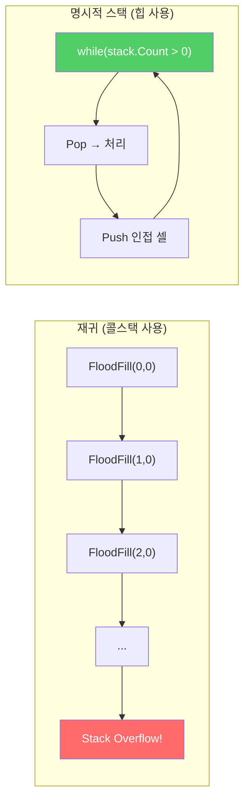
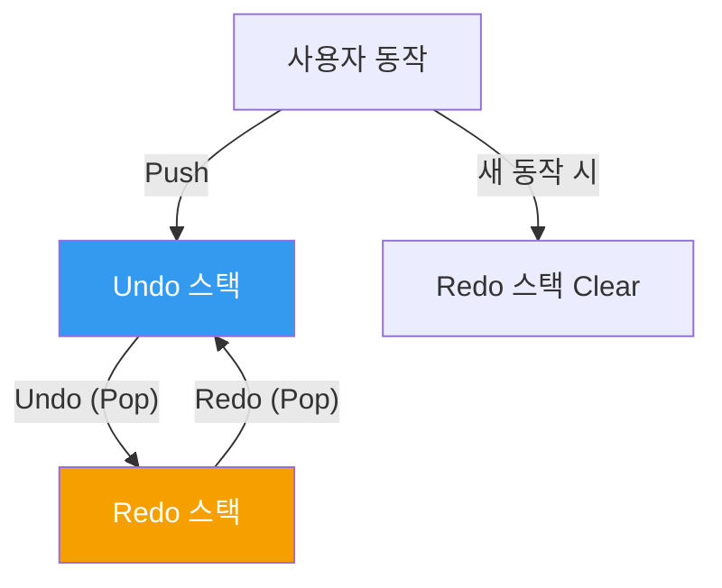
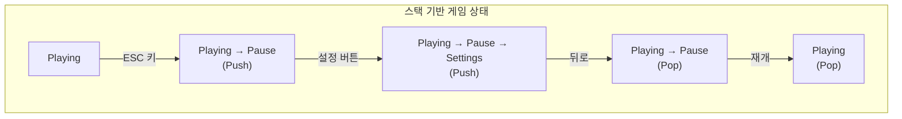
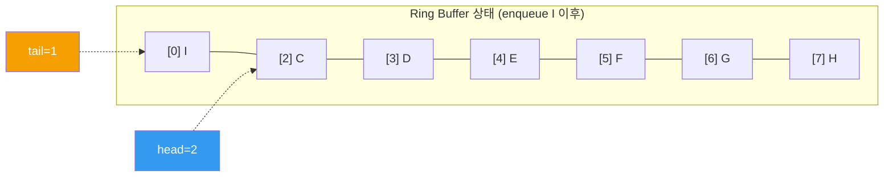
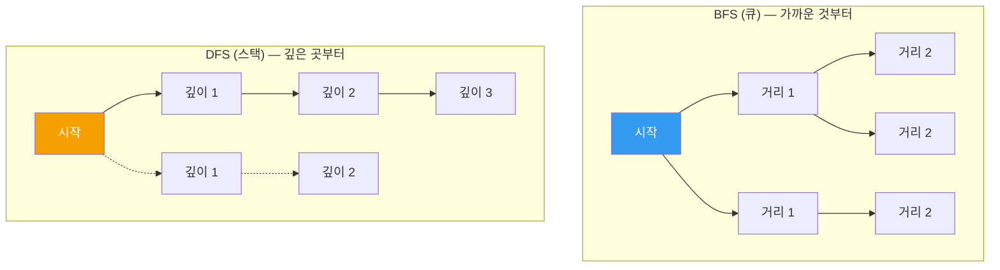
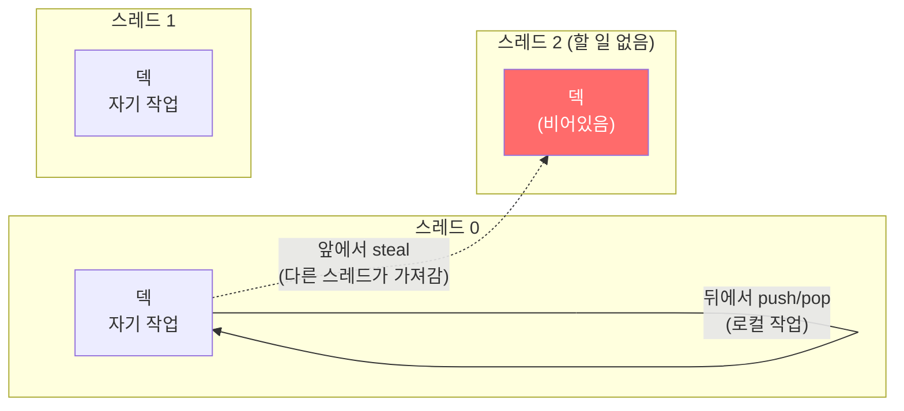
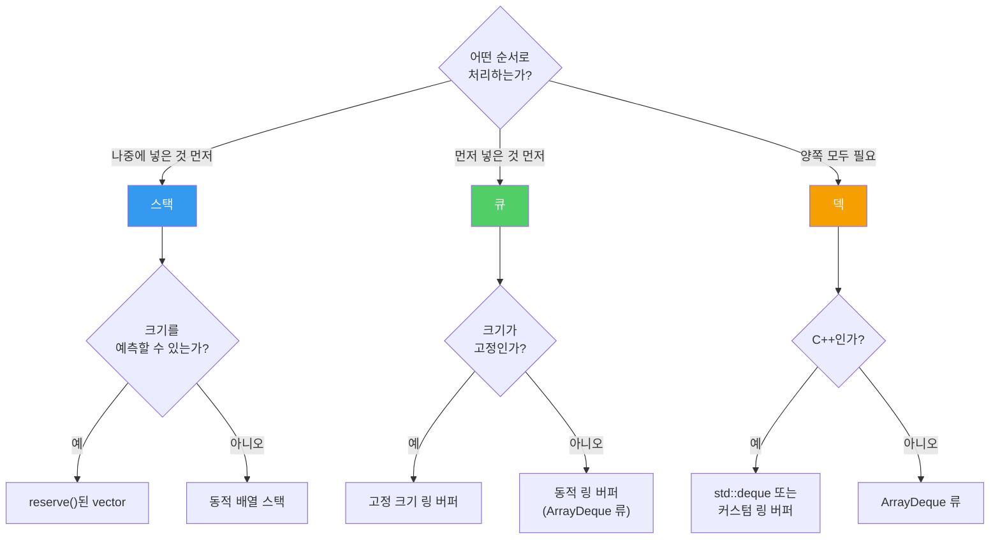

## 서론

> 이 문서는 **CS 로드맵** 시리즈의 2번째 편입니다.

[1편](/posts/ArrayAndLinkedList/)에서 배열과 연결 리스트를 메모리 관점에서 살펴보았다. 배열은 연속 메모리의 힘으로 캐시를 지배하고, 연결 리스트는 포인터의 유연함으로 특수한 상황에서 빛난다.

이번 편에서 다루는 스택, 큐, 덱은 배열이나 연결 리스트와는 성격이 다르다. 이들은 **데이터를 어떻게 저장하느냐**가 아니라, **데이터에 어떻게 접근하느냐**를 규정하는 추상 자료형(Abstract Data Type, ADT)이다.

배열은 아무 인덱스나 자유롭게 접근할 수 있다. 연결 리스트는 순서대로 따라가야 한다. 그런데 스택과 큐는 **의도적으로 접근을 제한**한다. 스택은 맨 위에서만, 큐는 양 끝에서만 조작할 수 있다. 왜 자유를 포기하는가? 자유를 포기함으로써 **더 강력한 보장**을 얻기 때문이다.

이후 시리즈 구성:

| 편 | 주제 | 핵심 질문 |
| --- | --- | --- |
| **2편 (이번 글)** | 스택, 큐, 덱 | 접근을 제한하면 왜 더 강력해지는가? |
| **3편** | 해시 테이블 | 해시 함수는 어떻게 설계하고, 충돌은 어떻게 해결하는가? |
| **4편** | 트리 | BST, Red-Black Tree, B-Tree는 왜 필요한가? |
| **5편** | 그래프 | 탐색, 최단 경로, 위상 정렬의 원리는? |
| **6편** | 메모리 관리 | 스택/힙, GC, 수동 메모리 관리의 트레이드오프는? |

---

## Part 1: 스택 — 마지막에 넣은 것이 먼저 나온다

### 스택의 정의

스택(Stack)은 **LIFO(Last In, First Out)** — 마지막에 넣은 원소가 가장 먼저 나오는 자료구조다. 지원하는 연산은 세 가지뿐이다:

| 연산 | 설명 | 시간 복잡도 |
| --- | --- | --- |
| `push(x)` | 맨 위에 원소 추가 | O(1) |
| `pop()` | 맨 위 원소 제거 후 반환 | O(1) |
| `peek()` / `top()` | 맨 위 원소 확인 (제거하지 않음) | O(1) |

세 연산 모두 O(1). 중간을 볼 수 없고, 바닥을 볼 수 없다. **오직 꼭대기만** 조작할 수 있다.

```
push(1)  push(2)  push(3)  pop()    pop()

  ┌───┐   ┌───┐   ┌───┐   ┌───┐   ┌───┐
  │ 1 │   │ 2 │   │ 3 │   │ 2 │   │ 1 │
  └───┘   │ 1 │   │ 2 │   │ 1 │   └───┘
          └───┘   │ 1 │   └───┘
                  └───┘
```

단순하다. **이 단순함이 스택의 전부이자 힘이다.**

### 배열 기반 구현

1편에서 배운 교훈을 적용하면, 스택의 가장 효율적인 구현은 **동적 배열**이다.

```c
struct Stack {
    int* data;      // 동적 배열
    int top;        // 다음 삽입 위치 (= 현재 원소 수)
    int capacity;   // 배열 용량
};

void push(Stack* s, int value) {
    if (s->top == s->capacity) {
        // 용량 부족: 2배로 확장 (상각 O(1))
        s->capacity *= 2;
        s->data = realloc(s->data, s->capacity * sizeof(int));
    }
    s->data[s->top++] = value;
}

int pop(Stack* s) {
    return s->data[--s->top];
}
```

`push`는 배열 끝에 추가하고 `top`을 증가시킨다. `pop`은 `top`을 감소시키고 반환한다. **원소 이동이 없다.** 배열의 랜덤 접근과 끝 삽입/삭제가 모두 O(1)이라는 특성을 완벽하게 활용한다.

메모리 관점에서도 이상적이다. 1편에서 살펴본 것처럼, 배열은 연속 메모리에 저장되므로 캐시 지역성의 혜택을 받는다. 스택의 `push`/`pop`은 항상 배열의 같은 끝에서 일어나므로, **시간 지역성(temporal locality)**도 극대화된다.

> **잠깐, 용어 정리**
>
> **ADT(Abstract Data Type, 추상 자료형)**란? 자료구조의 **인터페이스** — 어떤 연산을 지원하고, 그 연산의 의미가 무엇인지 — 만 정의하고, **구현 방식은 규정하지 않는** 개념이다. 스택은 ADT이고, "배열 기반 스택"이나 "연결 리스트 기반 스택"은 그 ADT의 구체적 구현이다. 같은 ADT를 다른 방식으로 구현하면 인터페이스는 같지만 성능 특성이 달라진다.

### 언어별 스택 구현

| 언어/라이브러리 | 스택 구현 | 내부 자료구조 |
| --- | --- | --- |
| C++ `std::stack` | 어댑터 | 기본: `std::deque`, 변경 가능 |
| Java `Stack` | 레거시 | `Vector` (동기화됨, 느림) |
| Java `ArrayDeque` | **권장** | 원형 배열 |
| C# `Stack<T>` | 표준 | 동적 배열 |
| Python `list` | 관례적 사용 | 동적 배열 |
| Rust `Vec` | 관례적 사용 | 동적 배열 |

Java에서 `Stack` 클래스를 사용하면 안 되는 이유가 있다. `Vector`를 상속받아 동기화 오버헤드가 있고, JDK 문서 자체에서 `ArrayDeque`를 권장한다. 역사적 실수가 API에 남아있는 사례다.

---

## Part 2: 콜스택 — 프로그램의 심장

스택이 가장 근본적으로 사용되는 곳은 **함수 호출**이다. 프로그램이 실행될 때, CPU는 스택을 사용하여 함수 호출과 복귀를 관리한다. 이것을 **콜스택(Call Stack)**이라 부른다.

### 함수 호출의 메커니즘

다음 코드를 보자:

```c
int multiply(int a, int b) {
    return a * b;
}

int calculate(int x) {
    int result = multiply(x, x + 1);
    return result + 10;
}

int main() {
    int answer = calculate(5);
    return 0;
}
```

이 코드가 실행될 때 콜스택에서 일어나는 일:

```
main() 호출
┌─────────────────────────┐
│ main의 스택 프레임       │
│  answer = ?              │
│  복귀 주소: OS           │ ← SP (Stack Pointer)
└─────────────────────────┘

calculate(5) 호출
┌─────────────────────────┐
│ calculate의 스택 프레임  │
│  x = 5                  │
│  result = ?              │
│  복귀 주소: main+0x1A   │ ← SP
├─────────────────────────┤
│ main의 스택 프레임       │
│  answer = ?              │
│  복귀 주소: OS           │
└─────────────────────────┘

multiply(5, 6) 호출
┌─────────────────────────┐
│ multiply의 스택 프레임   │
│  a = 5, b = 6           │
│  복귀 주소: calc+0x0F   │ ← SP
├─────────────────────────┤
│ calculate의 스택 프레임  │
│  x = 5, result = ?      │
│  복귀 주소: main+0x1A   │
├─────────────────────────┤
│ main의 스택 프레임       │
│  answer = ?              │
│  복귀 주소: OS           │
└─────────────────────────┘
```

각 함수가 호출될 때 **스택 프레임(stack frame)**이 push되고, 함수가 반환될 때 pop된다. 이 과정은 하드웨어 수준에서 일어난다 — CPU에는 스택 포인터(SP) 레지스터가 별도로 있고, `call`/`ret` 명령어가 자동으로 스택을 조작한다.

스택 프레임에는 다음이 저장된다:

1. **복귀 주소(return address)**: 함수가 끝난 뒤 어디로 돌아갈지
2. **지역 변수(local variables)**: 함수 내부에서 선언한 변수들
3. **매개변수(parameters)**: 함수에 전달된 인수들
4. **저장된 레지스터(saved registers)**: 호출 전 레지스터 상태

> **잠깐, 이건 짚고 넘어가자**
>
> **Q. 왜 함수 호출에 스택을 쓰는가?**
>
> 함수 호출은 본질적으로 **중첩(nesting)** 구조이기 때문이다. `main`이 `calculate`를 호출하고, `calculate`가 `multiply`를 호출한다. 반환은 역순이다 — `multiply`가 먼저 끝나고, `calculate`가 끝나고, `main`이 끝난다. **마지막에 호출된 것이 먼저 반환된다.** 이것이 정확히 LIFO다.
>
> Dijkstra가 1960년에 발표한 재귀 프로시저 구현 방식이 현대 콜스택의 원형이다. 그 이전에는 함수가 자기 자신을 호출(재귀)하는 것조차 기계적으로 불가능했다.
>
> **Q. 스택 프레임의 크기는 어떻게 결정되나?**
>
> 컴파일러가 함수의 지역 변수와 매개변수를 분석하여 컴파일 타임에 결정한다. 따라서 스택 할당은 SP를 한 번 빼는 것만으로 완료된다 — O(1)이며, 힙 할당(`malloc`/`new`)보다 훨씬 빠르다.

### 스택 오버플로 — 물리적 한계

콜스택의 크기는 **유한**하다:

| 환경 | 기본 스택 크기 |
| --- | --- |
| Linux (기본) | 8 MB |
| Windows | 1 MB |
| macOS | 8 MB |
| Unity 메인 스레드 | 1~4 MB |
| Java (기본) | 512 KB ~ 1 MB |

게임 개발에서 이것이 문제가 되는 대표적 사례:

```csharp
// Unity에서 자주 보는 실수: 재귀적 탐색
void FloodFill(int x, int y) {
    if (x < 0 || x >= width || y < 0 || y >= height) return;
    if (visited[x, y]) return;

    visited[x, y] = true;
    FloodFill(x + 1, y);
    FloodFill(x - 1, y);
    FloodFill(x, y + 1);
    FloodFill(x, y - 1);
}
```

100×100 맵이면 최대 10,000번 재귀. 각 스택 프레임이 수십 바이트라면, 수백 KB를 소모한다. 1000×1000이면? **스택 오버플로로 크래시**한다.

해결책은 **명시적 스택**으로 전환하는 것이다:

```csharp
// 재귀를 명시적 스택으로 변환
void FloodFill(int startX, int startY) {
    var stack = new Stack<(int x, int y)>();
    stack.Push((startX, startY));

    while (stack.Count > 0) {
        var (x, y) = stack.Pop();

        if (x < 0 || x >= width || y < 0 || y >= height) continue;
        if (visited[x, y]) continue;

        visited[x, y] = true;
        stack.Push((x + 1, y));
        stack.Push((x - 1, y));
        stack.Push((x, y + 1));
        stack.Push((x, y - 1));
    }
}
```

로직은 동일하다. 하지만 이제 스택은 콜스택이 아니라 **힙 메모리**에 있다. 힙은 GB 단위이므로, 사실상 크기 제한이 없다. 게임 개발에서 **재귀를 명시적 스택으로 전환하는 기술**은 필수 역량이다.



### 디버깅과 콜스택

콜스택을 이해하면 **스택 트레이스(stack trace)**를 읽는 능력이 생긴다.

```
NullReferenceException: Object reference not set to an instance of an object
  at Enemy.TakeDamage(Int32 amount)            ← 문제 발생 지점
  at Bullet.OnTriggerEnter(Collider other)     ← 호출자
  at UnityEngine.Physics.ProcessTriggers()     ← 엔진 내부
  at UnityEngine.PlayerLoop.FixedUpdate()      ← 게임 루프
```

이것은 콜스택을 **위에서 아래로 읽은 것**이다. 맨 위가 현재(가장 최근 호출), 아래로 갈수록 과거다. `FixedUpdate`가 `ProcessTriggers`를 호출하고, 그것이 `OnTriggerEnter`를 호출하고, 최종적으로 `TakeDamage`에서 null 참조가 발생했다.

0편에서 인용한 Anthropic 연구 결과를 기억하자 — AI를 "고쳐줘"라고 사용하면 학습이 중단되고, "이 에러가 왜 발생했는지 설명해줘"라고 사용하면 효과적 학습이 된다. 스택 트레이스를 **직접 읽고 추론하는 능력**은 AI 시대에도 여전히 핵심 역량이다.

---

## Part 3: 스택의 응용 — 의외로 어디에나 있다

### 1. Undo/Redo — 두 개의 스택

레벨 에디터, 텍스트 에디터, 그림판 — 모든 "되돌리기" 기능은 스택으로 구현된다.

```
[Undo 스택]              [Redo 스택]
    ┌───┐
    │ C │ ← 가장 최근 동작
    │ B │
    │ A │
    └───┘                    (비어있음)

사용자가 Undo 누름 → C를 Undo 스택에서 pop, Redo 스택에 push

[Undo 스택]              [Redo 스택]
    ┌───┐                    ┌───┐
    │ B │                    │ C │
    │ A │                    └───┘
    └───┘

사용자가 Redo 누름 → C를 Redo 스택에서 pop, Undo 스택에 push

사용자가 새 동작 D 수행 → D를 Undo 스택에 push, Redo 스택 비우기
```



Robert Nystrom의 *Game Programming Patterns*에서 소개하는 **커맨드 패턴(Command Pattern)**이 바로 이 구조다. 각 동작을 `Execute()`와 `Undo()`를 가진 객체로 캡슐화하면, 스택에 넣고 빼는 것만으로 되돌리기가 완성된다.

### 2. 수식 파싱 — Dijkstra의 Shunting-Yard 알고리즘

Dijkstra가 1961년에 발명한 **Shunting-Yard(차량기지) 알고리즘**은 스택을 사용하여 중위 표기법을 후위 표기법으로 변환한다.

**중위 표기법**: `3 + 4 * 2` (사람이 읽는 방식)
**후위 표기법**: `3 4 2 * +` (컴퓨터가 처리하기 쉬운 방식)

후위 표기법은 스택 하나로 계산할 수 있다:

```
입력: 3 4 2 * +

1. 3 → push      스택: [3]
2. 4 → push      스택: [3, 4]
3. 2 → push      스택: [3, 4, 2]
4. * → pop 2개, 계산 4*2=8, push 8   스택: [3, 8]
5. + → pop 2개, 계산 3+8=11, push 11  스택: [11]

결과: 11
```

이것이 중요한 이유는, **프로그래밍 언어의 컴파일러와 인터프리터가 수식을 평가할 때 정확히 이 방식을 사용하기 때문**이다. Robert Nystrom의 *Crafting Interpreters*에서 다루는 가상 머신(VM)도 스택 기반이다. Java의 JVM, .NET의 CLR, Python의 CPython VM — 모두 **스택 머신(stack machine)** 구조다.

### 3. 괄호 매칭과 구문 검증

JSON 파서, XML 파서, 셰이더 컴파일러 — 중첩 구조를 검증하는 곳이면 어디든 스택이 있다.

```
입력: { [ ( ) ] }

{ → push      스택: [{]
[ → push      스택: [{, []
( → push      스택: [{, [, (]
) → pop, ( 와 매칭?  ✓     스택: [{, []
] → pop, [ 와 매칭?  ✓     스택: [{]
} → pop, { 와 매칭?  ✓     스택: []

스택이 비었으므로 유효한 구조.
```

### 4. 게임 상태 관리 — FSM과 스택

게임의 상태 전이에서도 스택이 쓰인다. **푸시다운 오토마타(Pushdown Automaton)** 패턴:



Pause 상태에서 Settings로 들어가고, 뒤로 가면 Pause로 돌아오고, 재개하면 Playing으로 돌아온다. 각 상태가 자기 아래의 상태를 "기억"하고 있다 — 이것이 단순 FSM(Finite State Machine)과 푸시다운 오토마타의 차이다.

---

## Part 4: 큐 — 먼저 넣은 것이 먼저 나온다

### 큐의 정의

큐(Queue)는 **FIFO(First In, First Out)** — 먼저 넣은 원소가 먼저 나오는 자료구조다.

| 연산 | 설명 | 시간 복잡도 |
| --- | --- | --- |
| `enqueue(x)` | 뒤(tail)에 원소 추가 | O(1) |
| `dequeue()` | 앞(head)에서 원소 제거 후 반환 | O(1) |
| `peek()` / `front()` | 앞 원소 확인 | O(1) |

```
enqueue(A)  enqueue(B)  enqueue(C)  dequeue()   dequeue()

 ┌───┐      ┌───┬───┐   ┌───┬───┬───┐  ┌───┬───┐   ┌───┐
 │ A │      │ A │ B │   │ A │ B │ C │  │ B │ C │   │ C │
 └───┘      └───┴───┘   └───┴───┴───┘  └───┴───┘   └───┘
head=tail   head  tail  head      tail  head  tail  head=tail
```

### 배열 기반 큐의 문제 — 공간 낭비

단순 배열로 큐를 구현하면 심각한 문제가 생긴다:

```
초기:     [A] [B] [C] [D] [ ] [ ] [ ] [ ]
           ↑head          ↑tail

dequeue 3회: [ ] [ ] [ ] [D] [ ] [ ] [ ] [ ]
                          ↑head    ↑tail

문제: 앞쪽 3칸이 낭비됨!
```

`dequeue`할 때마다 모든 원소를 앞으로 밀면 O(n)이 되어 큐의 의미가 없다. 그렇다고 두면 공간이 계속 낭비된다. 이 문제를 해결하는 것이 **링 버퍼(Ring Buffer)**다.

### 링 버퍼 — 원형으로 순환하는 배열

링 버퍼(Circular Buffer, Ring Buffer)는 배열의 끝을 배열의 시작과 논리적으로 연결한 구조다. 물리적으로는 일반 배열이지만, `head`와 `tail` 인덱스를 **모듈러 연산**으로 순환시킨다.

```
물리적 배열: [ ] [ ] [ ] [ ] [ ] [ ] [ ] [ ]
              0   1   2   3   4   5   6   7

논리적 구조:
            7   0
          ┌───┬───┐
        6 │   │   │ 1
          ├───┼───┤
        5 │   │   │ 2
          ├───┼───┤
        4 │   │   │ 3
          └───┴───┘
```

핵심 연산:

```c
struct RingBuffer {
    int* data;
    int head;       // dequeue 위치
    int tail;       // 다음 enqueue 위치
    int size;       // 현재 원소 수
    int capacity;   // 배열 크기
};

void enqueue(RingBuffer* q, int value) {
    q->data[q->tail] = value;
    q->tail = (q->tail + 1) % q->capacity;  // 모듈러 순환
    q->size++;
}

int dequeue(RingBuffer* q) {
    int value = q->data[q->head];
    q->head = (q->head + 1) % q->capacity;  // 모듈러 순환
    q->size--;
    return value;
}
```

동작 과정을 추적해보자:

```
capacity=8, head=0, tail=0, size=0

enqueue(A): data[0]=A, tail=1    [A][ ][ ][ ][ ][ ][ ][ ]
enqueue(B): data[1]=B, tail=2    [A][B][ ][ ][ ][ ][ ][ ]
enqueue(C): data[2]=C, tail=3    [A][B][C][ ][ ][ ][ ][ ]
dequeue():  return A, head=1     [ ][B][C][ ][ ][ ][ ][ ]
dequeue():  return B, head=2     [ ][ ][C][ ][ ][ ][ ][ ]
enqueue(D): data[3]=D, tail=4    [ ][ ][C][D][ ][ ][ ][ ]
...
enqueue(H): data[7]=H, tail=0    [ ][ ][C][D][E][F][G][H]
                                        ↑head             ↑tail (=0, 순환!)
enqueue(I): data[0]=I, tail=1    [I][ ][C][D][E][F][G][H]
                                   ↑tail ↑head
```

**`tail`이 배열 끝을 지나면 0으로 돌아온다.** `head`도 마찬가지다. 물리적으로는 선형 배열이지만, 논리적으로는 원형으로 동작한다. 공간 낭비가 없고, 모든 연산이 O(1)이다.



> **잠깐, 이건 짚고 넘어가자**
>
> **Q. 모듈러 연산(%)은 비싸지 않은가?**
>
> 정수 나머지 연산은 CPU에서 수 사이클 내에 완료된다. 하지만 더 빠른 방법이 있다. 배열 크기를 **2의 거듭제곱**으로 유지하면, 모듈러 연산을 **비트 AND**로 대체할 수 있다:
>
> ```c
> // capacity = 2^k 일 때
> q->tail = (q->tail + 1) & (q->capacity - 1);
> // 예: capacity=8이면, & 0b111 = % 8
> ```
>
> 비트 AND는 1 사이클이다. 이것은 실제로 Java `ArrayDeque`, Linux 커널의 `kfifo` 등 고성능 링 버퍼 구현에서 사용하는 기법이다.
>
> **Q. 링 버퍼가 꽉 차면 어떻게 하나?**
>
> 두 가지 선택이 있다:
> 1. **고정 크기 유지**: 꽉 차면 `enqueue` 실패 또는 가장 오래된 원소 덮어쓰기. 오디오 버퍼, 로그 버퍼 등에 적합.
> 2. **동적 확장**: 1편에서 배운 동적 배열처럼 2배로 늘리고 복사. Java `ArrayDeque`가 이 방식.

### 캐시 성능 — 링 버퍼 vs 연결 리스트 큐

1편의 교훈을 큐에 적용하면:

| 구현 방식 | 메모리 배치 | 캐시 성능 | 비고 |
| --- | --- | --- | --- |
| 링 버퍼 | 연속 | 좋음 | 배열 기반, 프리페처 친화적 |
| 연결 리스트 | 분산 | 나쁨 | 노드별 힙 할당, 캐시 미스 |

대부분의 경우 링 버퍼가 정답이다. 연결 리스트 기반 큐가 유리한 경우는 **lock-free 큐** 구현 시 정도다 — Michael-Scott 큐(1996)가 대표적인 lock-free 연결 리스트 큐이며, 이는 시리즈 7편(고급 최적화)에서 다룬다.

---

## Part 5: 큐의 응용 — 게임 개발의 숨은 기반

### 1. 이벤트/메시지 큐

게임 엔진의 이벤트 시스템은 큐로 구현된다:

```
[이벤트 큐]
┌──────────┬──────────┬──────────┬──────────┐
│ 충돌 발생 │ HP 감소  │ UI 갱신  │ 사운드   │ ← enqueue
└──────────┴──────────┴──────────┴──────────┘
 dequeue →

프레임마다:
while (eventQueue.Count > 0) {
    var event = eventQueue.Dequeue();
    DispatchEvent(event);
}
```

이벤트를 **즉시 처리하지 않고 큐에 넣어두는 이유**는 여러 가지다:

1. **순서 보장**: 이벤트가 발생한 순서대로 처리
2. **디커플링**: 이벤트 발생자와 처리자가 서로를 몰라도 됨
3. **프레임 분산**: 한 프레임에 이벤트가 몰리면, 일부를 다음 프레임으로 미룰 수 있음
4. **스레드 안전성**: 여러 스레드에서 이벤트를 넣고, 메인 스레드에서만 처리

### 2. 입력 버퍼링

격투 게임에서 "커맨드 입력"은 큐로 구현된다. 플레이어가 ↓↘→ + P를 빠르게 입력할 때, 각 입력은 타임스탬프와 함께 큐에 들어간다:

```
[입력 큐]
(↓, t=0.00) → (↘, t=0.05) → (→, t=0.10) → (P, t=0.12)

커맨드 인식기:
- 큐에서 최근 N ms 이내의 입력을 확인
- 패턴이 매칭되면 특수 기술 발동
- 오래된 입력은 dequeue
```

이때 링 버퍼의 "고정 크기 + 덮어쓰기" 방식이 적합하다. 오래된 입력은 자동으로 사라지고, 새 입력이 계속 들어온다.

### 3. BFS — 너비 우선 탐색

큐의 가장 고전적인 알고리즘 응용은 **BFS(Breadth-First Search)**다. 그래프나 그리드에서 최단 경로를 찾을 때 사용한다.

```csharp
// BFS로 최단 경로 찾기 (격자 맵)
Queue<(int x, int y)> queue = new();
queue.Enqueue((startX, startY));
distance[startX, startY] = 0;

while (queue.Count > 0) {
    var (x, y) = queue.Dequeue();

    foreach (var (nx, ny) in GetNeighbors(x, y)) {
        if (distance[nx, ny] == -1) {  // 미방문
            distance[nx, ny] = distance[x, y] + 1;
            queue.Enqueue((nx, ny));
        }
    }
}
```

BFS가 큐를 사용하는 이유: **가까운 것부터 탐색**하기 위해서다. 시작점에서 거리 1인 노드를 모두 처리한 뒤, 거리 2인 노드를 처리하고, 거리 3인 노드를 처리한다. FIFO가 이 순서를 자연스럽게 보장한다.

반면 Part 2에서 본 FloodFill을 스택으로 구현하면? DFS(Depth-First Search)가 된다. 한 방향으로 끝까지 파고든 뒤 돌아온다. 같은 문제를 스택으로 풀면 DFS, 큐로 풀면 BFS — 자료구조의 선택이 알고리즘의 성격을 결정한다.



### 4. 비동기 작업 큐 — 리소스 로딩

게임에서 텍스처, 사운드, 메시를 로딩할 때 **작업 큐**를 사용한다:

```
[로딩 큐]
Texture_A → Sound_B → Mesh_C → Texture_D → ...

메인 스레드:
- 프레임마다 큐에서 1~2개 작업을 꺼내 처리
- 또는 워커 스레드가 큐에서 작업을 가져가 병렬 처리
- 프레임 예산(16.67ms) 내에서 처리량 조절
```

이것은 **생산자-소비자(Producer-Consumer) 패턴**의 전형이다. 게임 로직이 "이것을 로드해줘"라고 큐에 넣고(생산), 로딩 시스템이 큐에서 꺼내서 처리한다(소비). 2단계(OS와 동시성)에서 이 패턴을 깊이 다룬다.

---

## Part 6: 덱 — 양쪽 끝의 자유

### 덱의 정의

덱(Deque, Double-Ended Queue)은 **앞과 뒤 양쪽에서 삽입과 삭제가 가능**한 자료구조다. 스택과 큐를 일반화한 형태다.

| 연산 | 설명 | 시간 복잡도 |
| --- | --- | --- |
| `push_front(x)` | 앞에 추가 | O(1) |
| `push_back(x)` | 뒤에 추가 | O(1) |
| `pop_front()` | 앞에서 제거 | O(1) |
| `pop_back()` | 뒤에서 제거 | O(1) |

```
push_front와 push_back을 모두 지원:

         pop_front ←  ┌───┬───┬───┬───┬───┐  ← pop_back
        push_front →  │ A │ B │ C │ D │ E │  → push_back
                      └───┴───┴───┴───┴───┘
```

- 뒤에서만 넣고 빼면 → **스택**
- 뒤에 넣고 앞에서 빼면 → **큐**
- 양쪽 모두 → **덱**

### 배열 기반 덱 구현

덱은 링 버퍼의 확장이다. `head`와 `tail`이 양방향으로 이동한다:

```c
void push_front(Deque* d, int value) {
    d->head = (d->head - 1 + d->capacity) % d->capacity;
    d->data[d->head] = value;
    d->size++;
}

void push_back(Deque* d, int value) {
    d->data[d->tail] = value;
    d->tail = (d->tail + 1) % d->capacity;
    d->size++;
}
```

`push_front`에서 `head`가 0이면, `(0 - 1 + 8) % 8 = 7`로 순환한다. 배열 끝에서 앞으로 자라는 셈이다.

### C++ std::deque — 독특한 구현

C++의 `std::deque`는 단순한 링 버퍼가 아니라, **고정 크기 블록의 배열**로 구현되어 있다. 이것은 다른 언어의 덱 구현과 구별되는 특징이다.

```
map (포인터 배열):
┌─────┬─────┬─────┬─────┬─────┐
│ ptr │ ptr │ ptr │ ptr │ ptr │
└──┬──┴──┬──┴──┬──┴──┬──┴──┬──┘
   ↓     ↓     ↓     ↓     ↓
 ┌───┐ ┌───┐ ┌───┐ ┌───┐ ┌───┐
 │512│ │512│ │512│ │512│ │512│   ← 고정 크기 블록
 │ B │ │ B │ │ B │ │ B │ │ B │
 └───┘ └───┘ └───┘ └───┘ └───┘
```

각 블록은 연속 메모리이므로 블록 내에서는 캐시 친화적이다. `push_front`는 첫 번째 블록의 앞에, `push_back`은 마지막 블록의 뒤에 삽입한다. 블록이 꽉 차면 새 블록을 할당하고 map에 포인터를 추가한다.

이 구조의 장단점:

| 특성 | `std::deque` | `std::vector` |
| --- | --- | --- |
| 앞 삽입 | O(1) | O(n) |
| 뒤 삽입 | 상각 O(1) | 상각 O(1) |
| 랜덤 접근 | O(1) (상수 더 큼) | O(1) |
| 캐시 성능 | 좋음 (블록 내) | 매우 좋음 (전체 연속) |
| 재할당 시 원소 이동 | 없음 (포인터만 복사) | 전체 복사 |
| 이터레이터 무효화 | 중간 삽입 시만 | 재할당 시 전부 |

C++ `std::stack`의 기본 컨테이너가 `vector`가 아니라 `deque`인 이유가 여기에 있다. 작은 크기에서 시작할 때 불필요한 재할당과 복사가 적기 때문이다. 하지만 순수 성능만 따지면 `std::stack<int, std::vector<int>>`가 더 빠른 경우가 많다 — 연속 메모리의 캐시 이점이 크기 때문이다.

### 덱의 응용

**1. 작업 스틸링(Work Stealing)**

멀티스레드 태스크 시스템에서 덱이 핵심 역할을 한다. Robert Blumofe와 Charles Leiserson이 1999년 논문 "Scheduling Multithreaded Computations by Work Stealing"에서 제시한 알고리즘:



- 각 스레드는 자기 덱의 **뒤(back)**에서 작업을 넣고 빼낸다 (스택처럼)
- 할 일이 없는 스레드는 다른 스레드 덱의 **앞(front)**에서 작업을 훔쳐온다

양쪽 끝에서 독립적으로 조작하므로, 대부분의 경우 **lock 없이** 동작할 수 있다. Intel TBB, Java ForkJoinPool, .NET ThreadPool 등 현대적 병렬 프레임워크에서 이 패턴을 사용한다.

**2. 슬라이딩 윈도우 최댓값/최솟값**

프레임 시간 분석, 네트워크 지연 모니터링 등에서 "최근 N개 값 중 최댓값"을 실시간으로 유지해야 할 때, **단조 덱(Monotone Deque)**을 사용한다:

```
최근 5개 프레임 시간 중 최댓값을 실시간 추적

입력: [16, 14, 18, 12, 15, 20, 13]

덱에는 "현재 윈도우 내에서 아직 최댓값 후보인 인덱스"만 유지
→ 항상 감소 순서 유지 (앞이 최대)

각 단계에서 deque.front() = 현재 윈도우 최댓값
```

이 기법은 LeetCode의 "Sliding Window Maximum"(문제 239)으로 유명하지만, 실무에서는 게임 프로파일러, 네트워크 모니터, 스트리밍 데이터 분석 등에서 사용된다. 시간 복잡도는 상각 O(1) per element.

---

## Part 7: 정리 — 세 자료구조 비교

### 종합 비교

| 특성 | 스택 (Stack) | 큐 (Queue) | 덱 (Deque) |
| --- | --- | --- | --- |
| **접근 규칙** | LIFO | FIFO | 양쪽 끝 |
| **삽입** | 한쪽 끝 (top) | 한쪽 끝 (tail) | 양쪽 끝 |
| **삭제** | 같은 끝 (top) | 반대쪽 끝 (head) | 양쪽 끝 |
| **최적 구현** | 동적 배열 | 링 버퍼 | 링 버퍼 또는 블록 배열 |
| **대표 응용** | 콜스택, Undo, 파싱 | BFS, 이벤트, 로딩 큐 | 작업 스틸링, 슬라이딩 윈도우 |

### 자료구조 선택 가이드



### 우선순위 큐는?

"우선순위가 높은 것이 먼저 나오는 큐"인 **우선순위 큐(Priority Queue)**는 이름에 "큐"가 들어가지만, 내부 구조는 완전히 다르다. 힙(Heap) 자료구조 기반이며, 삽입/삭제가 O(log n)이다. 이것은 4편(트리)에서 다룬다.

---

## 마무리: 제한이 강력함이 되는 순간

이 글에서 살펴본 핵심:

1. **스택, 큐, 덱은 ADT(추상 자료형)**이다. 배열이나 연결 리스트가 "어떻게 저장하느냐"에 대한 답이라면, 이들은 "어떻게 접근하느냐"에 대한 답이다. 접근을 제한함으로써 LIFO, FIFO라는 명확한 의미론(semantics)을 얻는다.

2. **콜스택은 프로그램의 심장**이다. 함수 호출, 재귀, 스택 트레이스 — 이 모든 것이 스택이라는 단순한 구조 위에서 돌아간다. 스택 오버플로를 이해하고, 재귀를 명시적 스택으로 전환하는 기술은 게임 개발자의 필수 역량이다.

3. **링 버퍼는 큐의 결정적 구현**이다. 고정 배열에서 모듈러 연산으로 순환하는 단순한 아이디어가, O(1) 삽입/삭제와 캐시 친화적 메모리 접근을 동시에 달성한다. 2의 거듭제곱 크기와 비트 AND 트릭은 실전에서 반드시 알아야 할 최적화다.

4. **덱은 스택과 큐의 일반화**이며, 작업 스틸링이나 슬라이딩 윈도우 같은 고급 패턴의 기반이다.

5. **자료구조의 선택이 알고리즘의 성격을 결정**한다. 같은 그래프 탐색 문제를 스택으로 풀면 DFS, 큐로 풀면 BFS가 된다. 자료구조는 데이터의 그릇이 아니라, **문제를 바라보는 관점**이다.

Dijkstra는 1974년 논문 "On the Role of Scientific Thought"에서 이런 원칙을 제시했다:

> "It is what I sometimes have called 'the separation of concerns', which ... is yet the only available technique for effective ordering of one's thoughts."
>
> (나는 이것을 '관심사의 분리'라 부르는데, 이것은 생각을 효과적으로 정리하는 유일한 기법이다.)

스택, 큐, 덱이 정확히 이것을 한다. "이 데이터에 어떤 순서로 접근할 것인가"라는 하나의 관심사에 집중함으로써, 나머지 복잡성을 분리한다. 이 단순한 제한이 콜스택에서 BFS까지, Undo 시스템에서 병렬 스케줄러까지, 소프트웨어의 근간을 이루는 패턴들을 가능하게 만든다.

다음 편에서는 **해시 테이블** — "이 키로 값을 찾아라"라는 가장 빈번한 질문에 O(1)로 답하는 구조의 원리를 파고든다.

---

## 참고 자료

**핵심 논문 및 기술 문서**
- Dijkstra, E.W., "Recursive Programming", Numerische Mathematik 2 (1960) — 재귀 호출과 스택 프레임의 원형
- Dijkstra, E.W., "On the Role of Scientific Thought" (1974) — 관심사의 분리(Separation of Concerns)의 원전
- Dijkstra, E.W., Shunting-Yard Algorithm (1961) — 연산자 우선순위 파싱의 스택 기반 알고리즘
- Blumofe, R. & Leiserson, C., "Scheduling Multithreaded Computations by Work Stealing", Journal of the ACM (1999) — 작업 스틸링 알고리즘의 이론적 기반
- Michael, M. & Scott, M., "Simple, Fast, and Practical Non-Blocking and Blocking Concurrent Queue Algorithms", PODC (1996) — Lock-free 큐의 고전
- Tarjan, R., "Amortized Computational Complexity", SIAM J. Algebraic Discrete Methods (1985) — 상각 분석의 형식화

**강연 및 발표**
- Acton, M., "Data-Oriented Design and C++", GDC 2014 — 게임 엔진에서의 자료구조 배치와 캐시 최적화
- Nystrom, R., *Game Programming Patterns* — 커맨드 패턴, 게임 루프, 이벤트 큐 등의 게임 개발 패턴

**교재**
- Cormen, T.H. et al., *Introduction to Algorithms (CLRS)*, MIT Press — 스택, 큐 Chapter 10, 상각 분석 Chapter 17
- Bryant, R. & O'Hallaron, D., *Computer Systems: A Programmer's Perspective (CS:APP)*, Pearson — 콜스택과 프로시저 호출 Chapter 3
- Knuth, D., *The Art of Computer Programming Vol. 1: Fundamental Algorithms*, Addison-Wesley — 스택, 큐, 덱의 고전적 분석 (Section 2.2)
- Sedgewick, R. & Wayne, K., *Algorithms*, 4th Edition, Addison-Wesley — 스택/큐 기반 알고리즘 (BFS, DFS, 수식 평가)
- Nystrom, R., *Crafting Interpreters* — 스택 기반 가상 머신(VM) 구현

**구현 참고**
- Java `ArrayDeque` — [OpenJDK 소스](https://github.com/openjdk/jdk/blob/master/src/java.base/share/classes/java/util/ArrayDeque.java): 2의 거듭제곱 링 버퍼 + 비트 AND 순환
- Linux `kfifo` — 커널 링 버퍼 구현, 단일 생산자/소비자 시 lock-free
- C++ `std::deque` — 블록 배열(map of fixed-size blocks) 구현
- .NET `Stack<T>` / `Queue<T>` — [dotnet/runtime 소스](https://github.com/dotnet/runtime): 배열 기반 구현
