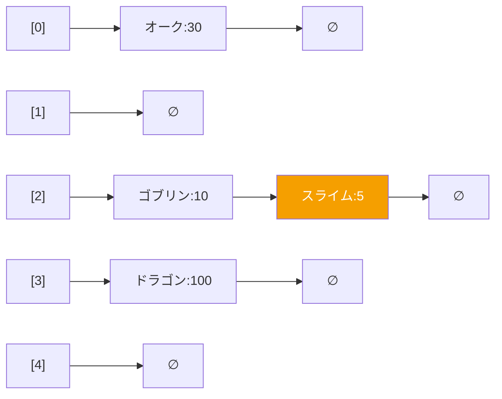
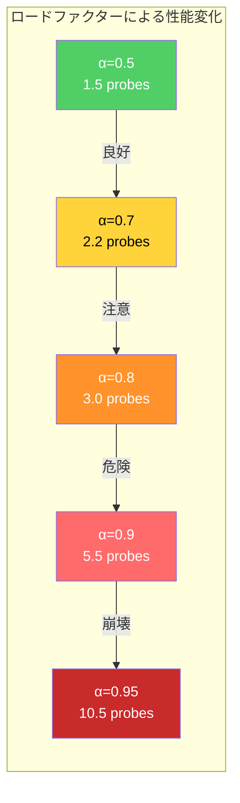
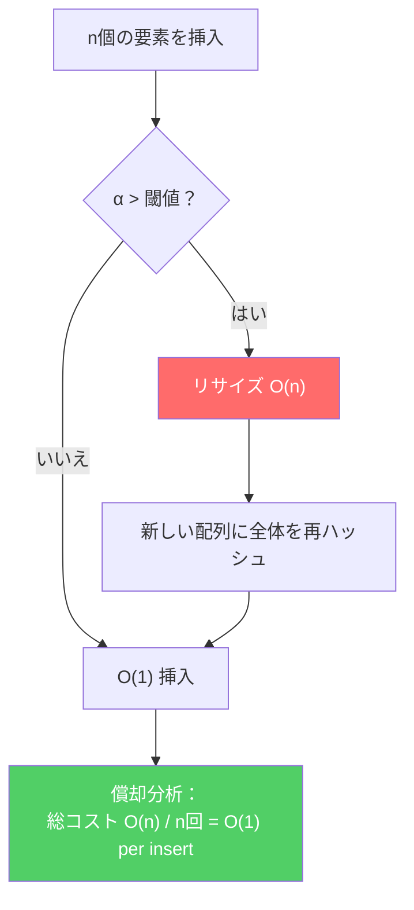

## 序論

> この文書は **CSロードマップ** シリーズの第3回です。

「このキーで値を見つけろ。」

プログラミングにおいて最も頻繁な問いかけだ。モンスターIDでステータスを参照し、文字列キーで設定値を取得し、座標でタイルデータを検索する。この問いに **O(1)** で答えるデータ構造がハッシュテーブル(Hash Table)である。

[第1回](/posts/ArrayAndLinkedList/)で、配列がインデックスによるO(1)アクセスを提供することを見た。ハッシュテーブルの核心アイデアはシンプルだ：**任意のキーを配列インデックスに変換**すれば、配列のO(1)アクセスをそのまま活用できる。この変換を行うのが**ハッシュ関数(Hash Function)**だ。

シンプルなアイデアだが、悪魔はディテールに宿る。異なるキーが同じインデックスに変換されたら（**衝突**）どうするか？ハッシュ関数はどう設計するか？配列がいっぱいになったら？これらの問いに対する答えがハッシュテーブルの本質である。

> **C# Dictionary、Java HashMapなど言語別の具体的な実装**は別の記事（[C# データ構造 - DictionaryとSortedList](/posts/CsharpDS01/)）で扱っている。この記事では**言語に依存しないハッシュテーブルの根本原理**に集中する。

以降のシリーズ構成：

| 回 | テーマ | 核心的問い |
| --- | --- | --- |
| **第3回（今回）** | ハッシュテーブル | O(1)はどのように可能であり、その代償は何か？ |
| **第4回** | ツリー | BST、Red-Black Tree、B-Treeはなぜ必要か？ |
| **第5回** | グラフ | 探索、最短経路、トポロジカルソートの原理は？ |
| **第6回** | メモリ管理 | スタック/ヒープ、GC、手動メモリ管理のトレードオフは？ |

---

## Part 1: ハッシュ関数 — キーを数値に変換する技術

### ハッシュテーブルの基本構造

ハッシュテーブルは三つの要素で構成される：

1. **配列（バケット配列）**：データを格納する固定サイズの配列
2. **ハッシュ関数**：キー → 整数に変換
3. **衝突解決戦略**：二つのキーが同じインデックスを指した場合の処理

```
Key "MOB_001" → hash("MOB_001") = 374821 → 374821 % 8 = 5 → bucket[5]

┌───────┬───────┬───────┬───────┬───────┬─────────────┬───────┬───────┐
│ [0]   │ [1]   │ [2]   │ [3]   │ [4]   │ [5]         │ [6]   │ [7]   │
│ empty │ empty │ empty │ empty │ empty │ MOB_001:ゴブリン│ empty │ empty │
└───────┴───────┴───────┴───────┴───────┴─────────────┴───────┴───────┘
```

探索時も同じ経路：キー → ハッシュ関数 → インデックス → 配列アクセス。配列アクセスがO(1)なので、**ハッシュ関数がO(1)**であれば全体もO(1)になる。

ただし厳密に言えば、ハッシュテーブルのO(1)は**ハッシュ計算コストとキー比較(equality)コストが定数である**という仮定の上に成り立っている。整数キーならこの仮定は成立するが、文字列キーはハッシュ計算がO(L)、比較もO(L)なので、実質的にはO(L)となる。この点については後で詳しく扱う。

### ハッシュと等価性の契約（Hash-Equality Contract）

ハッシュテーブルが正しく動作するためには、ハッシュ関数と等価性比較の間に**必ず守るべき契約**がある：

> **`a == b`ならば必ず`hash(a) == hash(b)`でなければならない。**

逆は成立しなくてもよい — `hash(a) == hash(b)`だが`a != b`である場合が衝突だ。しかし順方向の規則を破るとハッシュテーブルが壊れる。同じキーを入れたのに異なるバケットに格納されるため、探索時に見つけられなくなる。

実戦でよく起こるミス：

```csharp
// 危険：可変オブジェクトをキーとして使用
var enemy = new Enemy { Id = 1, Hp = 100 };
dict[enemy] = "goblin";

enemy.Hp = 50;  // キーオブジェクトの状態が変更された！
dict[enemy];    // KeyNotFoundException! ハッシュ値が変わり異なるバケットを探索
```

したがって**ハッシュテーブルのキーは不変(immutable)でなければならない**。C#で`GetHashCode()`をオーバーライドするなら必ず`Equals()`もオーバーライドしなければならないし、Javaで`hashCode()`をオーバーライドするなら`equals()`もオーバーライドしなければならない。Blochの *Effective Java* Item 11がこの原則を詳しく説明している。

ゲーム開発での教訓：モンスターID、アイテムIDのような**不変の識別子**をキーに使うのが安全だ。ゲームオブジェクト自体をキーにすると、状態変更時にハッシュテーブルが壊れる可能性がある。

### 良いハッシュ関数の条件

Knuthは *The Art of Computer Programming Vol. 3* でハッシュ関数の核心条件を次のように整理した：

1. **決定的(Deterministic)**：同じキーは常に同じハッシュ値を返さなければならない
2. **均一分布(Uniform Distribution)**：ハッシュ値が可能な範囲に均等に分布しなければならない
3. **効率的な計算**：ハッシュ関数自体が高速でなければならない — O(1)またはキー長に比例

2番が核心だ。ハッシュ値が一方に偏ると衝突が集中し、性能がO(n)に退化する。

### 整数キーのハッシュ：除算法と乗算法

**除算法(Division Method)**：

$$h(k) = k \mod m$$

最も直感的だ。キーkをテーブルサイズmで割った余り。ただし、mの選択が重要である：

- **mが2の冪乗だと危険だ。** $k \mod 2^p$はkの下位pビットしか使わない。キーの上位ビット情報がすべて失われる。
- **mが素数(prime)なら良い。** キーのビットパターンに関係なく均一な分布が得られる。.NET `Dictionary`が素数サイズを使う理由だ。

**乗算法(Multiplication Method)**：

$$h(k) = \lfloor m \cdot (k \cdot A \mod 1) \rfloor, \quad 0 < A < 1$$

Knuthが提案したAの値は**黄金比の逆数** $A = \frac{\sqrt{5} - 1}{2} \approx 0.6180339887$ である。この値は1次元均一分布において理論的に最も「均等に散らばる」定数だ。

乗算法の利点はmを自由に選択できることだ。特に **mを2の冪乗** に選べばモジュラー演算を**ビットマスク(AND)**に置き換えられるため高速になる。例えば `hash % 16` は `hash & 0xF` と同一だ — 第2回のリングバッファの `& (capacity - 1)` トリックと同じ原理である。

> **ここで一つ確認しておこう**
>
> **Q. なぜ2の冪乗モジュラーが危険なのか、具体的に？**
>
> ゲームオブジェクトのIDが8の倍数（メモリアラインメントのため一般的）だとしよう。$k = 8, 16, 24, 32, ...$ の場合、$k \mod 16$ は常に0または8になる。16個のバケットのうち2個だけにすべてのデータが集中する。素数m=17なら $8 \mod 17 = 8$、$16 \mod 17 = 16$、$24 \mod 17 = 7$、$32 \mod 17 = 15$ — 均等に分散する。
>
> ただし、Java `HashMap`のように**ハッシュ値自体を追加撹拌(perturbation)**すれば、2の冪乗テーブルでも安全に使用できる。Javaはハッシュ値の上位16ビットを下位16ビットにXORして混合する。

### 文字列キーのハッシュ

文字列は可変長であるため、各文字を累積してハッシュを生成する。最も広く使われる方式：

**多項式ハッシュ(Polynomial Rolling Hash)**：

$$h(s) = s[0] \cdot p^{n-1} + s[1] \cdot p^{n-2} + \cdots + s[n-1] \cdot p^0$$

ここでpは素数（通常31または37）。Javaの `String.hashCode()` がこの方式だ：

```java
// Java String.hashCode() — やや変形された多項式ハッシュ
int hash = 0;
for (int i = 0; i < str.length(); i++) {
    hash = 31 * hash + str.charAt(i);
}
```

なぜ31なのか？ $31 = 2^5 - 1$ なので `31 * x` を `(x << 5) - x` にコンパイラが最適化できる。Blochの *Effective Java* がこれを推奨して以来、事実上の標準となった。

より現代的なハッシュ関数：

| ハッシュ関数 | 速度 | 品質 | 用途 |
| --- | --- | --- | --- |
| **FNV-1a** | 高速 | 普通 | 汎用、簡単な実装 |
| **MurmurHash3** | 非常に高速 | 良好 | 汎用ハッシュテーブル、Cassandra、Elasticsearch |
| **xxHash** | 極めて高速 | 良好 | チェックサム、データ処理 |
| **SipHash** | 普通 | 良好 + DoS防御 | Rust HashMap、Python dict、Redis、Ruby |
| **wyhash** | 極めて高速 | 良好 | Go map (1.17~1.23) |

ゲーム開発で文字列キーがよく使われる場面：リソースパス、アニメーション名、イベント名。**文字列ハッシュ計算は文字列長に比例(O(L))**するため、毎フレーム呼び出される箇所では**ハッシュをキャッシュ**するか**文字列インターニング(string interning)**を検討すべきだ。

---

## Part 2: 衝突解決 — チェイニング

### 鳩の巣原理

ハッシュ関数がどれほど優秀でも、衝突は**必然**である。

**鳩の巣原理(Pigeonhole Principle)**：n羽の鳩をm個の巣箱に入れるとき、$n > m$ であれば少なくとも一つの巣箱に2羽以上が入る。

キーの取り得る値は事実上無限（文字列だけでも）であるのに、配列のサイズmは有限だ。したがって異なるキーが同じインデックスにマッピングされる衝突は避けられない。

**Birthday Paradox（誕生日問題）**はこの状況をより劇的に示す。365個のバケットに23個のキーを入れるだけで、衝突確率が**50%を超える**。一般的に、m個のバケットに $\sqrt{m}$ 個のキーを入れると衝突が発生する確率は約50%だ。

### チェイニング(Separate Chaining)

最も直感的な衝突解決方法。同じインデックスにマッピングされた要素を**連結リスト（または他のデータ構造）**で連結する。

```
buckets:
[0] → (K="オーク", V=30) → NULL
[1] → NULL
[2] → (K="ゴブリン", V=10) → (K="スライム", V=5) → NULL
[3] → (K="ドラゴン", V=100) → NULL
[4] → NULL
```

バケット2で"スライム"を見つけるには：バケット2のリストを走査しながらキーを比較する。



**時間計算量**：

- 平均：O(1 + α)、ここでα = n/m（ロードファクター）
- 最悪：O(n) — すべてのキーが一つのバケットに集中した場合

**利点**：
- 実装がシンプル
- ロードファクターが1を超えても動作する
- 削除が簡単（連結リストからノードを除去）

**欠点 — キャッシュ性能**：

第1回で学んだ教訓をここに適用しよう。チェイニングの各ノードは**個別のヒープ割り当て**だ。ノードがメモリ上に散在しているため、チェーンを辿るたびに**キャッシュミス**が発生する可能性が高い。

```
メモリ空間：
0x1000: [bucket 配列]
  ...
0x3040: [Node: ゴブリン]  ← キャッシュミス
  ...
0x7820: [Node: スライム]  ← またキャッシュミス
```

これが「O(1)なのになぜ遅いのか？」の答えだ。Big-Oの定数にキャッシュミスのコストが隠れている。

### チェイニングの改善：配列内チェイニング

.NET `Dictionary`はこの問題を巧みに解決している。個別ノードの代わりに**entries配列内部で`next`インデックスによりチェイニング**する：

```
entries[] (連続配列):
[0] hash=9284 next=-1 Key="ゴブリン" Val=10
[1] hash=3507 next=-1 Key="スライム" Val=5
[2] hash=3500 next=1  Key="オーク"   Val=30    ← next=1で[1]を指す
[3] hash=7423 next=-1 Key="ドラゴン" Val=100

buckets[]:
[0] → 0    // entries[0]
[2] → 2    // entries[2] → entries[2].next=1 → entries[1]
[3] → 3
```

すべてのエントリが**一つの連続配列**に存在するため、同じバケットのチェーンを辿っても配列内部での移動となり、**キャッシュ局所性が保持**される。従来の連結リストチェイニングとは根本的に異なる点だ。

---

## Part 3: 衝突解決 — オープンアドレッシング

### オープンアドレッシングの基本アイデア

チェイニングとは完全に異なるアプローチ：**外部構造なしに配列自体で空きスロットを探す。**

衝突が発生すると、あらかじめ定められた**探索規則(probing sequence)**に従って次の空きスロットを探す。すべてのデータが一つの配列内に存在する。

### Linear Probing — 最も単純で最もキャッシュフレンドリー

衝突時に**次のスロット、その次のスロット、...**と順に空き場所を探す。

$$h(k, i) = (h(k) + i) \mod m, \quad i = 0, 1, 2, \ldots$$

```
挿入過程: h("オーク")=2, h("スライム")=2(衝突!), h("トロル")=3

Step 1: "オーク" → index 2 (空き) → 挿入
[  ] [  ] [オーク] [  ] [  ] [  ] [  ] [  ]

Step 2: "スライム" → index 2 (衝突!) → 3 (空き) → 挿入
[  ] [  ] [オーク] [スライム] [  ] [  ] [  ] [  ]

Step 3: "トロル" → index 3 (衝突!) → 4 (空き) → 挿入
[  ] [  ] [オーク] [スライム] [トロル] [  ] [  ] [  ]
```

**キャッシュ性能が優れている。** 探索が連続メモリを順次アクセスするため、第1回で学んだ**空間的局所性(spatial locality)**の恩恵を最大限に受ける。キャッシュライン1本(64バイト)に複数のスロットが収まるため、探索の大部分がL1キャッシュで完結する。

**クラスタリング(Clustering)問題**：

Linear probingの弱点だ。衝突が発生するとその隣にデータが積み重なり、積み重なったデータがさらに衝突を誘発してクラスタが成長する。これを**Primary Clustering**と呼ぶ。

```
クラスタ形成過程：
[  ][  ][██][██][██][██][  ][  ]  ← 4スロットのクラスタ
                                    この付近にハッシュされるキーはすべてここに合流
[  ][  ][██][██][██][██][██][  ]  ← 5スロットに成長
```

KnuthはTAOCP Vol. 3でlinear probingの平均探索長を分析した：

**成功探索（キーが存在する場合）**：

$$E[\text{probes}] = \frac{1}{2}\left(1 + \frac{1}{1 - \alpha}\right)$$

**失敗探索（キーが存在しない場合）**：

$$E[\text{probes}] = \frac{1}{2}\left(1 + \frac{1}{(1 - \alpha)^2}\right)$$

| ロードファクター α | 成功探索（平均） | 失敗探索（平均） |
| --- | --- | --- |
| 0.50 | 1.5回 | 2.5回 |
| 0.70 | 2.2回 | 6.1回 |
| 0.80 | 3.0回 | 13.0回 |
| 0.90 | 5.5回 | 50.5回 |
| 0.95 | 10.5回 | 200.5回 |

**Linear probingではα = 0.7を超えると性能が急激に悪化する。** 特に失敗探索（キーが存在しない場合）は空きスロットに出会うまで探索を続けなければならないため、より敏感だ。この数値がlinear probingに適用される理由は**クラスタリング**だ — 衝突が発生するとすぐ隣に積み重なり、積み重なったデータがさらに衝突を誘発する正のフィードバックが働く。

しかし**すべてのオープンアドレッシングがこの数値に縛られるわけではない。** Quadratic probingは探索が二乗間隔に散るためクラスタが形成されにくく、Robin Hood Hashingは探索距離の分散を減らして最悪ケースを抑制する。SwissTableはSIMDで16スロットを一度に比較して探索コスト自体を削減する。これらの技法のおかげでRust `HashMap`はα=0.875、Go `map`はバケットあたり6.5個（実効α≈0.81）まで許容できる。後のロードファクター比較表でこの違いを確認しよう。



### Quadratic Probing — クラスタの分散

Linear probingのクラスタリングを軽減するため、**二乗間隔**で探索する：

$$h(k, i) = (h(k) + c_1 i + c_2 i^2) \mod m$$

一般的に $c_1 = 0, c_2 = 1$：

$$h(k, i) = (h(k) + i^2) \mod m$$

探索順序：+1, +4, +9, +16, ... 徐々に遠くへ飛ぶためprimary clusteringが緩和される。

欠点：**secondary clustering** — 同じ初期ハッシュ値を持つキーは同一の探索経路を辿る。また、テーブルサイズと $c_1$、$c_2$ を適切に選択しないと**すべてのスロットを訪問できない場合がある。** テーブルサイズが素数でロードファクターが0.5以下なら安全だ。

### Robin Hood Hashing — 富者から奪い貧者に与える

1986年、Pedro Celisの博士論文で提案された手法で、linear probingの変形だ。核心アイデア：

> **挿入時、現在のスロットの既存要素より自分の方が遠くから来ていれば、既存要素を押し出して自分が入る。**

「理想的な位置(home position)」からの距離を **DIB(Distance from Initial Bucket)** と呼ぶ。

```
挿入 "D" (home=2, 現在の探索位置=5, DIB=3)

[0]     [1]     [2]     [3]     [4]     [5]     [6]     [7]
         A       B       C       E       F
        DIB=0   DIB=0   DIB=1   DIB=3   DIB=1

"D"のDIB=3。位置5の"F"はDIB=1。
3 > 1なので"D"が"F"を押し出して位置5に挿入。
"F"は押し出されて次の空き場所を探す。

結果：
[0]     [1]     [2]     [3]     [4]     [5]     [6]     [7]
         A       B       C       E       D       F
        DIB=0   DIB=0   DIB=1   DIB=3   DIB=3   DIB=2
```

**効果**：すべての要素のDIBが似た値になる。最大探索距離が減少し、探索距離の**分散(variance)**が劇的に減少する。平均は同じだが最悪が改善される。

| 特性 | Linear Probing | Robin Hood Hashing |
| --- | --- | --- |
| 平均探索距離 | 同じ | 同じ |
| 最大探索距離 | 大きくなり得る | **大幅に減少** |
| 分散 | 大きい | **小さい** |
| 挿入コスト | 低い | やや高い (swap) |

Rustの `HashMap` は長い間Robin Hood Hashingを使用していた（現在はSwissTableベースの `hashbrown` に変更）。この手法が実戦で効果的である証拠だ。

> **ここで一つ確認しておこう**
>
> **Q. オープンアドレッシングで削除はどうするのか？**
>
> 単純に空にしてはいけない。探索中に空きスロットに出会うと「存在しない」と判断してしまうからだ。削除された場所に**墓石(tombstone)**マーカーを置く。探索時にtombstoneは「ここを通過せよ」として扱い、挿入時には「ここに入れてよい」として扱う。
>
> tombstoneが蓄積すると探索性能が悪化するため、定期的にリサイズ（または再挿入）して整理する必要がある。
>
> **Q. チェイニング vs オープンアドレッシング、実戦ではどちらが速いか？**
>
> **ほとんどのベンチマークでlinear probingがチェイニングより速い** — キャッシュ局所性のためだ。ただし、ロードファクターが高くなると逆転する場合がある。現代の高性能ハッシュテーブル（Google SwissTable、Facebook F14、Rust hashbrown）は**すべてオープンアドレッシングベース**だ。

---

## Part 4: ロードファクターとリサイズ

### ロードファクター

$$\alpha = \frac{n}{m}$$

- $n$：格納された要素数
- $m$：配列（バケット）サイズ
- $\alpha$：ロードファクター(Load Factor)

ロードファクターはハッシュテーブルの**密度**だ。α = 0なら完全に空、α = 1なら満杯（オープンアドレッシング基準）。チェイニングではα > 1も可能だが、性能は悪化する。

### 言語別ロードファクターの閾値

| 言語/実装 | 最大ロードファクター | 衝突解決 | リサイズ |
| --- | --- | --- | --- |
| Java `HashMap` | **0.75** | チェイニング (→ ツリー変換) | 2倍 |
| .NET `Dictionary` | **1.0** (entries満杯時) | 配列内チェイニング | 素数単位 ~2倍 |
| Python `dict` | **0.67** | オープンアドレッシング | 4倍 (小さい時) / 2倍 |
| Go `map` (~1.23) | **6.5** (バケットあたり) | チェイニング (8スロット/バケット) | 2倍 |
| Go `map` (1.24+) | Swiss Tablesベースに移行 | オープンアドレッシング (Swiss Tables) | 2倍 |
| Rust `HashMap` | **0.875** | Robin Hood → SwissTable | 2倍 |

Javaは特殊で、一つのバケットに要素が**8個以上**積み重なると連結リストを**レッドブラックツリー**に変換する。O(n)への退化をO(log n)で防ぐ防御メカニズムだ。ただし正確には、**テーブル全体の容量が64以上の場合にのみ**ツリーに変換される。テーブルが小さい場合はツリー変換よりも**リサイズ（配列拡張）**の方が効果的だ — バケット数を増やして衝突を分散させることが、小規模テーブルではツリー構築よりもコストが低い。OpenJDKソースの `MIN_TREEIFY_CAPACITY = 64` 定数がこの条件を定めている。

### リサイズのコスト

リサイズは三つのステップで行われる：

1. 新しい配列を割り当て（通常2倍のサイズ）
2. すべての要素を**再ハッシュ** — ハッシュ値は同じだが、`hash % newSize`は変わるため位置が変わる
3. 旧配列を解放

全体で**O(n)**。しかし第2回で学んだ**償却分析**を適用すると、n回の挿入の総リサイズコストはO(n)なので、挿入あたり**償却O(1)**になる。



ゲーム開発での教訓は第2回と同じだ：**要素数が事前に分かっているなら初期容量を設定してリサイズを完全に防げ。** 60fpsで16.67msのフレーム予算の中でハッシュテーブルのリサイズが発生すれば、スパイクが生じる。

---

## Part 5: キャッシュ性能 — チェイニング vs オープンアドレッシング

第1回で配列と連結リストのキャッシュ性能の違いを考察した。ハッシュテーブルの二つの戦略にもまったく同じ原理が適用される。

### チェイニングのメモリアクセスパターン

```
バケット配列: [ptr0] [ptr1] [ptr2] [ptr3] [ptr4] ...  ← 連続メモリ

チェーンノード：
0x1000: Node(ゴブリン) → next: 0x5040
0x5040: Node(スライム) → next: NULL

ポインタを辿るためメモリアクセスが非順次的 → キャッシュミス
```

- バケット配列アクセス：O(1)、キャッシュヒット（配列だから）
- チェーンノードアクセス：ポインタ追跡 → **キャッシュミスの可能性が高い**
- ノードあたりの追加メモリ：ポインタ(8バイト) + ヒープ割り当てオーバーヘッド

### Linear Probingのメモリアクセスパターン

```
スロット配列: [ゴブリン][スライム][オーク][ ][ ][ドラゴン][ ][ ] ← 全体が連続メモリ

衝突時に次のスロットへ移動 → 順次メモリアクセス → キャッシュヒット
```

- すべてのアクセスが一つの配列内で発生
- 順次探索は**キャッシュライン内の移動** — L1ヒット
- 追加メモリオーバーヘッド：なし（またはtombstoneビット程度）

### Google SwissTableのアプローチ

GoogleのAbseilライブラリに含まれる**SwissTable**(2017)は、現代のハッシュテーブル設計のマイルストーンだ。核心アイデア：

1. **メタデータ配列(control bytes)**：各スロットに対して1バイトの制御バイトを別の配列に格納する。このバイトの**最上位ビット(MSB)**がスロットの状態を決定する
2. **SIMD探索**：16個の制御バイトをSSE2命令**1回**で同時比較

制御バイトの構造：

```
Control byte 解釈：

MSB = 0 (0x00~0x7F)：スロットが使用中(FULL)
  → 下位7ビット = ハッシュの上位7ビット（H2と呼ぶ）
  → 例：0x31 = 使用中、H2=0x31

MSB = 1 (0x80~0xFF)：特殊状態
  → 0xFF = EMPTY（空き）
  → 0xFE = DELETED（削除済み、tombstone）

Control bytes 例（16個のグループ）：
[0x31][0xFF][0x55][0xFF][0x31][0x72][0xFF][0xFF]
[0xFF][0x1A][0xFF][0xFF][0xFF][0xFF][0xFE][0xFF]
 FULL  EMPTY FULL EMPTY FULL  FULL EMPTY EMPTY
                                    DEL  EMPTY
```

キー "オーク"を探索する過程：

```
1. hash("オーク")を計算
2. ハッシュの下位ビットでグループ（16スロット）を選択
3. ハッシュの上位7ビットを抽出 → H2 = 0x31
4. SIMDでグループの16個の制御バイトと0x31を一度に比較
   → index 0と4でH2がマッチ！
5. マッチしたスロット（0、4）でのみ実際のキー比較を実行
   → index 0：キー不一致、index 4："オーク"確認！

ほとんどの場合：SIMD 1回 + キー比較 1~2回で完了
```

**なぜこれが速いのか？** 核心は**比較回数の劇的な削減**だ。従来のlinear probingは各スロットでフルキーを比較する必要がある。SwissTableは1バイトの制御バイトをSIMDで16個同時にフィルタリングし、実際のキー比較はH2が一致するスロット（通常0~2個）でのみ行う。キャッシュライン1本(64バイト)に制御バイト64個が収まるため、メタデータアクセスはほぼ常にL1キャッシュで解決される。

この設計の影響：
- C++ Abseil `absl::flat_hash_map`
- Rust `hashbrown` (SwissTableポート → 標準HashMap)
- Go 1.24+ `runtime.map` (Swiss Tables導入、従来のバケットチェイニングから移行)

> **ここで一つ確認しておこう**
>
> **Q. SIMDとは何か？**
>
> SIMD(Single Instruction, Multiple Data)は**一つの命令で複数のデータを同時に処理する**CPU機能だ。SSE2の `_mm_cmpeq_epi8` は16バイトを一度に比較する。SwissTableはこのハードウェア機能をデータ構造設計に直接活用した事例だ。SIMDは第7段階（高度な最適化）で詳しく扱う。
>
> **Q. ゲーム開発ではどのハッシュテーブルを使うべきか？**
>
> - **C#/Unity**：`Dictionary<K,V>` が既に配列内チェイニングでキャッシュフレンドリーだ。ほとんどの場合十分である。
> - **C++/Unreal**：`TMap`（デフォルト）、高性能が必要なら `absl::flat_hash_map` を検討。
> - **カスタムエンジン**：Robin Hood HashingまたはSwissTableの直接実装を検討。オブジェクト数万個以上の探索が毎フレーム発生する場合、差が有意になる。

---

## Part 6: ハッシュテーブルの応用 — ゲーム開発にて

### 1. 空間ハッシング(Spatial Hashing) — 衝突検出の最適化

2D/3DゲームでN個のオブジェクトの衝突検出を素朴に行うと**O(N²)**のペア比較が必要だ。空間ハッシングはこれを**O(N)に近く**まで削減する。

```
空間をグリッドに分割し、各セルにオブジェクトをハッシング

┌──────┬──────┬──────┬──────┐
│      │  A   │      │      │
│      │      │      │      │
├──────┼──────┼──────┼──────┤
│      │ B  C │  D   │      │    BとCは同じセル
│      │      │      │      │    → この二つだけ衝突検査
├──────┼──────┼──────┼──────┤
│      │      │      │  E   │
│      │      │      │      │
└──────┴──────┴──────┴──────┘

ハッシュ関数: h(x, y) = (x / cellSize, y / cellSize)
ハッシュテーブル: {(1,0): [A], (1,1): [B,C], (2,1): [D], (3,2): [E]}
```

同じセルにあるオブジェクト同士だけ衝突検査すればよい。隣接セルまで含めても定数個（最大9個、3Dなら27個）のセルしか確認しない。

この手法はパーティクルシステム、群衆シミュレーション、物理エンジンのbroad phaseで広く使われている。

### 2. 文字列インターニング(String Interning)

ゲームでは文字列がいたるところで使われる：イベント名、タグ、リソースパス。毎回文字列を比較するとO(L)だ。

**文字列インターニング**：同じ内容の文字列を**一つのインスタンスだけ保持する**手法。ハッシュテーブルに文字列を格納し、同一内容なら既存インスタンスを返す。

```csharp
// インターニング前：文字列比較 = O(L)、長さに比例
if (eventName == "OnPlayerDeath") { ... }

// インターニング後：参照比較 = O(1)
// string.Intern()はCLRインターニングプールに格納
string interned = string.Intern("OnPlayerDeath");
if (ReferenceEquals(eventName, interned)) { ... }
```

Unreal Engineの `FName` がまさにこの原理だ。文字列をハッシュテーブルに格納し、以降は整数インデックスで比較する。文字列比較 O(L) → 整数比較 O(1)。

### 3. メモ化(Memoization) — 計算結果のキャッシュ

コストの高い計算結果をハッシュテーブルにキャッシュ：

```csharp
// パスファインディング結果をキャッシュ
private Dictionary<(Vector2Int from, Vector2Int to), List<Vector2Int>> pathCache;

public List<Vector2Int> FindPath(Vector2Int from, Vector2Int to) {
    if (pathCache.TryGetValue((from, to), out var cached))
        return cached;  // O(1) キャッシュヒット

    var path = AStar(from, to);  // コストの高い計算
    pathCache[(from, to)] = path;
    return path;
}
```

### 4. 重複検査

訪問済みノード、処理済みイベント、ロード済みリソース — 「既に実行済みか？」をO(1)で確認：

```csharp
HashSet<int> visitedNodes = new();  // 内部的にはハッシュテーブル

void BFS(int start) {
    var queue = new Queue<int>();
    queue.Enqueue(start);
    visitedNodes.Add(start);

    while (queue.Count > 0) {
        int current = queue.Dequeue();
        foreach (int neighbor in GetNeighbors(current)) {
            if (visitedNodes.Add(neighbor)) {  // O(1) 重複チェック + 挿入
                queue.Enqueue(neighbor);
            }
        }
    }
}
```

`HashSet`はキーのみのハッシュテーブルだ。第2回のBFSで `distance[nx, ny] == -1` で訪問済みかを確認したが、グリッドでないグラフでは `HashSet` が必要になる。

---

## Part 7: ハッシュテーブルの限界とセキュリティ

### HashDoS — ハッシュ衝突攻撃

2011年、Alexander KlinkとJulian Wäldeが発表した**HashDoS**攻撃：意図的に同じハッシュ値を持つキーを大量に送ると、ハッシュテーブルがO(n²)に退化する。

WebサーバーがHTTPパラメータをハッシュテーブルに格納するため、数万個の衝突キーを送るとサーバーが停止する。この攻撃はPHP、Java、Python、Ruby、.NETなどほぼすべての言語のWebフレームワークに影響を及ぼした。

**対策**：
- **ランダムシードハッシュ(Keyed Hash)**：プロセスごとに秘密シードを混ぜてハッシュ関数を予測不可能に。Pythonは3.3から、.NET Coreはデフォルトで適用
- **SipHash**：Jean-Philippe Aumassonが設計した「短い入力に安全な」ハッシュ関数。Rust、Python、Rubyでデフォルト使用
- **ツリー変換**：Java HashMapのチェーン8個超過時のレッドブラックツリー変換

ゲームサーバーでも有効な脅威だ。クライアントが送るデータをハッシュテーブルに格納するなら（インベントリ、チャットフィルターなど）、HashDoSを考慮すべきだ。

### ハッシュテーブル vs ソート済み構造

| 特性 | ハッシュテーブル | 平衡二分木（第4回予告） |
| --- | --- | --- |
| 平均探索 | **O(1)** | O(log n) |
| 最悪探索 | O(n) | **O(log n)** |
| 順序保証 | なし | **あり** |
| 範囲クエリ | 不可 | **可能** |
| メモリオーバーヘッド | 中程度（空きスロット） | 大きい（ポインタ） |
| 最小値/最大値 | O(n) | **O(log n)** |

ハッシュテーブルは**「このキーの値は？」**というポイントクエリ(point query)に最適だ。「100~200の間のキーをすべて見つけろ」のような**範囲クエリ(range query)**や、「キー順で走査せよ」という要求には不向きだ。このような場合には第4回で扱う**ツリー構造**が必要になる。

---

## まとめ：O(1)は無償ではない

この記事で考察した要点：

1. **ハッシュテーブルのO(1)はハッシュ関数の品質に依存する**。悪いハッシュ関数は衝突を集中させ、O(1)をO(n)にしてしまう。除算法で素数を使う理由、乗算法で黄金比を使う理由がここにある。

2. **衝突は避けられない** — 鳩の巣原理と誕生日問題がこれを数学的に保証する。衝突を**どのように解決するか**がハッシュテーブルの性格を決定する。チェイニングは単純だがキャッシュに不利で、オープンアドレッシング（特にlinear probing）はキャッシュフレンドリーだがクラスタリングに脆弱だ。

3. **ロードファクター（α）が性能の核心的な調整器**だ。Linear probing基準でαが0.7を超えると衝突が急増し、0.9を超えると事実上使用不能になる。ただし衝突解決戦略によって許容可能なロードファクターは異なる — Quadratic probing、Robin Hood Hashing、SwissTableなどはクラスタリング緩和やSIMD並列比較のおかげで、より高いロードファクターでも安定して動作する。リサイズはO(n)だが償却O(1)だ — それでもゲームでは初期容量設定で完全に防ぐのが最善だ。

4. **キャッシュ性能が理論的計算量と同等に重要**だ。第1回の教訓がここでも繰り返される。Google SwissTableがSIMDを活用して16スロットを一度に比較するのは、アルゴリズムの革新ではなく**ハードウェア特性に合わせた設計**の革新だ。

5. **ハッシュテーブルは万能ではない。** 順序が必要な場合、範囲クエリが必要な場合、最悪ケースの保証が必要な場合はツリー構造が答えだ。

KnuthはTAOCP Vol. 3でハッシングを次のように要約した：

> "Hashing is a classical example of a time-space tradeoff."
>
> （ハッシングは時間-空間トレードオフの古典的な例だ。）

空きスロットという**空間の無駄**を甘受することで、**O(1)の時間**を得る。このトレードオフを理解し、ロードファクターとハッシュ関数の品質で均衡点を見つけることが、ハッシュテーブルを正しく使う方法だ。

次回は**ツリー** — 順序を保持しながらO(log n)を保証する構造、BSTからRed-Black Tree、B-Treeまでを扱う。

---

## 参考資料

**核心論文および技術文書**
- Knuth, D., *The Art of Computer Programming Vol. 3: Sorting and Searching*, Addison-Wesley — ハッシングの古典的分析 (Chapter 6.4)、linear probing平均探索長の証明
- Celis, P., "Robin Hood Hashing", PhD Thesis, University of Waterloo (1986) — Robin Hood Hashingの原典
- Aumasson, J.P. & Bernstein, D.J., "SipHash: a fast short-input PRF", INDOCRYPT (2012) — HashDoS防御用ハッシュ関数
- Klink, A. & Wälde, J., "Efficient Denial of Service Attacks on Web Application Platforms", 28C3 (2011) — HashDoS攻撃の原典
- Abseil Team, "Swiss Tables Design Notes" — [abseil.io](https://abseil.io/about/design/swisstables) — SwissTableのSIMDベース設計

**講演および発表**
- Kulukundis, M., "Designing a Fast, Efficient, Cache-friendly Hash Table, Step by Step", CppCon 2017 — SwissTableの設計過程
- Chandler Carruth, "High Performance Code 201: Hybrid Data Structures", CppCon 2016 — キャッシュフレンドリーなハッシュテーブル設計

**教科書**
- Cormen, T.H. et al., *Introduction to Algorithms (CLRS)*, MIT Press — ハッシュテーブル Chapter 11、Universal Hashing、Perfect Hashing
- Bryant, R. & O'Hallaron, D., *Computer Systems: A Programmer's Perspective (CS:APP)*, Pearson — メモリ階層とキャッシュがデータ構造の性能に与える影響
- Bloch, J., *Effective Java*, 3rd Edition, Addison-Wesley — Item 11: hashCode実装ガイド
- Sedgewick, R. & Wayne, K., *Algorithms*, 4th Edition, Addison-Wesley — Linear Probing、Separate Chainingの実装と分析

**実装参考**
- .NET `Dictionary<TKey, TValue>` — [dotnet/runtime ソース](https://github.com/dotnet/runtime): 配列内チェイニング、素数ベースリサイズ
- Java `HashMap` — [OpenJDK ソース](https://github.com/openjdk/jdk): チェイニング → ツリー変換、perturbation
- Rust `hashbrown` — [crates.io](https://crates.io/crates/hashbrown): SwissTableポート、Rust標準HashMapの基盤
- Google `absl::flat_hash_map` — Abseilライブラリ: SwissTableのC++参照実装
- Facebook `folly::F14` — [github.com/facebook/folly](https://github.com/facebook/folly): SIMDベースオープンアドレッシング
