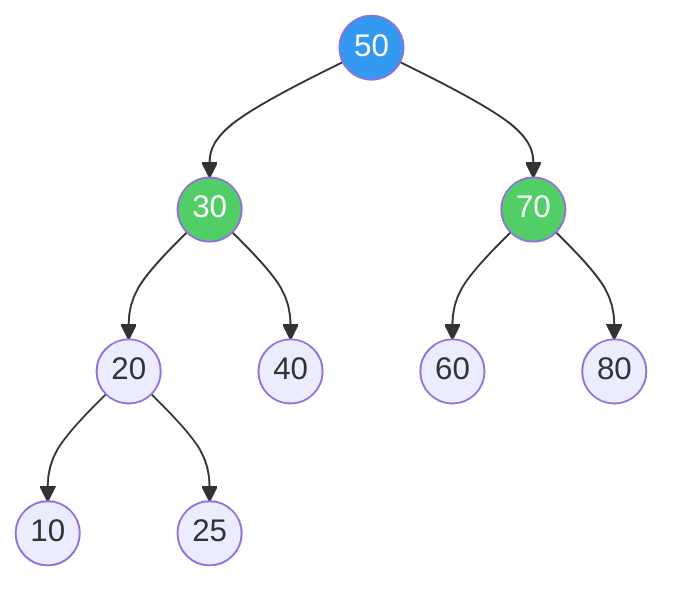
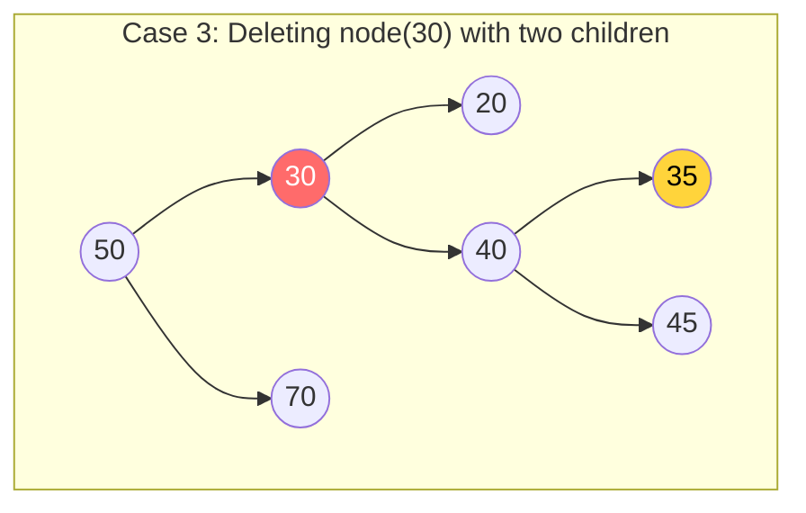
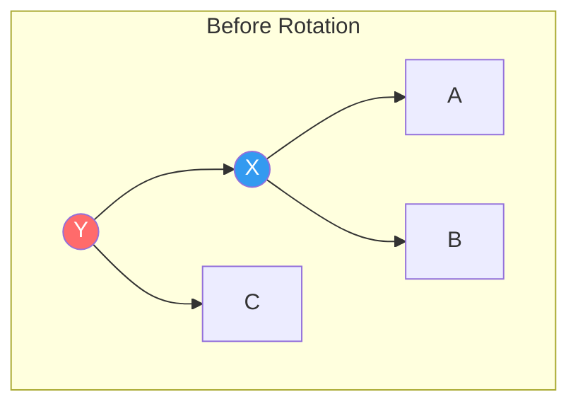
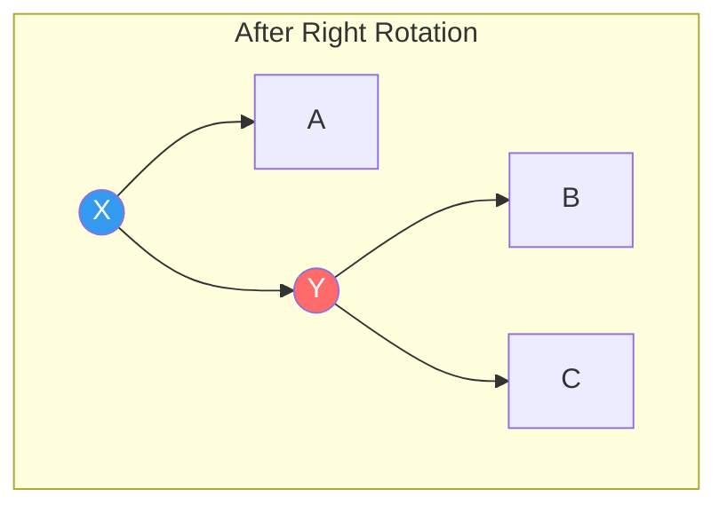
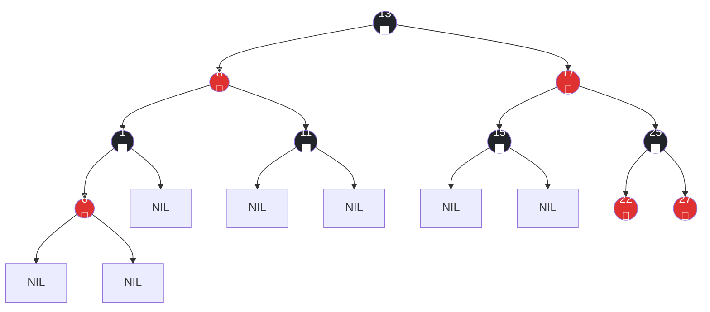
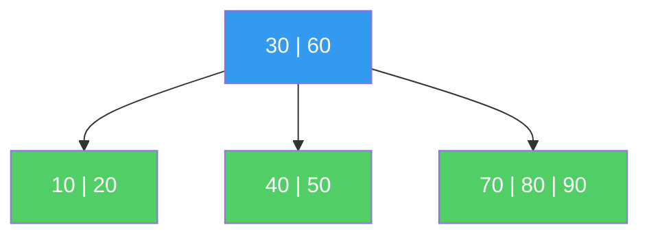
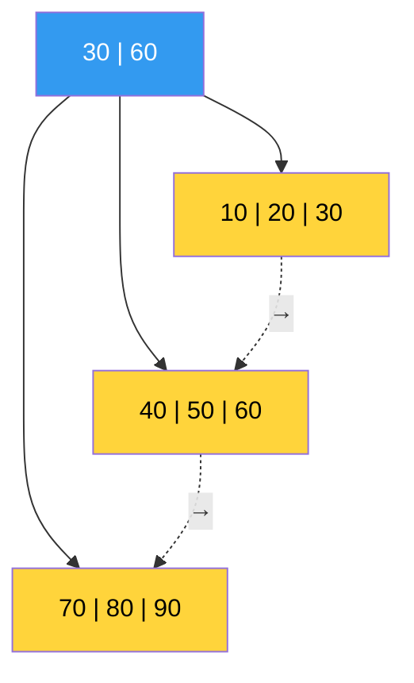
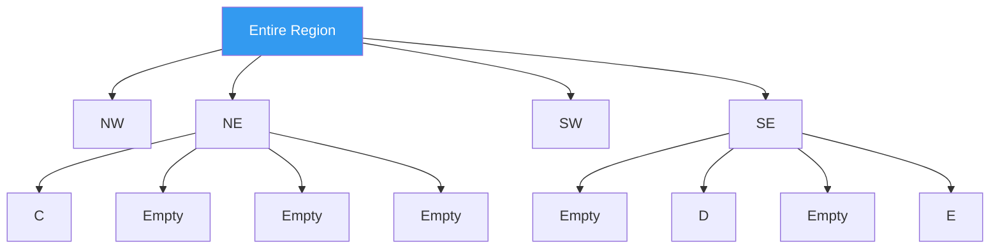
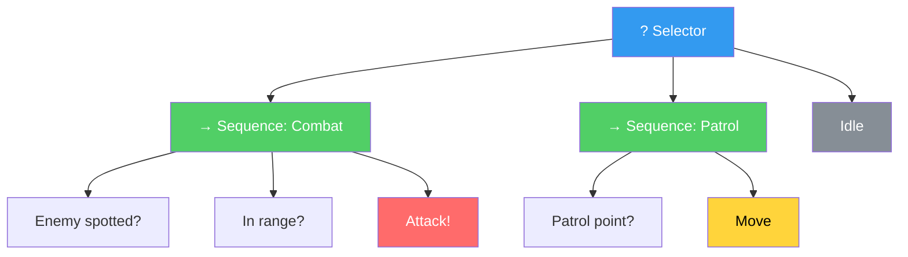

## Introduction

> This article is the 4th installment of the **CS Roadmap** series.

In [Part 3](/posts/HashTable/), we saw that hash tables' O(1) doesn't come for free. Hash function quality, collision resolution strategies, load factor — all of these must align for O(1) to hold. And at the end, we left questions that hash tables cannot answer:

- "Find all monsters between level 50 and 80" (range query)
- "Who is the strongest enemy?" (min/max)
- "List the data in order" (ordered traversal)

Hash tables are specialized for point queries — "What is the value of this key?" Since they don't preserve **ordering relationships** between keys, the only answer to the questions above is a full scan at O(n).

Trees solve this problem. They store data **while maintaining order**, and perform search, insertion, and deletion in **O(log n)**. Slower than O(1), but the guarantee of O(log n) **for any input** makes trees more reliable than hash tables.

Upcoming series structure:

| Part | Topic | Core Question |
| --- | --- | --- |
| **Part 4 (this article)** | Trees | Why do we need BST, Red-Black Tree, B-Tree? |
| **Part 5** | Graphs | What are the principles of traversal, shortest paths, and topological sort? |
| **Part 6** | Memory Management | What are the tradeoffs of stack/heap, GC, and manual memory management? |

---

## Part 1: Basic Concepts of Trees

### What Is a Tree

A tree is a **connected graph with no cycles**. Starting from a single root, each node has zero or more child nodes, forming a hierarchical structure.

```
         Root
        /    \
      A        B
     / \      / \
    C   D    E   F
       / \
      G   H
```

Key terminology:

| Term | Definition |
| --- | --- |
| **Root** | The topmost node. Has no parent |
| **Leaf** | A node with no children (C, G, H, E, F) |
| **Internal Node** | A node with children (Root, A, B, D) |
| **Depth** | Number of edges from root to the node. Root's depth = 0 |
| **Height** | Number of edges from the node to its farthest leaf. Tree height = root's height |
| **Subtree** | A partial tree rooted at a specific node |

A tree is a **recursive structure**. Every subtree is also a tree. This property is what allows most tree algorithms to be expressed recursively.

### Binary Tree

A tree where each node has **at most 2 children**. BST, AVL, and Red-Black Trees covered in this article are all binary trees.

An important property of binary trees — the maximum number of nodes in a binary tree of height h:

$$N_{\max} = 2^{h+1} - 1$$

Conversely, the **minimum height** of a binary tree with n nodes:

$$h_{\min} = \lfloor \log_2 n \rfloor$$

This is the basis of O(log n). If n items are placed in a **balanced** binary tree, any node can be reached from the root with at most $\lfloor \log_2 n \rfloor$ comparisons.

Even with 1 million items, $\lfloor \log_2 1{,}000{,}000 \rfloor = 19$. The desired data is found in **at most 19 comparisons**.

---

## Part 2: Binary Search Tree (BST) — Ordered Search

### BST Definition

A Binary Search Tree is a binary tree that satisfies the following rule for every node:

> **All keys in the left subtree < current node's key < all keys in the right subtree**



Thanks to this rule, search operates on the same principle as binary search. In [Part 1](/posts/ArrayAndLinkedList/), we saw that binary search on a sorted array is O(log n). A BST applies this principle to **dynamic data**.

### BST Search

Searching for key 25:

```
50 → 25 < 50, go left
30 → 25 < 30, go left
20 → 25 > 20, go right
25 → Found!

Comparisons: 4 (= depth + 1)
```

```csharp
// BST Search — Recursive
Node Search(Node node, int key) {
    if (node == null || node.Key == key)
        return node;
    if (key < node.Key)
        return Search(node.Left, key);
    else
        return Search(node.Right, key);
}
```

At each comparison, the search space is **halved**. The same principle as binary search on a sorted array. The difference is that arrays **access the middle element by index**, while BSTs **access children by pointer**.

### BST Insertion

New keys are always inserted at a **leaf position**. Follow the search path until you hit NULL, then insert there.

```
Inserting 40:
50 → 40 < 50, go left
30 → 40 > 30, go right
→ Insert as 30's right child
```

### BST Deletion — Three Cases

Deletion in a BST is more complex than insertion. Three cases must be distinguished:

**Case 1: Deleting a leaf node** — Simply remove it

**Case 2: Deleting a node with one child** — Connect the child directly to the parent

**Case 3: Deleting a node with two children** — The trickiest case



To delete 30, we need to find a **successor** that maintains the BST rule. Two options:

- **Inorder Successor**: The smallest node in the right subtree → 35
- **Inorder Predecessor**: The largest node in the left subtree → 25

Copy the successor's key to the node being deleted, then delete the successor node. Since the successor has at most one child, this reduces to Case 1 or 2.

Why this design works correctly: The inorder successor (35) is greater than 30 and less than 40. Placing 35 in 30's position means it is greater than all keys in the left subtree (20, 25) and less than all keys in the right subtree (40, 45), so the BST rule is preserved.

### BST Time Complexity

| Operation | Average | Worst |
| --- | --- | --- |
| Search | O(log n) | **O(n)** |
| Insert | O(log n) | **O(n)** |
| Delete | O(log n) | **O(n)** |
| Min/Max | O(log n) | **O(n)** |
| Inorder Traversal (full) | O(n) | O(n) |

The average is O(log n). But the **worst case of O(n)** is critical.

### BST's Fatal Weakness — Skewed Trees

If already-sorted data [10, 20, 30, 40, 50] is inserted in order:

```
10
  \
   20
     \
      30
        \
         40
           \
            50

Height = 4 (= n - 1)
Search time = O(n) — same as a linked list!
```

The BST has **degenerated** into a linked list. The same phenomenon as when all keys in a hash table land in one bucket, as seen in Part 3.

In game development, this problem is realistic. If monsters are inserted into a BST in creation order (with incrementing IDs), a skewed tree results. The same happens with timestamps as keys.

> **Let's pause and address this**
>
> **Q. Is a BST fine with random data?**
>
> Theoretically, yes. The **expected height** of a BST built from n keys inserted in random order is $E[h] = 4.311 \ln n - 1.953 \ln \ln n + O(1)$ — Reed's (2003) result. Since $\ln n \approx 2.3 \log_2 n$, this is approximately $1.39 \log_2 n$. About 1.39 times the minimum height. Not bad.
>
> But the question is **"Can we assume random input?"** Real-world data is almost always biased. Chronological, by ID, alphabetical — sorted patterns appear frequently. This is why balanced trees are needed.
>
> **Q. Then why not shuffle the data before insertion?**
>
> For static data (insert once and done), that works. But for dynamic data (continuous insertions/deletions), you can't control insertion order. **The data structure itself** must guarantee balance for any input.

---

## Part 3: The Art of Balance — Rotation

### What Is Rotation

The solution to skewed trees is **balancing** — keeping the tree height at O(log n). The core operation for this is **rotation**.

Rotation changes the tree's structure while **preserving the BST rule**. It runs in O(1).

**Right Rotation**:





Why the BST rule is preserved:
- Before rotation: A < X < B < Y < C
- After rotation: A < X < B < Y < C (identical!)

Subtree B moved from X's right child to Y's left child, but since all keys in B are greater than X and less than Y, the rule is not violated.

```csharp
// Right Rotation
Node RotateRight(Node y) {
    Node x = y.Left;
    Node b = x.Right;

    x.Right = y;     // Y becomes X's right child
    y.Left = b;      // B becomes Y's left child

    return x;         // New root is X
}
```

Left Rotation is symmetric. These two operations form the foundation of all balanced trees.

### AVL Tree — The First Balanced Binary Search Tree

In 1962, Soviet mathematicians Adelson-Velsky and Landis published the **AVL tree** — the first self-balancing BST.

**AVL Rule**: For every node, the height difference between the left and right subtrees must be **at most 1**.

$$|\text{height}(\text{left}) - \text{height}(\text{right})| \leq 1$$

This difference is called the **Balance Factor**.

```
      30 (bf=1)         30 (bf=2) ← Imbalanced!
     /  \               /
    20   40            20
   /                  /
  10                 10
```

When imbalance occurs, it is immediately restored via rotation. There are 4 imbalance patterns after insertion/deletion, each with a corresponding rotation:

| Pattern | Imbalance Location | Solution |
| --- | --- | --- |
| **LL** | Inserted into left child's left | 1 right rotation |
| **RR** | Inserted into right child's right | 1 left rotation |
| **LR** | Inserted into left child's right | Left rotation → right rotation |
| **RL** | Inserted into right child's left | Right rotation → left rotation |

The height of an AVL tree is **strictly** bounded:

$$h < 1.4405 \log_2(n + 2) - 0.3277$$

For n = 1 million, $h < 28.6$. About 1.44 times the theoretical minimum ($\lfloor \log_2 n \rfloor = 19$).

**AVL Pros and Cons**:

| Pros | Cons |
| --- | --- |
| Very fast lookups (height is strictly bounded) | Rotations happen frequently on insert/delete |
| Intuitive balance condition | Must check balance up to the root after every insert/delete |
| Relatively simple to implement | May require up to O(log n) rotations on deletion |

AVL is advantageous for **read-heavy workloads**. But if insertions and deletions are frequent, rotation costs become a burden. This tradeoff is the backdrop for the emergence of Red-Black Trees.

---

## Part 4: Red-Black Tree — The King of Practice

### Why Red-Black Trees

In 1978, Leonidas Guibas and Robert Sedgewick published the Red-Black Tree, which uses **looser balance conditions** than AVL to reduce the number of rotations on insertion and deletion.

As a result, Red-Black Trees became the de facto **standard for sorted maps/sets** in virtually every major language:

| Language | Implementation |
| --- | --- |
| C++ | `std::map`, `std::set` |
| Java | `TreeMap`, `TreeSet` |
| .NET/C# | `SortedDictionary`, `SortedSet` |
| Linux Kernel | `struct rb_tree` (process scheduling, memory management) |

### Five Rules

A Red-Black Tree assigns a **color (red or black)** to each node and maintains these five rules:

1. **Every node is either red or black**
2. **The root is black**
3. **Every NIL leaf (external node) is black**
4. **A red node's children must be black** (no red-red consecutive)
5. **Every path from any node to its descendant NIL nodes contains the same number of black nodes** (Black Height)



Rules 4 and 5 are the key. These two rules constrain the tree's height.

### Mathematical Basis for Height Guarantee

**Theorem**: A Red-Black Tree with n internal nodes has height at most $2\log_2(n+1)$.

**Proof sketch**:

By Rule 5, every path from root to NIL contains the same number of black nodes (bh = Black Height). By Rule 4, red nodes on any path cannot outnumber black nodes (since red-red is forbidden). Therefore:

$$h \leq 2 \cdot bh$$

A subtree with Black Height bh contains at least $2^{bh} - 1$ internal nodes (proven by induction). Therefore:

$$n \geq 2^{bh} - 1 \geq 2^{h/2} - 1$$

Taking logarithms of both sides:

$$h \leq 2\log_2(n + 1)$$

For n = 1 million, $h \leq 2 \times 20 = 40$. Looser than AVL's 28.6, but still O(log n).

### AVL vs Red-Black Tree — Tradeoffs

| Property | AVL | Red-Black Tree |
| --- | --- | --- |
| Max height | ~1.44 log n | ~2 log n |
| **Search performance** | **Slightly faster** (lower height) | Slightly slower |
| **Rotations on insert** | Up to 2 | **Up to 2** |
| **Rotations on delete** | Up to O(log n) | **Up to 3** |
| Balance condition | Strict (height diff ≤ 1) | Loose (color rules) |
| Ideal workload | Read >> Write | **Read ≈ Write** |

The number of rotations on deletion is the decisive difference. AVL may rotate multiple times while backtracking to the root after deletion, but Red-Black Trees restore balance with **at most 3 rotations**. In real-world workloads with frequent insertions and deletions, this difference made Red-Black Trees the standard.

> **Let's pause and address this**
>
> **Q. Why are the colors specifically red and black?**
>
> When Guibas and Sedgewick published this structure in their 1978 paper, the laser printer at Xerox PARC they were using could only print in two colors: red and black. They simply chose colors that were convenient for drawing diagrams. This is an anecdote Sedgewick himself has shared.
>
> **Q. How do Red-Black Tree insertions and deletions work?**
>
> On insertion, the new node is colored red, and if a rule violation occurs, it is restored through a combination of **recoloring** and **rotation**. Deletion is more complex — CLRS devotes about 30 pages to it. This article focuses on **why it's needed** and **performance characteristics**. For implementation details, refer to CLRS Chapter 13 in the references.
>
> **Q. Would you ever implement a Red-Black Tree from scratch in a game?**
>
> Almost never. Standard libraries like `SortedDictionary` and `std::map` already provide optimized implementations. What you need to understand is **when to choose this data structure**: when you need ordered traversal, range queries, or O(log n) guaranteed even in the worst case.

### Inorder Traversal — The Tree's Killer Feature

Inorder traversal of a BST visits data in **sorted order**. This is the powerful capability that trees have and hash tables do not.

```csharp
// Inorder traversal: Left → Current → Right → Sorted order!
void InorderTraversal(Node node) {
    if (node == null) return;
    InorderTraversal(node.Left);
    Visit(node);                    // Visited in sorted order
    InorderTraversal(node.Right);
}
```

Performing inorder traversal on the Red-Black Tree above yields: 1, 6, 8, 11, 13, 15, 17, 22, 25, 27 — sorted order.

**Range queries** are also solved through this property. "Find all keys between 15 and 25" means: find 15, continue the inorder traversal, and stop when you exceed 25. O(log n + k), where k is the number of results.

```csharp
// Range query: collect all keys in [lo, hi]
void RangeQuery(Node node, int lo, int hi, List<int> result) {
    if (node == null) return;
    if (node.Key > lo)
        RangeQuery(node.Left, lo, hi, result);
    if (node.Key >= lo && node.Key <= hi)
        result.Add(node.Key);
    if (node.Key < hi)
        RangeQuery(node.Right, lo, hi, result);
}
```

---

## Part 5: B-Tree — A Tree Reflecting the Physics of Disk

### Why Not Binary

All trees so far assumed operation in **memory (RAM)**. But what if data doesn't fit in RAM? Databases handle terabytes of data, stored on **disk (SSD/HDD)**.

In Part 1, we examined the memory hierarchy. Let's revisit the key figures:

| Storage | Access Time | vs RAM |
| --- | --- | --- |
| L1 Cache | ~1 ns | 1x |
| RAM | ~100 ns | 100x |
| SSD (random read) | ~100,000 ns (100 μs) | 100,000x |
| HDD (random read) | ~10,000,000 ns (10 ms) | 10,000,000x |

The difference between RAM and SSD is **1,000x**. A single disk access is slower than 1,000 RAM accesses.

With 1 million items in a Red-Black Tree, the height is at most 40. A search requires 40 node accesses. Fine in RAM, but on disk that means **40 disk reads** — far too slow.

The solution: **read as much information as possible each time you access the disk.** Disks read in **page-sized units (typically 4KB–16KB)**. Fetching 4KB just to read a single binary tree node (a few dozen bytes) is wasteful.

### B-Tree Structure

In 1972, Rudolf Bayer and Edward McCreight published the B-Tree to solve this problem. The core idea: **pack many keys into each node to dramatically reduce tree height.**

Rules for a B-Tree of order t:

1. All leaves are at the same depth
2. Each non-root node has at least t-1 and at most 2t-1 keys
3. The root has at least 1 key
4. An internal node with k keys has k+1 children
5. Keys within each node are sorted

```
B-Tree with t=3 (up to 5 keys per node):

                    [30 | 60]
                   /    |    \
        [10|20]    [40|50]    [70|80|90]

Each node corresponds to one disk page
```



### B-Tree Height

Height of a B-Tree with order t and n keys:

$$h \leq \log_t \frac{n+1}{2}$$

In practice, t is in the hundreds to thousands. With 8-byte keys + 8-byte pointers on a 4KB page, roughly 250 keys fit per node (t ≈ 125).

For n = 1 billion (1,000,000,000) keys with t = 125:

$$h \leq \log_{125} \frac{10^9 + 1}{2} \approx \frac{\log_2(5 \times 10^8)}{\log_2 125} \approx \frac{29}{7} \approx 4.1$$

**4 disk reads to find any key among 1 billion items.** Compared to 40 for a Red-Black Tree — a 10x difference.

### B-Tree Search

A generalization of BST search. At each node, perform binary search (or sequential search) on the keys to determine which child to visit next.

```
Searching for key 45:

[30 | 60]
→ 30 < 45 < 60, go to second child

[40 | 50]
→ 40 < 45 < 50, go to second child

[43 | 44 | 45 | 47]
→ 45 found!

Disk reads: 3
```

The search within a node happens **in RAM** (since the entire page was read in). So even with hundreds of keys per node, binary search finds it in O(log t), and this cost is negligible compared to disk I/O.

### B-Tree Insertion — Split

B-Tree insertion works **bottom-up** or **top-down**. The key operation is **node split**.

When a node is full (2t-1 keys), the median key is **promoted to the parent** and the node is split in two.

```
t=3, max 5 keys per node

Before insertion (full node):
[10 | 20 | 30 | 40 | 50]

After split:
         [30]          ← Median key promoted to parent
        /    \
[10 | 20]  [40 | 50]
```

Splits can propagate upward. If the parent is also full, it splits too. In the worst case, splits propagate to the root, and when the root splits, a new root is created — this is the **only way a B-Tree grows in height**.

> **Let's pause and address this**
>
> **Q. What does the 'B' in B-Tree stand for?**
>
> It's uncertain. Theories include 'B' for Bayer (the inventor), Boeing (Bayer's employer), Balanced, or Broad. Bayer himself never clarified. Knuth also noted in TAOCP: "Bayer and McCreight never explained the meaning of B."
>
> **Q. What is the relationship between B-Trees and binary trees?**
>
> A B-Tree is a **generalization** of the binary tree. A B-Tree with order t=2 is equivalent to a 2-3 tree (1–3 keys per node), which is structurally identical to a Red-Black Tree. Sedgewick demonstrated this correspondence: a Red-Black Tree is a **simulation of a 2-3 tree using a binary tree**. Red edges connect keys within the same B-Tree node, and black edges connect to different nodes.

### B+Tree — The King of Range Queries

B+Tree is a variant of B-Tree and the de facto standard for database indexes. Key differences from B-Tree:

1. **All data exists only in leaves**. Internal nodes hold only keys (routers) for navigation
2. **Leaf nodes are linked as a linked list**

```
B+Tree:
                [30 | 60]               ← Internal nodes (routers only)
               /    |    \
[10|20|30] → [40|50|60] → [70|80|90]    ← Leaves (actual data + links)
```



**Range queries become dramatically faster.** To find "all data between 30 and 70":

1. Find 30 in the B+Tree → O(log n) disk reads
2. Follow the leaf linked list sequentially until 70 → O(k) sequential reads

Sequential reads are **far faster than random reads** on disk (10–100x on SSD, 100–1000x on HDD). Range queries on a B-Tree require re-traversing the tree, but B+Trees move directly between leaves via pointers.

This is why virtually every relational database — MySQL InnoDB, PostgreSQL, SQLite — uses **B+Tree indexes**.

| Property | B-Tree | B+Tree |
| --- | --- | --- |
| Data location | All nodes | **Leaves only** |
| Leaf-to-leaf links | None | **Linked list** |
| Range queries | Requires tree re-traversal | **Sequential leaf scan** |
| Point queries | Can terminate at internal nodes (potentially faster) | Always traverses to leaf |
| Internal node size | Large (includes data) | **Small** (keys only) → more keys → lower height |

---

## Part 6: Trees in Game Development

### 1. Spatial Partitioning — Quadtree and Octree

In Part 3, we looked at spatial hashing. Tree-based spatial partitioning offers a different approach.

**Quadtree**: A tree that **recursively divides 2D space into 4 quadrants**. Each node represents a region of space, and only regions with many objects are subdivided.

```
Quadtree (2D spatial partitioning):

┌─────────────┬─────────────┐
│             │      B      │
│      A      ├──────┬──────┤
│             │  C   │      │
├─────────────┼──────┼──────┤
│             │      │  D   │
│             │      ├──────┤
│             │      │  E   │
└─────────────┴──────┴──────┘

Only dense regions are further subdivided
→ Adaptive partitioning
```



**Octree**: The 3D version of Quadtree. Divides space into **8 octants**. Widely used in 3D games.

**Spatial Hashing (Part 3) vs Quadtree/Octree**:

| Property | Spatial Hashing | Quadtree/Octree |
| --- | --- | --- |
| Cell size | **Fixed** | **Adaptive** (based on density) |
| Object distribution | Favorable when uniform | **Favorable when non-uniform** |
| Memory | Predictable | Dynamic |
| Implementation complexity | Simple | Moderate |
| Use cases | Particles, uniform grids | Large open worlds, variable density |

In open-world games where one area has a city (dense) and another has a desert (sparse), Quadtree/Octree is more efficient than spatial hashing.

### 2. BVH (Bounding Volume Hierarchy) — The Core of Rendering and Physics

BVH is a tree that partitions space **based on objects**. This contrasts with Quadtree/Octree, which partition space uniformly.

```
BVH: Hierarchically groups bounding volumes

         [Entire Scene AABB]
          /            \
   [Left Group AABB]   [Right Group AABB]
    /       \            /        \
 [EnemyA] [EnemyB,C]  [Tree1~3]  [Rock1,2]
```

In raycasts or collision checks, if the bounding volume (AABB) doesn't intersect, **the entire subtree can be skipped.** Even with tens of thousands of objects, only O(log n) nodes are actually tested for intersection.

In ray tracing, BVH is the core acceleration structure. NVIDIA's RTX GPUs **support BVH traversal at the hardware level**. Both Unity's Physics.Raycast and Unreal's line traces use BVH internally.

### 3. Behavior Tree — AI Decision Making

In game AI, Behavior Trees structure NPC decision-making **hierarchically**. First popularized in Halo 2 (2004), they are now used in most AAA games.



- **Selector (?)**: Executes children left to right; returns success if one succeeds (OR)
- **Sequence (→)**: Executes children left to right; returns failure if one fails (AND)
- **Leaf**: Checks a condition or executes an action

The strength of Behavior Trees is **modularity**. You can modify AI behavior by swapping or adding subtrees. Unreal Engine's AI system uses Behavior Trees as its core, with visual editing support in the editor.

> **Let's pause and address this**
>
> **Q. Is a Behavior Tree related to BST?**
>
> Structurally it is a tree, but its purpose is completely different from a BST. A BST is a data structure that **stores data in sorted order**, while a Behavior Tree is a control structure that **represents decision logic hierarchically**. BST nodes contain keys; Behavior Tree nodes contain actions or conditions. This is an example of using the same "tree" structure for entirely different purposes.
>
> **Q. What was used before Behavior Trees?**
>
> **Finite State Machines (FSM)** were the standard. FSMs consist of states and transitions, but as states increase, transition rules grow exponentially in complexity (state explosion). Behavior Trees solve this problem with hierarchical structure. The limitations of FSMs and the transition to Behavior Trees were detailed by Alex Champandard at GDC 2005.

### 4. Scene Graph

The object hierarchy in a game engine is itself a tree. Unity's `Transform` parent-child relationships and Unreal's `Actor`-`Component` hierarchy are scene graphs.

```
Character (position: world)
├── Body (position: relative to character)
│   ├── Left Arm (position: relative to body)
│   └── Right Arm (position: relative to body)
│       └── Sword (position: relative to right arm)
└── Legs (position: relative to character)
```

A parent's transformations (translation, rotation, scale) propagate to all children. When the character moves, the sword moves with it. This is a direct application of the tree's recursive nature.

---

## Part 7: Cache Performance of Trees

### The Weakness of Pointer-Based Trees

In Part 1, we saw the cache problems of linked lists. Pointer-based trees suffer from the same issue. When each node is individually allocated on the heap, every traversal from parent to child can cause a cache miss.

```
Memory space:
0x1000: [Node 50]  ← Root
  ...
0x3040: [Node 30]  ← Cache miss
  ...
0x7820: [Node 20]  ← Another cache miss
  ...
0xB100: [Node 25]  ← Another cache miss

4 node accesses = up to 4 cache misses
```

The same problem as hash table chaining. In Part 3, we saw how .NET Dictionary solved this with in-array chaining.

### Array-Based Trees — Heap

A complete binary tree can be **represented as an array**. For the node at index i:
- Left child: 2i + 1
- Right child: 2i + 2
- Parent: (i - 1) / 2

```
       50
      /  \
    30    70
   / \   / \
  10  40 60  80

Array: [50, 30, 70, 10, 40, 60, 80]
Index:  0   1   2   3   4   5   6
```

No pointers means no memory overhead, and contiguous array memory makes it cache-friendly. The **Heap** data structure uses this approach — it is the standard implementation of priority queues.

However, this approach is efficient only for **complete binary trees**. BSTs and Red-Black Trees are not complete binary trees, so array representation is inefficient (too many empty slots).

### B-Tree's Cache Friendliness

B-Trees were designed for disk I/O, but they also have good cache performance **in RAM**. Since each node contains multiple keys, intra-node search involves contiguous memory access. Multiple keys fit within a cache line (64 bytes), so the search can be resolved within L1 cache.

This observation gave rise to **cache-oblivious B-Trees** and the **van Emde Boas layout**. Proposed by Prokop (1999), this layout places tree nodes in memory by **recursively** positioning the upper and lower halves adjacently. It achieves near-optimal cache performance without knowing the cache size.

> **Let's pause and address this**
>
> **Q. So when should you use which tree?**
>
> | Situation | Recommended Data Structure |
> | --- | --- |
> | "What is the value of this key?" (point query) | **Hash Table** (Part 3) |
> | "Traverse keys in order" / "range query" | **Red-Black Tree** (`SortedDictionary`) |
> | "Quickly find the largest/smallest element" | **Heap** (priority queue) |
> | "Disk-based large-scale data" | **B+Tree** (DB index) |
> | "2D/3D spatial partitioning" | **Quadtree/Octree/BVH** |
> | "AI decision making" | **Behavior Tree** |
>
> **Q. Do you need to implement trees from scratch in Unity/Unreal?**
>
> BST, Red-Black Tree — **No**. Use `SortedDictionary` or `std::map`. However, **Quadtree, Octree, BVH, and Behavior Trees** are either built into the engine or may need custom implementation depending on project requirements. Unity's `Physics.Raycast` uses BVH internally, but custom physics or large-scale object management sometimes calls for a custom implementation.

---

## Conclusion: In Trees, Hierarchy Is Efficiency

Key takeaways from this article:

1. **BSTs provide "O(log n) search while maintaining order" — a capability hash tables lack.** But they are vulnerable to sorted data, degenerating to O(n). Overcoming this weakness requires balanced trees.

2. **Red-Black Trees minimize rotations on insert/delete through loose balance conditions**, beating AVL in real-world workloads mixing reads and writes. This is why they became the standard for sorted maps in every major language.

3. **B-Trees reflect the physics of disk with the design philosophy of "read as much as possible per access."** They find any key among 1 billion items in 4 disk accesses. B+Trees solve range queries in O(log n + k) with leaf-level linked lists.

4. **In game development, trees are more than data structures — they are tools for structural thinking.** Partition space with Quadtree/Octree, accelerate rendering and physics with BVH, design AI with Behavior Trees, and manage object hierarchies with scene graphs. The principle "divide hierarchically and go deep only where needed" applies everywhere.

Knuth introduced trees in TAOCP Vol. 1 as follows:

> "Trees are the most important nonlinear structures that arise in computer algorithms."

Arrays are linear, hash tables are unordered. Trees introduce a new dimension — **hierarchy** — to achieve both order and efficiency simultaneously.

In the next installment, we will explore **graphs** — the generalization of trees and the structure for modeling networks of relationships. We will examine the principles of BFS, DFS, shortest paths, and topological sort.

---

## References

**Key Papers and Technical Documents**
- Bayer, R. & McCreight, E., "Organization and Maintenance of Large Ordered Indices", Acta Informatica (1972) — The original B-Tree paper
- Guibas, L.J. & Sedgewick, R., "A Dichromatic Framework for Balanced Trees", FOCS (1978) — The original Red-Black Tree paper
- Adelson-Velsky, G.M. & Landis, E.M., "An Algorithm for the Organization of Information", Soviet Mathematics Doklady (1962) — The original AVL Tree paper
- Reed, B., "The Height of a Random Binary Search Tree", Journal of the ACM (2003) — Expected height analysis of random BSTs
- Prokop, H., "Cache-Oblivious Algorithms", MIT Master's Thesis (1999) — The original van Emde Boas layout paper

**Talks and Presentations**
- Champandard, A., "Understanding Behavior Trees", GDC AI Summit (2005) — Popularization of Behavior Trees in game AI
- Isla, D., "Handling Complexity in the Halo 2 AI", GDC (2005) — Behavior Tree adoption in Halo 2

**Textbooks**
- Cormen, T.H. et al., *Introduction to Algorithms (CLRS)*, MIT Press — BST (Chapter 12), Red-Black Tree (Chapter 13), B-Tree (Chapter 18)
- Knuth, D., *The Art of Computer Programming Vol. 1: Fundamental Algorithms*, Addison-Wesley — Classical analysis of tree structures (Chapter 2.3)
- Knuth, D., *The Art of Computer Programming Vol. 3: Sorting and Searching*, Addison-Wesley — Balanced trees and B-Trees (Chapter 6.2)
- Sedgewick, R. & Wayne, K., *Algorithms*, 4th Edition, Addison-Wesley — Red-Black Trees from the 2-3 tree perspective, Left-Leaning Red-Black Tree
- Ericson, C., *Real-Time Collision Detection*, Morgan Kaufmann — Game development applications of BVH, Quadtree, Octree, BSP Tree
- Millington, I. & Funge, J., *Artificial Intelligence for Games*, 3rd Edition, CRC Press — Behavior Tree, FSM, and other game AI structures

**Implementation References**
- .NET `SortedDictionary<TKey, TValue>` — [dotnet/runtime source](https://github.com/dotnet/runtime): Red-Black Tree based
- C++ `std::map` — libstdc++, libc++: Red-Black Tree based
- Java `TreeMap` — [OpenJDK source](https://github.com/openjdk/jdk): Red-Black Tree based
- SQLite B-Tree — [sqlite.org](https://www.sqlite.org/btreemodule.html): Reference model for B+Tree implementation
- Unreal Engine Behavior Tree — [docs.unrealengine.com](https://docs.unrealengine.com/): Core of the AI system
