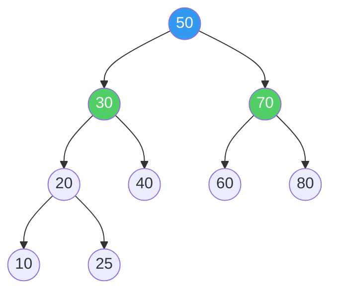
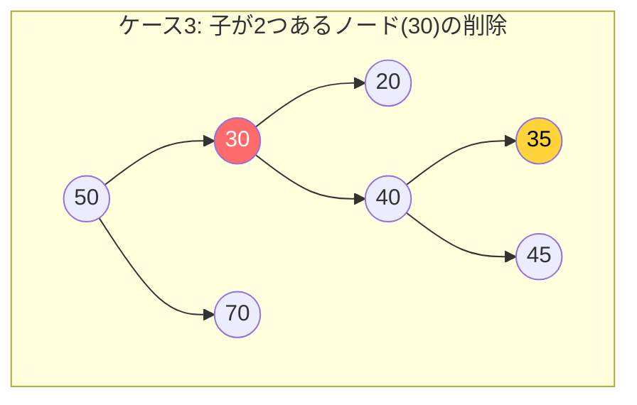
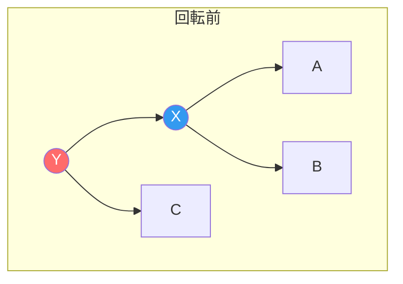
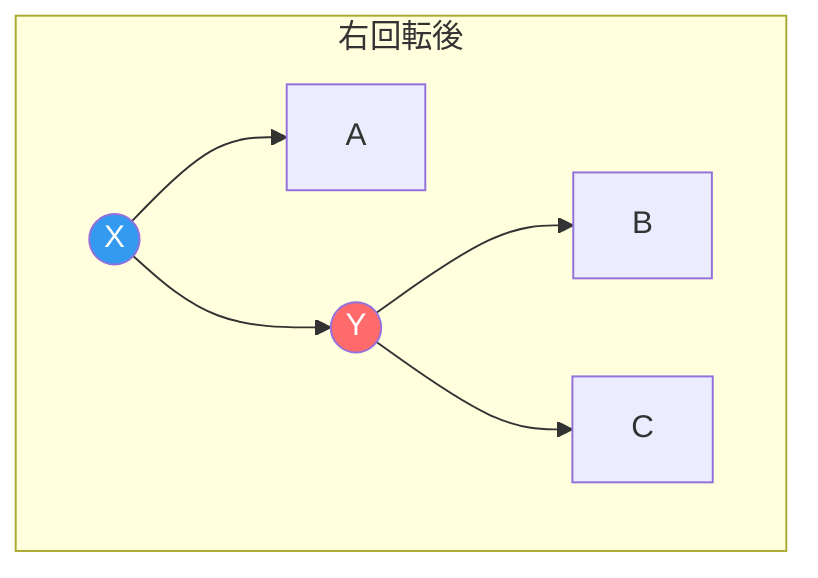
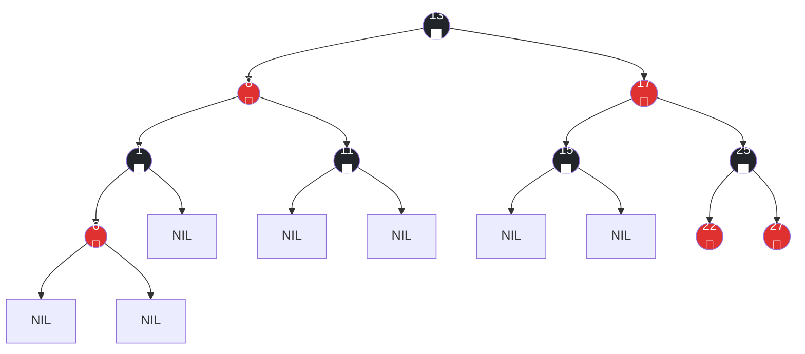
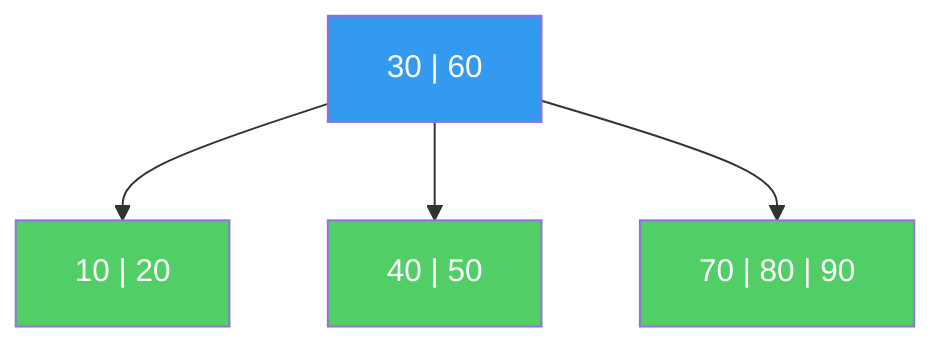
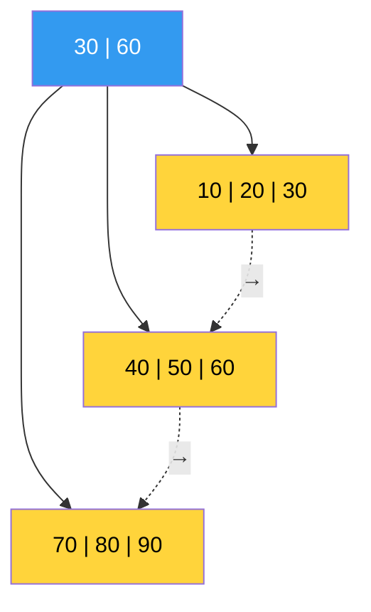
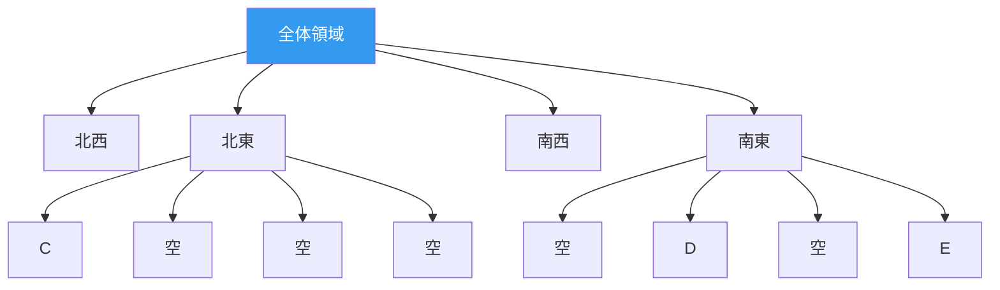
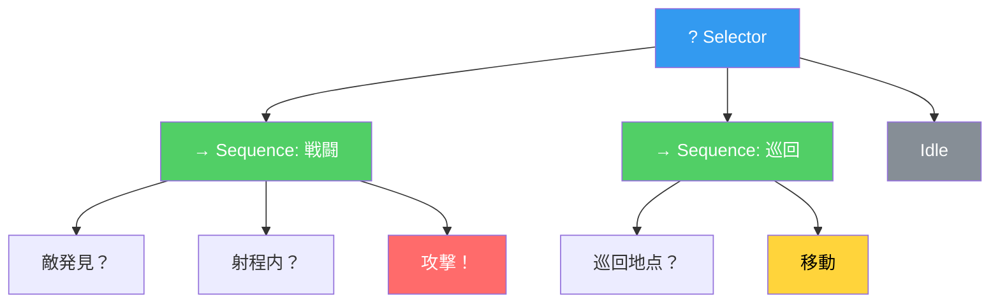

## 序論

> この文書は **CSロードマップ** シリーズの第4回です。

[第3回](/posts/HashTable/)で、ハッシュテーブルのO(1)がタダではないことを見た。ハッシュ関数の品質、衝突解決戦略、ロードファクター — これらすべてが噛み合ってこそO(1)が維持される。そして最後に、ハッシュテーブルが答えられない問いを残した：

- 「レベル50〜80のモンスターをすべて見つけろ」（範囲クエリ）
- 「最も強い敵は誰か？」（最小値/最大値）
- 「データを順番に並べろ」（順序走査）

ハッシュテーブルは**「このキーの値は？」**というポイントクエリに特化している。キー間の**順序関係**を保存しないため、上記の問いにはデータ全体をスキャンするO(n)しか答えがない。

ツリー（Tree）はこの問題を解決する。データを**順序を維持しながら**格納し、探索・挿入・削除を**O(log n)**で実行する。O(1)より遅いが、**どんな入力でも** O(log n)を保証するという点でハッシュテーブルより信頼できる。

以降のシリーズ構成：

| 回 | テーマ | 核心的問い |
| --- | --- | --- |
| **第4回（今回）** | ツリー | BST、Red-Black Tree、B-Treeはなぜ必要か？ |
| **第5回** | グラフ | 探索、最短経路、トポロジカルソートの原理は？ |
| **第6回** | メモリ管理 | スタック/ヒープ、GC、手動メモリ管理のトレードオフは？ |

---

## Part 1: ツリーの基本概念

### ツリーとは何か

ツリーは**閉路のない連結グラフ**だ。1つのルート（root）から始まり、各ノードが0個以上の子（child）ノードを持つ階層構造である。

```
         ルート
        /    \
      A        B
     / \      / \
    C   D    E   F
       / \
      G   H
```

主要用語：

| 用語 | 定義 |
| --- | --- |
| **ルート（Root）** | 最上位ノード。親がない |
| **リーフ（Leaf）** | 子がないノード（C, G, H, E, F） |
| **内部ノード（Internal）** | 子があるノード（ルート, A, B, D） |
| **深さ（Depth）** | ルートからそのノードまでの辺の数。ルートの深さ = 0 |
| **高さ（Height）** | そのノードから最も遠いリーフまでの辺の数。ツリーの高さ = ルートの高さ |
| **部分木（Subtree）** | 特定ノードをルートとする部分ツリー |

ツリーは**再帰的構造**だ。すべての部分木もツリーである。この性質がツリーアルゴリズムの大部分を再帰で表現できるようにしている。

### 二分木（Binary Tree）

各ノードが**最大2つの子**を持つツリー。この記事で扱うBST、AVL、Red-Black Treeはすべて二分木だ。

二分木の重要な性質 — 高さhの二分木の最大ノード数：

$$N_{\max} = 2^{h+1} - 1$$

逆に、n個のノードを持つ二分木の**最小高さ**：

$$h_{\min} = \lfloor \log_2 n \rfloor$$

これがO(log n)の根拠だ。n個のデータを**均衡の取れた**二分木に入れれば、ルートから任意のノードまで最大$\lfloor \log_2 n \rfloor$回の比較で到達できる。

100万個のデータがあっても$\lfloor \log_2 1{,}000{,}000 \rfloor = 19$。**最大19回の比較**で目的のデータを見つけられる。

---

## Part 2: 二分探索木（BST） — 順序を維持する探索

### BSTの定義

二分探索木（Binary Search Tree）は、すべてのノードに対して以下のルールを満たす二分木だ：

> **左部分木のすべてのキー < 現在ノードのキー < 右部分木のすべてのキー**



このルールのおかげで、探索は二分探索（Binary Search）と同じ原理で動作する。[第1回](/posts/ArrayAndLinkedList/)で、ソート済み配列の二分探索がO(log n)であることを見た。BSTはこの原理を**動的データ**に適用したものだ。

### BST探索

キー25を探す過程：

```
50 → 25 < 50, 左へ
30 → 25 < 30, 左へ
20 → 25 > 20, 右へ
25 → 見つかった！

比較回数: 4 (= 深さ + 1)
```

```csharp
// BST Search — Recursive
Node Search(Node node, int key) {
    if (node == null || node.Key == key)
        return node;
    if (key < node.Key)
        return Search(node.Left, key);
    else
        return Search(node.Right, key);
}
```

毎回の比較で探索空間が**半分に縮小される。** ソート済み配列の二分探索と同じ原理だ。違いは、配列は**インデックスで中央要素にアクセス**し、BSTは**ポインタで子にアクセス**するという点だ。

### BST挿入

新しいキーは常に**リーフの位置**に挿入される。探索パスをたどってNULLに到達したら、そこに入れる。

```
40を挿入:
50 → 40 < 50, 左へ
30 → 40 > 30, 右へ
→ 30の右の子として挿入
```

### BST削除 — 3つのケース

BSTでの削除は挿入より複雑だ。3つのケースを区別する必要がある：

**ケース1: リーフノードの削除** — 単純に除去

**ケース2: 子が1つのノードの削除** — 子を親と直接接続

**ケース3: 子が2つのノードの削除** — 最も厄介なケース



30を削除するには、BSTルールを維持できる**後継者（successor）**を見つける必要がある。2つの選択肢がある：

- **中順後続（Inorder Successor）**：右部分木で最小のノード → 35
- **中順先行（Inorder Predecessor）**：左部分木で最大のノード → 25

後継者のキーを削除対象ノードにコピーし、後継者ノードを削除する。後継者は子が最大1つなので、ケース1または2に帰着する。

この設計が正確に動作する理由：中順後続（35）は30より大きく40より小さい。したがって30の位置に35を置くと、左部分木（20, 25）のすべてのキーより大きく、右部分木（40, 45）のすべてのキーより小さいため、BSTルールが維持される。

### BSTの時間計算量

| 操作 | 平均 | 最悪 |
| --- | --- | --- |
| 探索 | O(log n) | **O(n)** |
| 挿入 | O(log n) | **O(n)** |
| 削除 | O(log n) | **O(n)** |
| 最小値/最大値 | O(log n) | **O(n)** |
| 中順走査（全体） | O(n) | O(n) |

平均はO(log n)だ。しかし**最悪がO(n)**であることが致命的だ。

### BSTの致命的弱点 — 偏りツリー

すでにソートされたデータ [10, 20, 30, 40, 50] を順番に挿入すると：

```
10
  \
   20
     \
      30
        \
         40
           \
            50

高さ = 4 (= n - 1)
探索時間 = O(n) — 連結リストと同じ！
```

BSTが**連結リストに退化（degenerate）**したのだ。第3回でハッシュテーブルのすべてのキーが1つのバケットに集中するのと同じ現象だ。

ゲーム開発においてこの問題は現実的だ。モンスターを生成順（IDが増加する順序）でBSTに挿入すると、偏りツリーができてしまう。タイムスタンプをキーとして使っても同様だ。

> **ここで立ち止まって確認しよう**
>
> **Q. ランダムデータならBSTは大丈夫か？**
>
> 理論的にはそうだ。n個のキーをランダムな順序で挿入したBSTの**期待高さ**は$E[h] = 4.311 \ln n - 1.953 \ln \ln n + O(1)$だ — Reed（2003）の結果。$\ln n \approx 2.3 \log_2 n$なので約$1.39 \log_2 n$。最小高さの約1.39倍だ。悪くない。
>
> しかし**「ランダム入力を仮定できるか？」**が問題だ。現実のデータはほぼ常に偏りがある。時間順、ID順、アルファベット順 — ソート済みパターンが頻繁に現れる。これが均衡ツリーが必要な理由だ。
>
> **Q. それなら挿入前にデータをシャッフルすればいいのでは？**
>
> 静的データ（一度入れて終わり）なら可能だ。しかし動的データ（継続的な挿入/削除）なら挿入順序を制御できない。**データ構造自体が**どんな入力でも均衡を保証しなければならない。

---

## Part 3: 均衡の技術 — 回転

### 回転（Rotation）とは

偏りツリーの解決策は**均衡化（balancing）**だ。ツリーの高さをO(log n)に維持すること。そのための核心演算が**回転（rotation）**だ。

回転はツリーの構造を変えつつ**BSTルールは維持**する演算だ。O(1)で実行される。

**右回転（Right Rotation）**：





BSTルールが維持される理由：
- 回転前：A < X < B < Y < C
- 回転後：A < X < B < Y < C（同一！）

部分木BがXの右の子からYの左の子に移動したが、Bのすべてのキーはxより大きくYより小さいため、ルールは破られない。

```csharp
// Right Rotation
Node RotateRight(Node y) {
    Node x = y.Left;
    Node b = x.Right;

    x.Right = y;     // Y becomes X's right child
    y.Left = b;      // B becomes Y's left child

    return x;         // New root is X
}
```

左回転（Left Rotation）は対称だ。この2つの演算がすべての均衡ツリーの基盤である。

### AVLツリー — 最初の均衡二分探索木

1962年、ソ連の数学者Adelson-VelskyとLandisが発表した**AVLツリー**は、最初の自己均衡（self-balancing）BSTだ。

**AVLルール**：すべてのノードにおいて、左部分木と右部分木の高さの差が**最大1**でなければならない。

$$|\text{height}(\text{left}) - \text{height}(\text{right})| \leq 1$$

この差を**均衡係数（Balance Factor）**と呼ぶ。

```
      30 (bf=1)         30 (bf=2) ← 不均衡！
     /  \               /
    20   40            20
   /                  /
  10                 10
```

不均衡が発生すると回転で即座に復旧する。挿入/削除後に不均衡が生じるパターンは4つあり、それぞれに対応する回転がある：

| パターン | 不均衡の位置 | 解決策 |
| --- | --- | --- |
| **LL** | 左の子の左に挿入 | 右回転1回 |
| **RR** | 右の子の右に挿入 | 左回転1回 |
| **LR** | 左の子の右に挿入 | 左回転 → 右回転 |
| **RL** | 右の子の左に挿入 | 右回転 → 左回転 |

AVLツリーの高さは**厳密に**制限される：

$$h < 1.4405 \log_2(n + 2) - 0.3277$$

n = 100万なら$h < 28.6$。理論的最小値（$\lfloor \log_2 n \rfloor = 19$）の約1.44倍だ。

**AVLの長所と短所**：

| 長所 | 短所 |
| --- | --- |
| 探索が非常に高速（高さが厳密に制限） | 挿入/削除時に回転が頻繁に発生 |
| 均衡条件が直感的 | 挿入/削除の度にルートまで遡って均衡確認 |
| 実装が比較的シンプル | 削除時に最大O(log n)回の回転が必要 |

**読み取りが圧倒的に多いワークロード**ではAVLが有利だ。しかし挿入/削除が頻繁だと回転コストが負担になる。このトレードオフがRed-Black Treeの登場背景だ。

---

## Part 4: レッド-ブラックツリー — 実戦の王

### なぜRed-Black Treeなのか

1978年、Leonidas GuibasとRobert Sedgewickが発表したレッド-ブラックツリー（Red-Black Tree）は、AVLより**緩い均衡条件**を使用して、挿入/削除時の回転回数を減らす。

結果としてRed-Black Treeは事実上すべての主要言語の**ソート済みマップ/セット標準**となった：

| 言語 | 実装 |
| --- | --- |
| C++ | `std::map`, `std::set` |
| Java | `TreeMap`, `TreeSet` |
| .NET/C# | `SortedDictionary`, `SortedSet` |
| Linuxカーネル | `struct rb_tree`（プロセススケジューリング、メモリ管理） |

### 5つのルール

レッド-ブラックツリーは各ノードに**色（赤または黒）**を割り当て、以下の5つのルールを維持する：

1. **すべてのノードは赤または黒である**
2. **ルートは黒である**
3. **すべてのNILリーフ（外部ノード）は黒である**
4. **赤いノードの子は必ず黒である**（赤-赤の連続不可）
5. **任意のノードから子孫NILまでのパスに含まれる黒ノードの数はすべて同じである**（Black Height）



ルール4と5が核心だ。この2つのルールがツリーの高さを制限する。

### 高さ保証の数学的根拠

**定理**：n個の内部ノードを持つレッド-ブラックツリーの高さは最大$2\log_2(n+1)$である。

**証明のスケッチ**：

ルール5により、ルートからNILまでのすべてのパスに黒ノードが同数（bh = Black Height）ある。ルール4により、パス上の赤ノードは黒ノードより多くなれない（赤-赤が連続できないため）。したがって：

$$h \leq 2 \cdot bh$$

Black Heightがbhの部分木は最低$2^{bh} - 1$個の内部ノードを含む（帰納法で証明）。したがって：

$$n \geq 2^{bh} - 1 \geq 2^{h/2} - 1$$

両辺の対数をとると：

$$h \leq 2\log_2(n + 1)$$

n = 100万なら$h \leq 2 \times 20 = 40$。AVLの28.6より緩いが、依然としてO(log n)だ。

### AVL vs Red-Black Tree — トレードオフ

| 特性 | AVL | Red-Black Tree |
| --- | --- | --- |
| 最大高さ | ~1.44 log n | ~2 log n |
| **探索性能** | **やや高速**（高さが低いため） | やや遅い |
| **挿入時の回転** | 最大2回 | **最大2回** |
| **削除時の回転** | 最大O(log n)回 | **最大3回** |
| 均衡条件 | 厳密（高さの差 ≤ 1） | 緩い（色ルール） |
| 適したワークロード | 読み取り >> 書き込み | **読み取り ≈ 書き込み** |

削除時の回転回数が決定的な差だ。AVLは削除後にルートまで遡って複数回回転する可能性があるが、Red-Black Treeは**最大3回の回転**で均衡を復旧する。挿入/削除が頻繁な実戦ワークロードにおいて、この差がRed-Black Treeを標準にした。

> **ここで立ち止まって確認しよう**
>
> **Q. Red-Black Treeの色がなぜ赤と黒なのか？**
>
> GuibasとSedgewickが1978年の論文でこの構造を発表した際、当時使用していたXerox PARCのレーザープリンターが赤と黒の2色しか印刷できなかった。ダイアグラムを描くのに便利な色を選んだのだ。Sedgewick自身が明かしたエピソードである。
>
> **Q. Red-Black Treeの挿入/削除はどのように動作するか？**
>
> 挿入時、新しいノードを赤として配置し、ルール違反が発生したら**色変換（recoloring）**と**回転**を組み合わせて復旧する。削除はより複雑で、CLRSでは約30ページを割いている。この記事では**なぜ必要か**と**性能特性**に集中し、実装の詳細は参考資料のCLRS Chapter 13を推奨する。
>
> **Q. ゲームでRed-Black Treeを自分で実装することはあるか？**
>
> ほぼない。`SortedDictionary`、`std::map`など言語標準ライブラリがすでに最適化された実装を提供している。理解すべきは**いつこのデータ構造を選択するか**だ：ソート順での走査が必要な場合、範囲クエリが必要な場合、最悪ケースでもO(log n)が保証されなければならない場合。

### 中順走査（Inorder Traversal） — ツリーのキラー機能

BSTの中順走査はデータを**ソート順**で訪問する。これはハッシュテーブルにはないツリーだけの強力な機能だ。

```csharp
// Inorder traversal: Left → Current → Right → Sorted order!
void InorderTraversal(Node node) {
    if (node == null) return;
    InorderTraversal(node.Left);
    Visit(node);                    // Visited in sorted order
    InorderTraversal(node.Right);
}
```

上のRed-Black Treeを中順走査すると：1, 6, 8, 11, 13, 15, 17, 22, 25, 27 — ソート順だ。

**範囲クエリ**もこの性質で解決する。「15以上25以下のキーをすべて見つけろ」は、15を見つけてから中順走査を続け、25を超えたら止めればよい。O(log n + k)、kは結果の個数。

```csharp
// Range query: collect all keys in [lo, hi]
void RangeQuery(Node node, int lo, int hi, List<int> result) {
    if (node == null) return;
    if (node.Key > lo)
        RangeQuery(node.Left, lo, hi, result);
    if (node.Key >= lo && node.Key <= hi)
        result.Add(node.Key);
    if (node.Key < hi)
        RangeQuery(node.Right, lo, hi, result);
}
```

---

## Part 5: B-Tree — ディスクの物理学を反映したツリー

### なぜ二分ではないのか

ここまでのツリーは**メモリ（RAM）**上で動作することを前提としていた。しかしデータがRAMに収まらなければどうだろう？データベースは数TBのデータを扱い、それは**ディスク（SSD/HDD）**に格納されている。

第1回でメモリ階層を見た。主要な数値を再確認しよう：

| ストレージ | アクセス時間 | RAM比 |
| --- | --- | --- |
| L1キャッシュ | ~1 ns | 1x |
| RAM | ~100 ns | 100x |
| SSD（ランダム読み取り） | ~100,000 ns (100 μs) | 100,000x |
| HDD（ランダム読み取り） | ~10,000,000 ns (10 ms) | 10,000,000x |

RAMとSSDの差は**1,000倍**だ。ディスクアクセス1回がRAMアクセス1,000回より遅い。

Red-Black Treeに100万個のデータがあれば、高さは最大40。探索に40回のノードアクセスが必要だ。RAMなら問題ないが、ディスクにあると**40回のディスク読み取り** — これは遅すぎる。

解決策：**1回のディスク読み取りで可能な限り多くの情報を取得する。** ディスクは1回に**ページ（通常4KB〜16KB）**単位で読み取る。二分木ノード1つ（数十バイト）を読むために4KBを取得するのは無駄だ。

### B-Treeの構造

1972年、Rudolf BayerとEdward McCreightが発表したB-Treeはこの問題を解決する。核心アイデア：**1つのノードに多くのキーを格納して、ツリーの高さを劇的に下げる。**

次数（order）tのB-Treeのルール：

1. すべてのリーフは同じ深さにある
2. ルート以外の各ノードは最低t-1個、最大2t-1個のキーを持つ
3. ルートは最低1個のキーを持つ
4. k個のキーを持つ内部ノードはk+1個の子を持つ
5. 各ノード内でキーはソートされている

```
t=3のB-Tree（各ノードに最大5個のキー）:

                    [30 | 60]
                   /    |    \
        [10|20]    [40|50]    [70|80|90]

各ノードが1つのディスクページに対応
```



### B-Treeの高さ

次数t、キーn個のB-Treeの高さ：

$$h \leq \log_t \frac{n+1}{2}$$

実践ではtは数百〜数千だ。4KBページに8バイトキー + 8バイトポインタを入れると約250個のキーが入る（t ≈ 125）。

n = 10億（1,000,000,000）個のキー、t = 125の場合：

$$h \leq \log_{125} \frac{10^9 + 1}{2} \approx \frac{\log_2(5 \times 10^8)}{\log_2 125} \approx \frac{29}{7} \approx 4.1$$

**10億個のデータから4回のディスク読み取りで目的のキーを見つける。** Red-Black Treeの40回と比較すると10倍の差だ。

### B-Tree探索

BST探索の一般化だ。各ノードでキーを二分探索（または順次探索）して、次に訪問する子を決定する。

```
キー45を探索:

[30 | 60]
→ 30 < 45 < 60, 2番目の子へ

[40 | 50]
→ 40 < 45 < 50, 2番目の子へ

[43 | 44 | 45 | 47]
→ 45発見！

ディスク読み取り: 3回
```

ノード内部での探索は**RAMで**行われる（ページを丸ごと読み込んであるため）。したがってノード内のキーが数百個あっても二分探索でO(log t)で見つかり、このコストはディスクI/Oに比べれば無視できる。

### B-Tree挿入 — 分割（Split）

B-Treeの挿入は**ボトムアップ（bottom-up）**または**トップダウン（top-down）**で動作する。核心演算は**ノード分割（split）**だ。

ノードが満杯になると（2t-1個のキー）、中間キーを**親に昇格**させてノードを2つに分割する。

```
t=3, ノード最大5個のキー

挿入前（満杯のノード）:
[10 | 20 | 30 | 40 | 50]

分割後:
         [30]          ← 中間キーが親に昇格
        /    \
[10 | 20]  [40 | 50]
```

分割は親に伝播する可能性がある。親も満杯なら親も分割する。最悪の場合ルートまで分割が伝播し、ルートが分割されると新しいルートが生まれる — これが**B-Treeの高さが増加する唯一のケース**だ。

> **ここで立ち止まって確認しよう**
>
> **Q. B-Treeの「B」は何の略か？**
>
> 確かではない。発明者Bayerの「B」、Boeing（Bayerが勤務していた会社）の「B」、Balancedの「B」、またはBroadの「B」という説がある。Bayer本人は明かさなかった。KnuthもTAOCPで「BayerとMcCreightはBの意味を説明しなかった」と記した。
>
> **Q. B-Treeと二分木はどんな関係か？**
>
> B-Treeは二分木の**一般化**だ。次数t=2のB-Treeは2-3木（各ノードに1〜3個のキー）と同値であり、これはRed-Black Treeと構造的に同一だ。Sedgewickがこの対応関係を示した：Red-Black Treeは**2-3木を二分木でシミュレーション**したものだ。赤い辺は同じB-Treeノード内のキーを接続し、黒い辺は異なるノードへの接続だ。

### B+Tree — 範囲クエリの王

B+TreeはB-Treeの変形で、データベースインデックスの事実上の標準だ。B-Treeとの主な違い：

1. **すべてのデータがリーフにのみ**存在する。内部ノードは探索のためのキー（ルーター）のみを持つ
2. **リーフノードが連結リストで接続**されている

```
B+Tree:
                [30 | 60]               ← 内部ノード（ルーターのみ）
               /    |    \
[10|20|30] → [40|50|60] → [70|80|90]    ← リーフ（実データ + リンク）
```



**範囲クエリが劇的に高速化される。**「30〜70のすべてのデータ」を探すには：

1. B+Treeで30を見つける → O(log n)ディスク読み取り
2. リーフの連結リストを辿って70まで順次読み取る → O(k)順次読み取り

順次読み取りはディスクにおいて**ランダム読み取りよりはるかに高速**だ（SSDで10〜100倍、HDDで100〜1000倍）。B-Treeで範囲クエリを行うにはツリーを再走査する必要があるが、B+Treeはリーフ間ポインタで直接移動する。

これがMySQL InnoDB、PostgreSQL、SQLiteなどほぼすべてのリレーショナルデータベースが**B+Treeインデックス**を使用する理由だ。

| 特性 | B-Tree | B+Tree |
| --- | --- | --- |
| データの位置 | すべてのノード | **リーフのみ** |
| リーフ間の接続 | なし | **連結リスト** |
| 範囲クエリ | ツリー再走査が必要 | **リーフ順次スキャン** |
| ポイントクエリ | 内部ノードで終了可能（高速な場合あり） | 常にリーフまで探索 |
| 内部ノードサイズ | 大（データを含む） | **小**（キーのみ） → より多くのキー → より低い高さ |

---

## Part 6: ゲーム開発におけるツリー

### 1. 空間分割 — QuadtreeとOctree

第3回で空間ハッシング（Spatial Hashing）を見た。ツリーベースの空間分割は異なるアプローチを提供する。

**Quadtree**：2D空間を**再帰的に4等分**するツリー。各ノードが空間の1領域を表し、オブジェクトが多い領域のみ細分化する。

```
Quadtree（2D空間分割）:

┌─────────────┬─────────────┐
│             │      B      │
│      A      ├──────┬──────┤
│             │  C   │      │
├─────────────┼──────┼──────┤
│             │      │  D   │
│             │      ├──────┤
│             │      │  E   │
└─────────────┴──────┴──────┘

オブジェクトが密集した領域のみ細分化
→ 適応的（adaptive）分割
```



**Octree**：Quadtreeの3D版。空間を**8等分**する。3Dゲームで広く使われている。

**空間ハッシング（第3回） vs Quadtree/Octree**：

| 特性 | 空間ハッシング | Quadtree/Octree |
| --- | --- | --- |
| セルサイズ | **固定** | **適応的**（密度に応じて） |
| オブジェクト分布 | 均一な場合に有利 | **不均一な場合に有利** |
| メモリ | 予測可能 | 動的 |
| 実装の複雑さ | シンプル | 中程度 |
| 使用例 | パーティクル、均一グリッド | 広大なオープンワールド、可変密度 |

オープンワールドゲームのように一方に都市（密集）があり他方に砂漠（希薄）がある場合、Quadtree/Octreeが空間ハッシングより効率的だ。

### 2. BVH（Bounding Volume Hierarchy） — レンダリングと物理の核心

BVHは**オブジェクトを基準に**空間を分割するツリーだ。Quadtree/Octreeが空間を均一に分割するのと対照的である。

```
BVH: バウンディングボリュームを階層的にグループ化

         [シーン全体のAABB]
          /            \
   [左グループAABB]   [右グループAABB]
    /       \            /        \
 [敵A]   [敵B,C]    [木1~3]   [岩1,2]
```

レイキャスト（ray cast）や衝突検査において、バウンディングボリューム（AABB）と交差しなければ**その部分木全体をスキップできる。** 数万個のオブジェクトがあっても、実際に交差検査するのはO(log n)個のノードだけだ。

レイトレーシングにおいてBVHは核心的加速構造だ。NVIDIAのRTX GPUは**ハードウェアレベルでBVH走査をサポート**する。UnityのPhysics.Raycast、Unrealのラインレースもすべて内部的にBVHを使用している。

### 3. Behavior Tree — AI意思決定

ゲームAIにおいてBehavior TreeはNPCの意思決定を**階層的に**構造化する。Halo 2（2004）で初めて大衆化され、現在ほとんどのAAAゲームが使用している。



- **Selector（?）**：子を左から実行、1つが成功したら成功を返す（OR）
- **Sequence（→）**：子を左から実行、1つが失敗したら失敗を返す（AND）
- **リーフ**：条件確認または行動実行

Behavior Treeの強みは**モジュール性**だ。部分木を交換・追加してAI行動を変更できる。Unreal EngineのAIシステムがBehavior Treeを核として使用し、エディタで視覚的に編集できる。

> **ここで立ち止まって確認しよう**
>
> **Q. Behavior TreeはBSTと関係があるか？**
>
> 構造的にはツリーだが、BSTとは目的が完全に異なる。BSTは**データをソート順で格納する**データ構造であり、Behavior Treeは**意思決定ロジックを階層的に表現する**制御構造だ。BSTのノードにはキーが、Behavior Treeのノードには行動や条件が入る。同じ「ツリー」構造を完全に異なる目的で使用する例だ。
>
> **Q. Behavior Tree以前は何を使っていたか？**
>
> **有限状態マシン（FSM）**が標準だった。FSMは状態と遷移で構成されるが、状態が増えると遷移規則が指数的に複雑になる（状態爆発、state explosion）。Behavior Treeはこの問題を階層的構造で解決する。FSMの限界とBehavior Treeへの移行はGDC 2005でAlex Champandardが詳しく発表した。

### 4. シーングラフ（Scene Graph）

ゲームエンジンのオブジェクト階層構造自体がツリーだ。Unityの`Transform`親子関係、Unrealの`Actor`-`Component`階層がシーングラフだ。

```
キャラクター（位置：ワールド）
├── 胴体（位置：キャラクター基準）
│   ├── 左腕（位置：胴体基準）
│   └── 右腕（位置：胴体基準）
│       └── 剣（位置：右腕基準）
└── 脚（位置：キャラクター基準）
```

親の変換（移動、回転、スケール）がすべての子に伝播する。キャラクターが動けば剣も一緒に動く。これはツリーの再帰的性質を直接活用したものだ。

---

## Part 7: ツリーのキャッシュ性能

### ポインタベースツリーの弱点

第1回で連結リストのキャッシュ問題を見た。ポインタベースのツリーも同じ問題を抱えている。各ノードがヒープに個別に割り当てられると、親から子への移動のたびにキャッシュミスが発生し得る。

```
メモリ空間:
0x1000: [ノード 50]  ← ルート
  ...
0x3040: [ノード 30]  ← キャッシュミス
  ...
0x7820: [ノード 20]  ← またキャッシュミス
  ...
0xB100: [ノード 25]  ← またキャッシュミス

4回のノードアクセス = 最大4回のキャッシュミス
```

ハッシュテーブルのチェイニングと同じ問題だ。第3回で.NET Dictionaryが配列内チェイニングでこの問題を解決したのを見た。

### 配列ベースツリー — ヒープ（Heap）

完全二分木は**配列で表現**できる。インデックスiのノードに対して：
- 左の子：2i + 1
- 右の子：2i + 2
- 親：(i - 1) / 2

```
       50
      /  \
    30    70
   / \   / \
  10  40 60  80

配列: [50, 30, 70, 10, 40, 60, 80]
インデックス: 0   1   2   3   4   5   6
```

ポインタがないためメモリオーバーヘッドがなく、配列が連続メモリなのでキャッシュフレンドリーだ。**ヒープ（Heap）**データ構造がこの方式を使用する — 優先度キューの標準実装だ。

ただし、この方式は**完全二分木**でのみ効率的だ。BSTやRed-Black Treeは完全二分木ではないため、配列表現は非効率的だ（空きスペースが多くなる）。

### B-Treeのキャッシュ親和性

B-TreeはディスクI/O用に設計されたが、**RAM上でも**キャッシュ性能が良い。1つのノードに複数のキーが入っているため、ノード内探索は連続メモリアクセスだ。キャッシュライン（64バイト）に複数のキーが入るため、L1キャッシュ内で探索が完結する。

この観察から生まれたのが**キャッシュ無関係（cache-oblivious）B-Tree**と**van Emde Boasレイアウト**だ。Prokop（1999）が提案したこのレイアウトは、ツリーノードをメモリに配置する際に**再帰的に**上半分と下半分を隣接して配置する。キャッシュサイズを知らなくても最適に近いキャッシュ性能を達成する。

> **ここで立ち止まって確認しよう**
>
> **Q. ではいつどのツリーを使うべきか？**
>
> | 状況 | 推奨データ構造 |
> | --- | --- |
> | 「このキーの値は？」（ポイントクエリ） | **ハッシュテーブル**（第3回） |
> | 「キー順に走査」/「範囲クエリ」 | **Red-Black Tree**（`SortedDictionary`） |
> | 「最大/最小要素を素早く」 | **ヒープ**（優先度キュー） |
> | 「ディスクベースの大量データ」 | **B+Tree**（DBインデックス） |
> | 「2D/3D空間分割」 | **Quadtree/Octree/BVH** |
> | 「AI意思決定」 | **Behavior Tree** |
>
> **Q. Unity/Unrealでツリーを自分で実装する必要があるか？**
>
> BST、Red-Black Tree — **いいえ**。`SortedDictionary`、`std::map`を使用せよ。ただし**Quadtree、Octree、BVH、Behavior Tree**はエンジンに内蔵されているか、プロジェクトの要件に合わせてカスタム実装が必要な場合がある。Unityの`Physics.Raycast`は内部的にBVHを使用しているが、カスタム物理や大規模オブジェクト管理では自前実装するケースがある。

---

## まとめ：ツリーは階層こそが効率

この記事で見た核心：

1. **BSTは「順序を維持しながらO(log n)探索」というハッシュテーブルにない能力を提供する。** しかしソート済みデータに脆弱でO(n)に退化し得る。この弱点を克服するために均衡ツリーが必要だ。

2. **Red-Black Treeは緩い均衡条件で挿入/削除時の回転を最小化し**、読み書きが混在する実戦ワークロードでAVLに勝った。すべての主要言語のソート済みマップ標準となった理由だ。

3. **B-Treeは「1回の読み取りで最大限多く取得する」というディスクの物理学を反映した**設計だ。10億個のデータから4回のディスクアクセスで目的のキーを見つける。B+Treeはリーフ連結リストで範囲クエリをO(log n + k)で解決する。

4. **ゲーム開発においてツリーはデータ構造を超えた構造的思考のツールだ。** Quadtree/Octreeで空間を分割し、BVHでレンダリングと物理を加速し、Behavior TreeでAIを設計し、シーングラフでオブジェクト階層を管理する。「階層的に分割し、必要な部分だけ深く入る」という原理があらゆるところに適用される。

KnuthはTAOCP Vol. 1でツリーをこう紹介した：

> "Trees are the most important nonlinear structures that arise in computer algorithms."
>
> （ツリーはコンピュータアルゴリズムに現れる最も重要な非線形構造である。）

配列は線形で、ハッシュテーブルは無秩序だ。ツリーは**階層（hierarchy）**という新しい次元を導入して、順序と効率を同時に達成する。

次回は**グラフ** — ツリーの一般化であり、関係のネットワークを扱う構造を見る。BFS、DFS、最短経路、トポロジカルソートの原理を探求する。

---

## 参考資料

**主要論文および技術文書**
- Bayer, R. & McCreight, E., "Organization and Maintenance of Large Ordered Indices", Acta Informatica (1972) — B-Treeの原典
- Guibas, L.J. & Sedgewick, R., "A Dichromatic Framework for Balanced Trees", FOCS (1978) — Red-Black Treeの原典
- Adelson-Velsky, G.M. & Landis, E.M., "An Algorithm for the Organization of Information", Soviet Mathematics Doklady (1962) — AVL Treeの原典
- Reed, B., "The Height of a Random Binary Search Tree", Journal of the ACM (2003) — ランダムBSTの期待高さ分析
- Prokop, H., "Cache-Oblivious Algorithms", MIT Master's Thesis (1999) — van Emde Boasレイアウトの原典

**講演および発表**
- Champandard, A., "Understanding Behavior Trees", GDC AI Summit (2005) — ゲームAIにおけるBehavior Treeの大衆化
- Isla, D., "Handling Complexity in the Halo 2 AI", GDC (2005) — Halo 2のBehavior Tree適用事例

**教科書**
- Cormen, T.H. et al., *Introduction to Algorithms (CLRS)*, MIT Press — BST (Chapter 12), Red-Black Tree (Chapter 13), B-Tree (Chapter 18)
- Knuth, D., *The Art of Computer Programming Vol. 1: Fundamental Algorithms*, Addison-Wesley — ツリー構造の古典的分析 (Chapter 2.3)
- Knuth, D., *The Art of Computer Programming Vol. 3: Sorting and Searching*, Addison-Wesley — 均衡ツリーとB-Tree (Chapter 6.2)
- Sedgewick, R. & Wayne, K., *Algorithms*, 4th Edition, Addison-Wesley — Red-Black Treeを2-3木の観点から説明、Left-Leaning Red-Black Tree
- Ericson, C., *Real-Time Collision Detection*, Morgan Kaufmann — BVH、Quadtree、Octree、BSP Treeのゲーム開発応用
- Millington, I. & Funge, J., *Artificial Intelligence for Games*, 3rd Edition, CRC Press — Behavior Tree、FSMなどゲームAI構造

**実装参考**
- .NET `SortedDictionary<TKey, TValue>` — [dotnet/runtimeソース](https://github.com/dotnet/runtime): Red-Black Treeベース
- C++ `std::map` — libstdc++, libc++: Red-Black Treeベース
- Java `TreeMap` — [OpenJDKソース](https://github.com/openjdk/jdk): Red-Black Treeベース
- SQLite B-Tree — [sqlite.org](https://www.sqlite.org/btreemodule.html): B+Tree実装のリファレンスモデル
- Unreal Engine Behavior Tree — [docs.unrealengine.com](https://docs.unrealengine.com/): AIシステムの核心
