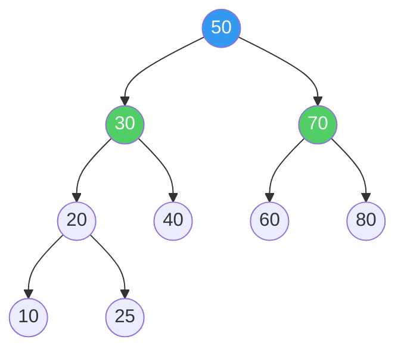
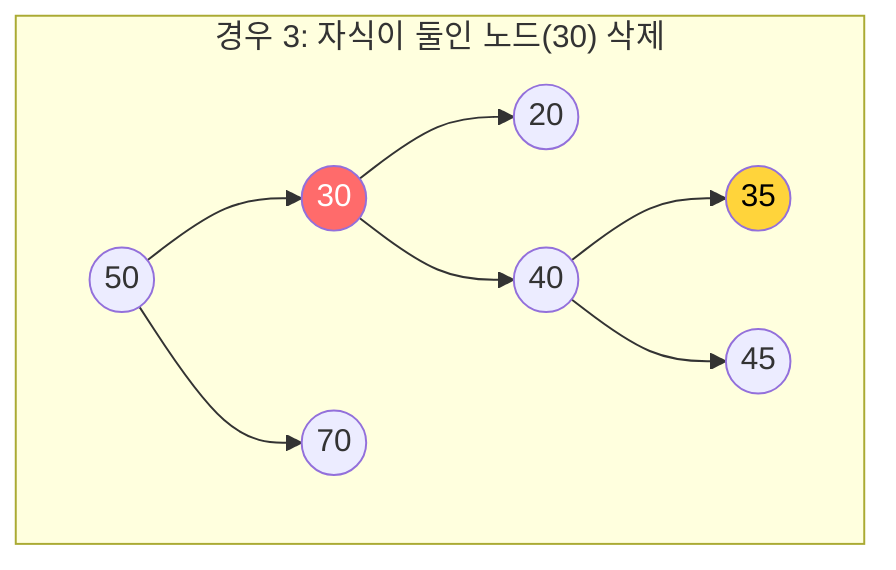
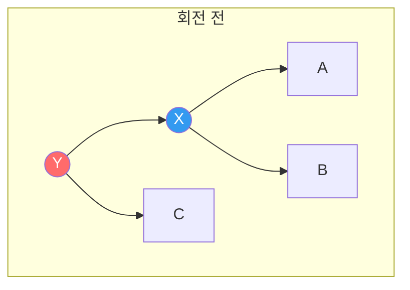
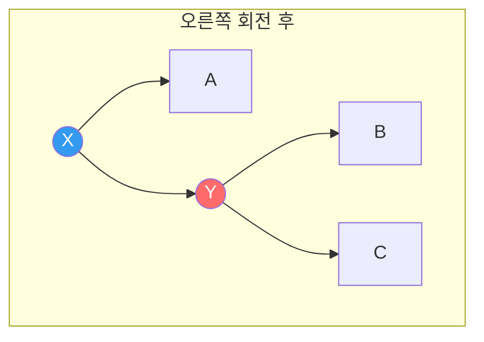
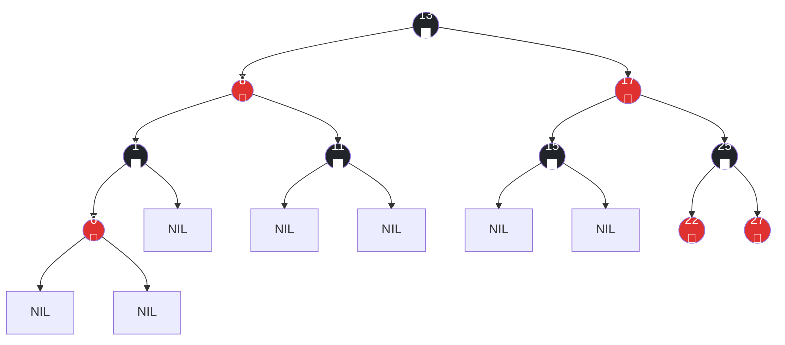
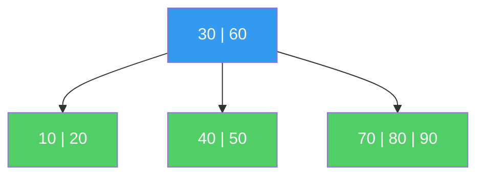
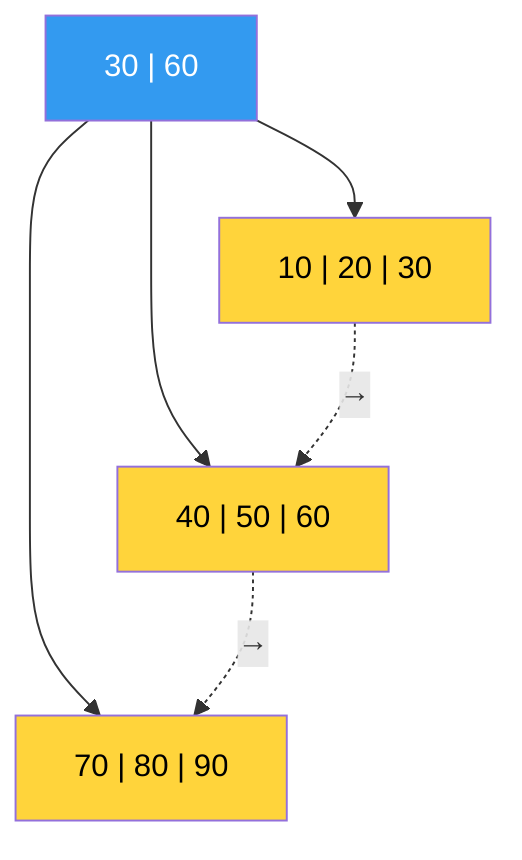
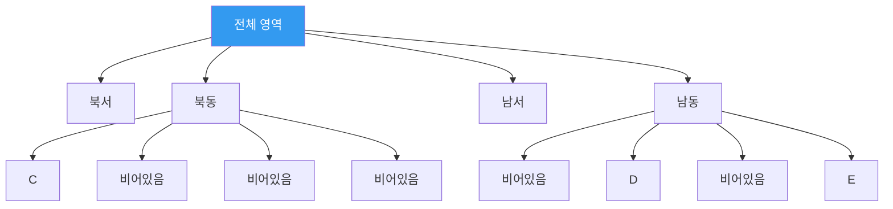
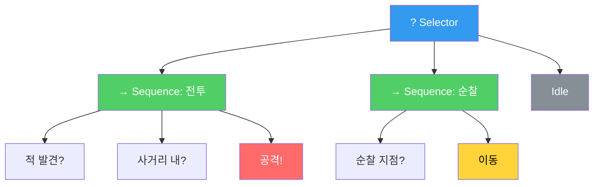

## 서론

> 이 문서는 **CS 로드맵** 시리즈의 4번째 편입니다.

[3편](/posts/HashTable/)에서 해시 테이블의 O(1)이 공짜가 아님을 보았다. 해시 함수의 품질, 충돌 해결 전략, 로드 팩터 — 이 모든 것이 맞물려야 O(1)이 유지된다. 그리고 마지막에 해시 테이블이 답하지 못하는 질문을 남겼다:

- "레벨 50~80 사이의 몬스터를 모두 찾아라" (범위 질의)
- "가장 강한 적은 누구인가?" (최솟값/최댓값)
- "데이터를 순서대로 나열하라" (순서 순회)

해시 테이블은 **"이 키의 값은?"**이라는 점 질의에 특화되어 있다. 키들 사이의 **순서 관계**를 보존하지 않기 때문에, 위의 질문들에는 전체 데이터를 스캔하는 O(n)밖에 답이 없다.

트리(Tree)는 이 문제를 해결한다. 데이터를 **순서를 유지하면서** 저장하고, 탐색·삽입·삭제를 **O(log n)**에 수행한다. O(1)보다 느리지만, **어떤 입력이든** O(log n)을 보장한다는 점에서 해시 테이블보다 신뢰할 수 있다.

이후 시리즈 구성:

| 편 | 주제 | 핵심 질문 |
| --- | --- | --- |
| **4편 (이번 글)** | 트리 | BST, Red-Black Tree, B-Tree는 왜 필요한가? |
| **5편** | 그래프 | 탐색, 최단 경로, 위상 정렬의 원리는? |
| **6편** | 메모리 관리 | 스택/힙, GC, 수동 메모리 관리의 트레이드오프는? |

---

## Part 1: 트리의 기본 개념

### 트리란 무엇인가

트리는 **사이클이 없는 연결 그래프**다. 하나의 루트(root)에서 시작하여, 각 노드가 0개 이상의 자식(child) 노드를 갖는 계층 구조다.

```
         루트
        /    \
      A        B
     / \      / \
    C   D    E   F
       / \
      G   H
```

핵심 용어:

| 용어 | 정의 |
| --- | --- |
| **루트(Root)** | 최상위 노드. 부모가 없다 |
| **리프(Leaf)** | 자식이 없는 노드 (C, G, H, E, F) |
| **내부 노드(Internal)** | 자식이 있는 노드 (루트, A, B, D) |
| **깊이(Depth)** | 루트에서 해당 노드까지의 간선 수. 루트의 깊이 = 0 |
| **높이(Height)** | 해당 노드에서 가장 먼 리프까지의 간선 수. 트리의 높이 = 루트의 높이 |
| **서브트리(Subtree)** | 특정 노드를 루트로 하는 부분 트리 |

트리는 **재귀적 구조**다. 모든 서브트리도 트리다. 이 성질이 트리 알고리즘의 대부분을 재귀로 표현할 수 있게 만든다.

### 이진 트리(Binary Tree)

각 노드가 **최대 2개의 자식**을 갖는 트리. 이 글에서 다루는 BST, AVL, Red-Black Tree는 모두 이진 트리다.

이진 트리의 중요한 성질 — 높이 h인 이진 트리의 최대 노드 수:

$$N_{\max} = 2^{h+1} - 1$$

역으로, n개 노드를 가진 이진 트리의 **최소 높이**:

$$h_{\min} = \lfloor \log_2 n \rfloor$$

이것이 O(log n)의 근거다. n개 데이터를 **균형 잡힌** 이진 트리에 넣으면, 루트에서 임의의 노드까지 최대 $\lfloor \log_2 n \rfloor$ 번의 비교로 도달할 수 있다.

100만 개의 데이터가 있어도 $\lfloor \log_2 1{,}000{,}000 \rfloor = 19$. **최대 19번의 비교**로 원하는 데이터를 찾는다.

---

## Part 2: 이진 탐색 트리(BST) — 순서를 유지하는 탐색

### BST의 정의

이진 탐색 트리(Binary Search Tree)는 모든 노드에 대해 다음 규칙을 만족하는 이진 트리다:

> **왼쪽 서브트리의 모든 키 < 현재 노드의 키 < 오른쪽 서브트리의 모든 키**



이 규칙 덕분에 탐색이 이진 탐색(Binary Search)과 동일한 원리로 동작한다. [1편](/posts/ArrayAndLinkedList/)에서 정렬된 배열의 이진 탐색이 O(log n)인 것을 보았다. BST는 이 원리를 **동적 데이터**에 적용한 것이다.

### BST 탐색

키 25를 찾는 과정:

```
50 → 25 < 50, 왼쪽으로
30 → 25 < 30, 왼쪽으로
20 → 25 > 20, 오른쪽으로
25 → 찾았다!

비교 횟수: 4 (= 깊이 + 1)
```

```csharp
// BST 탐색 — 재귀
Node Search(Node node, int key) {
    if (node == null || node.Key == key)
        return node;
    if (key < node.Key)
        return Search(node.Left, key);
    else
        return Search(node.Right, key);
}
```

매 비교에서 탐색 공간이 **절반으로 줄어든다.** 정렬된 배열의 이진 탐색과 동일한 원리다. 차이점은 배열은 **인덱스로 중앙 원소에 접근**하고, BST는 **포인터로 자식에 접근**한다는 것이다.

### BST 삽입

새 키는 항상 **리프 위치**에 삽입된다. 탐색 경로를 따라가다가 NULL을 만나면 거기에 넣는다.

```
40을 삽입:
50 → 40 < 50, 왼쪽
30 → 40 > 30, 오른쪽
→ 30의 오른쪽 자식으로 삽입
```

### BST 삭제 — 세 가지 경우

BST에서 삭제는 삽입보다 복잡하다. 세 가지 경우를 구분해야 한다:

**경우 1: 리프 노드 삭제** — 단순히 제거

**경우 2: 자식이 하나인 노드 삭제** — 자식을 부모와 직접 연결

**경우 3: 자식이 둘인 노드 삭제** — 가장 까다롭다



30을 삭제하려면, BST 규칙을 유지할 수 있는 **대체자(successor)**를 찾아야 한다. 두 가지 선택지가 있다:

- **중위 후속자(Inorder Successor)**: 오른쪽 서브트리에서 가장 작은 노드 → 35
- **중위 선행자(Inorder Predecessor)**: 왼쪽 서브트리에서 가장 큰 노드 → 25

대체자의 키를 삭제할 노드에 복사하고, 대체자 노드를 삭제한다. 대체자는 자식이 최대 1개이므로 경우 1 또는 2로 귀결된다.

이 설계가 정확히 동작하는 이유: 중위 후속자(35)는 30보다 크고 40보다 작다. 따라서 30 자리에 35를 놓으면, 왼쪽 서브트리(20, 25)의 모든 키보다 크고, 오른쪽 서브트리(40, 45)의 모든 키보다 작으므로 BST 규칙이 유지된다.

### BST의 시간 복잡도

| 연산 | 평균 | 최악 |
| --- | --- | --- |
| 탐색 | O(log n) | **O(n)** |
| 삽입 | O(log n) | **O(n)** |
| 삭제 | O(log n) | **O(n)** |
| 최솟값/최댓값 | O(log n) | **O(n)** |
| 중위 순회 (전체) | O(n) | O(n) |

평균은 O(log n)이다. 하지만 **최악이 O(n)**이라는 것이 치명적이다.

### BST의 치명적 약점 — 편향 트리

이미 정렬된 데이터 [10, 20, 30, 40, 50]을 순서대로 삽입하면:

```
10
  \
   20
     \
      30
        \
         40
           \
            50

높이 = 4 (= n - 1)
탐색 시간 = O(n) — 연결 리스트와 동일!
```

BST가 **연결 리스트로 퇴화(degenerate)**한 것이다. 3편에서 해시 테이블의 모든 키가 한 버킷에 몰리는 것과 같은 현상이다.

게임 개발에서 이 문제는 현실적이다. 몬스터를 생성 순서대로(ID가 증가하는 순서로) BST에 삽입하면, 편향 트리가 만들어진다. 타임스탬프를 키로 사용해도 마찬가지다.

> **잠깐, 이건 짚고 넘어가자**
>
> **Q. 랜덤 데이터라면 BST는 괜찮은가?**
>
> 이론적으로는 그렇다. n개의 키를 무작위 순서로 삽입한 BST의 **기대 높이**는 $E[h] = 4.311 \ln n - 1.953 \ln \ln n + O(1)$이다 — Reed (2003)의 결과. $\ln n \approx 2.3 \log_2 n$이므로 약 $1.39 \log_2 n$. 최소 높이의 약 1.39배다. 나쁘지 않다.
>
> 하지만 **"랜덤 입력을 가정할 수 있는가?"**가 문제다. 현실 데이터는 거의 항상 편향되어 있다. 시간순, ID순, 알파벳순 — 정렬된 패턴이 자주 나타난다. 이것이 균형 트리가 필요한 이유다.
>
> **Q. 그러면 삽입 전에 데이터를 셔플하면 되지 않나?**
>
> 정적 데이터(한 번 넣고 끝)라면 가능하다. 하지만 동적 데이터(계속 삽입/삭제)라면 삽입 순서를 통제할 수 없다. **자료구조 자체가** 어떤 입력이든 균형을 보장해야 한다.

---

## Part 3: 균형의 기술 — 회전

### 회전(Rotation)이란

편향 트리의 해결책은 **균형(balancing)**이다. 트리의 높이를 O(log n)으로 유지하는 것. 이를 위한 핵심 연산이 **회전(rotation)**이다.

회전은 트리의 구조를 바꾸되 **BST 규칙은 유지**하는 연산이다. O(1)에 수행된다.

**오른쪽 회전(Right Rotation)**:





BST 규칙이 유지되는 이유:
- 회전 전: A < X < B < Y < C
- 회전 후: A < X < B < Y < C (동일!)

서브트리 B가 X의 오른쪽 자식에서 Y의 왼쪽 자식으로 이동했지만, B의 모든 키는 X보다 크고 Y보다 작으므로 규칙이 깨지지 않는다.

```csharp
// 오른쪽 회전
Node RotateRight(Node y) {
    Node x = y.Left;
    Node b = x.Right;

    x.Right = y;     // Y를 X의 오른쪽 자식으로
    y.Left = b;      // B를 Y의 왼쪽 자식으로

    return x;         // 새 루트는 X
}
```

왼쪽 회전(Left Rotation)은 대칭이다. 이 두 연산이 모든 균형 트리의 기반이다.

### AVL Tree — 최초의 균형 이진 탐색 트리

1962년, 소련의 수학자 Adelson-Velsky와 Landis가 발표한 **AVL 트리**는 최초의 자기 균형(self-balancing) BST다.

**AVL 규칙**: 모든 노드에서 왼쪽 서브트리와 오른쪽 서브트리의 높이 차이가 **최대 1**이어야 한다.

$$|\text{height}(\text{left}) - \text{height}(\text{right})| \leq 1$$

이 차이를 **균형 인수(Balance Factor)**라 한다.

```
      30 (bf=1)         30 (bf=2) ← 불균형!
     /  \               /
    20   40            20
   /                  /
  10                 10
```

불균형이 발생하면 회전으로 즉시 복구한다. 삽입/삭제 후 불균형이 생기는 패턴은 4가지이고, 각각에 대응하는 회전이 있다:

| 패턴 | 불균형 위치 | 해결 |
| --- | --- | --- |
| **LL** | 왼쪽 자식의 왼쪽에 삽입 | 오른쪽 회전 1번 |
| **RR** | 오른쪽 자식의 오른쪽에 삽입 | 왼쪽 회전 1번 |
| **LR** | 왼쪽 자식의 오른쪽에 삽입 | 왼쪽 회전 → 오른쪽 회전 |
| **RL** | 오른쪽 자식의 왼쪽에 삽입 | 오른쪽 회전 → 왼쪽 회전 |

AVL 트리의 높이는 **엄격하게** 제한된다:

$$h < 1.4405 \log_2(n + 2) - 0.3277$$

n = 100만이면 $h < 28.6$. 이론적 최소($\lfloor \log_2 n \rfloor = 19$)의 약 1.44배다.

**AVL의 장단점**:

| 장점 | 단점 |
| --- | --- |
| 탐색이 매우 빠름 (높이가 엄격히 제한) | 삽입/삭제 시 회전이 자주 발생 |
| 균형 조건이 직관적 | 삽입/삭제마다 루트까지 거슬러 올라가며 균형 확인 |
| 구현이 상대적으로 간단 | 삭제 시 최대 O(log n)번 회전 필요 |

**읽기가 압도적으로 많은 워크로드**에서 AVL이 유리하다. 하지만 삽입/삭제가 빈번하면 회전 비용이 부담된다. 이 트레이드오프가 Red-Black Tree의 등장 배경이다.

---

## Part 4: 레드-블랙 트리 — 실전의 왕

### 왜 Red-Black Tree인가

1978년, Leonidas Guibas와 Robert Sedgewick이 발표한 레드-블랙 트리(Red-Black Tree)는 AVL보다 **느슨한 균형 조건**을 사용하여, 삽입/삭제 시 회전 횟수를 줄인다.

결과적으로 Red-Black Tree는 사실상 모든 주요 언어의 **정렬 맵/셋 표준**이 되었다:

| 언어 | 구현 |
| --- | --- |
| C++ | `std::map`, `std::set` |
| Java | `TreeMap`, `TreeSet` |
| .NET/C# | `SortedDictionary`, `SortedSet` |
| Linux 커널 | `struct rb_tree` (프로세스 스케줄링, 메모리 관리) |

### 다섯 가지 규칙

레드-블랙 트리는 각 노드에 **색상(빨강 또는 검정)**을 부여하고, 다음 다섯 가지 규칙을 유지한다:

1. **모든 노드는 빨강 또는 검정이다**
2. **루트는 검정이다**
3. **모든 NIL 리프(외부 노드)는 검정이다**
4. **빨간 노드의 자식은 반드시 검정이다** (빨강-빨강 연속 불가)
5. **임의의 노드에서 후손 NIL까지의 경로에 포함된 검정 노드 수는 모두 같다** (Black Height)



규칙 4와 5가 핵심이다. 이 두 규칙이 트리의 높이를 제한한다.

### 높이 보장의 수학적 근거

**정리**: n개의 내부 노드를 가진 레드-블랙 트리의 높이는 최대 $2\log_2(n+1)$이다.

**증명 스케치**:

규칙 5에 의해, 루트에서 NIL까지의 모든 경로에 검정 노드가 같은 수(bh = Black Height)만큼 있다. 규칙 4에 의해, 경로에서 빨간 노드는 검정 노드보다 많을 수 없다 (빨강-빨강이 연속될 수 없으므로). 따라서:

$$h \leq 2 \cdot bh$$

Black Height가 bh인 서브트리는 최소 $2^{bh} - 1$개의 내부 노드를 포함한다 (귀납법으로 증명). 따라서:

$$n \geq 2^{bh} - 1 \geq 2^{h/2} - 1$$

양변에 로그를 취하면:

$$h \leq 2\log_2(n + 1)$$

n = 100만이면 $h \leq 2 \times 20 = 40$. AVL의 28.6보다 느슨하지만, 여전히 O(log n)이다.

### AVL vs Red-Black Tree — 트레이드오프

| 특성 | AVL | Red-Black Tree |
| --- | --- | --- |
| 최대 높이 | ~1.44 log n | ~2 log n |
| **탐색 성능** | **약간 빠름** (높이가 낮으므로) | 약간 느림 |
| **삽입 시 회전** | 최대 2번 | **최대 2번** |
| **삭제 시 회전** | 최대 O(log n)번 | **최대 3번** |
| 균형 조건 | 엄격 (높이 차이 ≤ 1) | 느슨 (색상 규칙) |
| 적합한 워크로드 | 읽기 >> 쓰기 | **읽기 ≈ 쓰기** |

삭제 시 회전 횟수가 결정적 차이다. AVL은 삭제 후 루트까지 거슬러 올라가며 여러 번 회전할 수 있지만, Red-Black Tree는 **최대 3번의 회전**으로 균형을 복구한다. 삽입/삭제가 빈번한 실전 워크로드에서 이 차이가 Red-Black Tree를 표준으로 만들었다.

> **잠깐, 이건 짚고 넘어가자**
>
> **Q. Red-Black Tree의 색상은 왜 하필 빨강과 검정인가?**
>
> Guibas와 Sedgewick이 1978년 논문에서 이 구조를 발표했을 때, 당시 사용하던 Xerox PARC의 레이저 프린터가 빨강과 검정 두 색만 출력할 수 있었다. 다이어그램을 그리기 편한 색을 선택한 것이다. Sedgewick이 직접 밝힌 일화다.
>
> **Q. Red-Black Tree의 삽입/삭제는 어떻게 동작하는가?**
>
> 삽입 시 새 노드를 빨강으로 놓고, 규칙 위반이 발생하면 **색 변환(recoloring)**과 **회전**을 조합하여 복구한다. 삭제는 더 복잡하여 CLRS에서 약 30페이지를 할애한다. 이 글에서는 **왜 필요한지**와 **성능 특성**에 집중하고, 구현 상세는 참고 자료의 CLRS Chapter 13을 권한다.
>
> **Q. 게임에서 Red-Black Tree를 직접 구현할 일이 있는가?**
>
> 거의 없다. `SortedDictionary`, `std::map` 등 언어 표준 라이브러리가 이미 최적화된 구현을 제공한다. 이해해야 할 것은 **언제 이 자료구조를 선택하는가**이다: 정렬된 순서로 순회해야 하거나, 범위 질의가 필요하거나, 최악의 경우에도 O(log n)이 보장되어야 할 때.

### 중위 순회(Inorder Traversal) — 트리의 킬러 기능

BST의 중위 순회는 데이터를 **정렬된 순서**로 방문한다. 이것이 해시 테이블에는 없는 트리만의 강력한 기능이다.

```csharp
// 중위 순회: 왼쪽 → 현재 → 오른쪽 → 정렬된 순서!
void InorderTraversal(Node node) {
    if (node == null) return;
    InorderTraversal(node.Left);
    Visit(node);                    // 정렬 순서로 방문
    InorderTraversal(node.Right);
}
```

위의 Red-Black Tree를 중위 순회하면: 1, 6, 8, 11, 13, 15, 17, 22, 25, 27 — 정렬된 순서다.

**범위 질의**도 이 성질로 해결한다. "15 이상 25 이하의 키를 모두 찾아라"는 15를 찾은 뒤 중위 순회를 계속하다가 25를 넘으면 멈추면 된다. O(log n + k), k는 결과 개수.

```csharp
// 범위 질의: [lo, hi] 사이의 모든 키 수집
void RangeQuery(Node node, int lo, int hi, List<int> result) {
    if (node == null) return;
    if (node.Key > lo)
        RangeQuery(node.Left, lo, hi, result);
    if (node.Key >= lo && node.Key <= hi)
        result.Add(node.Key);
    if (node.Key < hi)
        RangeQuery(node.Right, lo, hi, result);
}
```

---

## Part 5: B-Tree — 디스크의 물리학을 반영한 트리

### 왜 이진이 아닌가

지금까지의 트리는 **메모리(RAM)** 위에서 동작하는 것을 전제했다. 하지만 데이터가 RAM에 다 들어가지 않으면 어떨까? 데이터베이스는 수 TB의 데이터를 다루고, 이것은 **디스크(SSD/HDD)**에 저장된다.

1편에서 메모리 계층을 살펴보았다. 핵심 수치를 다시 보자:

| 저장소 | 접근 시간 | RAM 대비 |
| --- | --- | --- |
| L1 캐시 | ~1 ns | 1x |
| RAM | ~100 ns | 100x |
| SSD (랜덤 읽기) | ~100,000 ns (100 μs) | 100,000x |
| HDD (랜덤 읽기) | ~10,000,000 ns (10 ms) | 10,000,000x |

RAM과 SSD의 차이가 **1,000배**다. 디스크 접근 한 번이 RAM 접근 1,000번보다 느리다.

Red-Black Tree에 100만 개의 데이터가 있으면, 높이가 최대 40이다. 탐색에 40번의 노드 접근이 필요하다. RAM이면 문제 없지만, 디스크에 있으면 **40번의 디스크 읽기** — 이것은 너무 느리다.

해결책: **한 번 디스크를 읽을 때 가능한 한 많은 정보를 가져오자.** 디스크는 한 번에 **페이지(보통 4KB~16KB)** 단위로 읽는다. 이진 트리 노드 하나(수십 바이트)를 읽기 위해 4KB를 가져오는 것은 낭비다.

### B-Tree의 구조

1972년, Rudolf Bayer와 Edward McCreight가 발표한 B-Tree는 이 문제를 해결한다. 핵심 아이디어: **노드 하나에 키를 많이 넣어서, 트리의 높이를 극적으로 낮춘다.**

차수(order) t인 B-Tree의 규칙:

1. 모든 리프는 같은 깊이에 있다
2. 루트가 아닌 각 노드는 최소 t-1개, 최대 2t-1개의 키를 가진다
3. 루트는 최소 1개의 키를 가진다
4. k개의 키를 가진 내부 노드는 k+1개의 자식을 가진다
5. 각 노드 내에서 키는 정렬되어 있다

```
t=3인 B-Tree (각 노드에 최대 5개의 키):

                    [30 | 60]
                   /    |    \
        [10|20]    [40|50]    [70|80|90]

각 노드가 디스크 페이지 하나에 대응
```



### B-Tree의 높이

차수 t, 키 n개인 B-Tree의 높이:

$$h \leq \log_t \frac{n+1}{2}$$

실전에서 t는 수백~수천이다. 4KB 페이지에 8바이트 키 + 8바이트 포인터를 넣으면 약 250개의 키가 들어간다 (t ≈ 125).

n = 10억(1,000,000,000) 개의 키, t = 125일 때:

$$h \leq \log_{125} \frac{10^9 + 1}{2} \approx \frac{\log_2(5 \times 10^8)}{\log_2 125} \approx \frac{29}{7} \approx 4.1$$

**10억 개의 데이터에서 4번의 디스크 읽기로 원하는 키를 찾는다.** Red-Black Tree의 40번과 비교하면 10배 차이다.

### B-Tree 탐색

BST 탐색의 일반화다. 각 노드에서 키를 이진 탐색(또는 순차 탐색)하여 다음에 방문할 자식을 결정한다.

```
키 45 탐색:

[30 | 60]
→ 30 < 45 < 60, 두 번째 자식으로

[40 | 50]
→ 40 < 45 < 50, 두 번째 자식으로

[43 | 44 | 45 | 47]
→ 45 발견!

디스크 읽기: 3번
```

노드 내부에서의 탐색은 **RAM에서** 이루어진다 (페이지를 통째로 읽어왔으므로). 따라서 노드 내 키가 수백 개여도 이진 탐색으로 O(log t)에 찾고, 이 비용은 디스크 I/O에 비하면 무시할 수 있다.

### B-Tree 삽입 — 분할(Split)

B-Tree의 삽입은 **상향식(bottom-up)** 또는 **하향식(top-down)**으로 동작한다. 핵심 연산은 **노드 분할(split)**이다.

노드가 꽉 차면(2t-1개 키), 중간 키를 **부모로 올리고** 노드를 둘로 나눈다.

```
t=3, 노드 최대 5개 키

삽입 전 (꽉 찬 노드):
[10 | 20 | 30 | 40 | 50]

분할 후:
         [30]          ← 중간 키가 부모로 올라감
        /    \
[10 | 20]  [40 | 50]
```

분할이 부모로 전파될 수 있다. 부모도 꽉 차 있으면 부모도 분할한다. 최악의 경우 루트까지 분할이 전파되고, 루트가 분할되면 새 루트가 생긴다 — 이것이 **B-Tree의 높이가 증가하는 유일한 경우**다.

> **잠깐, 이건 짚고 넘어가자**
>
> **Q. B-Tree의 'B'는 무엇의 약자인가?**
>
> 확실하지 않다. 발명자 Bayer의 'B', Boeing(Bayer가 근무하던 회사)의 'B', Balanced의 'B', 또는 Broad의 'B'라는 설이 있다. Bayer 본인은 밝히지 않았다. Knuth도 TAOCP에서 "Bayer와 McCreight는 B의 의미를 설명하지 않았다"고 적었다.
>
> **Q. B-Tree와 이진 트리는 어떤 관계인가?**
>
> B-Tree는 이진 트리의 **일반화**다. 차수 t=2인 B-Tree는 2-3 트리(각 노드에 1~3개의 키)와 동치이고, 이것은 Red-Black Tree와 구조적으로 동일하다. Sedgewick이 이 대응 관계를 보여주었다: Red-Black Tree는 **2-3 트리를 이진 트리로 시뮬레이션**한 것이다. 빨간 간선은 같은 B-Tree 노드 내의 키를 연결하고, 검은 간선은 다른 노드로의 연결이다.

### B+Tree — 범위 질의의 왕

B+Tree는 B-Tree의 변형으로, 데이터베이스 인덱스의 사실상 표준이다. B-Tree와의 핵심 차이:

1. **모든 데이터가 리프에만** 존재한다. 내부 노드는 오직 탐색을 위한 키(라우터)만 가진다
2. **리프 노드가 연결 리스트로 연결**되어 있다

```
B+Tree:
                [30 | 60]               ← 내부 노드 (라우터만)
               /    |    \
[10|20|30] → [40|50|60] → [70|80|90]    ← 리프 (실제 데이터 + 링크)
```



**범위 질의가 극적으로 빨라진다.** "30~70 사이의 모든 데이터"를 찾으려면:

1. B+Tree에서 30을 찾는다 → O(log n) 디스크 읽기
2. 리프의 연결 리스트를 따라가며 70까지 순차적으로 읽는다 → O(k) 순차 읽기

순차 읽기는 디스크에서 **랜덤 읽기보다 훨씬 빠르다** (SSD에서 10~100배, HDD에서 100~1000배). B-Tree에서 범위 질의를 하려면 트리를 다시 순회해야 하지만, B+Tree는 리프 간 포인터로 직접 이동한다.

이것이 MySQL InnoDB, PostgreSQL, SQLite 등 거의 모든 관계형 데이터베이스가 **B+Tree 인덱스**를 사용하는 이유다.

| 특성 | B-Tree | B+Tree |
| --- | --- | --- |
| 데이터 위치 | 모든 노드 | **리프만** |
| 리프 간 연결 | 없음 | **연결 리스트** |
| 범위 질의 | 트리 재순회 필요 | **리프 순차 스캔** |
| 점 질의 | 내부 노드에서 종료 가능 (빠를 수도) | 항상 리프까지 탐색 |
| 내부 노드 크기 | 큼 (데이터 포함) | **작음** (키만) → 더 많은 키 → 더 낮은 높이 |

---

## Part 6: 게임 개발에서의 트리

### 1. 공간 분할 — Quadtree와 Octree

3편에서 공간 해싱(Spatial Hashing)을 살펴보았다. 트리 기반의 공간 분할은 다른 접근법을 제공한다.

**Quadtree**: 2D 공간을 **재귀적으로 4등분**하는 트리. 각 노드가 공간의 한 영역을 나타내고, 오브젝트가 많은 영역만 세분화한다.

```
Quadtree (2D 공간 분할):

┌─────────────┬─────────────┐
│             │      B      │
│      A      ├──────┬──────┤
│             │  C   │      │
├─────────────┼──────┼──────┤
│             │      │  D   │
│             │      ├──────┤
│             │      │  E   │
└─────────────┴──────┴──────┘

오브젝트가 밀집된 영역만 더 세분화
→ 적응적(adaptive) 분할
```



**Octree**: Quadtree의 3D 버전. 공간을 **8등분**한다. 3D 게임에서 널리 사용된다.

**공간 해싱(3편) vs Quadtree/Octree**:

| 특성 | 공간 해싱 | Quadtree/Octree |
| --- | --- | --- |
| 셀 크기 | **고정** | **적응적** (밀도에 따라) |
| 오브젝트 분포 | 균일할 때 유리 | **불균일할 때 유리** |
| 메모리 | 예측 가능 | 동적 |
| 구현 복잡도 | 단순 | 중간 |
| 사용 예시 | 파티클, 균일 격자 | 넓은 오픈 월드, 가변 밀도 |

오픈 월드 게임처럼 한쪽에 도시(밀집)가 있고 다른 쪽에 사막(희소)이 있는 경우, Quadtree/Octree가 공간 해싱보다 효율적이다.

### 2. BVH(Bounding Volume Hierarchy) — 렌더링과 물리의 핵심

BVH는 **오브젝트를 기준으로** 공간을 분할하는 트리다. Quadtree/Octree가 공간을 균일하게 분할하는 것과 대조적이다.

```
BVH: 바운딩 볼륨을 계층적으로 묶음

         [전체 씬 AABB]
          /            \
   [왼쪽 그룹 AABB]   [오른쪽 그룹 AABB]
    /       \            /        \
 [적A]   [적B,C]    [나무1~3]   [바위1,2]
```

레이캐스트(ray cast)나 충돌 검사에서, 바운딩 볼륨(AABB)과 교차하지 않으면 **해당 서브트리 전체를 건너뛸 수 있다.** 수만 개의 오브젝트가 있어도, 실제로 교차 검사하는 것은 O(log n)개의 노드뿐이다.

레이 트레이싱에서 BVH는 핵심 가속 구조다. NVIDIA의 RTX GPU는 **하드웨어 수준에서 BVH 순회를 지원**한다. Unity의 Physics.Raycast, Unreal의 라인 트레이스 모두 내부적으로 BVH를 사용한다.

### 3. Behavior Tree — AI 의사 결정

게임 AI에서 Behavior Tree는 NPC의 의사 결정을 **계층적으로** 구조화한다. Halo 2(2004)에서 처음 대중화되었고, 현재 대부분의 AAA 게임이 사용한다.



- **Selector(?)**: 자식을 왼쪽부터 실행, 하나가 성공하면 성공 반환 (OR)
- **Sequence(→)**: 자식을 왼쪽부터 실행, 하나가 실패하면 실패 반환 (AND)
- **리프**: 조건 확인 또는 행동 실행

Behavior Tree의 강점은 **모듈성**이다. 서브트리를 교체하거나 추가하여 AI 행동을 수정할 수 있다. Unreal Engine의 AI 시스템이 Behavior Tree를 핵심으로 사용하며, 에디터에서 시각적으로 편집할 수 있다.

> **잠깐, 이건 짚고 넘어가자**
>
> **Q. Behavior Tree는 BST와 관련이 있는가?**
>
> 구조적으로는 트리이지만, BST와는 목적이 완전히 다르다. BST는 **데이터를 정렬된 순서로 저장**하는 자료구조이고, Behavior Tree는 **의사 결정 로직을 계층적으로 표현**하는 제어 구조다. BST의 노드에는 키가, Behavior Tree의 노드에는 행동이나 조건이 들어간다. 같은 "트리"라는 구조를 완전히 다른 목적으로 사용하는 예다.
>
> **Q. Behavior Tree 이전에는 뭘 썼나?**
>
> **유한 상태 머신(FSM)**이 표준이었다. FSM은 상태와 전환으로 구성되는데, 상태가 늘어나면 전환 규칙이 기하급수적으로 복잡해진다 (상태 폭발, state explosion). Behavior Tree는 이 문제를 계층적 구조로 해결한다. FSM의 한계와 Behavior Tree로의 전환은 GDC 2005에서 Alex Champandard가 상세히 발표했다.

### 4. 씬 그래프(Scene Graph)

게임 엔진의 오브젝트 계층 구조 자체가 트리다. Unity의 `Transform` 부모-자식 관계, Unreal의 `Actor`-`Component` 계층이 씬 그래프다.

```
캐릭터 (위치: 월드)
├── 몸통 (위치: 캐릭터 기준)
│   ├── 왼팔 (위치: 몸통 기준)
│   └── 오른팔 (위치: 몸통 기준)
│       └── 검 (위치: 오른팔 기준)
└── 다리 (위치: 캐릭터 기준)
```

부모의 변환(이동, 회전, 스케일)이 모든 자식에게 전파된다. 캐릭터가 움직이면 검도 함께 움직인다. 이것은 트리의 재귀적 성질을 직접 활용한 것이다.

---

## Part 7: 트리의 캐시 성능

### 포인터 기반 트리의 약점

1편에서 연결 리스트의 캐시 문제를 보았다. 포인터 기반 트리도 같은 문제를 안고 있다. 각 노드가 힙에 개별 할당되면, 부모에서 자식으로 이동할 때마다 캐시 미스가 발생할 수 있다.

```
메모리 공간:
0x1000: [노드 50]  ← 루트
  ...
0x3040: [노드 30]  ← 캐시 미스
  ...
0x7820: [노드 20]  ← 또 캐시 미스
  ...
0xB100: [노드 25]  ← 또 캐시 미스

4번 노드 접근 = 최대 4번 캐시 미스
```

해시 테이블의 체이닝과 같은 문제다. 3편에서 .NET Dictionary가 배열 내 체이닝으로 이 문제를 해결한 것을 보았다.

### 배열 기반 트리 — 힙(Heap)

완전 이진 트리는 **배열로 표현**할 수 있다. 인덱스 i의 노드에 대해:
- 왼쪽 자식: 2i + 1
- 오른쪽 자식: 2i + 2
- 부모: (i - 1) / 2

```
       50
      /  \
    30    70
   / \   / \
  10  40 60  80

배열: [50, 30, 70, 10, 40, 60, 80]
인덱스: 0   1   2   3   4   5   6
```

포인터가 없으므로 메모리 오버헤드가 없고, 배열이 연속 메모리이므로 캐시 친화적이다. **힙(Heap)** 자료구조가 이 방식을 사용한다 — 우선순위 큐의 표준 구현이다.

단, 이 방식은 **완전 이진 트리**에서만 효율적이다. BST나 Red-Black Tree는 완전 이진 트리가 아니므로 배열 표현이 비효율적이다(빈 공간이 많아진다).

### B-Tree의 캐시 친화성

B-Tree는 디스크 I/O를 위해 설계되었지만, **RAM에서도** 캐시 성능이 좋다. 하나의 노드에 여러 키가 들어있으므로, 노드 내 탐색은 연속 메모리 접근이다. 캐시 라인(64바이트)에 여러 키가 들어가므로 L1 캐시 안에서 탐색이 해결된다.

이 관찰에서 탄생한 것이 **캐시 무관(cache-oblivious) B-Tree**와 **van Emde Boas 레이아웃**이다. Prokop(1999)이 제안한 이 레이아웃은 트리 노드를 메모리에 배치할 때 **재귀적으로** 상위 절반과 하위 절반을 인접하게 놓는다. 캐시 크기를 몰라도 최적에 가까운 캐시 성능을 달성한다.

> **잠깐, 이건 짚고 넘어가자**
>
> **Q. 그래서 언제 어떤 트리를 쓰는가?**
>
> | 상황 | 추천 자료구조 |
> | --- | --- |
> | "이 키의 값은?" (점 질의) | **해시 테이블** (3편) |
> | "키 순서대로 순회" / "범위 질의" | **Red-Black Tree** (`SortedDictionary`) |
> | "가장 큰/작은 원소 빠르게" | **힙** (우선순위 큐) |
> | "디스크 기반 대량 데이터" | **B+Tree** (DB 인덱스) |
> | "2D/3D 공간 분할" | **Quadtree/Octree/BVH** |
> | "AI 의사 결정" | **Behavior Tree** |
>
> **Q. Unity/Unreal에서 트리를 직접 구현해야 하나?**
>
> BST, Red-Black Tree — **아니오**. `SortedDictionary`, `std::map`을 사용하라. 하지만 **Quadtree, Octree, BVH, Behavior Tree**는 엔진이 내장하고 있거나, 프로젝트 요구에 맞게 커스텀 구현해야 하는 경우가 있다. Unity의 `Physics.Raycast`는 내부적으로 BVH를 사용하지만, 커스텀 물리나 대규모 오브젝트 관리에서는 직접 구현하는 경우가 있다.

---

## 마무리: 트리는 계층이 곧 효율이다

이 글에서 살펴본 핵심:

1. **BST는 "순서를 유지하면서 O(log n) 탐색"이라는 해시 테이블에 없는 능력을 제공**한다. 하지만 정렬된 데이터에 취약하여 O(n)으로 퇴화할 수 있다. 이 약점을 극복하기 위해 균형 트리가 필요하다.

2. **Red-Black Tree는 느슨한 균형 조건으로 삽입/삭제 시 회전을 최소화**하여, 읽기와 쓰기가 혼합된 실전 워크로드에서 AVL을 이겼다. 모든 주요 언어의 정렬 맵 표준이 된 이유다.

3. **B-Tree는 "한 번 읽을 때 최대한 많이 가져오자"는 디스크의 물리학을 반영**한 설계다. 10억 개의 데이터에서 4번의 디스크 접근으로 원하는 키를 찾는다. B+Tree는 리프 연결 리스트로 범위 질의를 O(log n + k)에 해결한다.

4. **게임 개발에서 트리는 자료구조를 넘어 구조적 사고의 도구**다. Quadtree/Octree로 공간을 분할하고, BVH로 렌더링과 물리를 가속하고, Behavior Tree로 AI를 설계하고, 씬 그래프로 오브젝트 계층을 관리한다. "계층적으로 나누고, 필요한 부분만 깊이 들어간다"는 원리가 모든 곳에 적용된다.

Knuth는 TAOCP Vol. 1에서 트리를 이렇게 소개했다:

> "Trees are the most important nonlinear structures that arise in computer algorithms."
>
> (트리는 컴퓨터 알고리즘에서 등장하는 가장 중요한 비선형 구조다.)

배열은 선형이고, 해시 테이블은 무질서하다. 트리는 **계층(hierarchy)**이라는 새로운 차원을 도입하여, 순서와 효율을 동시에 달성한다.

다음 편에서는 **그래프** — 트리의 일반화이자, 관계의 네트워크를 다루는 구조를 살펴본다. BFS, DFS, 최단 경로, 위상 정렬의 원리를 탐구한다.

---

## 참고 자료

**핵심 논문 및 기술 문서**
- Bayer, R. & McCreight, E., "Organization and Maintenance of Large Ordered Indices", Acta Informatica (1972) — B-Tree의 원전
- Guibas, L.J. & Sedgewick, R., "A Dichromatic Framework for Balanced Trees", FOCS (1978) — Red-Black Tree의 원전
- Adelson-Velsky, G.M. & Landis, E.M., "An Algorithm for the Organization of Information", Soviet Mathematics Doklady (1962) — AVL Tree의 원전
- Reed, B., "The Height of a Random Binary Search Tree", Journal of the ACM (2003) — 랜덤 BST의 기대 높이 분석
- Prokop, H., "Cache-Oblivious Algorithms", MIT Master's Thesis (1999) — van Emde Boas 레이아웃의 원전

**강연 및 발표**
- Champandard, A., "Understanding Behavior Trees", GDC AI Summit (2005) — 게임 AI에서 Behavior Tree의 대중화
- Isla, D., "Handling Complexity in the Halo 2 AI", GDC (2005) — Halo 2의 Behavior Tree 적용 사례

**교재**
- Cormen, T.H. et al., *Introduction to Algorithms (CLRS)*, MIT Press — BST (Chapter 12), Red-Black Tree (Chapter 13), B-Tree (Chapter 18)
- Knuth, D., *The Art of Computer Programming Vol. 1: Fundamental Algorithms*, Addison-Wesley — 트리 구조의 고전적 분석 (Chapter 2.3)
- Knuth, D., *The Art of Computer Programming Vol. 3: Sorting and Searching*, Addison-Wesley — 균형 트리와 B-Tree (Chapter 6.2)
- Sedgewick, R. & Wayne, K., *Algorithms*, 4th Edition, Addison-Wesley — Red-Black Tree를 2-3 트리의 관점에서 설명, Left-Leaning Red-Black Tree
- Ericson, C., *Real-Time Collision Detection*, Morgan Kaufmann — BVH, Quadtree, Octree, BSP Tree의 게임 개발 응용
- Millington, I. & Funge, J., *Artificial Intelligence for Games*, 3rd Edition, CRC Press — Behavior Tree, FSM 등 게임 AI 구조

**구현 참고**
- .NET `SortedDictionary<TKey, TValue>` — [dotnet/runtime 소스](https://github.com/dotnet/runtime): Red-Black Tree 기반
- C++ `std::map` — libstdc++, libc++: Red-Black Tree 기반
- Java `TreeMap` — [OpenJDK 소스](https://github.com/openjdk/jdk): Red-Black Tree 기반
- SQLite B-Tree — [sqlite.org](https://www.sqlite.org/btreemodule.html): B+Tree 구현의 참조 모델
- Unreal Engine Behavior Tree — [docs.unrealengine.com](https://docs.unrealengine.com/): AI 시스템의 핵심
