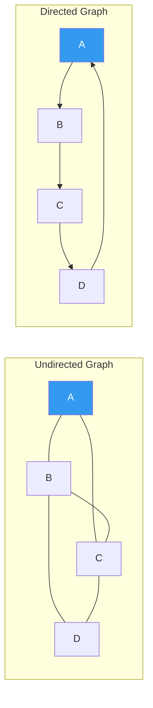
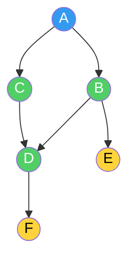
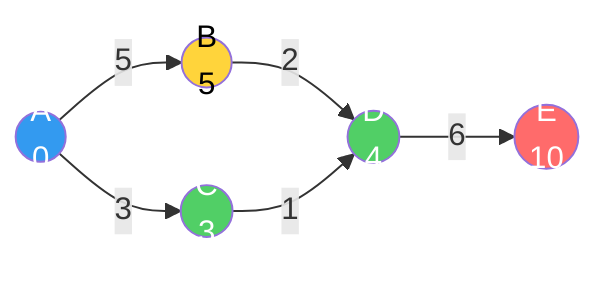
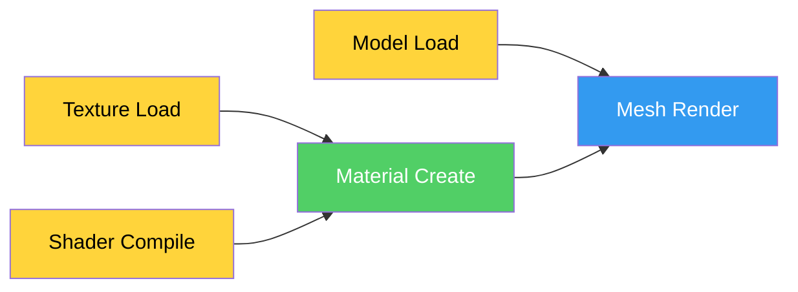
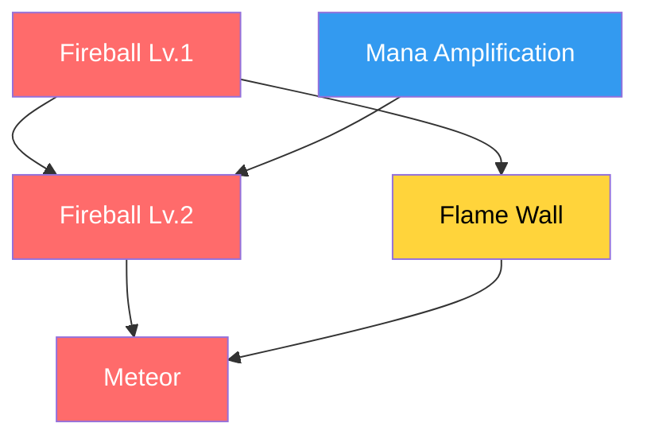
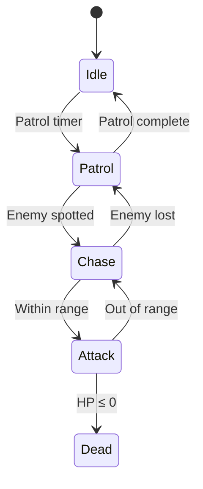

## Introduction

> This article is the 5th installment of the **CS Roadmap** series.

In [Part 4](/posts/Tree/), we saw how trees guarantee O(log n) through hierarchical structure. BSTs search while maintaining order, B-Trees minimize disk I/O, and Quadtree/Octree partition space. Trees are powerful, but they have one constraint: **they can only express unidirectional hierarchies from parent to child.** There are no cycles, and each node has exactly one parent.

Real-world relationships are more complex than this.

- You can go from city A to B, B to C, and C back to A (cycles)
- One quest can be a prerequisite for multiple quests (many-to-many relationships)
- Roads have different distances and one-way streets exist (direction and weight)

**Graphs** are the most general structure for representing these relationships. Trees are just a special case of graphs. In this article, we'll explore graph fundamentals, traversal (DFS/BFS), shortest paths (Dijkstra/A*), and topological sort — the essentials every game developer needs to know.

Upcoming series structure:

| Part | Topic | Core Question |
| --- | --- | --- |
| **Part 5 (this article)** | Graphs | What are the principles of traversal, shortest paths, and topological sort? |
| **Part 6** | Memory Management | What are the tradeoffs of stack/heap, GC, and manual memory management? |

---

## Part 1: Basic Concepts of Graphs

### What Is a Graph

A graph consists of a set V of **vertices** and a set E of **edges**.

$$G = (V, E)$$

A vertex is a "thing", and an edge is a "relationship". Cities and roads, people and friendships, web pages and links, waypoints and paths on a game map — they're all graphs.

```
Undirected Graph:          Directed Graph (Digraph):

  A --- B               A → B
  |   / |               ↑   ↓
  |  /  |               D ← C
  C --- D
```



Key terminology:

| Term | Definition |
| --- | --- |
| **Undirected Graph** | Edges have no direction. A-B means travel is possible both ways |
| **Directed Graph (Digraph)** | Edges have direction. A→B and B→A are separate |
| **Weighted Graph** | Edges have costs (weights). Distance, time, cost, etc. |
| **Degree** | Number of edges connected to a vertex. In directed graphs, distinguished as in-degree and out-degree |
| **Path** | A sequence of vertices. Each adjacent pair is connected by an edge |
| **Cycle** | A path that returns to the starting vertex |
| **Connected Graph** | A path exists between every pair of vertices |
| **DAG** | Directed Acyclic Graph. Has direction but no cycles |

### The Relationship Between Trees and Graphs

In Part 4, we defined a tree as "a connected graph with no cycles." More precisely:

> **Tree = Connected + Acyclic + Undirected Graph**

Adding one edge to a tree creates a cycle, so it's no longer a tree. Removing one edge from a tree breaks connectivity. A tree is the most economical connected form of a graph, with **n vertices and exactly n-1 edges**.

```
Tree (Part 4):           Graph (this article):
Edges = n - 1            Edges ≤ n(n-1)/2 (undirected)
No cycles                Cycles possible
One parent               No limit on incoming edges
Root exists              May have no root concept
```

### Weighted Graphs

When edges have **weights**, they can express "cost" beyond simple connectivity.

```
Weighted Directed Graph:

  A --5-→ B
  |        ↓
  3        2
  ↓        ↓
  C --1-→ D

A→B: cost 5
A→C: cost 3
B→D: cost 2
C→D: cost 1

Shortest path A→D: A→C→D (cost 4) ← shorter than A→B→D (cost 7)
```

In games, weights are interpreted in various ways:

| Game Scenario | Vertex | Edge Weight |
| --- | --- | --- |
| Pathfinding | Waypoint | Movement distance or time |
| NavMesh | Triangle center | Travel cost between triangles |
| Strategy game | Tile | Terrain movement cost (plains=1, swamp=3, mountain=5) |
| Dialogue system | Dialogue node | Affinity change |

> **Wait, let's address this**
>
> **Q. What is the maximum number of edges in a graph?**
>
> In an undirected graph, the maximum number of edges for n vertices is $\binom{n}{2} = \frac{n(n-1)}{2}$. With 100 vertices, that's up to 4,950 edges. In a directed graph, it's $n(n-1)$ — double, since both directions are separate.
>
> A graph with edges near the maximum is called a **dense graph**, while one with edges proportional to the number of vertices is called a **sparse graph**. NavMeshes, tilemaps, and road networks in games are almost always **sparse graphs** — each vertex connects to only a few neighbors.
>
> **Q. Can an edge point to itself (self-loop)?**
>
> Yes. An edge like A→A is called a self-loop. A classic example is a "stay in the same state" transition in a state machine. However, most pathfinding algorithms ignore self-loops.

---

## Part 2: Graph Representation

There are two main ways to implement a graph in code. The choice dramatically affects memory usage and operation speed.

### Adjacency Matrix

A 2D array of size $V \times V$. `matrix[i][j] = 1` means an edge exists from vertex i to j. In weighted graphs, the weight is stored instead.

```
Vertices: A(0), B(1), C(2), D(3)
Edges: A→B(5), A→C(3), B→D(2), C→D(1)

    A  B  C  D
A [ 0  5  3  0 ]
B [ 0  0  0  2 ]
C [ 0  0  0  1 ]
D [ 0  0  0  0 ]

0 = no edge, number = weight
```

```csharp
// Adjacency Matrix — Weighted Directed Graph
int[,] matrix = new int[V, V]; // V = number of vertices

// Add edge: O(1)
matrix[0, 1] = 5;  // A→B, weight 5

// Check edge existence: O(1)
bool hasEdge = matrix[0, 1] != 0;

// Traverse all neighbors of vertex A: O(V)
for (int j = 0; j < V; j++) {
    if (matrix[0, j] != 0)
        Console.WriteLine($"A → {j}, cost {matrix[0, j]}");
}
```

### Adjacency List

Each vertex stores a list of its connected neighbor vertices.

```
A: [(B, 5), (C, 3)]
B: [(D, 2)]
C: [(D, 1)]
D: []
```

```csharp
// Adjacency List — Weighted Directed Graph
List<(int to, int weight)>[] adj = new List<(int, int)>[V];
for (int i = 0; i < V; i++)
    adj[i] = new List<(int, int)>();

// Add edge: O(1)
adj[0].Add((1, 5));  // A→B, weight 5
adj[0].Add((2, 3));  // A→C, weight 3

// Traverse all neighbors of vertex A: O(degree(A))
foreach (var (to, weight) in adj[0])
    Console.WriteLine($"A → {to}, cost {weight}");
```

### Which Representation to Choose

| Property | Adjacency Matrix | Adjacency List |
| --- | --- | --- |
| Memory | $O(V^2)$ | $O(V + E)$ |
| Edge existence check | **O(1)** | O(degree) |
| Neighbor traversal | O(V) | **O(degree)** |
| Edge addition | O(1) | O(1) |
| Best suited for | Dense graphs, small V | **Sparse graphs** |

In game development, the answer is almost always **adjacency lists**.

The reason: game graphs are mostly **sparse**. NavMesh triangles have at most 3 neighbors, and tilemap tiles have 4-8 neighbors. For a NavMesh with 10,000 vertices, an adjacency matrix uses $10{,}000^2 = 100$ million cells of memory, while an adjacency list stores only about 30,000 edge entries.

From the **cache locality** perspective discussed in Part 1, adjacency lists store each vertex's neighbors in a contiguous array, making neighbor traversal cache-friendly. An adjacency matrix, on the other hand, must scan an entire row (mostly zeros), wasting cache lines.

> **Wait, let's address this**
>
> **Q. Are there really no cases where an adjacency matrix is better?**
>
> There are. For dense graphs with few vertices and many edges, an adjacency matrix is advantageous. Especially when "does an edge exist between these two vertices?" queries are frequent, O(1) lookup is powerful. All-pairs shortest path algorithms like Floyd-Warshall operate naturally on adjacency matrices. Additionally, matrices are efficient when optimizing graph operations with bitwise operations (e.g., bitmap-based transitive closure).
>
> **Q. What about hash map-based adjacency lists?**
>
> You can implement it as `Dictionary<int, List<int>>` using the hash tables from Part 3. This is useful when vertex numbers aren't contiguous or vertices are dynamically added/removed. However, there's hash overhead compared to array-based adjacency lists, so arrays are faster when vertex numbers are consecutive starting from 0.

---

## Part 3: DFS — Depth-First Search

### "Go as Deep as Possible"

Depth-First Search (DFS) is a strategy that **goes as deep as possible in one direction**, then **backtracks to try another direction** when there's nowhere left to go.

Imagine exploring a maze. At every fork, you always choose the left path. When you hit a dead end, you backtrack to the last fork and try a different direction. That's DFS.

```
Graph:
  A --- B --- E
  |     |
  C --- D --- F

DFS (starting from A): A → B → E → (backtrack) → D → F → (backtrack) → C
```



### Implementation: Recursion and Stacks

DFS directly leverages the **LIFO** property of the **stack** from [Part 2](/posts/StackQueueDeque/). Since recursive calls use the call stack, the recursive implementation is the most intuitive.

```csharp
// DFS — Recursive Implementation
bool[] visited;

void DFS(int v) {
    visited[v] = true;
    Console.Write($"{v} ");

    foreach (int next in adj[v]) {
        if (!visited[next])
            DFS(next);
    }
}
```

When recursion goes too deep, the **call stack overflow** discussed in Part 2 can occur. For graphs with many vertices, use an explicit stack:

```csharp
// DFS — Explicit Stack
void DFS_Iterative(int start) {
    var stack = new Stack<int>();
    bool[] visited = new bool[V];

    stack.Push(start);

    while (stack.Count > 0) {
        int v = stack.Pop();

        if (visited[v]) continue;
        visited[v] = true;
        Console.Write($"{v} ");

        // Push in reverse order to visit left-first
        foreach (int next in adj[v].Reverse()) {
            if (!visited[next])
                stack.Push(next);
        }
    }
}
```

### Time Complexity

Every vertex is visited once ($O(V)$), and at each vertex, adjacent edges are checked ($O(E)$):

$$T(DFS) = O(V + E)$$

With an adjacency matrix, V entries are checked at each vertex, yielding $O(V^2)$. This is why adjacency lists are advantageous for sparse graphs.

### Applications of DFS

**1. Cycle Detection**

In a directed graph, if during DFS you encounter a vertex that is **already on the current search path**, there's a cycle.

```csharp
// Directed Graph Cycle Detection
enum State { White, Gray, Black }
State[] state;

bool HasCycle(int v) {
    state[v] = State.Gray;  // Currently exploring

    foreach (int next in adj[v]) {
        if (state[next] == State.Gray)  // Already on the current path!
            return true;                // → Cycle found
        if (state[next] == State.White && HasCycle(next))
            return true;
    }

    state[v] = State.Black;  // Exploration complete
    return false;
}
```

The three-color distinction of White (unvisited) → Gray (exploring) → Black (complete) is the key. Encountering a Gray node again means "we've come back along a path currently being explored," which means there's a cycle.

Cases where cycle detection is needed in games:
- **Quest dependency validation**: If quest A → B → C → A forms a circular dependency, it can never be started
- **Resource references**: If prefab A references B and B references A, it creates an infinite loading loop
- **Skill trees**: If prerequisites form a cycle, unlocking becomes impossible

**2. Connected Components**

A single DFS visits all vertices reachable from the starting vertex. If unvisited vertices remain, the graph is **divided into multiple pieces (connected components)**.

```csharp
// Count Connected Components
int CountComponents() {
    bool[] visited = new bool[V];
    int count = 0;

    for (int v = 0; v < V; v++) {
        if (!visited[v]) {
            DFS(v);  // Visits all vertices reachable from this DFS
            count++;
        }
    }
    return count;
}
```

Game application: After map generation, verify that **all areas are connected**. If there's an isolated room the player can't reach, regenerate the map or carve an additional passage.

**3. Maze/Dungeon Generation**

DFS's "go as deep as possible" property is directly used for maze generation. The **Recursive Backtracking** algorithm:

1. Start from a starting cell
2. Randomly choose one unvisited adjacent cell
3. Remove the wall and move there
4. When hitting a dead end, backtrack and try another direction

```
Maze Generation Process (Recursive Backtracking):

Step 1:          Step 4:          Complete:
┌─┬─┬─┬─┐      ┌─┬─┬─┬─┐      ┌─────┬─┐
│S│ │ │ │      │S  →  │ │      │S      │
├─┼─┼─┼─┤      ├─┼─┼─┼─┤      ├─┐ ┌──┤
│ │ │ │ │      │ │ ↓ │ │      │ │   │ │
├─┼─┼─┼─┤      ├─┼─┼─┼─┤      │ └─┐ │ │
│ │ │ │ │      │ │ ↓  →E│      │     │E│
└─┴─┴─┴─┘      └─┴─┴─┴─┘      └─────┴─┘
                                    Long corridor characteristic
```

Mazes generated with DFS are characterized by **long corridors and few branches**. This is well-suited for games that want to evoke a sense of exploration. Conversely, BFS-based mazes have many short, uniform branches.

> **Wait, let's address this**
>
> **Q. Does DFS guarantee the shortest path?**
>
> **No.** DFS guarantees "reachability" but not that the path found is the shortest. If the shortest path is needed, use BFS (unweighted) or Dijkstra/A* (weighted).
>
> **Q. What is the relationship between DFS and the stack from Part 2?**
>
> DFS = Stack + Graph traversal. Recursive DFS uses the call stack as an implicit stack, and iterative DFS uses an explicit Stack. In Part 2, we said that a stack "processes the most recent item first" — this is exactly the same principle as DFS "exploring depth-first from the most recently discovered vertex."

---

## Part 4: BFS — Breadth-First Search

### "Visit the Closest First"

Breadth-First Search (BFS) is a strategy that visits vertices **in order of proximity** from the starting vertex. It visits all vertices at distance 1, then all at distance 2, and so on — like ripples spreading after dropping a stone in a pond.

```
BFS (starting from A):
Distance 0: A
Distance 1: B, C       ← neighbors of A
Distance 2: D, E       ← neighbors of B, C (excluding A)
Distance 3: F          ← neighbor of D

Order: A → B → C → D → E → F
```

### Implementation: Queue

BFS leverages the **FIFO** property of the **queue** from [Part 2](/posts/StackQueueDeque/). Since it processes vertices that were discovered first, it naturally visits the closest ones first.

```csharp
// BFS — Unweighted Shortest Distance
int[] BFS(int start) {
    int[] dist = new int[V];
    Array.Fill(dist, -1);
    dist[start] = 0;

    var queue = new Queue<int>();
    queue.Enqueue(start);

    while (queue.Count > 0) {
        int v = queue.Dequeue();

        foreach (int next in adj[v]) {
            if (dist[next] == -1) {       // Unvisited
                dist[next] = dist[v] + 1; // Distance = parent + 1
                queue.Enqueue(next);
            }
        }
    }

    return dist; // dist[i] = shortest distance from start to i
}
```

Time complexity is the same as DFS: $O(V + E)$.

### Key Property of BFS: Unweighted Shortest Paths

What BFS guarantees: **When all edge weights are equal, the path found by BFS is the shortest path.**

The reason: BFS processes all vertices at distance k before processing any vertex at distance k+1. Therefore, the moment you first reach a vertex is the shortest distance.

### Game Applications of BFS

**1. Tile-Based Movement Range**

In strategy games, to show "tiles this unit can reach within 3 turns," run BFS from the unit's position and collect all tiles with distance ≤ 3.

```
Movement range for a unit with movement 3 (BFS):

         [3]
      [3][2][3]
   [3][2][1][2][3]
[3][2][1][U][1][2][3]    U = unit position
   [3][2][1][2][3]       Numbers = movement cost
      [3][2][3]
         [3]
```

```csharp
// Movement Range Calculation — BFS
HashSet<Vector2Int> GetMovableArea(Vector2Int start, int moveRange) {
    var result = new HashSet<Vector2Int>();
    var dist = new Dictionary<Vector2Int, int>();
    var queue = new Queue<Vector2Int>();

    dist[start] = 0;
    queue.Enqueue(start);

    while (queue.Count > 0) {
        var pos = queue.Dequeue();

        foreach (var next in GetNeighbors(pos)) { // Up/Down/Left/Right
            int cost = GetTileCost(next);          // Terrain cost
            int newDist = dist[pos] + cost;

            if (newDist <= moveRange && !dist.ContainsKey(next)) {
                dist[next] = newDist;
                result.Add(next);
                queue.Enqueue(next);
            }
        }
    }

    return result;
}
```

> **Note:** The code above is a BFS variant since terrain costs can be greater than 1. When terrain costs vary, Dijkstra gives exact results. When all costs are 1, BFS is sufficient.

**2. Area of Effect / Blast Radius**

To find "objects affected by this explosion," run BFS from the explosion point and collect objects within distance ≤ radius. If obstacles block the explosion, skipping those tiles in BFS naturally implements the "behind walls is safe" logic.

**3. Flood Fill**

An algorithm that finds all connected cells of the same color in a 2D grid. This is the principle behind the "paint bucket" tool in drawing apps. It can be implemented with BFS or DFS, but BFS is preferred in practice because it avoids the risk of call stack overflow.

> **Wait, let's address this**
>
> **Q. When should you use DFS vs BFS?**
>
> | Requirement | DFS | BFS |
> | --- | --- | --- |
> | Reachability check | O | O |
> | **Shortest path** (unweighted) | X | **O** |
> | Cycle detection | **O** | Possible but complex |
> | Topological sort | **O** | O (Kahn's) |
> | Memory efficiency | Proportional to **path length** | Proportional to **width** |
> | Maze/map generation | **O** (long corridors) | Possible (short branches) |
>
> Key takeaway: **If you need "shortest," use BFS. If you only need "existence," DFS is simpler.**

---

## Part 5: Shortest Path Algorithms

BFS gives shortest paths when all edge weights are equal. But in the game world, it's rare for all movement costs to be the same. Forests are slow, roads are fast, and water requires swimming. We need **shortest paths in weighted graphs**.

### Dijkstra's Algorithm

Devised by Edsger W. Dijkstra in 1956, this algorithm finds the **shortest path from a single source to all vertices**.

Core idea: **Repeatedly select "the closest vertex so far" and update its neighbors' distances through that vertex.**

```
Dijkstra (starting from A):

Initial: A=0, B=∞, C=∞, D=∞, E=∞

Step 1: Select A(0) → B=5, C=3
Step 2: Select C(3) → D=3+1=4
Step 3: Select D(4) → E=4+6=10
Step 4: Select B(5) → D=min(4, 5+2)=4 (no change)
Step 5: Select E(10)

Result: A=0, B=5, C=3, D=4, E=10
```



```csharp
// Dijkstra — Using Priority Queue (Min-Heap)
int[] Dijkstra(int start) {
    int[] dist = new int[V];
    Array.Fill(dist, int.MaxValue);
    dist[start] = 0;

    // (distance, vertex) — smallest distance dequeued first
    var pq = new PriorityQueue<int, int>();
    pq.Enqueue(start, 0);

    while (pq.Count > 0) {
        int v = pq.Dequeue();

        foreach (var (next, weight) in adj[v]) {
            int newDist = dist[v] + weight;

            if (newDist < dist[next]) {
                dist[next] = newDist;
                pq.Enqueue(next, newDist);
            }
        }
    }

    return dist;
}
```

**Time complexity:** With a priority queue (binary heap), $O((V + E) \log V)$. The heap from Part 4 is used here — because the key operation is "quickly extracting the closest vertex."

**Constraint:** Dijkstra requires **no negative-weight edges**. It relies on the assumption that a finalized vertex's distance cannot later become shorter. With negative weights, Bellman-Ford algorithm must be used.

### A* Algorithm — The Standard for Game Pathfinding

Dijkstra expands the search **equally in all directions**. Even if the destination is to the east, it diligently explores westward. A* adds an **"estimated distance to the destination" (heuristic)**, prioritizing vertices in the direction of the goal.

$$f(n) = g(n) + h(n)$$

- $g(n)$: **Actual cost** from start to n (same as Dijkstra)
- $h(n)$: **Estimated cost** from n to destination (heuristic)
- $f(n)$: Total estimated cost → determines priority

```
Dijkstra vs A* Search Range:

Dijkstra (omnidirectional):     A* (focused toward goal):
. . . . . . . . .              . . . . . . . . .
. . x x x x . . .              . . . . . x . . .
. x x x x x x . .              . . . x x x x . .
. x x S x x x . .              . . x x S x x . .
. x x x x x x . .              . . x x x x G . .
. . x x x x G . .              . . . x x . . . .
. . . . . . . . .              . . . . . . . . .

S = start, G = goal, x = explored vertex
Dijkstra: 36 explored          A*: 18 explored
```

```csharp
// A* Algorithm
List<Vector2Int> AStar(Vector2Int start, Vector2Int goal) {
    var openSet = new PriorityQueue<Vector2Int, float>();
    var cameFrom = new Dictionary<Vector2Int, Vector2Int>();
    var gScore = new Dictionary<Vector2Int, float>();

    gScore[start] = 0;
    openSet.Enqueue(start, Heuristic(start, goal));

    while (openSet.Count > 0) {
        var current = openSet.Dequeue();

        if (current == goal)
            return ReconstructPath(cameFrom, current);

        foreach (var next in GetNeighbors(current)) {
            float tentativeG = gScore[current] + Cost(current, next);

            if (tentativeG < gScore.GetValueOrDefault(next, float.MaxValue)) {
                cameFrom[next] = current;
                gScore[next] = tentativeG;
                float f = tentativeG + Heuristic(next, goal);
                openSet.Enqueue(next, f);
            }
        }
    }

    return null; // No path found
}

// Heuristic: Euclidean distance or Manhattan distance
float Heuristic(Vector2Int a, Vector2Int b) {
    return Mathf.Abs(a.x - b.x) + Mathf.Abs(a.y - b.y); // Manhattan
}
```

### Choosing the Heuristic

A*'s performance and accuracy depend on the heuristic $h(n)$.

| Condition | Meaning | Result |
| --- | --- | --- |
| $h(n) = 0$ | No estimation | **Same as Dijkstra** (accurate but slow) |
| $h(n) \leq$ actual distance | **Underestimate** (admissible) | **Guarantees shortest path** + reduced search |
| $h(n) =$ actual distance | Perfect estimation | **Optimal** — only explores the shortest path |
| $h(n) >$ actual distance | **Overestimate** | Shortest path **not guaranteed**, but faster |

Commonly used heuristics in games:

| Grid Type | Heuristic | Formula |
| --- | --- | --- |
| 4-directional movement | Manhattan distance | $\|dx\| + \|dy\|$ |
| 8-directional movement | Chebyshev/Octile distance | $\max(\|dx\|, \|dy\|)$ or octile formula |
| Free movement | Euclidean distance | $\sqrt{dx^2 + dy^2}$ |

> **Wait, let's address this**
>
> **Q. Is A* always faster than Dijkstra?**
>
> When there's a single destination and a good heuristic, it's almost always faster. But if you need **shortest distances to all vertices**, you must use Dijkstra — since A* is designed for searching toward a specific destination.
>
> **Q. Do Unity/Unreal pathfinding systems use A*?**
>
> Unity's NavMesh system internally uses a variant of A*. Unreal Engine's Navigation System does the same. However, both operate on NavMesh, so the graph structure differs from grid-based A* — vertices are triangle centers (or edge midpoints), and edges are passages between adjacent triangles.
>
> **Q. Why isn't grid-based A* alone sufficient?**
>
> Grid-based A* is simple to implement, but the number of vertices explodes as the map grows. A 100x100 tilemap has 10,000 vertices, but a 1000x1000 tilemap has 1 million. NavMesh represents open spaces as a single large triangle, dramatically reducing vertex count. Narrow corridors become small triangles, wide plazas become large triangles — this is the same principle of **adaptive subdivision** as the Quadtree/Octree from Part 4.

### Jump Point Search (JPS)

An algorithm that improves upon A* for grid-based pathfinding. Proposed by Harabor & Grastien (2011), it **skips symmetric paths** on uniform-cost grids to dramatically reduce the number of explored vertices.

Core idea: When moving in a straight line through empty space, there's no need to open and close intermediate vertices one by one. Only "jump points" where direction changes are needed are explored.

```
A* search (31 vertices):        JPS search (7 vertices):
x x x x x . . . .               . . . . . . . . .
x x x x x . . . .               J . . . J . . . .
x x x x x . # . .               . . . . . . # . .
. . S x x . # G .               . . S . . . # G .
. . . x x . . . .               . . . . J . . . .
. . . . . . . . .               . . . . . . . . .

S=start, G=goal, #=wall, x=explored, J=jump point
```

JPS **only works on uniform-cost grids**, but when that condition is met, it can be more than 10x faster than A*.

---

## Part 6: Topological Sort

### DAGs and Dependencies

A **DAG (Directed Acyclic Graph)** is a graph with direction but no cycles. No cycles means there's no circular dependency like "A depends on B, B depends on C, and C depends on A again."

**Topological sort** arranges the vertices of a DAG in **dependency order**. For every edge (u, v), u comes before v.

```
DAG:
  Shader Compile → Material Create → Mesh Render
  Texture Load ↗                      ↑
  Model Load ─────────────────────────┘

Topological sort result:
[Texture Load, Shader Compile, Model Load, Material Create, Mesh Render]
```



### Kahn's Algorithm

BFS-based topological sort. Core idea: **A vertex with in-degree 0 = a vertex with no dependencies = can be processed first.**

```csharp
// Kahn's Algorithm — BFS-based Topological Sort
List<int> TopologicalSort() {
    int[] inDegree = new int[V];

    // Calculate in-degrees
    for (int v = 0; v < V; v++)
        foreach (int next in adj[v])
            inDegree[next]++;

    // Enqueue vertices with in-degree 0
    var queue = new Queue<int>();
    for (int v = 0; v < V; v++)
        if (inDegree[v] == 0)
            queue.Enqueue(v);

    var result = new List<int>();

    while (queue.Count > 0) {
        int v = queue.Dequeue();
        result.Add(v);

        foreach (int next in adj[v]) {
            inDegree[next]--;
            if (inDegree[next] == 0)  // All dependencies resolved
                queue.Enqueue(next);
        }
    }

    // If result.Count < V, a cycle exists
    return result.Count == V ? result : null;
}
```

Time complexity: $O(V + E)$. Each vertex and each edge is processed exactly once.

### DFS-Based Topological Sort

Reversing the **post-order** of DFS gives a topological sort.

```csharp
// DFS-based Topological Sort
Stack<int> order = new Stack<int>();
bool[] visited = new bool[V];

void TopoDFS(int v) {
    visited[v] = true;
    foreach (int next in adj[v])
        if (!visited[next])
            TopoDFS(next);
    order.Push(v);  // Post-order
}

// Result: Popping from order gives topological sort order
```

### Topological Sort in Games

**1. Skill Trees / Tech Trees**

RPG skill trees are DAGs. "To learn Fireball Lv.2, you need Fireball Lv.1 and Mana Amplification."



Topological sort determines "in what order can skills be learned," and DFS verifies "are all prerequisites for this skill fulfilled?"

**2. Build Systems / Resource Loading**

Game resource loading is a dependency graph. Materials depend on textures, and prefabs depend on materials and meshes. Loading in topological sort order ensures dependencies are always ready first. By replacing the queue in Kahn's algorithm with a priority queue, you can also optimize to "load large resources first" while satisfying dependencies.

**3. Render Pass Ordering**

Modern rendering pipelines (Unity URP/HDRP, Unreal's RDG) manage render pass dependencies as a DAG. Shadow maps must come before lighting, opaque passes before transparent passes, and post-processing after all rendering. Topological sort of the render graph determines the execution order.

**4. Spreadsheet Cell Computation**

In Excel or Google Sheets, if cell A1 is `=B1+C1`, then B1 and C1 must be computed first. The reference relationships between cells form a DAG, and computation follows topological sort order. Detecting circular references (cycles) and displaying an error follows the same principle.

> **Wait, let's address this**
>
> **Q. Is topological sort unique?**
>
> No. Multiple valid topological sorts can exist for the same DAG. Between vertices with no dependencies on each other, the order is flexible. This flexibility can be leveraged for **parallelization** — vertices whose in-degrees become 0 simultaneously can be processed in parallel.
>
> **Q. Why is topological sort impossible when there are cycles?**
>
> If there's a cycle A → B → C → A, then A must come before B, B before C, and C before A. No ordering can satisfy all these constraints simultaneously. In Kahn's algorithm, no vertex ever reaches in-degree 0, so the queue empties prematurely. In DFS, it's detected by re-visiting a Gray node (cycle).

---

## Part 7: Graphs in Game Development

### 1. NavMesh

The standard for NPC movement in 3D games. Walkable surfaces are represented as a **triangle mesh**, and the adjacency relationships between triangles form a graph.

```
NavMesh:
┌──────────┬──────────┐
│ △1       │    △2    │    Vertex = triangle
│          │         /│    Edge = adjacent triangle pair
│        / │       /  │
│      /   │     /    │
│    /  △3 │   / △4   │
│  /       │ /        │
└──────────┴──────────┘

Graph:
△1 — △3
│      │
△2 — △4
```

Pathfinding pipeline:

1. **NavMesh Generation**: Decompose walkable surfaces from level geometry into triangles (build time)
2. **Path Search**: Use A* to find the triangle sequence from start triangle to goal triangle
3. **Path Optimization**: Use the Funnel Algorithm to convert the zigzag path through triangle centers into a natural straight-line path

```
A* result (triangle path):      After Funnel Algorithm:
  S                               S
  │ △1 center                     │\
  │ △3 center                     │ \
  │ △4 center                     │  \
  G                               G

Triangle center zigzag          Natural straight-line
    → unnatural                     path along walls
```

### 2. State Transition Graph (FSM)

The **Finite State Machine (FSM)** mentioned in Part 4 is a graph itself. Vertices are states, and edges are transition conditions.



Understanding that FSMs are graphs matters because:
- **Reachability analysis**: Use DFS to check "can we escape the Dead state?" → If not, that's correct
- **Dead state detection**: A state (other than Dead) with no outgoing edges is a bug
- **State explosion**: As states and transitions grow, graph complexity escalates — this is why Part 4 transitioned to Behavior Trees

### 3. Quest / Dialogue Systems

Branching dialogue systems are DAGs (or general graphs).

```
Dialogue Graph:
Start → "Hello"
        ├→ "I need help" → Accept quest → ...
        ├→ "Never mind" → End
        └→ (affinity > 50) "A special story" → Secret quest → ...
```

Topological sort determines the quest chain progression order, DFS finds "all endings reachable from this choice," and BFS finds "the ending reachable with the fewest choices."

### 4. Shader Graphs / Visual Scripting

Unity Shader Graph, Unreal Material Editor, Unreal Blueprints — all these visual programming tools are **node-based DAGs**.

```
[Texture Sample] → [RGB Split] → [Multiply] → [Final Color]
                                   ↑
[Time Node] → [Sine] ─────────────┘
```

Each node has input and output ports, and connections are edges. Computation order is determined by **topological sort**. If a cycle is created, it would cause an infinite loop, so the engine performs cycle detection (DFS) at connection time and rejects circular connections.

### 5. Network Topology

The network structure of multiplayer games is also a graph:

| Topology | Graph Structure | Use Case |
| --- | --- | --- |
| Client-Server | Star graph (center=server) | Most online games |
| P2P Full Mesh | Complete graph | Small-scale competitive games |
| P2P Host | Star + some direct connections | Casual multiplayer |

---

## Part 8: Graph Algorithm Performance

### Time Complexity Summary

| Algorithm | Time Complexity | Space Complexity | Use Case |
| --- | --- | --- | --- |
| DFS | $O(V + E)$ | $O(V)$ | Reachability, cycles, connected components |
| BFS | $O(V + E)$ | $O(V)$ | Unweighted shortest paths, level-order traversal |
| Dijkstra (heap) | $O((V+E) \log V)$ | $O(V)$ | Single-source shortest path (positive weights) |
| A* | $O(b^d)$ worst case, much less in practice | $O(V)$ | Single-destination shortest path |
| Bellman-Ford | $O(VE)$ | $O(V)$ | Allows negative weights |
| Floyd-Warshall | $O(V^3)$ | $O(V^2)$ | All-pairs shortest paths |
| Topological Sort | $O(V + E)$ | $O(V)$ | DAG dependency ordering |

$b$ is the branching factor, $d$ is the depth to the solution.

### Cache Performance

The cache locality emphasized in Part 1 is important for graphs too.

**Cache issues with adjacency lists:** If each vertex's neighbor list is individually heap-allocated, cache misses can occur every time you cross between vertices. Solutions:

1. **CSR (Compressed Sparse Row) format**: Store all edges in a single contiguous array, with each vertex's start index recorded in a separate array. If the graph doesn't change after construction, this format is the most cache-friendly.

```
Vertices:  0    1    2    3
Neighbors: [1,2 | 3 | 3 | ]
offset:    [0,   2,  3,  4]

Vertex 0's neighbors: edges[0..2) = {1, 2}
Vertex 1's neighbors: edges[2..3) = {3}
Vertex 2's neighbors: edges[3..4) = {3}
```

2. **Vertex renumbering**: Renumbering vertices in BFS order makes vertices that are adjacent in the BFS traversal also close in memory, improving cache hit rates.

In games, NavMesh triangle data is optimized at build time and stored in contiguous arrays. Since the graph doesn't change at runtime, a structure similar to CSR is naturally applied.

> **Wait, let's address this**
>
> **Q. What are the most common mistakes in graph algorithms?**
>
> 1. **Missing visited check**: Running BFS/DFS without a `visited` array leads to infinite loops. Unlike trees, graphs can have cycles.
> 2. **Negative weights with Dijkstra**: Dijkstra gives incorrect results with negative edges. It's particularly dangerous because it silently produces wrong answers without errors.
> 3. **A* heuristic overestimation**: A non-admissible heuristic doesn't guarantee the shortest path. In games, an "almost-shortest path" may suffice, and intentional overestimation is sometimes used — but you must be aware of this.
>
> **Q. What graph libraries are available per programming language?**
>
> - **C#/.NET**: No graph data structure in the standard library. Implement adjacency lists yourself or use libraries like QuikGraph.
> - **C++**: Boost Graph Library (BGL) is the closest thing to a standard. However, game development often requires custom implementations for performance optimization.
> - **Python**: NetworkX is the de facto standard. Suitable for prototyping, but not used for game runtime.

---

## Conclusion: Graphs Turn Relationships Into Code

Key takeaways from this article:

1. **Graphs are the most general structure for representing "connectivity relationships"**, and trees are a special case of graphs. With just vertices and edges, you can model cities and roads, NPCs and relationships, skills and dependencies, render passes and ordering.

2. **DFS uses a stack to "go as deep as possible," BFS uses a queue to "visit the closest first"** — the stack and queue from Part 2 form the two pillars of graph traversal. DFS is the answer for cycle detection and connected components; BFS for unweighted shortest paths.

3. **Dijkstra is a greedy algorithm that repeatedly selects "the closest so far"**, and A* adds "estimated distance to destination" to focus the search. The heap (priority queue) from Part 4 is the key data structure, and it's the de facto standard for game pathfinding.

4. **Topological sort determines dependency order in DAGs**, and skill trees, build systems, render passes, and shader graph execution order are all topological sort problems. Kahn's algorithm is BFS-based, "processing items whose dependencies are all resolved first."

Dijkstra said in his 1972 Turing Award lecture:

> "The art of programming is the art of organizing complexity."

Graphs are tools for **explicitly organizing** complex relationships. The moment you make implicit relationships explicit as vertices and edges, you can immediately apply decades-proven algorithms like DFS, BFS, Dijkstra, and topological sort.

In the next installment, we'll examine **Memory Management** — the tradeoffs of stack and heap, garbage collection, and manual memory management. We'll dig into the root causes of memory leaks, frame spikes, and GC stalls in games.

---

## References

**Key Papers and Technical Documents**
- Dijkstra, E.W., "A Note on Two Problems in Connexion with Graphs", Numerische Mathematik (1959) — The original paper on Dijkstra's algorithm
- Hart, P.E., Nilsson, N.J. & Raphael, B., "A Formal Basis for the Heuristic Determination of Minimum Cost Paths", IEEE Transactions on Systems Science and Cybernetics (1968) — The original paper on the A* algorithm
- Kahn, A.B., "Topological Sorting of Large Networks", Communications of the ACM (1962) — Kahn's topological sort algorithm
- Harabor, D. & Grastien, A., "Online Graph Pruning for Pathfinding on Grid Maps", AAAI (2011) — The original paper on Jump Point Search
- Tarjan, R.E., "Depth-First Search and Linear Graph Algorithms", SIAM Journal on Computing (1972) — Foundations of DFS-based graph algorithms

**Talks and Presentations**
- Sturtevant, N., "Benchmarks for Grid-Based Pathfinding", IEEE Transactions on Computational Intelligence and AI in Games (2012) — Pathfinding benchmark standards
- Mononen, M., "Study: Navigation Mesh Generation", Game AI Developer Conference — Design philosophy of the Recast/Detour NavMesh library

**Textbooks**
- Cormen, T.H. et al., *Introduction to Algorithms (CLRS)*, MIT Press — BFS (Chapter 22.2), DFS (Chapter 22.3), Topological Sort (Chapter 22.4), Dijkstra (Chapter 24.3), Bellman-Ford (Chapter 24.1), Floyd-Warshall (Chapter 25.2)
- Knuth, D., *The Art of Computer Programming Vol. 1: Fundamental Algorithms*, Addison-Wesley — Basic concepts and representation of graphs (Chapter 2.3)
- Sedgewick, R. & Wayne, K., *Algorithms*, 4th Edition, Addison-Wesley — Undirected Graphs (Chapter 4.1), Directed Graphs (Chapter 4.2), Shortest Paths (Chapter 4.4)
- Millington, I. & Funge, J., *Artificial Intelligence for Games*, 3rd Edition, CRC Press — Game pathfinding, NavMesh, A* variants
- Ericson, C., *Real-Time Collision Detection*, Morgan Kaufmann — Spatial partitioning and graph-based search

**Implementation References**
- Recast & Detour — [github.com/recastnavigation](https://github.com/recastnavigation/recastnavigation): Industry-standard NavMesh library (open source). Both Unity and Unreal were influenced by this library
- Unity NavMesh — [docs.unity3d.com](https://docs.unity3d.com/): NavMeshAgent, NavMeshSurface API
- Unreal Navigation — [docs.unrealengine.com](https://docs.unrealengine.com/): Navigation System, NavMesh Bounds Volume
- .NET PriorityQueue — `System.Collections.Generic.PriorityQueue<TElement, TPriority>` (.NET 6+): The key data structure for Dijkstra/A*
- Boost Graph Library — [boost.org](https://www.boost.org/doc/libs/release/libs/graph/): C++ graph algorithm library
