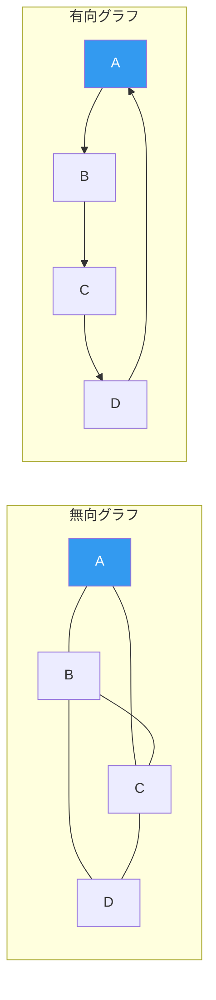
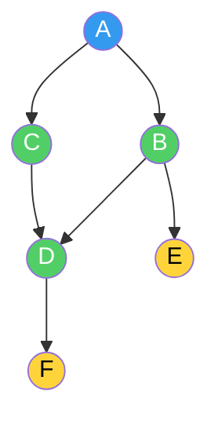
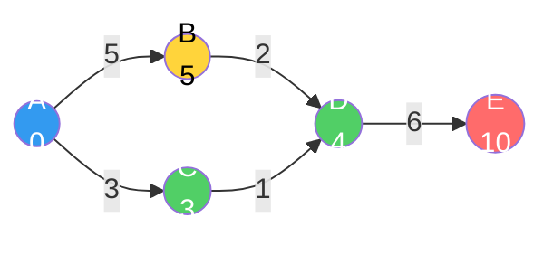
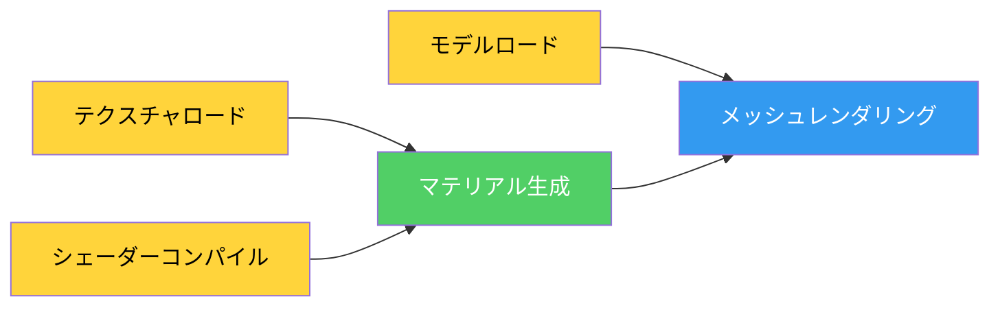
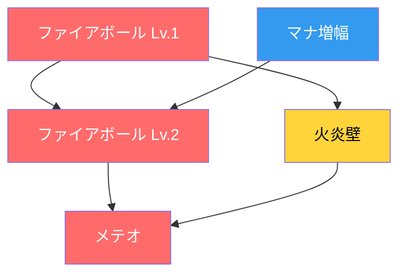
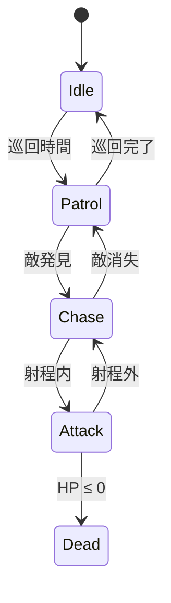

## 序論

> この文書は **CSロードマップ** シリーズの第5回です。

[第4回](/posts/Tree/)で、ツリーが階層構造でO(log n)を保証することを見た。BSTは順序を維持しながら探索し、B-TreeはディスクI/Oを最小化し、Quadtree/Octreeは空間を分割する。ツリーは強力だが、一つの制約がある：**親から子への単方向階層しか表現できない。** サイクルがなく、各ノードの親はちょうど一つだ。

現実の関係はこれより複雑だ。

- 都市AからBへ、BからCへ、Cから再びAへ行ける（サイクル）
- 一つのクエストが複数のクエストの前提条件になり得る（多対多関係）
- 道路ごとに距離が異なり、一方通行がある（方向と重み）

**グラフ（Graph）**はこうした関係を表現する最も一般的な構造だ。ツリーはグラフの特殊なケースに過ぎない。この記事では、グラフの基本概念から、探索（DFS/BFS）、最短経路（Dijkstra/A*）、トポロジカルソートまで — ゲーム開発者が知るべき核心を見ていく。

以降のシリーズ構成：

| 回 | テーマ | 核心的問い |
| --- | --- | --- |
| **第5回（今回）** | グラフ | 探索、最短経路、トポロジカルソートの原理は？ |
| **第6回** | メモリ管理 | スタック/ヒープ、GC、手動メモリ管理のトレードオフは？ |

---

## Part 1: グラフの基本概念

### グラフとは何か

グラフは**頂点（Vertex）**の集合Vと**辺（Edge）**の集合Eで構成される。

$$G = (V, E)$$

頂点は「モノ」であり、辺は「関係」だ。都市と道路、人と友人関係、Webページとリンク、ゲームマップのウェイポイントと経路 — すべてグラフだ。

```
無向グラフ:              有向グラフ(Digraph):

  A --- B               A → B
  |   / |               ↑   ↓
  |  /  |               D ← C
  C --- D
```



主要用語：

| 用語 | 定義 |
| --- | --- |
| **無向グラフ** | 辺に方向がない。A-Bなら双方向移動可能 |
| **有向グラフ（Digraph）** | 辺に方向がある。A→BとB→Aは別物 |
| **加重グラフ** | 辺にコスト（重み）がある。距離、時間、コストなど |
| **次数（Degree）** | 頂点に接続された辺の数。有向グラフでは入次数（in-degree）と出次数（out-degree）に区分 |
| **経路（Path）** | 頂点のシーケンス。各隣接頂点ペアが辺で接続 |
| **サイクル（Cycle）** | 開始頂点に戻ってくる経路 |
| **連結グラフ** | すべての頂点ペア間に経路が存在 |
| **DAG** | 有向非巡回グラフ（Directed Acyclic Graph）。方向があるがサイクルがない |

### ツリーとグラフの関係

第4回でツリーを「サイクルのない連結グラフ」と定義した。正確に言えば：

> **ツリー = 連結 + 非巡回 + 無向グラフ**

ツリーに辺を一つ追加するとサイクルが生まれ、もはやツリーではなくなる。ツリーから辺を一つ除去すると連結が切れる。ツリーは**n個の頂点とちょうどn-1個の辺**を持つ、グラフの最も経済的な連結形態だ。

```
ツリー（第4回）:        グラフ（今回）:
辺 = n - 1             辺 ≤ n(n-1)/2（無向）
サイクルなし            サイクル可能
親は一つ               入力辺の制限なし
ルートあり              ルート概念がない場合も
```

### 加重グラフ

辺に**重み（weight）**が付くと、単純な接続の有無を超えて「コスト」を表現できる。

```
加重有向グラフ:

  A --5-→ B
  |        ↓
  3        2
  ↓        ↓
  C --1-→ D

A→B: コスト5
A→C: コスト3
B→D: コスト2
C→D: コスト1

最短経路 A→D: A→C→D（コスト4） ← A→B→D（コスト7）より短い
```

ゲームにおいて重みはさまざまに解釈される：

| ゲーム状況 | 頂点 | 辺の重み |
| --- | --- | --- |
| パスファインディング | ウェイポイント | 移動距離または時間 |
| NavMesh | 三角形の中心 | 三角形間の移動コスト |
| 戦略ゲーム | タイル | 地形移動コスト（平地=1、沼=3、山=5） |
| 対話システム | 対話ノード | 好感度変化量 |

> **ちょっと待って、ここは押さえておこう**
>
> **Q. グラフの辺数は最大いくつか？**
>
> 無向グラフでn個の頂点の最大辺数は$\binom{n}{2} = \frac{n(n-1)}{2}$だ。頂点100個なら最大4,950辺。有向グラフでは$n(n-1)$ — 双方向が別々なので2倍だ。
>
> 辺が最大値に近いグラフを**密（dense）グラフ**、頂点数に比例する程度の辺しかないグラフを**疎（sparse）グラフ**と呼ぶ。ゲームのNavMesh、タイルマップ、道路ネットワークはほとんどが**疎グラフ**だ — 各頂点が少数の隣接頂点にのみ接続されている。
>
> **Q. 自分自身を指す辺（self-loop）は可能か？**
>
> 可能だ。A→Aのような辺を自己ループ（self-loop）と呼ぶ。ステートマシンで「同じ状態を維持する」遷移が代表的な例だ。ただし、ほとんどのパスファインディングアルゴリズムでは自己ループを無視する。

---

## Part 2: グラフの表現

グラフをコードで実装する方法は大きく二つだ。選択によってメモリ使用量と演算速度が劇的に変わる。

### 隣接行列（Adjacency Matrix）

$V \times V$サイズの2次元配列。`matrix[i][j] = 1`なら頂点iからjへの辺が存在する。加重グラフでは重みを格納する。

```
頂点: A(0), B(1), C(2), D(3)
辺: A→B(5), A→C(3), B→D(2), C→D(1)

    A  B  C  D
A [ 0  5  3  0 ]
B [ 0  0  0  2 ]
C [ 0  0  0  1 ]
D [ 0  0  0  0 ]

0 = 辺なし、数字 = 重み
```

```csharp
// 隣接行列 — 加重有向グラフ
int[,] matrix = new int[V, V]; // V = 頂点数

// 辺の追加: O(1)
matrix[0, 1] = 5;  // A→B, 重み5

// 辺の存在確認: O(1)
bool hasEdge = matrix[0, 1] != 0;

// 頂点Aのすべての隣接頂点探索: O(V)
for (int j = 0; j < V; j++) {
    if (matrix[0, j] != 0)
        Console.WriteLine($"A → {j}, コスト {matrix[0, j]}");
}
```

### 隣接リスト（Adjacency List）

各頂点ごとに接続された隣接頂点のリストを格納する。

```
A: [(B, 5), (C, 3)]
B: [(D, 2)]
C: [(D, 1)]
D: []
```

```csharp
// 隣接リスト — 加重有向グラフ
List<(int to, int weight)>[] adj = new List<(int, int)>[V];
for (int i = 0; i < V; i++)
    adj[i] = new List<(int, int)>();

// 辺の追加: O(1)
adj[0].Add((1, 5));  // A→B, 重み5
adj[0].Add((2, 3));  // A→C, 重み3

// 頂点Aのすべての隣接頂点探索: O(degree(A))
foreach (var (to, weight) in adj[0])
    Console.WriteLine($"A → {to}, コスト {weight}");
```

### どの表現を選ぶか

| 特性 | 隣接行列 | 隣接リスト |
| --- | --- | --- |
| メモリ | $O(V^2)$ | $O(V + E)$ |
| 辺の存在確認 | **O(1)** | O(degree) |
| 隣接頂点走査 | O(V) | **O(degree)** |
| 辺の追加 | O(1) | O(1) |
| 適するケース | 密グラフ、Vが小さい場合 | **疎グラフ** |

ゲーム開発ではほぼ常に**隣接リスト**が答えだ。

理由：ゲームのグラフはほとんどが**疎**だ。NavMeshの三角形は最大3つの隣接頂点を持ち、タイルマップのタイルは4〜8つの隣接頂点を持つ。頂点が10,000個のNavMeshで隣接行列は$10{,}000^2 = 1億$セルのメモリを使うが、隣接リストは約30,000個の辺情報のみを格納する。

第1回で見た**キャッシュ局所性**の観点からも、隣接リストは各頂点の隣接頂点を連続した配列に格納するため、隣接頂点走査時にキャッシュフレンドリーだ。一方、隣接行列は行全体（ほとんど0）をスキャンする必要があるため、キャッシュラインを無駄にする。

> **ちょっと待って、ここは押さえておこう**
>
> **Q. 隣接行列が有利なケースは本当にないのか？**
>
> ある。頂点数が少なく辺が多い場合（密グラフ）では隣接行列が有利だ。特に「二つの頂点間に辺があるか？」という問い合わせが頻繁であればO(1)参照が強力だ。Floyd-Warshallのような全ペア最短経路アルゴリズムは隣接行列で自然に動作する。また、ビット単位演算でグラフ操作を最適化する場合（例：ビットマップベースの推移的閉包）も行列が効率的だ。
>
> **Q. ハッシュマップベースの隣接リストは？**
>
> 第3回で見たハッシュテーブルを利用して`Dictionary<int, List<int>>`で実装することもできる。頂点番号が連続でなかったり、動的に追加・削除される場合に有用だ。ただし、配列ベースの隣接リストに比べてハッシュオーバーヘッドがあるため、頂点番号が0から連続の場合は配列の方が速い。

---

## Part 3: DFS — 深さ優先探索

### 「最後まで行ってみる」

深さ優先探索（Depth-First Search, DFS）は、一方向に**行けるところまで深く入り込んだ後**、もう行く場所がなければ**引き返して別の方向**を試す戦略だ。

迷路を探検すると想像しよう。分かれ道では常に左を選ぶ。行き止まりに到達したら、最後の分かれ道に戻って別の方向を試す。これがDFSだ。

```
グラフ:
  A --- B --- E
  |     |
  C --- D --- F

DFS（A開始）: A → B → E →（引き返す）→ D → F →（引き返す）→ C
```



### 実装：再帰とスタック

DFSは[第2回](/posts/StackQueueDeque/)で見た**スタック**のLIFO特性をそのまま活用する。再帰呼び出し自体がコールスタックを使用するため、再帰実装が最も直感的だ。

```csharp
// DFS — 再帰実装
bool[] visited;

void DFS(int v) {
    visited[v] = true;
    Console.Write($"{v} ");

    foreach (int next in adj[v]) {
        if (!visited[next])
            DFS(next);
    }
}
```

再帰が深くなると第2回で見た**コールスタックオーバーフロー**が発生し得る。頂点数が多いグラフでは明示的スタックを使用する：

```csharp
// DFS — 明示的スタック
void DFS_Iterative(int start) {
    var stack = new Stack<int>();
    bool[] visited = new bool[V];

    stack.Push(start);

    while (stack.Count > 0) {
        int v = stack.Pop();

        if (visited[v]) continue;
        visited[v] = true;
        Console.Write($"{v} ");

        // 逆順に入れないと左から訪問にならない
        foreach (int next in adj[v].Reverse()) {
            if (!visited[next])
                stack.Push(next);
        }
    }
}
```

### 時間計算量

すべての頂点を一度ずつ訪問し（$O(V)$）、各頂点で隣接辺を確認する（$O(E)$）：

$$T(DFS) = O(V + E)$$

隣接行列を使用すると各頂点でV個を確認するため$O(V^2)$。これが疎グラフで隣接リストが有利な理由だ。

### DFSの応用

**1. サイクル検出**

有向グラフでDFS中にすでに**現在の探索パス上にある**頂点に再び出会えばサイクルだ。

```csharp
// 有向グラフのサイクル検出
enum State { White, Gray, Black }
State[] state;

bool HasCycle(int v) {
    state[v] = State.Gray;  // 探索中

    foreach (int next in adj[v]) {
        if (state[next] == State.Gray)  // 現在のパスに既にある！
            return true;                // → サイクル発見
        if (state[next] == State.White && HasCycle(next))
            return true;
    }

    state[v] = State.Black;  // 探索完了
    return false;
}
```

White（未訪問）→ Gray（探索中）→ Black（探索完了）の三色区分が核心だ。Grayノードに再び出会えば「探索中のパスで戻ってきた」という意味なのでサイクルだ。

ゲームでサイクル検出が必要なケース：
- **クエスト依存性検証**: クエストA → B → C → Aのような循環依存があると永遠に開始できない
- **リソース参照**: プレハブAがBを参照し、BがAを参照するとローディング無限ループ
- **スキルツリー**: 前提条件が循環するとアンロック不可能

**2. 連結成分（Connected Component）**

DFS一回で開始頂点から到達可能なすべての頂点を訪問する。訪問できなかった頂点が残っていれば、グラフが**複数の断片（連結成分）**に分かれているということだ。

```csharp
// 連結成分の数を数える
int CountComponents() {
    bool[] visited = new bool[V];
    int count = 0;

    for (int v = 0; v < V; v++) {
        if (!visited[v]) {
            DFS(v);  // このDFSが到達するすべての頂点を訪問
            count++;
        }
    }
    return count;
}
```

ゲームでの活用：マップ生成後に**すべてのエリアが接続されているか**確認。プレイヤーが到達できない孤立した部屋があればマップを再生成するか追加通路を開ける。

**3. 迷路/ダンジョン生成**

DFSの「最後まで行ってみる」性質は迷路生成に直接活用される。**再帰的バックトラッキング（Recursive Backtracking）**アルゴリズム：

1. 開始セルから出発
2. 未訪問の隣接セルからランダムに一つ選択
3. 壁を壊して移動
4. 行き止まりに到達したら引き返して別の方向を試す

```
迷路生成過程（再帰的バックトラッキング）:

段階1:          段階4:          完成:
┌─┬─┬─┬─┐      ┌─┬─┬─┬─┐      ┌─────┬─┐
│S│ │ │ │      │S  →  │ │      │S      │
├─┼─┼─┼─┤      ├─┼─┼─┼─┤      ├─┐ ┌──┤
│ │ │ │ │      │ │ ↓ │ │      │ │   │ │
├─┼─┼─┼─┤      ├─┼─┼─┼─┤      │ └─┐ │ │
│ │ │ │ │      │ │ ↓  →E│      │     │E│
└─┴─┴─┴─┘      └─┴─┴─┴─┘      └─────┴─┘
                                    長い通路が特徴
```

DFSで生成された迷路は**長い廊下と少ない分岐**が特徴だ。ゲームで「探検感」を出したいときに適している。逆にBFSベースの迷路は短く均一な枝が多い。

> **ちょっと待って、ここは押さえておこう**
>
> **Q. DFSは最短経路を保証するか？**
>
> **しない。** DFSは「到達可能性」は保証するが、見つけた経路が最短である保証はない。最短経路が必要ならBFS（無加重）またはDijkstra/A*（加重）を使用する必要がある。
>
> **Q. DFSと第2回のスタックはどんな関係か？**
>
> DFS = スタック + グラフ走査。再帰的DFSはコールスタックが暗黙的スタックの役割を果たし、反復的DFSは明示的Stackを使用する。第2回でスタックが「最も最近のものを先に処理する」と述べた — DFSが「最も最近に発見した頂点から深く探索する」のとまったく同じ原理だ。

---

## Part 4: BFS — 幅優先探索

### 「近い所から見る」

幅優先探索（Breadth-First Search, BFS）は、開始頂点から**近い頂点から**順番に訪問する戦略だ。距離1の頂点をすべて訪問し、距離2の頂点をすべて訪問し、…まるで池に石を投げたときに波紋が広がるようなものだ。

```
BFS（A開始）:
距離0: A
距離1: B, C       ← Aの隣接頂点
距離2: D, E       ← B, Cの隣接頂点（A除外）
距離3: F          ← Dの隣接頂点

順序: A → B → C → D → E → F
```

### 実装：キュー

BFSは[第2回](/posts/StackQueueDeque/)で見た**キュー**のFIFO特性を活用する。先に発見した頂点を先に処理するので、自然と近い所から訪問する。

```csharp
// BFS — 無加重最短距離
int[] BFS(int start) {
    int[] dist = new int[V];
    Array.Fill(dist, -1);
    dist[start] = 0;

    var queue = new Queue<int>();
    queue.Enqueue(start);

    while (queue.Count > 0) {
        int v = queue.Dequeue();

        foreach (int next in adj[v]) {
            if (dist[next] == -1) {       // 未訪問
                dist[next] = dist[v] + 1; // 距離 = 親 + 1
                queue.Enqueue(next);
            }
        }
    }

    return dist; // dist[i] = startからiまでの最短距離
}
```

時間計算量はDFSと同一だ：$O(V + E)$。

### BFSの核心的性質：無加重最短経路

BFSが保証すること：**辺の重みがすべて同じとき、BFSが見つける経路は最短経路だ。**

理由：BFSは開始点から距離kの頂点をすべて処理した後にはじめて距離k+1の頂点を処理する。したがって、ある頂点に初めて到達する瞬間がすなわち最短距離だ。

### BFSのゲーム応用

**1. タイルベースの移動範囲**

戦略ゲームで「このユニットが3ターン以内に行けるタイル」を表示するには、ユニット位置からBFSを実行して距離 ≤ 3のタイルをすべて収集すればよい。

```
移動力3のユニットの移動範囲（BFS）:

         [3]
      [3][2][3]
   [3][2][1][2][3]
[3][2][1][U][1][2][3]    U = ユニット位置
   [3][2][1][2][3]       数字 = 移動コスト
      [3][2][3]
         [3]
```

```csharp
// 移動範囲計算 — BFS
HashSet<Vector2Int> GetMovableArea(Vector2Int start, int moveRange) {
    var result = new HashSet<Vector2Int>();
    var dist = new Dictionary<Vector2Int, int>();
    var queue = new Queue<Vector2Int>();

    dist[start] = 0;
    queue.Enqueue(start);

    while (queue.Count > 0) {
        var pos = queue.Dequeue();

        foreach (var next in GetNeighbors(pos)) { // 上下左右
            int cost = GetTileCost(next);          // 地形コスト
            int newDist = dist[pos] + cost;

            if (newDist <= moveRange && !dist.ContainsKey(next)) {
                dist[next] = newDist;
                result.Add(next);
                queue.Enqueue(next);
            }
        }
    }

    return result;
}
```

> **注意:** 上記のコードは地形コストが1より大きい場合があるため、純粋なBFSではなく変形版だ。地形コストが多様ならDijkstraが正確だ。コストがすべて1ならBFSで十分だ。

**2. 影響範囲 / 爆発半径**

「この爆発の影響を受けるオブジェクト」を見つけるには、爆発地点からBFSを実行して距離 ≤ 半径のオブジェクトを収集する。障害物が爆発を遮断する場合、BFSでそのタイルをスキップすれば自然と「壁の後ろは安全」ロジックが実装される。

**3. フラッドフィル（Flood Fill）**

2Dグリッドで同じ色の連結領域をすべて見つけるアルゴリズム。ペイントツールの「バケツ」ツールの原理だ。BFSまたはDFSで実装できるが、BFSはコールスタックオーバーフローのリスクがないため実務で好まれる。

> **ちょっと待って、ここは押さえておこう**
>
> **Q. DFSとBFSはいつ使い分けるべきか？**
>
> | 必要なこと | DFS | BFS |
> | --- | --- | --- |
> | 到達可能性確認 | O | O |
> | **最短経路**（無加重） | X | **O** |
> | サイクル検出 | **O** | 可能だが複雑 |
> | トポロジカルソート | **O** | O（Kahn's） |
> | メモリ効率 | **パスの長さ**に比例 | **幅**に比例 |
> | 迷路/マップ生成 | **O**（長い廊下） | 可能（短い枝） |
>
> 核心：**「最短」が必要ならBFS、「存在の有無」だけならDFS**がよりシンプルだ。

---

## Part 5: 最短経路アルゴリズム

BFSは辺の重みがすべて同じとき最短経路を与える。しかし、ゲーム世界ですべての移動コストが同じことは稀だ。森は遅く、道路は速く、水は泳がなければならない。**加重グラフでの最短経路**が必要だ。

### Dijkstraアルゴリズム

Edsger W. Dijkstraが1956年に考案したこのアルゴリズムは、単一始点から**すべての頂点までの最短経路**を求める。

核心アイデア：**「今まで最も近い頂点」を繰り返し選択し、その頂点を通じて隣接頂点の距離を更新する。**

```
Dijkstra（A開始）:

初期:  A=0, B=∞, C=∞, D=∞, E=∞

段階1: A(0) 選択 → B=5, C=3
段階2: C(3) 選択 → D=3+1=4
段階3: D(4) 選択 → E=4+6=10
段階4: B(5) 選択 → D=min(4, 5+2)=4（変化なし）
段階5: E(10) 選択

結果: A=0, B=5, C=3, D=4, E=10
```



```csharp
// Dijkstra — 優先度キュー（最小ヒープ）使用
int[] Dijkstra(int start) {
    int[] dist = new int[V];
    Array.Fill(dist, int.MaxValue);
    dist[start] = 0;

    // (距離, 頂点) — 距離が小さいものが先に出る
    var pq = new PriorityQueue<int, int>();
    pq.Enqueue(start, 0);

    while (pq.Count > 0) {
        int v = pq.Dequeue();

        foreach (var (next, weight) in adj[v]) {
            int newDist = dist[v] + weight;

            if (newDist < dist[next]) {
                dist[next] = newDist;
                pq.Enqueue(next, newDist);
            }
        }
    }

    return dist;
}
```

**時間計算量:** 優先度キュー（二分ヒープ）を使用すると$O((V + E) \log V)$。第4回で見たヒープがここで使われる — 「最も近い頂点を素早く取り出す」操作が核心だからだ。

**制約:** Dijkstraは**負の重みの辺がない**場合にのみ動作する。すでに確定した頂点の距離が後でさらに短くなることはないという仮定に基づくためだ。負の重みがある場合はBellman-Fordアルゴリズムを使用する必要がある。

### A*アルゴリズム — ゲームパスファインディングの標準

Dijkstraは**すべての方向に均等に**探索を拡張する。目的地が東にあっても西を一生懸命探索する。A*はここに**「目的地までの推定距離」（ヒューリスティック）**を加え、目的地方向の頂点を優先的に探索する。

$$f(n) = g(n) + h(n)$$

- $g(n)$: 始点からnまでの**実際のコスト**（Dijkstraと同じ）
- $h(n)$: nから目的地までの**推定コスト**（ヒューリスティック）
- $f(n)$: 総予想コスト → これで優先順位を決定

```
Dijkstra vs A* 探索範囲:

Dijkstra（全方位探索）:     A*（目標方向に集中）:
. . . . . . . . .          . . . . . . . . .
. . x x x x . . .          . . . . . x . . .
. x x x x x x . .          . . . x x x x . .
. x x S x x x . .          . . x x S x x . .
. x x x x x x . .          . . x x x x G . .
. . x x x x G . .          . . . x x . . . .
. . . . . . . . .          . . . . . . . . .

S = 開始, G = 目標, x = 探索した頂点
Dijkstra: 36個探索          A*: 18個探索
```

```csharp
// A*アルゴリズム
List<Vector2Int> AStar(Vector2Int start, Vector2Int goal) {
    var openSet = new PriorityQueue<Vector2Int, float>();
    var cameFrom = new Dictionary<Vector2Int, Vector2Int>();
    var gScore = new Dictionary<Vector2Int, float>();

    gScore[start] = 0;
    openSet.Enqueue(start, Heuristic(start, goal));

    while (openSet.Count > 0) {
        var current = openSet.Dequeue();

        if (current == goal)
            return ReconstructPath(cameFrom, current);

        foreach (var next in GetNeighbors(current)) {
            float tentativeG = gScore[current] + Cost(current, next);

            if (tentativeG < gScore.GetValueOrDefault(next, float.MaxValue)) {
                cameFrom[next] = current;
                gScore[next] = tentativeG;
                float f = tentativeG + Heuristic(next, goal);
                openSet.Enqueue(next, f);
            }
        }
    }

    return null; // 経路なし
}

// ヒューリスティック：ユークリッド距離またはマンハッタン距離
float Heuristic(Vector2Int a, Vector2Int b) {
    return Mathf.Abs(a.x - b.x) + Mathf.Abs(a.y - b.y); // マンハッタン
}
```

### ヒューリスティックの選択

A*の性能と正確性はヒューリスティック$h(n)$にかかっている。

| 条件 | 意味 | 結果 |
| --- | --- | --- |
| $h(n) = 0$ | 推定をしない | **Dijkstraと同一**（正確だが遅い） |
| $h(n) \leq$ 実際の距離 | **過小推定**（admissible） | **最短経路保証** + 探索縮小 |
| $h(n) =$ 実際の距離 | 完璧な推定 | **最適** — 最短経路のみ探索 |
| $h(n) >$ 実際の距離 | **過大推定** | 最短経路**非保証**、より高速 |

ゲームでよく使われるヒューリスティック：

| グリッドタイプ | ヒューリスティック | 数式 |
| --- | --- | --- |
| 4方向移動 | マンハッタン距離 | $\|dx\| + \|dy\|$ |
| 8方向移動 | チェビシェフ/オクタイル距離 | $\max(\|dx\|, \|dy\|)$ またはオクタイル公式 |
| 自由移動 | ユークリッド距離 | $\sqrt{dx^2 + dy^2}$ |

> **ちょっと待って、ここは押さえておこう**
>
> **Q. A*はDijkstraより常に速いのか？**
>
> 目的地が一つで良いヒューリスティックがある場合はほぼ常に速い。しかし**すべての頂点までの最短距離**が必要ならDijkstraを使う必要がある — A*は特定の目的地に向けた探索だからだ。
>
> **Q. Unity/Unrealのパスファインディングはa*を使用しているのか？**
>
> UnityのNavMeshシステムは内部的にA*の変形を使用している。Unreal EngineのNavigation Systemも同様だ。ただし、どちらもNavMesh上で動作するため、グリッドベースA*とはグラフ構造が異なる — 頂点が三角形の中心（または辺の中点）であり、辺が隣接三角形間の通路だ。
>
> **Q. なぜグリッドベースA*だけでは不十分なのか？**
>
> グリッドベースA*は実装が単純だが、マップが大きくなると頂点数が爆発的に増加する。100x100タイルマップは10,000頂点だが、1000x1000なら100万個だ。NavMeshは開けた空間を大きな三角形一つで表現するため頂点数が劇的に減少する。狭い通路は小さな三角形、広い広場は大きな三角形 — これは第4回で見たQuadtree/Octreeの**適応的分割**と同じ原理だ。

### Jump Point Search (JPS)

グリッドベースのパスファインディングでA*を改良したアルゴリズムだ。Harabor & Grastien（2011）が提案し、均一コストグリッドで**対称経路をスキップして**探索頂点数を劇的に削減する。

核心アイデア：空きスペースで直線移動する際、中間頂点をいちいちオープン・クローズする必要がない。方向転換が必要な「ジャンプポイント」のみ探索する。

```
A* 探索（31個の頂点）:        JPS 探索（7個の頂点）:
x x x x x . . . .           . . . . . . . . .
x x x x x . . . .           J . . . J . . . .
x x x x x . # . .           . . . . . . # . .
. . S x x . # G .           . . S . . . # G .
. . . x x . . . .           . . . . J . . . .
. . . . . . . . .           . . . . . . . . .

S=開始, G=目標, #=壁, x=探索, J=ジャンプポイント
```

JPSは**均一コストグリッドでのみ**動作するが、その条件が合えばA*対比10倍以上速くなり得る。

---

## Part 6: トポロジカルソート

### DAGと依存関係

**DAG（Directed Acyclic Graph）**は方向があるがサイクルのないグラフだ。サイクルがないということは「AがBに依存し、BがCに依存し、Cが再びAに依存する」循環依存がないということだ。

**トポロジカルソート（Topological Sort）**はDAGの頂点を**依存関係の順序**に並べることだ。すべての辺(u, v)についてuがvより先に来る。

```
DAG:
  シェーダーコンパイル → マテリアル生成 → メッシュレンダリング
  テクスチャロード ↗                    ↑
  モデルロード ─────────────────────────┘

トポロジカルソート結果:
[テクスチャロード, シェーダーコンパイル, モデルロード, マテリアル生成, メッシュレンダリング]
```



### Kahnのアルゴリズム

BFSベースのトポロジカルソート。核心アイデア：**入次数（in-degree）が0の頂点 = 依存するものがない頂点 = 先に処理可能**。

```csharp
// Kahnのアルゴリズム — BFSベースのトポロジカルソート
List<int> TopologicalSort() {
    int[] inDegree = new int[V];

    // 入次数を計算
    for (int v = 0; v < V; v++)
        foreach (int next in adj[v])
            inDegree[next]++;

    // 入次数0の頂点をキューに挿入
    var queue = new Queue<int>();
    for (int v = 0; v < V; v++)
        if (inDegree[v] == 0)
            queue.Enqueue(v);

    var result = new List<int>();

    while (queue.Count > 0) {
        int v = queue.Dequeue();
        result.Add(v);

        foreach (int next in adj[v]) {
            inDegree[next]--;
            if (inDegree[next] == 0)  // 依存関係がすべて解決された
                queue.Enqueue(next);
        }
    }

    // result.Count < Vならサイクルが存在
    return result.Count == V ? result : null;
}
```

時間計算量：$O(V + E)$。各頂点と各辺をちょうど一回ずつ処理する。

### DFSベースのトポロジカルソート

DFSの**後順序（post-order）**を逆順に反転するとトポロジカルソートになる。

```csharp
// DFSベースのトポロジカルソート
Stack<int> order = new Stack<int>();
bool[] visited = new bool[V];

void TopoDFS(int v) {
    visited[v] = true;
    foreach (int next in adj[v])
        if (!visited[next])
            TopoDFS(next);
    order.Push(v);  // 後順序
}

// 結果: orderをPopするとトポロジカルソート順序
```

### ゲームでのトポロジカルソート

**1. テクノロジーツリー / スキルツリー**

RPGのスキルツリーはDAGだ。「ファイアボールLv.2を習得するにはファイアボールLv.1とマナ増幅が必要だ。」



トポロジカルソートで「どの順序でスキルを習得できるか」を決定し、DFSで「このスキルのすべての前提条件が満たされているか」を確認する。

**2. ビルドシステム / リソースロード**

ゲームのリソースロードは依存関係グラフだ。マテリアルはテクスチャに依存し、プレハブはマテリアルとメッシュに依存する。トポロジカルソート順序でロードすれば依存関係が常に先に準備される。Kahnのアルゴリズムでキューを優先度キューに変えれば、依存関係を満たしつつ「大きなリソースを先にロード」する最適化も可能だ。

**3. レンダーパス順序**

現代のレンダリングパイプライン（Unity URP/HDRP、UnrealのRDG）はレンダーパスの依存関係をDAGで管理する。シャドウマップはライティングの前に、不透明パスは半透明の前に、ポストプロセシングはすべてのレンダリングの後に実行されなければならない。レンダーグラフのトポロジカルソートが実行順序を決定する。

**4. スプレッドシートのセル計算**

ExcelやGoogle Sheetsでセルa1が`=B1+C1`なら、B1とC1が先に計算されなければならない。セル間の参照関係はDAGであり、トポロジカルソート順序で計算する。循環参照が見つかったら（サイクル）エラーを表示するのも同じ原理だ。

> **ちょっと待って、ここは押さえておこう**
>
> **Q. トポロジカルソートは一意か？**
>
> いいえ。同一のDAGでも複数の有効なトポロジカルソートが存在し得る。依存関係のない頂点間では順序が自由だからだ。この自由度は**並列化**に活用できる — 入次数が同時に0になる頂点は並列に処理できる。
>
> **Q. サイクルがあるとトポロジカルソートが不可能な理由は？**
>
> A → B → C → Aのサイクルがあると、AはBより前に来なければならず、BはCより前に来なければならず、CはAより前に来なければならない。これを同時に満たす順序は存在しない。Kahnのアルゴリズムでは入次数が0になる頂点がなくなってキューが空になり、DFSではGrayノード再訪問（サイクル）として検出される。

---

## Part 7: ゲーム開発におけるグラフ

### 1. NavMesh

3DゲームでのNPC移動の標準。歩行可能な表面を**三角形メッシュ**で表現し、三角形の隣接関係がグラフを形成する。

```
NavMesh:
┌──────────┬──────────┐
│ △1       │    △2    │    頂点 = 三角形
│          │         /│    辺 = 隣接する三角形ペア
│        / │       /  │
│      /   │     /    │
│    /  △3 │   / △4   │
│  /       │ /        │
└──────────┴──────────┘

グラフ:
△1 — △3
│      │
△2 — △4
```

パスファインディングパイプライン：

1. **NavMesh生成**: レベルジオメトリから歩行可能な表面を三角形に分解（ビルドタイム）
2. **経路検索**: A*で開始三角形から目標三角形までの三角形シーケンスを求める
3. **経路最適化**: Funnel Algorithm（簡易ファネルアルゴリズム）で三角形中心をつなぐ経路を自然な直線経路に変換

```
A* 結果（三角形経路）:      Funnel Algorithm後:
  S                           S
  │ △1 中心                   │\
  │ △3 中心                   │ \
  │ △4 中心                   │  \
  G                           G

三角形中心をジグザグ        壁に沿って自然な
    → 不自然               直線経路
```

### 2. 状態遷移グラフ（FSM）

第4回で言及した**有限状態マシン（Finite State Machine）**はグラフそのものだ。頂点が状態、辺が遷移条件だ。



FSMがグラフであるという認識が重要な理由：
- **到達可能性分析**: DFSで「Dead状態から抜け出せるか？」確認 → できなければ正常
- **デッド状態検出**: 出力辺のない状態（Dead以外）があればバグ
- **状態爆発**: 状態と遷移が増えるとグラフの複雑度が急増 → これが第4回でBehavior Treeに移行した理由

### 3. クエスト / 対話システム

分岐型対話システムはDAG（または一般グラフ）だ。

```
対話グラフ:
開始 → "こんにちは"
        ├→ "助けが必要です" → クエスト受諾 → ...
        ├→ "何でもないです" → 終了
        └→ (好感度 > 50) "特別な話" → 秘密クエスト → ...
```

トポロジカルソートはクエストチェーンの進行順序を、DFSは「この選択肢から到達可能なすべての結末」を、BFSは「最小限の選択で到達可能な結末」を求める。

### 4. シェーダーグラフ / ビジュアルスクリプティング

Unity Shader Graph、Unreal Material Editor、Unreal Blueprints — これらすべてのビジュアルプログラミングツールは**ノードベースのDAG**だ。

```
[テクスチャサンプル] → [RGB分離] → [乗算] → [最終カラー]
                              ↑
[時間ノード] → [サイン] ─────────┘
```

各ノードは入力と出力ポートを持ち、接続線が辺だ。計算順序は**トポロジカルソート**で決定される。サイクルが生じると無限ループなので、エンジンは接続時にサイクル検出（DFS）を実行して循環接続を拒否する。

### 5. ネットワークトポロジー

マルチプレイヤーゲームのネットワーク構造もグラフだ：

| トポロジー | グラフ構造 | 使用ケース |
| --- | --- | --- |
| クライアント-サーバー | スターグラフ（中心=サーバー） | ほとんどのオンラインゲーム |
| P2Pフルメッシュ | 完全グラフ | 小規模対戦ゲーム |
| P2Pホスト | スター + 一部直接接続 | カジュアルマルチプレイ |

---

## Part 8: グラフアルゴリズムの性能

### 時間計算量まとめ

| アルゴリズム | 時間計算量 | 空間計算量 | 用途 |
| --- | --- | --- | --- |
| DFS | $O(V + E)$ | $O(V)$ | 到達可能性、サイクル、連結成分 |
| BFS | $O(V + E)$ | $O(V)$ | 無加重最短経路、レベル走査 |
| Dijkstra（ヒープ） | $O((V+E) \log V)$ | $O(V)$ | 単一始点最短経路（正の重み） |
| A* | $O(b^d)$ 最悪、実戦ではもっと少ない | $O(V)$ | 単一目的地最短経路 |
| Bellman-Ford | $O(VE)$ | $O(V)$ | 負の重み許容 |
| Floyd-Warshall | $O(V^3)$ | $O(V^2)$ | 全ペア最短経路 |
| トポロジカルソート | $O(V + E)$ | $O(V)$ | DAG依存関係順序 |

$b$は分岐係数（branching factor）、$d$は解までの深さ。

### キャッシュ性能

第1回で強調したキャッシュ局所性はグラフでも重要だ。

**隣接リストのキャッシュ問題:** 各頂点の隣接リストがヒープに個別割り当てされると、頂点をまたぐたびにキャッシュミスが発生し得る。解決方法：

1. **CSR（Compressed Sparse Row）形式**: すべての辺を一つの連続配列に格納し、各頂点の開始インデックスを別の配列に記録。グラフが構築後に変わらなければこの形式がキャッシュに最適だ。

```
頂点:   0    1    2    3
隣接:   [1,2 | 3 | 3 | ]
offset: [0,   2,  3,  4]

頂点0の隣接: edges[0..2) = {1, 2}
頂点1の隣接: edges[2..3) = {3}
頂点2の隣接: edges[3..4) = {3}
```

2. **頂点番号の再配置**: BFS順序で頂点に番号を振り直すと、BFS探索時に隣接する頂点がメモリ上でも近くなり、キャッシュヒット率が上がる。

ゲームでNavMeshの三角形データはビルド時に最適化されて連続配列に格納される。ランタイムにグラフが変わらないためCSRと類似した構造が自然に適用される。

> **ちょっと待って、ここは押さえておこう**
>
> **Q. グラフアルゴリズムで最もよくある間違いは？**
>
> 1. **訪問チェック漏れ**: `visited`配列なしでBFS/DFSを実行すると無限ループに陥る。ツリーと違いグラフにはサイクルがあるためだ。
> 2. **Dijkstraに負の重み**: 負の辺があるとDijkstraの結果が間違う。エラーなく誤った答えを返すのでより危険だ。
> 3. **A*ヒューリスティックの過大推定**: admissibleでないヒューリスティックは最短経路を保証しない。ゲームで「ほぼ最短経路」で十分なら意図的に過大推定することもあるが、これを認識している必要がある。
>
> **Q. プログラミング言語別のグラフライブラリは？**
>
> - **C#/.NET**: 標準ライブラリにグラフデータ構造がない。自前で隣接リストを実装するかQuikGraphのようなライブラリを使用する。
> - **C++**: Boost Graph Library（BGL）が標準に近い。しかしゲーム開発では性能最適化のため自前実装するケースが多い。
> - **Python**: NetworkXが事実上の標準だ。プロトタイピングに適しているが、ゲームランタイムには使わない。

---

## まとめ：グラフは関係をコードにする

この記事で見てきた核心：

1. **グラフは「接続関係」を表現する最も一般的な構造**であり、ツリーはグラフの特殊なケースだ。頂点と辺だけで、都市と道路、NPCと関係、スキルと依存関係、レンダーパスと順序をすべてモデリングできる。

2. **DFSはスタックで「最後まで行ってみる」、BFSはキューで「近い所から見る」** — 第2回で見たスタックとキューがグラフ探索の二つの軸を成す。サイクル検出と連結成分にはDFS、無加重最短経路にはBFSが答えだ。

3. **Dijkstraは「今まで最も近い所」を繰り返し選択する貪欲アルゴリズム**であり、A*はここに「目的地までの推定距離」を加えて探索を集中させる。第4回で見たヒープ（優先度キュー）が核心データ構造であり、ゲームパスファインディングの事実上の標準だ。

4. **トポロジカルソートはDAGで依存関係の順序を決定**し、スキルツリー、ビルドシステム、レンダーパス、シェーダーグラフの実行順序がすべてトポロジカルソート問題だ。Kahnのアルゴリズムはbfsベースで、「依存関係がすべて解決されたものから処理」する。

Dijkstraは1972年のチューリング賞受賞講演でこう述べた：

> "The art of programming is the art of organizing complexity."
>
> （プログラミングの技術は複雑性を組織化する技術だ。）

グラフは複雑な関係を**明示的に組織化**するツールだ。暗黙的な関係を頂点と辺で明らかにする瞬間、DFS、BFS、Dijkstra、トポロジカルソートという数十年間検証されたアルゴリズムをすぐに適用できるようになる。

次回は**メモリ管理** — スタックとヒープ、ガベージコレクション、手動メモリ管理のトレードオフを見ていく。ゲームでのメモリリーク、フレームスパイク、GCストールの根本原因を掘り下げる。

---

## 参考資料

**核心論文および技術文書**
- Dijkstra, E.W., "A Note on Two Problems in Connexion with Graphs", Numerische Mathematik (1959) — Dijkstraアルゴリズムの原典
- Hart, P.E., Nilsson, N.J. & Raphael, B., "A Formal Basis for the Heuristic Determination of Minimum Cost Paths", IEEE Transactions on Systems Science and Cybernetics (1968) — A*アルゴリズムの原典
- Kahn, A.B., "Topological Sorting of Large Networks", Communications of the ACM (1962) — Kahnのトポロジカルソートアルゴリズム
- Harabor, D. & Grastien, A., "Online Graph Pruning for Pathfinding on Grid Maps", AAAI (2011) — Jump Point Searchの原典
- Tarjan, R.E., "Depth-First Search and Linear Graph Algorithms", SIAM Journal on Computing (1972) — DFSベースのグラフアルゴリズムの基礎

**講演および発表**
- Sturtevant, N., "Benchmarks for Grid-Based Pathfinding", IEEE Transactions on Computational Intelligence and AI in Games (2012) — パスファインディングベンチマーク標準
- Mononen, M., "Study: Navigation Mesh Generation", ゲームAI開発者カンファレンス — Recast/Detour NavMeshライブラリの設計哲学

**教科書**
- Cormen, T.H. et al., *Introduction to Algorithms (CLRS)*, MIT Press — BFS (Chapter 22.2), DFS (Chapter 22.3), トポロジカルソート (Chapter 22.4), Dijkstra (Chapter 24.3), Bellman-Ford (Chapter 24.1), Floyd-Warshall (Chapter 25.2)
- Knuth, D., *The Art of Computer Programming Vol. 1: Fundamental Algorithms*, Addison-Wesley — グラフの基本概念と表現 (Chapter 2.3)
- Sedgewick, R. & Wayne, K., *Algorithms*, 4th Edition, Addison-Wesley — 無向グラフ (Chapter 4.1), 有向グラフ (Chapter 4.2), 最短経路 (Chapter 4.4)
- Millington, I. & Funge, J., *Artificial Intelligence for Games*, 3rd Edition, CRC Press — ゲームパスファインディング、NavMesh、A*変形
- Ericson, C., *Real-Time Collision Detection*, Morgan Kaufmann — 空間分割とグラフベースの探索

**実装参考**
- Recast & Detour — [github.com/recastnavigation](https://github.com/recastnavigation/recastnavigation): ゲーム業界標準NavMeshライブラリ（オープンソース）。UnityとUnrealの両方がこのライブラリの影響を受けている
- Unity NavMesh — [docs.unity3d.com](https://docs.unity3d.com/): NavMeshAgent, NavMeshSurface API
- Unreal Navigation — [docs.unrealengine.com](https://docs.unrealengine.com/): Navigation System, NavMesh Bounds Volume
- .NET PriorityQueue — `System.Collections.Generic.PriorityQueue<TElement, TPriority>` (.NET 6+): Dijkstra/A*の核心データ構造
- Boost Graph Library — [boost.org](https://www.boost.org/doc/libs/release/libs/graph/): C++グラフアルゴリズムライブラリ
