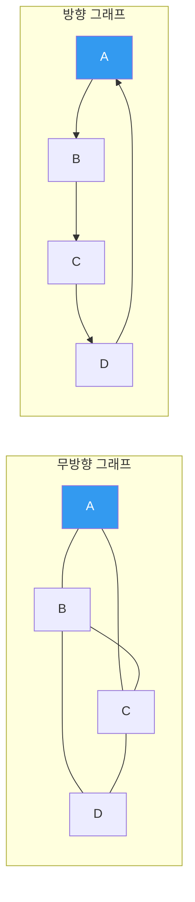
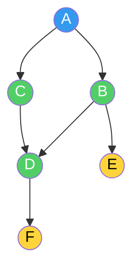
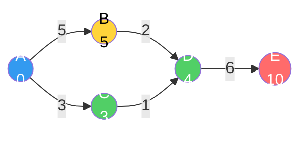
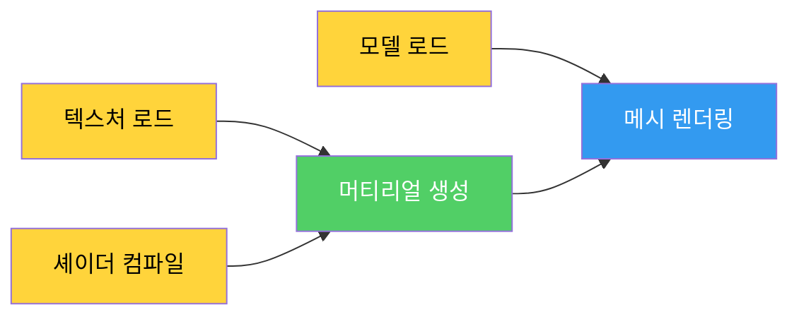
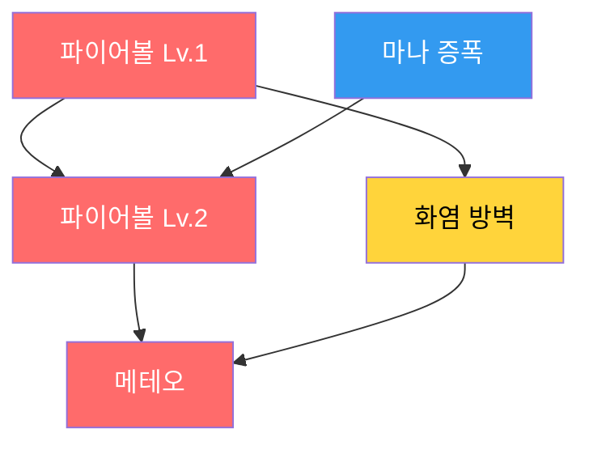
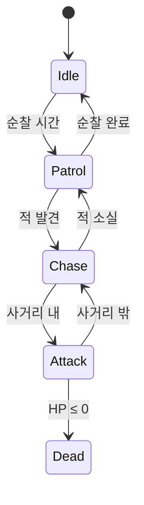

## 서론

> 이 문서는 **CS 로드맵** 시리즈의 5번째 편입니다.

[4편](/posts/Tree/)에서 트리가 계층 구조로 O(log n)을 보장하는 것을 보았다. BST는 순서를 유지하며 탐색하고, B-Tree는 디스크 I/O를 최소화하고, Quadtree/Octree는 공간을 분할한다. 트리는 강력하지만, 한 가지 제약이 있다: **부모에서 자식으로의 단방향 계층만 표현할 수 있다.** 사이클이 없고, 각 노드의 부모는 정확히 하나다.

현실의 관계는 이보다 복잡하다.

- 도시 A에서 B로, B에서 C로, C에서 다시 A로 갈 수 있다 (사이클)
- 한 퀘스트가 여러 퀘스트의 선행 조건이 될 수 있다 (다대다 관계)
- 도로마다 거리가 다르고, 일방통행이 있다 (방향과 가중치)

**그래프(Graph)**는 이런 관계를 표현하는 가장 일반적인 구조다. 트리는 그래프의 특수한 경우일 뿐이다. 이 글에서는 그래프의 기본 개념부터, 탐색(DFS/BFS), 최단 경로(Dijkstra/A*), 위상 정렬까지 — 게임 개발자가 알아야 할 핵심을 살펴본다.

이후 시리즈 구성:

| 편 | 주제 | 핵심 질문 |
| --- | --- | --- |
| **5편 (이번 글)** | 그래프 | 탐색, 최단 경로, 위상 정렬의 원리는? |
| **6편** | 메모리 관리 | 스택/힙, GC, 수동 메모리 관리의 트레이드오프는? |

---

## Part 1: 그래프의 기본 개념

### 그래프란 무엇인가

그래프는 **정점(Vertex)**의 집합 V와 **간선(Edge)**의 집합 E로 구성된다.

$$G = (V, E)$$

정점은 "것"이고, 간선은 "관계"다. 도시와 도로, 사람과 친구 관계, 웹 페이지와 링크, 게임 맵의 웨이포인트와 경로 — 전부 그래프다.

```
무방향 그래프:          방향 그래프(Digraph):

  A --- B               A → B
  |   / |               ↑   ↓
  |  /  |               D ← C
  C --- D
```



핵심 용어:

| 용어 | 정의 |
| --- | --- |
| **무방향 그래프** | 간선에 방향이 없다. A-B면 양방향 이동 가능 |
| **방향 그래프(Digraph)** | 간선에 방향이 있다. A→B와 B→A는 별개 |
| **가중 그래프** | 간선에 비용(가중치)이 있다. 거리, 시간, 비용 등 |
| **차수(Degree)** | 정점에 연결된 간선의 수. 방향 그래프에서는 진입 차수(in-degree)와 진출 차수(out-degree)로 구분 |
| **경로(Path)** | 정점의 시퀀스. 각 인접 정점 쌍이 간선으로 연결 |
| **사이클(Cycle)** | 시작 정점으로 돌아오는 경로 |
| **연결 그래프** | 모든 정점 쌍 사이에 경로가 존재 |
| **DAG** | 방향 비순환 그래프(Directed Acyclic Graph). 방향이 있지만 사이클이 없다 |

### 트리와 그래프의 관계

4편에서 트리를 "사이클이 없는 연결 그래프"로 정의했다. 정확히 말하면:

> **트리 = 연결된 + 비순환 + 무방향 그래프**

트리에 간선 하나를 추가하면 사이클이 생겨서 더 이상 트리가 아니다. 트리에서 간선 하나를 제거하면 연결이 끊어진다. 트리는 **n개의 정점과 정확히 n-1개의 간선**을 가지는, 그래프의 가장 경제적인 연결 형태다.

```
트리 (4편):          그래프 (이번 편):
간선 = n - 1         간선 ≤ n(n-1)/2 (무방향)
사이클 없음           사이클 가능
부모 하나             진입 간선 제한 없음
루트 존재             루트 개념 없을 수 있음
```

### 가중 그래프

간선에 **가중치(weight)**가 붙으면 단순한 연결 여부를 넘어 "비용"을 표현할 수 있다.

```
가중 방향 그래프:

  A --5-→ B
  |        ↓
  3        2
  ↓        ↓
  C --1-→ D

A→B: 비용 5
A→C: 비용 3
B→D: 비용 2
C→D: 비용 1

최단 경로 A→D: A→C→D (비용 4) ← A→B→D (비용 7)보다 짧다
```

게임에서 가중치는 다양하게 해석된다:

| 게임 상황 | 정점 | 간선 가중치 |
| --- | --- | --- |
| 패스파인딩 | 웨이포인트 | 이동 거리 또는 시간 |
| 내비메시 | 삼각형 중심 | 삼각형 간 이동 비용 |
| 전략 게임 | 타일 | 지형 이동 비용 (평지=1, 늪=3, 산=5) |
| 대화 시스템 | 대화 노드 | 호감도 변화량 |

> **잠깐, 이건 짚고 넘어가자**
>
> **Q. 그래프의 간선 수는 최대 얼마인가?**
>
> 무방향 그래프에서 n개 정점의 최대 간선 수는 $\binom{n}{2} = \frac{n(n-1)}{2}$이다. 정점 100개면 최대 4,950개의 간선. 방향 그래프에서는 $n(n-1)$ — 양방향이 별개이므로 2배다.
>
> 간선이 최대치에 가까운 그래프를 **밀집(dense) 그래프**, 정점 수에 비례하는 정도의 간선만 있는 그래프를 **희소(sparse) 그래프**라고 한다. 게임의 내비메시, 타일맵, 도로 네트워크는 대부분 **희소 그래프**다 — 각 정점이 소수의 이웃에만 연결된다.
>
> **Q. 자기 자신을 가리키는 간선(self-loop)은 가능한가?**
>
> 가능하다. A→A 같은 간선을 자기 루프(self-loop)라고 한다. 상태 머신에서 "같은 상태를 유지"하는 전이가 대표적인 예다. 다만 대부분의 패스파인딩 알고리즘에서는 자기 루프를 무시한다.

---

## Part 2: 그래프의 표현

그래프를 코드로 구현하는 방법은 크게 두 가지다. 선택에 따라 메모리 사용량과 연산 속도가 극적으로 달라진다.

### 인접 행렬(Adjacency Matrix)

$V \times V$ 크기의 2차원 배열. `matrix[i][j] = 1`이면 정점 i에서 j로의 간선이 존재한다. 가중 그래프에서는 가중치를 저장한다.

```
정점: A(0), B(1), C(2), D(3)
간선: A→B(5), A→C(3), B→D(2), C→D(1)

    A  B  C  D
A [ 0  5  3  0 ]
B [ 0  0  0  2 ]
C [ 0  0  0  1 ]
D [ 0  0  0  0 ]

0 = 간선 없음, 숫자 = 가중치
```

```csharp
// 인접 행렬 — 가중 방향 그래프
int[,] matrix = new int[V, V]; // V = 정점 수

// 간선 추가: O(1)
matrix[0, 1] = 5;  // A→B, 가중치 5

// 간선 존재 확인: O(1)
bool hasEdge = matrix[0, 1] != 0;

// 정점 A의 모든 이웃 탐색: O(V)
for (int j = 0; j < V; j++) {
    if (matrix[0, j] != 0)
        Console.WriteLine($"A → {j}, 비용 {matrix[0, j]}");
}
```

### 인접 리스트(Adjacency List)

각 정점마다 연결된 이웃 정점들의 리스트를 저장한다.

```
A: [(B, 5), (C, 3)]
B: [(D, 2)]
C: [(D, 1)]
D: []
```

```csharp
// 인접 리스트 — 가중 방향 그래프
List<(int to, int weight)>[] adj = new List<(int, int)>[V];
for (int i = 0; i < V; i++)
    adj[i] = new List<(int, int)>();

// 간선 추가: O(1)
adj[0].Add((1, 5));  // A→B, 가중치 5
adj[0].Add((2, 3));  // A→C, 가중치 3

// 정점 A의 모든 이웃 탐색: O(degree(A))
foreach (var (to, weight) in adj[0])
    Console.WriteLine($"A → {to}, 비용 {weight}");
```

### 어떤 표현을 선택하는가

| 특성 | 인접 행렬 | 인접 리스트 |
| --- | --- | --- |
| 메모리 | $O(V^2)$ | $O(V + E)$ |
| 간선 존재 확인 | **O(1)** | O(degree) |
| 이웃 순회 | O(V) | **O(degree)** |
| 간선 추가 | O(1) | O(1) |
| 적합한 경우 | 밀집 그래프, V가 작을 때 | **희소 그래프** |

게임 개발에서는 거의 항상 **인접 리스트**가 답이다.

이유: 게임의 그래프는 대부분 **희소**하다. 내비메시의 삼각형은 최대 3개의 이웃을 가지고, 타일맵의 타일은 4~8개의 이웃을 가진다. 정점이 10,000개인 내비메시에서 인접 행렬은 $10{,}000^2 = 1억$ 칸의 메모리를 쓰지만, 인접 리스트는 약 30,000개의 간선 정보만 저장한다.

1편에서 본 **캐시 지역성** 관점에서도, 인접 리스트는 각 정점의 이웃을 연속된 배열에 저장하므로 이웃 순회 시 캐시 친화적이다. 반면 인접 행렬은 행 전체(대부분 0)를 스캔해야 하므로 캐시 라인을 낭비한다.

> **잠깐, 이건 짚고 넘어가자**
>
> **Q. 인접 행렬이 유리한 경우는 정말 없나?**
>
> 있다. 정점 수가 적고 간선이 많은 경우(밀집 그래프)에서는 인접 행렬이 유리하다. 특히 "두 정점 사이에 간선이 있는가?"라는 질의가 빈번하면 O(1) 조회가 강력하다. Floyd-Warshall 같은 모든 쌍 최단 경로 알고리즘은 인접 행렬에서 자연스럽게 동작한다. 또한 비트 단위 연산으로 그래프 연산을 최적화할 때(예: 비트맵 기반 전이 클로저) 행렬이 효율적이다.
>
> **Q. 해시맵 기반 인접 리스트는?**
>
> 3편에서 본 해시 테이블을 이용해 `Dictionary<int, List<int>>`로 구현할 수도 있다. 정점 번호가 연속적이지 않거나 동적으로 추가/삭제되는 경우에 유용하다. 다만 배열 기반 인접 리스트에 비해 해시 오버헤드가 있으므로, 정점 번호가 0부터 연속인 경우에는 배열이 더 빠르다.

---

## Part 3: DFS — 깊이 우선 탐색

### "끝까지 가본다"

깊이 우선 탐색(Depth-First Search, DFS)은 한 방향으로 **갈 수 있는 데까지 깊이 들어간 뒤**, 더 이상 갈 곳이 없으면 **되돌아와서 다른 방향**을 시도하는 전략이다.

미로를 탐험한다고 상상하자. 갈림길에서 항상 왼쪽을 선택한다. 막다른 길에 도달하면 마지막 갈림길로 돌아와서 다른 방향을 시도한다. 이것이 DFS다.

```
그래프:
  A --- B --- E
  |     |
  C --- D --- F

DFS(A 시작): A → B → E → (되돌아감) → D → F → (되돌아감) → C
```



### 구현: 재귀와 스택

DFS는 [2편](/posts/StackQueueDeque/)에서 본 **스택**의 LIFO 특성을 그대로 활용한다. 재귀 호출 자체가 콜스택을 사용하므로, 재귀 구현이 가장 직관적이다.

```csharp
// DFS — 재귀 구현
bool[] visited;

void DFS(int v) {
    visited[v] = true;
    Console.Write($"{v} ");

    foreach (int next in adj[v]) {
        if (!visited[next])
            DFS(next);
    }
}
```

재귀가 깊어지면 2편에서 본 **콜스택 오버플로**가 발생할 수 있다. 정점 수가 많은 그래프에서는 명시적 스택을 사용한다:

```csharp
// DFS — 명시적 스택
void DFS_Iterative(int start) {
    var stack = new Stack<int>();
    bool[] visited = new bool[V];

    stack.Push(start);

    while (stack.Count > 0) {
        int v = stack.Pop();

        if (visited[v]) continue;
        visited[v] = true;
        Console.Write($"{v} ");

        // 역순으로 넣어야 왼쪽부터 방문
        foreach (int next in adj[v].Reverse()) {
            if (!visited[next])
                stack.Push(next);
        }
    }
}
```

### 시간 복잡도

모든 정점을 한 번씩 방문하고($O(V)$), 각 정점에서 인접 간선을 확인한다($O(E)$):

$$T(DFS) = O(V + E)$$

인접 행렬을 사용하면 각 정점에서 V개를 확인하므로 $O(V^2)$. 이것이 희소 그래프에서 인접 리스트가 유리한 이유다.

### DFS의 응용

**1. 사이클 감지**

방향 그래프에서 DFS 도중 이미 **현재 탐색 경로 위에 있는** 정점을 다시 만나면 사이클이다.

```csharp
// 방향 그래프 사이클 감지
enum State { White, Gray, Black }
State[] state;

bool HasCycle(int v) {
    state[v] = State.Gray;  // 탐색 중

    foreach (int next in adj[v]) {
        if (state[next] == State.Gray)  // 현재 경로에 이미 있다!
            return true;                // → 사이클 발견
        if (state[next] == State.White && HasCycle(next))
            return true;
    }

    state[v] = State.Black;  // 탐색 완료
    return false;
}
```

White(미방문) → Gray(탐색 중) → Black(탐색 완료)의 삼색 구분이 핵심이다. Gray 노드를 다시 만나면 "탐색 중인 경로에서 되돌아왔다"는 뜻이므로 사이클이다.

게임에서 사이클 감지가 필요한 경우:
- **퀘스트 의존성 검증**: 퀘스트 A → B → C → A 같은 순환 의존이 있으면 영원히 시작할 수 없다
- **리소스 참조**: 프리팹 A가 B를 참조하고, B가 A를 참조하면 로딩 무한 루프
- **스킬 트리**: 선행 조건이 순환하면 잠금 해제가 불가능

**2. 연결 요소(Connected Component)**

DFS 한 번으로 시작 정점에서 도달 가능한 모든 정점을 방문한다. 방문하지 못한 정점이 남아있으면, 그래프가 **여러 조각(연결 요소)**으로 나뉘어 있다는 뜻이다.

```csharp
// 연결 요소 개수 세기
int CountComponents() {
    bool[] visited = new bool[V];
    int count = 0;

    for (int v = 0; v < V; v++) {
        if (!visited[v]) {
            DFS(v);  // 이 DFS가 도달하는 모든 정점 방문
            count++;
        }
    }
    return count;
}
```

게임에서의 활용: 맵 생성 후 **모든 영역이 연결되어 있는지** 확인. 플레이어가 도달할 수 없는 고립된 방이 있으면 맵을 재생성하거나 추가 통로를 뚫는다.

**3. 미로/던전 생성**

DFS의 "끝까지 가본다"는 성질은 미로 생성에 직접 활용된다. **재귀적 백트래킹(Recursive Backtracking)** 알고리즘:

1. 시작 셀에서 출발
2. 방문하지 않은 인접 셀 중 하나를 무작위로 선택
3. 벽을 허물고 이동
4. 막다른 곳에 도달하면 되돌아가서 다른 방향 시도

```
미로 생성 과정 (재귀적 백트래킹):

단계 1:          단계 4:          완성:
┌─┬─┬─┬─┐      ┌─┬─┬─┬─┐      ┌─────┬─┐
│S│ │ │ │      │S  →  │ │      │S      │
├─┼─┼─┼─┤      ├─┼─┼─┼─┤      ├─┐ ┌──┤
│ │ │ │ │      │ │ ↓ │ │      │ │   │ │
├─┼─┼─┼─┤      ├─┼─┼─┼─┤      │ └─┐ │ │
│ │ │ │ │      │ │ ↓  →E│      │     │E│
└─┴─┴─┴─┘      └─┴─┴─┴─┘      └─────┴─┘
                                    긴 통로 특성
```

DFS로 생성된 미로는 **긴 복도와 적은 갈림길**이 특징이다. 게임에서 "탐험감"을 주고 싶을 때 적합하다. 반대로 BFS 기반 미로는 짧고 균일한 가지가 많다.

> **잠깐, 이건 짚고 넘어가자**
>
> **Q. DFS는 최단 경로를 보장하는가?**
>
> **아니다.** DFS는 "도달 가능성"은 보장하지만, 찾은 경로가 최단이라는 보장은 없다. 최단 경로가 필요하면 BFS(무가중치) 또는 Dijkstra/A*(가중치)를 사용해야 한다.
>
> **Q. DFS와 2편의 스택은 어떤 관계인가?**
>
> DFS = 스택 + 그래프 순회. 재귀적 DFS는 콜스택이 암묵적 스택 역할을 하고, 반복적 DFS는 명시적 Stack을 사용한다. 2편에서 스택이 "가장 최근 것을 먼저 처리"한다고 했다 — DFS가 "가장 최근에 발견한 정점부터 깊이 탐색"하는 것과 정확히 같은 원리다.

---

## Part 4: BFS — 너비 우선 탐색

### "가까운 곳부터 본다"

너비 우선 탐색(Breadth-First Search, BFS)은 시작 정점에서 **가까운 정점부터** 순서대로 방문하는 전략이다. 거리 1인 정점을 모두 방문하고, 거리 2인 정점을 모두 방문하고, … 마치 연못에 돌을 던졌을 때 파문이 퍼지는 것과 같다.

```
BFS(A 시작):
거리 0: A
거리 1: B, C       ← A의 이웃
거리 2: D, E       ← B, C의 이웃 (A 제외)
거리 3: F          ← D의 이웃

순서: A → B → C → D → E → F
```

### 구현: 큐

BFS는 [2편](/posts/StackQueueDeque/)에서 본 **큐**의 FIFO 특성을 활용한다. 먼저 발견한 정점을 먼저 처리하므로, 자연스럽게 가까운 곳부터 방문한다.

```csharp
// BFS — 무가중치 최단 거리
int[] BFS(int start) {
    int[] dist = new int[V];
    Array.Fill(dist, -1);
    dist[start] = 0;

    var queue = new Queue<int>();
    queue.Enqueue(start);

    while (queue.Count > 0) {
        int v = queue.Dequeue();

        foreach (int next in adj[v]) {
            if (dist[next] == -1) {       // 미방문
                dist[next] = dist[v] + 1; // 거리 = 부모 + 1
                queue.Enqueue(next);
            }
        }
    }

    return dist; // dist[i] = start에서 i까지의 최단 거리
}
```

시간 복잡도는 DFS와 동일하다: $O(V + E)$.

### BFS의 핵심 성질: 무가중치 최단 경로

BFS가 보장하는 것: **간선의 가중치가 모두 같을 때, BFS가 찾는 경로는 최단 경로다.**

이유: BFS는 시작점에서 거리 k인 정점을 모두 처리한 후에야 거리 k+1인 정점을 처리한다. 따라서 어떤 정점에 처음 도달하는 순간이 곧 최단 거리다.

### BFS의 게임 응용

**1. 타일 기반 이동 범위**

전략 게임에서 "이 유닛이 3턴 안에 갈 수 있는 타일"을 보여주려면, 유닛 위치에서 BFS를 실행하여 거리 ≤ 3인 타일을 모두 수집하면 된다.

```
이동력 3인 유닛의 이동 범위 (BFS):

         [3]
      [3][2][3]
   [3][2][1][2][3]
[3][2][1][U][1][2][3]    U = 유닛 위치
   [3][2][1][2][3]       숫자 = 이동 비용
      [3][2][3]
         [3]
```

```csharp
// 이동 범위 계산 — BFS
HashSet<Vector2Int> GetMovableArea(Vector2Int start, int moveRange) {
    var result = new HashSet<Vector2Int>();
    var dist = new Dictionary<Vector2Int, int>();
    var queue = new Queue<Vector2Int>();

    dist[start] = 0;
    queue.Enqueue(start);

    while (queue.Count > 0) {
        var pos = queue.Dequeue();

        foreach (var next in GetNeighbors(pos)) { // 상하좌우
            int cost = GetTileCost(next);          // 지형 비용
            int newDist = dist[pos] + cost;

            if (newDist <= moveRange && !dist.ContainsKey(next)) {
                dist[next] = newDist;
                result.Add(next);
                queue.Enqueue(next);
            }
        }
    }

    return result;
}
```

> **주의:** 위 코드는 지형 비용이 1보다 클 수 있으므로, 순수 BFS가 아닌 변형이다. 지형 비용이 다양하면 Dijkstra가 정확하다. 비용이 모두 1이면 BFS로 충분하다.

**2. 영향 범위 / 폭발 반경**

"이 폭발에 영향을 받는 오브젝트"를 찾으려면, 폭발 지점에서 BFS를 돌려 거리 ≤ 반경인 오브젝트를 수집한다. 장애물이 폭발을 차단하는 경우, BFS에서 해당 타일을 건너뛰면 자연스럽게 "벽 뒤는 안전" 로직이 구현된다.

**3. 플러드 필(Flood Fill)**

2D 그리드에서 같은 색상의 연결된 영역을 모두 찾는 알고리즘. 그림판의 "페인트 통" 도구의 원리다. BFS 또는 DFS로 구현할 수 있지만, BFS가 콜스택 오버플로 위험이 없어 실무에서 선호된다.

> **잠깐, 이건 짚고 넘어가자**
>
> **Q. DFS와 BFS를 언제 구분해서 써야 하는가?**
>
> | 필요한 것 | DFS | BFS |
> | --- | --- | --- |
> | 도달 가능성 확인 | O | O |
> | **최단 경로** (무가중치) | X | **O** |
> | 사이클 감지 | **O** | 가능하지만 복잡 |
> | 위상 정렬 | **O** | O (Kahn's) |
> | 메모리 효율 | **경로 길이**에 비례 | **너비**에 비례 |
> | 미로/맵 생성 | **O** (긴 복도) | 가능 (짧은 가지) |
>
> 핵심: **"최단"이 필요하면 BFS, "존재 여부"만 필요하면 DFS**가 더 간단하다.

---

## Part 5: 최단 경로 알고리즘

BFS는 간선 가중치가 모두 같을 때 최단 경로를 준다. 하지만 게임 세계에서 모든 이동 비용이 같은 경우는 드물다. 숲은 느리고, 도로는 빠르고, 물은 헤엄쳐야 한다. **가중 그래프에서의 최단 경로**가 필요하다.

### Dijkstra 알고리즘

Edsger W. Dijkstra가 1956년에 고안한 이 알고리즘은 단일 시작점에서 **모든 정점까지의 최단 경로**를 구한다.

핵심 아이디어: **"지금까지 가장 가까운 정점"을 반복적으로 선택하고, 그 정점을 통해 이웃의 거리를 갱신한다.**

```
Dijkstra(A 시작):

초기:  A=0, B=∞, C=∞, D=∞, E=∞

단계 1: A(0) 선택 → B=5, C=3
단계 2: C(3) 선택 → D=3+1=4
단계 3: D(4) 선택 → E=4+6=10
단계 4: B(5) 선택 → D=min(4, 5+2)=4 (변화 없음)
단계 5: E(10) 선택

결과: A=0, B=5, C=3, D=4, E=10
```



```csharp
// Dijkstra — 우선순위 큐(최소 힙) 사용
int[] Dijkstra(int start) {
    int[] dist = new int[V];
    Array.Fill(dist, int.MaxValue);
    dist[start] = 0;

    // (거리, 정점) — 거리가 작은 것이 먼저 나온다
    var pq = new PriorityQueue<int, int>();
    pq.Enqueue(start, 0);

    while (pq.Count > 0) {
        int v = pq.Dequeue();

        foreach (var (next, weight) in adj[v]) {
            int newDist = dist[v] + weight;

            if (newDist < dist[next]) {
                dist[next] = newDist;
                pq.Enqueue(next, newDist);
            }
        }
    }

    return dist;
}
```

**시간 복잡도:** 우선순위 큐(이진 힙)를 사용하면 $O((V + E) \log V)$. 4편에서 본 힙이 여기서 쓰인다 — "가장 가까운 정점을 빠르게 꺼내는" 연산이 핵심이기 때문이다.

**제약:** Dijkstra는 **음수 가중치 간선이 없어야** 동작한다. 이미 확정한 정점의 거리가 나중에 더 짧아질 수 없다는 가정에 기반하기 때문이다. 음수 가중치가 있으면 Bellman-Ford 알고리즘을 사용해야 한다.

### A* 알고리즘 — 게임 패스파인딩의 표준

Dijkstra는 **모든 방향으로 균등하게** 탐색을 확장한다. 목적지가 동쪽에 있어도 서쪽을 열심히 탐색한다. A*는 여기에 **"목적지까지의 추정 거리"(휴리스틱)**을 더해, 목적지 방향의 정점을 우선적으로 탐색한다.

$$f(n) = g(n) + h(n)$$

- $g(n)$: 시작점에서 n까지의 **실제 비용** (Dijkstra와 동일)
- $h(n)$: n에서 목적지까지의 **추정 비용** (휴리스틱)
- $f(n)$: 총 예상 비용 → 이것으로 우선순위를 결정

```
Dijkstra vs A* 탐색 범위:

Dijkstra (전방위 탐색):     A* (목표 방향 집중):
. . . . . . . . .          . . . . . . . . .
. . x x x x . . .          . . . . . x . . .
. x x x x x x . .          . . . x x x x . .
. x x S x x x . .          . . x x S x x . .
. x x x x x x . .          . . x x x x G . .
. . x x x x G . .          . . . x x . . . .
. . . . . . . . .          . . . . . . . . .

S = 시작, G = 목표, x = 탐색한 정점
Dijkstra: 36개 탐색          A*: 18개 탐색
```

```csharp
// A* 알고리즘
List<Vector2Int> AStar(Vector2Int start, Vector2Int goal) {
    var openSet = new PriorityQueue<Vector2Int, float>();
    var cameFrom = new Dictionary<Vector2Int, Vector2Int>();
    var gScore = new Dictionary<Vector2Int, float>();

    gScore[start] = 0;
    openSet.Enqueue(start, Heuristic(start, goal));

    while (openSet.Count > 0) {
        var current = openSet.Dequeue();

        if (current == goal)
            return ReconstructPath(cameFrom, current);

        foreach (var next in GetNeighbors(current)) {
            float tentativeG = gScore[current] + Cost(current, next);

            if (tentativeG < gScore.GetValueOrDefault(next, float.MaxValue)) {
                cameFrom[next] = current;
                gScore[next] = tentativeG;
                float f = tentativeG + Heuristic(next, goal);
                openSet.Enqueue(next, f);
            }
        }
    }

    return null; // 경로 없음
}

// 휴리스틱: 유클리드 거리 또는 맨해튼 거리
float Heuristic(Vector2Int a, Vector2Int b) {
    return Mathf.Abs(a.x - b.x) + Mathf.Abs(a.y - b.y); // 맨해튼
}
```

### 휴리스틱의 선택

A*의 성능과 정확성은 휴리스틱 $h(n)$에 달려있다.

| 조건 | 의미 | 결과 |
| --- | --- | --- |
| $h(n) = 0$ | 추정을 안 한다 | **Dijkstra와 동일** (정확하지만 느림) |
| $h(n) \leq$ 실제 거리 | **과소 추정** (admissible) | **최단 경로 보장** + 탐색 축소 |
| $h(n) =$ 실제 거리 | 완벽한 추정 | **최적** — 최단 경로만 탐색 |
| $h(n) >$ 실제 거리 | **과대 추정** | 최단 경로 **미보장**, 더 빠름 |

게임에서 흔히 쓰는 휴리스틱:

| 그리드 유형 | 휴리스틱 | 수식 |
| --- | --- | --- |
| 4방향 이동 | 맨해튼 거리 | $\|dx\| + \|dy\|$ |
| 8방향 이동 | 체비셰프/옥틸 거리 | $\max(\|dx\|, \|dy\|)$ 또는 옥틸 공식 |
| 자유 이동 | 유클리드 거리 | $\sqrt{dx^2 + dy^2}$ |

> **잠깐, 이건 짚고 넘어가자**
>
> **Q. A*가 Dijkstra보다 항상 빠른가?**
>
> 목적지가 하나이고 좋은 휴리스틱이 있을 때는 거의 항상 빠르다. 하지만 **모든 정점까지의 최단 거리**가 필요하면 Dijkstra를 써야 한다 — A*는 특정 목적지를 향한 탐색이므로.
>
> **Q. Unity/Unreal의 패스파인딩은 A*를 사용하는가?**
>
> Unity의 NavMesh 시스템은 내부적으로 A*의 변형을 사용한다. Unreal Engine의 Navigation System도 마찬가지다. 다만 둘 다 NavMesh(내비메시) 위에서 동작하므로, 격자 기반 A*와는 그래프 구조가 다르다 — 정점이 삼각형의 중심(또는 간선의 중점)이고, 간선이 인접 삼각형 사이의 통로다.
>
> **Q. 왜 격자 기반 A*만으로는 부족한가?**
>
> 격자 기반 A*는 구현이 단순하지만, 맵이 커지면 정점 수가 폭발적으로 늘어난다. 100x100 타일맵은 10,000개 정점이지만, 1000x1000이면 100만 개다. NavMesh는 열린 공간을 큰 삼각형 하나로 표현하므로 정점 수가 극적으로 줄어든다. 좁은 통로는 작은 삼각형, 넓은 광장은 큰 삼각형 — 이것이 4편에서 본 Quadtree/Octree의 **적응적 분할**과 같은 원리다.

### Jump Point Search (JPS)

격자 기반 패스파인딩에서 A*를 개선한 알고리즘이다. Harabor & Grastien(2011)이 제안했으며, 균일 비용 격자에서 **대칭 경로를 건너뛰어** 탐색 정점 수를 극적으로 줄인다.

핵심 아이디어: 빈 공간에서 직선으로 이동할 때, 중간 정점들을 일일이 열고 닫을 필요가 없다. 방향 전환이 필요한 "점프 포인트"만 탐색한다.

```
A* 탐색 (31개 정점):        JPS 탐색 (7개 정점):
x x x x x . . . .           . . . . . . . . .
x x x x x . . . .           J . . . J . . . .
x x x x x . # . .           . . . . . . # . .
. . S x x . # G .           . . S . . . # G .
. . . x x . . . .           . . . . J . . . .
. . . . . . . . .           . . . . . . . . .

S=시작, G=목표, #=벽, x=탐색, J=점프 포인트
```

JPS는 **균일 비용 격자에서만** 동작하지만, 그 조건이 맞으면 A* 대비 10배 이상 빠를 수 있다.

---

## Part 6: 위상 정렬

### DAG와 의존성

**DAG(Directed Acyclic Graph)**은 방향이 있지만 사이클이 없는 그래프다. 사이클이 없다는 것은 "A가 B에 의존하고, B가 C에 의존하고, C가 다시 A에 의존하는" 순환 의존이 없다는 뜻이다.

**위상 정렬(Topological Sort)**은 DAG의 정점들을 **의존성 순서**로 나열하는 것이다. 모든 간선 (u, v)에 대해 u가 v보다 앞에 온다.

```
DAG:
  셰이더 컴파일 → 머티리얼 생성 → 메시 렌더링
  텍스처 로드 ↗                    ↑
  모델 로드 ─────────────────────────┘

위상 정렬 결과:
[텍스처 로드, 셰이더 컴파일, 모델 로드, 머티리얼 생성, 메시 렌더링]
```



### Kahn의 알고리즘

BFS 기반의 위상 정렬. 핵심 아이디어: **진입 차수(in-degree)가 0인 정점 = 의존하는 것이 없는 정점 = 먼저 처리 가능**.

```csharp
// Kahn의 알고리즘 — BFS 기반 위상 정렬
List<int> TopologicalSort() {
    int[] inDegree = new int[V];

    // 진입 차수 계산
    for (int v = 0; v < V; v++)
        foreach (int next in adj[v])
            inDegree[next]++;

    // 진입 차수 0인 정점 큐에 삽입
    var queue = new Queue<int>();
    for (int v = 0; v < V; v++)
        if (inDegree[v] == 0)
            queue.Enqueue(v);

    var result = new List<int>();

    while (queue.Count > 0) {
        int v = queue.Dequeue();
        result.Add(v);

        foreach (int next in adj[v]) {
            inDegree[next]--;
            if (inDegree[next] == 0)  // 의존성이 모두 해결됨
                queue.Enqueue(next);
        }
    }

    // result.Count < V이면 사이클이 존재
    return result.Count == V ? result : null;
}
```

시간 복잡도: $O(V + E)$. 각 정점과 각 간선을 정확히 한 번씩 처리한다.

### DFS 기반 위상 정렬

DFS의 **후위 순서(post-order)**를 역순으로 뒤집으면 위상 정렬이 된다.

```csharp
// DFS 기반 위상 정렬
Stack<int> order = new Stack<int>();
bool[] visited = new bool[V];

void TopoDFS(int v) {
    visited[v] = true;
    foreach (int next in adj[v])
        if (!visited[next])
            TopoDFS(next);
    order.Push(v);  // 후위 순서
}

// 결과: order를 Pop하면 위상 정렬 순서
```

### 게임에서의 위상 정렬

**1. 기술 트리 / 스킬 트리**

RPG의 스킬 트리는 DAG다. "파이어볼 Lv.2를 배우려면 파이어볼 Lv.1과 마나 증폭이 필요하다."



위상 정렬로 "어떤 순서로 스킬을 배울 수 있는가"를 결정하고, DFS로 "이 스킬의 모든 선행 조건이 충족되었는가"를 확인한다.

**2. 빌드 시스템 / 리소스 로딩**

게임의 리소스 로딩은 의존성 그래프다. 머티리얼은 텍스처에 의존하고, 프리팹은 머티리얼과 메시에 의존한다. 위상 정렬 순서로 로딩하면 의존성이 항상 먼저 준비된다. Kahn의 알고리즘에서 큐를 우선순위 큐로 바꾸면, 의존성을 만족하면서도 "큰 리소스를 먼저 로딩"하는 최적화도 가능하다.

**3. 렌더 패스 순서**

현대 렌더링 파이프라인(Unity URP/HDRP, Unreal의 RDG)은 렌더 패스들의 의존성을 DAG로 관리한다. 그림자 맵은 조명 전에, 불투명 패스는 반투명 전에, 포스트 프로세싱은 모든 렌더링 후에 실행되어야 한다. 렌더 그래프의 위상 정렬이 실행 순서를 결정한다.

**4. 스프레드시트 셀 계산**

Excel이나 Google Sheets에서 셀 A1이 `=B1+C1`이면, B1과 C1이 먼저 계산되어야 한다. 셀 간 참조 관계는 DAG이며, 위상 정렬 순서로 계산한다. 순환 참조가 발견되면(사이클) 에러를 표시하는 것도 같은 원리다.

> **잠깐, 이건 짚고 넘어가자**
>
> **Q. 위상 정렬은 유일한가?**
>
> 아니다. 동일한 DAG에서도 여러 가지 유효한 위상 정렬이 존재할 수 있다. 의존성이 없는 정점들 사이에서는 순서가 자유롭기 때문이다. 이 자유도는 **병렬화**에 활용할 수 있다 — 진입 차수가 동시에 0이 되는 정점들은 병렬로 처리할 수 있다.
>
> **Q. 사이클이 있으면 위상 정렬이 불가능한 이유는?**
>
> A → B → C → A 사이클이 있으면, A는 B보다 앞에 와야 하고, B는 C보다 앞에 와야 하고, C는 A보다 앞에 와야 한다. 이를 동시에 만족하는 순서는 존재하지 않는다. Kahn의 알고리즘에서는 진입 차수가 0이 되는 정점이 없어져서 큐가 비어버리고, DFS에서는 Gray 노드 재방문(사이클)으로 감지된다.

---

## Part 7: 게임 개발에서의 그래프

### 1. 내비메시(NavMesh)

3D 게임에서 NPC 이동의 표준. 걸을 수 있는 표면을 **삼각형 메시**로 표현하고, 삼각형들의 인접 관계가 그래프를 형성한다.

```
NavMesh:
┌──────────┬──────────┐
│ △1       │    △2    │    정점 = 삼각형
│          │         /│    간선 = 인접한 삼각형 쌍
│        / │       /  │
│      /   │     /    │
│    /  △3 │   / △4   │
│  /       │ /        │
└──────────┴──────────┘

그래프:
△1 — △3
│      │
△2 — △4
```

패스파인딩 파이프라인:

1. **NavMesh 생성**: 레벨 지오메트리에서 걸을 수 있는 표면을 삼각형으로 분해 (빌드 타임)
2. **경로 검색**: A*로 시작 삼각형에서 목표 삼각형까지의 삼각형 시퀀스를 구한다
3. **경로 최적화**: Funnel Algorithm(간단 깔때기 알고리즘)으로 삼각형 중심을 잇는 경로를 자연스러운 직선 경로로 변환

```
A* 결과 (삼각형 경로):      Funnel Algorithm 후:
  S                           S
  │ △1 중심                   │\
  │ △3 중심                   │ \
  │ △4 중심                   │  \
  G                           G

삼각형 중심을 지그재그      벽을 따라 자연스러운
    → 부자연스러움              직선 경로
```

### 2. 상태 전이 그래프 (FSM)

4편에서 언급한 **유한 상태 머신(Finite State Machine)**은 그래프 그 자체다. 정점이 상태, 간선이 전이 조건이다.



FSM이 그래프라는 인식이 중요한 이유:
- **도달 가능성 분석**: DFS로 "Dead 상태에서 빠져나올 수 있는가?" 확인 → 없다면 정상
- **데드 상태 검출**: 진출 간선이 없는 상태(Dead 외)가 있으면 버그
- **상태 폭발**: 상태와 전이가 늘어나면 그래프 복잡도가 급증 → 이것이 4편에서 Behavior Tree로 전환한 이유

### 3. 퀘스트 / 대화 시스템

분기형 대화 시스템은 DAG(또는 일반 그래프)다.

```
대화 그래프:
시작 → "안녕하세요"
        ├→ "도움이 필요해" → 퀘스트 수락 → ...
        ├→ "아무것도 아니야" → 종료
        └→ (호감도 > 50) "특별한 이야기" → 비밀 퀘스트 → ...
```

위상 정렬은 퀘스트 체인의 진행 순서를, DFS는 "이 선택지에서 도달 가능한 모든 결말"을, BFS는 "가장 적은 선택으로 도달 가능한 결말"을 구한다.

### 4. 셰이더 그래프 / 비주얼 스크립팅

Unity Shader Graph, Unreal Material Editor, Unreal Blueprints — 이 모든 비주얼 프로그래밍 도구는 **노드 기반 DAG**이다.

```
[텍스처 샘플] → [RGB 분리] → [곱하기] → [최종 색상]
                              ↑
[시간 노드] → [사인] ─────────┘
```

각 노드는 입력과 출력 포트를 가지고, 연결선이 간선이다. 계산 순서는 **위상 정렬**로 결정된다. 사이클이 생기면 무한 루프이므로, 엔진은 연결 시점에 사이클 감지(DFS)를 수행하여 순환 연결을 거부한다.

### 5. 네트워크 토폴로지

멀티플레이어 게임의 네트워크 구조도 그래프다:

| 토폴로지 | 그래프 구조 | 사용 사례 |
| --- | --- | --- |
| 클라이언트-서버 | 스타 그래프 (중심=서버) | 대부분의 온라인 게임 |
| P2P 풀 메시 | 완전 그래프 | 소규모 대전 게임 |
| P2P 호스트 | 스타 + 일부 직접 연결 | 캐주얼 멀티플레이 |

---

## Part 8: 그래프 알고리즘의 성능

### 시간 복잡도 정리

| 알고리즘 | 시간 복잡도 | 공간 복잡도 | 용도 |
| --- | --- | --- | --- |
| DFS | $O(V + E)$ | $O(V)$ | 도달 가능성, 사이클, 연결 요소 |
| BFS | $O(V + E)$ | $O(V)$ | 무가중치 최단 경로, 레벨 순회 |
| Dijkstra (힙) | $O((V+E) \log V)$ | $O(V)$ | 단일 출발 최단 경로 (양수 가중치) |
| A* | $O(b^d)$ 최악, 실전은 훨씬 적음 | $O(V)$ | 단일 목적지 최단 경로 |
| Bellman-Ford | $O(VE)$ | $O(V)$ | 음수 가중치 허용 |
| Floyd-Warshall | $O(V^3)$ | $O(V^2)$ | 모든 쌍 최단 경로 |
| 위상 정렬 | $O(V + E)$ | $O(V)$ | DAG 의존성 순서 |

$b$는 분기 계수(branching factor), $d$는 해까지의 깊이.

### 캐시 성능

1편에서 강조한 캐시 지역성은 그래프에서도 중요하다.

**인접 리스트의 캐시 문제:** 각 정점의 이웃 리스트가 힙에 개별 할당되면, 정점을 넘나들 때마다 캐시 미스가 발생할 수 있다. 해결 방법:

1. **CSR(Compressed Sparse Row) 형식**: 모든 간선을 하나의 연속 배열에 저장하고, 각 정점의 시작 인덱스를 별도 배열에 기록. 그래프가 구축 후 변하지 않으면 이 형식이 캐시에 가장 좋다.

```
정점:   0    1    2    3
이웃:   [1,2 | 3 | 3 | ]
offset: [0,   2,  3,  4]

정점 0의 이웃: edges[0..2) = {1, 2}
정점 1의 이웃: edges[2..3) = {3}
정점 2의 이웃: edges[3..4) = {3}
```

2. **정점 번호 재배치**: BFS 순서로 정점에 번호를 다시 매기면, BFS 탐색 시 인접한 정점이 메모리에서도 가까워져 캐시 히트율이 올라간다.

게임에서 NavMesh의 삼각형 데이터는 빌드 시 최적화되어 연속 배열에 저장된다. 런타임에 그래프가 변하지 않으므로 CSR과 유사한 구조가 자연스럽게 적용된다.

> **잠깐, 이건 짚고 넘어가자**
>
> **Q. 그래프 알고리즘에서 가장 흔한 실수는?**
>
> 1. **방문 체크 누락**: `visited` 배열 없이 BFS/DFS를 돌리면 무한 루프에 빠진다. 트리와 달리 그래프에는 사이클이 있기 때문이다.
> 2. **Dijkstra에 음수 가중치**: 음수 간선이 있으면 Dijkstra의 결과가 틀리다. 에러 없이 잘못된 답을 주므로 더 위험하다.
> 3. **A* 휴리스틱 과대 추정**: admissible하지 않은 휴리스틱은 최단 경로를 보장하지 않는다. 게임에서 "거의 최단 경로"로 충분하면 의도적으로 과대 추정하기도 하지만, 이를 인지하고 있어야 한다.
>
> **Q. 프로그래밍 언어별 그래프 라이브러리는?**
>
> - **C#/.NET**: 표준 라이브러리에 그래프 자료구조가 없다. 직접 인접 리스트를 구현하거나 QuikGraph 같은 라이브러리를 사용한다.
> - **C++**: Boost Graph Library (BGL)가 표준에 가깝다. 그러나 게임 개발에서는 성능 최적화를 위해 직접 구현하는 경우가 많다.
> - **Python**: NetworkX가 사실상 표준이다. 프로토타이핑에 적합하지만, 게임 런타임에는 쓰지 않는다.

---

## 마무리: 그래프는 관계를 코드로 만든다

이 글에서 살펴본 핵심:

1. **그래프는 "연결 관계"를 표현하는 가장 일반적인 구조**이며, 트리는 그래프의 특수한 경우다. 정점과 간선만으로 도시와 도로, NPC와 관계, 스킬과 의존성, 렌더 패스와 순서를 모두 모델링할 수 있다.

2. **DFS는 스택으로 "끝까지 가본다", BFS는 큐로 "가까운 곳부터 본다"** — 2편에서 본 스택과 큐가 그래프 탐색의 두 축을 이룬다. 사이클 감지와 연결 요소에는 DFS, 무가중치 최단 경로에는 BFS가 답이다.

3. **Dijkstra는 "지금까지 가장 가까운 곳"을 반복 선택하는 그리디 알고리즘**이고, A*는 여기에 "목적지까지의 추정 거리"를 더해 탐색을 집중시킨다. 4편에서 본 힙(우선순위 큐)이 핵심 자료구조이며, 게임 패스파인딩의 사실상 표준이다.

4. **위상 정렬은 DAG에서 의존성 순서를 결정**하며, 기술 트리, 빌드 시스템, 렌더 패스, 셰이더 그래프의 실행 순서가 전부 위상 정렬 문제다. Kahn의 알고리즘은 BFS 기반으로, "의존성이 모두 해결된 것부터 처리"한다.

Dijkstra는 1972년 튜링상 수상 연설에서 이렇게 말했다:

> "The art of programming is the art of organizing complexity."
>
> (프로그래밍의 기술은 복잡성을 조직화하는 기술이다.)

그래프는 복잡한 관계를 **명시적으로 조직화**하는 도구다. 암묵적인 관계를 정점과 간선으로 드러내는 순간, DFS, BFS, Dijkstra, 위상 정렬이라는 수십 년간 검증된 알고리즘을 곧바로 적용할 수 있게 된다.

다음 편에서는 **메모리 관리** — 스택과 힙, 가비지 컬렉션, 수동 메모리 관리의 트레이드오프를 살펴본다. 게임에서 메모리 누수, 프레임 스파이크, GC 스톨의 근본 원인을 파헤친다.

---

## 참고 자료

**핵심 논문 및 기술 문서**
- Dijkstra, E.W., "A Note on Two Problems in Connexion with Graphs", Numerische Mathematik (1959) — Dijkstra 알고리즘의 원전
- Hart, P.E., Nilsson, N.J. & Raphael, B., "A Formal Basis for the Heuristic Determination of Minimum Cost Paths", IEEE Transactions on Systems Science and Cybernetics (1968) — A* 알고리즘의 원전
- Kahn, A.B., "Topological Sorting of Large Networks", Communications of the ACM (1962) — Kahn의 위상 정렬 알고리즘
- Harabor, D. & Grastien, A., "Online Graph Pruning for Pathfinding on Grid Maps", AAAI (2011) — Jump Point Search의 원전
- Tarjan, R.E., "Depth-First Search and Linear Graph Algorithms", SIAM Journal on Computing (1972) — DFS 기반 그래프 알고리즘의 기초

**강연 및 발표**
- Sturtevant, N., "Benchmarks for Grid-Based Pathfinding", IEEE Transactions on Computational Intelligence and AI in Games (2012) — 패스파인딩 벤치마크 표준
- Mononen, M., "Study: Navigation Mesh Generation", 게임 AI 개발자 컨퍼런스 — Recast/Detour NavMesh 라이브러리의 설계 철학

**교재**
- Cormen, T.H. et al., *Introduction to Algorithms (CLRS)*, MIT Press — BFS (Chapter 22.2), DFS (Chapter 22.3), 위상 정렬 (Chapter 22.4), Dijkstra (Chapter 24.3), Bellman-Ford (Chapter 24.1), Floyd-Warshall (Chapter 25.2)
- Knuth, D., *The Art of Computer Programming Vol. 1: Fundamental Algorithms*, Addison-Wesley — 그래프의 기본 개념과 표현 (Chapter 2.3)
- Sedgewick, R. & Wayne, K., *Algorithms*, 4th Edition, Addison-Wesley — 무방향 그래프 (Chapter 4.1), 방향 그래프 (Chapter 4.2), 최단 경로 (Chapter 4.4)
- Millington, I. & Funge, J., *Artificial Intelligence for Games*, 3rd Edition, CRC Press — 게임 패스파인딩, NavMesh, A* 변형
- Ericson, C., *Real-Time Collision Detection*, Morgan Kaufmann — 공간 분할과 그래프 기반 탐색

**구현 참고**
- Recast & Detour — [github.com/recastnavigation](https://github.com/recastnavigation/recastnavigation): 게임 산업 표준 NavMesh 라이브러리 (오픈 소스). Unity와 Unreal 모두 이 라이브러리에 영향을 받았다
- Unity NavMesh — [docs.unity3d.com](https://docs.unity3d.com/): NavMeshAgent, NavMeshSurface API
- Unreal Navigation — [docs.unrealengine.com](https://docs.unrealengine.com/): Navigation System, NavMesh Bounds Volume
- .NET PriorityQueue — `System.Collections.Generic.PriorityQueue<TElement, TPriority>` (.NET 6+): Dijkstra/A*의 핵심 자료구조
- Boost Graph Library — [boost.org](https://www.boost.org/doc/libs/release/libs/graph/): C++ 그래프 알고리즘 라이브러리
