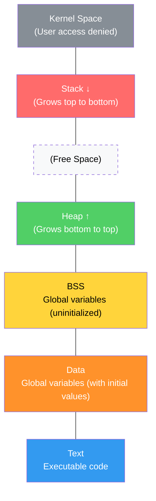
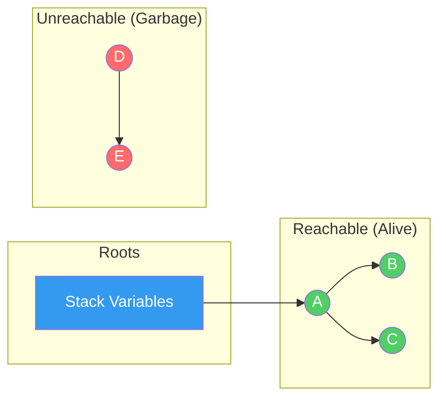
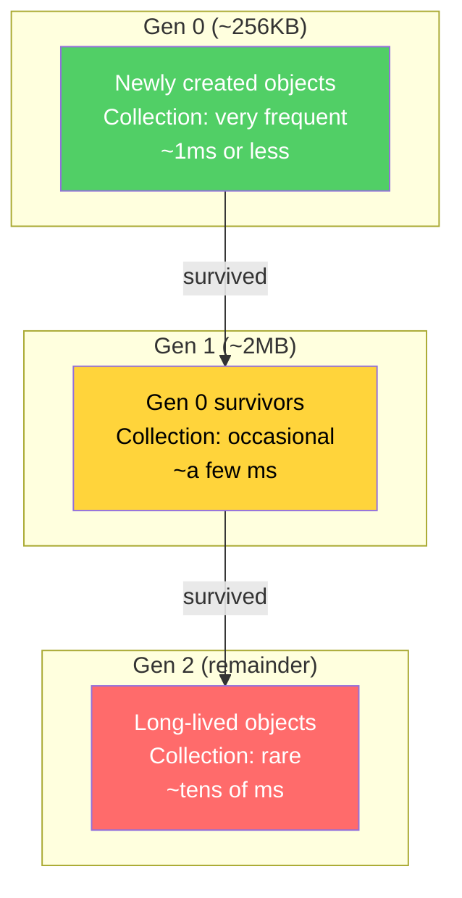
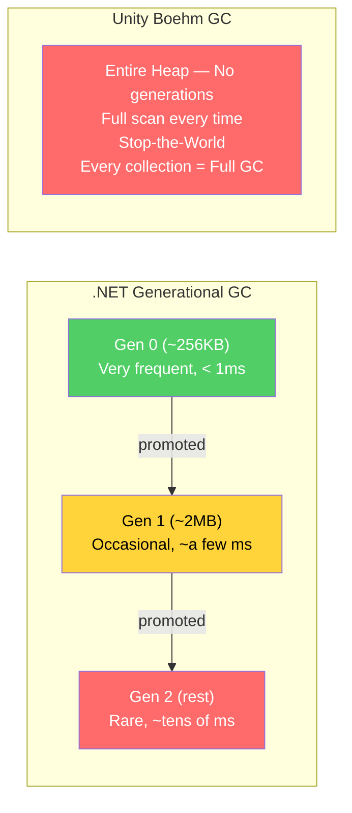
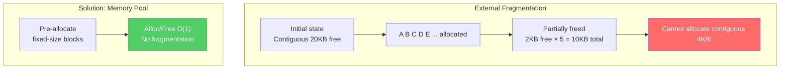
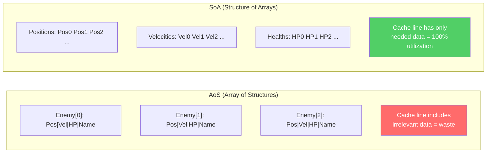

## Introduction

> This article is the 6th installment of the **CS Roadmap** series.

In [Part 1](/posts/ArrayAndLinkedList/), we saw the 100x difference between L1 cache (~1ns) and RAM (~100ns). We also saw that cache locality is the reason arrays beat linked lists. Over the next five parts exploring data structures and algorithms, the word "memory" kept showing up:

- Part 2: Call**stack** overflow — because stack memory is limited to 1–8MB
- Part 3: Why open addressing in hash tables is cache-friendly — contiguous memory
- Part 4: Why B-Trees store hundreds of keys per node — minimizing disk I/O
- Part 5: Why CSR format for graphs is fast — contiguous arrays

Now it's time to properly dissect what "memory" really is.

This article answers two questions:
1. **How does a program obtain memory, and how does it give it back?** (Stack/Heap, malloc/free, GC)
2. **Why does memory management determine frame rate in games?** (GC stalls, fragmentation, object pools)

Upcoming series structure:

| Part | Topic | Core Question |
| --- | --- | --- |
| **Part 6 (this article)** | Memory Management | What are the tradeoffs of stack/heap, GC, and manual memory management? |
| **Part 7** | Processes and Threads | What are the principles of multithreading and synchronization? |

---

## Part 1: Stack Memory — Born with a Function, Dies with a Function

### Structure of the Call Stack

In [Part 2](/posts/StackQueueDeque/), we saw how the call stack tracks function calls. This time, we'll look at how that call stack **operates in memory**.

Every time a function is called, a **stack frame** is pushed onto the top of the stack memory. A stack frame contains:

- Local variables
- Function parameters
- Return address (where to go back to when this function ends)
- Previous frame pointer

```
Stack Memory (grows from high address → low address):

High Address
┌──────────────────────┐
│   main() frame        │  a = 10, b = 20
├──────────────────────┤
│   Calculate() frame   │  x = 30, result = 0
├──────────────────────┤
│   Multiply() frame    │  p = 30, q = 2  ← Stack Pointer (SP)
├──────────────────────┤
│                      │  ← Available from here downward
│   (free space)       │
└──────────────────────┘
Low Address
```

```csharp
void Main() {
    int a = 10;           // Allocated in main's stack frame
    int b = 20;
    int result = Calculate(a + b);  // Calculate frame created
}

int Calculate(int x) {
    int result = Multiply(x, 2);   // Multiply frame created
    return result;
}                                   // Calculate frame deallocated

int Multiply(int p, int q) {
    return p * q;
}                                   // Multiply frame deallocated
```

### Why Stack Allocation Is Fast

Stack allocation is **nothing more than moving the stack pointer (SP)**.

```
Allocation: Move SP down (a few ns)
┌──────────────┐
│ Existing data │
├──────────────┤ ← Previous SP
│ New variable  │
├──────────────┤ ← New SP = Previous SP - sizeof(variable)
│              │
└──────────────┘

Deallocation: Move SP up (a few ns)
When the function returns, SP restores to its previous position → automatic deallocation
```

No need to search for free blocks, no need to update management structures. Just a single integer subtraction. This is why stack allocation is on the order of **~1ns**.

Additionally, stack memory is allocated in **contiguous space**, so a function's local variables are likely to be loaded together into the same cache line. This naturally reaps the cache locality benefits we saw in Part 1.

### Limitations of the Stack

**Size limit**: Stack size is determined by the operating system. Typically 1–8MB.

```
Default stack sizes by platform:
- Windows: 1MB
- Linux: 8MB (check with ulimit -s)
- macOS: 8MB
- Unity main thread: 1MB (worker threads are smaller)
```

If recursion depth exceeds this size — as we saw in Part 2 — a **stack overflow** occurs. This is also why we converted DFS to an explicit stack in Part 5 — explicit stacks are allocated on the heap, where size limits are far more generous.

**Lifetime limit**: Data allocated on the stack **automatically disappears** when the function returns. Data that must survive beyond the function cannot be placed on the stack.

```csharp
// Dangerous: returning the address of stack data (undefined behavior in C/C++)
int* DangerousFunction() {
    int localVar = 42;
    return &localVar;  // localVar disappears when the function returns!
}
// The returned pointer points to already-freed memory → dangling pointer
```

The solution to these limitations is **heap memory**.

---

## Part 2: Heap Memory — Freedom and Responsibility

### What Is the Heap

The heap is the region where programs **dynamically request and return memory at runtime**. It shares its name with the data structure "heap (priority queue)" from Part 4, but they are entirely different concepts.

| Property | Stack | Heap |
| --- | --- | --- |
| Allocation speed | **~1ns** (SP move) | **~100ns+** (free block search) |
| Deallocation method | **Automatic** (function return) | **Manual** or **GC** |
| Size limit | 1–8MB | **Several GB** (virtual memory) |
| Data lifetime | Function scope | **Programmer decides** |
| Fragmentation | None | **Possible** |
| Thread safety | Independent per thread | **Shared** (synchronization required) |


_Process Memory Layout — Stack grows from high address downward, Heap grows from low address upward_

### The Cost of Heap Allocation

When you request memory from the heap, the memory allocator must **find a sufficiently large free block**. This search is the fundamental reason heap allocation is slower than stack allocation.

```
Heap allocation process:

1. Program: "Give me 32 bytes"
2. Allocator: Search the free list for an empty block
   [16B free] → [64B free] → [32B free] ← This one!
3. Mark the block as allocated and return the address
4. On deallocation: Return the block to the free list

First Fit: Select the first block that is large enough
Best Fit: Select the block that fits most precisely
Worst Fit: Carve from the largest block
```

Modern allocators (jemalloc, tcmalloc, mimalloc) heavily optimize this process, but it's still tens of times slower than stack allocation.

### C/C++: Manual Memory Management

In C, heap memory is managed with `malloc`/`free`; in C++, with `new`/`delete`.

```cpp
// C style
int* arr = (int*)malloc(100 * sizeof(int));  // Allocate 400 bytes
// ... use ...
free(arr);  // Must free!

// C++ style
Enemy* enemy = new Enemy("Goblin", 100);  // Created on the heap
// ... use ...
delete enemy;  // Must delete!
```

The three nightmares of manual management:

**1. Memory Leak** — If you don't call `free`, the memory is never returned.

```cpp
void SpawnEnemies() {
    for (int i = 0; i < 1000; i++) {
        Enemy* e = new Enemy();
        e->Initialize();
        // ... combat logic ...
        // delete e; ← Forgot!
    }
    // When the function ends, the pointer e is gone,
    // but the 1000 Enemy objects on the heap remain forever
}
```

In games, memory leaks manifest as gradually increasing slowdowns that eventually crash. This is especially fatal in MMOs and open-world games with long play sessions.

**2. Dangling Pointer** — A pointer that points to freed memory.

```cpp
Enemy* boss = new Enemy("Dragon", 5000);
Enemy* target = boss;  // target also points to the same memory

delete boss;           // Memory freed
boss = nullptr;

target->TakeDamage(100);  // Crash! target points to already-freed memory
```

What makes dangling pointers even more dangerous is that they **may not crash immediately**. The freed memory can "coincidentally" work until other data overwrites it. These bugs are notoriously hard to reproduce, making them a debugging nightmare.

**3. Double Free** — Freeing the same memory twice corrupts the allocator's internal structures.

```cpp
int* data = new int[100];
delete[] data;
delete[] data;  // undefined behavior — crash, heap corruption, security vulnerability
```

### C++'s Solution: RAII and Smart Pointers

**RAII (Resource Acquisition Is Initialization)** is a core C++ pattern. It **ties the lifetime of a resource to the lifetime of an object**. Resources are acquired when the object is created and automatically released when it's destroyed.

```cpp
// RAII: std::unique_ptr — single ownership
{
    auto enemy = std::make_unique<Enemy>("Goblin", 100);
    enemy->Attack();
    // ... use ...
}   // ← When it goes out of scope, delete is automatically called. Leaks impossible!

// Ownership transfer
auto e1 = std::make_unique<Enemy>("Orc", 200);
auto e2 = std::move(e1);  // e1 is nullptr, e2 owns it
// e1->Attack(); ← Compile error (or runtime nullptr)
```

```cpp
// std::shared_ptr — shared across multiple locations, reference-counted
auto texture = std::make_shared<Texture>("grass.png");
auto material1 = std::make_shared<Material>(texture); // Ref count = 2
auto material2 = std::make_shared<Material>(texture); // Ref count = 3

material1.reset();  // Ref count = 2
material2.reset();  // Ref count = 1
// texture.reset(); → Ref count = 0 → automatic delete
```

| Smart Pointer | Ownership | Overhead | When to Use |
| --- | --- | --- | --- |
| `unique_ptr` | **Exclusive** | Almost none (same as raw pointer) | Default choice |
| `shared_ptr` | **Shared** | Ref count + control block (~16B) | When shared across multiple locations |
| `weak_ptr` | Observe only | Depends on shared_ptr | Preventing circular references |

Unreal Engine uses a mix of its own smart pointers (`TUniquePtr`, `TSharedPtr`) and **garbage collection (the `UObject` system)**. Classes that inherit from `UObject` are managed by the engine's GC, while plain C++ objects use smart pointers.

> **Let's pause and address this**
>
> **Q. How does Rust solve this problem?**
>
> Rust enforces an **Ownership** system at the language level. Every value has exactly one owner, and when the owner goes out of scope, the value is automatically freed. Dangling pointers, double frees, and data races are prevented **at compile time**. It's the only mainstream language that guarantees memory safety without GC. However, the learning curve is steep, and the game engine ecosystem is still in its early stages compared to C++.
>
> **Q. Is `new`/`delete` commonly used directly in game engines?**
>
> Most commercial game engines use **custom allocators**. They overload `new` to route through the engine's memory system instead of the general-purpose allocator. This is done to implement memory tracking, leak detection, frame allocators, pool allocators, and more. We'll cover this in more detail later.

---

## Part 3: Garbage Collection — The Cost of Automatic Deallocation

### The Basic Principle of GC

Garbage Collection (GC) is a mechanism that **automatically finds and frees memory that is no longer in use**. "No longer in use" means objects that **no variable in the program points to (are unreachable)**.

In graph terminology from Part 5: objects that are **reachable via DFS/BFS traversal** starting from roots (global variables, local variables on the stack) are alive; unreachable objects are garbage.

### Mark-and-Sweep

The most basic GC algorithm. It operates in two phases:

**Phase 1 — Mark**: Starting from the roots, traverse the reference graph. Mark reachable objects as "alive."

**Phase 2 — Sweep**: Scan the entire heap. Free objects without an "alive" mark.

```
Mark Phase:
[Root] → [A] → [C]
          ↓
         [B]

Result: A, B, C = alive
        D, E = unreachable → garbage

Sweep Phase:
Heap: [A✓] [D✗] [B✓] [E✗] [C✓]
       ↓         ↓
      keep      free      keep      free      keep
```



### Generational Garbage Collection

**Generational Hypothesis**: Most objects die shortly after creation. Objects that survive for a long time are likely to continue surviving.

Based on this observation, the heap is divided into **generations**:

```
Generational GC (.NET):

Gen 0 (Young):    Smallest, collected most frequently   ← Most objects die here
  ↓ (promoted if survived)
Gen 1 (Middle):   Medium size, collected less often      ← Survived Gen 0
  ↓ (promoted if survived)
Gen 2 (Old):      Largest, rarely collected              ← Long-lived objects (singletons, etc.)
```



**Gen 0 collection alone can handle most garbage.** Since Gen 0 is small, collection time is also short. Collecting the entire Gen 2 (Full GC) is expensive but occurs rarely.

.NET's generational GC characteristics:

| Generation | Size (typical) | Collection Frequency | Collection Cost |
| --- | --- | --- | --- |
| Gen 0 | ~256KB | Very frequent | **~1ms or less** |
| Gen 1 | ~2MB | Occasional | ~a few ms |
| Gen 2 | All the rest | Rare | **Tens of ms** (Full GC) |

### Unity's GC: The Boehm Collector

Unity runs on top of the .NET runtime, but has long used the **Boehm GC**. Characteristics of Boehm GC:

1. **Non-generational**: Collects the entire heap without generation distinction
2. **Non-compacting**: Does not relocate memory after collection → fragmentation
3. **Stop-the-World**: All threads are paused during collection

This is why GC spikes are infamous in Unity. Unlike .NET's generational GC that quickly collects only Gen 0, Boehm GC **scans the entire heap every time**.

```
Unity GC Spike:

Frame Time (ms)
20 │
   │          ┃ GC!
16 │──────────┃──────────── 60fps limit
   │          ┃
12 │  ┃  ┃   ┃  ┃  ┃
   │  ┃  ┃   ┃  ┃  ┃
 8 │  ┃  ┃   ┃  ┃  ┃
   │  ┃  ┃   ┃  ┃  ┃
 4 │  ┃  ┃   ┃  ┃  ┃
   │  ┃  ┃   ┃  ┃  ┃
 0 └──┸──┸───┸──┸──┸──
   F1  F2  F3  F4  F5

GC fires at F3 → frame time spikes → player feels "stuttering"
```

> **Unity 2021+ added the Incremental GC** option. It spreads GC work across multiple frames, mitigating spikes. However, total GC time doesn't decrease, and the fundamental limitations of Boehm (non-generational, non-compacting) remain.

### .NET Server/Desktop vs Unity's GC


_Same C# but completely different GC architecture — .NET frequently collects only small Gen 0, Unity Boehm scans the entire heap every time_

Same C#, but dramatically different GC performance:

| Property | .NET (Server/Desktop) | Unity (Boehm) |
| --- | --- | --- |
| Generational collection | **Yes** (Gen 0/1/2) | No |
| Compaction | **Yes** (resolves fragmentation) | No |
| Concurrent | **Yes** (background collection) | Limited (Incremental) |
| Typical Gen 0 collection | **< 1ms** | N/A (full collection only) |
| Full GC | Rare, tens of ms | **Every collection is a Full GC** |

> **Let's pause and address this**
>
> **Q. Why doesn't Unity use .NET's latest GC?**
>
> Unity uses IL2CPP (C# → C++ transpilation) to convert code to native code, employing a unique runtime architecture. Directly adopting .NET's CoreCLR GC within this architecture is technically complex. Unity 6 may improve this situation through CoreCLR integration, but it's still in preview.
>
> **Q. Is reference counting different from GC?**
>
> Reference counting tracks "how many pointers point to me" and immediately frees the object when the count reaches 0. It has the advantage of being **immediate and deterministic**, but it cannot handle **circular references** (A→B→A). C++'s `shared_ptr`, Objective-C/Swift's ARC, and Python's default strategy are reference counting. Python runs an additional cycle detector (based on the same principle as the DFS cycle detection from Part 5) to handle circular references.

---

## Part 4: Memory Fragmentation — The Invisible Enemy

### External Fragmentation


_Free space is sufficient but fragmented, making large allocations impossible — memory pools solve this_

When allocation and deallocation on the heap are repeated, free space becomes scattered into fragments. There may be enough total free space, but **no contiguous large block** available for allocation — this is **external fragmentation**.

```
External Fragmentation:

Initial: [████████████████████] (contiguous 20KB free)

Allocated: [A][B][C][D][E][F][G][H][I][J]

Partially freed: [A][ ][C][ ][E][ ][G][ ][I][ ]
                      ↑      ↑      ↑      ↑      ↑
                   2KB   2KB   2KB   2KB   2KB free

→ 10KB total free, but cannot allocate contiguous 4KB!
```

This is similar to the principle from Part 3 where hash table clustering degrades performance — theoretically there's space available, but in practice it can't be used, creating an "illusion of free space."

### Internal Fragmentation

When the allocator allocates **blocks larger than requested** to satisfy alignment requirements, this is **internal fragmentation**.

```
Internal Fragmentation:

Request: 13 bytes
Allocated: 16 bytes (8-byte alignment)
Wasted: 3 bytes (18.75%)

Request: 3 bytes
Allocated: 8 bytes (minimum block)
Wasted: 5 bytes (62.5%)
```

When a game allocates millions of small objects, internal fragmentation alone can waste a significant amount of memory.

### Memory Pools — The Solution to Fragmentation

A **memory pool** is an allocator that pre-allocates a large number of identically-sized blocks and returns a free block upon request.

```
Memory Pool (64-byte blocks):

Initial:
[free][free][free][free][free][free][free][free]  ← 64B × 8 = 512B pre-allocated

3 allocated:
[A ][B ][C ][free][free][free][free][free]

B freed:
[A ][free][C ][free][free][free][free][free]

D allocated → reuses B's empty slot:
[A ][D ][C ][free][free][free][free][free]

→ No external fragmentation! (all blocks are the same size)
→ Allocation/deallocation: O(1) (free list pop/push)
```

```csharp
// Simple memory pool (object pool) implementation
public class ObjectPool<T> where T : new() {
    private readonly Stack<T> pool;

    public ObjectPool(int initialSize) {
        pool = new Stack<T>(initialSize);
        for (int i = 0; i < initialSize; i++)
            pool.Push(new T());
    }

    public T Get() {
        return pool.Count > 0 ? pool.Pop() : new T();
    }

    public void Return(T obj) {
        pool.Push(obj);
    }
}
```

Benefits of memory pools:
1. **No fragmentation**: All blocks are the same size
2. **O(1) allocation/deallocation**: Pop/push from the free list
3. **Cache-friendly**: Blocks reside in contiguous memory
4. **Reduced GC pressure**: Reusing from the pool means fewer heap allocations

---

## Part 5: Practical Memory Management in Games

### Reducing GC Pressure in Unity

Three key strategies for preventing GC stalls in Unity:

**1. Object Pool**

Essential for frequently spawned/destroyed objects like bullets, particles, and enemy NPCs.

```csharp
// Unity Object Pool — Bullet example
public class BulletPool : MonoBehaviour {
    [SerializeField] private GameObject bulletPrefab;
    private Queue<GameObject> pool = new Queue<GameObject>();

    public GameObject Get() {
        GameObject bullet;
        if (pool.Count > 0) {
            bullet = pool.Dequeue();
            bullet.SetActive(true);
        } else {
            bullet = Instantiate(bulletPrefab);
        }
        return bullet;
    }

    public void Return(GameObject bullet) {
        bullet.SetActive(false);
        pool.Enqueue(bullet);
    }
}

// Usage: Get/Return instead of Instantiate/Destroy
// Before (high GC pressure):
// var bullet = Instantiate(prefab);
// Destroy(bullet, 2f);

// After (no GC pressure):
// var bullet = bulletPool.Get();
// StartCoroutine(ReturnAfter(bullet, 2f));
```

**2. Value Types (struct)**

In C#, `class` is allocated on the heap and becomes a GC target, while `struct` is allocated on the stack (or inlined) and is not subject to GC.

```csharp
// Bad: GC allocation every frame
class DamageInfo {              // Heap allocation → GC target
    public int Amount;
    public DamageType Type;
    public Vector3 Position;
}

// Good: Stack allocation, no GC burden
struct DamageInfo {             // Stack allocation (or inlined)
    public int Amount;
    public DamageType Type;
    public Vector3 Position;
}
```

Caveat: since structs are value-copied, if they're large (generally over 16–32 bytes), the copy cost can be significant. Use `in` parameters or `ref struct` to avoid copies.

**3. String Caching and StringBuilder**

In C#, strings are immutable, so every concatenation **allocates a new string on the heap**.

```csharp
// Bad: String allocation every frame (GC pressure!)
void UpdateUI() {
    scoreText.text = "Score: " + score.ToString();  // New string allocated each time
}

// Good: Reuse StringBuilder
private StringBuilder sb = new StringBuilder(32);

void UpdateUI() {
    sb.Clear();
    sb.Append("Score: ");
    sb.Append(score);
    scoreText.text = sb.ToString();  // 1 allocation (unavoidable)
}

// Best: Update only when the value changes
private int lastScore = -1;

void UpdateUI() {
    if (score == lastScore) return;  // Skip if no change
    lastScore = score;
    scoreText.text = $"Score: {score}";
}
```

### Custom Allocators in Game Engines

Commercial game engines don't use `malloc`/`new` directly; they use purpose-built **specialized allocators**.

| Allocator | Principle | Use Case |
| --- | --- | --- |
| **Linear Allocator** (Bump) | Only moves pointer forward. Deallocation = pointer reset | Per-frame temporary data |
| **Stack Allocator** | Only allows LIFO deallocation, like a stack | Scope-based resources |
| **Pool Allocator** | Pool of same-sized blocks | Bulk allocation of identical types |
| **Buddy Allocator** | Splits/merges blocks in powers of 2 | General purpose (Linux kernel) |

**Linear Allocator (Frame Allocator)** example:

```
Frame start:
[                                        ]
 ↑ offset = 0

During frame — allocations:
[AABB][particle data][temp matrix array][...]
                                    ↑ offset

Frame end — reset:
[                                        ]
 ↑ offset = 0 (everything "freed")

→ Allocation: O(1) (offset += size)
→ Deallocation: O(1) (offset = 0)
→ Fragmentation: none
→ Constraint: no individual deallocation, only for intra-frame lifetimes
```

Like stack allocation, this works by pointer movement alone and is extremely fast. It's ideal for temporary data created every frame and discarded at frame's end — collision results, AI decision intermediaries, rendering commands, etc.

> **Let's pause and address this**
>
> **Q. What is Unity's `NativeArray`?**
>
> `NativeArray<T>` is an array on **native memory** that is not managed by GC. You can choose between `Allocator.Temp` (frame linear allocator), `Allocator.TempJob` (until Job completion), or `Allocator.Persistent` (manual deallocation required). It allows handling large volumes of data without GC pressure and is designed for use with the Unity Job System. However, forgetting to manually deallocate causes memory leaks, requiring the same care as C/C++.
>
> **Q. How does Unreal Engine's memory management differ?**
>
> Unreal uses a dual strategy:
> - **UObject system**: Classes inheriting from `UObject` are managed by the engine's GC. It tracks the reference graph and frees unreachable objects. Similar to Unity's GC, but since the engine controls it directly, timing can be adjusted.
> - **Plain C++ objects**: Routed through a custom allocator hierarchy based on `FMalloc`. Uses smart pointers like `TSharedPtr` and `TUniquePtr` along with custom allocators.
>
> Thanks to this dual structure, gameplay code enjoys the convenience of GC, while performance-critical low-level systems can leverage the efficiency of manual management.

---

## Part 6: Data-Oriented Design — Memory Layout Determines Performance

### AoS vs SoA

In Part 1, we saw how array cache locality overwhelms linked lists. The same principle applies to **the memory layout of objects**.


_AoS pulls irrelevant data into cache lines, while SoA reads only the needed data contiguously_

**AoS (Array of Structures)** — the traditional OOP approach:

```csharp
// AoS: Data is grouped by object
class Enemy {
    public Vector3 Position;   // 12B
    public Vector3 Velocity;   // 12B
    public int Health;         //  4B
    public string Name;        //  8B (reference)
    // ... other fields
}

Enemy[] enemies = new Enemy[10000];
```

```
Memory Layout (AoS):
[Pos|Vel|HP|Name|...][Pos|Vel|HP|Name|...][Pos|Vel|HP|Name|...]
 ←── Enemy[0] ───→   ←── Enemy[1] ───→   ←── Enemy[2] ───→

Want to update only positions?
→ You read only Position from each Enemy, but Velocity, HP, Name also get pulled into the cache line
→ Most of the cache line is data irrelevant to this operation = cache waste
```

**SoA (Structure of Arrays)** — the Data-Oriented approach:

```csharp
// SoA: Data is grouped by property
struct EnemyData {
    public Vector3[] Positions;   // 12B × 10000 = contiguous 120KB
    public Vector3[] Velocities;  // 12B × 10000 = contiguous 120KB
    public int[] Healths;         //  4B × 10000 = contiguous  40KB
    public string[] Names;        //  8B × 10000 = contiguous  80KB
}
```

```
Memory Layout (SoA):
Positions:  [Pos0][Pos1][Pos2][Pos3][Pos4][...]  ← contiguous!
Velocities: [Vel0][Vel1][Vel2][Vel3][Vel4][...]  ← contiguous!
Healths:    [HP0 ][HP1 ][HP2 ][HP3 ][HP4 ][...]  ← contiguous!

Want to update only positions?
→ Iterate only the Positions array → cache lines contain only position data → 100% utilization
→ Velocities, Healths never enter the cache
```

```csharp
// AoS approach: Position update
for (int i = 0; i < enemies.Length; i++) {
    enemies[i].Position += enemies[i].Velocity * dt;
    // Cache line includes unnecessary HP, Name, etc.
}

// SoA approach: Position update
for (int i = 0; i < count; i++) {
    data.Positions[i] += data.Velocities[i] * dt;
    // Cache line contains only Position and Velocity — 100% useful data
}
```

Mike Acton (Insomniac Games, former Unity DOTS lead) made a strong case for this principle at GDC 2014:

> "The purpose of all programs, and all parts of those programs, is to transform data from one form to another."

How data is laid out in memory determines performance. The core of Data-Oriented Design is to prioritize data "access patterns" over object "encapsulation."

### Unity DOTS/ECS

Unity's **DOTS (Data-Oriented Technology Stack)** implements this principle at the game engine level:

- **ECS (Entity Component System)**: Attach components (pure data) to entities (IDs), and systems transform the data. Components are laid out in memory using the SoA approach.
- **Job System**: Distributes work across worker threads. Since data is in contiguous arrays, it's well-suited for parallel processing.
- **Burst Compiler**: Compiles C# code to native code (including SIMD). Can process SoA arrays 4–8 elements at a time using SIMD instructions.

```
Traditional Unity (MonoBehaviour, AoS):
10,000 enemies → 10,000 Update() calls → virtual function overhead + cache misses

DOTS (ECS, SoA):
10,000 enemies → Sequential processing of Position[], Velocity[] arrays → cache hits + SIMD

Result: 10–50x performance differences have been reported for identical logic
```

> **Let's pause and address this**
>
> **Q. Is SoA always better than AoS?**
>
> **No.** For access patterns that touch all properties of a single entity at once (e.g., serialization, network transmission), AoS is advantageous. SoA shines when **iterating over a specific property across many entities**. In practice, hybrids like **AoSoA (Array of Structure of Arrays)** or **Hybrid SoA** are used, grouping properties that are frequently accessed together.
>
> **Q. Does Data-Oriented Design replace OOP?**
>
> It **complements** rather than replaces it. Most game code (UI, game logic, event handling) works fine with OOP. Where DOD is needed is in **"hot loops" that process large amounts of data every frame** — physics simulation, particle systems, mass AI updates, animation bone calculations, etc. Since hot loop performance determines overall frame time, applying DOD to these areas yields dramatic results.

---

## Part 7: Memory Alignment and Padding

### Why Alignment Matters

CPUs read data fastest at **natural alignment** boundaries. A 4-byte `int` should be at an address that's a multiple of 4; an 8-byte `double` should be at a multiple of 8.

If alignment is violated (unaligned access), two things can happen:
- x86: **Performance degradation** (requires two memory accesses)
- ARM (some): **Crash** (hardware exception)

```
Aligned access:
Address: 0x00  0x04  0x08  0x0C
         [int ] [int ] [int ] [int ]
         ← Aligned with cache line boundaries → 1 read

Unaligned access:
Address: 0x00  0x03  0x07  0x0B
         [   int  ] [  int   ] [  int  ]
         ↑ Cache line A  | Cache line B ↑
         → 2 reads required (spans two cache lines)
```

### Struct Padding

Compilers insert **padding bytes** between fields to guarantee alignment.

```csharp
// C# struct — size varies depending on field order

// Bad: Padding waste (16 bytes)
struct BadLayout {
    byte  a;    // 1B
    // [3B padding] ← for int alignment
    int   b;    // 4B
    byte  c;    // 1B
    // [3B padding] ← for struct alignment
}               // Total 12B (6B useful data, 6B padding = 50% waste)

// Good: Minimize padding (8 bytes)
struct GoodLayout {
    int   b;    // 4B
    byte  a;    // 1B
    byte  c;    // 1B
    // [2B padding] ← for struct alignment
}               // Total 8B (6B useful data, 2B padding = 25% waste)
```

**Rule: Arrange fields from largest to smallest type** to minimize padding.

In games that handle arrays of thousands to tens of thousands of structs, the difference between 12B vs 8B per struct changes **how many elements fit in a cache line**, which directly impacts overall iteration performance.

---

## Conclusion: Know Your Memory, See Your Frames

Key takeaways from this article:

1. **Stack allocation costs ~1ns with a single pointer move; heap allocation costs tens to hundreds of ns to search for a free block.** Favor the stack (local variables, structs) when possible, and use heap allocation only when necessary.

2. **C/C++ manual management secures safety through RAII and smart pointers**, while GC-based languages gain convenience at the cost of Stop-the-World pauses. No strategy is free.

3. **Unity's GC stalls can be mitigated with object pools, struct usage, and string caching.** The best strategy is to not create "garbage" for the GC to collect in the first place.

4. **Data-Oriented Design treats memory layout as a "first-class citizen" of code**, maximizing cache hit rates. Switching from AoS to SoA alone can yield 10x or greater performance improvements.

Niklaus Wirth (creator of Pascal) summarized all of this in the title of his seminal 1976 book:

> ***Algorithms + Data Structures = Programs***

Reflecting the realities of modern hardware, we can extend this to:

> **Algorithms + Data Structures + Memory Layout = Performance**

If data structures determine "what to store and how to access it," memory management determines "where that data physically resides and how it gets reclaimed." Parts 1–5 of this series covered the former; this Part 6 covered the latter. Only when you understand both can you truly see a program's performance.

Starting from the next part, we enter the world of **operating systems and concurrency** — processes, threads, and synchronization. We'll explore how games process loading, AI, pathfinding, and physics in parallel, and examine the race conditions and deadlocks that arise in the process.

---

## References

**Key Papers and Technical Documents**
- Wilson, P.R. et al., "Dynamic Storage Allocation: A Survey and Critical Review", International Workshop on Memory Management (1995) — A comprehensive survey of memory allocation strategies
- Boehm, H.J. & Weiser, M., "Garbage Collection in an Uncooperative Environment", Software: Practice and Experience (1988) — The original Boehm GC paper (used in Unity)
- Jones, R. & Lins, R., *Garbage Collection: Algorithms for Automatic Dynamic Memory Management*, Wiley (1996, 2nd ed. 2012) — The textbook on GC algorithms
- Bacon, D.F. et al., "A Unified Theory of Garbage Collection", OOPSLA (2004) — Proves that tracing GC and reference counting are two sides of the same problem

**Talks and Presentations**
- Acton, M., "Data-Oriented Design and C++", CppCon (2014) — The definitive talk on DOD
- Acton, M., "Code Clinic 2015: How to Write Code the Compiler Can Actually Optimize", GDC (2015) — Writing cache-friendly code
- Llopis, N., "Data-Oriented Design (Or Why You Might Be Shooting Yourself in The Foot With OOP)", Game Developer Magazine (2009) — Early DOD exposition from the game industry

**Textbooks**
- Nystrom, R., *Game Programming Patterns*, Genever Benning — [gameprogrammingpatterns.com](https://gameprogrammingpatterns.com/) (free web version): Object Pool, Component, Data Locality patterns
- Gregory, J., *Game Engine Architecture*, 3rd Edition, A K Peters/CRC Press — Game engine memory systems (Chapter 6: Engine Support Systems)
- Wirth, N., *Algorithms + Data Structures = Programs*, Prentice-Hall (1976) — The classic on the relationship between algorithms and data structures
- Cormen, T.H. et al., *Introduction to Algorithms (CLRS)*, MIT Press — Amortized analysis (Chapter 17)

**Implementation References**
- .NET GC — [learn.microsoft.com](https://learn.microsoft.com/dotnet/standard/garbage-collection/): Generational GC, workstation/server modes
- Unity Memory Management — [docs.unity3d.com](https://docs.unity3d.com/): Boehm GC, Incremental GC, NativeArray
- Unity DOTS — [docs.unity3d.com/Packages/com.unity.entities](https://docs.unity3d.com/Packages/com.unity.entities@latest): ECS, Job System, Burst
- Unreal Memory — [docs.unrealengine.com](https://docs.unrealengine.com/): FMalloc, UObject GC, TSharedPtr
- jemalloc — [jemalloc.net](http://jemalloc.net/): High-performance allocator used by Facebook/Meta
- mimalloc — [github.com/microsoft/mimalloc](https://github.com/microsoft/mimalloc): Microsoft's high-performance allocator
