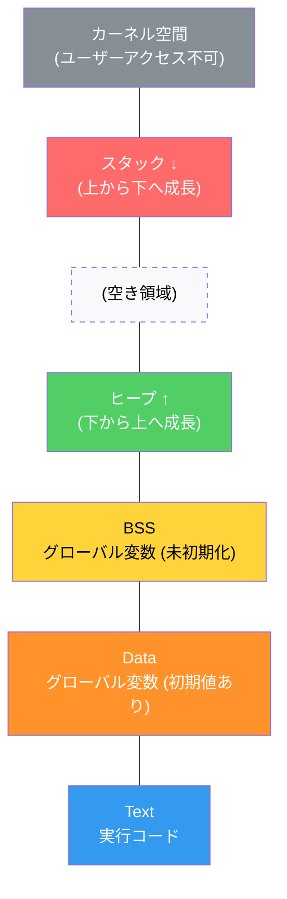
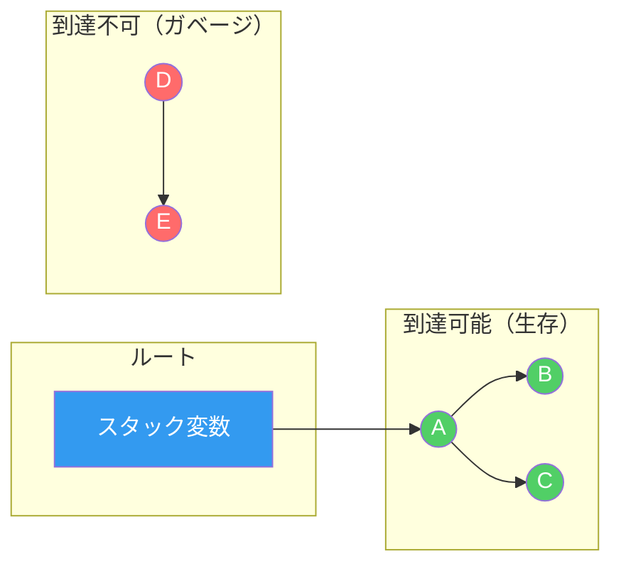
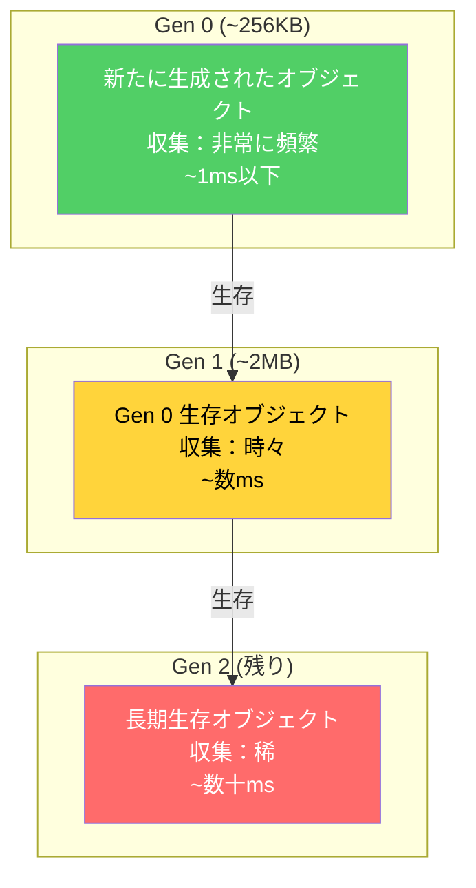
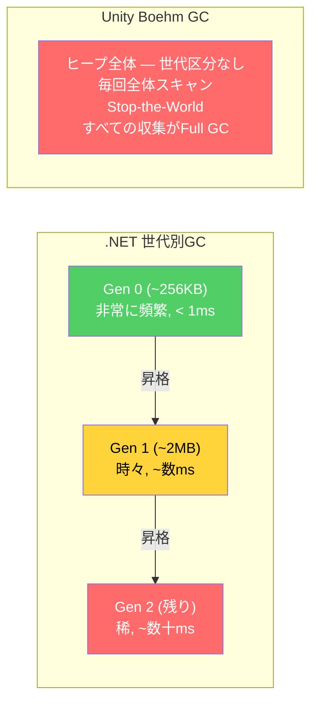
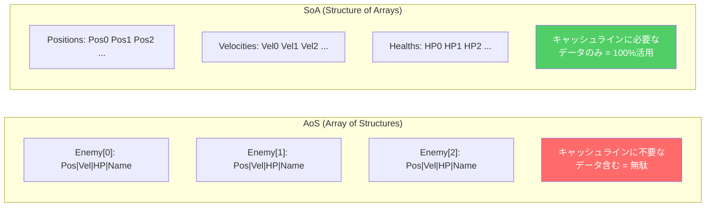

## 序論

> この文書は **CSロードマップ** シリーズの第6回です。

[第1回](/posts/ArrayAndLinkedList/)でL1キャッシュ（~1ns）とRAM（~100ns）の100倍の差を見た。配列が連結リストに勝つ理由がキャッシュの局所性だということも見た。その後、第5回まで自料構造とアルゴリズムを見てきて、「メモリ」という単語が繰り返し登場した：

- 第2回：コール**スタック**オーバーフロー — スタックメモリが1~8MBに制限されているため
- 第3回：ハッシュテーブルのオープンアドレッシングがキャッシュに優しい理由 — 連続メモリ
- 第4回：B-Treeがノードに数百個のキーを格納する理由 — ディスクI/O最小化
- 第5回：グラフのCSR形式が速い理由 — 連続配列

いよいよ、その「メモリ」の正体を本格的に掘り下げる時だ。

この記事は二つの問いに答える：
1. **プログラムはメモリをどのように取得し、どのように返却するのか？**（スタック/ヒープ、malloc/free、GC）
2. **なぜゲームではメモリ管理がフレームレートを決定するのか？**（GCストール、断片化、オブジェクトプール）

以降のシリーズ構成：

| 回 | テーマ | 核心的問い |
| --- | --- | --- |
| **第6回（今回）** | メモリ管理 | スタック/ヒープ、GC、手動メモリ管理のトレードオフは？ |
| **第7回** | プロセスとスレッド | マルチスレッドと同期の原理は？ |

---

## Part 1: スタックメモリ — 関数と共に生まれ、共に消える

### コールスタックの構造

[第2回](/posts/StackQueueDeque/)でコールスタックが関数呼び出しを追跡することを見た。今回はそのコールスタックが**メモリ上でどのように動作するか**を見ていく。

関数が呼び出されるたびに**スタックフレーム（stack frame）**がスタックメモリの最上部に積まれる。スタックフレームには以下が含まれる：

- ローカル変数
- 関数パラメータ
- リターンアドレス（この関数が終了したら戻る位置）
- 前のフレームポインタ

```
スタックメモリ（高いアドレス → 低いアドレスへ成長）：

高いアドレス
┌──────────────────────┐
│   main() フレーム      │  a = 10, b = 20
├──────────────────────┤
│   Calculate() フレーム │  x = 30, result = 0
├──────────────────────┤
│   Multiply() フレーム  │  p = 30, q = 2  ← スタックポインタ (SP)
├──────────────────────┤
│                      │  ← ここから下が使用可能
│   （空き領域）         │
└──────────────────────┘
低いアドレス
```

```csharp
void Main() {
    int a = 10;           // mainスタックフレームに割り当て
    int b = 20;
    int result = Calculate(a + b);  // Calculateフレーム生成
}

int Calculate(int x) {
    int result = Multiply(x, 2);   // Multiplyフレーム生成
    return result;
}                                   // Calculateフレーム解放

int Multiply(int p, int q) {
    return p * q;
}                                   // Multiplyフレーム解放
```

### スタック割り当てが速い理由

スタック割り当ては**スタックポインタ（SP）を移動させるのがすべて**だ。

```
割り当て：SPを下げる（数ns）
┌──────────────┐
│ 既存データ     │
├──────────────┤ ← 既存SP
│ 新しい変数     │
├──────────────┤ ← 新SP = 既存SP - sizeof(変数)
│              │
└──────────────┘

解放：SPを上げる（数ns）
関数がリターンするとSPが以前の位置に復帰 → 自動解放
```

空きブロックを探す必要もなく、管理構造を更新する必要もない。単純な整数の引き算一回。これがスタック割り当てが**~1ns水準**で速い理由だ。

また、スタックメモリは**連続した空間**に割り当てられるため、関数のローカル変数がキャッシュラインに一緒に載る確率が高い。第1回で見たキャッシュの局所性の恩恵を自然に受けられる。

### スタックの限界

**サイズ制限**：スタックサイズはOSが決定する。一般的に1~8MB。

```
プラットフォーム別デフォルトスタックサイズ：
- Windows: 1MB
- Linux: 8MB（ulimit -sで確認）
- macOS: 8MB
- Unityメインスレッド: 1MB（ワーカースレッドはさらに小さい）
```

第2回で見た再帰の深さがこのサイズを超えると**スタックオーバーフロー**が発生する。第5回でDFSを明示的スタックに変換した理由もこれだ — 明示的スタックはヒープに割り当てられるためサイズ制限がはるかに余裕がある。

**寿命制限**：スタックに割り当てられたデータは、その関数がリターンすると**自動的に消える**。関数の外でも生き続ける必要があるデータはスタックに置けない。

```csharp
// 危険：スタックデータのアドレスを返す（C/C++ではundefined behavior）
int* DangerousFunction() {
    int localVar = 42;
    return &localVar;  // localVarは関数リターン時に消える！
}
// 返されたポインタはすでに解放されたメモリを指す → ダングリングポインタ
```

この限界を解決するのが**ヒープメモリ**だ。

---

## Part 2: ヒープメモリ — 自由と責任

### ヒープとは何か

ヒープ（Heap）はプログラムが**実行時に動的に**メモリを要求し返却する領域だ。第4回で見たデータ構造の「ヒープ（Heap、優先度キュー）」とは名前が同じだけでまったく異なる概念だ。

| 特性 | スタック | ヒープ |
| --- | --- | --- |
| 割り当て速度 | **~1ns**（SP移動） | **~100ns+**（空きブロック探索） |
| 解放方式 | **自動**（関数リターン） | **手動**または**GC** |
| サイズ制限 | 1~8MB | **数GB**（仮想メモリ） |
| データ寿命 | 関数スコープ | **プログラマーが決定** |
| 断片化 | なし | **発生しうる** |
| スレッド安全性 | スレッドごとに独立 | **共有**（同期が必要） |


_プロセスメモリレイアウト — スタックは高いアドレスから下へ、ヒープは低いアドレスから上へ成長する_

### ヒープ割り当てのコスト

ヒープにメモリを要求すると、メモリアロケータ（allocator）が**十分な大きさの空きブロックを見つけなければならない**。この探索がスタック割り当てより遅い根本的な理由だ。

```
ヒープ割り当ての過程：

1. プログラム：「32バイトください」
2. アロケータ：フリーリスト（free list）で空きブロック探索
   [16B 空] → [64B 空] → [32B 空] ← これ！
3. ブロックを割り当て済みとマークしてアドレスを返す
4. 解放時：ブロックをフリーリストに返却

ファーストフィット（First Fit）：十分な大きさの最初のブロックを選択
ベストフィット（Best Fit）：最もぴったりなブロックを選択
ワーストフィット（Worst Fit）：最も大きいブロックから切り出して使用
```

現代のアロケータ（jemalloc、tcmalloc、mimalloc）はこの過程を大幅に最適化しているが、それでもスタック割り当ての数十倍以上遅い。

### C/C++：手動メモリ管理

Cでは`malloc`/`free`、C++では`new`/`delete`でヒープメモリを管理する。

```cpp
// Cスタイル
int* arr = (int*)malloc(100 * sizeof(int));  // 400バイト割り当て
// ... 使用 ...
free(arr);  // 必ず解放！

// C++スタイル
Enemy* enemy = new Enemy("Goblin", 100);  // ヒープに生成
// ... 使用 ...
delete enemy;  // 必ず解放！
```

手動管理の三つの悪夢：

**1. メモリリーク（Memory Leak）** — `free`を呼ばなければメモリは永遠に返却されない。

```cpp
void SpawnEnemies() {
    for (int i = 0; i < 1000; i++) {
        Enemy* e = new Enemy();
        e->Initialize();
        // ... 戦闘ロジック ...
        // delete e; ← うっかり忘れ！
    }
    // 関数終了時にeポインタは消えるが、
    // ヒープのEnemyオブジェクト1000個は永遠に残る
}
```

ゲームでのメモリリークは、時間の経過とともに徐々に遅くなり最終的にクラッシュするという症状として現れる。特に長時間プレイするMMOやオープンワールドゲームで致命的だ。

**2. ダングリングポインタ（Dangling Pointer）** — 解放済みメモリを指すポインタ。

```cpp
Enemy* boss = new Enemy("Dragon", 5000);
Enemy* target = boss;  // targetも同じメモリを指す

delete boss;           // メモリ解放
boss = nullptr;

target->TakeDamage(100);  // クラッシュ！targetはすでに解放されたメモリを指す
```

ダングリングポインタは**即座にクラッシュしない場合もある**という点がさらに危険だ。解放されたメモリに別のデータが上書きされるまでは「偶然」動作する可能性がある。このようなバグは再現が難しくデバッグの悪夢となる。

**3. 二重解放（Double Free）** — 同じメモリを二回`free`するとアロケータの内部構造が破損する。

```cpp
int* data = new int[100];
delete[] data;
delete[] data;  // undefined behavior — クラッシュ、ヒープ破損、セキュリティ脆弱性
```

### C++の解決策：RAIIとスマートポインタ

**RAII（Resource Acquisition Is Initialization）**はC++の核心パターンだ。リソースの寿命を**オブジェクトの寿命に紐づける**。オブジェクトが生成される時にリソースを獲得し、破棄される時に自動で解放する。

```cpp
// RAII: std::unique_ptr — 所有権はただ一つ
{
    auto enemy = std::make_unique<Enemy>("Goblin", 100);
    enemy->Attack();
    // ... 使用 ...
}   // ← スコープを抜けると自動でdelete呼び出し。リーク不可能！

// 所有権の移転
auto e1 = std::make_unique<Enemy>("Orc", 200);
auto e2 = std::move(e1);  // e1はnullptr、e2が所有
// e1->Attack(); ← コンパイルエラー（またはランタイムnullptr）
```

```cpp
// std::shared_ptr — 複数箇所で共有、参照カウントベース
auto texture = std::make_shared<Texture>("grass.png");
auto material1 = std::make_shared<Material>(texture); // 参照カウント = 2
auto material2 = std::make_shared<Material>(texture); // 参照カウント = 3

material1.reset();  // 参照カウント = 2
material2.reset();  // 参照カウント = 1
// texture.reset(); → 参照カウント = 0 → 自動delete
```

| スマートポインタ | 所有権 | オーバーヘッド | 使用場面 |
| --- | --- | --- | --- |
| `unique_ptr` | **単独** | ほぼなし（rawポインタと同等） | デフォルトの選択肢 |
| `shared_ptr` | **共有** | 参照カウント + 制御ブロック（~16B） | 複数箇所で共有する時 |
| `weak_ptr` | 観察のみ | shared_ptrに依存 | 循環参照の防止 |

Unreal Engineは独自のスマートポインタ（`TUniquePtr`、`TSharedPtr`）と**ガベージコレクション（`UObject`システム）**を併用する。`UObject`を継承するクラスはエンジンのGCが管理し、一般的なC++オブジェクトはスマートポインタを使用する。

> **ちょっと待て、これは押さえておこう**
>
> **Q. Rustはこの問題をどう解決するのか？**
>
> Rustは**所有権（Ownership）**システムを言語レベルで強制する。すべての値にちょうど一つの所有者がいて、所有者がスコープを抜けると自動的に解放される。ダングリングポインタ、二重解放、データレースを**コンパイル時に**防止する。GCなしにメモリ安全性を保証する唯一のメジャー言語だ。ただし学習曲線が急で、ゲームエンジンのエコシステムはC++に比べてまだ初期段階だ。
>
> **Q. ゲームエンジンで`new`/`delete`を直接使うケースは多いのか？**
>
> 商用ゲームエンジンはほとんど**カスタムアロケータ**を使用する。`new`をオーバーロードして汎用アロケータの代わりにエンジンのメモリシステムを通過させる。メモリ追跡、リーク検出、フレームアロケータ（frame allocator）、プールアロケータ（pool allocator）などを実装するためだ。この内容は後でより詳しく扱う。

---

## Part 3: ガベージコレクション — 自動解放のコスト

### GCの基本原理

ガベージコレクション（Garbage Collection、GC）は**もう使われていないメモリを自動的に見つけて解放する**メカニズムだ。「使われていない」とは**プログラムのどの変数も指していない（到達できない）**オブジェクトを意味する。

第5回のグラフ用語で説明すると：ルート（グローバル変数、スタックのローカル変数）から出発して参照を辿り**DFS/BFSで到達できるオブジェクト**は生きており、到達できないオブジェクトがガベージだ。

### Mark-and-Sweep

最も基本的なGCアルゴリズム。二段階で動作する：

**第1段階 — Mark（マーク）**：ルートから出発して参照グラフを探索。到達可能なオブジェクトに「生存」マークを付ける。

**第2段階 — Sweep（スイープ）**：ヒープ全体をスキャン。「生存」マークがないオブジェクトを解放。

```
Mark段階：
[ルート] → [A] → [C]
         ↓
        [B]

結果：A, B, C = 生存
      D, E = 到達不可 → ガベージ

Sweep段階：
ヒープ：[A✓] [D✗] [B✓] [E✗] [C✓]
     ↓         ↓
    保持      解放      保持      解放      保持
```



### 世代別ガベージコレクション（Generational GC）

**世代仮説（Generational Hypothesis）**：ほとんどのオブジェクトは生成直後にすぐ死ぬ。長く生き残ったオブジェクトはこれからも生き残る可能性が高い。

この観察に基づいて、ヒープを**世代（generation）**に分ける：

```
世代別GC（.NET基準）：

Gen 0 (Young)：    最も小さい、最も頻繁に収集   ← ほとんどのオブジェクトがここで死ぬ
  ↓（生き残ると昇格）
Gen 1 (Middle)：   中間サイズ、あまり頻繁でない ← Gen 0で生き残ったオブジェクト
  ↓（生き残ると昇格）
Gen 2 (Old)：      最も大きい、ほぼ収集されない ← 長期生存オブジェクト（シングルトンなど）
```



**Gen 0の収集だけでほとんどのガベージを処理**できる。Gen 0はサイズが小さいため収集時間も短い。Gen 2全体を収集（Full GC）するのはコストが高いが、稀にしか発生しない。

.NETの世代別GC特性：

| 世代 | サイズ（一般的） | 収集頻度 | 収集コスト |
| --- | --- | --- | --- |
| Gen 0 | ~256KB | 非常に頻繁 | **~1ms以下** |
| Gen 1 | ~2MB | 時々 | ~数ms |
| Gen 2 | 残り全部 | 稀 | **数十ms**（Full GC） |

### UnityのGC：Boehmコレクタ

Unityは.NETランタイム上で動作するが、長い間**Boehm GC**を使ってきた。Boehm GCの特徴：

1. **非世代別（non-generational）**：世代区分なしにヒープ全体を収集
2. **非コンパクション（non-compacting）**：収集後にメモリを再配置しない → 断片化
3. **Stop-the-World**：収集中すべてのスレッドが一時停止

これがUnityでGCスパイクが有名な理由だ。.NETの世代別GCがGen 0だけを素早く収集するのと違い、Boehm GCは**毎回ヒープ全体をスキャン**する。

```
Unity GCスパイク：

フレーム時間（ms）
20 │
   │          ┃ GC!
16 │──────────┃──────────── 60fps限界線
   │          ┃
12 │  ┃  ┃   ┃  ┃  ┃
   │  ┃  ┃   ┃  ┃  ┃
 8 │  ┃  ┃   ┃  ┃  ┃
   │  ┃  ┃   ┃  ┃  ┃
 4 │  ┃  ┃   ┃  ┃  ┃
   │  ┃  ┃   ┃  ┃  ┃
 0 └──┸──┸───┸──┸──┸──
   F1  F2  F3  F4  F5

F3でGC発生 → フレーム時間急騰 → プレイヤーが「カクつき」を感じる
```

> **Unity 2021+ではIncremental GC**オプションが追加された。GC作業を複数フレームにわたって分散実行するためスパイクは緩和される。しかし総GC時間は減らず、Boehmの根本的な限界（非世代別、非コンパクション）はそのままだ。

### .NETサーバー/デスクトップ vs UnityのGC


_同じC#だがGC構造がまったく異なる — .NETは小さなGen 0だけを頻繁に収集し、Unity Boehmは毎回全体をスキャンする_

同じC#だがGC性能が劇的に異なる：

| 特性 | .NET（サーバー/デスクトップ） | Unity（Boehm） |
| --- | --- | --- |
| 世代別収集 | **O**（Gen 0/1/2） | X |
| コンパクション（Compaction） | **O**（断片化解消） | X |
| 並行性（Concurrent） | **O**（バックグラウンド収集） | 制限的（Incremental） |
| 典型的Gen 0収集 | **< 1ms** | N/A（全体収集のみ） |
| Full GC | 稀、数十ms | **すべての収集がFull GC** |

> **ちょっと待て、これは押さえておこう**
>
> **Q. なぜUnityは.NETの最新GCを使わないのか？**
>
> UnityはIL2CPP（C# → C++トランスパイル）を通じてネイティブコードに変換する独自のランタイム構造を使用している。この構造で.NETのCoreCLR GCをそのまま持ってくるのは技術的に複雑だ。Unity 6ではCoreCLR統合を通じてこの状況が改善される可能性があるが、まだプレビュー段階だ。
>
> **Q. 参照カウンティング（Reference Counting）はGCとは違うのか？**
>
> 参照カウンティングは「自分を指すポインタの数」を追跡し、カウントが0になると即座に解放する。**即時的で決定論的**という利点があるが、**循環参照**（A→B→A）を処理できない。C++の`shared_ptr`、Objective-C/SwiftのARC、Pythonのデフォルト戦略が参照カウンティングだ。Pythonは循環参照を処理するために別途のサイクル検出器（第5回のDFSサイクル検出と同じ原理）を追加で実行する。

---

## Part 4: メモリ断片化 — 見えない敵

### 外部断片化


_空き領域は十分だが断片化して大きな割り当てが不可能な外部断片化、そして解決策のメモリプール_

ヒープでメモリの割り当てと解放を繰り返すと、空き領域が細かく散らばる。合計の空き領域は十分だが、**連続した大きなブロック**がなくて割り当てに失敗する現象が**外部断片化（external fragmentation）**だ。

```
外部断片化：

初期：[████████████████████]（連続20KB空き）

割り当て：[A][B][C][D][E][F][G][H][I][J]

一部解放：[A][ ][C][ ][E][ ][G][ ][I][ ]
              ↑      ↑      ↑      ↑      ↑
           2KB   2KB   2KB   2KB   2KB 空き

→ 合計10KBが空いているが、連続4KB割り当てが不可能！
```

これは第3回でハッシュテーブルのクラスタリングが性能を低下させるのと似た原理だ — 理論的には空間があるが、実際には使えない「見かけ上の余裕」が生まれる。

### 内部断片化

アロケータがブロックサイズをアラインメント（alignment）するために、**要求より大きなブロック**を割り当てる現象が**内部断片化（internal fragmentation）**だ。

```
内部断片化：

要求：13バイト
割り当て：16バイト（8バイトアラインメント）
無駄：3バイト（18.75%）

要求：3バイト
割り当て：8バイト（最小ブロック）
無駄：5バイト（62.5%）
```

ゲームで数百万個の小さなオブジェクトを割り当てると、内部断片化だけでもかなりのメモリが無駄になる。

### メモリプール — 断片化の解決策

**メモリプール（Memory Pool）**は同一サイズのブロックを大量にあらかじめ割り当てておき、要求時に空きブロックを返すアロケータだ。

```
メモリプール（64バイトブロック）：

初期：
[空][空][空][空][空][空][空][空]  ← 64B × 8 = 512B あらかじめ割り当て

3個割り当て：
[A ][B ][C ][空][空][空][空][空]

B解放：
[A ][空][C ][空][空][空][空][空]

D割り当て → Bの空き場所を再利用：
[A ][D ][C ][空][空][空][空][空]

→ 外部断片化なし！（すべてのブロックが同じサイズ）
→ 割り当て/解放：O(1)（フリーリストのpop/push）
```

```csharp
// シンプルなメモリプール（オブジェクトプール）実装
public class ObjectPool<T> where T : new() {
    private readonly Stack<T> pool;

    public ObjectPool(int initialSize) {
        pool = new Stack<T>(initialSize);
        for (int i = 0; i < initialSize; i++)
            pool.Push(new T());
    }

    public T Get() {
        return pool.Count > 0 ? pool.Pop() : new T();
    }

    public void Return(T obj) {
        pool.Push(obj);
    }
}
```

メモリプールの利点：
1. **断片化なし**：すべてのブロックが同一サイズ
2. **割り当て/解放 O(1)**：フリーリストでpop/push
3. **キャッシュフレンドリー**：ブロックが連続メモリに配置
4. **GC圧力の軽減**：プールで再利用するためヒープ割り当て自体が減る

---

## Part 5: ゲームでのメモリ管理実践

### UnityでGC圧力を減らす

UnityでGCストールを防止する核心戦略3つ：

**1. オブジェクトプール（Object Pool）**

弾丸、パーティクル、敵NPCのように頻繁に生成/破棄されるオブジェクトに必須。

```csharp
// Unityオブジェクトプール — 弾丸の例
public class BulletPool : MonoBehaviour {
    [SerializeField] private GameObject bulletPrefab;
    private Queue<GameObject> pool = new Queue<GameObject>();

    public GameObject Get() {
        GameObject bullet;
        if (pool.Count > 0) {
            bullet = pool.Dequeue();
            bullet.SetActive(true);
        } else {
            bullet = Instantiate(bulletPrefab);
        }
        return bullet;
    }

    public void Return(GameObject bullet) {
        bullet.SetActive(false);
        pool.Enqueue(bullet);
    }
}

// 使用法：Instantiate/Destroyの代わりにGet/Return
// Before（GC圧力高い）：
// var bullet = Instantiate(prefab);
// Destroy(bullet, 2f);

// After（GC圧力なし）：
// var bullet = bulletPool.Get();
// StartCoroutine(ReturnAfter(bullet, 2f));
```

**2. 値型（struct）の活用**

C#では`class`はヒープに割り当てられてGC対象になり、`struct`はスタックに割り当てられて（またはインラインで）GC対象にならない。

```csharp
// Bad：毎フレームGC割り当て発生
class DamageInfo {              // ヒープ割り当て → GC対象
    public int Amount;
    public DamageType Type;
    public Vector3 Position;
}

// Good：スタック割り当て、GC負担なし
struct DamageInfo {             // スタック割り当て（またはインライン）
    public int Amount;
    public DamageType Type;
    public Vector3 Position;
}
```

注意：structは値コピーされるため、サイズが大きい場合（一般的に16~32バイト超）はコピーコストが高くなりうる。`in`パラメータや`ref struct`でコピーを回避できる。

**3. 文字列キャッシングとStringBuilder**

C#では文字列は不変（immutable）なので、連結するたびに**新しい文字列がヒープに割り当て**られる。

```csharp
// Bad：毎フレーム文字列割り当て（GC圧力！）
void UpdateUI() {
    scoreText.text = "Score: " + score.ToString();  // 毎回新しいstring割り当て
}

// Good：StringBuilder再利用
private StringBuilder sb = new StringBuilder(32);

void UpdateUI() {
    sb.Clear();
    sb.Append("Score: ");
    sb.Append(score);
    scoreText.text = sb.ToString();  // 1回割り当て（仕方ない）
}

// Best：値が変わった時だけ更新
private int lastScore = -1;

void UpdateUI() {
    if (score == lastScore) return;  // 変化なければスキップ
    lastScore = score;
    scoreText.text = $"Score: {score}";
}
```

### ゲームエンジンのカスタムアロケータ

商用ゲームエンジンは`malloc`/`new`を直接使わず、用途別の**特殊アロケータ**を使用する。

| アロケータ | 原理 | 用途 |
| --- | --- | --- |
| **リニアアロケータ**（Linear/Bump） | ポインタを前にだけ移動。解放 = ポインタリセット | フレーム一時データ |
| **スタックアロケータ** | スタックのようにLIFO解放のみ許可 | スコープベースのリソース |
| **プールアロケータ** | 同一サイズのブロックプール | 同一型の大量割り当て |
| **バディアロケータ** | 2の累乗ブロックに分割/結合 | 汎用（Linuxカーネル） |

**リニアアロケータ（Frame Allocator）**の例：

```
フレーム開始：
[                                        ]
 ↑ offset = 0

フレーム中に割り当て：
[AABB][パーティクルデータ][一時行列配列][...]
                                    ↑ offset

フレーム終了 — リセット：
[                                        ]
 ↑ offset = 0（全部「解放」）

→ 割り当て：O(1)（offset += size）
→ 解放：O(1)（offset = 0）
→ 断片化：なし
→ 制約：個別解放不可能、フレーム内の寿命にのみ使用
```

この方式はスタック割り当てと同様にポインタ移動だけで動作するため極めて高速だ。ゲームで毎フレーム生成されフレーム終了時に破棄される一時データ（衝突結果、AI判断の中間値、レンダリングコマンドなど）に理想的だ。

> **ちょっと待て、これは押さえておこう**
>
> **Q. Unityの`NativeArray`とは何か？**
>
> `NativeArray<T>`はGCが管理しない**ネイティブメモリ**上の配列だ。`Allocator.Temp`（フレームリニアアロケータ）、`Allocator.TempJob`（Job完了まで）、`Allocator.Persistent`（手動解放が必要）から選択できる。GC圧力なしに大量データを扱えて、Unity Job Systemと共に使うよう設計されている。ただし手動解放を忘れるとメモリリークが発生するためC/C++と同様の注意が必要だ。
>
> **Q. Unreal Engineのメモリ管理はどう違うのか？**
>
> Unrealは二つの戦略を併用する：
> - **UObjectシステム**：`UObject`を継承するクラスはエンジンのGCが管理する。参照グラフを追跡して到達不可能なオブジェクトを解放する。UnityのGCと類似しているが、エンジンが直接制御するためタイミングを調整できる。
> - **一般C++オブジェクト**：`FMalloc`ベースのカスタムアロケータ階層を通過する。`TSharedPtr`、`TUniquePtr`などのスマートポインタとカスタムアロケータを使用する。
>
> この二重構造のおかげで、ゲームプレイコードはGCの利便性を享受し、パフォーマンスが重要な低レベルシステムは手動管理の効率性を活用できる。

---

## Part 6: Data-Oriented Design — メモリ配置が性能を決定する

### AoS vs SoA

第1回で配列のキャッシュの局所性が連結リストを圧倒することを見た。同じ原理が**オブジェクトのメモリ配置**にも適用される。


_AoSはキャッシュラインに不要なデータが混入し、SoAは必要なデータだけを連続で読む_

**AoS（Array of Structures）** — 伝統的なOOP方式：

```csharp
// AoS：オブジェクト単位でデータがまとめられている
class Enemy {
    public Vector3 Position;   // 12B
    public Vector3 Velocity;   // 12B
    public int Health;         //  4B
    public string Name;        //  8B（参照）
    // ... その他のフィールド
}

Enemy[] enemies = new Enemy[10000];
```

```
メモリレイアウト（AoS）：
[Pos|Vel|HP|Name|...][Pos|Vel|HP|Name|...][Pos|Vel|HP|Name|...]
 ←── Enemy[0] ───→   ←── Enemy[1] ───→   ←── Enemy[2] ───→

位置だけ更新するには？
→ 各EnemyからPositionだけ読むが、Velocity、HP、Nameもキャッシュラインに一緒に載る
→ キャッシュラインの大部分が今回の演算に不要なデータ = キャッシュの無駄
```

**SoA（Structure of Arrays）** — Data-Oriented方式：

```csharp
// SoA：属性別にデータがまとめられている
struct EnemyData {
    public Vector3[] Positions;   // 12B × 10000 = 連続120KB
    public Vector3[] Velocities;  // 12B × 10000 = 連続120KB
    public int[] Healths;         //  4B × 10000 = 連続 40KB
    public string[] Names;        //  8B × 10000 = 連続 80KB
}
```

```
メモリレイアウト（SoA）：
Positions:  [Pos0][Pos1][Pos2][Pos3][Pos4][...]  ← 連続！
Velocities: [Vel0][Vel1][Vel2][Vel3][Vel4][...]  ← 連続！
Healths:    [HP0 ][HP1 ][HP2 ][HP3 ][HP4 ][...]  ← 連続！

位置だけ更新するには？
→ Positions配列だけを巡回 → キャッシュラインに位置データのみ → 100%活用
→ Velocities、Healthsはキャッシュに載らない
```

```csharp
// AoS方式：位置更新
for (int i = 0; i < enemies.Length; i++) {
    enemies[i].Position += enemies[i].Velocity * dt;
    // キャッシュラインに不要なHP、Nameなどが含まれる
}

// SoA方式：位置更新
for (int i = 0; i < count; i++) {
    data.Positions[i] += data.Velocities[i] * dt;
    // キャッシュラインにPositionとVelocityだけ — 100%有効データ
}
```

Mike Acton（Insomniac Games、元Unity DOTSリード）がGDC 2014でこの原理を強く主張した：

> "The purpose of all programs, and all parts of those programs, is to transform data from one form to another."
>
> （すべてのプログラムの目的は、データをある形から別の形に変換することだ。）

データがメモリにどのように配置されるかが性能を決定する。オブジェクトの「カプセル化」よりデータの「アクセスパターン」を優先せよというのがData-Oriented Designの核心だ。

### Unity DOTS/ECS

Unityの**DOTS（Data-Oriented Technology Stack）**はこの原理をゲームエンジンレベルで実装したものだ：

- **ECS（Entity Component System）**：エンティティ（ID）にコンポーネント（純粋データ）を付与し、システムがデータを変換する。コンポーネントはSoA方式でメモリに配置される。
- **Job System**：作業をワーカースレッドに分配する。データが連続配列なので並列処理に有利だ。
- **Burst Compiler**：C#コードをネイティブコード（SIMD含む）にコンパイルする。SoA配列をSIMD命令で一度に4~8個ずつ処理できる。

```
伝統的Unity（MonoBehaviour、AoS）：
10,000体の敵 → 10,000回のUpdate()呼び出し → 仮想関数オーバーヘッド + キャッシュミス

DOTS（ECS、SoA）：
10,000体の敵 → Position[]、Velocity[]配列を順次処理 → キャッシュヒット + SIMD

結果：同一ロジックで10~50倍の性能差が報告されている
```

> **ちょっと待て、これは押さえておこう**
>
> **Q. 常にSoAがAoSより良いのか？**
>
> **そうではない。** 一つのエンティティのすべての属性を一緒にアクセスするパターン（例：シリアライズ、ネットワーク送信）ではAoSが有利だ。SoAは**特定の属性を大量に巡回するパターン**で輝く。実戦では両者を混合して、よく一緒にアクセスされる属性同士をまとめた**AoSoA（Array of Structure of Arrays）**または**Hybrid SoA**を使用することもある。
>
> **Q. Data-Oriented DesignはOOPを置き換えるのか？**
>
> 置き換えではなく**補完**だ。ゲームコードの大部分（UI、ゲームロジック、イベント処理）はOOPで十分だ。DODが必要なのは**大量データを毎フレーム処理する「ホットループ」** — 物理シミュレーション、パーティクルシステム、AI大量更新、アニメーションボーン計算などだ。ホットループの性能が全体のフレーム時間を決定するため、この部分にDODを適用すれば劇的な効果がある。

---

## Part 7: メモリアラインメントとパディング

### アラインメントの必要性

CPUはデータを**自然な境界（natural alignment）**で読む時に最も速い。4バイトの`int`は4の倍数アドレス、8バイトの`double`は8の倍数アドレスにあるべきだ。

境界に合っていなければ（unaligned access）二つのことが起きる：
- x86：**性能低下**（二回のメモリアクセスが必要）
- ARM（一部）：**クラッシュ**（ハードウェア例外）

```
アラインされたアクセス：
アドレス：0x00  0x04  0x08  0x0C
      [int ] [int ] [int ] [int ]
      ← キャッシュライン境界とアライン → 1回読み取り

非アラインアクセス：
アドレス：0x00  0x03  0x07  0x0B
      [   int  ] [  int   ] [  int  ]
      ↑ キャッシュラインA  | キャッシュラインB ↑
      → 2回読み取りが必要（二つのキャッシュラインにまたがる）
```

### 構造体パディング

コンパイラはアラインメントを保証するためにフィールド間に**パディング（padding）バイト**を挿入する。

```csharp
// C# struct — フィールド順序によってサイズが変わる

// Bad：パディングの無駄（16バイト）
struct BadLayout {
    byte  a;    // 1B
    // [パディング 3B] ← intアラインメントのため
    int   b;    // 4B
    byte  c;    // 1B
    // [パディング 3B] ← 構造体アラインメントのため
}               // 合計12B（有効データ6B、パディング6B = 50%無駄）

// Good：パディング最小化（8バイト）
struct GoodLayout {
    int   b;    // 4B
    byte  a;    // 1B
    byte  c;    // 1B
    // [パディング 2B] ← 構造体アラインメントのため
}               // 合計8B（有効データ6B、パディング2B = 25%無駄）
```

**ルール：大きい型から小さい型の順にフィールドを配置**するとパディングが最小化される。

数千~数万個の構造体を配列で扱うゲームでは、構造体サイズが12B vs 8Bの差は**キャッシュラインに入る要素数**を変え、それが全体の巡回性能に直接影響する。

---

## まとめ：メモリを知ればフレームが見える

この記事で見てきた核心：

1. **スタック割り当てはポインタ移動一回で~1ns、ヒープ割り当ては空きブロック探索で数十~数百ns**だ。できるだけスタック（ローカル変数、struct）を活用し、ヒープ割り当てはどうしても必要な時だけ使う。

2. **C/C++の手動管理はRAIIとスマートポインタで安全性を確保**し、GCベースの言語は利便性を得る代わりにStop-the-World一時停止というコストを払う。どの戦略も無料ではない。

3. **UnityのGCストールはオブジェクトプール、struct活用、文字列キャッシングで緩和**できる。GCが収集する「ガベージ」をそもそも作らないのが最善の戦略だ。

4. **Data-Oriented Designはメモリ配置をコードの「第一級市民」として扱い**、キャッシュヒット率を最大化する。AoSからSoAへの転換だけで10倍以上の性能向上が可能だ。

Niklaus Wirth（Pascal創始者）は1976年に書いた名著のタイトルでこのすべてを要約した：

> ***Algorithms + Data Structures = Programs***
>
> （アルゴリズム + データ構造 = プログラム）

ここに現代ハードウェアの現実を反映すると：

> **Algorithms + Data Structures + Memory Layout = Performance**

データ構造が「何を保存しどのようにアクセスするか」を決定するなら、メモリ管理は「そのデータが物理的にどこに置かれどのように収集されるか」を決定する。このシリーズの第1~5回が前者を、今回の第6回が後者を扱った。両方を合わせて理解した時、初めてプログラムの性能が見えてくる。

次回からは**オペレーティングシステムと並行性** — プロセス、スレッド、同期の世界に入る。ゲームでローディング、AI、パスファインディング、物理を並列処理する方法と、その過程で発生する競合状態とデッドロックを見ていく。

---

## 参考資料

**核心論文および技術文書**
- Wilson, P.R. et al., "Dynamic Storage Allocation: A Survey and Critical Review", International Workshop on Memory Management (1995) — メモリ割り当て戦略の総合サーベイ
- Boehm, H.J. & Weiser, M., "Garbage Collection in an Uncooperative Environment", Software: Practice and Experience (1988) — Boehm GCの原典（Unityで使用）
- Jones, R. & Lins, R., *Garbage Collection: Algorithms for Automatic Dynamic Memory Management*, Wiley (1996, 2nd ed. 2012) — GCアルゴリズムの教科書
- Bacon, D.F. et al., "A Unified Theory of Garbage Collection", OOPSLA (2004) — トレーシングGCと参照カウンティングが同じ問題の二つの側面であることを証明

**講演および発表**
- Acton, M., "Data-Oriented Design and C++", CppCon (2014) — DODの代表的講演
- Acton, M., "Code Clinic 2015: How to Write Code the Compiler Can Actually Optimize", GDC (2015) — キャッシュフレンドリーなコード作成法
- Llopis, N., "Data-Oriented Design (Or Why You Might Be Shooting Yourself in The Foot With OOP)", Game Developer Magazine (2009) — ゲーム業界の初期DOD解説

**教材**
- Nystrom, R., *Game Programming Patterns*, Genever Benning — [gameprogrammingpatterns.com](https://gameprogrammingpatterns.com/)（無料Web版）：Object Pool、Component、Data Localityパターン
- Gregory, J., *Game Engine Architecture*, 3rd Edition, A K Peters/CRC Press — ゲームエンジンのメモリシステム（Chapter 6: Engine Support Systems）
- Wirth, N., *Algorithms + Data Structures = Programs*, Prentice-Hall (1976) — アルゴリズムとデータ構造の関係についての古典
- Cormen, T.H. et al., *Introduction to Algorithms (CLRS)*, MIT Press — 償却分析（Chapter 17）

**実装参考**
- .NET GC — [learn.microsoft.com](https://learn.microsoft.com/dotnet/standard/garbage-collection/)：世代別GC、ワークステーション/サーバーモード
- Unity Memory Management — [docs.unity3d.com](https://docs.unity3d.com/)：Boehm GC、Incremental GC、NativeArray
- Unity DOTS — [docs.unity3d.com/Packages/com.unity.entities](https://docs.unity3d.com/Packages/com.unity.entities@latest)：ECS、Job System、Burst
- Unreal Memory — [docs.unrealengine.com](https://docs.unrealengine.com/)：FMalloc、UObject GC、TSharedPtr
- jemalloc — [jemalloc.net](http://jemalloc.net/)：Facebook/Metaが使用する高性能アロケータ
- mimalloc — [github.com/microsoft/mimalloc](https://github.com/microsoft/mimalloc)：Microsoftの高性能アロケータ
