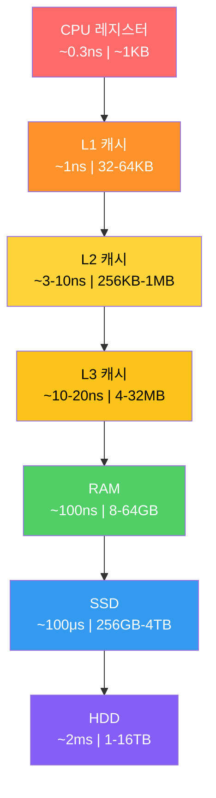
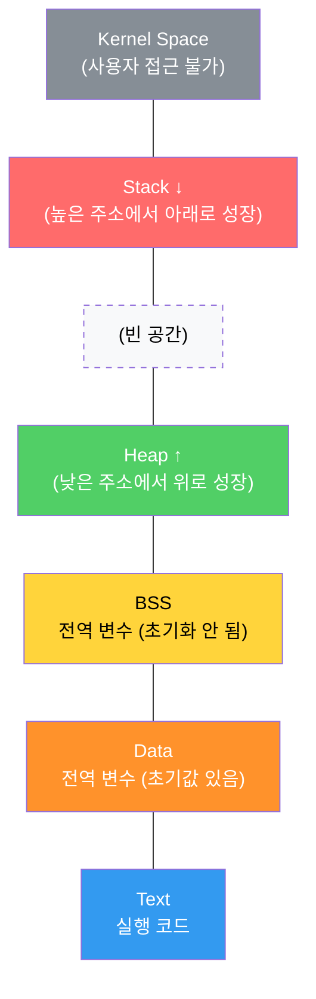
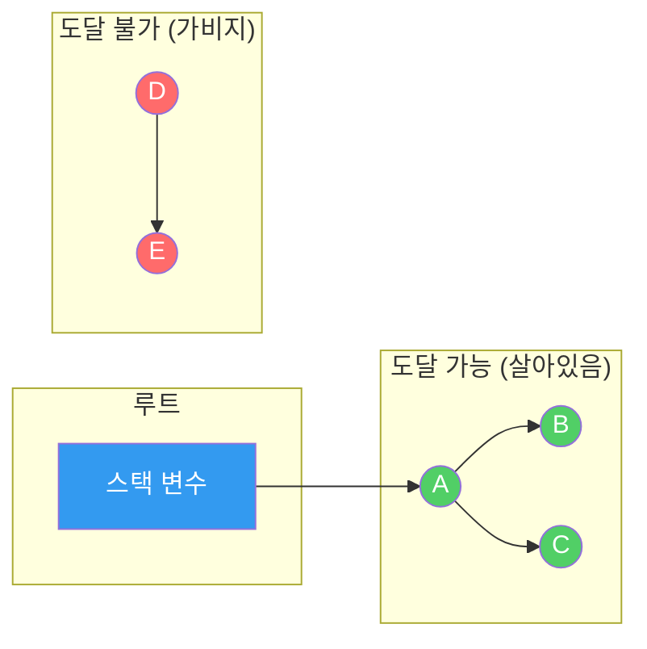
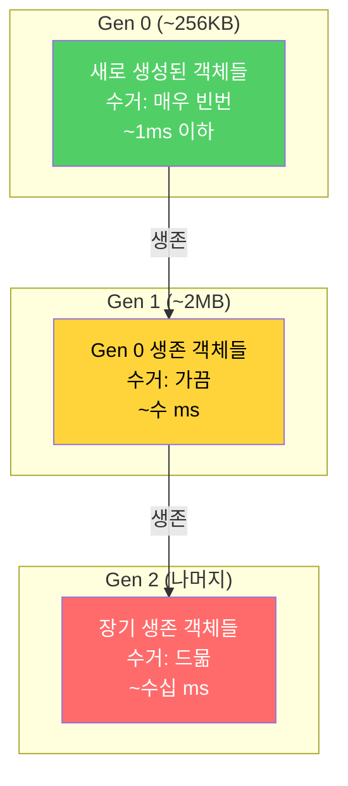
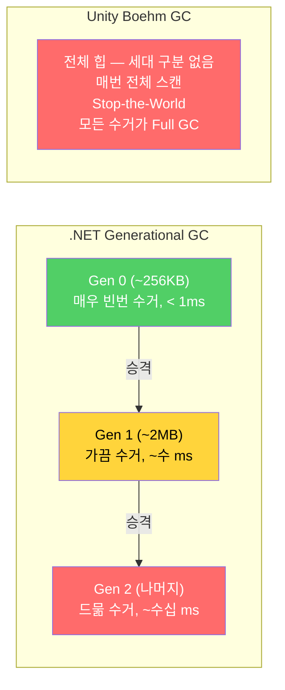
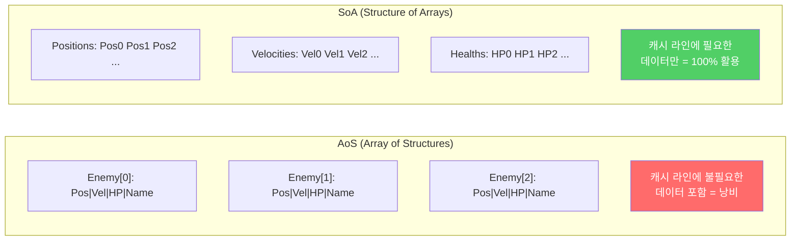

## 서론

> 이 문서는 **CS 로드맵** 시리즈의 6번째 편입니다.

[1편](/posts/ArrayAndLinkedList/)에서 L1 캐시(~1ns)와 RAM(~100ns)의 100배 차이를 보았다. 배열이 연결 리스트를 이기는 이유가 캐시 지역성이라는 것도 보았다. 그 후 5편까지 자료구조와 알고리즘을 살펴보면서, "메모리"라는 단어가 계속 등장했다:

- 2편: 콜**스택** 오버플로 — 스택 메모리가 1~8MB로 제한되어 있기 때문
- 3편: 해시 테이블의 오픈 어드레싱이 캐시 친화적인 이유 — 연속 메모리
- 4편: B-Tree가 노드에 수백 개의 키를 담는 이유 — 디스크 I/O 최소화
- 5편: 그래프의 CSR 형식이 빠른 이유 — 연속 배열

이제 그 "메모리"의 정체를 제대로 파헤칠 때다.

1편에서 보았던 메모리 계층 구조를 다시 떠올려 보자:


_CPU 레지스터(~0.3ns)부터 HDD(~2ms)까지 — 계층이 내려갈수록 용량은 커지지만 속도는 느려진다_

이 글은 두 가지 질문에 답한다:
1. **프로그램은 메모리를 어떻게 얻고, 어떻게 돌려주는가?** (스택/힙, malloc/free, GC)
2. **왜 게임에서 메모리 관리가 프레임 레이트를 결정하는가?** (GC 스톨, 단편화, 오브젝트 풀)

이후 시리즈 구성:

| 편 | 주제 | 핵심 질문 |
| --- | --- | --- |
| **6편 (이번 글)** | 메모리 관리 | 스택/힙, GC, 수동 메모리 관리의 트레이드오프는? |
| **7편** | 프로세스와 스레드 | 멀티스레드와 동기화의 원리는? |

---

## Part 1: 스택 메모리 — 함수와 함께 태어나고, 함께 죽는다

### 콜스택의 구조

[2편](/posts/StackQueueDeque/)에서 콜스택이 함수 호출을 추적하는 것을 보았다. 이번에는 그 콜스택이 **메모리에서 어떻게 동작하는지** 살펴본다.

함수가 호출될 때마다 **스택 프레임(stack frame)**이 스택 메모리의 꼭대기에 쌓인다. 스택 프레임에는 다음이 포함된다:

- 로컬 변수
- 함수 매개변수
- 반환 주소 (이 함수가 끝나면 돌아갈 위치)
- 이전 프레임 포인터

```
스택 메모리 (높은 주소 → 낮은 주소로 성장):

높은 주소
┌──────────────────────┐
│   main() 프레임       │  a = 10, b = 20
├──────────────────────┤
│   Calculate() 프레임  │  x = 30, result = 0
├──────────────────────┤
│   Multiply() 프레임   │  p = 30, q = 2  ← 스택 포인터 (SP)
├──────────────────────┤
│                      │  ← 여기부터 아래로 사용 가능
│   (빈 공간)          │
└──────────────────────┘
낮은 주소
```

```csharp
void Main() {
    int a = 10;           // main 스택 프레임에 할당
    int b = 20;
    int result = Calculate(a + b);  // Calculate 프레임 생성
}

int Calculate(int x) {
    int result = Multiply(x, 2);   // Multiply 프레임 생성
    return result;
}                                   // Calculate 프레임 해제

int Multiply(int p, int q) {
    return p * q;
}                                   // Multiply 프레임 해제
```

### 스택 할당이 빠른 이유

스택 할당은 **스택 포인터(SP)를 이동시키는 것이 전부**다.

```
할당: SP를 내린다 (수 ns)
┌──────────────┐
│ 기존 데이터    │
├──────────────┤ ← 기존 SP
│ 새 변수       │
├──────────────┤ ← 새 SP = 기존 SP - sizeof(변수)
│              │
└──────────────┘

해제: SP를 올린다 (수 ns)
함수가 반환되면 SP가 이전 위치로 복귀 → 자동 해제
```

빈 블록을 찾을 필요도 없고, 관리 구조를 갱신할 필요도 없다. 단순한 정수 뺄셈 한 번(어셈블리로 `sub rsp, N` 명령어 하나). 이것이 스택 할당이 **~1ns 수준**으로 빠른 이유다.

또한 스택 메모리는 **연속된 공간**에 할당되므로, 함수의 로컬 변수들이 캐시 라인에 함께 올라올 확률이 높다. 1편에서 본 캐시 지역성의 이점을 자연스럽게 누린다.

### 스택의 한계

**크기 제한**: 스택 크기는 운영체제가 결정한다. 일반적으로 1~8MB.

```
플랫폼별 기본 스택 크기:
- Windows: 1MB
- Linux: 8MB (ulimit -s로 확인)
- macOS: 8MB
- Unity 메인 스레드: 1MB (워커 스레드는 더 작음)
```

2편에서 본 재귀 깊이가 이 크기를 초과하면 **스택 오버플로**가 발생한다. 5편에서 DFS를 명시적 스택으로 변환한 이유도 이것이다 — 명시적 스택은 힙에 할당되므로 크기 제한이 훨씬 여유롭다.

**수명 제한**: 스택에 할당된 데이터는 해당 함수가 반환되면 **자동으로 사라진다**. 함수 밖에서도 살아있어야 하는 데이터는 스택에 둘 수 없다.

```cpp
// 위험: 스택 데이터의 주소를 반환 (C/C++에서 undefined behavior)
int* DangerousFunction() {
    int localVar = 42;
    return &localVar;  // localVar는 함수 반환 시 사라진다!
}
// 반환된 포인터는 이미 해제된 메모리를 가리킨다 → 댕글링 포인터
// 컴파일러가 경고를 주지만, 컴파일 자체는 된다 (-Wreturn-local-addr)
```

이 한계를 해결하는 것이 **힙 메모리**다.

---

## Part 2: 힙 메모리 — 자유와 책임

### 힙이란 무엇인가

힙(Heap)은 프로그램이 **런타임에 동적으로** 메모리를 요청하고 반환하는 영역이다. 4편에서 본 자료구조 "힙(Heap, 우선순위 큐)"과는 이름만 같을 뿐 전혀 다른 개념이다.

| 특성 | 스택 | 힙 |
| --- | --- | --- |
| 할당 속도 | **~1ns** (SP 이동) | **~100ns+** (빈 블록 탐색) |
| 해제 방식 | **자동** (함수 반환) | **수동** 또는 **GC** |
| 크기 제한 | 1~8MB | **수 GB** (가상 메모리) |
| 데이터 수명 | 함수 스코프 | **프로그래머가 결정** |
| 단편화 | 없음 | **발생 가능** |
| 스레드 안전성 | 스레드당 독립 | **공유** (동기화 필요) |


_프로세스 메모리 레이아웃 — 스택은 높은 주소에서 아래로, 힙은 낮은 주소에서 위로 성장한다_

### 힙 할당의 비용

힙에 메모리를 요청하면, 메모리 할당자(allocator)가 **충분히 큰 빈 블록을 찾아야** 한다. 이 탐색이 스택 할당보다 느린 근본적인 이유다.

```
힙 할당 과정:

1. 프로그램: "32바이트 주세요"
2. 할당자: 프리 리스트(free list)에서 빈 블록 탐색
   [16B 빈] → [64B 빈] → [32B 빈] ← 이거!
3. 블록을 할당 표시하고 주소 반환
4. 해제 시: 블록을 다시 프리 리스트에 반환

첫 번째 적합(First Fit): 충분히 큰 첫 블록 선택
최적 적합(Best Fit): 가장 딱 맞는 블록 선택
최악 적합(Worst Fit): 가장 큰 블록에서 잘라 사용
```

현대 할당자(jemalloc, tcmalloc, mimalloc)는 이 과정을 크게 최적화하지만, 여전히 스택 할당의 수십 배 이상 느리다.

### C/C++: 수동 메모리 관리

C에서는 `malloc`/`free`, C++에서는 `new`/`delete`로 힙 메모리를 관리한다.

```cpp
// C 스타일
int* arr = (int*)malloc(100 * sizeof(int));  // 400바이트 할당
// ... 사용 ...
free(arr);  // 반드시 해제!

// C++ 스타일
Enemy* enemy = new Enemy("Goblin", 100);  // 힙에 생성
// ... 사용 ...
delete enemy;  // 반드시 해제!
```

수동 관리의 세 가지 악몽:

**1. 메모리 누수 (Memory Leak)** — `free`를 호출하지 않으면 메모리가 영원히 반환되지 않는다.

```cpp
void SpawnEnemies() {
    for (int i = 0; i < 1000; i++) {
        Enemy* e = new Enemy();
        e->Initialize();
        // ... 전투 로직 ...
        // delete e; ← 깜빡!
    }
    // 함수 종료 시 e 포인터는 사라지지만,
    // 힙의 Enemy 객체 1000개는 영원히 남는다
}
```

게임에서 메모리 누수는 시간이 지남에 따라 점점 느려지다가 결국 크래시하는 증상으로 나타난다. 특히 장시간 플레이하는 MMO, 오픈 월드 게임에서 치명적이다.

**2. 댕글링 포인터 (Dangling Pointer)** — 해제된 메모리를 가리키는 포인터.

```cpp
Enemy* boss = new Enemy("Dragon", 5000);
Enemy* target = boss;  // target도 같은 메모리를 가리킨다

delete boss;           // 메모리 해제
boss = nullptr;

target->TakeDamage(100);  // 크래시! target은 이미 해제된 메모리를 가리킨다
```

댕글링 포인터는 **즉시 크래시하지 않을 수도 있다**는 점이 더 위험하다. 해제된 메모리에 다른 데이터가 덮어쓰여질 때까지는 "우연히" 동작할 수 있다. 이런 버그는 재현이 어려워 디버깅의 악몽이다.

**3. 이중 해제 (Double Free)** — 같은 메모리를 두 번 `free`하면 할당자의 내부 구조가 손상된다.

```cpp
int* data = new int[100];
delete[] data;
delete[] data;  // undefined behavior — 크래시, 힙 손상, 보안 취약점
```

### C++의 해결책: RAII와 스마트 포인터

**RAII(Resource Acquisition Is Initialization)**는 C++의 핵심 패턴이다. 리소스의 수명을 **객체의 수명에 묶는다**. 객체가 생성될 때 리소스를 획득하고, 소멸될 때 자동으로 해제한다.

```cpp
// RAII: std::unique_ptr — 소유권이 단 하나
{
    auto enemy = std::make_unique<Enemy>("Goblin", 100);
    enemy->Attack();
    // ... 사용 ...
}   // ← 스코프를 벗어나면 자동으로 delete 호출. 누수 불가능!

// 소유권 이전
auto e1 = std::make_unique<Enemy>("Orc", 200);
auto e2 = std::move(e1);  // e1은 nullptr, e2가 소유
// e1->Attack(); ← 런타임 크래시! (nullptr 역참조, 컴파일은 통과됨)
```

```cpp
// std::shared_ptr — 여러 곳에서 공유, 참조 카운트 기반
auto texture = std::make_shared<Texture>("grass.png");
auto material1 = std::make_shared<Material>(texture); // 참조 카운트 = 2
auto material2 = std::make_shared<Material>(texture); // 참조 카운트 = 3

material1.reset();  // 참조 카운트 = 2
material2.reset();  // 참조 카운트 = 1
// texture.reset(); → 참조 카운트 = 0 → 자동 delete
```

| 스마트 포인터 | 소유권 | 오버헤드 | 사용 시점 |
| --- | --- | --- | --- |
| `unique_ptr` | **단독** | 거의 없음 (raw pointer와 동일) | 기본 선택지 |
| `shared_ptr` | **공유** | 참조 카운트 + 제어 블록 (~16B) | 여러 곳에서 공유 시 |
| `weak_ptr` | 관찰만 | shared_ptr에 의존 | 순환 참조 방지 |

Unreal Engine은 자체 스마트 포인터(`TUniquePtr`, `TSharedPtr`)와 **가비지 컬렉션(`UObject` 시스템)**을 혼용한다. `UObject`를 상속받는 클래스는 엔진의 GC가 관리하고, 일반 C++ 객체는 스마트 포인터를 사용한다.

> **잠깐, 이건 짚고 넘어가자**
>
> **Q. Rust는 이 문제를 어떻게 해결하는가?**
>
> Rust는 **소유권(Ownership)** 시스템을 언어 수준에서 강제한다. 모든 값에 정확히 하나의 소유자가 있고, 소유자가 스코프를 벗어나면 자동으로 해제된다. 댕글링 포인터, 이중 해제, 데이터 레이스를 **컴파일 타임에** 방지한다. GC 없이 메모리 안전성을 보장하는 유일한 주류 언어다. 다만 학습 곡선이 가파르고, 게임 엔진 생태계는 C++에 비해 아직 초기 단계다.
>
> **Q. 게임 엔진에서 `new`/`delete`를 직접 쓰는 경우가 많은가?**
>
> 상용 게임 엔진은 대부분 **커스텀 할당자**를 사용한다. `new`를 오버로딩하여 범용 할당자 대신 엔진의 메모리 시스템을 통과하게 만든다. 메모리 추적, 누수 감지, 프레임 할당자(frame allocator), 풀 할당자(pool allocator) 등을 구현하기 위해서다. 이 내용은 뒤에서 더 자세히 다룬다.

---

## Part 3: 가비지 컬렉션 — 자동 해제의 비용

### GC의 기본 원리

가비지 컬렉션(Garbage Collection, GC)은 **더 이상 사용되지 않는 메모리를 자동으로 찾아서 해제**하는 메커니즘이다. "사용되지 않는"이란 **프로그램의 어떤 변수도 가리키지 않는(도달할 수 없는)** 객체를 뜻한다.

5편의 그래프 용어로 설명하면: 루트(전역 변수, 스택의 로컬 변수)에서 시작하여 참조를 따라 **DFS/BFS로 도달할 수 있는 객체**는 살아있고, 도달할 수 없는 객체는 가비지다.

### Mark-and-Sweep

가장 기본적인 GC 알고리즘. 두 단계로 동작한다:

**1단계 — Mark (표시)**: 루트에서 시작하여 참조 그래프를 탐색. 도달 가능한 객체에 "살아있음" 표시.

**2단계 — Sweep (수거)**: 힙 전체를 스캔. "살아있음" 표시가 없는 객체를 해제.

```
Mark 단계:
[루트] → [A] → [C]
         ↓
        [B]

결과: A, B, C = 살아있음
      D, E = 도달 불가 → 가비지

Sweep 단계:
힙: [A✓] [D✗] [B✓] [E✗] [C✓]
     ↓         ↓
    유지      해제      유지      해제      유지
```



### 세대별 가비지 컬렉션 (Generational GC)

**세대 가설(Generational Hypothesis)**: 대부분의 객체는 생성 직후 금방 죽는다. 오래 살아남은 객체는 계속 살아남을 가능성이 높다.

이 관찰에 기반하여, 힙을 **세대(generation)**로 나눈다:

```
세대별 GC (.NET 기준):

Gen 0 (Young):    가장 작음, 가장 자주 수거   ← 대부분의 객체가 여기서 죽음
  ↓ (살아남으면 승격)
Gen 1 (Middle):   중간 크기, 덜 자주 수거     ← Gen 0에서 살아남은 객체
  ↓ (살아남으면 승격)
Gen 2 (Old):      가장 큼, 거의 수거 안 함    ← 오래 살아남은 객체 (싱글턴 등)
```



**Gen 0 수거만으로 대부분의 가비지를 처리**할 수 있다. Gen 0은 크기가 작으므로 수거 시간도 짧다. Gen 2 전체를 수거(Full GC)하는 것은 비싸지만, 드물게 발생한다.

.NET의 세대별 GC 특성:

| 세대 | 크기 (일반적) | 수거 빈도 | 수거 비용 |
| --- | --- | --- | --- |
| Gen 0 | ~256KB | 매우 빈번 | **~1ms 이하** |
| Gen 1 | ~2MB | 가끔 | ~수 ms |
| Gen 2 | 나머지 전부 | 드묾 | **수십 ms** (Full GC) |

### Unity의 GC: Boehm 수집기

Unity는 .NET 런타임 위에서 동작하지만, 오랫동안 **Boehm GC**를 사용해왔다. Boehm GC의 특징:

1. **비세대별(non-generational)**: 세대 구분 없이 힙 전체를 수거
2. **비압축(non-compacting)**: 수거 후 메모리를 재배치하지 않음 → 단편화
3. **Stop-the-World**: 수거 중 모든 스레드 일시정지

이것이 Unity에서 GC 스파이크가 유명한 이유다. .NET의 세대별 GC가 Gen 0만 빠르게 수거하는 것과 달리, Boehm GC는 **매번 전체 힙을 스캔**한다.

```
Unity GC 스파이크:

프레임 시간 (ms)
20 │
   │          ┃ GC!
16 │──────────┃──────────── 60fps 한계선
   │          ┃
12 │  ┃  ┃   ┃  ┃  ┃
   │  ┃  ┃   ┃  ┃  ┃
 8 │  ┃  ┃   ┃  ┃  ┃
   │  ┃  ┃   ┃  ┃  ┃
 4 │  ┃  ┃   ┃  ┃  ┃
   │  ┃  ┃   ┃  ┃  ┃
 0 └──┸──┸───┸──┸──┸──
   F1  F2  F3  F4  F5

F3에서 GC 발생 → 프레임 시간 급등 → 플레이어가 "끊김"을 느낌
```

> **Unity 2021+에서는 Incremental GC** 옵션이 추가되었다. GC 작업을 여러 프레임에 걸쳐 나누어 수행하므로 스파이크가 완화된다. 그러나 총 GC 시간은 줄어들지 않으며, Boehm의 근본적인 한계(비세대별, 비압축)는 그대로다.

### .NET 서버/데스크톱 vs Unity의 GC


_같은 C#이지만 GC 구조가 완전히 다르다 — .NET은 작은 Gen 0만 자주 수거하고, Unity Boehm은 매번 전체를 스캔한다_

같은 C#이지만 GC 성능이 극적으로 다르다:

| 특성 | .NET (서버/데스크톱) | Unity (Boehm) |
| --- | --- | --- |
| 세대별 수거 | **O** (Gen 0/1/2) | X |
| 압축 (Compaction) | **O** (단편화 해소) | X |
| 동시성 (Concurrent) | **O** (백그라운드 수거) | 제한적 (Incremental) |
| 전형적 Gen 0 수거 | **< 1ms** | N/A (전체 수거만) |
| Full GC | 드묾, 수십 ms | **모든 수거가 Full GC** |

> **잠깐, 이건 짚고 넘어가자**
>
> **Q. 왜 Unity는 .NET의 최신 GC를 쓰지 않는가?**
>
> Unity는 두 가지 런타임 경로를 가진다: **Mono**(에디터 및 개발 빌드)와 **IL2CPP**(C# → C++ 트랜스파일, 릴리스 빌드). 두 경로 모두 Boehm GC를 사용해왔다. .NET의 CoreCLR GC(세대별, 압축, 동시성)를 가져오려면 런타임 전체를 교체해야 하므로 기술적으로 복잡하다. Unity 6에서는 CoreCLR 통합이 실험적 기능으로 제공되어, 향후 .NET 8+ 수준의 GC를 활용할 수 있게 될 전망이다. 다만 IL2CPP 빌드 파이프라인과의 호환성 문제가 아직 남아있다.
>
> **Q. 참조 카운팅(Reference Counting)은 GC와 다른 것인가?**
>
> 참조 카운팅은 "나를 가리키는 포인터 수"를 추적하다가, 카운트가 0이 되면 즉시 해제한다. **즉각적이고 결정론적**이라는 장점이 있지만, **순환 참조**(A→B→A)를 처리하지 못한다. C++의 `shared_ptr`, Objective-C/Swift의 ARC, Python의 기본 전략이 참조 카운팅이다. Python은 순환 참조를 처리하기 위해 별도의 사이클 감지기(5편의 DFS 사이클 감지와 같은 원리)를 추가로 실행한다.

---

## Part 4: 메모리 단편화 — 보이지 않는 적

### 외부 단편화


_빈 공간은 충분하지만 조각나서 큰 할당이 불가능한 외부 단편화, 그리고 해결책인 메모리 풀_

힙에서 메모리를 할당하고 해제하는 과정이 반복되면, 빈 공간이 조각조각 흩어진다. 총 빈 공간은 충분하지만, **연속된 큰 블록**이 없어서 할당에 실패하는 현상이 **외부 단편화(external fragmentation)**다.

```
외부 단편화:

초기: [████████████████████] (연속 20KB 빈)

할당: [A][B][C][D][E][F][G][H][I][J]

일부 해제: [A][ ][C][ ][E][ ][G][ ][I][ ]
                ↑      ↑      ↑      ↑      ↑
             2KB   2KB   2KB   2KB   2KB 빈

→ 총 10KB가 비어있지만, 연속 4KB 할당이 불가능!
```

이것은 3편에서 해시 테이블의 클러스터링이 성능을 떨어뜨리는 것과 비슷한 원리다 — 이론적으로는 공간이 있지만, 실제로 사용할 수 없는 "허상의 여유"가 생긴다.

### 내부 단편화

할당자가 블록 크기를 정렬(alignment)하기 위해, **요청보다 큰 블록**을 할당하는 현상이 **내부 단편화(internal fragmentation)**다.

```
내부 단편화:

요청: 13바이트
할당: 16바이트 (8바이트 정렬)
낭비: 3바이트 (18.75%)

요청: 3바이트
할당: 8바이트 (최소 블록)
낭비: 5바이트 (62.5%)
```

게임에서 수백만 개의 작은 객체를 할당하면, 내부 단편화만으로도 상당한 메모리가 낭비된다.

### 메모리 풀 — 단편화의 해결책

**메모리 풀(Memory Pool)**은 동일한 크기의 블록을 대량으로 미리 할당해두고, 요청 시 빈 블록을 반환하는 할당자다.

```
메모리 풀 (64바이트 블록):

초기:
[빈][빈][빈][빈][빈][빈][빈][빈]  ← 64B × 8 = 512B 미리 할당

할당 3개:
[A ][B ][C ][빈][빈][빈][빈][빈]

B 해제:
[A ][빈][C ][빈][빈][빈][빈][빈]

D 할당 → B의 빈 자리를 재사용:
[A ][D ][C ][빈][빈][빈][빈][빈]

→ 외부 단편화 없음! (모든 블록이 같은 크기)
→ 할당/해제: O(1) (프리 리스트 pop/push)
```

```csharp
// 간단한 메모리 풀 (오브젝트 풀) 구현
public interface IPoolable {
    void OnGet();       // 풀에서 꺼낼 때 초기화
    void OnReturn();    // 풀에 반환할 때 정리
}

public class ObjectPool<T> where T : IPoolable, new() {
    private readonly Stack<T> pool;

    public ObjectPool(int initialSize) {
        pool = new Stack<T>(initialSize);
        for (int i = 0; i < initialSize; i++)
            pool.Push(new T());
    }

    public T Get() {
        T obj = pool.Count > 0 ? pool.Pop() : new T();
        obj.OnGet();     // 재사용 전 상태 초기화 — 안 하면 이전 데이터가 남아 버그 발생
        return obj;
    }

    public void Return(T obj) {
        obj.OnReturn();  // 참조 정리 (다른 객체를 붙잡고 있으면 GC가 수거 못 함)
        pool.Push(obj);
    }
}
```

> 오브젝트 풀에서 가장 흔한 실수는 **반환 시 상태 초기화를 빠뜨리는 것**이다. 이전 적의 HP가 남아있는 총알, 이전 플레이어의 이름이 남아있는 UI 등의 버그가 발생한다. `IPoolable` 인터페이스로 이를 강제할 수 있다.

메모리 풀의 장점:
1. **단편화 없음**: 모든 블록이 동일 크기
2. **할당/해제 O(1)**: 프리 리스트에서 pop/push
3. **캐시 친화적**: 블록들이 연속 메모리에 위치
4. **GC 압력 감소**: 풀에서 재사용하므로 힙 할당 자체가 줄어듦

---

## Part 5: 게임에서의 메모리 관리 실전

### Unity에서 GC 압력 줄이기

Unity에서 GC 스톨을 방지하는 핵심 전략 3가지:

**1. 오브젝트 풀 (Object Pool)**

총알, 파티클, 적 NPC처럼 빈번하게 생성/파괴되는 오브젝트에 필수.

```csharp
// Unity 오브젝트 풀 — 총알 예제
public class BulletPool : MonoBehaviour {
    [SerializeField] private GameObject bulletPrefab;
    private Queue<GameObject> pool = new Queue<GameObject>();

    public GameObject Get() {
        GameObject bullet;
        if (pool.Count > 0) {
            bullet = pool.Dequeue();
            bullet.SetActive(true);
        } else {
            bullet = Instantiate(bulletPrefab);
        }
        return bullet;
    }

    public void Return(GameObject bullet) {
        bullet.SetActive(false);
        pool.Enqueue(bullet);
    }
}

// 사용: Instantiate/Destroy 대신 Get/Return
// Before (GC 압력 높음):
// var bullet = Instantiate(prefab);
// Destroy(bullet, 2f);

// After (GC 압력 없음):
// var bullet = bulletPool.Get();
// StartCoroutine(ReturnAfter(bullet, 2f));
```

**2. 값 타입(struct) 활용**

C#에서 `class`는 **항상 힙에 할당**되어 GC 대상이 된다. 반면 `struct`는 **별도의 힙 할당을 일으키지 않는다** — 로컬 변수면 스택에, class의 필드면 해당 객체 안에 인라인으로 배치된다. 핵심은 "struct를 쓰면 GC가 추적해야 할 **별도 객체가 생기지 않는다**"는 점이다.

```csharp
// Bad: 매 프레임 GC 할당 발생
class DamageInfo {              // 힙에 별도 객체 할당 → GC 대상
    public int Amount;
    public DamageType Type;
    public Vector3 Position;
}

// Good: 별도 힙 할당 없음, GC 부담 없음
struct DamageInfo {             // 로컬 변수 → 스택, 필드 → 부모 객체에 인라인
    public int Amount;
    public DamageType Type;
    public Vector3 Position;
}
```

> **주의**: struct는 값 복사되므로, 크기가 크면(일반적으로 16바이트 초과) 복사 비용이 커질 수 있다. `in` 매개변수(읽기 전용 참조 전달)나 `ref struct`로 복사를 피할 수 있다. 또한 struct를 boxing하면(`object`로 캐스팅 등) 결국 힙에 할당되어 GC 대상이 되므로 주의가 필요하다.

**3. 문자열 캐싱과 StringBuilder**

C#에서 문자열은 불변(immutable)이므로, 연결할 때마다 **새 문자열이 힙에 할당**된다.

```csharp
// Bad: 매 프레임 문자열 할당 (GC 압력!)
void UpdateUI() {
    scoreText.text = "Score: " + score.ToString();  // 매번 새 string 할당
}

// Good: StringBuilder 재사용
private StringBuilder sb = new StringBuilder(32);

void UpdateUI() {
    sb.Clear();
    sb.Append("Score: ");
    sb.Append(score);
    scoreText.text = sb.ToString();  // 1회 할당 (어쩔 수 없음)
}

// Best: 값이 변할 때만 업데이트 → 할당 빈도 자체를 줄인다
private int lastScore = -1;

void UpdateUI() {
    if (score == lastScore) return;  // 변화 없으면 스킵 → 할당 0회
    lastScore = score;
    scoreText.text = $"Score: {score}";  // 변할 때만 1회 할당
}
// 핵심: GC 압력 = 할당 횟수 × 할당 크기. 횟수를 줄이는 것이 가장 효과적이다.
```

### 게임 엔진의 커스텀 할당자

상용 게임 엔진은 `malloc`/`new`를 직접 쓰지 않고, 용도별 **특수 할당자**를 사용한다.

| 할당자 | 원리 | 용도 |
| --- | --- | --- |
| **리니어 할당자** (Linear/Bump) | 포인터를 앞으로만 이동. 해제 = 포인터 리셋 | 프레임 임시 데이터 |
| **스택 할당자** | 스택처럼 LIFO 해제만 허용 | 스코프 기반 리소스 |
| **풀 할당자** | 동일 크기 블록 풀 | 동일 타입 대량 할당 |
| **버디 할당자** | 2의 거듭제곱 블록으로 분할/병합 | 범용 (Linux 커널) |

**리니어 할당자 (Frame Allocator)** 예시:

```
프레임 시작:
[                                        ]
 ↑ offset = 0

프레임 중 할당:
[AABB][파티클 데이터][임시 행렬 배열][...]
                                    ↑ offset

프레임 끝 — 리셋:
[                                        ]
 ↑ offset = 0 (전부 "해제")

→ 할당: O(1) (offset += size)
→ 해제: O(1) (offset = 0)
→ 단편화: 없음
→ 제약: 개별 해제 불가능, 프레임 내 수명에만 사용
```

이 방식은 스택 할당과 마찬가지로 포인터 이동만으로 동작하므로 극도로 빠르다. 게임에서 매 프레임 생성되고 프레임 끝에 버려지는 임시 데이터(충돌 결과, AI 판단 중간값, 렌더링 커맨드 등)에 이상적이다.

> **잠깐, 이건 짚고 넘어가자**
>
> **Q. Unity의 `NativeArray`는 무엇인가?**
>
> `NativeArray<T>`는 GC가 관리하지 않는 **네이티브 메모리** 위의 배열이다. `Allocator.Temp`(프레임 리니어 할당자), `Allocator.TempJob`(Job 완료까지), `Allocator.Persistent`(수동 해제 필요) 중 선택할 수 있다. GC 압력 없이 대량 데이터를 다룰 수 있으며, Unity Job System과 함께 사용하도록 설계되었다. 다만 수동 해제를 잊으면 메모리 누수가 발생하므로 C/C++의 주의가 필요하다.
>
> **Q. Unreal Engine의 메모리 관리는 어떻게 다른가?**
>
> Unreal은 두 가지 전략을 혼용한다:
> - **UObject 시스템**: `UObject`를 상속받는 클래스는 엔진의 GC가 관리한다. 참조 그래프를 추적하여 도달 불가능한 오브젝트를 해제한다. Unity의 GC와 유사하지만, 엔진이 직접 제어하므로 타이밍을 조절할 수 있다.
> - **일반 C++ 객체**: `FMalloc` 기반의 커스텀 할당자 계층을 거친다. `TSharedPtr`, `TUniquePtr` 등 스마트 포인터와 커스텀 할당자를 사용한다.
>
> 이 이중 구조 덕분에, 게임플레이 코드는 GC의 편의성을 누리고, 성능이 중요한 저수준 시스템은 수동 관리의 효율성을 활용할 수 있다.

---

## Part 6: Data-Oriented Design — 메모리 배치가 성능을 결정한다

### AoS vs SoA

1편에서 배열의 캐시 지역성이 연결 리스트를 압도하는 것을 보았다. 같은 원리가 **객체의 메모리 배치**에도 적용된다.


_AoS는 하나의 캐시 라인에 불필요한 데이터가 섞여 들어오고, SoA는 필요한 데이터만 연속으로 읽는다_

**AoS (Array of Structures)** — 전통적인 OOP 방식:

```csharp
// AoS: 객체 단위로 데이터가 묶여있다
class Enemy {
    public Vector3 Position;   // 12B
    public Vector3 Velocity;   // 12B
    public int Health;         //  4B
    public string Name;        //  8B (참조)
    // ... 기타 필드
}

Enemy[] enemies = new Enemy[10000];
```

```
메모리 레이아웃 (AoS):
[Pos|Vel|HP|Name|...][Pos|Vel|HP|Name|...][Pos|Vel|HP|Name|...]
 ←── Enemy[0] ───→   ←── Enemy[1] ───→   ←── Enemy[2] ───→

위치만 업데이트하려면?
→ 각 Enemy에서 Position만 읽지만, Velocity, HP, Name도 캐시 라인에 딸려옴
→ 캐시 라인의 대부분이 이번 연산에 불필요한 데이터 = 캐시 낭비
```

**SoA (Structure of Arrays)** — Data-Oriented 방식:

```csharp
// SoA: 속성별로 데이터가 묶여있다
struct EnemyData {
    public Vector3[] Positions;   // 12B × 10000 = 연속 120KB
    public Vector3[] Velocities;  // 12B × 10000 = 연속 120KB
    public int[] Healths;         //  4B × 10000 = 연속  40KB
    public string[] Names;        //  8B × 10000 = 연속  80KB
}
```

```
메모리 레이아웃 (SoA):
Positions:  [Pos0][Pos1][Pos2][Pos3][Pos4][...]  ← 연속!
Velocities: [Vel0][Vel1][Vel2][Vel3][Vel4][...]  ← 연속!
Healths:    [HP0 ][HP1 ][HP2 ][HP3 ][HP4 ][...]  ← 연속!

위치만 업데이트하려면?
→ Positions 배열만 순회 → 캐시 라인에 위치 데이터만 → 100% 활용
→ Velocities, Healths는 캐시에 올라오지 않음
```

```csharp
// AoS 방식: 위치 업데이트
for (int i = 0; i < enemies.Length; i++) {
    enemies[i].Position += enemies[i].Velocity * dt;
    // 캐시 라인에 불필요한 HP, Name 등이 포함됨
}

// SoA 방식: 위치 업데이트
for (int i = 0; i < count; i++) {
    data.Positions[i] += data.Velocities[i] * dt;
    // 캐시 라인에 Position과 Velocity만 — 100% 유효 데이터
}
```

Mike Acton(Insomniac Games, 前 Unity DOTS 리드)이 GDC 2014에서 이 원리를 강력히 주장했다:

> "The purpose of all programs, and all parts of those programs, is to transform data from one form to another."
>
> (모든 프로그램의 목적은 데이터를 한 형태에서 다른 형태로 변환하는 것이다.)

데이터가 어떻게 메모리에 배치되느냐가 성능을 결정한다. 객체의 "캡슐화"보다 데이터의 "접근 패턴"을 우선시하라는 것이 Data-Oriented Design의 핵심이다.

### Unity DOTS/ECS

Unity의 **DOTS(Data-Oriented Technology Stack)**은 이 원리를 게임 엔진 수준에서 구현한 것이다:

- **ECS(Entity Component System)**: 엔티티(ID)에 컴포넌트(순수 데이터)를 붙이고, 시스템이 데이터를 변환. 컴포넌트는 SoA 방식으로 메모리에 배치된다.
- **Job System**: 작업을 워커 스레드에 분배. 데이터가 연속 배열이므로 병렬 처리에 유리하다.
- **Burst Compiler**: C# 코드를 네이티브 코드(SIMD 포함)로 컴파일. SoA 배열을 SIMD 명령어로 한 번에 4~8개씩 처리할 수 있다.

```
전통 Unity (MonoBehaviour, AoS):
10,000 적 → 10,000 Update() 호출 → 가상 함수 오버헤드 + 캐시 미스

DOTS (ECS, SoA):
10,000 적 → Position[], Velocity[] 배열을 순차 처리 → 캐시 히트 + SIMD

결과: 동일 로직에서 10~50배 성능 차이가 나는 경우가 보고된다
```

> **잠깐, 이건 짚고 넘어가자**
>
> **Q. 항상 SoA가 AoS보다 좋은가?**
>
> **아니다.** 하나의 엔티티의 모든 속성을 함께 접근하는 패턴(예: 직렬화, 네트워크 전송)에서는 AoS가 유리하다. SoA는 **특정 속성을 대량으로 순회하는 패턴**에서 빛난다. 실전에서는 둘을 혼합하여, 자주 함께 접근되는 속성끼리 묶는 **AoSoA (Array of Structure of Arrays)** 또는 **Hybrid SoA**를 사용하기도 한다.
>
> **Q. Data-Oriented Design이 OOP를 대체하는 건가?**
>
> 대체가 아니라 **보완**이다. 게임 코드의 대부분(UI, 게임 로직, 이벤트 처리)은 OOP로 충분하다. DOD가 필요한 곳은 **대량 데이터를 매 프레임 처리하는 "핫 루프"** — 물리 시뮬레이션, 파티클 시스템, AI 대량 업데이트, 애니메이션 본 계산 등이다. 핫 루프의 성능이 전체 프레임 시간을 결정하므로, 이 부분에 DOD를 적용하면 극적인 효과가 있다.

---

## Part 7: 메모리 정렬과 패딩

### 정렬의 필요성

CPU는 데이터를 **자연스러운 경계(natural alignment)**에서 읽을 때 가장 빠르다. 4바이트 `int`는 4의 배수 주소, 8바이트 `double`은 8의 배수 주소에 있어야 한다.

경계에 맞지 않으면(unaligned access) 두 가지 일이 발생한다:
- x86: **성능 저하** (두 번의 메모리 접근 필요)
- ARM (일부): **크래시** (하드웨어 예외)

```
정렬된 접근:
주소: 0x00  0x04  0x08  0x0C
      [int ] [int ] [int ] [int ]
      ← 캐시 라인 경계와 정렬 → 1번 읽기

비정렬 접근:
주소: 0x00  0x03  0x07  0x0B
      [   int  ] [  int   ] [  int  ]
      ↑ 캐시 라인 A  | 캐시 라인 B ↑
      → 2번 읽기 필요 (두 캐시 라인에 걸침)
```

### 구조체 패딩

컴파일러는 정렬을 보장하기 위해 필드 사이에 **패딩(padding) 바이트**를 삽입한다.

```csharp
// C# struct — 필드 순서에 따라 크기가 달라진다 (Sequential 레이아웃 기준)

// Bad: 패딩 낭비
struct BadLayout {
    byte  a;    // offset 0, 1B
    // [패딩 3B] ← int 정렬(4의 배수)을 위해
    int   b;    // offset 4, 4B
    byte  c;    // offset 8, 1B
    // [패딩 3B] ← 구조체 전체 크기를 최대 정렬(4)의 배수로 맞추기 위해
}               // 총 12B (유효 데이터 6B, 패딩 6B = 50% 낭비)

// Good: 패딩 최소화
struct GoodLayout {
    int   b;    // offset 0, 4B
    byte  a;    // offset 4, 1B
    byte  c;    // offset 5, 1B
    // [패딩 2B] ← 구조체 전체 크기를 4의 배수로 맞추기 위해
}               // 총 8B (유효 데이터 6B, 패딩 2B = 25% 낭비)
```

> C#에서 `[StructLayout(LayoutKind.Sequential)]`가 기본값이므로 필드 선언 순서가 메모리 배치 순서와 같다. C/C++도 마찬가지다. `[StructLayout(LayoutKind.Auto)]`를 지정하면 CLR이 패딩을 최소화하도록 필드를 자동 재배치하지만, P/Invoke나 네이티브 호환이 필요한 경우에는 Sequential을 써야 한다.

**규칙: 큰 타입부터 작은 타입 순으로 필드를 배치**하면 패딩이 최소화된다. 위 예시에서 `int → byte → byte` 순으로 바꾸는 것만으로 구조체 크기가 **33% 줄었다** (12B → 8B).

수천~수만 개의 구조체를 배열로 다루는 게임에서, 이 차이는 **캐시 라인(64B)에 들어가는 원소 수**를 바꾼다:
- `BadLayout[64B]` = 64 / 12 = **5개**
- `GoodLayout[64B]` = 64 / 8 = **8개** (60% 더 많음)

동일 데이터에 대해 캐시 효율이 60% 향상되므로, 대량 순회 성능에 직접 영향을 준다.

### 실전에서 크기 확인하기

이론적 계산이 맞는지 직접 확인하는 습관이 중요하다.

```csharp
// C# — System.Runtime.InteropServices.Marshal.SizeOf로 확인
using System.Runtime.InteropServices;

Console.WriteLine(Marshal.SizeOf<BadLayout>());   // 12
Console.WriteLine(Marshal.SizeOf<GoodLayout>());  // 8
```

```cpp
// C++ — sizeof로 확인
#include <cstdio>

struct BadLayout  { char a; int b; char c; };
struct GoodLayout { int b; char a; char c; };

int main() {
    printf("BadLayout:  %zu\n", sizeof(BadLayout));   // 12
    printf("GoodLayout: %zu\n", sizeof(GoodLayout));  // 8
}
```

> C++에서는 `#pragma pack(1)` 또는 `__attribute__((packed))`으로 패딩을 제거할 수 있지만, 비정렬 접근으로 인한 성능 저하나 플랫폼 호환 문제가 발생할 수 있으므로 네트워크 패킷이나 파일 포맷 등 **바이트 레벨 호환이 필요한 경우에만** 사용한다.

---

## 마무리: 메모리를 알면 프레임이 보인다

이 글에서 살펴본 핵심:

1. **스택 할당은 포인터 이동 한 번으로 ~1ns, 힙 할당은 빈 블록 탐색으로 수십~수백 ns**다. 가능하면 스택(로컬 변수, struct)을 활용하고, 힙 할당은 꼭 필요할 때만 사용한다.

2. **C/C++의 수동 관리는 RAII와 스마트 포인터로 안전성을 확보**하고, GC 기반 언어는 편의성을 얻는 대신 Stop-the-World 일시정지라는 비용을 치른다. 어떤 전략도 무료가 아니다.

3. **Unity의 GC 스톨은 오브젝트 풀, struct 활용, 문자열 캐싱으로 완화**할 수 있다. GC가 수거할 "가비지"를 아예 만들지 않는 것이 최선의 전략이다.

4. **Data-Oriented Design은 메모리 배치를 코드의 "1등 시민"으로 대우**하여, 캐시 히트율을 극대화한다. AoS에서 SoA로의 전환만으로 10배 이상의 성능 향상이 가능하다.

5. **구조체 필드 순서 하나가 메모리 크기와 캐시 효율을 바꾼다.** 큰 타입부터 배치하는 단순한 규칙만으로 패딩 낭비를 줄이고, 캐시 라인당 더 많은 데이터를 담을 수 있다.

Niklaus Wirth(Pascal 창시자)는 1976년에 쓴 명저의 제목에서 이 모든 것을 요약했다:

> ***Algorithms + Data Structures = Programs***
>
> (알고리즘 + 자료구조 = 프로그램)

여기에 현대 하드웨어의 현실을 반영하면:

> **Algorithms + Data Structures + Memory Layout = Performance**

자료구조가 "무엇을 저장하고 어떻게 접근하는가"를 결정한다면, 메모리 관리는 "그 데이터가 물리적으로 어디에 놓이고 어떻게 수거되는가"를 결정한다. 이 시리즈의 1~5편이 전자를, 이번 6편이 후자를 다루었다. 둘을 함께 이해할 때 비로소 프로그램의 성능이 보인다.

다음 편부터는 **운영체제와 동시성** — 프로세스, 스레드, 동기화의 세계로 들어간다. 게임에서 로딩, AI, 패스파인딩, 물리를 병렬로 처리하는 방법과, 그 과정에서 발생하는 경쟁 조건과 교착 상태를 살펴본다.

---

## 참고 자료

**핵심 논문 및 기술 문서**
- Wilson, P.R. et al., "Dynamic Storage Allocation: A Survey and Critical Review", International Workshop on Memory Management (1995) — 메모리 할당 전략의 종합 서베이
- Boehm, H.J. & Weiser, M., "Garbage Collection in an Uncooperative Environment", Software: Practice and Experience (1988) — Boehm GC의 원전 (Unity에서 사용)
- Jones, R. & Lins, R., *Garbage Collection: Algorithms for Automatic Dynamic Memory Management*, Wiley (1996, 2nd ed. 2012) — GC 알고리즘의 교과서
- Bacon, D.F. et al., "A Unified Theory of Garbage Collection", OOPSLA (2004) — 추적 기반 GC와 참조 카운팅이 같은 문제의 두 측면임을 증명

**강연 및 발표**
- Acton, M., "Data-Oriented Design and C++", CppCon (2014) — DOD의 대표적 강연
- Acton, M., "Code Clinic 2015: How to Write Code the Compiler Can Actually Optimize", GDC (2015) — 캐시 친화적 코드 작성법
- Llopis, N., "Data-Oriented Design (Or Why You Might Be Shooting Yourself in The Foot With OOP)", Game Developer Magazine (2009) — 게임 업계의 초기 DOD 해설

**교재**
- Nystrom, R., *Game Programming Patterns*, Genever Benning — [gameprogrammingpatterns.com](https://gameprogrammingpatterns.com/) (무료 웹 버전): Object Pool, Component, Data Locality 패턴
- Gregory, J., *Game Engine Architecture*, 3rd Edition, A K Peters/CRC Press — 게임 엔진의 메모리 시스템 (Chapter 6: Engine Support Systems)
- Wirth, N., *Algorithms + Data Structures = Programs*, Prentice-Hall (1976) — 알고리즘과 자료구조의 관계에 대한 고전
- Cormen, T.H. et al., *Introduction to Algorithms (CLRS)*, MIT Press — 상각 분석 (Chapter 17)

**구현 참고**
- .NET GC — [learn.microsoft.com](https://learn.microsoft.com/dotnet/standard/garbage-collection/): 세대별 GC, 워크스테이션/서버 모드
- Unity Memory Management — [docs.unity3d.com](https://docs.unity3d.com/): Boehm GC, Incremental GC, NativeArray
- Unity DOTS — [docs.unity3d.com/Packages/com.unity.entities](https://docs.unity3d.com/Packages/com.unity.entities@latest): ECS, Job System, Burst
- Unreal Memory — [docs.unrealengine.com](https://docs.unrealengine.com/): FMalloc, UObject GC, TSharedPtr
- jemalloc — [jemalloc.net](http://jemalloc.net/): Facebook/Meta가 사용하는 고성능 할당자
- mimalloc — [github.com/microsoft/mimalloc](https://github.com/microsoft/mimalloc): Microsoft의 고성능 할당자
