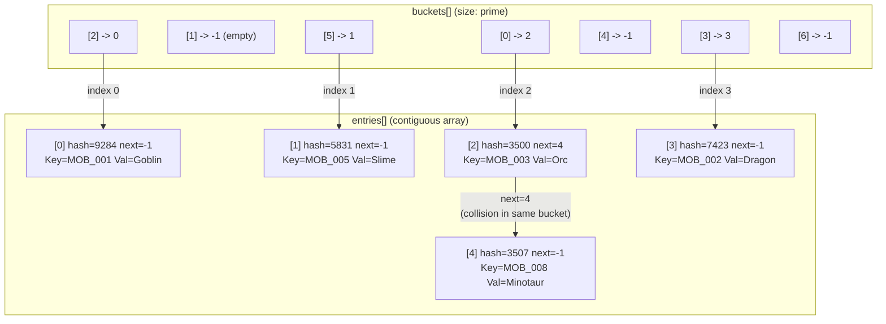
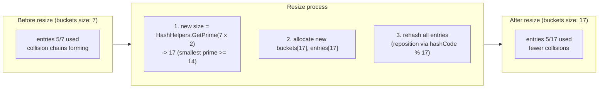
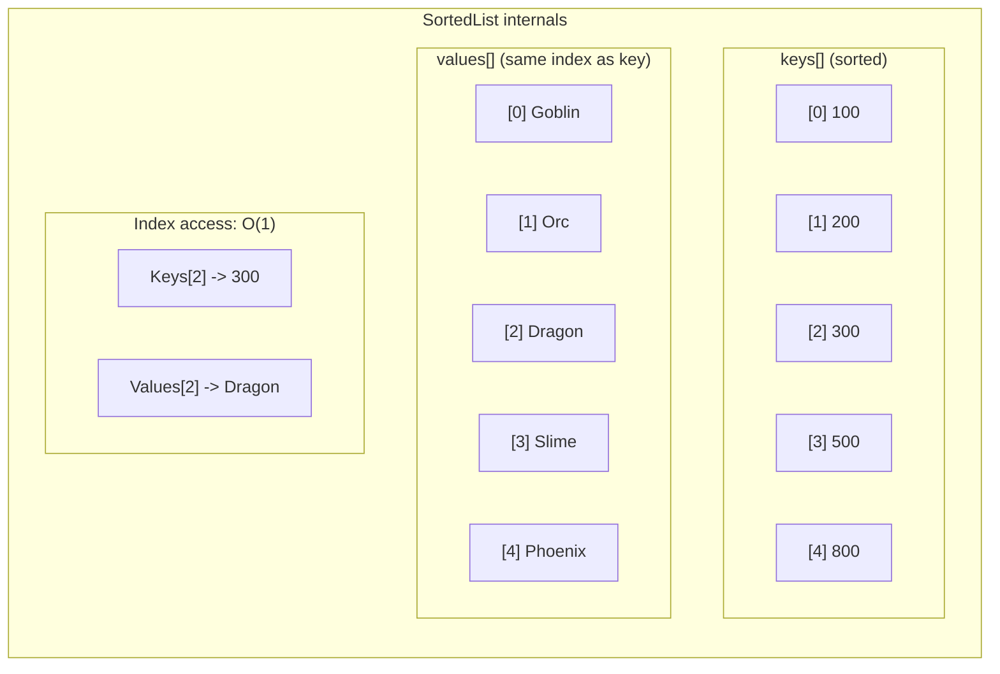
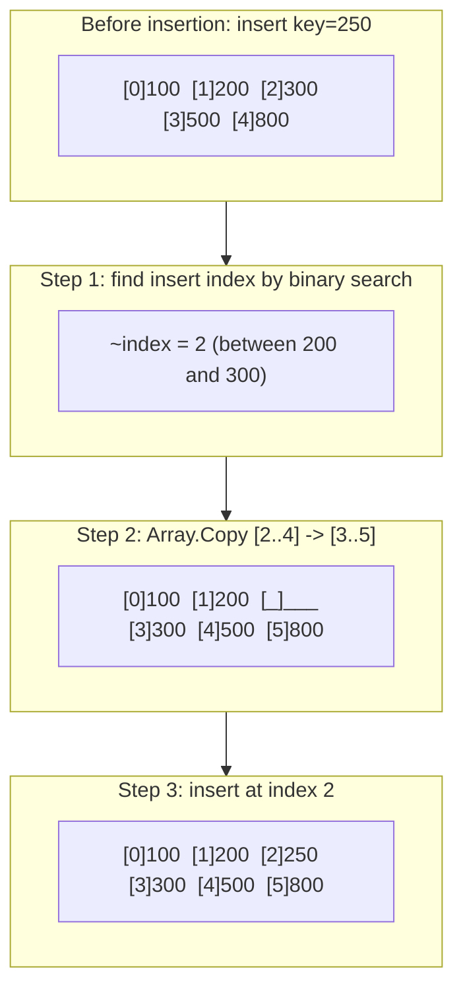
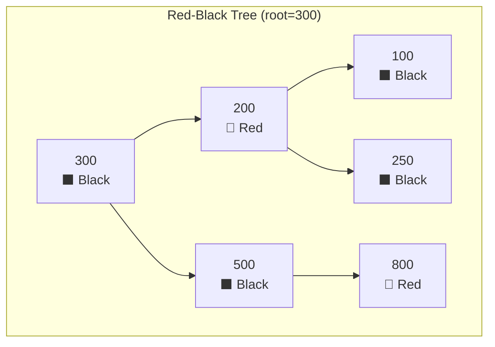
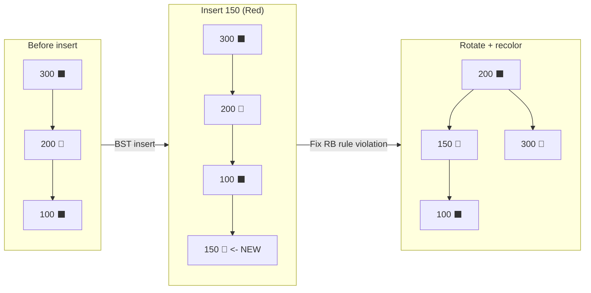
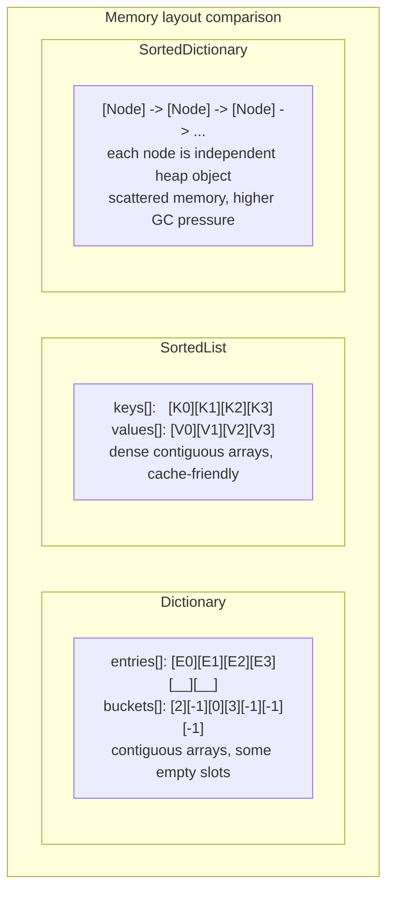
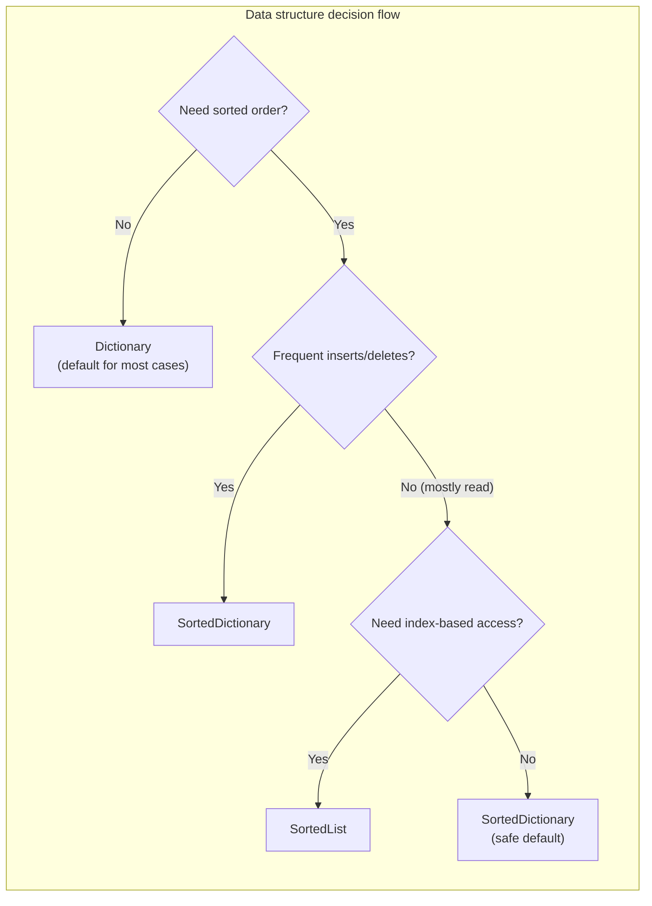

## Introduction

In game development, how you store and look up data directly affects performance. If you need to query thousands of monster stats by ID, keep an inventory sorted, or display ranking data in order, the optimal data structure differs by scenario.

In C#, the three representative key-value collections are `Dictionary<TKey, TValue>`, `SortedList<TKey, TValue>`, and `SortedDictionary<TKey, TValue>`. They look similar on the surface, but their internal implementations are completely different, and so are their performance characteristics.

This article analyzes the **internal behavior** of each collection at a .NET runtime source-level perspective and summarizes **which one to choose and when** from a game development standpoint.

---

## Part 1: Internal Structures

### 1. Dictionary - Hash Table Based

`Dictionary<TKey, TValue>` is the most frequently used key-value collection in C#. Internally it is implemented as a **hash table**, providing average O(1) lookup.

#### Real internal layout: buckets + entries

At the core, Dictionary uses **two arrays**:

```csharp
// .NET Runtime source (simplified)
private int[] buckets;     // hash -> entries index mapping
private Entry[] entries;   // array storing actual data

private struct Entry
{
    public uint hashCode;  // hash value of key
    public int next;       // next entry index in same bucket (-1 means end)
    public TKey key;
    public TValue value;
}
```

The key point is that chaining is not a separate linked list. It uses the `next` index inside the same `entries` array. Since entries are in one contiguous array, **cache locality** is preserved.



#### Lookup process (TryGetValue)

```
1. hashCode = key.GetHashCode()
2. bucketIndex = hashCode % buckets.Length
3. entryIndex = buckets[bucketIndex]
4. compare key with entries[entryIndex].key
   - if equal -> return value
   - if not -> follow entries[entryIndex].next
   - if next == -1 -> key not found
```

A game analogy: think of it as a cabinet with indexed drawers. You choose a drawer by hash, then check labels inside it. Multiple entities can share one drawer (collision), but usually only one is there, so lookup is almost immediate.

#### Resizing: Prime number based

If collisions increase, performance can degrade toward O(n). Dictionary watches load and resizes when needed. New size is not simply 2x, but the **smallest prime number >= 2x current size**.

```csharp
// Prime table used internally (.NET HashHelpers.cs excerpt)
// 3, 7, 11, 17, 23, 29, 37, 47, 59, 71, 89, 107, 131, 163, 197, 239, 293, 353, 431, 521, 631, ...
```

Why prime? Bucket index uses `hashCode % bucketCount`. Prime bucket sizes generally produce better distribution regardless of low-bit hash patterns. With powers of two (16, 32, 64...), low-bit bias can cause heavy collisions.

> **Core point**: resizing allocates new `buckets` and `entries`, then rehashes all entries, which is **O(n)**. If you know approximate size, set initial **capacity** to avoid expensive resizes.

<div class="code-compare">
  <div class="code-compare-pane">
    <div class="code-compare-label label-before">Before - no initial capacity</div>
    <div class="highlight">
<pre><code class="language-csharp">// Resizing may happen multiple times
var monsterStats =
    new Dictionary&lt;string, MonsterData&gt;();

foreach (var data in allMonsterData)
{
    monsterStats[data.Id] = data;
}</code></pre>
    </div>
  </div>
  <div class="code-compare-pane">
    <div class="code-compare-label label-after">After - set initial capacity</div>
    <div class="highlight">
<pre><code class="language-csharp">// 0 resize in ideal case
var monsterStats =
    new Dictionary&lt;string, MonsterData&gt;(
        allMonsterData.Count);

foreach (var data in allMonsterData)
{
    monsterStats[data.Id] = data;
}</code></pre>
    </div>
  </div>
</div>



#### GetHashCode and Equals contract

For Dictionary correctness, key type must follow `GetHashCode()` / `Equals()` contract:

| Rule | Meaning |
| --- | --- |
| if `a.Equals(b) == true` | then `a.GetHashCode() == b.GetHashCode()` must hold |
| if `a.GetHashCode() == b.GetHashCode()` | `a.Equals(b)` may still be false (collision allowed) |
| while key is in Dictionary | `GetHashCode()` result must not change |

> **Q. Why should mutable objects not be used as keys?**
> If a key's fields change after insertion, `GetHashCode()` may change. Lookup then goes to a different bucket, making the value appear lost.
>
> **Q. Is string.GetHashCode() stable across processes?**
> **No.** .NET Core / .NET 5+ uses per-process hash seed for HashDoS mitigation. Do not persist hash codes to files or network. Persist the original key values. Unity Mono is often deterministic, but IL2CPP may follow random-seed policy, so be careful.

---

### 2. SortedList - Sorted Array Based

`SortedList<TKey, TValue>` uses **two sorted arrays** internally: one for keys, one for values, always maintained in key order.

```csharp
// .NET Runtime source (simplified)
private TKey[] keys;      // sorted key array
private TValue[] values;  // value array aligned by index
private int _size;        // element count (keys.Length >= _size)
```



#### Lookup: Binary Search

Because keys are sorted, it uses **binary search** (`Array.BinarySearch()`) with O(log n) lookup.

```
Array: [100, 200, 300, 500, 800]

Step 1: lo=0, hi=4, mid=2 -> 300 < 500 -> lo=3
Step 2: lo=3, hi=4, mid=3 -> 500 == 500 -> found (index 3)
```

Even with 1,000,000 elements, it takes about 20 comparisons (log2 scale).

#### Insertion: cost of shifting arrays

Its weakness is insertion. To preserve sort order, mid insertion must shift all trailing elements by one using `Array.Copy()`.



Worst-case insertion is **O(n)**. If you insert at front of a 100k list, both keys[] and values[] shift 100k elements.

> Game analogy: putting books in order on a shelf. Appending at the end is fast; inserting in the middle requires pushing many books.

> **Q. Does SortedList support index access?**
> Yes. `sortedList.Keys[index]` and `sortedList.Values[index]` are O(1). This is the biggest difference from SortedDictionary.
>
> **Q. Does insertion order matter?**
> **A lot.** Inserting sorted ascending data appends mostly at the end (faster). Reverse/random can cause repeated shifts and become much slower.
>
> **Q. Count vs Capacity?**
> `Count` = actual elements, `Capacity` = internal array size. Pre-set `Capacity` for bulk inserts and call `TrimExcess()` after finishing to reclaim extra memory.

---

### 3. SortedDictionary - Red-Black Tree Based

`SortedDictionary<TKey, TValue>` also keeps keys sorted, but implementation is completely different: a **self-balancing BST**, specifically a **red-black tree**.

#### Red-black tree invariants

1. Every node is **Red** or **Black**
2. Root is always **Black**
3. Red node must have Black children (no red-red chain)
4. Every root-to-leaf path has the same number of Black nodes

These rules limit tree height to at most about `2 * log2(n+1)`.



#### Why RB tree instead of AVL?

| Property | AVL Tree | Red-Black Tree |
| --- | --- | --- |
| Balance strictness | strict (height diff <= 1) | looser (black-height based) |
| Insert rotations | up to 2, but more strict rechecks | **up to 2**, mostly color flips propagate |
| Delete rotations | can be O(log n) rotations | **up to 3** |
| Lookup | slightly faster | slightly slower |
| Insert/delete | slower in practice | **faster in mutable workloads** |

For key-value collections with frequent writes, RB tree is usually a pragmatic choice.

#### Rotation example during insertion

For inserting Key=150:



Key point: rotation count is constant (usually max 2-3 per operation). Even with 1M nodes, each insert needs only a few rotations.

But each node is a separate heap object, so memory overhead is high.

> **Q. Is `SortedDictionary.First()` O(1)?**
> **No.** LINQ `First()` moves to leftmost node through traversal from root: O(log n).
>
> **Q. Is iteration order guaranteed?**
> **Yes.** `foreach` runs in ascending key order via in-order traversal.

---

## Part 2: Performance Comparison

### 4. Time complexity comparison

| Operation | Dictionary | SortedList | SortedDictionary |
| --- | --- | --- | --- |
| **Lookup** | **O(1)** avg | O(log n) | O(log n) |
| **Insert** | **O(1)** avg | O(n) (array shift) | O(log n) |
| **Delete** | **O(1)** avg | O(n) (array shift) | O(log n) |
| **Ordered iteration** | O(n log n) (extra sort) | **O(n)** | **O(n)** |
| **Index access** | N/A | **O(1)** | N/A |
| **Min/Max** | O(n) | **O(1)** | O(log n) |

### 5. Practical benchmark tendency

Big-O is not enough for practical judgment. For around **10,000 int keys**, rough trends are:

| Operation (10,000) | Dictionary | SortedList | SortedDictionary |
| --- | --- | --- | --- |
| **Bulk insert** | ~0.3ms | ~15ms (random) / ~1ms (sorted) | ~3ms |
| **Single lookup** | ~20ns | ~150ns | ~200ns |
| **Full iteration** | ~0.1ms | ~0.05ms | ~0.15ms |
| **Memory** | ~450KB | ~240KB | ~640KB |

Key observations:
- Dictionary lookup is often **7-8x faster** than SortedList
- SortedList insertion can differ **up to 15x** depending on input order
- SortedDictionary usually uses the **most memory**

Benchmark skeleton:

```csharp
// Quick benchmark example in Unity
public void BenchmarkCollections(int count)
{
    var sw = new System.Diagnostics.Stopwatch();
    var random = new System.Random(42);
    var keys = Enumerable.Range(0, count).OrderBy(_ => random.Next()).ToArray();

    sw.Restart();
    var dict = new Dictionary<int, int>(count);
    foreach (var key in keys) dict[key] = key;
    sw.Stop();
    Debug.Log($"Dictionary Insert: {sw.Elapsed.TotalMilliseconds:F3}ms");

    sw.Restart();
    var sortedList = new SortedList<int, int>(count);
    foreach (var key in keys) sortedList[key] = key;
    sw.Stop();
    Debug.Log($"SortedList Insert (random): {sw.Elapsed.TotalMilliseconds:F3}ms");

    sw.Restart();
    var sortedDict = new SortedDictionary<int, int>();
    foreach (var key in keys) sortedDict[key] = key;
    sw.Stop();
    Debug.Log($"SortedDictionary Insert: {sw.Elapsed.TotalMilliseconds:F3}ms");
}
```

### 6. Memory usage comparison

| Structure | Internal layout | Overhead per element | Memory characteristic |
| --- | --- | --- | --- |
| **Dictionary** | buckets[] + entries[] | ~28 bytes (Entry struct) | contiguous arrays + some empty slots |
| **SortedList** | keys[] + values[] | **~16 bytes** | contiguous arrays, very cache-friendly |
| **SortedDictionary** | TreeNode objects | **~48+ bytes** | scattered heap objects, high GC tracking cost |



> **Unity GC perspective**: GC spikes cause frame drops. SortedDictionary creates one heap object per node. 10,000 elements means 10,000 GC-tracked objects. SortedList and Dictionary usually stay at a constant number of tracked containers (mainly arrays).

---

## Part 3: Practical Usage

### 7. Selection guide by game scenario



#### Master data lookup -> Dictionary

```csharp
private Dictionary<int, MonsterMasterData> monsterTable;

public void LoadMasterData(IReadOnlyList<MonsterMasterData> rawData)
{
    monsterTable = new Dictionary<int, MonsterMasterData>(rawData.Count);

    foreach (var data in rawData)
    {
        monsterTable[data.ID] = data;
    }
}

public MonsterMasterData GetMonster(int monsterID)
{
    return monsterTable.TryGetValue(monsterID, out var data) ? data : null;
}
```

#### Ranking / leaderboard -> SortedList (handle ties carefully)

`SortedList` keys must be unique. If score alone is key, ties overwrite.

```csharp
// BAD: ties overwrite previous player
// var ranking = new SortedList<int, string>();
// ranking[100] = "PlayerA";
// ranking[100] = "PlayerB"; // PlayerA disappears

// GOOD: composite key for uniqueness
private SortedList<(int score, int negID), string> ranking
    = new SortedList<(int score, int negID), string>();

public void AddToRanking(int score, int playerID, string playerName)
{
    ranking[(score, -playerID)] = playerName;
}

public IEnumerable<(int score, string name)> GetTopRankers(int count)
{
    int total = ranking.Count;
    for (int i = total - 1; i >= Math.Max(0, total - count); i--)
    {
        yield return (ranking.Keys[i].score, ranking.Values[i]);
    }
}
```

#### Realtime event timeline -> SortedDictionary

```csharp
private SortedDictionary<(float time, int id), GameEvent> eventTimeline
    = new SortedDictionary<(float time, int id), GameEvent>();
private int nextEventID;

public void ScheduleEvent(float time, GameEvent evt)
{
    eventTimeline[(time, nextEventID++)] = evt;
}

public void ProcessEvents(float currentTime)
{
    while (eventTimeline.Count > 0)
    {
        var first = eventTimeline.First();
        if (first.Key.time > currentTime) break;

        first.Value.Execute();
        eventTimeline.Remove(first.Key);
    }
}
```

---

### 8. Practical tips and cautions

#### Set Dictionary initial capacity

```csharp
// BAD: repeated resize
var dict = new Dictionary<int, string>();
for (int i = 0; i < 10000; i++)
    dict.Add(i, $"item_{i}");

// GOOD: avoid resize
var dict = new Dictionary<int, string>(10000);
for (int i = 0; i < 10000; i++)
    dict.Add(i, $"item_{i}");
```

> Even rough capacity estimation reduces resize frequency significantly. .NET 6+ also provides `EnsureCapacity(int capacity)`.

#### enum key caution (Unity Mono)

```csharp
// BAD: boxing with enum key can happen in Unity Mono
var dict = new Dictionary<MyEnum, string>();

// GOOD: custom comparer to avoid boxing
public struct MyEnumComparer : IEqualityComparer<MyEnum>
{
    public bool Equals(MyEnum x, MyEnum y) => x == y;
    public int GetHashCode(MyEnum obj) => (int)obj;
}

var dict = new Dictionary<MyEnum, string>(new MyEnumComparer());
```

> **Q. Why boxing on enum key?**
> Unity Mono may use comparer paths that box enum values in certain equality operations. .NET Core 2.1+ JIT often optimizes this better.
>
> **Q. TryGetValue vs ContainsKey + indexer?**
> Prefer `TryGetValue` always.
> ```csharp
> // BAD: hash/lookup twice
> if (dict.ContainsKey(key))
>     var value = dict[key];
>
> // GOOD: one lookup
> if (dict.TryGetValue(key, out var value))
>     DoSomething(value);
> ```

#### Optimize bulk insert for SortedList

```csharp
// BAD: random insert order -> repeated O(n) shifts
var sortedList = new SortedList<int, string>();
foreach (var item in unsortedItems)
    sortedList.Add(item.Key, item.Value);

// GOOD: pre-sort then insert
var sorted = unsortedItems.OrderBy(x => x.Key).ToArray();
var sortedList = new SortedList<int, string>(sorted.Length);
foreach (var item in sorted)
    sortedList.Add(item.Key, item.Value);
```

---

### 9. Extensions: ConcurrentDictionary and read-only exposure

#### ConcurrentDictionary - thread-safe access

```csharp
// BAD: Dictionary is not thread-safe for concurrent writes
private Dictionary<int, CachedData> cache = new();

// GOOD: use ConcurrentDictionary for multi-threaded access
private ConcurrentDictionary<int, CachedData> cache = new();

var data = cache.GetOrAdd(key, k => LoadData(k));
```

> ConcurrentDictionary has overhead. Do not use it in single-thread-only contexts.

#### ReadOnlyDictionary - safe external exposure

```csharp
private Dictionary<int, MonsterData> monsterTable;
private ReadOnlyDictionary<int, MonsterData> readOnlyTable;

public void LoadMasterData(IReadOnlyList<MonsterData> rawData)
{
    monsterTable = new Dictionary<int, MonsterData>(rawData.Count);
    foreach (var data in rawData)
        monsterTable[data.ID] = data;

    readOnlyTable = new ReadOnlyDictionary<int, MonsterData>(monsterTable);
}

public IReadOnlyDictionary<int, MonsterData> MonsterTable => readOnlyTable;
```

---

### 10. Final comparison summary

| Criterion | Dictionary | SortedList | SortedDictionary |
| --- | --- | --- | --- |
| **Internal structure** | Hash Table (buckets[] + entries[]) | Sorted arrays (keys[] + values[]) | Red-Black Tree |
| **Keeps sorted order** | No | Yes | Yes |
| **Lookup** | **O(1)** | O(log n) | O(log n) |
| **Insert/Delete** | **O(1)** | O(n) | O(log n) |
| **Index access** | No | **O(1)** | No |
| **Min/Max** | O(n) | **O(1)** | O(log n) |
| **Memory efficiency** | Medium | **Good** | Poor |
| **GC burden** | Low | **Lowest** | High |
| **Best scenario** | Fast ID-based lookup | Sorted read-heavy data + index access | Sorted data with frequent insert/delete |
| **Game example** | master tables, cache | rankings, mostly fixed tables | event scheduler, timeline |

---

## Checklist

Use this in code reviews:

[✅] Did you set proper initial capacity for Dictionary?

[✅] Are Dictionary keys immutable and contract-safe for `GetHashCode`/`Equals`?

[✅] Are you using `TryGetValue` instead of `ContainsKey` + indexer?

[✅] Are you avoiding SortedList/SortedDictionary when sorting is unnecessary?

[✅] For bulk SortedList insert, are items inserted in pre-sorted order?

[✅] In Unity Mono, did you consider custom `IEqualityComparer<T>` for enum keys?

[✅] For sorted collections, did you handle key uniqueness (composite key if needed)?

[✅] If multi-threaded access is required, did you use `ConcurrentDictionary`?

[✅] Is external exposure read-only via `IReadOnlyDictionary`?

---

## Conclusion

Choosing data structures is not about "which is best overall" but **which best fits the use case**.

- **Dictionary**: hash table with `buckets[]` + `entries[]`; chaining via `next` inside entries preserves locality. Prime-based resizing helps distribution. Best default for unsorted key-value use.
- **SortedList**: sorted `keys[]` + `values[]`; memory-efficient and supports index access, but mid insertion is O(n) because of array shifts.
- **SortedDictionary**: red-black tree; good for frequent sorted inserts/deletes, but per-node heap allocation means higher GC pressure in Unity.

Once you understand internals, you can quickly reason about why something is slow or memory-heavy. Like rendering pipeline knowledge helps graphics optimization, data-structure internals are the foundation for sound gameplay-system design.
