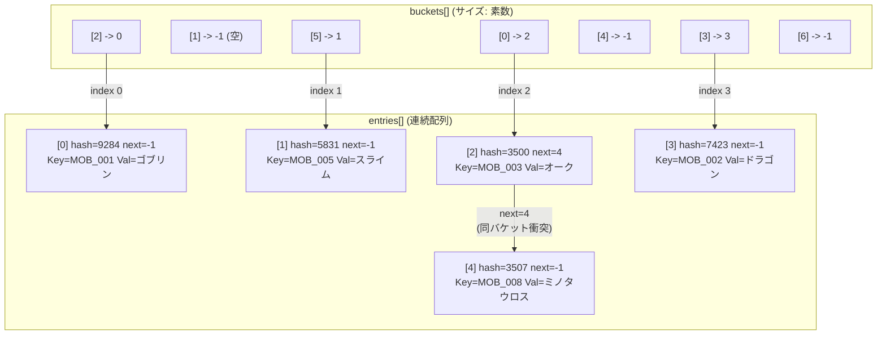
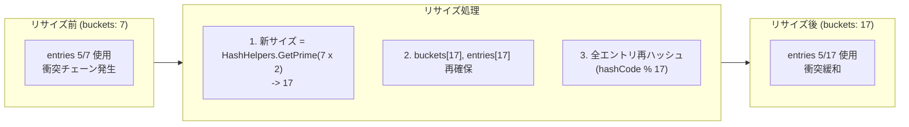
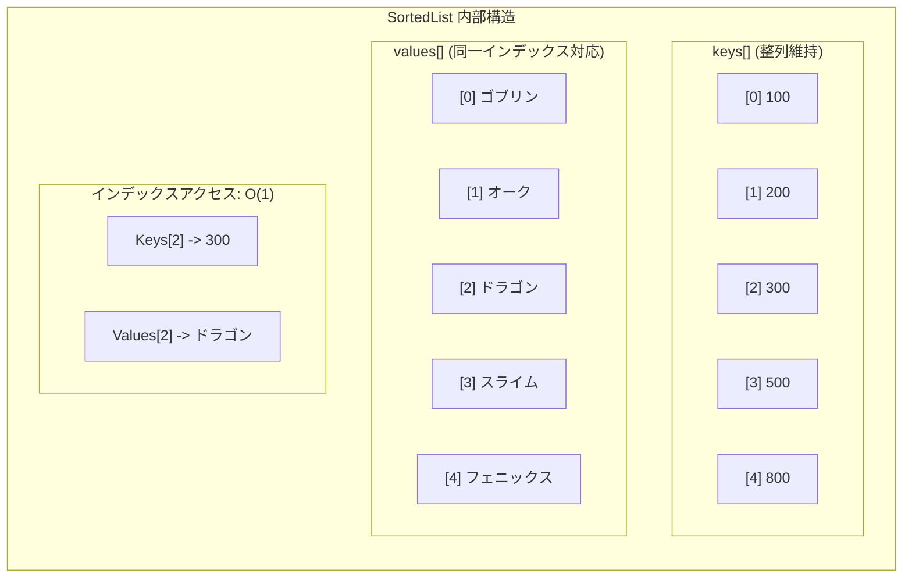
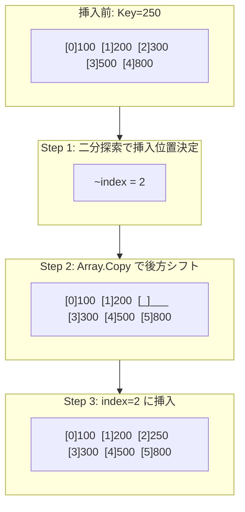
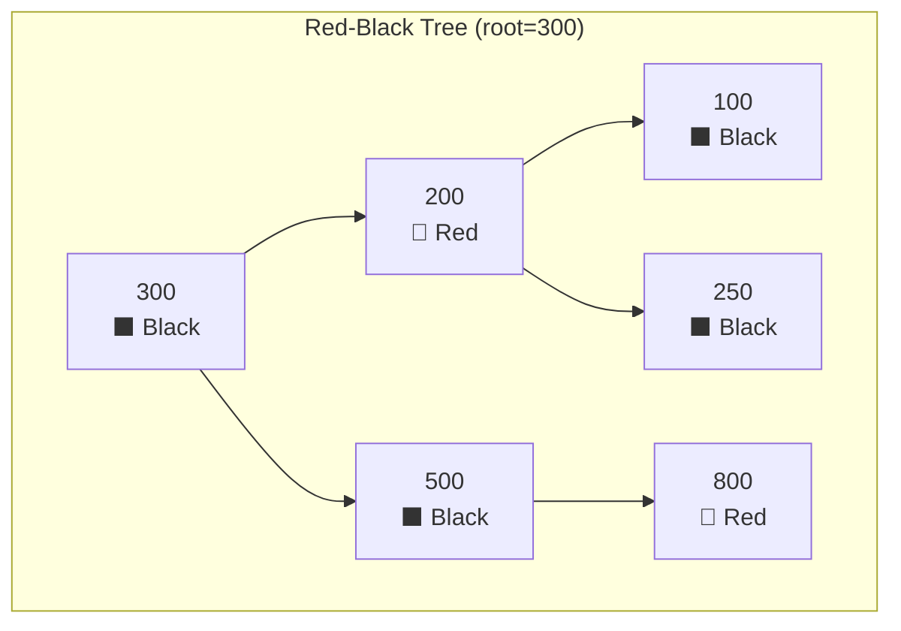
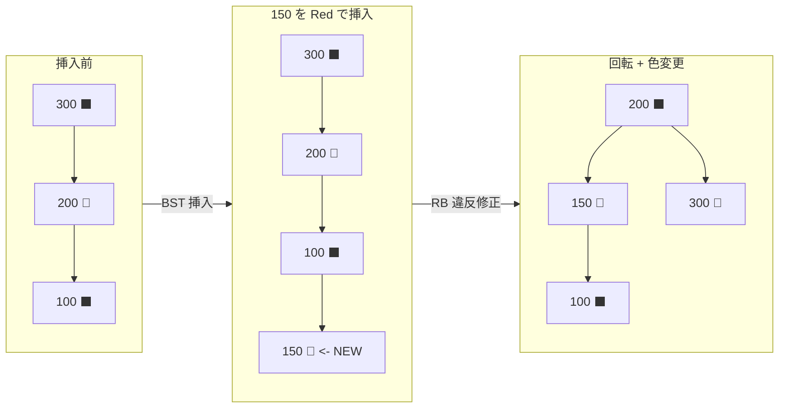
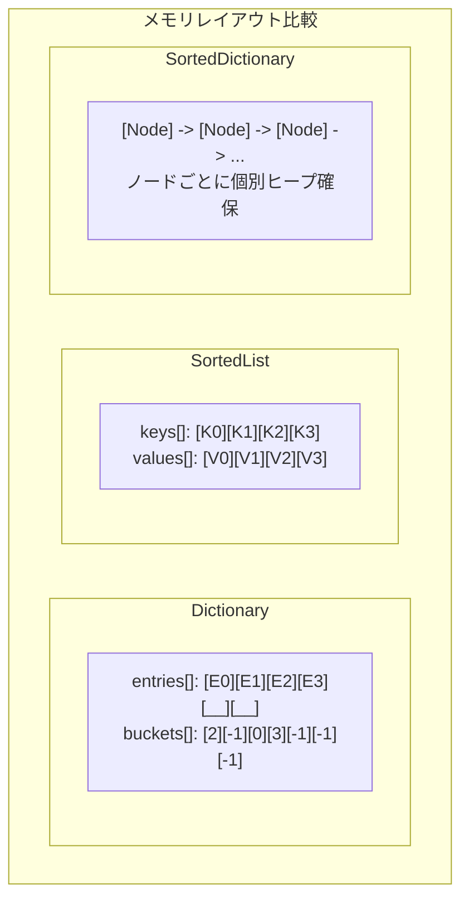
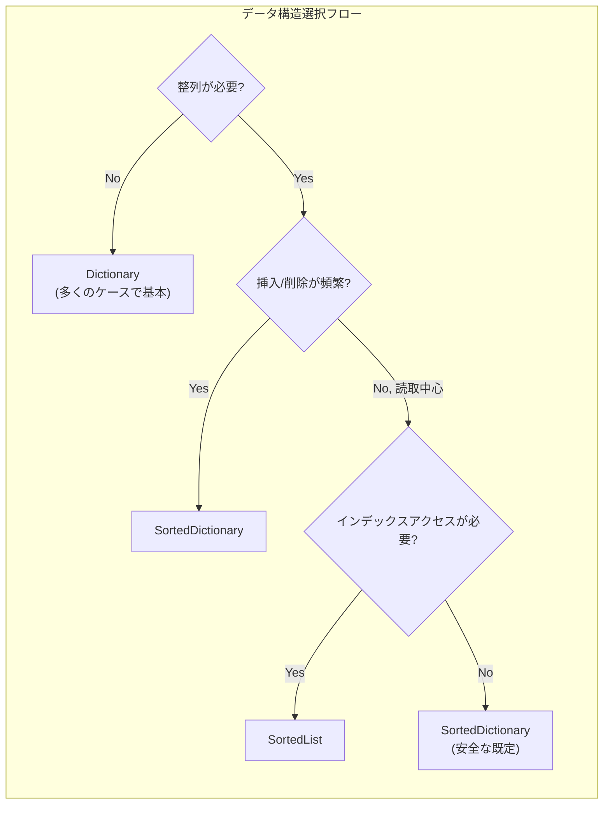

## はじめに

ゲーム開発では、データを「どう保存し、どう検索するか」が性能に直結します。数千件のモンスターステータスを ID で引く場合、インベントリを整列状態で保つ場合、ランキングを順序付きで表示する場合では、最適なデータ構造が異なります。

C# で代表的な Key-Value 構造は `Dictionary<TKey, TValue>`、`SortedList<TKey, TValue>`、`SortedDictionary<TKey, TValue>` の 3 つです。見た目は似ていますが内部実装は大きく異なり、性能特性もかなり違います。

本記事では各構造の**内部動作原理**を .NET ランタイム視点で整理し、ゲーム開発で**いつ何を選ぶべきか**を実践的にまとめます。

---

## Part 1: 内部構造

### 1. Dictionary - Hash Table ベース

`Dictionary<TKey, TValue>` は C# で最も頻繁に使われる Key-Value 構造です。内部は **Hash Table** で実装され、平均 O(1) 検索を提供します。

#### 実際の内部構造: buckets + entries

Dictionary の核は **2 つの配列**です。

```csharp
// .NET Runtime source (simplified)
private int[] buckets;     // hash -> entries index mapping
private Entry[] entries;   // array storing actual data

private struct Entry
{
    public uint hashCode;  // hash value of key
    public int next;       // next entry index in same bucket (-1 means end)
    public TKey key;
    public TValue value;
}
```

重要なのは、チェイニングが別 LinkedList ではなく `entries` 配列内の `next` インデックスでつながっている点です。連続配列を使うため **Cache Locality** が高くなります。



#### 検索手順 (TryGetValue)

```
1. hashCode = key.GetHashCode()
2. bucketIndex = hashCode % buckets.Length
3. entryIndex = buckets[bucketIndex]
4. entries[entryIndex].key と比較
   - 一致 -> value を返す
   - 不一致 -> entries[entryIndex].next を辿る
   - next == -1 -> キーなし
```

ゲーム開発で例えると「索引付きの引き出し棚」です。ハッシュで引き出しを決め、内部ラベルで照合します。

#### リサイズ: 素数ベース

衝突が増えると性能は O(n) に近づきます。Dictionary は負荷を監視し、必要時にリサイズします。このとき新サイズは単純 2 倍ではなく、**現在サイズの 2 倍以上の最小素数**を使います。

```csharp
// Prime table used internally (.NET HashHelpers.cs excerpt)
// 3, 7, 11, 17, 23, 29, 37, 47, 59, 71, 89, 107, 131, 163, 197, 239, 293, 353, 431, 521, 631, ...
```

素数を使う理由は `hashCode % bucketCount` で分布を作るためです。素数だと偏りに強く、2 の冪では低ビット偏重で衝突が増えやすくなります。

> **要点**: リサイズは `buckets` / `entries` 再確保 + 全再ハッシュを伴う **O(n)** コストです。件数見積もりが可能なら初期 `capacity` 指定が必須です。

<div class="code-compare">
  <div class="code-compare-pane">
    <div class="code-compare-label label-before">Before - 容量未指定</div>
    <div class="highlight">
<pre><code class="language-csharp">// リサイズが複数回発生し得る
var monsterStats =
    new Dictionary&lt;string, MonsterData&gt;();

foreach (var data in allMonsterData)
{
    monsterStats[data.Id] = data;
}</code></pre>
    </div>
  </div>
  <div class="code-compare-pane">
    <div class="code-compare-label label-after">After - 初期容量指定</div>
    <div class="highlight">
<pre><code class="language-csharp">// 理想的にはリサイズ 0 回
var monsterStats =
    new Dictionary&lt;string, MonsterData&gt;(
        allMonsterData.Count);

foreach (var data in allMonsterData)
{
    monsterStats[data.Id] = data;
}</code></pre>
    </div>
  </div>
</div>



#### GetHashCode / Equals 契約

| 規則 | 説明 |
| --- | --- |
| `a.Equals(b) == true` | `a.GetHashCode() == b.GetHashCode()` である必要がある |
| `a.GetHashCode() == b.GetHashCode()` | `a.Equals(b)` は false でも良い (衝突許容) |
| Dictionary に入っている間 | `GetHashCode()` が変化してはいけない |

> **Q. mutable なオブジェクトを Key にしてはいけない理由は?**
> 追加後に内部値が変わるとハッシュが変わり、別バケットを探してしまって値が見つからなくなります。
>
> **Q. string.GetHashCode() はプロセス間で固定ですか?**
> **固定ではありません。** .NET Core/.NET 5+ ではプロセスごとにハッシュシードが変わります。ハッシュ値を永続化してはいけません。Key 本体を保存してください。

---

### 2. SortedList - 整列配列ベース

`SortedList<TKey, TValue>` は内部で **整列された 2 配列** (`keys[]`, `values[]`) を使い、常に Key 昇順を保ちます。

```csharp
// .NET Runtime source (simplified)
private TKey[] keys;      // sorted key array
private TValue[] values;  // value array aligned by index
private int _size;        // element count (keys.Length >= _size)
```



#### 検索: 二分探索

整列配列なので `Array.BinarySearch()` による O(log n) 検索です。

```
配列: [100, 200, 300, 500, 800]

Step 1: lo=0, hi=4, mid=2 -> 300 < 500 -> lo=3
Step 2: lo=3, hi=4, mid=3 -> 500 == 500 -> 発見
```

#### 挿入: 配列シフトのコスト

中間挿入では後続要素を `Array.Copy()` でずらす必要があり、最悪 O(n) です。



> **Q. SortedList はインデックスアクセス可能?**
> 可能です。`Keys[index]` / `Values[index]` は O(1)。SortedDictionary との大きな違いです。
>
> **Q. 挿入順序で性能は変わる?**
> **大きく変わります。** 昇順挿入は末尾追加が多く高速、逆順/ランダムはシフト多発で遅くなります。
>
> **Q. Count と Capacity の違いは?**
> `Count` は要素数、`Capacity` は内部配列サイズ。大量挿入前に Capacity 設定、終了後 `TrimExcess()` が有効です。

---

### 3. SortedDictionary - Red-Black Tree ベース

`SortedDictionary<TKey, TValue>` は整列維持という点は同じですが、内部は **Red-Black Tree** です。

#### Red-Black Tree の規則

1. ノードは Red または Black
2. ルートは常に Black
3. Red ノードの子は Black (Red-Red 連続不可)
4. ルートから各葉までの Black ノード数は同じ



#### なぜ AVL ではなく RB Tree か

| 特性 | AVL | Red-Black |
| --- | --- | --- |
| 平衡条件 | 厳密 | 緩やか |
| 挿入時回転 | 最大 2 回だが再検査が重い | **最大 2 回**中心 |
| 削除時回転 | O(log n) 回転可能 | **最大 3 回** |
| 検索 | やや速い | やや遅い |
| 挿入/削除 | やや不利 | **更新処理に有利** |

更新が多い Key-Value コレクションでは RB Tree が現実的です。

#### 挿入時回転の例



回転回数が少ないのが利点ですが、ノードは個別ヒープオブジェクトのためメモリオーバーヘッドは大きいです。

> **Q. SortedDictionary.First() は O(1)?**
> **違います。** 左端ノードまで降りるため O(log n) です。
>
> **Q. foreach の順序保証は?**
> **保証されます。** In-order traversal で Key 昇順です。

---

## Part 2: 性能比較

### 4. 時間計算量比較

| 演算 | Dictionary | SortedList | SortedDictionary |
| --- | --- | --- | --- |
| **検索** | **O(1)** 平均 | O(log n) | O(log n) |
| **挿入** | **O(1)** 平均 | O(n) | O(log n) |
| **削除** | **O(1)** 平均 | O(n) | O(log n) |
| **順序巡回** | O(n log n) (別ソート必要) | **O(n)** | **O(n)** |
| **インデックスアクセス** | 不可 | **O(1)** | 不可 |
| **最小/最大** | O(n) | **O(1)** | O(log n) |

### 5. 実測傾向

10,000 件 int Key 基準の概略傾向:

| 演算 (10,000) | Dictionary | SortedList | SortedDictionary |
| --- | --- | --- | --- |
| **全挿入** | ~0.3ms | ~15ms (ランダム) / ~1ms (整列入力) | ~3ms |
| **単件検索** | ~20ns | ~150ns | ~200ns |
| **全巡回** | ~0.1ms | ~0.05ms | ~0.15ms |
| **メモリ** | ~450KB | ~240KB | ~640KB |

ポイント:
- Dictionary 検索は SortedList より **7〜8 倍程度**速い
- SortedList 挿入は入力順で **最大 15 倍差**
- SortedDictionary は通常メモリ消費が最大

```csharp
// Quick benchmark example in Unity
public void BenchmarkCollections(int count)
{
    var sw = new System.Diagnostics.Stopwatch();
    var random = new System.Random(42);
    var keys = Enumerable.Range(0, count).OrderBy(_ => random.Next()).ToArray();

    sw.Restart();
    var dict = new Dictionary<int, int>(count);
    foreach (var key in keys) dict[key] = key;
    sw.Stop();
    Debug.Log($"Dictionary Insert: {sw.Elapsed.TotalMilliseconds:F3}ms");

    sw.Restart();
    var sortedList = new SortedList<int, int>(count);
    foreach (var key in keys) sortedList[key] = key;
    sw.Stop();
    Debug.Log($"SortedList Insert (random): {sw.Elapsed.TotalMilliseconds:F3}ms");

    sw.Restart();
    var sortedDict = new SortedDictionary<int, int>();
    foreach (var key in keys) sortedDict[key] = key;
    sw.Stop();
    Debug.Log($"SortedDictionary Insert: {sw.Elapsed.TotalMilliseconds:F3}ms");
}
```

### 6. メモリ使用量比較

| 構造 | 内部構造 | 要素あたりオーバーヘッド | 特性 |
| --- | --- | --- | --- |
| **Dictionary** | buckets[] + entries[] | ~28 bytes | 連続配列 + 空きスロット |
| **SortedList** | keys[] + values[] | **~16 bytes** | 連続配列、キャッシュ効率高い |
| **SortedDictionary** | TreeNode object | **~48+ bytes** | ヒープ分散、GC 追跡対象増加 |



> Unity では GC Spike がフレーム落ち要因です。SortedDictionary は要素数分のノードオブジェクトが増え、GC 負担が高くなります。

---

## Part 3: 実戦活用

### 7. シナリオ別選択ガイド



#### マスターデータ参照 -> Dictionary

```csharp
private Dictionary<int, MonsterMasterData> monsterTable;

public void LoadMasterData(IReadOnlyList<MonsterMasterData> rawData)
{
    monsterTable = new Dictionary<int, MonsterMasterData>(rawData.Count);

    foreach (var data in rawData)
    {
        monsterTable[data.ID] = data;
    }
}

public MonsterMasterData GetMonster(int monsterID)
{
    return monsterTable.TryGetValue(monsterID, out var data) ? data : null;
}
```

#### ランキング/リーダーボード -> SortedList (同点注意)

```csharp
// BAD: 同点で上書き
// var ranking = new SortedList<int, string>();
// ranking[100] = "PlayerA";
// ranking[100] = "PlayerB";

// GOOD: 複合キーで一意性確保
private SortedList<(int score, int negID), string> ranking
    = new SortedList<(int score, int negID), string>();

public void AddToRanking(int score, int playerID, string playerName)
{
    ranking[(score, -playerID)] = playerName;
}

public IEnumerable<(int score, string name)> GetTopRankers(int count)
{
    int total = ranking.Count;
    for (int i = total - 1; i >= Math.Max(0, total - count); i--)
    {
        yield return (ranking.Keys[i].score, ranking.Values[i]);
    }
}
```

#### リアルタイムイベントタイムライン -> SortedDictionary

```csharp
private SortedDictionary<(float time, int id), GameEvent> eventTimeline
    = new SortedDictionary<(float time, int id), GameEvent>();
private int nextEventID;

public void ScheduleEvent(float time, GameEvent evt)
{
    eventTimeline[(time, nextEventID++)] = evt;
}

public void ProcessEvents(float currentTime)
{
    while (eventTimeline.Count > 0)
    {
        var first = eventTimeline.First();
        if (first.Key.time > currentTime) break;

        first.Value.Execute();
        eventTimeline.Remove(first.Key);
    }
}
```

---

### 8. 実戦 Tips と注意点

#### Dictionary の初期容量設定

```csharp
// BAD: リサイズ多発
var dict = new Dictionary<int, string>();
for (int i = 0; i < 10000; i++)
    dict.Add(i, $"item_{i}");

// GOOD: 初期容量指定
var dict = new Dictionary<int, string>(10000);
for (int i = 0; i < 10000; i++)
    dict.Add(i, $"item_{i}");
```

> 概算でも capacity 指定すると効果があります。 .NET 6+ なら `EnsureCapacity(int capacity)` も利用可能。

#### enum Key 使用時の注意 (Unity Mono)

```csharp
// BAD: Unity Mono では enum key で boxing が発生し得る
var dict = new Dictionary<MyEnum, string>();

// GOOD: custom comparer で boxing 回避
public struct MyEnumComparer : IEqualityComparer<MyEnum>
{
    public bool Equals(MyEnum x, MyEnum y) => x == y;
    public int GetHashCode(MyEnum obj) => (int)obj;
}

var dict = new Dictionary<MyEnum, string>(new MyEnumComparer());
```

> **Q. TryGetValue と ContainsKey + indexer はどちらが良い?**
> `TryGetValue` 一択です。
> ```csharp
> // BAD: 探索 2 回
> if (dict.ContainsKey(key))
>     var value = dict[key];
>
> // GOOD: 探索 1 回
> if (dict.TryGetValue(key, out var value))
>     DoSomething(value);
> ```

#### SortedList 大量挿入最適化

```csharp
// BAD: ランダム順挿入 -> O(n^2) に近づく
var sortedList = new SortedList<int, string>();
foreach (var item in unsortedItems)
    sortedList.Add(item.Key, item.Value);

// GOOD: 先にソートしてから挿入
var sorted = unsortedItems.OrderBy(x => x.Key).ToArray();
var sortedList = new SortedList<int, string>(sorted.Length);
foreach (var item in sorted)
    sortedList.Add(item.Key, item.Value);
```

---

### 9. 拡張: ConcurrentDictionary と読み取り専用公開

#### ConcurrentDictionary - マルチスレッド安全

```csharp
// BAD: Dictionary は同時書き込みに非対応
private Dictionary<int, CachedData> cache = new();

// GOOD: ConcurrentDictionary
private ConcurrentDictionary<int, CachedData> cache = new();

var data = cache.GetOrAdd(key, k => LoadData(k));
```

> ConcurrentDictionary は単一スレッド環境ではオーバーヘッドがあるため不要です。

#### ReadOnlyDictionary - 外部公開を安全化

```csharp
private Dictionary<int, MonsterData> monsterTable;
private ReadOnlyDictionary<int, MonsterData> readOnlyTable;

public void LoadMasterData(IReadOnlyList<MonsterData> rawData)
{
    monsterTable = new Dictionary<int, MonsterData>(rawData.Count);
    foreach (var data in rawData)
        monsterTable[data.ID] = data;

    readOnlyTable = new ReadOnlyDictionary<int, MonsterData>(monsterTable);
}

public IReadOnlyDictionary<int, MonsterData> MonsterTable => readOnlyTable;
```

---

### 10. 総合比較まとめ

| 基準 | Dictionary | SortedList | SortedDictionary |
| --- | --- | --- | --- |
| **内部構造** | Hash Table | Sorted Array | Red-Black Tree |
| **整列維持** | なし | あり | あり |
| **検索** | **O(1)** | O(log n) | O(log n) |
| **挿入/削除** | **O(1)** | O(n) | O(log n) |
| **インデックスアクセス** | なし | **O(1)** | なし |
| **最小/最大** | O(n) | **O(1)** | O(log n) |
| **メモリ効率** | 中 | **良い** | 悪い |
| **GC 負担** | 低 | **最小** | 高 |
| **適用シナリオ** | ID 高速参照 | 整列 + 読取中心 | 整列 + 更新頻繁 |
| **ゲーム例** | マスター/キャッシュ | ランキング | スケジューラ/タイムライン |

---

## チェックリスト

[✅] Dictionary の初期容量を設定したか?

[✅] Key が immutable で `GetHashCode` / `Equals` 契約を満たすか?

[✅] `ContainsKey` + indexer ではなく `TryGetValue` を使っているか?

[✅] 整列不要なのに SortedList/SortedDictionary を使っていないか?

[✅] SortedList 大量挿入時に事前ソートしているか?

[✅] Unity Mono で enum Key 使用時に custom comparer を検討したか?

[✅] Key 重複対策 (複合キー) を考慮したか?

[✅] マルチスレッドアクセスで `ConcurrentDictionary` を使っているか?

[✅] 外部公開を `IReadOnlyDictionary` で不変化しているか?

---

## 結論

データ構造の選択は「何が最強か」ではなく、**どの条件に最適か**の問題です。

- **Dictionary**: `buckets[]` + `entries[]` のハッシュテーブル。順序不要な Key-Value で最良の基本選択。
- **SortedList**: 整列済み配列ベース。省メモリとインデックスアクセスが強いが、中間挿入は O(n)。
- **SortedDictionary**: 赤黒木ベース。整列維持しつつ更新が多い場面に強いが、ノード単位ヒープ確保で GC 負担が大きい。

内部構造を理解すれば、「なぜ遅いか」「なぜメモリを食うか」を素早く判断できます。描画パイプライン理解が最適化の基礎であるのと同じく、データ構造の内部理解は設計品質の基盤です。
