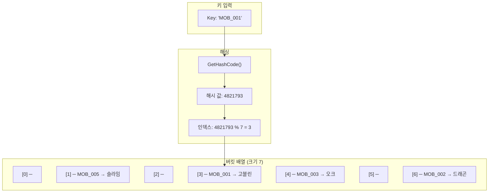
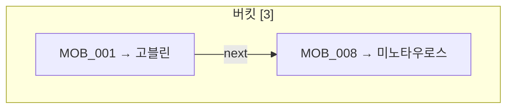
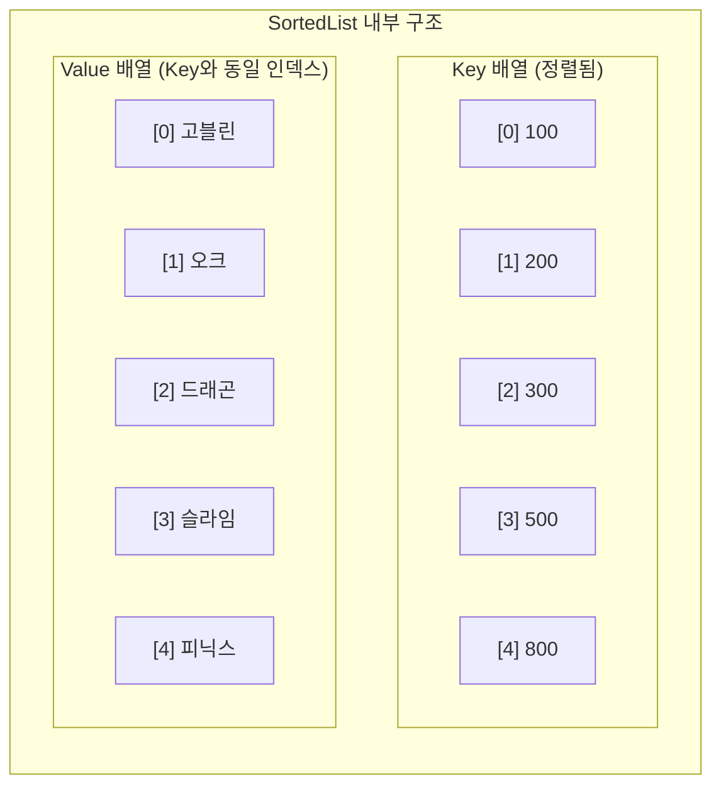
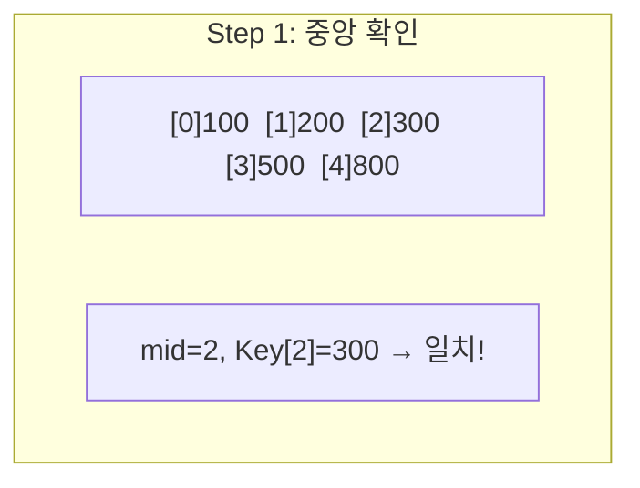
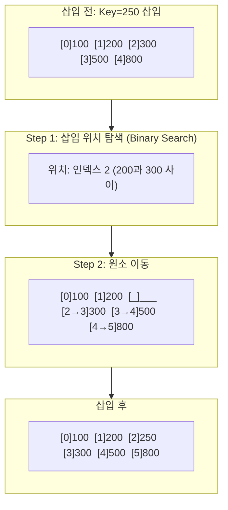
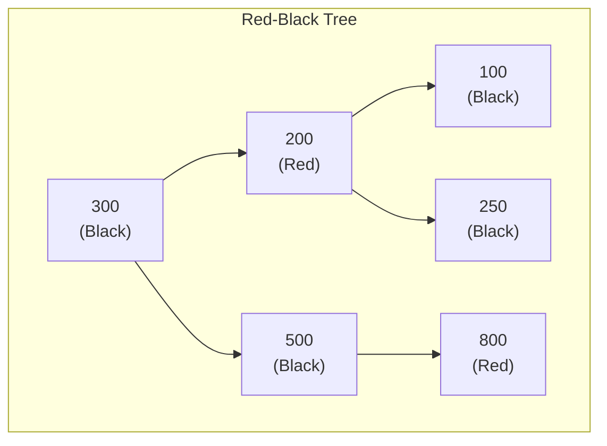
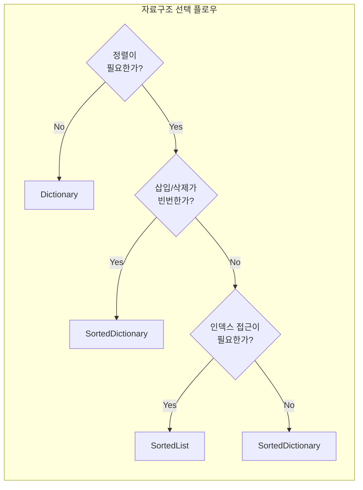
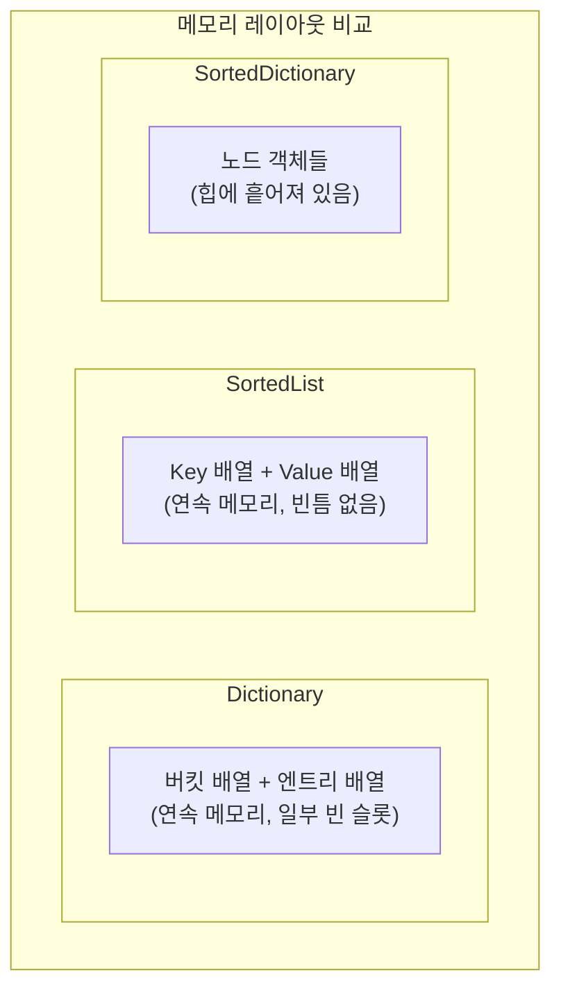

[](https://hits.sh/epheria.github.io/)

---

## 서론

게임 개발에서 데이터를 "어떻게 저장하고 찾느냐"는 성능에 직접적인 영향을 미칩니다. 수천 개의 몬스터 스탯을 ID로 조회해야 할 때, 아이템 인벤토리를 정렬된 상태로 유지해야 할 때, 랭킹 데이터를 순서대로 보여줘야 할 때 - 각각의 상황에서 최적의 자료구조는 다릅니다.

C#에서 Key-Value 쌍을 다루는 대표적인 자료구조는 `Dictionary<TKey, TValue>`, `SortedList<TKey, TValue>`, `SortedDictionary<TKey, TValue>` 세 가지입니다. 겉으로 보면 비슷해 보이지만, 내부 구현은 완전히 다르고, 성능 특성도 크게 차이납니다.

이 글에서는 각 자료구조의 **내부 동작 원리**를 시각적으로 분석하고, **언제 어떤 것을 선택해야 하는지** 게임 개발 관점에서 정리합니다.

---

## Part 1: 내부 구조

### 1. Dictionary - Hash Table 기반

`Dictionary<TKey, TValue>`는 C#에서 가장 자주 사용되는 Key-Value 자료구조입니다. 내부적으로 **해시 테이블(Hash Table)**로 구현되어 있으며, 평균 O(1)의 조회 성능을 제공합니다.

#### 핵심 원리: 해싱(Hashing)

Dictionary에 데이터를 추가하면 내부에서 다음과 같은 과정이 일어납니다:

1. Key의 `GetHashCode()` 메서드를 호출하여 해시 값을 얻는다
2. 해시 값을 버킷 배열의 인덱스로 변환한다 (해시 값 % 버킷 수)
3. 해당 버킷에 Key-Value 쌍을 저장한다

게임으로 비유하면, 몬스터 도감이 있다고 합시다. 몬스터 이름을 외워서 매번 처음부터 찾는 대신, **이름의 첫 글자로 색인(인덱스)**을 만들어 해당 페이지로 바로 넘어가는 것과 같습니다. "고블린"이면 "ㄱ" 색인으로, "드래곤"이면 "ㄷ" 색인으로 바로 이동합니다.



#### 해시 충돌(Collision)과 체이닝

서로 다른 키가 같은 버킷 인덱스를 가리킬 수 있습니다. 이것을 **해시 충돌**이라 합니다. C#의 Dictionary는 **체이닝(Chaining)** 방식으로 이를 해결합니다. 같은 버킷에 여러 엔트리가 연결 리스트처럼 이어집니다.



충돌이 많아지면 하나의 버킷에 여러 엔트리가 쌓여 검색이 O(n)으로 퇴화합니다. 이를 방지하기 위해 Dictionary는 **적재율(Load Factor)**을 감시하다가 임계값을 넘으면 **리사이징(Resizing)**을 수행합니다. 버킷 배열 크기를 약 2배로 늘리고, 모든 엔트리의 해시를 재계산하여 재배치합니다.

```mermaid
flowchart LR
    subgraph Before["리사이징 전 (크기 7)"]
        direction TB
        B0["[0] MOB_010"]
        B1["[1] MOB_005"]
        B2["[2] MOB_007"]
        B3["[3] MOB_001 → MOB_008"]
        B4["[4] MOB_003 → MOB_006"]
        B5["[5] MOB_009"]
        B6["[6] MOB_002"]
    end

    subgraph After["리사이징 후 (크기 17)"]
        direction TB
        A0["[0] ─"]
        A3["[3] MOB_001"]
        A5["[5] MOB_003"]
        A8["[8] MOB_008"]
        A11["[11] MOB_005"]
        Adot["..."]
    end

    Before -->|"재해싱"| After
```



> **핵심**: 리사이징은 기존 엔트리를 전부 복사하는 O(n) 연산입니다. 데이터 개수를 미리 알고 있다면 **초기 용량(capacity)**을 지정하여 불필요한 리사이징을 방지하는 것이 성능 최적화의 기본입니다.

#### GetHashCode와 Equals의 계약

Dictionary가 정상 동작하려면 Key 타입이 `GetHashCode()`와 `Equals()`를 올바르게 구현해야 합니다. 이 둘은 반드시 다음 계약을 지켜야 합니다:

| 규칙 | 설명 |
| --- | --- |
| `a.Equals(b) == true` 이면 | `a.GetHashCode() == b.GetHashCode()` 이어야 함 |
| `a.GetHashCode() == b.GetHashCode()` 이더라도 | `a.Equals(b)` 는 false일 수 있음 (충돌 허용) |
| 객체가 Dictionary에 있는 동안 | `GetHashCode()` 반환값이 변하면 안 됨 |

> **💬 잠깐, 이건 알고 가자**
>
> **Q. 왜 mutable 객체를 Key로 쓰면 안 되나요?**
> Dictionary에 저장한 후 Key 객체의 필드를 변경하면, `GetHashCode()` 반환값이 달라질 수 있습니다. 이 경우 원래 버킷에서 찾을 수 없게 되어 **데이터가 "사라지는"** 현상이 발생합니다. 실제로는 데이터가 있지만, 해시가 바뀌었기 때문에 다른 버킷을 탐색하게 됩니다. 특히 `int`, `string`, `enum` 같은 불변 타입을 Key로 사용하는 것이 안전합니다.
>
> **Q. string의 GetHashCode()는 항상 같은 값을 반환하나요?**
> **같은 프로세스 내에서는 그렇습니다.** 하지만 .NET Core부터는 보안상의 이유로 프로세스마다 해시 시드가 달라집니다. 따라서 `GetHashCode()` 값을 파일에 저장하거나 네트워크로 전송하면 안 됩니다. 이는 Dictionary 직렬화 시 반드시 Key 값 자체를 저장해야 하는 이유입니다.

---

### 2. SortedList - 정렬된 배열 기반

`SortedList<TKey, TValue>`는 이름에 "List"가 있는 것처럼, 내부적으로 **두 개의 정렬된 배열(sorted array)**을 사용합니다. 하나는 Key 배열, 하나는 Value 배열이며, Key를 기준으로 항상 정렬된 상태를 유지합니다.



#### 검색: Binary Search

정렬된 배열이므로 **이진 탐색(Binary Search)**을 사용합니다. 5개의 원소에서 Key=300을 찾는다면:



원소가 100만 개여도 최대 **20번의 비교(log₂(1,000,000) ≈ 20)**로 찾을 수 있습니다. O(log n)의 검색 성능입니다.

#### 삽입: 배열 이동의 비용

SortedList의 약점은 **삽입**입니다. 정렬 상태를 유지해야 하므로, 중간에 삽입하면 뒤쪽 원소를 전부 한 칸씩 밀어야 합니다.



이 "밀기" 연산은 최악의 경우 O(n)입니다. 10만 개의 원소가 있는 SortedList 맨 앞에 삽입하면, 10만 개를 전부 한 칸씩 밀어야 합니다. 반면 맨 뒤에 추가하는 경우(가장 큰 Key)는 이동이 없으므로 O(log n)입니다.

> **게임 개발 비유**: 서가(bookshelf)에 책을 번호순으로 꽂는 것과 같습니다. 맨 뒤에 꽂는 건 빠르지만, 중간에 끼워넣으려면 뒤의 책을 전부 밀어야 합니다. 반면 Dictionary는 빈 칸이 있는 사물함(locker)과 같아서, 해시로 계산된 칸에 바로 넣으면 됩니다.

> **💬 잠깐, 이건 알고 가자**
>
> **Q. SortedList의 인덱스 접근이 가능한가요?**
> 네. `sortedList.Keys[index]`와 `sortedList.Values[index]`로 인덱스 기반 접근이 가능합니다. 내부가 배열이기 때문입니다. 이것이 SortedDictionary와의 가장 큰 차이점입니다. "정렬 순서상 3번째 원소"를 O(1)로 가져올 수 있습니다.
>
> **Q. SortedList에 데이터를 넣는 순서가 중요한가요?**
> **네, 성능에는 매우 중요합니다.** 이미 정렬된 순서로 데이터를 넣으면 항상 맨 뒤에 추가되므로 O(log n)이지만, 역순으로 넣으면 매번 맨 앞에 삽입하므로 O(n)이 됩니다. 마스터 데이터를 로드할 때 미리 정렬해서 넣으면 성능이 크게 개선됩니다.

---

### 3. SortedDictionary - Red-Black Tree 기반

`SortedDictionary<TKey, TValue>`는 SortedList와 마찬가지로 Key를 정렬된 상태로 유지하지만, 내부 구현이 전혀 다릅니다. **자가 균형 이진 탐색 트리(Self-Balancing BST)**의 일종인 **Red-Black Tree**를 사용합니다.



#### 삽입/삭제: 트리 회전

Red-Black Tree는 삽입/삭제 시 **트리 회전(Rotation)**을 통해 균형을 유지합니다. 최악의 경우에도 트리 높이가 O(log n)을 보장하므로, 삽입과 삭제 모두 **항상 O(log n)**입니다. SortedList처럼 배열 이동이 필요 없습니다.

단, 각 노드가 부모/자식 포인터, 색상 플래그 등 추가 메모리를 사용하므로 SortedList보다 **메모리 오버헤드가 큽니다**.

> **게임 개발 비유**: SortedList가 "서가에 책을 순서대로 꽂는 것"이라면, SortedDictionary는 "균형 잡힌 분류 나무(tree)"와 같습니다. 새 항목을 추가할 때 나무를 약간 재배치(회전)하면 되므로 전체를 밀 필요가 없지만, 나무의 각 가지(노드)가 추가 정보를 들고 있어 전체 크기가 더 큽니다.

---

## Part 2: 성능 비교

### 4. 시간 복잡도 비교

| 연산 | Dictionary | SortedList | SortedDictionary |
| --- | --- | --- | --- |
| **검색 (조회)** | **O(1)** 평균 | O(log n) | O(log n) |
| **삽입** | **O(1)** 평균 | O(n) (배열 이동) | O(log n) |
| **삭제** | **O(1)** 평균 | O(n) (배열 이동) | O(log n) |
| **순서대로 순회** | O(n log n) (정렬 필요) | **O(n)** (이미 정렬) | **O(n)** (In-order traversal) |
| **인덱스 접근** | 불가 | **O(1)** | 불가 |
| **최솟값/최댓값** | O(n) | **O(1)** | O(log n) |



### 5. 메모리 사용량 비교

세 자료구조는 메모리 효율에서도 큰 차이를 보입니다.

| 자료구조 | 내부 구조 | 원소당 오버헤드 | 특성 |
| --- | --- | --- | --- |
| **Dictionary** | 해시 테이블 (배열 + 체인) | 중간 (엔트리 배열 + 버킷 배열) | 빈 버킷이 존재하여 약간의 낭비 |
| **SortedList** | 정렬된 배열 2개 | **가장 적음** (Key[], Value[] 배열만) | 연속 메모리, 캐시 친화적 |
| **SortedDictionary** | Red-Black Tree | **가장 큼** (노드당 포인터 3개 + 색상) | 노드별 힙 할당, GC 압력 |



> **게임 개발 관점 - GC 부담**: Unity에서 GC Spike는 프레임 드랍의 주범입니다. SortedDictionary는 각 노드가 개별 힙 객체이므로, 원소가 많으면 GC 추적 대상이 급증합니다. 반면 SortedList와 Dictionary는 배열 기반이라 GC 부담이 상대적으로 적습니다. 게임플레이 중 빈번하게 생성/삭제되는 데이터에는 이 차이가 중요합니다.

---

## Part 3: 실전 활용

### 6. 게임 개발 시나리오별 선택 가이드

#### 마스터 데이터 조회 → Dictionary

몬스터 스탯, 아이템 정보, 스킬 데이터 등 **ID로 빠르게 조회**해야 하는 테이블 데이터에는 Dictionary가 최적입니다.

```csharp
// 마스터 데이터: 한 번 로드하고 계속 조회
private Dictionary<int, MonsterMasterData> monsterTable;

public void LoadMasterData(IReadOnlyList<MonsterMasterData> rawData)
{
    // 초기 용량 지정으로 리사이징 방지
    monsterTable = new Dictionary<int, MonsterMasterData>(rawData.Count);

    foreach (var data in rawData)
    {
        monsterTable[data.ID] = data;
    }
}

public MonsterMasterData GetMonster(int monsterID)
{
    return monsterTable.TryGetValue(monsterID, out var data) ? data : null;
}
```

#### 랭킹/리더보드 → SortedList

점수 기반으로 정렬된 상태를 유지하면서, "상위 N명"을 빠르게 가져와야 하는 경우 SortedList가 적합합니다. 인덱스로 슬라이싱이 가능하기 때문입니다.

```csharp
// 로컬 랭킹 (소규모, 읽기 위주)
private SortedList<int, string> localRanking = new SortedList<int, string>();

public void UpdateRanking(int score, string playerName)
{
    // Key가 점수이므로 자동 정렬
    localRanking[score] = playerName;
}

public IEnumerable<KeyValuePair<int, string>> GetTopRankers(int count)
{
    // 뒤에서부터(높은 점수) count개 반환
    int total = localRanking.Count;
    for (int i = total - 1; i >= Math.Max(0, total - count); i--)
    {
        yield return new KeyValuePair<int, string>(
            localRanking.Keys[i], localRanking.Values[i] // O(1) 인덱스 접근
        );
    }
}
```

#### 실시간 이벤트 타임라인 → SortedDictionary

게임 내 이벤트가 시간순으로 빈번하게 추가/제거되는 경우, 삽입/삭제 모두 O(log n)인 SortedDictionary가 적합합니다.

```csharp
// 이벤트 스케줄러: 빈번한 삽입/삭제
private SortedDictionary<float, GameEvent> eventTimeline
    = new SortedDictionary<float, GameEvent>();

public void ScheduleEvent(float time, GameEvent evt)
{
    eventTimeline[time] = evt; // O(log n)
}

public void ProcessEvents(float currentTime)
{
    // 현재 시간 이전의 이벤트를 모두 처리
    while (eventTimeline.Count > 0)
    {
        var first = eventTimeline.First(); // O(log n)
        if (first.Key > currentTime) break;

        first.Value.Execute();
        eventTimeline.Remove(first.Key); // O(log n)
    }
}
```

---

### 7. 실전 팁과 주의사항

#### Dictionary 초기 용량 설정

```csharp
// BAD: 기본 생성자 → 리사이징 반복 발생
var dict = new Dictionary<int, string>();
for (int i = 0; i < 10000; i++)
    dict.Add(i, $"item_{i}");

// GOOD: 초기 용량 지정 → 리사이징 0회
var dict = new Dictionary<int, string>(10000);
for (int i = 0; i < 10000; i++)
    dict.Add(i, $"item_{i}");
```

> **팁**: 정확한 개수를 모르더라도 대략적인 추정치를 넣는 것만으로 리사이징 횟수를 크게 줄일 수 있습니다. 마스터 데이터 로드 시 데이터 개수를 먼저 파싱하여 capacity로 전달하는 것이 좋습니다.

#### enum을 Key로 사용할 때 주의

```csharp
// BAD: enum Key는 기본적으로 박싱(boxing) 발생 → GC 압력
var dict = new Dictionary<MyEnum, string>();

// GOOD: 커스텀 Comparer로 박싱 방지
public struct MyEnumComparer : IEqualityComparer<MyEnum>
{
    public bool Equals(MyEnum x, MyEnum y) => x == y;
    public int GetHashCode(MyEnum obj) => (int)obj;
}

var dict = new Dictionary<MyEnum, string>(new MyEnumComparer());
```

> **💬 잠깐, 이건 알고 가자**
>
> **Q. 왜 enum Key에서 박싱이 발생하나요?**
> `Dictionary<TKey, TValue>`는 내부적으로 `EqualityComparer<TKey>.Default`를 사용합니다. enum 타입의 경우 이 기본 Comparer가 `Equals(object, object)`를 호출하면서 value type인 enum이 object로 박싱됩니다. .NET Core에서는 이 문제가 JIT 최적화로 상당 부분 해소되었지만, Unity의 Mono 런타임에서는 여전히 발생합니다.
>
> **Q. TryGetValue와 ContainsKey + 인덱서, 뭐가 더 좋나요?**
> **항상 `TryGetValue`를 사용하세요.** `ContainsKey`로 확인한 뒤 인덱서로 가져오면 해시 계산을 **2번** 수행합니다. `TryGetValue`는 1번이면 충분합니다.
> ```csharp
> // BAD: 해시 계산 2번
> if (dict.ContainsKey(key))
>     var value = dict[key];
>
> // GOOD: 해시 계산 1번
> if (dict.TryGetValue(key, out var value))
>     DoSomething(value);
> ```

#### SortedList 대량 데이터 삽입 최적화

```csharp
// BAD: 무작위 순서로 삽입 → 매번 배열 이동 O(n)
var sortedList = new SortedList<int, string>();
foreach (var item in unsortedItems)
    sortedList.Add(item.Key, item.Value); // 총 O(n²)

// GOOD: 미리 정렬 후 삽입 → 항상 맨 뒤에 추가
var sortedItems = unsortedItems.OrderBy(x => x.Key).ToList();
var sortedList = new SortedList<int, string>(sortedItems.Count);
foreach (var item in sortedItems)
    sortedList.Add(item.Key, item.Value); // 총 O(n log n)
```

---

### 8. 종합 비교 요약

| 기준 | Dictionary | SortedList | SortedDictionary |
| --- | --- | --- | --- |
| **내부 구조** | Hash Table | Sorted Array | Red-Black Tree |
| **정렬 유지** | X | O | O |
| **검색** | O(1) | O(log n) | O(log n) |
| **삽입/삭제** | O(1) | O(n) | O(log n) |
| **인덱스 접근** | X | O(1) | X |
| **메모리 효율** | 중간 | 좋음 | 나쁨 |
| **GC 부담** | 낮음 | 낮음 | 높음 |
| **최적 시나리오** | ID 기반 빠른 조회 | 정렬 + 읽기 위주 | 정렬 + 삽입/삭제 빈번 |
| **게임 예시** | 마스터 데이터, 캐시 | 랭킹, 고정 테이블 | 이벤트 스케줄러, 타임라인 |

---

## 체크리스트

코드 리뷰 시 다음을 확인하자:

[✅] Dictionary 생성 시 예상 데이터 수에 맞는 초기 용량(capacity)을 설정했는가?

[✅] Dictionary Key 타입이 불변(immutable)이며, `GetHashCode`/`Equals` 계약을 준수하는가?

[✅] `ContainsKey` + 인덱서 대신 `TryGetValue`를 사용하고 있는가?

[✅] 정렬이 불필요한데 SortedList/SortedDictionary를 사용하고 있지는 않은가?

[✅] SortedList에 대량 데이터 삽입 시 미리 정렬된 순서로 넣고 있는가?

[✅] Unity Mono 환경에서 enum Key 사용 시 커스텀 Comparer를 적용했는가?

[✅] 삽입/삭제가 빈번한 정렬 컬렉션에 SortedList 대신 SortedDictionary를 고려했는가?

---

## 결론

자료구조의 선택은 "무엇이 더 좋은가"가 아니라 **"어떤 상황에서 무엇이 적합한가"**의 문제입니다.

- **Dictionary**: 해시 테이블 기반으로 O(1) 조회를 제공합니다. 정렬이 필요 없는 대부분의 Key-Value 저장에 최적이며, 게임 개발에서 가장 빈번하게 사용됩니다.
- **SortedList**: 정렬된 배열 기반으로 메모리 효율과 인덱스 접근이 뛰어납니다. 읽기 위주이고 데이터 변경이 적은 정렬 컬렉션에 적합합니다.
- **SortedDictionary**: Red-Black Tree 기반으로 삽입/삭제가 빈번한 정렬 컬렉션에 적합합니다. 다만 메모리 오버헤드와 GC 부담이 크므로 Unity에서는 신중하게 사용해야 합니다.

내부 구조를 이해하면 "왜 느린지", "왜 메모리를 많이 쓰는지"를 직감적으로 판단할 수 있습니다. 게임 엔진의 렌더링 파이프라인을 이해해야 최적화할 수 있듯, 자료구조의 내부를 이해하는 것은 올바른 설계의 기반입니다.
