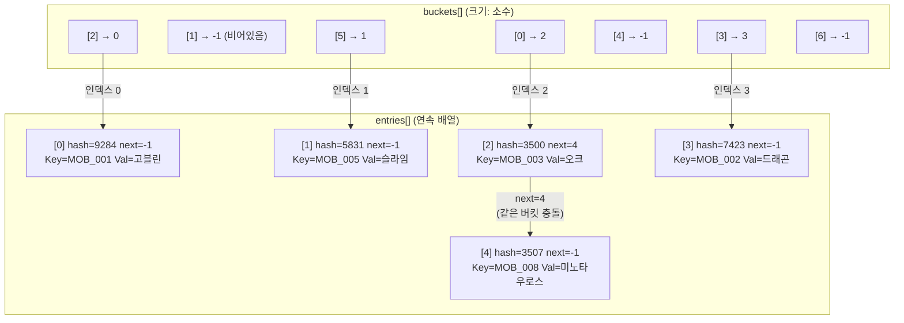
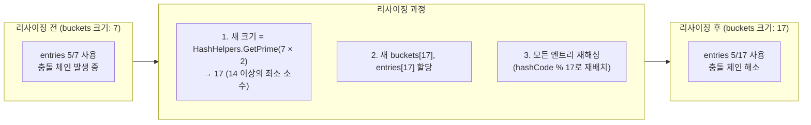
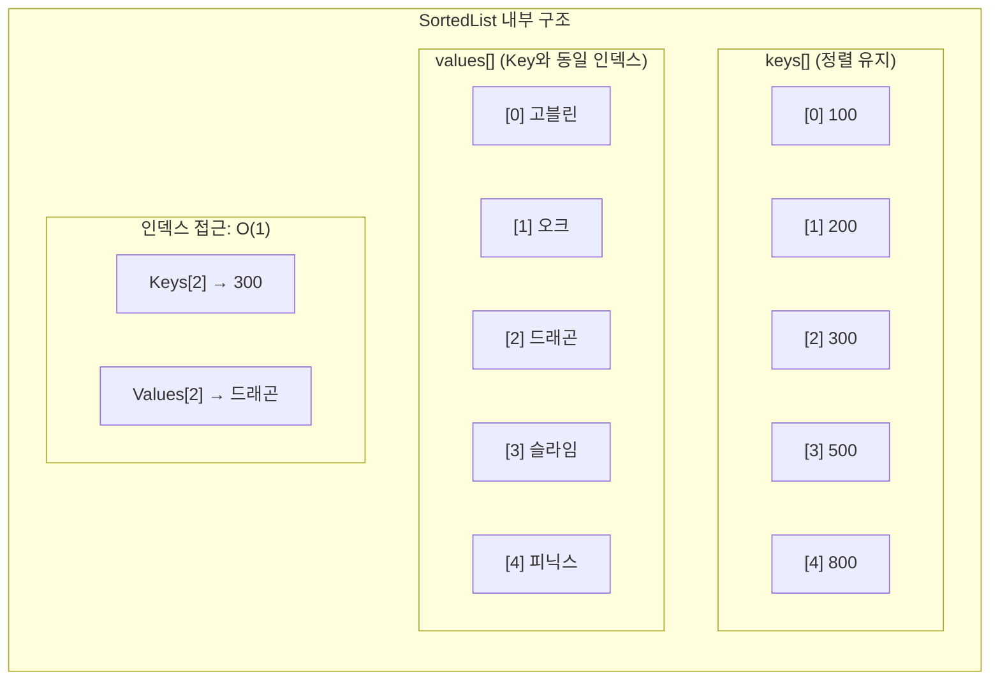
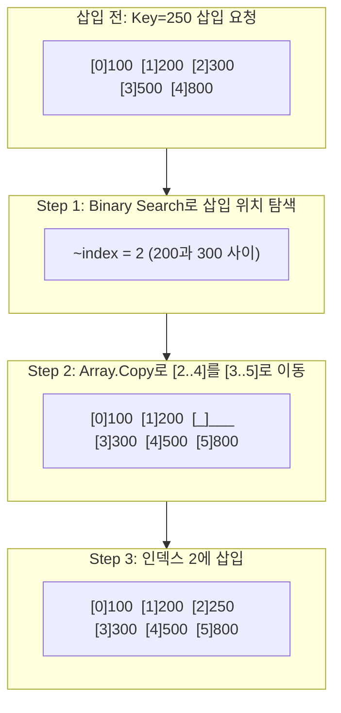
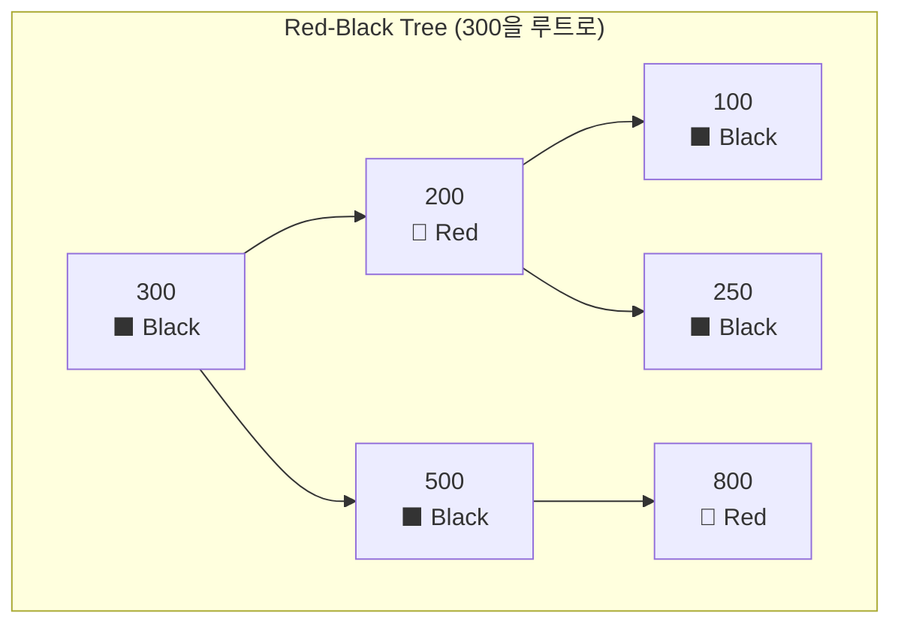
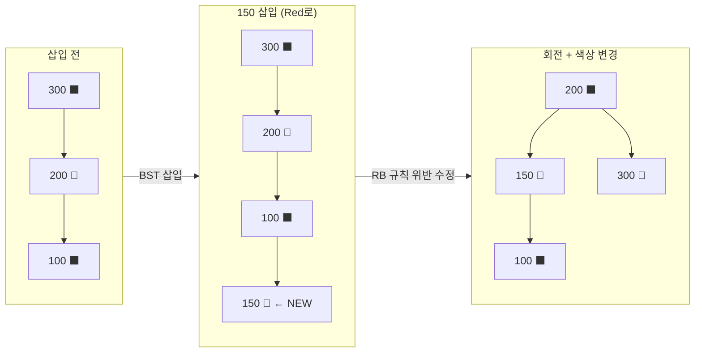
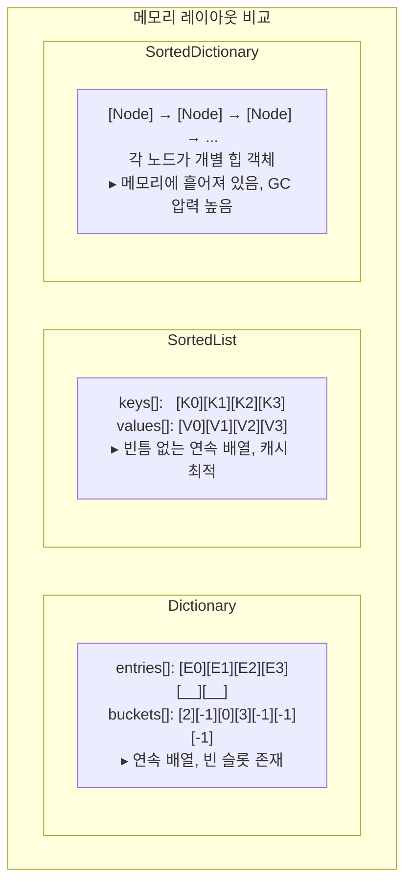
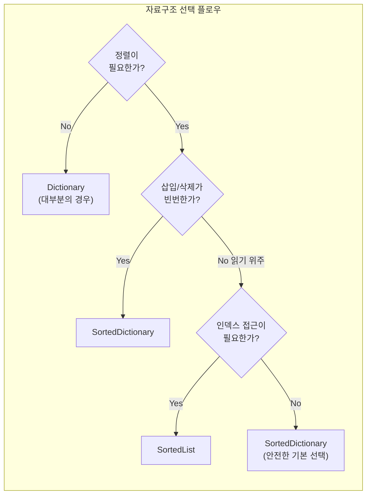

## 서론

게임 개발에서 데이터를 "어떻게 저장하고 찾느냐"는 성능에 직접적인 영향을 미칩니다. 수천 개의 몬스터 스탯을 ID로 조회해야 할 때, 아이템 인벤토리를 정렬된 상태로 유지해야 할 때, 랭킹 데이터를 순서대로 보여줘야 할 때 - 각각의 상황에서 최적의 자료구조는 다릅니다.

C#에서 Key-Value 쌍을 다루는 대표적인 자료구조는 `Dictionary<TKey, TValue>`, `SortedList<TKey, TValue>`, `SortedDictionary<TKey, TValue>` 세 가지입니다. 겉으로 보면 비슷해 보이지만, 내부 구현은 완전히 다르고, 성능 특성도 크게 차이납니다.

이 글에서는 각 자료구조의 **내부 동작 원리**를 .NET 런타임 소스 코드 수준에서 분석하고, **언제 어떤 것을 선택해야 하는지** 게임 개발 관점에서 정리합니다.

---

## Part 1: 내부 구조

### 1. Dictionary - Hash Table 기반

`Dictionary<TKey, TValue>`는 C#에서 가장 자주 사용되는 Key-Value 자료구조입니다. 내부적으로 **해시 테이블(Hash Table)**로 구현되어 있으며, 평균 O(1)의 조회 성능을 제공합니다.

#### 실제 내부 구조: buckets + entries

Dictionary의 내부를 열어보면 핵심 필드는 **두 개의 배열**입니다:

```csharp
// .NET Runtime 소스 (간략화)
private int[] buckets;     // 해시 → entries 인덱스 매핑
private Entry[] entries;   // 실제 데이터가 저장되는 배열

private struct Entry
{
    public uint hashCode;  // Key의 해시 값
    public int next;       // 같은 버킷 내 다음 엔트리의 인덱스 (-1이면 끝)
    public TKey key;
    public TValue value;
}
```

여기서 중요한 점은 **체이닝이 별도의 Linked List가 아니라 entries 배열 내부의 `next` 인덱스**로 이루어진다는 것입니다. 모든 엔트리가 하나의 연속 배열에 존재하므로 **캐시 지역성(Cache Locality)**이 보장됩니다. 전통적인 Linked List 체이닝과는 근본적으로 다릅니다.



#### 조회 과정 (TryGetValue)

Key로 값을 찾는 전체 과정은 다음과 같습니다:

```
1. hashCode = key.GetHashCode()
2. bucketIndex = hashCode % buckets.Length
3. entryIndex = buckets[bucketIndex]
4. entries[entryIndex]의 key와 비교
   - 일치하면 → value 반환
   - 불일치면 → entries[entryIndex].next를 따라 다음 엔트리 확인
   - next == -1이면 → 키가 존재하지 않음
```

게임으로 비유하면, 몬스터 도감을 **색인(인덱스)이 있는 서랍장**으로 만든 것과 같습니다. 이름의 해시로 서랍 번호를 정하고, 해당 서랍 안에서 이름표를 확인하여 찾습니다. 같은 서랍에 여러 몬스터가 있을 수 있지만(충돌), 대부분의 서랍에는 하나만 있으므로 거의 한 번에 찾을 수 있습니다.

#### 리사이징: 소수(Prime Number) 기반

충돌이 많아지면 성능이 O(n)으로 퇴화합니다. 이를 방지하기 위해 Dictionary는 **적재율**을 감시하다가 `entries` 배열이 가득 차면 리사이징을 수행합니다. 이때 새 크기는 단순히 2배가 아니라, **현재 크기의 2배 이상인 가장 작은 소수**입니다.

```csharp
// .NET 내부의 소수 테이블 (HashHelpers.cs 발췌)
// 3, 7, 11, 17, 23, 29, 37, 47, 59, 71, 89, 107, 131, 163, 197, 239, 293, 353, 431, 521, 631, ...
```

**왜 소수인가?** 해시 값을 버킷 수로 나눈 나머지(`hashCode % bucketCount`)로 인덱스를 결정하기 때문입니다. 버킷 수가 소수이면 해시 값의 하위 비트 패턴에 관계없이 **균일한 분포**를 얻을 수 있습니다. 반면 2의 거듭제곱(16, 32, 64...)을 쓰면 해시 값의 하위 비트만 사용하므로, 패턴이 편향된 해시 함수에서 충돌이 급증합니다.

> **핵심**: 리사이징은 `buckets`와 `entries`를 모두 새로 할당하고, 기존 엔트리를 전부 재해싱하는 **O(n) 연산**입니다. 데이터 개수를 미리 알고 있다면 **초기 용량(capacity)**을 지정하여 불필요한 리사이징을 방지하는 것이 성능 최적화의 기본입니다.



#### GetHashCode와 Equals의 계약

Dictionary가 정상 동작하려면 Key 타입이 `GetHashCode()`와 `Equals()`의 계약을 지켜야 합니다:

| 규칙 | 설명 |
| --- | --- |
| `a.Equals(b) == true` 이면 | `a.GetHashCode() == b.GetHashCode()` 이어야 함 |
| `a.GetHashCode() == b.GetHashCode()` 이더라도 | `a.Equals(b)` 는 false일 수 있음 (충돌 허용) |
| 객체가 Dictionary에 있는 동안 | `GetHashCode()` 반환값이 변하면 안 됨 |

> **💬 잠깐, 이건 알고 가자**
>
> **Q. 왜 mutable 객체를 Key로 쓰면 안 되나요?**
> Dictionary에 저장한 후 Key 객체의 필드를 변경하면, `GetHashCode()` 반환값이 달라질 수 있습니다. 이 경우 `buckets[newHash % length]`를 탐색하게 되어 **원래 버킷과 다른 곳을 찾게 되고, 데이터가 "사라지는"** 현상이 발생합니다. 실제로는 entries 배열에 데이터가 있지만, 잘못된 체인을 따라가므로 영원히 도달할 수 없습니다. `int`, `string`, `enum` 같은 불변 타입을 Key로 사용하는 것이 안전합니다.
>
> **Q. string의 GetHashCode()는 프로세스마다 다른가요?**
> **네.** .NET Core/.NET 5+ 부터는 보안상의 이유(HashDoS 공격 방지)로 프로세스마다 해시 시드가 달라집니다. 동일한 문자열이라도 프로세스를 재시작하면 다른 해시 값을 반환합니다. 따라서 `GetHashCode()` 값을 파일에 저장하거나 네트워크로 전송하면 안 됩니다. Dictionary를 직렬화할 때는 반드시 Key 값 자체를 저장해야 합니다. Unity의 Mono 런타임에서는 기본적으로 결정적(deterministic) 해시를 사용하지만, IL2CPP 빌드에서는 .NET Core와 동일한 랜덤 시드 정책이 적용될 수 있으므로 주의가 필요합니다.

---

### 2. SortedList - 정렬된 배열 기반

`SortedList<TKey, TValue>`는 이름에 "List"가 있는 것처럼, 내부적으로 **두 개의 정렬된 배열**을 사용합니다. 하나는 Key 배열, 하나는 Value 배열이며, Key를 기준으로 **항상 정렬된 상태**를 유지합니다.

```csharp
// .NET Runtime 소스 (간략화)
private TKey[] keys;      // 정렬된 Key 배열
private TValue[] values;  // Key와 동일 인덱스의 Value 배열
private int _size;        // 실제 원소 수 (keys.Length >= _size)
```



#### 검색: Binary Search

정렬된 배열이므로 **이진 탐색(Binary Search)**을 사용합니다. 내부적으로 `Array.BinarySearch()`를 호출합니다. Key=500을 찾는 과정을 추적해보면:

```
배열: [100, 200, 300, 500, 800]  (크기 5)

Step 1: lo=0, hi=4, mid=2 → keys[2]=300 < 500 → lo=3
Step 2: lo=3, hi=4, mid=3 → keys[3]=500 == 500 → 찾음! (인덱스 3)
```

원소가 100만 개여도 최대 **20번의 비교(log₂(1,000,000) ≈ 20)**로 찾을 수 있습니다. O(log n)의 검색 성능입니다.

#### 삽입: 배열 이동의 비용

SortedList의 약점은 **삽입**입니다. 정렬 상태를 유지해야 하므로, 중간에 삽입하면 뒤쪽 원소를 전부 한 칸씩 밀어야 합니다. 내부적으로 `Array.Copy()`를 사용합니다.



이 Array.Copy 연산은 최악의 경우 **O(n)**입니다. 10만 개의 원소가 있는 SortedList 맨 앞에 삽입하면, keys[]와 values[] 배열 모두에서 10만 개를 한 칸씩 밀어야 합니다. 반면 맨 뒤에 추가하는 경우(현재 최대 Key보다 큰 값)는 이동이 없으므로 **O(log n)**입니다.

> **게임 개발 비유**: 서가(bookshelf)에 책을 번호순으로 꽂는 것과 같습니다. 맨 뒤에 꽂는 건 빠르지만, 중간에 끼워넣으려면 뒤의 책을 전부 밀어야 합니다. 반면 Dictionary는 해시로 계산된 사물함(locker)에 바로 넣는 것입니다.

> **💬 잠깐, 이건 알고 가자**
>
> **Q. SortedList의 인덱스 접근이 가능한가요?**
> 네. `sortedList.Keys[index]`와 `sortedList.Values[index]`로 O(1) 인덱스 접근이 가능합니다. 내부가 배열이기 때문입니다. 이것이 SortedDictionary와의 **가장 큰 차이점**입니다. "정렬 순서상 3번째 원소"를 상수 시간에 가져올 수 있습니다.
>
> **Q. SortedList에 데이터를 넣는 순서가 성능에 중요한가요?**
> **네, 극적으로 다릅니다.** 이미 정렬된 순서(오름차순)로 넣으면 항상 맨 뒤에 추가되므로 전체 O(n log n)이지만, 역순으로 넣으면 매번 맨 앞에 삽입하여 **O(n²)**이 됩니다. 마스터 데이터를 로드할 때 미리 정렬해서 넣으면 성능이 크게 개선됩니다.
>
> **Q. Capacity와 Count의 차이는?**
> `Count`는 실제 원소 수, `Capacity`는 내부 배열의 크기입니다. 대량 삽입 전에 `Capacity`를 미리 설정하면 배열 재할당을 방지할 수 있습니다. 삽입이 끝난 후 `TrimExcess()`를 호출하면 여분의 메모리를 회수합니다.

---

### 3. SortedDictionary - Red-Black Tree 기반

`SortedDictionary<TKey, TValue>`는 SortedList와 마찬가지로 Key를 정렬된 상태로 유지하지만, 내부 구현이 전혀 다릅니다. **자가 균형 이진 탐색 트리(Self-Balancing BST)**의 일종인 **Red-Black Tree**를 사용합니다.

#### Red-Black Tree의 규칙

Red-Black Tree는 다음 불변식(invariant)을 유지합니다:

1. 모든 노드는 **Red** 또는 **Black**이다
2. 루트 노드는 항상 **Black**이다
3. Red 노드의 자식은 반드시 **Black**이다 (Red-Red 연속 불가)
4. 루트에서 모든 리프까지의 경로에 포함된 **Black 노드 수가 동일**하다

이 규칙들이 트리의 높이를 **최대 2 × log₂(n+1)**로 제한합니다. 완벽한 균형은 아니지만, 충분히 균형 잡힌 상태를 보장합니다.



#### 왜 AVL Tree가 아닌 Red-Black Tree인가?

.NET이 SortedDictionary에 RB Tree를 선택한 이유는 **삽입/삭제 시 회전 횟수**의 차이입니다:

| 특성 | AVL Tree | Red-Black Tree |
| --- | --- | --- |
| **균형 조건** | 엄격 (좌우 높이차 ≤ 1) | 느슨 (Black 높이 균일) |
| **삽입 시 회전** | 최대 2회, 하지만 조상 노드 재검사 필요 | **최대 2회**, 루트까지 색상 플립만 전파 |
| **삭제 시 회전** | O(log n) 회전 가능 | **최대 3회** |
| **조회 성능** | 약간 더 빠름 (더 낮은 높이) | 약간 느림 |
| **삽입/삭제 성능** | 느림 (더 많은 재균형) | **빠름** (적은 회전) |

Key-Value 컬렉션은 조회만큼이나 삽입/삭제도 빈번하므로, **쓰기 성능이 더 좋은 RB Tree**가 합리적인 선택입니다.

#### 삽입 시 트리 회전 예시

Key=150을 삽입하는 과정을 간략히 보면:



핵심은 **회전 횟수가 상수(최대 2~3회)**라는 점입니다. 트리에 100만 개의 노드가 있어도, 삽입 한 번에 필요한 회전은 최대 2회입니다. 색상 변경은 루트까지 전파될 수 있지만 O(log n)이며, 이것이 전체 삽입 복잡도 O(log n)의 구성 요소입니다.

단, **각 노드가 개별 힙 객체**이므로 메모리 오버헤드가 큽니다. 부모/좌자식/우자식 포인터(참조) 3개 + 색상 플래그 + Key + Value가 노드마다 필요합니다.

> **💬 잠깐, 이건 알고 가자**
>
> **Q. SortedDictionary의 First()는 O(1)인가요?**
> **아닙니다.** LINQ의 `First()`를 사용하면 `GetEnumerator()`를 호출하여 In-order traversal의 첫 노드(최소 Key)로 이동합니다. 이 과정은 루트에서 가장 왼쪽 리프까지 내려가는 **O(log n)**입니다. 최솟값을 자주 조회해야 한다면 SortedList의 `Keys[0]`(O(1))이 더 효율적입니다.
>
> **Q. SortedDictionary의 순회 순서는 보장되나요?**
> **네.** In-order traversal로 항상 Key의 오름차순으로 순회됩니다. `foreach`로 순회하면 정렬된 순서가 보장됩니다.

---

## Part 2: 성능 비교

### 4. 시간 복잡도 비교

| 연산 | Dictionary | SortedList | SortedDictionary |
| --- | --- | --- | --- |
| **검색** | **O(1)** 평균 | O(log n) | O(log n) |
| **삽입** | **O(1)** 평균 | O(n) (배열 이동) | O(log n) |
| **삭제** | **O(1)** 평균 | O(n) (배열 이동) | O(log n) |
| **순서대로 순회** | O(n log n) (별도 정렬) | **O(n)** (이미 정렬) | **O(n)** (In-order) |
| **인덱스 접근** | 불가 | **O(1)** | 불가 |
| **최솟값/최댓값** | O(n) | **O(1)** (Keys[0], Keys[Count-1]) | O(log n) |

### 5. 실측 성능 참고치

Big-O만으로는 실제 성능을 판단하기 어렵습니다. 아래는 **10,000개 int Key 기준** 대략적인 성능 경향입니다 (환경에 따라 차이가 있으므로 실제 프로젝트에서는 반드시 프로파일링 필요):

| 연산 (10,000개) | Dictionary | SortedList | SortedDictionary |
| --- | --- | --- | --- |
| **전체 삽입** | ~0.3ms | ~15ms (랜덤순) / ~1ms (정렬순) | ~3ms |
| **단건 조회** | ~20ns | ~150ns | ~200ns |
| **전체 순회** | ~0.1ms | ~0.05ms | ~0.15ms |
| **메모리** | ~450KB | ~240KB | ~640KB |

주목할 점:
- Dictionary의 조회는 SortedList보다 **약 7~8배 빠릅니다** (해시 vs 이진 탐색)
- SortedList의 삽입은 데이터 순서에 따라 **15배까지 차이**가 납니다
- SortedDictionary는 메모리를 **가장 많이** 사용합니다 (노드 객체 오버헤드)

직접 측정하려면 다음과 같은 벤치마크 코드를 활용할 수 있습니다:

```csharp
// Unity에서 간단한 성능 측정 예시
public void BenchmarkCollections(int count)
{
    var sw = new System.Diagnostics.Stopwatch();
    var random = new System.Random(42); // 재현 가능한 시드
    var keys = Enumerable.Range(0, count).OrderBy(_ => random.Next()).ToArray();

    // Dictionary 삽입
    sw.Restart();
    var dict = new Dictionary<int, int>(count);
    foreach (var key in keys) dict[key] = key;
    sw.Stop();
    Debug.Log($"Dictionary Insert: {sw.Elapsed.TotalMilliseconds:F3}ms");

    // SortedList 삽입 (랜덤순)
    sw.Restart();
    var sortedList = new SortedList<int, int>(count);
    foreach (var key in keys) sortedList[key] = key;
    sw.Stop();
    Debug.Log($"SortedList Insert (random): {sw.Elapsed.TotalMilliseconds:F3}ms");

    // SortedDictionary 삽입
    sw.Restart();
    var sortedDict = new SortedDictionary<int, int>();
    foreach (var key in keys) sortedDict[key] = key;
    sw.Stop();
    Debug.Log($"SortedDictionary Insert: {sw.Elapsed.TotalMilliseconds:F3}ms");
}
```

### 6. 메모리 사용량 비교

| 자료구조 | 내부 구조 | 원소당 오버헤드 | 메모리 특성 |
| --- | --- | --- | --- |
| **Dictionary** | buckets[] + entries[] | ~28 bytes (Entry 구조체) | 연속 메모리, Load Factor에 따른 빈 슬롯 |
| **SortedList** | keys[] + values[] | **~16 bytes** (Key + Value만) | 연속 메모리, 가장 캐시 친화적 |
| **SortedDictionary** | TreeNode 객체들 | **~48+ bytes** (포인터 3개 + 색상 + 데이터) | 힙에 흩어짐, GC 추적 대상 |



> **게임 개발 관점 - GC 부담**: Unity에서 GC Spike는 프레임 드랍의 주범입니다. SortedDictionary는 노드 수만큼 개별 힙 객체가 생성되므로 GC 추적 대상이 급증합니다. 10,000개 원소 → 10,000개 힙 객체 → 10,000개의 GC 추적 대상입니다. 반면 SortedList는 배열 2개(keys[], values[]), Dictionary는 배열 2개(buckets[], entries[])로 GC 추적 대상이 **상수 개**입니다.

---

## Part 3: 실전 활용

### 7. 게임 개발 시나리오별 선택 가이드



#### 마스터 데이터 조회 → Dictionary

몬스터 스탯, 아이템 정보, 스킬 데이터 등 **ID로 빠르게 조회**해야 하는 테이블 데이터에는 Dictionary가 최적입니다.

```csharp
// 마스터 데이터: 한 번 로드하고 계속 조회
private Dictionary<int, MonsterMasterData> monsterTable;

public void LoadMasterData(IReadOnlyList<MonsterMasterData> rawData)
{
    // 초기 용량 지정으로 리사이징 방지
    monsterTable = new Dictionary<int, MonsterMasterData>(rawData.Count);

    foreach (var data in rawData)
    {
        monsterTable[data.ID] = data;
    }
}

public MonsterMasterData GetMonster(int monsterID)
{
    return monsterTable.TryGetValue(monsterID, out var data) ? data : null;
}
```

#### 랭킹/리더보드 → SortedList (동점 처리 주의)

점수 기반으로 정렬된 상태를 유지하면서, "상위 N명"을 빠르게 가져와야 하는 경우 SortedList가 적합합니다.

**단, 주의: SortedList의 Key는 고유해야 합니다.** 점수를 Key로 직접 사용하면 **동점자가 덮어쓰기**됩니다. 이를 해결하려면 복합 Key를 사용해야 합니다.

```csharp
// BAD: 동점 시 덮어쓰기 발생
// var ranking = new SortedList<int, string>();
// ranking[100] = "PlayerA";
// ranking[100] = "PlayerB"; // PlayerA가 사라짐!

// GOOD: 복합 Key로 고유성 보장
// (score, -uniqueID) 형태로 score 내림차순 + ID 오름차순 정렬
private SortedList<(int score, int negID), string> ranking
    = new SortedList<(int score, int negID), string>();

public void AddToRanking(int score, int playerID, string playerName)
{
    // 튜플의 기본 정렬: 첫 번째 원소 오름차순 → 두 번째 원소 오름차순
    // negID를 음수로 하면 같은 점수 내에서 ID 오름차순
    ranking[(score, -playerID)] = playerName;
}

public IEnumerable<(int score, string name)> GetTopRankers(int count)
{
    int total = ranking.Count;
    for (int i = total - 1; i >= Math.Max(0, total - count); i--)
    {
        yield return (ranking.Keys[i].score, ranking.Values[i]); // O(1) 인덱스 접근
    }
}
```

#### 실시간 이벤트 타임라인 → SortedDictionary

게임 내 이벤트가 시간순으로 빈번하게 추가/제거되는 경우, 삽입/삭제 모두 O(log n)인 SortedDictionary가 적합합니다.

```csharp
// 이벤트 스케줄러: 빈번한 삽입/삭제
// Key 중복 방지를 위해 (time, uniqueID) 복합 Key 사용
private SortedDictionary<(float time, int id), GameEvent> eventTimeline
    = new SortedDictionary<(float time, int id), GameEvent>();
private int nextEventID;

public void ScheduleEvent(float time, GameEvent evt)
{
    eventTimeline[(time, nextEventID++)] = evt; // O(log n)
}

public void ProcessEvents(float currentTime)
{
    while (eventTimeline.Count > 0)
    {
        var first = eventTimeline.First();
        if (first.Key.time > currentTime) break;

        first.Value.Execute();
        eventTimeline.Remove(first.Key); // O(log n)
    }
}
```

---

### 8. 실전 팁과 주의사항

#### Dictionary 초기 용량 설정

```csharp
// BAD: 기본 생성자 → 리사이징 반복 (0→3→7→17→37→71→... 소수 단위로 증가)
var dict = new Dictionary<int, string>();
for (int i = 0; i < 10000; i++)
    dict.Add(i, $"item_{i}"); // 내부적으로 ~13회 리사이징 발생

// GOOD: 초기 용량 지정 → 리사이징 0회
var dict = new Dictionary<int, string>(10000);
for (int i = 0; i < 10000; i++)
    dict.Add(i, $"item_{i}");
```

> **팁**: 정확한 개수를 모르더라도 대략적인 추정치를 넣는 것만으로 리사이징 횟수를 크게 줄일 수 있습니다. .NET 6+에서는 `EnsureCapacity(int capacity)` 메서드로 중간에 용량을 늘릴 수도 있습니다.

#### enum을 Key로 사용할 때 주의 (Unity Mono)

```csharp
// BAD: Unity Mono 런타임에서 enum Key는 박싱(boxing) 발생 → GC 압력
var dict = new Dictionary<MyEnum, string>();
// 내부에서 EqualityComparer<MyEnum>.Default가 Equals(object, object)를 호출
// → MyEnum이 object로 박싱됨 (매 조회마다!)

// GOOD: 커스텀 Comparer로 박싱 방지
public struct MyEnumComparer : IEqualityComparer<MyEnum>
{
    public bool Equals(MyEnum x, MyEnum y) => x == y;
    public int GetHashCode(MyEnum obj) => (int)obj;
}

var dict = new Dictionary<MyEnum, string>(new MyEnumComparer());
```

> **💬 잠깐, 이건 알고 가자**
>
> **Q. 왜 enum Key에서 박싱이 발생하나요?**
> `EqualityComparer<TKey>.Default`는 enum 타입에 대해 기본적으로 `ObjectEqualityComparer`를 사용합니다. 이 Comparer의 `Equals(T, T)` 구현이 내부적으로 `Object.Equals(object, object)`를 호출하면서 value type인 enum이 object로 박싱됩니다. **중요**: .NET Core 2.1+에서는 JIT가 이를 최적화하여 박싱이 발생하지 않지만, **Unity의 Mono 런타임(2022.3 기준)에서는 여전히 박싱이 발생**합니다. IL2CPP 빌드에서는 상황이 다를 수 있으므로 프로파일러로 확인하세요.
>
> **Q. TryGetValue와 ContainsKey + 인덱서, 뭐가 더 좋나요?**
> **항상 `TryGetValue`를 사용하세요.** `ContainsKey`로 확인한 뒤 인덱서로 가져오면 해시 계산과 버킷 탐색을 **2번** 수행합니다. `TryGetValue`는 1번이면 충분합니다.
> ```csharp
> // BAD: 해시 계산 + 탐색 2번
> if (dict.ContainsKey(key))
>     var value = dict[key];
>
> // GOOD: 해시 계산 + 탐색 1번
> if (dict.TryGetValue(key, out var value))
>     DoSomething(value);
> ```

#### SortedList 대량 데이터 삽입 최적화

```csharp
// BAD: 무작위 순서로 삽입 → 매번 Array.Copy O(n) → 총 O(n²)
var sortedList = new SortedList<int, string>();
foreach (var item in unsortedItems)
    sortedList.Add(item.Key, item.Value);

// GOOD: 미리 정렬 후 삽입 → 항상 맨 뒤에 추가 → 총 O(n log n)
var sorted = unsortedItems.OrderBy(x => x.Key).ToArray();
var sortedList = new SortedList<int, string>(sorted.Length); // Capacity 설정
foreach (var item in sorted)
    sortedList.Add(item.Key, item.Value);
```

---

### 9. 확장: ConcurrentDictionary와 읽기 전용 컬렉션

실무에서 자주 마주치는 두 가지 확장 시나리오를 짚고 넘어갑니다.

#### ConcurrentDictionary - 멀티스레드 안전

UniTask나 비동기 네트워크 처리에서 여러 스레드가 동시에 Dictionary에 접근할 수 있습니다. `Dictionary<TKey, TValue>`는 **스레드 안전하지 않습니다**. 동시 쓰기 시 데이터 손상이 발생합니다.

```csharp
// BAD: 여러 스레드에서 동시 접근 → 데이터 손상 가능
private Dictionary<int, CachedData> cache = new();

// GOOD: ConcurrentDictionary 사용
private ConcurrentDictionary<int, CachedData> cache = new();

// GetOrAdd: 원자적으로 조회 + 없으면 추가
var data = cache.GetOrAdd(key, k => LoadData(k));
```

> **주의**: ConcurrentDictionary는 Dictionary보다 오버헤드가 큽니다 (내부 Lock Striping 구조). 단일 스레드 환경에서는 사용하지 마세요. Unity의 메인 스레드에서만 접근한다면 일반 Dictionary로 충분합니다.

#### ReadOnlyDictionary - 읽기 전용 노출

마스터 데이터처럼 한 번 로드 후 변경하면 안 되는 데이터는, 외부에 읽기 전용으로 노출하여 실수를 방지합니다.

```csharp
private Dictionary<int, MonsterData> monsterTable;
private ReadOnlyDictionary<int, MonsterData> readOnlyTable;

public void LoadMasterData(IReadOnlyList<MonsterData> rawData)
{
    monsterTable = new Dictionary<int, MonsterData>(rawData.Count);
    foreach (var data in rawData)
        monsterTable[data.ID] = data;

    // 읽기 전용 래퍼 생성 (원본 Dictionary를 참조, 복사 아님)
    readOnlyTable = new ReadOnlyDictionary<int, MonsterData>(monsterTable);
}

// 외부에는 읽기 전용으로만 노출
public IReadOnlyDictionary<int, MonsterData> MonsterTable => readOnlyTable;
```

---

### 10. 종합 비교 요약

| 기준 | Dictionary | SortedList | SortedDictionary |
| --- | --- | --- | --- |
| **내부 구조** | Hash Table (buckets[] + entries[]) | Sorted Array (keys[] + values[]) | Red-Black Tree |
| **정렬 유지** | X | O | O |
| **검색** | **O(1)** | O(log n) | O(log n) |
| **삽입/삭제** | **O(1)** | O(n) | O(log n) |
| **인덱스 접근** | X | **O(1)** | X |
| **최솟값/최댓값** | O(n) | **O(1)** | O(log n) |
| **메모리 효율** | 중간 (~28B/entry) | **좋음** (~16B/entry) | 나쁨 (~48B+/node) |
| **GC 부담** | 낮음 (배열 2개) | **최저** (배열 2개) | 높음 (노드 수만큼 힙 객체) |
| **최적 시나리오** | ID 기반 빠른 조회 | 정렬 + 읽기 위주 | 정렬 + 삽입/삭제 빈번 |
| **게임 예시** | 마스터 데이터, 캐시 | 랭킹, 고정 테이블 | 이벤트 스케줄러, 타임라인 |

---

## 체크리스트

코드 리뷰 시 다음을 확인하자:

[✅] Dictionary 생성 시 예상 데이터 수에 맞는 초기 용량(capacity)을 설정했는가?

[✅] Dictionary Key 타입이 불변(immutable)이며, `GetHashCode`/`Equals` 계약을 준수하는가?

[✅] `ContainsKey` + 인덱서 대신 `TryGetValue`를 사용하고 있는가?

[✅] 정렬이 불필요한데 SortedList/SortedDictionary를 사용하고 있지는 않은가?

[✅] SortedList에 대량 데이터 삽입 시 미리 정렬된 순서로 넣고 있는가?

[✅] Unity Mono 환경에서 enum Key 사용 시 커스텀 `IEqualityComparer<T>`를 적용했는가?

[✅] SortedList/SortedDictionary에서 Key 중복 가능성을 고려하여 복합 Key를 사용했는가?

[✅] 멀티스레드 접근이 필요한 경우 `ConcurrentDictionary`를 사용하고 있는가?

[✅] 외부 노출 시 `IReadOnlyDictionary`로 불변성을 보장하고 있는가?

---

## 결론

자료구조의 선택은 "무엇이 더 좋은가"가 아니라 **"어떤 상황에서 무엇이 적합한가"**의 문제입니다.

- **Dictionary**: `buckets[]` + `entries[]` 배열 기반 해시 테이블. entries 내부 `next` 필드로 체이닝하여 캐시 지역성을 유지합니다. 소수 기반 리사이징으로 해시 분포를 최적화합니다. 정렬이 필요 없는 대부분의 Key-Value 저장에 최적이며, 게임 개발에서 가장 빈번하게 사용됩니다.
- **SortedList**: 정렬된 `keys[]` + `values[]` 배열 기반. 메모리 효율과 인덱스 접근이 뛰어나지만, 중간 삽입 시 Array.Copy로 O(n)이 발생합니다. 읽기 위주이고 데이터 변경이 적은 정렬 컬렉션에 적합합니다.
- **SortedDictionary**: Red-Black Tree 기반. AVL Tree보다 적은 회전 횟수로 삽입/삭제를 처리합니다. 삽입/삭제가 빈번한 정렬 컬렉션에 적합하지만, 노드당 힙 할당으로 GC 부담이 크므로 Unity에서는 신중하게 사용해야 합니다.

내부 구조를 이해하면 "왜 느린지", "왜 메모리를 많이 쓰는지"를 직감적으로 판단할 수 있습니다. 게임 엔진의 렌더링 파이프라인을 이해해야 최적화할 수 있듯, 자료구조의 내부를 이해하는 것은 올바른 설계의 기반입니다.
