## Introduction

Multithreaded programming is an unavoidable topic in game development. As CPUs have evolved toward **increasing core counts** rather than clock speeds, single-threaded programs can no longer fully utilize hardware performance.

Multithreading, however, is notoriously difficult. Race Conditions, Deadlocks, Starvation — you learned about these in OS class, but when you encounter them in production, debugging is extremely challenging. **Non-reproducible bugs** and **crashes that only happen in release builds** are, in large part, concurrency problems.

This article connects OS-level thread concepts through C# synchronization mechanisms, all the way to why Unity designed the Job System to **structurally sidestep** all of these problems.

---

## Part 1: Processes and Threads

### Process: The OS-managed Unit of Execution

A process is an **instance of a running program**. When the OS executes a program, it allocates the following:

```
┌─────────────── Process A ────────────────┐
│                                           │
│  ┌─────────┐  Virtual address space      │
│  │  Code   │  (4GB on 64-bit)            │
│  ├─────────┤  Executable code (.text)    │
│  │  Data   │  Global variables, static   │
│  ├─────────┤                             │
│  │  Heap   │  Dynamic allocation         │
│  ├─────────┤  (new, malloc)              │
│  │  Stack  │  Function call stack        │
│  └─────────┘                             │
│                                           │
│  + File descriptors, sockets, registers  │
│  + PID (Process ID)                      │
└───────────────────────────────────────────┘
```

**Key point: Memory between processes is completely isolated.** Process A cannot access Process B's memory. This is the OS **Memory Protection** mechanism — the reason why one crashing program doesn't affect others.

### Thread: An Execution Flow Inside a Process

A thread is an **independent execution flow within a process**. Threads of the same process **share memory**.

```
┌─────────────── Process ──────────────────────────────┐
│                                                       │
│  ┌──────────────── Shared Region ────────────────┐   │
│  │  Code (executable code)                       │   │
│  │  Data (global/static variables)               │   │
│  │  Heap (dynamic allocations — all new objects) │   │
│  │  File handles, sockets                        │   │
│  └────────────────────────────────────────────────┘  │
│                                                       │
│  ┌─── Thread 1 ───┐ ┌─── Thread 2 ───┐ ┌─── Thread 3 ───┐ │
│  │ Stack (own)    │ │ Stack (own)    │ │ Stack (own)    │ │
│  │ Registers(own) │ │ Registers(own) │ │ Registers(own) │ │
│  │ PC (own)       │ │ PC (own)       │ │ PC (own)       │ │
│  └────────────────┘ └────────────────┘ └────────────────┘ │
└───────────────────────────────────────────────────────┘
```

What each thread **owns exclusively**:
- **Stack**: function call frames, local variables
- **Register state**: CPU register values (saved/restored on context switch)
- **PC (Program Counter)**: position of the currently executing instruction

What threads **share**:
- **Heap**: all objects allocated with `new`
- **Global/static variables**: static fields of classes, etc.
- **Code region**: multiple threads can execute the same method simultaneously

> **Shared memory is the root cause of all concurrency problems.** If threads only ever used independent memory, race conditions would be impossible by principle.

### Context Switching: The Cost of Thread Transitions

A single CPU core executes only one thread at a time. When multiple threads exist, the OS **scheduler** divides time (Time Slicing) and runs them in turns.

```mermaid
gantt
    title 3 Threads on 1 CPU Core (Time Slicing)
    dateFormat X
    axisFormat %s

    section Thread A
    Running :a1, 0, 3
    Waiting :crit, a2, 3, 9
    Running :a3, 9, 12

    section Thread B
    Waiting :crit, b1, 0, 3
    Running :b2, 3, 6
    Waiting :crit, b3, 6, 12

    section Thread C
    Waiting :crit, c1, 0, 6
    Running :c2, 6, 9
    Waiting :crit, c3, 9, 12
```



A **context switch** occurs when switching between threads:

```
Thread A running → timer interrupt → OS scheduler intervenes

1. Save Thread A's register state to memory    (~hundreds of ns)
2. Decide which thread to run next (scheduling algorithm)
3. Restore Thread B's register state to CPU    (~hundreds of ns)
4. Thread A's cached data becomes useless      (cache cold start)
5. Thread B begins execution

Total cost: direct ~1-10 μs + indirect (cache misses) ~tens of μs
```

**Cache pollution** is actually more expensive than the context switch itself. The data Thread A loaded into L1/L2 cache is irrelevant to Thread B, so effectively the **cache must be refilled from scratch**.

This is why "more threads doesn't always mean faster." Creating far more threads than CPU cores means context switch overhead can exceed actual computation time.

---

## Part 2: The Danger of Shared Memory — Race Conditions

### Race Condition

A race condition occurs when two threads **read and write the same variable simultaneously** and the outcome depends on the order of execution.

```csharp
// Shared variable
static int counter = 0;

// Thread A and Thread B execute simultaneously
void Increment()
{
    counter++;  // ← This single line is actually 3 steps
}
```

`counter++` looks like a single operation, but at the CPU level it decomposes into **3 steps**:

```
Step 1: LOAD  — Read counter value into register  (Read)
Step 2: ADD   — Add 1 to register value           (Modify)
Step 3: STORE — Write register value back to counter (Write)
```

When two threads execute simultaneously:

```
              Thread A              Thread B
Time →  ────────────────────  ────────────────────
  t1     LOAD counter (= 0)
  t2                           LOAD counter (= 0)   ← same value!
  t3     ADD → 1
  t4                           ADD → 1
  t5     STORE counter = 1
  t6                           STORE counter = 1     ← overwritten!

Expected result: counter = 2
Actual result:   counter = 1  ← Lost Update
```

**This is a race condition.** The result depends on the timing of thread execution. Attaching a debugger changes the timing so it can't be reproduced; in release builds where the CPU runs faster, it occurs even more frequently.

### Critical Section

The section of code that accesses a shared resource is called a **critical section**. Only **one thread at a time** should be allowed to enter a critical section.

```
[Non-critical] → [Enter critical section] → [Access shared resource] → [Exit critical section] → [Non-critical]
                         ↑                                                      ↑
                  Other threads must                               Waiting threads
                  wait here                                        can enter here
```

### Visibility Problem

Beyond race conditions, there is also the **visibility problem**. Modern CPUs, for performance, **do not immediately write to RAM — they hold writes in cache**.

```
CPU Core 0 (Thread A)         CPU Core 1 (Thread B)
┌──────────┐                  ┌──────────┐
│ L1 Cache │                  │ L1 Cache │
│ flag = 1 │ ← only updated   │ flag = 0 │ ← still stale!
└────┬─────┘                  └────┬─────┘
     │                              │
     └──────────┬───────────────────┘
                │
         ┌──────┴──────┐
         │    RAM      │
         │  flag = 0   │ ← Core 0's update hasn't arrived yet
         └─────────────┘
```

Even if Thread A sets `flag = true`, Thread B may **see it much later — or never at all**. This is why the `volatile` keyword and memory barriers are needed.

```csharp
// Visibility problem example
static bool isReady = false;
static int data = 0;

// Thread A
void Producer()
{
    data = 42;          // Step 1
    isReady = true;     // Step 2
}

// Thread B
void Consumer()
{
    while (!isReady) { } // Wait until Step 2 is visible
    Console.WriteLine(data); // Will it print 42?
}
```

**Surprisingly, 0 can be printed.** The CPU or compiler may **reorder** Step 1 and Step 2. From Thread B's perspective, `isReady = true` becomes visible, but `data = 42` has not yet.

In C#, `volatile`, `Interlocked`, and `lock` all include memory barriers that resolve this problem.

---

## Part 3: Synchronization Primitives

### Mutex (Mutual Exclusion)

**Mutual exclusion**: a locking mechanism that ensures only one thread at a time can enter a critical section.

```csharp
static Mutex mutex = new Mutex();
static int counter = 0;

void SafeIncrement()
{
    mutex.WaitOne();    // Acquire the lock (other threads block here)
    try
    {
        counter++;      // Critical section — only one thread executes
    }
    finally
    {
        mutex.ReleaseMutex();  // Release the lock
    }
}
```

```
Thread A                    Thread B
─────────                   ─────────
WaitOne() → acquired
  counter++ (0 → 1)        WaitOne() → waiting... (blocked)
ReleaseMutex()
                            → woken up, acquired
                              counter++ (1 → 2)
                            ReleaseMutex()

Result: counter = 2 ✅ (always correct)
```

A Mutex is an **OS kernel object**. Acquiring/releasing it involves a kernel mode transition, making it expensive (~microseconds). It can be used for inter-process synchronization.

### Monitor / lock (C# recommended)

`lock` is the most commonly used synchronization keyword in C#. Internally it calls `Monitor.Enter` / `Monitor.Exit`.

```csharp
static readonly object _lock = new object();
static int counter = 0;

void SafeIncrement()
{
    lock (_lock)          // Monitor.Enter(_lock)
    {
        counter++;        // Critical section
    }                     // Monitor.Exit(_lock) — auto-released via finally
}
```

Unlike Mutex, `lock` operates in **user mode**. When there is no contention, it can be acquired in ~20ns without a kernel mode transition, making it far faster than Mutex. However, it can only be used between threads **within the same process**.

### Semaphore

While a Mutex allows only "one at a time," a Semaphore allows **"up to N at a time"**.

```csharp
// Allow at most 3 threads simultaneous access
static SemaphoreSlim semaphore = new SemaphoreSlim(3, 3);

async Task AccessLimitedResource()
{
    await semaphore.WaitAsync();   // Decrement counter (wait if 0)
    try
    {
        // At most 3 threads execute this region simultaneously
        await DoWork();
    }
    finally
    {
        semaphore.Release();        // Increment counter
    }
}
```

```
Semaphore counter = 3

Thread A: Wait() → counter 2 → running
Thread B: Wait() → counter 1 → running
Thread C: Wait() → counter 0 → running
Thread D: Wait() → counter 0 → waiting!

Thread A: Release() → counter 1
Thread D: → woken up → counter 0 → running
```

| | Mutex | Monitor (lock) | Semaphore |
|---|---|---|---|
| Concurrent count | 1 | 1 | N (configurable) |
| Cross-process | Yes | No | `Semaphore` yes, `SemaphoreSlim` no |
| Performance | Slow (kernel) | Fast (user mode) | Medium |
| C# usage | `Mutex` class | `lock` keyword | `SemaphoreSlim` class |

### SpinLock

A lock that **loops until acquired** without blocking (no thread suspension), avoiding context switch overhead.

```csharp
static SpinLock spinLock = new SpinLock();

void CriticalWork()
{
    bool lockTaken = false;
    spinLock.Enter(ref lockTaken);     // Loop until acquired (busy-wait)
    try
    {
        // Critical section (very short work)
    }
    finally
    {
        if (lockTaken) spinLock.Exit();
    }
}
```

```
Thread A: Enter() → acquired, starts work
Thread B: Enter() → while(!acquired) { } ← burns CPU cycles waiting
          (no blocking, no context switch)
Thread A: Exit()
Thread B: → acquired immediately (no need to wake up)
```

**When to use**: when the critical section is **very short** (tens of nanoseconds). SpinLock is beneficial when busy-wait cost is less than context switch cost (~microseconds). For longer critical sections, a regular lock is better as SpinLock wastes CPU.

### Interlocked: Atomic Operations

Performs specific operations **atomically without a lock**, using CPU hardware instructions (`LOCK CMPXCHG`, `LOCK XADD`) directly.

```csharp
static int counter = 0;

// Safe increment without lock
Interlocked.Increment(ref counter);

// Atomic Compare-And-Swap (CAS)
int original = Interlocked.CompareExchange(ref counter, newValue, expectedValue);
// If counter == expectedValue, replace with newValue; otherwise leave unchanged
```

```
At the CPU level:
  LOCK XADD [counter], 1
  ↑ LOCK prefix: no other core can access this cache line during this instruction
  → Atomicity guaranteed at the hardware level
  → 10~100x faster than software locks (~5ns)
```

`Interlocked` can only be used for **simple operations on a single variable** (increment, exchange, CAS). When multiple variables need to be modified atomically, `lock` is still required.

---

## Part 4: Deadlock

### Definition

A state where two or more threads **wait forever for each other's locks and make no progress**.

```csharp
static readonly object lockA = new object();
static readonly object lockB = new object();

// Thread 1
void Method1()
{
    lock (lockA)                // Step 1: acquire lockA
    {
        Thread.Sleep(1);        // Brief delay (increases contention probability)
        lock (lockB)            // Step 3: wait for lockB... → forever!
        {
            // Unreachable
        }
    }
}

// Thread 2
void Method2()
{
    lock (lockB)                // Step 2: acquire lockB
    {
        Thread.Sleep(1);
        lock (lockA)            // Step 4: wait for lockA... → forever!
        {
            // Unreachable
        }
    }
}
```

```
Thread 1: acquires lockA ───────────▶ waiting for lockB (held by Thread 2)
                                           │
                                           ▼
                                   ┌─── Circular Wait ───┐
                                   │     (Deadlock!)      │
                                   └─────────────────────┘
                                           ▲
                                           │
Thread 2: acquires lockB ───────────▶ waiting for lockA (held by Thread 1)
```

### The 4 Necessary Conditions for Deadlock (Coffman Conditions)

A deadlock requires **all four conditions** to hold simultaneously:

| Condition | Description | Example |
|-----------|-------------|---------|
| **Mutual Exclusion** | A resource can be used by only one thread at a time | A lock is inherently mutually exclusive |
| **Hold and Wait** | A thread holds a resource while waiting for another | Requesting lockB while holding lockA |
| **No Preemption** | A resource cannot be forcibly taken from another thread | The OS does not forcibly release locks |
| **Circular Wait** | Threads wait for each other in a cycle | T1→lockB, T2→lockA |

**Break any one of the four conditions and deadlock cannot occur.**

### Deadlock Prevention Strategies

#### Strategy 1: Resource Ordering Rule (Eliminate Circular Wait)

Assign a **fixed order** to all locks and always acquire them in that order.

```csharp
// Rule: always acquire in order lockA (order 1) → lockB (order 2)

// Thread 1 ✅
lock (lockA) { lock (lockB) { /* work */ } }

// Thread 2 ✅ (same order enforced)
lock (lockA) { lock (lockB) { /* work */ } }

// Circular wait is structurally impossible → deadlock impossible
```

#### Strategy 2: Timeout (Compensating for No Preemption)

```csharp
bool acquired = Monitor.TryEnter(lockObj, TimeSpan.FromMilliseconds(100));
if (acquired)
{
    try { /* work */ }
    finally { Monitor.Exit(lockObj); }
}
else
{
    // Failed to acquire within 100ms → retry or give up
}
```

#### Strategy 3: Avoid Locks Altogether

The most fundamental solution. Eliminate shared state, use lock-free data structures (`ConcurrentQueue`, `Interlocked`), or **remove sharing at the architecture level**.

> This is exactly the strategy Unity Job System chose.

---

## Part 5: C# Threading Model

### System.Threading.Thread — The Most Primitive Approach

```csharp
var thread = new Thread(() =>
{
    // This code runs on a new thread
    for (int i = 0; i < 1000000; i++)
        Interlocked.Increment(ref counter);
});
thread.Start();
thread.Join();   // Wait until thread completes
```

Creating a thread directly requests thread creation from the OS. It is expensive (~1ms, allocates 1MB of stack memory).

### ThreadPool — Thread Reuse

```csharp
ThreadPool.QueueUserWorkItem(_ =>
{
    // Runs on a thread from the pre-created thread pool
    DoWork();
});
```

Rather than creating and destroying threads every time, threads are **borrowed from the pool and returned**. .NET's ThreadPool manages threads in proportion to the number of CPU cores.

### Task / async-await — High-Level Abstraction

```csharp
// Task: an abstraction built on top of ThreadPool
Task<int> task = Task.Run(() =>
{
    return ComputeExpensiveResult();
});
int result = await task;  // Asynchronous wait (does not block a thread)
```

`async/await` has the **compiler generate a state machine** allowing asynchronous code to be written like synchronous code. At an `await` point, the current thread is released, and when the result is ready, execution resumes in the original context (e.g., Unity's main thread) via `SynchronizationContext`.

### Unity's SynchronizationContext

Unity only allows most of its API to be called from the **main thread**. Why:

```csharp
// This only works on the main thread
transform.position = new Vector3(1, 2, 3);

// Why?
// Transform is a wrapper around a C++ native object (TransformHierarchy)
// The native side is not thread-safe
// → Unity enforces a main-thread check
```

Because of this constraint, a pattern of "compute on worker threads and deliver results to the main thread" became necessary — and this is one of the motivations behind the Job System's design.

---

## Part 6: Unity Job System — Structural Resolution of Concurrency Problems

Let's connect everything learned so far to how the Unity Job System solves these problems.

### Problem 1: Race Conditions → Structurally Prevented with [ReadOnly] / [WriteOnly]

Traditional approach: protect with lock

```csharp
// Traditional multithreading — developer manually synchronizes
lock (_positionLock)
{
    positions[i] = newPos;  // lock/unlock cost every time
}
```

Job System approach: **enforce access patterns at compile time**

```csharp
[BurstCompile]
public struct MoveJob : IJobParallelFor
{
    [ReadOnly] public NativeArray<float3> FlowField;  // read-only
    public NativeArray<float3> Positions;               // only this Job can write

    public void Execute(int index)
    {
        // Writing to a ReadOnly array → compile error
        // Another Job simultaneously writing to Positions → runtime error
    }
}
```

**Why no lock is needed**: each `Execute(index)` only writes to its own index, and `[ReadOnly]` data is safe for multiple Jobs to read simultaneously. **The structure itself has no shared mutable state.**

### Problem 2: Deadlock → Structurally Impossible via JobHandle Dependencies

Traditional approach: developer manages lock ordering

```csharp
// A developer mistake causes deadlock
lock (lockA) { lock (lockB) { /* ... */ } }  // Thread 1
lock (lockB) { lock (lockA) { /* ... */ } }  // Thread 2 — deadlock!
```

Job System approach: **unidirectional dependency graph**

```csharp
var hA = jobA.Schedule(count, 64);           // Schedule A
var hB = jobB.Schedule(count, 64, hA);       // B runs after A
var hC = jobC.Schedule(count, 64, hB);       // C runs after B
// A → B → C: unidirectional (circular is impossible)
// To add a C → A dependency? You'd need to pass hC to Schedule,
// but hC doesn't exist yet → circular dependencies are syntactically impossible
```

**Deadlock requires circular waiting**, but JobHandle dependencies are always a **DAG (Directed Acyclic Graph) by the nature of the code's write order**. Creating circular dependencies is grammatically impossible.

### Problem 3: Visibility Problem → Complete() Acts as a Memory Barrier

```csharp
var handle = moveJob.Schedule(count, 64);
// ... (running on worker threads) ...
handle.Complete();
// ← a memory barrier occurs at this point
// all writes from worker threads are guaranteed to be visible to the main thread

float3 pos = positions[0];  // guaranteed to see the latest value ✅
```

### Problem 4: Context Switch Cost → Job Scheduler Distributes Optimally

```
Traditional Threading:
  Thread creation ~1ms, stack 1MB, high context switch cost
  Developer manually manages thread count/distribution

Job System:
  Worker threads = number of CPU cores (fixed, pre-created)
  Jobs split into small batches and distributed to workers
  No excess threads beyond core count → unnecessary context switches minimized
```

### Summary: Traditional Threading vs Job System

| Problem | Traditional Solution | Job System Solution |
|---------|---------------------|---------------------|
| Race condition | `lock`, `Mutex` (runtime cost) | `[ReadOnly]`/`[WriteOnly]` (compile-time enforcement) |
| Deadlock | Lock ordering rules (developer discipline) | JobHandle DAG (structurally no cycles possible) |
| Visibility | `volatile`, memory barriers | `Complete()` automatically acts as a barrier |
| Context switch | Manual thread count management | Core count = worker count (auto-optimized) |
| GC interference | `fixed`, GC pinning (heap fragmentation) | NativeArray (unmanaged, GC-independent) |
| Debugging difficulty | Non-reproducible heisenbugs | Safety System reports errors immediately |

**The Job System's design philosophy**: not "solving concurrency problems well," but **"enforcing a structure in which concurrency problems cannot occur."**

---

## Summary

| Concept | Key Point | Why You Need to Know |
|---------|-----------|----------------------|
| **Process vs Thread** | Threads share memory | Shared memory is the root cause of all concurrency problems |
| **Context Switch** | Thread transitions incur cache invalidation cost | Why more threads doesn't mean faster |
| **Race Condition** | Occurs when read-modify-write is not atomic | Even `counter++` is not safe |
| **Visibility Problem** | Another core's writes may be invisible due to CPU cache | Why `volatile` and memory barriers exist |
| **Mutex / lock** | Protect critical sections with mutual exclusion | Has a performance cost and carries deadlock risk |
| **Semaphore** | Allow N concurrent accesses | Used for resource pool management |
| **SpinLock / Interlocked** | Lightweight synchronization without blocking | Faster than lock for short critical sections |
| **Deadlock** | Circular waiting causes infinite standstill | Breaking any of the 4 necessary conditions prevents it |
| **Job System** | Structurally eliminates the above problems | Developers don't need to write synchronization code |

With this foundation, reading the [Unity C# Job System + Burst Compiler](/posts/UnityJobSystemBurst/) post will give you the context for why `[ReadOnly]`, `JobHandle`, `Complete()`, and other Job constructs are designed the way they are.

---

## References

- [Operating System Concepts (Silberschatz)](https://www.os-book.com/) — Chapter 5, 6, 8
- [C# Threading in C# (Joseph Albahari)](https://www.albahari.com/threading/)
- [Microsoft Docs — Threading in C#](https://learn.microsoft.com/en-us/dotnet/standard/threading/)
- [Unity Manual — C# Job System Safety System](https://docs.unity3d.com/6000.0/Documentation/Manual/job-system-safety.html)
