## はじめに

マルチスレッドプログラミングはゲーム開発において避けられないテーマだ。CPUが毎年クロック速度ではなく**コア数を増やす**方向に進化する中、シングルスレッドではハードウェアの性能を十分に活用できなくなった。

しかしマルチスレッドは難しいことで悪名高い。競合状態（Race Condition）、デッドロック（Deadlock）、スタベーション（Starvation）— OSの授業で学んだはずだが、実戦で遭遇するとデバッグが極めて困難だ。**再現できないバグ**、**リリースビルドでのみ発生するクラッシュ**の多くが並行性問題だ。

この記事では、OSレベルのスレッド概念からC#の同期メカニズム、そしてUnityがなぜすべての問題を**構造的に回避する**Job Systemを設計したのかまで、つながりを持たせながら解説する。

---

## Part 1: プロセスとスレッド

### プロセス: OSが管理する実行単位

プロセス（Process）は**実行中のプログラムのインスタンス**だ。OSがプログラムを実行すると、以下が割り当てられる:

```
┌─────────────── プロセス A ────────────────┐
│                                            │
│  ┌─────────┐  仮想アドレス空間 (4GB, 64-bit) │
│  │  Code   │  実行コード (.text セグメント)   │
│  ├─────────┤                               │
│  │  Data   │  グローバル変数、static変数        │
│  ├─────────┤                               │
│  │  Heap   │  動的割り当て (new, malloc)       │
│  ├─────────┤                               │
│  │  Stack  │  関数呼び出しスタック               │
│  └─────────┘                               │
│                                            │
│  + ファイルディスクリプタ、ソケット、レジスタ状態     │
│  + PID (Process ID)                        │
└────────────────────────────────────────────┘
```

**重要: プロセス間のメモリは完全に分離**されている。プロセスAはプロセスBのメモリにアクセスできない。これがOSの**メモリ保護（Memory Protection）**メカニズムであり、あるプログラムがクラッシュしても他のプログラムに影響しない理由だ。

### スレッド: プロセス内の実行フロー

スレッド（Thread）は**プロセス内部の独立した実行フロー**だ。同じプロセスのスレッドは**メモリを共有**する。

```
┌─────────────── プロセス ──────────────────────────────┐
│                                                        │
│  ┌──────────────── 共有領域 ────────────────────┐    │
│  │  Code (実行コード)                              │    │
│  │  Data (グローバル/static変数)                   │    │
│  │  Heap (動的割り当て — newで生成したオブジェクト全部) │    │
│  │  ファイルハンドル、ソケット                       │    │
│  └────────────────────────────────────────────────┘    │
│                                                        │
│  ┌─── スレッド1 ───┐ ┌─── スレッド2 ───┐ ┌─── スレッド3 ───┐ │
│  │ Stack (固有)   │ │ Stack (固有)   │ │ Stack (固有)   │ │
│  │ レジスタ (固有) │ │ レジスタ (固有) │ │ レジスタ (固有) │ │
│  │ PC (固有)      │ │ PC (固有)      │ │ PC (固有)      │ │
│  └────────────────┘ └────────────────┘ └────────────────┘ │
└────────────────────────────────────────────────────────┘
```

各スレッドが**固有に持つもの**:
- **スタック（Stack）**: 関数呼び出し情報、ローカル変数
- **レジスタ状態**: CPUレジスタ値（コンテキストスイッチ時に保存/復元）
- **PC（Program Counter）**: 現在実行中のコード位置

スレッド間で**共有するもの**:
- **Heap**: `new`で割り当てたすべてのオブジェクト
- **グローバル/static変数**: クラスのstaticフィールドなど
- **コード領域**: 同じメソッドを複数スレッドが同時に実行可能

> **共有メモリがすべての並行性問題の根源だ。** スレッドがそれぞれ独立したメモリのみを使用するなら、競合状態は原理的に発生しない。

### コンテキストスイッチ: スレッド切り替えのコスト

CPUコアひとつはある瞬間にひとつのスレッドしか実行しない。複数のスレッドがある場合、OSの**スケジューラ**が時間を細かく分割（タイムスライシング）して交互に実行する。

```mermaid
gantt
    title CPUコア1個で3スレッド実行 (タイムシェアリング)
    dateFormat X
    axisFormat %s

    section Thread A
    実行 :a1, 0, 3
    待機 :crit, a2, 3, 9
    実行 :a3, 9, 12

    section Thread B
    待機 :crit, b1, 0, 3
    実行 :b2, 3, 6
    待機 :crit, b3, 6, 12

    section Thread C
    待機 :crit, c1, 0, 6
    実行 :c2, 6, 9
    待機 :crit, c3, 9, 12
```



スレッドを切り替えるとき**コンテキストスイッチ（Context Switch）**が発生する:

```
Thread A 実行中 → タイマー割り込み → OSスケジューラが介入

1. Thread Aのレジスタ状態をメモリに保存  (~数百 ns)
2. 次に実行するThread Bを決定 (スケジューリングアルゴリズム)
3. Thread BのレジスタをCPUに復元      (~数百 ns)
4. Thread Aのキャッシュデータが無効化        (キャッシュコールドスタート)
5. Thread B 実行開始

総コスト: 直接コスト ~1-10 μs + 間接コスト(キャッシュミス) ~数十 μs
```

コンテキストスイッチ自体よりも**キャッシュ汚染**の方が高コストだ。Thread AがL1/L2キャッシュに載せたデータはThread Bには不要なため、実質的に**キャッシュを最初から埋め直す**必要がある。

これが「スレッドが多いほど必ずしも速いわけではない」理由だ。コア数をはるかに超えるスレッドを作ると、コンテキストスイッチのコストが実際の演算時間を上回ることがある。

---

## Part 2: 共有メモリの危険性 — 競合状態

### Race Condition（競合状態）

2つのスレッドが**同じ変数を同時に読み書きするとき**、結果が実行順序によって変わる現象だ。

```csharp
// 共有変数
static int counter = 0;

// Thread A と Thread B が同時に実行
void Increment()
{
    counter++;  // ← この1行は実は3ステップ
}
```

`counter++`は単一の操作に見えるが、CPUレベルでは**3ステップ**に分解される:

```
Step 1: LOAD  — counter の値をレジスタに読む  (Read)
Step 2: ADD   — レジスタの値に1を加える          (Modify)
Step 3: STORE — レジスタの値を counter に書く   (Write)
```

2つのスレッドが同時に実行すると:

```
              Thread A              Thread B
時間 →  ────────────────────  ────────────────────
  t1     LOAD counter (= 0)
  t2                           LOAD counter (= 0)   ← 同じ値!
  t3     ADD → 1
  t4                           ADD → 1
  t5     STORE counter = 1
  t6                           STORE counter = 1     ← 上書き!

期待結果: counter = 2
実際結果: counter = 1  ← 更新消失 (Lost Update)
```

**これが競合状態だ。** 結果がスレッドの実行タイミングによって変わる。デバッガを付けるとタイミングが変わって再現せず、リリースビルドでCPUが速くなるとむしろ頻繁に発生する。

### クリティカルセクション（臨界領域）

共有リソースにアクセスするコードの区間を**クリティカルセクション**と呼ぶ。クリティカルセクションには**一度にひとつのスレッドのみ**が入れる必要がある。

```
[非クリティカル区間] → [クリティカルセクション入口] → [共有リソースアクセス] → [クリティカルセクション出口] → [非クリティカル区間]
                            ↑                                           ↑
                       ここで他のスレッドは                         ここで待機中の
                       待機しなければならない                      スレッドが入場可能
```

### 可視性問題（Visibility Problem）

競合状態の他に**可視性問題**もある。現代のCPUはパフォーマンスのためにメモリの書き込みを**即座にRAMに反映せずキャッシュに保持**する。

```
CPU Core 0 (Thread A)         CPU Core 1 (Thread B)
┌──────────┐                  ┌──────────┐
│ L1 Cache │                  │ L1 Cache │
│ flag = 1 │ ← ここだけ変更    │ flag = 0 │ ← まだ古い値!
└────┬─────┘                  └────┬─────┘
     │                              │
     └──────────┬───────────────────┘
                │
         ┌──────┴──────┐
         │    RAM      │
         │  flag = 0   │ ← Core 0の変更がまだ届いていない
         └─────────────┘
```

Thread Aが`flag = true`を設定しても、Thread Bが**しばらく後にしか見えなかったり、永遠に見えなかったりする**可能性がある。これが`volatile`キーワードやメモリバリア（Memory Barrier）が必要な理由だ。

```csharp
// 可視性問題の例
static bool isReady = false;
static int data = 0;

// Thread A
void Producer()
{
    data = 42;          // Step 1
    isReady = true;     // Step 2
}

// Thread B
void Consumer()
{
    while (!isReady) { } // Step 2 が見えるまで待機
    Console.WriteLine(data); // 42 が出力されるか?
}
```

**驚くことに 0 が出力されることがある。** CPUやコンパイラがStep 1とStep 2の順序を**再配置（reorder）**できるからだ。Thread Bの視点では`isReady = true`は見えていても`data = 42`はまだ見えていないという状況が発生する。

C#では`volatile`、`Interlocked`、`lock`などがメモリバリアを含み、この問題を解決する。

---

## Part 3: 同期プリミティブ

### Mutex（ミューテックス）

**相互排除**: 一度にひとつのスレッドだけがクリティカルセクションに入れることを保証するロック機構。

```csharp
static Mutex mutex = new Mutex();
static int counter = 0;

void SafeIncrement()
{
    mutex.WaitOne();    // ロック取得 (他のスレッドはここでブロック)
    try
    {
        counter++;      // クリティカルセクション — 1スレッドのみ実行
    }
    finally
    {
        mutex.ReleaseMutex();  // ロック解放
    }
}
```

```
Thread A                    Thread B
─────────                   ─────────
WaitOne() → 取得
  counter++ (0 → 1)        WaitOne() → 待機... (ブロック)
ReleaseMutex()
                            → 起床、取得
                              counter++ (1 → 2)
                            ReleaseMutex()

結果: counter = 2 ✅ (常に正確)
```

MutexはOSの**カーネルオブジェクト**だ。ロック取得/解放時にカーネルモード遷移が発生するためコストが大きい (~数 μs)。プロセス間の同期に使用可能だ。

### Monitor / lock（C# 推奨）

`lock`はC#で最もよく使われる同期キーワードだ。内部的に`Monitor.Enter` / `Monitor.Exit`を呼び出す。

```csharp
static readonly object _lock = new object();
static int counter = 0;

void SafeIncrement()
{
    lock (_lock)          // Monitor.Enter(_lock)
    {
        counter++;        // クリティカルセクション
    }                     // Monitor.Exit(_lock) — finallyで自動解放
}
```

`lock`はMutexと異なり**ユーザーモード**で動作する。競合がなければカーネルモード遷移なしに ~20ns で取得できるため、Mutexよりはるかに高速だ。ただし**同じプロセス内のスレッド間**でのみ使用可能だ。

### Semaphore（セマフォ）

Mutexが「一度に1個」のみ許可するロックなら、Semaphoreは**「一度にN個」**まで許可するロックだ。

```csharp
// 同時に最大3スレッドのみアクセス許可
static SemaphoreSlim semaphore = new SemaphoreSlim(3, 3);

async Task AccessLimitedResource()
{
    await semaphore.WaitAsync();   // カウンタ減少 (0なら待機)
    try
    {
        // 最大3スレッドが同時にこの領域を実行
        await DoWork();
    }
    finally
    {
        semaphore.Release();        // カウンタ増加
    }
}
```

```
セマフォカウンタ = 3

Thread A: Wait() → カウンタ 2 → 実行
Thread B: Wait() → カウンタ 1 → 実行
Thread C: Wait() → カウンタ 0 → 実行
Thread D: Wait() → カウンタ 0 → 待機!

Thread A: Release() → カウンタ 1
Thread D: → 起床 → カウンタ 0 → 実行
```

| | Mutex | Monitor (lock) | Semaphore |
|---|---|---|---|
| 同時許可数 | 1 | 1 | N (設定可能) |
| プロセス間 | 可能 | 不可 | `Semaphore`は可能、`SemaphoreSlim`は不可 |
| パフォーマンス | 低速 (カーネル) | 高速 (ユーザーモード) | 中間 |
| C# 使用法 | `Mutex` クラス | `lock` キーワード | `SemaphoreSlim` クラス |

### SpinLock（スピンロック）

ロックを取得するまで**ループを回して待機する**ロック。ブロッキング（スレッド停止）がないためコンテキストスイッチのコストを回避できる。

```csharp
static SpinLock spinLock = new SpinLock();

void CriticalWork()
{
    bool lockTaken = false;
    spinLock.Enter(ref lockTaken);     // 取得するまでループ (busy-wait)
    try
    {
        // クリティカルセクション (非常に短い作業)
    }
    finally
    {
        if (lockTaken) spinLock.Exit();
    }
}
```

```
Thread A: Enter() → 取得、作業開始
Thread B: Enter() → while(!acquired) { } ← CPUサイクルを消費して待機
          (ブロッキングなし、コンテキストスイッチなし)
Thread A: Exit()
Thread B: → 即座に取得 (起床不要)
```

**いつ使うか**: クリティカルセクションが**非常に短いとき** (数十 ns)。コンテキストスイッチのコスト (~数 μs) よりbusy-waitのコストの方が小さければSpinLockが有利だ。クリティカルセクションが長ければCPUを無駄にするため、通常の lock の方が良い。

### Interlocked: アトミック操作

**ロックなしで**特定の操作をアトミックに実行する。CPUのハードウェア命令 (`LOCK CMPXCHG`、`LOCK XADD`) を直接使用する。

```csharp
static int counter = 0;

// lock なしで安全なインクリメント
Interlocked.Increment(ref counter);

// アトミックな比較後交換 (CAS: Compare-And-Swap)
int original = Interlocked.CompareExchange(ref counter, newValue, expectedValue);
// counter が expectedValue なら newValue に交換、そうでなければそのまま
```

```
CPUレベルで:
  LOCK XADD [counter], 1
  ↑ LOCKプレフィックス: この命令実行中、他のコアが該当キャッシュラインにアクセス不可
  → ハードウェアレベルのアトミック性保証
  → ソフトウェアロック(lock)より 10~100倍高速 (~5ns)
```

`Interlocked`は**単一変数に対するシンプルな操作**（インクリメント、交換、CAS）にのみ使用可能だ。複数の変数を同時に変更する必要があれば依然として lock が必要だ。

---

## Part 4: デッドロック（Deadlock）

### 定義

2つ以上のスレッドが**お互いが持つロックを待ち続けて永遠に進行できない**状態。

```csharp
static readonly object lockA = new object();
static readonly object lockB = new object();

// Thread 1
void Method1()
{
    lock (lockA)                // Step 1: lockA 取得
    {
        Thread.Sleep(1);        // 少しの遅延 (競合確率増加)
        lock (lockB)            // Step 3: lockB 待機... → 永遠に!
        {
            // 到達不可
        }
    }
}

// Thread 2
void Method2()
{
    lock (lockB)                // Step 2: lockB 取得
    {
        Thread.Sleep(1);
        lock (lockA)            // Step 4: lockA 待機... → 永遠に!
        {
            // 到達不可
        }
    }
}
```

```
Thread 1: lockA 取得 ───────────▶ lockB 待機 (Thread 2が保有)
                                      │
                                      ▼
                              ┌─── 循環待機 ───┐
                              │   (Deadlock!)   │
                              └────────────────┘
                                      ▲
                                      │
Thread 2: lockB 取得 ───────────▶ lockA 待機 (Thread 1が保有)
```

### デッドロックの4つの必要条件（Coffman Conditions）

デッドロックが発生するには**4つの条件が同時に**成立する必要がある:

| 条件 | 説明 | 例 |
|------|------|------|
| **相互排除** (Mutual Exclusion) | リソースを一度にひとつのスレッドのみが使用 | lockは本質的に相互排除 |
| **占有待機** (Hold and Wait) | リソースを保持しながら他のリソースを待機 | lockAを保持したままlockBを要求 |
| **非占有** (No Preemption) | 他のスレッドのリソースを強制的に奪えない | OSがlockを強制解放しない |
| **循環待機** (Circular Wait) | スレッドが循環してお互いを待機 | T1→lockB, T2→lockA |

**4つの条件のうち1つでも崩せばデッドロックは発生しない。**

### デッドロック防止戦略

#### 戦略1: リソース順序規則（循環待機の排除）

すべてのロックに**固定された順序**を割り当て、常にその順序でのみ取得する。

```csharp
// 規則: lockA(順序1) → lockB(順序2) の順序でのみ取得

// Thread 1 ✅
lock (lockA) { lock (lockB) { /* 作業 */ } }

// Thread 2 ✅ (同じ順序を強制)
lock (lockA) { lock (lockB) { /* 作業 */ } }

// 循環待機が構造的に不可能 → デッドロック不可
```

#### 戦略2: タイムアウト（非占有の補完）

```csharp
bool acquired = Monitor.TryEnter(lockObj, TimeSpan.FromMilliseconds(100));
if (acquired)
{
    try { /* 作業 */ }
    finally { Monitor.Exit(lockObj); }
}
else
{
    // 100ms 以内に取得失敗 → リトライまたは中断
}
```

#### 戦略3: ロック自体を使わない

最も根本的な解決策だ。共有状態をなくすか、lock-freeデータ構造（`ConcurrentQueue`、`Interlocked`）を使うか、**アーキテクチャレベルで共有を排除する**。

> これがまさにUnity Job Systemが採用した戦略だ。

---

## Part 5: C# スレッディングモデル

### System.Threading.Thread — 最も原始的な方法

```csharp
var thread = new Thread(() =>
{
    // このコードは新しいスレッドで実行される
    for (int i = 0; i < 1000000; i++)
        Interlocked.Increment(ref counter);
});
thread.Start();
thread.Join();   // スレッドが終わるまで待機
```

直接スレッドを生成するとOSにスレッド生成を要求する。コストが大きい (~1ms、スタックメモリ1MB割り当て)。

### ThreadPool — スレッドの再利用

```csharp
ThreadPool.QueueUserWorkItem(_ =>
{
    // あらかじめ生成されたスレッドプールで実行
    DoWork();
});
```

スレッドを毎回生成/破棄せず、**プールから借りて使い、返却する**。.NETのThreadPoolはCPUコア数に合わせてスレッドを管理する。

### Task / async-await — 高レベル抽象化

```csharp
// Task: ThreadPool の上に構築された抽象化
Task<int> task = Task.Run(() =>
{
    return ComputeExpensiveResult();
});
int result = await task;  // 非同期待機 (スレッドブロッキングではない)
```

`async/await`は**コンパイラがステートマシンを生成して**非同期コードを同期コードのように記述できるようにする。`await`の地点で現在のスレッドを解放し、結果が準備できたら`SynchronizationContext`を通じて元のコンテキスト（例: Unityメインスレッド）で処理を再開する。

### UnityのSynchronizationContext

Unityは**メインスレッドでのみ**ほとんどのAPIを呼び出せる。理由:

```csharp
// これはメインスレッドでのみ動作する
transform.position = new Vector3(1, 2, 3);

// なぜ?
// Transform は C++ ネイティブオブジェクト (TransformHierarchy) のラッパー
// ネイティブ側はマルチスレッドセーフではない
// → Unity がメインスレッドチェックを強制する
```

この制約のため「ワーカースレッドで計算して結果をメインスレッドに渡す」パターンが必要になり、これがJob Systemの設計動機のひとつだ。

---

## Part 6: Unity Job System — 並行性問題の構造的解決

ここまで学んだすべての問題をUnity Job Systemがどう解決するか、つながりを見てみよう。

### 問題1: 競合状態 → [ReadOnly] / [WriteOnly] で構造的に防止

従来のアプローチ: lockで保護

```csharp
// 従来のマルチスレッド — 開発者が直接同期
lock (_positionLock)
{
    positions[i] = newPos;  // 毎回 lock/unlock のコスト発生
}
```

Job Systemのアプローチ: **コンパイル時にアクセスパターンを強制**

```csharp
[BurstCompile]
public struct MoveJob : IJobParallelFor
{
    [ReadOnly] public NativeArray<float3> FlowField;  // 読み取りのみ可能
    public NativeArray<float3> Positions;               // このJobのみ書き込み可能

    public void Execute(int index)
    {
        // ReadOnly 配列に書き込もうとすると → コンパイルエラー
        // 同じ Positions を別の Job が同時に書き込もうとすると → ランタイムエラー
    }
}
```

**lockが不要な理由**: 各`Execute(index)`は自分のインデックスにのみ書き込み、`[ReadOnly]`データは複数のJobが同時に読んでも安全だ。**共有可変状態そのものが存在しない構造**だ。

### 問題2: デッドロック → JobHandle依存関係で構造的に不可能

従来のアプローチ: ロック順序を開発者が管理

```csharp
// 開発者がミスするとデッドロック
lock (lockA) { lock (lockB) { /* ... */ } }  // Thread 1
lock (lockB) { lock (lockA) { /* ... */ } }  // Thread 2 — デッドロック!
```

Job Systemのアプローチ: **単方向依存グラフ**

```csharp
var hA = jobA.Schedule(count, 64);           // A をスケジュール
var hB = jobB.Schedule(count, 64, hA);       // B は A の後に実行
var hC = jobC.Schedule(count, 64, hB);       // C は B の後に実行
// A → B → C: 単方向 (循環不可能)
// C → A の依存関係を追加するには? Schedule に hC を渡す必要があるが
// hC はまだ生成前 → コード構造上、循環依存の生成は不可能
```

**デッドロックには循環待機が必要**だが、JobHandle依存関係は**コードを書く順序上、常にDAG（Directed Acyclic Graph）**になる。循環依存を作ることが文法的に不可能だ。

### 問題3: 可視性問題 → Complete() がメモリバリアの役割

```csharp
var handle = moveJob.Schedule(count, 64);
// ... (ワーカースレッドで実行中) ...
handle.Complete();
// ← この時点でメモリバリアが発生
// ワーカースレッドのすべての書き込みがメインスレッドから見えることが保証される

float3 pos = positions[0];  // 最新の値が確実に見える ✅
```

### 問題4: コンテキストスイッチのコスト → Jobスケジューラが最適分配

```
従来のスレッディング:
  スレッド生成 ~1ms、スタック1MB、コンテキストスイッチコスト大
  開発者がスレッド数/分配を直接管理

Job System:
  ワーカースレッド = CPUコア数 (固定、事前生成)
  Jobを小さなバッチに分割してワーカーに分配
  コア数を超えないため、不要なコンテキストスイッチを最小化
```

### まとめ: 従来のスレッディング vs Job System

| 問題 | 従来の解決策 | Job System の解決策 |
|------|-------------|-----------------|
| 競合状態 | `lock`、`Mutex` (ランタイムコスト) | `[ReadOnly]`/`[WriteOnly]` (コンパイル時強制) |
| デッドロック | ロック順序規則 (開発者の規律) | JobHandle DAG (構造的に循環不可) |
| 可視性 | `volatile`、メモリバリア | `Complete()`が自動でバリアを実施 |
| コンテキストスイッチ | スレッド数を手動管理 | コア数 = ワーカー数 (自動最適化) |
| GC干渉 | `fixed`、GCピン留め (ヒープ断片化) | NativeArray (アンマネージド、GC非依存) |
| デバッグ難易度 | 再現不可能なハイゼンバグ | Safety Systemが即座にエラーを報告 |

**Job Systemの設計哲学**: 「並行性問題をうまく解く」のではなく、**「並行性問題が発生できない構造を強制する」**ことだ。

---

## まとめ

| 概念 | 要点 | 知る必要がある理由 |
|------|------|------------------|
| **プロセス vs スレッド** | スレッドはメモリを共有する | 共有メモリがすべての並行性問題の根源 |
| **コンテキストスイッチ** | スレッド切り替えにはキャッシュ無効化コストが伴う | スレッドが多いほど速くない理由 |
| **競合状態** | 読み取り-変更-書き込みがアトミックでない場合に発生 | `counter++`も安全ではない |
| **可視性問題** | CPUキャッシュのため、他のコアの書き込みが見えないことがある | `volatile`とメモリバリアが存在する理由 |
| **Mutex / lock** | 相互排除でクリティカルセクションを保護 | パフォーマンスコストがあり、デッドロックの危険が存在 |
| **Semaphore** | N個の同時アクセスを許可 | リソースプール管理に使用 |
| **SpinLock / Interlocked** | ブロッキングなしの軽量な同期 | 短いクリティカルセクションでlockより高速 |
| **デッドロック** | 循環待機時に永遠に進行不能 | 4つの必要条件のうち1つを崩せば防止可能 |
| **Job System** | 上記の問題を構造的に排除 | 開発者が同期コードを書く必要がない |

この基礎の上で [Unity C# Job System + Burst Compiler](/posts/UnityJobSystemBurst/) の記事を読めば、Jobの`[ReadOnly]`、`JobHandle`、`Complete()`などがなぜそのように設計されているのか、文脈がつながる。

---

## References

- [Operating System Concepts (Silberschatz)](https://www.os-book.com/) — Chapter 5, 6, 8
- [C# Threading in C# (Joseph Albahari)](https://www.albahari.com/threading/)
- [Microsoft Docs — Threading in C#](https://learn.microsoft.com/en-us/dotnet/standard/threading/)
- [Unity Manual — C# Job System Safety System](https://docs.unity3d.com/6000.0/Documentation/Manual/job-system-safety.html)
