## 서론

멀티스레드 프로그래밍은 게임 개발에서 피할 수 없는 주제다. CPU가 매년 클럭 속도 대신 **코어 수를 늘리는** 방향으로 진화하면서, 단일 스레드로는 하드웨어의 성능을 온전히 활용할 수 없게 되었다.

그런데 멀티스레드는 어렵기로 악명이 높다. 경합 조건(Race Condition), 데드락(Deadlock), 기아(Starvation) — 운영체제 수업에서 배웠지만 실전에서 마주치면 디버깅이 극도로 어렵다. **재현이 안 되는 버그**, **릴리즈 빌드에서만 발생하는 크래시**의 상당수가 동시성 문제다.

이 글에서는 OS 수준의 스레드 개념부터 C#의 동기화 메커니즘, 그리고 Unity가 왜 이 모든 문제를 **구조적으로 우회**하는 Job System을 설계했는지까지 연결하여 다룬다.

---

## Part 1: 프로세스와 스레드

### 프로세스: OS가 관리하는 실행 단위

프로세스(Process)는 **실행 중인 프로그램의 인스턴스**다. OS가 프로그램을 실행하면 다음을 할당한다:

```
┌─────────────── 프로세스 A ────────────────┐
│                                            │
│  ┌─────────┐  가상 주소 공간 (4GB, 64-bit) │
│  │  Code   │  실행 코드 (.text 세그먼트)   │
│  ├─────────┤                               │
│  │  Data   │  전역 변수, static 변수        │
│  ├─────────┤                               │
│  │  Heap   │  동적 할당 (new, malloc)       │
│  ├─────────┤                               │
│  │  Stack  │  함수 호출 스택               │
│  └─────────┘                               │
│                                            │
│  + 파일 디스크립터, 소켓, 레지스터 상태     │
│  + PID (Process ID)                        │
└────────────────────────────────────────────┘
```

**핵심: 프로세스 간 메모리는 완전히 격리**되어 있다. 프로세스 A가 프로세스 B의 메모리에 접근할 수 없다. 이것이 OS의 **메모리 보호(Memory Protection)** 메커니즘이며, 한 프로그램이 크래시해도 다른 프로그램에 영향이 없는 이유다.

### 스레드: 프로세스 안의 실행 흐름

스레드(Thread)는 **프로세스 내부의 독립적인 실행 흐름**이다. 같은 프로세스의 스레드들은 **메모리를 공유**한다.

```
┌─────────────── 프로세스 ──────────────────────────────┐
│                                                        │
│  ┌──────────────── 공유 영역 ────────────────────┐    │
│  │  Code (실행 코드)                              │    │
│  │  Data (전역/static 변수)                       │    │
│  │  Heap (동적 할당 — new로 만든 객체 전부)       │    │
│  │  파일 핸들, 소켓                               │    │
│  └────────────────────────────────────────────────┘    │
│                                                        │
│  ┌─── 스레드 1 ───┐ ┌─── 스레드 2 ───┐ ┌─── 스레드 3 ───┐ │
│  │ Stack (고유)   │ │ Stack (고유)   │ │ Stack (고유)   │ │
│  │ 레지스터 (고유) │ │ 레지스터 (고유) │ │ 레지스터 (고유) │ │
│  │ PC (고유)      │ │ PC (고유)      │ │ PC (고유)      │ │
│  └────────────────┘ └────────────────┘ └────────────────┘ │
└────────────────────────────────────────────────────────┘
```

각 스레드가 **고유하게 갖는 것**:
- **스택(Stack)**: 함수 호출 정보, 지역 변수
- **레지스터 상태**: CPU 레지스터 값 (컨텍스트 스위치 시 저장/복원)
- **PC(Program Counter)**: 현재 실행 중인 코드 위치

스레드 간 **공유하는 것**:
- **Heap**: `new`로 할당한 모든 객체
- **전역/static 변수**: 클래스의 static 필드 등
- **코드 영역**: 같은 메서드를 여러 스레드가 동시에 실행 가능

> **공유 메모리가 모든 동시성 문제의 근원이다.** 스레드가 각자 독립된 메모리만 사용한다면 경합 조건은 원리적으로 발생하지 않는다.

### 컨텍스트 스위칭: 스레드 전환의 비용

CPU 코어 하나는 한 순간에 하나의 스레드만 실행한다. 여러 스레드가 있으면 OS의 **스케줄러**가 시간을 쪼개서(Time Slicing) 번갈아 실행한다.

```mermaid
gantt
    title CPU 코어 1개에서 3개 스레드 실행 (시분할)
    dateFormat X
    axisFormat %s

    section Thread A
    실행 :a1, 0, 3
    대기 :crit, a2, 3, 9
    실행 :a3, 9, 12

    section Thread B
    대기 :crit, b1, 0, 3
    실행 :b2, 3, 6
    대기 :crit, b3, 6, 12

    section Thread C
    대기 :crit, c1, 0, 6
    실행 :c2, 6, 9
    대기 :crit, c3, 9, 12
```



스레드를 전환할 때 **컨텍스트 스위치(Context Switch)**가 발생한다:

```
Thread A 실행 중 → 타이머 인터럽트 → OS 스케줄러 개입

1. Thread A의 레지스터 상태를 메모리에 저장  (~수백 ns)
2. 다음 실행할 Thread B 결정 (스케줄링 알고리즘)
3. Thread B의 레지스터 상태를 CPU에 복원      (~수백 ns)
4. Thread A의 캐시 데이터가 쓸모없어짐        (캐시 콜드 스타트)
5. Thread B 실행 시작

총 비용: 직접 비용 ~1-10 μs + 간접 비용(캐시 미스) ~수십 μs
```

컨텍스트 스위치 자체보다 **캐시 오염**이 더 비싸다. Thread A가 L1/L2 캐시에 올려놓은 데이터가 Thread B에게는 필요 없으므로, 사실상 **캐시를 처음부터 다시 채워야** 한다.

이것이 "스레드가 많다고 무조건 빠른 것은 아니다"의 이유다. 코어 수보다 훨씬 많은 스레드를 만들면 컨텍스트 스위치 비용이 실제 연산 시간을 초과할 수 있다.

---

## Part 2: 공유 메모리의 위험 — 경합 조건

### Race Condition (경합 조건)

두 스레드가 **같은 변수를 동시에 읽고 쓸 때** 결과가 실행 순서에 따라 달라지는 현상이다.

```csharp
// 공유 변수
static int counter = 0;

// Thread A와 Thread B가 동시에 실행
void Increment()
{
    counter++;  // ← 이 한 줄이 사실은 3단계
}
```

`counter++`은 단일 연산처럼 보이지만, CPU 수준에서는 **3단계**로 분해된다:

```
Step 1: LOAD  — counter 값을 레지스터로 읽기  (Read)
Step 2: ADD   — 레지스터 값에 1 더하기          (Modify)
Step 3: STORE — 레지스터 값을 counter에 쓰기   (Write)
```

두 스레드가 동시에 실행하면:

```
              Thread A              Thread B
시간 →  ────────────────────  ────────────────────
  t1     LOAD counter (= 0)
  t2                           LOAD counter (= 0)   ← 같은 값!
  t3     ADD → 1
  t4                           ADD → 1
  t5     STORE counter = 1
  t6                           STORE counter = 1     ← 덮어씀!

기대 결과: counter = 2
실제 결과: counter = 1  ← 갱신 손실 (Lost Update)
```

**이것이 경합 조건이다.** 결과가 스레드 실행 타이밍에 따라 달라진다. 디버거를 붙이면 타이밍이 바뀌어 재현이 안 되고, 릴리즈 빌드에서 CPU가 빨라지면 오히려 더 자주 발생한다.

### 임계 영역 (Critical Section)

공유 자원에 접근하는 코드 구간을 **임계 영역**이라 한다. 임계 영역에는 **한 번에 하나의 스레드만** 진입할 수 있어야 한다.

```
[비임계 영역] → [임계 영역 진입] → [공유 자원 접근] → [임계 영역 퇴출] → [비임계 영역]
                      ↑                                       ↑
                 여기서 다른 스레드는                    여기서 대기 중인
                 대기해야 함                           스레드가 진입 가능
```

### 가시성 문제 (Visibility Problem)

경합 조건 외에도 **가시성 문제**가 있다. 현대 CPU는 성능을 위해 메모리 쓰기를 **즉시 RAM에 반영하지 않고 캐시에 보관**한다.

```
CPU Core 0 (Thread A)         CPU Core 1 (Thread B)
┌──────────┐                  ┌──────────┐
│ L1 Cache │                  │ L1 Cache │
│ flag = 1 │ ← 여기만 변경    │ flag = 0 │ ← 아직 옛날 값!
└────┬─────┘                  └────┬─────┘
     │                              │
     └──────────┬───────────────────┘
                │
         ┌──────┴──────┐
         │    RAM      │
         │  flag = 0   │ ← Core 0의 변경이 아직 도달 안 함
         └─────────────┘
```

Thread A가 `flag = true`를 설정해도 Thread B가 **한참 뒤에야 보거나, 영원히 못 볼 수도** 있다. 이것이 `volatile` 키워드나 메모리 배리어(Memory Barrier)가 필요한 이유다.

```csharp
// 가시성 문제 예시
static bool isReady = false;
static int data = 0;

// Thread A
void Producer()
{
    data = 42;          // Step 1
    isReady = true;     // Step 2
}

// Thread B
void Consumer()
{
    while (!isReady) { } // Step 2가 보일 때까지 대기
    Console.WriteLine(data); // 42가 나올까?
}
```

**놀랍게도 0이 출력될 수 있다.** CPU나 컴파일러가 Step 1과 Step 2의 순서를 **재배치(reorder)**할 수 있기 때문이다. Thread B 입장에서 `isReady = true`는 보이지만 `data = 42`는 아직 안 보이는 상황이 발생한다.

C#에서는 `volatile`, `Interlocked`, `lock` 등이 메모리 배리어를 포함하여 이 문제를 해결한다.

---

## Part 3: 동기화 프리미티브

### Mutex (Mutual Exclusion)

**상호 배제**: 한 번에 하나의 스레드만 임계 영역에 진입하도록 보장하는 잠금 장치.

```csharp
static Mutex mutex = new Mutex();
static int counter = 0;

void SafeIncrement()
{
    mutex.WaitOne();    // 잠금 획득 (다른 스레드는 여기서 블로킹)
    try
    {
        counter++;      // 임계 영역 — 한 스레드만 실행
    }
    finally
    {
        mutex.ReleaseMutex();  // 잠금 해제
    }
}
```

```
Thread A                    Thread B
─────────                   ─────────
WaitOne() → 획득
  counter++ (0 → 1)        WaitOne() → 대기... (블로킹)
ReleaseMutex()
                            → 깨어남, 획득
                              counter++ (1 → 2)
                            ReleaseMutex()

결과: counter = 2 ✅ (항상 정확)
```

Mutex는 **OS 커널 객체**다. 잠금 획득/해제 시 커널 모드 전환이 발생하므로 비용이 크다 (~수 μs). 프로세스 간 동기화에 사용 가능하다.

### Monitor / lock (C# 권장)

`lock`은 C#에서 가장 많이 사용하는 동기화 키워드다. 내부적으로 `Monitor.Enter` / `Monitor.Exit`를 호출한다.

```csharp
static readonly object _lock = new object();
static int counter = 0;

void SafeIncrement()
{
    lock (_lock)          // Monitor.Enter(_lock)
    {
        counter++;        // 임계 영역
    }                     // Monitor.Exit(_lock) — finally로 자동 해제
}
```

`lock`은 Mutex와 달리 **유저 모드**에서 동작한다. 경합이 없으면 커널 모드 전환 없이 ~20ns 안에 획득되므로 Mutex보다 훨씬 빠르다. 다만 **같은 프로세스 내의 스레드 간**에서만 사용 가능하다.

### Semaphore (세마포어)

Mutex가 "한 번에 1개"만 허용하는 잠금이라면, Semaphore는 **"한 번에 N개"**까지 허용하는 잠금이다.

```csharp
// 동시에 최대 3개 스레드만 접근 허용
static SemaphoreSlim semaphore = new SemaphoreSlim(3, 3);

async Task AccessLimitedResource()
{
    await semaphore.WaitAsync();   // 카운터 감소 (0이면 대기)
    try
    {
        // 최대 3개 스레드가 동시에 이 영역을 실행
        await DoWork();
    }
    finally
    {
        semaphore.Release();        // 카운터 증가
    }
}
```

```
세마포어 카운터 = 3

Thread A: Wait() → 카운터 2 → 실행
Thread B: Wait() → 카운터 1 → 실행
Thread C: Wait() → 카운터 0 → 실행
Thread D: Wait() → 카운터 0 → 대기!

Thread A: Release() → 카운터 1
Thread D: → 깨어남 → 카운터 0 → 실행
```

| | Mutex | Monitor (lock) | Semaphore |
|---|---|---|---|
| 동시 허용 수 | 1 | 1 | N (설정 가능) |
| 프로세스 간 | 가능 | 불가 | `Semaphore`는 가능, `SemaphoreSlim`은 불가 |
| 성능 | 느림 (커널) | 빠름 (유저 모드) | 중간 |
| C# 사용법 | `Mutex` 클래스 | `lock` 키워드 | `SemaphoreSlim` 클래스 |

### SpinLock (스핀 락)

잠금을 획득할 때까지 **루프를 돌며 대기**하는 잠금. 블로킹(스레드 중단)이 없으므로 컨텍스트 스위치 비용을 피할 수 있다.

```csharp
static SpinLock spinLock = new SpinLock();

void CriticalWork()
{
    bool lockTaken = false;
    spinLock.Enter(ref lockTaken);     // 획득할 때까지 루프 (busy-wait)
    try
    {
        // 임계 영역 (아주 짧은 작업)
    }
    finally
    {
        if (lockTaken) spinLock.Exit();
    }
}
```

```
Thread A: Enter() → 획득, 작업 시작
Thread B: Enter() → while(!acquired) { } ← CPU 사이클 소모하며 대기
          (블로킹 안 함, 컨텍스트 스위치 안 함)
Thread A: Exit()
Thread B: → 즉시 획득 (깨어날 필요 없음)
```

**언제 사용하나**: 임계 영역이 **매우 짧을 때** (수십 ns). 컨텍스트 스위치 비용(~수 μs)보다 busy-wait 비용이 작으면 SpinLock이 유리하다. 임계 영역이 길면 CPU를 낭비하므로 일반 lock이 낫다.

### Interlocked: 원자적 연산

**잠금 없이** 특정 연산을 원자적으로 수행한다. CPU의 하드웨어 명령어(`LOCK CMPXCHG`, `LOCK XADD`)를 직접 사용한다.

```csharp
static int counter = 0;

// lock 없이 안전한 증가
Interlocked.Increment(ref counter);

// 원자적 비교 후 교환 (CAS: Compare-And-Swap)
int original = Interlocked.CompareExchange(ref counter, newValue, expectedValue);
// counter가 expectedValue이면 newValue로 교체, 아니면 그대로 둠
```

```
CPU 수준에서:
  LOCK XADD [counter], 1
  ↑ LOCK 접두사: 이 명령어 실행 중 다른 코어가 해당 캐시 라인에 접근 불가
  → 하드웨어 수준의 원자성 보장
  → 소프트웨어 잠금(lock)보다 10~100배 빠름 (~5ns)
```

`Interlocked`는 **단일 변수에 대한 단순 연산**(증가, 교환, CAS)에만 사용 가능하다. 여러 변수를 동시에 수정해야 하면 여전히 lock이 필요하다.

---

## Part 4: 데드락 (Deadlock)

### 정의

두 개 이상의 스레드가 **서로가 가진 잠금을 기다리며 영원히 진행하지 못하는** 상태.

```csharp
static readonly object lockA = new object();
static readonly object lockB = new object();

// Thread 1
void Method1()
{
    lock (lockA)                // Step 1: lockA 획득
    {
        Thread.Sleep(1);        // 약간의 지연 (경합 확률 증가)
        lock (lockB)            // Step 3: lockB 대기... → 영원히!
        {
            // 도달 불가
        }
    }
}

// Thread 2
void Method2()
{
    lock (lockB)                // Step 2: lockB 획득
    {
        Thread.Sleep(1);
        lock (lockA)            // Step 4: lockA 대기... → 영원히!
        {
            // 도달 불가
        }
    }
}
```

```
Thread 1: lockA 획득 ───────────▶ lockB 대기 (Thread 2가 보유)
                                      │
                                      ▼
                              ┌─── 순환 대기 ───┐
                              │   (Deadlock!)   │
                              └────────────────┘
                                      ▲
                                      │
Thread 2: lockB 획득 ───────────▶ lockA 대기 (Thread 1이 보유)
```

### 데드락의 4가지 필요 조건 (Coffman Conditions)

데드락이 발생하려면 **네 가지 조건이 동시에** 성립해야 한다:

| 조건 | 설명 | 예시 |
|------|------|------|
| **상호 배제** (Mutual Exclusion) | 자원을 한 번에 하나의 스레드만 사용 | lock은 본질적으로 상호 배제 |
| **점유 대기** (Hold and Wait) | 자원을 가진 채로 다른 자원을 대기 | lockA를 잡은 채 lockB를 요청 |
| **비선점** (No Preemption) | 다른 스레드의 자원을 강제로 빼앗을 수 없음 | OS가 lock을 강제 해제하지 않음 |
| **순환 대기** (Circular Wait) | 스레드들이 원형으로 서로를 대기 | T1→lockB, T2→lockA |

**네 조건 중 하나라도 깨면 데드락은 발생하지 않는다.**

### 데드락 방지 전략

#### 전략 1: 자원 순서 규칙 (순환 대기 제거)

모든 잠금에 **고정된 순서**를 부여하고, 항상 그 순서대로만 획득한다.

```csharp
// 규칙: lockA(순서 1) → lockB(순서 2) 순서로만 획득

// Thread 1 ✅
lock (lockA) { lock (lockB) { /* 작업 */ } }

// Thread 2 ✅ (같은 순서 강제)
lock (lockA) { lock (lockB) { /* 작업 */ } }

// 순환 대기가 구조적으로 불가능 → 데드락 불가
```

#### 전략 2: 타임아웃 (비선점 보완)

```csharp
bool acquired = Monitor.TryEnter(lockObj, TimeSpan.FromMilliseconds(100));
if (acquired)
{
    try { /* 작업 */ }
    finally { Monitor.Exit(lockObj); }
}
else
{
    // 100ms 안에 획득 실패 → 재시도 또는 포기
}
```

#### 전략 3: 잠금 자체를 사용하지 않기

가장 근본적인 해결책이다. 공유 상태를 없애거나, lock-free 자료구조(`ConcurrentQueue`, `Interlocked`)를 사용하거나, **아키텍처 수준에서 공유를 제거**한다.

> 이것이 바로 Unity Job System이 택한 전략이다.

---

## Part 5: C# 스레딩 모델

### System.Threading.Thread — 가장 원시적인 방법

```csharp
var thread = new Thread(() =>
{
    // 이 코드는 새 스레드에서 실행
    for (int i = 0; i < 1000000; i++)
        Interlocked.Increment(ref counter);
});
thread.Start();
thread.Join();   // 스레드가 끝날 때까지 대기
```

직접 스레드를 생성하면 OS에 스레드 생성을 요청한다. 비용이 크다 (~1ms, 스택 메모리 1MB 할당).

### ThreadPool — 스레드 재사용

```csharp
ThreadPool.QueueUserWorkItem(_ =>
{
    // 미리 생성된 스레드 풀에서 실행
    DoWork();
});
```

스레드를 매번 생성/파괴하지 않고 **풀에서 빌려 쓰고 반환**한다. .NET의 ThreadPool은 CPU 코어 수에 맞게 스레드를 관리한다.

### Task / async-await — 고수준 추상화

```csharp
// Task: ThreadPool 위에 구축된 추상화
Task<int> task = Task.Run(() =>
{
    return ComputeExpensiveResult();
});
int result = await task;  // 비동기 대기 (스레드 블로킹 아님)
```

`async/await`는 **컴파일러가 상태 머신을 생성**하여 비동기 코드를 동기 코드처럼 작성할 수 있게 해준다. `await` 지점에서 현재 스레드를 해제하고, 결과가 준비되면 `SynchronizationContext`를 통해 원래 컨텍스트(예: Unity 메인 스레드)에서 이어서 실행한다.

### Unity의 SynchronizationContext

Unity는 **메인 스레드에서만** 대부분의 API를 호출할 수 있다. 이유:

```csharp
// 이것은 메인 스레드에서만 동작
transform.position = new Vector3(1, 2, 3);

// 왜?
// Transform은 C++ 네이티브 객체(TransformHierarchy)의 래퍼
// 네이티브 측은 멀티스레드 안전하지 않음
// → Unity가 메인 스레드 체크를 강제
```

이 제약 때문에 "워커 스레드에서 계산하고 결과를 메인 스레드로 전달"하는 패턴이 필요해졌고, 이것이 Job System의 설계 동기 중 하나다.

---

## Part 6: Unity Job System — 동시성 문제의 구조적 해결

지금까지 배운 모든 문제를 Unity Job System이 어떻게 해결하는지 연결해보자.

### 문제 1: 경합 조건 → [ReadOnly] / [WriteOnly]로 구조적 방지

전통적 접근: lock으로 보호

```csharp
// 전통적 멀티스레드 — 개발자가 직접 동기화
lock (_positionLock)
{
    positions[i] = newPos;  // 매번 lock/unlock 비용 발생
}
```

Job System 접근: **컴파일 타임에 접근 패턴을 강제**

```csharp
[BurstCompile]
public struct MoveJob : IJobParallelFor
{
    [ReadOnly] public NativeArray<float3> FlowField;  // 읽기만 가능
    public NativeArray<float3> Positions;               // 이 Job만 쓰기 가능

    public void Execute(int index)
    {
        // ReadOnly 배열에 쓰려면 → 컴파일 에러
        // 같은 Positions를 다른 Job이 동시에 쓰려면 → 런타임 에러
    }
}
```

**lock이 필요 없는 이유**: 각 `Execute(index)`는 자기 인덱스에만 쓰고, `[ReadOnly]` 데이터는 여러 Job이 동시에 읽어도 안전하다. **공유 가변 상태 자체가 존재하지 않는 구조**다.

### 문제 2: 데드락 → JobHandle 의존성으로 구조적 불가능

전통적 접근: 잠금 순서를 개발자가 관리

```csharp
// 개발자가 실수하면 데드락
lock (lockA) { lock (lockB) { /* ... */ } }  // Thread 1
lock (lockB) { lock (lockA) { /* ... */ } }  // Thread 2 — 데드락!
```

Job System 접근: **단방향 의존성 그래프**

```csharp
var hA = jobA.Schedule(count, 64);           // A 스케줄
var hB = jobB.Schedule(count, 64, hA);       // B는 A 이후에 실행
var hC = jobC.Schedule(count, 64, hB);       // C는 B 이후에 실행
// A → B → C: 단방향 (순환 불가능)
// C → A 의존성을 추가하려면? Schedule에 hC를 전달해야 하는데
// hC는 아직 생성 전 → 코드 구조상 순환 의존성 생성 불가
```

**데드락이 발생하려면 순환 대기가 필요**한데, JobHandle 의존성은 **코드 작성 순서상 항상 DAG(Directed Acyclic Graph)**가 된다. 순환 의존성을 만드는 것이 문법적으로 불가능하다.

### 문제 3: 가시성 문제 → Complete()가 메모리 배리어 역할

```csharp
var handle = moveJob.Schedule(count, 64);
// ... (워커 스레드에서 실행 중) ...
handle.Complete();
// ← 이 시점에서 메모리 배리어 발생
// 워커 스레드의 모든 쓰기가 메인 스레드에 보임이 보장됨

float3 pos = positions[0];  // 최신 값이 확실히 보임 ✅
```

### 문제 4: 컨텍스트 스위치 비용 → Job 스케줄러가 최적 분배

```
전통적 스레딩:
  Thread 생성 ~1ms, 스택 1MB, 컨텍스트 스위치 비용 큼
  개발자가 스레드 수/분배를 직접 관리

Job System:
  워커 스레드 = CPU 코어 수 (고정, 사전 생성)
  Job을 작은 배치로 쪼개서 워커에 분배
  코어 수를 초과하지 않으므로 불필요한 컨텍스트 스위치 최소화
```

### 정리: 전통적 스레딩 vs Job System

| 문제 | 전통적 해결 | Job System 해결 |
|------|-------------|-----------------|
| 경합 조건 | `lock`, `Mutex` (런타임 비용) | `[ReadOnly]`/`[WriteOnly]` (컴파일 타임 강제) |
| 데드락 | 잠금 순서 규칙 (개발자 규율) | JobHandle DAG (구조적으로 순환 불가) |
| 가시성 | `volatile`, 메모리 배리어 | `Complete()`가 자동으로 배리어 수행 |
| 컨텍스트 스위치 | 스레드 수 수동 관리 | 코어 수 = 워커 수 (자동 최적) |
| GC 간섭 | `fixed`, GC 핀닝 (힙 단편화) | NativeArray (unmanaged, GC 무관) |
| 디버깅 난이도 | 재현 불가능한 하이젠버그 | Safety System이 즉시 에러 보고 |

**Job System의 설계 철학**: "동시성 문제를 잘 푸는 것"이 아니라 **"동시성 문제가 발생할 수 없는 구조를 강제하는 것"**이다.

---

## 정리

| 개념 | 핵심 | 알아야 하는 이유 |
|------|------|------------------|
| **프로세스 vs 스레드** | 스레드는 메모리를 공유한다 | 공유 메모리가 모든 동시성 문제의 근원 |
| **컨텍스트 스위치** | 스레드 전환에는 캐시 무효화 비용이 따른다 | 스레드가 많다고 빠르지 않은 이유 |
| **경합 조건** | 읽기-수정-쓰기가 원자적이지 않으면 발생 | `counter++`도 안전하지 않다 |
| **가시성 문제** | CPU 캐시 때문에 다른 코어의 쓰기가 안 보일 수 있다 | `volatile`과 메모리 배리어의 존재 이유 |
| **Mutex / lock** | 상호 배제로 임계 영역 보호 | 성능 비용이 있고, 데드락 위험 존재 |
| **Semaphore** | N개 동시 접근 허용 | 리소스 풀 관리에 사용 |
| **SpinLock / Interlocked** | 블로킹 없는 가벼운 동기화 | 짧은 임계 영역에서 lock보다 빠름 |
| **데드락** | 순환 대기 시 영원히 진행 불가 | 4가지 필요 조건 중 하나를 깨면 방지 |
| **Job System** | 위 문제들을 구조적으로 제거 | 개발자가 동기화 코드를 작성할 필요가 없다 |

이 기초 위에서 [Unity C# Job System + Burst Compiler](/posts/UnityJobSystemBurst/) 포스트를 읽으면, Job의 `[ReadOnly]`, `JobHandle`, `Complete()` 등이 왜 그렇게 설계되었는지 맥락이 연결된다.

---

## References

- [Operating System Concepts (Silberschatz)](https://www.os-book.com/) — Chapter 5, 6, 8
- [C# Threading in C# (Joseph Albahari)](https://www.albahari.com/threading/)
- [Microsoft Docs — Threading in C#](https://learn.microsoft.com/en-us/dotnet/standard/threading/)
- [Unity Manual — C# Job System Safety System](https://docs.unity3d.com/6000.0/Documentation/Manual/job-system-safety.html)
