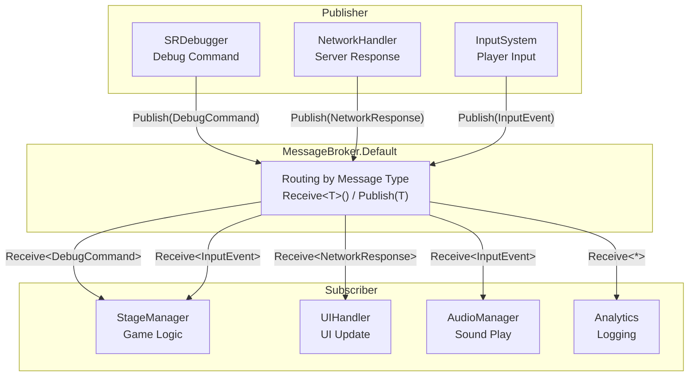
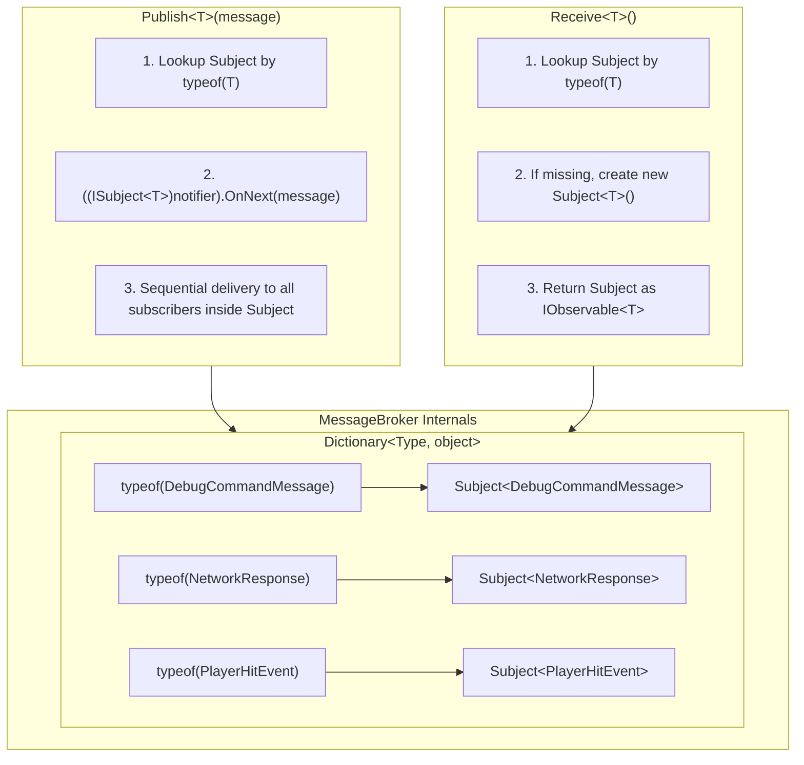
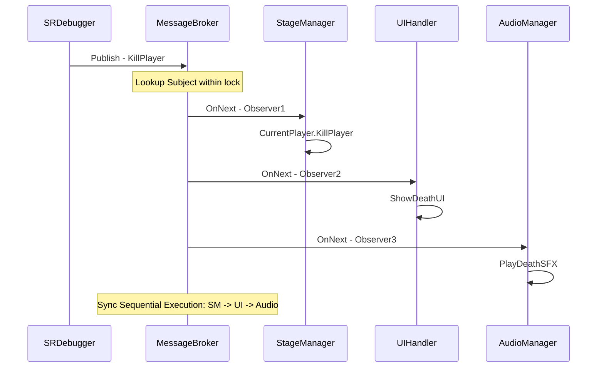
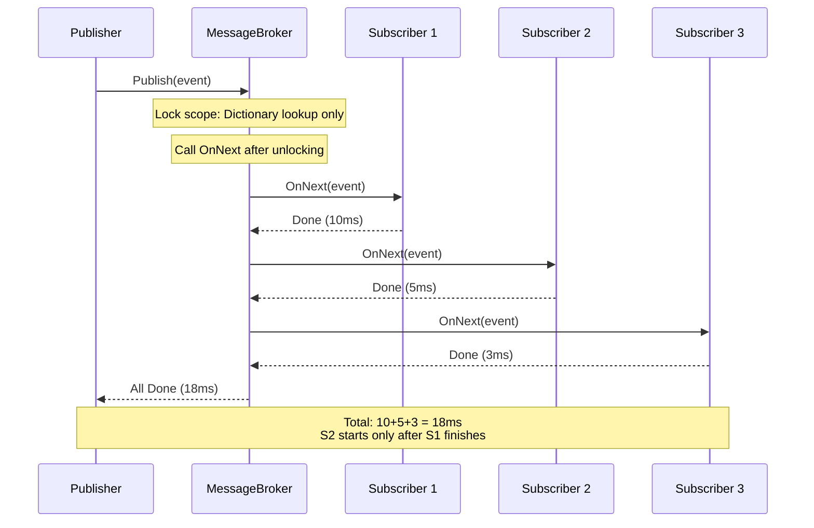
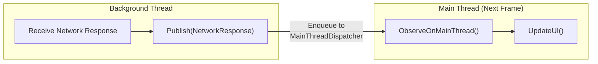
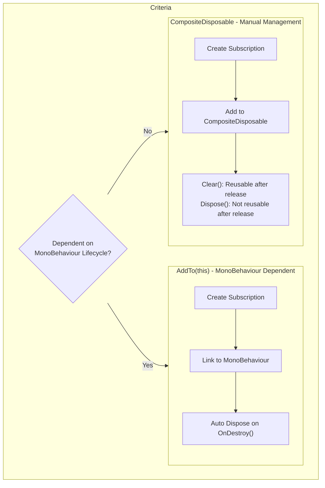
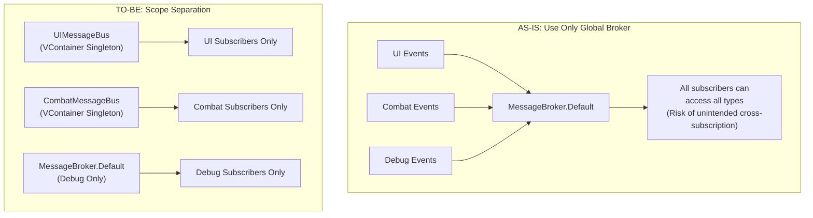

> **Warning**: As UniRx has been updated to R3, `MessageBroker` in [R3](https://github.com/Cysharp/R3?tab=readme-ov-file) has been replaced by [MessagePipe](https://github.com/Cysharp/MessagePipe). This document includes a [Migration Guide](#11-r3messagepipe-migration) at the bottom.
{: .prompt-warning }

---

## Introduction

In game development, situations like this arise frequently: "When the player gets hit, update the HP bar in the UI, apply camera shake, play a sound effect, and log the hit." If all these modules reference each other directly, it results in **Spaghetti Code**.

This is an old problem in software design, and the solution is well known: **Pub/Sub (Publish/Subscribe) Pattern**. It separates the side that generates events (Publisher) from the side that reacts to events (Subscriber) via a **Central Broker**.

UniRx's `MessageBroker` is a Unity implementation of this pattern. This article systematically covers MessageBroker's **internal working principles at the source code level**, **practical usage patterns**, **performance characteristics**, **memory management**, and **migration to R3/MessagePipe**.

---

## Part 1: Core Concepts

### 1. What is MessageBroker?

`MessageBroker` is a **centralized Pub/Sub pattern** implementation provided by UniRx.

To explain with a game development analogy: It's like a **Radio Station**. The station (Publisher) broadcasts messages on a specific frequency (Message Type), and only radios tuned to that frequency (Subscribers) receive the message. The station doesn't know who is listening, and the listener doesn't need to know the station's internal structure.



### Benefits of MessageBroker

| Benefit | Description | Effect on Game Dev |
| --- | --- | --- |
| **Loose Coupling** | Direct references between modules are fundamentally blocked. | No need to modify other modules when adding/removing features. |
| **Type-based Contract** | Compile-time guarantee via `Receive<T>()` / `Publish(T)`. | Prevents runtime errors in advance. |
| **Centralized Routing** | All messages pass through one place. | Easy to trace event flow and debug. |
| **Synchronous Execution** | Subscriber callbacks run sequentially immediately upon publishing. | Predictable execution order. |

> UniRx is a library that handles Unity events and asynchrony in a Reactive Extensions manner. It is made by Cysharp, a GitHub organization under CyberAgent, and is open-sourced to help many developers.
{: .prompt-tip }

---

### 2. Internal Working Principles (Source Code Analysis)

Understanding the internals of MessageBroker allows you to intuitively grasp its performance characteristics and limitations. Based on [UniRx GitHub Source](https://github.com/neuecc/UniRx/blob/master/Assets/Plugins/UniRx/Scripts/Notifiers/MessageBroker.cs).

#### Actual Internal Structure

```csharp
// UniRx Source (Simplified)
public class MessageBroker : IMessageBroker, IDisposable
{
    // Core: Type → Subject<T> Mapping (Stored as object)
    readonly Dictionary<Type, object> notifiers = new Dictionary<Type, object>();

    public void Publish<T>(T message)
    {
        object notifier;
        lock (notifiers)
        {
            if (!notifiers.TryGetValue(typeof(T), out notifier)) return;
        }
        // Cast to Subject<T> and call OnNext
        ((ISubject<T>)notifier).OnNext(message);
    }

    public IObservable<T> Receive<T>()
    {
        object notifier;
        lock (notifiers)
        {
            if (!notifiers.TryGetValue(typeof(T), out notifier))
            {
                // Lazy creation of Subject<T> on first subscription
                ISubject<T> n = new Subject<T>();
                notifier = n;
                notifiers.Add(typeof(T), notifier);
            }
        }
        return ((IObservable<T>)notifier).AsObservable();
    }
}
```

The core structure is **`Dictionary<Type, object>`**, where each value is a **`Subject<T>`**. A Subject is a bidirectional object in Rx that is both `IObservable<T>` and `IObserver<T>`, handling both subscriber management and message delivery.



#### Important Implementation Details

1. **lock(notifiers)**: Uses a lock when accessing the Dictionary. The Dictionary itself is safe even if `Publish`/`Receive` are called concurrently from multiple threads. However, `OnNext(message)` calls are performed outside the lock.

2. **Lazy Creation**: A Subject for a type is created when `Receive<T>()` is called for the first time. If `Publish<T>()` is called first, the message is **silently discarded** because there are no subscribers.

3. **AsObservable()**: `Receive<T>()` wraps the Subject with `AsObservable()` instead of returning it directly. This prevents external code from casting the Subject to `ISubject<T>` and calling `OnNext` directly.

> **💬 Wait, Know This**
>
> **Q. Difference between MessageBroker and C# event?**
> C# `event` requires **direct reference** to the publisher class. Like `player.OnDamaged += HandleDamage`. MessageBroker goes through a central broker, so publishers and subscribers **don't know each other exists**. This difference dramatically reduces coupling.
>
> **Q. Difference between MessageBroker and UnityEvent?**
> `UnityEvent` is a Unity-specific feature allowing event binding in the Inspector. It's designer-friendly but inconvenient for dynamic subscription/unsubscription in code and slower due to reflection. MessageBroker is purely code-based and allows combining Rx operators (Where, Buffer, Throttle, etc.), resulting in much higher **programmer productivity**.
>
> **Q. How are inheritance relationships handled?**
> If you call `Publish<DerivedMessage>(msg)`, it is delivered ONLY to where `Receive<DerivedMessage>()` is subscribed. It is **NOT** delivered to `Receive<BaseMessage>()`. Internally, it uses `typeof(T)` as the Key, so it's **exact type matching**. If you need polymorphic subscription, you must define a message interface and route separately.

---

## Part 2: Practical Implementation

### 3. Defining Message Types: Writing Clear Contracts

Every message should be a DTO (Data Transfer Object) with a clear intent.

```csharp
public enum DebugCommandType
{
    KillPlayer,
    KillMob,
    KillBoss,
    InfiniteUlt,
    ApplySkill
}

// sealed: Prohibit inheritance to ensure message immutability
// readonly struct is also a good choice (See "struct and boxing" section below)
public sealed class DebugCommandMessage
{
    public DebugCommandType CommandType { get; }
    public IReadOnlyDictionary<string, object> Parameters { get; }

    public DebugCommandMessage(DebugCommandType commandType, Dictionary<string, object> parameters = null)
    {
        CommandType = commandType;
        // Defensive copy: Ensure external modifications to Dictionary don't affect the message
        Parameters = parameters ?? new Dictionary<string, object>();
    }
}
```

### 4. Publish

Publishers don't need to care who is listening. They should focus only on **what happened**.

```csharp
// Could be SRDebugger SROptions, or inside a private class like DebugPanel.

// Simple Message Publish
public void KillPlayer()
{
    MessageBroker.Default.Publish(new DebugCommandMessage(DebugCommandType.KillPlayer));
}

// Publish with Parameters
public bool InfiniteUlt
{
    get => isUltInfiniteActive;
    set
    {
        if (isUltInfiniteActive != value)
        {
            isUltInfiniteActive = value;
            MessageBroker.Default.Publish(new DebugCommandMessage(
                DebugCommandType.InfiniteUlt,
                new Dictionary<string, object> { { "trigger", isUltInfiniteActive } }
            ));
        }
    }
}
```



### 5. Subscribe

Subscribers react only to specific message types and **must manage the lifecycle of the subscription**.

```csharp
// Example: Manager class managing a game scene
public partial class StageManager
{
    private Dictionary<DebugCommandType, Action<DebugCommandMessage>> debugActions;

    private void Awake()
    {
        // Map actions by message type
        debugActions = new Dictionary<DebugCommandType, Action<DebugCommandMessage>>()
        {
            {DebugCommandType.KillPlayer, msg => CurrentPlayer.KillPlayer()},
            {DebugCommandType.KillMob, msg => monsterSpawner.KillMonsters()},
            {DebugCommandType.KillBoss, msg => monsterSpawner.KillBoss()},
            {DebugCommandType.InfiniteUlt, msg => InfiniteUlt(msg.Parameters)}
        };

        // Subscribe to messages
        MessageBroker.Default.Receive<DebugCommandMessage>()
            .Subscribe(msg =>
            {
                if (debugActions.TryGetValue(msg.CommandType, out var action))
                {
                    action(msg);
                }
                else
                {
                    UnityEngine.Debug.LogWarning($"Unknown DebugCommandType: {msg.CommandType}");
                }
            }).AddTo(this); // Must manage lifecycle with AddTo
    }

    private void InfiniteUlt(IReadOnlyDictionary<string, object> parameters)
    {
        if (parameters.TryGetValue("trigger", out var trigger))
        {
            var isUltInfiniteActive = (bool) trigger;

            if (isUltInfiniteActive)
            {
                gameModel.UltDelayProperty.Value = 0.1f;
                OnTriggerUltActivate.Invoke();
            }
            else
            {
                gameModel.UltDelayProperty.Value = 10f;
            }
        }
        else
        {
            UnityEngine.Debug.LogWarning("InfiniteUlt command requires 'trigger' parameter");
        }
    }
}
```

---

### 6. Parameter Passing Strategy

There are two approaches, each with trade-offs. Choose based on the situation.

#### Dictionary Approach - Flexible but Risky

You can pass various parameter types flexibly via `Dictionary<string, object>`. It has critical downsides for production but is **sufficient for debugging**.

```csharp
var parameters = new Dictionary<string, object>
{
    { "trigger", true },                              // bool
    { "skillName", "Fireball" },                     // string
    { "damageMultiplier", 1.5f },                    // float
    { "retryCount", 3 },                            // int
    { "affectedTargets", new List<int> { 101, 102, 103 } } // List<int>
};

MessageBroker.Default.Publish(new DebugCommandMessage(
    DebugCommandType.ApplySkill, parameters
));
```

#### DTO Approach - Type-Safe and Clear

Defining a dedicated DTO for each event ensures everything is verified at compile time. Suitable for **production environments**.

```csharp
// Message Definition: Clear Contract
public sealed class SkillAppliedEvent
{
    public string SkillID { get; }
    public float DamageMultiplier { get; }
    public IReadOnlyList<int> TargetIDs { get; }

    public SkillAppliedEvent(string skillID, float damageMultiplier, IReadOnlyList<int> targetIDs)
    {
        SkillID = skillID;
        DamageMultiplier = damageMultiplier;
        TargetIDs = targetIDs;
    }
}

// Publish: Clear and error-free
MessageBroker.Default.Publish(new SkillAppliedEvent("Fireball_Lv3", 1.5f, new[] {101, 102}));

// Subscribe: Use parameters safely without type casting
MessageBroker.Default.Receive<SkillAppliedEvent>()
    .Subscribe(evt => CombatSystem.ApplyDamage(evt.SkillID, evt.DamageMultiplier, evt.TargetIDs))
    .AddTo(this);
```

#### Struct Messages and Boxing: Precise Analysis

You often see advice like "Using structs as messages means zero GC," but a more precise analysis is needed for MessageBroker.

**Conclusion first**: MessageBroker itself does not box messages. `Subject<T>.OnNext(T)` is a generic method, so if T is a value type, it passes without boxing. However, boxing may occur in Rx operator chains.

```csharp
// MessageBroker Internal Flow (Boxing Analysis)
//
// 1. Publish<PlayerHitEvent>(hitEvent)
//    → Lookup Dictionary by typeof(PlayerHitEvent) (Type is reference type, so unrelated)
//    → ((ISubject<PlayerHitEvent>)notifier).OnNext(hitEvent)
//    → OnNext(T) is generic → No Boxing ✅
//
// 2. Intermediate Operators
//    → .Where(x => ...) → Internally generic → No Boxing ✅
//    → .Select(x => (object)x) → Boxing occurs on explicit cast ❌
//
// 3. Subscribe(Action<T>) → Generic → No Boxing ✅

// Thus, struct messages are safe under these conditions:
// - When intermediate operators maintain the generic chain
// - When operators that cast to object are not used
```

> **💬 Wait, Know This**
>
> **Q. So, can I use readonly struct as messages?**
> **Conditionally Yes.** Boxing does not occur in the MessageBroker → Subject → Subscribe path. However, using `sealed class` by default and considering `readonly struct` only for high-frequency messages where GC Alloc becomes an issue in the profiler is safer.
>
> **Q. Is it hard to manage if there are too many message types?**
> An increase in message types is a sign that **the system's event contracts are becoming explicit**. It's actually a good sign. It's manageable by separating them into namespaces by domain:
> ```
> Messages/
> ├── Combat/     ← PlayerHitEvent, EnemyDefeatedEvent, ...
> ├── UI/         ← ScreenChangedEvent, PopupRequestEvent, ...
> ├── Debug/      ← DebugCommandMessage, ...
> └── Network/    ← NetworkResponseEvent, ...
> ```

---

## Part 3: Performance and Safety

### 7. Working Principles, Performance, and Thread Model

#### 3 Things You Must Check

| Item | Description | Caution |
| --- | --- | --- |
| **Time Complexity** | O(n) - One publish delivers sequentially to all subscribers (n) | High-frequency events with hundreds of subscribers can be a performance bottleneck. |
| **Synchronous Execution** | Subscriber callbacks are called immediately and sequentially on the publishing thread | If one callback delays, the entire publish chain is blocked. |
| **Memory Management** | 100% Memory Leak without unsubscription (Dispose) | `AddTo(this)` or `CompositeDisposable` is mandatory. |



#### Switching to Main Thread

Unity APIs (UI, GameObject, etc.) can only be safely called from the main thread. To manipulate Unity APIs upon receiving a message published from a background thread, you MUST use `ObserveOnMainThread()`.

```csharp
// Network Receive (Background Thread) -> Process Result (Main Thread)
MessageBroker.Default.Receive<NetworkResponse>()
    .ObserveOnMainThread() // Guarantees all subsequent callbacks run on Main Thread
    .Subscribe(response => UpdateUI(response.Data))
    .AddTo(this);
```



#### Optimizing High-Frequency Events: Preventing System Overload

Events called dozens of times per frame should not be broadcast as is. Use Rx operators to control the volume.

```csharp
// Buffer: Collect events over time and process at once
MessageBroker.Default.Receive<PlayerHitEvent>()
    .Buffer(TimeSpan.FromMilliseconds(100)) // Group events over 100ms into a list
    .Where(hits => hits.Count > 0)          // Ignore empty batches
    .Subscribe(hits =>
    {
        var totalDamage = hits.Sum(h => h.Damage);
        DamageUIManager.ShowAggregatedDamage(totalDamage);
    })
    .AddTo(this);

// ThrottleFirst: Pass only the first event and block for a duration
MessageBroker.Default.Receive<PlayerPositionChanged>()
    .ThrottleFirst(TimeSpan.FromMilliseconds(200)) // Max 1 pass every 200ms
    .Subscribe(pos => MiniMap.UpdatePlayerPosition(pos))
    .AddTo(this);

// Sample: Take the latest value at intervals
MessageBroker.Default.Receive<EnemyHealthChanged>()
    .Sample(TimeSpan.FromMilliseconds(50)) // Pass only the latest value every 50ms
    .Subscribe(evt => UpdateHealthBar(evt))
    .AddTo(this);
```

| Operator | Behavior | Suitable Scenario |
| --- | --- | --- |
| **Buffer** | Collect events into a **List** over time | Aggregating multi-hit damage, batch logging |
| **ThrottleFirst** | Pass first event, **block for time** | Prevent button spamming, skill cooldown |
| **Sample** | Pass **latest value only** at intervals | Minimap update, HP bar update |

> **💬 Wait, Know This**
>
> **Q. What happens if an exception occurs in a subscriber callback?**
> **That subscription terminates.** If an exception occurs in `OnNext` of one subscriber inside the Subject, `OnError` is called for that subscription, and it is unsubscribed. **Other subscribers are unaffected.** In production, it's safer to protect inside the callback with try-catch:
> ```csharp
> MessageBroker.Default.Receive<SomeEvent>()
>     .Subscribe(evt =>
>     {
>         try { HandleEvent(evt); }
>         catch (Exception e) { Debug.LogException(e); }
>     })
>     .AddTo(this);
> ```

---

### 8. Lifecycle Management (Dispose) and Leak Prevention

#### Beyond `AddTo(this)` to `CompositeDisposable`

`AddTo(this)` is an excellent default for subscriptions tied to `MonoBehaviour`. However, if the object's lifecycle is unrelated to `GameObject`, explicit management using `CompositeDisposable` is mandatory.

```csharp
public class PlayerService
{
    // Container for all subscriptions while this service instance is alive
    private readonly CompositeDisposable subscriptions = new CompositeDisposable();

    public void Activate()
    {
        MessageBroker.Default.Receive<GameStateChangedEvent>()
            .Where(evt => evt.NewState == GameState.InGame)
            .Subscribe(_ => OnGameStarted())
            .AddTo(subscriptions); // Add to container
    }

    public void Deactivate()
    {
        subscriptions.Clear(); // Unsubscribe all at once. Reusable unlike Dispose().
    }
}
```



#### Common Mistakes Causing Memory Leaks

| Mistake Pattern | Problem | Solution |
| --- | --- | --- |
| **Subscribing in Static Class** | Subscription survives after scene change | Explicitly release with `CompositeDisposable` |
| **Waiting only for `OnCompleted`** | MessageBroker does not send `OnCompleted` | Must explicitly terminate with `Dispose` |
| **Subscription without `AddTo`** | Creates references GC cannot collect | `AddTo` is mandatory for all `Subscribe` |
| **Global Broker Subscription Remaining on Scene Change** | Callbacks from previous scene keep firing | Batch `Dispose` before scene transition |
| **Confusing `Clear()` and `Dispose()`** | Exception occurs if reused after `Dispose()` | Use `Clear()` if reuse is needed |

---

### 9. Scope Separation

Using only the global broker `MessageBroker.Default` leads to **Spaghetti** where all events are mixed up. Message domain boundaries collapse, unintended cross-subscriptions occur, and code reasoning becomes impossible.

#### Solution: Setting Broker Scope per Feature

Inject module-specific brokers via a DI container (Recommended: [VContainer](https://github.com/hadashiA/VContainer)).

```csharp
// Define Module-specific Message Bus
public sealed class UIMessageBus
{
    public IMessageBroker Broker { get; } = new MessageBroker();
}

public sealed class CombatMessageBus
{
    public IMessageBroker Broker { get; } = new MessageBroker();
}

// VContainer Registration Example
public class GameLifetimeScope : LifetimeScope
{
    protected override void Configure(IContainerBuilder builder)
    {
        builder.Register<UIMessageBus>(Lifetime.Singleton);
        builder.Register<CombatMessageBus>(Lifetime.Singleton);
    }
}

// Usage (UI Component)
public class HUDController : MonoBehaviour
{
    [Inject] private UIMessageBus uiBus;

    void Start()
    {
        uiBus.Broker.Receive<PlayerHealthChanged>()
            .Subscribe(evt => UpdateHealthBar(evt.CurrentHealth))
            .AddTo(this);
    }
}

// Usage (Combat System)
public class CombatManager : MonoBehaviour
{
    [Inject] private CombatMessageBus combatBus;

    void Start()
    {
        combatBus.Broker.Receive<EnemyDefeatedEvent>()
            .Subscribe(evt => ProcessLoot(evt.EnemyID))
            .AddTo(this);
    }
}
```



---

## Part 4: Asynchrony and Evolution

### 10. AsyncMessageBroker

UniRx also provides an **asynchronous version, `AsyncMessageBroker`**, in addition to the synchronous MessageBroker. Use it when subscribers need to perform asynchronous operations.

```csharp
// Async Subscription: Next subscriber runs after this subscriber completes async task
AsyncMessageBroker.Default.Subscribe<SaveGameRequest>(async req =>
{
    await SaveToCloudAsync(req.Data);
    Debug.Log("Cloud save completed");
});

// Async Publish: Wait until all subscribers' async tasks are complete
await AsyncMessageBroker.Default.PublishAsync(new SaveGameRequest(currentData));
Debug.Log("All subscribers finished"); // Runs after all saves complete
```

| Characteristic | MessageBroker | AsyncMessageBroker |
| --- | --- | --- |
| **Subscriber Execution** | Synchronous Sequential | Asynchronous Sequential (await) |
| **Publish Method** | `Publish<T>(T)` (void) | `PublishAsync<T>(T)` (Task) |
| **Subscribe Method** | `Receive<T>()` → IObservable | `Subscribe<T>(Func<T, Task>)` → IDisposable |
| **Suitable Scenario** | Immediate processing events | Network requests, File I/O, Scene loads |

---

### 11. R3/MessagePipe Migration

In R3, the successor to UniRx, MessageBroker has been separated into a standalone package called **[MessagePipe](https://github.com/Cysharp/MessagePipe)**. Refer to this if starting a new project or migrating to R3.

#### API Correspondence Comparison

| Feature | UniRx MessageBroker | MessagePipe |
| --- | --- | --- |
| **Publish** | `MessageBroker.Default.Publish<T>(msg)` | `publisher.Publish(msg)` |
| **Subscribe** | `MessageBroker.Default.Receive<T>()` | `subscriber.Subscribe(msg => ...)` |
| **Global Singleton** | `MessageBroker.Default` | None (DI Mandatory) |
| **Async** | `AsyncMessageBroker` | `IAsyncPublisher<T>` / `IAsyncSubscriber<T>` |
| **DI Integration** | Optional | **Mandatory** (VContainer, Zenject, etc.) |
| **Filtering** | Rx Operators (Where, Select...) | MessagePipe Filters or Rx Operators |
| **Buffering** | Rx Operators (Buffer, Throttle...) | `IBufferedPublisher<T>` |

<div class="code-compare">
  <div class="code-compare-pane">
    <div class="code-compare-label label-before">UniRx MessageBroker</div>
    <div class="highlight">
<pre><code class="language-csharp">// Use directly as Global Singleton
// No DI needed

// Publish (Anywhere)
MessageBroker.Default
    .Publish(new PlayerHitEvent(30f));

// Subscribe
MessageBroker.Default
    .Receive&lt;PlayerHitEvent&gt;()
    .Subscribe(evt =>
        UpdateHealthBar(evt.Damage))
    .AddTo(this);</code></pre>
    </div>
  </div>
  <div class="code-compare-pane">
    <div class="code-compare-label label-after">MessagePipe (R3)</div>
    <div class="highlight">
<pre><code class="language-csharp">// DI Injection Mandatory (VContainer etc.)
// ISP Principle: Separate Publisher/Subscriber

// Publisher Side
[Inject] IPublisher&lt;PlayerHitEvent&gt; _pub;

void ApplyDamage(float dmg)
    => _pub.Publish(new PlayerHitEvent(dmg));

// Subscriber Side
[Inject] ISubscriber&lt;PlayerHitEvent&gt; _sub;

void Start() =>
    _sub.Subscribe(e => UpdateHealthBar(e.Damage))
        .AddTo(this);</code></pre>
    </div>
  </div>
</div>

#### Key Differences

1. **Removal of Global Singleton**: MessagePipe has no `Default` instance. You MUST inject `IPublisher<T>` / `ISubscriber<T>` via a DI container. This enforces the "Scope Separation" discussed earlier at the architecture level.

2. **Interface Separation**: Publisher and Subscriber interfaces are separated, so subscription functionality is not exposed to classes that only publish (ISP Principle).

3. **Performance Optimization**: MessagePipe achieves lower overhead by managing subscriber arrays directly, not based on UniRx Subjects.

```csharp
// MessagePipe Usage Example (VContainer)

// 1. DI Registration
public class GameLifetimeScope : LifetimeScope
{
    protected override void Configure(IContainerBuilder builder)
    {
        var options = builder.RegisterMessagePipe();
        builder.RegisterMessageBroker<PlayerHitEvent>(options);
        builder.RegisterMessageBroker<DebugCommandMessage>(options);
    }
}

// 2. Publish
public class DamageSystem
{
    [Inject] private IPublisher<PlayerHitEvent> hitPublisher;

    public void ApplyDamage(float damage)
    {
        hitPublisher.Publish(new PlayerHitEvent(damage));
    }
}

// 3. Subscribe
public class HUDController : MonoBehaviour
{
    [Inject] private ISubscriber<PlayerHitEvent> hitSubscriber;

    void Start()
    {
        hitSubscriber.Subscribe(evt => UpdateHealthBar(evt.Damage))
            .AddTo(this); // R3 AddTo extension
    }
}
```

---

## Checklist

Check the following during code review:

[✅] Are messages strongly-typed DTOs? (Dictionary allowed only for debug tools)

[✅] Do all `Subscribe` calls end with `AddTo` or `CompositeDisposable`? (No exceptions)

[✅] Are callbacks handling Unity APIs protected with `ObserveOnMainThread()`?

[✅] Is the global broker not abused, and scopes separated by feature-specific brokers? (VContainer recommended)

[✅] Are high-frequency events controlled with `Buffer`, `Throttle`, `Sample`?

[✅] Is there exception handling (try-catch) inside subscriber callbacks?

[✅] Verified that subscriptions to the global broker do not remain after scene transition?

[✅] Is `AsyncMessageBroker` used for subscriptions requiring async processing?

[✅] If it's a new project, have you considered migrating to MessagePipe?

---

## Conclusion

MessageBroker is a powerful tool, but it requires careful decision-making and responsibility. This pattern is not just about separating code, but an **architectural act** of designing how each part of the system communicates through "contracts."

Summarizing key principles:

| Principle | Description |
| --- | --- |
| **DTO-based Messages** | Remove magic strings and runtime casting, ensure compile-time safety |
| **Strict Lifecycle Management** | 100% leak prevention with `AddTo` or `CompositeDisposable` |
| **Clear Thread Model** | Protect Unity API access with `ObserveOnMainThread()` |
| **Scope Separation** | Set event boundaries with feature-specific brokers (VContainer + MessageBus) |
| **High-frequency Event Control** | Prevent system overload with Rx operators |
| **Recognize Evolution Path** | Prepare DI-based architecture when switching UniRx → R3/MessagePipe |

When you follow these principles, MessageBroker becomes a robust and flexible architecture supporting complex Unity projects.
