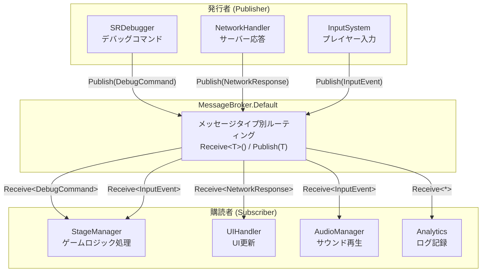
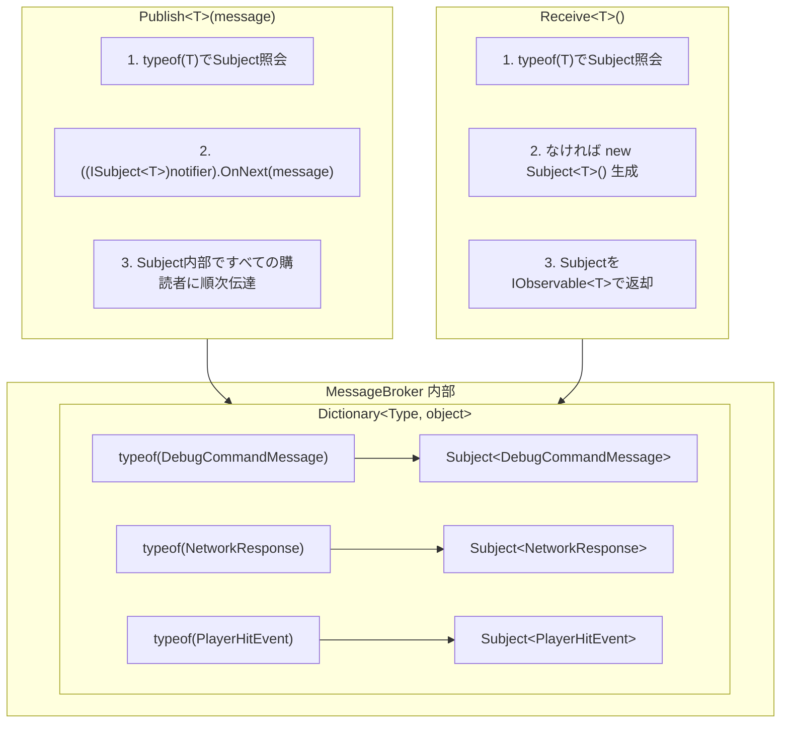
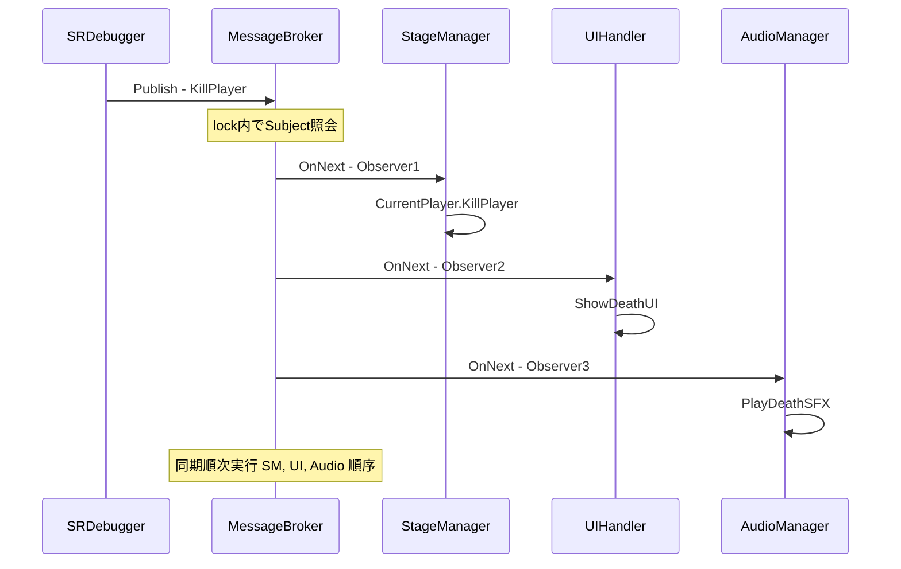
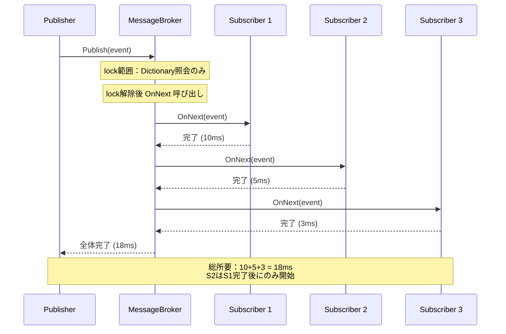
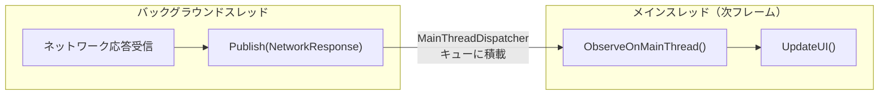
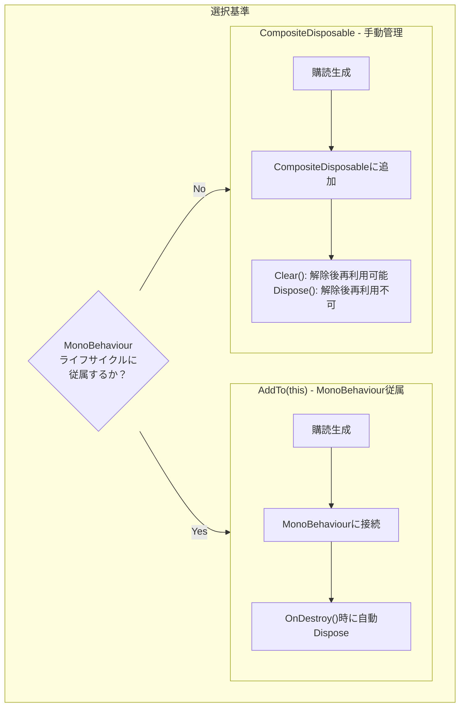
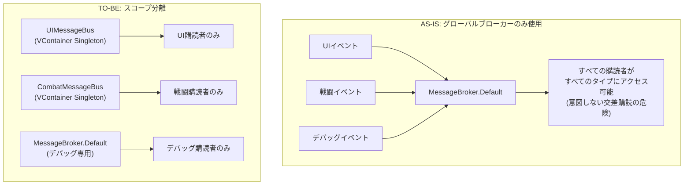

> **注意**：UniRxがR3にアップデートされるに伴い、[R3](https://github.com/Cysharp/R3?tab=readme-ov-file)ではMessageBrokerは[MessagePipe](https://github.com/Cysharp/MessagePipe)に変更されました。この文書の下段に[移行ガイド](#11-r3messagepipe-移行)を含めています。
{: .prompt-warning }

---

## 序論

ゲームを作っていると、このような状況が頻繁に発生します：「プレイヤーが攻撃を受けた時、UIの体力バーも更新し、カメラの手ブレ効果も与え、サウンドも再生し、ヒットログも残さなければならない。」これらすべてのモジュールが互いに直接参照すると **スパゲッティコード** になります。

これはソフトウェア設計における古い問題であり、解決策もよく知られています：**Pub/Sub（発行/購読）パターン**。イベントを発生させる側（Publisher）とイベントに反応する側（Subscriber）を **中央ブローカー** を通じて分離することです。

UniRxの `MessageBroker` はこのパターンのUnity実装体です。この記事では、MessageBrokerの **ソースコードレベルの内部動作原理** から **実戦活用パターン**、 **性能特性**、 **メモリ管理**、そして **R3/MessagePipeへの移行** まで体系的に扱います。

---

## Part 1：核心概念

### 1. MessageBrokerとは？

`MessageBroker` はUniRxで提供する **中央集中型Pub/Subパターン** 実装体です。

ゲーム開発での比喩で説明すると： **ラジオ放送局** と同じです。放送局（Publisher）は特定の周波数（メッセージタイプ）でメッセージを送出し、該当周波数に合わせたラジオ（Subscriber）のみがメッセージを受信します。放送局は誰が聞いているかを知らず、リスナーは放送局の内部構造を知る必要がありません。



### MessageBrokerのメリット

| メリット | 説明 | ゲーム開発効果 |
| --- | --- | --- |
| **疎結合 (Loose Coupling)** | モジュール間の直接参照が根本的に遮断される | 機能追加/削除時に他のモジュール修正不要 |
| **タイプベース契約** | `Receive<T>()` / `Publish(T)` でコンパイルタイム保証 | ランタイムエラー事前防止 |
| **中央集中ルーティング** | すべてのメッセージが一箇所を経由 | イベントフロー追跡とデバッグ容易 |
| **同期実行** | 発行直後に購読者コールバックが順次実行 | 予測可能な実行順序 |

> UniRxはUnityイベントと非同期をReactive Extensions方式で扱うライブラリです。CyberAgent社所属のCysharpというGitHub組織で作ったもので、オープンソースとして公開され多くの開発者に役立っています。
{: .prompt-tip }

---

### 2. 内部動作原理（ソースコード分析）

MessageBrokerの内部を理解すれば、性能特性と制約を直感的に把握できます。[UniRx GitHubソース](https://github.com/neuecc/UniRx/blob/master/Assets/Plugins/UniRx/Scripts/Notifiers/MessageBroker.cs)を基に分析します。

#### 実際の内部構造

```csharp
// UniRx ソース（簡略化）
public class MessageBroker : IMessageBroker, IDisposable
{
    // 核心：Type → Subject<T> マッピング（objectとして保存）
    readonly Dictionary<Type, object> notifiers = new Dictionary<Type, object>();

    public void Publish<T>(T message)
    {
        object notifier;
        lock (notifiers)
        {
            if (!notifiers.TryGetValue(typeof(T), out notifier)) return;
        }
        // Subject<T>にキャスト後 OnNext 呼び出し
        ((ISubject<T>)notifier).OnNext(message);
    }

    public IObservable<T> Receive<T>()
    {
        object notifier;
        lock (notifiers)
        {
            if (!notifiers.TryGetValue(typeof(T), out notifier))
            {
                // 該当タイプの初購読時に Subject<T> を lazy 生成
                ISubject<T> n = new Subject<T>();
                notifier = n;
                notifiers.Add(typeof(T), notifier);
            }
        }
        return ((IObservable<T>)notifier).AsObservable();
    }
}
```

核心構造は **`Dictionary<Type, object>`** であり、各valueは **`Subject<T>`** です。SubjectはRxで `IObservable<T>` であり同時に `IObserver<T>` である双方向オブジェクトで、購読者管理とメッセージ伝達の両方を担当します。



#### 重要な実装ディテール

1. **lock(notifiers)**：Dictionaryアクセス時にlockを使用します。マルチスレッドで `Publish`/`Receive` が同時に呼び出されてもDictionary自体は安全です。ただし、`OnNext(message)` 呼び出しはlock外部で実行されます。

2. **Lazy 生成**：`Receive<T>()` が初めて呼び出される時、該当タイプのSubjectが生成されます。`Publish<T>()` が先に呼び出されると購読者がいないため、メッセージは **静かに捨てられます**。

3. **AsObservable()**：`Receive<T>()` はSubjectを直接返さず `AsObservable()` でラッピングします。これは外部でSubjectを `ISubject<T>` にキャストして `OnNext` を直接呼び出すことを防ぐためです。

> **💬 ちょっと、これだけは知っておこう**
>
> **Q. MessageBrokerとC# eventの違いは？**
> C#の `event` は発行者クラスに **直接参照** が必要です。`player.OnDamaged += HandleDamage` のように。MessageBrokerは中央ブローカーを経由するため、発行者と購読者が **互いの存在を全く知りません**。この違いが結合度を劇的に下げます。
>
> **Q. MessageBrokerとUnityEventの違いは？**
> `UnityEvent` はInspectorでイベントをバインドできるUnity専用機能です。デザイナーフレンドリーですが、コードでの動的購読/解除が不便でReflectionベースなので性能も劣ります。MessageBrokerは純粋コードベースであり、Rx演算子（Where, Buffer, Throttleなど）を組み合わせられるため **プログラマ生産性** がはるかに高いです。
>
> **Q. 継承関係のメッセージはどう処理されますか？**
> `Publish<DerivedMessage>(msg)` を呼び出すと、`Receive<DerivedMessage>()` を購読した場所にのみ伝達されます。`Receive<BaseMessage>()` には伝達 **されません**。内部的に `typeof(T)` をKeyとして使用するため **正確なタイプマッチング（exact type matching）** です。多態的購読が必要ならメッセージインターフェースを定義して別途ルーティングする必要があります。

---

## Part 2：実戦実装

### 3. メッセージタイプの定義：明確な契約書作成

すべてのメッセージはそれ自体で明確な意図を持つDTO（Data Transfer Object）でなければなりません。

```csharp
public enum DebugCommandType
{
    KillPlayer,
    KillMob,
    KillBoss,
    InfiniteUlt,
    ApplySkill
}

// sealed：継承を禁止してメッセージタイプの不変性を保証
// readonly structも良い選択肢（下段「structとボクシング」セクション参照）
public sealed class DebugCommandMessage
{
    public DebugCommandType CommandType { get; }
    public IReadOnlyDictionary<string, object> Parameters { get; }

    public DebugCommandMessage(DebugCommandType commandType, Dictionary<string, object> parameters = null)
    {
        CommandType = commandType;
        // 防御的コピー：外部でDictionaryが修正されてもメッセージ内部には影響がないように保証
        Parameters = parameters ?? new Dictionary<string, object>();
    }
}
```

### 4. 発行（Publish）

Publisherは誰が聞いているか気にする必要は全くありません。ただ **何が起きたのか** にのみ集中してメッセージを発行すべきです。

```csharp
// SRDebugger SROptionsかもしれないし、DebugPanelのような個人クラス内部かもしれない。

// 単純メッセージ発行
public void KillPlayer()
{
    MessageBroker.Default.Publish(new DebugCommandMessage(DebugCommandType.KillPlayer));
}

// パラメータが含まれたメッセージ発行
public bool InfiniteUlt
{
    get => isUltInfiniteActive;
    set
    {
        if (isUltInfiniteActive != value)
        {
            isUltInfiniteActive = value;
            MessageBroker.Default.Publish(new DebugCommandMessage(
                DebugCommandType.InfiniteUlt,
                new Dictionary<string, object> { { "trigger", isUltInfiniteActive } }
            ));
        }
    }
}
```



### 5. 購読（Subscribe）

購読者は特定タイプのメッセージにのみ反応し、 **購読のライフサイクルを必ず管理** する必要があります。

```csharp
// 例示コード：一つのゲームシーンを管理するマネージャクラス
public partial class StageManager
{
    private Dictionary<DebugCommandType, Action<DebugCommandMessage>> debugActions;

    private void Awake()
    {
        // メッセージ別アクションマッピング
        debugActions = new Dictionary<DebugCommandType, Action<DebugCommandMessage>>()
        {
            {DebugCommandType.KillPlayer, msg => CurrentPlayer.KillPlayer()},
            {DebugCommandType.KillMob, msg => monsterSpawner.KillMonsters()},
            {DebugCommandType.KillBoss, msg => monsterSpawner.KillBoss()},
            {DebugCommandType.InfiniteUlt, msg => InfiniteUlt(msg.Parameters)}
        };

        // メッセージ購読
        MessageBroker.Default.Receive<DebugCommandMessage>()
            .Subscribe(msg =>
            {
                if (debugActions.TryGetValue(msg.CommandType, out var action))
                {
                    action(msg);
                }
                else
                {
                    UnityEngine.Debug.LogWarning($"Unknown DebugCommandType: {msg.CommandType}");
                }
            }).AddTo(this); // 必ずAddToでライフサイクル管理
    }

    private void InfiniteUlt(IReadOnlyDictionary<string, object> parameters)
    {
        if (parameters.TryGetValue("trigger", out var trigger))
        {
            var isUltInfiniteActive = (bool) trigger;

            if (isUltInfiniteActive)
            {
                gameModel.UltDelayProperty.Value = 0.1f;
                OnTriggerUltActivate.Invoke();
            }
            else
            {
                gameModel.UltDelayProperty.Value = 10f;
            }
        }
        else
        {
            UnityEngine.Debug.LogWarning("InfiniteUlt command requires 'trigger' parameter");
        }
    }
}
```

---

### 6. パラメータ伝達戦略

2つのアプローチがあり、それぞれのトレードオフを理解して状況に合わせて選択する必要があります。

#### Dictionary方式 - 柔軟だが危険

`Dictionary<string, object>` を通じて様々なタイプのパラメータを柔軟に伝達できます。プロダクション環境で致命的な短所が存在しますが、 **デバッグ用途としては十分です**。

```csharp
var parameters = new Dictionary<string, object>
{
    { "trigger", true },                              // bool 値
    { "skillName", "Fireball" },                     // string 値
    { "damageMultiplier", 1.5f },                    // float 値
    { "retryCount", 3 },                            // int 値
    { "affectedTargets", new List<int> { 101, 102, 103 } } // List<int> 値
};

MessageBroker.Default.Publish(new DebugCommandMessage(
    DebugCommandType.ApplySkill, parameters
));
```

#### DTO方式 - タイプ安全で明確

イベントごとに専用DTOを定義すればコンパイルタイムにすべてが検証されます。 **プロダクション環境** に適しています。

```csharp
// メッセージ定義：明確な契約
public sealed class SkillAppliedEvent
{
    public string SkillID { get; }
    public float DamageMultiplier { get; }
    public IReadOnlyList<int> TargetIDs { get; }

    public SkillAppliedEvent(string skillID, float damageMultiplier, IReadOnlyList<int> targetIDs)
    {
        SkillID = skillID;
        DamageMultiplier = damageMultiplier;
        TargetIDs = targetIDs;
    }
}

// 発行：明確でミスがない
MessageBroker.Default.Publish(new SkillAppliedEvent("Fireball_Lv3", 1.5f, new[] {101, 102}));

// 購読：タイプキャストなしで安全にパラメータ使用
MessageBroker.Default.Receive<SkillAppliedEvent>()
    .Subscribe(evt => CombatSystem.ApplyDamage(evt.SkillID, evt.DamageMultiplier, evt.TargetIDs))
    .AddTo(this);
```

#### structメッセージとボクシング：正確な分析

「structをメッセージとして使えばGCゼロ」という助言をよく見ますが、MessageBrokerではもう少し精密な分析が必要です。

**結論から**：MessageBroker自体はメッセージをボクシングしません。`Subject<T>.OnNext(T)` はジェネリックメソッドなのでTがvalue typeでもボクシングなしで伝達されます。ただし、Rx演算子チェーンでボクシングが発生する可能性があります。

```csharp
// MessageBroker 内部フロー（ボクシング分析）
//
// 1. Publish<PlayerHitEvent>(hitEvent)
//    → typeof(PlayerHitEvent)でDictionary照会（Typeは参照タイプなので無関係）
//    → ((ISubject<PlayerHitEvent>)notifier).OnNext(hitEvent)
//    → OnNext(T) はジェネリック → ボクシングなし ✅
//
// 2. 中間演算子
//    → .Where(x => ...) → 内部的にジェネリック → ボクシングなし ✅
//    → .Select(x => (object)x) → 明示的キャスト時にボクシング発生 ❌
//
// 3. Subscribe(Action<T>) → ジェネリック → ボクシングなし ✅

// したがって struct メッセージは次の条件で安全：
// - 中間演算子がジェネリックチェーンを維持する時
// - objectにキャストする演算子を使用しない時
```

> **💬 ちょっと、これだけは知っておこう**
>
> **Q. それなら readonly struct をメッセージとして使ってもいいですか？**
> **条件付き Yes。** MessageBroker → Subject → Subscribe 経路ではボクシングが発生しません。しかし `sealed class` を基本として使用し、プロファイラーでGC Allocが問題になる高頻度メッセージに限ってのみ `readonly struct` を考慮するのが安全です。
>
> **Q. メッセージタイプが多くなりすぎると管理が難しいのでは？**
> メッセージタイプが増えることは **システムのイベント契約が明示的に現れること** です。むしろ良いシグナルです。ネームスペースでドメイン別に分離すれば十分に管理可能です：
> ```
> Messages/
> ├── Combat/     ← PlayerHitEvent, EnemyDefeatedEvent, ...
> ├── UI/         ← ScreenChangedEvent, PopupRequestEvent, ...
> ├── Debug/      ← DebugCommandMessage, ...
> └── Network/    ← NetworkResponseEvent, ...
> ```

---

## Part 3：性能と安全

### 7. 動作原理、性能、そしてスレッドモデル

#### 必ず確認すべき内容 3つ

| 項目 | 内容 | 注意事項 |
| --- | --- | --- |
| **時間複雑度** | O(n) - 一回の発行はすべての購読者(n)に順次伝達 | 購読者が数百個以上の高頻度イベントは性能ボトルネックの可能性 |
| **同期実行** | 発行スレッドで購読者コールバックが即時順次呼び出し | 一つのコールバックが遅延すると全体の発行チェーンがブロックされる |
| **メモリ管理** | 購読解除(Dispose)なしでは100%メモリリーク | `AddTo(this)` または `CompositeDisposable` 必須 |



#### メインスレッド転換

UnityのAPI（UI, GameObjectなど）はメインスレッドでのみ安全に呼び出すことができます。バックグラウンドスレッドで発行されたメッセージを受け取りUnity APIを操作するには、 `ObserveOnMainThread()` を必ず使用する必要があります。

```csharp
// ネットワーク受信（バックグラウンドスレッド） -> 結果処理（メインスレッド）
MessageBroker.Default.Receive<NetworkResponse>()
    .ObserveOnMainThread() // この時点以降のすべてのコールバックはメインスレッドで実行されることを保証
    .Subscribe(response => UpdateUI(response.Data))
    .AddTo(this);
```



#### 高頻度イベント最適化：システム過負荷防止

フレームごとに数十回呼び出されるイベントはそのままブロードキャストしてはいけません。Rx演算子で呼び出し量を制御する必要があります。

```csharp
// Buffer：一定時間のイベントを集めて一度に処理
MessageBroker.Default.Receive<PlayerHitEvent>()
    .Buffer(TimeSpan.FromMilliseconds(100)) // 100msの間に発生したイベントをリストにまとめる
    .Where(hits => hits.Count > 0)          // 空のバッチは無視
    .Subscribe(hits =>
    {
        var totalDamage = hits.Sum(h => h.Damage);
        DamageUIManager.ShowAggregatedDamage(totalDamage);
    })
    .AddTo(this);

// ThrottleFirst：最初のイベントだけ通過させ一定時間遮断
MessageBroker.Default.Receive<PlayerPositionChanged>()
    .ThrottleFirst(TimeSpan.FromMilliseconds(200)) // 200msごとに最大1回だけ通過
    .Subscribe(pos => MiniMap.UpdatePlayerPosition(pos))
    .AddTo(this);

// Sample：一定間隔で最新値のみ取得
MessageBroker.Default.Receive<EnemyHealthChanged>()
    .Sample(TimeSpan.FromMilliseconds(50)) // 50msごとに最新値一つだけ通過
    .Subscribe(evt => UpdateHealthBar(evt))
    .AddTo(this);
```

| 演算子 | 動作 | 適したシナリオ |
| --- | --- | --- |
| **Buffer** | 一定時間のイベントを **集めてリストで** 伝達 | 多重ヒットダメージ合算、バッチログ転送 |
| **ThrottleFirst** | 最初のイベントだけ通過、以降 **一定時間遮断** | ボタン連打防止、スキルクールダウン |
| **Sample** | 一定間隔で **最新値のみ** 通過 | ミニマップ位置更新、HPバーアップデート |

> **💬 ちょっと、これだけは知っておこう**
>
> **Q. 購読者コールバックで例外が発生するとどうなりますか？**
> **該当購読が終了します。** Subject内部である購読者の `OnNext` で例外が発生すると、その購読の `OnError` が呼び出され購読が解除されます。 **他の購読者には影響がありません。** プロダクションではコールバック内部でtry-catchで保護するのが安全です：
> ```csharp
> MessageBroker.Default.Receive<SomeEvent>()
>     .Subscribe(evt =>
>     {
>         try { HandleEvent(evt); }
>         catch (Exception e) { Debug.LogException(e); }
>     })
>     .AddTo(this);
> ```

---

### 8. ライフサイクル管理(Dispose)とリーク防止

#### `AddTo(this)` を超えて `CompositeDisposable` へ

`AddTo(this)` は `MonoBehaviour` に従属した購読に対する素晴らしいデフォルト値です。しかしオブジェクトのライフサイクルが `GameObject` と無関係なら、 `CompositeDisposable` を使用した明示的な管理が必須です。

```csharp
public class PlayerService
{
    // このサービスインスタンスが生きている間のすべての購読を格納するコンテナ
    private readonly CompositeDisposable subscriptions = new CompositeDisposable();

    public void Activate()
    {
        MessageBroker.Default.Receive<GameStateChangedEvent>()
            .Where(evt => evt.NewState == GameState.InGame)
            .Subscribe(_ => OnGameStarted())
            .AddTo(subscriptions); // コンテナに追加
    }

    public void Deactivate()
    {
        subscriptions.Clear(); // すべての購読を一度に解除。Dispose()と異なり再利用可能。
    }
}
```



#### メモリリークを誘発するよくあるミス

| ミスパターン | 問題点 | 解決策 |
| --- | --- | --- |
| **静的クラスで購読** | シーン転換後も購読が生き残る | `CompositeDisposable` で明示的解除 |
| **`OnCompleted` だけ待つ** | MessageBrokerは `OnCompleted` を送らない | 必ず `Dispose` で明示的終了 |
| **`AddTo` なしの購読** | GCが回収できない参照発生 | すべての `Subscribe` に `AddTo` 必須 |
| **シーン転換時グローバルブローカー購読残留** | 以前のシーンのコールバックが呼び出され続ける | シーン転換前に一括 `Dispose` |
| **`Clear()` と `Dispose()` 混同** | `Dispose()` 後に再利用すると例外発生 | 再利用が必要なら `Clear()` 使用 |

---

### 9. スコープ分離

グローバルブローカー `MessageBroker.Default` だけを使用するとすべてのイベントが混ざり合う **スパゲッティ** になります。メッセージドメインの境界が崩れ、意図しない交差購読が発生したりコード推論が不可能になります。

#### 解決策：機能別ブローカースコープ設定

DIコンテナ（[VContainer](https://github.com/hadashiA/VContainer) 推奨）を通じてモジュール専用ブローカーを注入します。

```csharp
// モジュール専用メッセージバス定義
public sealed class UIMessageBus
{
    public IMessageBroker Broker { get; } = new MessageBroker();
}

public sealed class CombatMessageBus
{
    public IMessageBroker Broker { get; } = new MessageBroker();
}

// VContainer登録例
public class GameLifetimeScope : LifetimeScope
{
    protected override void Configure(IContainerBuilder builder)
    {
        builder.Register<UIMessageBus>(Lifetime.Singleton);
        builder.Register<CombatMessageBus>(Lifetime.Singleton);
    }
}

// 使用箇所（UIコンポーネント）
public class HUDController : MonoBehaviour
{
    [Inject] private UIMessageBus uiBus;

    void Start()
    {
        uiBus.Broker.Receive<PlayerHealthChanged>()
            .Subscribe(evt => UpdateHealthBar(evt.CurrentHealth))
            .AddTo(this);
    }
}

// 使用箇所（戦闘システム）
public class CombatManager : MonoBehaviour
{
    [Inject] private CombatMessageBus combatBus;

    void Start()
    {
        combatBus.Broker.Receive<EnemyDefeatedEvent>()
            .Subscribe(evt => ProcessLoot(evt.EnemyID))
            .AddTo(this);
    }
}
```



---

## Part 4：非同期と進化

### 10. AsyncMessageBroker

UniRxは同期MessageBroker以外に **非同期バージョンである `AsyncMessageBroker`** も提供します。購読者が非同期作業を実行する必要がある場合に使用します。

```csharp
// 非同期購読：購読者が非同期作業を完了した後、次の購読者が実行される
AsyncMessageBroker.Default.Subscribe<SaveGameRequest>(async req =>
{
    await SaveToCloudAsync(req.Data);
    Debug.Log("Cloud save completed");
});

// 非同期発行：すべての購読者の非同期作業が完了するまで待機
await AsyncMessageBroker.Default.PublishAsync(new SaveGameRequest(currentData));
Debug.Log("All subscribers finished"); // すべての保存完了後に実行
```

| 特性 | MessageBroker | AsyncMessageBroker |
| --- | --- | --- |
| **購読者実行** | 同期順次 | 非同期順次 (await) |
| **発行メソッド** | `Publish<T>(T)` (void) | `PublishAsync<T>(T)` (Task) |
| **購読メソッド** | `Receive<T>()` → IObservable | `Subscribe<T>(Func<T, Task>)` → IDisposable |
| **適したシナリオ** | 即時処理可能なイベント | ネットワークリクエスト、ファイルI/O、シーンロード |

---

### 11. R3/MessagePipe 移行

UniRxの後継であるR3ではMessageBrokerが別パッケージである **[MessagePipe](https://github.com/Cysharp/MessagePipe)** に分離されました。新しいプロジェクトを始めるかR3へ移行する場合参考にしてください。

#### API対応比較

| 機能 | UniRx MessageBroker | MessagePipe |
| --- | --- | --- |
| **発行** | `MessageBroker.Default.Publish<T>(msg)` | `publisher.Publish(msg)` |
| **購読** | `MessageBroker.Default.Receive<T>()` | `subscriber.Subscribe(msg => ...)` |
| **グローバルシングルトン** | `MessageBroker.Default` | なし (DI必須) |
| **非同期** | `AsyncMessageBroker` | `IAsyncPublisher<T>` / `IAsyncSubscriber<T>` |
| **DI統合** | 選択的 | **必須** (VContainer, Zenjectなど) |
| **フィルタリング** | Rx演算子 (Where, Select...) | MessagePipeフィルターまたはRx演算子 |
| **バッファリング** | Rx演算子 (Buffer, Throttle...) | `IBufferedPublisher<T>` |

<div class="code-compare">
  <div class="code-compare-pane">
    <div class="code-compare-label label-before">UniRx MessageBroker</div>
    <div class="highlight">
<pre><code class="language-csharp">// グローバルシングルトンで即使用
// DI不要

// 発行（どこでも）
MessageBroker.Default
    .Publish(new PlayerHitEvent(30f));

// 購読
MessageBroker.Default
    .Receive&lt;PlayerHitEvent&gt;()
    .Subscribe(evt =>
        UpdateHealthBar(evt.Damage))
    .AddTo(this);</code></pre>
    </div>
  </div>
  <div class="code-compare-pane">
    <div class="code-compare-label label-after">MessagePipe (R3)</div>
    <div class="highlight">
<pre><code class="language-csharp">// DI注入必須（VContainerなど）
// ISP原則：Publisher/Subscriber分離

// 発行側
[Inject] IPublisher&lt;PlayerHitEvent&gt; _pub;

void ApplyDamage(float dmg)
    => _pub.Publish(new PlayerHitEvent(dmg));

// 購読側
[Inject] ISubscriber&lt;PlayerHitEvent&gt; _sub;

void Start() =>
    _sub.Subscribe(e => UpdateHealthBar(e.Damage))
        .AddTo(this);</code></pre>
    </div>
  </div>
</div>

#### 核心的な違い

1. **グローバルシングルトン削除**：MessagePipeには `Default` インスタンスがありません。必ずDIコンテナを通じて `IPublisher<T>` / `ISubscriber<T>` を注入してもらう必要があります。これは先ほど扱った「スコープ分離」がアーキテクチャレベルで強制されるものです。

2. **インターフェース分離**：PublisherとSubscriberが別インターフェースに分離され、発行のみ行うクラスに購読機能が露出されません（ISP原則）。

3. **性能最適化**：MessagePipeはUniRxのSubjectベースではなく、購読者配列を直接管理してより低いオーバーヘッドを達成します。

```csharp
// MessagePipe使用例（VContainer基準）

// 1. DI登録
public class GameLifetimeScope : LifetimeScope
{
    protected override void Configure(IContainerBuilder builder)
    {
        var options = builder.RegisterMessagePipe();
        builder.RegisterMessageBroker<PlayerHitEvent>(options);
        builder.RegisterMessageBroker<DebugCommandMessage>(options);
    }
}

// 2. 発行
public class DamageSystem
{
    [Inject] private IPublisher<PlayerHitEvent> hitPublisher;

    public void ApplyDamage(float damage)
    {
        hitPublisher.Publish(new PlayerHitEvent(damage));
    }
}

// 3. 購読
public class HUDController : MonoBehaviour
{
    [Inject] private ISubscriber<PlayerHitEvent> hitSubscriber;

    void Start()
    {
        hitSubscriber.Subscribe(evt => UpdateHealthBar(evt.Damage))
            .AddTo(this); // R3のAddTo拡張
    }
}
```

---

## チェックリスト

コードレビュー時、以下を確認しましょう：

[✅] メッセージは強タイプDTOか？（Dictionaryはデバッグツールにのみ許可）

[✅] すべての `Subscribe` 呼び出しは `AddTo` または `CompositeDisposable` で終わっているか？（例外なし）

[✅] Unity APIを扱うコールバックは `ObserveOnMainThread()` で保護されているか？

[✅] グローバルブローカーを乱用せず、機能別ブローカーでスコープを分離したか？（VContainer推奨）

[✅] 高頻度イベントは `Buffer`, `Throttle`, `Sample` などで制御されているか？

[✅] 購読者コールバック内部で例外処理（try-catch）がされているか？

[✅] シーン転換時グローバルブローカーの購読が残留していないか確認したか？

[✅] 非同期処理が必要な購読には `AsyncMessageBroker` を使用しているか？

[✅] 新しいプロジェクトならMessagePipeへの転換を考慮したか？

---

## 結論

MessageBrokerは強力なツールですが、慎重な決定と責任が要求されます。このパターンは単にコードを分離することを超え、システムの各部分がどのような「契約」を通じて疎通するかを設計する **アーキテクチャ的行為** です。

核心原則をまとめると：

| 原則 | 説明 |
| --- | --- |
| **DTOベースメッセージ** | マジックストリングとランタイムキャスティングを除去しコンパイルタイム安全性確保 |
| **厳格なライフサイクル管理** | `AddTo` または `CompositeDisposable` で100%リーク防止 |
| **明確なスレッドモデル** | `ObserveOnMainThread()` でUnity APIアクセス保護 |
| **スコープ分離** | 機能別ブローカーでイベント境界設定（VContainer + MessageBus） |
| **高頻度イベント制御** | Rx演算子でシステム過負荷防止 |
| **進化経路認識** | UniRx → R3/MessagePipe転換時、DIベースアーキテクチャ準備 |

これらの原則を守る時、MessageBrokerは複雑なUnityプロジェクトを支える堅固で柔軟なアーキテクチャになります。
