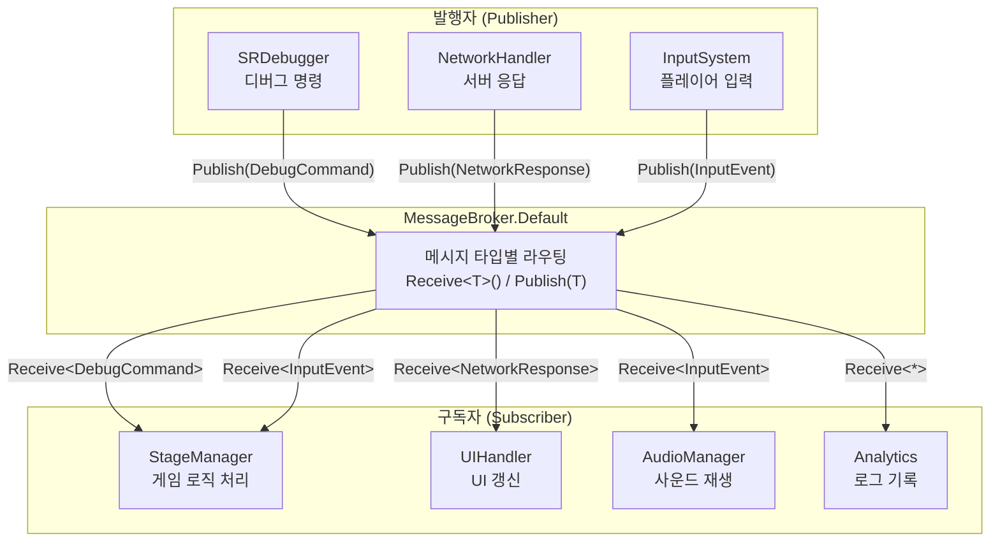
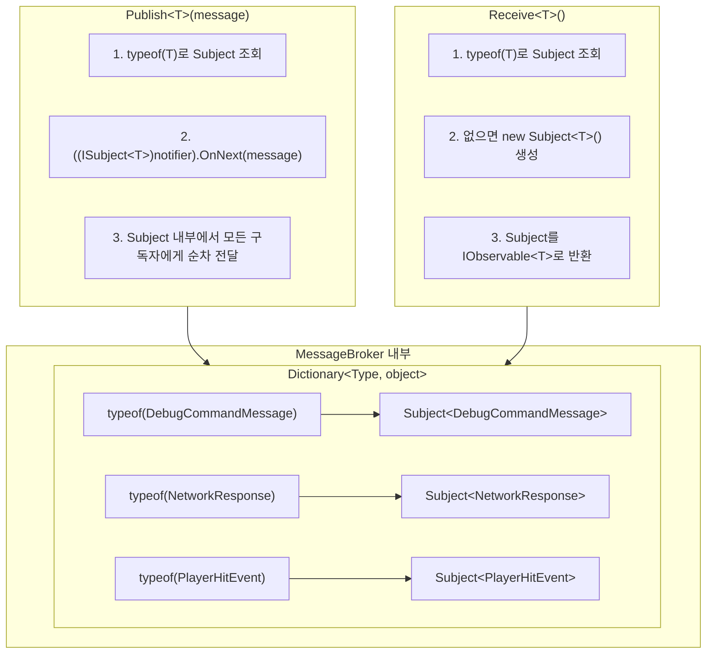
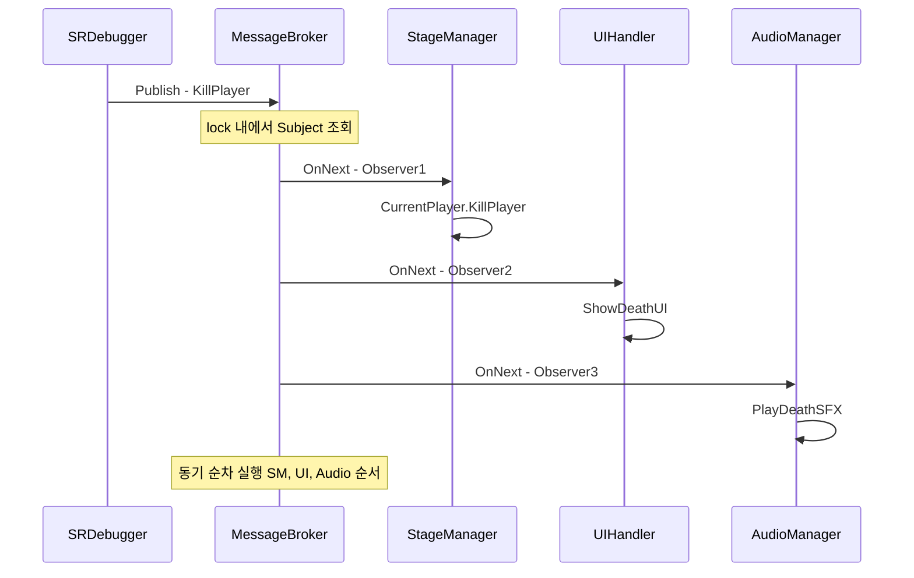
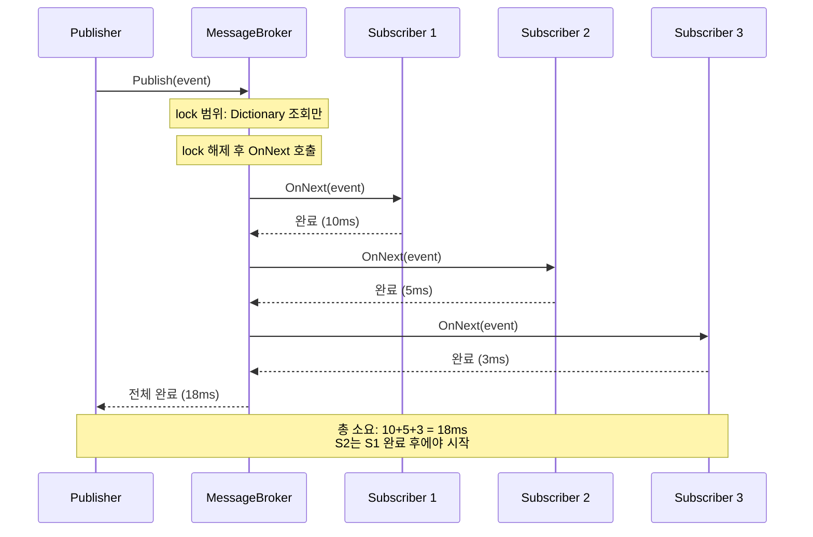
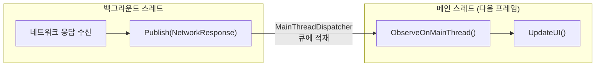
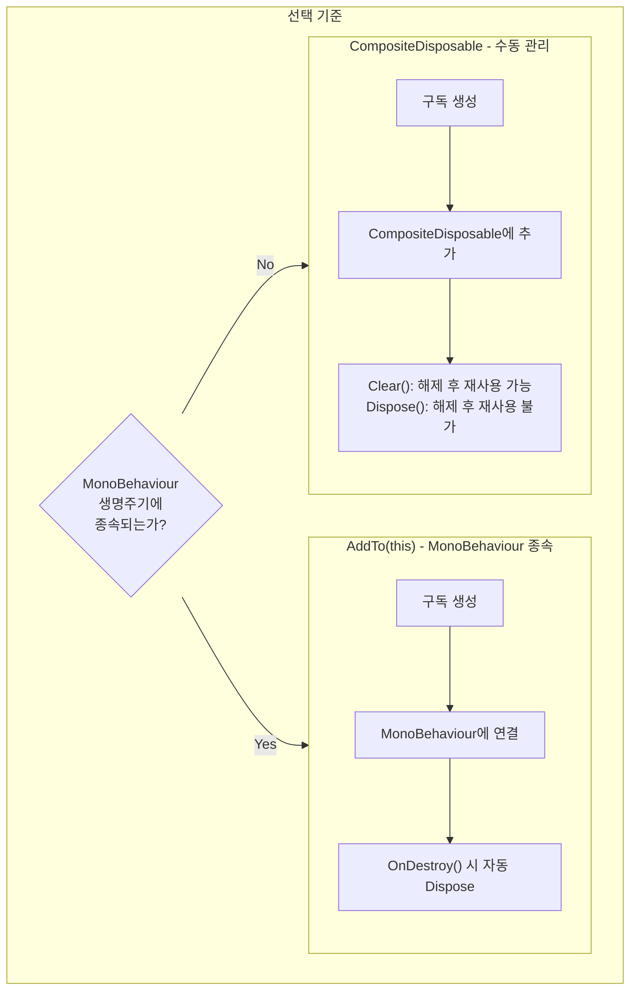
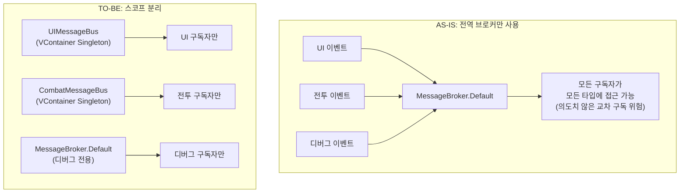

> **주의** : UniRx가 R3로 업데이트 되면서 [R3](https://github.com/Cysharp/R3?tab=readme-ov-file)에서 MessageBroker는 [MessagePipe](https://github.com/Cysharp/MessagePipe)로 변경되었음. 이 문서 하단에 [마이그레이션 가이드](#11-r3messagepipe-마이그레이션)를 포함하고 있음.
{: .prompt-warning }

---

## 서론

게임을 만들다 보면 이런 상황이 자주 발생합니다: "플레이어가 피격당했을 때, UI의 체력바도 갱신하고, 카메라 흔들림 효과도 주고, 사운드도 재생하고, 히트 로그도 남겨야 한다." 이 모든 모듈이 서로 직접 참조하면 **스파게티 코드**가 됩니다.

이것은 소프트웨어 설계에서 오래된 문제이며, 해결책도 잘 알려져 있습니다: **Pub/Sub(발행/구독) 패턴**. 이벤트를 발생시키는 쪽(Publisher)과 이벤트에 반응하는 쪽(Subscriber)을 **중앙 브로커**를 통해 분리하는 것입니다.

UniRx의 `MessageBroker`는 이 패턴의 Unity 구현체입니다. 이 글에서는 MessageBroker의 **소스 코드 수준의 내부 동작 원리**부터 **실전 활용 패턴**, **성능 특성**, **메모리 관리**, 그리고 **R3/MessagePipe로의 마이그레이션**까지 체계적으로 다룹니다.

---

## Part 1: 핵심 개념

### 1. MessageBroker란?

`MessageBroker`는 UniRx에서 제공하는 **중앙 집중형 Pub/Sub 패턴** 구현체입니다.

게임 개발에서의 비유로 설명하면: **라디오 방송국**과 같습니다. 방송국(Publisher)은 특정 주파수(메시지 타입)로 메시지를 송출하고, 해당 주파수에 맞춘 라디오(Subscriber)만 메시지를 수신합니다. 방송국은 누가 듣고 있는지 모르고, 리스너는 방송국의 내부 구조를 알 필요가 없습니다.



### MessageBroker의 장점

| 장점 | 설명 | 게임 개발 효과 |
| --- | --- | --- |
| **느슨한 결합** | 모듈 간 직접 참조가 원천적으로 차단됨 | 기능 추가/제거 시 다른 모듈 수정 불필요 |
| **타입 기반 계약** | `Receive<T>()` / `Publish(T)` 로 컴파일 타임 보장 | 런타임 에러 사전 방지 |
| **중앙 집중 라우팅** | 모든 메시지가 한 곳을 경유 | 이벤트 흐름 추적과 디버깅 용이 |
| **동기 실행** | 발행 즉시 구독자 콜백이 순차 실행 | 예측 가능한 실행 순서 |

> UniRx는 Unity 이벤트와 비동기를 Reactive Extensions 방식으로 다루는 라이브러리이다. CyberAgent사 소속의 Cysharp라는 깃허브 조직에서 만든 것으로 오픈소스로 공개하여 많은 개발자들에게 도움을 주고 있다.
{: .prompt-tip }

---

### 2. 내부 동작 원리 (소스 코드 분석)

MessageBroker의 내부를 이해하면 성능 특성과 제약을 직감적으로 파악할 수 있습니다. [UniRx GitHub 소스](https://github.com/neuecc/UniRx/blob/master/Assets/Plugins/UniRx/Scripts/Notifiers/MessageBroker.cs)를 기반으로 분석합니다.

#### 실제 내부 구조

```csharp
// UniRx 소스 (간략화)
public class MessageBroker : IMessageBroker, IDisposable
{
    // 핵심: Type → Subject<T> 매핑 (object로 저장)
    readonly Dictionary<Type, object> notifiers = new Dictionary<Type, object>();

    public void Publish<T>(T message)
    {
        object notifier;
        lock (notifiers)
        {
            if (!notifiers.TryGetValue(typeof(T), out notifier)) return;
        }
        // Subject<T>로 캐스팅 후 OnNext 호출
        ((ISubject<T>)notifier).OnNext(message);
    }

    public IObservable<T> Receive<T>()
    {
        object notifier;
        lock (notifiers)
        {
            if (!notifiers.TryGetValue(typeof(T), out notifier))
            {
                // 해당 타입의 첫 구독 시 Subject<T>를 lazy 생성
                ISubject<T> n = new Subject<T>();
                notifier = n;
                notifiers.Add(typeof(T), notifier);
            }
        }
        return ((IObservable<T>)notifier).AsObservable();
    }
}
```

핵심 구조는 **`Dictionary<Type, object>`**이며, 각 value는 **`Subject<T>`**입니다. Subject는 Rx에서 `IObservable<T>`이면서 동시에 `IObserver<T>`인 양방향 객체로, 구독자 관리와 메시지 전달을 모두 담당합니다.



#### 중요한 구현 디테일

1. **lock(notifiers)**: Dictionary 접근 시 lock을 사용합니다. 멀티 스레드에서 `Publish`/`Receive`가 동시에 호출되어도 Dictionary 자체는 안전합니다. 단, `OnNext(message)` 호출은 lock 외부에서 수행됩니다.

2. **Lazy 생성**: `Receive<T>()`가 처음 호출될 때 해당 타입의 Subject가 생성됩니다. `Publish<T>()`가 먼저 호출되면 구독자가 없으므로 메시지가 **조용히 버려집니다**.

3. **AsObservable()**: `Receive<T>()`는 Subject를 직접 반환하지 않고 `AsObservable()`로 래핑합니다. 이는 외부에서 Subject를 `ISubject<T>`로 캐스팅하여 `OnNext`를 직접 호출하는 것을 방지하기 위함입니다.

> **💬 잠깐, 이건 알고 가자**
>
> **Q. MessageBroker와 C# event의 차이는?**
> C#의 `event`는 발행자 클래스에 **직접 참조**가 필요합니다. `player.OnDamaged += HandleDamage`처럼요. MessageBroker는 중앙 브로커를 경유하므로 발행자와 구독자가 **서로의 존재를 전혀 모릅니다**. 이 차이가 결합도를 극적으로 낮춥니다.
>
> **Q. MessageBroker와 UnityEvent의 차이는?**
> `UnityEvent`는 Inspector에서 이벤트를 바인딩할 수 있는 Unity 전용 기능입니다. 디자이너 친화적이지만, 코드에서의 동적 구독/해제가 불편하고 Reflection 기반이라 성능도 떨어집니다. MessageBroker는 순수 코드 기반이며, Rx 연산자(Where, Buffer, Throttle 등)를 조합할 수 있어 **프로그래머 생산성**이 훨씬 높습니다.
>
> **Q. 상속 관계의 메시지는 어떻게 처리되나요?**
> `Publish<DerivedMessage>(msg)` 를 호출하면, `Receive<DerivedMessage>()`를 구독한 곳에만 전달됩니다. `Receive<BaseMessage>()`에는 전달되지 **않습니다**. 내부적으로 `typeof(T)`를 Key로 사용하므로 **정확한 타입 매칭(exact type matching)**입니다. 다형적 구독이 필요하면 메시지 인터페이스를 정의하고 별도로 라우팅해야 합니다.

---

## Part 2: 실전 구현

### 3. 메시지 타입의 정의 : 명확한 계약서 작성

모든 메시지는 그 자체로 명확한 의도를 가진 DTO(Data Transfer Object)여야 합니다.

```csharp
public enum DebugCommandType
{
    KillPlayer,
    KillMob,
    KillBoss,
    InfiniteUlt,
    ApplySkill
}

// sealed: 상속을 금지하여 메시지 타입의 불변성을 보장
// readonly struct도 좋은 선택지 (하단 "struct와 박싱" 섹션 참고)
public sealed class DebugCommandMessage
{
    public DebugCommandType CommandType { get; }
    public IReadOnlyDictionary<string, object> Parameters { get; }

    public DebugCommandMessage(DebugCommandType commandType, Dictionary<string, object> parameters = null)
    {
        CommandType = commandType;
        // 방어적 복사: 외부에서 Dictionary가 수정되어도 메시지 내부에는 영향이 없도록 보장
        Parameters = parameters ?? new Dictionary<string, object>();
    }
}
```

### 4. 발행(Publish)

Publisher는 누가 듣고 있는지 신경 쓸 필요가 전혀 없습니다. 오직 **어떤 일이 일어났는지**에만 집중하여 메시지를 발행해야 합니다.

```csharp
// SRDebugger SROptions일수도, DebugPanel 같은 개인 클래스 내부일 수도 있음.

// 단순 메시지 발행
public void KillPlayer()
{
    MessageBroker.Default.Publish(new DebugCommandMessage(DebugCommandType.KillPlayer));
}

// 파라미터가 포함된 메시지 발행
public bool InfiniteUlt
{
    get => isUltInfiniteActive;
    set
    {
        if (isUltInfiniteActive != value)
        {
            isUltInfiniteActive = value;
            MessageBroker.Default.Publish(new DebugCommandMessage(
                DebugCommandType.InfiniteUlt,
                new Dictionary<string, object> { { "trigger", isUltInfiniteActive } }
            ));
        }
    }
}
```



### 5. 구독(Subscribe)

구독자는 특정 타입의 메시지에만 반응하며, **구독의 생명주기를 반드시 관리**해야 합니다.

```csharp
// 예시 코드 : 하나의 게임 씬을 관리하는 매니저 클래스
public partial class StageManager
{
    private Dictionary<DebugCommandType, Action<DebugCommandMessage>> debugActions;

    private void Awake()
    {
        // 메시지별 액션 매핑
        debugActions = new Dictionary<DebugCommandType, Action<DebugCommandMessage>>()
        {
            {DebugCommandType.KillPlayer, msg => CurrentPlayer.KillPlayer()},
            {DebugCommandType.KillMob, msg => monsterSpawner.KillMonsters()},
            {DebugCommandType.KillBoss, msg => monsterSpawner.KillBoss()},
            {DebugCommandType.InfiniteUlt, msg => InfiniteUlt(msg.Parameters)}
        };

        // 메시지 구독
        MessageBroker.Default.Receive<DebugCommandMessage>()
            .Subscribe(msg =>
            {
                if (debugActions.TryGetValue(msg.CommandType, out var action))
                {
                    action(msg);
                }
                else
                {
                    UnityEngine.Debug.LogWarning($"Unknown DebugCommandType: {msg.CommandType}");
                }
            }).AddTo(this); // 반드시 AddTo로 생명주기 관리
    }

    private void InfiniteUlt(IReadOnlyDictionary<string, object> parameters)
    {
        if (parameters.TryGetValue("trigger", out var trigger))
        {
            var isUltInfiniteActive = (bool) trigger;

            if (isUltInfiniteActive)
            {
                gameModel.UltDelayProperty.Value = 0.1f;
                OnTriggerUltActivate.Invoke();
            }
            else
            {
                gameModel.UltDelayProperty.Value = 10f;
            }
        }
        else
        {
            UnityEngine.Debug.LogWarning("InfiniteUlt command requires 'trigger' parameter");
        }
    }
}
```

---

### 6. 파라미터 전달 전략

두 가지 접근법이 있으며, 각각의 트레이드오프를 이해하고 상황에 맞게 선택해야 합니다.

#### Dictionary 방식 - 유연하지만 위험

`Dictionary<string, object>`를 통해 다양한 타입의 파라미터를 유연하게 전달할 수 있습니다. 프로덕션 환경에서 치명적인 단점이 존재하지만, **디버깅 용도로는 충분합니다**.

```csharp
var parameters = new Dictionary<string, object>
{
    { "trigger", true },                              // bool 값
    { "skillName", "Fireball" },                     // string 값
    { "damageMultiplier", 1.5f },                    // float 값
    { "retryCount", 3 },                            // int 값
    { "affectedTargets", new List<int> { 101, 102, 103 } } // List<int> 값
};

MessageBroker.Default.Publish(new DebugCommandMessage(
    DebugCommandType.ApplySkill, parameters
));
```

#### DTO 방식 - 타입 안전하고 명확

이벤트마다 전용 DTO를 정의하면 컴파일 타임에 모든 것이 검증됩니다. **프로덕션 환경**에 적합합니다.

```csharp
// 메시지 정의: 명확한 계약
public sealed class SkillAppliedEvent
{
    public string SkillID { get; }
    public float DamageMultiplier { get; }
    public IReadOnlyList<int> TargetIDs { get; }

    public SkillAppliedEvent(string skillID, float damageMultiplier, IReadOnlyList<int> targetIDs)
    {
        SkillID = skillID;
        DamageMultiplier = damageMultiplier;
        TargetIDs = targetIDs;
    }
}

// 발행: 명확하고 실수가 없다
MessageBroker.Default.Publish(new SkillAppliedEvent("Fireball_Lv3", 1.5f, new[] {101, 102}));

// 구독: 타입 캐스팅 없이 안전하게 파라미터 사용
MessageBroker.Default.Receive<SkillAppliedEvent>()
    .Subscribe(evt => CombatSystem.ApplyDamage(evt.SkillID, evt.DamageMultiplier, evt.TargetIDs))
    .AddTo(this);
```

#### struct 메시지와 박싱: 정확한 분석

"struct를 메시지로 쓰면 GC 제로"라는 조언을 자주 보지만, MessageBroker에서는 좀 더 정밀한 분석이 필요합니다.

**결론부터**: MessageBroker 자체는 메시지를 박싱하지 않습니다. `Subject<T>.OnNext(T)`는 제네릭 메서드이므로 T가 value type이어도 박싱 없이 전달됩니다. 단, Rx 연산자 체인에서 박싱이 발생할 수 있습니다.

```csharp
// MessageBroker 내부 흐름 (박싱 분석)
//
// 1. Publish<PlayerHitEvent>(hitEvent)
//    → typeof(PlayerHitEvent)로 Dictionary 조회 (Type은 참조 타입이므로 무관)
//    → ((ISubject<PlayerHitEvent>)notifier).OnNext(hitEvent)
//    → OnNext(T) 는 제네릭 → 박싱 없음 ✅
//
// 2. 중간 연산자
//    → .Where(x => ...) → 내부적으로 제네릭 → 박싱 없음 ✅
//    → .Select(x => (object)x) → 명시적 캐스팅 시 박싱 발생 ❌
//
// 3. Subscribe(Action<T>) → 제네릭 → 박싱 없음 ✅

// 따라서 struct 메시지는 다음 조건에서 안전:
// - 중간 연산자가 제네릭 체인을 유지할 때
// - object로 캐스팅하는 연산자를 사용하지 않을 때
```

> **💬 잠깐, 이건 알고 가자**
>
> **Q. 그러면 readonly struct를 메시지로 써도 되나요?**
> **조건부 Yes.** MessageBroker → Subject → Subscribe 경로에서는 박싱이 발생하지 않습니다. 하지만 `sealed class`를 기본으로 사용하고, 프로파일러에서 GC Alloc이 문제가 되는 고빈도 메시지에 한해서만 `readonly struct`를 고려하는 것이 안전합니다.
>
> **Q. 메시지 타입이 너무 많아지면 관리가 어려운 건 아닌가요?**
> 메시지 타입이 늘어나는 것은 **시스템의 이벤트 계약이 명시적으로 드러나는 것**입니다. 오히려 좋은 신호입니다. 네임스페이스로 도메인별 분리하면 충분히 관리 가능합니다:
> ```
> Messages/
> ├── Combat/     ← PlayerHitEvent, EnemyDefeatedEvent, ...
> ├── UI/         ← ScreenChangedEvent, PopupRequestEvent, ...
> ├── Debug/      ← DebugCommandMessage, ...
> └── Network/    ← NetworkResponseEvent, ...
> ```

---

## Part 3: 성능과 안전

### 7. 동작 원리, 성능, 그리고 스레드 모델

#### 반드시 확인해야 할 내용 3가지

| 항목 | 내용 | 주의사항 |
| --- | --- | --- |
| **시간 복잡도** | O(n) - 한 번의 발행은 모든 구독자(n)에게 순차 전달 | 구독자 수백 개 이상인 고빈도 이벤트는 성능 병목 가능 |
| **동기 실행** | 발행 스레드에서 구독자 콜백이 즉시 순차 호출 | 하나의 콜백이 지연되면 전체 발행 체인이 블록됨 |
| **메모리 관리** | 구독 해제(Dispose) 없이는 100% 메모리 누수 | `AddTo(this)` 또는 `CompositeDisposable` 필수 |



#### 메인 스레드 전환

Unity의 API(UI, GameObject 등)는 메인 스레드에서만 안전하게 호출할 수 있습니다. 백그라운드 스레드에서 발행된 메시지를 받아 Unity API를 조작하려면, `ObserveOnMainThread()`를 반드시 사용해야 합니다.

```csharp
// 네트워크 수신(백그라운드 스레드) -> 결과 처리(메인 스레드)
MessageBroker.Default.Receive<NetworkResponse>()
    .ObserveOnMainThread() // 이 시점 이후의 모든 콜백은 메인 스레드에서 실행됨을 보장
    .Subscribe(response => UpdateUI(response.Data))
    .AddTo(this);
```



#### 고빈도 이벤트 최적화 : 시스템 과부하 방지

프레임당 수십 번 호출되는 이벤트는 그대로 브로드캐스트하면 안 됩니다. Rx 연산자로 호출량을 제어해야 합니다.

```csharp
// Buffer: 일정 시간 동안의 이벤트를 모아서 한 번에 처리
MessageBroker.Default.Receive<PlayerHitEvent>()
    .Buffer(TimeSpan.FromMilliseconds(100)) // 100ms 동안 발생한 이벤트를 리스트로 묶음
    .Where(hits => hits.Count > 0)          // 빈 배치는 무시
    .Subscribe(hits =>
    {
        var totalDamage = hits.Sum(h => h.Damage);
        DamageUIManager.ShowAggregatedDamage(totalDamage);
    })
    .AddTo(this);

// ThrottleFirst: 첫 번째 이벤트만 통과시키고 일정 시간 차단
MessageBroker.Default.Receive<PlayerPositionChanged>()
    .ThrottleFirst(TimeSpan.FromMilliseconds(200)) // 200ms마다 최대 1번만 통과
    .Subscribe(pos => MiniMap.UpdatePlayerPosition(pos))
    .AddTo(this);

// Sample: 일정 간격으로 최신 값만 취함
MessageBroker.Default.Receive<EnemyHealthChanged>()
    .Sample(TimeSpan.FromMilliseconds(50)) // 50ms마다 최신 값 하나만 통과
    .Subscribe(evt => UpdateHealthBar(evt))
    .AddTo(this);
```

| 연산자 | 동작 | 적합한 시나리오 |
| --- | --- | --- |
| **Buffer** | 일정 시간 동안 이벤트를 **모아서 리스트로** 전달 | 다중 히트 데미지 합산, 배치 로그 전송 |
| **ThrottleFirst** | 첫 이벤트만 통과, 이후 **일정 시간 차단** | 버튼 연타 방지, 스킬 쿨다운 |
| **Sample** | 일정 간격으로 **최신 값만** 통과 | 미니맵 위치 갱신, HP바 업데이트 |

> **💬 잠깐, 이건 알고 가자**
>
> **Q. 구독자 콜백에서 예외가 발생하면 어떻게 되나요?**
> **해당 구독이 종료됩니다.** Subject 내부에서 한 구독자의 `OnNext`에서 예외가 발생하면, 그 구독의 `OnError`가 호출되고 구독이 해제됩니다. **다른 구독자에게는 영향이 없습니다.** 프로덕션에서는 콜백 내부에서 try-catch로 보호하는 것이 안전합니다:
> ```csharp
> MessageBroker.Default.Receive<SomeEvent>()
>     .Subscribe(evt =>
>     {
>         try { HandleEvent(evt); }
>         catch (Exception e) { Debug.LogException(e); }
>     })
>     .AddTo(this);
> ```

---

### 8. 생명주기 관리(Dispose)와 누수 방지

#### `AddTo(this)` 를 넘어 `CompositeDisposable` 으로

`AddTo(this)`는 `MonoBehaviour`에 종속된 구독에 대한 훌륭한 기본값입니다. 하지만 객체의 생명주기가 `GameObject`와 무관하다면, `CompositeDisposable`을 사용한 명시적 관리가 필수입니다.

```csharp
public class PlayerService
{
    // 이 서비스 인스턴스가 살아있는 동안의 모든 구독을 담는 컨테이너
    private readonly CompositeDisposable subscriptions = new CompositeDisposable();

    public void Activate()
    {
        MessageBroker.Default.Receive<GameStateChangedEvent>()
            .Where(evt => evt.NewState == GameState.InGame)
            .Subscribe(_ => OnGameStarted())
            .AddTo(subscriptions); // 컨테이너에 추가
    }

    public void Deactivate()
    {
        subscriptions.Clear(); // 모든 구독을 한 번에 해제. Dispose()와 달리 재사용 가능.
    }
}
```



#### 메모리 누수를 유발하는 흔한 실수

| 실수 패턴 | 문제점 | 해결책 |
| --- | --- | --- |
| **정적 클래스에서 구독** | 씬 전환 후에도 구독이 살아남음 | `CompositeDisposable`로 명시적 해제 |
| **`OnCompleted` 만 기다리기** | MessageBroker는 `OnCompleted`를 보내지 않음 | 반드시 `Dispose`로 명시적 종료 |
| **`AddTo` 없는 구독** | GC가 수거하지 못하는 참조 발생 | 모든 `Subscribe`에 `AddTo` 필수 |
| **씬 전환 시 전역 브로커 구독 잔류** | 이전 씬의 콜백이 계속 호출됨 | 씬 전환 전 일괄 `Dispose` |
| **`Clear()`와 `Dispose()` 혼동** | `Dispose()` 후 재사용하면 예외 발생 | 재사용이 필요하면 `Clear()` 사용 |

---

### 9. 스코프 분리

전역 브로커 `MessageBroker.Default`만 사용하면 모든 이벤트가 뒤섞이는 **스파게티**가 됩니다. 메시지 도메인의 경계가 무너지고, 의도치 않은 교차 구독이 발생하거나 코드 추론이 불가능해집니다.

#### 해결책 : 기능별 브로커 스코프 설정

DI 컨테이너([VContainer](https://github.com/hadashiA/VContainer) 권장)를 통해 모듈 전용 브로커를 주입합니다.

```csharp
// 모듈 전용 메시지 버스 정의
public sealed class UIMessageBus
{
    public IMessageBroker Broker { get; } = new MessageBroker();
}

public sealed class CombatMessageBus
{
    public IMessageBroker Broker { get; } = new MessageBroker();
}

// VContainer 등록 예시
public class GameLifetimeScope : LifetimeScope
{
    protected override void Configure(IContainerBuilder builder)
    {
        builder.Register<UIMessageBus>(Lifetime.Singleton);
        builder.Register<CombatMessageBus>(Lifetime.Singleton);
    }
}

// 사용처 (UI 컴포넌트)
public class HUDController : MonoBehaviour
{
    [Inject] private UIMessageBus uiBus;

    void Start()
    {
        uiBus.Broker.Receive<PlayerHealthChanged>()
            .Subscribe(evt => UpdateHealthBar(evt.CurrentHealth))
            .AddTo(this);
    }
}

// 사용처 (전투 시스템)
public class CombatManager : MonoBehaviour
{
    [Inject] private CombatMessageBus combatBus;

    void Start()
    {
        combatBus.Broker.Receive<EnemyDefeatedEvent>()
            .Subscribe(evt => ProcessLoot(evt.EnemyID))
            .AddTo(this);
    }
}
```



---

## Part 4: 비동기와 진화

### 10. AsyncMessageBroker

UniRx는 동기 MessageBroker 외에 **비동기 버전인 `AsyncMessageBroker`**도 제공합니다. 구독자가 비동기 작업을 수행해야 할 때 사용합니다.

```csharp
// 비동기 구독: 구독자가 비동기 작업을 완료한 후 다음 구독자가 실행됨
AsyncMessageBroker.Default.Subscribe<SaveGameRequest>(async req =>
{
    await SaveToCloudAsync(req.Data);
    Debug.Log("Cloud save completed");
});

// 비동기 발행: 모든 구독자의 비동기 작업이 완료될 때까지 대기
await AsyncMessageBroker.Default.PublishAsync(new SaveGameRequest(currentData));
Debug.Log("All subscribers finished"); // 모든 저장 완료 후 실행
```

| 특성 | MessageBroker | AsyncMessageBroker |
| --- | --- | --- |
| **구독자 실행** | 동기 순차 | 비동기 순차 (await) |
| **발행 메서드** | `Publish<T>(T)` (void) | `PublishAsync<T>(T)` (Task) |
| **구독 메서드** | `Receive<T>()` → IObservable | `Subscribe<T>(Func<T, Task>)` → IDisposable |
| **적합한 시나리오** | 즉시 처리 가능한 이벤트 | 네트워크 요청, 파일 I/O, 씬 로드 |

---

### 11. R3/MessagePipe 마이그레이션

UniRx의 후속인 R3에서는 MessageBroker가 별도 패키지인 **[MessagePipe](https://github.com/Cysharp/MessagePipe)**로 분리되었습니다. 새 프로젝트를 시작하거나 R3로 마이그레이션하는 경우 참고하세요.

#### API 대응 비교

| 기능 | UniRx MessageBroker | MessagePipe |
| --- | --- | --- |
| **발행** | `MessageBroker.Default.Publish<T>(msg)` | `publisher.Publish(msg)` |
| **구독** | `MessageBroker.Default.Receive<T>()` | `subscriber.Subscribe(msg => ...)` |
| **전역 싱글턴** | `MessageBroker.Default` | 없음 (DI 필수) |
| **비동기** | `AsyncMessageBroker` | `IAsyncPublisher<T>` / `IAsyncSubscriber<T>` |
| **DI 통합** | 선택적 | **필수** (VContainer, Zenject 등) |
| **필터링** | Rx 연산자 (Where, Select...) | MessagePipe 필터 또는 Rx 연산자 |
| **버퍼링** | Rx 연산자 (Buffer, Throttle...) | `IBufferedPublisher<T>` |

<div class="code-compare">
  <div class="code-compare-pane">
    <div class="code-compare-label label-before">UniRx MessageBroker</div>
    <div class="highlight">
<pre><code class="language-csharp">// 전역 싱글턴으로 바로 사용
// DI 불필요

// 발행 (어디서든)
MessageBroker.Default
    .Publish(new PlayerHitEvent(30f));

// 구독
MessageBroker.Default
    .Receive&lt;PlayerHitEvent&gt;()
    .Subscribe(evt =>
        UpdateHealthBar(evt.Damage))
    .AddTo(this);</code></pre>
    </div>
  </div>
  <div class="code-compare-pane">
    <div class="code-compare-label label-after">MessagePipe (R3)</div>
    <div class="highlight">
<pre><code class="language-csharp">// DI 주입 필수 (VContainer 등)
// ISP 원칙: Publisher/Subscriber 분리

// 발행 측
[Inject] IPublisher&lt;PlayerHitEvent&gt; _pub;

void ApplyDamage(float dmg)
    => _pub.Publish(new PlayerHitEvent(dmg));

// 구독 측
[Inject] ISubscriber&lt;PlayerHitEvent&gt; _sub;

void Start() =>
    _sub.Subscribe(e => UpdateHealthBar(e.Damage))
        .AddTo(this);</code></pre>
    </div>
  </div>
</div>

#### 핵심 차이점

1. **전역 싱글턴 제거**: MessagePipe는 `Default` 인스턴스가 없습니다. 반드시 DI 컨테이너를 통해 `IPublisher<T>` / `ISubscriber<T>`를 주입받아야 합니다. 이는 앞서 다룬 "스코프 분리"가 아키텍처 수준에서 강제되는 것입니다.

2. **인터페이스 분리**: Publisher와 Subscriber가 별도 인터페이스로 분리되어, 발행만 하는 클래스에 구독 기능이 노출되지 않습니다 (ISP 원칙).

3. **성능 최적화**: MessagePipe는 UniRx의 Subject 기반이 아닌, 구독자 배열을 직접 관리하여 더 낮은 오버헤드를 달성합니다.

```csharp
// MessagePipe 사용 예시 (VContainer 기준)

// 1. DI 등록
public class GameLifetimeScope : LifetimeScope
{
    protected override void Configure(IContainerBuilder builder)
    {
        var options = builder.RegisterMessagePipe();
        builder.RegisterMessageBroker<PlayerHitEvent>(options);
        builder.RegisterMessageBroker<DebugCommandMessage>(options);
    }
}

// 2. 발행
public class DamageSystem
{
    [Inject] private IPublisher<PlayerHitEvent> hitPublisher;

    public void ApplyDamage(float damage)
    {
        hitPublisher.Publish(new PlayerHitEvent(damage));
    }
}

// 3. 구독
public class HUDController : MonoBehaviour
{
    [Inject] private ISubscriber<PlayerHitEvent> hitSubscriber;

    void Start()
    {
        hitSubscriber.Subscribe(evt => UpdateHealthBar(evt.Damage))
            .AddTo(this); // R3의 AddTo 확장
    }
}
```

---

## 체크리스트

코드 리뷰 시 다음을 확인하자:

[✅] 메시지는 강타입 DTO인가? (Dictionary는 디버그 도구에만 허용)

[✅] 모든 `Subscribe` 호출은 `AddTo` 또는 `CompositeDisposable`로 끝나고 있는가? (예외 없음)

[✅] Unity API를 다루는 콜백은 `ObserveOnMainThread()`로 보호되고 있는가?

[✅] 전역 브로커를 남용하지 않고, 기능별 브로커로 스코프를 분리했는가? (VContainer 권장)

[✅] 고빈도 이벤트는 `Buffer`, `Throttle`, `Sample` 등으로 제어되고 있는가?

[✅] 구독자 콜백 내부에서 예외 처리(try-catch)가 되어 있는가?

[✅] 씬 전환 시 전역 브로커의 구독이 잔류하지 않는지 확인했는가?

[✅] 비동기 처리가 필요한 구독에는 `AsyncMessageBroker`를 사용하고 있는가?

[✅] 새 프로젝트라면 MessagePipe로의 전환을 고려했는가?

---

## 결론

MessageBroker는 강력한 도구이지만, 신중한 결정과 책임이 요구됩니다. 이 패턴은 단순히 코드를 분리하는 것을 넘어, 시스템의 각 부분이 어떤 "계약"을 통해 소통하는지를 설계하는 **아키텍처적 행위**입니다.

핵심 원칙을 정리하면:

| 원칙 | 설명 |
| --- | --- |
| **DTO 기반 메시지** | 매직 스트링과 런타임 캐스팅을 제거하고 컴파일 타임 안전성 확보 |
| **엄격한 생명주기 관리** | `AddTo` 또는 `CompositeDisposable`로 100% 누수 방지 |
| **명확한 스레드 모델** | `ObserveOnMainThread()`로 Unity API 접근 보호 |
| **스코프 분리** | 기능별 브로커로 이벤트 경계 설정 (VContainer + MessageBus) |
| **고빈도 이벤트 제어** | Rx 연산자로 시스템 과부하 방지 |
| **진화 경로 인식** | UniRx → R3/MessagePipe 전환 시 DI 기반 아키텍처 준비 |

이 원칙들을 지킬 때, MessageBroker는 복잡한 Unity 프로젝트를 지탱하는 견고하고 유연한 아키텍처가 됩니다.
