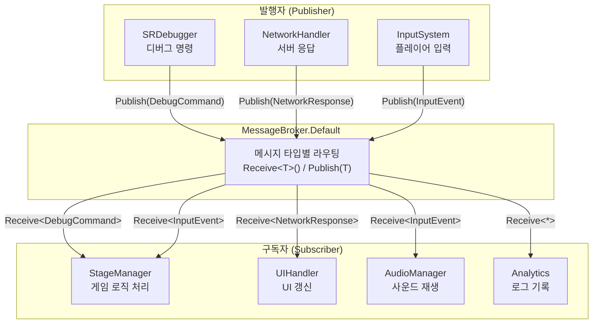
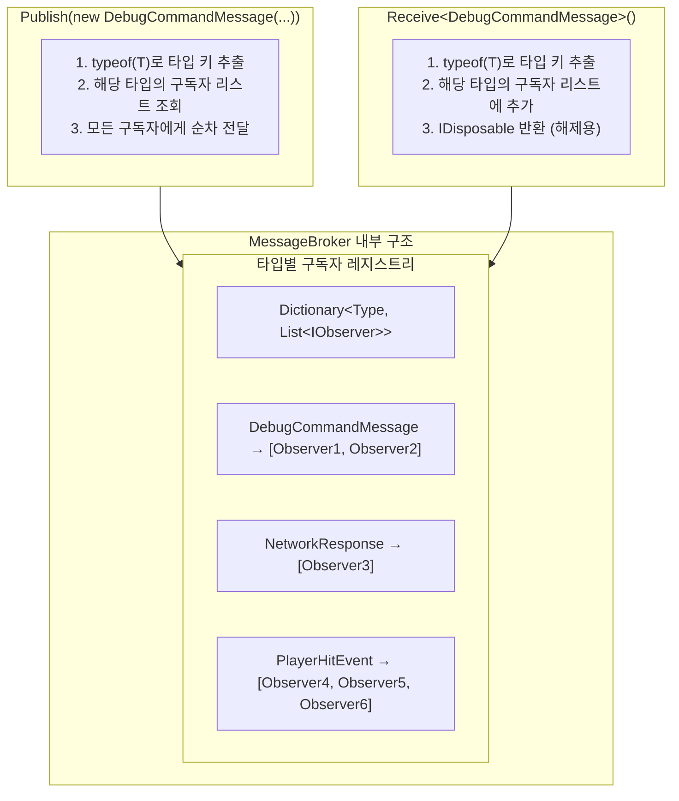
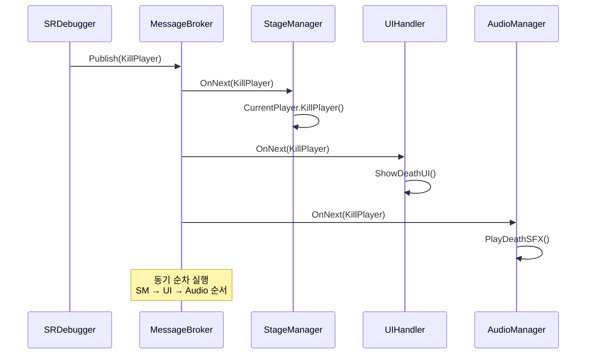
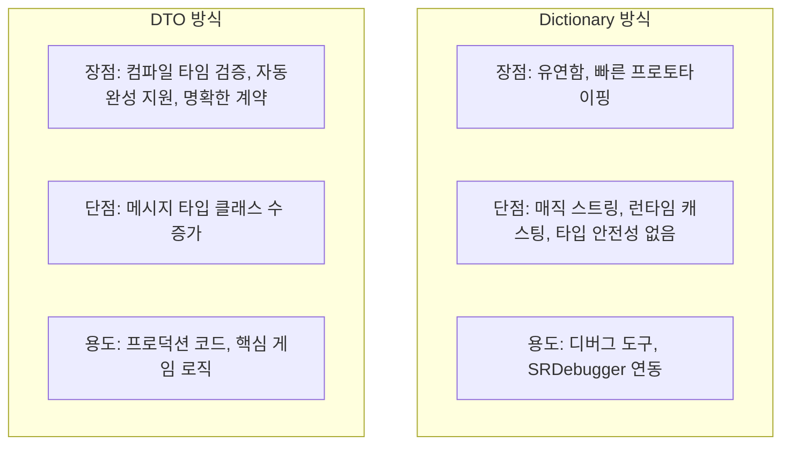
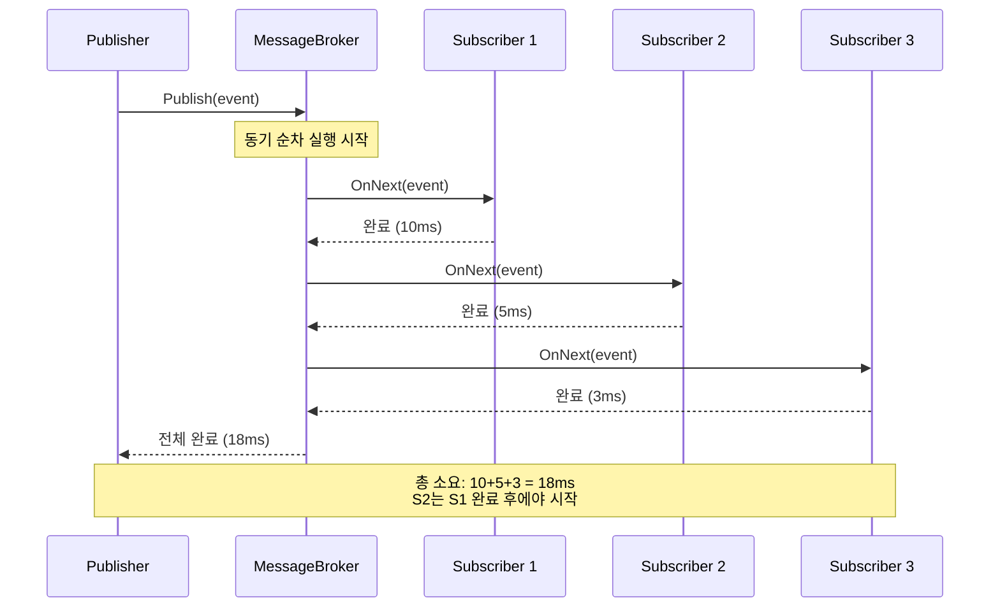
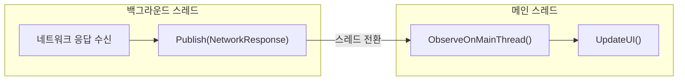
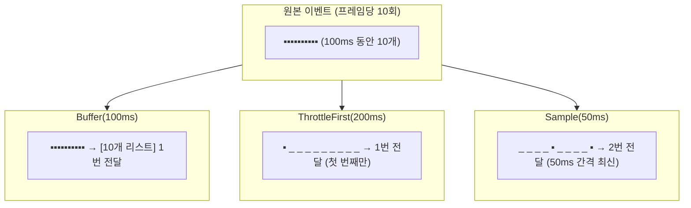
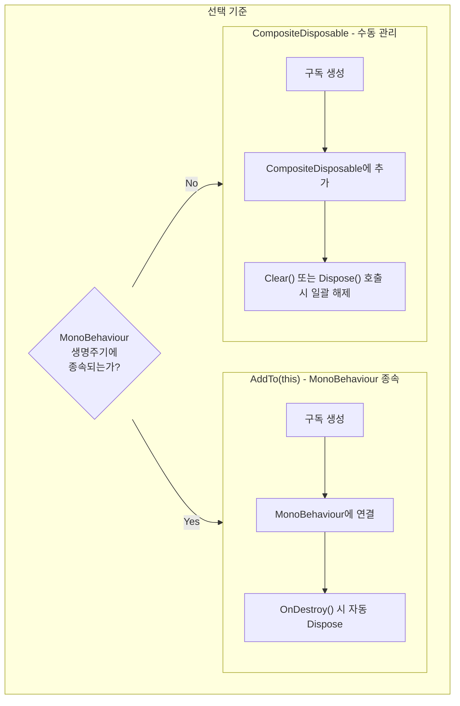
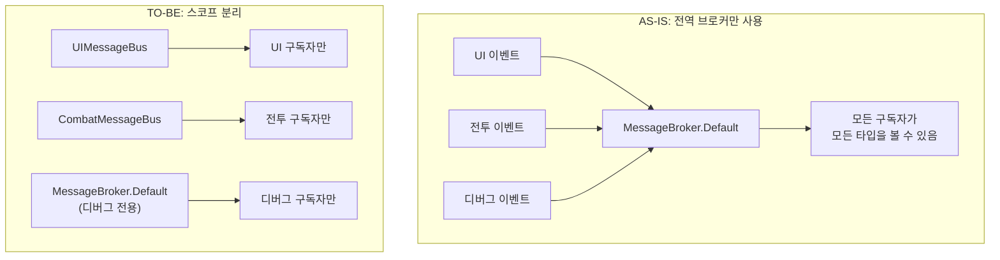

[](https://hits.sh/epheria.github.io/)

---

> **주의** : UniRx가 R3로 업데이트 되면서 [R3](https://github.com/Cysharp/R3?tab=readme-ov-file)에서 MessageBroker는 [MessagePipe](https://github.com/Cysharp/MessagePipe)로 변경되었음.
{: .prompt-warning }

---

## 서론

게임을 만들다 보면 이런 상황이 자주 발생합니다: "플레이어가 피격당했을 때, UI의 체력바도 갱신하고, 카메라 흔들림 효과도 주고, 사운드도 재생하고, 히트 로그도 남겨야 한다." 이 모든 모듈이 서로 직접 참조하면 **스파게티 코드**가 됩니다.

이것은 소프트웨어 설계에서 오래된 문제이며, 해결책도 잘 알려져 있습니다: **Pub/Sub(발행/구독) 패턴**. 이벤트를 발생시키는 쪽(Publisher)과 이벤트에 반응하는 쪽(Subscriber)을 **중앙 브로커**를 통해 분리하는 것입니다.

UniRx의 `MessageBroker`는 이 패턴의 Unity 구현체입니다. 이 글에서는 MessageBroker의 **내부 동작 원리**부터 **실전 활용 패턴**, **성능 특성**, **메모리 관리**까지 체계적으로 다룹니다.

---

## Part 1: 핵심 개념

### 1. MessageBroker란?

`MessageBroker`는 UniRx에서 제공하는 **중앙 집중형 Pub/Sub 패턴** 구현체입니다.

게임 개발에서의 비유로 설명하면: **라디오 방송국**과 같습니다. 방송국(Publisher)은 특정 주파수(메시지 타입)로 메시지를 송출하고, 해당 주파수에 맞춘 라디오(Subscriber)만 메시지를 수신합니다. 방송국은 누가 듣고 있는지 모르고, 리스너는 방송국의 내부 구조를 알 필요가 없습니다.



### MessageBroker의 장점

| 장점 | 설명 | 게임 개발 효과 |
| --- | --- | --- |
| **느슨한 결합** | 모듈 간 직접 참조가 원천적으로 차단됨 | 기능 추가/제거 시 다른 모듈 수정 불필요 |
| **타입 기반 계약** | `Receive<T>()` / `Publish(T)` 로 컴파일 타임 보장 | 런타임 에러 사전 방지 |
| **중앙 집중 라우팅** | 모든 메시지가 한 곳을 경유 | 이벤트 흐름 추적과 디버깅 용이 |
| **동기 실행** | 발행 즉시 구독자 콜백이 순차 실행 | 예측 가능한 실행 순서 |

> UniRx는 Unity 이벤트와 비동기를 Reactive Extensions 방식으로 다루는 라이브러리이다. CyberAgent사 소속의 Cysharp라는 깃허브 조직에서 만든 것으로 오픈소스로 공개하여 많은 개발자들에게 도움을 주고있다.
{: .prompt-tip }

---

### 2. 내부 동작 원리

MessageBroker의 내부를 이해하면 성능 특성과 제약을 직감적으로 파악할 수 있습니다.



핵심은 **`Type`을 Key로 하는 Dictionary**입니다. `Publish<T>()`가 호출되면, `typeof(T)`에 해당하는 구독자 리스트를 찾아 **모든 구독자에게 순차적으로** 메시지를 전달합니다. 이 과정은 동기적으로 실행됩니다.

> **💬 잠깐, 이건 알고 가자**
>
> **Q. MessageBroker와 C# event의 차이는?**
> C#의 `event`는 발행자 클래스에 **직접 참조**가 필요합니다. `player.OnDamaged += HandleDamage`처럼요. MessageBroker는 중앙 브로커를 경유하므로 발행자와 구독자가 **서로의 존재를 전혀 모릅니다**. 이 차이가 결합도를 극적으로 낮춥니다.
>
> **Q. MessageBroker와 UnityEvent의 차이는?**
> `UnityEvent`는 Inspector에서 이벤트를 바인딩할 수 있는 Unity 전용 기능입니다. 디자이너 친화적이지만, 코드에서의 동적 구독/해제가 불편하고 성능도 떨어집니다. MessageBroker는 순수 코드 기반이며, Rx 연산자(Where, Buffer, Throttle 등)를 조합할 수 있어 **프로그래머 생산성**이 훨씬 높습니다.
>
> **Q. 상속 관계의 메시지는 어떻게 처리되나요?**
> `Publish<DerivedMessage>(msg)` 를 호출하면, `Receive<DerivedMessage>()`를 구독한 곳에만 전달됩니다. `Receive<BaseMessage>()`에는 전달되지 **않습니다**. MessageBroker는 정확한 타입 매칭(exact type matching)을 사용합니다.

---

## Part 2: 실전 구현

### 3. 메시지 타입의 정의 : 명확한 계약서 작성

모든 메시지는 그 자체로 명확한 의도를 가진 DTO(Data Transfer Object)여야 합니다.

```csharp
public enum DebugCommandType
{
    KillPlayer,
    KillMob,
    KillBoss,
    InfiniteUlt,
    ApplySkill
}

// sealed: 상속을 금지하여 메시지 타입의 불변성을 보장
// readonly struct도 좋은 선택지
public sealed class DebugCommandMessage
{
    public DebugCommandType CommandType { get; }
    public IReadOnlyDictionary<string, object> Parameters { get; }

    public DebugCommandMessage(DebugCommandType commandType, Dictionary<string, object> parameters = null)
    {
        CommandType = commandType;
        // 방어적 복사: 외부에서 Dictionary가 수정되어도 메시지 내부에는 영향이 없도록 보장
        Parameters = parameters ?? new Dictionary<string, object>();
    }
}
```

### 4. 발행(Publish)

Publisher는 누가 듣고 있는지 신경 쓸 필요가 전혀 없습니다. 오직 **어떤 일이 일어났는지**에만 집중하여 메시지를 발행해야 합니다.

```csharp
// SRDebugger SROptions일수도, DebugPanel 같은 개인 클래스 내부일 수도 있음.

// 단순 메시지 발행
public void KillPlayer()
{
    MessageBroker.Default.Publish(new DebugCommandMessage(DebugCommandType.KillPlayer));
}

// 파라미터가 포함된 메시지 발행
public bool InfiniteUlt
{
    get => isUltInfiniteActive;
    set
    {
        if (isUltInfiniteActive != value)
        {
            isUltInfiniteActive = value;
            MessageBroker.Default.Publish(new DebugCommandMessage(
                DebugCommandType.InfiniteUlt,
                new Dictionary<string, object> { { "trigger", isUltInfiniteActive } }
            ));
        }
    }
}
```



### 5. 구독(Subscribe)

구독자는 특정 타입의 메시지에만 반응하며, **구독의 생명주기를 반드시 관리**해야 합니다.

```csharp
// 예시 코드 : 하나의 게임 씬을 관리하는 매니저 클래스
public partial class StageManager
{
    private Dictionary<DebugCommandType, Action<DebugCommandMessage>> debugActions;

    private void Awake()
    {
        // 메시지별 액션 매핑
        debugActions = new Dictionary<DebugCommandType, Action<DebugCommandMessage>>()
        {
            {DebugCommandType.KillPlayer, msg => CurrentPlayer.KillPlayer()},
            {DebugCommandType.KillMob, msg => monsterSpawner.KillMonsters()},
            {DebugCommandType.KillBoss, msg => monsterSpawner.KillBoss()},
            {DebugCommandType.InfiniteUlt, msg => InfiniteUlt(msg.Parameters)}
        };

        // 메시지 구독
        MessageBroker.Default.Receive<DebugCommandMessage>()
            .Subscribe(msg =>
            {
                if (debugActions.TryGetValue(msg.CommandType, out var action))
                {
                    action(msg);
                }
                else
                {
                    UnityEngine.Debug.LogWarning($"Unknown DebugCommandType: {msg.CommandType}");
                }
            }).AddTo(this); // 반드시 AddTo로 생명주기 관리
    }

    private void InfiniteUlt(IReadOnlyDictionary<string, object> parameters)
    {
        if (parameters.TryGetValue("trigger", out var trigger))
        {
            var isUltInfiniteActive = (bool) trigger;

            if (isUltInfiniteActive)
            {
                gameModel.UltDelayProperty.Value = 0.1f;
                OnTriggerUltActivate.Invoke();
            }
            else
            {
                gameModel.UltDelayProperty.Value = 10f;
            }
        }
        else
        {
            UnityEngine.Debug.LogWarning("InfiniteUlt command requires 'trigger' parameter");
        }
    }
}
```

---

### 6. 파라미터 전달 전략

두 가지 접근법이 있으며, 각각의 트레이드오프를 이해하고 상황에 맞게 선택해야 합니다.

#### Dictionary 방식 - 유연하지만 위험

`Dictionary<string, object>`를 통해 다양한 타입의 파라미터를 유연하게 전달할 수 있습니다. 프로덕션 환경에서 치명적인 단점이 존재하지만, **디버깅 용도로는 충분합니다**.

```csharp
var parameters = new Dictionary<string, object>
{
    { "trigger", true },                              // bool 값
    { "skillName", "Fireball" },                     // string 값
    { "damageMultiplier", 1.5f },                    // float 값
    { "retryCount", 3 },                            // int 값
    { "affectedTargets", new List<int> { 101, 102, 103 } } // List<int> 값
};

MessageBroker.Default.Publish(new DebugCommandMessage(
    DebugCommandType.ApplySkill, parameters
));
```

#### DTO 방식 - 타입 안전하고 명확

이벤트마다 전용 DTO를 정의하면 컴파일 타임에 모든 것이 검증됩니다. **프로덕션 환경**에 적합합니다.

```csharp
// 메시지 정의: 명확한 계약
public readonly struct SkillAppliedEvent
{
    public string SkillID { get; }
    public float DamageMultiplier { get; }
    public IReadOnlyList<int> TargetIDs { get; }

    public SkillAppliedEvent(string skillID, float damageMultiplier, IReadOnlyList<int> targetIDs)
    {
        SkillID = skillID;
        DamageMultiplier = damageMultiplier;
        TargetIDs = targetIDs;
    }
}

// 발행: 명확하고 실수가 없다
MessageBroker.Default.Publish(new SkillAppliedEvent("Fireball_Lv3", 1.5f, new[] {101, 102}));

// 구독: 타입 캐스팅 없이 안전하게 파라미터 사용
MessageBroker.Default.Receive<SkillAppliedEvent>()
    .Subscribe(evt => CombatSystem.ApplyDamage(evt.SkillID, evt.DamageMultiplier, evt.TargetIDs));
```



> **💬 잠깐, 이건 알고 가자**
>
> **Q. readonly struct를 메시지 타입으로 쓰면 뭐가 좋나요?**
> `readonly struct`는 스택에 할당되므로 **GC 압력이 제로**입니다. 고빈도로 발행되는 메시지(피격 이벤트, 위치 업데이트 등)에 특히 효과적입니다. 다만 `MessageBroker.Default.Publish<T>(T)`에서 T가 value type이면 박싱이 발생할 수 있으므로, 프로파일러로 확인하는 것이 좋습니다.
>
> **Q. 메시지 타입이 너무 많아지면 관리가 어려운 건 아닌가요?**
> 메시지 타입이 늘어나는 것은 **시스템의 이벤트 계약이 명시적으로 드러나는 것**입니다. 오히려 좋은 신호입니다. 네임스페이스로 도메인별 분리(예: `Messages.Combat`, `Messages.UI`, `Messages.Debug`)하면 충분히 관리 가능합니다.

---

## Part 3: 성능과 안전

### 7. 동작 원리, 성능, 그리고 스레드 모델

#### 반드시 확인해야 할 내용 3가지

| 항목 | 내용 | 주의사항 |
| --- | --- | --- |
| **시간 복잡도** | O(n) - 한 번의 발행은 모든 구독자(n)에게 순차 전달 | 구독자 수백 개 이상인 고빈도 이벤트는 성능 병목 가능 |
| **동기 실행** | 발행 스레드에서 구독자 콜백이 즉시 순차 호출 | 하나의 콜백이 지연되면 전체 발행 체인이 블록됨 |
| **메모리 관리** | 구독 해제(Dispose) 없이는 100% 메모리 누수 | `AddTo(this)` 또는 `CompositeDisposable` 필수 |



#### 메인 스레드 전환

Unity의 API(UI, GameObject 등)는 메인 스레드에서만 안전하게 호출할 수 있습니다. 백그라운드 스레드에서 발행된 메시지를 받아 Unity API를 조작하려면, `ObserveOnMainThread()`를 반드시 사용해야 합니다.

```csharp
// 네트워크 수신(백그라운드 스레드) -> 결과 처리(메인 스레드)
MessageBroker.Default.Receive<NetworkResponse>()
    .ObserveOnMainThread() // 이 시점 이후의 모든 콜백은 메인 스레드에서 실행됨을 보장
    .Subscribe(response => UpdateUI(response.Data))
    .AddTo(this);
```



#### 고빈도 이벤트 최적화 : 시스템 과부하 방지

프레임당 수십 번 호출되는 이벤트는 그대로 브로드캐스트하면 안 됩니다. Rx의 강력한 연산자들로 호출량을 제어해야 합니다.

```csharp
// Buffer: 일정 시간 동안의 이벤트를 모아서 한 번에 처리
MessageBroker.Default.Receive<PlayerHitEvent>()
    .Buffer(TimeSpan.FromMilliseconds(100)) // 100ms 동안 발생한 이벤트를 리스트로 묶음
    .Where(hits => hits.Count > 0)          // 빈 배치는 무시
    .Subscribe(hits =>
    {
        var totalDamage = hits.Sum(h => h.Damage);
        DamageUIManager.ShowAggregatedDamage(totalDamage);
    })
    .AddTo(this);

// Throttle: 마지막 이벤트로부터 일정 시간 후에 처리
MessageBroker.Default.Receive<PlayerPositionChanged>()
    .ThrottleFirst(TimeSpan.FromMilliseconds(200)) // 200ms마다 최대 1번만 통과
    .Subscribe(pos => MiniMap.UpdatePlayerPosition(pos))
    .AddTo(this);

// Sample: 일정 간격으로 최신 값만 취함
MessageBroker.Default.Receive<EnemyHealthChanged>()
    .Sample(TimeSpan.FromMilliseconds(50)) // 50ms마다 최신 값 하나만 통과
    .Subscribe(evt => UpdateHealthBar(evt))
    .AddTo(this);
```



> **💬 잠깐, 이건 알고 가자**
>
> **Q. Buffer, Throttle, Sample 중 어떤 걸 써야 하나요?**
> - **Buffer**: 이벤트를 **모아서 합산/일괄 처리**해야 할 때. 예: 다중 히트 데미지를 한 번에 표시
> - **ThrottleFirst**: **첫 번째 이벤트만 통과**시키고 일정 시간 차단. 예: 버튼 연타 방지
> - **Sample**: 일정 간격으로 **최신 값만** 가져옴. 예: 미니맵 위치 갱신
>
> **Q. 구독자 콜백에서 예외가 발생하면 어떻게 되나요?**
> **해당 구독이 종료됩니다.** 한 구독자의 콜백에서 예외가 발생하면, 그 구독의 `OnError`가 호출되고 구독이 해제됩니다. 다른 구독자에게는 영향이 없습니다. 프로덕션에서는 콜백 내부에서 try-catch로 보호하는 것이 안전합니다.

---

### 8. 생명주기 관리(Dispose)와 누수 방지

#### `AddTo(this)` 를 넘어 `CompositeDisposable` 으로

`AddTo(this)`는 `MonoBehaviour`에 종속된 구독에 대한 훌륭한 기본값입니다. 하지만 객체의 생명주기가 `GameObject`와 무관하다면, `CompositeDisposable`을 사용한 명시적 관리가 필수입니다.

```csharp
public class PlayerService
{
    // 이 서비스 인스턴스가 살아있는 동안의 모든 구독을 담는 컨테이너
    private readonly CompositeDisposable subscriptions = new CompositeDisposable();

    public void Activate()
    {
        MessageBroker.Default.Receive<GameStateChangedEvent>()
            .Where(evt => evt.NewState == GameState.InGame)
            .Subscribe(_ => OnGameStarted())
            .AddTo(subscriptions); // 컨테이너에 추가
    }

    public void Deactivate()
    {
        subscriptions.Clear(); // 모든 구독을 한 번에 해제. Dispose()는 재사용 불가.
    }
}
```



#### 메모리 누수를 유발하는 흔한 실수

| 실수 패턴 | 문제점 | 해결책 |
| --- | --- | --- |
| **정적 클래스에서 구독** | 씬 전환 후에도 구독이 살아남음 | `CompositeDisposable`로 명시적 해제 |
| **`OnCompleted` 만 기다리기** | MessageBroker는 `OnCompleted`를 보내지 않음 | 반드시 `Dispose`로 명시적 종료 |
| **`AddTo` 없는 구독** | GC가 수거하지 못하는 참조 발생 | 모든 `Subscribe`에 `AddTo` 필수 |
| **씬 전환 시 전역 브로커 구독 잔류** | 이전 씬의 콜백이 계속 호출됨 | 씬 전환 전 일괄 `Dispose` |

---

### 9. 스코프 분리

전역 브로커 `MessageBroker.Default`만 사용하면 모든 이벤트가 뒤섞이는 **스파게티**가 됩니다. 메시지 도메인의 경계가 무너지고, 의도치 않은 교차 구독이 발생하거나 코드 추론이 불가능해집니다.

#### 해결책 : 기능별 브로커 스코프 설정

UI 관련 이벤트는 `UIMessageBus`에서만, 전투 관련 이벤트는 `CombatMessageBus`에서만 흐르도록 스코프를 분리합니다.

```csharp
// 의존성 주입(DI) 컨테이너 등을 통해 주입되는 모듈 전용 버스
public sealed class UIMessageBus
{
    public IMessageBroker Broker { get; } = new MessageBroker();
}

public sealed class CombatMessageBus
{
    public IMessageBroker Broker { get; } = new MessageBroker();
}

// 사용처 (UI 컴포넌트)
public class HUDController : MonoBehaviour
{
    [Inject] private UIMessageBus uiBus; // DI 컨테이너로부터 주입

    void Start()
    {
        uiBus.Broker.Receive<PlayerHealthChanged>()
            .Subscribe(evt => UpdateHealthBar(evt.CurrentHealth))
            .AddTo(this);
    }
}

// 사용처 (전투 시스템)
public class CombatManager : MonoBehaviour
{
    [Inject] private CombatMessageBus combatBus;

    void Start()
    {
        combatBus.Broker.Receive<EnemyDefeatedEvent>()
            .Subscribe(evt => ProcessLoot(evt.EnemyID))
            .AddTo(this);
    }
}
```



---

## 체크리스트

코드 리뷰 시 다음을 확인하자:

[✅] 메시지는 강타입 DTO인가? (Dictionary는 디버그 도구에만 허용)

[✅] 모든 `Subscribe` 호출은 `AddTo` 또는 `CompositeDisposable`로 끝나고 있는가? (예외 없음)

[✅] Unity API를 다루는 콜백은 `ObserveOnMainThread()`로 보호되고 있는가?

[✅] 전역 브로커를 남용하지 않고, 기능별 브로커로 스코프를 분리했는가? (대규모 프로젝트 필수)

[✅] 고빈도 이벤트는 `Buffer`, `Throttle`, `Sample` 등으로 제어되고 있는가?

[✅] 구독자 콜백 내부에서 예외 처리가 되어 있는가?

[✅] 씬 전환 시 전역 브로커의 구독이 잔류하지 않는지 확인했는가?

---

## 결론

MessageBroker는 강력한 도구이지만, 신중한 결정과 책임이 요구됩니다. 이 패턴은 단순히 코드를 분리하는 것을 넘어, 시스템의 각 부분이 어떤 "계약"을 통해 소통하는지를 설계하는 **아키텍처적 행위**입니다.

핵심 원칙을 정리하면:

| 원칙 | 설명 |
| --- | --- |
| **DTO 기반 메시지** | 매직 스트링과 런타임 캐스팅을 제거하고 컴파일 타임 안전성 확보 |
| **엄격한 생명주기 관리** | `AddTo` 또는 `CompositeDisposable`로 100% 누수 방지 |
| **명확한 스레드 모델** | `ObserveOnMainThread()`로 Unity API 접근 보호 |
| **스코프 분리** | 기능별 브로커로 이벤트 경계 설정 |
| **고빈도 이벤트 제어** | Rx 연산자로 시스템 과부하 방지 |

이 원칙들을 지킬 때, MessageBroker는 복잡한 Unity 프로젝트를 지탱하는 견고하고 유연한 아키텍처가 됩니다.
