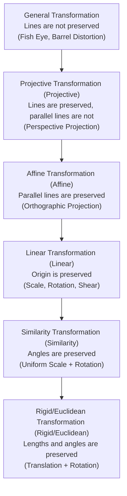
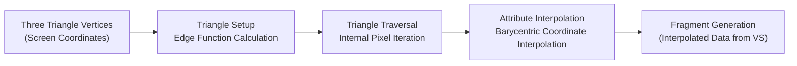
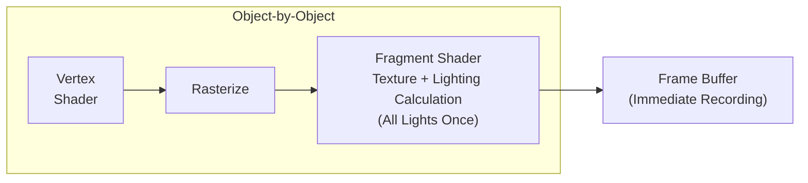
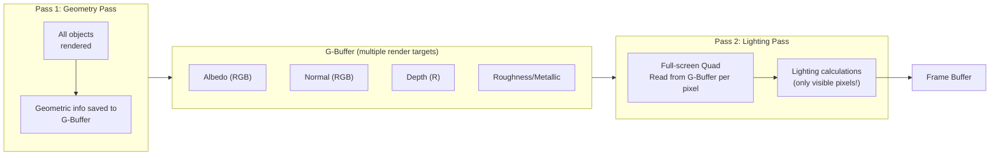
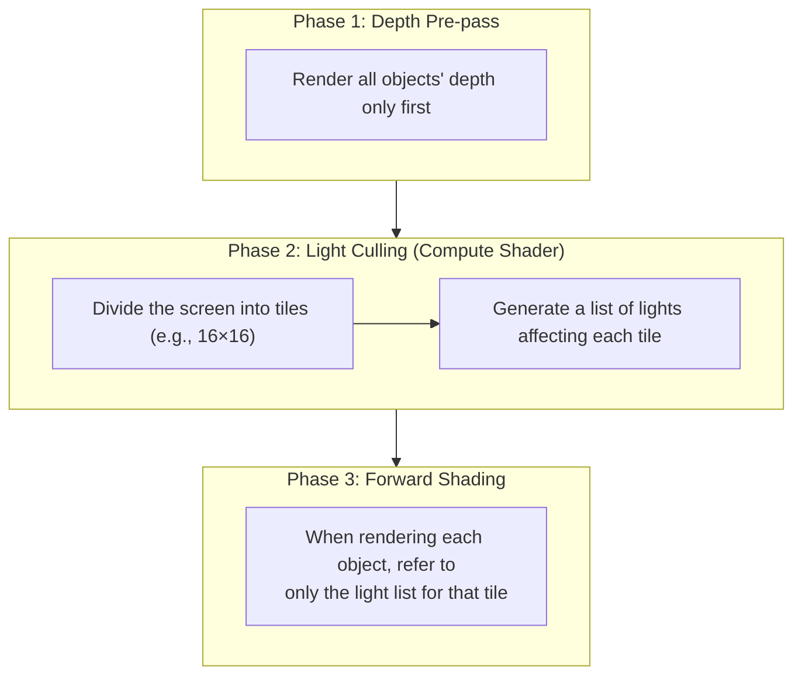

## Introduction

If in the post [Shader Programming](/posts/ShaderStudy001/) we discussed shaders as "programs running on the GPU," this post delves into **the stage where these shaders are executed** itself. The rendering pipeline is the entire flow that transforms a 3D world into 2D pixels on a monitor.

Knowing how to write shaders and understanding why they run in certain ways at specific points within the pipeline are two different things. Understanding the rendering pipeline enables you to do the following:

| Level of Understanding | What You Can Do |
| --- | --- |
| Pipeline Flow | Diagnose CPU or GPU drawcall bottlenecks |
| Coordinate Transformations | Resolve issues like flipped normal maps and broken shadows due to coordinate system bugs |
| Rasterization | Solve problems such as overdraw, Z-fighting, and anti-aliasing |
| Rendering Architecture | Choose between Forward/Deferred rendering, optimize light performance |
| GPU Hardware | Optimize state changes, texture cache |

This post is structured based on Professor Sungwan Kim's lecture "Core Analysis of Game Engines," with additional practical explanations added.

## Part 1: GPU Hardware and Memory

To truly understand the rendering pipeline, you need to know about the characteristics of the hardware it runs on. GPUs are processors designed fundamentally differently from CPUs.

### 1. GPU Internal Structure

The most direct factor influencing rendering within a GPU chip is the **memory hierarchy structure**.

```
┌─────────────────────────────────────────────────────┐
│                     GPU Chip                         │
│                                                     │
│  ┌─────────┐ ┌─────────┐ ┌─────────┐              │
│  │ SM/CU 0 │ │ SM/CU 1 │ │ SM/CU N │   ...        │
│  │ ┌─────┐ │ │ ┌─────┐ │ │ ┌─────┐ │              │
│  │ │Reg  │ │ │ │Reg  │ │ │ │Reg  │ │  ← Registers │
│  │ │File │ │ │ │File │ │ │ │File │ │    (Fastest) │
│  │ └─────┘ │ │ └─────┘ │ │ └─────┘ │              │
│  │ ┌─────┐ │ │ ┌─────┐ │ │ ┌─────┐ │              │
│  │ │ L1$ │ │ │ │ L1$ │ │ │ │ L1$ │ │  ← L1 Cache  │
│  │ └─────┘ │ │ └─────┘ │ │ └─────┘ │              │
│  └─────────┘ └─────────┘ └─────────┘              │
│         │            │           │                  │
│  ┌──────────────────────────────────┐              │
│  │           L2 Cache              │  ← L2 Cache    │
│  └──────────────────────────────────┘              │
│                    │                                │
│  ┌──────────────────────────────────┐              │
│  │      Fixed-Function Units       │              │
│  │  (Rasterizer, ROP, TMU etc.)     │              │
│  └──────────────────────────────────┘              │
└────────────────────│────────────────────────────────┘
                     │
          ┌──────────────────────┐
          │    VRAM (Video Memory)│  ← Slowest
          │  Textures, Buffers, G-Buffer│
          └──────────────────────┘
```

| Memory Hierarchy | Capacity | Access Time | Purpose |
| --- | --- | --- | --- |
| **Registers** | ~256KB/SM | 1 cycle | Shader variables, immediate operations |
| **Shared Memory (LDS)** | 32~128KB/SM | ~5 cycles | Intra-workgroup data sharing |
| **L1 Cache** | 16~128KB/SM | ~20 cycles | Texture cache, command cache |
| **L2 Cache** | 2~6MB | ~200 cycles | Global memory access caching |
| **VRAM** | 4~24GB | ~400+ cycles | Textures, vertex buffers, render targets |

### 1-1. Cost of State Changes

Setting up the internal GPU cache memory takes a significant amount of time. **State Change** refers to changing the rendering settings on the GPU, which involves flushing and refilling the internal cache.


| State Change Type | Cost | Description |
| --- | --- | --- |
| **Shader Program Change** | Very High | Full Flush of the GPU Pipeline |
| **Render Target Change** | High | Frame Buffer Swap |
| **Texture Binding Change** | Medium | Invalidates TMU (Texture Mapping Unit) Cache |
| **Uniform/Constant Buffer Change** | Low | Small Data Transfer |
| **Vertex Buffer Change** | Medium | Reconfiguration of Input Assembler |

The reason for **atlas texturing**, where textures are collected into a single large texture, is to minimize state changes. Frequently changing textures means continuously flushing and refilling the GPU cache memory. The GPU stores texture data in the cache using a **Z-order curve (Morton code)** pattern, which arranges adjacent texels close together in memory addresses to improve cache hit rates.

```
Texture Texel Layout (Memory Order)

Linear Layout (Inefficient):          Z-Order Layout (GPU Actual Method):
0  1  2  3                 0  1  4  5
4  5  6  7                 2  3  6  7
8  9  10 11                8  9  12 13
12 13 14 15                10 11 14 15

→ Adjacent Texels Access          → Adjacent Texels are Close in Memory
  Large Memory Address Jumps       → High Cache Hit Rate
```

> **Q. Why do Draw Calls become a performance bottleneck?**
>
> While a draw call is just a simple GPU command, the CPU must set up the rendering state (shaders, textures, buffers, etc.) for each draw call to the GPU. This **CPU → GPU Command Transfer** process is where the bottleneck occurs. To reduce draw calls, techniques like **Batching**, **Instancing**, and **Indirect Draw** are used. Low-level APIs such as DirectX 12, Vulkan, and Metal are designed to minimize this overhead.
{: .prompt-info}


## Part 2: The Overall Structure of the Rendering Pipeline

### 2. Pipeline Overview

For a 3D object to become pixels on the screen, it goes through **three major stages**.

```mermaid
flowchart TB
    subgraph APP["1st Stage: Application (CPU)"]
        direction TB
        A1["Game Logic / Transform Update"]
        A2["Culling / Occlusion Culling"]
        A3["Draw Call Sorting / Batching"]
        A4["GPU Command Buffer Creation"]
        A1 --> A2 --> A3 --> A4
    end

    subgraph GEO["2nd Stage: Geometry Processing (GPU)"]
        direction TB
        B1["Input Assembly<br/>Vertex/Index Buffer Reading"]
        B2["Vertex Shader<br/>Coordinate Transformation (MVP)"]
        B3["Tessellation (Optional)<br/>Mesh Subdivision"]
        B4["Geometry Shader (Optional)<br/>Primitive Generation/Removal"]
        B5["Clipping<br/>Removing Triangles Outside Frustum"]
        B6["Screen Mapping<br/>NDC → Screen Coordinates"]
        B1 --> B2 --> B3 --> B4 --> B5 --> B6
    end

    subgraph RAS["3rd Stage: Rasterization + Pixel Processing (GPU)"]
        direction TB
        C1["Triangle Setup<br/>Edge Function Preparation"]
        C2["Triangle Traversal<br/>Generating Fragments Inside Triangle"]
        C3["Early-Z Test (Optional)<br/>Pre-Depth Testing"]
        C4["Fragment Shader<br/>Pixel Color Calculation"]
        C5["Late-Z / Depth Test<br/>Depth Comparison"]
        C6["Stencil Test<br/>Stencil Masking"]
        C7["Blending<br/>Color Mixing"]
        C8["Frame Buffer<br/>Final Output"]
        C1 --> C2 --> C3 --> C4 --> C5 --> C6 --> C7 --> C8
    end

    APP --> GEO --> RAS
```



| Stage | Execution Location | Programmer Control | Core Function |
| --- | --- | --- | --- |
| Application | CPU | Full Control | Scene Preparation, Culling, Draw Call |
| Geometry Processing | GPU | Vertex/Tessellation/Geometry Shader | Coordinate Transformation, Clipping |
| Rasterization | GPU | Fixed Functions (No Control) | Triangle → Fragment Conversion |
| Pixel Processing | GPU | Fragment Shader | Final Color Determination |
| Output Merger | GPU | Controlled by Settings (Blend Mode etc.) | Depth/Stencil Testing, Blending |

### 2-1. Application Stage (CPU)

This is a preparatory step performed by the CPU before sending draw calls to the GPU.

#### Culling

It involves filtering out objects that are not visible on the screen in advance to reduce GPU load.

```
Camera Frustum
                    Far Plane
              ┌───────────────────┐
             ╱│                   │╲
            ╱ │     Visible Area   │ ╲
           ╱  │                   │  ╲
Near Plane╱   │    ● Object A     │   ╲
 ┌───────┐    │    (Rendering!)   │    ╲
 │Camera │    │                   │     ╲
 │ ◉────→│    │                   │      ╲
 └───────┘    └───────────────────┘
           ╲                           ╱
            ╲   ○ Object B             ╱
             ╲  (Culled! Not sent to GPU) ╱
              ╲                     ╱
```

| Culling Type | Execution Location | Method |
| --- | --- | --- |
| **Frustum Culling** | CPU | Check if object bounding volume is inside the frustum |
| **Occlusion Culling** | CPU/GPU | Exclude objects that are fully occluded by other objects |
| **Backface Culling** | GPU | Remove triangles facing away from the camera |
| **Small Triangle Culling** | GPU | Remove triangles smaller than 1 pixel on screen |

#### Draw Call Optimization

To minimize state changes, group objects using the same material together for rendering.

```
Before Sorting (5 State Changes):
  Draw(ShaderA, Texture1) → Draw(ShaderB, Texture2) → Draw(ShaderA, Texture1)
  → Draw(ShaderB, Texture3) → Draw(ShaderA, Texture1)

After Sorting (2 State Changes):
  Draw(ShaderA, Texture1) × 3  → Draw(ShaderB, Texture2) → Draw(ShaderB, Texture3)
```


## Part 3: Coordinate Systems and Transformation Pipeline

This part delves into the most mathematical and crucial aspect of the rendering pipeline. It explores how 3D object vertices are transformed into screen pixels mathematically.

### 3. Types of Coordinate Systems

#### Left-Handed/Right-Handed Coordinate Systems

```
Left-Handed Coordinate System (DirectX, Unity)        Right-Handed Coordinate System (OpenGL)

      Y ↑                              Y ↑
      │                                │
      │                                │
      │                                │
      └──────→ X                       └──────→ X
     ╱                                ╱
    ╱                                ╱
   Z (into the screen)                Z (out of the screen)

* If you make a fist with your thumb (X), index finger (Y), and middle finger (Z),
  a left hand indicates a left-handed coordinate system, and a right hand indicates a right-handed coordinate system.
```

| Property | Left-Handed Coordinate System | Right-Handed Coordinate System |
| --- | --- | --- |
| **Engine/World** | Unity (Y-up), Unreal (Z-up) | Godot (Y-up) |
| **Z-axis Direction** | Into the screen is +Z | Out of the screen is +Z |
| **Positive Rotation Direction** | Counter-clockwise | Clockwise |
| **Cross Product Result** | Left-hand rule | Right-hand rule |
| **Camera Forward** | +Z (Unity), +X (Unreal) | -Z |

> **API Conventions vs Engine World Coordinate System are Separate.** OpenGL traditionally uses a right-handed coordinate system for its Clip Space, but Vulkan has an NDC where the Y-axis is downward (+Y = bottom) and Z range is [0, 1], which differs from OpenGL. The API defines the **Clip Space/NDC conventions**, while the engine's world coordinate handedness is determined separately by the engine. For example, DirectX itself does not enforce a coordinate system but has a convention where the DirectXMath library provides left-handed coordinate functions.
{: .prompt-info}

**Key Point:** The cross product formula remains the same regardless of the coordinate system. However, the **direction** of the resulting vector can be opposite depending on the coordinate system. This means that **normal vectors may point in the opposite direction based on the coordinate system**, which is the root cause of texture maps appearing flipped when shaders are ported between engines.

#### Other Coordinate Systems

| Coordinate System | Purpose |
| --- | --- |
| **Spherical (球形)** | BRDF (Bidirectional Reflectance Distribution Function), Environment Mapping |
| **Spherical Harmonics (球谐函数)** | Indirect Lighting Approximation, Light Probes |
| **Cylindrical (圆柱形)** | Panorama Projection, Special UV Mapping |
| **Texture Coordinate System (UV)** | Texture Mapping (The origin position varies by API!) |

**Differences in the Origin of Texture Coordinates** often cause issues in practical applications.

```
OpenGL / Unity:              DirectX (when loading a texture):
Origin = bottom left         Origin = top left

(0,1) ──── (1,1)            (0,0) ──── (1,0)
  │          │                │          │
  │          │     ↕ Flipped    │          │
  │          │                │          │
(0,0) ──── (1,0)            (0,1) ──── (1,1)
```

The phenomenon of a texture appearing upside down is due to this coordinate system difference. However, Unity often automatically corrects platform-specific differences internally. If `_MainTex_TexelSize.y` is negative, the texture is flipped, and manual flipping of UV coordinates may be necessary for post-processing or render textures.
{: .prompt-info}

### 3-1. Homogeneous Coordinates and Affine Transformations

In 3D graphics, **homogeneous coordinates** are used to unify all transformations into a single matrix multiplication in order to simplify the process.

#### Problem: Inconsistency in Transformation Operations

```
Scaling (Scale): Expressed as multiplication → x' = s · x
Rotation (Rotation): Expressed as multiplication → x' = R · x
Translation (Translation): Expressed as addition → x' = x + t  ← Problem!
```

Only translation is expressed as an addition, which makes it impossible to combine multiple transformations into a single matrix chain.

#### Solution: Increase the Dimension by One

Extend 2D coordinates (x, y) to 3D homogeneous coordinates (x, y, **1**), and 3D coordinates (x, y, z) to 4D homogeneous coordinates (x, y, z, **1**).

$$
\text{2D Translation:} \quad
\begin{bmatrix} x' \\ y' \\ 1 \end{bmatrix} =
\begin{bmatrix} 1 & 0 & t_x \\ 0 & 1 & t_y \\ 0 & 0 & 1 \end{bmatrix}
\begin{bmatrix} x \\ y \\ 1 \end{bmatrix}
$$

Now, translation is also expressed as a matrix multiplication! This is known as an **affine transformation (Affine Transformation)**.

$$
x' = ax + by + c \quad \text{(Linear Transformation + Constant Term)}
$$

$$
y' = dx + ey + f
$$

#### Classification of Transformations



| Transformation | Preserved | 4x4 Matrix Characteristics | Example in Games |
| --- | --- | --- | --- |
| **Rigid** | Length, Angle | Orthogonal Rotation + Translation | Transform's Position/Rotation |
| **Similarity** | Angle | Additional Uniform Scaling | Uniform Scale |
| **Affine** | Parallel Lines | First Degree Polynomial | Non-uniform Scale, Shear, Orthographic Projection |
| **Projective** | Lines | Fourth Row is not (0, 0, 0, 1) | Perspective Projection (Perspective) |
| **General** | None | Non-linear | VR Barrel Distortion, Fish Eye Lens |

#### Special Properties of Rotation Matrices

A rotation matrix \( R \) is an **orthogonal matrix**, meaning:

$$
R^{-1} = R^{T}
$$

This implies that the inverse and transpose are equivalent, so to find the inverse rotation, you can simply take the transpose without performing a costly inversion. Additionally, rotating in the opposite direction is achieved by negating the angle.

$$
R(-\theta) = R(\theta)^{-1} = R(\theta)^{T}
$$

All three operations yield the same result.

### 3-2. Transformation Pipeline

This is the sequence of coordinate transformations for a 3D vertex to become a screen pixel.

```mermaid
flowchart LR
    A["<b>Model Space</b><br/>Local coordinates of the model<br/>(Origin: Model center)"]
    B["<b>World Space</b><br/>Absolute coordinates in the scene<br/>(Origin: World center)"]
    C["<b>View Space</b><br/>Coordinates based on the camera<br/>(Origin: Camera position)"]
    D["<b>Clip Space</b><br/>Homogeneous coordinates<br/>(-w ~ +w range)"]
    E["<b>NDC</b><br/>Normalized Device Coordinates<br/>(-1 ~ +1 range)"]
    F["<b>Screen Space</b><br/>Pixel coordinates<br/>(0,0 ~ width,height)"]

    A -->|"Model (World)<br/>Matrix"| B
    B -->|"View<br/>Matrix"| C
    C -->|"Projection<br/>Matrix"| D
    D -->|"Perspective<br/>Division (÷w)"| E
    E -->|"Viewport<br/>Transform"| F
```



#### World Transformation (Model Matrix)

The standard order of SRT is: **Scale → Rotation → Translation**

$$
M_{world} = T \cdot R \cdot S
$$

```
Note the order of matrix multiplication!

DirectX (Row-major, row vectors):
  v' = v × S × R × T    ← The transformation and multiplication orders are the same.

OpenGL (Column-major, column vectors):
  v' = T × R × S × v    ← The transformation and multiplication orders are reversed!
```

The core reason for this difference is not related to **memory layout (row/column-major)** but rather how **vectors are multiplied with matrices** (row vector convention vs. column vector convention). In DirectX/HLSL, vectors are placed on the left (`v × M`), while in OpenGL/GLSL, they are placed on the right (`M × v`). Under row vector convention, the transformation and multiplication orders are the same; under column vector convention, they are reversed. Memory layout (row/column-major) refers to how a matrix is stored in memory and is independent of the order of multiplication.

#### Importance of Transformation Order

Matrix multiplication does **not obey the commutative law**:

```
1. Rotation 90° → Move along X-axis
2. Move along X-axis → Rotate 90°

    ●                                ●
    │                                │
    │  Rotation                       │  Movement
    ▼                                ▼
    ●→→→→ ●                    ●→→→→ ●
           Movement                            │
                                          │  Rotation
                                          ▼
                                          ●

→ Different results!
```

#### View Transformation (View Matrix)

Camera transformation is the inverse of the world transformation of the camera. Moving the camera to the origin is equivalent to moving the entire world in the opposite direction of the camera.

$$
V = (R \cdot T)^{-1} = T^{-1} \cdot R^{-1} = T^{-1} \cdot R^{T}
$$

Using the property that the inverse and transpose of a rotation matrix are the same, we can compute this without expensive inversion operations.

#### Euler Angles and Gimbal Lock

When expressing rotations using three axis angles, it is called **Euler Angles**.

| Axis | Name | Description |
| --- | --- | --- |
| X-axis | **Pitch** | Nodding head (up-down) |
| Y-axis | **Yaw** | Shaking head left-right |
| Z-axis | **Roll** | Tilting head |

**Unity's rotation order**: Z → X → Y (order to avoid gimbal lock)

**Gimbal Lock Problem**: When rotating using Euler angles, if two axes align, one degree of freedom is lost.

```
Normal state (3 degrees of freedom):        Gimbal Lock (2 degrees of freedom):
    ┌─── Y-axis gimbal ───┐         ┌─── Y-axis gimbal ───┐
    │  ┌─ X-axis gimbal ─┐ │         │                 │
    │  │ ┌─ Z-axis ─┐  │ │   X-axis is  │  ┌─ X+Z axis ─┐  │
    │  │ │  ●    │  │ │   rotated by  │  │   ●       │  │
    │  │ └───────┘  │ │   90 degrees  │  └───────────┘  │
    │  └────────────┘ │   →            │                 │
    └─────────────────┘         └─────────────────┘
                               X-axis and Z-axis are in the same plane!
                               → One degree of freedom is lost.
```

This is why **quaternions** are needed. Just as complex numbers represent rotation in 2D, quaternions can represent rotation in 3D without losing degrees of freedom or allowing smooth interpolation (slerp).

### 3-3. Projection Transformation

The projection transformation is the **most mathematically complex part** of the pipeline.

#### Orthographic vs Perspective Projection

```
Orthographic Projection                     Perspective Projection

  ┌─────────┐  Far              ╲           ╱  Far
  │         │                    ╲         ╱
  │         │                     ╲       ╱
  │  Visible│                     ╲ Visible╱
  │  Area   │                      ╲ Area ╱
  │         │                       ╲   ╱
  │         │                        ╲ ╱
  └─────────┘  Near             ◉ Near  ← Camera

  → Size Constant                    → Nearby objects are larger
  → Parallel Lines Preserved        → Convergence of parallel lines at vanishing point
```

| Characteristics | Orthographic Projection | Perspective Projection |
| --- | --- | --- |
| **Transformation Type** | Affine Transformation | Projective Transformation |
| **Parallel Lines** | Preserved | Not preserved (converge) |
| **Size** | Distance-independent | Inversely proportional to distance |
| **Use Case** | 2D Games, UI, Architectural Views | 3D Games, Realistic Perspective |

#### The Core of Perspective Projection: w Division

To convert the view frustum into an NDC (Normalized Device Coordinates) cube.

```
View Frustum                  NDC Cube

     Far Plane                 ┌────────┐ (+1,+1,+1)
  ┌─────────────┐              │        │
  │             │              │        │
  │             │     →→→      │        │
  │             │   Projection Transform   │        │
  ╲           ╱               │        │
   ╲         ╱                └────────┘ (-1,-1,-1)
    ╲  Near ╱                   or (0 ~ 1) for DirectX
     └─────┘
      Camera
```

Applying the perspective projection matrix results in **Clip Space** coordinates. The key here is that the w component contains the original z value (depth).

$$
\begin{bmatrix} x_{clip} \\ y_{clip} \\ z_{clip} \\ w_{clip} \end{bmatrix}
= P \cdot
\begin{bmatrix} x_{view} \\ y_{view} \\ z_{view} \\ 1 \end{bmatrix}
\quad \text{where } w_{clip} = \pm z_{view} \text{ (sign depends on coordinate system convention)}
$$

> **Sign of $w_{clip}$**: In a left-handed coordinate system (DirectX, Unity), if the camera looks along +Z, then $w_{clip} = z_{view}$; in a right-handed coordinate system (OpenGL), if the camera looks along -Z, then $w_{clip} = -z_{view}$. The important point is that **$w_{clip}$ is proportional to positive view distance**.
{: .prompt-info}

During **Perspective Division**, all components are divided by w.

$$
\begin{bmatrix} x_{ndc} \\ y_{ndc} \\ z_{ndc} \end{bmatrix}
=
\begin{bmatrix} x_{clip} / w_{clip} \\ y_{clip} / w_{clip} \\ z_{clip} / w_{clip} \end{bmatrix}
$$

Since $w_{clip}$ is proportional to the view distance, **objects farther away are divided by a larger value, making their screen coordinates smaller**. This is the mathematical principle behind perspective.

#### API Differences in NDC Range

| API | X, Y Range | Z Range |
| --- | --- | --- |
| OpenGL | -1 ~ +1 | -1 ~ +1 |
| DirectX | -1 ~ +1 | 0 ~ +1 |
| Vulkan | -1 ~ +1 | 0 ~ +1 |
| Metal | -1 ~ +1 | 0 ~ +1 |

> **Depth Precision Issue with Z Buffer**
>
> After perspective projection, z values have a **non-linear distribution**. There is more precision near and less at farther distances. For example, in a case where Near = 0.1 and Far = 1000, about 90% of the entire z-buffer's precision is consumed within 10 units from the camera. This can cause **Z-fighting** (where distant surfaces flicker and overlap). A solution is to use **Reversed-Z** (Far=0, Near=1), which reverses the distribution of floating-point exponents and the non-linearity of projection, significantly improving **far distance precision**. While not perfectly uniform, it greatly reduces Z-fighting compared to the traditional method. Unity HDRP and UE5 default to using Reversed-Z.
{: .prompt-warning}

### 3-4. Normal Vector Transformation

Coordinate points (Point) and direction vectors (Direction) **require different transformations**. Especially for normal vectors, extra caution is needed.

Uniform scaling does not pose a problem, but applying the model matrix directly to a normal vector in non-uniform scaling will make it no longer perpendicular to the surface.

```
Uniform Scaling (S=2,2):          Non-Uniform Scaling (Sx=2, Sy=1):

      N                           N (original)    N' (incorrect)
      ↑                           ↑              ↗
  ┌───┼───┐                   ┌───┼───────────┐
  │   │   │   → Scale ×2 →   │   │            │
  └───┴───┘                   └───┴────────────┘

  N direction OK!             N is no longer perpendicular to the surface!
```

**Solution**: Normal vectors should be transformed using the **inverse transpose of the model matrix**.

$$
N' = (M^{-1})^{T} \cdot N
$$

**Proof**: For two vectors to be perpendicular, their dot product must be zero. To maintain the relationship $T \cdot N = 0$ after transformation, we need:

$$
T'^{T} \cdot N' = (M \cdot T)^{T} \cdot (G \cdot N) = T^{T} \cdot M^{T} \cdot G \cdot N = 0
$$

Since $T^{T} \cdot N = 0$, this holds true when $M^{T} \cdot G = I$. Therefore, $G = (M^{T})^{-1} = (M^{-1})^{T}$.


## Part 4: Advanced Rasterization

Rasterization is handled by the GPU's **fixed-function hardware**. While it cannot be programmed directly, understanding its operation is crucial for optimization.

### 4. What the Rasterizer Does



#### Edge Functions and Triangle Interior Determination

The three sides of a triangle are defined as **edge functions (Edge Function)**. A point is inside the triangle if its signs for all three edge functions are the same.

$$
E_{01}(P) = (P_x - V_0.x)(V_1.y - V_0.y) - (P_y - V_0.y)(V_1.x - V_0.x)
$$

```
      V2
     ╱  ╲
    ╱ +  ╲        E01(P) > 0  ✓
   ╱  +   ╲       E12(P) > 0  ✓
  ╱  + P +  ╲     E20(P) > 0  ✓
 ╱ +   +   + ╲    → P is inside the triangle!
V0 ──────────── V1
```

#### Barycentric Coordinate Interpolation

At each pixel within a triangle, data from vertex shader outputs (such as UV, Normal, Color) are interpolated based on the values at the three vertices.

$$
\text{Attr}(P) = \alpha \cdot \text{Attr}(V_0) + \beta \cdot \text{Attr}(V_1) + \gamma \cdot \text{Attr}(V_2)
$$

$$
\alpha + \beta + \gamma = 1
$$

Here, $\alpha$, $\beta$, and $\gamma$ represent the weights indicating how close a point is to each vertex within the triangle.

#### Perspective-Correct Interpolation

For interpolation after perspective projection, **perspective correction** is essential. Simple linear interpolation in screen space distorts textures.

```
No Correction (Affine):              With Correction (Perspective-Correct):

  ┌──────────────┐              ┌──────────────┐
  │ ╲  ╲  ╲  ╲  │              │╲  ╲   ╲    ╲ │
  │  ╲  ╲  ╲  ╲ │              │ ╲  ╲   ╲    ╲│
  │   ╲  ╲  ╲  ╲│              │  ╲  ╲    ╲   │
  │    ╲  ╲  ╲  │              │   ╲   ╲    ╲ │
  └──────────────┘              └──────────────┘
  Textures are uniformly spaced          Spacing varies with perspective
  (PS1 Era Graphics)                 (Modern Hardware Baseline)
```

The corrected interpolation formula is:

$$
\frac{\text{Attr}}{w} = \alpha \cdot \frac{\text{Attr}(V_0)}{w_0} + \beta \cdot \frac{\text{Attr}(V_1)}{w_1} + \gamma \cdot \frac{\text{Attr}(V_2)}{w_2}
$$

$$
\frac{1}{w} = \alpha \cdot \frac{1}{w_0} + \beta \cdot \frac{1}{w_1} + \gamma \cdot \frac{1}{w_2}
$$

The final attribute value is obtained as $\text{Attr} = \frac{\text{Attr}/w}{1/w}$.

> **Why textures flickered and distorted on the initial PlayStation (PS1)** was due to the lack of this correction. The GTE (Geometry Transform Engine) in PS1 did not support perspective correction due to hardware limitations.
{: .prompt-info}

### 4-1. Z-Buffering and Depth Testing

**Z-Buffer (Depth Buffer)** stores the depth value of the closest surface rendered so far at each pixel location on the screen.

```
Z-Buffer Operation:

Fragment A (z=0.3) arrives → Z-Buffer[x,y] = 1.0 (initial value)
  0.3 < 1.0 → Pass! Z-Buffer[x,y] is updated to 0.3, and color of A is recorded in Color Buffer

Fragment B (z=0.5) arrives → Z-Buffer[x,y] = 0.3
  0.5 > 0.3 → Fail! (B is behind A, so discarded)

Fragment C (z=0.1) arrives → Z-Buffer[x,y] = 0.3
  0.1 < 0.3 → Pass! Z-Buffer[x,y] is updated to 0.1, and color of C is recorded in Color Buffer
```

| Z-Buffer Bit Size | Precision | Typical Use |
| --- | --- | --- |
| 16-bit | 65,536 steps | Mobile (Memory Saving) |
| 24-bit | 16,777,216 steps | Most Games (Standard) |
| 32-bit float | Ultra High Precision | Large Worlds, Reversed-Z |

#### Z-Fighting Phenomenon

When two surfaces are extremely close to each other within the Z-Buffer precision, the winner can change frame by frame causing a flickering effect.

```
Z-fighting Occurrence:
  Surface A: z = 0.500001
  Surface B: z = 0.500002
  → Indistinguishable within Z-Buffer precision → A and B are alternately visible each frame

Solutions:
1. Reduce Near/Far ratio (increase the Near value)
2. Use Polygon Offset (glPolygonOffset / Depth Bias)
3. Use Reversed-Z (improve precision for distant objects)
4. Logarithmic Depth Buffer (Logarithmic Depth Buffer)
```

### 4-2. Anti-Aliasing

Rasterization maps continuous triangles onto a discrete pixel grid, inevitably leading to **aliasing**.

| Technique | Principle | Advantages | Disadvantages |
| --- | --- | --- | --- |
| **MSAA (Multi-Sample Anti-Aliasing)** | Edge detection using multiple sample points per pixel | High quality, effective at triangle edges | High memory/bandwidth cost, incompatible with Deferred rendering |
| **FXAA (Fast Approximate Anti-Aliasing)** | Post-processing edge detection followed by blurring | Fast and lightweight | Slightly blurry textures |
| **TAA (Temporal Anti-Aliasing)** | Frame-by-frame subpixel jitter + history blending | Temporal stability, solves shader aliasing | Ghosting (trailing), motion blur |
| **DLSS/FSR (Deep Learning Super Sampling/Fidelity Scaling)** | AI upscaling | High-quality at low resolutions | Requires dedicated hardware/algorithms |

**MSAA (Multi-Sample Anti-Aliasing) Operation:**

```
Without MSAA (1x):              With MSAA 4x:

  ┌─┬─┬─┬─┐                  ┌─┬─┬─┬─┐
  │○│○│○│ │                  │◉│◑│◔│ │  ← Edge pixels are partially covered
  ├─┼─┼─┼─┤                  ├─┼─┼─┼─┤    → Intermediate color blending
  │○│○│ │ │                  │◉│◉│◔│ │
  ├─┼─┼─┤ │                  ├─┼─┼─┤ │
  │○│ │ │ │                  │◑│◔│ │ │
  └─┴─┴─┴─┘                  └─┴─┴─┴─┘
  Staircase is clear         Edges are smooth

  ○ = Fully covered           ◉ = 4/4 coverage (100%)
                             ◑ = 2/4 coverage (50% blend)
                             ◔ = 1/4 coverage (25% blend)
```

## Part 5: Rendering Architecture

Even within the same pipeline, the rendering architecture can vary significantly based on **when and how lighting calculations are performed**. This is a crucial decision that defines the performance characteristics of a game project.

### 5. Forward Rendering

This is the oldest and most basic approach. It performs lighting calculations **simultaneously** while rendering each object.



```markdown
Forward Rendering's Drawbacks — Overdraw:

Number of Fragment Shader Executions = Number of Objects × Number of Lights × Overlapping Pixels

Example: 3 objects overlapping in the center of the screen (4 lights)
  → The Fragment Shader runs 3 × 4 = 12 times at the same pixel!
  → Only the front object is visible, but all back objects are fully calculated — a waste.
```

| Advantages | Disadvantages |
| --- | --- |
| Simple and Intuitive Implementation | Performance Degrades Quickly with Many Lights (O(objects × lights)) |
| Natural Handling of Transparent Objects | Wasted Shading When Overdraw Occurs |
| Supports MSAA | Realistically Requires Limiting the Number of Lights |
| Low Memory Usage | |
| Essential for VR (Stereo Rendering) | |

### 5-1. Deferred Rendering (Deferred Rendering)

**Core Idea**: Shading (lighting calculations) is deferred until later. First, only geometric information is stored in the **G-Buffer**, and then lighting calculations are performed for only the pixels that are visible on the screen.



```
Example of G-Buffer setup (4 render targets):

RT0 (Albedo + Alpha):     RT1 (Normal):
┌──────────────────┐      ┌──────────────────┐
│ R │ G │ B │ A    │      │ Nx │ Ny │ Nz │ - │
│ Surface base color│      │ World normal vector│
└──────────────────┘      └──────────────────┘

RT2 (Motion + Specular):   Depth Buffer:
┌──────────────────┐      ┌──────────────────┐
│ Mx │ My │ Spec │ │      │    Depth (24bit) │
│ Motion vector  │ Specular│      │    Depth value         │
└──────────────────┘      └──────────────────┘
```

**Why is it faster?**

```
Forward: Lighting calculations for every fragment (including those not visible)
  Pixel X with three objects overlapping → 3 lighting calculations

Deferred: Only perform lighting calculations for fragments that are visible on the screen
  Pixel X with three objects overlapping → only the frontmost object remains in G-Buffer
  → 1 lighting calculation!
```

| Advantages | Disadvantages |
| --- | --- |
| Robust to light count (O(pixels × lights)) | High memory usage due to G-Buffer |
| Shading only visible pixels → efficient | No support for transparent objects (requires separate forward pass) |
| Possible to perform lighting culling based on light volumes | MSAA incompatible (replaced by TAA) |
| | Bandwidth bottleneck in G-Buffer at high resolutions |
| | Difficult to use on mobile due to memory/bandwidth constraints |

> **Why don't transparent objects work?**: The G-Buffer stores only one geometric piece of information per pixel. Transparent objects require information from the object behind them, but this is lost when only the frontmost object remains in the G-Buffer. Therefore, deferred engines handle transparency using a hybrid approach where opaque objects are processed with deferred rendering and transparent objects are handled with forward rendering.
{: .prompt-info}

### 5-2. Forward+ (Tiled Forward) Rendering

This is the most recent approach that combines the advantages of **Forward and Deferred rendering**.



```
Light Heatmap (Light Density Visualization):

  ┌────┬────┬────┬────┐
  │ 2  │ 3  │ 5  │ 2  │  ← Number of lights affecting each tile
  ├────┼────┼────┼────┤
  │ 1  │ 8  │ 12 │ 4  │  ← Lights concentrated in the center tile
  ├────┼────┼────┼────┤
  │ 1  │ 6  │ 9  │ 3  │
  ├────┼────┼────┼────┤
  │ 0  │ 2  │ 3  │ 1  │
  └────┴────┴────┴────┘

→ Each tile calculates only the lights affecting its area
→ A tile with 12 lights processes only 12, while a tile with no lights processes none
```

| Forward+ | Forward | Deferred |
| --- | --- | --- |
| Robust to light count | Sensitive to light count | Robust to light count |
| Supports transparency | Supports transparency | Does not support transparency |
| Supports MSAA | Supports MSAA | Does not support MSAA |
| No need for G-Buffer | No need for G-Buffer | Requires G-Buffer |
| Needs Compute Shader | No additional passes needed | Requires additional Geometry Pass |

### 5-3. TBDR: Tile-Based Deferred Rendering

This is a hardware-level rendering method used in mobile GPUs (such as ARM Mali, Qualcomm Adreno, and Apple GPUs). It differs from software-based deferred rendering.

```
Existing GPU (Immediate Mode Rendering):
  Process one triangle at a time → Immediately record to VRAM
  → High memory bandwidth usage

Mobile GPU (Tile-Based Deferred Rendering - TBDR):
  ┌────┬────┬────┬────┐
  │ T0 │ T1 │ T2 │ T3 │  ← Divide the screen into tiles (usually 16×16 ~ 32×32)
  ├────┼────┼────┼────┤
  │ T4 │ T5 │ T6 │ T7 │
  ├────┼────┼────┼────┤
  │ T8 │ T9 │T10 │T11 │
  └────┴────┴────┴────┘

  Process each tile within the GPU chip's on-chip memory
  → Only record to VRAM after processing a tile is complete
  → Significantly reduce memory bandwidth usage → Reduce power consumption
```

| Feature | Immediate Mode Rendering (IMR, Desktop GPUs) | Tile-Based Deferred Rendering (TBDR, Mobile GPUs) |
| --- | --- | --- |
| Rendering Unit | Per triangle | Per tile |
| Memory Access | VRAM per fragment | Only when a tile is complete |
| Bandwidth | High | Low |
| Power Consumption | High | Low |
| Hidden Surface Removal | Early-Z | Hardware HSR (more efficient) |

> **When optimizing for mobile, TBDR must be considered.** Switching render targets in TBDR requires flushing the current tile to VRAM and reloading data for the new render target. This is why reducing render passes is crucial in mobile optimization. Unity URP's "Single Pass" rendering design takes this into account.
{: .prompt-warning}


## Part 6: The Physics of Light and Materials

The final output of the rendering pipeline calculates **"how much light reaches a pixel, and what color it is."** Understanding the physical properties of light helps in comprehending why parameters are designed as they are in PBR shaders.

### 6. Properties of Light

Light is both a **wave** and a **particle** (wave-particle duality). Both properties are utilized in rendering.

| Property | Physical Phenomenon | Rendering Application |
| --- | --- | --- |
| **Reflection (反射)** | Incident angle = Reflection angle | Specular, Environment Map Reflection |
| **Refraction (折射)** | Direction change of light at material boundaries | Glass, Water, Diamond |
| **Absorption (吸收)** | Energy → Heat | Surface unique color, Transparency Fading |
| **Scattering (散射)** | Spread upon hitting particles | SSS (Skin), Sky Blue, Fog |
| **Interference (干涉)** | Enhancement or cancellation of waves | Soap Film Rainbow, Anti-Reflective Coating |
| **Diffraction (衍射)** | Bending around obstacles | Almost ignored in rendering |

#### Law of Energy Conservation

When light hits a surface, the sum of reflected, absorbed, and transmitted energies cannot exceed the incident energy.

$$
E_{reflected} + E_{absorbed} + E_{transmitted} = E_{incident}
$$

The classical Phong model disregarded this law by simply adding Diffuse + Specular + Ambient. However, **PBR (Physically Based Rendering) strictly adheres to this law.** The reason why Diffuse becomes 0 when Metallic is 1 is due to this principle. Metals consume almost all of the light energy in specular reflection, leaving no energy for diffuse allocation.

### 6-1. Fresnel Effect

This is an effect where the reflectance changes depending on the viewing angle, and it can be easily observed in everyday life.

```
Looking at a lake:

Looking straight down (vertical):        Looking from an angle:
     Eye                           Eye
     ↓                            ╲
     ↓                             ╲
  ~~~~~~~~~~~                 ~~~~~~~~~~~~~~
  Water is clearly visible       Sky is reflected
  (Low reflectance, ~2%)         (High reflectance, ~100%)
```

#### Fresnel Equation and Schlick Approximation

Although the exact Fresnel equation can be complex, in real-time rendering, **Schlick's approximation** is used.

$$
F(\theta) = F_0 + (1 - F_0)(1 - \cos\theta)^5
$$

Here, $F_0$ represents the reflectance at normal incidence (0 degrees), and $\theta$ is the angle between the view direction and the surface normal.

| Material | $F_0$ Value | Characteristics |
| --- | --- | --- |
| Water | 0.02 | Nearly transparent; reflection visible when viewed obliquely |
| Glass | 0.04 | Basic value for non-metallic materials |
| Plastic | 0.04 | Similar to most non-metals |
| Gold | (1.0, 0.71, 0.29) | Colored reflection! |
| Silver | (0.95, 0.93, 0.88) | Nearly white reflection |
| Copper | (0.95, 0.64, 0.54) | Orange reflection |

**The Specular Reflection of Metals Has Color Because**: Metals selectively absorb light of certain wavelengths and reflect the rest. Gold appears yellow because it absorbs blue light.

#### Snell's Law (Refraction)

$$
n_1 \sin\theta_1 = n_2 \sin\theta_2
$$

```
Incident Light         Reflected Light
  ╲    θ₁  ╱
   ╲   │  ╱
    ╲  │ ╱
─────╲─│╱─────── Interface (Air → Water)
      ╲│╱
       │╲
       │ ╲  θ₂
       │  ╲
       Refracted Light
```

| Medium | Refractive Index (n) |
| --- | --- |
| Vacuum | 1.0 |
| Air | 1.003 |
| Water | 1.33 |
| Glass | 1.5 |
| Diamond | 2.42 |

When light refracts, the **refractive index varies with wavelength (dispersion)**. This is the principle behind rainbows appearing in prisms.

### 6-2. BRDF (Bidirectional Reflectance Distribution Function)

**BRDF (Bidirectional Reflectance Distribution Function)** is a function that defines "how much light coming from a specific direction is reflected in another specific direction." It forms the mathematical foundation of PBR.

$$
f_r(\omega_i, \omega_o) = \frac{dL_o(\omega_o)}{dE_i(\omega_i)}
$$

- $\omega_i$: Incident Light Direction
- $\omega_o$: Reflected Light (View) Direction
- $L_o$: Reflectance Radiance
- $E_i$: Incident Irradiance

#### Microfacet Theory

In PBR, surfaces are assumed to be composed of countless **microfacets** on a microscopic scale. Each microfacet acts like a perfect mirror, with its normal direction randomly distributed.

```
Rough Surface (High Roughness):          Smooth Surface (Low Roughness):

    ↗  ↑  ↖  ↗  ↑                    ↑  ↑  ↑  ↑  ↑
  ╱╲╱╲╱╲╱╲╱╲╱╲╱╲╱╲               ───────────────────
  Microfacet directions vary        Microfacets have nearly identical directions
  → Light is scattered in many     → Light is concentrated and reflected in one direction
     directions                     → Wide, diffuse highlights
  → Broad and soft highlights       → Sharp and bright highlights
```

Cook-Torrance BRDF (PBR Specular):

$$
f_{spec} = \frac{D(\vec{h}) \cdot F(\vec{v}, \vec{h}) \cdot G(\vec{l}, \vec{v}, \vec{h})}{4 \cdot (\vec{n} \cdot \vec{l}) \cdot (\vec{n} \cdot \vec{v})}
$$

| Item | Name | Physical Meaning |
| --- | --- | --- |
| **D** (NDF) | Normal Distribution Function | The ratio of microfacet normals facing the Half vector direction. Higher Roughness results in a wider distribution. |
| **F** (Fresnel) | Fresnel Term | Change in reflectance due to viewing angle. |
| **G** (Geometry) | Geometry/Shadow-Masking | Ratio of microfacets occluding or casting shadows on each other. |

The reason GGX (Trowbridge-Reitz) is the industry standard for the D term: It provides a **long-tailed** distribution compared to existing Beckmann or Phong NDFs, which results in natural glowing highlights around the highlight. This better matches the highlight patterns observed in reality.

### 6-3. Scattering and Atmospheric Effects

The phenomenon where light spreads out when it hits particles in the air is called **scattering**.

| Type of Scattering | Particle Size vs Wavelength | Characteristics | Phenomenon |
| --- | --- | --- | --- |
| **Rayleigh Scattering** | Particle << Wavelength | Shorter wavelengths (blue) are scattered more | Blue sky, red sunset |
| **Mie Scattering** | Particle ≈ Wavelength | All wavelengths scatter similarly | White clouds, fog |

```
Principle of a blue sky (Rayleigh scattering):

  Sun ────→ [Air molecules in the atmosphere] ────→ Eye
                   │
                   │ Blue light is more
                   │ scattered
                   ↓
               Light spreads out in all directions
               → Sky appears blue

  Sunset/Sunrise:
  Sun ─────────────────────→ Long path ──→ Eye
                                        Blue light has already been scattered
                                        Only red light reaches
                                        → Sky appears red
```

> **SSS (Subsurface Scattering)**
>
> This is the phenomenon where light enters below a surface, scatters internally, and then exits. It can be observed in phenomena like skin (appearing red when backlit), marble, and wax. For realistic human skin rendering, SSS is essential, and UE5's Subsurface Profile and Unity HDRP's Diffusion Profile support it.
{: .prompt-info}


## Part 7: Global Illumination (Global Illumination)

Direct light alone cannot create a realistic scene. In reality, indirect light, where light reflects off one surface to illuminate another, is abundant. Simulating this indirect light is what **GI (Global Illumination)** is about.

### 7. Direct Light vs Indirect Light

```markdown
Direct light only (GI none):          Direct light + indirect light (GI present):

    ☀️ Sun                           ☀️ Sun
     ╲                               ╲
      ╲                               ╲
  ┌────╲────┐                    ┌────╲────┐
  │  Bright │                    │  Bright │
  │         │                    │    ↘    │
  │ Full    │                    │ Slightly│
  │ Black   │ ← Shadow area      │ Bright  │ ← Light reflected from the wall
  └─────────┘                    └─────────┘
  Unrealistically dark            Natural brightness variation
```
```

### 7-1. Global Illumination Techniques

| Technique | Principle | Real-time? | Quality | Usage |
| --- | --- | --- | --- | --- |
| **Lightmap Baking** | Pre-calculated and stored in a texture | Pre-rendered | High (Static) | Static environments (Unity Lightmaps) |
| **Light Probe** | SH coefficients saved at multiple points in space | Pre-rendered | Medium | Indirect lighting of dynamic objects |
| **SSAO ⚠️** | Occlusion approximation in screen space | Real-time | Low-Medium | Narrow shadows (Ambient Occlusion) |
| **SSR ⚠️** | Screen-space reflection tracing | Real-time | Medium | Floor reflections, water surfaces |
| **Ray Tracing** | Ray tracing | Real-time (HW) | High | RTX, DXR supported GPUs |
| **Radiosity** | Simulation of diffuse reflection only | Pre-rendered | High (Diffuse) | Architectural visualization |
| **Path Tracing** | Tracing all light paths | Offline/Real-time | Best | Film, UE5 Path Tracer |
| **Lumen (UE5)** | SDF + Screen Trace + HW/SW RT hybrid | Real-time | High | UE5 default GI |

> ⚠️ **SSAO and SSR are technically not true Global Illumination (GI) techniques but rather screen space auxiliary techniques.** SSAO is an Ambient Occlusion technique, while SSR provides reflection effects. True GI simulates indirect lighting through multiple reflections of light, which includes techniques like Lightmaps, Light Probes, Ray Tracing, and Lumen. However, since SSAO/SSR are often used alongside the GI pipeline for additional effects, they have been included in this table.
{: .prompt-info}

### 7-2. Ray Tracing

This is a method of **tracing rays (light rays) from the camera to track where these rays intersect with surfaces**.

```
Camera ──→ Ray ──→ Surface A (Intersection Point)
                      │
                      ├──→ Shadow Ray → Light Source (Shadow Determination)
                      │
                      ├──→ Reflection Ray → Surface B (Reflection)
                      │
                      └──→ Refraction Ray → Surface C (Refraction)
```

It utilizes the reversibility of light (angle of incidence equals angle of reflection). Instead of shooting an infinite number of rays from the light source, **tracing back from the camera** allows us to calculate only the rays that appear on the screen.

### Why Spheres Are Easiest to Represent in Ray Tracing

The intersection point between a ray and a sphere can be easily calculated using the **quadratic formula**:

$$
\|\vec{O} + t\vec{D} - \vec{C}\|^2 = r^2
$$

This expands into a quadratic equation for $t$:

$$
at^2 + bt + c = 0 \quad \text{where}
$$

$$
a = \vec{D} \cdot \vec{D}, \quad b = 2\vec{D} \cdot (\vec{O} - \vec{C}), \quad c = (\vec{O} - \vec{C}) \cdot (\vec{O} - \vec{C}) - r^2
$$

Using the discriminant $\Delta = b^2 - 4ac$:
- $\Delta < 0$: No intersection
- $\Delta = 0$: Tangent (1 intersection point)
- $\Delta > 0$: Penetration (2 intersection points, use the closer one)

In contrast, checking for intersections with a triangle mesh requires performing Ray-Triangle Intersection checks for each triangle. Therefore, **acceleration structures like BVH (Bounding Volume Hierarchy)** are essential. Hardware ray tracing (RTX) processes this BVH traversal in a specialized unit called the RT Core at high speed.

### 7-3. Hybrid Rendering (The Standard of Today)

Current real-time rendering is the standard as a **rasterization + ray tracing hybrid**.

```
Hybrid Rendering Pipeline:

┌─────────────────────────────────────────┐
│ Rasterization (Basic Scene Rendering)    │
│   → Opaque Objects, Basic Shading        │
└──────────────────┬──────────────────────┘
                   │
  ┌────────────────┼────────────────┐
  │                │                │
  ▼                ▼                ▼
Ray Tracing       Ray Tracing      Ray Tracing
Shadows           Reflections     Global Illumination
(Shadow Rays)    (Reflection Rays)(Diffuse Bounces)
  │                │                │
  └────────────────┼────────────────┘
                   │
                   ▼
            Compositing (Composite)
                   │
                   ▼
             Post-Processing (Post-Process)
```

This approach **rasterizes basic geometry quickly** and **uses ray tracing to enhance accuracy for shadows, reflections, and global illumination**.

## Part 8: Evolution of Modern Rendering Pipelines

Traditional rendering pipelines have remained largely unchanged for decades. However, in recent years, there has been a paradigm shift towards **GPU-Driven Rendering**.

### 8. GPU-Driven Rendering

In the traditional pipeline, **the CPU decides "what to render" and issues commands to the GPU**. In the GPU-Driven approach, **the GPU itself decides "what to render"**.

```
Traditional Pipeline:
  CPU: Culling → Sorting → Batching → Draw Call Generation → Send to GPU
  GPU: Executes received commands

GPU-Driven Pipeline:
  CPU: Uploads all scene data to the GPU once
  GPU: Uses Compute Shaders for culling and sorting clusters/meshes → Executes Indirect Draw on its own
       → Minimizes CPU intervention!
```

| Traditional | GPU-Driven |
| --- | --- |
| CPU handles object-level culling | GPU uses Compute Shaders for cluster/mesh-level culling |
| Object-by-object draw calls | Uses Indirect Draw to minimize draw calls |
| CPU bottleneck is common | Distributes bottlenecks through GPU operations |
| Limited to thousands of objects | Capable of handling millions of objects |

### 8-1. Nanite (UE5 Virtual Geometry)

Unreal Engine 5's Nanite is a representative implementation of GPU-Driven Rendering.

```
Traditional LOD:                        Nanite:

  Select pre-made models based on distance and divide them into clusters (128 triangles) 
  of meshes to be rendered.                  Cluster visibility is determined in real-time by the GPU.
                                               Only visible clusters are rasterized.
  LOD 0: ████ (10K tris)
  LOD 1: ██   (1K tris)           ┌──┬──┬──┬──┐
  LOD 2: █    (100 tris)          │CL│CL│  │CL│ ← Only visible clusters are
                                   ├──┼──┼──┼──┤    rendered.
  → Pop-in effect                      │  │CL│CL│  │
  → LOD creation cost                  └──┴──┴──┴──┘
  → Mesh quality limitations            → No pop-in, continuous LOD
                                               → Real-time processing of billions of polygons
```

Nanite's core pipeline:

1. **Cluster-based subdivision**: Divide meshes into clusters of approximately 128 triangles.
2. **GPU culling**: Perform occlusion culling using Compute Shaders.
3. **Software rasterization**: Directly rasterize small triangles in Compute Shaders.
4. **Hardware rasterization**: Use the existing pipeline for larger triangles.
5. **Visibility Buffer**: Store only triangle IDs instead of G-Buffer → Material shading is done at the end.

### 8-2. Mesh Shader (DirectX 12 Ultimate / Vulkan)

This is a new pipeline stage that **completely replaces** the traditional Vertex Shader → Geometry Shader flow.

```
Traditional Pipeline:
  Input Assembly → Vertex Shader → [Tessellation] → [Geometry Shader] → Rasterizer

Mesh Shader Pipeline:
  [Amplification Shader] → Mesh Shader → Rasterizer
  (= Task Shader)
```

| Traditional | Mesh Shader |
| --- | --- |
| Vertex Unit Processing | Meshlet Unit Processing |
| Fixed Input Format | Free Data Access |
| Poor Geometry Shader Performance | Workgroup-Based, Efficient |
| LOD/Culling on CPU | LOD/Culling on GPU for Meshlets |

Mesh Shader can be seen as a hardware standard for implementing systems like Nanite.

> **Nanite's Limitations**: Nanite only works in the Deferred Rendering Path and is not compatible with Forward Rendering or MSAA. Support for VR (stereo rendering) is limited, and there are restrictions on transparent materials and certain material features such as world position offset.
{: .prompt-warning}

### 8-3. Lumen (UE5 Real-Time GI)

Lumen is a real-time global illumination system that combines **Software Ray Tracing (SDF Tracing), Screen Space Tracing, and Hardware Ray Tracing (HW RT)** based on the situation. When HW RT is enabled, it can provide more accurate results in the final gather.

```
Lumen GI Pipeline:

1. Scene SDF (Signed Distance Field) Generation
   → Store distance information around each mesh in a 3D texture

2. Screen Space Trace (Close Range)
   → Fast ray matching in the visible area of the screen

3. SDF Trace - Software Ray Tracing (Medium/Long Range)
   → Quickly trace rays following the SDF
   → Much faster than polygon intersection checks

3-1. (Optional) Hardware Ray Tracing
   → Enabled on GPUs with RT cores
   → Provides more accurate reflections/GI in final gather

4. Radiance Cache
   → Place probes throughout the scene for indirect lighting caching

5. Final Compositing
   → Direct light + Indirect Light (Diffuse GI + Specular Reflection)
```

The core of Lumen is to **automatically adjust the trade-off between accuracy and performance**. It calculates closer areas with higher accuracy and farther areas with lower accuracy.

## Part 9: Comparison of Engine Rendering Pipelines

### 9. Main Engine Comparison

> The following comparison is based on **Unity 6 (6000.x) / Unreal Engine 5.4+ / Godot 4.3+**. The supported range may vary depending on the engine version.
{: .prompt-info}

| Item | Unity URP | Unity HDRP | Unreal Engine 5 | Godot 4 |
| --- | --- | --- | --- | --- |
| **Rendering Path** | Forward / Forward+ / Deferred | Deferred (default), Forward | Deferred (default), Forward | Forward+ (Vulkan), Forward (GLES3) |
| **GI** | Light Probe, Lightmap, APV | SSGI, APV, Lightmap, Screen Space Reflection | Lumen (SDF+HW RT hybrid) | Lightmap, SDFGI, VoxelGI |
| **LOD** | Manual LOD | Manual LOD | Nanite (Automatic) | Manual LOD |
| **Transparency** | Forward | Forward Pass | Forward (separate) | Forward |
| **AA** | FXAA, MSAA, TAA, STP | TAA, MSAA | TSR (TAA-based), FXAA, MSAA (Forward only) | MSAA, TAA, FXAA |
| **Mobile** | Optimized | Not supported | Limited | GLES3 support |
| **VR** | Forward recommended | Forward option | Forward option | Forward |
| **Shader Language** | HLSL (ShaderLab) | HLSL (ShaderLab) | HLSL (UE Macros) | GLSL-based |
| **Graphics API** | DX11/12, Vulkan, Metal | DX12, Vulkan | DX11/12, Vulkan | Vulkan, GLES3 |

#### Reason for Recommending Forward in VR

VR requires stereo rendering (different images for the left and right eyes). Deferred rendering needs to create a G-Buffer for each eye, which increases memory and bandwidth costs. Since Forward does not use a G-Buffer, this additional cost is avoided. Additionally, anti-aliasing is more noticeable in VR, making MSAA important. **Traditional deferred rendering finds it difficult to directly apply MSAA at the G-Buffer stage.** However, this is not an absolute constraint; time-based anti-aliasing methods like UE5's TSR or Unity HDRP's TAA can be used as a complement. Therefore, while using deferred rendering in VR is possible depending on the engine and platform, it would be more accurate to say that **"Forward recommended"** rather than "Forward required."

## Part 10: Rendering Pipeline Profiling

### 10. Bottleneck Diagnosis

To diagnose rendering performance issues, it is first necessary to identify where the bottleneck lies.

```
Rendering Pipeline Bottleneck Diagnosis Flow:

                  ┌──────────────────┐
                  │      Low FPS!      │
                  └────────┬─────────┘
                           │
                  ┌────────▼─────────┐
                  │ CPU Time > GPU Time? │
                  └────────┬─────────┘
                     Yes ╱     ╲ No
                   ╱                ╲
          ┌────────▼────┐    ┌──────▼──────────┐
          │  CPU Bottleneck   │    │    GPU Bottleneck       │
          │ • Excessive Draw Calls│    │ • Vertex Bottleneck?   │
          │ • Poor Culling     │    │ • Fragment Bottleneck?  │
          │ • Script GC       │    │ • Bandwidth Bottleneck?    │
          └─────────────┘    └──────────────────┘
```

| Bottleneck Type | Symptoms | Solutions |
| --- | --- | --- |
| **CPU (Draw Calls)** | Low GPU Utilization but Low FPS | Batch, Instancing, SRP Batcher |
| **Vertex Processing** | Slower on high-polygon meshes | LOD, Mesh Optimization, Culling |
| **Rasterization** | Slow with large triangles filling the screen | Occlusion Culling, Small Triangle Culling |
| **Fragment (Texture)** | Excessive use of high-resolution textures | Mipmaps, Texture Compression, Streaming |
| **Fragment (ALU)** | Overuse of complex shaders | Shader Simplification, LOD Shaders |
| **Fill Rate** | Excessive particles/transparency | Reduce Overdraw, Optimize Particles |
| **Bandwidth** | Excessive G-Buffer usage, high resolution | Reduce Resolution, Data Packing |

### Profiling Tools

| Tool | Engine | Key Features |
| --- | --- | --- |
| **Frame Debugger** | Unity | Draw call order, render target visualization |
| **RenderDoc** | Universal | Frame capture, shader debugging |
| **GPU Visualizer** | Unreal | Per-pass GPU timing |
| **NVIDIA Nsight** | Universal | GPU profiling, warp analysis |
| **Xcode GPU Profiler** | Metal/Apple | Metal shader profiling |
| **PIX** | DirectX/Xbox | Shader debugging, timing |


## Conclusion

The rendering pipeline is ultimately the "systematic process of converting the mathematical representation of a 3D world into pixel colors on a 2D screen."

Summarizing the core flow:

1. **Application Stage (CPU)**: Deciding what to render and issuing commands to the GPU
2. **Coordinate Transformations**: Object space → World → View → Clip → NDC → Screen
3. **Rasterization**: Mapping triangles onto the pixel grid, interpolating attributes
4. **Fragment Shader**: Calculating pixel colors from interpolated data
5. **Output Merger**: Finalizing with depth/stencil testing and blending

Selection criteria for rendering architectures:

| Scenario | Recommended Architecture |
| --- | --- |
| Mobile, low lighting, VR | **Forward** |
| PC/Console, high lighting | **Deferred** |
| High lighting, transparency needed | **Forward+** |
| UE5 Next-Gen | **Nanite + Lumen** |

And the flow of modern rendering is clear: it is evolving towards **GPU-driven rendering**, reducing CPU dependency. Nanite, Mesh Shader, and Lumen are all products of this direction.

Understanding light physics connects each step of the rendering pipeline to why it was designed that way.

### Recommended Learning Materials

| Resource | Type | Description |
| --- | --- | --- |
| *Real-Time Rendering, 4th Edition* | Book | The Bible of rendering pipelines |
| *GPU Gems* Series (NVIDIA) | Book/Online | Collection of practical techniques |
| *A Trip Through the Graphics Pipeline* (Fabian Giesen) | Blog | Explanation of internal operations within the GPU pipeline |
| *Advances in Real-Time Rendering* (SIGGRAPH) | Presentation | Annual presentation on the latest rendering technologies |
| *Physics and Math of Shading* (Naty Hoffman) | Presentation | The definitive guide to PBR mathematics |
| g-Matrix3d neo (Professor Sungwan Kim) | GitHub | Open-source implementation of a rendering engine |
