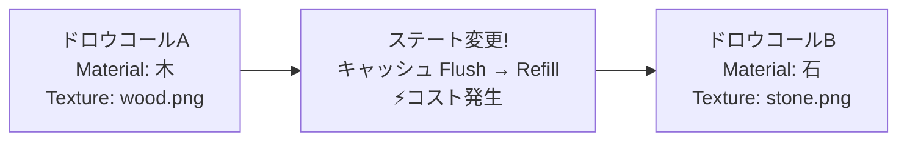
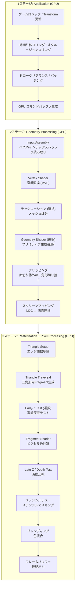
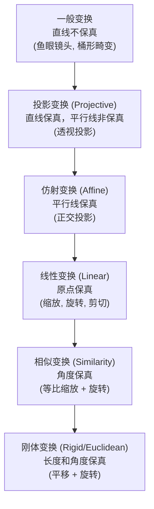
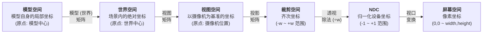
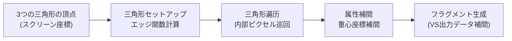
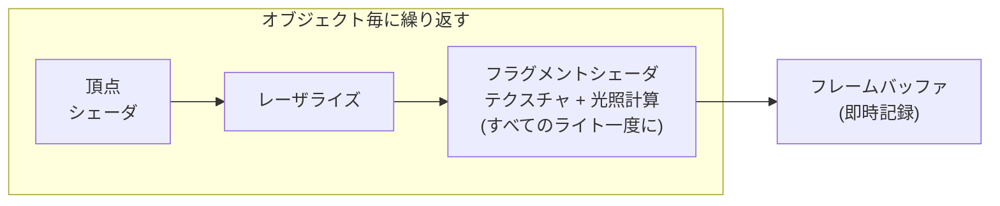
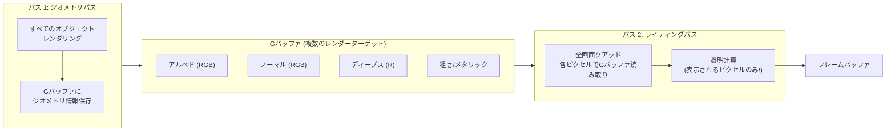
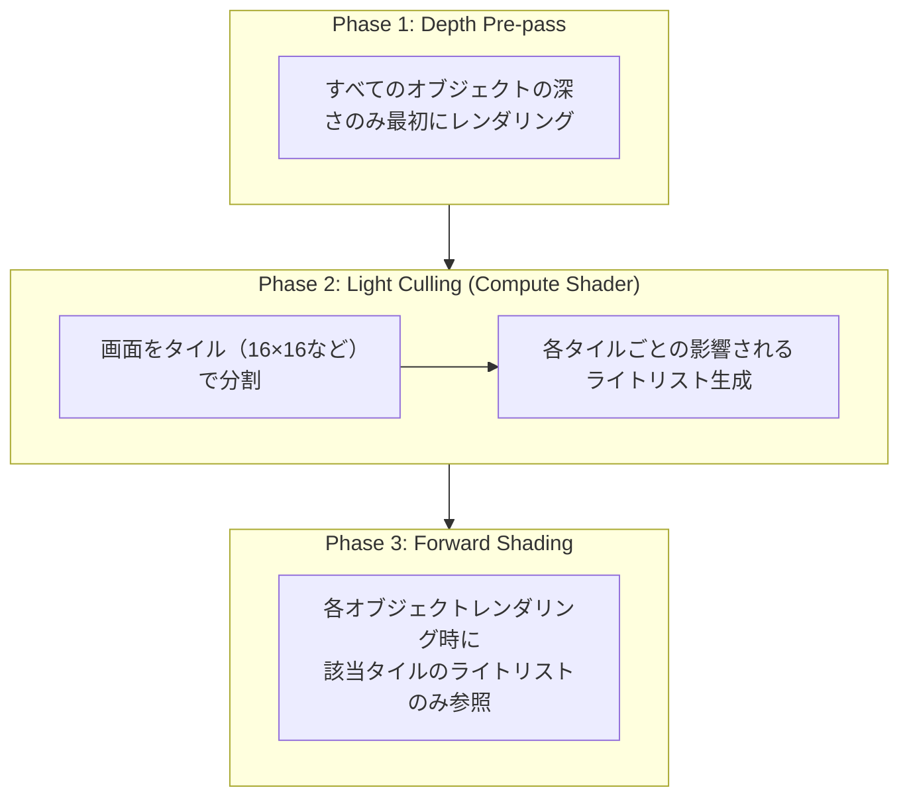

## 序論

[シェーダープログラミング](/posts/ShaderStudy001/)のポストでは、シェーダーを「GPUで実行されるプログラム」として扱いましたが、このポストではその**シェーダーが実行される舞台自体**に迫ります。レンダリングパイプラインは、3D世界がモニター上の2Dピクセルへと変換される全体の流れです。

シェーダーを書けることと、そのシェーダーがパイプラインのどの位置でなぜそのような方法で実行されるのかを理解することは異なります。レンダリングパイプラインを理解すると次のようなことが可能になります。

| 理解レベル | できること |
| --- | --- |
| パイプラインの流れ | ドローコールのボトルネックがCPUかGPUかを診断 |
| 座標変換 | UV転倒、シャドウ破損などの座標系バグ解決 |
| ラスタライゼーション | オーバードロー、Z-fighting、アンチエイリアシング問題解決 |
| レンダリングアーキテクチャ | Forward/Deferred選択、ライト性能最適化 |
| GPUハードウェア | ステート変更コスト、テキスチャキャッシュ最適化 |

このポストは、金成完先生の「ゲームエンジンの核心分析」講義内容を基に、実務的な補足説明を加えた構成となっています。

## Part 1: GPUハードウェアとメモリ

レンダリングパイプラインを正しく理解するためには、それが実行されるハードウェアの特性から始めなければなりません。GPUはCPUとは根本的に異なる哲学で設計されたプロセッサです。

### 1. GPU内の構造

GPUチップ内でレンダリングに最も直接的に影響を及ぼすのは**メモリ階層構造**です。

```markdown
┌─────────────────────────────────────────────────────┐
│                     GPUチップ                          │
│                                                     │
│  ┌─────────┐ ┌─────────┐ ┌─────────┐              │
│  │ SM/CU 0 │ │ SM/CU 1 │ │ SM/CU N │   ...        │
│  │ ┌─────┐ │ │ ┌─────┐ │ │ ┌─────┐ │              │
│  │ │Reg  │ │ │ │Reg  │ │ │ │Reg  │ │  ← レジスタ  │
│  │ │File │ │ │ │File │ │ │ │File │ │    (最も速い)│
│  │ └─────┘ │ │ └─────┘ │ │ └─────┘ │              │
│  │ ┌─────┐ │ │ ┌─────┐ │ │ ┌─────┐ │              │
│  │ │ L1$ │ │ │ │ L1$ │ │ │ │ L1$ │ │  ← L1キャッシュ│
│  │ └─────┘ │ │ └─────┘ │ │ └─────┘ │              │
│  └─────────┘ └─────────┘ └─────────┘              │
│         │            │           │                  │
│  ┌──────────────────────────────────┐              │
│  │           L2キャッシュ             │  ← L2キャッシュ│
│  └──────────────────────────────────┘              │
│                    │                                │
│  ┌──────────────────────────────────┐              │
│  │      固定機能ユニット            │              │
│  │  (レスターライザ、ROP、TMUなど)     │              │
│  └──────────────────────────────────┘              │
└────────────────────│────────────────────────────────┘
                     │
          ┌──────────────────────┐
          │    VRAM（ビデオメモリ）  │  ← 最も遅い
          │  テクスチャ、バッファ、G-Buffer │
          └──────────────────────┘
```

| メモリ階層 | サイズ | アクセス速度 | 目的 |
| --- | --- | --- | --- |
| **レジスタ** | ~256KB/SM | 1サイクル | シェーダ変数、即時演算 |
| **共有メモリ（LDS）** | 32~128KB/SM | ~5サイクル | ワークグループ内のデータ共有 |
| **L1キャッシュ** | 16~128KB/SM | ~20サイクル | テクスチャキャッシュ、コマンドキャッシュ |
| **L2キャッシュ** | 2~6MB | ~200サイクル | グローバルメモリアクセスキャッシュ |
| **VRAM** | 4~24GB | ~400+サイクル | テクスチャ、バッファ、レンダーターゲット |

### 1-1. ステート変更のコスト

GPU内のキャッシュメモリを設定するには時間がかかります。**ステート変更(State Change)**とはGPUのレンダリング設定を切り替えることで、このとき内部キャッシュを空にして再度埋め直す必要があります。



| ステート変更の種類 | コスト | 説明 |
| --- | --- | --- |
| **シェーダープログラム変更** | 非常に高 | GPUパイプライン全体 Flush |
| **レンダーターゲット変更** | 高 | フレームバッファ切り替え |
| **テクスチャバインド変更** | 中 | TMU(テクスチャマッピングユニット)キャッシュ無効化 |
| **ユニフォーム/定数バッファ変更** | 低 | 小さなデータ転送 |
| **バーテックスバッファ変更** | 中 | 入力アセンブラー再設定 |

**テクスチャをアトラス化して大きな一枚にまとめることの理由**がこれです。テクスチャを頻繁に変更すると、GPUキャッシュメモリ内部を常に空にしてから充填しなければなりません。GPUはテクスチャデータをキャッシュに保存する際に **Z-オーダー曲線(Z-order curve, Morton code)**で保存します。このパターンは2D空間において隣接するテクセル同士のメモリアドレスも近くにしてキャッシュ命中率を上げます。

```
テクスチャのテクセル配置 (メモリ上の順序)

線形配置 (効率的ではない):          Z-オーダー配置 (GPU実際の方法):
0  1  2  3                 0  1  4  5
4  5  6  7                 2  3  6  7
8  9  10 11                8  9  12 13
12 13 14 15                10 11 14 15

→ 隣接テクセルアクセス時          → 隣接テクセルもメモリ上でも近い
  メモリアドレスが大きく跳ねる       → キャッシュ命中率が高い
```

> **Q. ドロウコール(Draw Call)が性能のボトルネックになる理由は？**
>
ドロウコール自体は単純なGPU命令ですが、各ドロウコールごとにCPUがGPUへレンダリング状態(シェーダー、テクスチャ、バッファなど)を設定しなければなりません。この**CPU → GPU コマンド送信**過程がボトルネックです。ドロウコールを減らすために **バッチング(Batching)**, **インスタンシング(Instancing)**, **Indirect Draw** などの技術を使います。DirectX 12、Vulkan、Metal などの低レベル API はこのオーバーヘッドを最小化するよう設計されています。
{: .prompt-info}


## Part 2: レンダリングパイプラインの全体構造

### 2. パイプライン概要

3Dオブジェクトが画面のピクセルになるまで、大きく**3つのステージ**を経過します。



| ステージ | 実行位置 | プログラマ制御 | 核心作用 |
| --- | --- | --- | --- |
| Application | CPU | 全ての制御 | シーン準備、コリング、ドロークリアランス |
| Geometry Processing | GPU | Vertex/Tessellation/Geometry Shader | 座標変換、クリッピング |
| Rasterization | GPU | 固定機能 (制御不可) | 三角形 → Fragment変換 |
| Pixel Processing | GPU | Fragment Shader | 最終色決定 |
| Output Merger | GPU | 設定による制御 (ブレンドモードなど) | 深度/ステンシルテスト、ブレンディング |

### 2-1. アプリケーションステージ (CPU)

GPUにドロークリールを送る前に、CPUで行う準備作業です。

#### クリーニング (Culling)

画面からは見えないオブジェクトを事前にフィルタリングして、GPUの負荷を軽減します。

```
カメラ視野体 (View Frustum)
                    Far Plane
              ┌───────────────────┐
             ╱│                   │╲
            ╱ │     見える領域     │ ╲
           ╱  │                   │  ╲
Near Plane╱   │    ● オブジェクトA   │   ╲
 ┌───────┐    │    (レンダリング!)       │    ╲
 │カメラ  │    │                   │     ╲
 │ ◉────→│    │                   │      ╲
 └───────┘    └───────────────────┘
           ╲                           ╱
            ╲   ○ オブジェクトB          ╱
             ╲  (クリーニング! GPUには見えない) ╱
              ╲                     ╱
```

| クリーニング種類 | 実行位置 | 方法 |
| --- | --- | --- |
| **視野体クリーニング(Frustum Culling)** | CPU | オブジェクトバウンディングボックスが視野体内にあるかを検査 |
| **遮蔽クリーニング(Occlusion Culling)** | CPU/GPU | 他のオブジェクトによって完全に覆われたものを除く |
| **バックフェイスクリーニング(Backface Culling)** | GPU | カメラの反対側を向いている三角形を削除 |
| **小さな三角形クリーニング** | GPU | 画面からは1ピクセル未満の三角形を削除 |

#### ドロークリールの並べ替え

ステート変更を最小限に抑えるために、同じマテリアルを使用するオブジェクト同士をまとめて描画します。

```
並べ替え前 (ステート変更 5回):
  Draw(シェーダA, テクスチャ1) → Draw(シェーダB, テクスチャ2) → Draw(シェーダA, テクスチャ1)
  → Draw(シェーダB, テクスチャ3) → Draw(シェーダA, テクスチャ1)

並べ替え後 (ステート変更 2回):
  Draw(シェーダA, テクスチャ1) × 3  → Draw(シェーダB, テクスチャ2) → Draw(シェーダB, テクスチャ3)
```


## Part 3: 座標系と変換パイプライン

このパートは、レンダリングパイプラインの中で最も数学的で重要な部分です。3Dオブジェクトの頂点が画面ピクセルに変換される過程を詳しく説明します。

### 3. 座標系の種類

#### 左手/右手坐标系

```
左手坐标系 (DirectX, Unity)        右手坐标系 (OpenGL)

      Y ↑                              Y ↑
      │                                │
      │                                │
      │                                │
      └──────→ X                       └──────→ X
     ╱                                ╱
    ╱                                ╱
   Z (屏幕内部)                      Z (屏幕外部)

※ 将拇指(X), 食指(Y), 中指(Z)顺序摊开时，
  左手为左手坐标系，右手为右手坐标系
```

| 特性 | 左手坐标系 | 右手坐标系 |
| --- | --- | --- |
| **使用引擎(世界)** | Unity(Y-up), Unreal(Z-up) | Godot(Y-up) |
| **Z轴方向** | 屏幕内部为+Z | 屏幕外部为+Z |
| **旋转正的方向** | 逆时针方向 | 顺时针方向 |
| **外积结果** | 左手定则 | 右手定则 |
| **摄像机前方** | +Z (Unity), +X (Unreal) | -Z |

> **API 规约 vs 引擎世界坐标系是分开的。** OpenGL 传统上基于右手坐标系的裁剪空间，但 Vulkan 在 NDC 中 Y 轴为向下方向(+Y = 下)，Z 范围为 [0, 1]，与 OpenGL 不同。API 定义的是 **裁剪空间/NDC 规约**，而引擎的世界坐标系的方向性（handedness）由引擎单独决定。例如 DirectX API 本身并不强制使用某种坐标系，但惯例上 DirectXMath 库提供了左手坐标系的函数。
{: .prompt-info}

**核心**: 外积公式在外坐标系下是相同的。但是结果向量 **方向** 在不同坐标系下相反。这意味着 **法线向量的方向可能会因坐标系而异**。在引擎间移植着色器时，法线贴图翻转的问题的根本原因就在这里。

#### 其他坐标系

| 坐标系 | 用途 |
| --- | --- |
| **球面坐标系(Spherical)** | BRDF(双向反射分布函数), 环境映射 |
| **球面谐波函数(Spherical Harmonics)** | 间接光照近似, Light Probe |
| **圆柱坐标系(Cylindrical)** | 全景投影, 特殊UV映射 |
| **纹理坐标系(UV)** | 纹理映射 (原点位置因API而异!) |

**纹理坐标的原点差异**在实际工作中经常引起问题。

```
OpenGL / Unity:              DirectX (加载纹理时):
原点 = 左下角             原点 = 左上角

(0,1) ──── (1,1)            (0,0) ──── (1,0)
  │          │                │          │
  │          │     ↕ 翻转      │          │
  │          │                │          │
(0,0) ──── (1,0)            (0,1) ──── (1,1)
```

纹理上下翻转的现象就是由此坐标系差异引起的。不过，Unity 在内部会自动修正某些平台间的差异。如果 `_MainTex_TexelSize.y` 为负数，则表示纹理被翻转了，在使用后期处理或渲染纹理时可能需要手动翻转 UV 坐标。
{: .prompt-info}

### 3-1. 同次坐标系与仿射变换

在3D图形学中，为了 **将所有转换统一为一个矩阵乘法**，使用了同次坐标系（Homogeneous Coordinates）。

#### 问题：转换运算的不一致

```
缩放变换 (Scale): 表达为乘法 → x' = s · x
旋转变换 (Rotation): 表达为乘法 → x' = R · x
平移变换 (Translation): 表达为加法 → x' = x + t  ← 问题!
```

只有平移变换是加法，而在合成多个变换时无法将其合并成一个矩阵乘法链。

#### 解决方案：增加一维

将2D坐标（x, y）扩展到3D同次坐标（x, y, **1**），或将3D坐标（x, y, z）扩展到4D同次坐标（x, y, z, **1**）。

$$
\text{2D 平移变换:} \quad
\begin{bmatrix} x' \\ y' \\ 1 \end{bmatrix} =
\begin{bmatrix} 1 & 0 & t_x \\ 0 & 1 & t_y \\ 0 & 0 & 1 \end{bmatrix}
\begin{bmatrix} x \\ y \\ 1 \end{bmatrix}
$$

现在平移也可以用矩阵乘法表示！这就是 **仿射变换（Affine Transformation）**。

$$
x' = ax + by + c \quad \text{(线性变换 + 常数项)}
$$

$$
y' = dx + ey + f
$$

#### 变换分类体系



| 变换 | 保持的属性 | 4x4 矩阵特性 | 游戏中的示例 |
| --- | --- | --- | --- |
| **刚体（Rigid）** | 长度, 角度 | 正交旋转 + 平移 | Transform 的 Position/Rotation |
| **相似（Similarity）** | 角度 | 添加等比缩放 | 均匀缩放 |
| **仿射（Affine）** | 平行线 | 一阶多项式 | 非均匀缩放, 剪切, 正交投影 |
| **投影（Projective）** | 直线 | 第四行为 (0,0,0,1) 不是 | 透视投影 (Perspective) |
| **一般（General）** | 无 | 非线性 | VR 桶形畸变, 鱼眼镜头 |

#### 旋转矩阵的特殊性质

旋转矩阵 $R$ 是一个 **正交矩阵(Orthogonal Matrix)**。即：

$$
R^{-1} = R^{T}
$$

这意味着，**在求逆旋转时无需昂贵的逆运算，只需简单的转置即可**。此外，反方向的旋转只是将角度取负。

$$
R(-\theta) = R(\theta)^{-1} = R(\theta)^{T}
$$

这三者都给出了相同的结果。

### 3-2. 处理流水线 (Transform Pipeline)

这是从3D顶点转换为屏幕像素的坐标变换顺序。



#### 世界转换 (模型矩阵)

标准顺序为 SRT: **缩放 → 旋转 → 平移**

$$
M_{world} = T \cdot R \cdot S
$$

```
注意矩阵乘法的顺序！

DirectX (行向量，按行存储):
  v' = v × S × R × T    ← 变换顺序和乘法顺序相同

OpenGL (列向量，按列存储):
  v' = T × R × S × v    ← 变换顺序和乘法顺序相反!
```

这种差异的根本原因并不是内存布局（行主序/列主序），而是 **向量与矩阵相乘的位置**（行向量约定 vs 列向量约定）。DirectX/HLSL 将行向量放在左边 (`v × M`)，而 OpenGL/GLSL 将列向量放在右边 (`M × v`)。在行向量约定中，变换顺序和乘法顺序相同；而在列向量约定中，则相反。内存布局（行主序/列主序）只是将同一矩阵存储到内存中的方式不同，并且与乘法顺序无关。

#### 变换顺序的重要性

矩阵乘法 **不满足交换律**。

```
1. 90度旋转 → X轴移动          2. X轴移动 → 90度旋转

    ●                                ●
    │                                │
    │  旋转                           │  移动
    ▼                                ▼
    ●→→→→ ●                    ●→→→→ ●
           移动                            │
                                          │  旋转
                                          ▼
                                          ●

→ 完全不同的结果!
```

#### 视图转换 (视图矩阵)

摄像机变换是 **摄像机的世界变换的逆变换**。将摄像机移至原点相当于将整个世界反向移动。

$$
V = (R \cdot T)^{-1} = T^{-1} \cdot R^{-1} = T^{-1} \cdot R^{T}
$$

利用旋转矩阵的逆矩阵等于其转置这一性质，可以在不进行昂贵的逆矩阵运算的情况下计算它。

#### 欧拉角与万向节锁

表示旋转时使用三个轴上的旋转角度称为 **欧拉角 (Euler Angles)**。

| 轴 | 名称 | 描述 |
| --- | --- | --- |
| X轴 | **Pitch** | 点头（上下） |
| Y轴 | **Yaw** | 左右摇摆 |
| Z轴 | **Roll** | 侧倾 |

**Unity的旋转应用顺序**: Z → X → Y (避免摄像机万向节锁的最佳顺序)

**万向节锁 (Gimbal Lock)** 问题: 在使用欧拉角进行旋转时，如果两个轴重合，则会失去一个自由度。

```
正常状态 (3个自由度):        万向节锁 (2个自由度):
    ┌─── Y轴万向节 ───┐         ┌─── Y轴万向节 ───┐
    │  ┌─ X轴万向节 ─┐ │         │                 │
    │  │ ┌─ Z轴 ─┐  │ │   X轴为  │  ┌─ X+Z 轴 ─┐  │
    │  │ │  ●    │  │ │   90度  │  │   ●       │  │
    │  │ └───────┘  │ │   旋转  │  └───────────┘  │
    │  └────────────┘ │   →     │                 │
    └─────────────────┘         └─────────────────┘
                               X轴和Z轴在同一平面上!
                               → 失去一个旋转轴
```

这就是 **四元数 (Quaternion)** 所需的原因。就像在2D中使用复数表示旋转一样，在3D中使用四元数表示旋转可以避免万向节锁并实现平滑的插值(Slerp)。
```

### 3-3. 投影变换 (Projection)

投影变换是管线中最 **数学上最复杂的部分**。

#### 正交投影 vs 透视投影

```
正交投影 (Orthographic)         透视投影 (Perspective)

  ┌─────────┐  Far              ╲           ╱  Far
  │         │                    ╲         ╱
  │         │                     ╲       ╱
  │  可见    │                     ╲ 可见╱
  │  区域    │                      ╲区域 ╱
  │         │                       ╲   ╱
  │         │                        ╲ ╱
  └─────────┘  Near             ◉ Near  ← 摄像机

  → 尺寸恒定                    → 近处的物体变大
  → 平行线保持                  → 平行线消失于消失点
```

| 特性 | 正交投影 | 透视投影 |
| --- | --- | --- |
| **变换类型** | 线性变换 | 投影变换 |
| **平行线** | 保持 | 不保持（消失点） |
| **尺寸** | 与距离无关 | 与距离成反比 |
| **用途** | 2D 游戏，UI，建筑视图 | 3D 游戏，现实视角 |

#### 透视投影的核心：除以 w

需要将 视野截锥体（View Frustum）转换为 NDC（归一化设备坐标）的六面体空间。

```
视野截锥体 (Frustum)            NDC 六面体

     Far 平面                 ┌────────┐ (+1,+1,+1)
  ┌─────────────┐              │        │
  │             │              │        │
  │             │     →→→      │        │
  │             │   投影变换    │        │
  ╲           ╱               │        │
   ╲         ╱                └────────┘ (-1,-1,-1)
    ╲  Near ╱                   或 (0 ~ 1) 对于 DirectX
     └─────┘
      摄像机
```

应用透视投影矩阵后，**Clip Space** 坐标就产生了。关键在于 w 成分包含原始的 z值（深度）。

$$
\begin{bmatrix} x_{clip} \\ y_{clip} \\ z_{clip} \\ w_{clip} \end{bmatrix}
= P \cdot
\begin{bmatrix} x_{view} \\ y_{view} \\ z_{view} \\ 1 \end{bmatrix}
\quad \text{where } w_{clip} = \pm z_{view} \text{ (符号取决于坐标系约定)}
$$

> **$w_{clip}$的符号**：在左手坐标系（DirectX, Unity）中，摄像机面向 +Z 时 $w_{clip} = z_{view}$；而在右手坐标系（OpenGL）中，摄像机面向 -Z 时 $w_{clip} = -z_{view}$。重要的是，$w_{clip}$ **与视空间中的距离成正比**。
{: .prompt-info}

在 **Perspective Division（透视除法）** 中，所有分量都除以 w。

$$
\begin{bmatrix} x_{ndc} \\ y_{ndc} \\ z_{ndc} \end{bmatrix}
=
\begin{bmatrix} x_{clip} / w_{clip} \\ y_{clip} / w_{clip} \\ z_{clip} / w_{clip} \end{bmatrix}
$$

由于 $w_{clip}$ 与视空间中的距离成正比，**远处的值被除以更大的数，因此屏幕坐标变小。** 这就是透视感的数学原理。

#### API 对 NDC 范围的不同处理

| API | X, Y 范围 | Z 范围 |
| --- | --- | --- |
| OpenGL | -1 ~ +1 | -1 ~ +1 |
| DirectX | -1 ~ +1 | 0 ~ +1 |
| Vulkan | -1 ~ +1 | 0 ~ +1 |
| Metal | -1 ~ +1 | 0 ~ +1 |

> **Z 缓冲区的深度精度问题**
>
> 透视投影后，z值具有 **非线性分布**。近处集中了大部分精度，远处则缺乏精度。例如，在 Near 0.1, Far 1000 的情况下，整个 z-buffer 精度的大约90%被消耗在摄像机10单位内。这就是 **Z-fighting（远距离表面闪烁并重叠的现象）**的原因。为了解决这个问题，可以使用 **Reversed-Z**（将 Far=0, Near=1 逆转），这样浮点数的指数分布与投影的非线性相互抵消，从而 **大幅提高远处的深度精度**。虽然完全均匀化是不可能的，但与传统方法相比，在远距离处的 Z-fighting 显著减少。Unity HDRP 和 UE5 默认使用 Reversed-Z。
{: .prompt-warning}

### 3-4. Normalベクトルの変換

座標点(Point)と方向ベクトル(Direction)は**異なる変換が必要です。**特にNormalベクトルには注意が必要です。

等方(Uniform)スケーリングでは問題ありませんが、**非等方(Non-uniform)スケーリング**においてNormalベクトルにモデル行列をそのまま適用すると表面に対して垂直でなくなってしまいます。

```markdown
等方 スケール (S=2,2):          非等方 スケール (Sx=2, Sy=1):

      N                           N (元の)    N' (誤った)
      ↑                           ↑          ↗
  ┌───┼───┐                   ┌───┼───────────┐
  │   │   │   → Scale ×2 →   │   │            │
  └───┴───┘                   └───┴────────────┘

  N 方向OK！                  Nはもう表面に対して垂直ではありません！
```

**解決法**: Normalベクトルにはモデル行列の**逆転置行列(Inverse Transpose)**を適用する必要があります。

$$
N' = (M^{-1})^{T} \cdot N
$$

**証明**: 2つのベクトルが垂直である場合、内積は0です。接線ベクトル$T$と法線ベクトル$N$の垂直関係$T \cdot N = 0$を変換後も保持するためには:

$$
T'^{T} \cdot N' = (M \cdot T)^{T} \cdot (G \cdot N) = T^{T} \cdot M^{T} \cdot G \cdot N = 0
$$

$T^{T} \cdot N = 0$であるため、$M^{T} \cdot G = I$のとき成立します。従って$G = (M^{T})^{-1} = (M^{-1})^{T}$です。
```

## Part 4: ラスタライゼーションの深化

ラスタライゼーションはGPUの**固定機能(Fixed-Function)**ハードウェアで処理されます。プログラムすることはできませんが、その動作を理解することは最適化に不可欠です。

### 4. ラスタライザの役割



#### エッジ関数と三角形内判定

三角形の3辺を**エッジ関数(Edge Function)**で定義します。1点が3つのエッジ関数の符号がすべて同じであれば、その点は三角形内部にあります。

$$
E_{01}(P) = (P_x - V_0.x)(V_1.y - V_0.y) - (P_y - V_0.y)(V_1.x - V_0.x)
$$

```
      V2
     ╱  ╲
    ╱ +  ╲        E01(P) > 0  ✓
   ╱  +   ╲       E12(P) > 0  ✓
  ╱  + P +  ╲     E20(P) > 0  ✓
 ╱ +   +   + ╲    → Pは三角形内部!
V0 ──────────── V1
```

#### 重心座標補間 (バリアンティック補間)

三角形内の各ピクセルで、Vertex Shaderが出力したデータ(UV、ノーマル、色など)を3つの頂点の値から補間します。

$$
\text{Attr}(P) = \alpha \cdot \text{Attr}(V_0) + \beta \cdot \text{Attr}(V_1) + \gamma \cdot \text{Attr}(V_2)
$$

$$
\alpha + \beta + \gamma = 1
$$

ここで、$\alpha$、$\beta$、$\gamma$は、該当する点が各頂点にどれほど近いかを示す重みです。

#### パースペクティブ補正補間

遠近法線後での補間には**パースペクティブ補正(Perspective Correction)**が必要です。スクリーン空間で単純な線形補間を行うと、テクスチャが歪みます。

```
補正なし (アフィン):              補正適用 (パースペクティブ補正):

  ┌──────────────┐              ┌──────────────┐
  │ ╲  ╲  ╲  ╲  │              │╲  ╲   ╲    ╲ │
  │  ╲  ╲  ╲  ╲ │              │ ╲  ╲   ╲    ╲│
  │   ╲  ╲  ╲  ╲│              │  ╲  ╲    ╲   │
  │    ╲  ╲  ╲  │              │   ╲   ╲    ╲ │
  └──────────────┘              └──────────────┘
  テクスチャが等間隔に縮小          近遠に応じて間隔変化
  (PS1時代のグラフィックス)        (現代ハードウェアの基本)
```

補正された補間公式:

$$
\frac{\text{Attr}}{w} = \alpha \cdot \frac{\text{Attr}(V_0)}{w_0} + \beta \cdot \frac{\text{Attr}(V_1)}{w_1} + \gamma \cdot \frac{\text{Attr}(V_2)}{w_2}
$$

$$
\frac{1}{w} = \alpha \cdot \frac{1}{w_0} + \beta \cdot \frac{1}{w_1} + \gamma \cdot \frac{1}{w_2}
$$

最終的な属性値は $\text{Attr} = \frac{\text{Attr}/w}{1/w}$で求めます。

> **初期PlayStation(PS1)でのテクスチャが揺れ動き、歪んで見える理由**は、この補正がなかったからです。PS1のGTE(Geometry Transform Engine)はハードウェア制限によりパースペクティブ補正をサポートしていませんでした。
{: .prompt-info}

### 4-1. Zバッファリングと深さテスト

**Zバッファ（Depth Buffer）**は、画面の各ピクセル位置に現在まで描画された最も近い表面の深さ値を保存します。

```
Zバッファ動作:

Fragment A (z=0.3) 到着 → Zバッファ[x,y] = 1.0（初期値）
  0.3 < 1.0 → 通過！ Zバッファ[x,y] = 0.3で更新、ColorバッファにA色記録

Fragment B (z=0.5) 到着 → Zバッファ[x,y] = 0.3
  0.5 > 0.3 → 拒否！（Aよりも後ろにあるため破棄）

Fragment C (z=0.1) 到着 → Zバッファ[x,y] = 0.3
  0.1 < 0.3 → 通過！ Zバッファ[x,y] = 0.1で更新、ColorバッファにC色記録
```

| Zバッファビット数 | 精度 | 普通の使用 |
| --- | --- | --- |
| 16ビット | 65,536ステップ | モバイル（メモリ節約） |
| 24ビット | 16,777,216ステップ | 大部分のゲーム（標準） |
| 32ビット浮動小数点 | 极高精度 | 幅広い世界、Reversed-Z |

#### Zファイト現象

表面がZバッファ精度内で区別不可能に近ければ、フレームごとに勝者が変わるため、点滅する現象が発生します。

```
Z-fighting発生:
  表面 A: z = 0.500001
  表面 B: z = 0.500002
  → Zバッファ精度で区別不可能 → フレームごとにA/Bが交互に見える

解決方法:
1. Near/Far比を小さくする（Nearを可能な限り大きく）
2. ポリゴンオフセット（glPolygonOffset / Depth Bias）
3. Reversed-Zを使用（遠い距離の精度改善）
4. ログ深さバッファ（Logarithmic Depth Buffer）
```

### 4-2. アンチエイリアシング (Anti-Aliasing)

レーザーライゼーションは、連続的な三角形を離散的なピクセル格子にマッピングするため、必然的に**ステップ現象(Aliasing)**が発生します。

| 技法 | 原理 | 优点 | 缺点 |
| --- | --- | --- | --- |
| **MSAA** | ピクセルあたり複数のサンプルポイントで境界検出 | 高品質、三角形境界に効果的 | メモリ/帯域幅コストが高い、Deferredと互換性ない |
| **FXAA** | 後処理で境界検出後ぼかし | 快速軽量 | テクスチャが若干ぼやける |
| **TAA** | フレーム間サブピクセルジッタ＋ヒストリーブレンディング | 時間的安定性、シェーダーエイリアシングも解決 | ゴースティング(残像)、モーションボヤキ |
| **DLSS/FSR** | AIアップスケーリング | 低解像度から高解像度品質 | 前用ハードウェア/アルゴリズムが必要 |

**MSAA(Multi-Sample Anti-Aliasing)**の動作:

```
MSAAなし (1x):              MSAA 4x:

  ┌─┬─┬─┬─┐                  ┌─┬─┬─┬─┐
  │○│○│○│ │                  │◉│◑│◔│ │  ← 境界ピクセルは
  ├─┼─┼─┼─┤                  ├─┼─┼─┼─┤    部分的にカバー
  │○│○│ │ │                  │◉│◉│◔│ │    → 中間色
  ├─┼─┼─┤ │                  ├─┼─┼─┤ │
  │○│ │ │ │                  │◑│◔│ │ │
  └─┴─┴─┴─┘                  └─┴─┴─┴─┘
  ステップが鮮明              境界が滑らか

  ○ = 完全カバー             ◉ = 4/4カバー (100%)
                            ◑ = 2/4カバー (50% ブレンディング)
                            ◔ = 1/4カバー (25% ブレンディング)
```

## Part 5: レンダリングアーキテクチャ

同じパイプラインでも、**照明計算をいつ、どのように行うか**によってレンダリングアーキテクチャが異なります。これはゲームプロジェクトの性能特性を決定する重要な選択肢です。

### 5. 前向渲染

最古老也是最基本的方法。在绘制每个对象的同时**同时**进行光照计算。



```
前向渲染的问题——过度绘制:

フラグメントシェーダの実行回数 = オブジェクト数 × ライト数 × 重叠像素数

例: 中央に3つのオブジェクトが重なっている (ライト4つ)
  → 同じピクセルでフラグメントシェーダが 3 × 4 = 12回実行!
  → 前面の1つだけが見えるのに、後ろの2つも完全に計算される → ワ waste
```

| 优点 | 缺点 |
| --- | --- |
| 容易实现且直观 | 光源多时性能急剧下降 (O(オブジェクト × ライト)) |
| 半透明对象处理自然 | 过度绘制时所有着色都会浪费 |
| MSAA支持 | 现实中需要限制光源数量 |
| 内存使用量少 | |
| VR中必不可少（双目渲染） | |

### 5-1. 地延渲染 (地延 렌더링)

**核心理念**: シェーディング（照明计算）を後回しにする。まず、ジオメトリ情報だけ **Gバッファ**に保存し、最後に **画面に表示されるピクセルのみ**で照明計算を行う。



```
Gバッファ構成例 (4つのレンダーターゲット):

RT0 (アルベド + アルファ):     RT1 (ノーマル):
┌──────────────────┐      ┌──────────────────┐
│ R │ G │ B │ A    │      │ Nx │ Ny │ Nz │ - │
│ 表面基本色         │      │ 世界法線ベクトル   │
└──────────────────┘      └──────────────────┘

RT2 (モーション + スペキュラー):   デプスバッファ:
┌──────────────────┐      ┌──────────────────┐
│ Mx │ My │ Spec │ │      │    デプス (24ビット) │
│ モーションベクトル  │ スペキュラ         │
└──────────────────┘      └──────────────────┘
```

**なぜ速いのか？**

```
フワード: 全てのフラグメントについて照明計算（見えないものも含む）
  ピクセルXに3つのオブジェクトが重なっている → 照明計算3回

デリーフ: 最終的に表示されるフラグメントのみで照明計算を行う
  ピクセルXに3つのオブジェクトが重なっている → Gバッファには最も前方のものだけ残る
  → 照明計算1回!
```

| 优点 | 缺点 |
| --- | --- |
| 光源数に対して堅牢 (O(ピクセル × 光源)) | Gバッファによる高いメモリ使用量 |
| 表面上のフラグメントのみシェーディング → 高効率 | 半透明オブジェクト処理不可（別途フワードパスが必要） |
| ライトボリュームで光源展開可能 | MSAA非対応 (TAAで代替) |
|  | 解像度が高いとGバッファ帯域幅制約 |
|  | モバイルではメモリ/帯域幅制約により使用困難 |

> **半透明ができない理由**: Gバッファは1つのピクセルに1つのジオメトリ情報だけを保存します。半透明オブジェクトは後ろのオブジェクトの情報を必要とするのに、Gバッファには前方のものだけが残っています。そのためデリーフエンジンは不透明はデリーフで、半透明はフワードパスで処理するハイブリッド方式を使用します。
{: .prompt-info}

### 5-2. Forward+ (Tiled Forward) ヲリング

ForwardとDeferredの長所を組み合わせた**最新のアプローチ**です。



```
Light Heatmap (ライト密度視覚化):

  ┌────┬────┬────┬────┐
  │ 2  │ 3  │ 5  │ 2  │  ← 各タイルに影響されるライト数
  ├────┼────┼────┼────┤
  │ 1  │ 8  │ 12 │ 4  │  ← 中央のタイルにライト集中
  ├────┼────┼────┼────┤
  │ 1  │ 6  │ 9  │ 3  │
  ├────┼────┼────┼────┤
  │ 0  │ 2  │ 3  │ 1  │
  └────┴────┴────┴────┘

→ 各タイルは自領域に影響を与えるライトのみ計算
→ ライト12個のタイルは12個のみ、0個のタイルは0個
```

| Forward+ | Forward | Deferred |
| --- | --- | --- |
| ライト数に強健 | ライト数に弱い | ライト数に強健 |
| 半透明サポート | 半透明サポート | 半透明非対応 |
| MSAAサポート | MSAAサポート | MSAA非対応 |
| G-Buffer不要 | G-Buffer不要 | G-Buffer必要 |
| Compute Shader必要 | 追加パス不要 | 追加工学パス必要 |

### 5-3. TBDR: Tile-Based Deferred Rendering

**モ바イル GPU**(ARM Mali, Qualcomm Adreno, Apple GPU)で使用されるハードウェアレベルのレンダリング方法です。ソフトウェアのDeferred Renderingとは異なります。

```
従来のGPU (IMR: Immediate Mode Rendering):
  三角形ごとに処理 → VRAMに即座に記録
  → メモリ帯域幅使用が高まります

モバイル GPU (TBDR):
  ┌────┬────┬────┬────┐
  │ T0 │ T1 │ T2 │ T3 │  ← スクリーンをタイル（通常は16×16〜32×32）で分割
  ├────┼────┼────┼────┤
  │ T4 │ T5 │ T6 │ T7 │
  ├────┼────┼────┼────┤
  │ T8 │ T9 │T10 │T11 │
  └────┴────┴────┴────┘

  各タイルをGPUチップ内のOn-chip Memoryで処理
  → タイル処理完了後のみVRAMに記録
  → メモリ帯域幅大幅削減 → 力消費減少
```

| 特性 | IMR (デスクトップ GPU) | TBDR (モバイル GPU) |
| --- | --- | --- |
| レンダリング単位 | 三角形単位 | タイル単位 |
| メモリアクセス | 各FragmentごとにVRAM | タイル完了時にのみVRAM |
| 帯域幅 | 高い | 低い |
| 力消費 | 高い | 低い |
| Hidden Surface Removal | Early-Z | ハードウェアHSR（より効率的） |

> **モバイル最適化ではTBDRを必ず考慮する必要があります。** TBDRでレンダーターゲットを切り替えると、現在のタイルをVRAMにflushし、新しいレンダーターゲットのデータを再度ロードしなければなりません。これがモバイルでレンダーパスを短縮する根本的な理由です。Unity URPの"Single Pass"レンダリングはこの点を考慮した設計です。
{: .prompt-warning}


## Part 6: 光の物理とマテリアル

レンダリングパイプラインが最終的に計算するのは **「このピクセルにどれだけの光が届き、どんな色になるか」** です。光の物理を理解すると、なぜ PBR シェーダーのパラメータがそのように設計されているのかを説明できます。

### 6. 光の性質

光は **波** でもあり **粒子** でもあります（波動・粒子二重性）。レンダリングではこの二つの性質を同時に活用します。

| 性质 | 物理现象 | 渲染中的应用 |
| --- | --- | --- |
| **反射(Reflection)** | 入射角 = 反射角 | 镜面反射，环境光反射 |
| **折射(Refraction)** | 在介质边界处光线方向的变化 | 玻璃、水、钻石 |
| **吸收(Absorption)** | 能量 → 热能 | 表面的固有颜色，半透明衰减 |
| **散射(Scattering)** | 遇到粒子后扩散 | SSS（皮肤），蓝天，雾气 |
| **干涉(Interference)** | 波动的加强/抵消 | 肥皂膜彩虹，非反射涂层 |
| **衍射(Diffraction)** | 回绕障碍物 | 渲染中几乎可以忽略 |

#### 能量守恒定律

当光照射到表面时，反射、吸收和透射（折射）的能量之和不能超过入射能量。

$$
E_{reflected} + E_{absorbed} + E_{transmitted} = E_{incident}
$$

经典的Phong模型无视了这条定律，只是简单地将Diffuse + Specular + Ambient相加。但是 **基于物理的渲染（PBR）严格遵守这条定律**。这就是为什么金属材质的Metallic值为1时，Diffuse值会变为0的原因。因为金属几乎完全消耗了光的能量用于Specular反射，所以没有能量可以分配给Diffuse。

### 6-1. フレネル効果 (Fresnel Effect)

視線角度に応じて**反射率が異なる**現象です。日常生活で簡単に観察できます。

```
湖を眺めるとき:

上から見下ろす（垂直）:        近く水平方向から見る（傾斜）:
     目                           目
     ↓                            ＼
     ↓                             ＼
  ~~~~~~~~~~~                 ~~~~~~~~~~~~~~
  水の中がよく見える               天空が反射されて見える
  （反射率低、約2%）            （反射率高、約100%）
```

#### フレネル方程式とSchlick近似

正確なフレネル方程式は複雑ですが、リアルタイムレンダリングでは**Schlick近似**を使用します。

$$
F(\theta) = F_0 + (1 - F_0)(1 - \cos\theta)^5
$$

ここで $F_0$ は垂直入射（0度）時の反射率であり、$\theta$ は視線と表面法線の角度です。

| 材質 | $F_0$ の値 | 特性 |
| --- | --- | --- |
| 水 | 0.02 | 几乎透明，倾斜时可见反射 |
| 玻璃 | 0.04 | 金属的基本值 |
| 塑料 | 0.04 | 大多数的非金属类似 |
| 金 | (1.0, 0.71, 0.29) | 有色反射！ |
| 银 | (0.95, 0.93, 0.88) | 几乎白色反射 |
| 铜 | (0.95, 0.64, 0.54) | 橙色反射 |

**金属的Specular反射が色がある理由**: 金属は自由電子が特定波長の光を選択的に吸収し、残りを反射します。金が黄色く輝くのは青色波長を吸収するためです。

#### ネールの法則（屈折）

$$
n_1 \sin\theta_1 = n_2 \sin\theta_2
$$

```
入射光         反射光
  ╲    θ₁  ╱
   ╲   │  ╱
    ╲  │ ╱
─────╲─│╱─────── 媒質境界（空気 → 水）
      ╲│╱
       │╲
       │ ╲  θ₂
       │  ╲
       適折光
```

| 媒質 | 折射率 (n) |
| --- | --- |
| 真空 | 1.0 |
| 空气 | 1.003 |
| 水 | 1.33 |
| 玻璃 | 1.5 |
| 钻石 | 2.42 |

光が屈折するとき**波長によって折射率が異なる（分散）**。これが prism で虹が現れる原理です。

### 6-2. BRDF (双方向反射分布函数)

**BRDF(Bidirectional Reflectance Distribution Function)**は、「特定の入射方向から来た光が、別の特定の方向にどれだけ反射されるか」を定義する関数です。PBRの数学的基礎となっています。

$$
f_r(\omega_i, \omega_o) = \frac{dL_o(\omega_o)}{dE_i(\omega_i)}
$$

- $\omega_i$: 入射光方向
- $\omega_o$: 反射光（視線）方向
- $L_o$: 反射放射輝度(Radiance)
- $E_i$: 入射照度(Irradiance)

#### 微面理论 (Microfacet Theory)

PBRにおいて、表面は微細な**微面(Microfacet)**で構成されていると仮定します。各微面は完璧な鏡であり、その方向（法線）がランダムに分布しています。

```
粗い表面 (粗糙度が高い):          光滑な表面 (粗糙度が低い):

    ↗  ↑  ↖  ↗  ↑                    ↑  ↑  ↑  ↑  ↑
  ╱╲╱╲╱╲╱╲╱╲╱╲╱╲               ───────────────────
  微面方向がそれぞれ異なる       微面方向がほとんど同じ
  → 光が様々な方向に散射        → 光が特定の方向に集中反射
  → 幅広でぼやけたハイライト         → 尖りのある明るいハイライト
```

Cook-Torrance BRDF (PBR 镜面反射):

$$
f_{spec} = \frac{D(\vec{h}) \cdot F(\vec{v}, \vec{h}) \cdot G(\vec{l}, \vec{v}, \vec{h})}{4 \cdot (\vec{n} \cdot \vec{l}) \cdot (\vec{n} \cdot \vec{v})}
$$

| 项目 | 名称 | 物理意义 |
| --- | --- | --- |
| **D** (NDF) | 正常分布函数 | 微面法线在Half向量方向的比例。粗糙度越大，分布越宽 |
| **F** ( Fresnel ) | Fresnel项 | 视角角度相关的反射率变化 |
| **G** (几何学) | 几何/阴影遮蔽 | 微面之间相互遮挡或投射阴影的比例 |

GGX(Trowbridge-Reitz)之所以成为D项目的行业标准：与现有的Beckmann或Phong NDF相比，它具有**长尾(long tail)**的分布特性，在高光周围产生自然的发光效果。这更好地符合现实世界中观察到的高光模式。

### 6-3. 散射与大气效应

光在空气中颗粒上碰撞并扩散的现象称为**散射(Scattering)**。

| 散射类型 | 颗粒大小 vs 波长 | 特性 | 现象 |
| --- | --- | --- | --- |
| **瑞利散射(Rayleigh)** | 颗粒 << 波长 | 短波长（蓝色）散射更多 | 蓝天，红霞 |
| **米散射(Mie)** | 颗粒 ≈ 波长 | 所有波长几乎相同地散射 | 白云，雾气 |

```
蓝天原理 (瑞利散射):

  太阳 ────→ [大气中的空气分子] ────→ 眼睛
                   │
                   │ 蓝色光更多
                   │ 散射
                   ↓
               向四面八方扩散的蓝色光线
               → 天空呈现蓝色

  日落/日出:
  太阳 ─────────────────────→ 长路径 ──→ 眼睛
                                        蓝色光已经散射殆尽
                                        只有红色光到达
                                        → 天空呈现红色
```

> **SSS(次表面散射)**
>
> 光线穿透表面进入内部后在内部发生散射再从表面出来，这种现象称为 SSS。它可以在人的皮肤（逆光照射耳朵时看到的红色）、大理石、蜡烛等物体上观察到。对于人体皮肤的真实表现来说，SSS 是必不可少的，在 UE5 的 Subsurface Profile 和 Unity HDRP 的 Diffusion Profile 中都有支持。
{: .prompt-info}


## 第7部分: 全局光照 (Global Illumination)

仅靠直接光无法创建出逼真的场景。在现实世界中，光线会在表面反射并照亮其他表面的**间接光(Indirect Light)**非常丰富。模拟这种间接光的过程称为 **GI(全局光照)**。

### 7. 直接光 vs 间接光

```markdown
直接光のみ (GIなし):              直接光 + 间接光 (GIあり):

    ☀️ 太阳                         ☀️ 太阳
     ╲                              ╲
      ╲                              ╲
  ┌────╲────┐                    ┌────╲────┐
  │  明亮度  │                    │  明亮度  │
  │         │                    │    ↘    │
  │ 完全暗   │                    │ 稍微亮  │
  │ 黑色    │ ← 阴影部分           │ 明亮    │ ← 墙反射的光线
  └─────────┘                    └─────────┘
  不现实的黑暗                    自然的明暗变化
```

注意：由于“直接光”和“间接光”是专业术语，保持了原文形式。其他部分根据上下文进行了适当的翻译调整。

### 7-1. GI技術

| 技术 | 原理 | 实时？ | 质量 | 应用场景 |
| --- | --- | --- | --- | --- |
| **ライトマップベイキング** | 事前計算後保存为纹理 | 事前计算 | 高（静态） | 静态环境（Unity Lightmap） |
| **Light Probe** | 在空间的多个点存储SH | 事前计算 | 中等 | 动态物体的间接光 |
| **SSAO** ⚠️ | 屏幕空间中的遮挡近似 | 实时 | 低~中等 | 缝隙阴影（AO） |
| **SSR** ⚠️ | 屏幕空间中的反射追踪 | 实时 | 中等 | 地面反射，水面 |
| **光线跟踪** | 光线追踪 | 实时（HW） | 高 | RTX, DXR 支持的GPU |
| **辐射度(Radiosity)** | 仅模拟漫反射 | 事前计算 | 高（漫反射） | 建筑可视化 |
| **路径跟踪(Path Tracing)** | 跟踪所有光线路径 | 离线/实时 | 最高 | 电影, UE5 Path Tracer |
| **Lumen (UE5)** | SDF + 屏幕追踪 + HW/SW RT 混合 | 实时 | 高 | UE5 基础GI |

> ⚠️ **SSAOとSSRは厳密にはGI（全局光照）ではなく、スクリーン空間補助技術**です。SSAOはAmbient Occlusion(隙間シャドウ)であり、SSRは反射効果です。真のGIは、光線の多重反射による间接光の伝播をシミュレーションすることにより定義されます。ライトマップ、Light Probe、光线跟踪、Lumenなどがそれに該当します。ただし、SSAO/SSRはGIパイプラインの補完的な役割として一緒に使用されることが多いので、この表に含めました。
{: .prompt-info}

### 7-2. レイトレーシング (Ray Tracing)

**カメラから光線（レイ）を送り、その光線がどの表面と交差するかを追跡する方法**です。

```
カメラ ──→ レイ ──→ 表面 A （交差点）
                      │
                      ├──→ シャドウレイ → 光源 （影の判断）
                      │
                      ├──→ 反射レイ → 表面 B （反射）
                      │
                      └──→ 折射レイ → 表面 C （屈折）
```

光線の可逆性（入射角 = 反射角）を利用します。光源から無限に多くの光線を送る代わりに、**カメラからの逆追跡**すれば、画面に見える光線だけを計算できます。

**レイトレーシングで球体（ Sphere ）が最も表現しやすい理由**: レイと球との交差点は **平方根の公式** で簡単に求めることができます。

$$
\|\vec{O} + t\vec{D} - \vec{C}\|^2 = r^2
$$

展開すると $t$に関する二次方程式になります。

$$
at^2 + bt + c = 0 \quad \text{where}
$$

$$
a = \vec{D} \cdot \vec{D}, \quad b = 2\vec{D} \cdot (\vec{O} - \vec{C}), \quad c = (\vec{O} - \vec{C}) \cdot (\vec{O} - \vec{C}) - r^2
$$

判別式 $\Delta = b^2 - 4ac$で：
- $\Delta < 0$: 交差なし
- $\Delta = 0$: 接線（1つの交差点）
- $\Delta > 0$: 穿通（2つの交差点、近い方を使用）

一方、三角形メッシュとの交差検査は各三角形ごとにレイ-トライアングル交差を実行する必要があり、**BVH（Bounding Volume Hierarchy）のような加速構造**が必須です。ハードウェアレイトレーシング（RTX）では、このBVH巡回を専用ユニット（RT Core）で高速に処理します。

### 7-3. ハイブリッドレンダリング（現代の標準）

現在のリアルタイムレンダリングは、**レーザーライゼーション + レイトレーシングハイブリッド**が標準となっています。

```
ハイブリッドレンダリングパイプライン:

┌─────────────────────────────────────────┐
│ レーザーライゼーション（基本シーンレンダリング）        │
│   → 不透明オブジェクト、基本シェーディング          │
└──────────────────┬──────────────────────┘
                   │
  ┌────────────────┼────────────────┐
  │                │                │
  ▼                ▼                ▼
レイトレーシング     レイトレーシング      レイトレーシング
影               反射             GI
(シャドー rays) (反射 rays) (拡散反響)
  │                │                │
  └────────────────┼────────────────┘
                   │
                   ▼
            合成 (コンポジット)
                   │
                   ▼
             ポストプロセス (Post-Process)
```

この方法は、**基本的な幾何学は迅速にレーザーライゼーションで処理**し、**影/反射/GIのような精度が必要な部分だけをレイトレーシングで補完**しています。

## Part 8: 現代レンダリングパイプラインの進化

伝統的なレンダリングパイプラインは数十年間大きな変化なく維持されてきましたが、最近数年間に **GPU-Driven Rendering**というパラダイムシフトが起こっています。

### 8. GPU駆动渲染

传统的管线中，**CPU决定“要绘制什么”**并命令GPU执行。而在GPU驱动的方式中，**GPU自行决定“要绘制什么”**。

```markdown
传统管线:
  CPU: 建模 → 排序 → 分组 → 创建绘制调用 → 向GPU传递
  GPU: 执行接收到的命令

GPU驱动管线:
  CPU: 将整个场景数据一次性上传到GPU
  GPU: 使用Compute Shader进行集群/网格单元建模 → 使用间接绘制自行执行
       → 最小化CPU干预!
```

| 传统 | GPU驱动 |
| --- | --- |
| CPU按对象单位建模 | GPU使用Compute Shader进行集群/网格单元建模 |
| 每个对象一个绘制调用 | 使用间接绘制最小化绘制调用 |
| CPU瓶颈容易发生 | 通过GPU运算分散瓶颈 |
| 千余个对象的限制 | 可处理数百万对象 |

### 8-1. Nanite (UE5仮想ジオメトリ)

Unreal Engine 5のNaniteはGPU駆動レンダリングの代表的な実装です。

```
伝統的なLOD:                        Nanite:

  距離に応じて事前に作成した             メッシュを128三角形程度のクラスターに分割
  LODモデルを選択                      GPUでリアルタイムに視認性判断
                                   表面上のみのクラスターだけがレンダラライズされる
  LOD 0: ████ (10K三角形)
  LOD 1: ██   (1K三角形)           ┌──┬──┬──┬──┐
  LOD 2: █    (100三角形)          │CL│CL│  │CL│ ← 表面上のみのクラスターだけが
                                   ├──┼──┼──┼──┤    レンダリングされる
  → ポップイン現象                      │  │CL│CL│  │
  → LOD作成コスト                  └──┴──┴──┴──┘
  → メッシュ品質制限                 → ポップインのない連続LOD
                                   → 数十億ポリゴンのリアルタイム処理
```

Naniteの核心パイプライン:

1. **クラスター単位分割**: メッシュを約128三角形程度のクラスターに分割
2. **GPUカリング**: コンピュートシェーダーで断片/遮蔽カリング
3. **ソフトウェアラスタライゼーション**: 小さな三角形はコンピュートシェーダーで直接ラスタライズされる
4. **ハードウェアラスタライゼーション**: 大きな三角形は既存パイプラインで
5. **視認性バッファ**: G-バッファではなく三角形IDのみを保存 → 材質シェーディングは最後に行われる

### 8-2. メッシュシェーダー (DirectX 12 Ultimate / Vulkan)

これは伝統的なパイプラインのVertex Shader → Geometry Shaderの流れを**完全に置き換える**新しいパイプラインステージです。

```
伝統的なパイプライン:
  入力組み立て → Vertex Shader → [テッセレーション] → [Geometry Shader] → レンジザイザー

メッシュシェーダーのパイプライン:
  [アンプリフィケーションシェーダー] → Mesh Shader → レンジザイザー
  (= タスクシェーダー)
```

| 伝統的な | メッシュシェーダー |
| --- | --- |
| 頂点単位処理 | メッシュレット(Meshlet)単位処理 |
| 固定入力フォーマット | 自由なデータアクセス |
| Geometry Shader性能が悪い | グループベース、効率的 |
| CPUでのLOD/カリング | GPUでのメッシュレット単位LOD/カリング |

メッシュシェーダーはNaniteのようなシステムを実装するためのハードウェア標準と考えることができます。

> **Naniteの制約事項**: Naniteはデferredレンダリングパスのみで動作し、フォワードレンダリングやMSAAとは互換性がありません。また、VR(ステレオレンダリング)でのサポートは限定的であり、半透明マテリアルや一部のマテリアル機能（ワールドポジションオフセットなど）にも制約があります。
{: .prompt-warning}

### 8-3. Lumen (UE5実時間GI)

Lumenは**ソフトウェアray tracing(SDFトレーシング),スクリーンスペーストレーシング、そしてハードウェアレイトレーシング(HW RT)**を状況に応じて組み合わせる実時間全域照明システムです。HW RTが有効化されると、最終反射(Final Gather)でより正確な結果を得られます。

```
Lumen GIパイプライン:

1. シーンのSDF(Signed Distance Field)生成
   → 各メッシュ周囲の距離情報を3Dテクスチャに保存

2. Screen Space Trace (近距離)
   → 画面に表示される領域での高速レイマッチング

3. SDF Trace - Software Ray Tracing (中/遠距離)
   → SDFを追って高速な光線トレーシング
   → ポリゴンとの交差検査よりも遥かに速い

3-1. (選択) Hardware Ray Tracing
   → RTコアを持つGPUで有効化可能
   → Final Gatherでより正確な反射/GI結果

4. Radiance Cache
   → シーンのあちこちにプローブを配置して間接光キャッシュ

5. 最終合成
   → 直接光+間接光(Diffuse GI + Specular Reflection)
```

Lumenの核は**精度と性能のトレードオフを自動調整すること**です。近い場所では高い精度で、遠い場所では低い精度で計算します。

## Part 9: エンジン別レンダリングパイプライン比較

### 9. 主要エンジン比較

> 以下の比較表は **Unity 6 (6000.x) / Unreal Engine 5.4+ / Godot 4.3+** を基準としています。エンジンのバージョンによって対応範囲は変わる場合があります。
{: .prompt-info}

| 項目 | Unity URP | Unity HDRP | Unreal Engine 5 | Godot 4 |
| --- | --- | --- | --- | --- |
| **レンダリング経路** | Forward / Forward+ / Deferred | Deferred (デフォルト), Forward | Deferred (デフォルト), Forward | Forward+ (Vulkan), Forward (GLES3) |
| **GI** | Light Probe, Lightmap, APV | SSGI, APV, Lightmap, Screen Space Reflection | Lumen (SDF+HW RT ハイブリッド) | Lightmap, SDFGI, VoxelGI |
| **LOD** | 手動 LOD | 手動 LOD | Nanite (自動) | 手動 LOD |
| **半透明** | Forward | Forward Pass | Forward (別処理) | Forward |
| **AA** | FXAA, MSAA, TAA, STP | TAA, MSAA | TSR (TAAベース), FXAA, MSAA (Forwardのみ) | MSAA, TAA, FXAA |
| **モバイル** | 最適化済み | 非対応 | 制限あり | GLES3 対応 |
| **VR** | Forward 推奨 | Forward オプション | Forward オプション | Forward |
| **シェーダー言語** | HLSL (ShaderLab) | HLSL (ShaderLab) | HLSL (UEマクロ) | GLSLベース |
| **グラフィックス API** | DX11/12, Vulkan, Metal | DX12, Vulkan | DX11/12, Vulkan | Vulkan, GLES3 |

#### VRでForwardが推奨される理由

VRでは左右それぞれに異なる映像を描画する両眼レンダリングが必要です。Deferred は各眼ごとに G-Buffer を作る必要があるため、メモリと帯域幅コストが増えます。Forward は G-Buffer を使わないため、この追加コストを抑えられます。さらに VR ではエイリアシングが目立ちやすく MSAA の重要性が高い一方、**従来の Deferred は G-Buffer 段階で MSAA を直接適用しにくい**という性質があります。ただしこれは絶対的な制約ではなく、UE5 の TSR や Unity HDRP の TAA のような時間的アンチエイリアシングで補完できます。したがって、VRでDeferredが不可能という意味ではなく、より正確には **「Forward推奨」** です。

## Part 10: レンダリングパイプラインのプロファイリング

### 10. ボトルネック診断

レンダリング性能問題を診断するには、まず **どこがボトルネックか** を特定することが重要です。

```
レンダリングパイプライン ボトルネック診断フロー:

                  ┌──────────────────┐
                  │   FPSが低くないか？│
                  └────────┬─────────┘
                           │
                  ┌────────▼─────────┐
                  │ CPU時間 > GPU時間? │
                  └────────┬─────────┘
                     Yes ╱     ╲ No
                   ╱                ╲
          ┌────────▼────┐    ┌──────▼──────────┐
          │  CPUボトルネック │   │   GPUボトルネック    │
          │ • ドローコール過多│   │ • Vertexボトルネック? │
          │ • カリング不足    │   │ • Fragmentボトルネック? │
          │ • スクリプトGC    │   │ • 帯域幅ボトルネック? │
          └─────────────┘    └──────────────────┘
```

| ボトルネック種類 | 症状 | 解決方法 |
| --- | --- | --- |
| **CPU (Draw Call)** | GPU使用率が低いのにFPSが低い | バッチング, インスタンシング, SRP Batcher |
| **Vertex処理** | 高ポリゴンメッシュで低速化 | LOD, メッシュ最適化, カリング |
| **ラスタライズ** | 画面を埋める大きな三角形で低速化 | オクルージョンカリング, Small Triangle カリング |
| **Fragment (Texture)** | 高解像度テクスチャの過剰使用 | Mipmap, テクスチャ圧縮, ストリーミング |
| **Fragment (ALU)** | 複雑なシェーダーの過剰使用 | シェーダー簡素化, LOD Shader |
| **Fill Rate** | パーティクル/半透明の過剰使用 | オーバードロー削減, パーティクル最適化 |
| **帯域幅** | G-Buffer 過多, 高解像度 | 解像度削減, データパッキング |

### プロファイリングツール

| ツール | エンジン | 主な機能 |
| --- | --- | --- |
| **Frame Debugger** | Unity | ドローコール順序, レンダーターゲット可視化 |
| **RenderDoc** | 汎用 | フレームキャプチャ, シェーダーデバッグ |
| **GPUビジュアライザ** | Unreal | パス別 GPU タイミング |
| **NVIDIA Nsight** | 汎用 | GPUプロファイリング, Warp解析 |
| **Xcode GPUプロファイラ** | Metal/Apple | Metal シェーダー プロファイリング |
| **PIX** | DirectX/Xbox | シェーダーデバッグ, タイミング |

## 結論

レンダリングパイプラインは結局のところ、「3D世界の数学的な表現を2D画面のピクセル色に変換するシステム的な過程」です。

中核フローは次の通りです:

1. **アプリケーションステージ(CPU)**: 何を描くか決定し、GPUに命令を伝達
2. **座標変換**: 物体空間 → ワールド → ビュー → クリップ → NDC → スクリーン
3. **レスターレイジゼーション**: 三角形をピクセル格子にマッピング、属性補間
4. **フラグメントシェーダー**: 補間されたデータで各ピクセルの色を計算
5. **アウトプットメージャ**: 深度/ステンシルテスト、ブレンディングで最終決定

レンダリングアーキテクチャの選択基準：

| 状況 | 推奨アーキテクチャ |
| --- | --- |
| モバイル、ライト少ない、VR | **フォワード** |
| PC/コンソール、ライト多い | **Deferred** |
| シャドウが必要でライトが多い | **フォワード+** |
| UE5 次世代 | **Nanite + Lumen** |

そして現代のレンダリングの流れは明確です：「CPU の依存度を減らし、GPUが自身で判断するGPU-Driven Rendering」へと進化しています。Nanite, メッシュシェーダー, Lumenはすべてこの方向性の産物です。

光の物理まで理解すれば、レンダリングパイプラインの各段階がなぜそのように設計されたのかが一つの大きな図像としてつながります。

### 推奨学習資料

| 資料 | 種類 | 説明 |
| --- | --- | --- |
| *Real-Time Rendering, 4th Edition* | 書籍 | レンダリングパイプラインの定番書 |
| *GPU Gems* シリーズ (NVIDIA) | 書籍/オンライン | 実践テクニック集 |
| *A Trip Through the Graphics Pipeline* (Fabian Giesen) | ブログ | GPUパイプライン内部動作の解説 |
| *Advances in Real-Time Rendering* (SIGGRAPH) | 発表資料 | 毎年の最新レンダリング技術発表 |
| *Physics and Math of Shading* (Naty Hoffman) | 発表資料 | PBR数学の定番資料 |
| g-Matrix3d neo (김성완 교수) | GitHub | レンダリングエンジンのオープンソース実装 |
