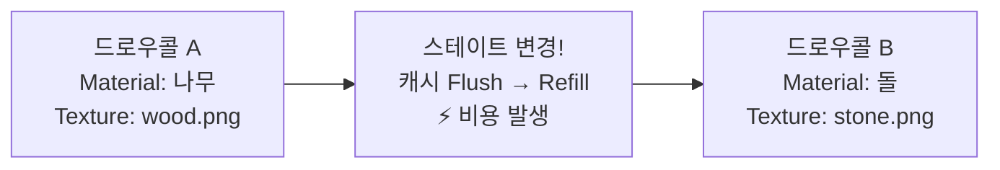
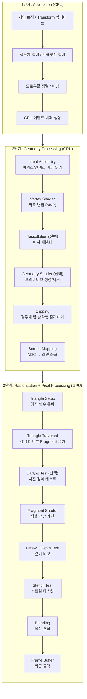
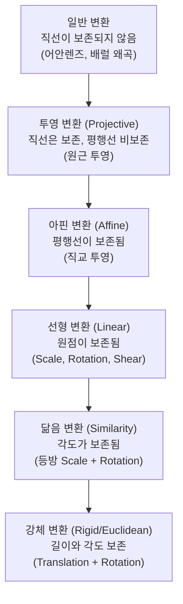
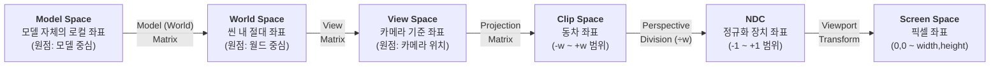
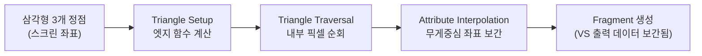
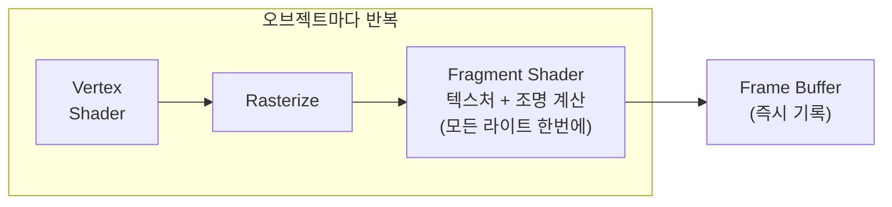
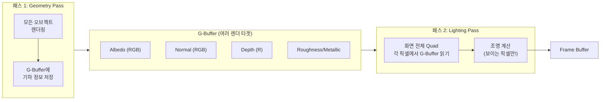
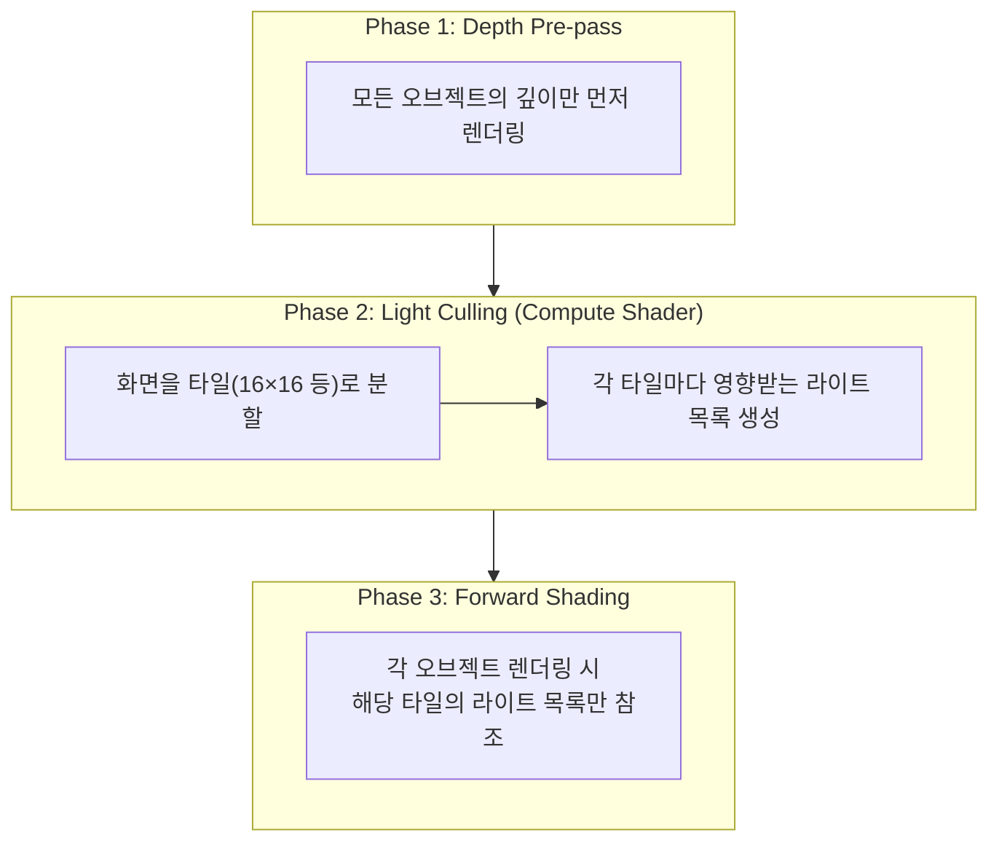

## 서론

[셰이더 프로그래밍](/posts/ShaderStudy001/) 포스트에서 "GPU에서 실행되는 프로그램"으로서의 셰이더를 다뤘다면, 이 포스트는 **그 셰이더가 실행되는 무대** 자체를 파고듭니다. 렌더 파이프라인은 3D 세계가 모니터의 2D 픽셀로 변환되는 전체 흐름입니다.

셰이더를 작성할 줄 아는 것과, 그 셰이더가 파이프라인의 어느 지점에서 왜 그런 방식으로 실행되는지를 아는 것은 다릅니다. 렌더 파이프라인을 이해하면 다음이 가능해집니다.

| 이해 수준 | 할 수 있는 것 |
| --- | --- |
| 파이프라인 흐름 | 드로우콜 병목이 CPU인지 GPU인지 진단 |
| 좌표 변환 | 노멀맵 뒤집힘, 그림자 깨짐 등 좌표계 버그 해결 |
| 래스터라이제이션 | 오버드로우, Z-fighting, 안티앨리어싱 문제 해결 |
| 렌더링 아키텍처 | Forward/Deferred 선택, 라이트 성능 최적화 |
| GPU 하드웨어 | 스테이트 변경 비용, 텍스처 캐시 최적화 |

이 포스트는 김성완 교수님의 "게임 엔진의 핵심 분석" 강의 내용을 바탕으로, 실무 관점의 보충 설명을 더해 구성했습니다.

---

## Part 1: GPU 하드웨어와 메모리

렌더 파이프라인을 제대로 이해하려면, 그것이 실행되는 하드웨어의 특성부터 알아야 합니다. GPU는 CPU와 근본적으로 다른 철학으로 설계된 프로세서입니다.

### 1. GPU 내부 구조

GPU 칩 내부에서 렌더링에 가장 직접적으로 영향을 미치는 것은 **메모리 계층 구조**입니다.

```
┌─────────────────────────────────────────────────────┐
│                     GPU 칩                          │
│                                                     │
│  ┌─────────┐ ┌─────────┐ ┌─────────┐              │
│  │ SM/CU 0 │ │ SM/CU 1 │ │ SM/CU N │   ...        │
│  │ ┌─────┐ │ │ ┌─────┐ │ │ ┌─────┐ │              │
│  │ │Reg  │ │ │ │Reg  │ │ │ │Reg  │ │  ← 레지스터  │
│  │ │File │ │ │ │File │ │ │ │File │ │    (가장 빠름)│
│  │ └─────┘ │ │ └─────┘ │ │ └─────┘ │              │
│  │ ┌─────┐ │ │ ┌─────┐ │ │ ┌─────┐ │              │
│  │ │ L1$ │ │ │ │ L1$ │ │ │ │ L1$ │ │  ← L1 캐시   │
│  │ └─────┘ │ │ └─────┘ │ │ └─────┘ │              │
│  └─────────┘ └─────────┘ └─────────┘              │
│         │            │           │                  │
│  ┌──────────────────────────────────┐              │
│  │           L2 Cache              │  ← L2 캐시    │
│  └──────────────────────────────────┘              │
│                    │                                │
│  ┌──────────────────────────────────┐              │
│  │      Fixed-Function Units       │              │
│  │  (래스터라이저, ROP, TMU 등)      │              │
│  └──────────────────────────────────┘              │
└────────────────────│────────────────────────────────┘
                     │
          ┌──────────────────────┐
          │    VRAM (비디오 메모리)  │  ← 가장 느림
          │  텍스처, 버퍼, G-Buffer │
          └──────────────────────┘
```

| 메모리 계층 | 용량 | 접근 속도 | 용도 |
| --- | --- | --- | --- |
| **레지스터** | ~256KB/SM | 1 사이클 | 셰이더 변수, 즉시 연산 |
| **Shared Memory (LDS)** | 32~128KB/SM | ~5 사이클 | 워크그룹 내 데이터 공유 |
| **L1 Cache** | 16~128KB/SM | ~20 사이클 | 텍스처 캐시, 명령어 캐시 |
| **L2 Cache** | 2~6MB | ~200 사이클 | 전역 메모리 접근 캐싱 |
| **VRAM** | 4~24GB | ~400+ 사이클 | 텍스처, 버텍스 버퍼, 렌더 타겟 |

### 1-1. 스테이트 변경의 비용

GPU 내부 캐시 메모리를 세팅하는 데 시간이 많이 걸립니다. **스테이트 변경(State Change)**이란 GPU의 렌더링 설정을 바꾸는 것을 말하며, 이때 내부 캐시를 비우고(flush) 다시 채워야(fill) 합니다.



| 스테이트 변경 종류 | 비용 | 설명 |
| --- | --- | --- |
| **셰이더 프로그램 변경** | 매우 높음 | GPU 파이프라인 전체 Flush |
| **렌더 타겟 변경** | 높음 | 프레임 버퍼 전환 |
| **텍스처 바인딩 변경** | 중간 | TMU(텍스처 매핑 유닛) 캐시 무효화 |
| **유니폼/상수 버퍼 변경** | 낮음 | 작은 데이터 전송 |
| **버텍스 버퍼 변경** | 중간 | 입력 어셈블러 재설정 |

**텍스처를 아틀라스화하여 큰 한 장에 모으는 이유**가 바로 이것입니다. 텍스처를 자주 바꾸면 GPU 캐시 메모리 내부를 계속 비우고 채워야 합니다. GPU는 텍스처 데이터를 캐시에 저장할 때 **지그재그 패턴(Z-order curve, Morton code)**으로 저장합니다. 이 패턴은 2D 공간에서 인접한 텍셀끼리 메모리 주소도 가깝도록 배치하여 캐시 적중률을 높입니다.

```
텍스처의 텍셀 배치 (메모리상 순서)

선형 배치 (비효율):          Z-order 배치 (GPU 실제 방식):
0  1  2  3                 0  1  4  5
4  5  6  7                 2  3  6  7
8  9  10 11                8  9  12 13
12 13 14 15                10 11 14 15

→ 인접 텍셀 접근 시          → 인접 텍셀이 메모리에서도 가까움
  메모리 주소가 크게 점프       → 캐시 적중률 높음
```

> **Q. 드로우콜(Draw Call)이 성능 병목이 되는 이유는?**
>
> 드로우콜 자체는 단순한 GPU 명령이지만, 매 드로우콜마다 CPU가 GPU에게 렌더링 상태(셰이더, 텍스처, 버퍼 등)를 설정해줘야 합니다. 이 **CPU → GPU 커맨드 전송** 과정이 병목입니다. 드로우콜을 줄이기 위해 **배칭(Batching)**, **인스턴싱(Instancing)**, **Indirect Draw** 등의 기법을 사용합니다. DirectX 12, Vulkan, Metal 같은 저수준 API는 이 오버헤드를 최소화하도록 설계되었습니다.
{: .prompt-info}

---

## Part 2: 렌더링 파이프라인의 전체 구조

### 2. 파이프라인 개요

3D 오브젝트가 화면의 픽셀이 되기까지, 크게 **세 단계**를 거칩니다.



| 단계 | 실행 위치 | 프로그래머 제어 | 핵심 역할 |
| --- | --- | --- | --- |
| Application | CPU | 완전 제어 | 씬 준비, 컬링, 드로우콜 |
| Geometry Processing | GPU | Vertex/Tessellation/Geometry Shader | 좌표 변환, 클리핑 |
| Rasterization | GPU | 고정 함수 (제어 불가) | 삼각형 → Fragment 변환 |
| Pixel Processing | GPU | Fragment Shader | 최종 색상 결정 |
| Output Merger | GPU | 설정으로 제어 (Blend Mode 등) | 깊이/스텐실 테스트, 블렌딩 |

---

### 2-1. Application Stage (CPU)

GPU에 드로우콜을 보내기 전, CPU에서 수행하는 준비 작업입니다.

#### 컬링 (Culling)

화면에 보이지 않는 오브젝트를 미리 걸러내 GPU 부하를 줄입니다.

```
카메라 절두체 (View Frustum)
                    Far Plane
              ┌───────────────────┐
             ╱│                   │╲
            ╱ │     보이는 영역     │ ╲
           ╱  │                   │  ╲
Near Plane╱   │    ● 오브젝트 A   │   ╲
 ┌───────┐    │    (렌더링!)       │    ╲
 │카메라  │    │                   │     ╲
 │ ◉────→│    │                   │      ╲
 └───────┘    └───────────────────┘
           ╲                           ╱
            ╲   ○ 오브젝트 B          ╱
             ╲  (컬링! GPU에 안 보냄) ╱
              ╲                     ╱
```

| 컬링 종류 | 수행 위치 | 방식 |
| --- | --- | --- |
| **절두체 컬링(Frustum Culling)** | CPU | 오브젝트 바운딩 볼륨이 절두체 안에 있는지 검사 |
| **오클루전 컬링(Occlusion Culling)** | CPU/GPU | 다른 오브젝트에 완전히 가려진 것을 제외 |
| **백페이스 컬링(Backface Culling)** | GPU | 카메라 반대쪽을 향하는 삼각형 제거 |
| **스몰 트라이앵글 컬링** | GPU | 화면에서 1픽셀 이하인 삼각형 제거 |

#### 드로우콜 정렬

스테이트 변경을 최소화하기 위해, 같은 머티리얼을 사용하는 오브젝트끼리 묶어서 그립니다.

```
정렬 전 (스테이트 변경 5회):
  Draw(셰이더A, 텍스처1) → Draw(셰이더B, 텍스처2) → Draw(셰이더A, 텍스처1)
  → Draw(셰이더B, 텍스처3) → Draw(셰이더A, 텍스처1)

정렬 후 (스테이트 변경 2회):
  Draw(셰이더A, 텍스처1) × 3  → Draw(셰이더B, 텍스처2) → Draw(셰이더B, 텍스처3)
```

---

## Part 3: 좌표계와 변환 파이프라인

이 파트는 렌더 파이프라인에서 가장 수학적이면서도 가장 중요한 부분입니다. 3D 오브젝트의 정점이 화면 픽셀로 변환되는 과정을 수학적으로 파고듭니다.

### 3. 좌표계의 종류

#### 왼손/오른손 좌표계

```
왼손 좌표계 (DirectX, Unity)        오른손 좌표계 (OpenGL)

      Y ↑                              Y ↑
      │                                │
      │                                │
      │                                │
      └──────→ X                       └──────→ X
     ╱                                ╱
    ╱                                ╱
   Z (화면 안쪽으로)                  Z (화면 밖으로)

※ 엄지(X), 검지(Y), 중지(Z) 순서로 손을 폈을 때
  왼손이면 왼손 좌표계, 오른손이면 오른손 좌표계
```

| 특성 | 왼손 좌표계 | 오른손 좌표계 |
| --- | --- | --- |
| **사용 엔진(월드)** | Unity(Y-up), Unreal(Z-up) | Godot(Y-up) |
| **Z축 방향** | 화면 안쪽이 +Z | 화면 밖이 +Z |
| **회전 양의 방향** | 반시계 방향 | 시계 방향 |
| **외적 결과** | 왼손 법칙 | 오른손 법칙 |
| **카메라 전방** | +Z (Unity), +X (Unreal) | -Z |

> **API 규약 vs 엔진 월드 좌표계는 별개입니다.** OpenGL은 전통적으로 오른손 좌표계 기반의 Clip Space를 사용하지만, Vulkan은 NDC에서 Y축이 아래 방향(+Y = 하단)이고 Z 범위가 [0, 1]로, OpenGL과 다릅니다. API가 정의하는 것은 **Clip Space/NDC 규약**이며, 엔진의 월드 좌표계 방향성(handedness)은 엔진이 별도로 결정합니다. 예를 들어 DirectX API 자체는 좌표계를 강제하지 않지만, DirectXMath 라이브러리가 왼손 좌표계 함수를 제공하는 관례가 있습니다.
{: .prompt-info}

**핵심**: 외적(Cross Product) 공식은 좌표계와 무관하게 동일합니다. 하지만 결과 벡터의 **방향**이 좌표계에 따라 반대입니다. 이것은 **Normal Vector 방향이 좌표계에 따라 뒤집어질 수 있다**는 것을 의미합니다. 셰이더를 엔진 간 이식할 때 노말맵이 뒤집혀 보이는 버그의 근본 원인이 여기에 있습니다.

#### 기타 좌표계

| 좌표계 | 용도 |
| --- | --- |
| **구면 좌표계(Spherical)** | BRDF(양방향 반사 분포 함수), 환경맵 매핑 |
| **구면 조화 함수(Spherical Harmonics)** | 간접광 근사, Light Probe |
| **원통 좌표계(Cylindrical)** | 파노라마 투영, 특수 UV 매핑 |
| **텍스처 좌표계(UV)** | 텍스처 매핑 (원점 위치가 API마다 다름!) |

**텍스처 좌표계의 원점 차이**가 실무에서 자주 문제를 일으킵니다.

```
OpenGL / Unity:              DirectX (텍스처 로드 시):
원점 = 왼쪽 아래             원점 = 왼쪽 위

(0,1) ──── (1,1)            (0,0) ──── (1,0)
  │          │                │          │
  │          │     ↕ 뒤집힘    │          │
  │          │                │          │
(0,0) ──── (1,0)            (0,1) ──── (1,1)
```

텍스처가 상하 반전되어 보이는 현상의 원인이 바로 이 좌표계 차이입니다. 단, Unity는 플랫폼별 차이를 내부에서 자동 보정하는 경우가 많습니다. `_MainTex_TexelSize.y`가 음수이면 텍스처가 뒤집힌 상태이며, 포스트 프로세싱이나 렌더 텍스처 사용 시 수동으로 UV를 뒤집어야 하는 경우가 있습니다.

---

### 3-1. 동차 좌표계와 아핀 변환

3D 그래픽스에서 **모든 변환을 행렬 곱셈 하나로 통일하기 위해** 동차 좌표계(Homogeneous Coordinates)를 사용합니다.

#### 문제: 변환 연산의 불일치

```
크기 변환 (Scale):  곱셈으로 표현  →  x' = s · x
회전 변환 (Rotation): 곱셈으로 표현  →  x' = R · x
이동 변환 (Translation): 덧셈으로 표현  →  x' = x + t  ← 문제!
```

이동 변환만 덧셈이라, 여러 변환을 합성할 때 행렬 곱셈 체인으로 묶을 수 없습니다.

#### 해결: 차원을 하나 올린다

2D 좌표 (x, y)를 3D 동차 좌표 (x, y, **1**)로, 3D 좌표 (x, y, z)를 4D 동차 좌표 (x, y, z, **1**)로 확장합니다.

$$
\text{2D 이동 변환:} \quad
\begin{bmatrix} x' \\ y' \\ 1 \end{bmatrix} =
\begin{bmatrix} 1 & 0 & t_x \\ 0 & 1 & t_y \\ 0 & 0 & 1 \end{bmatrix}
\begin{bmatrix} x \\ y \\ 1 \end{bmatrix}
$$

이제 이동도 행렬 곱셈으로 표현됩니다! 이것이 **아핀 변환(Affine Transformation)**입니다.

$$
x' = ax + by + c \quad \text{(선형 변환 + 상수항)}
$$

$$
y' = dx + ey + f
$$

#### 변환의 분류 체계



| 변환 | 보존하는 것 | 4x4 행렬 특성 | 게임에서의 예 |
| --- | --- | --- | --- |
| **강체(Rigid)** | 길이, 각도 | 직교 회전 + 이동 | Transform의 Position/Rotation |
| **닮음(Similarity)** | 각도 | 등방 스케일링 추가 | 균일 Scale |
| **아핀(Affine)** | 평행선 | 1차 다항식 | 비균일 Scale, Shear, 직교 투영 |
| **투영(Projective)** | 직선 | 4행이 (0,0,0,1) 아님 | 원근 투영 (Perspective) |
| **일반(General)** | 없음 | 비선형 | VR 배럴 왜곡, 어안 렌즈 |

#### 회전 행렬의 특별한 성질

회전 행렬 $R$은 **직교 행렬(Orthogonal Matrix)**입니다. 즉:

$$
R^{-1} = R^{T}
$$

역행렬과 전치행렬이 같다는 것은, **역회전을 구할 때 비싼 역행렬 계산 없이 단순히 전치(Transpose)만 하면 된다**는 뜻입니다. 또한 반대 방향으로의 회전은 각도에 $-$를 씌우는 것과 같습니다.

$$
R(-\theta) = R(\theta)^{-1} = R(\theta)^{T}
$$

이 세 가지가 모두 같은 결과를 냅니다.

---

### 3-2. 변환 파이프라인 (Transform Pipeline)

3D 정점이 화면 픽셀이 되기까지의 좌표 변환 순서입니다.



#### 월드 변환 (Model Matrix)

SRT 순서가 표준입니다: **Scale → Rotation → Translation**

$$
M_{world} = T \cdot R \cdot S
$$

```
※ 행렬 곱의 순서 주의!

DirectX (행 벡터, Row-major):
  v' = v × S × R × T    ← 변환 순서와 곱셈 순서가 동일

OpenGL (열 벡터, Column-major):
  v' = T × R × S × v    ← 변환 순서와 곱셈 순서가 역순!
```

이 차이의 핵심 원인은 메모리 배치(Row-major/Column-major)가 아니라, **벡터를 행렬의 어느 쪽에서 곱하는지**(행벡터 규약 vs 열벡터 규약)에 있습니다. DirectX/HLSL은 행벡터(row vector)를 왼쪽에 놓고(`v × M`), OpenGL/GLSL은 열벡터(column vector)를 오른쪽에 놓습니다(`M × v`). 행벡터 규약에서는 변환 순서와 곱셈 순서가 같고, 열벡터 규약에서는 역순이 됩니다. 메모리 배치(row/column-major)는 같은 행렬을 메모리에 저장하는 방식의 차이이며, 곱셈 순서와는 독립적인 개념입니다.

#### 변환 순서의 중요성

행렬 곱은 **교환 법칙이 성립하지 않습니다.**

```
1. 90도 회전 → X축 이동          2. X축 이동 → 90도 회전

    ●                                ●
    │                                │
    │  회전                           │  이동
    ▼                                ▼
    ●→→→→ ●                    ●→→→→ ●
           이동                            │
                                          │  회전
                                          ▼
                                          ●

→ 완전히 다른 결과!
```

#### 뷰 변환 (View Matrix)

카메라 변환은 **카메라의 월드 변환의 역변환**입니다. 카메라를 원점으로 옮기는 것은, 세계 전체를 카메라 반대 방향으로 옮기는 것과 같습니다.

$$
V = (R \cdot T)^{-1} = T^{-1} \cdot R^{-1} = T^{-1} \cdot R^{T}
$$

회전 행렬의 역행렬이 전치행렬과 같다는 성질을 활용하여, 비싼 역행렬 연산 없이 계산할 수 있습니다.

#### 오일러 각과 짐벌락

회전을 표현할 때 세 축의 회전각으로 나타내는 것이 **오일러 각(Euler Angles)**입니다.

| 축 | 이름 | 설명 |
| --- | --- | --- |
| X축 | **Pitch** | 고개 끄덕임 (위아래) |
| Y축 | **Yaw** | 고개 좌우 흔들기 |
| Z축 | **Roll** | 고개 기울이기 |

**Unity의 회전 적용 순서**: Z → X → Y (카메라의 짐벌락을 피하기 좋은 순서)

**짐벌락(Gimbal Lock)** 문제: 오일러 각으로 회전할 때, 두 축이 겹치면 한 축의 자유도를 잃는 현상입니다.

```
정상 상태 (3자유도):        짐벌락 (2자유도):
    ┌─── Y축 짐벌 ───┐         ┌─── Y축 짐벌 ───┐
    │  ┌─ X축 짐벌 ─┐ │         │                 │
    │  │ ┌─ Z축 ─┐  │ │   X축을  │  ┌─ X+Z 축 ─┐  │
    │  │ │  ●    │  │ │   90도  │  │   ●       │  │
    │  │ └───────┘  │ │   회전  │  └───────────┘  │
    │  └────────────┘ │   →    │                 │
    └─────────────────┘         └─────────────────┘
                               X축과 Z축이 같은 평면에!
                               → 하나의 회전축을 잃음
```

이것이 **쿼터니언(Quaternion)**이 필요한 이유입니다. 2D에서 복소수로 회전을 표현하듯, 3D에서는 쿼터니언으로 회전을 표현하면 짐벌락 없이 부드러운 보간(Slerp)이 가능합니다.

---

### 3-3. 투영 변환 (Projection)

투영 변환은 파이프라인에서 **가장 수학적으로 복잡한 부분**입니다.

#### 직교 투영 vs 원근 투영

```
직교 투영 (Orthographic)         원근 투영 (Perspective)

  ┌─────────┐  Far              ╲           ╱  Far
  │         │                    ╲         ╱
  │         │                     ╲       ╱
  │  보이는  │                     ╲ 보이는╱
  │  영역    │                      ╲영역 ╱
  │         │                       ╲   ╱
  │         │                        ╲ ╱
  └─────────┘  Near             ◉ Near  ← 카메라

  → 크기 일정                    → 가까운 것이 크게
  → 평행선 보존                  → 평행선 소실점에서 수렴
```

| 특성 | 직교 투영 | 원근 투영 |
| --- | --- | --- |
| **변환 종류** | 아핀 변환 | 투영 변환 |
| **평행선** | 보존 | 보존 안 됨 (소실점) |
| **크기** | 거리와 무관 | 거리에 반비례 |
| **용도** | 2D 게임, UI, 건축 뷰 | 3D 게임, 현실 시점 |

#### 원근 투영의 핵심: w 나누기

뷰 절두체(View Frustum)를 NDC(Normalized Device Coordinates)의 정육면체 공간으로 변환해야 합니다.

```
뷰 절두체 (Frustum)            NDC Cube

     Far Plane                 ┌────────┐ (+1,+1,+1)
  ┌─────────────┐              │        │
  │             │              │        │
  │             │     →→→      │        │
  │             │   투영 변환   │        │
  ╲           ╱               │        │
   ╲         ╱                └────────┘ (-1,-1,-1)
    ╲  Near ╱                   or (0 ~ 1) for DirectX
     └─────┘
      카메라
```

원근 투영 행렬을 적용하면 **Clip Space** 좌표가 됩니다. 여기서 핵심은 w 성분에 원래의 z값(깊이)이 들어간다는 것입니다.

$$
\begin{bmatrix} x_{clip} \\ y_{clip} \\ z_{clip} \\ w_{clip} \end{bmatrix}
= P \cdot
\begin{bmatrix} x_{view} \\ y_{view} \\ z_{view} \\ 1 \end{bmatrix}
\quad \text{where } w_{clip} = \pm z_{view} \text{ (부호는 좌표계 규약에 따라 다름)}
$$

> **$w_{clip}$의 부호**: 왼손 좌표계(DirectX, Unity)에서 카메라가 +Z를 바라보면 $w_{clip} = z_{view}$이고, 오른손 좌표계(OpenGL)에서 카메라가 -Z를 바라보면 $w_{clip} = -z_{view}$가 됩니다. 중요한 것은 $w_{clip}$이 **양수인 뷰 거리(depth)에 비례**한다는 점입니다.
{: .prompt-info}

**Perspective Division(원근 나누기)**에서 모든 성분을 w로 나눕니다.

$$
\begin{bmatrix} x_{ndc} \\ y_{ndc} \\ z_{ndc} \end{bmatrix}
=
\begin{bmatrix} x_{clip} / w_{clip} \\ y_{clip} / w_{clip} \\ z_{clip} / w_{clip} \end{bmatrix}
$$

$w_{clip}$은 뷰 공간에서의 거리에 비례하므로, **멀리 있을수록 나누는 값이 커져서 화면 좌표가 작아집니다.** 이것이 원근감의 수학적 원리입니다.

#### NDC 범위의 API별 차이

| API | X, Y 범위 | Z 범위 |
| --- | --- | --- |
| OpenGL | -1 ~ +1 | -1 ~ +1 |
| DirectX | -1 ~ +1 | 0 ~ +1 |
| Vulkan | -1 ~ +1 | 0 ~ +1 |
| Metal | -1 ~ +1 | 0 ~ +1 |

> **Z 버퍼의 깊이 정밀도 문제**
>
> 원근 투영 후 z값은 **비선형 분포**를 가집니다. 가까운 곳에 정밀도가 집중되고 먼 곳은 정밀도가 부족합니다. Near 0.1, Far 1000인 경우, 전체 z-buffer 정밀도의 약 90%가 카메라에서 10 유닛 이내에 소비됩니다. 이것이 **Z-fighting**(먼 거리의 두 표면이 깜빡이며 겹치는 현상)의 원인입니다. 해결책으로 **Reversed-Z** (Far=0, Near=1로 뒤집기)를 사용하면, 부동소수점의 지수 분포와 투영의 비선형성이 상쇄되어 **원거리 정밀도가 크게 개선**됩니다. 완전히 균등해지는 것은 아니지만, 기존 방식 대비 먼 거리에서의 Z-fighting이 극적으로 줄어듭니다. Unity HDRP와 UE5는 기본으로 Reversed-Z를 사용합니다.
{: .prompt-warning}

---

### 3-4. Normal 벡터의 변환

좌표 점(Point)과 방향 벡터(Direction)는 **다른 변환이 필요합니다.** 특히 Normal 벡터는 주의가 필요합니다.

등방(Uniform) 스케일링에서는 문제가 없지만, **비등방(Non-uniform) 스케일링**에서 Normal 벡터에 Model 행렬을 그대로 적용하면 표면에 수직하지 않게 됩니다.

```
등방 스케일 (S=2,2):          비등방 스케일 (Sx=2, Sy=1):

      N                           N (원래)    N' (잘못된)
      ↑                           ↑          ↗
  ┌───┼───┐                   ┌───┼───────────┐
  │   │   │   → Scale ×2 →   │   │            │
  └───┴───┘                   └───┴────────────┘

  N 방향 OK!                  N이 더 이상 표면에 수직하지 않음!
```

**해결법**: Normal 벡터에는 Model 행렬의 **역전치 행렬(Inverse Transpose)**을 적용해야 합니다.

$$
N' = (M^{-1})^{T} \cdot N
$$

**증명**: 두 벡터가 수직이면 내적이 0입니다. 접선 벡터 $T$와 법선 벡터 $N$이 수직인 관계 $T \cdot N = 0$을 변환 후에도 유지하려면:

$$
T'^{T} \cdot N' = (M \cdot T)^{T} \cdot (G \cdot N) = T^{T} \cdot M^{T} \cdot G \cdot N = 0
$$

$T^{T} \cdot N = 0$이므로, $M^{T} \cdot G = I$일 때 성립합니다. 따라서 $G = (M^{T})^{-1} = (M^{-1})^{T}$입니다.

---

## Part 4: 래스터라이제이션 심화

래스터라이제이션은 GPU의 **고정 함수(Fixed-Function)** 하드웨어에서 처리됩니다. 프로그래밍할 수는 없지만, 그 동작을 이해하는 것이 최적화에 필수입니다.

### 4. 래스터라이저가 하는 일



#### 엣지 함수와 삼각형 내부 판단

삼각형의 세 변을 **엣지 함수(Edge Function)**로 정의합니다. 한 점이 세 엣지 함수의 부호가 모두 같으면 삼각형 내부에 있습니다.

$$
E_{01}(P) = (P_x - V_0.x)(V_1.y - V_0.y) - (P_y - V_0.y)(V_1.x - V_0.x)
$$

```
      V2
     ╱  ╲
    ╱ +  ╲        E01(P) > 0  ✓
   ╱  +   ╲       E12(P) > 0  ✓
  ╱  + P +  ╲     E20(P) > 0  ✓
 ╱ +   +   + ╲    → P는 삼각형 내부!
V0 ──────────── V1
```

#### 무게중심 좌표 보간 (Barycentric Interpolation)

삼각형 내부의 각 픽셀에서, Vertex Shader가 출력한 데이터(UV, Normal, Color 등)를 세 정점의 값으로부터 보간합니다.

$$
\text{Attr}(P) = \alpha \cdot \text{Attr}(V_0) + \beta \cdot \text{Attr}(V_1) + \gamma \cdot \text{Attr}(V_2)
$$

$$
\alpha + \beta + \gamma = 1
$$

여기서 $\alpha$, $\beta$, $\gamma$는 삼각형 내에서 해당 점이 각 정점에 얼마나 가까운지를 나타내는 가중치입니다.

#### Perspective-Correct Interpolation

원근 투영 후의 보간에는 **원근 보정(Perspective Correction)**이 필수입니다. 스크린 공간에서 단순 선형 보간을 하면 텍스처가 왜곡됩니다.

```
보정 없음 (Affine):              보정 적용 (Perspective-Correct):

  ┌──────────────┐              ┌──────────────┐
  │ ╲  ╲  ╲  ╲  │              │╲  ╲   ╲    ╲ │
  │  ╲  ╲  ╲  ╲ │              │ ╲  ╲   ╲    ╲│
  │   ╲  ╲  ╲  ╲│              │  ╲  ╲    ╲   │
  │    ╲  ╲  ╲  │              │   ╲   ╲    ╲ │
  └──────────────┘              └──────────────┘
  텍스처 줄이 균등 간격          원근에 따라 간격 변화
  (PS1 시대 그래픽)              (현대 하드웨어 기본)
```

보정된 보간 공식:

$$
\frac{\text{Attr}}{w} = \alpha \cdot \frac{\text{Attr}(V_0)}{w_0} + \beta \cdot \frac{\text{Attr}(V_1)}{w_1} + \gamma \cdot \frac{\text{Attr}(V_2)}{w_2}
$$

$$
\frac{1}{w} = \alpha \cdot \frac{1}{w_0} + \beta \cdot \frac{1}{w_1} + \gamma \cdot \frac{1}{w_2}
$$

최종 속성값은 $\text{Attr} = \frac{\text{Attr}/w}{1/w}$로 구합니다.

> **초기 PlayStation(PS1)에서 텍스처가 흔들리며 왜곡되어 보이는 이유**가 바로 이 보정이 없었기 때문입니다. PS1의 GTE(Geometry Transform Engine)는 하드웨어 한계로 원근 보정을 지원하지 않았습니다.
{: .prompt-info}

---

### 4-1. Z-Buffering과 깊이 테스트

**Z-Buffer(Depth Buffer)**는 화면의 각 픽셀 위치에 현재까지 그려진 가장 가까운 표면의 깊이값을 저장합니다.

```
Z-Buffer 동작:

Fragment A (z=0.3) 도착 → Z-Buffer[x,y] = 1.0 (초기값)
  0.3 < 1.0 → 통과! Z-Buffer[x,y] = 0.3으로 갱신, Color Buffer에 A색 기록

Fragment B (z=0.5) 도착 → Z-Buffer[x,y] = 0.3
  0.5 > 0.3 → 탈락! (A보다 뒤에 있으므로 폐기)

Fragment C (z=0.1) 도착 → Z-Buffer[x,y] = 0.3
  0.1 < 0.3 → 통과! Z-Buffer[x,y] = 0.1으로 갱신, Color Buffer에 C색 기록
```

| Z-Buffer 비트 수 | 정밀도 | 일반적 사용 |
| --- | --- | --- |
| 16-bit | 65,536 단계 | 모바일 (메모리 절약) |
| 24-bit | 16,777,216 단계 | 대부분의 게임 (표준) |
| 32-bit float | 극고정밀 | 넓은 월드, Reversed-Z |

#### Z-Fighting 현상

두 표면이 Z-Buffer 정밀도 내에서 구분 불가능할 만큼 가까이 있으면 프레임마다 승자가 바뀌어 깜빡이는 현상이 발생합니다.

```
Z-fighting 발생:
  표면 A: z = 0.500001
  표면 B: z = 0.500002
  → Z-Buffer 정밀도로 구분 불가 → 프레임마다 A/B가 번갈아 보임

해결 방법:
1. Near/Far 비율 줄이기 (Near를 가능한 크게)
2. Polygon Offset (glPolygonOffset / Depth Bias)
3. Reversed-Z 사용 (먼 거리 정밀도 개선)
4. 로그 깊이 버퍼 (Logarithmic Depth Buffer)
```

---

### 4-2. 안티앨리어싱 (Anti-Aliasing)

래스터라이제이션은 연속적인 삼각형을 이산적인 픽셀 격자에 매핑하므로, 필연적으로 **계단 현상(Aliasing)**이 발생합니다.

| 기법 | 원리 | 장점 | 단점 |
| --- | --- | --- | --- |
| **MSAA** | 픽셀당 여러 샘플 포인트로 가장자리 감지 | 높은 품질, 삼각형 경계에 효과적 | 메모리/대역폭 비용 높음, Deferred와 비호환 |
| **FXAA** | 후처리로 경계 감지 후 블러 | 빠르고 가벼움 | 텍스처가 약간 흐려짐 |
| **TAA** | 프레임 간 서브픽셀 지터 + 히스토리 블렌딩 | 시간적 안정성, 셰이더 앨리어싱도 해결 | 고스팅(잔상), 모션 흐림 |
| **DLSS/FSR** | AI 업스케일링 | 저해상도에서 고해상도 품질 | 전용 하드웨어/알고리즘 필요 |

**MSAA(Multi-Sample Anti-Aliasing)**의 동작:

```
MSAA 없음 (1x):              MSAA 4x:

  ┌─┬─┬─┬─┐                  ┌─┬─┬─┬─┐
  │○│○│○│ │                  │◉│◑│◔│ │  ← 가장자리 픽셀은
  ├─┼─┼─┼─┤                  ├─┼─┼─┼─┤    부분적으로 커버
  │○│○│ │ │                  │◉│◉│◔│ │    → 중간 색상
  ├─┼─┼─┤ │                  ├─┼─┼─┤ │
  │○│ │ │ │                  │◑│◔│ │ │
  └─┴─┴─┴─┘                  └─┴─┴─┴─┘
  계단이 선명              가장자리가 부드러움

  ○ = 완전 커버             ◉ = 4/4 커버 (100%)
                            ◑ = 2/4 커버 (50% 블렌드)
                            ◔ = 1/4 커버 (25% 블렌드)
```

---

## Part 5: 렌더링 아키텍처

같은 파이프라인이라도 **조명 계산을 언제, 어떻게 수행하느냐**에 따라 렌더링 아키텍처가 달라집니다. 이것은 게임 프로젝트의 성능 특성을 결정짓는 핵심 선택입니다.

### 5. Forward Rendering

가장 오래된 기본적인 방식입니다. 각 오브젝트를 그리면서 **동시에** 조명 계산을 수행합니다.



```
Forward 렌더링의 문제점 — 오버드로우:

Fragment Shader 실행 횟수 = 오브젝트 수 × 라이트 수 × 겹치는 픽셀 수

예: 화면 중앙에 오브젝트 3개가 겹침 (라이트 4개)
  → 같은 픽셀에서 Fragment Shader가 3 × 4 = 12번 실행!
  → 앞에 있는 1개만 보이는데, 뒤의 2개도 완전히 계산됨 → 낭비
```

| 장점 | 단점 |
| --- | --- |
| 구현이 단순하고 직관적 | 라이트가 많으면 성능 급감 (O(objects × lights)) |
| 반투명 오브젝트 처리 자연스러움 | 오버드로우 시 모든 셰이딩을 낭비 |
| MSAA 지원 | 라이트 수 제한이 현실적으로 필요 |
| 메모리 사용량 적음 | |
| VR에서 필수 (양안 렌더링) | |

---

### 5-1. Deferred Rendering (지연 렌더링)

**핵심 아이디어**: 셰이딩(조명 계산)을 나중으로 미룬다. 먼저 기하 정보만 **G-Buffer**에 저장하고, 마지막에 **화면에 보이는 픽셀만** 조명 계산을 수행합니다.



```
G-Buffer 구성 예시 (4개 렌더 타겟):

RT0 (Albedo + Alpha):     RT1 (Normal):
┌──────────────────┐      ┌──────────────────┐
│ R │ G │ B │ A    │      │ Nx │ Ny │ Nz │ - │
│ 표면 기본 색상     │      │ 월드 법선 벡터    │
└──────────────────┘      └──────────────────┘

RT2 (Motion + Specular):   Depth Buffer:
┌──────────────────┐      ┌──────────────────┐
│ Mx │ My │ Spec │ │      │    Depth (24bit) │
│ 모션벡터  │ 스페큘러│      │    깊이값         │
└──────────────────┘      └──────────────────┘
```

**왜 빠른가?**

```
Forward: 모든 Fragment에 대해 조명 계산 (보이지 않는 것 포함)
  픽셀 X에 오브젝트 3개 겹침 → 조명 계산 3번

Deferred: 최종적으로 보이는 Fragment에 대해서만 조명 계산
  픽셀 X에 오브젝트 3개 겹침 → G-Buffer에 가장 앞의 것만 남음
  → 조명 계산 1번!
```

| 장점 | 단점 |
| --- | --- |
| 라이트 수에 강건함 (O(pixels × lights)) | G-Buffer로 인한 높은 메모리 사용 |
| 보이는 픽셀만 셰이딩 → 효율적 | 반투명 오브젝트 처리 불가 (별도 Forward Pass 필요) |
| 라이트 볼륨으로 라이트 컬링 가능 | MSAA 비호환 (TAA로 대체) |
| | 해상도가 높으면 G-Buffer 대역폭 병목 |
| | 모바일에서는 메모리/대역폭 제약으로 사용 어려움 |

> **반투명이 안 되는 이유**: G-Buffer는 한 픽셀에 하나의 기하 정보만 저장합니다. 반투명 오브젝트는 뒤에 있는 오브젝트의 정보도 필요한데, G-Buffer에는 앞의 것만 남아있습니다. 그래서 Deferred 엔진들은 불투명은 Deferred로, 반투명은 Forward로 처리하는 하이브리드 방식을 사용합니다.
{: .prompt-info}

---

### 5-2. Forward+ (Tiled Forward) Rendering

Forward와 Deferred의 장점을 합친 **가장 최신 접근법**입니다.



```
Light Heatmap (라이트 밀도 시각화):

  ┌────┬────┬────┬────┐
  │ 2  │ 3  │ 5  │ 2  │  ← 각 타일에 영향받는 라이트 수
  ├────┼────┼────┼────┤
  │ 1  │ 8  │ 12 │ 4  │  ← 가운데 타일에 라이트 집중
  ├────┼────┼────┼────┤
  │ 1  │ 6  │ 9  │ 3  │
  ├────┼────┼────┼────┤
  │ 0  │ 2  │ 3  │ 1  │
  └────┴────┴────┴────┘

→ 각 타일은 자기 영역에 영향 주는 라이트만 계산
→ 라이트 12개인 타일은 12개만, 0개인 타일은 0개
```

| Forward+ | Forward | Deferred |
| --- | --- | --- |
| 라이트 수에 강건 | 라이트 수에 약함 | 라이트 수에 강건 |
| 반투명 지원 | 반투명 지원 | 반투명 미지원 |
| MSAA 지원 | MSAA 지원 | MSAA 미지원 |
| G-Buffer 불필요 | G-Buffer 불필요 | G-Buffer 필요 |
| Compute Shader 필요 | 추가 패스 불필요 | 추가 Geometry Pass 필요 |

---

### 5-3. TBDR: Tile-Based Deferred Rendering

**모바일 GPU**(ARM Mali, Qualcomm Adreno, Apple GPU)에서 사용하는 하드웨어 수준의 렌더링 방식입니다. 소프트웨어의 Deferred Rendering과는 다릅니다.

```
기존 GPU (IMR: Immediate Mode Rendering):
  삼각형 하나씩 처리 → VRAM에 즉시 기록
  → 메모리 대역폭 사용 높음

모바일 GPU (TBDR):
  ┌────┬────┬────┬────┐
  │ T0 │ T1 │ T2 │ T3 │  ← 화면을 타일(보통 16×16 ~ 32×32)로 분할
  ├────┼────┼────┼────┤
  │ T4 │ T5 │ T6 │ T7 │
  ├────┼────┼────┼────┤
  │ T8 │ T9 │T10 │T11 │
  └────┴────┴────┴────┘

  각 타일을 GPU 칩 내부의 On-chip Memory에서 처리
  → 타일 처리 완료 후에만 VRAM에 기록
  → 메모리 대역폭 대폭 절감 → 전력 소비 감소
```

| 특성 | IMR (데스크톱 GPU) | TBDR (모바일 GPU) |
| --- | --- | --- |
| 렌더링 단위 | 삼각형 단위 | 타일 단위 |
| 메모리 접근 | 매 Fragment마다 VRAM | 타일 완료 시에만 VRAM |
| 대역폭 | 높음 | 낮음 |
| 전력 소비 | 높음 | 낮음 |
| Hidden Surface Removal | Early-Z | 하드웨어 HSR (더 효율적) |

> **모바일 최적화 시 TBDR을 반드시 고려해야 합니다.** TBDR에서 렌더 타겟을 전환하면 현재 타일을 VRAM에 flush하고 새 렌더 타겟의 데이터를 다시 로드해야 합니다. 이것이 모바일에서 렌더 패스를 줄여야 하는 근본적인 이유입니다. Unity URP의 "Single Pass" 렌더링은 이 점을 고려한 설계입니다.
{: .prompt-warning}

---

## Part 6: 빛의 물리와 재질

렌더링 파이프라인이 최종적으로 계산하는 것은 **"이 픽셀에 빛이 얼마나, 어떤 색으로 도달하는가"**입니다. 빛의 물리적 성질을 이해하면 PBR 셰이더의 파라미터들이 왜 그렇게 설계되었는지 납득할 수 있습니다.

### 6. 빛의 성질

빛은 **파동**이자 **입자**입니다(파동-입자 이중성). 렌더링에서 두 가지 성질을 모두 활용합니다.

| 성질 | 물리 현상 | 렌더링에서의 활용 |
| --- | --- | --- |
| **반사(Reflection)** | 입사각 = 반사각 | Specular, 환경맵 반사 |
| **굴절(Refraction)** | 매질 경계에서 빛의 방향 변화 | 유리, 물, 다이아몬드 |
| **흡수(Absorption)** | 에너지 → 열 | 표면의 고유 색상, 반투명 감쇄 |
| **산란(Scattering)** | 입자에 부딪혀 퍼짐 | SSS(피부), 하늘색, 안개 |
| **간섭(Interference)** | 파동의 보강/상쇄 | 비누막 무지개, 무반사 코팅 |
| **회절(Diffraction)** | 장애물 뒤로 돌아감 | 렌더링에서는 거의 무시 |

#### 에너지 보존 법칙

빛이 표면에 닿으면 반사, 흡수, 투과(굴절)의 에너지 합은 입사 에너지를 넘을 수 없습니다.

$$
E_{reflected} + E_{absorbed} + E_{transmitted} = E_{incident}
$$

고전적 Phong 모델은 이 법칙을 무시하고 Diffuse + Specular + Ambient를 단순히 더했지만, **PBR(물리 기반 렌더링)은 이 법칙을 엄격히 준수합니다.** Metallic이 1이면 Diffuse가 0이 되는 이유가 바로 이것입니다. 금속은 빛 에너지를 Specular 반사로 거의 전부 소비하므로, Diffuse에 할당할 에너지가 없습니다.

---

### 6-1. 프레넬 효과 (Fresnel Effect)

**시선 각도에 따라 반사율이 달라지는** 현상입니다. 일상에서 쉽게 관찰할 수 있습니다.

```
호수를 바라볼 때:

위에서 내려다봄 (수직):        멀리 수평으로 봄 (비스듬):
     눈                           눈
     ↓                            ╲
     ↓                             ╲
  ~~~~~~~~~~~                 ~~~~~~~~~~~~~~
  물 속이 잘 보임               하늘이 반사되어 보임
  (반사율 낮음, ~2%)            (반사율 높음, ~100%)
```

#### 프레넬 방정식과 Schlick 근사

정확한 프레넬 방정식은 복잡하지만, 실시간 렌더링에서는 **Schlick 근사**를 사용합니다.

$$
F(\theta) = F_0 + (1 - F_0)(1 - \cos\theta)^5
$$

여기서 $F_0$는 수직 입사(0도) 시의 반사율이고, $\theta$는 시선과 표면 법선의 각도입니다.

| 재질 | $F_0$ 값 | 특성 |
| --- | --- | --- |
| 물 | 0.02 | 거의 투명, 비스듬히 보면 반사 |
| 유리 | 0.04 | 비금속 기본값 |
| 플라스틱 | 0.04 | 대부분의 비금속과 비슷 |
| 금 | (1.0, 0.71, 0.29) | 색이 있는 반사! |
| 은 | (0.95, 0.93, 0.88) | 거의 흰색 반사 |
| 구리 | (0.95, 0.64, 0.54) | 주황빛 반사 |

**금속의 Specular 반사가 색이 있는 이유**: 금속은 자유 전자가 특정 파장의 빛을 선택적으로 흡수하고, 나머지를 반사합니다. 금이 노란색으로 빛나는 것은 청색 파장을 흡수하기 때문입니다.

#### 스넬의 법칙 (굴절)

$$
n_1 \sin\theta_1 = n_2 \sin\theta_2
$$

```
입사광         반사광
  ╲    θ₁  ╱
   ╲   │  ╱
    ╲  │ ╱
─────╲─│╱─────── 매질 경계 (공기 → 물)
      ╲│╱
       │╲
       │ ╲  θ₂
       │  ╲
       굴절광
```

| 매질 | 굴절률 (n) |
| --- | --- |
| 진공 | 1.0 |
| 공기 | 1.003 |
| 물 | 1.33 |
| 유리 | 1.5 |
| 다이아몬드 | 2.42 |

빛이 굴절할 때 **파장에 따라 굴절률이 다릅니다(분산)**. 이것이 프리즘에서 무지개가 나타나는 원리입니다.

---

### 6-2. BRDF (양방향 반사 분포 함수)

**BRDF(Bidirectional Reflectance Distribution Function)**는 "특정 방향에서 들어온 빛이, 다른 특정 방향으로 얼마나 반사되는가"를 정의하는 함수입니다. PBR의 수학적 토대입니다.

$$
f_r(\omega_i, \omega_o) = \frac{dL_o(\omega_o)}{dE_i(\omega_i)}
$$

- $\omega_i$: 입사광 방향
- $\omega_o$: 반사광(시선) 방향
- $L_o$: 반사 방사휘도(Radiance)
- $E_i$: 입사 조도(Irradiance)

#### 미세면 이론 (Microfacet Theory)

PBR에서 표면은 미시적으로 수많은 **미세면(Microfacet)**으로 구성되어 있다고 가정합니다. 각 미세면은 완벽한 거울이고, 그 방향(법선)이 랜덤하게 분포합니다.

```
거친 표면 (Roughness 높음):          매끈한 표면 (Roughness 낮음):

    ↗  ↑  ↖  ↗  ↑                    ↑  ↑  ↑  ↑  ↑
  ╱╲╱╲╱╲╱╲╱╲╱╲╱╲╱╲               ───────────────────
  미세면 방향이 제각각               미세면 방향이 거의 동일
  → 빛이 여러 방향으로 흩어짐        → 빛이 한 방향으로 집중 반사
  → 넓고 흐릿한 하이라이트           → 날카롭고 밝은 하이라이트
```

Cook-Torrance BRDF (PBR Specular):

$$
f_{spec} = \frac{D(\vec{h}) \cdot F(\vec{v}, \vec{h}) \cdot G(\vec{l}, \vec{v}, \vec{h})}{4 \cdot (\vec{n} \cdot \vec{l}) \cdot (\vec{n} \cdot \vec{v})}
$$

| 항 | 이름 | 물리적 의미 |
| --- | --- | --- |
| **D** (NDF) | Normal Distribution Function | 미세면 법선이 Half 벡터 방향인 비율. Roughness가 클수록 분포가 넓음 |
| **F** (Fresnel) | Fresnel Term | 시선 각도에 따른 반사율 변화 |
| **G** (Geometry) | Geometry/Shadow-Masking | 미세면끼리 서로 가리거나 그림자 지는 비율 |

**GGX(Trowbridge-Reitz)**가 D 항의 업계 표준인 이유: 기존 Beckmann이나 Phong NDF 대비 **꼬리가 긴(long tail)** 분포를 가져, 하이라이트 주변에 자연스러운 글로우가 생깁니다. 이것이 현실에서 관찰되는 하이라이트 패턴과 더 잘 일치합니다.

---

### 6-3. 산란과 대기 효과

빛이 공기 중의 입자에 부딪혀 퍼지는 현상이 **산란(Scattering)**입니다.

| 산란 종류 | 입자 크기 vs 파장 | 특성 | 현상 |
| --- | --- | --- | --- |
| **레일리 산란(Rayleigh)** | 입자 << 파장 | 짧은 파장(파란색)이 더 많이 산란 | 파란 하늘, 붉은 노을 |
| **미 산란(Mie)** | 입자 ≈ 파장 | 모든 파장 비슷하게 산란 | 흰 구름, 안개 |

```
파란 하늘의 원리 (레일리 산란):

  태양 ────→ [대기 중 공기 분자] ────→ 눈
                   │
                   │ 파란빛이 더 많이
                   │ 산란됨
                   ↓
               사방으로 퍼진 파란빛
               → 하늘이 파랗게 보임

  일몰/일출:
  태양 ─────────────────────→ 긴 경로 ──→ 눈
                                        파란빛은 이미 다 산란됨
                                        빨간빛만 도달
                                        → 하늘이 붉게 보임
```

> **SSS(Subsurface Scattering)**
>
> 빛이 표면 아래로 들어가 내부에서 산란한 후 다시 나오는 현상입니다. 사람의 피부(귀를 역광으로 비추면 빨갛게 보이는 현상), 대리석, 밀랍 등에서 관찰됩니다. 인체 피부의 사실적 표현에 SSS는 필수적이며, UE5의 Subsurface Profile과 Unity HDRP의 Diffusion Profile이 이를 지원합니다.
{: .prompt-info}

---

## Part 7: Global Illumination (전역 조명)

Direct Light(직접광)만으로는 현실감 있는 장면을 만들 수 없습니다. 현실에서는 빛이 표면에서 반사되어 다른 표면을 비추는 **간접광(Indirect Light)**이 풍부합니다. 이 간접광을 시뮬레이션하는 것이 **GI(Global Illumination)**입니다.

### 7. 직접광 vs 간접광

```
직접광만 (GI 없음):              직접광 + 간접광 (GI 있음):

    ☀️ 태양                         ☀️ 태양
     ╲                              ╲
      ╲                              ╲
  ┌────╲────┐                    ┌────╲────┐
  │  밝음   │                    │  밝음   │
  │         │                    │    ↘    │
  │ 완전    │                    │ 약간    │
  │ 검정    │ ← 그림자 부분       │ 밝음    │ ← 벽에서 반사된 빛
  └─────────┘                    └─────────┘
  비현실적으로 어두움              자연스러운 밝기 변화
```

### 7-1. GI 기법들

| 기법 | 원리 | 실시간? | 품질 | 사용처 |
| --- | --- | --- | --- | --- |
| **라이트맵 베이킹** | 사전 계산 후 텍스처에 저장 | 사전 계산 | 높음 (정적) | 정적 환경 (Unity Lightmap) |
| **Light Probe** | 공간의 여러 지점에서 SH 저장 | 사전 계산 | 중간 | 동적 오브젝트의 간접광 |
| **SSAO** ⚠️ | 스크린 스페이스에서 차폐 근사 | 실시간 | 낮음~중간 | 틈새 그림자 (AO) |
| **SSR** ⚠️ | 스크린 스페이스에서 반사 추적 | 실시간 | 중간 | 바닥 반사, 물 |
| **레이 트레이싱** | 광선 추적 | 실시간 (HW) | 높음 | RTX, DXR 지원 GPU |
| **라디오시티(Radiosity)** | Diffuse 반사만 시뮬레이션 | 사전 계산 | 높음 (Diffuse) | 건축 시각화 |
| **경로 추적(Path Tracing)** | 모든 빛 경로 추적 | 오프라인/실시간 | 최고 | 영화, UE5 Path Tracer |
| **Lumen (UE5)** | SDF + Screen Trace + HW/SW RT 혼합 | 실시간 | 높음 | UE5 기본 GI |

> ⚠️ **SSAO와 SSR은 엄밀히 GI(전역 조명)가 아닌 스크린 스페이스 보조 기법**입니다. SSAO는 Ambient Occlusion(차폐 그림자)이고, SSR은 반사 효과입니다. 진정한 GI는 광선의 다중 반사를 통한 간접광 전파를 시뮬레이션하는 것으로, 라이트맵, Light Probe, 레이 트레이싱, Lumen 등이 이에 해당합니다. 다만 SSAO/SSR은 GI 파이프라인의 보완 역할로 함께 사용되는 경우가 많아 이 표에 포함했습니다.
{: .prompt-info}

---

### 7-2. 레이 트레이싱 (Ray Tracing)

**카메라에서 광선(Ray)을 쏴서, 그 광선이 어떤 표면과 만나는지 추적하는 방식**입니다.

```
카메라 ──→ Ray ──→ 표면 A (교차점)
                      │
                      ├──→ Shadow Ray → 광원 (그림자 판단)
                      │
                      ├──→ Reflection Ray → 표면 B (반사)
                      │
                      └──→ Refraction Ray → 표면 C (굴절)
```

빛의 가역성(입사각 = 반사각)을 이용합니다. 광원에서 무한히 많은 광선을 쏘는 대신, **카메라에서 역추적**하면 화면에 보이는 광선만 계산하면 됩니다.

**레이 트레이싱에서 구(Sphere)가 가장 표현하기 쉬운 이유**: Ray와 구의 교차점은 **근의 공식**으로 간단히 구할 수 있습니다.

$$
\|\vec{O} + t\vec{D} - \vec{C}\|^2 = r^2
$$

전개하면 $t$에 대한 이차방정식이 됩니다.

$$
at^2 + bt + c = 0 \quad \text{where}
$$

$$
a = \vec{D} \cdot \vec{D}, \quad b = 2\vec{D} \cdot (\vec{O} - \vec{C}), \quad c = (\vec{O} - \vec{C}) \cdot (\vec{O} - \vec{C}) - r^2
$$

판별식 $\Delta = b^2 - 4ac$로:
- $\Delta < 0$: 교차 없음
- $\Delta = 0$: 접선 (1개 교차점)
- $\Delta > 0$: 관통 (2개 교차점, 가까운 쪽 사용)

반면 삼각형 메시와의 교차 검사는 각 삼각형마다 Ray-Triangle Intersection을 수행해야 하므로, **BVH(Bounding Volume Hierarchy)** 같은 가속 구조가 필수입니다. 하드웨어 레이 트레이싱(RTX)은 이 BVH 순회를 전용 유닛(RT Core)에서 고속으로 처리합니다.

---

### 7-3. 하이브리드 렌더링 (현대의 표준)

현재의 실시간 렌더링은 **래스터라이제이션 + 레이 트레이싱 하이브리드**가 표준입니다.

```
하이브리드 렌더링 파이프라인:

┌─────────────────────────────────────────┐
│ 래스터라이제이션 (기본 장면 렌더링)        │
│   → 불투명 오브젝트, 기본 셰이딩          │
└──────────────────┬──────────────────────┘
                   │
  ┌────────────────┼────────────────┐
  │                │                │
  ▼                ▼                ▼
레이트레이싱     레이트레이싱      레이트레이싱
 그림자           반사             GI
(Shadow Ray)  (Reflection Ray) (Diffuse Bounce)
  │                │                │
  └────────────────┼────────────────┘
                   │
                   ▼
            합성 (Composite)
                   │
                   ▼
             후처리 (Post-Process)
```

이 방식은 **기본 geometry는 래스터로 빠르게 처리**하고, **그림자/반사/GI처럼 정확도가 필요한 부분만 레이트레이싱**으로 보강합니다.

---

## Part 8: 현대 렌더링 파이프라인의 진화

전통적 렌더링 파이프라인은 수십 년간 큰 변화 없이 유지되어 왔지만, 최근 몇 년간 **GPU-Driven Rendering**이라는 패러다임 전환이 일어나고 있습니다.

### 8. GPU-Driven Rendering

전통적 파이프라인에서는 **CPU가 "무엇을 그릴지" 결정**하고 GPU에게 명령을 내렸습니다. GPU-Driven 방식에서는 **GPU가 스스로 "무엇을 그릴지" 결정**합니다.

```
전통적 파이프라인:
  CPU: 컬링 → 정렬 → 배칭 → 드로우콜 생성 → GPU에 전달
  GPU: 받은 명령대로 실행

GPU-Driven 파이프라인:
  CPU: 전체 씬 데이터를 GPU에 한번 업로드
  GPU: Compute Shader로 컬링/정렬 → Indirect Draw로 자체 실행
       → CPU 개입 최소화!
```

| 전통적 | GPU-Driven |
| --- | --- |
| CPU가 오브젝트 단위 컬링 | GPU가 Compute Shader로 클러스터/메시릿 단위 컬링 |
| 오브젝트마다 드로우콜 | Indirect Draw로 최소 드로우콜 |
| CPU 병목 발생 쉬움 | GPU 연산으로 병목 분산 |
| 수천 오브젝트 한계 | 수백만 오브젝트 처리 가능 |

---

### 8-1. Nanite (UE5 가상 지오메트리)

Unreal Engine 5의 Nanite는 GPU-Driven Rendering의 대표적 구현입니다.

```
전통적 LOD:                        Nanite:

  거리에 따라 미리 만든             메시를 클러스터(128 삼각형)로 분할
  LOD 모델을 선택                  GPU에서 실시간으로 가시성 판단
                                   보이는 클러스터만 래스터라이즈
  LOD 0: ████ (10K tris)
  LOD 1: ██   (1K tris)           ┌──┬──┬──┬──┐
  LOD 2: █    (100 tris)          │CL│CL│  │CL│ ← 보이는 클러스터만
                                   ├──┼──┼──┼──┤    렌더링
  → 팝핑 현상                      │  │CL│CL│  │
  → LOD 제작 비용                  └──┴──┴──┴──┘
  → 메시 품질 제한                 → 팝핑 없는 연속 LOD
                                   → 수억 폴리곤 실시간 처리
```

Nanite의 핵심 파이프라인:

1. **클러스터 단위 분할**: 메시를 ~128 삼각형의 클러스터로 분할
2. **GPU 컬링**: Compute Shader에서 절두체/오클루전 컬링
3. **소프트웨어 래스터라이제이션**: 작은 삼각형은 Compute Shader로 직접 래스터라이즈
4. **하드웨어 래스터라이제이션**: 큰 삼각형은 기존 파이프라인으로
5. **Visibility Buffer**: G-Buffer 대신 삼각형 ID만 저장 → Material 셰이딩은 마지막에

---

### 8-2. Mesh Shader (DirectX 12 Ultimate / Vulkan)

전통적 파이프라인의 Vertex Shader → Geometry Shader 흐름을 **완전히 대체**하는 새로운 파이프라인 단계입니다.

```
전통적 파이프라인:
  Input Assembly → Vertex Shader → [Tessellation] → [Geometry Shader] → Rasterizer

Mesh Shader 파이프라인:
  [Amplification Shader] → Mesh Shader → Rasterizer
  (= Task Shader)
```

| 전통적 | Mesh Shader |
| --- | --- |
| 정점 단위 처리 | 메시릿(Meshlet) 단위 처리 |
| 고정된 입력 포맷 | 자유로운 데이터 접근 |
| Geometry Shader 성능 나쁨 | 워크그룹 기반, 효율적 |
| CPU에서 LOD/컬링 | GPU에서 메시릿 단위 LOD/컬링 |

Mesh Shader는 Nanite 같은 시스템을 구현하기 위한 하드웨어 표준이라고 볼 수 있습니다.

> **Nanite의 제약 사항**: Nanite는 Deferred 렌더링 경로에서만 동작하며, Forward 렌더링이나 MSAA와는 호환되지 않습니다. 또한 VR(스테레오 렌더링)에서의 지원은 제한적이며, 반투명 머티리얼이나 일부 머티리얼 기능(월드 포지션 오프셋 등)에도 제약이 있습니다.
{: .prompt-warning}

---

### 8-3. Lumen (UE5 실시간 GI)

Lumen은 **Software Ray Tracing(SDF 트레이싱), Screen Space 트레이싱, 그리고 하드웨어 레이 트레이싱(HW RT)**을 상황에 따라 결합하는 실시간 전역 조명 시스템입니다. HW RT가 활성화되면 최종 반사(Final Gather)에서 더 정확한 결과를 얻을 수 있습니다.

```
Lumen GI 파이프라인:

1. 씬의 SDF(Signed Distance Field) 생성
   → 각 메시 주변의 거리 정보를 3D 텍스처에 저장

2. Screen Space Trace (근거리)
   → 화면에 보이는 영역에서 빠른 레이 마칭

3. SDF Trace - Software Ray Tracing (중/원거리)
   → SDF를 따라 빠르게 광선 추적
   → 폴리곤과 교차 검사보다 훨씬 빠름

3-1. (선택) Hardware Ray Tracing
   → RT 코어가 있는 GPU에서 활성화 가능
   → Final Gather에서 더 정확한 반사/GI 결과

4. Radiance Cache
   → 씬 곳곳에 Probe를 배치해 간접광 캐싱

5. 최종 합성
   → 직접광 + 간접광(Diffuse GI + Specular Reflection)
```

Lumen의 핵심은 **정확도와 성능의 트레이드오프를 자동으로 조절**하는 것입니다. 가까운 곳은 높은 정확도로, 먼 곳은 낮은 정확도로 계산합니다.

---

## Part 9: 엔진별 렌더링 파이프라인 비교

### 9. 주요 엔진 비교

> 아래 비교표는 **Unity 6 (6000.x) / Unreal Engine 5.4+ / Godot 4.3+** 기준입니다. 엔진 버전에 따라 지원 범위가 달라질 수 있습니다.
{: .prompt-info}

| 항목 | Unity URP | Unity HDRP | Unreal Engine 5 | Godot 4 |
| --- | --- | --- | --- | --- |
| **렌더링 경로** | Forward / Forward+ / Deferred | Deferred (기본), Forward | Deferred (기본), Forward | Forward+ (Vulkan), Forward (GLES3) |
| **GI** | Light Probe, Lightmap, APV | SSGI, APV, Lightmap, Screen Space Reflection | Lumen (SDF+HW RT 혼합) | Lightmap, SDFGI, VoxelGI |
| **LOD** | 수동 LOD | 수동 LOD | Nanite (자동) | 수동 LOD |
| **반투명** | Forward | Forward Pass | Forward (별도) | Forward |
| **AA** | FXAA, MSAA, TAA, STP | TAA, MSAA | TSR (TAA 기반), FXAA, MSAA(Forward만) | MSAA, TAA, FXAA |
| **모바일** | 최적화됨 | 미지원 | 제한적 | GLES3 지원 |
| **VR** | Forward 권장 | Forward 옵션 | Forward 옵션 | Forward |
| **셰이더 언어** | HLSL (ShaderLab) | HLSL (ShaderLab) | HLSL (UE 매크로) | GLSL 기반 |
| **그래픽 API** | DX11/12, Vulkan, Metal | DX12, Vulkan | DX11/12, Vulkan | Vulkan, GLES3 |

#### VR에서 Forward가 권장되는 이유

VR은 양안 렌더링(좌/우 눈에 각각 다른 영상)이 필요합니다. Deferred 렌더링은 G-Buffer를 양쪽 눈 각각에 대해 만들어야 하므로 메모리와 대역폭 비용이 증가합니다. Forward는 G-Buffer가 없으므로 이 추가 비용이 없습니다. 또한 VR에서는 앨리어싱이 눈에 잘 띄어 MSAA가 중요한데, **전통적인 Deferred 렌더링은 G-Buffer 단계에서 MSAA를 직접 적용하기 어렵습니다.** 다만 이것은 절대적인 제약이 아니며, UE5의 TSR이나 Unity HDRP의 TAA처럼 Deferred에서도 시간적 안티앨리어싱으로 보완할 수 있습니다. 엔진과 플랫폼에 따라 VR에서 Deferred를 사용하는 것도 가능하므로, "Forward 필수"보다는 **"Forward 권장"**이 더 정확한 표현입니다.

---

## Part 10: 렌더링 파이프라인 프로파일링

### 10. 병목 진단

렌더링 성능 문제를 진단하려면 **병목이 어디인지** 파악하는 것이 먼저입니다.

```
렌더링 파이프라인 병목 진단 플로우:

                  ┌──────────────────┐
                  │   FPS가 낮다!     │
                  └────────┬─────────┘
                           │
                  ┌────────▼─────────┐
                  │ CPU 시간 > GPU 시간? │
                  └────────┬─────────┘
                     Yes ╱     ╲ No
                   ╱                ╲
          ┌────────▼────┐    ┌──────▼──────────┐
          │  CPU 병목    │    │    GPU 병목       │
          │ • 드로우콜 과다│    │ • Vertex 병목?   │
          │ • 컬링 미비  │    │ • Fragment 병목?  │
          │ • 스크립트 GC │    │ • 대역폭 병목?    │
          └─────────────┘    └──────────────────┘
```

| 병목 종류 | 증상 | 해결법 |
| --- | --- | --- |
| **CPU (드로우콜)** | GPU 사용률 낮은데 FPS 낮음 | 배칭, 인스턴싱, SRP Batcher |
| **Vertex 처리** | 고폴리곤 메시에서 느림 | LOD, 메시 최적화, 컬링 |
| **래스터라이제이션** | 화면 가득 차는 큰 삼각형 | 오클루전 컬링, Small Triangle 컬링 |
| **Fragment (Texture)** | 고해상도 텍스처 과다 | Mipmap, 텍스처 압축, 스트리밍 |
| **Fragment (ALU)** | 복잡한 셰이더 과다 | 셰이더 단순화, LOD Shader |
| **Fill Rate** | 파티클/반투명 과다 | 오버드로우 감소, 파티클 최적화 |
| **대역폭** | G-Buffer 과다, 고해상도 | 해상도 줄이기, 데이터 패킹 |

### 프로파일링 도구

| 도구 | 엔진 | 주요 기능 |
| --- | --- | --- |
| **Frame Debugger** | Unity | 드로우콜 순서, 렌더 타겟 시각화 |
| **RenderDoc** | 범용 | 프레임 캡처, 셰이더 디버깅 |
| **GPU Visualizer** | Unreal | 패스별 GPU 타이밍 |
| **NVIDIA Nsight** | 범용 | GPU 프로파일링, Warp 분석 |
| **Xcode GPU Profiler** | Metal/Apple | Metal 셰이더 프로파일링 |
| **PIX** | DirectX/Xbox | 셰이더 디버깅, 타이밍 |

---

## 마무리

렌더 파이프라인은 결국 **"3D 세계의 수학적 표현을 2D 화면의 픽셀 색상으로 변환하는 체계적인 과정"**입니다.

핵심 흐름을 정리하면:

1. **Application Stage(CPU)**: 무엇을 그릴지 결정하고 GPU에 명령 전달
2. **좌표 변환**: 오브젝트 공간 → 월드 → 뷰 → 클립 → NDC → 스크린
3. **래스터라이제이션**: 삼각형을 픽셀 격자에 매핑, 속성 보간
4. **Fragment Shader**: 보간된 데이터로 각 픽셀 색상 계산
5. **Output Merger**: 깊이/스텐실 테스트, 블렌딩으로 최종 결정

렌더링 아키텍처의 선택 기준:

| 상황 | 권장 아키텍처 |
| --- | --- |
| 모바일, 라이트 적음, VR | **Forward** |
| PC/콘솔, 라이트 많음 | **Deferred** |
| 라이트 많고 반투명 필요 | **Forward+** |
| UE5 차세대 | **Nanite + Lumen** |

그리고 현대 렌더링의 흐름은 명확합니다: **CPU 의존도를 줄이고, GPU가 스스로 판단하는 GPU-Driven Rendering**으로 진화하고 있습니다. Nanite, Mesh Shader, Lumen은 모두 이 방향의 산물입니다.

빛의 물리까지 이해하면, 렌더링 파이프라인의 각 단계가 왜 그렇게 설계되었는지가 하나의 큰 그림으로 연결됩니다.

### 추천 학습 자료

| 자료 | 유형 | 설명 |
| --- | --- | --- |
| *Real-Time Rendering, 4th Edition* | 서적 | 렌더 파이프라인의 바이블 |
| *GPU Gems* 시리즈 (NVIDIA) | 서적/온라인 | 실전 기법 모음 |
| *A trip through the Graphics Pipeline* (Fabian Giesen) | 블로그 | GPU 파이프라인 내부 동작 해설 |
| *Advances in Real-Time Rendering* (SIGGRAPH) | 발표 자료 | 매년 최신 렌더링 기술 발표 |
| *Physics and Math of Shading* (Naty Hoffman) | 발표 자료 | PBR 수학의 정석 |
| g-Matrix3d neo (김성완 교수) | GitHub | 렌더링 엔진 오픈소스 구현 |
