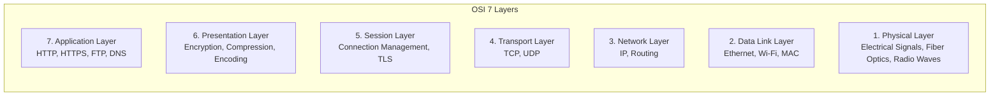
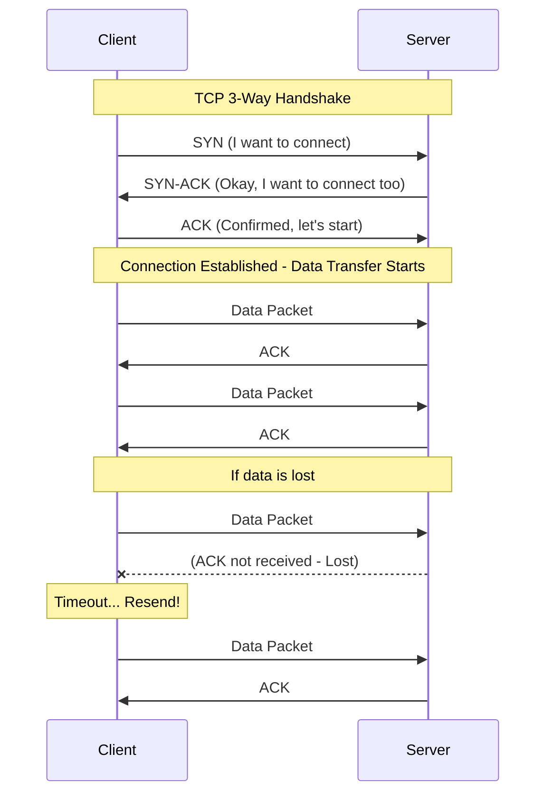
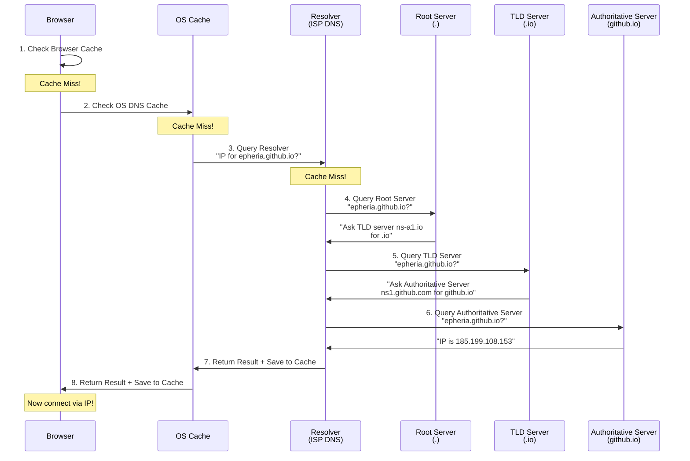
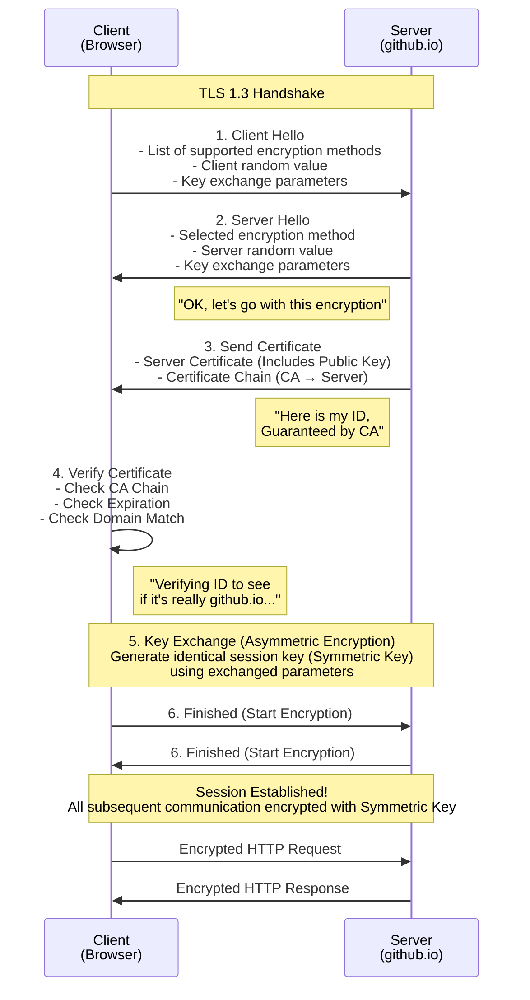

## Introduction

> This document is the 1st part of the **Internet Infrastructure — A Client Developer's Curiosity** series.

As game developers, we are quite familiar with how the rendering pipeline works. We can explain how vertex shaders transform to clip space, how fragment shaders determine pixel color, and how the GPU batches draw calls. But what if someone asks, "What happens when you type `github.io` into a browser?"

Honestly, my limit was "DNS finds the IP... an HTTP request goes out... something happens... and the page appears." It's like explaining the rendering pipeline as "CPU sends something to GPU... and it shows on screen."

This series starts from that very curiosity. Just like learning the rendering pipeline, we will dissect the network pipeline layer by layer. It consists of 3 parts:

| Part | Topic | Key Question |
| --- | --- | --- |
| **Part 1 (This Article)** | Logical Infrastructure | How do protocols, DNS, and TLS work? |
| **Part 2** | Physical Infrastructure | How do radio waves, submarine cables, and data centers connect? |
| **Part 3** | Server World | How do web servers, game servers, and CI/CD work? |

In this Part 1, we cover **Logical Infrastructure**. From the moment you type a URL into the browser to establishing an encrypted connection, let's look at the orchestration of invisible protocols from a game developer's perspective.

---

## Part 1: Basic Rules of Communication — Protocol, Packet, Port

When starting a software project, we first define the structure. The Internet is the same. Before data moves, we must decide "by what rules we will communicate." This rule is the **Protocol**.

### OSI 7-Layer Model

Software systems are designed in layers. Each layer hides the complexity of the layer below and provides a clean interface to the layer above. The **OSI (Open Systems Interconnection) 7-Layer Model** separates network communication into 7 layers based on this principle.



| OSI Layer | Role | Analogy |
| --- | --- | --- |
| 7. Application | User Protocol (HTTP, DNS) | Conversation Rules |
| 6. Presentation | Encryption, Compression, Encoding | Packaging/Compression |
| 5. Session | Connection Establishment/Maintenance | Phone Connection |
| 4. Transport | Data Delivery Guarantee (TCP/UDP) | Delivery Guarantee |
| 3. Network | Pathfinding (IP) | Delivery Route |
| 2. Data Link | Transmission between adjacent nodes | Delivery within building |
| 1. Physical | Electrical/Optical Signals | The Road Itself |

In the modern Internet, we don't strictly follow the OSI 7 layers but use the **TCP/IP 4-Layer Model** (Application - Transport - Internet - Network Access). However, the OSI model is useful for conceptual understanding.

### TCP vs UDP — The Eternal Homework for Game Developers

If you've developed a multiplayer game, you've probably pondered this: "Should I send this data via TCP or UDP?" This choice is the most fundamental decision in Internet communication.

**TCP (Transmission Control Protocol)** is like **Registered Mail**. The letter sent is guaranteed to arrive, arrives in order, and is resent if lost. The price is speed; it's slower. To establish a connection, a prior agreement called "3-way handshake" is required.



**UDP (User Datagram Protocol)** is like **Flyers**. You scatter them on the street, and that's it. You don't check who received them, if the order is correct, or if they arrived. So it's very fast, but there are no guarantees.

In games, we separate these two protocols based on usage:

| Feature | TCP | UDP |
| --- | --- | --- |
| **Reliability** | Guaranteed (Resend) | Not Guaranteed (Loss possible) |
| **Order Guarantee** | Guaranteed | Not Guaranteed |
| **Connection** | Required (3-way handshake) | Not Required |
| **Speed** | Relatively Slow | Fast |
| **Analogy** | Registered Mail | Flyers |
| **Game Usage** | Login, Payment, Chat, Inventory | Position Sync, Shooting, Voice Chat |

Unity's `Netcode for GameObjects` basically uses UDP-based transport while adding its own reliability layer on top. Unreal Engine's network system also builds its own retransmission logic on top of UDP. Thus, combining "UDP speed + necessary reliability" is common in the game industry.

#### QUIC and HTTP/3 — Blurring the Line Between TCP and UDP

There is a notable recent change. The **QUIC** protocol, designed by Google and standardized by IETF, implements **TCP's reliability on top of UDP**. HTTP/3 runs on top of this QUIC. QUIC solves TCP's Head-of-Line Blocking problem while providing reliability and encryption (TLS 1.3 built-in). It's as if the "UDP + custom reliability layer" approach long used in the game industry has spread to the entire web.

> **Wait, Know This**
>
> **Q. Why don't games use TCP?**
> Suppose you send player position data 60 times a second in an FPS. If one packet is lost, TCP attempts to resend. In the meantime, 5 new position data packets have already arrived, but TCP makes them all wait until the lost old data arrives (Head-of-Line Blocking). Current position freezes waiting for data from 0.1 seconds ago. UDP ignores lost data and immediately reflects the latest data.
>
> **Q. Then why isn't UDP used for login?**
> If login info is lost, authentication fails. You'd have to implement retransmission logic yourself and guarantee order. It's more reasonable to use TCP for that. Login happens once, so speed isn't a huge issue.

### IP Address — Computer's Home Address

Every package needs a delivery address. On the Internet, this address is the **IP (Internet Protocol) Address**.

**IPv4** is an address made of 4 numbers (0-255 each) like `192.168.0.1`. It provides about 4.3 billion addresses but is already exhausted. **IPv6** uses 128-bit addresses like `2001:0db8:85a3::8a2e:0370:7334`, providing a virtually infinite address space.

When building a server with Unity, calling `NetworkManager.Singleton.StartServer()` and binding an IP address and port is exactly specifying this IP address. Binding to `0.0.0.0` means "accept connections on all network interfaces of this server," and `127.0.0.1` means "accept connections only locally."

### Port — Room Number in the Building

If the IP address is the building address, the **Port** is the room number inside the building. Multiple services (tenants) can operate simultaneously on one server (building). Port numbers range from 0 to 65535, and each service uses a unique port.

Specifying `transport.ConnectionData.Port = 7777` when building a server in Unity is exactly this. On the same server, the game server uses 7777, the web server uses 80, and the API server uses 443.

| Port | Protocol | Usage | Context Familiar to Game Developers |
| --- | --- | --- | --- |
| 22 | SSH | Remote Server Access | SSH access when deploying server builds |
| 80 | HTTP | Web (Unencrypted) | Development server testing |
| 443 | HTTPS | Web (Encrypted) | REST API calls |
| 3306 | MySQL | Database | Game DB connection |
| 7777 | - | Unity Default Port | Netcode Default Port |
| 27015 | - | Source Engine | Valve Game Server Port |
| 3478 | STUN/TURN | NAT Traversal | Relay Server (P2P Connection) |

### Packet — Basic Unit of Data Transmission

When transmitting data over a network, the entire data is not sent at once. Data is split into small units called **Packets**.

```
┌─────────────────────────────────────────────┐
│                Packet Structure             │
├──────────────────┬──────────────────────────┤
│    Header        │     Payload              │
│   20~60 bytes    │      ~1460 bytes         │
├──────────────────┼──────────────────────────┤
│ - Source IP      │                          │
│ - Dest IP        │    Actual Data           │
│ - Source Port    │    (Web page fragment,   │
│ - Dest Port      │     Game data,           │
│ - Sequence No    │     Image fragment, etc) │
│ - Checksum       │                          │
│ - TTL            │                          │
└──────────────────┴──────────────────────────┘
```

**MTU (Maximum Transmission Unit)** is the maximum size a packet can hold. The Ethernet standard MTU is **1500 bytes**. Excluding the header, the actual data (payload) is about 1460 bytes. If the data to be sent is larger than the MTU, **Fragmentation** occurs. Data is split into multiple packets and reassembled at the destination.

> **Wait, Know This**
>
> **Q. Do packets always take the same route?**
> No. Even when downloading the same file, each packet can take a different route. Routers decide the optimal path at that moment. That's why packets may not arrive in order, and TCP reorders them.
>
> **Q. Why is MTU important in games?**
> Most game packets are smaller than MTU (character position data is tens of bytes). However, if fragmentation occurs when sending large data (map loading, skin info), latency spikes. So game servers design packet sizes considering MTU.

---

## Part 2: DNS — The Internet's Phonebook

When you type `epheria.github.io` into your browser, what happens first? It translates this domain name into the actual server's IP address. The system that performs this task is **DNS (Domain Name System)**.

DNS is the Internet's address book. Given a domain name like `epheria.github.io`, DNS queries nameservers to find the actual IP address `185.199.108.153`.

### DNS Query Process

When you enter a domain in the browser, the following hierarchical query occurs:



The important point is that this entire process usually finishes within **tens of milliseconds**. Since it's resolved from cache in most cases, going all the way to the root server is rare.

### Root Servers: The 13 Pillars of the Internet

At the top of the DNS hierarchy are **Root Servers**. All domain queries on the global Internet ultimately stem from these root servers.

There are only **13** root server IP addresses. Why 13? This is due to historical technical constraints. When DNS was initially designed, DNS response packets used UDP, and the UDP packet size had to be within **512 bytes** due to MTU constraints. To fit the names and IPv4 addresses of all root servers within 512 bytes, the maximum limit was 13.

However, 13 IPs do not mean 13 physical servers. Thanks to **Anycast** routing technology, one IP address can point to hundreds of physical servers worldwide. Currently, the 13 root server IPs are distributed across **over 1,900** physical instances.

**Anycast** is like game matchmaking. When a player connects to the "Asia Server," they are actually connected to the nearest server among Korea, Japan, or Singapore. Similarly with Anycast, if you request the same IP, the physically nearest server on the network responds.

| Root Server | Operator | Instances (2024) |
| --- | --- | --- |
| A | Verisign | Tens |
| B | USC-ISI | Several |
| C | Cogent Communications | Tens |
| D | University of Maryland | Hundreds |
| E | NASA Ames Research Center | Hundreds |
| F | Internet Systems Consortium (ISC) | Hundreds |
| G | US DoD (NIC) | Several |
| H | US Army Research Lab | Several |
| I | Netnod (Sweden) | Tens |
| J | Verisign | Hundreds |
| K | RIPE NCC (Europe) | Hundreds |
| L | ICANN | Hundreds |
| M | WIDE Project (Japan) | Tens |

> **Wait, Know This**
>
> **Q. If all root servers go down, does the Internet stop?**
> Theoretically, yes. But realistically, it's almost impossible. Over 1,900 instances are distributed worldwide, and each operates independently. Also, thanks to DNS caching, even if root servers go down momentarily, operations continue normally for a while with cached results.
>
> **Q. Why are there so many US organizations?**
> Because the Internet started from ARPANET of the US Department of Defense (DARPA). Early root server operations were allocated around the US, and this structure remains. However, thanks to Anycast, physical instances are evenly distributed globally.

### DNSSEC Key Signing Ceremony — The Physical Root of Digital Trust

Here starts a really interesting story.

The DNS system had one fundamental problem. There was no way to verify if a DNS response was real or fake. An attacker could forge a DNS response to change `google.com` to their phishing server IP. This is called **DNS Spoofing** or **DNS Cache Poisoning**.

**DNSSEC (DNS Security Extensions)** introduced public key cryptography to DNS to solve this problem. By adding a digital signature to every DNS response, it allows verification that the response has not been forged.

#### Basics of Public Key Cryptography

First, we need to understand public key cryptography. Let's use an analogy familiar to game developers.

Imagine a **Lock (Public Key) and Key (Private Key)** system. You can distribute locks to anyone. Anyone can lock a box with the lock. But only the owner has the key, so only the owner can open the box.

Digital signatures use this process **in reverse**. Sign (lock) with the private key, and verify (open) with the public key. Only the person with the private key can sign, and anyone with the public key can verify if the signature is genuine.

#### KSK and ZSK — Master Key and Daily Key

DNSSEC uses two types of keys:

| Key Type | Role | Rotation Cycle | Storage | Analogy |
| --- | --- | --- | --- | --- |
| **KSK** (Key Signing Key) | Master key signing ZSK | Rarely rotated | Stored in a safe in HSM (Hardware Security Module) | Master key of the safe |
| **ZSK** (Zone Signing Key) | Signs actual DNS records | Rotated quarterly | Stored on online server | Daily access card |

Why two keys? It's easy to understand with a game's **Anti-Cheat System** analogy. Anti-cheat systems have a "Root Certificate" and a "Session Certificate". The Root Certificate is the master key that must never be exposed, and the Session Certificate is a temporary key issued for each game session. If a Session Certificate is leaked but the Root Certificate is safe, you just issue a new Session Certificate.

KSK and ZSK work on the same principle. Even if ZSK is rotated quarterly, as long as KSK is safe, it can sign the new ZSK to maintain the chain of trust.

#### The Vault Ceremony: The Physical Root of Internet Trust

Then the most important question remains. **Who guarantees the safety of the KSK itself?**

The answer to this question is the **DNSSEC Key Signing Ceremony**. It sounds like a scene from a sci-fi movie, but it is a real procedure.

**Location**: Two ICANN secure facilities in the US East (Culpeper, Virginia) and West (El Segundo, California).

**Attendees**: TCR (Trusted Community Representatives) — At least 3 trusted representatives selected from around the world must attend (about 14 people as of 2024, but pool size and quorum requirements may vary with ICANN policy updates). They are external figures, not ICANN employees, and each holds a unique smart card.

**Procedure**:

```
1. Facility Entry
   ├── Pass Multi-layer Physical Security
   │   ├── ID + Biometrics
   │   ├── Mantrap — Double-lock area
   │   └── All processes recorded under surveillance cameras
   │
2. Vault Access
   ├── 3+ TCRs insert their smart cards
   ├── Open vault with ICANN staff's safe key
   └── Extract HSM (Hardware Security Module)
   │
3. KSK Signing
   ├── Boot HSM (Air-gapped environment, fully disconnected from Internet)
   ├── Sign new ZSK with KSK
   ├── Verify signature result
   └── Shutdown HSM and reseal vault
   │
4. Ceremony End
   ├── Record all processes in audit log
   ├── Attendees sign
   └── Release recording (Anyone can watch on YouTube)
```

The security design of this ceremony ensures that compromise is only possible if multiple TCRs and ICANN staff collude simultaneously (specific quorum policies may vary).

Why is this ceremony important? **Because the trust root of the most digital system relies on the most analog ceremony.**

Let's return to game development. Where is the root key of the anti-cheat system kept? It's protected by code obfuscation and encryption, but ultimately a physical HSM exists somewhere, and someone manages it physically. Unlike the blockchain ideal of "Code is Law," in reality, **"Initial Trust" must take root in the physical world**. The DNSSEC Key Signing Ceremony is the most dramatic example of this paradox.

> **Wait, Know This**
>
> **Q. Can I watch the Key Signing Ceremony?**
> Yes, ICANN records and releases all Key Signing Ceremonies. Search for "DNSSEC Key Signing Ceremony" on YouTube to see the whole process. It's impressive to see engineering procedures performed in an office proceeding solemnly like a nuclear missile launch protocol.
>
> **Q. What if a TCR loses their smart card?**
> Lost procedures are defined. The card is revoked, a new TCR is selected, and a new card is issued. Since only 3 people are needed to proceed, the system doesn't stop even if 1-2 people cannot attend.

---

## Part 3: TLS/HTTPS — Building an Encrypted Tunnel

We found the server's IP address via DNS. Now we need to start talking to that server. But the Internet is a public place. The data we send passes through countless routers and networks, and anyone can peek at the data in the process.

### Why Encryption is Needed

HTTP communication without encryption is like **talking with a megaphone in a cafe**. If you shout "My password is qwerty123!", everyone in the cafe can hear it. On the other hand, HTTPS (encrypted communication) is like **whispering in an alien language**. Only the speaker and the listener can decode the alien language, and eavesdroppers cannot understand the meaning.

The difference between **HTTP** and **HTTPS** is "**S** (Secure)". This S stands for the **TLS (Transport Layer Security)** protocol.

Let's look at a real example in game development. **Packet Sniffing** is a representative cheat technique in online games. By intercepting and analyzing unencrypted game packets, one can identify other players' locations, health, and inventory. One could even manipulate packets to implement wallhacks or damage hacks. Applying encryption like TLS prevents such cheats because the content cannot be deciphered even if intercepted.

### TLS Handshake — Trust Building Process

The TLS Handshake is the process where the client and server establish an encrypted connection. The client proposes supported options, the server selects one, and after verifying each other's identity, they start an encrypted session.



### From Asymmetric to Symmetric — Why Use Two Encryptions?

The cleverest part of the TLS handshake is **the transition from asymmetric to symmetric encryption**.

**Asymmetric Encryption (RSA, ECDHE, etc.)** uses a pair of public and private keys. It is very secure but computationally heavy. It is **hundreds to thousands of times** slower than symmetric encryption.

**Symmetric Encryption (AES, etc.)** encrypts/decrypts with a single key. It is very fast, but there is the problem of how to safely deliver the key to the other party. Sending the key over an unencrypted channel risks it being stolen.

The solution is to **combine the two**:
1. Exchange the symmetric key securely using **Asymmetric Encryption** (Slow but safe).
2. Then transmit actual data using **Symmetric Encryption** (Fast, key already securely shared).

```
[Connection Start] Asymmetric Encryption (Slow, Safe)
     │
     │  "Let's use this symmetric key"
     │  (Securely delivered via Asymmetric Encryption)
     ▼
[Subsequent Comm] Symmetric Encryption (Fast, Key already shared)
     │
     │  All HTTP Requests/Responses
     ▼
   [Session End]
```

### Certificate and CA — Digital ID System

The certificate sent by the server in TLS is a **Digital ID**. This ID includes:
- Server's domain name (e.g., `github.io`)
- Server's public key
- Signature of the Issuing Authority (CA)
- Validity period

**CA (Certificate Authority)** is the **ID Issuing Agency**. Just as the government issues ID cards, a CA issues server certificates. Browsers have a built-in list of trusted CAs, so they automatically trust certificates signed by CAs.

Certificate verification follows a **Chain** structure:

```
┌──────────────────────────┐
│     Root CA Certificate     │  ← Built-in to browser (Top Trust)
│  (DigiCert, Let's Encrypt) │
└────────────┬─────────────┘
             │ Sign
             ▼
┌──────────────────────────┐
│   Intermediate CA Cert      │  ← Signed by Root CA
│  (Intermediate CA)        │
└────────────┬─────────────┘
             │ Sign
             ▼
┌──────────────────────────┐
│     Server Certificate      │  ← Signed by Intermediate CA
│  (github.io)              │     → Browser verifies by following the chain
└──────────────────────────┘
```

Why does the Root CA not issue server certificates directly but go through an Intermediate CA? It's the same reason KSK and ZSK were separated in DNSSEC. **The Root CA's private key is so important it is kept in an offline safe.** If an Intermediate CA is hacked, as long as the Root CA is safe, the Intermediate CA certificate can be revoked and reissued.

#### Let's Encrypt — Democratization of Internet Security

In the past, SSL/TLS certificates were very expensive. They cost tens to hundreds of dollars annually, which is why many websites did not apply HTTPS. **Let's Encrypt**, which appeared in 2015, is a non-profit CA that issues certificates for free.

With the spread of free CAs including Let's Encrypt, the majority of web traffic now uses HTTPS (over 85% in 2024 according to W3Techs). From small personal blogs to large services, anyone can apply encrypted communication for free. GitHub Pages (the service hosting this blog) also automatically issues HTTPS certificates.

> **Wait, Know This**
>
> **Q. Is HTTPS always safe?**
> HTTPS guarantees encryption of the **communication path**. But if the site you connected to is a phishing site, it's useless. `https://g00gle.com` (zero instead of o) can have a valid certificate, but it is not Google. The lock icon means "communication is encrypted," not "this site is safe."
>
> **Q. Does a game server also need TLS?**
> Parts using REST API (Login, Payment, Shop) must use HTTPS (TLS). Real-time game communication (Position Sync, Combat) is UDP-based, so **DTLS (Datagram TLS)** is used instead of TLS, or the game engine's own encryption layer is used. In Unity, DTLS encryption can be enabled through Relay/UTP (Unity Transport Package) settings.
>
> **Q. Difference between TLS 1.3 and previous versions?**
> Until TLS 1.2, the handshake required 2 round trips (2-RTT), but TLS 1.3 reduced it to **1 round trip (1-RTT)**. Also, vulnerable encryption algorithms were removed, and handshake messages after ServerHello are encrypted to enhance security. It's like optimizing matchmaking time by half in a game.

---

## Conclusion: The Weight of Typing a URL Once

Now let's go back to the initial question. What happens when you type `epheria.github.io` into the browser?

1. **DNS Query**: Browser Cache → OS Cache → ISP Resolver → (if needed) Root Server → TLD Server → Authoritative Server to acquire the IP address `185.199.108.153`.

2. **TCP Connection**: Establish a TCP connection with the server via 3-way handshake (SYN → SYN-ACK → ACK).

3. **TLS Handshake**: Build an encrypted tunnel via Client Hello → Server Hello → Certificate Verification → Key Exchange.

4. **HTTP Request**: Send `GET /` request through the encrypted tunnel, and the server responds with HTML.

All this happens within hundreds of milliseconds. And the reliability of this process is guaranteed by the DNSSEC Key Signing Ceremony held in two vaults in the US, 1,900 Root Server instances worldwide, and mathematically verified encryption algorithms.

Just as understanding the rendering pipeline helps you know "why this draw call is slow," understanding the network pipeline helps you know "why this API call is slow," "why DNS propagation takes time," and "why HTTPS is slightly slower than HTTP."

In the next Part 2, we will look at the **Physical Infrastructure** underlying this logical infrastructure — submarine cables, data centers, CDNs. Let's follow the journey of data crossing oceans through actual physical paths.

---

## References

**Protocols and Basic Concepts**
- [RFC 793 - Transmission Control Protocol (TCP)](https://www.rfc-editor.org/rfc/rfc793)
- [RFC 768 - User Datagram Protocol (UDP)](https://www.rfc-editor.org/rfc/rfc768)
- [RFC 791 - Internet Protocol (IPv4)](https://www.rfc-editor.org/rfc/rfc791)

**DNS**
- [RFC 1035 - Domain Names - Implementation and Specification](https://www.rfc-editor.org/rfc/rfc1035)
- [Root Server Technical Operations Association](https://root-servers.org/)
- [IANA - Root Zone Database](https://www.iana.org/domains/root/db)

**DNSSEC**
- [RFC 4033 - DNS Security Introduction and Requirements](https://www.rfc-editor.org/rfc/rfc4033)
- [ICANN - DNSSEC Key Signing Ceremonies](https://www.icann.org/resources/pages/dnssec-qaa-2014-01-29-en)
- [Cloudflare - DNSSEC: An Introduction](https://www.cloudflare.com/dns/dnssec/how-dnssec-works/)

**TLS/HTTPS**
- [RFC 8446 - The Transport Layer Security (TLS) Protocol Version 1.3](https://www.rfc-editor.org/rfc/rfc8446)
- [Let's Encrypt - How It Works](https://letsencrypt.org/how-it-works/)
- [Cloudflare - What is TLS?](https://www.cloudflare.com/learning/ssl/transport-layer-security-tls/)
