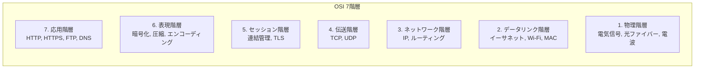
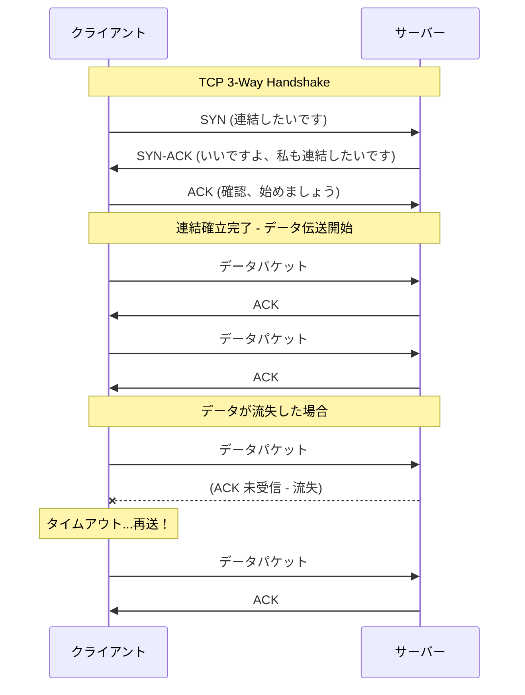
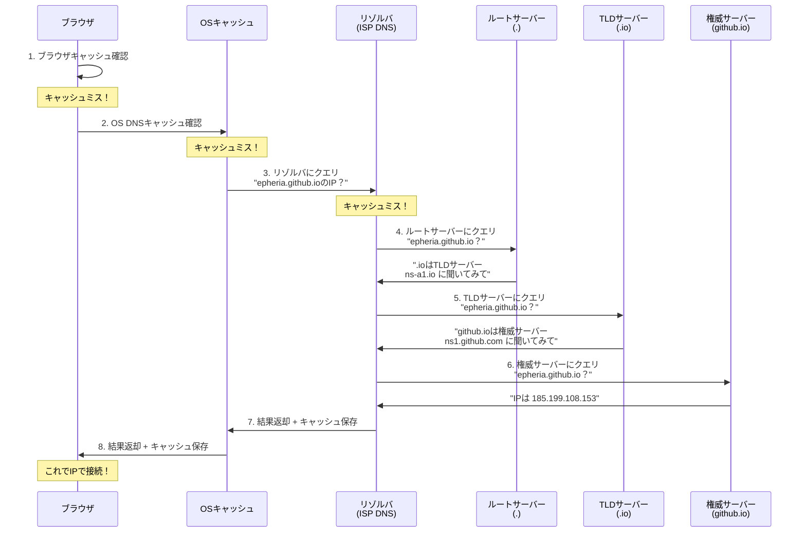
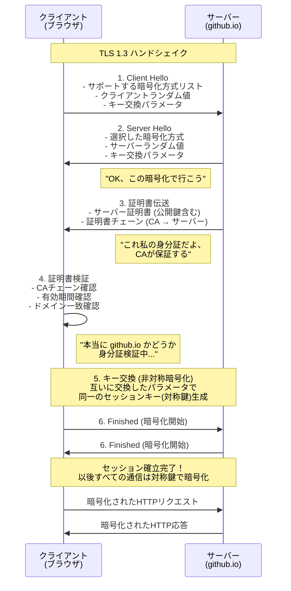

## 序論

> この文書は **インターネットインフラ — クライアント開発者の好奇心** シリーズの第1編です。

ゲーム開発者として私たちはレンダリングパイプラインの動作原理にはかなり慣れています。頂点シェーダーがどのようにクリップ空間に変換するか、フラグメントシェーダーがピクセル色をどう決定するか、GPUがドローコールをどうバッチ処理するか説明できます。しかし誰かが「ブラウザに `github.io` を入力すると何が起きるのですか？」と尋ねたらどうでしょうか？

正直なところ、私は「DNSがIPを探して... HTTPリクエストが行って... 何か起きて... ページが表示されます」程度が限界でした。まるでレンダリングパイプラインを「CPUがGPUに何か送って... 画面に出ます」と説明するのと似たレベルですね。

このシリーズはまさにその好奇心から出発します。レンダリングパイプラインを学ぶ時のように、ネットワークパイプラインも階層別に分解してみます。全3編で構成されます：

| 編 | テーマ | 核心質問 |
| --- | --- | --- |
| **第1編（今回の記事）** | 論理的インフラ | プロトコル、DNS、TLSはどう動作するか？ |
| **第2編** | 物理的インフラ | 電波、海底ケーブル、データセンターはどう連結されるか？ |
| **第3編** | サーバーの世界 | ウェブサーバー、ゲームサーバー、CI/CDはどう動作するか？ |

今回の第1編では **論理的インフラ** を扱います。ブラウザにURLを入力した瞬間から暗号化された連結が確立されるまで、目に見えないプロトコルたちの協奏をゲーム開発者の視点で見てみましょう。

---

## Part 1：通信の基本ルール — プロトコル、パケット、ポート

ソフトウェアプロジェクトを始めると最も先に構造を決めます。インターネットも同様です。データが移動する前に、まず「どのようなルールで通信するか」を決めなければなりません。このルールがまさに **プロトコル** です。

### OSI 7階層モデル

ソフトウェアシステムは階層構造で設計されます。各階層は下位階層の複雑さを隠し、上位階層に綺麗なインターフェースを提供します。 **OSI (Open Systems Interconnection) 7階層モデル** はネットワーク通信をこのような原理に従って7つの階層に分離します。



| OSI 階層 | 役割 | 比喩 |
| --- | --- | --- |
| 7. 応用 | ユーザープロトコル (HTTP, DNS) | 会話ルール |
| 6. 表現 | 暗号化, 圧縮, エンコーディング | データ包装/圧縮 |
| 5. セッション | 連結確立/維持 | 電話連結 |
| 4. 伝送 | データ伝達保証 (TCP/UDP) | 宅配配送保証 |
| 3. ネットワーク | 経路探索 (IP) | 配送経路 |
| 2. データリンク | 隣接ノード間伝送 | 建物内配達 |
| 1. 物理 | 電気/光信号 | 道路自体 |

実際の現代インターネットではOSI 7階層を厳格には守らず、 **TCP/IP 4階層モデル**（応用 - 伝送 - インターネット - ネットワークアクセス）を使用します。しかし概念的理解のためにはOSIモデルが有用です。

### TCP vs UDP — ゲーム開発者の永遠の宿題

マルチプレイヤーゲームを開発したことがある方なら一度は悩んだことがあるでしょう。「このデータはTCPで送るか、UDPで送るか？」この選択はインターネット通信の最も根本的な決定です。

**TCP (Transmission Control Protocol)** は **書留郵便** と同じです。送った手紙が必ず到着し、送った順序通りに到着し、もし紛失すれば再発送します。その代価として速度が遅いです。連結を結ぶためにまず「3-way handshake」という事前約束が必要です。



**UDP (User Datagram Protocol)** は **チラシ** と同じです。通りで配れば終わりです。誰が受け取ったか、順序が合っているか、到着したか確認しません。だから非常に速いですが、保証がありません。

ゲームではこれら2つのプロトコルを用途に応じて分離します：

| 特性 | TCP | UDP |
| --- | --- | --- |
| **信頼性** | 保証 (再送あり) | 未保証 (流失可能) |
| **順序保証** | 保証 | 未保証 |
| **連結確立** | 必要 (3-way handshake) | 不要 |
| **速度** | 相対的に遅い | 速い |
| **比喩** | 書留郵便 | チラシ |
| **ゲーム使用例** | ログイン, 決済, チャット, インベントリ | 位置同期, 弾丸発射, ボイスチャット |

Unityの `Netcode for GameObjects` は基本的にUDPベースの伝送を使用しながら、その上に独自の信頼性レイヤーを追加します。Unreal EngineのネットワークシステムもUDPの上に独自再送ロジックを構築します。このようにゲーム業界では「UDPの速度 + 必要なだけの信頼性」を組み合わせることが一般的です。

#### QUICとHTTP/3 — TCPとUDPの境界が曖昧になる

最近注目すべき変化があります。Googleが設計しIETFが標準化した **QUIC** プロトコルは **UDPの上にTCPの信頼性を実装** した伝送プロトコルです。HTTP/3はこのQUICの上で動作します。QUICはTCPのHead-of-Line Blocking問題を解決しながらも信頼性と暗号化（TLS 1.3内蔵）を提供します。ゲーム業界で長い間行ってきた「UDP + 独自信頼性レイヤー」アプローチがウェブ全体に拡散したわけです。

> **ちょっと、これだけは知っておこう**
>
> **Q. なぜゲームはTCPを使わないのですか？**
> FPSでプレイヤーの位置データを秒間60回送るとしましょう。パケット一つが流失するとTCPは再送を試みます。その間に新しい位置データ5個がすでに到着したのに、TCPは流失した古いデータが来るまですべて待機させます（Head-of-Line Blocking）。0.1秒前の位置データを待つために現在の位置が止まるのです。UDPなら流失したデータは無視して最新データを即時反映します。
>
> **Q. ではUDPはなぜログインに使わないのですか？**
> ログイン情報が流失すれば認証失敗です。再送ロジックを直接実装する必要があり、順序も保証しなければなりません。それならTCPを使うのが合理的です。ログインは一度だけすれば良いので速度が大きな問題になりません。

### IPアドレス — コンピュータの住所

すべての宅配には配送先住所が必要です。インターネットでこの住所がまさに **IP (Internet Protocol) アドレス** です。

**IPv4** は `192.168.0.1` のように4つの数字（各0〜255）で構成された住所です。約43億個の住所を提供しますが、すでに枯渇しました。 **IPv6** は `2001:0db8:85a3::8a2e:0370:7334` のように128ビット住所を使用し、事実上無限の住所空間を提供します。

Unityでサーバービルドをする際 `NetworkManager.Singleton.StartServer()` を呼び出しながらIPアドレスとポートをバインドするのがまさにこのIPアドレスを指定する作業です。 `0.0.0.0` でバインドすると「このサーバーのすべてのネットワークインターフェースで接続を受ける」という意味で、 `127.0.0.1` は「ローカルでのみ接続を受ける」という意味です。

### ポート — 建物の部屋番号

IPアドレスが建物の住所なら、 **ポート (Port)** は建物の中の部屋番号です。一つのサーバー（建物）で複数のサービス（入居者）が同時に運営されることがあります。ポート番号は0〜65535の範囲であり、各サービスが固有のポートを使用します。

Unityでサーバービルドする際 `transport.ConnectionData.Port = 7777` と指定するのがまさにこれです。同じサーバーでゲームサーバーは7777、ウェブサーバーは80、APIサーバーは443を使用するといった具合です。

| ポート | プロトコル | 用途 | ゲーム開発者に馴染みのある文脈 |
| --- | --- | --- | --- |
| 22 | SSH | リモートサーバー接続 | サーバービルド配布時のSSH接続 |
| 80 | HTTP | ウェブ (非暗号化) | 開発サーバーテスト |
| 443 | HTTPS | ウェブ (暗号化) | REST API呼び出し |
| 3306 | MySQL | データベース | ゲームDB接続 |
| 7777 | - | Unity基本ポート | Netcode基本ポート |
| 27015 | - | Source Engine | Valveゲームサーバーポート |
| 3478 | STUN/TURN | NATトラバーサル | リレーサーバー (P2P接続) |

### パケット — データ伝送の基本単位

ネットワークでデータを伝送する際、データ全体を一度に送りません。データを **パケット (Packet)** という小さな単位に分割して送ります。

```
┌─────────────────────────────────────────────┐
│                   パケット構造                  │
├──────────────────┬──────────────────────────┤
│    ヘッダー (Header)   │     ペイロード (Payload)      │
│   20~60 bytes    │      ~1460 bytes         │
├──────────────────┼──────────────────────────┤
│ - 出発地 IP       │                          │
│ - 目的地 IP       │    実際伝送するデータ       │
│ - 出発地 ポート    │    (ウェブページのかけら、    │
│ - 目的地 ポート    │     ゲームデータ、          │
│ - シーケンス番号    │     画像のかけらなど)        │
│ - チェックサム      │                          │
│ - TTL            │                          │
└──────────────────┴──────────────────────────┘
```

**MTU (Maximum Transmission Unit)** は一つのパケットが含むことができる最大サイズです。イーサネット標準MTUは **1500バイト** です。ヘッダーを除くと実際のデータ（ペイロード）は約1460バイト程度です。もし送ろうとするデータがMTUより大きい場合、 **断片化 (Fragmentation)** が発生します。データを複数のパケットに分割し、到着地で再組み立てします。

> **ちょっと、これだけは知っておこう**
>
> **Q. パケットは常に同じ経路で移動しますか？**
> いいえ。同じファイルをダウンロードしてもパケットごとに異なる経路で行くことがあります。ルーターがその時々で最適経路を判断します。だからパケットが順序通り到着しないことがあり、TCPがこれを再整列してくれるのです。
>
> **Q. ゲームでMTUが重要な理由は？**
> ゲームパケットは大部分MTUより小さいです（キャラクター位置データは数十バイト）。しかし時々大きなデータ（マップローディング、スキン情報）を送る時に断片化が発生すると遅延が急増します。だからゲームサーバーはMTUを考慮してパケットサイズを設計します。

---

## Part 2：DNS — インターネットの電話帳

`epheria.github.io` をブラウザに入力すると、一番最初に起きることは何でしょうか？このドメイン名を実際のサーバーのIPアドレスに変換することです。この作業を実行するシステムが **DNS (Domain Name System)** です。

DNSはインターネットのアドレス帳です。 `epheria.github.io` というドメイン名を与えると、DNSがネームサーバーを照会して実際のIPアドレス `185.199.108.153` を探してくれます。

### DNS クエリ過程

ブラウザにドメインを入力すると、次のような階層的クエリが発生します：



重要な点は、この全体過程が通常 **数十ミリ秒** 以内に終わるということです。大部分の場合キャッシュで解決されるため、ルートサーバーまで行くことは稀です。

### ルートサーバー：インターネットの13本の柱

DNS階層構造の最上段には **ルートサーバー (Root Server)** があります。全世界インターネットのすべてのドメインクエリは究極的にこのルートサーバーから始まります。

ルートサーバーのIPアドレスは **13個** だけです。なぜ13個なのでしょうか？これは歴史的な技術的制約のためです。初期DNS設計当時、DNS応答パケットはUDPを使用し、UDPパケットサイズはMTU制約により **512バイト** を超えてはなりませんでした。512バイトの中にルートサーバーたちの名前とIPv4アドレスをすべて含めるには最大13個が限界でした。

しかし13個のIPが13台の物理サーバーを意味するわけではありません。 **Anycast** ルーティング技術のおかげで一つのIPアドレスが全世界数百箇所の物理サーバーを指すことができます。現在13個のルートサーバーIPは **1,900個以上** の物理インスタンスとして分散しています。

**Anycast** はゲームのマッチメイキングと似ています。プレイヤーが「アジアサーバー」に接続すると、実際には韓国、日本、シンガポールのうち最も近いサーバーに接続されます。Anycastも同じIPをリクエストすればネットワーク的に最も近い物理サーバーが応答します。

| ルートサーバー | 運営機関 | インスタンス数 (2024年基準) |
| --- | --- | --- |
| A | Verisign | 数十個 |
| B | USC-ISI | 数個 |
| C | Cogent Communications | 数十個 |
| D | University of Maryland | 数百個 |
| E | NASA Ames Research Center | 数百個 |
| F | Internet Systems Consortium (ISC) | 数百個 |
| G | US DoD (NIC) | 数個 |
| H | US Army Research Lab | 数個 |
| I | Netnod (スウェーデン) | 数十個 |
| J | Verisign | 数百個 |
| K | RIPE NCC (ヨーロッパ) | 数百個 |
| L | ICANN | 数百個 |
| M | WIDE Project (日本) | 数十個 |

> **ちょっと、これだけは知っておこう**
>
> **Q. ルートサーバーがすべてダウンしたらインターネットが止まりますか？**
> 理論的にはそうです。しかし現実的にはほぼ不可能です。1,900個以上のインスタンスが全世界に分散しており、それぞれ独立して運営されます。またDNSキャッシュのおかげでルートサーバーが一時ダウンしてもキャッシュされた結果でしばらく正常運営されます。
>
> **Q. なぜ米国機関が多いのですか？**
> インターネットが米国防総省（DARPA）のARPANETから始まったためです。初期ルートサーバー運営が米国中心に配分され、この構造が維持されています。ただしAnycastのおかげで物理インスタンスは全世界に均等に分布しています。

### DNSSEC キー署名式 — デジタル信頼の物理的根幹

ここから本当に興味深い話が始まります。

DNSシステムには根本的な問題が一つあります。DNS応答が本物か偽物か検証する方法がなかったということです。攻撃者がDNS応答を偽造して `google.com` を自分のフィッシングサーバーIPに変えてしまうことができました。これを **DNSスプーフィング** または **DNSキャッシュポイズニング** と言います。

**DNSSEC (DNS Security Extensions)** はこの問題を解決するために公開鍵暗号化をDNSに導入したものです。すべてのDNS応答にデジタル署名を追加して、応答が偽造されていないことを検証できるようにします。

#### 公開鍵暗号化の基礎

まず公開鍵暗号化を理解する必要があります。ゲーム開発者に馴染みのある比喩を挙げましょう。

**錠前（公開鍵）と鍵（秘密鍵）** システムを想像してください。錠前は誰にでも配ることができます。誰でも錠前で箱をロックできます。しかし鍵は所有者だけが持っているので、所有者だけが箱を開けることができます。

デジタル署名はこの過程を **逆に** 使用します。秘密鍵で署名（ロック）し、公開鍵で検証（開く）します。秘密鍵を持つ人だけが署名でき、公開鍵を持つ誰もが署名が本物か確認できます。

#### KSKとZSK — マスターキーと業務用の鍵

DNSSECは2種類の鍵を使用します：

| キー種類 | 役割 | 交換周期 | 保管方式 | 比喩 |
| --- | --- | --- | --- | --- |
| **KSK** (Key Signing Key) | ZSKに署名するマスターキー | ほぼ交換しない | HSM(Hardware Security Module)の金庫に保管 | 金庫のマスターキー |
| **ZSK** (Zone Signing Key) | 実際のDNSレコードに署名 | 四半期ごとに交換 | オンラインサーバーに保管 | 日常業務用の出入カード |

なぜ2つの鍵が必要なのでしょうか？ゲームの **アンチチートシステム** で例えると理解しやすいです。アンチチートシステムには「ルート証明書」と「セッション証明書」があります。ルート証明書は絶対に露出してはならないマスターキーであり、セッション証明書は毎ゲームセッションごとに発行される一時的な鍵です。セッション証明書が流出してもルート証明書が安全なら新しいセッション証明書を発行すれば良いのです。

KSKとZSKも同じ原理です。ZSKが四半期ごとに交換されても、KSKが安全なら新しいZSKに署名して信頼チェーンを維持できます。

#### 金庫室の儀式：インターネット信頼の物理的根幹

それなら最も重要な質問が残ります。 **KSK自体の安全は誰が保証するのか？**

この質問に対する答えがまさに **DNSSEC キー署名式 (Key Signing Ceremony)** です。これはSF映画の場面のように聞こえますが、実際に存在する手続きです。

**場所**：米国東部（バージニア州カルペパー）と西部（カリフォルニア州エルセグンド）の2箇所のICANNセキュリティ施設

**参加者**：TCR (Trusted Community Representatives) — 全世界から選抜された信頼代表者たちのうち最低3名が参加しなければなりません（2024年基準で約14名規模ですが、TCRプール規模と定足数要件はICANN政策改正により変動する可能性があります）。彼らはICANN職員ではない外部の人たちで、各自固有のスマートカードを保有します。

**手続き**：

```
1. 施設進入
   ├── 多層物理セキュリティ通過
   │   ├── 身分証 + 生体認識
   │   ├── マントラップ (Mantrap) — 二重ロック区域
   │   └── 監視カメラ下ですべての過程を録画
   │
2. 金庫室接近
   ├── TCR 3名以上が各自のスマートカード挿入
   ├── ICANN職員の金庫キーで金庫開放
   └── HSM (Hardware Security Module) 抽出
   │
3. KSK 署名作業
   ├── HSM 起動（インターネット完全遮断されたエアギャップ環境）
   ├── 新しいZSKをKSKで署名
   ├── 署名結果検証
   └── HSM 終了および金庫再封印
   │
4. 儀式終了
   ├── すべての過程を監査ログとして記録
   ├── 参加者署名
   └── 録画本公開（誰でもYouTubeで視聴可能）
```

この儀式のセキュリティ設計は多数のTCRとICANN職員が同時に共謀しなければ侵害できないように設計されています（具体的な定足数政策は時点により異なる場合があります）。

この儀式がなぜ重要なのでしょうか？ **最もデジタル的なシステムの信頼ルートが最もアナログ的な儀式に依存しているからです。**

ゲーム開発に戻って考えてみましょう。アンチチートシステムのルートキーはどこに保管されますか？コード難読化と暗号化で保護しますが、究極的にどこかに物理的HSMが存在し、誰かが物理的に管理します。ブロックチェーンの「コードが法」という理想とは異なり、現実では **「最初の信頼」が必ず物理的世界に根を下ろさなければなりません**。DNSSECキー署名式はこの逆説を最も劇的に見せてくれる事例です。

> **ちょっと、これだけは知っておこう**
>
> **Q. キー署名式を見ることができますか？**
> はい、ICANNはすべてのキー署名式を録画して公開しています。YouTubeで "DNSSEC Key Signing Ceremony" と検索すれば全過程を見ることができます。オフィスで行われる工学的プロセスがまるで核ミサイル発射プロトコルのように厳粛に進行される様子が印象的です。
>
> **Q. TCRの一人がスマートカードを失くしたら？**
> 紛失手続きが定義されています。該当カードを廃棄し、新しいTCRを選定して新しいカードを発行します。3人いれば儀式を進行できるので、1〜2名が参加不可でもシステムは中断されません。

---

## Part 3：TLS/HTTPS — 暗号化されたトンネル構築

DNSでサーバーのIPアドレスを突き止めました。これからはそのサーバーと対話を始めなければなりません。しかしインターネットは公共の場所です。私たちが送るデータは数多くのルーターとネットワークを経て伝達され、その過程で誰でもデータを盗み見ることができます。

### なぜ暗号化が必要なのか

暗号化のないHTTP通信は **カフェで拡声器で会話すること** と同じです。「私のパスワードはqwerty123だよ！」と大声で叫べば、カフェにいるすべての人に聞こえます。一方HTTPS（暗号化された通信）は **宇宙語でささやくこと** と同じです。話す人と聞く人だけが宇宙語を解読でき、横で盗み聞きしても意味が分かりません。

**HTTP** と **HTTPS** の違いは "**S** (Secure)" です。このSがまさに **TLS (Transport Layer Security)** プロトコルを意味します。

ゲーム開発での実例を見てみましょう。オンラインゲームで **パケットスニッフィング (Packet Sniffing)** は代表的なチート技法です。暗号化されていないゲームパケットを傍受して分析すれば、他のプレイヤーの位置、体力、インベントリを把握できます。さらにパケットを操作してウォールハックやダメージハックを実装することもできます。TLSのような暗号化を適用すればパケットを傍受しても内容を解読できないため、このようなチートを防止できます。

### TLS ハンドシェイク — 信頼構築過程

TLSハンドシェイクはクライアントとサーバーが暗号化された連結を確立する過程です。クライアントがサポート可能なオプションを提示し、サーバーが選択し、互いの身元を確認した後、暗号化されたセッションを開始します。



### 非対称から対称へ — なぜ2つの暗号化を使用するのか

TLSハンドシェイクで最も巧妙な部分は **非対称暗号化から対称暗号化へ転換する過程** です。

**非対称暗号化 (RSA, ECDHEなど)** は公開鍵と秘密鍵のペアを使用します。非常に安全ですが、計算が重いです。対称暗号化より **数百〜数千倍** 遅いです。

**対称暗号化 (AESなど)** は一つの鍵で暗号化/復号化します。非常に速いですが、鍵を相手にどう安全に渡すかという問題があります。暗号化されていないチャンネルで鍵を送れば奪取されるからです。

解決策は **2つを組み合わせる** ことです：
1. **非対称暗号化** で安全に対称鍵を交換します（遅いが安全）
2. その後 **対称暗号化** で実際のデータを伝送します（速く、鍵はすでに安全に共有済み）

```
[連結初期] 非対称暗号化 (遅い、安全)
     │
     │  "この対称鍵を使おう"
     │  (非対称暗号化で安全に伝達)
     ▼
[以後通信] 対称暗号化 (速い、鍵すでに共有)
     │
     │  すべてのHTTPリクエスト/応答
     ▼
   [セッション終了]
```

### 証明書 (Certificate) と CA — デジタル身分証システム

TLSでサーバーが送る証明書は **デジタル身分証** です。この身分証には以下が含まれます：
- サーバーのドメイン名（例： `github.io`）
- サーバーの公開鍵
- 発行機関 (CA) の署名
- 有効期間

**CA (Certificate Authority)** は **身分証発行機関** です。政府が住民登録証を発行するように、CAがサーバーの証明書を発行します。ブラウザは信頼できるCAリストをあらかじめ内蔵しており、CAが署名した証明書を自動的に信頼します。

証明書検証は **チェーン (Chain)** 構造で行われます：

```
┌──────────────────────────┐
│     ルートCA証明書          │  ← ブラウザにあらかじめ内蔵（最高信頼）
│  (DigiCert, Let's Encrypt) │
└────────────┬─────────────┘
             │ 署名
             ▼
┌──────────────────────────┐
│     中間CA証明書            │  ← ルートCAが署名
│  (Intermediate CA)        │
└────────────┬─────────────┘
             │ 署名
             ▼
┌──────────────────────────┐
│     サーバー証明書           │  ← 中間CAが署名
│  (github.io)              │     → ブラウザがチェーンを辿って検証
└──────────────────────────┘
```

なぜルートCAが直接サーバー証明書を発行せず中間CAを経るのでしょうか？先ほどのDNSSECでKSKとZSKを分離した理由と同じです。 **ルートCAの秘密鍵はあまりに重要なのでオフライン金庫に保管** します。もし中間CAがハッキングされてもルートCAが安全なら中間CA証明書を廃棄し新しく発行できます。

#### Let's Encrypt — インターネットセキュリティの民主化

過去にはSSL/TLS証明書が非常に高価でした。年間数十〜数百ドルの費用がかかり、このため多くのウェブサイトがHTTPSを適用しませんでした。2015年に登場した **Let's Encrypt** は無料で証明書を発行する非営利CAです。

Let's Encryptをはじめとする無料CAの普及により、現在ウェブトラフィックの大多数がHTTPSを使用しています（W3Techs基準2024年約85%以上）。小規模な個人ブログから大規模サービスまで、誰でも無料で暗号化通信を適用できるようになりました。GitHub Pages（このブログをホスティングするサービス）も自動的にHTTPS証明書を発行してくれます。

> **ちょっと、これだけは知っておこう**
>
> **Q. HTTPSなら無条件に安全ですか？**
> HTTPSは **通信経路** の暗号化を保証します。しかし接続したサイト自体がフィッシングサイトなら意味がありません。 `https://g00gle.com`（0がoの代わり）は有効な証明書を持つことができますが、Googleではありません。南京錠アイコンは「通信が暗号化された」という意味であり、「このサイトが安全だ」という意味ではありません。
>
> **Q. ゲームサーバーにもTLSが必要ですか？**
> REST APIを使用する部分（ログイン、決済、ショップ）は必ずHTTPS(TLS)を使用しなければなりません。リアルタイムゲーム通信（位置同期、戦闘）はUDPベースなのでTLSの代わりに **DTLS (Datagram TLS)** を使用したり、ゲームエンジン独自の暗号化レイヤーを使用します。UnityではRelay/UTP (Unity Transport Package) 設定を通じてDTLS暗号化を有効にできます。
>
> **Q. TLS 1.3と以前のバージョンの違いは？**
> TLS 1.2まではハンドシェイクに2回の往復（2-RTT）が必要でしたが、TLS 1.3は **1回の往復（1-RTT）** に減らしました。また脆弱な暗号化アルゴリズムを削除し、ServerHello以後のハンドシェイクメッセージを暗号化してセキュリティを強化しました。ゲームでマッチメイキング時間を半分に減らしたような最適化です。

---

## 結び：URL入力一回の重み

さて最初の質問に戻りましょう。 `epheria.github.io` をブラウザに入力すると何が起きるでしょうか？

1. **DNS クエリ**：ブラウザキャッシュ → OSキャッシュ → ISPリゾルバ → (必要時) ルートサーバー → TLDサーバー → 権威サーバーを経て `185.199.108.153` というIPアドレスを獲得します。

2. **TCP 連結**：3-way handshake (SYN → SYN-ACK → ACK) でサーバーとTCP連結を確立します。

3. **TLS ハンドシェイク**：Client Hello → Server Hello → 証明書検証 → キー交換を経て暗号化されたトンネルを構築します。

4. **HTTP リクエスト**：暗号化されたトンネルを通じて `GET /` リクエストを送り、サーバーがHTMLを応答します。

これらすべての過程が数百ミリ秒以内に起きます。そしてこの過程の信頼性は米国の2つの金庫室で開かれるDNSSECキー署名式、全世界1,900個のルートサーバーインスタンス、数学的に検証された暗号化アルゴリズムによって保証されます。

レンダリングパイプラインを理解すれば「なぜこのドローコールが遅いのか」分かるように、ネットワークパイプラインを理解すれば「なぜこのAPI呼び出しが遅いのか」、「なぜDNS伝播に時間がかかるのか」、「なぜHTTPSがHTTPより若干遅いのか」分かります。

次の第2編ではこの論理的インフラの下に敷かれた **物理的インフラ** — 海底ケーブル、データセンター、CDN — を見ていきます。データが実際にどのような物理的経路を経て大洋を渡るのか、その旅路を追ってみましょう。

---

## 参考資料

**プロトコルおよび基本概念**
- [RFC 793 - Transmission Control Protocol (TCP)](https://www.rfc-editor.org/rfc/rfc793)
- [RFC 768 - User Datagram Protocol (UDP)](https://www.rfc-editor.org/rfc/rfc768)
- [RFC 791 - Internet Protocol (IPv4)](https://www.rfc-editor.org/rfc/rfc791)

**DNS**
- [RFC 1035 - Domain Names - Implementation and Specification](https://www.rfc-editor.org/rfc/rfc1035)
- [Root Server Technical Operations Association](https://root-servers.org/)
- [IANA - Root Zone Database](https://www.iana.org/domains/root/db)

**DNSSEC**
- [RFC 4033 - DNS Security Introduction and Requirements](https://www.rfc-editor.org/rfc/rfc4033)
- [ICANN - DNSSEC Key Signing Ceremonies](https://www.icann.org/resources/pages/dnssec-qaa-2014-01-29-en)
- [Cloudflare - DNSSEC: An Introduction](https://www.cloudflare.com/dns/dnssec/how-dnssec-works/)

**TLS/HTTPS**
- [RFC 8446 - The Transport Layer Security (TLS) Protocol Version 1.3](https://www.rfc-editor.org/rfc/rfc8446)
- [Let's Encrypt - How It Works](https://letsencrypt.org/how-it-works/)
- [Cloudflare - What is TLS?](https://www.cloudflare.com/learning/ssl/transport-layer-security-tls/)
