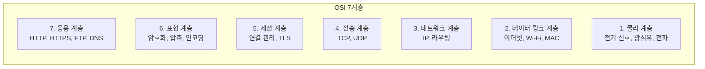
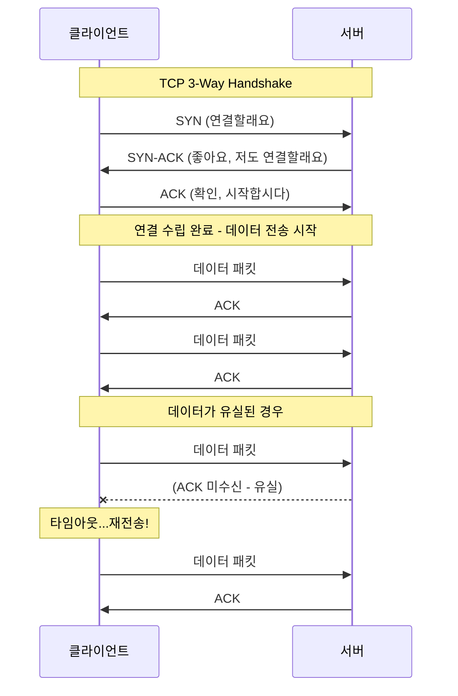
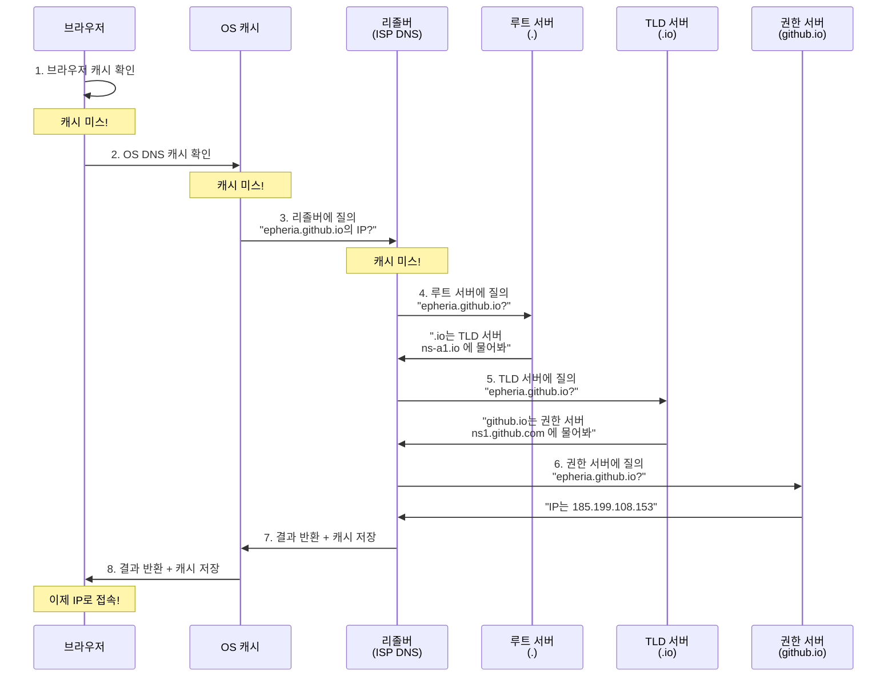
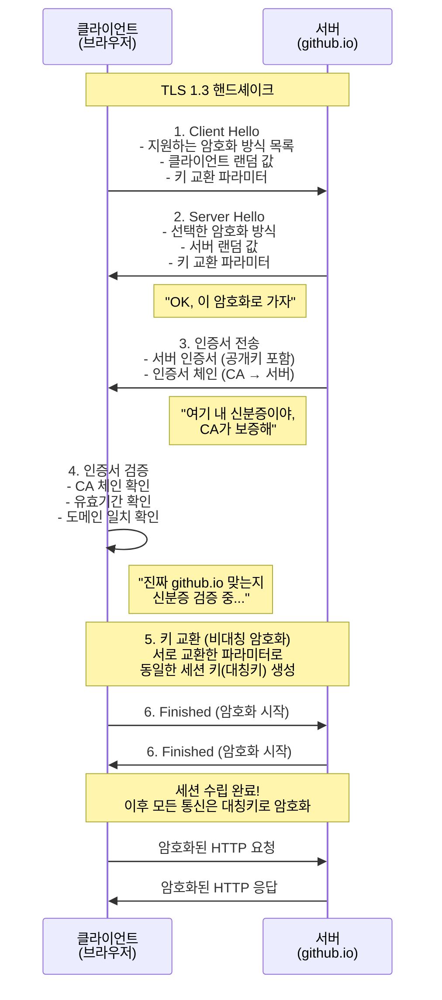

## 서론

> 이 문서는 **인터넷 인프라 — 클라이언트 개발자의 호기심** 시리즈의 1번째 편입니다.

게임 개발자로서 우리는 렌더링 파이프라인의 동작 원리에는 꽤 익숙합니다. 정점 셰이더가 어떻게 클립 공간으로 변환하는지, 프래그먼트 셰이더가 픽셀 색상을 어떻게 결정하는지, GPU가 드로우콜을 어떻게 배칭하는지 설명할 수 있습니다. 하지만 누군가 "브라우저에 `github.io`를 입력하면 무슨 일이 벌어지나요?"라고 물으면 어떨까요?

솔직히, 저는 "DNS가 IP를 찾고... HTTP 요청이 가고... 뭔가 일어나고... 페이지가 뜹니다" 정도가 한계였습니다. 마치 렌더링 파이프라인을 "CPU가 GPU에 뭔가 보내고... 화면에 나옵니다"라고 설명하는 것과 비슷한 수준이죠.

이 시리즈는 바로 그 궁금증에서 출발합니다. 렌더링 파이프라인을 배울 때처럼, 네트워크 파이프라인도 계층별로 뜯어보겠습니다. 총 3편으로 구성됩니다:

| 편 | 주제 | 핵심 질문 |
| --- | --- | --- |
| **1편 (이번 글)** | 논리적 인프라 | 프로토콜, DNS, TLS는 어떻게 동작하는가? |
| **2편** | 물리적 인프라 | 전파, 해저 케이블, 데이터센터는 어떻게 연결되는가? |
| **3편** | 서버의 세계 | 웹 서버, 게임 서버, CI/CD는 어떻게 동작하는가? |

이번 1편에서는 **논리적 인프라**를 다룹니다. 브라우저에 URL을 입력하는 순간부터 암호화된 연결이 수립되기까지, 눈에 보이지 않는 프로토콜들의 협주를 게임 개발자의 시각에서 살펴봅시다.

---

## Part 1: 통신의 기본 규칙 — 프로토콜, 패킷, 포트

소프트웨어 프로젝트를 시작하면 가장 먼저 구조를 잡습니다. 인터넷도 마찬가지입니다. 데이터가 이동하기 전에, 먼저 "어떤 규칙으로 통신할 것인가"를 정해야 합니다. 이 규칙이 바로 **프로토콜**입니다.

### OSI 7계층 모델

소프트웨어 시스템은 계층 구조로 설계됩니다. 각 계층은 아래 계층의 복잡성을 숨기고, 위 계층에 깔끔한 인터페이스를 제공합니다. **OSI(Open Systems Interconnection) 7계층 모델**은 네트워크 통신을 이런 원리에 따라 7개 계층으로 분리합니다.



| OSI 계층 | 역할 | 비유 |
| --- | --- | --- |
| 7. 응용 | 사용자 프로토콜 (HTTP, DNS) | 대화 규칙 |
| 6. 표현 | 암호화, 압축, 인코딩 | 데이터 포장/압축 |
| 5. 세션 | 연결 수립/유지 | 전화 연결 |
| 4. 전송 | 데이터 전달 보장 (TCP/UDP) | 택배 배송 보장 |
| 3. 네트워크 | 경로 탐색 (IP) | 배송 경로 |
| 2. 데이터 링크 | 인접 노드 간 전송 | 건물 내 배달 |
| 1. 물리 | 전기/광 신호 | 도로 자체 |

실제 현대 인터넷에서는 OSI 7계층을 엄격하게 따르지 않고, **TCP/IP 4계층 모델**(응용 - 전송 - 인터넷 - 네트워크 접근)을 사용합니다. 하지만 개념적 이해를 위해서는 OSI 모델이 유용합니다.

### TCP vs UDP — 게임 개발자의 영원한 숙제

멀티플레이어 게임을 개발해본 분이라면 한 번쯤 고민해봤을 것입니다. "이 데이터는 TCP로 보낼까, UDP로 보낼까?" 이 선택은 인터넷 통신의 가장 근본적인 결정입니다.

**TCP(Transmission Control Protocol)**는 **등기우편**과 같습니다. 보낸 편지가 반드시 도착하고, 보낸 순서대로 도착하며, 만약 분실되면 재발송합니다. 그 대가로 속도가 느립니다. 연결을 맺기 위해 먼저 "3-way handshake"라는 사전 약속이 필요합니다.



**UDP(User Datagram Protocol)**는 **전단지**와 같습니다. 거리에서 뿌리면 끝입니다. 누가 받았는지, 순서가 맞는지, 도착했는지 확인하지 않습니다. 그래서 매우 빠르지만, 보장이 없습니다.

게임에서는 이 두 프로토콜을 용도에 따라 분리합니다:

| 특성 | TCP | UDP |
| --- | --- | --- |
| **신뢰성** | 보장 (재전송 있음) | 미보장 (유실 가능) |
| **순서 보장** | 보장 | 미보장 |
| **연결 수립** | 필요 (3-way handshake) | 불필요 |
| **속도** | 상대적으로 느림 | 빠름 |
| **비유** | 등기우편 | 전단지 |
| **게임 사용 예** | 로그인, 결제, 채팅, 인벤토리 | 위치 동기화, 총알 발사, 보이스챗 |

Unity의 `Netcode for GameObjects`는 기본적으로 UDP 기반 전송을 사용하면서, 그 위에 자체적인 신뢰성 레이어를 추가합니다. Unreal Engine의 네트워크 시스템도 UDP 위에 자체 재전송 로직을 구축합니다. 이처럼 게임 업계에서는 "UDP의 속도 + 필요한 만큼의 신뢰성"을 조합하는 것이 일반적입니다.

#### QUIC와 HTTP/3 — TCP와 UDP의 경계가 흐려지다

최근 주목할 변화가 있습니다. Google이 설계하고 IETF가 표준화한 **QUIC** 프로토콜은 **UDP 위에 TCP의 신뢰성을 구현**한 전송 프로토콜입니다. HTTP/3는 이 QUIC 위에서 동작합니다. QUIC는 TCP의 Head-of-Line Blocking 문제를 해결하면서도 신뢰성과 암호화(TLS 1.3 내장)를 제공합니다. 게임 업계에서 오랫동안 해왔던 "UDP + 자체 신뢰성 레이어" 접근법이 웹 전체로 확산된 셈입니다.

> **잠깐, 이건 알고 가자**
>
> **Q. 왜 게임은 TCP를 안 쓰나요?**
> FPS에서 플레이어의 위치 데이터를 초당 60번 보낸다고 합시다. 패킷 하나가 유실되면 TCP는 재전송을 시도합니다. 그 사이에 새로운 위치 데이터 5개가 이미 도착했는데, TCP는 유실된 옛 데이터가 올 때까지 전부 대기시킵니다(Head-of-Line Blocking). 0.1초 전의 위치 데이터를 기다리느라 현재 위치가 멈추는 것입니다. UDP라면 유실된 데이터는 무시하고 최신 데이터를 즉시 반영합니다.
>
> **Q. 그럼 UDP는 왜 로그인에 안 쓰나요?**
> 로그인 정보가 유실되면 인증 실패입니다. 재전송 로직을 직접 구현해야 하고, 순서도 보장해야 합니다. 그럴 바에는 TCP를 쓰는 것이 합리적입니다. 로그인은 한 번만 하면 되니 속도가 크게 문제되지 않습니다.

### IP 주소 — 컴퓨터의 집 주소

모든 택배에는 배송지 주소가 필요합니다. 인터넷에서 이 주소가 바로 **IP(Internet Protocol) 주소**입니다.

**IPv4**는 `192.168.0.1`처럼 4개의 숫자(각 0~255)로 이루어진 주소입니다. 약 43억 개의 주소를 제공하지만 이미 고갈되었습니다. **IPv6**는 `2001:0db8:85a3::8a2e:0370:7334`처럼 128비트 주소를 사용해 사실상 무한한 주소 공간을 제공합니다.

Unity로 서버 빌드를 할 때 `NetworkManager.Singleton.StartServer()`를 호출하면서 IP 주소와 포트를 바인딩하는 것이 바로 이 IP 주소를 지정하는 작업입니다. `0.0.0.0`으로 바인딩하면 "이 서버의 모든 네트워크 인터페이스에서 접속을 받겠다"는 의미이고, `127.0.0.1`은 "로컬에서만 접속을 받겠다"는 의미입니다.

### 포트 — 건물의 호수

IP 주소가 건물의 주소라면, **포트(Port)**는 건물 안의 호수입니다. 하나의 서버(건물)에서 여러 서비스(세입자)가 동시에 운영될 수 있습니다. 포트 번호는 0~65535 범위이며, 각 서비스가 고유한 포트를 사용합니다.

Unity에서 서버 빌드할 때 `transport.ConnectionData.Port = 7777`로 지정하는 것이 바로 이것입니다. 같은 서버에서 게임 서버는 7777, 웹 서버는 80, API 서버는 443을 사용하는 식입니다.

| 포트 | 프로토콜 | 용도 | 게임 개발자에게 익숙한 맥락 |
| --- | --- | --- | --- |
| 22 | SSH | 원격 서버 접속 | 서버 빌드 배포할 때 SSH 접속 |
| 80 | HTTP | 웹 (비암호화) | 개발 서버 테스트 |
| 443 | HTTPS | 웹 (암호화) | REST API 호출 |
| 3306 | MySQL | 데이터베이스 | 게임 DB 접속 |
| 7777 | - | Unity 기본 포트 | Netcode 기본 포트 |
| 27015 | - | Source Engine | Valve 게임 서버 포트 |
| 3478 | STUN/TURN | NAT 트래버설 | 릴레이 서버 (P2P 연결) |

### 패킷 — 데이터 전송의 기본 단위

네트워크에서 데이터를 전송할 때, 데이터 전체를 한 번에 보내지 않습니다. 데이터를 **패킷(Packet)**이라는 작은 단위로 쪼개서 보냅니다.

```
┌─────────────────────────────────────────────┐
│                   패킷 구조                    │
├──────────────────┬──────────────────────────┤
│    헤더 (Header)   │     페이로드 (Payload)      │
│   20~60 bytes    │      ~1460 bytes         │
├──────────────────┼──────────────────────────┤
│ - 출발지 IP       │                          │
│ - 목적지 IP       │    실제 전송할 데이터       │
│ - 출발지 포트      │    (웹 페이지 조각,        │
│ - 목적지 포트      │     게임 데이터,           │
│ - 시퀀스 번호      │     이미지 조각 등)        │
│ - 체크섬          │                          │
│ - TTL            │                          │
└──────────────────┴──────────────────────────┘
```

**MTU(Maximum Transmission Unit)**는 한 패킷이 담을 수 있는 최대 크기입니다. 이더넷 표준 MTU는 **1500바이트**입니다. 헤더를 빼면 실제 데이터(페이로드)는 약 1460바이트 정도입니다. 만약 보내려는 데이터가 MTU보다 크면, **단편화(Fragmentation)**가 발생합니다. 데이터를 여러 패킷으로 쪼개고, 도착지에서 다시 조립합니다.

> **잠깐, 이건 알고 가자**
>
> **Q. 패킷은 항상 같은 경로로 이동하나요?**
> 아닙니다. 같은 파일을 다운로드하더라도 패킷마다 다른 경로로 갈 수 있습니다. 라우터가 그때그때 최적 경로를 판단합니다. 그래서 패킷이 순서대로 도착하지 않을 수 있고, TCP가 이를 재정렬해주는 것입니다.
>
> **Q. 게임에서 MTU가 중요한 이유는?**
> 게임 패킷은 대부분 MTU보다 작습니다 (캐릭터 위치 데이터는 수십 바이트). 하지만 가끔 큰 데이터(맵 로딩, 스킨 정보)를 보낼 때 단편화가 발생하면 지연이 급증합니다. 그래서 게임 서버는 MTU를 고려해 패킷 크기를 설계합니다.

---

## Part 2: DNS — 인터넷의 전화번호부

`epheria.github.io`를 브라우저에 입력하면, 제일 먼저 일어나는 일은 무엇일까요? 이 도메인 이름을 실제 서버의 IP 주소로 변환하는 것입니다. 이 작업을 수행하는 시스템이 **DNS(Domain Name System)**입니다.

DNS는 인터넷의 주소록입니다. `epheria.github.io`라는 도메인 이름을 주면, DNS가 네임서버를 조회해서 실제 IP 주소 `185.199.108.153`을 찾아줍니다.

### DNS 질의 과정

브라우저에 도메인을 입력하면, 다음과 같은 계층적 질의가 발생합니다:



중요한 점은 이 전체 과정이 보통 **수십 밀리초** 안에 끝난다는 것입니다. 대부분의 경우 캐시에서 해결되기 때문에, 루트 서버까지 가는 일은 드뭅니다.

### 루트 서버: 인터넷의 13개 기둥

DNS 계층 구조의 최상단에는 **루트 서버(Root Server)**가 있습니다. 전 세계 인터넷의 모든 도메인 질의는 궁극적으로 이 루트 서버에서 시작됩니다.

루트 서버의 IP 주소는 **13개**뿐입니다. 왜 하필 13개일까요? 이것은 역사적인 기술적 제약 때문입니다. 초기 DNS 설계 당시 DNS 응답 패킷은 UDP를 사용했고, UDP 패킷 크기는 MTU 제약으로 인해 **512바이트**를 넘지 않아야 했습니다. 512바이트 안에 루트 서버들의 이름과 IPv4 주소를 모두 담으려면 최대 13개가 한계였습니다.

하지만 13개의 IP가 13대의 물리 서버를 의미하는 것은 아닙니다. **Anycast** 라우팅 기술 덕분에 하나의 IP 주소가 전 세계 수백 곳의 물리 서버를 가리킬 수 있습니다. 현재 13개 루트 서버 IP는 **1,900개 이상**의 물리 인스턴스로 분산되어 있습니다.

**Anycast**는 게임의 매치메이킹과 비슷합니다. 플레이어가 "아시아 서버"에 접속하면, 실제로는 한국, 일본, 싱가포르 중 가장 가까운 서버로 연결됩니다. Anycast도 같은 IP를 요청하면 네트워크적으로 가장 가까운 물리 서버가 응답합니다.

| 루트 서버 | 운영 기관 | 인스턴스 수 (2024년 기준) |
| --- | --- | --- |
| A | Verisign | 수십 개 |
| B | USC-ISI | 수 개 |
| C | Cogent Communications | 수십 개 |
| D | University of Maryland | 수백 개 |
| E | NASA Ames Research Center | 수백 개 |
| F | Internet Systems Consortium (ISC) | 수백 개 |
| G | US DoD (NIC) | 수 개 |
| H | US Army Research Lab | 수 개 |
| I | Netnod (스웨덴) | 수십 개 |
| J | Verisign | 수백 개 |
| K | RIPE NCC (유럽) | 수백 개 |
| L | ICANN | 수백 개 |
| M | WIDE Project (일본) | 수십 개 |

> **잠깐, 이건 알고 가자**
>
> **Q. 루트 서버가 모두 다운되면 인터넷이 멈추나요?**
> 이론적으로는 그렇습니다. 하지만 현실적으로는 거의 불가능합니다. 1,900개 이상의 인스턴스가 전 세계에 분산되어 있고, 각각 독립적으로 운영됩니다. 또한 DNS 캐시 덕분에 루트 서버가 잠시 다운되어도 캐시된 결과로 한동안 정상 운영됩니다.
>
> **Q. 왜 미국 기관이 많나요?**
> 인터넷이 미국 국방부(DARPA)의 ARPANET에서 시작되었기 때문입니다. 초기 루트 서버 운영이 미국 중심으로 배분되었고, 이 구조가 유지되고 있습니다. 다만 Anycast 덕분에 물리 인스턴스는 전 세계에 고르게 분포합니다.

### DNSSEC 키 서명 의식 — 디지털 신뢰의 물리적 뿌리

여기서부터 정말 흥미로운 이야기가 시작됩니다.

DNS 시스템에는 근본적인 문제가 하나 있습니다. DNS 응답이 진짜인지 가짜인지 검증할 방법이 없었다는 것입니다. 공격자가 DNS 응답을 위조해서 `google.com`을 자신의 피싱 서버 IP로 바꿔버릴 수 있었습니다. 이를 **DNS 스푸핑** 또는 **DNS 캐시 포이즈닝**이라고 합니다.

**DNSSEC(DNS Security Extensions)**는 이 문제를 해결하기 위해 공개키 암호화를 DNS에 도입한 것입니다. 모든 DNS 응답에 디지털 서명을 추가해서, 응답이 위조되지 않았음을 검증할 수 있게 합니다.

#### 공개키 암호화의 기초

먼저 공개키 암호화를 이해해야 합니다. 게임 개발자에게 익숙한 비유를 들어봅시다.

**자물쇠(공개키)와 열쇠(개인키)** 시스템을 상상해보세요. 자물쇠는 누구에게나 나눠줄 수 있습니다. 누구나 자물쇠로 상자를 잠글 수 있습니다. 하지만 열쇠는 오직 소유자만 가지고 있으므로, 오직 소유자만 상자를 열 수 있습니다.

디지털 서명은 이 과정을 **역으로** 사용합니다. 개인키로 서명(잠금)하고, 공개키로 검증(열기)합니다. 개인키를 가진 사람만 서명할 수 있고, 공개키를 가진 누구나 서명이 진짜인지 확인할 수 있습니다.

#### KSK와 ZSK — 마스터키와 업무용 키

DNSSEC는 두 종류의 키를 사용합니다:

| 키 종류 | 역할 | 교체 주기 | 보관 방식 | 비유 |
| --- | --- | --- | --- | --- |
| **KSK** (Key Signing Key) | ZSK에 서명하는 마스터키 | 거의 교체 안 함 | HSM(Hardware Security Module)의 금고에 보관 | 금고의 마스터키 |
| **ZSK** (Zone Signing Key) | 실제 DNS 레코드에 서명 | 분기마다 교체 | 온라인 서버에 보관 | 일상 업무용 출입카드 |

왜 두 개의 키가 필요할까요? 게임의 **반치트 시스템**으로 비유하면 이해가 쉽습니다. 반치트 시스템에는 "루트 인증서"와 "세션 인증서"가 있습니다. 루트 인증서는 절대 노출되면 안 되는 마스터키이고, 세션 인증서는 매 게임 세션마다 발급되는 일시적 키입니다. 세션 인증서가 유출되어도 루트 인증서가 안전하면 새 세션 인증서를 발급하면 됩니다.

KSK와 ZSK도 같은 원리입니다. ZSK가 분기마다 교체되더라도, KSK가 안전하면 새 ZSK에 서명해서 신뢰 체인을 유지할 수 있습니다.

#### 금고실 의식: 인터넷 신뢰의 물리적 뿌리

그렇다면 가장 중요한 질문이 남습니다. **KSK 자체의 안전은 누가 보장하는가?**

이 질문에 대한 답이 바로 **DNSSEC 키 서명 의식(Key Signing Ceremony)**입니다. 이것은 SF 영화의 장면처럼 들리지만, 실제로 존재하는 절차입니다.

**장소**: 미국 동부(버지니아주 컬페퍼)와 서부(캘리포니아주 엘세군도)의 두 곳의 ICANN 보안 시설

**참석자**: TCR(Trusted Community Representatives) — 전 세계에서 선발된 신뢰 대표자들 중 최소 3명이 참석해야 합니다 (2024년 기준 약 14명 규모이나, TCR 풀 규모와 쿼럼 요건은 ICANN 정책 개정에 따라 변동될 수 있습니다). 이들은 ICANN 직원이 아닌 외부 인사로, 각자 고유한 스마트카드를 보유합니다.

**절차**:

```
1. 시설 진입
   ├── 다층 물리 보안 통과
   │   ├── 신분증 + 생체 인식
   │   ├── 맨트랩(Mantrap) — 이중 잠금 구역
   │   └── 감시 카메라 하에 모든 과정 녹화
   │
2. 금고실 접근
   ├── TCR 3명 이상이 각자의 스마트카드 삽입
   ├── ICANN 직원의 금고 키로 금고 개방
   └── HSM(Hardware Security Module) 추출
   │
3. KSK 서명 작업
   ├── HSM 부팅 (인터넷 완전 차단된 에어갭 환경)
   ├── 새로운 ZSK를 KSK로 서명
   ├── 서명 결과 검증
   └── HSM 종료 및 금고 재봉인
   │
4. 의식 종료
   ├── 모든 과정을 감사 로그로 기록
   ├── 참석자 서명
   └── 녹화본 공개 (누구나 유튜브에서 시청 가능)
```

이 의식의 보안 설계는 다수의 TCR과 ICANN 직원이 동시에 공모해야만 침해가 가능하도록 설계되어 있습니다 (구체적인 쿼럼 정책은 시점에 따라 다를 수 있습니다).

이 의식이 왜 중요할까요? **가장 디지털적인 시스템의 신뢰 루트가 가장 아날로그적인 의식에 의존하기 때문입니다.**

게임 개발로 돌아와서 생각해봅시다. 반치트 시스템의 루트 키는 어디에 보관되나요? 코드 난독화와 암호화로 보호하지만, 궁극적으로 어딘가에 물리적 HSM이 존재하고, 누군가 물리적으로 관리합니다. 블록체인의 "코드가 법"이라는 이상과 달리, 현실에서는 **"최초의 신뢰"가 반드시 물리적 세계에 뿌리를 내려야 합니다**. DNSSEC 키 서명 의식은 이 역설을 가장 극적으로 보여주는 사례입니다.

> **잠깐, 이건 알고 가자**
>
> **Q. 키 서명 의식을 볼 수 있나요?**
> 네, ICANN은 모든 키 서명 의식을 녹화해서 공개합니다. YouTube에서 "DNSSEC Key Signing Ceremony"로 검색하면 전체 과정을 볼 수 있습니다. 사무실에서 수행되는 공학적 절차가 마치 핵미사일 발사 프로토콜처럼 엄숙하게 진행되는 모습이 인상적입니다.
>
> **Q. TCR 중 한 명이 스마트카드를 잃어버리면?**
> 분실 절차가 정의되어 있습니다. 해당 카드를 폐기하고, 새 TCR을 선정하여 새 카드를 발급합니다. 3명만 있으면 의식을 진행할 수 있으므로, 1~2명이 참여 불가해도 시스템이 중단되지 않습니다.

---

## Part 3: TLS/HTTPS — 암호화된 터널 구축

DNS로 서버의 IP 주소를 알아냈습니다. 이제 그 서버와 대화를 시작해야 합니다. 하지만 인터넷은 공공장소입니다. 우리가 보내는 데이터는 수많은 라우터와 네트워크를 거쳐 전달되며, 그 과정에서 누구나 데이터를 엿볼 수 있습니다.

### 왜 암호화가 필요한가

암호화 없는 HTTP 통신은 **카페에서 확성기로 대화하는 것**과 같습니다. "내 비밀번호는 qwerty123이야!"를 큰 소리로 외치면, 카페에 있는 모든 사람이 들을 수 있습니다. 반면 HTTPS(암호화된 통신)는 **외계어로 속삭이는 것**과 같습니다. 말하는 사람과 듣는 사람만 외계어를 해독할 수 있고, 옆에서 엿들어도 의미를 알 수 없습니다.

**HTTP**와 **HTTPS**의 차이는 "**S**(Secure)"입니다. 이 S가 바로 **TLS(Transport Layer Security)** 프로토콜을 의미합니다.

게임 개발에서의 실제 사례를 봅시다. 온라인 게임에서 **패킷 스니핑(Packet Sniffing)**은 대표적인 치트 기법입니다. 암호화되지 않은 게임 패킷을 가로채서 분석하면, 다른 플레이어의 위치, 체력, 인벤토리를 파악할 수 있습니다. 심지어 패킷을 조작해서 월핵이나 데미지 핵을 구현할 수도 있습니다. TLS 같은 암호화를 적용하면 패킷을 가로채도 내용을 해독할 수 없으므로, 이러한 치트를 방지할 수 있습니다.

### TLS 핸드셰이크 — 신뢰 구축 과정

TLS 핸드셰이크는 클라이언트와 서버가 암호화된 연결을 수립하는 과정입니다. 클라이언트가 지원 가능한 옵션을 제시하고, 서버가 선택하며, 서로의 신원을 확인한 후 암호화된 세션을 시작합니다.



### 비대칭에서 대칭으로 — 왜 두 가지 암호화를 사용하는가

TLS 핸드셰이크에서 가장 교묘한 부분은 **비대칭 암호화에서 대칭 암호화로 전환하는 과정**입니다.

**비대칭 암호화(RSA, ECDHE 등)**는 공개키와 개인키 쌍을 사용합니다. 매우 안전하지만, 연산이 무겁습니다. 대칭 암호화보다 **수백~수천 배** 느립니다.

**대칭 암호화(AES 등)**는 하나의 키로 암호화/복호화합니다. 매우 빠르지만, 키를 상대방에게 어떻게 안전하게 전달하느냐는 문제가 있습니다. 암호화되지 않은 채널로 키를 보내면 탈취당하니까요.

해결책은 **두 가지를 조합**하는 것입니다:
1. **비대칭 암호화**로 안전하게 대칭키를 교환합니다 (느리지만 안전)
2. 이후 **대칭 암호화**로 실제 데이터를 전송합니다 (빠르고, 키는 이미 안전하게 공유됨)

```
[연결 초기] 비대칭 암호화 (느림, 안전)
     │
     │  "이 대칭키를 사용하자"
     │  (비대칭 암호화로 안전하게 전달)
     ▼
[이후 통신] 대칭 암호화 (빠름, 키 이미 공유)
     │
     │  모든 HTTP 요청/응답
     ▼
   [세션 종료]
```

### 인증서(Certificate)와 CA — 디지털 신분증 시스템

TLS에서 서버가 보내는 인증서는 **디지털 신분증**입니다. 이 신분증에는 다음이 포함됩니다:
- 서버의 도메인 이름 (예: `github.io`)
- 서버의 공개키
- 발급 기관(CA)의 서명
- 유효 기간

**CA(Certificate Authority)**는 **신분증 발급 기관**입니다. 정부가 주민등록증을 발급하듯이, CA가 서버의 인증서를 발급합니다. 브라우저는 신뢰할 수 있는 CA 목록을 미리 내장하고 있어서, CA가 서명한 인증서를 자동으로 신뢰합니다.

인증서 검증은 **체인(Chain)** 구조로 이루어집니다:

```
┌──────────────────────────┐
│     루트 CA 인증서          │  ← 브라우저에 미리 내장 (최고 신뢰)
│  (DigiCert, Let's Encrypt) │
└────────────┬─────────────┘
             │ 서명
             ▼
┌──────────────────────────┐
│     중간 CA 인증서          │  ← 루트 CA가 서명
│  (Intermediate CA)        │
└────────────┬─────────────┘
             │ 서명
             ▼
┌──────────────────────────┐
│     서버 인증서             │  ← 중간 CA가 서명
│  (github.io)              │     → 브라우저가 체인을 따라가며 검증
└──────────────────────────┘
```

왜 루트 CA가 직접 서버 인증서를 발급하지 않고 중간 CA를 거칠까요? 앞서 DNSSEC에서 KSK와 ZSK를 분리한 이유와 같습니다. **루트 CA의 개인키는 너무 중요해서 오프라인 금고에 보관**합니다. 만약 중간 CA가 해킹되어도 루트 CA가 안전하면 중간 CA 인증서를 폐기하고 새로 발급할 수 있습니다.

#### Let's Encrypt — 인터넷 보안의 민주화

과거에는 SSL/TLS 인증서가 매우 비쌌습니다. 연간 수십~수백 달러의 비용이 들었고, 이 때문에 많은 웹사이트가 HTTPS를 적용하지 않았습니다. 2015년에 등장한 **Let's Encrypt**는 무료로 인증서를 발급하는 비영리 CA입니다.

Let's Encrypt를 비롯한 무료 CA의 보급으로, 현재 웹 트래픽의 대다수가 HTTPS를 사용합니다 (W3Techs 기준 2024년 약 85% 이상). 소규모 개인 블로그부터 대규모 서비스까지, 누구나 무료로 암호화 통신을 적용할 수 있게 되었습니다. GitHub Pages(이 블로그를 호스팅하는 서비스)도 자동으로 HTTPS 인증서를 발급해줍니다.

> **잠깐, 이건 알고 가자**
>
> **Q. HTTPS면 무조건 안전한가요?**
> HTTPS는 **통신 경로**의 암호화를 보장합니다. 하지만 접속한 사이트 자체가 피싱 사이트라면 소용이 없습니다. `https://g00gle.com`(0이 o 대신)은 유효한 인증서를 가질 수 있지만, Google이 아닙니다. 자물쇠 아이콘은 "통신이 암호화되었다"는 의미이지, "이 사이트가 안전하다"는 의미가 아닙니다.
>
> **Q. 게임 서버에도 TLS가 필요한가요?**
> REST API를 사용하는 부분(로그인, 결제, 상점)은 반드시 HTTPS(TLS)를 사용해야 합니다. 실시간 게임 통신(위치 동기화, 전투)은 UDP 기반이라 TLS 대신 **DTLS(Datagram TLS)**를 사용하거나, 게임 엔진 자체의 암호화 레이어를 사용합니다. Unity에서는 Relay/UTP(Unity Transport Package) 설정을 통해 DTLS 암호화를 활성화할 수 있습니다.
>
> **Q. TLS 1.3과 이전 버전의 차이는?**
> TLS 1.2까지는 핸드셰이크에 2번의 왕복(2-RTT)이 필요했지만, TLS 1.3은 **1번의 왕복(1-RTT)**으로 줄였습니다. 또한 취약한 암호화 알고리즘을 제거하고, ServerHello 이후의 핸드셰이크 메시지를 암호화하여 보안을 강화했습니다. 게임에서 매치메이킹 시간을 절반으로 줄인 것과 같은 최적화입니다.

---

## 마무리: URL 입력 한 번의 무게

이제 처음의 질문으로 돌아갑시다. `epheria.github.io`를 브라우저에 입력하면 무슨 일이 벌어질까요?

1. **DNS 질의**: 브라우저 캐시 → OS 캐시 → ISP 리졸버 → (필요시) 루트 서버 → TLD 서버 → 권한 서버를 거쳐 `185.199.108.153`이라는 IP 주소를 획득합니다.

2. **TCP 연결**: 3-way handshake(SYN → SYN-ACK → ACK)로 서버와 TCP 연결을 수립합니다.

3. **TLS 핸드셰이크**: Client Hello → Server Hello → 인증서 검증 → 키 교환을 거쳐 암호화된 터널을 구축합니다.

4. **HTTP 요청**: 암호화된 터널을 통해 `GET /` 요청을 보내고, 서버가 HTML을 응답합니다.

이 모든 과정이 수백 밀리초 안에 일어납니다. 그리고 이 과정의 신뢰성은 미국의 두 금고실에서 열리는 DNSSEC 키 서명 의식, 전 세계 1,900개의 루트 서버 인스턴스, 수학적으로 검증된 암호화 알고리즘에 의해 보장됩니다.

렌더링 파이프라인을 이해하면 "왜 이 드로우콜이 느린지" 알 수 있듯이, 네트워크 파이프라인을 이해하면 "왜 이 API 호출이 느린지", "왜 DNS 전파에 시간이 걸리는지", "왜 HTTPS가 HTTP보다 약간 느린지" 알 수 있습니다.

다음 2편에서는 이 논리적 인프라 아래에 깔린 **물리적 인프라** — 해저 케이블, 데이터센터, CDN — 를 살펴보겠습니다. 데이터가 실제로 어떤 물리적 경로를 거쳐 대양을 건너는지, 그 여정을 따라가봅시다.

---

## 참고 자료

**프로토콜 및 기본 개념**
- [RFC 793 - Transmission Control Protocol (TCP)](https://www.rfc-editor.org/rfc/rfc793)
- [RFC 768 - User Datagram Protocol (UDP)](https://www.rfc-editor.org/rfc/rfc768)
- [RFC 791 - Internet Protocol (IPv4)](https://www.rfc-editor.org/rfc/rfc791)

**DNS**
- [RFC 1035 - Domain Names - Implementation and Specification](https://www.rfc-editor.org/rfc/rfc1035)
- [Root Server Technical Operations Association](https://root-servers.org/)
- [IANA - Root Zone Database](https://www.iana.org/domains/root/db)

**DNSSEC**
- [RFC 4033 - DNS Security Introduction and Requirements](https://www.rfc-editor.org/rfc/rfc4033)
- [ICANN - DNSSEC Key Signing Ceremonies](https://www.icann.org/resources/pages/dnssec-qaa-2014-01-29-en)
- [Cloudflare - DNSSEC: An Introduction](https://www.cloudflare.com/dns/dnssec/how-dnssec-works/)

**TLS/HTTPS**
- [RFC 8446 - The Transport Layer Security (TLS) Protocol Version 1.3](https://www.rfc-editor.org/rfc/rfc8446)
- [Let's Encrypt - How It Works](https://letsencrypt.org/how-it-works/)
- [Cloudflare - What is TLS?](https://www.cloudflare.com/learning/ssl/transport-layer-security-tls/)
